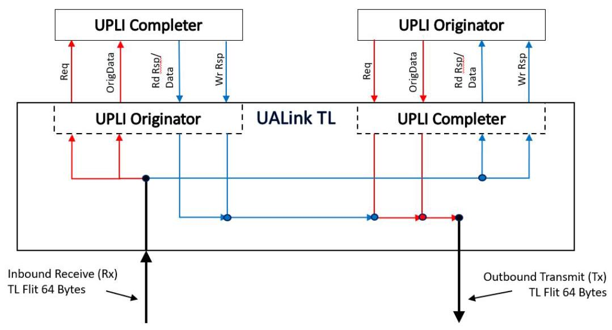
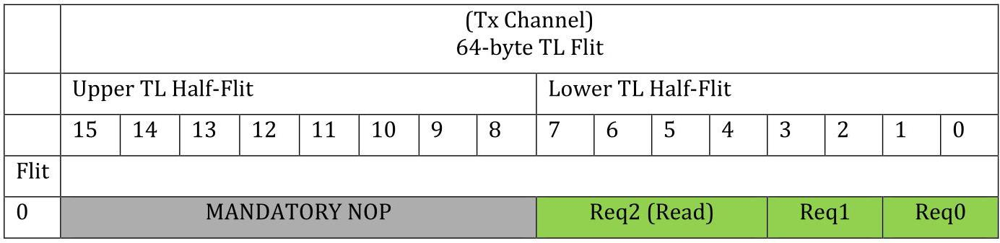
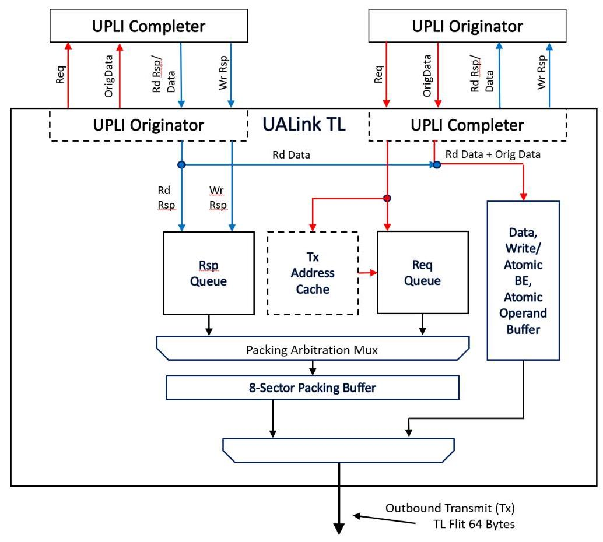
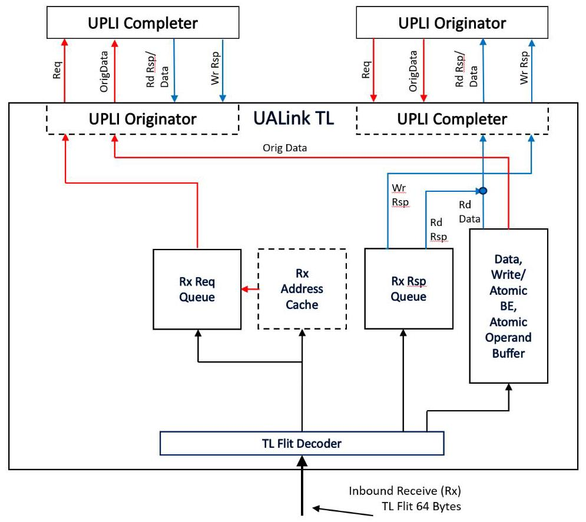
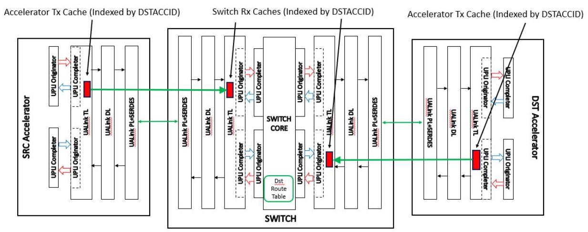
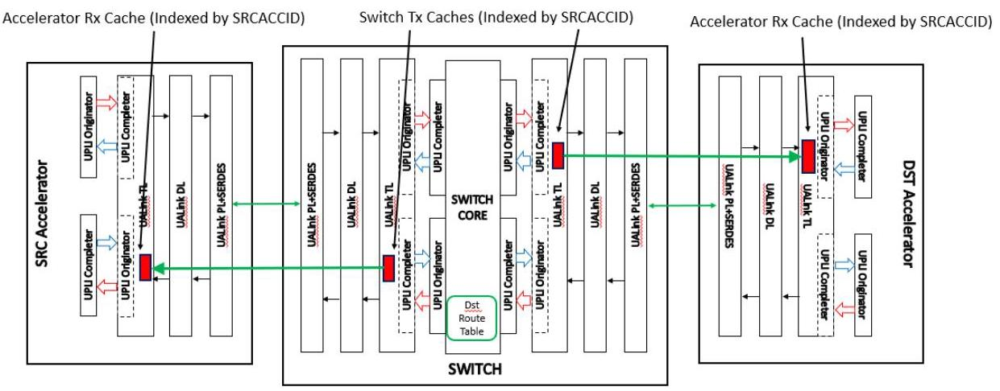
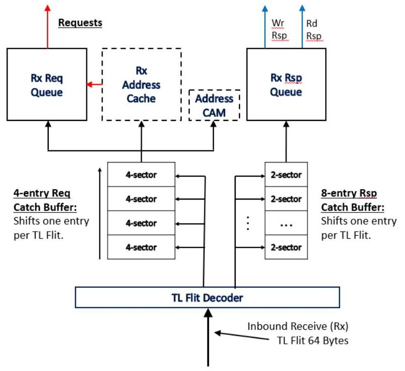
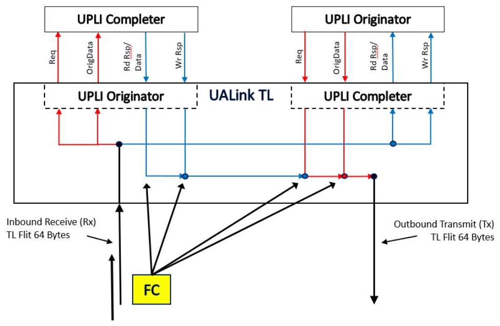

## 5 Transaction Layer (TL)

> 
## 5 事务层（TL）

本文档的主要主题是UALink协议的事务层（TL）规范。其解决的核心研究问题是如何高效、可靠地将UPLI接口节拍转换为TL微片，以在加速器之间传输，同时最大化带宽利用率。

关键论点和方法包括对TL微片和半微片格式的详细描述。文档介绍了一种64字节的TL微片结构，该结构分为控制半微片和数据半微片，并采用特定的排序逻辑，即非NOP控制半微片总是放置在下半部分。一项主要贡献是通过压缩请求和响应来提高链路效率的机制，该机制由可选的、同步的发送端和接收端地址缓存支持。该协议还定义了使用信用量进行流控制、通过“中毒数据”消息处理数据损坏，以及对请求和响应进行速率限制以防止接收端缓冲区溢出的方法。

从图示示例中得出的主要结论表明，对于WriteFull和Read事务，TL协议可实现最高95.24%的效率。当启用身份验证时，由于AuthTags半微片的开销，该最高效率下降6.35%，降至88.89%。该设计成功地在高吞吐量与必要的控制和协议管理开销之间取得了平衡。

The UALink Transaction Layer (TL Layer) is responsible for converting UPLI beats from the inbound (to the TL) channels from the two UPLI interfaces connected to the UALink TL into TL Flits on the outbound or Transmit (Tx) TL Flit Channel. The TL also converts TL Flits received from the inbound or Receive (Rx) TL Flit Channel into UPLI beats for the outbound (from the TL) UPLI channels on the two UPLI interfaces connected to the UALink TL.

> 
UALink 事务层（TL 层）负责将来自两个连接至 UALink TL 的 UPLI 接口的入站（流向 TL）通道的 UPLI 节拍，转换为出站或发送（Tx）TL Flit 通道上的 TL Flit。TL 还会将从入站或接收（Rx）TL Flit 通道收到的 TL Flit 转换为 UPLI 节拍，以供两个连接至 UALink TL 的 UPLI 接口的出站（自 TL 发出）的 UPLI 通道使用。

Figure 5-1: TL Flit connections to UPLI interfaces

> 
图5-1：TL Flit与UPLI接口的连接

The figure above, TL Flit connections to UPLI interfaces, schematically illustrates the connections between the various channels for the two UPLI interfaces attached to a UALink TL and their relationship to the Tx and Rx TL Flit Channels. Because of the symmetry of the interfaces, the format for both the Receive and Transmit Flits are the same. The 64-byte Transmit Flit and Receive Flit Channels each encode the information for a UPLI Request Channel, Originator Data Channel, Read Response/Data Channel, and Write Response Channel.

> 
上图，TL Flit 与 UPLI 接口的连接，示意性地展示了连接到 UALink TL 的两个 UPLI 接口的各通道之间的连接关系，以及它们与 Tx 和 Rx TL Flit 通道的关系。由于接口的对称性，接收和发送 Flit 的格式是相同的。64 字节的发送 Flit 和接收 Flit 通道分别对 UPLI 请求通道、发起方数据通道、读响应/数据通道和写响应通道的信息进行编码。

### 5.1 TL Flit and Half Flit formats

#### 5.1.1 TL Flit and TL Control and Data Half-Flit formats and Sequencing

Each 64-byte TL Flit is divided into an Upper and a Lower 32-byte Half-Flit and the 64-byte TL Flit is also divided into sixteen 4-byte Sectors numbered from the least-significant 4-byte sector in the TL Flit as shown below in Table 5-1: TL Flit organization:

> 
每个64字节的TL Flit被划分为一个高32字节Half-Flit和一个低32字节Half-Flit，同时该64字节TL Flit也被分为16个4字节扇区，这些扇区从TL Flit中最低有效4字节扇区开始编号，如下面的 Table 5-1: TL Flit organization 所示：

<table><tr><td colspan="16">64-byte TL Flit</td></tr><tr><td colspan="8">Upper TL Half-Flit</td><td colspan="8">Lower TL Half-Flit</td></tr><tr><td>15</td><td>14</td><td>13</td><td>12</td><td>11</td><td>10</td><td>9</td><td>8</td><td>7</td><td>6</td><td>5</td><td>4</td><td>3</td><td>2</td><td>1</td><td>0</td></tr></table>

Ultra Accelerator Link Consortium Inc. (UALink) - UALink_200 Rev 1.0 Specification

> 
Ultra Accelerator Link Consortium Inc. (UALink) - UALink_200 修订版 1.0 规范

## Table 5-1: TL Flit organization

A TL Half-Flit may be a Control Half-Flit, a Data Half-Flit, a Message Half-Flit, or an Authentication Tags (AuthTags) Half-Flit.

> 
一个 TL 半微片可以是控制半微片、数据半微片、消息半微片或认证标签（AuthTags）半微片。

The Control Half-Flit shall be used to encode the following information:

> 
控制半微片应用于编码以下信息：

- Requests (Reads, Writes, AtomicR, AtomicNR)

> 
- 请求（读取、写入、原子读取、原子非读取）

- Read Responses (but not the data associated with them - note that an AtomicR Request causes a Read Response)

> 
- 读取响应（但不包含与其关联的数据——注意，原子读取请求会引发读取响应）

- Write Responses (Note that an AtomicNR Request causes a Write Response).

> 
- 写响应（注意，AtomicNR 请求会引发写响应）。

- Flow Control/NOP information.

> 
- 流控制/NOP信息。

In the Control Half-Flit, Requests can be encoded in 4 or 2 sector fields, the Responses can be encoded in 2 or 1 sector Fields, and the Flow Control (FC) information and the NOP indications are each encoded using one sector. A special control Half-Flit called the NOP Half Flit consists of eight NOP indications. The alignment of Control Half-Flit fields shall be according to the table below:

> 
在控制半拍中，请求可编码为4或2个扇区字段，响应可编码为2或1个扇区字段，而流量控制（FC）信息和NOP指示则各使用一个扇区进行编码。一种称作NOP半拍的特殊控制半拍由八个NOP指示构成。控制半拍字段的对齐方式应遵循下表：

<table><tr><td>Field Type</td><td>Legal Sector Footprint</td></tr><tr><td>4 sector Request</td><td>7654 or 3210</td></tr><tr><td>2 sector Compressed Request</td><td>76 or 54 or 32 or 10</td></tr><tr><td>2 sector Response</td><td>76 or 54 or 32 or 10</td></tr><tr><td>1 sector Compressed Response</td><td>7 or 6 or 5 or 4 or 3 or 2 or 1 or 0</td></tr><tr><td>Flow Control/NOP Information</td><td>7 or 6 or 5 or 4 or 3 or 2 or 1 or 0</td></tr></table>

Table 5-2: Control Half Flit Field Footprints and Sizes

> 
表 5-2：控制半 Flit 字段占用与大小

Within the Control Half-Flit, the various field types, subject to the footprints and sizes indicated above, may be freely intermingled. Any unused sector in the Control Half-Flit shall be a NOP field.

> 
在控制半微片（Control Half-Flit）内，各种字段类型可根据上述占用空间和大小指示自由混合。控制半微片中任何未使用的扇区均应为 NOP 字段。

The Flow Control Field shall consist of four multi-bit signals:

> 
流控制字段应由四个多位信号组成：

- Request CMD: indicates Credits for Requests in TL Control Half-Flits.

> 
- 请求 CMD：在 TL 控制半 Flit 中指示请求的信用。

- Response CMD: indicates Credits for Read Responses (not the associated data) or Writes Responses.

> 
- 响应 CMD：表示读响应（而非关联数据）或写响应的信用量。

- Request Data: indicates Credits for 64-byte data buffers to hold data for TL Requests for Write, WriteFull, AtomicR/AtomicNR Operand Data, and UPLI Write Message UPLI Requests.

> 
- 请求数据：指示用于存放TL请求数据的64字节数据缓冲区的信用值，这些请求包括写入（Write）、完整写入（WriteFull）、原子操作带/不带返回数据（AtomicR/AtomicNR）的操作数数据，以及UPLI写入消息UPLI请求。

- Response Data: indicates Credits for 64-byte data buffers to hold data for TL Read Reponses.

> 
- 响应数据：指示用于TL读取响应的64字节数据缓冲区的Credit。

Each of these signals independently indicates a number of credits being returned and furthermore each signal independently indicates if the credits are Pool Credits or Credits associated with a specific Virtual Channel. While a Control Half-Flit may contain more than one Flow Control (FC) Field, only one Flow Control Field in the Control Half-Flit shall contain a non-zero number of Credits value for any Virtual Channel or Pool Credits for each of the above signals. This is intended to allow the logic updating credit values to logically OR the Credit count values in the various signals from all the FC sectors together when forming an update value for a specific Pool or Virtual Channel Credit type rather than having to logically ADD the differing count values together.

> 
这些信号中的每一个都独立地指示返回的信用数量，并且每个信号还独立地指示这些信用是池信用还是与特定虚拟通道关联的信用。虽然一个控制半微片（Control Half-Flit）可能包含多个流控制（FC）字段，但对于上述每个信号，该控制半微片中应当仅有一个流控制字段对于任何虚拟通道或池信用包含非零的信用数值。这样设计的目的是，允许信用值更新逻辑在为特定池或虚拟通道信用类型形成更新值时，将所有 FC 扇区中各个信号里的信用计数值进行逻辑“或”运算，而不是必须将不同的计数值进行逻辑“加”运算。

A Data Half-Flit is used to encode the following information:

> 
数据半切片用于编码以下信息：

- Read Response Data (Read and AtomicR operations)

> 
- 读响应数据（Read 与 AtomicR 操作）

Transaction Layer (TL)

> 
事务层（TL）

Ultra Accelerator Link Consortium Inc. (UALink) - UALink_200 Rev 1.0 Specification

> 
本文档的主要议题是UALink协议事务层（TL）的规范。其研究的核心问题在于：如何高效且可靠地将UPLI接口节拍转换为用于加速器间传输的TL Flit，同时最大化带宽利用率。  

关键的论点与方法包括对TL Flit与半Flit格式的详细描述。文档引入了一种64字节的TL Flit结构，该结构划分为控制半Flit与数据半Flit，并遵循特定的排序逻辑，即非NOP的控制半Flit始终放置于低半部分。一项主要贡献在于压缩请求与响应的机制，旨在提升链路效率，该机制通过可选的同步发送端与接收端地址缓存来支撑。协议还定义了使用信用进行流控制、通过“毒化数据”消息处理数据损坏，以及对请求与响应进行速率限制以防接收端缓冲区溢出等方法。  

基于示例图得出的主要结论表明，对于WriteFull与Read事务，TL协议实现了最高95.24%的效率。当启用认证时，由于AuthTags半Flit的开销，该最大效率会下降6.35%，降至88.89%。该设计成功地在高吞吐量与必要的控制及协议维护开销之间取得了平衡。

- Write Data (Write, WriteFull, UPLI Write Message, and AtomicNR operations)

> 
- 写数据（Write、WriteFull、UPLI Write Message 和 AtomicNR 操作）

- Byte Enables (Write and AtomicR/AtomicNR operations).

> 
- 字节使能（写操作和 AtomicR/AtomicNR 操作）

- Atomic Operand Data (AtomicR and AtomicNR operations),

> 
- 原子操作数数据（AtomicR 和 AtomicNR 操作），

A series of 32-byte Data Half-Flits shall be used to encode the data for a Read Response or a Write Request. Read Response Data and Write Data on the UPLI interface are 1, 2, 3 or 4 64-byte beats (64, 128, 196, 256 bytes in total) which are transferred in 2, 4, 6, or 8 32-byte TL Data Half-Flits that convey data in the same order as the UPLI beats, respectively, as shown in the examples below. For Write and Vendor Defined Commands that issue data beats on the UPLI OrigData Channel, a 32- byte Write Data Half-Flit containing the Byte Enables shall be appended to the end of the Data Half-Flits for the Request. For WriteFulls, no such Data Half-Flit shall be appended. A full 32-byte Half-Flit, capable of transferring byte enables for up to 256-byte transfers, shall be used regardless of the data transfer width. No effort is made to optimize the Byte Enable overhead for Writes or Vendor Defined Commands. WriteFulls, that do not require Byte Enables, are the overwhelmingly common use case.

> 
应使用一系列32字节的数据半分片（Data Half-Flit）来编码读响应或写请求的数据。UPLI接口上的读响应数据和写数据为1、2、3或4个64字节节拍（总计64、128、196、256字节），分别以2、4、6或8个32字节的TL数据半分片传输，这些半分片承载数据的顺序与UPLI节拍相同，如下方示例所示。对于在UPLI OrigData通道上发出数据节拍的写命令和供应商自定义命令，一个包含字节使能的32字节写数据半分片应被附加到该请求的数据半分片末尾。对于WriteFull，不应附加此类数据半分片。一个完整的32字节半分片，能够传输最多256字节传输的字节使能，无论数据传输宽度如何都将被使用。不会为写命令或供应商自定义命令优化字节使能开销。不需要字节使能的WriteFull是压倒性地常见的用例。

Atomic Operands and Byte Enables for both AtomicR and AtomicNR operations are transferred on the UPLI interface in a single 64-byte data beat on the UPLI OrigData Channel which shall then be encoded into three consecutive 32-byte TL Data Half-Flits. The first two 32-byte TL Data Half-Flits shall be the Operand Data and the third TL Data Half Flit shall contain the Byte Enables for the Atomic. The Operands for an Atomic shall be aligned in the two 32-byte TL Data Half-Flits in the same manner as the Operand Data is aligned on the UPLI OrigData Channel. The Byte Enables shall be aligned within the 32-byte Half-Flit according to the bytes within the 256-byte memory block that the Atomic is altering (e.g. the byte enables for a 64-byte Atomic at address 128 would occupy bytes 16 through 23 in the Data Half-Flit). The Read Response Data for an AtomicR shall be transferred as two ascending 32-byte TL Data Half-Flits for both OP1 and OP1/OP2 AtomicR operations.

> 
对于 AtomicR 和 AtomicNR 两种操作的原子操作数及字节使能，均通过 UPLI 接口的 UPLI OrigData 通道以单个 64 字节数据拍进行传输，并随后编码为三个连续的 32 字节 TL 数据半片（Half-Flit）。前两个 32 字节 TL 数据半片应为操作数数据，第三个 TL 数据半片则包含该原子操作的字节使能。原子操作的操作数在两个 32 字节 TL 数据半片中的对齐方式，应与操作数数据在 UPLI OrigData 通道上的对齐方式一致。字节使能在 32 字节半片中的对齐，应根据原子操作所修改的 256 字节内存块内的字节进行（例如，地址 128 处一个 64 字节原子操作的字节使能，将占用该数据半片中的第 16 至 23 字节）。对于 OP1 和 OP1/OP2 类型的 AtomicR 操作，其读取响应数据均以两个升序的 32 字节 TL 数据半片形式传输。

An Authentication Tags (AuthTags) Half-Flit shall be used to convey up to four 8-byte Authentication Tags, one for each of the, up to total of four, Requests, Read Responses, or Write Responses in a Control Half-Flit when the TL channel is operating in a security mode that enables Authentication or Encryption. When an Authentication Tag is unused in an AuthTags Half-Flit it shall be set to a value of zero. See the Security Section for details on how Authentication and/or Encryption is enabled and how Authentication Tags are generated. A given TL Channel shall either have Authentication enabled for all the traffic within the TL Channel or none of the traffic in the TL Channel.

> 
验证标签（AuthTags）半微片应用于传送最多四个8字节验证标签，当TL通道运行在启用验证或加密的安全模式时，每个标签对应控制半微片中的至多四个请求、读响应或写响应中的一个。当AuthTags半微片中的某个验证标签未被使用时，应将其置为零值。关于如何启用验证和/或加密以及如何生成验证标签的详细信息，请参阅安全章节。一个给定的TL通道必须要么为该通道内的所有流量启用验证，要么完全不启用。

The determination of whether a given Half Flit is a Control Half-Flit, a Data Half-Flit, or an AuthTags Half-Flit is not indicated within the Half-Flit itself but instead shall be inferred from the sequencing of the Half-Flits on the interface.

> 
判断某个半微片是控制半微片、数据半微片还是 AuthTags 半微片，并非由该半微片自身指示，而是应根据接口上半微片的顺序推断得出。

In the mode where Authentication is disabled, the first Half-Flit (in the Lower TL Half-Flit) shall be interpreted as a Control Half-Flit. If this Control Half Flit calls for Data Half-Flits (contains a Read Response Field, Write Request Field, UPLI Write Message, Vendor Defined Command that issues data beats on the UPLI OrigData Channel or AtomicR/AtomicNR Request Field: these will be referred to hereafter as "Data Request Fields"), the subsequent Half-Flits shall be interpreted as Data Half-Flits until the appropriate number of Half-Flits have occurred to satisfy the Data Request Fields in the Control Half-Flit (unless the final Data Half-Flit called for occurs in the lower Half-Flit). The order of the data Half-Flits shall correspond to the order for the Data Request Fields in the Control Half-Flit starting with the low order (lowest numbered sector) Data Request Field and then following though the remaining Data Request Field(s) in ascending order.

> 
在禁用认证的模式下，第一个半微片（位于低位TL半微片）应被解释为控制半微片。若该控制半微片要求数据半微片（包含读取响应字段、写入请求字段、UPLI写消息、在UPLI OrigData通道上发出数据节拍的厂商定义命令或AtomicR/AtomicNR请求字段：下文将统称为“数据请求字段”），则后续的半微片应被解释为数据半微片，直到出现适当数量的半微片以满足控制半微片中的数据请求字段（除非所要求的最后一个数据半微片出现在低位半微片中）。数据半微片的顺序应与控制半微片中数据请求字段的顺序相对应，从低序（编号最低的扇区）数据请求字段开始，然后按升序依次处理其余的数据请求字段。

If the final Data Half-Flit implied by a Control Half-Flit would occur in a lower Half-Flit in the TL Flit, that final Data Half-Flit shall be "swapped" into the upper Half-Flit in the TL Flit and the lower Half-Flit shall be interpreted as the next Control Half-Flit. This "swapping" causes the non-NOP Control Half-Flit, if present, to always be in the lower Half-Flit of the overall TL Flit.

> 
如果由控制半切片所隐含的最终数据半切片将出现在TL流控制单元的低位半切片中，则该最终数据半切片应被“交换”到TL流控制单元的高位半切片中，而低位半切片应被解释为下一个控制半切片。这种“交换”使得非NOP控制半切片（如果存在）始终位于整个TL流控制单元的低位半切片中。

More generally, a TL Flit may only contain one non-NOP Control Half-Flit and that non-NOP Control Half-Flit shall be in the lower TL Half-Flit. Therefore, if the lower Half-Flit of a TL Flit is a non-NOP Control Half-Flit that does not imply subsequent Data Half-Flits, the upper Flit shall be a NOP Control Half-Flit (when Authentication is disabled). When a NOP Control Half-Flit is required by the TL protocol, as in this case, the NOP Half-Flit is referred to as a MANDATORY NOP Half-Flit. These restrictions on the number and placement of non-NOP Control Half-Flits significantly reduce complexity in the decoder logic and the catch buffer logic (described below in 5.7).

> 
更一般地说，一个 TL Flit 仅能包含一个非 NOP 的控制半 Flit，且该非 NOP 控制半 Flit 必须位于低位的 TL 半 Flit 中。因此，若一个 TL Flit 的低位半 Flit 是一个不暗示后续有数据半 Flit 的非 NOP 控制半 Flit，则高位 Flit 必须是一个 NOP 控制半 Flit（当认证功能禁用时）。当 TL 协议要求一个 NOP 控制半 Flit 时，如此处的情况，该 NOP 半 Flit 被称为强制（MANDATORY）NOP 半 Flit。这些对非 NOP 控制半 Flit 数量和位置的限制，显著降低了解码器逻辑与捕获缓冲逻辑（将在下文 5.7 节描述）的复杂度。

If Authentication is enabled, the TL Half-Flit immediately following a TL Control Half-Flit that contains Requests or Responses shall be an AuthTags Half-Flit containing the Authentication Tags for the Requests and Responses in the TL Control Half-Flit. The Control Half-Flit and its corresponding AuthTag Half-Flit shall always occur in the same TL Flit.

> 
如果启用了认证，则紧跟在包含请求或响应的 TL 控制半微片之后的 TL 半微片应为一个 AuthTags 半微片，其中包含该 TL 控制半微片内请求和响应的认证标签。该控制半微片及其对应的 AuthTag 半微片应始终位于同一个 TL 微片中。

However, in Authentication mode if the final Data Half-Flit implied by the most recent Control Half-Flit is swapped into the upper Half-Flit as described above, the Control Half-Flit in the lower Half-Flit shall only contain Flow Control or NOPs Fields. The upper Half-Flit of this "swapped" Flit is already occupied by the trailing Data Half-Flit and therefore the AuthTags Flit cannot be put there. Any pending Requests or Responses may be placed in the Control Half-Flit in the next (or a subsequent) TL Flit.

> 
然而，在认证模式下，如果由最近的控制半微片所隐含的最终数据半微片如上文所述被交换到上半微片，则下半微片中的控制半微片应仅包含流控制或空操作字段。此“被交换的”微片的上半微片已被尾随的数据半微片占用，因此无法将认证标签微片放置于此。任何待处理的请求或响应可放置在下一个（或后续的）TL微片中的控制半微片内。

Because an AuthTags Half-Flit cannot contain more than four Authentication Tags, in Authentication mode, the non-NOP Control Half-Flit shall be limited to having a total of at most four Requests, Read Responses, and/or Write Responses.

> 
由于一个 AuthTags Half-Flit 最多只能包含四个认证标签，在认证模式下，非 NOP 控制 Half-Flit 应限制为总共最多包含四个请求、读取响应和/或写入响应。

The order of the Authentication Tags in the AuthTags Half-Flit shall follow the order of the Requests and Responses in the control Half-Flit. That is, the low-order AuthTag corresponds to the lower-order Request or Response and so on through the Control Half-Flit and AuthTags Half-Flit. If any Authorization Tags in the AuthTags Half-Flit are not used, they shall be set to zero.

> 
AuthTags Half-Flit 中认证标签的顺序应遵循控制 Half-Flit 中请求和响应的顺序。即，低位的认证标签对应于较低位的请求或响应，依此类推贯穿控制 Half-Flit 和 AuthTags Half-Flit。如果 AuthTags Half-Flit 中的任何授权标签未被使用，应将其置为零。

#### 5.1.2 TL Message Flit Format and Sequencing

In addition to the two 32-byte Half-Flits in a TL Flit, a one-bit Message Indicator shall be included for each of the two Half-Flits as shown below (M1 for the Upper TL Half-Flit and M0 for the Lower TL Half-Flit):

> 
除了 TL 微片中的两个 32 字节半微片之外，还应为每个半微片包含一个一位消息指示符，如下所示（M1 用于上半 TL 半微片，M0 用于下半 TL 半微片）：

<table><tr><td colspan="18">64-byte TL Flit</td></tr><tr><td>Msg</td><td colspan="8">Upper TL Half-Flit 32bytes</td><td>Msg</td><td colspan="8">Lower TL Half-Flit 32 bytes</td></tr><tr><td>M1</td><td>15</td><td>14</td><td>13</td><td>12</td><td>11</td><td>10</td><td>9</td><td>8</td><td>M0</td><td>7</td><td>6</td><td>5</td><td>4</td><td>3</td><td>2</td><td>1</td><td>0</td></tr></table>

## Ultra Accelerator Link Consortium Inc. (UALink) - UALink_200 Rev 1.0 Specification

Table 5-3: TL Flit with Message Indicator Bits

> 
表 5-3：带消息指示位的 TL Flit

When the Message Indicator is b'1', a TL Half-Flit is interpreted as a Message TL Half-Flit as shown below in Table 5-4: Message TL Half-Flit:

> 
当消息指示符为 b'1' 时，TL 半片被解释为消息 TL 半片，如下表 5-4 所示：消息 TL 半片：

<table><tr><td>Msg</td><td>32-byte TL Half-Flit</td><td></td></tr><tr><td>Msg Indicator Bit (M1/M0)</td><td>31-byte Message Specific Payload</td><td>1-byte Msg Type</td></tr></table>

Table 5-4: Message TL Half-Flit

> 
表 5-4：消息 TL Half-Flit

If the Msg Indication Bit is set to b'1', the low order byte (not sector) of the 32-byte TL Half-Flit shall be interpreted as a Msg Type indication allowing for 256 distinct message types. The remaining 31 bytes in the TL Half Flit are the Message Specific Payload.

> 
如果消息指示位设置为 b'1'，则 32 字节 TL Half-Flit 的低位字节（而非扇区）应被解释为消息类型指示，允许有 256 种不同的消息类型。TL Half Flit 中剩余的 31 字节为消息特定有效载荷。

When a TL Message Half-Flit occurs in the stream of TL Flits the sequencing of the Half-Flits shall be delayed for any inserted TL Message Half-Flits with two exceptions.

> 
当 TL 消息半微片出现在 TL 微片流中时，半微片的顺序应因任何插入的 TL 消息半微片而延迟，但有两种例外情况。

The first exception is when an implementation chooses to have a TL Message Flit in the Lower Half-Flit of the TL Flit that would have otherwise been a Control Half-Flit. In this case, the Control Half-Flit that would otherwise have been in that lower Half-Flit cannot be delayed into the upper Half-Flit. The Upper Half-Flit will either be another TL Message Flit, a MANDATORY NOP TL Half-Flit, or be the final Data-Half Flit from the immediately preceding Control Half-Flit that implied Data Half-Flits that is being swapped into the upper Half-Flit.

> 
第一种例外是，当实现选择将一个本应是控制半微片（Control Half-Flit）的 TL 微片（TL Flit）的低半微片（Lower Half-Flit）放置 TL 消息微片（TL Message Flit）时。在这种情况下，原本应位于该低半微片的控制半微片不能延迟到上半微片（Upper Half-Flit）中。上半微片将是另一个 TL 消息微片、一个强制 NOP TL 半微片（MANDATORY NOP TL Half-Flit），或者是紧邻的前一个控制半微片所暗示的数据半微片（Data-Half Flit）中的最后一个数据半微片，该数据半微片正被交换到上半微片。

The second exception is a "Data Poisoned" TL Message Half-Flit that is used to indicate corrupt Data Half-Flits. As explained below in 5.3, rather than delaying the TL Half-Flits, the Data Poisoned TL Message Half-Flit instead indicates the poisoned Half-Flit by replacing the Data Half-Flit that is corrupted. Data Poisoned TL Message Half-Flit's are only legal in TL Half-Flits that would otherwise have been Data Half-Flits delivering data or Atomic Operands (but not Byte Enables).

> 
第二个例外是用于指示损坏的数据半微片的“数据中毒”TL消息半微片。如下文5.3节所述，数据中毒TL消息半微片并非延迟TL半微片，而是通过替换损坏的数据半微片来指示中毒的半微片。数据中毒TL消息半微片仅允许出现在原本为传输数据或原子操作数（但不包括字节使能）的数据半微片的位置。

When Authentication is enabled, a TL Message Half-Flit shall not replace an AuthTags TL Half-Flit.

> 
当启用认证时，TL 消息半微片不得替换 AuthTags TL 半微片。

### 5.2 TL Flit Sequencing and Packing Examples

In the Flit Sequence examples shown below, the examples are constructed in a way that the lower TL Half Flit in the TL Flit immediately after the last illustrated TL Flit will be interpreted as a Control Half-Flit (i.e. the examples stop when the next Control Half-Flit would occur).

> 
在下面展示的 Flit 序列示例中，示例的构造方式使得最后一个图示 TL Flit 之后紧跟的 TL Flit 中的低半 TL Half Flit 会被解释为控制半 Flit（即，示例在下一个控制半 Flit 将要出现时停止）。

The following example, Table 5-5, illustrates a single 4-sector Read Request Followed by the Mandatory NOP Half Flit (a Control Half-Flit that consists of only NOPs and is required to be present in the given TL Half-Flit for protocol reasons, as opposed to a Control Half-Flit that also consists only of NOPs, but could have contained Requests, Responses, or Flow Control Fields).

> 
以下示例（表 5-5）展示了一个4扇区读取请求，后跟强制NOP半微片（一种仅由NOP组成且因协议要求必须出现在指定TL半微片中的控制半微片，与之相对的是另一种同样仅由NOP组成但本可包含请求、响应或流控制字段的控制半微片）。

<table><tr><td></td><td colspan="16">64-byte TL Flit</td></tr><tr><td></td><td colspan="8">Upper TL Half-Flit</td><td colspan="8">Lower TL Half-Flit</td></tr><tr><td></td><td>15</td><td>14</td><td>13</td><td>12</td><td>11</td><td>10</td><td>9</td><td>8</td><td>7</td><td>6</td><td>5</td><td>4</td><td>3</td><td>2</td><td>1</td><td>0</td></tr><tr><td>Flit</td><td colspan="16"></td></tr><tr><td>0</td><td colspan="8">MANDATORY NOP</td><td colspan="4">Req0 (Read)</td><td>NOP</td><td>NOP</td><td>NOP</td><td>NOP</td></tr></table>

Table 5-5: An 8-sector Request (Read) followed by a Mandatory NOP Half Flit.

> 
表 5-5：一个 8 扇区请求（读）后跟一个强制 NOP 半 Flit

The following example, Table 5-6, illustrates a 4-sector 256-byte WriteFull request. As a WriteFull Request, no byte enables need to be appended to the Data Half-Flits. The last Data Half-Flit is swapped to the upper TL Half-Flit and the next Control Half Flit is placed in the lower TL Half-Flit of the final TL Flit. The Control Half-Flit is shown (arbitrarily) containing a Flow Control (FC) indicator in sector 3.

> 
以下示例（表5-6）展示了一个4扇区256字节的WriteFull请求。作为一个WriteFull请求，无需向数据Half-Flit附加字节使能。最后一个数据Half-Flit被交换到上层TL Half-Flit，而下一个控制Half-Flit则被置于最终TL Flit的下层TL Half-Flit中。该控制Half-Flit（任意地）显示在扇区3中包含一个流控制（FC）指示符。

<table><tr><td></td><td colspan="16">64-byte TL Flit</td></tr><tr><td></td><td colspan="8">Upper TL Half-Flit</td><td colspan="8">Lower TL Half-Flit</td></tr><tr><td></td><td>15</td><td>14</td><td>13</td><td>12</td><td>11</td><td>10</td><td>9</td><td>8</td><td>7</td><td>6</td><td>5</td><td>4</td><td>3</td><td>2</td><td>1</td><td>0</td></tr><tr><td>Flit</td><td colspan="16"></td></tr><tr><td>0</td><td colspan="8">Req0.Data.0</td><td colspan="4">Req0 (WriteFull)</td><td>NOP</td><td>NOP</td><td>NOP</td><td>NOP</td></tr><tr><td>1</td><td colspan="8">Req0.Data.2</td><td colspan="8">Req0.Data.1</td></tr><tr><td>2</td><td colspan="8">Req0.Data.4</td><td colspan="8">Req0.Data.3</td></tr><tr><td>3</td><td colspan="8">Req0.Data.6</td><td colspan="8">Req0.Data.5</td></tr><tr><td>4</td><td colspan="8">Req0.Data.7</td><td>NOP</td><td>NOP</td><td>NOP</td><td>NO</td><td>FC</td><td>NOP</td><td>NOP</td><td>NOP</td></tr></table>

Table 5-6: A 4 sector Request (WriteFull 256 bytes) followed by a Control Half Flit with Flow Control.

> 
表5-6：一个4扇区请求（WriteFull 256字节）后跟一个带流控制的控制半Flit。

The following example, Table 5-7, illustrates a 4-sector 192-byte Write request. As a Write Request, a byte enable Data Half-Flit is appended to the end of the Data Half-Flits conveying the data for the Write.

> 
下面的示例，表 5-7，展示了一个 4 扇区 192 字节的写请求。作为写请求，一个字节使能数据半微片被附加到传递写数据的数据半微片末尾。

<table><tr><td></td><td colspan="15">64-byte TL Flit</td></tr><tr><td></td><td colspan="7">Upper TL Half-Flit</td><td colspan="8">Lower TL Half-Flit</td></tr><tr><td></td><td>15 14</td><td>13</td><td>12</td><td>11</td><td>10</td><td>9</td><td>8</td><td>7</td><td>6</td><td>5</td><td>4</td><td>3</td><td>2</td><td>1</td><td>0</td></tr><tr><td>Flit</td><td colspan="15"></td></tr><tr><td>0</td><td colspan="7">Req0.Data.0</td><td>NOP</td><td>NOP</td><td>NOP</td><td>NOP</td><td colspan="4">Req0(Write)</td></tr><tr><td>1</td><td colspan="7">Req0.Data.2</td><td colspan="8">Req0.Data.1</td></tr><tr><td>2</td><td colspan="7">Req0.Data.4</td><td colspan="8">Req0.Data.3</td></tr><tr><td>3</td><td colspan="7">Req0.ByteEnables</td><td colspan="8">Req0.Data.5</td></tr></table>

Table 5-7: A 4 sector Request (Write 192 bytes) followed by a Control Half Flit with Flow Control

> 
表格 5-7：一个4扇区请求（写入192字节），后跟一个带流量控制的控制半微片

The following example, Table 5-8, illustrates a 2-sector 64-byte Write request (Req0) which will require byte enables, a NOP (sector 2), a Flow Control (FC) indication (sector 3), and finally a 4- sector AtomicR request. The first two Half-Flits control the Req0 data, followed by the Byte Enables for Req0. The next Half-Flits contain the Operands for the Req1 Atomic. The Byte Enables for the Req1 Atomic are swapped into the upper TL Half-Flit and the Control Half-Flit in the lower TL Half Flit illustrates multiple Flow Control Fields in a single Control Half-Flit.

> 
以下示例表5-8展示了一个包含2个扇区的64字节写请求（Req0），它需要字节使能、一个NOP（扇区2）、一个流控（FC）指示（扇区3），最后是一个4扇区的AtomicR请求。前两个半Flit控制Req0数据，随后是Req0的字节使能。接下来的半Flit包含Req1 Atomic的操作数。Req1 Atomic的字节使能被交换到上部的TL半Flit中，而下部TL半Flit中的控制半Flit展示了单个控制半Flit中的多个流控字段。

<table><tr><td></td><td colspan="15">64-byte TL Flit</td></tr><tr><td></td><td colspan="7">Upper TL Half-Flit</td><td colspan="8">Lower TL Half-Flit</td></tr><tr><td></td><td>15 14</td><td>13</td><td>12</td><td>11</td><td>10</td><td>9</td><td>8</td><td>7</td><td>6</td><td>5</td><td>4</td><td>3</td><td>2</td><td>1</td><td>0</td></tr><tr><td>Flit</td><td colspan="15"></td></tr><tr><td>0</td><td colspan="7">Req0.Data.0</td><td colspan="4">Req1 (AtomicR)</td><td>FC</td><td>NOP</td><td colspan="2">Req0</td></tr><tr><td>1</td><td colspan="7">Req0.ByteEnables</td><td colspan="8">Req0.Data.1</td></tr><tr><td>2</td><td colspan="7">Req1.AtomicOperands.1</td><td colspan="8">Req1.AtomicOperands.0</td></tr><tr><td></td><td colspan="7">Req1.AtomicByteEnables</td><td>NOP</td><td>NOP</td><td>FC</td><td>NOP</td><td>FC</td><td>FC</td><td>NOP</td><td>NOP</td></tr></table>

Table 5-8: A 2-sector Request (64 byte write), NOP, FC, and 4-sector AtomicR request

> 
表 5-8：一个 2 扇区请求（64 字节写操作）、NOP、FC 以及一个 4 扇区 AtomicR 请求

The following example, Table 5-9, illustrates a 4-sector AtomicNR Req0, and a 4-sector AtomicR request. Req1. Req0 and Req1 each requires two TL Half-Flits to convey the Operands and one TL Half-Flitt to convey the Byte Enables. The Req1 Atomic Byte Enables are swapped into the upper TL Half-Flit.

> 
以下示例表 5-9 展示了一个 4 扇区 AtomicNR Req0 和一个 4 扇区 AtomicR 请求 Req1。Req0 和 Req1 各需要两个 TL Half-Flit 来传送操作数，以及一个 TL Half-Flit 来传送字节使能。Req1 的原子字节使能被交换到了上方的 TL Half-Flit 中。

<table><tr><td></td><td colspan="15">64-byte TL Flit</td></tr><tr><td></td><td colspan="7">Upper TL Half-Flit</td><td colspan="8">Lower TL Half-Flit</td></tr><tr><td></td><td>15 14</td><td>13</td><td>12</td><td>11</td><td>10</td><td>9</td><td>8</td><td>7</td><td>6</td><td>5</td><td>4</td><td>3</td><td>2</td><td>1</td><td>0</td></tr><tr><td>Flit</td><td colspan="15"></td></tr><tr><td>0</td><td colspan="7">Req0.AtomicOperands.0</td><td colspan="4">Req1 (AtomicR)</td><td colspan="4">Req0 (AtomicNR)</td></tr><tr><td>1</td><td colspan="7">Req0.AtomicByteEnables</td><td colspan="8">Req0.AtomicOperands.1</td></tr><tr><td>2</td><td colspan="7">Req1.AtomicOperands.1</td><td colspan="8">Req1.AtomicOperands.0</td></tr><tr><td></td><td colspan="7">Req1.AtomicByteEnables</td><td>NOP</td><td>NOP</td><td>NOP</td><td>NOP</td><td>NOP</td><td>NOP</td><td>NOP</td><td>NOP</td></tr></table>

Table 5-9: A 2-sector Request (64 byte write), NOP, FC, and 4-sector AtomicR request

> 
表 5-9：一个 2 扇区请求（64 字节写入）、NOP、FC 和 4 扇区 AtomicR 请求

The following example, Table 5-10, illustrates a 2-sector 256-byte Write request (Req0 which will require byte enables), a 256-byte WriteFull request (Req1 which will not require byte enables), and finally, a 4-sector AtomicNR Request (Req2). The last Data Half-Flits called for by the Control Half-Flit is swapped into the upper Half-Flit in the final TL Flit and the lower Half-Flit is shown containing a Flow Control Field.

> 
以下示例表 5-10 展示了一个 2 扇区 256 字节写入请求（Req0，将需要字节使能）、一个 256 字节 WriteFull 请求（Req1，不需要字节使能），以及最后的一个 4 扇区 AtomicNR 请求（Req2）。由控制半微片调用的最后一个数据半微片在最终 TL 微片中被交换到上半微片，下半微片显示包含一个流控字段。

<table><tr><td></td><td colspan="14">64-byte TL Flit</td></tr><tr><td></td><td colspan="6">Upper TL Half-Flit</td><td colspan="8">Lower TL Half-Flit</td></tr><tr><td></td><td>15 14</td><td>13</td><td>12</td><td>11</td><td>10</td><td>9 8</td><td>7</td><td>6</td><td>5</td><td>4</td><td>3</td><td>2</td><td>1</td><td>0</td></tr><tr><td>Flit</td><td colspan="14"></td></tr><tr><td>0</td><td colspan="6">Req0.Data.0</td><td colspan="4">Req2 (AtomicNR)</td><td colspan="2">Req1</td><td colspan="2">Req0</td></tr><tr><td>1</td><td colspan="6">Req0.Data.2</td><td colspan="8">Req0.Data.1</td></tr><tr><td>2</td><td colspan="6">Req0.Data.4</td><td colspan="8">Req0.Data.3</td></tr><tr><td>3</td><td colspan="6">Req0.Data.6</td><td colspan="8">Req0.Data.5</td></tr><tr><td>4</td><td colspan="6">Req0.ByteEnables</td><td colspan="8">Req1.Data.0</td></tr><tr><td>5</td><td colspan="6">Req1.Data.1</td><td colspan="8">Req1.Data.0</td></tr><tr><td>6</td><td colspan="6">Req1.Data.5</td><td colspan="8">Req1.Data.2</td></tr><tr><td>7</td><td colspan="6">Req1.Data.5</td><td colspan="8">Req1.Data.4</td></tr><tr><td>8</td><td colspan="6">Req1.Data.7</td><td colspan="8">Req1.Data.6</td></tr><tr><td>9</td><td colspan="6">Req2.AtomicOperands.1</td><td colspan="8">Req2.AtomicOperands.0</td></tr><tr><td>10</td><td colspan="6">Req2.AtomicByteEnables</td><td>FC</td><td>NOP</td><td>NOP</td><td>NOP</td><td>NOP</td><td>NOP</td><td>NOP</td><td>NOP</td></tr></table>

Table 5-10: A 2-sector Request (256 byte write), 2-sector Request (256-byte WriteFull), and a 4-sector AtomicNR

> 
表5-10：一个2扇区请求（256字节写入）、一个2扇区请求（256字节WriteFull）以及一个4扇区AtomicNR

The following example, Table 5-11, illustrates an example with Authentication enabled. The AuthTags Half-Flit is shown with Authentication Tags (AuthTag0, AuthTag1, AuthTag2) for the three Requests (two WriteFulls and an AtomicNR) in the Lower TL Half-Flit and the final AuthTag

> 
以下示例，表5-11，展示了启用Authentication的一个示例。AuthTags半Flit显示了针对三个请求（两个WriteFull和一个AtomicNR）的Authentication标签（AuthTag0、AuthTag1、AuthTag2），位于下半部分的TL半Flit中，以及最终的AuthTag

Ultra Accelerator Link Consortium Inc. (UALink) - UALink_200 Rev 1.0 Specification

> 
超级加速器链接联盟公司（UALink）— UALink_200 规范 1.0 版

has a value of '0'. The final Data Half-Flit called out by the Control Half-Flit is swapped into the upper Half-Flit in Flit 10.

> 
值为'0'。由控制半微片调出的最终数据半微片被交换到微片10中的上半微片。

<table><tr><td></td><td colspan="16">64-byte TL Flit</td></tr><tr><td></td><td colspan="8">Upper TL Half-Flit</td><td colspan="8">Lower TL Half-Flit</td></tr><tr><td></td><td>15</td><td>14</td><td>13</td><td>12</td><td>11</td><td>10</td><td>9</td><td>8</td><td>7</td><td>6</td><td>5</td><td>4</td><td>3</td><td>2</td><td>1</td><td>0</td></tr><tr><td>Flit</td><td colspan="16"></td></tr><tr><td>0</td><td colspan="2">0</td><td colspan="2">AuthTag2</td><td colspan="2">AuthTag1</td><td colspan="2">AuthTag0</td><td colspan="4">Req2 (AtomicNR)</td><td colspan="2">Req1</td><td colspan="2">Req0</td></tr><tr><td>1</td><td colspan="8">Req0.Data.1</td><td colspan="8">Req0.Data.0</td></tr><tr><td>2</td><td colspan="8">Req0.Data.3</td><td colspan="8">Req0.Data.2</td></tr><tr><td>3</td><td colspan="8">Req0.Data.5</td><td colspan="8">Req0.Data.4</td></tr><tr><td>4</td><td colspan="8">Req0.Data.7</td><td colspan="8">Req0.Data.6</td></tr><tr><td>5</td><td colspan="8">Req1.Data.1</td><td colspan="8">Req1.Data.0</td></tr><tr><td>6</td><td colspan="8">Req1.Data.3</td><td colspan="8">Req1.Data.2</td></tr><tr><td>7</td><td colspan="8">Req1.Data.5</td><td colspan="8">Req1.Data.4</td></tr><tr><td>8</td><td colspan="8">Req1.Data.7</td><td colspan="8">Req2.AtomicOperands.0</td></tr><tr><td>9</td><td colspan="8">Req2.AtomicOperands.1</td><td colspan="8">Req2.AtomicOperands.0</td></tr><tr><td>10</td><td colspan="8">Req2.AtomicByteEnables</td><td>NOP</td><td>NOP</td><td>FC</td><td>NOP</td><td>FC</td><td>FC</td><td>NOP</td><td>NOP</td></tr></table>

Table 5-11: Authentication mode example matching the prior example.

> 
表5-11：与先前示例匹配的认证模式示例。

The following example, Table 5-12, illustrates a single 4-sector Read Request and two 2-sector Compressed Read Requests each accessing 128 bytes on the Tx TL Channel and the subsequent Mandatory NOP Half Flit followed by the corresponding Read Responses and data on the Rx Channel for the TL which occur later in time.

> 
下面的示例，表5-12，展示了在Tx TL通道上的一个4扇区读请求和两个各访问128字节的2扇区压缩读请求，以及随后的强制NOP半Flit，随后是稍后在时间上发生的TL的Rx通道上相应的读响应和数据。

<table><tr><td></td><td colspan="15">(Rx Channel) 64-byte TL Flit</td></tr><tr><td></td><td colspan="7">Upper TL Half-Flit</td><td colspan="8">Lower TL Half-Flit</td></tr><tr><td></td><td>15 14</td><td>13</td><td>12</td><td>11</td><td>10</td><td>9</td><td>8</td><td>7</td><td>6</td><td>5</td><td>4</td><td>3</td><td>2</td><td>1</td><td>0</td></tr><tr><td>Flit</td><td colspan="15"></td></tr><tr><td>0</td><td colspan="7">Rsp0.Data.0</td><td colspan="2">RdRsp1</td><td colspan="2">RdRsp2</td><td>NOP</td><td>CRR 0</td><td>NOP</td><td>NOP</td></tr><tr><td>1</td><td colspan="7">Rsp0.Data.2</td><td colspan="8">Rsp0.Data.1</td></tr><tr><td>2</td><td colspan="7">Rsp2.Data.0</td><td colspan="8">Rsp0.Data.3</td></tr><tr><td>3</td><td colspan="7">Rsp2.Data.2</td><td colspan="8">Rsp2.Data.1</td></tr><tr><td>4</td><td colspan="7">Rsp1.Data.0</td><td colspan="8">Rsp2.Data.3</td></tr><tr><td>5</td><td colspan="7">Rsp1.Data.2</td><td colspan="8">Rsp1.Data.1</td></tr><tr><td>6</td><td colspan="7">Rsp1.Data.3</td><td>NOP</td><td>NOP</td><td>NOP</td><td>NOP</td><td>NOP</td><td>NOP</td><td>NOP</td><td>NOP</td></tr></table>

Table 5-12: Read Requests and Associated Read Responses.

> 
表 5-12：读请求及关联的读响应。

### 5.3 Indicating Data Corruption in TL Data Half-Flits.

When an error occurs on a UPLI Data Beat (either a Read Response Data Beat or an Originator Data Beat as indicated by the UPLI RdRspDataError or UPLI OrigDataError signal) any subsequent TL Data Half-Flit carrying that data shall indicate that the Data Half-Flit is corrupted An Accelerator may mark any received corrupted data as "poisoned" in any caching structures or take whatever actions are required at the Accelerator for corrupted data. The corrupt data indication shall be carried through the various subsequent TL interfaces and UPLI interfaces (via the UPLI RdRspDataError signal or the UPLI OrigDataError signal) until the data reaches the Accelerator ultimately receiving the data.

> 
当 UPLI 数据节拍（由 UPLI RdRspDataError 或 UPLI OrigDataError 信号指示的读响应数据节拍或发起方数据节拍）发生错误时，任何后续携带该数据的 TL 数据半拍都应指示该数据半拍已损坏。加速器可将接收到的任何损坏数据在缓存结构中标记为“已中毒”，或针对损坏数据采取加速器所需的任何操作。损坏数据的指示应通过后续的各个 TL 接口和 UPLI 接口（经由 UPLI RdRspDataError 信号或 UPLI OrigDataError 信号）持续传递，直至数据到达最终接收该数据的加速器。

To avoid significant buffering complexity and an acknowledgement protocol loop, this indication shall be carried coincident with the data Half-Flit that is corrupted on the TL Flits (the UPLI RdRspDataError signal and the UPLI OrigDataError signal in the UPLI Interfaces are already coincident with the corrupted data beat).

> 
为避免显著的缓冲复杂性和确认协议循环，该指示应与 TL Flit 上损坏的数据 Half-Flit 同时携带（UPLI 接口中的 UPLI RdRspDataError 信号和 UPLI OrigDataError 信号已与损坏的数据节拍同时发生）。

To indicate corrupt data in the TL Flits, the Data Half-Flit that would be carrying the corrupted data shall be replaced with a TL Flit Message with Message Type 0x20 (Poisoned Data). The remaining bytes aside from the low-order byte indicating the Message Type in the Corrupted Data-Half Flit are undefined and may, for example, be whatever the current value of the data was for those bytes or may be set to any value. The TL Flit Message with Message Type 0x20 (Poisoned Data) shall only be used in TL Half-Flits that would have been Data Half-Flits conveying data. Because the UPLI Interface indications for corrupted data (RdRspDataError or OrigDataError) cover a 64-byte UPLI data beat, pairs of TL Data Half-Flits (each with 32 bytes of data) shall be replaced with TL Message Flits indicating Poisoned data when an error occurs.

> 
为了指示 TL Flit 中的数据损坏，承载损坏数据的 Data Half-Flit 应替换为一个消息类型为 0x20（Poisoned Data）的 TL Flit Message。除指示损坏 Data Half-Flit 中消息类型的低字节外，其余字节均未定义，例如，可以是这些字节的当前数据值，或可设置为任意值。消息类型为 0x20（Poisoned Data）的 TL Flit Message 应仅用于本应是传输数据的 Data Half-Flit 中。由于 UPLI 接口对损坏数据的指示（RdRspDataError 或 OrigDataError）覆盖一个 64 字节的 UPLI 数据拍，当发生错误时，成对的 TL Data Half-Flit（每半片含 32 字节数据）应替换为指示 Poisoned Data 的 TL Message Flit。

Any errors occurring on the TL Rx interface (detected by an implementation specific error detection scheme) are uncorrectable and constitute a fatal error that cannot be addressed by poisoning data. The Rx TL interface on which the error occurs stops forwarding all received TL Flits after an error is detected. Errors detected on the TL Tx interface are managed by the UALink DL.

> 
TL Rx 接口上发生的任何错误（由实现特定的错误检测方案检测到）均不可纠正，并构成无法通过数据中毒处理的致命错误。发生错误的 Rx TL 接口在检测到错误后，停止转发所有接收到的 TL Flit。TL Tx 接口上检测到的错误由 UALink DL 管理。

The example below, Table 5-13, illustrates a 256-byte WriteFull whose second 64-byte UPLI beat has been corrupted. The Req0.Data.2 and Req0.Data.3 TL Half Flits are replaced with TL Message Flits to indicate the corrupted Half-Flits (Data Half-Flits for Write/WriteFull/Read Response Data are always corrupted in pairs corresponding to the Half-Flits for the corrupted 64-byte UPLI Data Beat). When the Data arrives at the Accelerator that is consuming the data, the OrigDataError signal for the second UPLI beat will be set based on the TL Messages.

> 
下面的示例表5-13展示了一个256字节的WriteFull，其第二个64字节UPLI节拍已损坏。Req0.Data.2和Req0.Data.3 TL Half Flits被替换为TL Message Flits，以指示损坏的Half-Flits（对于Write/WriteFull/Read Response Data，Data Half-Flits总是成对损坏，对应于损坏的64字节UPLI Data Beat的Half-Flits）。当数据到达正在消费该数据的加速器时，第二个UPLI节拍的OrigDataError信号将根据TL Messages进行设置。

<table><tr><td></td><td colspan="15">64-byte TL Flit</td></tr><tr><td></td><td colspan="7">Upper TL Half-Flit</td><td colspan="8">Lower TL Half-Flit</td></tr><tr><td></td><td>15 14</td><td>13</td><td>12</td><td>11</td><td>10</td><td>9</td><td>8</td><td>7</td><td>6</td><td>5</td><td>4</td><td>3</td><td>2</td><td>1</td><td>0</td></tr><tr><td>Flit</td><td colspan="15"></td></tr><tr><td>0</td><td colspan="7">Req0.Data.0</td><td colspan="4">Req0 (WriteFull)</td><td>NOP</td><td>NOP</td><td>NOP</td><td>NOP</td></tr><tr><td>1</td><td colspan="7">TL Msg: Data Poisoned 0x20</td><td colspan="8">Req0.Data.1</td></tr><tr><td>2</td><td colspan="7">Req0.Data.4</td><td colspan="8">TL Msg: Data Poisoned 0x20</td></tr><tr><td>3</td><td colspan="7">Req0.Data.6</td><td colspan="8">Req0.Data.5</td></tr><tr><td>4</td><td colspan="7">Req0.Data.7</td><td>NOP</td><td>NOP</td><td>NOP</td><td>NOP</td><td>FC</td><td>NOP</td><td>NOP</td><td>NOP</td></tr></table>

Table 5-13: 256-byte WriteFull with corrupt second 64-byte beat.

> 
表 5-13：256 字节 WriteFull，第二个 64 字节节拍损坏。

The following example, Table 5-14, illustrates a corrupted Operand Data for an Atomic. The Req1.AtomicOperands.1 and Req1.AtomicOperands.0 Half-Flits are both replaced with TL Msgs to indicated Poisoned Beats (all Operand Data for Atomic is 64 bytes on a single UPLI Data beat, so both are corrupted or neither are corrupted). Byte Enables for Atomics are considered part of information conveyed on the UPLI Request Channel and therefore are not subject to poisoning. Errors on Control signals cause the various UPLI Interfaces to enter Drop Mode instead.

> 
以下示例表 5-14 展示了原子操作中被损坏的操作数数据。Req1.AtomicOperands.1 和 Req1.AtomicOperands.0 半微片均被替换为 TL 消息以指示中毒节拍（原子操作的所有操作数数据在单个 UPLI 数据节拍上为 64 字节，因此两者要么都被损坏，要么都未被损坏）。原子操作的字节使能被视为 UPLI 请求通道上传送的信息的一部分，因此不会受到中毒影响。控制信号上的错误会导致各类 UPLI 接口转而进入丢弃模式。

<table><tr><td></td><td colspan="15">64-byte TL Flit</td></tr><tr><td></td><td colspan="7">Upper TL Half-Flit</td><td colspan="8">Lower TL Half-Flit</td></tr><tr><td></td><td>15 14</td><td>13</td><td>12</td><td>11</td><td>10</td><td>9</td><td>8</td><td>7</td><td>6</td><td>5</td><td>4</td><td>3</td><td>2</td><td>1</td><td>0</td></tr><tr><td>Flit</td><td colspan="15"></td></tr><tr><td>0</td><td colspan="7">Req0.Data.0</td><td colspan="4">Req1 (AtomicR)</td><td>FC</td><td>NOP</td><td colspan="2">Req0</td></tr><tr><td>1</td><td colspan="7">Req0.ByteEnables</td><td colspan="8">Req0.Data.1</td></tr><tr><td>2</td><td colspan="7">TL Msg: Data Poisoned 0x20</td><td colspan="8">TL Msg: Data Poisoned 0x20</td></tr><tr><td></td><td colspan="7">Req1.AtomicByteEnables</td><td>NOP</td><td>NOP</td><td>FC</td><td>NOP</td><td>FC</td><td>FC</td><td>NOP</td><td>NOP</td></tr></table>

Table 5-14: An example illustrating corrupted Atomic Operand data.

> 
表 5-14：展示损坏的原子操作数数据的示例

### 5.4 TL Write Flit Sequence Encoding Efficiency Examples.

This section shows some examples of WriteFull requests and response with various packing efficiencies. These examples assume symmetric write traffic between Accelerators where both Accelerators send an equal number of WriteFull requests to the other accelerator. Consequently,

> 
本节展示了一些具有不同打包效率的 WriteFull 请求和响应示例。这些示例假设加速器之间的写流量是对称的，即两个加速器向对方发送相同数量的 WriteFull 请求。因此，

Transaction Layer (TL) each Accelerator will return a Write Response for each WriteFull Request received and therefore the number of Write Responses received at each Accelerator in the pair will match. This symmetric WriteFull pattern is the most common use case for UALink.

> 
事务层（TL）通过将多个 UALink 协议接口（UPLI）节拍组合成一个 TL Flit，使两个加速器之间能够高效利用链路。与其在每个 UPLI 节拍发送一个 8 字节的无操作（NOP）控制半 Flit 来浪费链路带宽，不如将控制半 Flit 和数据半 Flit 组合成一个 64 字节的 TL Flit。虽然存在各种允许不同大小组合的 TL Flit 格式，但最常见和最具说明性的例子是图 4-1 所示的对称 WriteFull 模式。在这种类似图 4-1 的对称 WriteFull 模式中，链路两端的加速器会同时相互传输 WriteFull 请求。在同一对加速器中，每个加速器都会针对收到的每个 WriteFull 请求返回一个 Write 响应，因此每个加速器收到的 Write 响应数量是匹配的。这种对称的 WriteFull 模式是 UALink 最常见的用例。

The efficiency of the link is defined as the number data bytes transferred divided by the number of data bytes transferred plus all other bytes transferred.

> 
链路效率定义为传输的数据字节数除以传输的数据字节数与所有其他传输字节数之和。

Note that in all the write efficiency examples below, the Write Responses shown in the example are not related to the WriteFull Requests showing in the example (hence the Requests being labeled with numbers 0, 1, 2 ... and the Responses being labeled with letters A, B, C....). The Responses correspond to Requests that were sent earlier in time and are not shown in the examples.

> 
请注意，在以下所有写操作效率示例中，示例中所示的写响应与示例中出现的 WriteFull 请求无关（因而请求被标记为数字 0、1、2……，而响应被标记为字母 A、B、C……）。这些响应对应于更早发送、且未在示例中展示的请求。

#### 5.4.1 Single WriteFull Request and Single WriteFull Response

The following example, Table 5-15, illustrates a single 4-sector 256-byte WriteFull Request, Req0, and a single 2-sector Write Response, WrRspA, in the first Control Half Flit along with a NOP sector and a Flow Control Indicator sector and similar Control Half-Flit with a WriteFull Request, Req1, and a Write Response, WrRspB. The transfer for both Writes and the Write Responses and Flow Control/NOPs takes nine flits for 9*64=576 total bytes transferred with 8*64=512 bytes of data transferred for an efficiency of ${512}/{576} = {88.89}\%$ .

> 
接下来的示例，表 5-15，展示了第一个控制半微片中包含单个 4 扇区 256 字节的 WriteFull 请求，Req0，和单个 2 扇区的 Write 响应，WrRspA，以及一个 NOP 扇区和一个流控指示符扇区，并在类似的控制半微片中包含了 WriteFull 请求，Req1，和 Write 响应，WrRspB。两次写入及其 Write 响应和流控/NOP 的传输共占用九个微片，总计传输 9*64=576 字节，其中传输了 8*64=512 字节的数据，效率为 ${512}/{576} = {88.89}\%$ 。

<table><tr><td></td><td colspan="14">64-byte TL Flit</td></tr><tr><td></td><td colspan="6">Upper TL Half-Flit</td><td colspan="8">Lower TL Half-Flit</td></tr><tr><td></td><td>15 14</td><td>13</td><td>12</td><td>11</td><td>10</td><td>9 8</td><td>7</td><td>6</td><td>5</td><td>4</td><td>3</td><td>2</td><td>1</td><td>0</td></tr><tr><td>Flit</td><td colspan="14"></td></tr><tr><td>0</td><td colspan="6">Req0.Data.0</td><td colspan="4">Req0 (WriteFull)</td><td colspan="2">WrRspA</td><td>NOP</td><td>FC</td></tr><tr><td>1</td><td colspan="6">Req0.Data.2</td><td colspan="8">Req0.Data.1</td></tr><tr><td>2</td><td colspan="6">Req0.Data.4</td><td colspan="8">Req0.Data.3</td></tr><tr><td>3</td><td colspan="6">Req0.Data.6</td><td colspan="8">Req0.Data.5</td></tr><tr><td>4</td><td colspan="6">Req0.Data.7</td><td colspan="4">Req1 (Write Full)</td><td></td><td>WrRspB</td><td>NOP</td><td>FC</td></tr><tr><td>5</td><td colspan="6">Req1.Data.1</td><td colspan="8">Req1.Data.0</td></tr><tr><td>6</td><td colspan="6">Req1.Data.3</td><td colspan="8">Req1.Data.2</td></tr><tr><td>7</td><td colspan="6">Req1.Data.5</td><td colspan="8">Req1.Data.4</td></tr><tr><td>8</td><td colspan="6">Req1.Data.7</td><td colspan="8">Req1.Data.6</td></tr></table>

Table 5-15 A single 4-sector Request (WriteFull 256 bytes) and a 2-sector Write Response.

> 
表 5-15 单个4扇区请求（写满256字节）和一个2扇区写响应。

#### 5.4.2 WriteFull Requests and Compressed WriteFull Responses

The following example, Table 5-16, illustrates three 4-sector 256-byte WriteFull Requests (Req0, Req1, Req2) and three unrelated single-sector Write Responses (CWR A, CWR B, CWR C) for previous (unshown) Write Requests, and a Flow Control Sector in two Control Half Flits. This packing allows for three 256-byte WriteFull Requests to be controlled by two Control Half Flits. The transfer for all three Writes and the Write Responses and Flow Control takes thirteen flits for 13*64 = 832 total bytes transferred with 12*64=768 bytes of data transferred for an efficiency of 768/832 = 92.31%.

> 
以下示例表5-16展示了三个4扇区256字节的WriteFull请求（Req0、Req1、Req2），以及三个针对先前（未显示）写入请求的不相关单扇区写响应（CWR A、CWR B、CWR C），以及位于两个控制半微片内的流控制扇区。这种打包允许由两个控制半微片来控制三个256字节的WriteFull请求。所有三个写入以及写响应和流控制的传输占用十三个微片，总传输字节数为13*64 = 832，其中传输的数据字节数为12*64=768，效率为768/832 = 92.31%。

Transaction Layer (TL)

> 
事务层（TL）

<table><tr><td></td><td colspan="15">64-byte TL Flit</td></tr><tr><td></td><td colspan="7">Upper TL Half-Flit</td><td colspan="8">Lower TL Half-Flit</td></tr><tr><td></td><td>15 14</td><td>13</td><td>12</td><td>11</td><td>10</td><td>9</td><td>8</td><td>7</td><td>6</td><td>5</td><td>4</td><td>3</td><td>2</td><td>1</td><td>0</td></tr><tr><td>Flit</td><td colspan="15"></td></tr><tr><td>0</td><td colspan="7">Req0.Data.0</td><td colspan="4">Req1 (WriteFull)</td><td colspan="4">Req0 (WriteFull)</td></tr><tr><td>1</td><td colspan="7">Req0.Data.2</td><td colspan="8">Req0.Data.1</td></tr><tr><td>2</td><td colspan="7">Req0.Data.4</td><td colspan="8">Req0.Data.3</td></tr><tr><td>3</td><td colspan="7">Req1.Data.6</td><td colspan="8">Req0.Data.5</td></tr><tr><td>4</td><td colspan="7">Req1.Data.0</td><td colspan="8">Req0.Data.7</td></tr><tr><td>5</td><td colspan="7">Req1.Data.2</td><td colspan="8">Req1.Data.1</td></tr><tr><td>6</td><td colspan="7">Req1.Data.4</td><td colspan="8">Req1.Data.3</td></tr><tr><td>7</td><td colspan="7">Req1.Data.6</td><td colspan="8">Req2.Data.0</td></tr><tr><td>8</td><td colspan="7">Req1.Data.7</td><td></td><td>Req2 (Write Full)</td><td></td><td></td><td>CWR C</td><td>CWR B</td><td>CWR A</td><td>FC</td></tr><tr><td>9</td><td colspan="7">Req2.Data.1</td><td colspan="8">Req2.Data.0</td></tr><tr><td>10</td><td colspan="7">Req2.Data.3</td><td colspan="8">Req2.Data.2</td></tr><tr><td>11</td><td colspan="7">Req2.Data.5</td><td colspan="8">Req2.Data.4</td></tr><tr><td>12</td><td colspan="7">Req2.Data.7</td><td colspan="8">Req2.Data.6</td></tr></table>

Table 5-16 Three 4 sector WriteFull 256 byte Requests and three Compressed Write Responses.

> 
表5-16 三个4扇区WriteFull 256字节请求和三个压缩写响应

#### 5.4.3 Compressed WriteFull Requests and Compressed WriteFull Responses

The efficiency can be further increased by resorting to Compressed (2-sector) WriteFull Requests and Compressed (1-sector) Write Responses. The following example, Table 5-17 illustrates four 2- sector 256-byte Compressed WriteFull Requests (CWReq3, CWReq2, CWReq1, CWReq0) and four single-sector Compressed Write Responses (CWR A, CWR B, CWR C, CWR D) and two Flow Control Sectors in two Control Half Flits. This packing allows for four 256-byte WriteFull Requests to be controlled by two Control Half Flits. The transfer for all four Writes and the Write Responses and Flow Control takes seventeen flits for ${17}^{ * }{64} = {1088}$ total bytes transferred with ${16}^{ * }{64} = {1024}$ bytes of data transferred for an efficiency of ${1024}/{1088} = {94.12}\%$ .

> 
通过采用压缩（2扇区）WriteFull请求和压缩（1扇区）Write响应，效率可以进一步提高。以下示例，Table 5-17展示了四个2扇区256字节压缩WriteFull请求（CWReq3、CWReq2、CWReq1、CWReq0）和四个单扇区压缩Write响应（CWR A、CWR B、CWR C、CWR D）以及两个控制半Flit中的两个流控制扇区。这种打包方式允许四个256字节WriteFull请求由两个控制半Flit控制。所有四次写入以及写入响应和流控制的传输需占用十七个flit，总计传输${17}^{ * }{64} = {1088}$字节，其中${16}^{ * }{64} = {1024}$字节为传输的数据，效率为${1024}/{1088} = {94.12}\%$。

<table><tr><td></td><td colspan="15">64-byte TL Flit</td></tr><tr><td></td><td colspan="7">Upper TL Half-Flit</td><td colspan="8">Lower TL Half-Flit</td></tr><tr><td></td><td>15</td><td>14</td><td>13</td><td>12</td><td>11</td><td>10</td><td>9 8</td><td>7</td><td>6</td><td>5</td><td>4</td><td>3</td><td>2</td><td>1</td><td>0</td></tr><tr><td>Flit</td><td colspan="15"></td></tr><tr><td>0</td><td colspan="7">Req0.Data.0</td><td colspan="2">CWReq1</td><td colspan="2">CWReq0</td><td>CWR B</td><td>CWR A</td><td>NOP</td><td>FC</td></tr><tr><td>1</td><td colspan="7">Req0.Data.2</td><td colspan="8">Req0.Data.1</td></tr><tr><td>2</td><td colspan="7">Req0.Data.4</td><td colspan="8">Req0.Data.3</td></tr><tr><td>3</td><td colspan="7">Req0.Data.6</td><td colspan="8">Req0.Data.5</td></tr><tr><td>4</td><td colspan="7">Req1.Data.0</td><td colspan="8">Req1.Data.1</td></tr><tr><td>5</td><td colspan="7">Req1.Data.2</td><td colspan="8">Req1.Data.1</td></tr><tr><td>6</td><td colspan="7">Req1.Data.4</td><td colspan="8">Req1.Data.3</td></tr><tr><td>7</td><td colspan="7">Req1.Data.6</td><td colspan="8">Req1.Data.5</td></tr><tr><td>8</td><td colspan="7">Req1.Data.7</td><td></td><td>CWReq3</td><td></td><td>CWReq2</td><td>CWR D</td><td>CWR C</td><td>NOP</td><td>FC</td></tr><tr><td>9</td><td colspan="7">Req2.Data.1</td><td colspan="8">Req2.Data.0</td></tr><tr><td>10</td><td colspan="7">Req2.Data.3</td><td colspan="8">Req2.Data.2</td></tr><tr><td>11</td><td colspan="7">Req2.Data.5</td><td colspan="8">Req2.Data.4</td></tr><tr><td>12</td><td colspan="7">Req3.Data.7</td><td colspan="8">Req3.Data.0</td></tr><tr><td>13</td><td colspan="7">Req3.Data.1</td><td colspan="8">Req3.Data.0</td></tr><tr><td>14</td><td colspan="7">Req3.Data.3</td><td colspan="8">Req2.Data.2</td></tr><tr><td>15</td><td colspan="7">Req3.Data.5</td><td colspan="8">Req3.Data.4</td></tr><tr><td>16</td><td colspan="7">Req3.Data.7</td><td colspan="8">Req3.Data6</td></tr></table>

Table 5-17 Four 2 sector WriteFull 256-byte Requests and four Compressed Write Responses.

> 
表 5-17 四个 2 扇区 WriteFull 256 字节请求和四个压缩写响应

#### 5.4.4 Maximum Efficiency WriteFulls.

This example, Table 5-18, removes both NOP Sectors and one Flow Control Indicator Sector from the prior example and replaces them with another Compressed (2-sector) WriteFull Request and a Compressed (1-sector) Write Response. This allows the two Control Half Flits to effect five 256-byte writes in 20 Flits for 21*64=1344 total bytes transferred with 5*256=1280 data bytes transferred for an efficiency of 1280/1344=95.24%. This is the maximum efficiency for WriteFull requests.

> 
以下示例（表5-18）从先前的示例中删除了所有NOP扇区和一个流控制指示符扇区，并用另一个压缩（2扇区）WriteFull请求和一个压缩（1扇区）Write响应替代它们。这使得两个控制半Flit能够在20个Flit中完成五次256字节写入，总共传输21*64=1344字节，其中传输的数据为5*256=1280字节，效率为1280/1344=95.24%。这是WriteFull请求所能达到的最大效率。

<table><tr><td></td><td colspan="15">64-byte TL Flit</td></tr><tr><td></td><td colspan="7">Upper TL Half-Flit</td><td colspan="8">Lower TL Half-Flit</td></tr><tr><td></td><td>15</td><td>14</td><td>13</td><td>12</td><td>11</td><td>10</td><td>9 8</td><td>7</td><td>6</td><td>5</td><td>4</td><td>3</td><td>2</td><td>1</td><td>0</td></tr><tr><td>Flit</td><td colspan="15"></td></tr><tr><td>0</td><td colspan="7">Req0.Data.0</td><td colspan="2">CWReq2</td><td colspan="2">CWReq1</td><td>CWR B</td><td>CWR A</td><td colspan="2">CWReq0</td></tr><tr><td>1</td><td colspan="7">Req0.Data.2</td><td colspan="8">Req0.Data.1</td></tr><tr><td>2</td><td colspan="7">Req0.Data.4</td><td colspan="8">Req0.Data.3</td></tr><tr><td>3</td><td colspan="7">Req1.Data.6</td><td colspan="8">Req0.Data.5</td></tr><tr><td>4</td><td colspan="7">Req1.Data.0</td><td></td><td></td><td></td><td></td><td>Req0.Data.7</td><td></td><td></td><td></td></tr><tr><td>5</td><td colspan="7">Req1.Data.2</td><td colspan="8">Req1.Data.1</td></tr><tr><td>6</td><td colspan="7">Req1.Data.4</td><td></td><td></td><td></td><td></td><td>Req1.Data.3</td><td></td><td></td><td></td></tr><tr><td>7</td><td></td><td colspan="6">Req1.Data.6</td><td colspan="8">Req1.Data.5</td></tr><tr><td>8</td><td colspan="7">Req2.Data.0</td><td></td><td></td><td></td><td></td><td>Req1.Data.7</td><td></td><td></td><td></td></tr><tr><td>9</td><td></td><td></td><td></td><td></td><td>Req2.Data.2</td><td></td><td></td><td></td><td></td><td></td><td></td><td>Req2.Data.1</td><td></td><td></td><td></td></tr><tr><td>10</td><td colspan="7">Req2.Data.4</td><td></td><td></td><td></td><td></td><td>Req2.Data.3</td><td></td><td></td><td></td></tr><tr><td>11</td><td colspan="7">Req2.Data.6</td><td colspan="8">Req2.Data.5</td></tr><tr><td>12</td><td colspan="7">Req2.Data.7</td><td></td><td>CWReq4</td><td>CWReq3</td><td></td><td>CWR E</td><td>CWR D</td><td>CWR C</td><td>FC</td></tr><tr><td>13</td><td colspan="7">Req3.Data.1</td><td colspan="8">Req3.Data.0</td></tr><tr><td>14</td><td colspan="7">Req3.Data.3</td><td colspan="8">Req3.Data.2</td></tr><tr><td>15</td><td colspan="7">Req3.Data.5</td><td colspan="8">Req3.Data.4</td></tr><tr><td>16</td><td colspan="7">Req3.Data.7</td><td colspan="8">Req3.Data.6</td></tr><tr><td>17</td><td></td><td></td><td></td><td></td><td>Req4.Data.1</td><td></td><td></td><td colspan="8">Req4.Data.0</td></tr><tr><td>18</td><td colspan="7">Req4.Data.3</td><td colspan="8">Req4.Data.2</td></tr><tr><td>19</td><td colspan="7">Req4.Data.5</td><td colspan="8">Req4.Data.4</td></tr><tr><td>20</td><td></td><td></td><td></td><td></td><td>Req4.Data.7</td><td></td><td></td><td colspan="8">Req4.Data6</td></tr></table>

Table 5-18: Five 2 sector WriteFull 256-byte Requests and Five Compressed Write Responses.

> 
表 5-18：五个 2 扇区 WriteFull 256 字节请求和五个压缩写响应。

#### 5.4.5 Maximum Efficiency WriteFulls with Authentication.

This example, Table 5-19, illustrates the maximum efficiency possible for Write Full Requests with Authentication Enabled. Two Compressed Write Requests and two Compressed Write Responses with a NOP and a Flow Control Field make up the Control Half-Flit. Another sixteen Half-Flits deliver the Write Data for both Write Requests allowing for the transfer of 512 bytes of data in nine 64-byte TL Flits (9*64 = 576 total bytes transferred) for an efficiency of 512/576 = 88.89%, or a net loss of (95.24 - 88.89) = 6.35%over the max efficiency case without Authentication enabled.

> 
此示例，表 5-19，说明了启用认证时写入完整请求可实现的最大效率。两个压缩写入请求和两个压缩写入响应，加上一个 NOP 和一个流控字段，共同组成控制半微片。另外十六个半微片负责传输这两个写入请求的写入数据，从而允许在九个 64 字节 TL 微片中传输 512 字节数据（9*64 = 576 总传输字节），效率为 512/576 = 88.89%，与未启用认证的最大效率情况相比，净损失为 (95.24 - 88.89) = 6.35%。

<table><tr><td></td><td colspan="16">64-byte TL Flit</td></tr><tr><td></td><td colspan="8">Upper TL Half-Flit</td><td colspan="8">Lower TL Half-Flit</td></tr><tr><td></td><td>15</td><td>14</td><td>13</td><td>12</td><td>11</td><td>10</td><td>9</td><td>8</td><td>7</td><td>6</td><td>5</td><td>4</td><td>3</td><td>2</td><td>1</td><td>0</td></tr><tr><td>Flit</td><td colspan="16"></td></tr><tr><td>0</td><td colspan="2">AuthTag1</td><td colspan="2">AuthTag0</td><td colspan="2">AuthTagB</td><td colspan="2">AuthTagA</td><td colspan="2">CWReq1</td><td colspan="2">CWReq0</td><td>CWR B</td><td>CWR A</td><td>NOP</td><td>FC</td></tr><tr><td>1</td><td colspan="8">Req0.Data.1</td><td colspan="8">Req0.Data.0</td></tr><tr><td>2</td><td colspan="8">Req0.Data.3</td><td colspan="8">Req0.Data.2</td></tr><tr><td>3</td><td colspan="8">Req0.Data.5</td><td colspan="8">Req0.Data.4</td></tr><tr><td>4</td><td colspan="8">Req0.Data.7</td><td colspan="8">Req0.Data.6</td></tr><tr><td>5</td><td colspan="8">Req1.Data.1</td><td colspan="8">Req1.Data.0</td></tr><tr><td>6</td><td colspan="8">Req1.Data.3</td><td colspan="8">Req1.Data.2</td></tr><tr><td>7</td><td colspan="8">Req1.Data.5</td><td colspan="8">Req1.Data.4</td></tr><tr><td>8</td><td colspan="8">Req1.Data.7</td><td colspan="8">Req1.Data.6</td></tr></table>

Table 5-19: Two 2 sector WriteFull 256-byte Requests and Two Compressed Write Responses.

> 
表 5-19：两个 2 扇区 WriteFull 256 字节请求和两个压缩写入响应。

#### 5.4.6 Maximum Efficiency Reads.

This example, Table 5-20, shows the maximum efficiency achievable with all Reads, which matches the efficiency achievable with WriteFulls. Only one TL Flit stream is shown and the five Compressed Read Responses (CRR0, CRR1, CRR2, CRR3, CRR4) are for Requests issued on the Tx Flit stream for this TL and are returned on this Rx Flit Stream. The Compressed Read Requests (CRReq0, CRReq1, CRReq2, CRReq3) are Read Requests issued by this TL on the Tx Flit stream ands will have Responses (unshown) later in time. The total number of bytes transferred is 1344 bytes and the

> 
此示例（表5-20）展示了全部由读操作构成时可达到的最大效率，该效率与全写操作可达到的效率相同。图中仅展示了一条TL Flit流，五个压缩读响应（CRR0、CRR1、CRR2、CRR3、CRR4）对应于该TL在发送Flit流上发出的请求，并在该接收Flit流上返回。压缩读请求（CRReq0、CRReq1、CRReq2、CRReq3）是该TL在发送Flit流上发出的读请求，并且将在稍后时间收到响应（未显示）。传输的总字节数为1344字节，并且

useful data transferred is 1280 bytes for an efficiency of 1280/1344 = 95.24% as it was for WriteFull case.

> 
对于传输的有用数据为1280字节，其效率为1280/1344 = 95.24%，与WriteFull情形相同。

<table><tr><td></td><td colspan="14">64-byte TL Flit</td></tr><tr><td></td><td colspan="6">Upper TL Half-Flit</td><td colspan="8">Lower TL Half-Flit</td></tr><tr><td></td><td>15 14</td><td>13</td><td>12</td><td>11</td><td>10</td><td>9 8</td><td>7</td><td>6</td><td>5</td><td>4</td><td>3</td><td>2</td><td>1</td><td>0</td></tr><tr><td>Flit</td><td colspan="14"></td></tr><tr><td>0</td><td colspan="6">Rsp0.Data.0</td><td colspan="2">CRReqB</td><td colspan="2">CRReqA</td><td>CRR   2</td><td>CRR   1</td><td>CRR 0</td><td>FC</td></tr><tr><td>1</td><td colspan="6">Rsp0.Data.2</td><td colspan="8">Rsp0.Data.1</td></tr><tr><td>2</td><td colspan="6">Rsp0.Data.4</td><td colspan="8">Rsp0.Data.3</td></tr><tr><td>3</td><td colspan="6">Rsp0.Data.6</td><td colspan="8">Rsp0.Data.5</td></tr><tr><td>4</td><td colspan="6">Rsp1.Data.0</td><td colspan="8">Rsp0.Data.7</td></tr><tr><td>5</td><td colspan="6">Rsp1.Data.2</td><td colspan="8">Rsp1.Data.1</td></tr><tr><td>6</td><td colspan="6">Rsp1.Data.4</td><td colspan="8">Rsp1.Data.3</td></tr><tr><td>7</td><td colspan="6">Rsp2.Data.2</td><td colspan="8">Rsp1.Data.5</td></tr><tr><td>8</td><td></td><td></td><td></td><td>Rsp2.Data.0</td><td></td><td></td><td></td><td></td><td></td><td></td><td>Rsp1.Data.7</td><td></td><td></td><td></td></tr><tr><td>9</td><td colspan="6">Rsp2.Data.2</td><td colspan="8">Rsp2.Data.1</td></tr><tr><td>10</td><td colspan="6">Rsp2.Data.4</td><td colspan="8">Rsp2.Data.3</td></tr><tr><td>11</td><td colspan="6">Rsp2.Data.6</td><td colspan="8">Rsp2.Data.5</td></tr><tr><td>12</td><td colspan="6">Rsp2.Data.7</td><td></td><td>CRReqE</td><td>CRReqD</td><td></td><td>CRR 4</td><td>CRR 3</td><td colspan="2">CRReqC</td></tr><tr><td>13</td><td colspan="6">Rsp3.Data.1</td><td colspan="8">Rsp3.Data.0</td></tr><tr><td>14</td><td colspan="6">Rsp3.Data.3</td><td colspan="8">Rsp3.Data.2</td></tr><tr><td>15</td><td colspan="6">Rsp3.Data.5</td><td colspan="8">Rsp3.Data.4</td></tr><tr><td>16</td><td colspan="6">Rsp3.Data.7</td><td colspan="8">Rsp3.Data.6</td></tr><tr><td>17</td><td></td><td></td><td></td><td>Rsp4.Data.1</td><td></td><td></td><td colspan="8">Rsp4.Data.0</td></tr><tr><td>18</td><td colspan="6">Rsp4.Data.3</td><td colspan="8">Rsp4.Data.2</td></tr><tr><td colspan="7">19 Rsp4.Data.5</td><td colspan="8">Rsp4.Data.4</td></tr><tr><td>20</td><td colspan="6">Rsp4.Data.7</td><td colspan="8">Rsp4.Data6</td></tr></table>

Table 5-20: Five 2 sector Read 256-byte Requests and Five Compressed Read Responses.

> 
表 5-20：五个 2 扇区读取 256 字节请求和五个压缩读取响应。

#### 5.4.7 Maximum Efficiency Reads with Authentication.

The following example, Table 5-21, illustrates the maximum efficiency possible for Read Requests with Authentication Enabled (using 256- byte Read Requests). Two Compressed Read Requests and two Compressed Read Responses with a NOP and a Flow Control Field make up the Control Half-Flit. Another sixteen Half-Flits deliver the Read Data for both the Write Requests allowing for the transfer of 512 bytes of data in nine 64-byte TL Flits (9*64 = 576 total bytes transferred) for an

> 
以下示例表5-21展示了启用认证后读请求（使用256字节读请求）可能达到的最大效率。控制半拍由两个压缩读请求和两个压缩读响应，以及一个NOP和一个流控字段构成。另外十六个半拍传送针对这两个写请求的读数据，从而允许在九个64字节的TL拍（9*64 = 576传输总字节）中传输512字节数据，从而获得一个

Transaction Layer (TL) efficiency of 512/576 = 88.89%, or a net loss of (95.24 - 88.89) = 6.35%over the max efficiency case without Authentication enabled.

> 
事务层（TL）效率为 512/576 = 88.89%，即与未启用认证的最大效率情况相比，净损失为 (95.24 - 88.89) = 6.35%。

<table><tr><td></td><td colspan="15">64-byte TL Flit</td></tr><tr><td></td><td colspan="7">Upper TL Half-Flit</td><td colspan="8">Lower TL Half-Flit</td></tr><tr><td></td><td>15 14</td><td>13</td><td>12</td><td>11</td><td>10</td><td>9</td><td>8</td><td>7</td><td>6</td><td>5</td><td>4</td><td>3</td><td>2</td><td>1</td><td>0</td></tr><tr><td>Flit</td><td colspan="15"></td></tr><tr><td>0</td><td>AuthTag1</td><td colspan="2">AuthTag0</td><td colspan="2">AuthTagB</td><td colspan="2">AuthTagA</td><td colspan="2">CRReqB</td><td colspan="2">CRReqA</td><td>CRR 1</td><td>CRR 0</td><td>NOP</td><td>FC</td></tr><tr><td>1</td><td colspan="7">Rsp0.Data.1</td><td colspan="8">Rsp0.Data.0</td></tr><tr><td>2</td><td colspan="7">Rsp0.Data.3</td><td colspan="8">Rsp0.Data.2</td></tr><tr><td>3</td><td colspan="7">Rsp0.Data.5</td><td colspan="8">Rsp0.Data.4</td></tr><tr><td>4</td><td colspan="7">Rsp0.Data.7</td><td colspan="8">Rsp0.Data.6</td></tr><tr><td>5</td><td colspan="7">Rsp1.Data.1</td><td colspan="8">Rsp1.Data.0</td></tr><tr><td>6</td><td colspan="7">Rsp1.Data.3</td><td colspan="8">Rsp1.Data.4</td></tr><tr><td>7</td><td colspan="7">Rsp1.Data.7</td><td colspan="8">Rsp1.Data.4</td></tr><tr><td>8</td><td colspan="7">Rsp1.Data.7</td><td colspan="8">Rsp1.Data.6</td></tr></table>

Table 5-21: Two 2-sector Read 256-byte Requests and Two Compressed Read Responses.

> 
表5-21：两个2扇区读取256字节请求和两个压缩读取响应。

#### 5.4.8 Maximum Efficiency With Mixed Reads and Writes.

The following example, Table 5-22, shows a maximum efficiency achievable with a mixture of Reads and WriteFulls, which matches the efficiency achievable with WriteFulls. Only one TL Flit stream is shown with Write Requests 1, 2, and 4, Read Requests 0 and 3, Write Responses B, D, and E, and Read Responses A and C. The total number of bytes transferred is 1344 bytes and the useful data transferred is 1280 bytes for an efficiency of 1280/1344 = 95.24% as it was for WriteFull case.

> 
以下示例（表 5-22）展示了混合读取和 WriteFull 事务所能达到的最大效率，该效率与仅使用 WriteFull 时的效率一致。图中仅显示了一条 TL Flit 流，包含写请求 1、2、4，读请求 0、3，写响应 B、D、E，以及读响应 A、C。传输的总字节数为 1344 字节，有用数据为 1280 字节，因此效率为 1280/1344 = 95.24%，这与 WriteFull 的情况相同。

Table 5-22 Three Write, Two Read Maximum Efficiency Example

> 
表5-22 三个写操作、两个读操作的最大效率示例

<table><tr><td></td><td colspan="15">64-byte TL Flit</td></tr><tr><td></td><td colspan="7">Upper TL Half-Flit</td><td colspan="8">Lower TL Half-Flit</td></tr><tr><td></td><td>15 14</td><td>13</td><td>12</td><td>11</td><td>10</td><td>9</td><td>8</td><td>7</td><td>6</td><td>5</td><td>4</td><td>3</td><td>2</td><td>1</td><td>0</td></tr><tr><td>Flit</td><td colspan="15"></td></tr><tr><td>0</td><td colspan="7">RspA.Data.0</td><td colspan="2">CWrReq2</td><td colspan="2">CWrReq1</td><td>CWr Rsp B</td><td>CRd Rsp A</td><td colspan="2">CRdReq0</td></tr><tr><td>1</td><td colspan="7">RspA.Data.2</td><td colspan="8">RspA.Data.1</td></tr><tr><td>2</td><td colspan="7">RspA.Data.4</td><td colspan="8">RspA.Data.3</td></tr><tr><td>3</td><td colspan="7">RspA.Data.6</td><td colspan="8">RspA.Data.5</td></tr><tr><td>4</td><td colspan="7">Req1.Data.0</td><td colspan="8">RspA.Data.7</td></tr><tr><td>5</td><td colspan="7">Req1.Data.2</td><td colspan="8">Req1.Data.1</td></tr><tr><td>6</td><td colspan="7">Req1.Data.4</td><td colspan="8">Req1.Data.3</td></tr><tr><td>7</td><td colspan="7">Req2.Data.0</td><td colspan="8">Req1.Data.5</td></tr><tr><td>8</td><td colspan="7">Req2.Data.2</td><td colspan="8">Req1.Data.7</td></tr><tr><td>9</td><td colspan="7">Req2.Data.2</td><td colspan="7">Req2.Data.1</td><td></td></tr><tr><td>10</td><td colspan="7">Req2.Data.4</td><td colspan="8">Req2.Data.3</td></tr><tr><td>11</td><td colspan="7">Req2.Data.6</td><td colspan="8">Req2.Data.5</td></tr><tr><td>12</td><td colspan="7">Req2.Data.7</td><td></td><td>CWReq4</td><td>CRdReq3</td><td></td><td>CW Rsp E</td><td>CW Rsp D</td><td>CRd Rsp C</td><td>FC</td></tr><tr><td>13</td><td colspan="7">RspD.Data.1</td><td colspan="8">RspD.Data.0</td></tr><tr><td>14</td><td colspan="7">RspD.Data.3</td><td colspan="8">RspD.Data.2</td></tr><tr><td>15</td><td colspan="7">RspD.Data.5</td><td colspan="8">RspD.Data.4</td></tr><tr><td>16</td><td></td><td></td><td></td><td>RspD.Data.7</td><td></td><td></td><td></td><td colspan="8">Rep4.Data.0</td></tr><tr><td>17</td><td colspan="7">Req4.Data.1</td><td colspan="8">Req4.Data.0</td></tr><tr><td>18</td><td colspan="7">Req4.Data.3</td><td colspan="8">Req4.Data.2</td></tr><tr><td>19</td><td colspan="7">Req4.Data.5</td><td colspan="8">Req4.Data.4</td></tr><tr><td>20</td><td colspan="7">Req4.Data.7</td><td colspan="8">Req4.Data6</td></tr></table>

### 5.5 TL Tx and Rx Dataflow and Tx and Rx Compression Caches

The following figure gives a more detailed schematic description of a representative datapath in the UALink TL for the Outbound Tx Flit interface.

> 
下图给出了UALink TL中出站Tx Flit接口的一个代表性数据通路的更详细原理图描述。

Figure 5-2: UALink TL Tx Dataflow.

> 
图 5-2：UALink TL 发送数据流。

Outbound Requests are routed to a Request Queue and the Tx Address Cache Request is referenced to determine if the address of the Request has been sent previously and is cached in the Receiver Rx cache in the UALink TL on the other end of the UALink (if present - the Tx and Rx Address Caches are optional and if they are not implemented, the interface only uses Uncompressed Requests that are marked to not load the absent Rx Address Cache). If the Tx Address Cache hits, a Compressed Request that omits many of the address bits and some other information may be used for the Request. If not, and this Request address can be cached, the Request address is typically, but not always, loaded in the Tx Address Cache and the uncompressed Request will indicate whether or not to load the cache at the receiving end of the UALink. If the Tx Address Cache is loaded, future Requests may then be issued as Compressed Requests and the Receive Address Cache will reconstitute the omitted address bits. If, however, for implementation specific reasons, the Transmit cache cannot be loaded or the implementations chooses not to load the Transmit cache for this specific Request, an Uncompressed Request indicating to not load the Rx Address Cache shall be sent.

> 
出站请求被路由到请求队列，并引用发送端地址缓存请求，以确定该请求的地址之前是否已发送并缓存在UALink另一端UALink事务层中的接收端缓存中（如果存在——发送端和接收端地址缓存是可选的，若未实现，接口仅使用标记为不加载缺失接收端地址缓存的非压缩请求）。如果发送端地址缓存命中，则可以使用省略了许多地址位和部分其他信息的压缩请求。如果不命中，且此请求地址可被缓存，则请求地址通常会（但不是始终）加载到发送端地址缓存中，非压缩请求将指示是否在UALink的接收端加载缓存。如果发送端地址缓存已加载，未来的请求随后可作为压缩请求发出，接收端地址缓存将重构被省略的地址位。然而，如果出于特定实现原因，发送缓存无法被加载，或实现选择不为该特定请求加载发送缓存，则应发送一个指示不加载接收端地址缓存的非压缩请求。

The Receive cache shall be controlled by the Transmit cache and shall be kept in lockstep with the Transmit cache (the Transmit cache may be cleared at any time and no Compressed Requests will be sent until the Transmit cache is reloaded which will also reload the Receive Cache; Individual entries in the Transmit cache may be invalidated at any time).

> 
接收缓存应由发送缓存控制，并应与发送缓存保持锁步同步（发送缓存可随时被清除，且在发送缓存重新加载之前不会发送任何压缩请求，重新加载时也会重新加载接收缓存；发送缓存中的单个条目可随时被作废）。

Ultra Accelerator Link Consortium Inc. (UALink) - UALink_200 Rev 1.0 Specification

> 
超级加速器链路联盟公司 (UALink) - UALink_200 修订版 1.0 规范

Requests are kept in order between the Transmit cache and the Receive cache by the intervening UALink DL and PHY layers, therefore guaranteeing that Requests arrive at the Receive Cache in the order they were processed at the Transmit cache.

> 
请求在发送缓存与接收缓存之间，由居间的UALink数据链路层和物理层保持顺序，因此可确保请求抵达接收缓存的顺序与其在发送缓存中的处理顺序一致。

The Read Responses (not data) and Write Responses are queued in a Response queue. These can be drained opportunistically and out of order to fill in slots in the Control Half Flit.

> 
读响应（非数据）和写响应在响应队列中排队。这些可以机会性地和无序地被排出，以填充控制半Flit中的槽位。

The Responses (Read and Write) as well as the Requests are selected by Picking Logic and passed through the Packing Arbitration Mux into an 8-sector Packing Buffer to produce the next Control Half-Flit.

> 
响应（读取和写入）以及请求由挑选逻辑选择，并通过打包仲裁多路复用器传递到8扇区打包缓冲区，以生成下一个控制半Flit。

The Read Response Data, Write Data, Byte Enables for Atomics and Writes, and Atomic Operands are held in a Data Buffer and drained in the order required by the sequence of the Data Request Fields in the Control Half Flit. The data buffer consists of 64-byte buffers holding two TL Half-Flits. The Write and Atomic Byte Enables may be held in a set of parallel 8-byte buffers per 64-byte data buffer (in the limit, all the data could be for 64-byte Writes that each need byte enables). An alternative implementation could place the Byte Enables in the Request queue instead of in the data queues.

> 
读响应数据、写数据、原子操作和写入的字节使能以及原子操作数保存在数据缓冲区中，并按控制半 Flit 中数据请求字段的顺序要求排出。该数据缓冲区由存放两个 TL 半 Flit 的 64 字节缓冲区构成。写入和原子操作的字节使能可存放在一组与每个 64 字节数据缓冲区对应的并行 8 字节缓冲区中（极限情况下，所有数据可能用于各自需要字节使能的 64 字节写入）。另一种实现方式可将字节使能置于请求队列而非数据队列中。

A final mux stage selects between the 8-Sector Packing Buffer and the Data Buffer to emit Control Half Flits or Data Half Flits onto the interface.

> 
最后的复用级在8扇区打包缓冲区和数据缓冲区之间进行选择，以便将控制半微片或数据半微片发送到接口上。

The following figure, Figure 5-3: UALink TL Rx Dataflow, gives a more detailed schematic description of a representative datapath in the UALink TL for the Inbound Rx Flit interface.

> 
下图，图5-3：UALink TL Rx Dataflow，给出了UALink TL中针对入站Rx Flit接口的代表性数据通路的更详细示意图描述。

Figure 5-3: UALink TL Rx Dataflow

> 
图 5-3：UALink TL 接收数据流

The Inbound TL Rx Flit interface is first processed by a TL Flit Decoder which decodes the Flit into Read Response and Write Data, Write and Atomic Byte Enables, Atomic Operand Data, Requests, and Responses. The Requests (and their Authorization Tags if present) are passed to the Rx Transaction Layer (TL)

> 
入站TL Rx Flit接口首先由一个TL Flit解码器处理，该解码器将Flit解码为读响应与写入数据、写入与原子字节使能、原子操作数数据、请求以及响应。请求（及其授权标签，如果存在）被传递到接收传输层（TL）。

Ultra Accelerator Link Consortium Inc. (UALink) - UALink_200 Rev 1.0 Specification

> 
超加速器链接联盟公司（UALink）— UALink_200 Rev 1.0 规范

Address Cache and Request (Req) Queue for processing. If the Request is an uncompressed Request the Request is placed directly into the Req Queue and if the uncompressed Request is marked to load the Rx Cache for future accesses, the appropriate Rx Address Cache Entry is loaded and validated. If the Request is a compressed request, the Rx Address Cache provides the untransmitted address bits which are loaded with the Request into the Req Queue. The Read Responses (not Data) and the Write Responses are placed in a Response (Rsp) Queue. The Read Response and WriteData and Atomic Operand Data are loaded into 64-byte buffers holding two TL Half-Flits (the Atomic Operand Data only occupies half of the 64-byte buffer). The Write and Atomic Byte Enables are held in a set of parallel 8-byte buffers per 64-byte data buffer (in the limit, all the data could be for 64-byte Writes that each need byte enables).

> 
地址缓存与请求队列用于处理。若请求为未压缩请求，则该请求被直接放入请求队列；若该未压缩请求被标记为需加载接收方缓存以供后续访问，则相应的接收方地址缓存条目会被加载并验证。若请求为压缩请求，则接收方地址缓存提供未传输的地址位，并与请求一同加载至请求队列。读取响应（非数据）与写入响应被放入响应队列。读取响应、写入数据以及原子操作数数据被加载至容纳两个TL半微片的64字节缓冲区（原子操作数数据仅占用该64字节缓冲区的一半）。写入与原子字节使能则按每个64字节数据缓冲区，存放于一组并行的8字节缓冲区中（在极限情况下，所有数据可能均用于需要字节使能的64字节写入）。

Requests are loaded into the Request queue in the order they are received from the TL Flit Decoder. The Requests are unloaded from the Rx Request Queue onto the UPLI Request interface according to the current UPLI Ordering mode (either strictly in order or in at least 256-byte region order). The Responses are unloaded into the Rx Rsp Queue and then onto the appropriate Read or Write Response interface in any order (the Read Response and Write Data as well as Write and Atomic Byte Enables and Atomic Operand Data are unloaded as needed with their corresponding Requests or Responses).

> 
请求按照从 TL Flit 解码器接收的顺序加载到请求队列中。请求从 Rx 请求队列卸载到 UPLI 请求接口，遵循当前的 UPLI 排序模式（严格顺序或至少 256 字节区域顺序）。响应卸载到 Rx 响应队列，然后以任意顺序传递到相应的读或写响应接口（读响应和写数据，以及写和原子字节使能及原子操作数数据，根据需要与其对应的请求或响应一起卸载）。

The Tx and Rx Address Caches shall conform to the following characteristics which allow for four concurrently active streams between any two Accelerators:

> 
发送和接收地址缓存应符合以下特性，这些特性允许任意两个加速器之间同时存在四条活动流：

- The caches are up to (and are typically) 4-way set associative.

> 
- 缓存最多为（且通常为）4路组相联。

- The caches control up to 1024 congruence classes (cache rows), one per supported Accelerator. The caches on a Switch shall be sized to match the maximum number of ports the Switch may accommodate (the maximum number of ports a switch may accommodate sets the limit on the maximum number of Accelerators in the Pod). The caches on an Accelerator shall be sized to accommodate the maximum number of Accelerators expected in the Pod in which the Accelerator may occur.

> 
- 缓存可控制最多 1024 个同余类（缓存行），每个支持的加速器对应一个。交换机上的缓存大小应与其可容纳的最大端口数相匹配（交换机可容纳的最大端口数决定了 Pod 中加速器的最大数量限制）。加速器上的缓存大小应能够容纳该加速器可能出现的 Pod 中预期的最大加速器数量。

- The caches can process at least one lookup or update of a cache entry per cycle. The lookup result is available an implementation defined fixed number of cycles later. The result of an update is available to a subsequent lookup a defined fixed number of cycles later (that may be different than the cache read latency).

> 
- 缓存每周期至少能处理一次查找或更新操作。查找结果在实现定义的固定周期数后可用。而更新的结果则在后续查找中，经过一个定义的固定周期数（该周期数可能与缓存读取延迟不同）后可用。

- The Tx and Rx caches are indexed by the SRCACCID and DSTACCID field values in the UPLI Request Channel.

> 
- 发送端（Tx）和接收端（Rx）缓存通过 UPLI 请求通道中的 SRCACCID 和 DSTACCID 字段值进行索引。

- The indexing of a given Tx cache/Rx cache pair is controlled by the Tx cache.

> 
- 给定Tx缓存/Rx缓存对的索引由Tx缓存控制。

- Address Caches must meet resiliency requirements (Bit Error Rate) of the product. Any errors detected shall initiate a link down and/or Drop Mode for the TL containing the Address Cache.

> 
- 地址缓存必须满足产品的弹性要求（误码率）。检测到的任何错误应触发包含该地址缓存的 TL 的链路断开和/或丢弃模式。

The figure below, Figure 5-4: Indexing of Accelerator Tx Address Caches/Switch Rx Address Caches , illustrates the indexing of the Accelerator Tx Address Caches and Switch Rx Address Caches:

> 
下图，即图 5-4：加速器 Tx 地址缓存/交换机 Rx 地址缓存的索引，展示了加速器 Tx 地址缓存与交换机 Rx 地址缓存的索引方式：

Figure 5-4: Indexing of Accelerator Tx Address Caches/Switch Rx Address Caches

> 
图 5-4：加速器 Tx 地址缓存/交换机 Rx 地址缓存的索引

All Requests issued by a given Accelerator will have only one value for the ReqSrcPhysAccID[9:0] signal: the identifier of the given Accelerator. This renders the ReqSrcPhysAccID field unsuitable to index the Accelerator Tx Address Cache. Instead, the Tx Address Caches on the Accelerators (and therefore the Rx Address Caches on the Switch) shall be indexed by the ReqDstPhysAccID[9:0] signal value in the UPLI Reqest Interface in order to fully populate the caches.

> 
给定加速器发出的所有请求对 ReqSrcPhysAccID[9:0] 信号将只有一个值：该加速器的标识符。这使得 ReqSrcPhysAccID 字段不适于索引加速器发送地址缓存。相反，加速器上的发送地址缓存（以及因此交换机上的接收地址缓存）应通过 UPLI 请求接口中的 ReqDstPhysAccID[9:0] 信号值来索引，以便完全填充这些缓存。

Figure 5-5: Indexing of Switch Tx Address Caches/Accelerator Rx Address Caches

> 
图5-5: 交换机Tx地址缓存/加速器Rx地址缓存的索引

The figure above, Figure 5-5: Indexing of Switch Tx Address Caches/Accelerator Rx Address Caches , illustrates the indexing of the Switch Tx Address Caches and Accelerator Rx Address Caches. The Requests issued by a Switch TL will have at most four values for ReqDstPhysAccID[9:0] - depending on bifurcation, for the up to four Accelerators attached to the given UALink TL instance. This renders the ReqDstPhysAccID signal unsuitable to index the Switch Tx Address Cache. Instead, the Tx Caches on the Switch (and therefore the Rx Caches on the Accelerators) shall be indexed by the ReqSrcPhysAccID[9:0] signal value in the UPLI Request Interface in order to fully populate the caches.

> 
上图，即图 5-5：交换机 Tx 地址缓存/加速器 Rx 地址缓存的索引，展示了交换机 Tx 地址缓存和加速器 Rx 地址缓存的索引方式。交换机 TL 发出的请求，其 ReqDstPhysAccID[9:0] 最多有四个值——取决于分叉情况，对应于连接到给定 UALink TL 实例的最多四个加速器。这使得 ReqDstPhysAccID 信号不适合用于索引交换机 Tx 地址缓存。相反，交换机上的 Tx 缓存（以及因此加速器上的 Rx 缓存）应通过 UPLI 请求接口中的 ReqSrcPhysAccID[9:0] 信号值进行索引，以便完全填充缓存。

### 5.6 TL Tx and Rx Address Cache Synchronization.

This section describes a set of rules in the TL Flit protocol that ensure that the Tx and Rx Address Caches remain synchronized.

> 
本节描述了 TL Flit 协议中的一组规则，这些规则确保 Tx 和 Rx 地址缓存保持同步。

#### 5.6.1 CLOAD and CWAY control signals

Uncompressed Requests have a 1-bit signal called CLOAD (or Cache Load) that indicates to the Rx Address Cache that the address in the Uncompressed Request shall be loaded into the Rx Cache (when CLOAD=1). An additional 2-bit signal CWAY (Cache Way) shall indicate what way in the Congruence Class (row) in the Rx Cache shall be loaded with the address.

> 
未压缩请求有一个称为 CLOAD（或缓存加载）的 1 位信号，该信号向 Rx 地址缓存指示，应将未压缩请求中的地址加载到 Rx 缓存中（当 CLOAD=1 时）。一个额外的 2 位信号 CWAY（缓存路）应指示在 Rx 缓存的一致性类（行）中的哪一路加载该地址。

The Congruence Class shall be selected by the SRCACCID[9:0] signal value (for Tx caches in the Switch and their corresponding Rx Address Caches in the Accelerators) or by the DSTACCID[9:0] signal value (for Tx caches in the Accelerators and their corresponding Rx Address Caches in the Switches) as explained above.

> 
同余类应由 SRCACCID[9:0] 信号值（用于交换机中的 Tx 缓存及加速器中对应的 Rx 地址缓存）或 DSTACCID[9:0] 信号值（用于加速器中的 Tx 缓存及交换机中对应的 Rx 地址缓存）选择，如上所述。

The CWAY signal value in an uncompressed Request shall only have meaning if the CLOAD signal is b'1'.

> 
在未压缩请求中，CWAY信号值仅在CLOAD信号为b'1'时才有意义。

Compressed Requests also have a 2-bit CWAY signal that indicates the way in the Congruence Class indexed by SRCACCID[9:0] or DSTACCID[9:0] that should be utilized to reconstitute the rest of the address bits not transmitted in a Compressed Request.

> 
压缩请求还有一个2位的CWAY信号，指示由SRCACCID[9:0]或DSTACCID[9:0]索引的一致类中的路，该路应用于重构压缩请求中未传输的其余地址位。

As shown below in Table 5-23 Address Cache Loading Request Availability , a Request that loads the RX Address Cache shall be available to all subsequent Compressed Requests even in the same Control Half-Flit (i.e. Req0's loaded value of the cache must be available to Compressed Requests Req1/Req2/Req3) until that entry is overwritten in the Address Rx Cache. This does not mean the address cache itself must immediately hit on a write as described below with respect to the optional Address CAM logic in Figure 5-6 TL Receive Catch Buffer Dataflow.

> 
如下文表5-23 地址缓存加载请求可用性所示，加载RX地址缓存的请求应对所有后续压缩请求可用，即使这些压缩请求位于同一控制半Flit中（即Req0加载到缓存中的值必须对压缩请求Req1/Req2/Req3可用），直到该条目在地址Rx缓存中被覆盖。这并不意味着地址缓存本身必须在写入时立即命中，如下文关于图5-6 TL接收捕获缓冲区数据流中可选地址CAM逻辑所述。

<table><tr><td></td><td colspan="16">64-byte TL Flit</td></tr><tr><td></td><td colspan="8">Upper TL Half-Flit</td><td colspan="8">Lower TL Half-Flit</td></tr><tr><td></td><td>15</td><td>14</td><td>13</td><td>12</td><td>11</td><td>10</td><td>9</td><td>8</td><td>7</td><td>6</td><td>5</td><td>4</td><td>3</td><td>2</td><td>1</td><td>0</td></tr><tr><td>Flit</td><td colspan="16"></td></tr><tr><td>0</td><td colspan="8">MANDATORY NOP</td><td colspan="2">Compressed Req2 (Rd A)</td><td colspan="2">Compressed Req1 (Rd A)</td><td colspan="4">Req0(Read A) CLOAD=1</td></tr><tr><td>1</td><td colspan="8">MANDATORY NOP</td><td>NOP</td><td>NOP</td><td>NOP</td><td>NOP</td><td>NOP</td><td>NOP</td><td colspan="2">Compressed Req3 (Rd A)</td></tr></table>

Table 5-23 Address Cache Loading Request Availability

> 
表 5-23 地址缓存加载请求的可用性

#### 5.6.2 Address Cache sequencing at the Tx Address Cache and Rx Address Cache

The Tx and Rx Address Caches shall follow a set of rules to ensure the Address Caches are properly synchronized:

> 
发送和接收地址缓存应遵循一套规则，以确保地址缓存正确同步：

- A TL Tx cache may always issue an Uncompressed Request (with CLOAD=0) regardless of whether the address of the Request is valid or invalid in the TL Tx cache.

> 
- TL Tx缓存可以始终发出未压缩请求（CLOAD=0），无论该请求的地址在TL Tx缓存中有效还是无效。

- If a TL Tx cache issues an Uncompressed Request with CLOAD=1, the entry at the appropriate congruence class and way (CWAY) shall be loaded (or invalidated) in the Tx cache and not be overwritten by another Request before the Uncompressed Request is issued in the TL Tx Channel.

> 
- 如果TL Tx缓存发出一个CLOAD=1的未压缩请求，则应在Tx缓存中加载（或无效化）适当的一致类及路（CWAY）中的条目，并且在该未压缩请求于TL Tx通道中被发出之前，该条目不得被另一个请求覆盖。

- A TL Tx may not issue a Compressed Request unless the address for that Request hits in the Tx cache and the matching entry in the Tx Cache will not be overwritten by another Request before the Compressed Request is issued in the TL Tx Channel.

> 
- 除非该请求的地址在发送端缓存中命中，且发送端缓存中的匹配条目在压缩请求于发送端通道发出前不会被其他请求覆盖，否则TL发送端不得发出压缩请求。

- Requests are ordered within a Control Half-Flit from the low order byte to the high order byte.

> 
- 请求在控制半片中按从低字节到高字节的顺序排列。

- A Request is considered "issued" when it is placed in the Control Half-Flit in the position in which it will appear on the TL Tx Channel.

> 
- 当请求被置于控制半微片中其将出现在 TL 发送通道上的位置时，该请求被视为“已发出”。

- The Rx cache shall update the entry specified by CWAY and SRCACCID[9:0] or DSTACCID[9:0] for any Uncompressed Request that has CLOAD=1.

> 
- 对于任何 CLOAD=1 的未压缩请求，Rx 缓存应更新由 CWAY 和 SRCACCID[9:0] 或 DSTACCID[9:0] 指定的条目。

- The results of a CLOAD = 1 Request that updates the TL Rx Cache shall be available to any subsequent matching Compressed Request within the TL Control Half-Flit or any later TL Control Half-Flit until that entry is overwritten in the TL Rx cache (this requires that writes to the Rx Address Cache are available in the next cycle or external Address CAM logic, as described above, provide the newly written value until the Address Cache can directly provide the written value).

> 
- 更新TL接收缓存的CLOAD = 1请求的结果，应对同一TL控制半微片或任何后续TL控制半微片中的任何后续匹配压缩请求可见，直至该条目在TL接收缓存中被覆盖（这要求对接收地址缓存的写入在下一周期立即可用，或如上所述，由外部地址CAM逻辑在地址缓存可直接提供所写入的值之前提供新写入的值）。

- Once an entry is loaded into the TL Rx Cache, it may not be invalidated, but instead it may only be replaced by a subsequent CLOAD=1 Uncompressed Request.

> 
- 一旦某个条目被加载到 TL 接收缓存中，它不得被无效化，而只能被后续的 CLOAD=1 未压缩请求替换。

### 5.7 TL Control Half-Flit Request/Response Field packing limits.

This section describes TL Flit protocol rules that limit the number of Requests and Responses in the TL Control Half-Flits generated at the Transmit TL to prevent the Transmit TL from overrunning the Request/Response queuing structures in the Receive TL. In particular, the number of Requests and Responses the Transmit TL can issue in any given TL Flit shall be source rate limited to match the capacity of the Receive TL to absorb those Requests and Responses.

> 
本节描述了 TL Flit 协议规则，这些规则限制了在发送 TL 生成的 TL 控制半 Flit 中请求和响应的数量，以防止发送 TL 溢出接收 TL 中的请求/响应排队结构。特别地，发送 TL 在任何给定 TL Flit 中可发出的请求和响应的数量应在源端进行速率限制，以匹配接收 TL 吸收这些请求和响应的能力。

At the Transmit TL, Requests that can be issued in any Flit shall be limited to a maximum of four including outstanding Requests issued in the previous TL Flits that have not been retired plus any Requests to be issued in the current TL Flit. Requests shall be retired at the rate of one Request per TL Flit at the Receive TL. Therefore, in any given Flit, at least one Flit may be issued).

> 
在发送 TL 处，任何 Flit 中可发出的请求数量应限制为最多四个，包括先前 TL Flit 中尚未被回收的未完成请求，加上当前 TL Flit 中要发出的任何请求。在接收 TL 处，请求应以每 TL Flit 一个请求的速率被回收。因此，在任何给定的 Flit 中，至少可以发出一个 Flit）。

Responses shall be similarly rate limited with a limit of eight including outstanding Responses issued in the previous TL Flits that have not been retired plus any Responses to be issued in the current TL Flit. Responses shall be retired at a rate of one Response per TL Flit at the Receive TL. Therefore, in any given Flit, at least one Flit may be issued.

> 
响应也应以类似方式进行速率限制，限制为八个，包括先前 TL Flit 中已发出且尚未完成的未完成响应，再加上将在当前 TL Flit 中发出的任何响应。在接收 TL 处，响应应以每个 TL Flit 一个响应的速率完成。因此，在任何给定的 Flit 中，至少可以发出一个 Flit。

For example, as shown below in Table 5-24 Request Packing without Data Half-Flits, if four Requests are legally issued in a given TL Flit, at most one Request may be issued in the following TL Flit. One of the four Requests issued in the first TL Flit will have been retired when the second TL Flit arrives at the Receiver TL. Similarly, a third TL Flit in such a sequence could again issue one Request. For any TL Flit that does not issue a Request, the number of allowable Requests increases by one Request (up to a maximum of four). The "Req Cnt" column below indicates the maximum allowable number of Requests that may be issued in that TL Flit:

> 
例如，如下面的表5-24 无数据半微片的请求打包所示，如果在给定的TL Flit中合法发出了四个请求，则在接下来的TL Flit中最多只能发出一个请求。当第二个TL Flit到达接收端TL时，第一个TL Flit中发出的四个请求之一将已退役。类似地，在这样的序列中，第三个TL Flit可以再次发出一个请求。对于任何不发出请求的TL Flit，允许的请求数增加一个请求（最多可达四个）。下表中的“Req Cnt”列指示了在该TL Flit中可发出的最大允许请求数：

<table><tr><td></td><td colspan="15">64-byte TL Flit</td><td></td></tr><tr><td></td><td colspan="7">Upper TL Half-Flit</td><td colspan="8">Lower TL Half-Flit</td><td></td></tr><tr><td></td><td>15 14</td><td>13</td><td>12</td><td>11</td><td>10</td><td>9</td><td>8</td><td>7</td><td>6</td><td>5</td><td>4</td><td>3</td><td>2</td><td>1</td><td>0</td><td></td></tr><tr><td>Flit</td><td colspan="16">Req Cnt</td></tr><tr><td>0</td><td colspan="7">MANDATORY NOP</td><td colspan="2">Req3 (Rd)</td><td colspan="2">Req2 (Rd)</td><td colspan="2">Req1 (Rd)</td><td colspan="2">Req0 (Rd)</td><td>4</td></tr><tr><td>1</td><td colspan="7">MANDATORY NOP</td><td>NOP</td><td>NOP</td><td colspan="2">Req4 (Rd)</td><td>NOP</td><td>NOP</td><td>NOP</td><td>NOP</td><td>1</td></tr><tr><td>2</td><td colspan="7">MANDATORY NOP</td><td>NOP</td><td>NOP</td><td>NOP</td><td>NOP</td><td>NOP</td><td>NOP</td><td colspan="2">Req5 (Rd)</td><td>1</td></tr><tr><td>3</td><td colspan="7">MANDATORY NOP</td><td>NOP</td><td>NOP</td><td>NOP</td><td>NOP</td><td>NOP</td><td>NOP</td><td>NOP</td><td>NOP</td><td>1</td></tr><tr><td>4</td><td colspan="7">MANDATORY NOP</td><td colspan="4">Req7 (Rd)</td><td colspan="2">Req6 (Rd)</td><td>NOP</td><td>NOP</td><td>2</td></tr><tr><td>5</td><td colspan="7">MANDATORY NOP</td><td colspan="4">Req8 (Rd)</td><td>NOP</td><td>NOP</td><td>NOP</td><td>NOP</td><td>1</td></tr></table>

Table 5-24 Request Packing without Data Half-Flits

> 
表 5-24 不带数据半微片的请求打包

The following table, Table 5-25 Request Pacing with Data Half-Flits, illustrates the behavior of the allowable number of Requests in a given TL Flit when data tenures are present. The Control Half-Flit consists of two 64-byte WriteFull Requests (Req0/Req1) followed by two 64-byte Write Requests (which each need ByteEnables). Even in this extreme case of only 64 bytes being transferred per Requests, the Data Half-Flits necessary to transfer the 64 bytes provide time for the Receiver TL to retire the Requests and be able to receive fully populated Control Half-Flits on the next Control Half-Flit (the Read Example above does not directly illustrate this pattern because the Read Data Responses occur later in time, but in the aggregate, each Request Requires at least 64 bytes of Data which requires one TL Flit which allows for the Receive TL to retire the Request). With larger transfer sizes (128 to 256 Bytes) per request, the Control Half-Flits are naturally spaced out farther allowing the Receive TL more than adequate time to unpack Control Half-Flits.

> 
下表，即表 5-25 利用数据半 Flit 进行请求节流，展示了存在数据占用时，给定 TL Flit 中允许的请求数量的行为。控制半 Flit 由两个 64 字节的写完整请求（Req0/Req1）及随后的两个 64 字节写请求（每个均需字节使能）组成。即使在每个请求仅传输 64 字节的这种极端情况下，传输这 64 字节所需的数据半 Flit 也为接收方 TL 处理完请求并能在下一个控制半 Flit 上接收完全填充的控制半 Flit 提供了时间（上述读示例并未直接展示此模式，因为读数据响应在稍后发生，但总体而言，每个请求至少需要 64 字节数据，这需要一个 TL Flit，使得接收方 TL 能够处理完该请求）。随着每请求传输大小增大（128 到 256 字节），控制半 Flit 自然间隔更远，从而为接收方 TL 解包控制半 Flit 留出绰绰有余的时间。

<table><tr><td></td><td colspan="16">64-byte TL Flit</td><td></td></tr><tr><td></td><td colspan="8">Upper TL Half-Flit</td><td colspan="8">Lower TL Half-Flit</td><td></td></tr><tr><td></td><td>15</td><td>14</td><td>13</td><td>12</td><td>11</td><td>10</td><td>9</td><td>8</td><td>7</td><td>6</td><td>5</td><td>4</td><td>3</td><td>2</td><td>1</td><td>0</td><td></td></tr><tr><td>Flit</td><td colspan="16"></td><td>Req Cnt</td></tr><tr><td>0</td><td colspan="8">Req0.Data.0</td><td colspan="2">Req3</td><td colspan="2">Req2</td><td colspan="2">Req1</td><td colspan="2">Req0</td><td>4</td></tr><tr><td>1</td><td colspan="8">Req1.Data.0</td><td colspan="8">Req0.Data.1</td><td>1</td></tr><tr><td>2</td><td colspan="8">Req2.Data.0</td><td colspan="8">Req1.Data.1</td><td>2</td></tr><tr><td>3</td><td colspan="8">Req2.ByteEnalbes</td><td colspan="8">Req2.Data.1</td><td>3</td></tr><tr><td>4</td><td colspan="8">Req3.Data.1</td><td colspan="8">Req3.Data.0</td><td>4</td></tr><tr><td>5</td><td colspan="8">Req3.ByteEnables</td><td>NOP</td><td>NOP</td><td>NOP</td><td>NOP</td><td>NOP</td><td>NOP</td><td>NOP</td><td>NOP</td><td>4</td></tr></table>

Table 5-25 Request Pacing with Data Half-Flits

> 
表5-25 带数据半拍的请求节奏控制

The source rate limitations for Responses shall follow the same behavior as described above for Requests with the exception that the maximum allowable number of Responses is eight instead of fourC.

> 
响应的源速率限制应遵循上述对请求的相同行为，只是允许的最大响应数量为八而非四C。

The following figure, Figure 5-6 TL Receive Catch Buffer Dataflow, provides a more detailed schematic representation of the "catch buffers" for processing Inbound Receive (Rx) TL Flits in the Receive TL.

> 
下图 Figure 5-6 TL 接收捕获缓冲区数据流，更详细地展示了接收 TL 中用于处理入站接收 (Rx) TL Flit 的“捕获缓冲区”的示意图。

Figure 5-6 TL Receive Catch Buffer Dataflow

> 
图 5-6 TL 接收捕获缓冲区数据流

The TL Flit Decoder processes the non-NOP Control Half-Flit to produce an ordered list of the Responses and Requests that are present. The Catch Buffers shift one entry into the Rx Req and Rx Rsp Queues per incoming TL Flit.

> 
TL Flit 解码器处理非 NOP 控制半 Flit，生成包含所存在的响应和请求的有序列表。捕获缓冲区针对每个传入的 TL Flit，将一个条目移入接收请求队列和接收响应队列。

The Requests are loaded in order into the Request Catch Buffer starting at the first non-empty entry in the buffer (accounting for the buffer shift per TL Flit) and Responses are similarly loaded into the Response Catch Buffer. Each entry in the catch buffer is sized to accommodate the largest Request or Response to allow for the case where the given Catch Buffer is full, but a series of TL Flits containing maximum sized Requests or Responses (or both) occur. This will fill the Catch Buffer with maximum sized entries.

> 
请求按顺序加载到请求捕获缓冲区中，从缓冲区中的第一个非空条目开始（考虑到每个TL Flit的缓冲区位移），响应也类似地加载到响应捕获缓冲区中。捕获缓冲区中的每个条目的大小设计为能够容纳最大的请求或响应，以允许在给定捕获缓冲区已满，但发生一系列包含最大尺寸请求或响应（或两者）的TL Flit的情况。这将使捕获缓冲区填满最大尺寸的条目。

The Address CAM is an optional address pipeline of the last "n" addresses that have been entered into the Rx Address Cache but are not yet available to a subsequent read of the Rx Address Cache (if the value written to the cache can be read in the cycle immediately after the write, the Address CAM is not necessary). Reads of the address cache preferentially take the value from the Address CAM. As writes become available from the Rx Address Cache, they fall out of the Address CAM, if implemented.

> 
地址 CAM 是一个可选的地址流水线，包含最近“n”个已进入 Rx 地址缓存但尚不可用于后续读取的地址（如果写入缓存的值能在写入后立即在下一个周期被读取，则地址 CAM 不是必需的）。地址缓存的读取优先从地址 CAM 中取值。随着写入操作从 Rx 地址缓存中变为可用，它们会从地址 CAM 中移除（如果实现了的话）。

The Transmitter TL source rate limitations allow a TL Control Half-Flit to be fully populated with either the maximum number of Requests (four) or Responses (eight) provided there are no outstanding Requests or Responses, respectively. The source rate limitations shall be independent of the limitations placed on the Transmitter TL by Flow Credits (described in 5.8). The source rate limitations prevent the Transmitter TL from overrunning the catch buffers in the Receiver TL. The Flow Control limitations prevent the Transmitter TL from overrunning the Req/Rsp/Data queues that are after the catch buffers in the Receiver TL.

> 
发射机 TL 源速率限制允许 TL 控制半数据片满载最大数量的请求（四个）或响应（八个），前提是分别没有未完成的请求或响应。源速率限制应独立于流控积分（参见 5.8 节）对发射机 TL 施加的限制。源速率限制防止发射机 TL 使接收机 TL 中的捕获缓冲区溢出。流控限制防止发射机 TL 使接收机 TL 中位于捕获缓冲区之后的请求/响应/数据队列溢出。

Ultra Accelerator Link Consortium Inc. (UALink) - UALink_200 Rev 1.0 Specification

> 
超级加速器链路联盟公司（UALink）- UALink_200 Rev 1.0 规范

A one-sector Flow Control Field (described in more detail below in 5.9.6) in a Control Half-Flit contains indications for 4 classes of Credits and each class of Credit may independently return Credits for a given one of four Virtual Channel or a Pool Credit (usable for a transfer for any Virtual Credit). A TL Control Half-Flit may be fully populated with up to eight Flow Control Fields. A Receiving TL shall process all Credit counter updates at the rate of the incoming TL Flits (i.e. all updates for a given TL Flit shall be processed in a manner that places no restrictions on the number of Flow Control Fields in the next TL Flit).

> 
控制半微片中的一个单扇区流控字段（下文 5.9.6 节有更详细描述）包含对 4 类信用的指示，每一类信用可独立地为四个虚拟通道中的某一个返回信用，或者返回一个池信用（可用于任何虚拟信用的传输）。一个 TL 控制半微片最多可完全填充八个流控字段。接收 TL 层应以传入 TL 微片的速率处理所有信用计数器更新（即，对给定 TL 微片的所有更新处理方式，应不对下一个 TL 微片中的流控字段数量施加任何限制）。

To facilitate this per TL-Flit processing rate, no more than one of the Credit Class indications across all the Flow Control Fields present in a given Control Half-Flit may have a non-zero value for a given Virtual Channel or Pool. This allows the Credit Class values for all Flow Control Fields to be OR reduced into a set of Pool and Virtual Channel update values per Credit Class which can then be applied simultaneously to the Credit counters (i.e. the Flow Control Fields have no catch buffer structures like the Requests and Responses).

> 
为便于达到这一每 TL-Flit 处理速率，对于给定的虚拟通道或池，在某个控制半片中出现的所有流控字段里，至多只能有一个信用类别指示为非零值。这使得所有流控字段的信用类别值可以通过逻辑或归约为一组按信用类别的池和虚拟通道更新值，从而能够同时应用到信用计数器上（即流控字段不像请求和响应那样设有捕捉缓冲结构）。

### 5.8 TL Flow Control

The Flow Control between UALink TLs shall be managed by means of Credits for the Request and Response Fields in TL Control Half-Flits, and Credits for pairs of TL Data Half-Flits carrying data (Read Response Data, Write Data, and Atomic Operands). Byte Enables for Writes, while delivered in a TL Data Half-Flit, are presumed to be held in dedicated side buffers associated with either the data or the Request and therefore do not require separate Credits. A Data Credit shall reserve a 64- byte data Buffer.

> 
UALink 事务层之间的流控制应通过用于 TL 控制半 Flit 中的请求和响应字段的信用量，以及用于承载数据（读响应数据、写数据和原子操作数）的 TL 数据半 Flit 对的信用量来管理。写操作的字节使能虽然在 TL 数据半 Flit 中传送，但假定被保存在与数据或请求相关联的专用边带缓冲区中，因此不需要单独的信用量。一个数据信用量应预留一个 64 字节的数据缓冲区。

A Credit is either a Pool Credit that can be used with a Request, Response, or Data on any Virtual Channel or a Virtual Channel Credit that shall only be used with a Request, Response, or Data specifically associated with one of the four Virtual Channels.

> 
信用值要么是可用于任何虚拟通道上的请求、响应或数据的池信用值，要么是仅能用于与四个虚拟通道之一特定关联的请求、响应或数据的虚拟通道信用值。

Figure 5-7: Flow Control Field Relation to Credit Channels.

> 
图 5-7：流控制字段与信用通道的关系

The Figure above, Figure 5-7: Flow Control Field Relation to Credit Channels., illustrates the relationship between a Flow Control Field received on the Inbound Receive (Rx) TL Flit Channel and the information on the outgoing UPLI Channels this Flow Control Field manages.

> 
上图，图 5-7：流控制字段与信用通道的关系，说明了在入站接收（Rx）TL Flit 通道上接收到的流控制字段与该流控制字段管理的出站 UPLI 通道上的信息之间的关系。

The Flow Control Field consists of signals for four classes of Credits: Request CMD, Response CMD, Request Data, Response Data as shown in the following table:

> 
流控字段由四类信用信号组成：请求命令、响应命令、请求数据、响应数据，如下表所示：

<table><tr><td colspan="2">Flow Control Field Signals</td></tr><tr><td>Request CMD</td><td>Credits for Uncompressed or Compressed Requests in TL Control Half-Flits.</td></tr><tr><td>Response CMD</td><td>Credits for Uncompressed or Compressed Read Reponses (not the Data for the Read Responses) or Uncompressed or Compressed Write Responses in the TL Control Half-Flits.</td></tr><tr><td>Request Data</td><td>Credits for 64-byte data buffers used to hold data for Write and WriteFull Requests, Operand Data for AtomicR/AtomicNR Requests, Vendor Defined Commands with Data, andUPLI Write Message Requests. Byte Enables are held in dedicated buffers associated with the Data or Request and therefore do not require explicit Credits.</td></tr><tr><td>Response Data</td><td>Credits for 64-byte data buffers used to hold data for Read Responses (which have no associated Byte Enables).</td></tr></table>

Table 5-26: Flow Control Field Signals

> 
表5-26：流控制字段信号

To allow for the worst case Write Example (see 5.4.4) a single Flow Control Field must be able to return at least 20 Data Credits each and 5 CMD Credits each. Therefore, the Flow Control Field signals returning the Request Data Credits and Response Data Credits are 8 bits each (5 bit to allow returning 20 credits, 2 bits to identify the virtual channel, and 1 bit to identify if these are Pool Credits or Virtual Channel Credits). The Flow Control Field signals returning the Request CMD and Response CMD Credits are 6 bits each (3 bits to return 5 credits, 2 bits to indicate the virtual channel, and 1 bit to identify if these are Pool Credits or Virtual Channel Credits). All four signals together consume 28 bits (the upper 4 bits of the Field are used to indicate the Field Type - FTYPE, explained below), filling the 32-bit single Sector Flow Control Field.

> 
为允许最差情况下的写入示例（见 5.4.4），单个流控字段必须能够各自返回至少 20 个数据信用和 5 个 CMD 信用。因此，返回请求数据信用和响应数据信用的流控字段信号各为 8 位（其中 5 位用于返回 20 个信用，2 位标识虚通道，1 位标识这些是池化信用还是虚通道信用）。返回请求 CMD 和响应 CMD 信用的流控字段信号各为 6 位（其中 3 位用于返回 5 个信用，2 位指示虚通道，1 位标识这些是池化信用还是虚通道信用）。这四组信号共占用 28 位（字段的高 4 位用于指示字段类型——FTYPE，下文说明），填满 32 位的单扇区流控字段。

In summary, a single Flow Control Field can return up to 31 Credits for each of the Request Data Credits and Response Data Credits and up to 7 Credits for each of the Request CMD Credits and Response CMD Credits and each of these signals may independently choose to indicate Pool or Virtual Channel Credits.

> 
总之，单个流控字段最多可返回请求数据信用和响应数据信用各31个信用，以及请求CMD信用和响应CMD信用各7个信用，且这些信号可各自独立选择指示池信用或虚拟通道信用。

At initialization, both UALink TLs connected together through DL and PHY blocks shall be programmed by an implementation specific means with the number of Credits and their types (Pool or Virtual Credit) for the Requests, Responses, and Data that the Rx portion of that TL can hold. Both UALink TLs shall have no Credits to issue TL Control Half-Flit Fields or Data Half-Flits. Each UALink TL shall issue one or more Flow Control Fields on their Outbound Transmit (Tx) Flit Channel to indicate the available buffering that the issuing TL has to receive Control Half-Flit Fields and Data Half-Flits for each class (Request CMD, Response CMD, Request Data, Response Data) of TL Credits. The receiving TL shall record the number of Credits, their class, virtual channel if necessary, and type (Pool or Virtual Channel). When the initial issuance of the Credits has been completed, an Initial Credit Release Complete TL Message Half-Flit indicating that the initial Credit release is complete shall be issued by the TL.

> 
初始化时，通过DL和PHY模块连接在一起的两个UALink TL，应由实现特定的方法设定该TL的Rx部分所能容纳的请求（Requests）、响应（Responses）及数据（Data）的Credit数量及其类型（Pool或Virtual Credit）。两个UALink TL初始均不应持有任何用于发送TL控制半微片字段或数据半微片的Credit。每个UALink TL应在其出向发送（Tx）微片通道上发送一个或多个流控字段，以指明该发送TL为接收每一类（请求CMD、响应CMD、请求数据、响应数据）TL Credit的控制半微片字段和数据半微片所提供的可用缓冲空间。接收TL应记录Credit数量、其类别、必要时的虚拟通道以及类型（Pool或Virtual Channel）。当初始Credit发放完成后，TL应发送一个表示初始Credit释放已完成的Initial Credit Release Complete TL消息半微片。

The set of Credits issued for each class may be Pool Credits, Virtual Channel Credits, or a combination of Pool and Virtual Channel Credits. A Pool Credit may be used to issue a Request, Response, or data associated with any Virtual Channel according to an allocation of pool credits to Virtual Channels controlled by the transmitting TL. The transmitting TL may vary the allocation of Pool Credits to Virtual Channels over time but shall never have more Pool Credits outstanding than

> 
针对每个类别发放的信用集可能是池信用、虚拟通道信用，或是池信用与虚拟通道信用的组合。池信用可用于根据发送端TL控制的虚拟通道池信用分配，发出与任何虚拟通道关联的请求、响应或数据。发送端TL可随时间改变池信用到虚拟通道的分配，但其未完成的池信用数量绝不能超过

Transaction Layer (TL) were initially issued. A Virtual Channel Credit shall be used to issue a Request, Response, or data only for the Virtual Channel associated with the Credit.

> 
事务层（TL）最初发出。虚拟通道信用仅应用于与信用关联的虚拟通道发出请求、响应或数据。

Once the initial Credits are completely issued, the TL may start issuing Requests, Responses, or Data. Each Request or Response has a "Pool" signal that indicates, when set to b'1', that the Request or Response was issued using a Pool Credit and when set to b'0' and indicates a Virtual Channel Credit associated with the Virtual Channel (VCHAN) field in that Request or Response when set to b'1'. The TL Receiving the Request or the Response shall record the value of the Virtual Channel and Pool signals on the Request or Response and shall use those values to form the values in the Flow Control Field to return the Credit back to the originator of the Request or Response.

> 
初始信用完全发放后，事务层可开始发送请求、响应或数据。每个请求或响应均包含一个**池**信号，当其被置为b'1'时，表明该请求或响应使用池信用发出；当被置为b'0'时，则表明使用与该请求或响应中**虚拟通道**字段相关联的虚拟通道信用。接收请求或响应的事务层应记录请求或响应中虚拟通道与池信号的值，并利用这些值形成流控字段中的数值，以便将信用返还给请求或响应的发起方。

The Data Credits for any Data or Atomic Operand Data shall inherit the Pool and Virtual Channel values from their associated Request or Rd Response. The Virtual Channel and Pool values are not indicated directly in the Data Half-Flits.

> 
任何数据或原子操作数数据的数据信用应继承其关联请求或读响应的池和虚拟通道值。虚拟通道和池值不会直接在数据半微片中指示。

The UALink TL may optionally support a Shared Data Buffer mode. In Shared Data Buffer mode, the Pool Credits for the Request Data and Response Data buffers may be shared. In other words, the Pool Credits initially issued for Request Data may be used to issue TL Data Half-Flits for Response Data and vice-versa. In Shared Data Buffer mode, the initial issuance of the Data Credits may be all for one class (Request Data or Response Data) or the other (or Credits may be released in both classes). The TL issuing Credits indicates to the TL receiving the Credits whether Shared Data Buffer mode is supported or not by an indication in the Initial Credit Release Complete TL Message Half-Flit. The low-order bit of the 31-byte Message Specific Payload for the TL message shall be a flag indicating that Shared Data Buffer mode is supported when the bit is set to b'1' and not supported when the bit is set to b'0'. The transmit side of a TL shall accommodate being issued zero credits for one class of Data Credits or another if the Shared Data Buffer mode is enabled. If Shared Data Buffer mode is not enabled, the TL initially issuing Credits shall issue at least some credits for both classes of Data Credits.

> 
UALink TL 可选支持共享数据缓冲区模式。在共享数据缓冲区模式下，请求数据和响应数据缓冲区的池信用可以共享。换言之，最初为请求数据发放的池信用可用于发出响应数据的 TL 数据半片，反之亦然。在共享数据缓冲区模式下，数据信用的初始发放可能全部分配给某一类（请求数据或响应数据）或另一类（或者两类都释放信用）。发放信用的 TL 通过初始信用释放完成 TL 消息半片中的指示，向接收信用的 TL 告知是否支持共享数据缓冲区模式。该 TL 消息的 31 字节消息特定有效载荷的低位比特应作为标志，当该比特置为 b'1' 时表示支持共享数据缓冲区模式，置为 b'0' 时表示不支持。若共享数据缓冲区模式已启用，TL 的发送侧应能适应被分配某一类数据信用为零的情况。若共享数据缓冲区模式未启用，最初发放信用的 TL 应为两类数据信用均至少发放一定数量的信用。

The Flow Control Field that returns zero pool credits for all 4 classes of Credits has a value of x'0000_0000' and is the NOP Field.

> 
流控制字段用于退回所有4类信用的零池信用，其值为x'0000_0000'，且为空操作字段。

### 5.9 TL Control Field Bit Assignments and Legal TL Message Flit Types

The Fields within a TL Control Half-Flit may be any of the following Field Types:

> 
TL 控制半 Flit 内的字段可以是以下任何一种字段类型：

- Uncompressed Requests 4 sectors

> 
- 未压缩请求 4 个扇区

- Uncompressed Responses 2 sectors.

> 
- 未压缩响应 2 个扇区。

- Compressed Request 2 sectors

> 
- 压缩请求 2 扇区

- Compressed Response for Single-Beat Read 1 sector

> 
- 单拍读取1个扇区的压缩响应

- Compressed Response for Write or Multi-Beat Read 1 sector

> 
- 针对写入或1扇区多拍读取的压缩响应

- Flow Control/NOP Indication 1 sector

> 
- 流量控制/NOP 指示 1 个扇区

The high-order 4 bits (providing for 16 possible Field Types) of a field indicate the Field Type and implicitly the number of sectors contained within the Field.

> 
字段的高4位（提供最多16种可能的字段类型）指示了字段类型，并隐式地指示了该字段内包含的扇区数量。

The following table lists the legal values for the Field Type high-order 4 bit of the Control Field:

> 
下表列出了控制字段中字段类型高4位的合法值：

<table><tr><td colspan="2">TL Control Half-Flit Field legal Field Type Encodings (upper 4 bits of Control Field).</td></tr><tr><td>Value</td><td>Message Type</td></tr><tr><td>0x0</td><td>Flow Control Pool/NOP Indication.</td></tr><tr><td>0x1</td><td>Uncompressed Request</td></tr><tr><td>0x2</td><td>Uncompressed Response</td></tr><tr><td>0x3</td><td>Compressed Request</td></tr><tr><td>0x4</td><td>Compressed Response for Single-Beat Read Response</td></tr><tr><td>0x5</td><td>Compressed Response for Write or Multi-Beat Read Response</td></tr></table>

Table 5-27: TL Control Half-Flit Message Type Values

> 
表 5-27：TL 控制半微片消息类型值

The following table lists the legal TL Message Half-Flits:

> 
下表列出了合法的 TL 消息半 Flit：

<table><tr><td colspan="2">Defined TL Message Half-Flits</td></tr><tr><td>Value</td><td>Message Type</td></tr><tr><td>0x00</td><td>NOP TL Message Half-Flit</td></tr><tr><td>0x20</td><td>Poisoned Data TL Message Half-Flit</td></tr><tr><td>0x01</td><td>Initial Credit Release Complete TL Message Half-Flit.</td></tr></table>

Table 5-28: Legal TL Message Half-Flits

> 
表 5-28：合法的 TL 消息半微片

#### 5.9.1 Uncompressed Request Field

An uncompressed Request can be used to indicate any of the legal UPLI Requests without conditions (Compressed Requests can be utilized for only a subset of the legal UPLI Requests). An Uncompressed Requests consists of 4 sectors.

> 
一个未压缩请求可用于无条件地指示任何合法的UPLI请求（压缩请求只能用于合法UPLI请求的一个子集）。一个未压缩请求由4个扇区组成。

Table 5-29 Uncompressed Request Field Signals

> 
表 5-29 未压缩请求字段信号

<table><tr><td colspan="4">Uncompressed Request Field (FTYPE = 0x01) signals</td></tr><tr><td>Name</td><td>Size (bits)</td><td>Position</td><td>Description</td></tr><tr><td>FTYPE</td><td>4</td><td>[127:124]</td><td>Field Type. This signal, with a value of 0x01, indicates the Field is an Uncompressed Request Field.</td></tr><tr><td>CMD</td><td>6</td><td>[123:118]</td><td>Command. This signal carries the UPLI ReqCmd signal value for this Request.</td></tr><tr><td>VCHAN</td><td>2</td><td>[117:116]</td><td>Virtual Channel. This signal carries the UPLI ReqVC signal value for this Request.</td></tr><tr><td>ASI</td><td>2</td><td>[115:114]</td><td>Address Space Identifier. This signal carries the UPLI ReqASI signal value for this Request.</td></tr><tr><td>TAG</td><td>11</td><td>[113:103]</td><td>Tag. This signal carries the UPLI ReqTag signal value for this Request.</td></tr><tr><td>POOL</td><td>1</td><td>[102]</td><td>Pool. This signal indicates whether the TL is utilizing a Pool Credit to issue this Request or a Virtual Channel Credit. The value on this signal is independent of the ReqPool signal on the UPLI interface (TL Credit management is independent of UPLI Credit Management).</td></tr><tr><td>ATTR</td><td>8</td><td>[101:94]</td><td>Attribute. This signal carries the UPLI ReqAttr signal for this Request.</td></tr><tr><td>LEN</td><td>6</td><td>[93:88]</td><td>Length. This signal carries the UPLI ReqLen signal value for this Request.</td></tr><tr><td>METADATA</td><td>8</td><td>[87:80]</td><td>Metadata. This signal carries the UPLI ReqMetadata signal value for this Request.</td></tr><tr><td>ADDR</td><td>55</td><td>[79:25]</td><td>Address. This signal carries the UPLI ReqAddr[56:2] signal value for this Request. This is a doubleword aligned address.</td></tr><tr><td>SRCACCID</td><td>10</td><td>[24:15]</td><td>Source Accelerator ID. This signal carries the UPLI RegSrcPhysAccID signal value for this Request.</td></tr><tr><td>DSTACCID</td><td>10</td><td>[14:5]</td><td>Destination Accelerator ID. This signal carries the UPLI RegDstPhysAccId signal value for this Request.</td></tr><tr><td>CLOAD</td><td>1</td><td>[4]</td><td>Cache Load. This signal, when equal to ' 1 ', indicates that the Receiver TL should load ReqAddr[56:20] (ADDR[54:18]) into the Rx Address Cache at the way indicated by CWAY and at the row indicated by either SRCACCID[9:0] (for Rx Caches on Accelerators) or DSTACCID[9:0] (for Rx Address Caches on Switches). When this signal equals '0', the Rx Address Cache is not loaded.</td></tr><tr><td>CWAY</td><td>2</td><td>[3:2]</td><td>Cache Way. Designates which way of the Address Cache to load the UPLI signal ReqAddr[56:20] (ADDR[54:18]) into when CLOAD='1'. This signal is only valid when CLOAD='1'.</td></tr><tr><td>NUMBEATS</td><td>2</td><td>[1:0]</td><td>Number of Beats. This signal indicates the number of Data Beats that will be transferred for this Request if CMD[5] = b'1' either to transport Atomic Operands, Data for a Write or Write Full, on any Vendor Defined Commands.</td></tr><tr><td>TOTAL BITS:</td><td>128</td><td colspan="2">4 Sectors</td></tr></table>

#### 5.9.2 Uncompressed Response Field

An uncompressed Response can be used to indicate any of the legal UPLI Responses without conditions (Compressed Responses can only be utilized for a subset of the legal UPLI Responses). An Uncompressed Requests consists of 2 sectors.

> 
未压缩的响应可用于无条件地指示任何合法的 UPLI 响应（压缩响应仅可用于合法 UPLI 响应的一个子集）。未压缩的请求由 2 个扇区组成。

Table 5-30 Uncompressed Response Field Signals

> 
表 5-30 未压缩响应字段信号

<table><tr><td colspan="4">Uncompressed Response Field (FTYPE = 0x2) signals</td></tr><tr><td>Name</td><td>Size (bits)</td><td>Position</td><td>Description</td></tr><tr><td>FTYPE</td><td>4</td><td>[63:60]</td><td>Field Type. This signal, with a value of0x2, indicates the Field is an Uncompressed Response Field.</td></tr><tr><td>VCHAN</td><td>2</td><td>[59:58]</td><td>Virtual Channel. This field carries the UPLI RdRspVC or WrRspVC signal value (determined by the RD/WR signal value).</td></tr><tr><td>TAG</td><td>11</td><td>[57:47]</td><td>Tag. This field carries the UPLI RdRspTag or WrRspTag signal value (determined by the RD/WR signal value).</td></tr><tr><td>POOL</td><td>1</td><td>[46]</td><td>Pool. This signal indicates whether the TL is utilizing a Pool Credit or a Virtual Channel Credit to issue this Response. The value on this signal is independent of the RdRspCreditPool or WrRspCreditVC signal on the UPLI interface (TL Credit management is independent of UPLI Credit Management).</td></tr><tr><td>LEN</td><td>2</td><td>[45:44]</td><td>Length. This signal carries the value of the UPLI RdRspNumBeats signal for Multi-Beat Read Responses. The LEN field is only meaningful for Multi-Beat Read Responses. Single Beat Read Responses and all Write Responses are always one beat, the LEN field is not valid, and this field should be set to b'00'.</td></tr><tr><td>OFFSET</td><td>2</td><td>[43:42]</td><td>Offset. This signal carries the value of the UPLI RdRspOffset signal for Single-Beat Read Responses. For Write Responses (no data is returned with a Write Response) and Multi-Beat Read Responses (the TL is responsible for recreating the RdRspOffset values in the burst transfer), this signal is not valid and should be set to b'00'.</td></tr><tr><td>STATUS</td><td>4</td><td>[41:38]</td><td>Status. This signal carries the value of the UPLI RdRspStatus or WrRspStatus signals (determined by the RD/WR signal value).</td></tr><tr><td>RD/WR</td><td>1</td><td>[37]</td><td>Read/Write Indicator. This signal indicates whether the Response is a Read or a Write Response (note: AtomicNR Requests cause a Write Response, and AtomicR Requests cause a Read Response).</td></tr><tr><td>LAST</td><td>1</td><td>[36]</td><td>Last. This signal carries the value of the UPLI RdRspLast signal. This signal is valid only for Read Responses and should be set to b'0' for Write Responses.</td></tr><tr><td>SRCACCID</td><td>10</td><td>[35:26]</td><td>Source Accelerator ID. This field carries the UPLI RdRspSrcPhysAccID or WrRspSrcPhysAccID signal value for this Response depending on whether the Response is for a Read, Write/WriteFull, or an Atomic/AtomicNR Request (identified by the TAG value for this Response). (Note: the SRCACCID signal value, if carried, on the Response is equal to the DSTACCID signal value on the corresponding Request). The SRCACCID value is not required functionally but is useful for debug. Implementations may choose to not carry the SRCACCID value through the TL and/or Switch. When the signal does not contain an accurate value, it should be drive to zero on corresponding UPLI interfaces.</td></tr><tr><td>DSTACCID</td><td>10</td><td>[25:16]</td><td>Destination Accelerator ID. This field carries the UPLI RdRspDstPhysAccID or WrRspDstPhysAccID signal depending on whether the Response is for a Read, Write/WriteFull, or an AtomicR/AtomicNR (identified by the TAG value). (Note: the DSTACCID signal value on the Response is equal to the SRCACCID signal value on the corresponding Request). This signal is used to route the Response back to the Accelerator that originally sourced the Request.</td></tr></table>

Transaction Layer (TL)

> 
事务层（TL）

Ultra Accelerator Link Consortium Inc. (UALink) - UALink_200 Rev 1.0 Specification

> 
本文档的主要主题是UALink协议的事务层（TL）规范。其解决的核心研究问题是如何高效、可靠地将UPLI接口拍转换为TL微片，以便在加速器之间传输，同时最大化带宽利用率。

关键论点和方法包括对TL微片和半微片格式的详细描述。文档引入了一种64字节的TL微片结构，划分为控制半微片和数据半微片，并具有特定的排序逻辑，即非NOP控制半微片始终放置在下半部。一项重要贡献是通过压缩请求和响应来提高链路效率的机制，该机制由可选的、同步的发送端（Tx）和接收端（Rx）地址缓存支持。协议还定义了使用信用进行流控的方法，通过“中毒数据”消息处理数据损坏，以及对请求和响应进行速率限制以防止接收器缓冲区溢出。

主要结论，从图示示例得出，表明TL协议对于WriteFull和Read事务实现了最高95.24%的效率。当启用身份验证时，由于AuthTags半微片的开销，该最大效率下降6.35%至88.89%。该设计成功地在高吞吐量与必要的控制和协议管理开销之间取得了平衡。

<table><tr><td colspan="4">Uncompressed Response Field (FTYPE = 0x2) signals</td></tr><tr><td>Name</td><td>Size (bits)</td><td>Position</td><td>Description</td></tr><tr><td>SPARE(S)</td><td>16</td><td>[15:0]</td><td>Sixteen bits are unassigned in this field format.</td></tr><tr><td>TOTAL BITS:</td><td>64</td><td colspan="2">2 Sectors</td></tr></table>

Evaluation Copy

> 
评估副本

#### 5.9.3 Compressed Request Field

A Compressed Request may be used for a specific subset of UPLI Requests. If the Request is not in this specific subset (see Table 5-33 Compressed Request Command Encoding below), an Uncompressed Request shall be used. To issue a compressed Request, the Request shall hit in the Tx Address Cache and the entry that hit shall not be removed or invalidated before the Request is issued to the Tx TL Flit Channel. A Compressed Request is 2 sectors as opposed to the 4 sectors for an Uncompressed Request. This is achieved by encoding the UPLI ReqCmd signal (by only supporting a subset of the Commands) and ReqLen signal (by insisting that the address of the Request is aligned on a 64 byte boundary and the request is a multiple of 64 bytes in length, and does not cross a 256 byte boundary) into smaller signals and omitting the ReqAttr, ReqAddr[56:20], and ReqMetaData[7:3] signals. The TL shall not be required to issue a Compressed Request and may choose to issue an Uncompressed Request even if conditions would otherwise have permitted the issuance of a Compressed Request.

> 
压缩请求可用于特定的 UPLI 请求子集。若请求不属于此特定子集（参见下文表 5-33 压缩请求命令编码），则应使用非压缩请求。要发出压缩请求，该请求必须在 Tx 地址缓存中命中，且命中的条目在请求被发往 Tx TL Flit 通道之前不得被移除或作废。与非压缩请求占用 4 个扇区不同，压缩请求占用 2 个扇区。这是通过将 UPLI ReqCmd 信号（仅支持命令的一个子集）和 ReqLen 信号（要求请求的地址对齐到 64 字节边界，请求长度为 64 字节的倍数，且不跨越 256 字节边界）编码为更小的信号，并省略 ReqAttr、ReqAddr[56:20] 和 ReqMetaData[7:3] 信号来实现的。不要求 TL 必须发出压缩请求，即使条件原本允许发出压缩请求，TL 也可选择发出非压缩请求。

Table 5-31 Compressed Request Field Signals

> 
表5-31 压缩请求字段信号

<table><tr><td colspan="4">Compressed Request Field (FTYPE = 0x3) signals</td></tr><tr><td>Name</td><td>Size (bits)</td><td>Position</td><td>Description</td></tr><tr><td>FTYPE</td><td>4</td><td>[63:60]</td><td>Field Type. This signal, with a value of 0x3, indicates the Field is a Compressed Request Field.</td></tr><tr><td>CMD</td><td>3</td><td>[59:57]</td><td>Command. This signal carries a compressed version of the UPLI ReqCmd signal value for this Request. See Table 5-33 Compressed Request Command Encoding below for details.</td></tr><tr><td>VCHAN</td><td>2</td><td>[56:55]</td><td>Virtual Channel. This signal carries the UPLI ReqVC signal value for this Request.</td></tr><tr><td>ASI</td><td>2</td><td>[54:53]</td><td>Address Space Identifier. This signal carries the UPLI ReqASI signal value for this Request.</td></tr><tr><td>TAG</td><td>11</td><td>[52:42]</td><td>Tag. This signal carries the UPLI ReqTag signal value for this Request.</td></tr><tr><td>POOL</td><td>1</td><td>[41]</td><td>Pool. This signal indicates whether the TL is utilizing a Pool Credit to issue this Request or a Virtual Channel Credit. The value on this signal is independent of the ReqPool signal on the UPLI interface (TL Credit management is independent of UPLI Credit Management).</td></tr><tr><td>LEN</td><td>2</td><td>[40:39]</td><td>Length. This signal carries a compressed version of the UPLI ReqLen signal value for this Request. A value of '0' indicates a 64-byte transfer, a value of ' 1 ' indicates a 128- byte transfer, a value of '2' indicates a 192 byte transfer, and a value of '3' indicates a 256 byte transfer.</td></tr><tr><td>METADATA</td><td>3</td><td>[38:36]</td><td>Metadata. This signal carries the UPLI signal ReqMetaData[2:0]. The remaining bits of Metadata are not carried and must have a value of b'00000'.</td></tr><tr><td>ADDR</td><td>14</td><td>[35:22]</td><td>Address. This signal carries the UPLI ReqAddr[19:6] signal value indicating the aligned 64-byte block within the previously cached 1MB region for this Request that is being addressed. UPLI signal ReqAddr[56:20] are reconstituted from the Rx Address Cache.</td></tr><tr><td>SRCACCID</td><td>10</td><td>[21:12]</td><td>Source Accelerator ID. This field carries the UPLI ReqSrcPhysAccID signal value for this Request.</td></tr><tr><td>DSTACCID</td><td>10</td><td>[11:2]</td><td>Destination Accelerator ID. This field carries the UPLI ReqDstPhysAccId signal value for this Request.</td></tr><tr><td>CWAY</td><td>2</td><td>[1:0]</td><td>Cache Way. Designates which way of the Address Cache to use to reconstitute UPLI signal ReqAddr[56:20] for this Request.</td></tr><tr><td>TOTAL BITS:</td><td>64</td><td colspan="2">2 Sectors</td></tr></table>

The following table lists the set of conditions that shall be met in order to issue a Compressed Request:

> 
下表列出了发出压缩请求必须满足的一系列条件：

Table 5-32 Compressed Request Usage Restrictions.

> 
表5-32 压缩请求使用限制

<table><tr><td colspan="2">Compressed Request Useage Restrictions</td></tr><tr><td>CMD</td><td>The command requested shall be compressible (i.e. must be one of the command types listed in the table)</td></tr><tr><td>ATTR</td><td>Reads: The UPLI ReqAttr field shall have a value 0xFF (i.e. all bytes are enabled).   Writes: The ReqAttr field shall have a value of 0x00.   Atomics are not supported in Compressed Requests.</td></tr><tr><td>LEN</td><td>The access must be 64, 128, 192, or 256 bytes.</td></tr><tr><td>ADDR</td><td>The address of the Request must be on a 64 byte alignment and the transfer must not cross a 256 byte boundary.</td></tr><tr><td>METADATA</td><td>ReqMetadata[7:2] shall be b'000000'.</td></tr><tr><td>Address Cache</td><td>The Address of the Request shall hit in the Address Cache and the entry in the Address Cache shall not be overwritten (or invalidated) before the Compressed Request is issued.</td></tr></table>

The following table lists the encodings and legal Commands for the Compressed Request CMD signal. Commands outside of those listed below shall not be supported in Compressed Requests (including Vender Defined Commands which are never Compressed).

> 
下表列出了压缩请求 CMD 信号的编码和合法命令。下表中未列出的命令不得在压缩请求中支持（包括从不压缩的供应商定义命令）。

Table 5-33 Compressed Request Command Encoding

> 
表 5-33 压缩请求命令编码

<table><tr><td colspan="2">Compressed Request Command Encoding</td></tr><tr><td>000</td><td>Read</td></tr><tr><td>001</td><td>Reserved</td></tr><tr><td>010</td><td>Reserved</td></tr><tr><td>011</td><td>Reserved</td></tr><tr><td>100</td><td>Write</td></tr><tr><td>101</td><td>Reserved</td></tr><tr><td>110</td><td>WriteFull</td></tr><tr><td>111</td><td>Reserved</td></tr></table>

#### 5.9.4 Compressed Response Field for Single Beat Read Response

The following table illustrates the signals within a Compressed Response for a Single Beat Read Response:

> 
以下表格说明了单拍读取响应的压缩响应中的信号：

Table 5-34 Compressed Response for Single Beat Read Field Signals

> 
表 5-34 单拍读取的压缩响应字段信号

<table><tr><td colspan="4">Compressed Response Field (FTYPE = 0x4) signals</td></tr><tr><td>Name</td><td>Size (bits)</td><td>Position</td><td>Description</td></tr><tr><td>FTYPE</td><td>4</td><td>[31:28]</td><td>Field Type. This signal, with a value of 0x4, indicates the Field is a Compressed Response for a Single Beat Read Response.</td></tr><tr><td>VCHAN</td><td>2</td><td>[27:26]</td><td>Virtual Channel. This signal carries the UPLI RdRspVC signal value.</td></tr><tr><td>TAG</td><td>11</td><td>[25:15]</td><td>Tag. This signal carries the UPLI RdRspTag signal value.</td></tr><tr><td>POOL</td><td>1</td><td>[14]</td><td>Pool. This signal indicates whether the TL is utilizing a Pool Credit or a Virtual Channel Credit to issue this Response. The value on this signal is independent of the RdRspCreditPool or WrRspCreditVC signal on the UPLI interface (TL Credit management is independent of UPLI Credit Management).</td></tr><tr><td>DSTACCID</td><td>10</td><td>[13:4]</td><td>Destination Accelerator ID. This signal carries the UPLI RdRspDstPhysAccID signal value (Note: the DSTACCID signal value on the Response is equal to the SRCACCID signal value on the corresponding Request). This signal is used to route the Response back to the Accelerator that originally sourced the Request.</td></tr><tr><td>OFFSET</td><td>2</td><td>[3:2]</td><td>Offset. This signal carries the value of the UPLI RdRspOffset signal.</td></tr><tr><td>LAST</td><td>1</td><td>[1]</td><td>Last. This signal carries the value of the UPLI RdRspLast signal.</td></tr><tr><td>SPARE(S)</td><td>1</td><td>[0]</td><td>One bit is unassigned in this field format.</td></tr><tr><td>TOTAL BITS:</td><td>32</td><td colspan="2">1 Sector</td></tr></table>

The TL shall not be required to issue a Compressed Response. Even if the conditions to issue a Compressed Response are met, the TL may issue an Uncompressed Response. The following table lists the set of conditions that shall be met to issue a Compressed Request for a Single-Beat Read Response:

> 
TL 不需要发出压缩响应。即使满足发出压缩响应的条件，TL 也可以发出非压缩响应。下表列出了为单拍读取响应发出压缩请求所需满足的一组条件：

Table 5-35 Compressed Response for Single-Beat Read Response Usage Restrictions.

> 
表5-35 用于单拍读响应的压缩响应使用限制

<table><tr><td colspan="2">Compressed Response for Single-Beat Read Response Usage Restrictions</td></tr><tr><td>STATUS</td><td>The STATUS field of the response must have a value of b'0000': "OKAY (Normal Completion)".</td></tr></table>

#### 5.9.5 Compressed Response Field for a Write or Multi-Beat Read Response

The following table illustrates the signals within a Compressed Response for a Write Response or a Multi-Beat Read Response:

> 
下表展示了压缩响应中用于写响应或多拍读响应的信号：

Table 5-36 Compressed Response for Write or Multi-Beat Read Field Signals

> 
表5-36 写入或多拍读取字段信号的压缩响应

<table><tr><td colspan="4">Compressed Response Field (FTYPE = 0x5) signals</td></tr><tr><td>Name</td><td>Size (bits)</td><td>Position</td><td>Description</td></tr><tr><td>FTYPE</td><td>4</td><td>[31:28]</td><td>Field Type. This signal, with a value of 0x5, indicates the Field is a Compressed Response for a Single Beat Read Response.</td></tr><tr><td>VCHAN</td><td>2</td><td>[27:26]</td><td>Virtual Channel. This signal carries the UPLI RdRspVC or WrRspVC signal value.</td></tr><tr><td>TAG</td><td>11</td><td>[25:15]</td><td>Tag. This signal carries the UPLI RdRspTag or WrRspTag signal value.</td></tr><tr><td>POOL</td><td>1</td><td>[14]</td><td>Pool. This signal indicates whether the TL is utilizing a Pool Credit or a Virtual Channel Credit to issue this Response. The value on this signal is independent of the RdRspCreditPool or WrRspCreditVC signal on the UPLI interface (TL Credit management is independent of UPLI Credit Management).</td></tr><tr><td>DSTACCID</td><td>10</td><td>[13:4]</td><td>Destination Accelerator ID. This signal carries the UPLI RdRspDstPhysAccID or WrRspDstPhysAccID signal value (Note: the DSTACCID signal value on the Response is equal to the SRCACCID signal value on the corresponding Request). This signal is used to route the Response back to the Accelerator that originally sourced the Request.</td></tr><tr><td>LEN</td><td>2</td><td>[3:2]</td><td>Length. This signal carries the values for the UPLI RdRspNumBeats signal for a Read Response and b'00' for a Write Response. This signal is only valid for a Read Response and indicates the number of contiguous 64-byte data beats to be returned.</td></tr><tr><td>RD/WR</td><td>1</td><td>[1]</td><td>This signal indicates whether the Response is a Read Response or a Write Response (b'1' is a Read, b'0' is a Write)</td></tr><tr><td>SPARE(S)</td><td>1</td><td>[0]</td><td>One bit is unassigned in this field format.</td></tr><tr><td>TOTAL BITS:</td><td>32</td><td colspan="2">1 Sector</td></tr></table>

The TL shall not be required to issue a Compressed Response. Even if the conditions to issue a Compressed Response are met, the TL may issue an Uncompressed Response. The following table lists the set of conditions that shall be met to issue a Compressed Request for a Single-Beat Read Response:

> 
TL 不应被要求发出压缩响应。即使满足发出压缩响应的条件，TL 也可以发出非压缩响应。下表列出了为单拍读响应发出压缩请求所需满足的条件集：

Table 5-37 Compressed Response for Write or Multi-Beat Read Response Usage Restrictions.

> 
表 5-37 写操作或多节拍读响应压缩响应的使用限制

<table><tr><td colspan="2">Compressed Response for Single-Beat Read Response Usage Restrictions</td></tr><tr><td>STATUS</td><td>The STATUS field of the response must have a value of b'0000': "OKAY (Normal Completion)".</td></tr></table>

#### 5.9.6 Flow Control/NOP Field.

The following table illustrates the signals within a Flow Control/NOP Field.

> 
下表说明了流控制/NOP字段内的信号。

Table 5-38 Flow Control/NOP Field

> 
表5-38 流量控制/NOP字段

<table><tr><td colspan="4">Compressed Response Field (FTYPE = 0) signals</td></tr><tr><td>Name</td><td>Size (bits)</td><td>Position</td><td>Description</td></tr><tr><td>FTYPE</td><td>4</td><td>[31:28]</td><td>Field Type. This signal, with a value of 0 , indicates the Field is a Flow Control/NOP field.</td></tr><tr><td>ReqCmd</td><td>6</td><td>[27:22]</td><td>Request Cmd. Returns the Request Command Credits (i.e. Credits for Requests from the UPLI Request Channel). The field format is 'tvvccc' where 't' is a type field (0=pool, 1=VC) of the Credits, 'vv' is the Virtual Channel of the Credits (valid only if t = 1), and 'ccc' is the number of Credits being returned (0 to 7).</td></tr><tr><td>RspCmd</td><td>6</td><td>[21:16]</td><td>Response Cmd. Returns the Response Command Credits (i.e. Credits for Rd Responses (not data) and the Wr Responses from the Requests from the UPLI Rd Response/Data and Write Response Channels). The field format is 'tvvccc' where 't' is a type field (0=pool, 1=VC) of the Credits, 'vv' is the Virtual Channel of the Credits (valid only if $\mathrm{t} = 1$ ), and 'ccc' is the number of Credits being returned (0 to 7).</td></tr><tr><td>ReqData</td><td>8</td><td>[15:8]</td><td>Request Data. Returns the Request Data Credits (i.e. Credits for data from the UPLI OrigData Channel). The field format is 'tvvccccc' where 't' is a type field (0=pool, 1=VC) of the Credits, 'vv' is the Virtual Channel of the Credits (valid only if t = 1), and 'ccccc' is the number of Credits being returned (0 to 31).</td></tr><tr><td>RspData</td><td>8</td><td>[7:0]</td><td>Response Data. Returns the Respopnse Data Credits (i.e. Credits for data from the UPLI Read Response/Data Channel). The field format is 'tvvccccc' where 't' is a type field $\left( {0 = \text{ pool,1 } = \text{ VC }}\right)$ of the Credits,鈥檝v鈥?is the Virtual Channel of the Credits (valid only if t = 1), and 'ccccc' is the number of Credits being returned (0 to 31).</td></tr><tr><td>TOTAL BITS:</td><td>32</td><td colspan="2">1 Sector</td></tr></table>

### 5.10 Recommended TL backoff modes.

The following is a list of backoff modes that are recommended to be implemented in a UALink TL:

> 
以下是建议在 UALink TL 中实现的退避模式列表：

- A mode to limit the number of Uncompressed Requests that can be packed into a Control Half-Flit to be 1 (at most 2 Uncompressed Requests can be packed into a Control Half-Flit).

> 
- 一种模式，将可打包进一个控制半微片的未压缩请求数量限制为1（最多2个未压缩请求可被打包进一个控制半微片）。

- A mode to limit the number of Compressed Requests that can be packed into a Control Half-Flit to be 1, 2, or 3 (at most 4 Compressed Requests can be packed into a Control Half-Flit).

> 
- 一种模式，用于限制可打包到一个控制半片（Control Half-Flit）中的压缩请求（Compressed Requests）数量为1、2或3（最多4个压缩请求可打包到一个控制半片中）。

- A mode to limit the number of Uncompressed Responses that can be packed into a Control Half-Flit to be 1, 2, or 3 (at most 4 Uncompressed Responses can be packed in a Control Half-Flit).

> 
- 一种模式，将可打包进一个控制半Flit的未压缩响应数量限制为1、2或3（最多可将4个未压缩响应打包进一个控制半Flit）。

- A mode to control the number of Compressed Responses that can be packed into a Control Half-Flit to be 1, 2, 3, 4, 5, 6, or 7 (at most 8 Compressed Responses can be packed into a Control Half-Flit).

> 
- 一种模式，用于将打包到一个控制半微片（Control Half-Flit）中的压缩响应（Compressed Response）数量控制为1、2、3、4、5、6或7（最多可将8个压缩响应打包到一个控制半微片中）。

- A mode to control the number of Flow Control/NOP indications that can be packed into a Control Half-Flit to be 1, 2, 3, 4, 5, 6, or 7 (at most 8 Compressed Responses can be packed into a Control Half-Flit).

> 
- 一种模式，可控制压缩进一个控制半 Flit 中的流控制/NOP 指示数量，使其为 1、2、3、4、5、6 或 7（最多可将 8 个压缩响应打包进一个控制半 Flit 中）。

The above modes are only meant to limit the number of the type of item that may be packed into a Control Half-Flit. The allowed placements of the items within a Control Half-Flit are not affected.

> 
上述模式仅用于限制可打包到控制半微片中的项目类型的数量。控制半微片内项目的允许放置位置不受影响。

- A mode to disable the TL Tx Address Cache.

> 
- 一种禁用 TL Tx 地址缓存区的模式。

- A mode to disable the TL Rx Address Cache.

> 
- 一种禁用 TL 接收地址缓存的模式。
