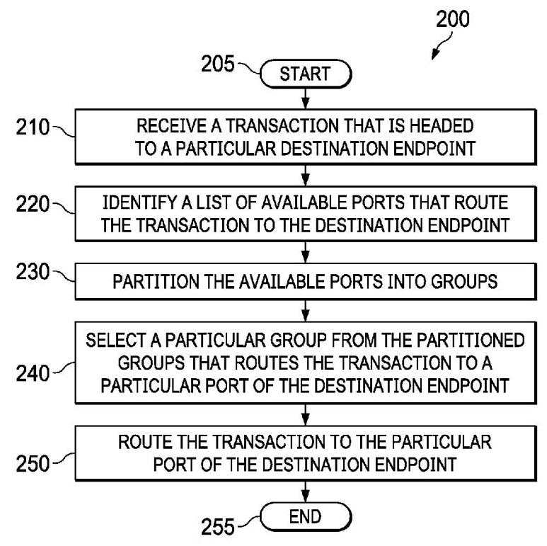
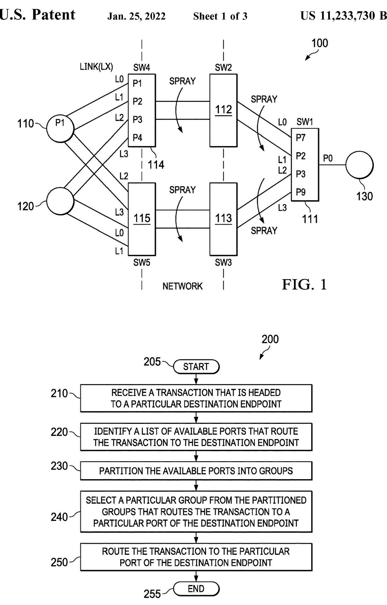
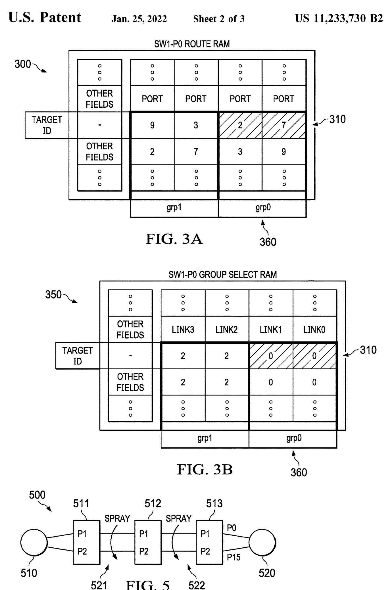
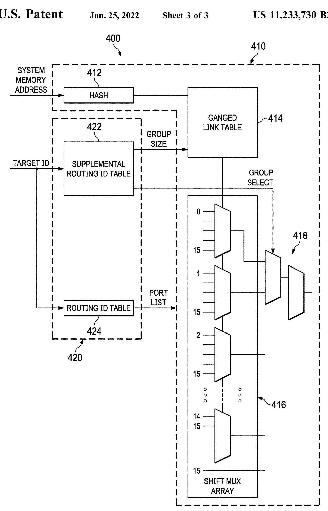

(12) United States Patent

> 
(12) 美国专利

Dearth et al.

> 
Dearth 等人

## (54) NETWORK ROUTING USING AGGREGATED LINKS

(71) Applicant: Nvidia Corporation, Santa Clara, CA (US)

> 
(71) 申请人：英伟达公司，美国加利福尼亚州圣克拉拉

(72) Inventors: Glenn Dearth, Santa Clara, CA (US); Mark Hummel, Santa Clara, CA (US)

> 
(72) 发明人：Glenn Dearth，美国加利福尼亚州圣克拉拉；Mark Hummel，美国加利福尼亚州圣克拉拉

(73) Assignee: Nvidia Corporation, Santa Clara, CA (US)

> 
(73) 受让人：Nvidia Corporation，美国加利福尼亚州圣克拉拉 (US)

(*) Notice: Subject to any disclaimer, the term of this patent is extended or adjusted under 35 U.S.C. 154(b) by 182 days.

> 
(\*) 注意：在遵守任何免责声明的前提下，该专利的有效期根据35 U.S.C. 154(b)延长或调整了182天。

(21) Appl. No.: 16/700,611

> 
(21) 申请号：16/700,611

(22) Filed: Dec. 2, 2019

> 
(22) 申请日：2019年12月2日

(65) Prior Publication Data

> 
(65) 在先公开数据

US 2021/0014156 A1 Jan. 14, 2021

> 
US 2021/0014156 A1 2021年1月14日

Related U.S. Application Data

> 
相关美国申请数据

(60) Provisional application No. 62/872,023, filed on Jul. 9, 2019.

> 
(60) 临时申请第62/872,023号，提交于2019年7月9日。

(51) Int. Cl.

> 
本专利提出了一种用于支持链路聚合和多端口连接的网络的路由技术，解决了仅凭目的端点的目标标识符无法指定事务应到达哪个端口的问题。其主要贡献在于使用两个可编程表：一个路由ID表，为每个目的端点列出在给定交换机上所有可用的出口端口；以及一个补充路由ID表，该表根据事务的补充路由ID（标识源端口），从这些端口中选择一组特定的端口，从而将路径约束到正确的目的端口。这种分组方式与构成独立路由的聚合链路对齐，所选组确保事务到达所需端口。该技术保持路由表规模小、简化编程，并灵活支持各种拓扑结构。可以使用哈希值和组大小在所选组内的聚合链路上喷散事务。一个扩展方案利用补充路由ID位来增加可路由端点的数量，而无需扩大目标ID字段。此外，还描述了一种排序方法，在最后一跳交换机上按源端口和目的端对喷散事务进行排序，使得来自同一源端口的事务能够被合并以提高效率。总体而言，该方法在多端口、链路聚合网络中提供了高效、可扩展且正确的路由。

H04L 12/709 (2013.01)

> 
H04L 12/709 (2013.01)

H04L 12/707 (2013.01)

> 
H04L 12/707 (2013.01)

H04L 12/751 (2013.01)

> 
H04L 12/751（2013.01）

H04L 12/721 (2013.01)

> 
H04L 12/721 (2013.01)

(52) U.S. Cl.

> 
本专利提出了一种适用于支持链路聚合和多端口连接的网络的路由技术，解决了仅凭目的端点的目标标识符无法指定事务应到达哪个端口的问题。其主要贡献在于一种使用两个可编程表的方法：一个路由ID表，针对每个目的端点列出给定交换机上的所有可用出端口；以及一个补充路由ID表，该表根据事务的补充路由ID（标识源端口）从这些端口中选出一个特定端口组，从而将路径约束到正确的目的端口。这种分组划分与形成独立路由的聚合链路相一致，所选分组确保事务到达所需的端口。该技术能保持路由表规模较小，简化编程，并灵活支持多样化的拓扑结构。事务可以在所选分组内的聚合链路上，利用哈希值和分组大小进行喷射（spray）。一种扩展方法利用补充路由ID比特位来扩大可路由端点的数量，而无需扩大目标ID字段。此外，还描述了一种排序方法：在末跳交换机上，按源端口和目的端对喷射的事务进行排序，从而可以将源自同一源端口的事务合并以提高效率。总体而言，该方法在多端口、链路聚合的网络中提供了高效、可扩展且正确的路由。

CPC ............ H04L 45/245 (2013.01); H04L 45/02

> 
CPC ............ H04L 45/245 (2013.01); H04L 45/02

(2013.01); H04L 45/22 (2013.01); H04L 45/26

> 
(2013.01); H04L 45/22 (2013.01); H04L 45/26

(2013.01)

> 
(2013.01)

(10) Patent No.: US 11,233,730 B2 (45) Date of Patent: Jan. 25, 2022

> 
(10) 专利号：US 11,233,730 B2 (45) 专利日期：2022年1月25日

(58) Field of Classification Search

> 
(58) 分类搜索领域

CPC ....... H04L 45/02; H04L 45/22; H04L 45/245; H04L 45/26

> 
CPC ....... H04L 45/02；H04L 45/22；H04L 45/245；H04L 45/26

See application file for complete search history.

> 
参见申请文件以获取完整检索历史。

(56) References Cited

> 
(56) 引用的参考文献

### U.S. PATENT DOCUMENTS

2007/0189284 A1* 8/2007 Kecskemeti ............ H04L 45/02

> 
2007/0189284 A1* 8/2007 Kecskemeti ............ H04L 45/02

370/389

> 
本专利提出一种支持链路聚合和多端口连接的网络路由技术，解决了仅凭目的地端点的目标标识符无法指定事务应到达哪个端口的问题。其主要贡献是一种使用两个可编程表的方法：一个路由ID表，针对每个目的地列出给定交换机上所有可用的出口端口；以及一个补充路由ID表，根据事务的补充路由ID（标识源端口）从这些端口中选择特定的一组，从而将路径约束到正确的目的地端口。这种分组划分与构成独立路由的聚合链路对齐，所选组确保事务到达所需端口。该技术保持路由表规模小、简化编程，并灵活支持多种拓扑。事务可在所选组内的聚合链路上，利用哈希值和组大小进行喷洒。一种扩展利用补充路由ID位来扩展可路由端点的数量，而无需扩大目标ID字段。此外，还描述了一种排序方法，在最后一跳交换机上按源端口和目的地对喷洒事务进行排序，使得来自同一源端口的事务可以折叠以提高效率。总体而言，该方法在多端口、链路聚合的网络中提供了高效、可扩展且正确的路由。

2011/0164508 A1* 7/2011 Arai ..................... H04L 45/60

> 
以下是文章全文的摘要，供翻译时参考上下文：
本专利提出了一种用于支持链路聚合和多端口连接的网络的路由技术，解决了仅凭目的端点的目标标识符无法指定事务应到达哪个端口的问题。其主要贡献在于提供了一种使用两个可编程表的方法：一个路由ID表，为每个目的地列出给定交换机处的所有可用出口端口；以及一个补充路由ID表，它根据事务的补充路由ID（标识源端口），选择这些端口中的一个特定组，从而将路径约束到正确的目的端口。这种分组划分与形成独立路由的聚合链路相对应，所选的组确保事务到达所需的端口。该技术保持了较小的路由表规模，简化了编程，并灵活支持多样化的拓扑结构。事务可在所选组内的聚合链路上通过哈希值和组大小进行喷洒。一项扩展利用补充路由ID位来扩充可路由端点的数量，而无需扩大目标ID字段。此外，还描述了一种排序方法，即在最后一跳交换机上，将喷洒的事务按源端口和目的地排序，使得来自同一源端口的事务能够汇聚以提高效率。总之，该方法在多端口、链路聚合的网络中提供了高效、可扩展且正确的路由。

2011/0164508 A1* 2011年7月 Arai ..................... H04L 45/60

370/245

> 
370/245

2016/0065407 A1* 3/2016 Saltsidis ............ H04L 41/0806

> 
2016/0065407 A1* 3/2016 萨尔齐迪斯 ............ H04L 41/0806

370/255

> 
本专利提出一种用于支持链路聚合与多端口连接的网络路由技术，解决了仅凭目的端点的目标标识无法指定事务应到达哪个端口的问题。主要贡献是一种使用两个可编程表的方法：一个路由ID表，为每个目的地列出给定交换机上所有可用的出口端口；以及一个补充路由ID表，根据事务的补充路由ID（标识源端口）从这些端口中选择一个特定组，从而将路径约束到正确的目的端口。这种分组与形成独立路由的聚合链路保持一致，所选组确保事务到达所需端口。该技术有效控制路由表大小，简化编程，并灵活支持多样化的拓扑。在所选组内，事务可利用哈希值和组规模在聚合链路上进行喷洒。一个扩展方案利用补充路由ID位来扩展可路由端点的数量，而无需增大目标ID字段。此外还描述了一种排序方法：在最后一跳交换机处，喷洒的事务按源端口和目的地排序，使来自同一源端口的事务可被折叠以提高效率。总之，该方法在多端口、链路聚合的网络中提供了高效、可扩展且正确的路由。

2016/0234091 A1* 8/2016 Emmadi ............. H04L 41/0893

> 
2016/0234091 A1* 2016年8月 Emmadi ............. H04L 41/0893

2017/0126549 A1* 5/2017 Paramasivam .... H04L 49/9005

> 
2017/0126549 A1* 5/2017 Paramasivam .... H04L 49/9005

2018/0220196 A1* 8/2018 Slater............... H04N 21/64776

> 
2018/0220196 A1* 2018年8月 Slater............... H04N 21/64776

2019/0045562 A1* 2/2019 Liu ........................ H04W 76/22

> 
2019/0045562 A1*，2019年2月，刘 ........................ H04W 76/22

2020/0067825 A1* 2/2020 Huang ....................................

> 
2020/0067825 A1* 2/2020 Huang ....................................

* cited by examiner

> 
* 被审查员引用

Primary Examiner - Gary Mui

> 
主审员：Gary Mui

## (57) ABSTRACT

Introduced herein is a routing technique that, for example, routes a transaction to a destination port over a network that supports link aggregation and multi-port connection. In one embodiment, two tables that can be searched based on the target and supplemental routing IDs of the transaction are utilized to route the transaction to the proper port of the destination endpoint. In an embodiment, the first table provides a list of available ports at each hop/route point that can route the transaction to the destination endpoint, and the second table provides a supplemental routing ID that can select a specific group of ports from the first table that can correctly route the transaction to the proper port.

> 
本文介绍一种路由技术，例如，通过支持链路聚合和多端口连接的网络将事务路由至目的端口。在一个实施例中，利用可根据事务的目标路由ID和补充路由ID进行搜索的两个表，将事务路由至目的端点的正确端口。在一个实施例中，第一个表提供在每个跳/路由点处可将事务路由至目的端点的可用端口列表，第二个表提供一个补充路由ID，该ID可从第一个表中选择能够将事务正确路由至正确端口的特定端口组。

24 Claims, 3 Drawing Sheets

> 
24 项权利要求，3 张附图

FIG. 2

> 
图2

FIG. 4

> 
图 4

## 1 NETWORK ROUTING USING AGGREGATED LINKS

## CROSS-REFERENCE TO RELATED APPLICATION

This application claims the benefit of U.S. Provisional Application Ser. No. 62/872,023, filed on Jul. 9, 2019, entitled "NETWORK ROUTING USING AGGREGATED LINKS," commonly assigned with this application and incorporated herein by reference in its entirety.

> 
本申请要求享有2019年7月9日提交的、标题为“利用聚合链路进行网络路由”的美国临时申请序列第62/872,023号的权益，该临时申请与本申请共同转让，并其全部内容通过引用并入本文。

## TECHNICAL FIELD

This application is directed, in general, to network routing protocols and, more specifically, to a method and apparatus for routing transactions in a network that support aggregated links and/or multi-port connections.

> 
本申请总体上涉及网络路由协议，更具体而言，涉及一种用于在支持聚合链路和/或多端口连接的网络中路由事务的方法和装置。

## BACKGROUND

Network routing protocols often use a system memory address of a destination endpoint as a target identifier (ID) of a transaction when routing. While the target ID alone may be sufficient for a destination endpoint that is connected to a network using a single port, it may be insufficient for endpoints that are connected using multiple ports since the target ID does not indicate the port to which the destination endpoint is attached. Moreover, when a network employs aggregated links, it can introduce divergent paths at various hops/route points that can constrain the transaction to a path that routes the transaction to the wrong port of the destination endpoint.

> 
网络路由协议在路由时，常将目的端点的系统内存地址用作事务的目标标识符（ID）。对于仅通过单一端口连接网络的目的端点，仅凭目标ID可能已足够；但对于通过多端口连接的端点，仅凭目标ID可能不足，因为它未指明目的端点所连接的端口。此外，当网络采用聚合链路时，会在不同跳/路由点引入分叉路径，可能将事务约束到一条将其路由至目的端点错误端口的路径上。

## SUMMARY

One aspect provides a method of routing transactions over a network. The method includes: receiving a transaction that is headed to a particular port of a destination endpoint over the network; selecting a particular group of ports that constrains the transaction to a specific path that routes the transaction to the particular port of the destination endpoint; and routing the transaction to the particular port of the destination endpoint via the specific path.

> 
一个方面提供了一种通过网络路由事务的方法。该方法包括：接收一个通过网络发往目的端点特定端口的事务；选择一个特定的端口组，该组将事务约束到一条特定的路径，该路径将事务路由到该目的端点的特定端口；以及通过该特定路径将事务路由到该目的端点的特定端口。

Another aspect provides a switching device for routing transactions over a network. The switching device includes a pipeline configured to: receive a transaction that is headed to a particular port of a destination endpoint over the network; select a particular group of ports that constrains the transaction to a specific path that routes the transaction to the particular port of the destination endpoint; and route the transaction of the request to the destination endpoint via the specific path.

> 
另一个方面提供了一种用于在网络上路由事务的交换设备。该交换设备包括一条流水线，配置为：接收经网络发往目的端点的特定端口的事务；选择一组特定端口，将事务约束到一条特定路径上，该路径将事务路由至目的端点的该特定端口；并将该请求的事务通过该特定路径路由至目的端点。

## BRIEF DESCRIPTION

Reference is now made to the following descriptions taken in conjunction with the accompanying drawings, in which:

> 
现在参考结合附图的以下描述，其中：

FIG. 1 is an illustration of an embodiment of a network through which transactions between connected endpoints are exchanged;

> 
图1是网络的一个实施例的图示，通过该网络在连接的端点之间交换事务；

FIG. 2 is an illustration of a flow diagram of an embodiment of a method for routing transactions over a network carried out according to the principles of the disclosure;

> 
图2是依据本公开原理实现的用于在网络中路由事务的方法的一个实施例的流程图的图示；

2

> 
本专利提出了一种适用于支持链路聚合和多端口连接的网络的路由技术，解决了仅凭目标端点的目标标识符无法指定事务应到达哪个端口的问题。其核心贡献在于一种使用两个可编程表的方法：一个路由ID表，为每个目标列出给定交换机上所有可用的出口端口；以及一个补充路由ID表，根据事务的补充路由ID（标识源端口）从这些端口中选择一个特定组，以将路径约束到正确的目标端口。这种将端口划分为不同组的方式与构成独立路由的聚合链路相一致，所选组确保事务到达所需端口。该技术可保持路由表规模较小，简化编程，并灵活支持多样化的拓扑结构。事务可在所选组内的聚合链路上通过哈希值和组大小进行喷洒。一个扩展利用补充路由ID位来扩展可路由端点的数量，而无需扩大目标ID字段。此外，还描述了一种排序方法，在末跳交换机处按源端口和目的地对喷洒的事务进行排序，使得来自同一源端口的事务可被合并以提高效率。总体而言，该方法在多端口、链路聚合网络中提供了高效、可扩展且正确的路由。

FIG. 3A is an illustration of an embodiment of a routing ID table that is programmed according to the principles of the disclosure;

> 
图3A是根据本公开原理编程的路由ID表的一个实施例的图示；

FIG. 3B is an illustration of an embodiment of a supple- 5 mental routing ID table that is programmed according to the principles of the disclosure;

> 
图3B是根据本公开的原理所编程的补充(5)路由ID表的一个实施例的图示。

FIG. 4 is an illustration of a block diagram of an embodiment of a switching device for routing transactions over a network that is implemented according to the principles of 10 the disclosure; and

> 
图4是根据本公开的原理10实现的用于在网络上路由事务的交换设备的实施例的框图图示；以及

FIG. 5 illustration of an embodiment of a network in which sprayed transactions are sorted using a sorting technique introduced in the disclosure.

> 
图5示出了根据本公开引入的排序技术对喷射式事务进行排序的网络实施例的图示。

15

> 
本专利提出了一种支持链路聚合与多端口连接的网络路由技术，解决了仅凭目的端点的目标标识符无法确定事务应到达哪个端口的问题。其主要贡献在于一种使用两张可编程表的方法：一张路由ID表为每个目的地点列出给定交换机上所有可用的出口端口，另一张补充路由ID表则根据事务的补充路由ID（标识源端口）从这些端口中选出一组特定端口，从而将路径约束至正确的目的端口。这种分组方式与形成独立路由的聚合链路相对应，所选组确保事务能够抵达所需的端口。该技术保持了较小的路由表规模，简化了编程过程，并能灵活支持多种拓扑结构。事务可通过哈希值与组大小在所选中组内的聚合链路上进行喷洒。一种扩展利用补充路由ID比特位来扩大可路由端点的数量，而无需增大目标ID字段。此外，文中还描述了一种排序方法，在末跳交换机上按源端口和目的地对喷洒的事务进行排序，使得来自同一源端口的事务可被合并以提高效率。总体而言，该方法在多端口、链路聚合的网络中实现了高效、可扩展且正确的路由。

## DETAILED DESCRIPTION

Introduced herein is a routing technique that routes a transaction to a destination port using a target ID and an additional supplemental routing ID. Utilizing two tables that 20 can be indexed and sorted based on the target and supplemental routing IDs, the introduced technique can identify ports and their connected paths and select a group of the ports that constrain the transaction to a specific path that routes the transaction to the proper port of the destination 25 endpoint. The first table indicates a list of available ports at each hop/route point that can route the transaction to the destination endpoint, and the second table provides routing information that can be used to select a specific group of ports from the first table to route the transaction to the proper port of the destination endpoint.

> 
本文介绍了一种路由技术，该技术使用目标ID和额外的补充路由ID将事务路由到目标端口。通过利用两个可根据目标和补充路由ID进行索引和排序的表，所介绍的技术能够识别端口及其连接路径，并选择一组端口，这些端口将事务约束到一条特定路径，从而将事务路由到目的地端点的正确端口。第一张表指示每个跳跃/路由点处可将事务路由到目的地端点的可用端口列表，而第二张表提供路由信息，可用于从第一张表中选择特定的一组端口，以将事务路由到目的地端点的正确端口。

Some of the benefits of the introduced routing technique include its flexibility to support a large variety of fabric topologies that utilizes link aggregations and multi-port connections, and its efficiency in keeping the routing table 35 size to a minimum and simplifying programming. These benefits are achieved by utilizing two routing tables that have flexible formats and support efficient partition and selection of the entries in the tables.

> 
所介绍的路由技术的一些优点包括其灵活性，能够支持多种利用链路聚合和多端口连接的交换结构拓扑，以及其在将路由表 35 的大小保持在最小并简化编程方面的高效性。这些优点是通过利用两个路由表实现的，这两个表具有灵活的格式，并支持对表中条目进行高效的分区与选择。

FIG. 1 illustrates an embodiment of a network 100 in 40 which transactions can be routed using the introduced technique. In the illustrated embodiment, the network 100 is an interconnect fabric that uses a networking protocol such as NVLink™ provided by NIVIDA® Corporation of Santa Clara, Calif., that supports multi-port connection and link 5 aggregation.

> 
图1展示了网络100的一个实施例，其中可利用所引入的技术对事务进行路由。在所展示的实施例中，网络100是一个互连结构，采用诸如加利福尼亚州圣克拉拉市NVIDIA®公司提供的NVLink™等网络协议，该协议支持多端口连接和链路聚合。

In the illustrated embodiment, the network 100 is connected to three endpoints, two source endpoints 110 and 120 and a target endpoint 130, that transmit and receive transactions through the network 100. While the source and target 50 endpoints 110, 120, 130 are labeled respectively for their roles in the illustrated embodiment, their functions are not limited to their roles. As such, the source endpoints 110, 120 can not only make a request but also respond to a request when targeted, and the target endpoint 130 can make a 55 request in addition to a response to a received request. The endpoints 110-130 can be processing units such as graphics processing units (GPUs) and central processing units (CPUs), storage units such as memories, and/or networking units such as network interface cards.

> 
在所示实施例中，网络100连接至三个端点，即两个源端点110和120以及一个目标端点130，它们通过网络100发送和接收事务。虽然在图示实施例中，源端点110、120和目标端点130根据其角色分别标记，但它们的功能不限于这些角色。因此，源端点110、120不仅可以发出请求，还可以在被寻址时响应请求，而目标端点130除了对收到的请求做出响应外，还可以发出请求。端点110‑130可以是处理单元，如图形处理单元（GPU）和中央处理单元（CPU），也可以是存储单元如存储器，和/或网络单元如网络接口卡。

In the illustrated embodiment, the endpoints 110-130 are connected to the network 100 and to each other using switches 111 (SW1), 112 (SW2), 113 (SW3), 114 (SW4), and 115 (SW5). Multiple ports of the source endpoints 110, 120 are connected to corresponding ports of the fourth (SW4) and fifth (SW5) switches 114, 115, and multiple ports of the switches 111-115 are connected to one another. The multi-port connections between the switches 111-115 allow aggregations of parallel connections/links, i.e., links between the same pair of switches. The link aggregation may increase throughput beyond what a single connection could sustain and provide redundancy in case one of the links should fail. The switches 111-115 may be a switching device that supports multi-port connection and link aggregation such as NVSwitch™ of NVIDIA®. The switches 111-115 may also be used to support statistical multipathing to minimize hot-spotting effects from converging multiple traffic streams.

> 
在图示实施例中，端点 110–130 通过交换机 111（SW1）、112（SW2）、113（SW3）、114（SW4）和 115（SW5）连接到网络 100 以及彼此之间。源端点 110、120 的多个端口分别连接到第四交换机 114（SW4）和第五交换机 115（SW5）的对应端口，并且交换机 111–115 的多个端口彼此连接。交换机 111–115 之间的多端口连接允许形成并行连接/链路的聚合，即同一对交换机之间的多条链路。链路聚合可以将吞吐量提升到单一连接无法维持的水平，并在某条链路故障时提供冗余。交换机 111–115 可以是支持多端口连接和链路聚合的交换设备，例如 NVIDIA® 的 NVSwitch™。这些交换机 111–115 还可用于支持统计多路径，以最小化多流量流汇聚带来的热点效应。

FIG. 2 illustrates a flow diagram of an embodiment of a method 200 for routing transactions over a network, such as network 100 in FIG. 1, that supports multi-port connection and link aggregation. The method 200 may be performed by a switching device at each hop or routing point between source and destination endpoints, such as the switches 111-115 in FIG. 1. To illustrate the actual application of the introduced technique, the method 200 is described both generally and from the point of view (POV) of the first switch 111 in FIG. 1. In the illustrated embodiment of FIG. 1, the first switch 111 is routing a response of the request that was sent from the port P1 of the source endpoint 110. The method 200 starts at step 205.

> 
图2示出了用于在支持多端口连接和链路聚合的网络（例如图1中的网络100）上路由事务的方法200的实施例的流程图。方法200可由源端点与目的端点之间每一跳或路由点处的交换设备执行，例如图1中的交换机111-115。为说明所引入技术的实际应用，方法200既从一般角度描述，也从图1中第一交换机111的视角（POV）描述。在图1所示的实施例中，第一交换机111正在路由对从源端点110的端口P1发出的请求的响应。方法200开始于步骤205。

At step 210, a transaction that is headed to a particular destination endpoint is received at a switching device that is performing the method 200. The transaction may be received from a switch at the previous hop/route point or from an endpoint that generated the transaction. The received transaction includes in its header a target ID, which indicates a destination of the transaction, e.g., an endpoint that the transaction is headed, and a supplemental routing ID, which indicates a source port of the transaction, e.g., an endpoint port through which the transaction was first injected into the network.

> 
在步骤210中，执行方法200的交换设备接收到发往特定目标端点的交易。该交易可能从上一跳/路由点处的交换机接收，也可能从生成该交易的端点接收。接收到的交易在其头部包含一个目标ID和一个补充路由ID，前者指示交易的目的地（例如交易要到达的端点），后者指示交易的源端口（例如交易首次注入网络时所经由的端点端口）。

From the POV of the first switch 111 in FIG. 1, the received transaction is a response from the target endpoint 130 that is headed back to the destination port P1 of the source endpoint 110, from where the original request was sent. The response is received from the target endpoint 130 via port P0 of the first switch 111, which is the only port of the first switch 111 to which the target endpoint 130 is exposed. The received response includes in its header a target ID, which indicates the source endpoint 110 as the destination, and a supplemental routing ID, which indicates the port P1 of the source endpoint 110 as the source port of the request to which the received response is responding.

> 
从图 1 中第一个交换机 111 的视角看，收到的交易是来自目标端点 130 的响应，该响应正返回源端点 110 的目的端口 P1，即原始请求发出的位置。该响应通过第一个交换机 111 的端口 P0 从目标端点 130 接收，而端口 P0 是第一个交换机 111 上唯一暴露给目标端点 130 的端口。收到的响应在其头部包括一个目标 ID，用于指示源端点 110 作为目的地，以及一个补充路由 ID，用于指示源端点 110 的端口 P1 作为所响应请求的源端口。

At step 220, a list of available ports in the switching device that route the transaction to the destination endpoint are identified. The available ports may be identified as positional bits of a vector, where each positional bit corresponds to each different port of a given endpoint, or as an array of integers, where each integer represents each different port numbers of a given endpoint. The available ports are searched and identified from a routing ID table using the target ID of the transaction as an index into the routing ID table. By projecting paths of ports in a switching device that received a given transaction, some of the ports of the switching device that route the given transaction to its destination endpoint are identified. In one embodiment, paths of switch ports are determined from the network configuration information that was gathered during the network initiation. The routing ID table is stored and accessed from a routing ID memory in the switching device.

> 
在步骤220，识别交换设备中能够将事务路由至目的端点的可用端口列表。可用端口可表示为一个向量的位置位，其中每个位置位对应给定端点的各个不同端口，也可表示为一个整数数组，其中每个整数代表给定端点的各个不同端口号。可用端口通过以事务的目标ID作为路由ID表的索引，从该路由ID表中搜索并识别出来。通过投射接收到给定事务的交换设备中端口的路径，识别出交换设备中能够将该给定事务路由至其目的端点的一部分端口。在一个实施例中，交换机端口的路径是根据网络初始化期间收集的网络配置信息确定的。路由ID表存储在交换设备内的路由ID存储器中，并从中进行访问。

For the first switch 111 in FIG. 1, a list of available ports in the first switch 111 that can route the response back to the source endpoint 110 is identified. The list includes ports P2, P3, P7 and P9, which are associated with Link1, Link2, Link0 and Link3, respectively. This port-link association may be indicated in the header of the response.

> 
对于图1中的第一交换机111，识别出该交换机中能够将响应路由回源端点110的可用端口列表。该列表包括端口P2、P3、P7和P9，分别关联于链路Link1、Link2、Link0和Link3。这种端口与链路的关联关系可以在响应头部中指示。

FIG. 3A illustrates an embodiment of a routing ID table 300 that is stored and accessed from a routing ID memory 5 in the first switch 111. Using the target ID of the response as an index, the available ports are identified as an array of integers, i.e. a row 310 of port numbers in the first switch 111. The row 310 of the table 300 lists the four ports P2, P3, P7 and P9 that route the response to the source endpoint 110.

> 
图3A示出了路由ID表300的一个实施例，该表存储在第一交换机111中的路由ID存储器5中并被从中访问。以响应的目标ID为索引，可用端口被标识为一个整数数组，即第一交换机111中的端口号行310。表300的行310列出了将响应路由到源端点110的四个端口P2、P3、P7和P9。

10 Unlike positional bits of a vector, which retains a rigid form, the port numbers can be programmed to be placed in contiguous fields as shown in FIG. 3A. This programmable ordering of field entries allows flexible groupings of various sizes for the field entries

> 
10 与保持固定形式的向量位置比特不同，端口号可以被编程以放置在连续字段中，如图3A所示。这种字段条目的可编程排序允许对字段条目进行各种大小的灵活分组。

Returning to FIG. 2, at step 230, the ports identified in the step 220 are partitioned into groups. More specifically, the identified ports are partitioned into groups using a group select and a group size of a supplemental routing ID table. The group select and group size are selected from the 0 supplemental routing ID table using the target ID and the supplemental routing ID of the transaction. The group select and group size are programmed into the supplemental routing ID table during fabric initialization, e.g., the topology discovery, based on the groups' connected paths. More 25 specifically, the group select and group size are based on connected paths of ports in each group. Each partitioned group of ports corresponds to a group of aggregated links that are associated with the ports in each partitioned group and form an independent routing path, e.g., a diverging path, 60 from other partitioned groups.

> 
回到图2，在步骤230中，在步骤220中识别出的端口被划分成组。更具体地，利用补充路由ID表的组选择和组大小，将所识别的端口划分成组。组选择和组大小是使用事务的目标ID和补充路由ID从0补充路由ID表中选择的。在结构初始化（例如拓扑发现）期间，基于各组的连接路径，将组选择和组大小编入补充路由ID表。更具体地25，组选择和组大小基于每个组中端口的连接路径。每个划分的端口组对应于一组聚合链路，这些聚合链路与每个划分组中的端口相关联，并形成与其他划分组独立的路径（例如发散路径），60。

With respect to the first switch 111 in FIG. 1, its four available ports P2, P3, P7 and P9 are partitioned into two groups of two ports as shown in FIG. 3A. The first group (grp0) includes ports P7 and P2, and the second group (grp1) includes ports P3 and P9. As mentioned above, the partitioning is carried out based on a group select and a group size, which are selected from the supplemental routing ID table using the target ID and the supplemental routing ID of the transaction. In the illustrated embodiment, the ports that belong to a same group are placed next to each other for easier grouping and hardware implementation. Ports P7 and P2 are placed next to teach other for the first group, and ports P3 and P9 are placed next to each other for the second group. As discussed above, the flexibility of the integer format allows the flexible placements of the port number values. FIG. 3B illustrates an embodiment of a supplemental routing ID table 350 that is stored and accessed from a routing ID memory in the switch 111. The illustrated supplemental routing ID table 350 is indexed using the target ID of the 50 transaction, and a group select and a group size are selected, using the supplemental routing ID of the transaction, for partitioning the four ports P2, P3, P7 and P9 of the first switch 111 into the two groups. In the illustrated supplemental routing ID table 350, the group select may be 55 indicated from multiplexor designations of the links associated with the four ports P2, P3, P7 and P9. Ports associated with Link0 and Link1 are both associated with the multiplexor0 and thus in a same group (grp0) and ports associated with Link2 and Link3 are both associated with the multi-oplexor2 and thus in a same group (grp1). The group size may be indicated from a number of ports or links in each group. An example of multiplexors, multiplexor array 416, are illustrated in FIG. 4.

> 
对于图1中的第一交换机111，其四个可用端口P2、P3、P7和P9如图3A所示被划分为两个组，每组两个端口。第一组（grp0）包含端口P7和P2，第二组（grp1）包含端口P3和P9。如上所述，该划分基于组选择和组大小进行，这些信息是从补充路由ID表中，利用事务的目标ID和补充路由ID来选取的。在图示的实施例中，属于同一组的端口被相邻放置，以便于分组和硬件实现。对于第一组，端口P7和P2被相邻放置；对于第二组，端口P3和P9被相邻放置。如前所述，整数格式的灵活性使得端口号值能够灵活排布。图3B展示了补充路由ID表350的一个实施例，该表存储于交换机111的路由ID存储器中并可从中访问。图示的补充路由ID表350使用事务的目标ID进行索引，并利用事务的补充路由ID来选取组选择和组大小，从而将第一交换机111的四个端口P2、P3、P7和P9划分为两个组。在图示的补充路由ID表350中，组选择可通过与四个端口P2、P3、P7和P9关联的链路的多路复用器指定来表示。与链路Link0和Link1关联的端口均与多路复用器0关联，因而属于同一组（grp0）；与链路Link2和Link3关联的端口均与multi-oplexor2关联，因而属于同一组（grp1）。组大小可由每组中的端口数或链路数来表示。图4中示出了一个多路复用器阵列416的示例。

Returning to FIG. 2, at step 240, a particular group of 65 ports that constrain the transaction to a specific path that route the transaction to the particular port of the destination endpoint is selected from the partitioned groups. Similar to the step 220, the groups are selected using the group select and the group size from the supplemental routing ID table.

> 
回到图2，在步骤240，从已分区的端口组中选择一个特定的端口组，该组包含65个端口，将事务限制在一条特定路径上，该路径将事务路由至目标端点的特定端口。与步骤220类似，这些端口组是通过补充路由ID表中的组选择值和组大小来选定的。

For the first switch 111 of FIG. 1, the first group (grp0) is selected because the ports P2 and P7 can constrain the response to paths that go through the second 112 and fourth 114 switches and reach the port P1 of the source endpoint 110. The first group 360 is shown in FIGS. 3A and 3B. Had the second group (grp1) been selected, the transaction would go through the third 113 and fifth 115 switches and will not be able to reach the source endpoint 110 via the port P1, violating a requirement of a network routing protocol, such as NVLink™, which requires a response transaction to be routed to the source port, i.e. the port where the initial request transaction was injected.

> 
对于图1中的第一交换机111，选择第一组（grp0）是因为端口P2和P7可以将响应约束到经过第二交换机112和第四交换机114并到达源端点110的端口P1的路径。第一组360如图3A和图3B所示。如果选择了第二组（grp1），事务将经过第三交换机113和第五交换机115，且无法通过端口P1到达源端点110，这将违反网络路由协议（如NVLink™）的要求，该协议要求响应事务被路由到源端口，即初始请求事务被注入的端口。

At step 250, the transaction is routed toward the particular port of the destination endpoint using the ports in the selected group. Depending on the location of the switching device with respect to the particular endpoint and the links associated with ports in the selected group, the transaction can be sprayed over the aggregated link or transmitted using a particular port. It is understood that when spraying a transaction over multiple aggregated links, the transaction may be transmitted over one of the links chosen by combining a hashed value and the group size value derived from the supplemental routing ID in the supplemental routing ID table. For a request transaction, the hashed value may be generated from the system address of the source endpoint, which is present in the header, and for a response transaction, the hashed value may be generated using a pseudo random generator.

> 
在步骤 250 处，利用所选组内的端口将该事务路由至目的地端点的特定端口。根据交换设备相对于该特定端点的位置及与组内端口关联的链路，该事务可在聚合链路上进行喷洒，或使用特定端口传输。应当理解，当在多个聚合链路上喷洒事务时，该事务可通过将哈希值与从补充路由 ID 表中的补充路由 ID 导出的组大小值相结合而选择的某一条链路传输。对于请求事务，该哈希值可从源端点的系统地址（该地址存在于头部）生成，而对于响应事务，该哈希值可使用伪随机数生成器生成。

In the case of the first switch 111 in FIG. 1, the response is routed to the next hop, the second switch 112, using the ports P2 and P7 in the selected group grp0. As the ports P2 and P7 are associated with aggregate links Link1 and Link0, the response is sprayed over Link1 and Link0. To determine the link to transmit the response over, the hashed value from a pseudo random generator and the group size value of 2 derived from the supplemental routing ID table 350 are combined.

> 
对于图1中的第一个交换机111，响应被路由到下一跳，即第二个交换机112，使用选定组grp0中的端口P2和P7。由于端口P2和P7与聚合链路Link1和Link0关联，响应被喷洒到Link1和Link0上。为了确定将响应传输到哪条链路，结合了来自伪随机生成器的哈希值以及从补充路由ID表350获取的组大小值2。

Once the transaction is routed to the particular port of the destination endpoint or forwarded to the next hop/route point toward the particular port, the method 200 ends at step 255. For the first switch 111 of FIG. 1, the method 200 ends once the response is sprayed over Link1 and Link0 and LAN1 to the next hop, the second switch 112.

> 
一旦事务被路由到目标端点的特定端口，或被转发到朝向该特定端口的下一跳/路由点，方法200在步骤255处结束。对于图1的第一交换机111，一旦响应经Link1、Link0和LAN1喷洒至下一跳即第二交换机112，方法200便告结束。

It is understood that the method 200 is repeated at each hop/route point of the transaction until the transaction reaches the particular port of the destination endpoint. As such, to complete the routing of the response to the port P1 of the source endpoint 110 in FIG. 1, the method 200 would be repeated when the response reaches the second switch 112 and repeated again when it reaches the fourth switch 114.

> 
可以理解的是，方法200在事务的每一跳/路由点都会重复执行，直到事务到达目的端点的特定端口。因此，为了完成将响应路由至图1中源端点110的端口P1，该方法200将在响应到达第二交换机112时重复执行，并在到达第四交换机114时再次重复。

Similar to the first switch 111, when the response arrive at the second switch 112, the method 200 will identify and partition ports of the second switch 112 that route the response to the port P1 of the source endpoint 110 into groups, select one of the groups that routes the response to port P1 of the source endpoint 110 and spray the response over the aggregated links associated with the ports in the selected group to the fourth switch 114.

> 
与第一交换机 111 类似，当响应到达第二交换机 112 时，方法 200 会识别第二交换机 112 的那些将响应路由到源端点 110 的端口 P1 的端口，并将其划分成组，选择其中一个能将响应路由到源端点 110 的端口 P1 的组，并将响应通过所选组中的端口关联的聚合链路喷洒到第四交换机 114。

Again, when the response arrives at the fourth switch 114, the method 200 will identify and partition ports of the fourth switch 114 that route the response to the port P1 of the source endpoint 110 into groups. While both of the identified ports, P1 and P2 can route the response to the source endpoint 110, only the port P1 of the fourth switch 114 can route the response to the port P1 of the source endpoint 110. As such, the method 200 here selects a group including port P1 and transmits the response over the port P1 to the source endpoint 110. As the group includes only one port, the response is not sprayed.

> 
此外，当响应到达第四交换机114时，方法200将识别该第四交换机114中能将响应路由至源端点110的端口P1的端口，并将其划分为若干组。尽管所识别出的两个端口P1和P2均可将响应路由至源端点110，但只有第四交换机114的端口P1能够将响应路由至源端点110的端口P1。因此，此处的方法200选择一个包含端口P1的组，并通过该端口P1将响应发送至源端点110。由于该组仅包含一个端口，响应不会进行喷洒。

It should be understood that although the port P1 is a port of the fourth switch 114, P1 is considered as the destination port of the source endpoint 110, from which the request of the response was transmitted, because the port P1 is the only switch port that is directly connected to and thus can reach the port of the source endpoint 110.

> 
应理解的是，尽管端口P1是第四交换机114的一个端口，但P1被视为源端点110的目的端口，响应所对应的请求正是从该源端点发出，因为P1是唯一直接连接并由此可达源端点110的交换机端口。

FIG. 4 illustrates an embodiment of a switching device 400 for routing transactions over a network such as network 100 in FIG. 1. The switching device 400 may be one of the switching devices, such as the switches 111-115 in FIG. 1, that are connected to endpoints using multiple ports and employ aggregated links. In the illustrated embodiment, the switching device 400 includes a pipeline 410 and a memory 420. The memory 420 includes a supplemental routing ID table 422 and a routing ID table 424.

> 
图4示出了交换设备400的一个实施例，该交换设备用于在诸如图1中的网络100等网络上路由事务。该交换设备400可以是图1中的交换机111‑115等交换设备之一，这些交换设备使用多个端口连接到端点并采用聚合链路。在图示的实施例中，交换设备400包括流水线410和存储器420。存储器420包含补充路由ID表422和路由ID表424。

The pipeline 410 is configured to receive a transaction that is headed to a particular port of a destination endpoint, identify a list of available ports in the switching device that 25 can route the transaction to the particular port and partition the available ports into groups based on a supplemental routing ID of the transaction. The pipeline 410 is also configured to select a particular group of ports that constrain the transaction to a specific path to the particular port of the 30 destination endpoint, and route the transaction to the destination endpoint via the specific path. In the illustrated embodiment, the pipeline 410 is an ingress pipeline that can include a processing unit (not shown) such as a central processing unit (CPU) and/or a graphics processing unit 35 (GPU) that is configured to direct at least some of the operations of the pipeline 410.

> 
流水线410被配置为接收发往目标端点特定端口的事务，识别交换设备中能够25将该事务路由到该特定端口的可用端口列表，并根据该事务的补充路由ID将这些可用端口划分为多个组。流水线410还被配置为选择一个特定的端口组，该组将事务约束到通往目标端点的30特定端口的特定路径，并通过该特定路径将事务路由到目标端点。在示出的实施例中，流水线410是入口流水线，其可包括处理单元（未示出），例如中央处理单元（CPU）和/或图形处理单元（GPU），该处理单元被配置为引导流水线410的至少一些操作。

The illustrated pipeline 410 includes a hashing module 412, a ganged link table (GLT) 414, a multiplexor array 416, and an array control unit 418. The multiplexor array 416 is 40 configured to physically partition the identified ports into the groups. The partitioned groups of the ports are assigned to multiplexors in the array 416 using a group select, e.g., link-multiplexor designations in FIG. 3B, and a group size from the supplemental routing ID table 422 and the identi- 45 fied list of available ports in the routing ID table 424.

> 
所示流水线410包括哈希模块412、聚合链路表（GLT）414、多路复用器阵列416以及阵列控制单元418。多路复用器阵列416被配置为将识别的端口物理划分到各个组中。划分后的端口组通过组选择（例如图3B中的链路-多路复用器指定）、来自补充路由ID表422的组大小以及路由ID表424中识别的可用端口列表，被分配给阵列416中的多路复用器。

The array control unit 418 is configured to physically select one of the partitioned groups by selecting one of the multiplexors in the array 416. Using the group select of the supplemental routing ID from the supplemental routing ID 50 table 422, the array control unit 418 selects one of the multiplexors of the array 416 and hence one of the partitioned groups for routing the transaction.

> 
阵列控制单元418被配置为通过选择阵列416中的多路复用器之一，来物理选择其中一个分区组。利用来自补充路由ID表422的补充路由ID的组选择字段，阵列控制单元418选择阵列416中的一个多路复用器，从而选择其中一个分区组用于路由该事务。

The hashing module 412 and the GLT 414 are configured

> 
哈希模块412和GLT 414被配置

to select one of the ports in the particular group, i.e. one of

> 
从特定组中选择一个端口，即选择

55 the inputs of the multiplexor in the array 416, for forwarding

> 
阵列416中的多路复用器的55个输入，用于转发

the transaction to the next hop or route point. The hashing

> 
将事务发送到下一跳或路由点。哈希

module 412 generates a hashed value by either hashing a

> 
模块 412 通过哈希一个

system memory address of the received request transaction

> 
接收到的请求事务的系统内存地址

or using a pseudo random number generator. The GLT 414

> 
或使用伪随机数生成器。GLT 414

combines the hashed value from the module 412 and a group

> 
将来自模块412的哈希值和一个组组合

size value from the supplemental routing ID table 422 to

> 
来自补充路由ID表422的size值至

come up with a value that corresponds to one of the ports in

> 
得出一个与其中一个端口相对应的值

the group selected by the array control unit 418. This

> 
阵列控制单元418选择的组。这

combination of the hashed value and the group size value

> 
经哈希处理的值与组大小值的组合

55 also normalizes the array 416 to limit the randomization of the port being selected to the number of ports in the particular group.

> 
55还对数组416进行归一化，以将所选端口的随机化限制在该特定组中的端口数量内。

7

> 
本专利提出了一种适用于支持链路聚合与多端口连接网络的路由技术，用以解决仅凭目的端点目标标识符无法指定事务应到达哪个端口的问题。其主要贡献在于一种使用两个可编程表的方法：一个路由ID表，针对每个目的地列出给定交换机上所有可用的出口端口；以及一个补充路由ID表，根据事务的补充路由ID（标识源端口），从这些端口中选出一个特定组，从而将路径约束到正确的目的端口。这种分组划分与构成独立路由的聚合链路对齐，所选组确保事务到达所需端口。该技术保持了路由表规模的轻量，简化了编程，并灵活支持多种拓扑。事务可利用哈希值及组大小，在所选的组内通过聚合链路进行喷洒（spray）。一项扩展是利用补充路由ID位来增加可路由端点的数量，而无需扩大目标ID字段。此外，还描述了一种排序方法：在末跳交换机处，按源端口和目的地对喷洒的事务进行排序，从而可以将来自同一源端口的事务合并以提高效率。总体而言，该方法在多端口、链路聚合的网络中提供了高效、可扩展且正确的路由。

In the illustrated embodiment, as noted above the memory 420 includes the supplemental routing ID table 422 and the routing ID table 424. The memory 420 may be implemented using a conventional computer memory such as a random access memory (RAM). In one embodiment, the supplemental routing ID table 422 and the routing ID table 424 are located in separate memories.

> 
在所示实施例中，如上所述，存储器420包括补充路由ID表422和路由ID表424。存储器420可以使用传统计算机存储器（如随机存取存储器（RAM））来实现。在一个实施例中，补充路由ID表422和路由ID表424位于不同的存储器中。

In network routing, the maximum number of endpoints that a given transaction can be routed to is generally limited by the number of bits in target IDs. For example, for a 9 bit target ID, the maximum number of routable endpoints is 512 (2 \( {}^{9} \) ) endpoints/entries. When dealing with the routing ID table 424 and the memory 420 of fixed sizes, the number of the bits in the target IDs is selected such that that all the routable endpoints can be fit and indexed into the routing ID table 424 in the memory 420. Increasing the number of the routable endpoints thus has conventionally required increasing the size of target IDs and also the size or depth of the routing ID table and memory.

> 
在网络路由中，给定事务可路由到的端点最大数量通常受目标标识中的比特位数限制。例如，对于 9 比特的目标标识，可路由端点的最大数量为 512（2⁹）个端点/条目。当处理固定大小的路由标识表 424 和存储器 420 时，目标标识中的比特位数选择应确保所有可路由端点能够适配并索引到存储器 420 中的路由标识表 424 内。因此，增加可路由端点的数量传统上需要增加目标标识的尺寸，同时也要增加路由标识表和存储器的尺寸或深度。

In one embodiment, the number of routable endpoints is increased without increasing the number of target ID bits or the sizes/depths of a routing ID table and a memory. Using one or more bits of the supplement routing ID as the extension of the target IDs, the number of the target ID bit increases and so does the number of routable endpoints. This usage of the supplemental routing ID is made possible by the flexible programmability of the supplemental routing ID table 422, such that allows one or more bits of the supplemental routing ID to be used as the most significant bit(s) of the target IDs.

> 
在一个实施例中，可路由端点的数量增加了，而无需增加目标ID位的数量或路由ID表和存储器的尺寸/深度。使用补充路由ID的一个或多个位作为目标ID的扩展，目标ID位数增加，可路由端点数量也随之增加。这种对补充路由ID的使用是通过补充路由ID表422的灵活可编程性实现的，从而允许将补充路由ID的一个或多个位用作目标ID的最高有效位。

When target IDs borrow bits from supplemental routing IDs, the number of fields, i.e. the number of ports, that can be identified and grouped for each endpoint are reduced. Using the example of the above, 2 bits of the supplemental routing ID, when used as the two most significant bits of a target ID, increase the number of routable endpoints four times \( \left( {2}^{2}\right) \) to 2048 while reducing the number of identifiable ports from 16 ports to 4 ports for each endpoint. It is understood that while borrowing some of supplemental routing ID bits reduces a number of fields for each entry, it allows more flexibility in adapting to the changing network condition using a fixed set of hardware, e.g., the memory 420.

> 
当目标标识符从补充路由标识符借位时，每个端点可识别并分组的字段（即端口）数量会减少。以上述例子为例，将补充路由标识符的2位用作目标标识符的两个最高有效位，可路由端点的数量增加四倍 \( \left( {2}^{2}\right) \) 达到2048个，同时每个端点可识别的端口数从16个减至4个。应理解的是，虽然借用部分补充路由标识符位会减少每个条目的字段数量，但使用固定的硬件组（例如，存储器420）时，能更灵活地适应不断变化的网络条件。

FIG. 5 illustrates an embodiment of a network 500 in which sprayed transactions are sorted using a sorting technique introduced in the disclosure. Similar to the network 100 in FIG. 1, the network 500 is an interconnect fabric that uses a networking protocol, such as NVLink™, that supports multi-port connection and link aggregation features. In the illustrated embodiment, the network 500 also supports a bulk collapsing feature that reduces the overhead of the transactions and the load on the network by collapsing transactions, e.g., write response transactions, from a same source port onto one another.

> 
图5示出了网络500的一个实施例，其中使用本公开中引入的排序技术对喷洒事务进行排序。与图1中的网络100类似，网络500是一种互连结构，使用诸如NVLink™的网络协议，支持多端口连接和链路聚合特性。在所示实施例中，网络500还支持批量合并特性，该特性通过将来自同一源端口的事务（例如写响应事务）相互合并，来减少事务的开销和网络负载。

In FIG. 5, the network 500 is simplified to show only two endpoints, one source endpoint 510 and one target endpoint 520, that transmit and receive transactions through the network 500. While only two are shown, there may be many more endpoints in the network 500 that communicate with one another. Similar to the endpoints 110-130 in FIG. 1, the source and target endpoints 510, 520 are not limited to their labeled roles and each can include processing units such as graphics processing units (GPUs) and central processing units (CPUs), storage units such as memories, and/or networking units such as network interface cards.

> 
在图5中，网络500被简化以仅示出两个端点，一个源端点510和一个目标端点520，它们通过网络500发送和接收事务。虽然仅示出两个，但网络500中可能存在许多相互通信的端点。与图1中的端点110‑130类似，源端点与目标端点510、520不限于其标记的角色，且每个可包括处理单元诸如图形处理单元（GPU）和中央处理单元（CPU）、存储单元诸如存储器，和/或网络单元诸如网络接口卡。

In the illustrated embodiment, the endpoints 510, 520 are connected using switches 511-513. Similar to the switches

> 
在所示实施例中，端点 510、520 通过交换机 511‑513 进行连接。与交换机类似

8 111-115 in FIG. 1, each of the switches 511-513 may be a switching device that supports multi-port connection and link aggregation such as NVSwitch™, and also support statistical multipathing to minimize hot-spotting effects from converging multiple traffic streams. Ports of the endpoints510,520are connected to ports of the first 511 and third 513 switches, and ports of the switches 511-513 are connected to one another. The multi-port connections and link aggregation between the switches 511-513 allow spray- 10 ing of transactions between the switches 511-513.

> 
8 111-115 在图1中，每个交换机511-513可以是支持多端口连接和链路聚合（如NVSwitch™）的交换设备，同时也支持统计多路径以最小化汇聚多个流量流产生的热点效应。端点510,520的端口连接到第一交换机511和第三交换机513的端口，交换机511-513的端口彼此相连。交换机511-513之间的多端口连接和链路聚合允许在交换机511-513之间spray- 10 ing事务。

When request transactions are transmitted from the ports P1 and P2 of the source endpoint 510 to the target endpoint 520, the transmitted transactions are sprayed over aggregated links 521 and 522 as they travel through the switches 5 511-513. As such, by the time the transactions reach the third, last hop switch 513, transactions transmitted from P1 are intermingled with those transmitted from P2.

> 
当请求事务从源端点510的端口P1和P2传输到目标端点520时，传输的事务在穿过交换机5 511-513的过程中被喷射到聚合链路521和522上。因此，当事务到达第三跳即最后一跳交换机513时，从P1传输的事务与从P2传输的事务已经混在一起。

To get maximum benefit from the collapsing feature, streams of transactions from a same source endpoint port 20 should ideally always target the same destination endpoint port. This has the effect of causing a source-based localization of transactions, which is ideal for collapsing transactions, in a manner similar to how a localization of CPU/GPU memory requests improve memory caching performance. 25 But as indicated above, spraying over aggregated links can interfere with this localization causing transactions to be distributed over multiple destination endpoint ports and intermingled.

> 
为了从合并特性中获得最大益处，来自同一源端点端口20的事务流最好应始终以同一目标端点端口为目标。这会带来基于源的事务本地化效果，非常有利于合并事务，其方式类似于CPU/GPU内存请求的本地化可提升内存缓存性能。25 但如上文所述，在聚合链路上进行喷射可能会干扰这种本地化，导致事务分布到多个目标端点端口并相互交错。

To establish the localization and aid the collapsing fea-

> 
为了建立定位并辅助折叠 fea-

30 tures, at the last-hop, third switch 513, each of the transac-

> 
30 tures，在最后一跳，第三交换机 513，每个 transac-

tions is sorted based on its source endpoint port and desti-

> 
tions 根据其源端点端口和目的地排序

nation endpoint. This allows all the transactions coming

> 
目的地端点。这使得所有传入的事务

from a same source endpoint port and heading to a same

> 
来自同一源端点端口并前往同一

destination endpoint, i.e., target endpoint 520, to be for-

> 
目的地端点，即目标端点520，用于-

35 warded using a same link/port in the switch 513. More

> 
35 在交换机513中使用相同的链路/端口进行转发。更多

specifically, for each transaction arriving at the switch 513,

> 
具体而言，对于每个到达交换机 513 的事务，

an entry and a group select are first selected from a supple-

> 
首先从 supple- 中选择一个条目和一个组选择。

mental routing ID table using the target ID and the supple-

> 
使用目标ID和 supple- 的 mental 路由 ID 表

mental routing ID of the transaction, which indicate a source

> 
交易的 mental 路由 ID，其指示一个源

0 endpoint port and a destination endpoint of the transaction; and the selected entry and the group select are then used to select a specific port, e.g., P0 or P15, through which the transaction can be transmitted to the destination endpoint, target endpoint 520, from a list of ports in a routing ID table.

> 
0端点端口和事务的目的端点；然后使用所选条目和组选择，从路由ID表的端口列表中选择一个特定端口（例如P0或P15），事务可通过该端口被传送到目的端点，即目标端点520。

45 The collapsing feature is placed or integrated into the selected port to reap the maximum benefit from the localization of the transactions. It is understood that transactions coming from different source endpoints can also be sorted and collapsed by assigning them port identifiers that are 50 unique across sources.

> 
45 折叠功能被放置或集成到所选端口中，以从交易的本地化中获得最大收益。可以理解，来自不同源端点的交易也可通过分配跨源唯一的 50 个端口标识符来进行排序和折叠。

It is understood that the aforementioned sorting technique may be used as an additional part of a routing method such as method 200 in FIG. 2. The sorting technique may be particularly useful for a network that supports the collapsing 55 feature but only has a limited amount of resource to implement the feature because the sorting technique can maximize the use and benefit of every instance of the feature. It is also understood that the sorting technique can be implemented not only in the last hop switch but in any other switch inside 50 a network, e.g., a core of an interconnect. While the localization and the collapsing benefit may not be maximized as in the last hop switch, the sorting technique can still be effective and even used as a part of a compression technique.

> 
可以理解，前述排序技术可作为路由方法（例如图2中的方法200）的附加部分使用。该排序技术对于支持折叠55特征但实现该特征的资源有限的网络可能尤其有用，因为该排序技术可以最大化该特征的每个实例的使用和收益。还可以理解，该排序技术不仅可以实现在最后一跳交换机中，而且可以实现在网络50内部的任何其他交换机中，例如互连的核心。虽然本地化和折叠收益可能不会像在最后一跳交换机中那样最大化，但该排序技术仍然可以是有效的，并且甚至可以用作压缩技术的一部分。

Those skilled in the art to which this application relates 65 will appreciate that other and further additions, deletions, substitutions and modifications may be made to the described embodiments.

> 
本申请所涉及领域的技术人员 65 将理解，可以对所述实施例进行其他及进一步的增加、删除、替换和修改。

US 11,233,730 B2

> 
US 11,233,730 B2

9

> 
9

What is claimed is:

> 
所要求保护的是：

1. A method of routing transactions over a network, comprising:

> 
1. 一种在网络中路由事务的方法，包括：

receiving a transaction that is headed to a particular port of a destination endpoint over the network;

> 
接收一个通过网络前往目的端点的特定端口的事务；

selecting a particular group of ports from available ports that constrains the transaction to a specific path that-routes the transaction to the particular port of the destination endpoint, wherein the available ports are identified as either positional bits of a vector or an array of port numbers; and

> 
从可用端口中选择特定的端口组，该端口组将事务约束到特定路径，该路径将事务路由到目标端点的特定端口，其中可用端口被标识为向量的位置位或端口号数组；以及

routing the transaction to the particular port of the destination endpoint via the specific path.

> 
通过该特定路径将事务路由至目的端点的特定端口。

2. The method of claim 1, wherein the routing includes forwarding the transaction toward the destination endpoint via one of the ports in the particular group.

> 
2. 根据权利要求1所述的方法，其中，所述路由包括经由所述特定组中的一个端口向所述目的端点转发所述事务。

3. The method of claim 1, wherein the routing is performed by a switch in the network.

> 
3. 根据权利要求1所述的方法，其中所述路由由网络中的交换机执行。

4. The method of claim 1, further comprising identifying a list of the available ports that route the transaction to the destination endpoint using a target identifier of the transaction.

> 
根据权利要求1所述的方法，进一步包括：使用所述事务的目标标识符，识别将所述事务路由到所述目的端点的可用端口的列表。

5. The method of claim 4, wherein the list of the available ports is identified in a routing identifier table.

> 
5. 根据权利要求4所述的方法，其中，所述可用端口的列表是在路由标识符表中标识的。

6. The method of claim 5, further comprising partitioning the available ports into groups of ports that correspond to groups of aggregated links forming independent routing paths, and wherein the groups of ports include the particular group of ports that include the particular port of the destination endpoint.

> 
6. 根据权利要求5所述的方法，进一步包括将可用端口划分为多个端口组，这些端口组对应于形成独立路由路径的聚合链路组，并且其中所述多个端口组包括包含所述目的地端点的特定端口的特定端口组。

7. The method of claim 6, wherein the available ports are partitioned into the groups using a group select and a group size from a supplemental routing identifier table.

> 
7. 根据权利要求6所述的方法，其中，通过使用来自补充路由标识符表的组选择和组大小，将所述可用端口划分成所述组。

8. The method of claim 7, wherein the routing identifier table and the supplemental routing identifier table are located in a switch that receives the transaction.

> 
8. 根据权利要求7所述的方法，其中所述路由标识符表和所述补充路由标识符表位于接收所述事务的交换机中。

9. The method of claim 6, wherein the routing includes spraying the transaction over aggregated links that are associated with the ports in the particular group based on a hashed value and the group size.

> 
9. 根据权利要求6所述的方法，其中所述路由包括基于散列值和组大小，将所述事务喷洒到与特定组中端口关联的聚合链路上。

10. The method of claim 1, wherein the particular group is selected using a target identifier and a supplemental routing identifier of the transaction, and wherein one or more bits of the supplemental routing identifier are used as one or more extension bits of the target identifier to increase a number of endpoints, to which the transaction is routable.

> 
10. 根据权利要求1所述的方法，其中所述特定组是使用所述事务的目标标识符和补充路由标识符来选择的，并且其中所述补充路由标识符的一个或多个位被用作所述目标标识符的一个或多个扩展位，以增加所述事务可路由到的端点的数量。

11. The method of claim 1, further comprising sorting sprayed transactions based on source ports and destinations of the sprayed transactions and transmitting some of the sprayed transactions that have a same source port and a same destination using a same link.

> 
11. 根据权利要求1所述的方法，进一步包括基于所述喷洒的事务的源端口和目的地对所述喷洒的事务进行排序，并使用同一链路传输具有相同源端口和相同目的地的一些所述喷洒的事务。

12. The method of claim 11, wherein the sorting and the transmitting are performed at a last-hop switch before the destination endpoint, and the some of the sprayed transactions are collapsed into one another.

> 
12. 根据权利要求11所述的方法，其中，所述排序和所述传输在目的地端点之前的最后一跳交换机处执行，并且所喷洒事务中的一些相互折叠。

13. A switching device for routing transactions over a network, comprising:

> 
13. 一种用于在网络上路由事务的交换设备，包括：

a pipeline configured to:

> 
一种被配置为进行以下操作的流水线：

## 10

receive a transaction that is headed to a particular port of a destination endpoint over the network;

> 
通过网络接收发往目标端点特定端口的事务；

select a particular group of ports from available ports that constrains the transaction to a specific path that routes the transaction to the particular port of the destination endpoint, wherein the available ports are identified as either positional bits of a vector or an array of port numbers; and

> 
从可用端口中选择一个特定端口组，该端口组将事务约束到一条特定路径，该路径将事务路由至目标端点的特定端口，其中，可用端口被标识为向量的位位置或端口号数组；并且

route the transaction of the request to the destination endpoint via the specific path.

> 
通过特定路径将请求的事务路由到目标端点。

14. The switching device of claim 13 further comprising a memory that includes a routing identifier table that stores a list of the available ports in the switching device that route the transaction to the destination endpoint.

> 
14. 根据权利要求13所述的交换设备，还包括存储器，该存储器包含路由标识符表，所述路由标识符表存储将事务路由至所述目的地端点的所述交换设备中的可用端口的列表。

15. The switching device of claim 14, wherein the pipeline is further configured to identify the list of the available ports from the routing identifier table using a target identifier of the transaction.

> 
15. 根据权利要求14所述的交换设备，其中，所述流水线还被配置为使用所述事务的目标标识符从所述路由标识符表中识别所述可用端口列表。

16. The switching device of claim 14 wherein the memory further includes a supplemental routing identifier table that stores a supplemental routing identifier that partitions the available ports into groups of ports that correspond to groups of aggregated links forming independent routing paths, and wherein the groups of ports include the particular group of ports that include the particular port of the destination endpoint.

> 
16. 根据权利要求14所述的交换设备，其中所述存储器还包括补充路由标识符表，所述补充路由标识符表存储补充路由标识符，所述补充路由标识符将所述可用端口划分成与形成独立路由路径的聚合链路组对应的端口组，并且其中所述端口组包括一个特定端口组，该特定端口组包含所述目的地端点的所述特定端口。

17. The switching device of claim 16, wherein one or more bits of the supplemental routing identifier are used as one or more extension bits of a target identifier of the transaction to increase a number of endpoints, to which the transaction are routable.

> 
17. 根据权利要求16所述的交换设备，其中，所述补充路由标识符的一个或多个比特被用作所述事务的目标标识符的一个或多个扩展比特，以增加所述事务可路由到的端点的数目。

18. The switching device of claim 14, wherein the pipeline is further configured to partition the available ports into groups using a group select and a group size from a supplemental routing identifier table.

> 
18. 根据权利要求14所述的交换设备，其中所述流水线还被配置为利用来自补充路由标识符表的组选择和组大小，将所述可用端口划分为若干组。

19. The switching device of claim 18, wherein the transaction is sprayed over one of aggregated links that are associated with the ports in the particular group based on a hashed value and the group size.

> 
19. 根据权利要求18所述的交换设备，其中，基于散列值和组大小，在所述特定组中的端口所关联的聚合链路之一上喷洒所述事务。

20. The switching device of claim 19, wherein the pipeline is further configured to sort sprayed transactions based on source ports and destinations of the sprayed transactions and transmit some of the sprayed transactions that have a same source port and a same destination using a same link.

> 
20. 根据权利要求19所述的交换设备，其中所述流水线还被配置为基于喷洒事务的源端口和目的地对喷洒事务进行排序，并使用同一链路传输具有相同源端口和相同目的地的部分喷洒事务。

21. The switching device of claim 20, wherein the switching device is a last-hop switch before the destination endpoint, and the some of the sprayed transactions are collapsed into one another.

> 
21. 根据权利要求20所述的交换设备，其中，所述交换设备是目的端点之前的最后一跳交换机，并且一些被喷射的事务相互合并。

22. The switching device of claim 13, wherein the transaction is forwarded toward the destination endpoint via one of the ports in the particular group.

> 
22. 根据权利要求13所述的交换设备，其中，所述事务经由所述特定组中的一个端口向所述目的地端点转发。

23. The switching device of claim 13, wherein the network is an interconnect fabric that support multi-port connection and aggregated links.

> 
23. 根据权利要求13所述的交换设备，其中，所述网络是支持多端口连接和聚合链路的互连结构。

24. The switching device of claim 13, wherein the transaction is a response of a request transmitted from the particular port of the destination endpoint.

> 
24. 根据权利要求13所述的交换设备，其中所述事务是响应于从所述目的端点的特定端口传输的请求的响应。
