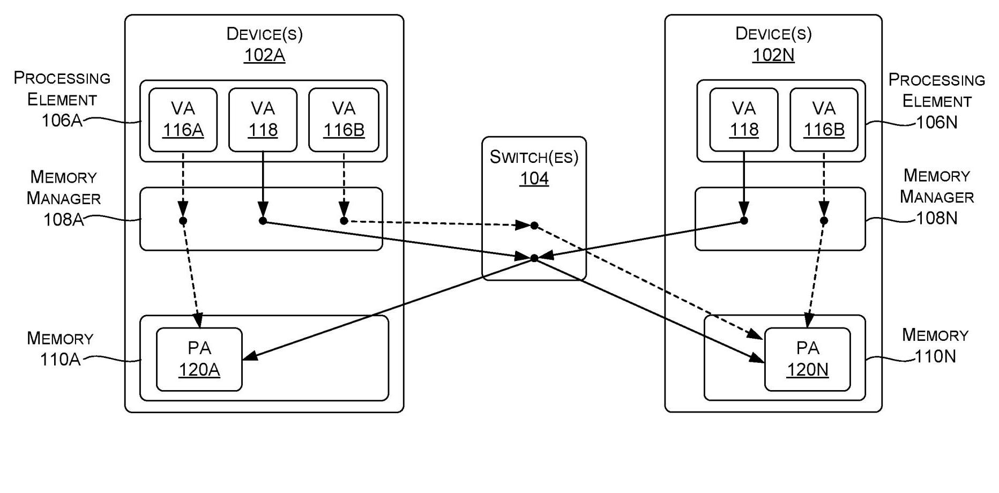
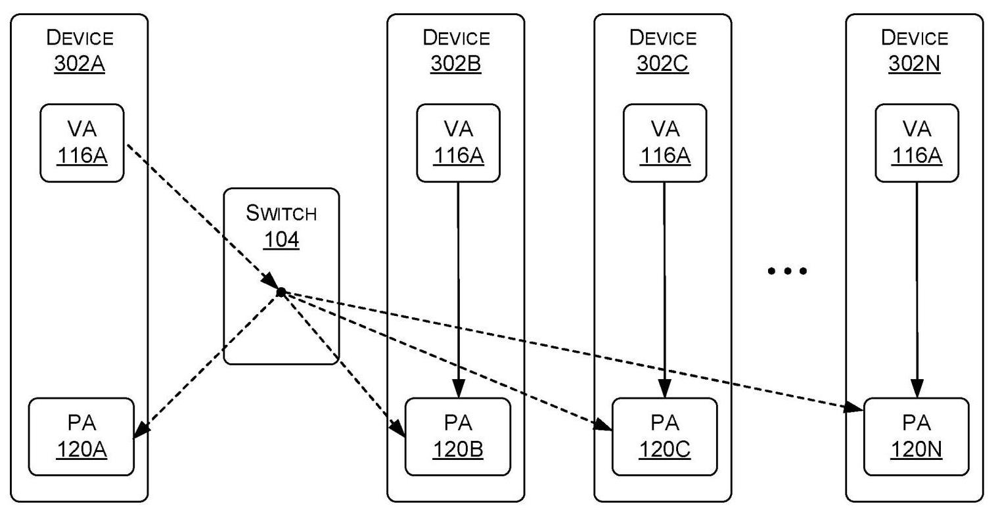
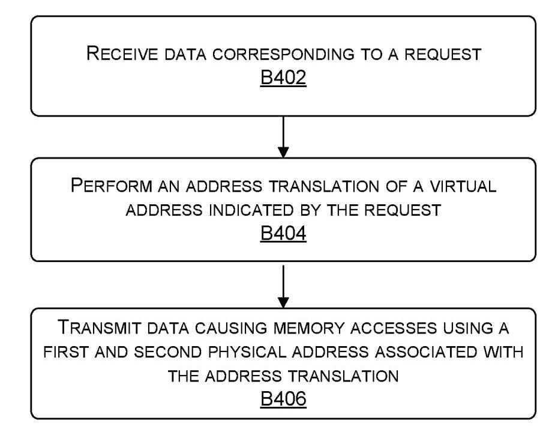
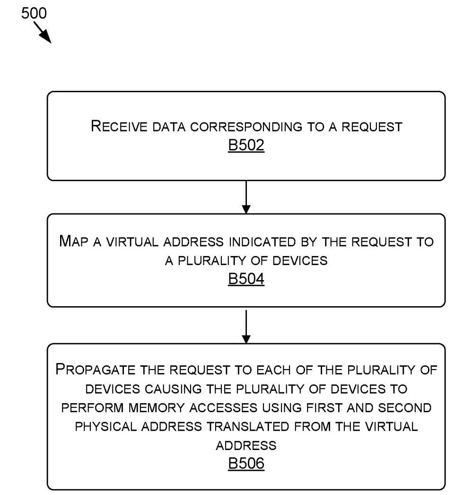

# Multicast and Reflective Memory Behavior for Memory Model Consistency 深度解读

> **发明人**：Glenn Alan Dearth; Mark Hummel; Daniel Joseph Lustig  
> **公开信息**：United States Patent Application Publication, US 2023/0229599 A1, 2023-07-20；申请人为 NVIDIA Corporation  
> **一句话总结**：这份专利提出把一个 memory access request 映射到多个物理地址的 multicast memory model，并用 separate VA space、multicast instructions、producer/consumer 权限约束和 reflective access path 来维持与传统 unicast memory model 一致的可观察行为。

## 一、问题定义

这份材料不是传统学术论文，而是一份美国专利公开文本。因此它的论证方式不是“提出假设并做实验验证”，而是围绕可申请的系统、方法与设备 claims 展开。核心问题仍然很清楚：在多 GPU、多 processing element 的协作计算中，传统 memory model 通常让一个 virtual address (VA) 映射到一个 physical address (PA)，这样任何 SM 或其他 processing element 使用同一个 VA 时都能访问同一处内存，从而维持 coherent memory interface。但 collective 操作，例如 all-reduce，需要从多个设备收集值并把结果再广播回多个设备；如果完全用 unicast request 实现，参与设备越多，请求数量、链路带宽压力和尾延迟越高。

专利的切入点是把“同一个请求只能访问一个 PA”的假设放松：一个 request 可以携带一个 VA，而该 VA 被翻译到多个 PA，分别对应多个 processing element 或设备的 local memory。这样，系统可以把一次 store、load、reduce 或 reducing load 传播到一个 multicast group，而不是让软件显式发出 N 次类似的请求。

**动机评估**：动机是 solid 的。背景段明确指出 all-reduce 在 deep learning 中高频出现，且收集和广播都可能随着参与 processing elements 数量线性增长。专利没有给出定量 profiling，但问题本身与多 GPU 训练、NVLink/NVSwitch 类互连和分布式 shared memory/collective communication 的实际瓶颈一致。弱点是它没有证明 multicast memory request 在具体硬件上能带来多少收益，也没有对比已有 collective offload 或通信库方案；它更像是在定义硬件/driver/地址翻译层面的可行机制和权利范围。

**核心 Insight**：只要 memory model 对程序暴露的结果仍与 unicast model 一致，底层不必真的逐个执行 unicast request。系统可以把 VA translation、switch propagation 和 access path constraints 组合起来，使一个逻辑 memory operation 在多个 PA 上执行，同时用权限、路径和顺序约束避免 multicast 与 unicast 混用时产生不可预测结果。这个 insight 把性能优化问题转化成了 memory consistency 问题：关键不是“能不能复制请求”，而是“复制之后程序还能不能观察到与原 memory model 相容的结果”。

## 二、相关工作

专利文本没有独立的 Related Work 章节，也没有学术引用；它只通过 Background 和 Detailed Description 隐式对比了几类已有思路。

第一类是传统 unicast virtual memory model。它的优点是语义简单：一个 VA 通常对应一个目标 PA，所有设备通过同一映射访问同一位置，coherency 的边界清晰。问题在于它天然按单目标访问建模，遇到 all-reduce、broadcast、replicated load 这类多目标操作时，需要软件或运行时发出多次请求。

第二类是软件 collective 或通信库路径。它可以在应用层安排 reduce 和 broadcast，但对 memory model 本身透明度较低：程序通常要调用通信原语、管理 buffer，并承担更多同步和调度逻辑。该专利的方向是把一部分 collective 行为下沉到 memory access request 处理路径，让 VA、MMU、switch 和 driver 共同完成 fanout 或 aggregation。

第三类是硬件互连与 switch-based routing。已有高性能互连可以让 GPU 间互访，但专利强调的不是单纯 routing，而是让 switch 或 memory manager 参与 VA-to-multiple-PA 的 mapping，并在必要时反射回请求源设备，以消除本地短路径和远端长路径之间的 ordering 差异。

因此，这份专利的“相关工作差距”可以概括为：传统 unicast model 保护一致性但多目标访问开销高；软件 collective 可表达多目标语义但需要显式参与；普通互连能转发数据但不必然提供 multicast VA space 与一致性约束。本文方案试图把三者合并为一种对应用显式或隐式可用的 memory model 扩展。

## 三、技术挑战

**挑战 1：一个 VA 对多个 PA 的语义必须仍然可理解。** 传统虚拟内存把 VA 当作单一位置的名字；一旦 VA 可以指向多个 PA，load、store、atomic、reduce 的含义会变得不直观。专利通过 separate multicast/unicast VA space、专用 multicast instruction，以及 mismatch fault 规则来限制歧义。

**挑战 2：multicast 和 unicast 混用会破坏顺序直觉。** 如果一个 multicast store 走 switch fanout，而随后一个 unicast store 走设备内部短路径，那么后发的 unicast store 可能先到达本地 PA。程序如果期望 request issue order 等价于各 PA 上的可见顺序，就会看到不稳定结果。

**挑战 3：本地路径与反射路径延迟不同。** 请求源设备访问自己的 local memory 可以直接走内部路径；访问其他设备则可能经过 switch。若对源设备使用短路径、对其他设备使用长路径，同一个 logical multicast operation 在不同设备上可能呈现不同时间点。专利引入 reflective memory behavior，让某些请求也经 switch 反射回源设备，以统一路径属性。

**挑战 4：系统需要决定 multicast 是显式还是透明。** 如果让应用显式创建 multicast VA 或使用 Store-MC/Reduce-MC 指令，语义控制更清楚，但需要软件改写。若系统透明地把 unicast patterns 优化成 multicast，兼容性更好，但需要 driver、page table、TLB 或监控逻辑识别安全场景。

**挑战 5：专利 claims 需要覆盖多个实施位置。** 该方案可以由 memory manager 做 VA translation，也可以由 switch 做 mapping 和 propagation，还可以作为 one or more devices 的硬件组件组合实现。不同实现位置的边界必须在方法 claims 中拆开描述。

## 四、解决方案

### 整体思路

专利提出的机制可以分成两层。第一层是 multicast addressing：某个 VA 被识别为 multicast VA，或者某条 instruction 被识别为 multicast instruction；memory manager 或 switch 将它翻译为多个 PA，并对多个设备或 processing elements 执行对应 memory accesses。第二层是 consistency constraints：系统限制哪些设备能写、哪些路径必须经过 switch、哪些 mismatch 需要 fault、哪些情况允许透明优化，从而让 multicast 的可观察结果与 unicast 语义相容。

FIG. 1 是理解方案的主图。VA 116A/116B 是 unicast VA，分别指向单个 PA；VA 118 是 multicast VA，可以从 device 102A 或 device 102N 发出，并经 memory manager/switch 映射到 PA 120A 和 PA 120N。图中的关键点不是“switch 能转发包”，而是 VA 命名空间本身区分了单目标访问与多目标访问。

### 贯穿示例

设想 4 张 GPU 正在训练同一个模型，每张 GPU 都有一份局部梯度 buffer。传统做法中，如果 GPU0 想把一个更新值写入所有 GPU 的对应 buffer，运行时可能要发 4 次 store 或调用一段 collective 通信逻辑。用这份专利的机制，driver 或应用先创建一个 multicast alias，例如 `VA_mc = CreateMulticastAlias(VA0, VA1, VA2, VA3)`。随后 GPU0 对 `VA_mc` 发出 `Store-MC`，memory manager 或 switch 把这个 VA 翻译到 4 个 PA，并向每张 GPU 的 local memory 传播 store。若之后消费者 GPU 只需要读自己的 replica，就可以走本地 load；若生产者 GPU 的 load/store 顺序可能与其他设备不同，系统可以要求它也通过 switch 反射访问，避免本地短路径先完成导致的顺序异常。

这个例子串起了三件事：multicast alias 负责表达“同一逻辑地址对应多个副本”；multicast instruction 或 VA space 负责告诉硬件这不是普通 unicast；reflective path 和 producer/consumer 权限负责让优化不改变程序期望的结果。

### 关键技术点

**1. Separate VA spaces 或 instruction encoding。** 专利给出两种表达 multicast 的方式：一种是把 VA 划分为 unicast VA space 和 multicast VA space，VA 本身决定翻译结果；另一种是使用专门 multicast instructions 或共享 instruction 的参数来指示 multicast/unicast。前者的优点是可以保留 unicast syntax，后者的优点是语义在 instruction 层更直接。

**2. 操作类型规则。** FIG. 2 的表格给出一组示例规则：普通 Store/Load/Atomic/Reduce 面对 unicast VA 正常执行；面对 multicast VA 时可以 fault 或只作用于 target PA。Reducing Load、Store-MC、Reduce-MC 属于 multicast 指令，面对 unicast VA 时 fault，面对 multicast VA 时执行 multicast 语义。这个表的作用是明确 mismatch behavior，避免程序员或硬件在“指令是 multicast 但地址是 unicast”这类组合上产生隐式解释。

**3. Reducing load、multicast store 与 reduce multicast。** Reducing load 会从 multicast group 的多个 PA 取回 N 个值，再用 sum、average、min、max、bitwise operation 等方式合并成 aggregated data。Store-MC 把一个或多个值写到多个节点。Reduce-MC 类似对多个 PA 执行 atomic/reduce，但不向请求者返回结果。这几类指令覆盖了 collective communication 中常见的 broadcast 和 reduction 模式。

**4. Reflective memory behavior。** 当源设备访问自己的 local memory 时，内部路径通常更短；但如果 multicast 请求对源设备走内部路径、对其他设备走 switch，就可能产生 ordering skew。专利提出让 producer 的某些请求也转发到 switch，再反射回自身，从而让本地 PA 与远端 PA 经历类似的 ordering point。

FIG. 3 展示的是带约束的 multicast 场景。device 302A 可以作为 producer，经 switch 104 把 VA 116A 相关访问传播或反射到多个 PA；其他 device 302B/302C/302N 可以作为 consumer，从本地 replica 读取。图中虚线表示通过 switch 的传播/反射路径，实线表示本地 VA 到 PA 的访问；专利用这种路径约束来减少 race condition 和路径延迟差异带来的不一致。

**5. 显式 hint 与自动 pattern recognition。** 系统可以由应用通过 API/driver message 显式提示哪些 VA 需要 replication 或 multicast，也可以通过计数器、监控或 pattern recognition 发现某些 VA 经常被多个请求写入相同值或被多个设备读取，从而动态把 VA 迁移到 multicast/replicated 处理路径。这一点让方案既能服务新 API，也能作为旧程序的透明优化。

**6. Claims 的实现边界。** Claims 1-9 偏向 memory manager/MMU：接收 request，翻译 VA 到多个 PA 或 intermediate addresses，再传输数据触发多处访问。Claims 10-17 偏向 switch：接收 request，map VA 到多个 devices，propagate request。Claims 18-20 则把范围提升到 one or more devices/hardware components，并特别覆盖 reducing load 的聚合返回。

FIG. 4 把 MMU 侧流程压缩成三步：接收请求、执行地址翻译、发送会导致多个 PA 上 memory accesses 的数据。这对应 claim 1 的主干。

FIG. 5 则是 switch 侧主干：接收请求、把 VA 映射到多个 devices、向每个 device 传播请求。它对应 claim 10 的主干，说明专利并不把 multicast translation 固定在 MMU 内部。

### 与已有方案的对比

相比纯软件 collective，这个方案的优势是能把 fanout、aggregation 和 replication 放到 memory system/互连层，减少应用显式发起的重复 request 数量，也可能减少 collective 操作的尾延迟。相比传统 unicast VA model，它扩展了地址翻译语义，让一个 VA 可以自然表达一组 PA。相比简单硬件 multicast routing，它额外关心 memory model consistency，通过 mismatch fault、producer/consumer 权限和 reflective path 约束来避免程序观察到不一致。

不足也很明显。专利没有给出任何性能数据，也没有说明硬件成本、TLB/page table 扩展成本、fault/transition 开销、switch aggregation 复杂度，或与现有 GPU memory consistency model 的精确定义如何组合。它描述的是一组可实施机制和权利范围，而不是一个完整可复现实验系统。

## 五、实验评估

### 实验设定

本文没有实验评估。它没有提供硬件原型、模拟器、baseline、benchmark、latency/bandwidth 指标或 all-reduce workload 的定量结果。FIG. 4-6 是方法流程图，不是实验流程；FIG. 7-8 是通用 computing device 和 data center boilerplate。

### 主要实验与结论

没有可报告的实验数据。能够从文本中提取的“效果声明”主要是定性判断：multicast 可以减少本来需要多个 unicast requests 的请求数量；replicated local load 可以让 consumer 从本地 replica 读取，而不是经较慢路径访问同一 PA；reflective path 可以避免本地短路径造成的 ordering 差异。但这些都是设计动机和实施例推理，并非经测量验证的结果。

### 结论支撑性分析

作为专利文本，它足以支撑“存在一种系统/方法可以这样实现”的权利要求框架；作为论文证据，它对性能收益的支撑不足。最缺的是三个实验：第一，N 张 GPU 上 multicast store/reducing load 相比软件 collective 或 N 次 unicast 的延迟/带宽对比；第二，reflective path 带来的额外延迟与一致性收益；第三，自动 pattern recognition 触发 multicast replication 的误判率、迁移开销和适用 workload。

## 六、附加洞察

**结论 1：专利并不要求 multicast 必须暴露给应用，系统可以透明替换 unicast pattern。**  
- *出处*：Summary [0004]、Detailed Description [0038]-[0054]。  
- *推理链条*：文本先说明 multicast 可以由 separate instructions 或 multicast VA 显式表达，再说明系统也可以在 process/application 不感知的情况下决定使用 multicast；随后给出 hint、counter、pattern recognition 和 fault transition 的实现路径。因此该方案的权利范围覆盖“新 API”与“旧程序透明优化”两条路线。薄弱点是透明优化对 memory consistency 判断要求更高，专利没有给出静态或动态判定的完整算法。

**结论 2：reflective access path 的主要价值不是性能，而是一致性。**  
- *出处*：Detailed Description [0037]-[0045]。  
- *推理链条*：文本先指出多个 multicast/unicast operation 由于各路径延迟不同可能乱序；再举例说明后发的本地 unicast store 可能早于先发的 multicast store 完成；最后提出 producer 请求经 switch 反射回本地，以避免短内部路径绕过统一 ordering point。因此 reflective behavior 是为了解决路径不对称导致的可观察差异，而不只是为了让数据“回到自己”。

**结论 3：producer/consumer 权限约束是把 replicated memory 做成安全优化的关键。**  
- *出处*：Detailed Description [0041]-[0042]、[0047]-[0048]。  
- *推理链条*：如果多个设备都能写同一 VA 的多个 replica，就会出现 race 和副本分歧；专利把某些设备定义为 producer，其他设备定义为 read-only consumer，使写入来源受控，消费者从本地 replica 读取时不必与其他写者竞争。这个推理合理，但依赖 workload 符合单生产者或受控生产者模式。

**结论 4：层次化 multicast group 暗示该机制可以跨多个 switch 扩展。**  
- *出处*：Detailed Description [0021]。  
- *推理链条*：文本说明多个 switch 可以形成不同 multicast groups，且 group/subgroup 可具有层次关系，subgroup 结果可以作为 group 中一个节点的结果。这为大规模系统中的分层 reduction/broadcast 留出空间，但专利没有展开具体树形算法、负载均衡或故障处理。

## 七、总结与评价

这份专利的核心贡献是把 collective-style 多目标访问纳入 memory model：一个 VA 或一条 multicast instruction 可以触发多个 PA 上的 memory accesses，并可在 switch 或 MMU 层完成 fanout/aggregation。它最有价值的部分不是“支持 multicast”这个单点，而是把 multicast 与 coherent memory interface 绑定起来，明确讨论了 VA space、instruction mismatch、producer/consumer 权限和 reflective path。

最大的亮点是视角贴近现代多 GPU 系统：all-reduce、replicated local load、switch aggregation 和路径一致性确实是高性能 GPU 互连中的真实问题。最大的不足是缺少可验证的性能和一致性模型细节；专利说明了很多“可以这样做”的实施例，但没有说明哪种组合在真实硬件中最划算。后续若把它发展成研究论文，最值得补的是形式化 memory consistency 条件、硬件实现成本，以及深度学习 collective workload 下的端到端收益。

## 八、章节脉络与段落速览

- **Front Matter · Publication Metadata**：给出公开编号、日期、标题、申请人、发明人、分类号和摘要。
  - ¶封面：标识 US 2023/0229599 A1、NVIDIA 申请人、三位发明人和公开日期。
  - ¶Abstract：概括一个 request 可被传播到多个 PA，并说明 multicast 可显式暴露或由系统透明决定，同时需施加一致性约束。
  - ¶Figures/Table：列出 FIG. 1-8 与 FIG. 2 操作表，其中 FIG. 1-6 是技术核心，FIG. 7-8 是通用系统环境。

- **BACKGROUND [0001]-[0002]**：提出多 processing element 协作计算中的 unicast memory model 开销问题。
  - ¶0001：说明 GPU/SM 等 processing elements 通过 VA-to-PA memory model 协调读写，传统 coherent interface 通常让一个 VA 指向一个 PA。
  - ¶0002：用 all-reduce 说明收集和广播会随参与 processing elements 数量增加而增加请求数，进而带来延迟和带宽压力。

- **SUMMARY [0003]-[0004]**：概括 multicast memory access request 与一致性约束。
  - ¶0003：声明公开内容是用于 memory model consistency 的 multicast 和 reflective memory behavior。
  - ¶0004：说明单个 request 可以传播到多个 PA，multicast 可通过专用指令、共享指令参数、VA 或系统透明决策触发，并受 coherent interface 约束。

- **BRIEF DESCRIPTION OF THE DRAWINGS [0005]-[0013]**：索引每张图的作用。
  - ¶0005-0011：分别说明 FIG. 1 的 separate VA space、FIG. 2 的操作规则表、FIG. 3 的约束模型、FIG. 4-6 的方法流程。
  - ¶0012-0013：说明 FIG. 7-8 是可承载实施例的 generic computing device 和 data center。

- **DETAILED DESCRIPTION [0014]-[0016]**：重新定义总体方案。
  - ¶0014：重申目标是在 processing elements 之间提供 multicast request，同时保持 unicast memory model 兼容性。
  - ¶0015：说明 request 指示 VA，VA 可映射到多个 PA，switch 可在设备内部或外部传播请求。
  - ¶0016：说明 process 可显式指定 multicast group/VA，也可让系统透明选择 multicast/unicast，并通过约束保持 coherent interface。

- **FIG. 1 Embodiment [0017]-[0031]**：解释 separate unicast/multicast VA spaces。
  - ¶0017-0024：定义 collaborative processing environment，包括 devices、switch、processing elements、memory managers 和 local memories。
  - ¶0025-0026：说明 VA 可先翻译成 PA 或 intermediate address，再由 switch/TLB/设备继续翻译到 PA。
  - ¶0027-0028：对比 unicast VA 116A/116B 与 multicast VA 118，后者能映射到 PA 120A 与 PA 120N。
  - ¶0029-0030：给出 `Malloc()` 和 `CreateMulticastAlias()` 风格 API，说明 multicast VA 可由已有 unicast VA 的 PA 组成。
  - ¶0031：说明也可以不用 separate VA spaces，而由 instruction 或 operand 指示 multicast/unicast。

- **FIG. 2 Operation Rules [0032]-[0036]**：说明不同指令和地址空间组合的行为。
  - ¶0032：描述 mismatch 处理策略，unicast instruction 对 multicast VA 可 fault 或作用于 target PA，multicast instruction 对 unicast VA 可 fault。
  - ¶0033：说明源设备本地路径可能比经 switch 反射路径更短，是否使用内部路径可由软件协议选择。
  - ¶0034-0035：定义 reducing load，并说明 aggregation 可在 switch 或设备上完成。
  - ¶0036：定义 multicast store 和 reduce multicast。

- **Ordering and Constraints [0037]-[0054]**：讨论为什么需要 reflective behavior 和权限/路径约束。
  - ¶0037-0038：指出异步 multicast/unicast 混用可能因路径延迟导致乱序，并说明系统可用约束隐藏 multicast。
  - ¶0039-0040：引入 FIG. 3 的 constrained collaborative processing environment。
  - ¶0041-0042：用 producer/write access 与 consumer/read-only access 避免多个写者造成 race。
  - ¶0043-0045：要求某些 producer 请求经 switch 反射回源设备，以避免本地短路径绕过顺序。
  - ¶0046-0048：允许软件声明 no race condition，并要求 multicast 结果与 non-multicast 结果一致。
  - ¶0049-0051：说明 multicast 可替代多个 unicast requests 或预先复制数据以加速后续 local loads。
  - ¶0052-0054：给出 hint、API、driver-level message、counter 和 pattern recognition 等触发方式。

- **Method 400 [0055]-[0059]**：描述 memory manager/MMU 侧方法。
  - ¶0055-0056：说明流程图 block 可由硬件、固件或软件执行。
  - ¶0057：接收来自 processing element 的 memory access request。
  - ¶0058：对 request 中的 VA 做地址翻译，得到至少两个 PA。
  - ¶0059：向 switch 或后续组件传输翻译结果，触发多个 memory accesses。

- **Method 500 [0060]-[0063]**：描述 switch 侧方法。
  - ¶0060-0061：switch 接收来自 processing element 的 request data。
  - ¶0062：switch 将 VA、intermediate address 或 PA 映射到多个 devices。
  - ¶0063：switch 向每个 device 传播请求，使各 device 使用对应 PA 访问内存。

- **Method 600 [0064]-[0066]**：抽象化总流程。
  - ¶0064-0066：把方案压缩为“VA 翻译到多个 PA”和“使用多个 PA 执行 memory accesses”两步。

- **Example Computing Device [0067]-[0082]**：给出通用计算设备实施环境。
  - ¶0067-0069：说明 computing device 700 包含 memory、CPU、GPU、communication interface、logic units 等。
  - ¶0070-0078：展开 interconnect、computer-readable media、CPU/GPU/logic unit 和通信接口的通用定义。
  - ¶0079-0082：描述 I/O、power 和 presentation components，属于专利 boilerplate。

- **Example Data Center and Network [0083]-[0102]**：给出数据中心、云和网络实施环境。
  - ¶0083-0087：说明 data center infrastructure、framework、software 和 application layers。
  - ¶0088-0092：描述 machine learning、training/inference 和 resource orchestration 场景。
  - ¶0093-0099：描述 client-server、peer-to-peer、cloud 和 edge network environments。
  - ¶0100-0102：给出 computer-executable instructions 与 claim interpretation 的通用法律文本。

- **Claims 1-20**：把实施例拆成 MMU 方法、switch 方法和硬件设备范围。
  - Claims 1-9：覆盖接收 request、将 VA 翻译到多个 PA/intermediate addresses 并发送数据触发访问的 memory manager/MMU 路径。
  - Claims 10-17：覆盖 switch 接收 request、把 VA 映射到多个 devices 并传播请求的路径。
  - Claims 18-20：覆盖由 hardware components 组成的设备实现，特别包含 loading values、combining aggregated value 并返回的 reducing load。
