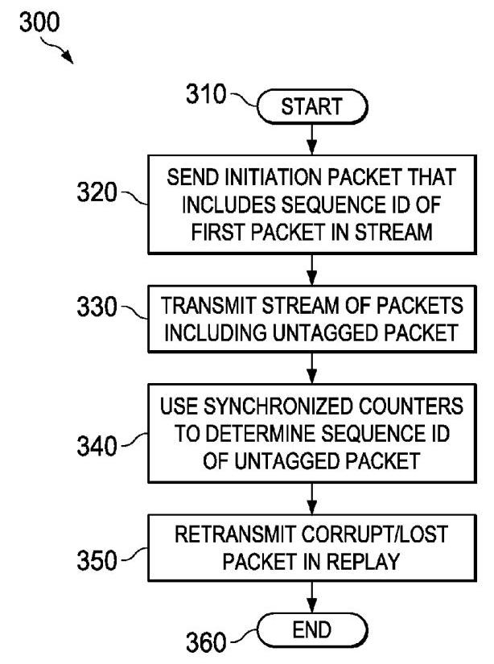
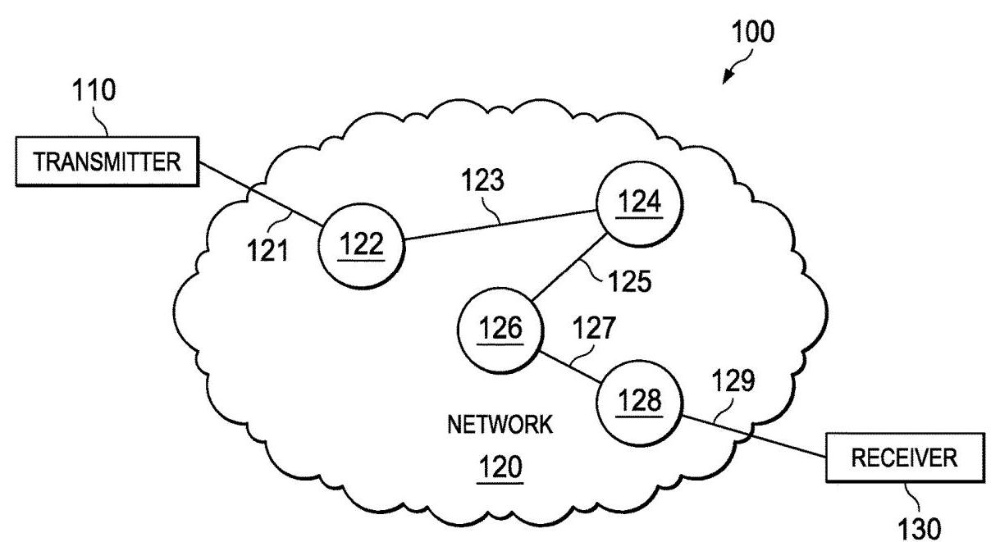
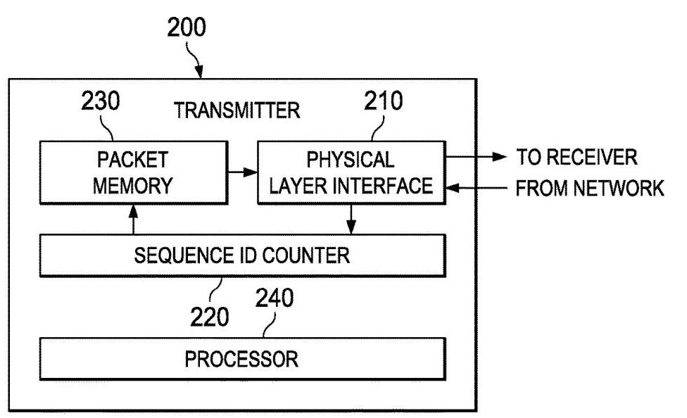
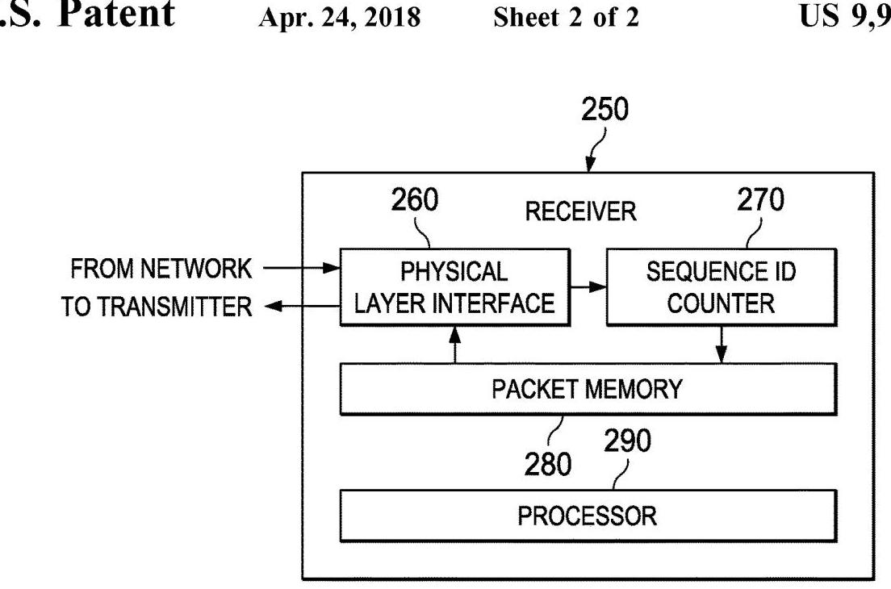
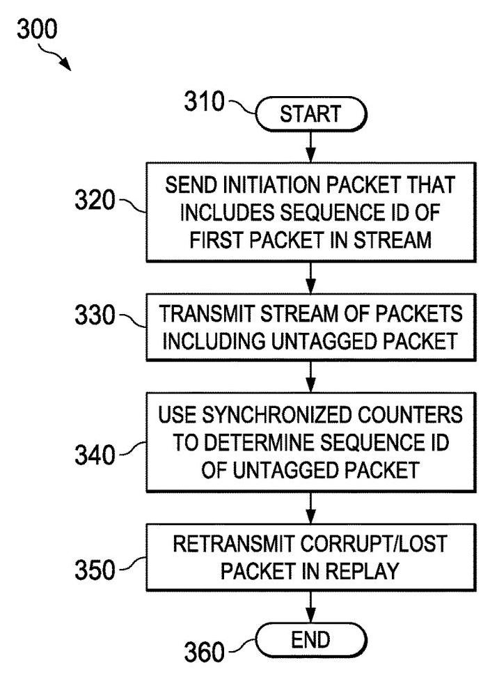

(12) United States Patent (10) Patent No.: US 9,954,984 B2

> 
(12) 美国专利
(10) 专利号：US 9,954,984 B2

(45) Date of Patent: Apr. 24, 2018

> 
(45) 专利日期：2018年4月24日

(54) SYSTEM AND METHOD FOR ENABLING REPLAY USING A PACKETIZED LINK PROTOCOL

> 
该专利提出了一种系统和方法，用于在分组化链路协议中实现重播（重传丢失或损坏的数据包），而无需在每个数据包中嵌入标识标签。所解决的主要问题是，为了错误恢复而在每个数据包中嵌入 ID 标签所导致的带宽开销。

关键创新在于在发送端和接收端均使用同步的序列 ID 计数器。无需为每个数据包打标签，而是在流开始前发送一个发起包（该包可携带第一个数据包的序列 ID），以同步计数器。后续的大多数数据包保持无标签状态；它们的序列 ID 可通过同步计数隐含地确定。只有少数数据包，例如流或重播的第一个数据包，可能会被显式地打上标签。当数据信道空闲时，计数器还可重新同步。

对于重播，当检测到数据包损坏（通过 CRC）或丢失（通过隐式序列 ID 不匹配）时，发送端会发送一个不可重播的重播发起包，其中包含待重发的第一个数据包的序列 ID。计数器使得接收端能够识别任何无标签的重播数据包。这种方法最大限度地减少了带内标签的使用，在恢复带宽的同时仍支持可靠重传。

因此，该方法通过使用同步计数器和有限的显式标签来隐式地对数据包编号，从而降低了开销，在不降低带宽的情况下维持错误恢复。

(71) Applicant: Nvidia Corporation, Santa Clara, CA (US)

> 
(71) 申请人：英伟达公司，美国加利福尼亚州圣克拉拉

(72) Inventors: Dennis Ma, Santa Clara, CA (US); Michael Osborn, Santa Clara, CA (US); Eric Tyson, Santa Clara, CA (US); Stephen D. Glaser, Santa Clara, CA (US); Marvin Denman, Santa Clara, CA (US); Jonathan Owen, Santa Clara, CA (US); Mark Hummel, Santa Clara, CA (US)

> 
(72) 发明人：Dennis Ma, Santa Clara, CA (US)；Michael Osborn, Santa Clara, CA (US)；Eric Tyson, Santa Clara, CA (US)；Stephen D. Glaser, Santa Clara, CA (US)；Marvin Denman, Santa Clara, CA (US)；Jonathan Owen, Santa Clara, CA (US)；Mark Hummel, Santa Clara, CA (US)

(73) Assignee: Nvidia Corporation, Santa Clara, CA (US)

> 
(73) 专利权人：英伟达公司，美国加利福尼亚州圣克拉拉 (US)

(*) Notice: Subject to any disclaimer, the term of this patent is extended or adjusted under 35 U.S.C. 154(b) by 27 days.

> 
(*) 注意：在遵守任何免责声明的前提下，本专利的有效期根据35 U.S.C. 154(b)延长或调整了27天。

(21) Appl. No.: 14/883,322

> 
申请号：14/883,322

(22) Filed: Oct. 14, 2015

> 
(22) 申请日：2015年10月14日

(65) Prior Publication Data

> 
(65) 在先公开数据

US 2017/0111144 A1 Apr. 20, 2017

> 
该专利提出一种系统和方法，用于在分组化链路协议中实现重放（重传丢失或损坏的数据包），而无需在每个数据包中添加标识标签。解决的主要问题是为错误恢复而在每个数据包中嵌入 ID 标签所导致的带宽开销。

关键创新在于在发送端和接收端均使用同步的序列 ID 计数器。无需为每个数据包打标签，而是在数据流之前发送一个启动包（可能携带第一个数据包的序列 ID）来同步计数器。随后的大多数数据包保持无标签状态；其序列 ID 由同步计数隐式确定。只有少数数据包，例如数据流或重放的首个数据包，可能会被显式标记。还可在数据信道空闲时重新同步计数器。

对于重放，当检测到数据包损坏（通过 CRC）或丢失（通过不匹配的隐式序列 ID）时，发送端会发送一个不可重放的重放启动包，其中包含要重发的第一个数据包的序列 ID。计数器使接收端能够识别任何无标签的重放包。这种方法最大限度地减少了带内标签的使用，在恢复带宽的同时仍支持可靠重传。

因此，该方法通过使用同步计数器和有限的显式标记来隐式地为数据包编号，从而减少了开销，在不降低带宽的情况下保持错误恢复。

(51) Int. Cl.

> 
(51) 国际专利分类

H04L 29/08 (2006.01)

> 
H04L 29/08 (2006.01)

H04L 1/18 (2006.01)

> 
H04L 1/18 (2006.01)

(52) U.S. Cl.

> 
（52）美国分类号

CPC

> 
该专利提出了一种在分组化链路协议中实现重放（重传丢失或损坏的数据包）而无需在每个数据包中嵌入标识标签的系统和方法。所解决的主要问题是为错误恢复而在每个数据包中嵌入ID标签所导致的带宽开销。

关键创新在于在发送端和接收端均使用同步的序列ID计数器。不用为每个数据包打标签，而是在流传输之前发送一个启动包（该包可携带第一个数据包的序列ID）来同步计数器。大多数后续数据包保持无标签状态；其序列 ID 由同步的计数值隐式确定。仅少数数据包，例如流或重放的第一个数据包，可能会被显式标记。当数据通道空闲时，计数器也可重新同步。

对于重放，当检测到数据包损坏（通过CRC）或丢失（通过隐式序列ID不匹配）时，发送端会发送一个不可重放的重放启动包，其中包含要重发的第一个数据包的序列ID。计数器使得接收端能够识别任何无标签的重放数据包。这种方法最大程度地减少了带内标签的使用，在保持可靠重传的同时回收了带宽。

因此，该方法通过使用同步计数器和有限的显式标记为数据包隐式编号，减少了开销，在不降低带宽的前提下保持了错误恢复能力。

CPC

H04L 69/324 (2013.01); H04L 1/1809 (2013.01); H04L 69/323 (2013.01)

> 
H04L 69/324 (2013.01); H04L 1/1809 (2013.01); H04L 69/323 (2013.01)

(58) Field of Classification Search

> 
(58) 分类检索领域

None

> 
该专利提出了一种系统和方法，用于在分组化链路协议中实现重传（重新传输丢失或损坏的数据包），而无需在每个数据包中嵌入标识标签。所解决的主要问题是为实现差错恢复而在每个数据包中嵌入 ID 标签所带来的带宽开销。

其关键创新在于在发送端和接收端使用同步的序列号计数器。并非给每个数据包打标签，而是在传输流之前发送一个初始化包（可能携带第一个数据包的序列号）来同步计数器。后续的大多数数据包不带标签；它们的序列号根据同步的计数值隐式确定。仅少数数据包，如流的第一个包或重传包，可能被显式打上标签。当数据信道空闲时，计数器还可重新同步。

对于重传，当检测到数据包损坏（通过 CRC）或丢失（通过隐式序列号不匹配）时，发送端会发送一个不可重传的重传初始化包，其中包含待重传的第一个数据包的序列号。计数器使接收端能够识别任何未打标签的重传包。这种方法最大限度地减少了带内标签的使用，在恢复带宽的同时仍支持可靠的重传。

因此，该方法通过使用同步计数器和有限的显式标签对数据包进行隐式编号，降低了开销，在不降低带宽的情况下保持了差错恢复能力。

See application file for complete search history.

> 
完整的检索历史请参见申请文件。

(56) References Cited

> 
(56) 引用文献

本专利提供一种在分组化链路协议中实现重放（重传丢失或损坏的数据包）的系统和方法，无需在每个数据包中要求识别标签。所解决的主要问题是因在每个数据包中嵌入ID标签以进行错误恢复而造成的带宽开销。

关键创新在于在发送端和接收端均使用同步的序列号计数器。并非为每个数据包打标签，而是在一个流之前发送一个启动包（该包可能携带第一个数据包的序列号）来同步计数器。大部分后续数据包保持无标签状态；它们的序列号根据同步计数隐式确定。仅有少数数据包，例如一个流的第一个数据包或重放包，才可能被显式标记。当数据信道空闲时，计数器也可重新同步。

对于重放，当检测到数据包损坏（通过CRC）或丢失（通过隐式序列号不匹配）时，发送端发送一个不可重放的重放启动包，其中包含待重发的第一个数据包的序列号。计数器使接收端能够识别任何无标签的重放包。该方法最大限度地减少了带内标签的使用，在恢复带宽的同时仍支持可靠的重传。

因此，该方法通过使用同步计数器和有限的显式标记来隐式地对数据包进行编号，从而降低了开销，并能在不降低带宽的情况下保持错误恢复。

U.S. PATENT DOCUMENTS

> 
美国专利文献

2004/0042491 A1* 3/2004 Sarkkinen ............. H04L 1/1642

> 
2004/0042491 A1* 2004年3月 萨基宁 ............. H04L 1/1642

370/469

> 
本专利提出一种在分包链路协议中实现重放（对丢失或损坏数据包的重传）而无需在每个数据包中加入标识标签的系统和方法。其要解决的主要问题是，为进行差错恢复而在每个数据包中嵌入ID标签所带来的带宽开销。

关键创新在于，在发送端和接收端均使用同步的序列ID计数器。不是在每个数据包中打标签，而是在一个流开始之前发送一个起始包（其中可携带第一个数据包的序列ID）来同步计数器。大多数后续数据包不再带标签；它们的序列ID由同步计数值隐含确定。只有少数数据包，例如一个流或重放中的第一个数据包，才可能会显式打上标签。当数据信道空闲时，计数器也可重新同步。

在重放过程中，当检测到数据包损坏（通过CRC）或丢失（通过隐含序列ID不匹配）时，发送端会发送一个不可重放的、重放起始包，其中包含待重发的第一个数据包的序列ID。计数器使接收端能够识别任何未带标签的重放数据包。这种方法最大限度地减少了对带内标签的使用，从而在保证可靠重传的同时回收带宽。

因此，该方法通过利用同步计数器和有限的显式标签来对数据包进行隐含编号，降低了开销，在不降低带宽的情况下维持了差错恢复。

2007/0047591 A1* 3/2007 Senthilnathan ....... H04L 1/0041

> 
2007/0047591 A1* 3/2007 Senthilnathan ....... H04L 1/0041

370/503

> 
370/503

2008/0049757 A1* 2/2008 Bugenhagen ....... H04L 12/2602

> 
2008/0049757 A1* 2008年2月 Bugenhagen ....... H04L 12/2602

370/395.1

> 
370/395.1

2010/0088569 A1* 4/2010 Sorbara ............ H03M 13/6306

> 
2010/0088569 A1* 2010年4月 Sorbara ............ H03M 13/6306

714/751

> 
该专利提出了一种系统和方法，用于在分组化链路协议中实现重传（即重新发送丢失或损坏的数据包），而无需在每个数据包中附加标识标签。所要解决的主要问题在于，为进行差错恢复而在每个数据包中嵌入ID标签所导致的带宽开销。

其关键创新是在发送端和接收端均使用同步的序列ID计数器。并非为每个数据包都打上标签，而是在数据流之前发送一个启动包（可携带第一个数据包的序列ID）来同步计数器。后续的大多数数据包保持无标签状态；它们的序列ID由同步的计数值隐式确定。只有少数数据包，如数据流的第一个包或重传包，才可能进行显式标记。当数据信道空闲时，计数器也可重新同步。

对于重传，当检测到数据包损坏（通过CRC）或丢失（通过不匹配的隐式序列ID）时，发送端会发送一个不可重传的重传启动包，其中包含要重新发送的第一个数据包的序列ID。接收端借助计数器可识别任何无标签的重传包。这种方法最大限度地减少了带内标签的使用，在恢复带宽的同时，仍能支持可靠的重传。

因此，该方法通过利用同步计数器和有限的显式标记对数据包进行隐式编号，降低了开销，既保持了差错恢复能力，又不降低带宽。

* cited by examiner

> 
* 审查员引用

Primary Examiner - Mujtaba M Chaudry

> 
主审查员 - Mujtaba M Chaudry

## (57)ABSTRACT

A receiver, transmitter and method for enabling a replay using a packetized link protocol are provided. In one embodiment, the method includes: (1) transmitting a stream of packets including an untagged packet and (2) using synchronized counters to determine a sequence ID of the untagged packet, which is a corrupt/lost packet that needs to be retransmitted.

> 
提供了一种接收器、发送器以及用于实现使用分组化链路协议的重传的方法。在一个实施例中，该方法包括：（1）发送包括一个未标记数据包的数据包流，以及（2）使用同步计数器来确定该未标记数据包的序列ID，该未标记数据包是需要被重传的损坏/丢失的数据包。

20 Claims, 2 Drawing Sheets

> 
本发明提出一种用于在分组链路协议中实现重放（重传丢失或损坏的分组）而无需在每个分组中包含标识标签的系统和方法。其主要解决的问题是，为了错误恢复而在每个分组中嵌入标识标签所带来的带宽开销。

关键的创新之处在于，在发送端和接收端均使用同步的序列标识计数器。取代为每个分组打标签的做法，在数据流之前发送一个起始分组（可携带第一个分组的序列标识），从而使计数器同步。大多数后续分组保持无标签状态；它们的序列标识通过同步的计数隐式确定。仅少数分组，例如数据流或重放的第一个分组，会被显式地打上标签。当数据通道空闲时，计数器也可重新同步。

在重放方面，当通过CRC检测到分组损坏，或通过隐式序列标识不匹配检测到分组丢失时，发送端会发送一个不可重放的重放起始分组，其中包含需要重发的第一个分组的序列标识。借助计数器，接收端能够识别任何无标签的重放分组。该方法最大限度地减少了带内标签的使用，在恢复带宽的同时，仍然支持可靠的重传。

因此，该方法通过使用同步计数器和有限的显式标签来隐式地为分组编号，在维持错误恢复能力的同时降低了开销，且不降低带宽。

FIG. 1

> 
图 1

FIG. 2A

> 
图2A

FIG. 2B

> 
FIG. 2B

FIG. 3

> 
图3

## 1 SYSTEM AND METHOD FOR ENABLING REPLAY USING A PACKETIZED LINK PROTOCOL

## TECHNICAL FIELD

This application is directed, in general, to a communication protocol between devices and, more specifically, to a system and method of enabling a replay using a packetized link protocol.

> 
本申请一般涉及设备之间的通信协议，更具体地，涉及一种通过分组化链路协议实现重传的系统和方法。

## BACKGROUND

A communication, or link, protocol is a system of rules that allows two or more devices to communicate data with each other. A link protocol defines the syntax, semantics and synchronization of the communication that takes place and establishes error recovery mechanisms for re-establishing communication should errors occur. If the data is contained in packets, the protocol is termed a packetized protocol.

> 
通信协议，或称链路协议，是一套允许两个或多个设备相互交换数据的规则体系。链路协议定义了所发生通信的语法、语义和同步机制，并建立在出现错误时恢复通信的错误恢复机制。如果数据被封装在分组中，该协议则被称为分组化协议。

One of the error recovery mechanisms commonly provided in a link protocol is a replay mechanism. The replay mechanism allows a receiving device to request a transmitting device (a "transmitter") to retransmit data that is lost or corrupted during communication. Conventional error recovery mechanisms for packetized link protocols employ an identifying tag, or ID tag, in each packet of data transmitted between devices such that the receiving device (a "receiver") can determine, and request the resending of only, the packets that are lost or corrupted. The transmitter therefore only has to resend those packets. The ID tags are usually communicated "in-band," that is, they are embedded in the packets themselves, and not in a separate stream. These error recovery mechanisms have proven reliable and are in wide use today, particularly in the context of streaming video.

> 
链路协议中通常提供的错误恢复机制之一是重放机制。重放机制允许接收设备请求发送设备（“发送器”）重传在通信过程中丢失或损坏的数据。用于分组化链路协议的传统错误恢复机制在每个设备间传输的数据包中使用一个识别标签或ID标签，以便接收设备（“接收器”）能够确定并仅请求重新发送丢失或损坏的数据包。因此，发送器只需重新发送那些数据包。ID标签通常通过“带内”方式通信，即它们被嵌入数据包本身，而不是在单独的流中。这些错误恢复机制已被证明可靠，并在当今广泛使用，特别是在视频流的背景下。

## SUMMARY

One aspect provides a method for enabling a replay using a packetized link protocol. In one embodiment, the method includes: (1) transmitting a stream of packets including an untagged packet and (2) using synchronized counters to determine a sequence ID of the untagged packet, which is a corrupt/lost packet that needs to be retransmitted.

> 
一个方面提供了一种利用分组链路协议实现重放的方法。在一个实施例中，该方法包括：（1）传输一个包含无标签包的数据包流，以及（2）使用同步计数器来确定该无标签包的序列标识，该包是需重传的损坏/丢失包。

Another aspect provides a transmitter for enabling a replay using a packetized link protocol. In one embodiment, the transmitter includes: (1) a physical layer interface configured to transmit a stream of packets including an untagged packet and (2) a transmitter sequence ID counter synchronized with a receiver sequence ID counter and configured to count a number of received packets in the stream. The transmitter sequence ID counter and the receiver sequence ID counter are used to determine a sequence ID of the untagged packet.

> 
另一个方面提供了一种用于使用分组化链路协议实现重放的发射机。在一个实施例中，该发射机包括：（1）物理层接口，被配置为发送包含未标记分组的分组流；以及（2）发射机序列ID计数器，与接收机序列ID计数器同步并被配置为对所述流中已接收的分组数量进行计数。所述发射机序列ID计数器和所述接收机序列ID计数器用于确定所述未标记分组的序列ID。

In yet another aspect provides a receiver for enabling a replay using a packetized link protocol. In one embodiment, the receiver includes: (1) a physical layer interface configured to receive a stream of packets including an untagged packet and (2) a receiver sequence ID counter synchronized with a transmitter sequence ID counter and configured to count a number of received packets in the stream. The receiver sequence ID counter and the transmitter sequence ID counter are used to determine a sequence ID of the untagged packet.

> 
在又一方面，提供一种用于实现利用分组化链路协议的重放的接收器。在一个实施例中，该接收器包括：(1) 物理层接口，配置为接收包含未标记分组的分组流；(2) 接收器序列号计数器，与发送器序列号计数器同步，并配置为对所述分组流中接收到的分组数量进行计数。所述接收器序列号计数器和所述发送器序列号计数器用于确定所述未标记分组的序列号。

## BRIEF DESCRIPTION

Reference is now made to the following descriptions taken in conjunction with the accompanying drawings, in which:

> 
现参考以下描述并结合附图，在附图中：

2

> 
该专利提出一种系统和方法，用于在分组化链路协议中实现重放（即丢失或受损数据包的重传），而无需在每个数据包中嵌入识别标签。其解决的主要问题是：因在每个数据包中嵌入ID标签以进行差错恢复而导致的带宽开销。

关键创新在于，发送端和接收端均使用同步的序列ID计数器。该方法并非为每个数据包打标签，而是在流开始前发送一个启动包（该包可携带首包的序列ID）以同步计数器。此后大部分数据包保持无标签；它们的序列ID由同步计数隐式确定。仅少数包，如流的首包或重放包，可能被显式标记。当数据通道空闲时，计数器亦可重新同步。

针对重放，当通过CRC检测到数据包受损，或通过隐式序列ID不匹配检测到丢包时，发送端会发送一个不可重放的重放启动包，其中包含待重传的首包序列ID。利用计数器，接收端可识别任何无标签的重放包。该方法最大限度地减少了带内标签的使用，在恢复带宽的同时仍支持可靠重传。

因此，该方法通过使用同步计数器和有限的显式标记对数据包进行隐式编号，降低了开销，既维持了差错恢复能力，又不损耗带宽。

FIG. 1 is a block diagram of a portion of a network in which a data channel bearing a packetized data stream exists;

> 
图1是网络的一部分的方框图，其中存在一条承载分组化数据流的数据信道。

FIGS. 2A and 2B are block diagrams of respective embodiments of a transmitter and receiver for enabling a replay using a packetized link protocol; and

> 
图2A和2B是用于通过分组化链路协议实现重放的发射机和接收机的各个实施例的框图；以及

FIG. 3 is a flow diagram of one embodiment of a method of enabling a replay using a packetized link protocol.

> 
图 3 是根据一个实施例的、用于实现使用分组化链路协议的重放的方法的流程图。

10

> 
本专利提出一种系统和方法，用于在分组化链路协议中实现重放（即重传丢失或损坏的数据包），而无需在每个数据包中嵌入识别标记。所要解决的主要问题是因在每个数据包中嵌入ID标记用于错误恢复而导致的带宽开销。

关键创新在于在发送端和接收端均使用同步的序列ID计数器。无需为每个数据包添加标记，而是在数据流之前发送一个初始数据包（可能携带第一个数据包的序列ID）以同步计数器。随后的大多数数据包保持无标记状态；其序列ID根据同步计数隐式确定。仅少数数据包（如数据流或重放的第一个数据包）可能被显式标记。当数据通道空闲时，计数器还可以重新同步。

对于重放，当检测到数据包损坏（通过CRC）或丢失（通过隐式序列ID不匹配）时，发送端会发送一个不可重放的重放初始数据包，其中包含要重新发送的第一个数据包的序列ID。计数器使得接收端能够识别任何无标记的重放数据包。这种方法最大限度地减少了带内标记的使用，在恢复带宽的同时仍能支持可靠的重传。

因此，该方法通过使用同步计数器隐式地为数据包编号并采用有限的显式标记，降低了开销，从而在保持错误恢复能力的同时不降低带宽。

## DETAILED DESCRIPTION

As stated above, conventional error recovery mechanisms for packetized link protocols employ an ID tag in each packet of data transmitted from a transmitter to one or more receivers such that the receiver(s) can determine, and request the resending of only, the packets that are lost or corrupted.

> 
如上所述，针对分组化链路协议的传统错误恢复机制，在从发送器向一个或多个接收器传输的每个数据包中均使用一个ID标签，以便接收器能够确定并请求仅重新发送丢失或损坏的数据包。

As effective as this mechanism has been to date, it is realized herein that adding ID tags to packets increases their length. Stated another way, adding ID tags to packets decreases the bandwidth they have available to carry data. As implied above, ID tags could be communicated "out of band" through the use of a separate (control) stream, but the overall bandwidth transmitters and receivers have available 25 for data communication is still reduced, because they would have to handle the additional stream.

> 
尽管这一机制迄今成效显著，但本文认识到，向数据包添加标识标签会增加其长度。换言之，给数据包加标识标签会减少其可用于承载数据的带宽。如前所述，标识标签可通过单独的（控制）流“带外”传输，但发送端和接收端用于数据通信的总体可用带宽仍然会减少，因为它们必须处理额外的流。

It is realized herein that some bandwidth may be recovered were it not necessary to include an ID tag with every packet. More specifically, it is realized herein that a mechanism for enabling a replay that does not require the tagging of every packet would be advantageous.

> 
本文认识到，若不必在每个数据包中都包含一个 ID 标签，或许可以恢复一些带宽。更具体而言，本文认识到，一种在不要求给每个数据包都打上标签的情况下就能实现重传的机制将会是有利的。

Introduced herein are various embodiments of a system and method for enabling a replay in a packetized link protocol that operate with a data stream in which not every 35 packet in the stream has an ID tag. Instead, the transmitter and the receiver identify the packets transmitted and received using counters. The counters are synchronized as needed or desired. In certain embodiments, relatively few of the packets in a given stream are explicitly identified; most 40 packets are identified only by means of the counters.

> 
本文介绍了用于在分组化链路协议中实现重放的各种系统和方法实施例，其操作的数据流中，并非每35个分组都有ID标签。而是，发射机和接收机使用计数器识别发送和接收的分组。计数器根据需要进行同步。在某些实施例中，给定流中仅有相对少的分组被显式标识；大多数40个分组仅通过计数器来标识。

In one embodiment, synchronization is needed only (1) for the initial packet of a data stream and (2) for packets that are part of a replay following an error. In another embodiment, synchronization is also carried out when the data 45 channel bearing the packets is idle (when the bandwidth of the channel is not an issue). In various embodiments introduced herein, the counters at the transmitter and the receiver allow the packets that do not contain ID tags to be implicitly "tagged" by the system and method without adding to the 50 length of those packets.

> 
在一个实施例中，同步仅需要 (1) 针对数据流的初始数据包，以及 (2) 针对错误后作为重播一部分的数据包。在另一个实施例中，当承载数据包的数据 45 信道空闲时（此时信道带宽不是问题），也会执行同步。在本文介绍的各个实施例中，发送器和接收器处的计数器使得不包含 ID 标签的数据包能够被系统和方法隐式地“标记”，而无需增加 50 那些数据包的长度。

In one embodiment, when the transmitter detects that an error has occurred, the transmitter sends a series of special packets that include ID tags for the packets to be resent. When a receiver receives these special packets, it recognizes 55 that these special packets (1) indicate a replay will follow and (2) identify the packets that will constitute the replay.

> 
在一个实施例中，当发送器检测到错误已发生时，发送器发送一系列特殊数据包，其中包含待重发数据包的ID标签。当接收器收到这些特殊数据包时，它识别55出这些特殊数据包(1)指示重放即将开始，并(2)标识将构成重放的数据包。

FIG. 1 is a block diagram of a network 120 and a system 100 that communicates through the network 120. The network 120 may be a wired network, a wireless network or a hybrid network having both wired and wireless networks. In one embodiment, the network 120 may an intranet, and the transmitter 110 and receiver 130 may be two interconnected devices using a communication/link protocol such as NVLink®, a service of NVIDIA Corporation of Santa Clara, Calif. In such an embodiment, the interconnected devices may be located on different die within a multi-chip module or on different packages on a printed circuit board.

> 
图1是网络120和通过该网络120进行通信的系统100的框图。网络120可以是有线网络、无线网络或同时包含有线和无线网络的混合网络。在一个实施例中，网络120可以是内联网，发射器110和接收器130可以是两个使用通信/链路协议（例如NVLink®，来自加利福尼亚州圣克拉拉市NVIDIA公司的服务）互连的设备。在这样的实施例中，互连的设备可位于多芯片模块内的不同裸片上，或位于印刷电路板上的不同封装内。

3

> 
本专利提出了一种系统和方法，用于在分组化链路协议中实现重放（即丢失或损坏数据包的重传），而无需在每个数据包中都嵌入识别标签。所解决的主要问题是，为进行错误恢复而在每个数据包中嵌入 ID 标签所带来的带宽开销。

其关键创新在于，在发送器和接收器两端使用同步的序列 ID 计数器。不再为每个数据包打标签，而是在一个数据流之前发送一个启动数据包（该数据包可能携带第一个数据包的序列 ID），以同步计数器。随后的大多数数据包保持无标签状态；它们的序列 ID 根据同步计数隐式确定。只有少数数据包，比如一个数据流或重放中的第一个数据包，可能会被显式打上标签。当数据通道空闲时，计数器也可以重新同步。

对于重放而言，当检测到一个数据包损坏（通过 CRC）或丢失（通过隐式序列 ID 不匹配）时，发送器会发送一个不可重放的重放启动数据包，其中包含要重新发送的第一个数据包的序列 ID。计数器使得接收器能够识别任何无标签的重放数据包。这种方法最大限度地减少了带内标签的使用，在恢复带宽的同时仍能支持可靠的重传。

因此，该方法通过使用同步计数器和有限的显式标签来隐式地为数据包编号，从而降低了开销，在保持错误恢复能力的同时不降低带宽。

The system 100 includes the transmitter 110 and a receiver 130. The transmitter 110 transmits a stream of packets, e.g., audio and video packet of a streaming multimedia application, to the receiver 130 via a data channel. The transmitter 110 may be an end-user device such as a desktop or laptop personal computer, a tablet, a smartphone, or a smart television or a processing unit such as a CPU or GPU in such end-user devices. In one embodiment, the transmitted packets may be divided into multiple "flits," each of which is 128-bits of data that serves as a unit of transfer in the current implementation of NVLink®. In such an embodiment, flits of packets are implicitly numbered using sequence IDs, and each packet is referred by the implicit sequence ID of its last flit.

> 
系统100包括发送器110和接收器130。发送器110通过数据信道将数据包流（例如流媒体应用的音频和视频数据包）发送至接收器130。发送器110可以是终端用户设备，例如台式或笔记本电脑、平板电脑、智能手机、智能电视，或者是此类终端用户设备中的处理单元，如CPU或GPU。在一个实施例中，所发送的数据包可被划分为多个“flits”，每个“flits”为128位数据，在当前NVLink®实现中作为传输单元。在此类实施例中，数据包的各个flit使用序列ID进行隐式编号，每个数据包由其最后一个flit的隐式序列ID来指代。

The receiver 130 receives the stream of packets transmitted from the transmitter 110. The receiver 130 may be an end-user device such as a desktop or laptop personal computer, a tablet, a smartphone, or a smart television or a processing unit such as a CPU or GPU in such end-user devices.

> 
接收器130接收从发射器110传输的分组流。接收器130可以是最终用户设备，例如台式或笔记本电脑、平板电脑、智能手机或智能电视，或者是此类最终用户设备中的处理单元，例如CPU或GPU。

In the illustrated embodiment, the data channel in the network 120 includes multiple physical links 121, 123, 125, 127. 129 connected by multiple routers 122, 124, 126, 128. The physical links 121, 123, 125, 127, 129 may be of various media or types, including Ethernet, Wi-Fi, and cellular connections, such as Long Term Evolution (LTE). Packets passing through these links may use various communication protocols, including internet protocol such as Transmission Control Protocol (TCP) and User Datagram Protocol (UDP) or a proprietary communication/link protocol such as NVIDIA® NVLink®.

> 
在图示实施例中，网络120中的数据通道包括多条物理链路121、123、125、127、129，由多个路由器122、124、126、128连接。这些物理链路121、123、125、127、129可采用多种介质或类型，包括以太网、Wi‑Fi以及蜂窝连接，例如长期演进（LTE）。通过此类链路传输的数据包可使用多种通信协议，包括互联网协议（如传输控制协议TCP和用户数据报协议UDP）或专有通信/链路协议（例如NVIDIA® NVLink®）。

FIGS. 2A and 2B are block diagrams of embodiments of a transmitter 200 such as the transmitter 110 of FIG. 1 and receiver 250 such as the receiver 130 of FIG. 1 coupled to one another, for enabling a replay using a packetized communication/link protocol. In one embodiment, the transmitter 200 and the receiver 250 may be interconnected devices in an intranet.

> 
图2A和图2B是诸如图1的发射器110的发射器200和诸如图1的接收器130的接收器250彼此耦接的实施例的框图，用于实现使用分组化通信/链路协议的重放。在一个实施例中，发射器200和接收器250可以是内联网中互连的设备。

In FIG. 2A, the transmitter 200 includes a physical layer interface 210, a transmitter sequence identifier (ID) counter 220, and a packet memory 230. The transmitter 200 is configured to transmit a stream of packets, e.g., video and audio packets of streaming gaming or multimedia application, to the receiver 250 via a data channel.

> 
在图2A中，发射机200包括物理层接口210、发射机序列标识符（ID）计数器220和数据包存储器230。发射机200被配置为通过数据信道向接收机250发送数据包流，例如流式游戏或多媒体应用的视频和音频数据包。

In the illustrated embodiment, the physical layer interface 210 is configured to transmit a stream of packets that includes an untagged packet. A packet is "tagged" when the packet includes an embedded ID tag that identifies the packet by a sequence ID, and a packet is "untagged" when the packet does not include the embedded ID tag. In the illustrated embodiment, the untagged packet is determined as a corrupted/lost packet that needs to be retransmitted.

> 
在所示实施例中，物理层接口210被配置为传输一个包含未标记数据包的数据包流。当一个数据包包含一个通过序列ID标识该数据包的嵌入ID标签时，该数据包是“标记”的；当一个数据包不包含该嵌入ID标签时，该数据包是“未标记”的。在所示实施例中，该未标记数据包被确定为需要重新传输的损坏/丢失数据包。

The physical layer interface 210 is also configured to send an initiation packet that notifies the receiver 250 that a packet transmission will follow. As such, an initiation packet is sent before transmitting a stream of packets including replay packets. A "replay packet" refers to a corrupt/lost packet that needs to be retransmitted in a replay, such as the aforementioned untagged packet. In one embodiment, the initiation packet may include the sequence ID of a first packet in the following stream of packets. In such an embodiment, none of the packets in the following stream is tagged. In another embodiment, only the first packet of the following stream of packets is tagged. It is understood that an initiation packet is non-replayable packet that is not numbered and acknowledged using sequence IDs.

> 
物理层接口210还被配置为发送一个启动包，以通知接收器250随后将有数据包传输。因此，在传输包含重放包在内的数据包流之前，会先发送一个启动包。“重放包”是指在重放中需要重新传输的损坏/丢失数据包，例如前述的未标记包。在一个实施例中，启动包可包含后续数据包流中第一个数据包的序列ID。在该实施例中，后续流中的所有数据包均不进行标记。在另一实施例中，仅后续数据包流中的第一个数据包被标记。可以理解，启动包是不可重放包，它不进行编号，也不通过序列ID进行确认。

## 4

In the illustrated embodiment, the transmitter sequence ID counter 220 is configured to count the number of received packets in a given stream. In one embodiment, the transmitter sequence ID counter 220 counts the number of packets that are confirmed to be received at the receiver 250. A packet is confirmed to be received when the transmitter receives from the receiver an acknowledgment that the received packet is error-free or recoverable.

> 
在所展示的实施例中，发送端序列ID计数器220被配置为对给定流中已接收数据包的数量进行计数。在一种实施方式中，发送端序列ID计数器220统计的是接收端250处确认为已收到数据包的数量。当发送端从接收端收到确认，表明所接收的数据包无错误或可恢复时，即确认该数据包已被接收。

Using an initiation packet, the transmitter sequence ID 10 counter 220 is synchronized with the receiver sequence ID counter 270 before a packet stream transmission, e.g., before transmitting a stream of packets including replay packets. In one embodiment, the transmitter sequence ID counter 220 may be additionally synchronized with the receiver 15 sequence ID counter 270 when the data channel bearing a stream of packets is idle. The transmitter sequence ID counter 220 may be located in the processor 240.

> 
通过使用启动包，发射机序列ID 10计数器220在包流传输之前，例如在发送包括重放包的包流之前，与接收机序列ID计数器270同步。在一个实施例中，当承载包流的数据信道空闲时，发射机序列ID计数器220可额外与接收机15序列ID计数器270同步。发射机序列ID计数器220可位于处理器240中。

In the illustrated embodiment, the packet memory 230 is configured to store recently transmitted packets that have not 20 yet been confirmed to be received. In one embodiment, the packet memory 220 is in the form of a replay buffer, and the recently transmitted packets are stored therein. The packet memory 220 may be located in a network interface controller (NIC) or the processor 240.

> 
在所展示的实施例中，分组存储器230被配置为存储最近已发送但尚未被确认接收的分组。在一个实施例中，分组存储器220采用重放缓冲区的形式，最近发送的分组即存储于其中。分组存储器220可以位于网络接口控制器（NIC）或处理器240中。

The processor 240 is coupled to the transmitter sequence ID counter 220 and is configured to determine the sequence ID of the untagged packet in the stream using synchronized counters, i.e. the transmitter sequence ID counter 220 and the receiver sequence ID counter 280. In one embodiment, 60 the sequence ID of the untagged packet is determined based on the synchronized count of the transmitter and receiver sequence ID counters 220, 270 and the sequence ID of the first packet in the stream, which is indicated by the initiation packet preceding the stream. In another embodiment, the 35 sequence ID of the untagged packet is determined based on the synchronized count of the transmitter and receiver sequence ID counters 220, 270 and the sequence ID of the tagged first packet in the stream. In certain embodiments where the received packets are divided into multiple flits, 40 flits of packets are implicitly numbered using sequence IDs and each packet is counted using the implicit sequence ID of its last flit.

> 
处理器 240 耦合至发送端序列 ID 计数器 220，并被配置为利用同步计数器，即发送端序列 ID 计数器 220 和接收端序列 ID 计数器 280，确定流中无标签数据包的序列 ID。在一个实施例中，60 无标签数据包的序列 ID 基于发送端与接收端序列 ID 计数器 220、270 的同步计数值以及流前面的起始包所指示的流中第一个数据包的序列 ID 来确定。在另一实施例中，35 无标签数据包的序列 ID 基于发送端与接收端序列 ID 计数器 220、270 的同步计数值以及流中已加标签的第一个数据包的序列 ID 来确定。在某些将接收的数据包分割为多个微片的实施例中，40 数据包的微片使用序列 ID 隐式编号，且每个数据包使用其最后一个微片的隐式序列 ID 进行计数。

In FIG. 2B, the receiver 250 includes a physical layer interface 260, a packet memory 270, and the receiver 45 sequence ID counter 280. The receiver 250 is configured to receive a stream of packets, e.g., video and audio packets of streaming gaming or multimedia application, transmitted from the transmitter 200 via a data channel.

> 
在图2B中，接收器250包括物理层接口260、分组存储器270和接收器45序列ID计数器280。接收器250被配置为接收由发射器200经由数据信道发送的分组流，例如流式游戏或多媒体应用的视频和音频分组。

In the illustrated embodiment, the physical layer interface 50 260 is configured to receive a stream of packets including an untagged packet. In the illustrated embodiment, the untagged packet is determined as a corrupted/lost packet that needs to be retransmitted.

> 
在所示实施例中，物理层接口50 260被配置为接收包括无标记数据包的数据包流。在所示实施例中，该无标记数据包被确定为需要重传的损坏/丢失数据包。

The physical layer interface 260 is also configured to receive an initiation packet that notifies the receiver 250 that a packet stream transmission will follow. As such, an initiation packet is sent before transmitting a stream of packets including replay packets. In one embodiment, the initiation packet may include the sequence ID of a first packet in the 0 following stream of packets. In another embodiment, the first packet in the stream of packets may be tagged.

> 
物理层接口260还被配置为接收一个启动包，该启动包通知接收器250随后将有包流传输。因此，在传输包括重放包的包流之前，会发送一个启动包。在一个实施例中，该启动包可以包含紧随其后的0包流中第一个包的序列ID。在另一个实施例中，包流中的第一个包可以被标记。

In the illustrated embodiment, the receiver sequence ID counter 270 is configured to count the number of received packets in a given stream. Using the initiation packet, the receiver sequence ID counter 270 is synchronized with transmitter ID counter 220 before a packet transmission. In one embodiment, the receiver sequence ID counter 270 may be additionally synchronized with the transmitter sequence ID counter 220 when the data channel bearing a stream of packets is idle. The receiver sequence ID counter 270 may be located in the processor 290.

> 
在所示实施例中，接收器序列号计数器270被配置为对给定流中接收到的数据包数量进行计数。通过使用启动包，接收器序列号计数器270在数据包传输前与发射器ID计数器220同步。在一个实施例中，当承载数据包流的数据信道处于空闲状态时，接收器序列号计数器270可额外与发射器序列号计数器220进行同步。接收器序列号计数器270可位于处理器290中。

In the illustrated embodiment, the packet memory 280 is configured to store recently received packets that have not yet been processed. In one embodiment, the packet memory 280 is in the form of a buffer and may be located in a network interface controller (NIC) or the processor 290.

> 
在所示实施例中，数据包存储器280被配置为存储最近接收但尚未处理的数据包。在一个实施例中，数据包存储器280为缓冲区形式，并可位于网络接口控制器（NIC）或处理器290中。

The processor 290 is coupled to the receiver sequence ID counter 270 and is configured to determine the sequence ID of the untagged packet in the stream using synchronized counters, the transmitter sequence ID counter 220 and the receiver sequence ID counter 280 of the receiver 250. In one embodiment, the implicit sequence ID of the untagged packet is determined based on the synchronized count of the transmitter and receiver sequence ID counters 220, 270 and the sequence ID of the first packet in the stream, which is indicated by the initiation packet preceding the stream. In another embodiment, the sequence ID of the untagged packet is determined based on the synchronized count of the transmitter and receiver sequence ID counters 220, 270 and the sequence ID of the tagged first packet in the stream. In certain embodiments where the received packets are divided into multiple flits, flits of packets are implicitly numbered using sequence IDs and each packet is counted using the implicit sequence ID of its last flit.

> 
处理器 290 耦接至接收端序列 ID 计数器 270，并被配置为利用同步的计数器、发送端序列 ID 计数器 220 以及接收器 250 中的接收端序列 ID 计数器 280，确定流中未标记数据包的序列 ID。在一个实施例中，未标记数据包的隐式序列 ID 基于发送端与接收端序列 ID 计数器 220、270 的同步计数值以及流中第一个数据包的序列 ID 确定，该第一个数据包的序列 ID 由流之前的发起数据包指示。在另一实施例中，未标记数据包的序列 ID 基于发送端与接收端序列 ID 计数器 220、270 的同步计数值以及流中已标记的第一个数据包的序列 ID 确定。在接收的数据包被划分为多个微片的某些实施例中，数据包的微片通过序列 ID 被隐式编号，且每个数据包使用其最后一个微片的隐式序列 ID 进行计数。

FIG. 3 is a flow diagram of one embodiment of a method 300 of enabling a replay using a packetized link protocol. In one embodiment, the illustrated method 300 is implemented in a network where a stream of packets is transmitted over a data channel having multiple physical links of multiple types over multiple platforms. In another embodiment, the illustrated method 300 is implemented in an intranet where devices, e.g., between a CPU and GPU or among GPUs, are interconnected using a communication protocol such as NVIDIA® NVLink®. In such an embodiment, the interconnected devices may be on different dies within a multi-chip module or on different packages on a printed circuit board.

> 
图3是使用分组化链路协议启用重放的方法300的一个实施例的流程图。在一个实施例中，所示方法300实现在这样的网络中：分组流通过一个数据信道传输，该数据信道具有跨越多个平台的多种类型的多个物理链路。在另一个实施例中，所示方法300实现在这样的内部网络中：设备之间（例如，CPU与GPU之间或GPU之间）使用诸如NVIDIA® NVLink®的通信协议进行互连。在这样的实施例中，互连的设备可以位于多芯片模块内的不同裸片上，或者位于印刷电路板上的不同封装上。

The method begins in a start step 310. In a step 320, a transmitter sends an initiation packet notifying a receiver that a stream of packets will follow. In one embodiment, an initiation packet may include the sequence ID of the first packet in the following stream of packets.

> 
方法始于起始步骤310。在步骤320中，发送器发送一个启动包，通知接收器后续将有数据包流。在一个实施例中，启动包可包含后续数据包流中第一个数据包的序列ID。

In a step 330, the transmitter sends a stream of packets including an untagged packet to the receiver. Each of the packets in the stream includes a header and payload. The header may include an error detecting measure such as a Cyclic Redundancy Check ("CRC") that is calculated against the payload and optionally, the implicit sequence ID of the packet.

> 
在步骤330中，发送器向接收器发送一个包含无标签包在内的数据包流。该流中的每个数据包均包含报头与有效载荷。报头可包括诸如循环冗余校验（“CRC”）之类的错误检测措施，该措施针对有效载荷以及可选地针对该数据包的隐式序列标识进行计算。

In one embodiment where the initiation packet includes the sequence ID of the first packet in the following stream, all other packets in the stream may be untagged. In an embodiment where the initiation packet does not include the sequence ID of the first packet in the following stream, only the first packet in the following stream may be tagged.

> 
在启动包包含后续流中第一个数据包的序列ID的实施例中，该流中的所有其他数据包可以不带标记。在启动包不包含后续流中第一个数据包的序列ID的实施例中，只有该流中的第一个数据包可以带有标记。

In a step 340, using the synchronized sequence ID counters, the implicit sequence IDs of the packets including the untagged packet are determined. In one embodiment, the sequence ID of the untagged packet is determined based on the sequence ID of the first packet of the stream indicated in the preceding initiation packet and the synchronized count of the sequence ID counters.

> 
在步骤340中，使用同步的序列ID计数器，确定包括该无标签数据包在内的各数据包的隐式序列ID。在一个实施例中，该无标签数据包的序列ID是基于在先的发起数据包中所指示的该流的首个数据包的序列ID以及序列ID计数器的同步计数值来确定的。

In one embodiment, the receiver determines whether the untagged packet is corrupt by verifying the payload of the untagged packet using the CRC that was calculated against

> 
在一个实施例中，接收器通过使用针对未标记数据包的载荷计算出的CRC来验证该载荷，从而确定该未标记数据包是否损坏。

6 the payload of the untagged packet at the transmitter. In another embodiment, the receiver determines whether the untagged packet is lost by verifying the implicit sequence ID of the received packet using the CRC calculated against the implicit sequence ID at the transmitter. If the implicit sequence ID of the received packet cannot be verified using the CRC, the received packet is not the untagged packet and the untagged packet is considered lost. In this particular embodiment, the implicit sequence ID used in the CRC 10 calculation and verification is not transmitted with the respective packet but added to the packet at the transmitter and receiver.

> 
6 发射机处未标记数据包的净荷。在另一实施例中，接收机通过使用在发射机处基于隐式序列号计算的CRC来验证接收到的数据包的隐式序列号，从而确定未标记数据包是否丢失。如果接收到的数据包的隐式序列号无法通过CRC验证，则接收到的数据包不是该未标记数据包，且该未标记数据包被视为丢失。在该特定实施例中，用于CRC 10计算和验证的隐式序列号不与相应数据包一起传输，而是在发射机和接收机处添加到数据包中。

In a step 350, the transmitter retransmits in a replay the untagged, corrupt/lost packet to the receiver. In one embodi- 15 ment, a replay initiation packet notifying the receiver that the replay will follow is sent before the replay. The replay initiation packet may be sent when the transmitter does not receive an acknowledgement confirming a receipt of a transmitted packet within in a certain time period.

> 
在步骤350中，发射机在重放中向接收机重传该未标记的、损坏/丢失的分组。在一个实施例中，在重放之前发送一个重放启动分组，通知接收机重放即将跟随。该重放启动分组可以在发射机在一定时间段内未收到确认已收到已发送分组的确认时发送。

The replay initiation packet may synchronize the transmitter and receiver sequence ID counters using the sequence ID of a first packet in the subsequent replay. In one embodiment where the replay initiation packet does not include the sequence ID of the first packet in the subsequent replay, the 25 first packet of the replay may be tagged. The method ends in an end step 360.

> 
重放启动包可以使用后续重放中第一个包的序列 ID 来同步发射机和接收机的序列 ID 计数器。在重放启动包未包含后续重放中第一个包的序列 ID 的一个实施例中，重放的第 25 个第一包可以被标记。该方法在结束步骤 360 终止。

In one embodiment, the receiver may determine, using the sequence ID (of the first packet in the subsequent replay) in the initiation packet, that the lost/corrupt packet did not 30 cause any actual data loss, e.g., when the corrupt packet is disregarded/stomped or a non-replayable packet. In such an embodiment, the stream of packets may continue without a replay. This prevents negative performance implications resulting from the receiver falling into a standby ("CRC 5 failed, waiting for replay") state.

> 
在一个实施例中，接收器可以使用启动数据包中的序列 ID（后续重放中第一个数据包的序列 ID）来确定丢失/损坏的数据包并未 30 造成任何实际数据丢失，例如，当损坏的数据包被忽略/stomped 或是不可重放的数据包时。在此类实施例中，数据包流可以继续而不进行重放。这防止了接收器进入待机（"CRC 5 失败，等待重放"）状态所带来的负面性能影响。

While the method disclosed herein has been described and shown with reference to particular steps performed in a particular order, it will be understood that these steps may be combined, subdivided, or reordered to form an equivalent 10 method without departing from the teachings of the present disclosure. Accordingly, unless specifically indicated herein, the order or the grouping of the steps is not a limitation of the present disclosure.

> 
虽然本文公开的方法已经参考以特定顺序执行的特定步骤进行描述和示出，但应理解，在不脱离本公开教导的情况下，这些步骤可以组合、细分或重新排序以形成等效10方法。因此，除非本文另有明确说明，否则步骤的顺序或分组并不构成对本公开的限制。

The above-described apparatuses and methods or at least 45 a portion thereof may be embodied in or performed by various, such as conventional, digital data processors or computers, wherein the computers are programmed or store executable programs of sequences of software instructions to perform one or more of the steps of the methods, e.g.,

> 
上述装置和方法或其至少45一部分可由各种（例如常规的）数字数据处理器或计算机体现或执行，其中所述计算机被编程或存储软件指令序列的可执行程序，以执行所述方法的一个或多个步骤，例如，

50 steps of the method of FIG. 3. The software instructions of such programs may represent algorithms and be encoded in machine-executable form on non-transitory digital data storage media, e.g., magnetic or optical disks, random-access memory (RAM), magnetic hard disks, flash memories, and/

> 
图3方法的50个步骤。此类程序的软件指令可表示算法，并以机器可执行形式编码在非暂时性数字数据存储介质上，例如磁盘或光盘、随机存取存储器(RAM)、磁性硬盘、闪存，和/

55 or read-only memory (ROM), to enable various types of digital data processors or computers to perform one, multiple or all of the steps of one or more of the above-described methods, e.g., one or more of the steps of the method of FIG. 3, or functions of the apparatuses described herein, e.g., a 60 receiver and a transmitter.

> 
55 或只读存储器(ROM)，以使得各种类型的数字数据处理器或计算机能够执行上述一种或多种方法中的一个、多个或全部步骤，例如，图3方法的一个或多个步骤，或实现本文所述设备的功能，例如，60 接收器和发射器。

Certain embodiments of the invention further relate to computer storage products with a non-transitory computer-readable medium that have program code thereon for performing various computer-implemented operations that embody the apparatuses, the systems or carry out the steps of the methods set forth herein. Non-transitory medium used herein refers to all computer-readable media except for transitory, propagating signals. Examples of non-transitory computer-readable medium include, but are not limited to: magnetic media such as hard disks, floppy disks, and magnetic tape; optical media such as CD-ROM disks; magnetooptical media such as floptical disks; and hardware devices that are specially configured to store and execute program code, such as ROM and RAM devices. Examples of program code include both machine code, such as produced by a compiler, and files containing higher level code that may be executed by the computer using an interpreter.

> 
本发明的某些实施例还涉及具有非暂时性计算机可读介质的计算机存储产品，其上载有程序代码，用于执行体现本文所述装置、系统或实施本文所述方法步骤的各种计算机实现的操作。本文所用非暂时性介质指除瞬态传播信号之外的所有计算机可读介质。非暂时性计算机可读介质的示例包括但不限于：磁介质，如硬盘、软盘和磁带；光介质，如CD-ROM盘；磁光介质，如光磁盘；以及专门配置为存储并执行程序代码的硬件设备，如ROM和RAM设备。程序代码的示例包括机器代码（如编译器生成的代码）以及包含可由计算机使用解释器执行的高级代码的文件。

Those skilled in the art to which this application relates will appreciate that other and further additions, deletions, substitutions and modifications may be made to the described embodiments.

> 
本申请所涉技术领域的技术人员将会理解，可对所描述的实施例进行其他和进一步的添加、删除、替换和修改。

What is claimed is:

> 
所要求保护的是：

1. A method for enabling a replay using a packetized link protocol, comprising:

> 
1. 一种用于启用使用分组化链路协议的重放的方法，包括：

transmitting a stream of packets including an untagged packet;

> 
传输包括一个未标记数据包的数据包流；

using counters to determine a sequence ID of said untagged packet; and

> 
使用计数器来确定所述未标记数据包的序列标识；以及

synchronizing said counters using a non-replayable initiation packet before said replay, said non-replayable initiation packet not being acknowledged using a sequence ID.

> 
在所述重传之前使用不可重传的启动分组来同步所述计数器，所述不可重传的启动分组不借助序列ID进行确认。

2. The method as recited in claim 1, wherein said counters include a first sequence ID counter at a transmitter with a second sequence ID counter at a receiver.

> 
2. 如权利要求1所述的方法，其中所述计数器包括位于发送器处的第一序列ID计数器以及位于接收器处的第二序列ID计数器。

3. The method as recited in claim 1, further comprising synchronizing said counters when a data channel bearing 30 said stream is idle.

> 
3. 如权利要求1所述的方法，还包括当承载30所述流的数据信道空闲时同步所述计数器。

4. The method as recited in claim 1, further comprising sending a first initiation packet that includes a sequence ID of a first packet of said stream.

> 
4. 如权利要求1所述的方法，进一步包括发送第一启动分组，该第一启动分组包括所述流的第一分组的序列标识符。

5. The method as recited in claim 1, further comprising 35 determining whether said untagged packet is lost by using a Cyclic Redundancy Check calculated against the sequence ID of said untagged packet.

> 
5. 根据权利要求1所述的方法，还包括通过使用针对所述未标记分组的序列ID计算的循环冗余校验来确定所述未标记分组是否丢失。

6. The method as recited in claim 1, further comprising sending said non-replayable initiation packet that includes a sequence ID of a first packet in said replay.

> 
6. 根据权利要求1所述的方法，进一步包括发送所述不可重播的启动包，该启动包包括所述重播中的第一包的序列ID。

7. The method as recited in claim 1, wherein a first packet of said stream is tagged.

> 
7. 如权利要求1所述的方法，其中所述流的第一个数据包被标记。

8. A transmitter for enabling a replay using a packetized link protocol, comprising: 45

> 
8. 一种用于使用分组化链路协议实现重放的发射机，包括：45

a physical layer interface configured to transmit a stream of packets including an untagged packet; and

> 
一种物理层接口，被配置为传输包括未标记数据包的包流；以及

a transmitter sequence ID counter synchronized with a receiver sequence ID counter and configured to count a number of received packets in said stream, wherein said transmitter sequence ID counter and said receiver sequence ID counter are used to determine a sequence ID of said untagged packet, and said transmitter sequence ID counter is synchronized with said receiver

> 
发射机序列ID计数器，与接收机序列ID计数器同步，并被配置为对所述流中接收到的包的数量进行计数，其中所述发射机序列ID计数器和所述接收机序列ID计数器用于确定所述未标记包的序列ID，并且所述发射机序列ID计数器与所述接收机同步。

8 sequence ID counter using a non-replayable initiation packet before said replay, said non-replayable initiation packet not being acknowledged using a sequence ID.

> 
8. 序列ID计数器，其在所述重放之前使用不可重放的初始化分组，所述不可重放的初始化分组不使用序列ID进行确认。

9. The transmitter as recited in claim 8, wherein said transmitter sequence ID counter is synchronized with said receiver sequence ID counter when a data channel bearing said stream is idle.

> 
9. 根据权利要求8所述的发射机，其中，当承载所述流的数据信道空闲时，所述发射机序列ID计数器与所述接收机序列ID计数器同步。

10. The transmitter as recited in claim 8, wherein said physical layer interface is further configured to send a first initiation packet that includes a sequence ID of a first packet of said stream.

> 
10. 如权利要求8所述的发射器，其中，所述物理层接口进一步被配置为发送第一启动包，所述第一启动包包含所述流的第一个包的序列ID。

11. The transmitter as recited in claim 8, wherein said untagged packet is a corrupt/lost packet.

> 
11. 如权利要求8所述的发射器，其中所述无标签包是损坏/丢失包。

12. The transmitter as recited in claim 8, wherein said physical layer interface is further configured to send said non-replayable initiation packet that includes a sequence ID of a first packet of said replay.

> 
12. 如权利要求8所述的发射器，其中所述物理层接口还被配置为发送所述不可重放的启动分组，该启动分组包括所述重放的第一个分组的序列标识符。

13. The transmitter as recited in claim 8, wherein a first packet of said stream is tagged.

> 
13. 如权利要求8所述的传输器，其中所述流的第一个分组被标记。

14. The transmitter as recited in claim 8, wherein a first packet of said replay is tagged.

> 
14. 如权利要求8所述的发射机，其中所述重放的第一分组被标记。

15. A receiver for enabling a replay using a packetized link protocol, comprising:

> 
15. 一种用于使用分组化链路协议实现重放的接收器，包括：

a physical layer interface configured to receive a stream of packets including an untagged packet; and

> 
一种物理层接口，被配置为接收包括无标签分组的分组流；以及

a receiver sequence ID counter synchronized with a transmitter sequence ID counter and configured to count a number of received packets in said stream, wherein said receiver sequence ID counter and said transmitter sequence ID counter are used to determine a sequence ID of said untagged packet, and said receiver ID counter is synchronized with said transmitter sequence ID counter using a non-replayable initiation packet before said replay, said non-replayable initiation packet not being acknowledged using a sequence ID.

> 
接收端序列ID计数器，与发送端序列ID计数器同步，并被配置为对所述流中接收到的数据包数量进行计数，其中，所述接收端序列ID计数器和所述发送端序列ID计数器用于确定所述未标记数据包的序列ID，并且，在所述重放之前，所述接收端ID计数器通过不可重放的起始数据包与所述发送端序列ID计数器同步，所述不可重放的起始数据包不使用序列ID进行确认。

16. The receiver as recited in claim 15, wherein said receiver sequence ID counter is synchronized with said transmitter sequence ID counter when a data channel bearing said stream is idle.

> 
16. 根据权利要求15所述的接收器，其中，当承载所述流的数据信道空闲时，所述接收器序列ID计数器与所述发射器序列ID计数器同步。

17. The receiver as recited in claim 15, wherein said physical layer interface is further configured to receive a first initiation packet that includes a sequence ID of a first packet of said stream.

> 
17. 根据权利要求15所述的接收器，其中所述物理层接口还配置为接收第一起始包，该第一起始包包含所述流的第一包的序列ID。

18. The receiver as recited in claim 15, wherein said physical layer interface is further configured to receive said non-replayable initiation packet that includes a sequence ID of a first packet of said replay.

> 
18. 根据权利要求15所述的接收器，其中所述物理层接口还被配置为接收所述不可重放起始分组，该不可重放起始分组包括所述重放的第一分组的序列ID。

19. The receiver as recited in claim 15, wherein a first packet of said stream is tagged.

> 
19. 如权利要求15所述的接收器，其中，所述流的第一个数据包被标记。

20. The receiver as recited in claim 15, wherein a first packet of said replay is tagged.

> 
20. 如权利要求15所述的接收器，其中所述重放的第一数据包被标记。
