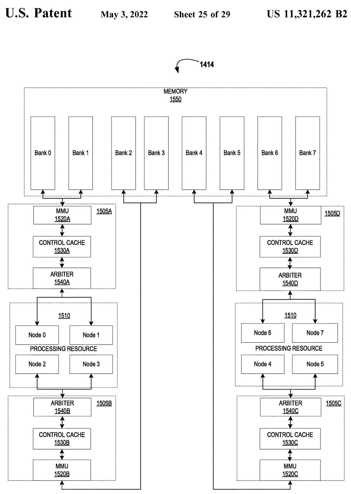
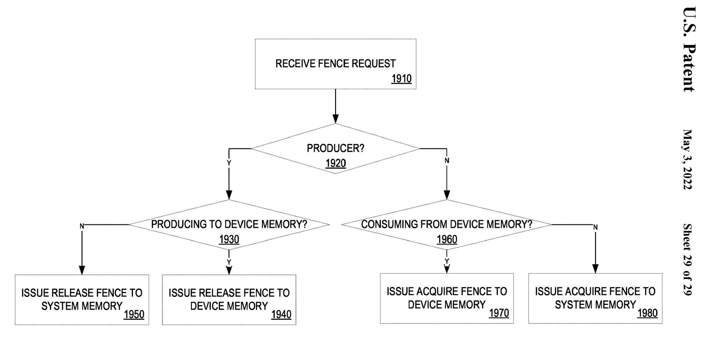
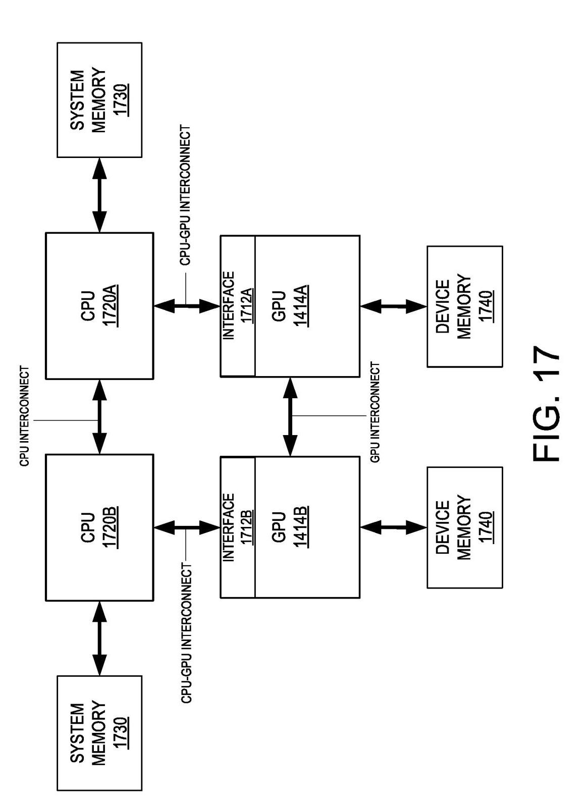
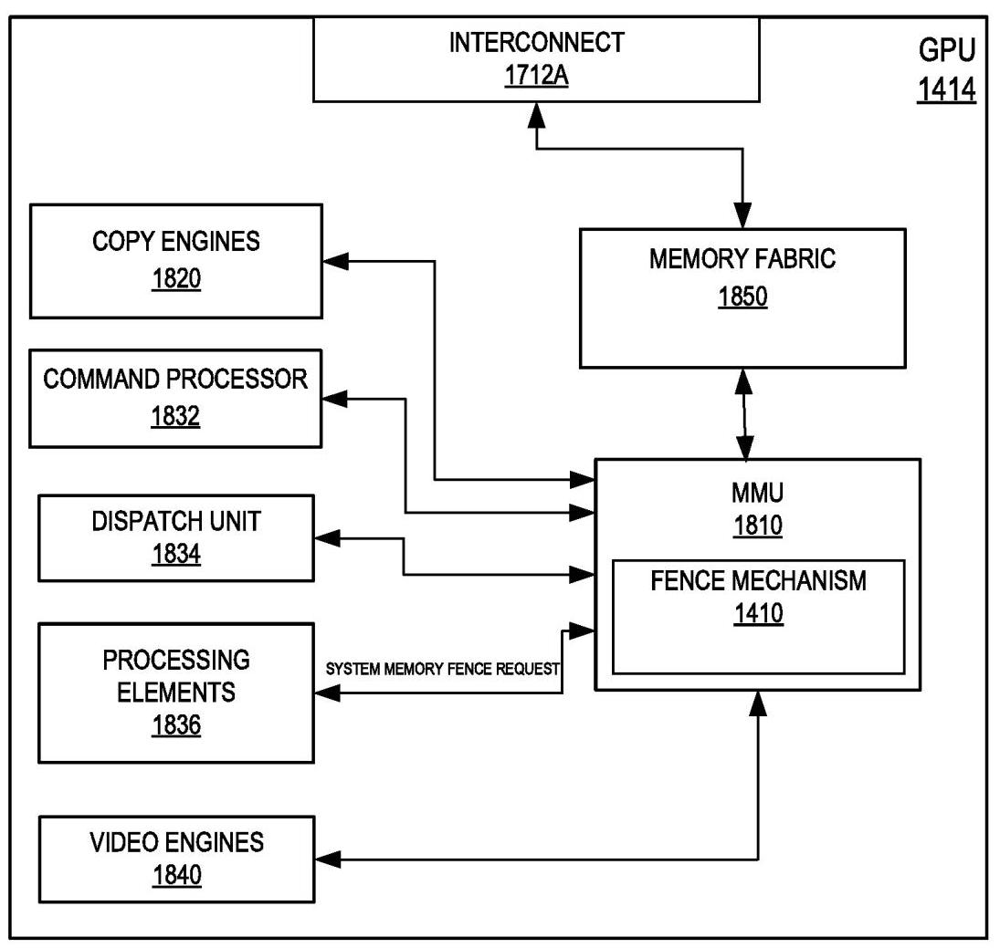

# INTERCONNECTED SYSTEMS FENCE MECHANISM 深度解读

> **发明人**：Hema Chand Nalluri, Ankur Shah, Joydeep Ray, Aditya Navale, Altug Koker, Murali Ramadoss, Niranjan L. Cooray, Jeffery S. Boles, Aravindh Anantaraman, David Puffer, James Valerio, Vasanth Ranganathan  
> **专利/年份**：US 11,321,262 B2, issued May 3, 2022; assignee: Intel Corporation  
> **一句话总结**：该专利把 GPU/CPU 多互连系统里的 memory fence 抽象成“producer/consumer × system/device memory”四类操作，并用硬件 fence mechanism 保证跨 CPU interconnect、GPU interconnect 和 GPU-CPU interconnect 的数据可见性与顺序。

## 一、问题定义

这份文档不是学术论文，而是一件美国专利；它关注的问题仍然是典型的体系结构问题：在多 GPU、多 CPU、system memory 和 device memory 同时存在的系统中，GPU 线程、copy engine、command processor、video engine 等组件既可能是 memory data producer，也可能是 memory data consumer。普通 GPU fence 可以约束某个 GPU 管线内部的前后顺序，但当写入路径、通知路径和被观察的内存域不一致时，只在本地发出 fence 不足以保证“别人已经能看到我写的数据”。

背景假设有三点。第一，CPU 侧有 CPU interconnect，并且该互连能对 system memory 访问提供顺序保证。第二，GPU 侧有单独的 GPU interconnect，多个 GPU 的 device memory 形成一个逻辑上可访问的 device memory 域。第三，GPU 到 system memory 的访问必须经过 CPU-GPU interconnect 进入 CPU domain；一旦事务被推入 CPU interconnect domain，CPU 互连才提供全局有序性。

**动机评估**：动机是 solid 的。专利明确指出，在 multi-socket network architecture 中，GPU0 写 system memory 的数据路径可能经过其对应的 CPU-GPU interconnect，而“完成信号”可能经 GPU interconnect 发给 peer GPU；数据路径和信号路径不同，会造成 peer GPU 看到信号时数据尚未全局可见的风险。这不是人为构造的问题，而是异构互连系统中常见的 release/acquire 可见性问题。

**核心 Insight**：核心洞察是“fence 的正确语义取决于数据生产/消费角色和目标内存域，而不是只取决于发出 fence 的 GPU”。因此硬件需要先判定请求来自 producer 还是 consumer，再判定访问对象是 system memory 还是 device memory，然后选择 release fence 或 acquire fence 的不同实现。最关键的一招是 release-to-system-memory 的实现：发出一个到 system memory 的 read request 并等待返回，用 read completion 作为先前写入已经进入 CPU interconnect domain 的证据。

## 二、相关工作

专利的 related work 以引用专利和通用 GPU 体系结构背景为主，不像论文那样系统比较已有方案。它引用了多个与 synchronization、cache/memory ordering、processor memory behavior 相关的美国专利，例如 G06F 9/522、G06F 12/0815、G06F 13/1621、G06F 12/0895 等分类下的工作。可以把相关脉络整理成三类。

第一类是传统 GPU/driver synchronization。GPU driver 和硬件组件之间通常使用 memory barrier 或 fence operation 来约束 fence 前后的 memory operation 顺序。这类机制适合单设备或单内存域语境，但没有自然覆盖“GPU 写 system memory、peer GPU 通过另一路互连收到 signal”的跨域可见性问题。

第二类是 cache coherence / memory ordering 机制。CPU interconnect 能保证 system memory 访问有序，GPU interconnect 也可为 GPU device memory 域提供一定范围内的排序与可见性。但专利指出，关键不在某一个互连域内部是否有序，而在操作跨域后是否已经进入正确的 ordering domain。

第三类是 unified memory 和多 GPU 设备内存互连。多个 GPU 的 device memory 可以通过 GPU interconnect 形成逻辑上的 device memory 域，system memory 和 device memory 甚至可以组合成统一地址空间。已有内存系统提供可访问性，但不自动解决 producer/consumer 在不同内存域上的 acquire/release 语义。

## 三、技术挑战

**跨互连域的顺序边界不一致**：GPU 写 system memory 需要进入 CPU interconnect domain 才算对 CPU 和其他 GPU 全局可见；GPU 写 device memory 则更多依赖 GPU interconnect 和 device memory 事务完成。单一 fence primitive 无法同时精确表达这两种边界。

**数据路径和信号路径可能分离**：专利举例说明，GPU0 生产的数据可能经 CPU-GPU interconnect 写入 system memory，而通知 peer GPU 的 signal 走 GPU interconnect。如果 signal 比数据更早被观察到，consumer 会读到未完成或未全局可见的数据。

**producer/consumer 语义不同**：producer 侧需要 release，保证 fence 之前的写已经被推出；consumer 侧需要 acquire，保证读取之前外部 producer 的写已经可见。这两类 fence 不能只用“flush pipeline”来等价替代。

**粒度需要可调**：专利希望 fence 可以从图形管线顶部 frame boundary、selective compute walker completion，甚至 kernel/EU 执行阶段发出。粒度越细，性能机会越大，但硬件需要知道该 fence 属于哪类内存域与角色。

**多 GPU device memory acquire 需要协同**：当 CPU 或外部 producer 写入某个 GPU device memory，而另一个 GPU 准备消费时，consumer GPU 可能需要和 peer GPU 通信，确认外部写已经推入 device memory 域。这要求 fence mechanism 不只是本地状态机，还要与 GPU interconnect 上的其他 GPU 协作。

## 四、解决方案

### 整体思路

专利提出一个 fence mechanism 1410，可以部署在 GPU 硬件/固件、driver、OS、CPU 或其组合中，但权利要求重点落在 fence hardware。该机制接收来自 GPU component 的 fence request，先判断请求方是 memory data producer 还是 memory data consumer，再判断目标是 system memory 还是 device memory，最后分派到四种 fence：Release Fence to System Memory、Release Fence to Device Memory、Acquire Fence to System Memory、Acquire Fence to Device Memory。

Fig. 14 给出部署位置：fence mechanism 可以贴近 GPU 1414，也可以由 driver、OS、CPU fence component 或 memory side 逻辑承载。理解这张图的重点不是具体软件栈，而是专利有意把 fence mechanism 放成一个跨软硬件边界的抽象，方便覆盖 apparatus、method 和 system claims。

### 贯穿示例

设想一个双 CPU、双 GPU 节点。GPU0 上的 kernel 生成一个结果缓冲区到 system memory，然后通过 GPU interconnect 给 GPU1 发信号，告诉 GPU1 可以读取结果。没有本专利的机制时，GPU1 可能先看到信号，但 GPU0 的写还没有完全进入 CPU interconnect domain；于是 GPU1 的读取可能观察到旧数据。

在本专利的 release-to-system-memory 路径里，GPU0 生成 fence request 后，fence mechanism 不只是发一个本地 flush，而是对 system memory 的某个位置发起 read request 并等待返回。read 返回意味着该 read 以及它前面的写访问已经经过 CPU-GPU interconnect 进入 CPU interconnect domain；此时再发 signal，GPU1 才能把 signal 当作“数据全局可见”的依据。

如果换成 CPU 写 GPU1 的 device memory、GPU0 随后要读，场景变成 acquire-to-device-memory。GPU0 需要执行 acquire fence，并可能和 GPU1 通信，确认 CPU 写入已经推到 device memory 侧并在 GPU interconnect 域内可见。这个例子说明同样叫 fence，实际动作取决于 producer/consumer 和 memory domain。

### 关键技术点

**四象限分类**：专利把 fence request 分类为 producer/consumer 两类，再按 system memory/device memory 分支。这个分类直接对应 Fig. 19 的流程：producer 走 release；consumer 走 acquire；目标是 device memory 则走 device-memory fence，目标是 system memory 则利用 CPU interconnect 的排序能力。

Fig. 19 的价值在于把专利主张压缩为一个判定流程：先判断是否 producer，再判断是否面向 device memory。它说明该机制不是在所有情况下做最重的全局 flush，而是根据角色和目标内存域选择相对精确的 fence operation。

**Release Fence to System Memory**：GPU component 作为 producer 写 system memory 时，目标是保证 fence 前的写已经被推入 CPU interconnect domain。专利实现为 fence mechanism 生成 system memory read request 并等待 data return。这个 read completion 充当顺序证明，因为 CPU interconnect 对 system memory transaction 提供 ordering。

**Release Fence to Device Memory**：GPU component 写 device memory 时，fence mechanism 保证 fence 前对 device memory 的写已经完成或被推到 GPU interconnect 上，从而对其他 GPU 全局可见。专利还允许在不需要跨 GPU fencing 时，把操作限制在 attached device memory，以降低不必要的全局协同。

**Acquire Fence to Device Memory**：GPU component 作为 consumer 准备读 device memory，而外部 producer 可能是 CPU 或另一个 GPU。fence mechanism 要等待所有相关 GPU 完成 device memory transaction；在示例中，GPU1414A 会和 GPU1414B 通信，确认来自 CPU1720B 以及 CPU1720A 的写已经被推到 device memory。

**Acquire Fence to System Memory**：GPU 作为 consumer 读取 system memory 时，生产者在 GPU 外部，顺序主要由 CPU interconnect 处理。专利没有像 release-to-system-memory 那样强调额外 read trick，说明这里的核心是进入 CPU ordering domain 后复用 CPU interconnect 的保证。

Fig. 16/17 所示的多 socket 架构解释了为什么 fence 必须意识到 domain：CPU 互连、GPU 互连、CPU-GPU 互连分别承担不同访问路径。报告中最重要的技术点都来自这张结构图所暗含的事实：数据和信号可能不走同一条路径。

Fig. 18 展示了 copy engine、command processor、dispatch unit、processing elements、video engines 等都可能成为 producer 或 consumer。它支撑了专利的另一个设计选择：fence request 不应只来自固定管线边界，也可以从 compute walker completion 或 kernel 执行资源处发起。

### 与已有方案的对比

相比普通 pipeline flush 或单域 memory barrier，这个方案的优势是语义更细：它不把 system memory 与 device memory 混为一谈，也不把 release 与 acquire 混为一谈。release-to-system-memory 的 read-back 设计尤其务实，因为它利用已有 CPU interconnect ordering，而不是要求新建一个全系统一致性协议。

不足也明显。专利没有给出性能数据，也没有讨论 fence read 的地址选择、缓存属性、异常处理、死锁避免、QoS 影响或多 GPU 通信的具体协议。作为专利，它更关注权利要求覆盖面；作为工程方案，还需要实现文档回答这些边界问题。

## 五、实验评估

### 实验设定

本文没有实验章节、benchmark、baseline 或量化指标。可评估的材料主要来自四类：摘要、Fig. 14-19 的 embodiment、Example 1-23，以及 18 条 claims。因此这里的“评估”不是性能评测，而是看专利说明是否足以支撑其技术主张。

### 主要证据与结论

**证据 1：问题场景被具体化**。文档明确给出 multi-socket CPU/GPU 网络：每个 CPU 有 system memory，CPU 之间通过 CPU interconnect，GPU 之间通过 GPU interconnect，每个 GPU 通过 CPU-GPU interconnect 连到 CPU。这足以说明为什么单域 fence 不够。

**证据 2：四类 fence 语义被完整覆盖**。正文分别描述 Release Fence to System Memory、Release Fence to Device Memory、Acquire Fence to Device Memory、Acquire Fence to System Memory；Examples 和 claims 又把 apparatus、method、interconnected system 三种权利要求形式展开。

**证据 3：关键机制有明确动作**。release-to-system-memory 不是停留在“保证顺序”的抽象层，而是明确说生成 system memory read request 并等待返回。acquire-to-device-memory 也指出通过 GPU 间通信等待 device memory transaction 完成。

**证据 4：可发起位置有性能导向**。专利说明 fence 可在 frame boundary、selective compute walker completion、kernel/processing resource 等粒度上发出。虽然没有量化收益，但它说明作者意识到 fence 过粗会影响性能。

### 结论支撑性分析

从专利撰写角度看，说明书足以支撑“按 producer/consumer 和 memory domain 选择 fence operation”的主张，尤其是 release-to-system-memory 的 read completion 机制。欠缺之处是没有性能实验，也没有协议级细节；所以它支撑的是专利范围内的功能性和结构性声明，而不是“该机制比某 baseline 快多少”这类论文式结论。

## 六、附加洞察

**结论 1**：该方案把 CPU interconnect 当作 system memory ordering 的最终仲裁点，而不是试图让 GPU interconnect 独立证明 system memory 可见性。
- *出处*：Detailed Description, FIG. 16/17 相关段落。
- *推理链条*：GPU 写 system memory 必须经 CPU-GPU interconnect 进入 CPU domain；CPU interconnect 保证 system memory memory cycles 有序；因此 release-to-system-memory 的目标被定义为“prior writes are pushed to CPU interconnect domain”，而不是只在 GPU 内部完成。

**结论 2**：read request 被用作 ordering probe，而不只是读取数据。
- *出处*：Release Fence to System Memory 段落与 claim 1、claim 9、claim 13。
- *推理链条*：数据路径与 signal 路径不同会破坏“收到信号即可读数据”的假设；read 返回必须经过 system memory path；等待 read return 可以证明之前写入已被推入 CPU interconnect domain；因此 read request 成为 fence 的核心实现动作。

**结论 3**：专利显式允许 fence 粒度下沉到 compute walker 或 kernel 级别。
- *出处*：Release Fence to System Memory 后的 granularity 段落。
- *推理链条*：frame boundary fence 简单但粗；同一 frame 中可能有多个 compute walker 且完成顺序乱序；选择性 walker completion 或 kernel 级 fence 可以更精确地同步必要数据；因此 fence mechanism 需要能被多个管线阶段触发。

**结论 4**：device-memory acquire 的复杂性来自“谁写了哪个 GPU 的 device memory”，而不是只来自本 GPU 的本地缓存状态。
- *出处*：Acquire Fence to Device Memory 段落。
- *推理链条*：CPU1720B 可以写 device memory1740；GPU1414A 要消费时必须确认这些写已推到 device memory；示例还要求同时确保 CPU1720A 的写也被推入；因此 acquire-to-device-memory 可能需要 GPU 间通信，而不是单 GPU 本地 flush。

## 七、总结与评价

这份专利的核心贡献是为异构多互连系统提供了一个 fence decision framework：按 producer/consumer 与 system/device memory 两个维度选择具体 fence operation。它最有价值的点是 release-to-system-memory 的 read-back 思路，简单地复用 CPU interconnect 的顺序保证，解决数据路径与信号路径分离导致的可见性缺口。

最大的亮点是语义清晰、覆盖面完整，能映射到 apparatus、method 和 system claims。最大的不足是说明书偏专利模板化：大量篇幅铺陈通用 GPU/SoC/IP-core 架构，真正的新机制集中在 FIG. 14-19 附近；同时缺少性能、异常路径、缓存策略和协议交互细节。后续如果做工程实现，最需要补的是 fence read 的地址/缓存属性选择、跨 GPU acquire 协议和不同粒度 fence 的性能开销模型。

## 八、章节脉络与段落速览

- **Front Matter / Abstract**：给出专利号、申请人、发明人、分类、引用专利和摘要，摘要将发明概括为通过 fence hardware 对 device memory 与 system memory 操作强制 data ordering。
  - ¶1-3 标识美国专利、专利号 US 11,321,262 B2、授权日期 May 3, 2022 和题名。
  - ¶4-12 列出 Intel 作为申请人与受让人、发明人、申请号、申请日、公开信息和 CPC 分类。
  - ¶13-19 给出引用专利、审查员、代理机构和摘要；摘要首次提出 interconnect、device memory、processing resources 与 fence hardware 的组合。
  - ¶20 标明 18 claims 与 29 drawing sheets。

- **Background**：说明 GPU 高并发执行、tile based rendering 和 memory barrier/fence operation 的基本背景。
  - ¶1 说明 GPU 是高度线程化机器，使用 memory barrier 或 fence operation 在 driver 与硬件间同步，并约束 fence 前后的 memory operation 顺序。

- **Brief Description of the Drawings**：枚举 Fig. 1-19，先铺垫通用处理系统、GPU/GPGPU、图形管线、IP core、SoC，再进入 fence mechanism 与多互连系统。
  - ¶1 说明附图只是典型 embodiments，不限制专利范围。
  - ¶2-19 逐项列出 Fig. 1 到 Fig. 19 的主题，其中 Fig. 14-19 是理解 fence mechanism 的核心图。

- **Detailed Description / Opening**：总述在 multi GPU-CPU connected system 中实现 fence mechanism，用于 memory data producer/consumer 的数据排序。
  - ¶1 点明实施例通过 fence mechanism 生成 fence operations，以实现多 GPU-CPU 系统中的 data ordering。

- **System Overview / Fig. 1**：描述通用 processing system 100，作为后续 GPU/CPU/accelerator 系统的基础模板。
  - ¶1-2 说明 system 100 可用于桌面、服务器、SoC、移动、IoT、游戏和自动驾驶等设备。
  - ¶3-6 描述 processor cores、instruction set、cache、register file、interface bus、memory controller 和 PCH。
  - ¶7-10 描述 DRAM/SRAM/flash/system memory、external graphics processor、accelerator、display、I/O、storage、USB 和 firmware interface。
  - ¶11-14 扩展到 sled、data center fabric、resource pooling 和 power supply，属于平台泛化描述。

- **FIGS. 2A-2D / GPU and GPGPU Architectures**：给出集成 GPU、graphics core slice、多核 GPU、tensor/ray tracing core 和 GPGPU 的通用结构。
  - ¶1-7 Fig. 2A 描述 processor 200、processor cores、shared cache、system agent、integrated graphics processor、ring interconnect 和 eDRAM/LLC。
  - ¶8-16 Fig. 2B 描述 graphics processor core 219、fixed function block、SoC interface、graphics microcontroller、media pipeline、EU arrays、samplers 和 shared local memory。
  - ¶17-29 Fig. 2C 描述 GPU239 的 multi-core group、graphics/tensor/ray tracing cores、L1/L2、IOMMU、shared virtual address、tensor precision、ray tracing instruction set。
  - ¶30-33 Fig. 2D 描述 GPGPU270 与 host CPU、system memory、device memory、cache、compute units、command processors 和 thread dispatcher 的关系。

- **FIGS. 3A-3C / Graphics Processor and Compute Accelerator**：描述 discrete/integrated graphics processor、tiled GPU 和 compute accelerator。
  - ¶1-5 Fig. 3A 描述 graphics processor 300、display controller、video codec、BLIT engine、GPE、3D pipeline、media pipeline 和 thread spawning。
  - ¶6-8 Fig. 3B 描述 tiled graphics processor 320、graphics engine tiles、tile interconnect、HBM/GDDR memory、copy engines、fabric interconnect 和 host interface。
  - ¶9-10 Fig. 3C 描述 compute accelerator 330、compute engine tiles、device memory interconnect 和 large L3 cache。

- **Graphics Processing Engine / Fig. 4**：说明 GPE410 的 command streamer、3D/media pipelines、graphics core array、URB 与 shared function logic。
  - ¶1-4 描述 command streamer 从 memory/ring buffer 取命令并分发到 3D/media pipeline 或 graphics core array。
  - ¶5-10 描述 shader thread execution、URB 用于输出和同步、graphics core array 可扩展、shared function logic 提供 sampler/math/ITC/cache 等共享资源。

- **Execution Units / Fig. 5A-7**：说明 shader/compute execution unit、SIMD/SIMT、register file、send unit、instruction formats 和 opcode decode。
  - ¶1-7 Fig. 5A 描述 thread execution logic、shader processor、thread dispatcher、execution units、sampler、SLM、data cache、SIMD/SIMT 和 fused EU。
  - ¶8-14 Fig. 5B 描述 GRF/ARF、thread arbiter、send unit、branch unit、SIMD FPUs、SMT/IMT、register sizing 和 instruction co-issue。
  - ¶15-19 Fig. 6 描述 compute-optimized execution unit 600、ALU、systolic array、math unit、thread state 和 register renaming。
  - ¶20-27 Fig. 7 描述 128-bit/64-bit instruction format、opcode、source/destination operands、addressing mode、opcode groups 和 synchronization/send instructions。

- **Graphics Pipeline / Fig. 8-9**：描述 graphics processor 800 与 graphics command sequence。
  - ¶1-11 Fig. 8 描述 geometry pipeline、media pipeline、display engine、thread execution logic、render output pipeline、vertex shader、tessellation、rasterizer、cache 和 API 支持。
  - ¶12-21 Fig. 9A/9B 描述 command format、client/opcode/sub-opcode/data/size 字段、pipeline flush、pipeline select、pipeline control、3D primitive、execute command 与 media object command。

- **Graphics Software Architecture / Fig. 10**：描述应用、OS、graphics API、shader compiler、user-mode driver 和 kernel-mode driver 如何向 graphics processor 派发命令。
  - ¶1-3 说明 3D graphics application、OS、processor、shader programs、graphics objects 和 system memory 的软件结构。
  - ¶4-5 描述 Direct3D/OpenGL/Vulkan shader 编译路径、user-mode driver 和 kernel-mode driver 与 graphics processor 的通信。

- **IP Core Implementations / Fig. 11-13**：说明硬件逻辑可通过 IP core、RTL、HDL、chiplet、SoC 和不同 graphics processor core 实现。
  - ¶1-4 描述 machine-readable medium、IP core、simulation model、RTL/HDL、fabrication facility 和集成电路制造。
  - ¶5-12 Fig. 11B-11D 描述 package assembly、logic/memory chiplets、bridge/interconnect、fabric、base die、standardized slots 和 mix-and-match IP。
  - ¶13-18 Fig. 12-13 描述 SoC 1200、application processors、graphics/image/video processors、controllers、low-power graphics core、高性能 unified shader core、MMU、cache 和 interconnect。

- **Fence Mechanism Host / Fig. 14**：把 fence mechanism 放入 computing device 1400，并说明其可以由 GPU、firmware、driver、OS、CPU 或组合实现。
  - ¶1-4 描述 computing device 的应用范围、CPU/GPU/driver/OS/memory/I/O 组成和实现形式。
  - ¶5-7 说明 fence mechanism 1410 的可能宿主位置，以及 software/hardware/firmware 的组合实现。
  - ¶8-14 给出 machine-readable medium、术语定义、application/workload/frame/dispatch 等专利文本约定。

- **GPU Memory Fabric / Fig. 15**：描述 GPU1414 内部 processing resources、nodes、fabric elements、MMU、control cache、arbiter 和 memory banks。
  - ¶1-3 说明 processing resource 1510 可对应 GPGPU core、tensor/ray-tracing core、EU、SM 等多类执行资源。
  - ¶4-5 描述每个 fabric element 连接两个 nodes 和两个 memory banks，并通过 MMU、control cache、arbiter 管理访问。

- **Multi-socket Network and Fence Semantics / Fig. 16-18**：这是专利的核心技术段落，说明 CPU/GPU 互连域、四类 fence 和各自实现。
  - ¶1 描述 multi socket network architecture：CPU 通过 CPU interconnect，GPU 通过 GPU interconnect，每个 GPU 还经 CPU-GPU interconnect 连接 CPU。
  - ¶2-3 说明 CPU-attached system memory 形成逻辑 system memory 域，GPU-attached device memory 形成逻辑 device memory 域，并可进一步形成 Unified Memory。
  - ¶4 说明 GPU system memory access 必须进入 CPU interconnect domain，GPU/CPU interface 可为 PCIe endpoint/root complex。
  - ¶5 定义四类 fence：release/acquire × system/device memory，并定义 producer 是写者、consumer 是读者。
  - ¶6-7 解释 release-to-system-memory 的问题和 read request 解法。
  - ¶8-9 说明 fence 可从 frame boundary、selective compute walker completion 或 kernel/processing resource 等不同粒度发起。
  - ¶10 结合 Fig. 18 说明 processing element 1836 可发 system memory fence request，MMU1810 经 fabric1850 把 prior writes 推入 CPU interconnect domain。
  - ¶11-12 说明 acquire-to-device-memory 需要等待外部 producer 的 writes 在 GPU interconnect/device memory 域全局可见，并可能通过 GPU 间通信实现。
  - ¶13 说明 release-to-device-memory 保证 GPU producer 对 device memory 的 prior writes 推到 GPU interconnect，可在需要时限制到 attached device memory。
  - ¶14 说明 acquire-to-system-memory 的 producer 在 GPU 外部，由 CPU interconnect 处理。

- **Flow, Examples, and Claims / Fig. 19**：把 fence request 的决策流程、示例条款和正式权利要求合并收束。
  - ¶1-2 Fig. 19 说明收到 fence request 后先判断 producer/consumer，再判断 device/system memory，并发出对应 release/acquire fence。
  - ¶3-15 Examples 1-23 以 apparatus、method、interconnected system 三类形式展开同一机制。
  - ¶16-31 Claims 1-8 保护 apparatus，包括 interconnect、device memory、processing resources 和 fence hardware，核心限定为 release-to-system-memory 的 read request/wait return。
  - ¶32-38 Claims 9-12 保护 method，包括接收 fence request、判断 producer/consumer、判断 device/system memory、发出 release-to-system-memory 以及其他 fence。
  - ¶39-45 Claims 13-18 保护 interconnected system，包括 CPU interconnect、system memory、GPU interconnect、device memory、GPU-CPU interconnect 和 fence hardware，并强调 acquire-to-device-memory 可通过第一 GPU 与第二 GPU 通信确认 CPU 写入已推送。
