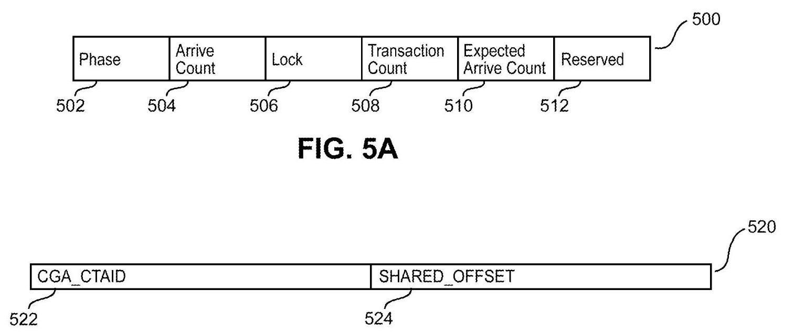
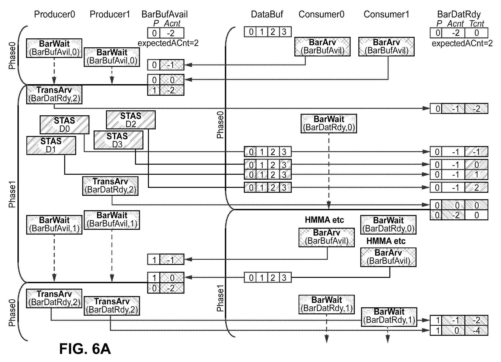
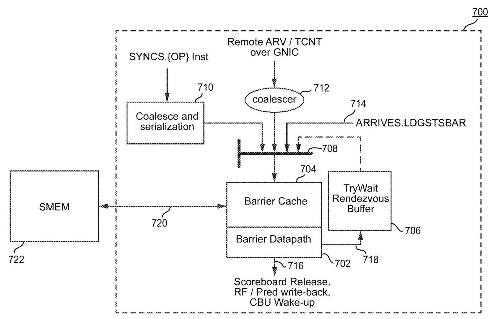
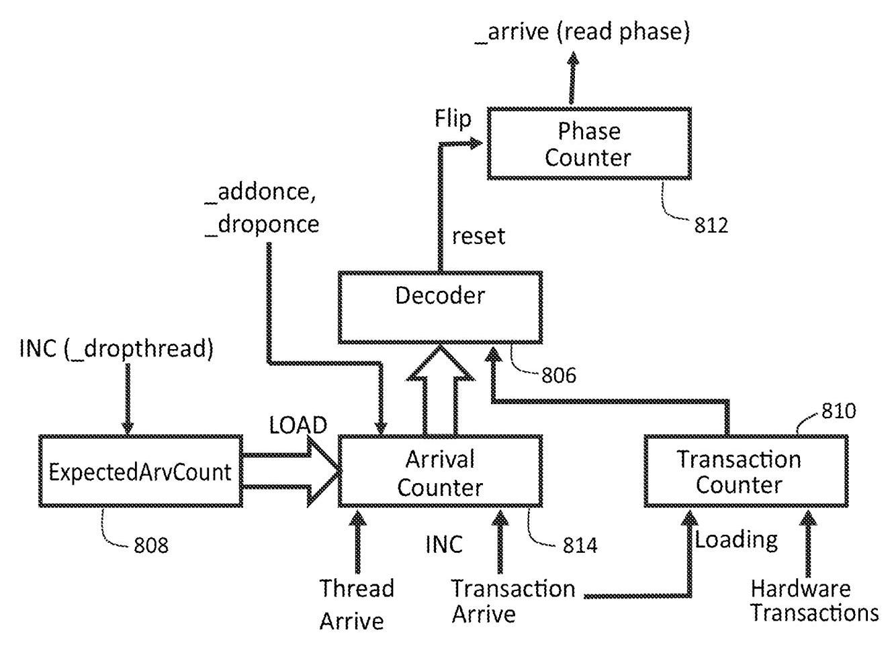

# HARDWARE ACCELERATED SYNCHRONIZATION WITH ASYNCHRONOUS TRANSACTION SUPPORT 深度解读

> **作者**：Timothy Guo, Jack Choquette, Shirish Gadre, Olivier Giroux, Carter Edwards, John Edmondson, Manan Patel, Raghavan Madhavan Jr., Jessie Huang, Peter Nelson, Ronny Krashinsky  
> **会议/期刊**：US Patent Application Publication US 2023/0289242 A1, 2023-09-14  
> **一句话总结**：这件 NVIDIA 专利提出一种 `transaction barrier` 和对应的硬件 `SYNCS` 同步单元，让 GPU 线程不仅能等待其他线程到达 barrier，也能等待 DMA/TMA/multicast 等异步硬件事务完成，从而在跨 SM 的 producer-consumer 数据交换中降低轮询、访存和同步延迟。

## 一、问题定义

这不是一篇带实验评测的学术论文，而是一件面向 GPU 微体系结构和 CUDA 编程模型的专利公开。它要解决的原始问题是：随着 GPU 代际演进，单个应用希望获得 **strong scaling**，也就是同样工作量在更多、更强的并行处理资源上更快完成；但当 tile 变小、SM 数量增多、跨 SM 协作更频繁时，数据搬运和同步开销会变成瓶颈。单纯增加线缆和全局带宽并不现实，因此架构必须利用 locality，让相邻 SM/CTA 之间更直接地共享数据和同步。

传统 barrier 在这里卡住了两类需求。第一类是传统 hardware named barrier，它速度快，但往往是处理器局部、数量有限、软件暴露困难，并且不适合灵活的 producer-consumer 模式。第二类是 shared-memory backed arrive-wait barrier，它更像软件可管理资源，适合 split arrive/wait，但等待通常依赖软件 polling，跨 SM/异步事务场景下会带来共享内存带宽和延迟成本。更关键的是，现代 GPU 中的数据到达不一定由执行线程直接完成，而可能由 copy engine、TMA unit、programmatic multicast、SM-to-SM 数据通路等异步硬件单元完成；线程 barrier 只看“线程是否到达”，不能自然表达“硬件事务是否完成”。

**动机评估**：动机是 solid 的。专利把问题放在 CGA、distributed shared memory、TMA、multicast、cross-SM communication 这些 NVIDIA 新 GPU 机制的组合背景下：硬件提供了更强的空间局部性和并发调度保证，但如果同步仍绕回全局内存或软件轮询，strong scaling 的收益会被同步和带宽税抵消。它没有给出量化 benchmark，但问题链条与 GPU 架构趋势一致。

**核心 Insight**：核心洞察是把“线程到达”和“异步事务完成”放进同一个 barrier 状态机里，但用两个计数器分别建模：`arrive counter` 记录参与线程/到达事件，`transaction counter` 记录尚未完成的数据事务。只有二者同时满足清除条件时，barrier 才 phase toggle 并释放等待线程。这样 barrier 不再只是线程集合的同步点，而变成线程和硬件数据移动之间的 rendezvous point。

## 二、相关工作

专利按同步机制和 GPU 编程模型两条线组织相关背景。

第一条线是 GPU barrier 机制。传统 hardware named barrier 支持 Bulk Synchronous Parallel 风格，适合 CTA 内或固定硬件范围的同步，但资源数量和作用范围受硬件约束，且不容易作为通用软件对象暴露。Cooperative Groups API 扩展了 CUDA 中 thread group 的表达能力，使 grid-wide、multi-GPU 或更灵活的 group synchronization 可编程，但很多同步仍依赖软件调度和软件实现，性能不等同于硬件 barrier。

第二条线是 arrive-wait barrier 和 producer-consumer 同步。arrive/wait 分离后，线程可以先到达 barrier，中间做其他工作，再等待 barrier 清除，这比纯 bulk-sync 更适合流水化生产者/消费者。但已有 arrive-wait barrier 常以 shared memory 作为 backing store，等待路径需要 polling，跨 SM 时会消耗共享内存/互连带宽。

第三条线是 CGA 及其配套机制。CGA 保证多个 CTA 在同一硬件 locality 域中并发执行，使跨 CTA 的 distributed shared memory、programmatic multicast、SM-to-SM 通信和 TMA 数据搬运可用。本文的 transaction barrier 实际上是这些机制的同步胶水：数据可以本地共享，事务可以异步完成，同步也必须本地化、可缓存、可硬件加速。

## 三、技术挑战

1. **同步对象必须同时覆盖线程和硬件事务**：线程到达是软件事件，TMA/DMA/multicast store completion 是硬件事件，它们的到达顺序不固定；barrier 不能假设所有线程先 arrive、所有事务后完成。

2. **跨 SM 同步要保留软件可管理性**：CGA 中多个 CTA 可能运行在不同 SM 上，barrier 需要放在分布式共享内存或其他 memory backing store 中，才能被跨 SM 访问；但如果每次操作都直接访问 backing memory，又会退化成高带宽成本的软件 barrier。

3. **等待路径不能依赖高频 polling**：producer-consumer 流水中 barrier wait 可能很频繁，线程持续轮询会暴露延迟并消耗共享内存带宽。硬件需要保存等待线程，并在 barrier clear 时唤醒或触发 retry。

4. **SIMT divergence 使硬件等待难以完全透明**：如果每个 thread 都能独立决定是否参与 barrier，硬件不可能无限成本地跟踪所有 divergent waiting state。因此设计必须接受 `wait may fail`，让软件在少数情况下 retry。

5. **barrier cache 引入一致性责任**：SYNCS 单元缓存 memory-backed barrier 可以降低流量，但专利明确提到 barrier cache 可为 non-coherent write-back cache。软件或硬件必须避免把普通 memory load/store 与 barrier 操作混用到同一地址而造成不可预测状态。

## 四、解决方案

### 整体思路

本文方案由两层组成。软件/ISA 层提供 `transaction barrier` 对象和 `create/arrive/wait` 等操作；硬件层提供 `SYNCS` synchronization unit，用 barrier cache、barrier datapath、coalescer、multiplexer、try-wait buffer、CBU/scoreboard 集成来加速这些操作。barrier 对象仍存储在 memory 中，因此数量主要受 backing memory 限制；热点状态则进入 SYNCS 本地 cache，由硬件按计数器和 phase 逻辑更新。

Fig. 5A/5B 对应本文最关键的数据抽象：transaction barrier 至少包含 `phase`、`arrive count`、`transaction count`、`expected arrive count` 和 `lock`。地址中带有 CGA/CTA 标识与 offset，使 barrier 可以作为一个 memory-backed synchronization object 暴露给同一 CGA 中的多个 CTA。

### 贯穿示例

可以把它理解成两个 producer CTA 与两个 consumer CTA 通过 `DataBuf` 交换数据。producer 写入数据前需要确认 buffer 有空位，于是等待一个传统 arrive-wait barrier `BarBufAvail`；consumer 读取数据前则需要确认数据不仅被 producer 声明将要写入，而且相关硬件 store/TMA/multicast 事务已经完成，于是等待 transaction barrier `BarDatRdy`。

在 phase 0 中，`BarDatRdy` 的 `arrive count` 初始化为 -2，表示两个参与方到达后才满足线程到达条件；`transaction count` 初始化为 0。producer 或 consumer 可以调用 transaction arrive，把“本 phase 期待 4 个 buffer 写入”这件事体现在 transaction counter 上；随后每个实际硬件写入完成时，硬件向 SYNCS 发送 transaction update。只有 `arrive count == 0` 且 `transaction count == 0` 时，`BarDatRdy` 才清除并切换 phase，consumer 才安全读取 `DataBuf`。

Fig. 6A/6B 展示了本文最有价值的语义：transaction arrive 可以由 producer 侧发出，也可以由 consumer 侧发出；事务完成更新则来自硬件数据移动单元。这使 barrier 的控制权可以靠近数据消费者或生产者，减少远程路径，同时允许异步数据移动与线程执行重叠。

### 关键技术点

**1. 双计数器 barrier 语义**。`arrive count` 面向线程/到达事件，`transaction count` 面向异步事务。线程调用 arrive 时可以声明预期事务数量，使 transaction count 向负方向移动；硬件事务完成时再向正方向补回。二者归零时表示“人到了，货也到了”，barrier 才清除。

**2. phase toggle 与 expected arrive count**。barrier 清除后 phase 翻转，并用 `expected arrive count` 重新初始化 arrive counter。这样同一个 barrier 可以在 producer-consumer 循环中复用，wait 操作通过期望 phase 判断是否已经跨过同步点。

**3. SYNCS 硬件单元**。SYNCS 的 barrier datapath 负责更新计数器、检测 clear 条件、设置 lock、触发 wakeup；barrier cache 缓存 memory-backed barrier，减少每次 arrive/wait 对 shared memory 的访问；coalescer 合并来自本地/远程线程和硬件事务的更新；multiplexer 串行化进入 datapath 的操作。

Fig. 7 是硬件方案的中心图。它说明 transaction barrier 不是单纯的软件数据结构，而是由本地 cache、datapath、try-wait buffer、coalescing path 和 CBU/scoreboard 信号共同支撑的微体系结构功能。报告前面的带宽与等待开销挑战，主要由这张图中的 cache/coalescer/try-wait buffer 回答。

**4. try-wait buffer 降低等待开销**。当 thread wait 发现 barrier 尚未 clear 时，SYNCS 可以把等待线程信息放入 try-wait buffer。barrier clear、timeout、lock、trap 等事件会唤醒或触发 retry。这样 common case 不需要软件持续轮询，但硬件仍保留失败返回，让 divergent thread 或 buffer full 等边界情况交给软件处理。

**5. ISA 和内存序语义**。专利把 `create()`、`arrive()`、`wait()` 映射到 ISA/硬件流程，并讨论 split barrier 的 release/acquire 语义。对 CTA scope，同一 transaction barrier 的 arrive/wait 可以提供 `<PRE>` load/store 到 `<POST>` load/store 的同步保证；跨 CTA 或更大 scope 可能仍需要额外 memory barrier。事务自身采用 object fence semantics，即保证该单个数据事务在对应 transaction update 前可见，不自动给其他 load/store 提供全局排序。

Fig. 8 把软件对象和硬件 datapath 连起来：phase/arrive/transaction/expected count 存在 cached barrier 中，arrival counter decoder 判断是否 clear，硬件在 clear 时翻转 phase、重装 arrive counter、重置 transaction counter。这解释了为什么 transaction barrier 既可以像软件对象一样大量分配，又能获得硬件更新路径。

### 与已有方案的对比

相比 named barrier，transaction barrier 不局限于少量固定硬件 barrier，而是 memory-backed、软件可管理、可跨 CGA/CTA 使用；相比纯 shared-memory arrive-wait barrier，它把高频 arrive/wait/transaction update 放到 barrier cache 和 datapath 上处理，降低 memory bandwidth tax；相比只同步线程的 barrier，它能把异步硬件数据移动纳入同一个完成条件。

不足也很明确。第一，专利没有给出性能数字，只给出结构性论证。第二，non-coherent barrier cache 意味着软件需要遵守额外一致性规则。第三，`wait may fail` 说明硬件加速不是完全透明的阻塞 primitive，软件仍需处理 retry。第四，很多收益依赖 CGA、distributed shared memory、TMA、multicast 等配套机制，离开这些硬件上下文，transaction barrier 的优势会变小。

## 五、实验评估

### 实验设定

原文是专利公开，没有学术论文式实验设定：没有 benchmark、baseline、性能指标、平台参数或消融实验。它的“评估材料”主要是架构论证和示例流程：Fig. 6A/6B 的 producer-consumer 例子，Fig. 7/8 的 SYNCS 微体系结构，Fig. 9A-9C 的 create/arrive/wait 逻辑，以及 claims 对同步单元、方法和系统边界的覆盖。

### 主要实验与结论

可以把专利的论证分成三组“非量化验证”：

1. **语义可表达性**：transaction barrier 可以表达“线程到达 + 异步事务完成”的联合条件，并允许 producer 或 consumer 任一侧声明事务期望。这支持 TMA、DMA、programmatic multicast、SM-to-SM store 等异步数据交换模式。

2. **硬件可实现性**：SYNCS 的 barrier cache、datapath、try-wait buffer 和 coalescer 说明了实现路径。关键判断是：barrier 状态小而热，适合缓存；事务更新多而集中，适合 coalescing；等待线程信息适合放进邻近 datapath 的 buffer。

3. **边界可处理性**：lock bit 处理错误状态；CBU/scoreboard 集成处理 divergence 和 flush；wait failure/retry 处理硬件无法无限跟踪的线程等待状态；cache invalidate/flash-clean 处理 CTA exit 或复用 memory backing store 时的陈旧状态。

### 结论支撑性分析

这些材料足以支撑“该机制在架构上可行，并覆盖 NVIDIA 新 GPU 的跨 SM 异步同步需求”，但不足以支撑“它一定带来多少性能提升”。原文多次使用 “may eliminate or drastically reduce”“may save bandwidth”“expected to be very low” 这类措辞，说明作者没有在公开文本中给出定量数据。若按论文标准评估，最大缺口是缺少与 software polling barrier、arrive-wait barrier、named barrier 的延迟/带宽/吞吐对比，以及缺少 try-wait buffer 容量、barrier cache miss/eviction 对性能的敏感性分析。

## 六、附加洞察

**结论 1**：transaction count 不需要像 arrive count 一样在每个 phase 固定预置，它可以按每次使用动态声明。  
- *出处*：段落 [0058]-[0060]、[0159]。  
- *推理链条*：异步事务数量在不同 phase 可能变化，例如本轮搬 4 KB、下轮搬 2 KB；若把事务数固定成 barrier 属性，会限制 producer-consumer 流水。作者因此采用 zero-balanced transaction counter：线程声明期望事务数，硬件事务完成再补回，允许动态事务同步。

**结论 2**：transaction arrive 的发起方可以是 producer，也可以是 consumer，局部性优先于固定角色分工。  
- *出处*：Fig. 6A/6B、段落 [0097]-[0099]。  
- *推理链条*：传统思路会让 producer 声明“我要写多少数据”；但如果 barrier 更靠近 consumer，consumer 侧声明可能减少远程访问。作者通过两张交互图说明语义不依赖特定一方，从而把优化空间留给编译器/程序员/运行时。

**结论 3**：barrier cache 的 non-coherent 设计是性能换复杂度。  
- *出处*：段落 [0101]-[0104]、[0111]。  
- *推理链条*：barrier 操作流量高，因此 cache 可以过滤 backing memory traffic；但 write-back non-coherent cache 会让 cached barrier 与 shared memory shadow copy 暂时不一致。作者提出 flash-clean、invalidate、软件不混用普通 memory 操作和 barrier 操作等规则，说明该优化需要明确一致性纪律。

**结论 4**：try-wait buffer 不是为了消灭所有 polling，而是让性能敏感 common case 避开 polling。  
- *出处*：段落 [0106]-[0109]、[0154]-[0157]。  
- *推理链条*：硬件保存等待线程可以在 barrier clear 时快速通知，但 divergent threads、buffer full、timeout 等情况会让 wait 失败。作者选择 `wait may fail`，牺牲一点软件复杂度来避免硬件为最坏情况付出不可接受的状态跟踪成本。

**结论 5**：SYNCS 可以泛化为“等待某个 memory-backed 对象变化”的硬件辅助机制。  
- *出处*：段落 [0161]、claims 1-34。  
- *推理链条*：如果 barrier cache 和 try-wait buffer 能缓存对象状态并在状态变化时通知等待线程，那么同一机制不必局限于 transaction barrier。作者在说明书末尾把它扩展到 user-defined synchronization objects，claims 也把 cache/circuit/buffer/coalescing/CBU 等组合抽象成更一般的 synchronization barrier unit。

## 七、总结与评价

这件专利的核心贡献，是把 GPU 同步从“线程之间互等”推进到“线程与异步硬件事务共同达成条件”。transaction barrier 的抽象很干净：arrive counter 管线程，transaction counter 管数据事务，phase 管复用，lock 管错误；SYNCS 的实现也抓住了实际瓶颈：cache 降低 backing memory traffic，coalescer 降低 transaction update 风暴，try-wait buffer 降低 polling。

最大的亮点是它与 CGA、distributed shared memory、TMA、multicast、SM-to-SM communication 这些机制形成组合拳，解决的是跨 SM 局部协作真正落地后的同步问题。最大的不足是公开文本没有任何性能数据，而且一致性规则、retry 语义、buffer/cache 容量等都会影响开发者和编译器的可用性。后续若从研究角度展开，最值得补的是：在真实 tensor/tile pipeline 中量化 transaction barrier 对 L2/interconnect traffic、SM stall、TMA overlap 的影响。

## 八、章节脉络与段落速览

- **Front Matter / Abstract**：给出专利号、申请人、发明人和摘要，概括 transaction barrier 能同步执行线程与异步事务，并由硬件同步电路和新 wait 机制加速。
  - ¶1 标识 US 2023/0289242 A1、NVIDIA、发布日期和发明人。
  - ¶2 摘要说明新同步原语、硬件数据移动事务、cache-backed barrier 和降低 wait 软件开销。

- **Cross-References to Related Applications [0001]-[0011]**：列出同日申请的 CGA、distributed shared memory、multicast、TMA、fast synchronization 等相关专利族，说明本文属于一组 GPU 架构协同机制。
  - ¶1-11 逐项列出共同转让的相关申请，构成本文技术背景和依赖机制。

- **Field [0012]**：界定技术领域为处理器效率、功耗和专用同步电路。
  - ¶12 说明本文关注 specialized circuitry for handling synchronization。

- **Background [0013]-[0027]**：从 strong scaling、GPU 并行、barrier synchronization、asynchronous compute、Cooperative Groups 和已有 arrive-wait barrier 引出问题。
  - ¶13-18 解释深度学习/HPC 需要 strong scaling，而不是只靠增大 workload 获得 weak scaling。
  - ¶19-21 说明并行程序需要同步，asynchronous compute 让正确性 barrier 更重要。
  - ¶22-25 回顾 GPU hardware barrier、warp-level primitive 和 Cooperative Groups 的能力边界。
  - ¶26-27 指出现有 software barrier 灵活但性能不足，因此需要兼具软件可编程性和硬件效率的新 barrier。

- **Brief Description of the Drawings [0028]-[0045]**：列出 Fig. 1A-13B 的图义，从应用动机、GPU/CGA 背景、transaction barrier、SYNCS、ISA 流程到系统架构。
  - ¶28-30 对应 strong scaling 动机图。
  - ¶31-33 对应 GPU 分区、SM 间通信和 CGA 组织。
  - ¶34-39 对应 transaction barrier 数据结构、操作流程、SYNCS 和 ISA 逻辑。
  - ¶40-45 对应 PPU/GPC/SM 和系统级实施环境。

- **Detailed Description [0046]-[0064]**：集中给出本文贡献总览和 transaction barrier 的能力列表。
  - ¶46-49 解释新 primitive 与 SYNCS 单元旨在兼得软件 barrier 灵活性和硬件 barrier 效率。
  - ¶50-56 定义 transaction barrier，并说明它面向 cross-processor/asynchronous data exchange。
  - ¶57-64 枚举能力：双 arrival tracking、弱排序要求、支持 DMA/TMA/multicast/SOL、硬件 accelerated waiting、thread programming model 支持和 coalescing。

- **Overview of Example GPU Environment [0065]-[0078]**：说明该机制所处的 GPU、micro-GPU、GPC、SM、CGA 和 distributed shared memory 背景。
  - ¶65-68 描述 GPU partition、GPC/SM/L2/crossbar 以及 SM-to-SM 消息路径。
  - ¶69-78 描述 CGA 的并发调度保证、空间局部性、跨 CTA shared memory 和本地通信机会。

- **Transaction Barrier Data Structure [0079]-[0082]**：定义 transaction barrier 状态字段和地址组织。
  - ¶79 说明 arrive count 与 transaction count 同时满足条件才清除 barrier。
  - ¶80-81 解释 phase、expected arrive count 和 lock indicator 的用途。
  - ¶82 说明 barrier address 由 CGA/CTA 标识和 offset 组成，适合放在 CGA 可访问的 distributed shared memory 中。

- **Transaction Barrier Operation [0083]-[0099]**：用 producer/consumer 和 DataBuf 示例说明 transaction barrier 如何运行。
  - ¶83-88 设定两个 producer、两个 consumer、两个 barrier 和 phase/counter 初始状态。
  - ¶89-96 逐步说明 consumer 释放 buffer、producer 声明并写入事务、硬件事务更新 transaction count、barrier 清除后 consumer 读取。
  - ¶97-99 讨论 phase tracking、producer/consumer 任一侧发起 transaction arrive，以及硬件事务通常不等待资源而由线程保证资源可用。

- **Hardware-Implemented Synchronization Unit [0100]-[0115]**：描述 SYNCS 微体系结构。
  - ¶100-105 介绍 barrier datapath、barrier cache、tag/valid、write-back non-coherent 风险、flash-clean/invalidate 和 1 barrier op per clock per SM 级别的目标。
  - ¶106-109 介绍 try-wait buffer/CAM、等待线程保存、barrier clear 通知、timeout/retry 和 CBU 集成。
  - ¶110-112 介绍 coalescer、multiplexer、local/remote transaction update、barrier cache 作为 traffic filter，以及 SYNCS 可加速 arrive-wait barrier。
  - ¶113-115 解释 memory-backed transaction barrier 如何在 cache 中更新 phase/arrive/transaction counter，并由 TMA/DMA/multicast 等硬件单元发送完成消息。

- **Example Instruction Set Architecture Implementation [0116]-[0161]**：把 transaction barrier 映射到 create/arrive/wait 语义和内存序。
  - ¶116-122 说明 ISA/API 包含 create、arrive、wait，以及可选 add/drop 类函数。
  - ¶123-128 讨论 split barrier 的 release/acquire、object fence、CTA-wide fence、flush 和 scoreboard。
  - ¶129-143 说明 create 和 arrive 的流程、错误锁定、phase toggle、transaction count 更新和 arrive 位置决定同步点。
  - ¶144-153 说明 wait 的 phase/lock 检查、try-wait buffer 插入、timeout/retry、divergence 处理和 context identifier。
  - ¶154-161 总结优势与边界：barrier 数量受 memory 而非固定硬件限制，wait may fail，cache 减少带宽，try-wait buffer 减少 spin，机制还可泛化到其他同步对象。

- **Example GPU Architecture [0162]-[0206]**：给出 PPU/GPC/SM 的通用实施平台，属于专利实现环境而非核心贡献。
  - ¶162-174 描述 PPU 的 I/O、front end、scheduler、work distribution、XBar、GPC、partition unit、NVLink 和 driver/task 模型。
  - ¶175-180 描述 GPC、DPC、SM、MMU 等组成。
  - ¶181-187 描述 memory partition、L2、HBM/ECC、copy engine 和 ROP。
  - ¶188-206 描述 SM 的 instruction cache、scheduler、register file、cores、tensor cores、LSU、shared memory/L1 cache 和通用计算模式。

- **Exemplary Computing System [0207]-[0223]**：把前述 PPU 放入多 GPU/CPU 系统和通用计算系统。
  - ¶207-212 描述多 GPU/CPU、NVLink、switch、parallel processing module 和通信带宽示例。
  - ¶213-221 描述包含 CPU、memory、network、storage、driver/API 和 kernel launch 的系统实现。
  - ¶222-223 给出专利引用纳入和实施例非限制性声明。

- **Claims 1-34**：用权利要求形式界定保护范围。
  - Claims 1-19 覆盖 synchronization barrier unit：cache、circuit、thread arrive counter、transaction counter、buffer、multiplexer、coalescer、phase、lock、shared/global memory、CBU/scoreboard。
  - Claim 20 覆盖含多个 L2、多个处理器、互连和 synchronization unit 的系统。
  - Claims 21-31 覆盖同步方法和 processor/system：根据 arrive counter 与 transaction counter 判断 clear，并阻塞/释放线程。
  - Claims 32-34 覆盖多 processor thread array 的 peer-to-peer messaging 与 barrier synchronization，以及 barrier cache/coalescing/try-wait buffer 组合。
