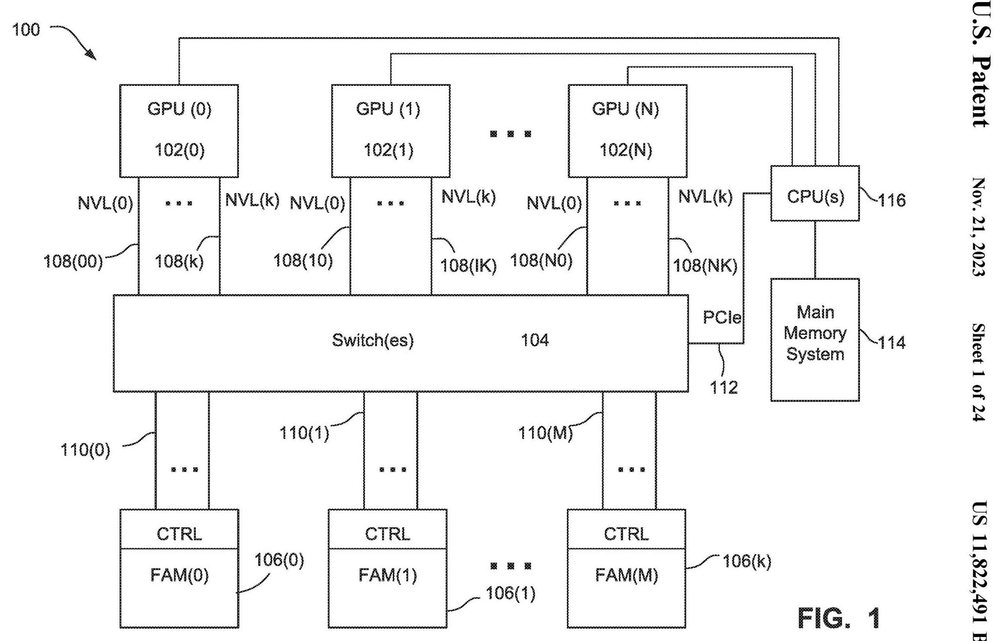
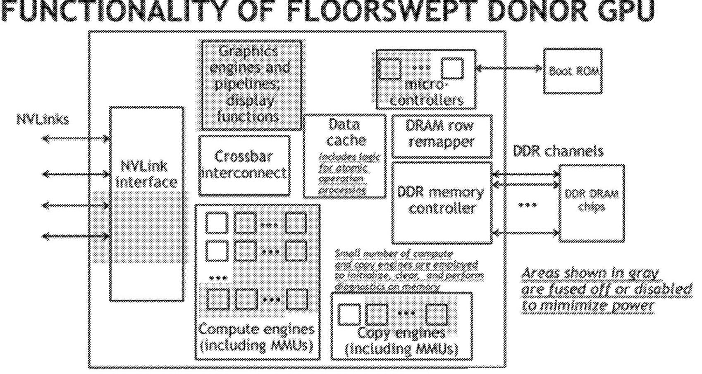
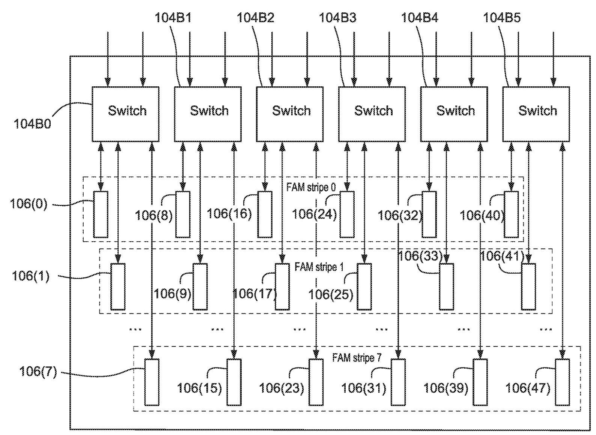
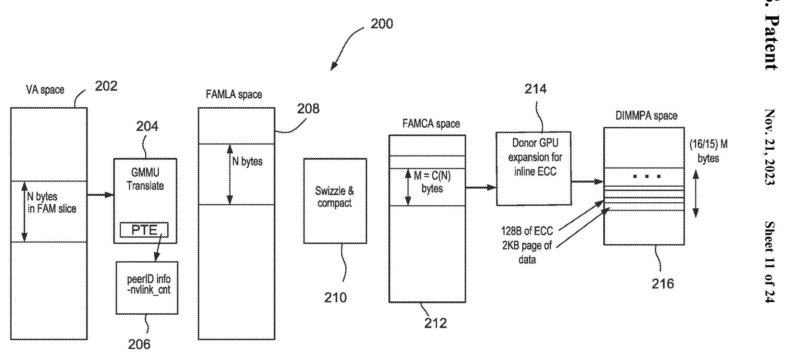
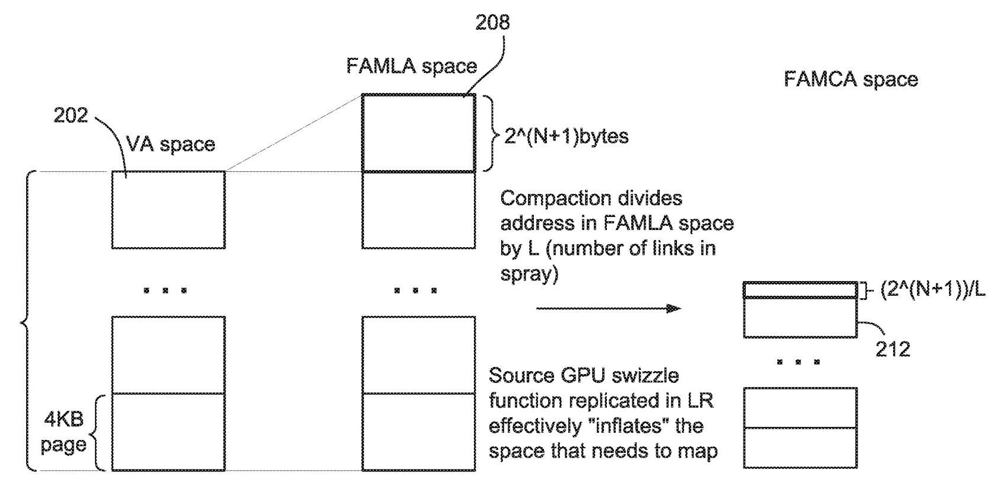
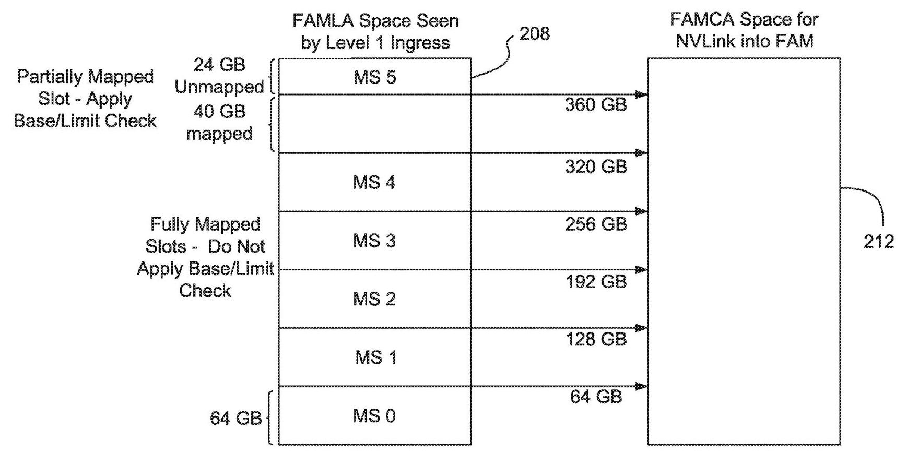

# Techniques for an Efficient Fabric Attached Memory 深度解读

> **发明人**：John Feehrer, Denis Foley, Mark Hummel, Vyas Venkataraman, Ram Gummadi, Samuel H. Duncan, Glenn Dearth, Brian Kelleher  
> **来源/年份**：US Patent US 11,822,491 B2，授权日 2023-11-21，NVIDIA Corporation  
> **一句话总结**：这项专利把 GPU fabric 上的外接内存做成可被 GPU 当作 peer memory 访问的 FAM，并用 reduced/floor-swept GPU、stripe、swizzle-aware compaction 和 switch map-slot routing 来同时解决容量扩展、带宽利用、native atomics 与地址空间利用率问题。

## 一、问题定义

这份专利关注的不是“GPU 能不能访问远端内存”这个一般问题，而是更具体的工程问题：当 GPU workload 的工作集超过本地 HBM/GDDR 容量时，能否在不继续购买完整 compute GPU、不走慢速 PCIe system memory 路径、不破坏 GPU memory semantics 的前提下，把数十到数百 TB 级的高带宽内存挂到 GPU fabric 上。

背景里有两个约束很关键。第一，GPU 本地 HBM 带宽和延迟好，但容量有限；用更多 GPU 来买更多随 GPU 捆绑的显存，会把不需要的 compute 也买进来，增加成本和功耗。第二，CPU system memory、NVMe 或 PCIe peer-to-peer 虽然容量更大，但带宽/延迟和编程模型都不适合让 GPU 像访问本地/peer memory 一样进行 word-addressable loads/stores/atomics。专利中甚至以许多 CPU 只能访问约 3 TB 为例，说明传统 CPU 地址空间和 PCIe 路径都不是理想扩展点。

Fig. 1 展示了该问题的边界：source GPUs 102 通过 NVLINK/NVSWITCH 类 fabric 连接到 FAMM 106，而 CPU main memory 114 仍在 PCIe 侧。专利的核心选择是把外接内存放在 GPU peer fabric 上，使其尽可能像 GPU peer memory，而不是像慢速主存或块设备。

这不是 FAM 概念的 first work。专利自己提到 HPE/Gen-Z、“The Machine”、dynamic remapping 等 memory disaggregation 方向，也引用了 NVIDIA 既有 multi-GPU peer memory 和 distributed address translation 工作。它的切入点是：在 GPU/NVLink 生态里，如何把 FAM 做成低成本、可扩容、可运行 GPU native atomic、并能处理 source GPU 与 FAMM 链路/地址空间不对称的具体实现。

**动机评估**：动机比较 solid。AI、graph analytics、recommender、medical imaging、rendering 等 workload 的内存容量增长快于单 GPU 本地内存增长，而 PCIe system memory 不能提供同等带宽和语义。专利没有给出 benchmark 曲线，但给出了明确系统目标：10s 到 100s TB 容量、multiple TB/s 级带宽、与 NVLink/NVSwitch/CUDA/UVM 等既有技术栈兼容。

**核心 insight**：FAM 不能只是“远端大内存”。如果它要被 GPU 软件自然使用，就必须同时满足三件事：保留 GPU peer memory 语义和 native atomics；用更便宜、更低功耗的 FAMM 控制器替代完整 compute GPU；在 source GPU spray 到多个链路/FAMM 后，把稀疏、被 swizzle 影响的全局地址重新 compact 成每个 FAMM 可用的连续本地地址空间。

## 二、相关工作

相关工作可以按“容量扩展路径”来理解。

第一类是 GPU peer memory 和 NVLink/NVSwitch 互连。既有 NVIDIA 系统允许 GPU 通过高速 fabric 访问其他 GPU 的本地 memory，并保持 load/store/atomic 等 GPU memory model 操作。它的不足是容量仍然绑定到完整 GPU，用户为了更多内存必须买更多 compute。

第二类是 CPU system memory、NVMe、PCIe peer-to-peer。它们提供更大的容量，但访问链路通常更慢，而且 GPU memory semantics 不一定能高效映射过去。对应用来说，这可能退化成 block I/O 或需要不同编程模型，无法像访问 peer GPU memory 一样细粒度、低延迟地访问。

第三类是通用 memory disaggregation 和 FAM，例如 Gen-Z、HPE The Machine，以及相关的 address-space remapping 研究。它们证明了内存与计算资源解耦的方向，但没有解决 NVIDIA GPU fabric 下的 native GPU atomics、GPU donor controller、NVSwitch route table、source GPU swizzle/spray 与 FAMM local address compaction 的组合问题。

第四类是 CUDA/UVM、Fabric Linear Address (FLA) 与 multi-node address translation。专利借这些机制让 FAM 可以作为 peer aperture 或迁移目标出现：应用可显式分配 pinned FAM，也可通过 `cudaMallocManaged()` 让 UVM 在 GPU local memory 和 FAM 之间迁移页面。

## 三、技术挑战

**挑战 1：解耦 memory capacity 与 compute capacity，但不能丢掉 GPU memory semantics。** 如果 FAMM 只是普通内存控制器，GPU atomics 可能要由 switch 或软件模拟，延迟和复杂度都会上升。专利希望 FAMM 能原生处理 read/write/atomic。

**挑战 2：FAMM 要便宜、低功耗、可复用缺陷芯片。** 完整 GPU 做 FAM 控制器过于浪费，但完全自研控制器又要重新实现 GPU fabric protocol、atomics、RAS、初始化和诊断能力。

**挑战 3：source GPU 与 FAMM 的链路数不对称。** 典型例子是 source GPU 有 12 条 fabric links，而一个 FAMM 只接 2 条。source GPU 为了避免 hot spot 会把请求 spray 到多个链路，但每个 FAMM 只看到部分流量。

**挑战 4：spray/swizzle 会制造稀疏地址流，直接映射会浪费 FAMM 容量。** 专利举例：source GPU 地址范围可能是 0-12 GB，而单个 FAMM 本地空间是 0-2 GB。某个 FAMM 可能只收到 0 KB、256 KB、320 KB、448 KB 等不连续地址；如果不 compact，FAMM 本地空间会出现大量 holes。

**挑战 5：compaction 不能破坏地址唯一性。** source GPU 选择链路时用了 swizzle 产生 entropy。switch/FAMM 在 compaction 前必须匹配或处理这个 swizzle，否则不同 ingress port 或不同 link 的地址可能在 compact 后碰撞。

**挑战 6：虚拟化、QoS、错误隔离和安全清零都要落到可管理的硬件/软件边界上。** FAM 可能被多个 VM、用户或 source GPU 分区共享；DBE、page retirement、ownership change 时的 memory zeroing 都必须能局部处理，不能轻易拖垮整机。

## 四、解决方案

### 整体思路

专利把 FAM 做成一组 Fabric Attached Memory Modules (FAMMs)。每个 FAMM 包含一个“donor GPU”或类似 GPU 的低能力控制器，以及与之连接的 DRAM/HBM/GDDR/NVRAM 等内存。source GPU 仍然通过 NVLink/NVSwitch 类 fabric 发起 load/store/atomic，FAMM 则像 peer GPU memory 的目标一样响应。

整体方案由三层配合完成：FAMM 控制器负责 native protocol/atomics/RAS；软件把多个 FAMM 组织成 stripe 或 logical stripe；switch 的 routing table/map slots 负责 TgtID 选择、base/limit check、offset、swizzle matching、compaction 和 shuffle。

### 贯穿示例

可以把它想成一个 8-GPU 训练/图分析节点。每个 GPU 本地 HBM 不够装下大图或 recommender embedding，CPU 内存虽然大但 PCIe 路径慢。系统管理员插入若干 FAM baseboards，每个 baseboard 上有很多 FAMM。应用看到一段 FAM peer memory：显式用 CUDA driver API 分配 pinned FAM，或通过 UVM 把超出本地 HBM 的页面迁移到 FAM。

当 GPU 0 访问这段 FAM 时，它不会把所有请求压到某一条 NVLink，而是用 swizzle 让请求分散到 12 条链路。下游 switch 根据 map slot 判断这个地址属于哪组 FAMM、哪个 TgtID、是否需要 compaction。若某个 FAMM 只有 2 GB 本地地址空间，而 GPU 发出的 FAMLA 在 0-12 GB 范围内，switch 会把该 FAMM 收到的稀疏地址压缩成 0-2 GB 内的连续 FAMCA。FAMM donor GPU 最后用自己的 memory controller、row remapper 和 data cache 访问本地内存，并能原生执行 GPU atomic。

### 关键技术点

**1. 用 floor-swept/reduced GPU 做 FAMM donor controller。**

Fig. 3 是专利最重要的硬件图之一。灰色区域表示被禁用或不可用的 graphics engines、compute engines、copy engines、display、microcontrollers 等能力；保留下来的路径包括 NVLink interface、crossbar interconnect、data cache、DRAM row remapper、DDR memory controller 和 boot ROM。这个设计把“不能当完整 GPU 卖”的芯片转化成能响应 fabric memory commands 的 FAM controller，同时降低功耗。

专利反复强调 native atomics 的价值。FAMM donor GPU 若能直接执行 GPU read-modify-write atomic memory access command，source GPU 的应用和线程同步逻辑就不必改成高延迟的 emulated RMW。

**2. 用 stripe/logical stripe 聚合容量和带宽。**

Fig. 4 展示了 software-allocated stripe：多个 FAMM 组成一个逻辑 stripe，为某个 source GPU 或 VM 提供更大的容量和更高 aggregate bandwidth。专利例子中，一个 switch 下可以有 8 个 FAMM，形成 8 个 6-wide stripes；Fig. 5 进一步把每个 stripe 分成 3 个 logical stripes，使 24 个 source GPUs 各拿到一个 logical stripe。

这里要注意，stripe 是软件/路由表层面的容量组织；spray 是 source GPU 为了链路负载均衡而做的流量分发。两者共享 switch routing table，但解决的问题不同。

**3. 用 peer aperture/FLA 把 FAM 接入 GPU 地址体系。**

Fig. 11 说明应用的 VA 先经 GMMU/PTE 映射到 FAMLA space，再经 swizzle & compact 形成 FAMCA，最后经 donor GPU 的 ECC/physical mapping 到 DIMM physical address。peer aperture register 记录 peer ID、spray width、使用哪些 hubs/links 等参数，使 source GPU 能把 FAM 当作一种 peer memory window。

**4. switch 做 swizzle-aware compaction，解决容量空洞。**

Fig. 12 的要点是：source GPU 的 swizzle 会“inflate”某个 switch port 需要覆盖的地址空间；compaction 再把 FAMLA address 除以 spray 链路数 L，得到 FAMCA。专利给出的简单例子是 12 条 source links 对 6 个 FAMMs、每个 FAMM 2 条 links；source GPU 地址为 0-12 GB，而每个 FAMM 期望 0-2 GB。没有 compaction 时，每个 FAMM 只能利用稀疏片段；compaction 后，目标 FAMM 看到线性地址流。

关键细节是 compaction 前必须匹配 source GPU 的 swizzle。因为 source GPU 为了避免 link camping 会伪随机选择链路，但在线上传输的仍是原始地址。switch 若不按同一 swizzle 逻辑理解这些地址，compact 后可能把不同请求映射到同一 FAMCA。

**5. routing table/map slot 承担 routing、protection 和 relocation。**

Fig. 15 展示了 map slots 如何把 FAMLA space 的一组 MS0-MS5 映射到 FAMCA space。完整映射 slot 可以不做 base/limit check；部分映射 slot 需要检查，防止访问未映射或不属于当前分区的 FAM capacity。routing table 还可配置 TgtID、offset、shuffle 等，用于选择 FAMM、分区 relocation，以及避免多个 ingress 端口汇聚到同一 FAMM 时出现地址碰撞。

### 与已有方案的对比

相比 CPU system memory/PCIe，FAM 走 GPU high-speed fabric，能保留更接近 peer GPU memory 的访问语义。相比用更多完整 GPU 堆内存，FAMM 把 memory capacity 从 compute capacity 中拆出来，降低成本和功耗。相比通用 FAM/Gen-Z，它更深地利用 NVIDIA GPU fabric、native atomics、CUDA/UVM、FLA、NVSwitch route table 等已有基础设施。

局限也很明确：专利没有给出实测性能；native atomics、switch compaction、map-slot programming 都依赖特定 fabric 和 GPU/driver 生态；如果 workload 是大量小写或随机访问，专利也承认 DRAM bandwidth 会因 read-modify-write、L2 miss、closed bank overhead 而下降。

## 五、实验评估

这是一份专利，不是论文，因此没有传统意义上的实验设置、baseline、benchmark 或性能曲线。它的“评估材料”主要是架构例子、容量/带宽目标和若干边界条件。

**系统规模示例**：专利目标是让 FAM 支持 10s 到 100s TB 的 GPU-accessible memory，并达到 multiple TB/s bandwidth。它把一个 source GPU 的 12 条 links spray 到 6 个 FAMMs、每个 FAMM 2 条 links，作为 swizzle/compaction 的典型非对称例子。另一个 stripe 示例中，每个 switch 有 8 个 FAMMs，可形成 8 个 6-wide stripes；每个 stripe 再分 3 个 logical stripes 后，可服务 24 个 source GPUs。

**地址转换示例**：source GPU 可能生成 0-12 GB 的 FAMLA，而单个 FAMM 只有 0-2 GB 地址空间。若某 FAMM 只收到 0 KB、256 KB、320 KB、448 KB 等稀疏地址，不 compact 就只能低效利用容量；switch 按 L 做 division/compaction 后才能给 FAMM 线性地址流。对于 map slot，专利还提到 64 GB 粒度、1 TB DIMM range、swizzle 可能带来的 `2^(N+1)-1` bytes slop；当 N 不超过 11 时最大约 4 KB，但若 base/limit field 粒度是 1 MB，则软件实际按 1 MB 粒度处理。

**GPU/fabric 参数**：后部 GPU 架构样板段落给出 NVLink signaling rate 20-25 Gbit/s、每方向 25 GB/s、6 links 合计 300 GB/s 的例子。这些数字说明该专利预期利用的是高带宽 peer fabric，而不是 PCIe 主存路径。

**结论支撑性分析**：专利对“为什么需要 FAM”和“为什么需要 compaction”论证较充分，因为链路不对称和地址空间不对称会直接造成带宽/容量浪费。但它没有量化 floor-swept GPU 相比完整 GPU 或专用 ASIC 的成本/功耗收益，也没有给出 UVM/FAM 下真实 workload 的性能数据。因此，方案可信度主要来自架构一致性和与既有 NVIDIA fabric 的可组合性，而不是实验验证。

## 六、附加洞察

**结论 1：native atomics 是兼容性边界，不只是性能优化。**  
*出处*：Background & Summary、Floor Swept GPUs、claims 1/6/7/15。  
*推理链条*：GPU 应用和同步原语依赖 atomic memory operations -> FAM 若不支持 native atomics，就要用软件或 switch 做 RMW emulation -> latency、ordering 和实现复杂度都会上升 -> 因此 claims 把 read-modify-write atomic memory access command 写成 FAMM controller 的核心能力。

**结论 2：floor-swept GPU 的价值来自“协议复用 + yield salvage”的组合。**  
*出处*：Floor Swept GPUs as Disaggregated Fabric Attached Memory Controllers 与 Fig. 3。  
*推理链条*：完整 GPU 太贵太耗电 -> 专用控制器需要重新实现 fabric protocol/atomics/RAS -> 有缺陷但 NVLink/memory controller 可用的 GPU die 可关闭 compute/copy/graphics -> 既复用 GPU peer protocol，又把本来可能报废的硅片转成 FAM donor。

**结论 3：compaction 主要是在修复 spray 后的容量利用率问题，而不是单纯做地址翻译。**  
*出处*：Example Non-Limited Address Mapping/Transformations、Example Non-Limiting Swizzling & Compaction、Fig. 11/12。  
*推理链条*：source GPU 为避免 hot spot 会 spray/swizzle -> 每个 FAMM 只收到全局地址空间中的稀疏子集 -> 直接映射会造成 holes，FAMM 本地容量无法充分使用 -> switch/FAMM 需要按 link count L compact 成连续 FAMCA。

**结论 4：map slot 的安全检查与虚拟化分区同等重要。**  
*出处*：Example Interconnect Fabric Routing、Fig. 15、Feature Combinations。  
*推理链条*：FAM 可被不同 source GPU/VM 分配为不同 stripe 或 slice -> 部分 slot 可能只映射 40 GB 而非完整 64 GB -> 若不做 base/limit check，访问可能越过租户/分区边界 -> routing table 必须把 routing、address transform、protection 放在同一控制面里。

**结论 5：后半部分 GPU 架构描述主要用于专利 enablement，不是本发明的技术贡献中心。**  
*出处*：Parallel Processing GPU Architecture、Graphics Processing Pipeline、Exemplary Computing System。  
*推理链条*：这些段落详细描述 GPC、SM、ROP、graphics pipeline、Tensor Core 等通用 GPU 架构 -> 与 FAM 的直接机制关联较弱 -> 它们帮助说明 GPU 102 的可实现环境和被禁用 compute capability 的范围，但核心贡献仍在 FAMM donor、stripe、swizzle/compaction、routing table。

## 七、总结与评价

这份专利的核心贡献是把 GPU fabric 上的外接内存系统化：用 reduced/floor-swept GPU 当 FAMM donor 保留 native atomics，用 stripe/logical stripe 聚合容量和带宽，用 swizzle-aware compaction 让被 spray 的地址流仍能充分利用每个 FAMM 的本地地址空间，再用 switch map slots 统一处理目标选择、分区保护和地址 relocation。

最大亮点是工程组合很完整：它不是孤立提出“更多内存”，而是把 controller 成本、GPU memory semantics、fabric load balancing、address-space packing、VM isolation 和 RAS 放在同一条数据路径上考虑。最大不足是缺少实测验证，尤其没有展示真实 AI/HPC workload 在 FAM、PCIe system memory、更多完整 GPU 之间的性能/功耗/成本对比。

如果继续研究，这份专利最值得追踪的问题是：实际产品中 compaction/routing table 的可编程粒度和开销是多少；native atomics 在 FAM 上的 ordering/visibility 与 local/peer GPU memory 是否完全一致；UVM 页面迁移策略如何决定页面留在 HBM 还是 FAM；以及在多租户场景下 DBE/page retirement 能否做到专利描述的“surgical”隔离。

## 八、章节脉络与段落速览

- **Front Matter / Abstract**：给出 US 11,822,491 B2 的题名、申请人、发明人、授权日和摘要，明确 FAM 的两条主线是用 imperfect processors 作为 memory controllers，以及用 address compaction 充分利用 FAM 地址空间。
- **Cross-Reference / Field**：说明本案是相关申请的 divisional，并把技术范围限定为 fabric attached memory、address compaction、以及 reduced-capability GPU 作为 FAM controller。
- **Background & Summary**
  - ¶1-2：从 social media、AI、IoT、parallel processing 引出大容量低延迟内存需求。
  - ¶3-5：说明 HBM 容量有限，CPU/system memory 或 NVMe/PCIe 路径带宽与语义不足，很多 CPU 地址空间也可能成为容量限制。
  - ¶6-8：引出 NVLink/NVSwitch 和既有 FAM/Gen-Z 工作，再指出低成本、高容量 GPU FAM 仍有未解决问题。
  - ¶9-13：提出本专利的 FAM 目标：容量/带宽与 GPU/CPU 数量解耦，同时保留 GPU-like interface、atomic access、address mapping 和 traffic distribution。
  - ¶14-后续特性列表：总结 FAMM、floor-swept GPU、native atomics、stripe、local diagnostics、degraded operation、row remapping 等非限制性特性。
- **Brief Description of the Drawings**：列出 Fig. 1-24；真正与 FAM 机制高度相关的是 Fig. 1-17，Fig. 18-24 主要是通用 GPU/系统架构背景。
- **Detailed Description: Example Non-Limiting System 100**
  - ¶1-3：描述多个 GPU 通过 high-bandwidth fabric 通信，并指出 GPU 可访问 peer GPU memory。
  - ¶4-7：将 FAMM 放到同一 fabric 上，避免通过 PCIe 访问 CPU main memory，并强调 GPU 应用可用少量修改甚至不修改来访问 FAM。
  - ¶8：强调支持完整 GPU memory model 和 native GPU atomics，避免 emulation。
- **Example FAM Implementation**
  - ¶1-2：以 8 GPU、多个 NVSwitch、FAM baseboard 和 FAM service processor 说明管理拓扑。
  - ¶3-管理列表：FAM SP CPU 负责 donor initialization、memory controller configuration、DRAM zeroing、error/performance monitoring、row remapper 和 thermal/power monitoring。
- **Floor Swept GPUs as Disaggregated Fabric Attached Memory Controllers**
  - ¶1-4：提出用低端或有缺陷 GPU 作为 FAMM controller，只保留 fabric/memory 相关能力。
  - ¶5-7：解释 native atomics 对性能和兼容性的意义，也承认某些实现可不支持 native atomics 但性能会下降。
  - ¶8-功能列表：列出最低能力，包括 capacity、bandwidth、row remapper、TLB coverage、inbound RMW、self-test 和 DRAM initialization。
  - ¶后续：定义无 GPU compute capability 的 FAMM controller 组成，并列举可被 fused off 的 compute/copy/graphics/display 功能。
- **Example Non-Limiting Data Stripes**
  - ¶1-3：定义 stripe，把多个 FAMM 组合成并行访问的容量/带宽集合。
  - ¶4-5：说明 dedicated/shared stripe、VM isolation、congestion control 和 logical stripe。
  - ¶6-7：区分 software-managed stripe 与 hardware spray，并指出 routing table 同时服务这两类需求。
- **Example Non-Limiting Form Factor**
  - ¶1-3：说明 FAM baseboard/drawer 可与 GPU baseboard 按 workload 的 compute/memory 比例互换，Fig. 6-8 展示不同 chassis 配置。
- **Example Non-Limited Address Mapping/Transformations**
  - ¶1-2：引入 FLA 和 VA -> FAMLA -> FAMCA -> DIMM physical address 的多级转换。
  - ¶3-5：定义 swizzle 和 compaction：前者选择 link/spray pattern，后者去掉 interleave 后的 holes。
  - ¶6-后续：说明 source GPU 使用 entropy 防止 link camping，并通过 peer aperture 控制 spray width 和 FAM window。
- **Example Non-Limiting Swizzling & Compaction**
  - ¶1-4：说明如果没有 compaction，每个 FAMM 会只看到全局地址的稀疏子集，造成容量浪费。
  - ¶5-8：用 0-12 GB source address 和 0-2 GB FAMM address 举例，解释 switch 如何将地址变换到 FAMM 可接受范围。
  - ¶9-12：强调 switch 要匹配 source GPU swizzle，否则 compact 后可能 collision。
  - ¶13：说明 ingress module 可额外做 offset、masked rewrite、validation/translation，以支持虚拟化 relocation。
- **Example Interconnect Fabric Routing**
  - ¶1-4：介绍 switch ingress routing table/map slot，控制是否做 swizzle/compaction、base/limit check、TgtID 和 routing。
  - ¶5-8：解释 slop、shuffle、offset、partial slot、full slot 和 1 TB/64 GB 粒度示例。
  - ¶9-10：说明 Fig. 16/17 如何把 12-way spray 的 traffic 分配到 6-wide FAM slice 和多个 TgtID。
- **Parallel Processing GPU Architecture / Graphics Processing Pipeline / Exemplary Computing System**：描述 GPU 102 的 GPC、SM、MMU、memory partition、graphics pipeline、NVLink 和通用计算系统；这些段落主要是专利实现环境和 compute capability 定义背景。
- **In Summary / Example Feature Combinations**：把核心技术归纳为 higher capacity、high bandwidth、memory disaggregation、existing NVLink/NVSwitch/CUDA/UVM building blocks，并列出 big data、HPC、AI、medical imaging、graphics rendering 等 use cases。
- **Claims 1-16**：权利要求集中在三组对象：其一是 intentionally disabled/defective/no compute capability 的 FAM processor 与 memory；其二是 source GPU、interconnect fabric、plural FAM、address transformer/swizzler/compactor 的系统；其三是包含多个 FAMM、service processor、native GPU atomics 和 peer-to-peer GPU communication 的 FAM baseboard。
