(12) United States Patent (10) Patent No.: US 11,822,491 B2

> 
(12) 美国专利 (10) 专利号：US 11,822,491 B2

Feehrer et al. (45) Date of Patent: Nov. 21, 2023

> 
Feehrer 等人 (45) 专利日期：2023 年 11 月 21 日

(54) TECHNIQUES FOR AN EFFICIENT FABRIC ATTACHED MEMORY

> 
(54) 高效的结构附加内存 (Fabric Attached Memory) 技术

(71) Applicant: NVIDIA Corporation, Santa Clara, CA (US)

> 
(71) 申请人：英伟达公司（NVIDIA Corporation），美国加利福尼亚州圣克拉拉（US）

(72) Inventors: John Feehrer, Westford, MA (US); Denis Foley, Shrewsbury, MA (US); Mark Hummel, Franklin, MA (US); Vyas Venkataraman, Sharon, MA (US); Ram Gummadi, San Jose, CA (US); Samuel H. Duncan, Arlington, MA (US); Glenn Dearth, Groton, MA (US); Brian Kelleher, Palo Alto, CA (US)

> 
(72) 发明人：John Feehrer，马萨诸塞州韦斯特福德（美国）；Denis Foley，马萨诸塞州什鲁斯伯里（美国）；Mark Hummel，马萨诸塞州富兰克林（美国）；Vyas Venkataraman，马萨诸塞州沙伦（美国）；Ram Gummadi，加利福尼亚州圣何塞（美国）；Samuel H. Duncan，马萨诸塞州阿灵顿（美国）；Glenn Dearth，马萨诸塞州格罗顿（美国）；Brian Kelleher，加利福尼亚州帕洛阿尔托（美国）

(73) Assignee: NVIDIA Corporation, Santa Clara, CA (US)

> 
(73) 专利权人 (Assignee)：英伟达公司 (NVIDIA Corporation)，美国加利福尼亚州圣克拉拉市 (Santa Clara, CA, US)

(*) Notice: Subject to any disclaimer, the term of this patent is extended or adjusted under 35 U.S.C. 154(b) by 14 days.

> 
(*) 注意：除任何免责声明 (Disclaimer) 另有规定外，本专利的期限根据《美国法典》第35编第154条(b)款 (35 U.S.C. 154(b)) 被延长或调整了14天。

(21) Appl. No.: 17/506,438

> 
(21) 申请号 (Appl. No.): 17/506,438

(22) Filed: Oct. 20, 2021

> 
(22) 申请日 (Filed)：2021年10月20日

(65)

> 
(65)

Prior Publication Data

> 
在先公开数据 (Prior Publication Data)

US 2022/0043759 A1 Feb. 10, 2022

> 
美国专利 US 2022/0043759 A1，2022年2月10日

Related U.S. Application Data

> 
相关美国申请数据

(62) Division of application No. 16/673,537, filed on Nov. 4, 2019, now Pat. No. 11,182,309.

> 
(62) 分案申请 (division of application) 号 16/673,537，申请日：2019 年 11 月 4 日，现专利号 11,182,309。

(51) Int. Cl.

> 
(51) 国际专利分类号 (Int. Cl.)

G06F 13/16 (2006.01)

> 
G06F 13/16 (2006.01)

G06F 13/40 (2006.01)

> 
G06F 13/40 (2006.01)

(Continued)

> 
本专利（US 11,822,491 B2）提出了一种高效的**结构连接内存**（Fabric Attached Memory, FAM）技术，该技术将内存与计算资源解耦，使内存容量和带宽能够独立于 GPU 进行扩展。所解决的主要研究问题是如何为并行处理器提供大容量、高带宽、低延迟的内存，而不必等比例地增加 GPU 的计算能力。

其关键贡献包含两种主要方法。第一，使用“降级”（floor‑swept）或计算能力削减的 GPU（例如含有缺陷计算单元或有意熔断计算功能的芯片）作为低成本的 FAM 内存控制器。这些“捐赠”GPU 保留了足够的功能——如内存接口和硬件加速的原子操作（atomic operations）——使其能够在高速互连网络（例如 NVIDIA NVLink）上作为功能完备的对等设备（peer device）运行。这种方法既重用了原本会被废弃的硅片，又为 GPU 内存模型语义（包括原子操作）提供了原生支持，同时还降低了功耗。

第二，本发明引入了地址映射和转换机制以充分利用 FAM 的容量。当源 GPU 通过基于熵的地址交织（address swizzling）将访存请求“喷洒”（sprays）到多条链路上以均衡流量时，所产生的地址分布会在各个 FAM 模块较小的地址空间中形成间隙。为弥补这一问题，在交换结构（fabric switch）或 FAM 控制器内部执行地址压缩操作（除以喷洒链路数量），将稀疏的访问流映射为密集、线性的地址空间。结合交换路由表（switch routing table）编程，该系统能够支持跨多个 FAM 设备的数据灵活条带化（data striping）、虚拟化分区以及租户间的无干扰访问。

主要结论是，此类系统能够利用成本低廉且能效高的内存模块，为 GPU 构建可扩展的、数 TB 容量且高带宽的内存池，同时完全保持与 GPU 原生内存模型的兼容性，且无需修改应用程序。

(52) U.S. Cl.

> 
(52) 美国专利分类号 (U.S. Cl.)

CPC ...... G06F 13/1652 (2013.01); G06F 9/45558 (2013.01); G06F 12/1027 (2013.01);

> 
合作专利分类 (CPC) ...... G06F 13/1652 (2013.01); G06F 9/45558 (2013.01); G06F 12/1027 (2013.01);

(Continued)

> 
本专利（US 11,822,491 B2）提出了用于高效结构附加内存（Fabric Attached Memory, FAM）的技术，该技术将内存与计算资源分离，使内存容量和带宽能够独立于 GPU 扩展。所要解决的主要研究问题是如何为并行处理器提供大容量、高带宽、低延迟的内存，而无需按比例增加 GPU 计算能力。

其主要贡献包括两种核心方法。第一，使用“地板扫掠（floor‑swept）”或削减功能型（reduced‑capability） GPU（例如，含有缺陷计算单元或有意熔断计算能力的部件）作为低成本的 FAM 内存控制器。这些供体 GPU（donor GPU）保留了足够的功能——如内存接口和硬件加速的原子操作——以作为高速互连结构（如 NVIDIA NVLink）上的全功能对等设备。这种方法重用了原本会被废弃的硅片，原生支持 GPU 内存模型语义（包括原子操作），并降低了功耗。

第二，本发明引入了地址映射和转换机制，以充分利用 FAM 的容量。当源 GPU 通过基于熵的地址混合（entropy‑based address swizzling）将内存访问请求“喷洒（sprays）”到多条链路上时（旨在均衡流量），由此产生的地址分布会在各个 FAM 模块较小的地址空间内形成间隙。为了弥补这一点，在结构交换机（fabric switch）或 FAM 控制器内部执行地址压缩操作（除以喷洒链路数），将稀疏的访问流映射为密集、线性的地址空间。结合交换机路由表编程，该系统支持跨多个 FAM 设备的灵活数据条带化、虚拟化分区以及租户间的无干扰运行。

主要结论是，这种系统能够为 GPU 构建可扩展、数 TB 级、高带宽的内存池，使用成本低且能效高的内存模块，同时保持与 GPU 原生内存模型的完全兼容，且无需修改应用程序。

(58) Field of Classification Search

> 
(58) 分类检索领域 (Field of Classification Search)

CPC .. Y02D 10/00; G06F 13/4022; G06F 12/0607 See application file for complete search history.

> 
合作专利分类 (CPC) .. Y02D 10/00; G06F 13/4022; G06F 12/0607 完整的检索历史见申请文件。

(56) References Cited

> 
(56) 引用文献 (References Cited)

U.S. PATENT DOCUMENTS

> 
美国专利文献 (U.S. PATENT DOCUMENTS)

7,275,123 B2 9/2007 Duncan et al.

> 
7,275,123 B2，2007年9月，Duncan 等人。

7,451,259 B2 11/2008 Duncan et al.

> 
7,451,259 B2 2008年11月 Duncan 等

(Continued)

> 
本专利（US 11,822,491 B2）提出了高效结构附加内存（Fabric Attached Memory，FAM）技术，该技术将内存与计算资源分离（disaggregates），使内存容量和带宽可独立于 GPU 进行扩展。所解决的核心研究问题是如何为并行处理器提供高容量、高带宽、低延迟的内存，而无需按比例增加 GPU 计算能力。

关键贡献包括两种主要方法。第一，使用“地板级扫流（floor‑swept）”或降低能力的 GPU（例如，带有缺陷计算单元或有意熔断计算功能的芯片）作为低成本的 FAM 内存控制器。这些捐赠 GPU 保留了足够的功能——例如内存接口和硬件加速原子操作（hardware‑accelerated atomic operations）——以便在高速互连结构（例如 NVIDIA NVLink）上充当功能完备的对等设备。这种方法重用了原本会被丢弃的硅片，提供了对 GPU 内存模型语义（包括原子操作）的原生支持，并降低了功耗。

第二，本发明引入了地址映射和变换机制，以充分利用 FAM 容量。当源 GPU 通过基于熵的地址混合（address swizzling）（用于均衡流量）将内存访问请求“喷洒”到多条链路上时，所产生的地址分布会在各 FAM 模块较小的地址空间中形成间隙。为弥补这一不足，在结构交换机或 FAM 控制器内执行地址压缩操作（即除以喷洒链路数），将稀疏的访问流映射到密集的线性地址空间。结合交换机路由表编程，该系统支持跨多个 FAM 设备的灵活数据条带化（data striping）、虚拟化分区以及租户间无干扰。

主要结论是，这种系统能够使用成本效益高且能效出色的内存模块，为 GPU 构建可扩展的、数 TB 级的高带宽内存池，同时保持与 GPU 原生内存模型的完全兼容，且无需修改应用程序。

FOREIGN PATENT DOCUMENTS

> 
外国专利文件（FOREIGN PATENT DOCUMENTS）

CN 102566981 A 7/2012

> 
本专利 (US 11,822,491 B2) 提出了实现高效架构附加内存 (Fabric Attached Memory, FAM) 的技术，将内存与计算资源解耦，使内存容量和带宽能够独立于 GPU 进行扩展。所解决的核心研究问题是如何为并行处理器提供大容量、高带宽、低延迟的内存，而无需成比例地增加 GPU 计算能力。

主要贡献包括两种核心方法。第一，使用“地板‑扫描式”或功能削减的 GPU（例如，含有缺陷计算单元或有意识熔断计算功能的部件）作为低成本的 FAM 内存控制器。这些捐赠 GPU 保留了足够的功能——如内存接口和硬件加速的原子操作——可作为高速互联架构（例如 NVIDIA NVLink）上全功能的端设备运行。该方法重用了原本会被废弃的硅片，原生支持 GPU 内存模型语义（包括原子操作），并降低了功耗。

第二，本专利引入了地址映射和转换机制，以充分利用 FAM 容量。当源 GPU 通过基于熵的地址交织 (address swizzling) 将内存访问请求“喷洒”到多条链路上以均衡流量时，所产生的地址分布会在单个 FAM 模块较小的地址空间中形成空隙。为弥补这一点，在架构交换机或 FAM 控制器内部执行地址压缩操作（即除以喷洒链路数量），将稀疏的访问流映射到密集的线性地址空间。结合交换机路由表编程，系统支持跨多个 FAM 设备的数据条带化、虚拟化分区以及租户间的无干扰运行。

主要结论是，这种系统能够利用经济高效且功耗优化的内存模块，为 GPU 提供可扩展的、数 TB 级的大容量、高带宽内存池，同时保持与 GPU 原生内存模型的完全兼容性，无需修改应用程序。

WO 2017086987 A1 5/2017

> 
WO 2017086987 A1 5/2017

## OTHER PUBLICATIONS

Chinese Office Action issued in Chinese Application No. 202010678472.8 dated Jul. 19, 2023.

> 
中国申请号202010678472.8的审查意见通知书，2023年7月19日。

(Continued)

> 
本专利（US 11,822,491 B2）提出了高效的**结构附加内存**（Fabric Attached Memory，FAM）技术，将内存与计算资源解耦，使内存容量和带宽能够独立于 GPU 进行扩展。所解决的核心研究问题是如何为并行处理器提供大容量、高带宽、低延迟的内存，而无需按比例增加 GPU 的计算能力。

主要贡献包括两项核心技术。第一，利用“底边扫描”（floor‑swept）或计算能力被削减的 GPU（例如包含缺陷计算单元或通过熔断有意关闭计算功能的芯片）作为低成本的 FAM 内存控制器。这些供体 GPU 保留了足够的功能——如内存接口和硬件加速的原子操作——可在高速互连结构（例如 NVIDIA NVLink）上作为功能完备的对等设备运行。该方法不仅重复利用了原本会报废的硅片，还提供了对 GPU 内存模型语义（包括原子操作）的原生支持，并降低了功耗。

第二，本发明引入了地址映射和转换机制，以充分利用 FAM 的容量。当源 GPU 通过基于熵的地址交织（address swizzling）将内存访问请求分散到多条链路上时，所产生的地址分布会在各个 FAM 模块较小的地址空间中造成空隙。为弥补这一问题，在结构交换机或 FAM 控制器内部执行地址压缩操作（除以分散链路数量），将稀疏的访问流映射为稠密、线性的地址空间。结合交换路由表的编程，该系统支持在多个 FAM 设备间灵活实现数据条带化、虚拟化分区以及租户间无干扰。

主要结论是：这种系统能够使用成本效益高且功耗低的内存模块，为 GPU 提供可扩展、数 TB 级、高带宽的内存池，同时完全兼容 GPU 原生内存模型，且无需修改应用程序。

Primary Examiner - Brian T Misiura

> 
主要审查员 (Primary Examiner) - Brian T Misiura

(74) Attorney, Agent, or Firm Nixon & Vanderhye PC

> 
(74) 律师、代理人或事务所 (Attorney, Agent, or Firm) Nixon & Vanderhye PC

(57) ABSTRACT

> 
(57) 摘要  
本专利 (US 11,822,491 B2) 提出了高效结构附加内存 (Fabric Attached Memory, FAM) 技术，该技术将内存与计算资源解耦，使得内存容量和带宽能够独立于图形处理器 (GPU) 进行扩展。所解决的主要研究问题是如何为并行处理器提供大容量、高带宽、低延迟的内存，而无需成比例地增加 GPU 的计算能力。

关键贡献包括两种主要方法。第一，使用“floor‑swept”或缩减功能的 GPU（例如，计算单元存在缺陷或有意熔断计算能力的部件）作为低成本 FAM 内存控制器。这些捐赠 GPU 保留了足够的功能——如内存接口和硬件加速的原子操作 (atomic operations)——能够在高速互连结构 (interconnect fabric)（例如 NVIDIA NVLink）上作为全功能的对等设备运行。这种方法重用了本来会被废弃的硅片，提供了对 GPU 内存模型语义（包括原子操作）的原生支持，并降低了功耗。

第二，本发明引入了地址映射和转换机制，以充分利用 FAM 的容量。当源 GPU 通过基于熵的地址交换 (entropy‑based address swizzling)（以均衡流量）将内存访问请求“喷洒 (spray)”到多条链路上时，所产生的地址分布会在各个 FAM 模块较小的地址空间中造成空隙。为了补偿，在结构交换机 (fabric switch) 或 FAM 控制器内部执行地址压缩 (address compaction) 操作（除以喷洒链路数），将稀疏的访问流映射到密集的线性地址空间。结合交换机路由表编程，该系统支持跨多个 FAM 设备的灵活数据条带化 (data striping)、虚拟化分区以及租户间互不干扰。

主要结论是，这样的系统能够为 GPU 提供可扩展、数 TB 级、高带宽的内存池，使用经济高效且功耗优化的内存模块，同时保持与 GPU 原生内存模型的完全兼容，且无需修改应用程序。

Fabric Attached Memory (FAM) provides a pool of memory that can be accessed by one or more processors, such as a graphics processing unit(s) (GPU)(s), over a network fabric. In one instance, a technique is disclosed for using imperfect processors as memory controllers to allow memory, which is local to the imperfect processors, to be accessed by other processors as fabric attached memory. In another instance, memory address compaction is used within the fabric elements to fully utilize the available memory space.

> 
网络附加内存 (Fabric Attached Memory, FAM) 提供了一个内存池，可由一个或多个处理器（例如一个或多个图形处理单元 (graphics processing unit(s), GPU(s))）通过网络结构 (network fabric) 访问。在一个示例中，公开了一种技术，将不完美处理器 (imperfect processors) 用作内存控制器 (memory controllers)，以允许其他处理器将本地位于这些不完美处理器的内存作为网络附加内存 (fabric attached memory) 访问。在另一个示例中，在网络组件 (fabric elements) 内使用内存地址压缩 (memory address compaction) 以充分利用可用内存空间。

16 Claims, 24 Drawing Sheets

> 
16项权利要求 (Claims)，24张附图 (Drawing Sheets)

FUNCTIONALITY OF FLOORSWEPT DONOR GPU

> 
地板清扫型（floor‑swept）捐赠GPU的功能

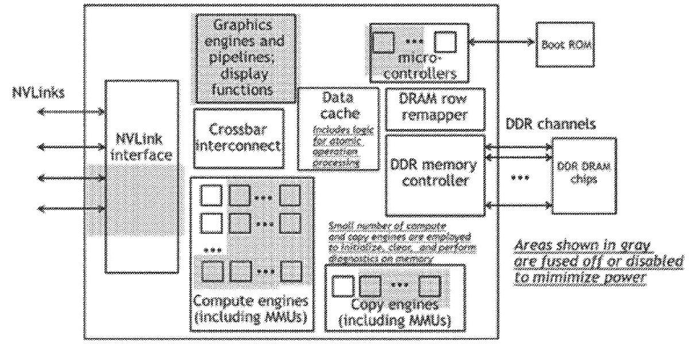

(51) Int. Cl.

> 
国际专利分类 (Int. Cl.)

G06F 9/455 (2018.01)

> 
G06F 9/455 (2018.01)

G06N 20/00 (2019.01)

> 
G06N 20/00 (2019.01)

G06F 17/16 (2006.01)

> 
G06F 17/16 (2006.01)

G06F 12/1027 (2016.01)

> 
G06F 12/1027 (2016.01)

(52) U.S. Cl.

> 
(52) 美国专利分类号 (U.S. Cl.)

CPC ...... G06F 13/1668 (2013.01); G06F 13/4022 (2013.01); G06F 17/16 (2013.01); G06N 20/00 (2019.01); G06F 2009/45583 (2013.01)

> 
联合专利分类 (CPC) ...... G06F 13/1668 (2013.01); G06F 13/4022 (2013.01); G06F 17/16 (2013.01); G06N 20/00 (2019.01); G06F 2009/45583 (2013.01)

(56) References Cited

> 
(56) 引用的参考文献 (References Cited)

### U.S. PATENT DOCUMENTS

<table><tr><td>7,598,958</td><td>B1 *</td><td>10/2009</td><td>Kelleher G06F 9/3877 345/519</td></tr><tr><td>7,627,723</td><td>B1</td><td>12/2009</td><td>Buck et al.</td></tr><tr><td>9,424,201</td><td>B2</td><td>8/2016</td><td>Duluk, Jr. et al.</td></tr><tr><td>9,529,712</td><td>B2 *</td><td>12/2016</td><td>Kelleher G06F 12/0607</td></tr><tr><td>9,639,474</td><td>B2</td><td>5/2017</td><td>Duluk, Jr. et al.</td></tr><tr><td>9,767,036</td><td>B2</td><td>9/2017</td><td>Duluk, Jr. et al.</td></tr><tr><td>9,830,210</td><td>B2</td><td>11/2017</td><td>Duluk, Jr. et al.</td></tr><tr><td>10,133,677</td><td>B2</td><td>11/2018</td><td>Duluk, Jr. et al.</td></tr><tr><td>10,180,916</td><td>B2 *</td><td>1/2019</td><td>Rashid G06F 13/00</td></tr><tr><td>10,241,921</td><td>B2 *</td><td>3/2019</td><td>Appu G06T 1/20</td></tr><tr><td>10,365,843</td><td>B2 *</td><td>7/2019</td><td>Schluessler G06F 3/0673</td></tr><tr><td>10,705,951</td><td>B2 *</td><td>7/2020</td><td>Patel G06F 3/0644</td></tr><tr><td>10,719,238</td><td>B1 *</td><td>7/2020</td><td>Espy G06F 3/065</td></tr><tr><td>10,769,076</td><td>B2</td><td>9/2020</td><td>Duncan et al.</td></tr><tr><td>11,182,309</td><td>B2 *</td><td>11/2021</td><td>Feehrer G06F 13/1668</td></tr><tr><td>012/0154373</td><td>A1</td><td>6/2012</td><td>Finocchio et al.</td></tr></table>

<table><tr><td>2013/0031328</td><td>A1</td><td>1/2013</td><td>Kelleher et al.</td></tr><tr><td>2018/0293011</td><td>A1*</td><td>10/2018</td><td>Schluessler G06F 1/3225</td></tr><tr><td>2018/0300251</td><td>A1 *</td><td>10/2018</td><td>Appu G06F 13/4022</td></tr><tr><td>2018/0314521</td><td>A1*</td><td>11/2018</td><td>Chen G06N 3/045</td></tr><tr><td>2019/0236001</td><td>A1*</td><td>8/2019</td><td>Patel et al.</td></tr><tr><td>2019/0286563</td><td>A1*</td><td>9/2019</td><td>Swamy G06F 12/0842</td></tr><tr><td>2021/0073035</td><td>A1*</td><td>3/2021</td><td>Duluk, Jr G06F 9/461</td></tr><tr><td>2021/0133123</td><td>A1*</td><td>5/2021</td><td>Feehrer G06F 12/1027</td></tr><tr><td>2022/0043759</td><td>A1*</td><td>2/2022</td><td>Feehrer G06F 9/45558</td></tr></table>

## OTHER PUBLICATIONS

Achermann et al., "Separating Translation from Protection in Address Spaces with Dynamic Remapping", Proceedings of the 16th Workshop on Hot Topics in Operating Systems, pp. 118-124, May 7, 2017.

> 
Achermann 等人，《在具有动态重映射的地址空间中分离转换与保护》(Separating Translation from Protection in Address Spaces with Dynamic Remapping)，第16届操作系统热点专题研讨会论文集 (Proceedings of the 16th Workshop on Hot Topics in Operating Systems)，第118-124页，2017年5月7日。

"DRAM and Storage-Class Memory (SCM) Overview", Gen-Z Confortium, 2016, pp. 1-7, https://genzconsortium.org/wp-content/ uploads/2018/05/20170303_Gen-Z-DRAM-and-SCM-Overview. pdf.

> 
"《动态随机存取存储器 (DRAM) 与存储级内存 (Storage-Class Memory, SCM) 概述》"，Gen-Z 联盟 (Gen-Z Consortium)，2016 年，第 1-7 页，https://genzconsortium.org/wp-content/ uploads/2018/05/20170303_Gen-Z-DRAM-and-SCM-Overview. pdf。

Achermann et al., "Separating Translation from Protection in Address Spaces with Dynamic Remapping", Proceedings of the 16th Workshop on Hot Topics in Operating Systems, May 7-10, 2017, pp. 118-124, Whistler, BC, Canada (not enclosed).

> 
Achermann 等人，《在具有动态重映射的地址空间中，将地址转换与保护分离 (Separating Translation from Protection in Address Spaces with Dynamic Remapping)》，第 16 届操作系统热点话题研讨会论文集 (Proceedings of the 16th Workshop on Hot Topics in Operating Systems)，2017 年 5 月 7–10 日，第 118–124 页，加拿大不列颠哥伦比亚省惠斯勒（未包含）

Chen et al., "Billion node graph inference: iterative processing on The Machine", 2016, pp. 1-11, Hewlett Packard Enterprise Development LP, (12 pages).

> 
Chen 等人，“十亿节点图推断：The Machine 上的迭代处理”，2016 年，第 1-11 页，Hewlett Packard Enterprise Development LP，（12 页）。

Chinese Office Action issued in Chinese Application No. 202010678472.8 dated Apr. 29, 2023.

> 
2023年4月29日发出的中国专利申请第202010678472.8号的审查意见通知书（Chinese Office Action）。

* cited by examiner

> 
* 被审查员引用 (cited by examiner)

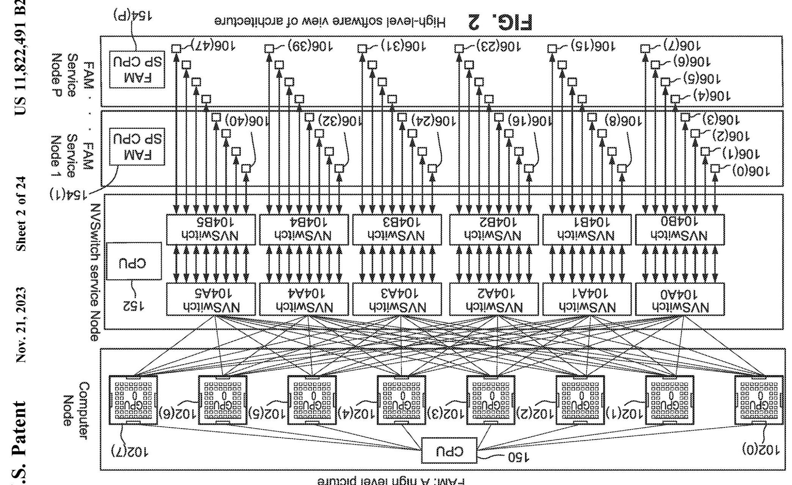

FIG. 3

> 
图 3

FIG. 4 Stripes of FAM allocated to GPUs

> 
图 4 分配给 GPU 的 FAM（Fabric Attached Memory）条带

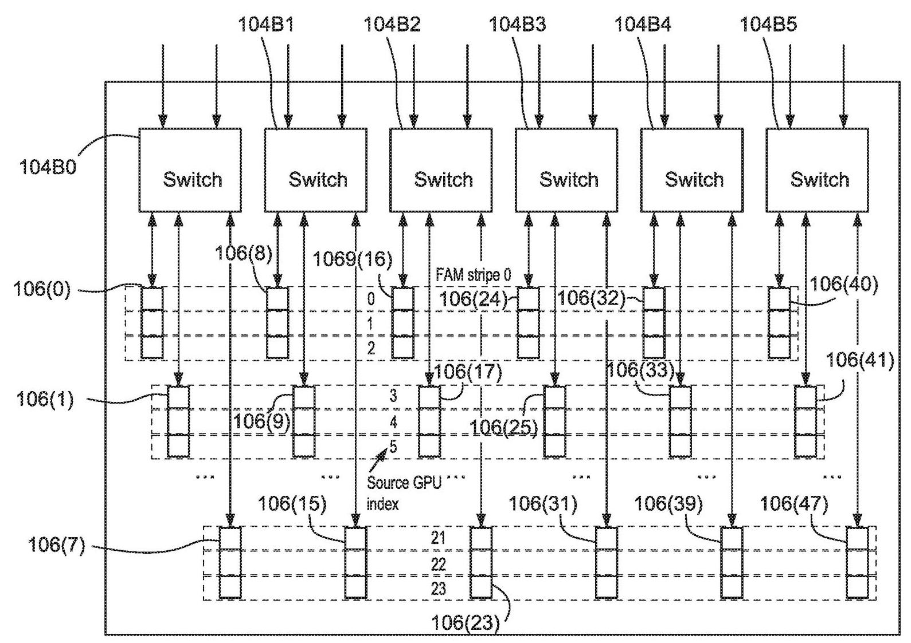

FIG. 5 Sub-dividing stripe into logical stripes

> 
图5 将条带 (stripe) 细分为逻辑条带 (logical stripes)

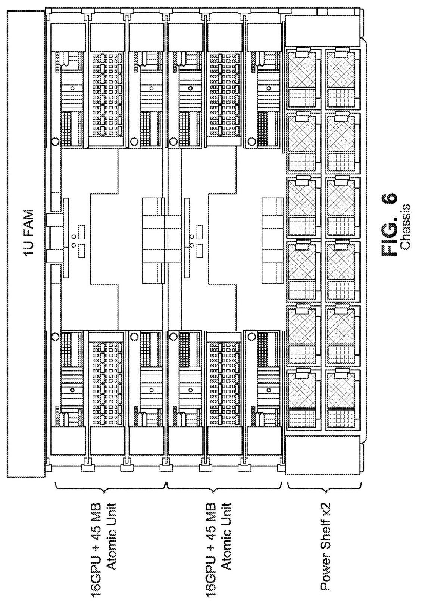

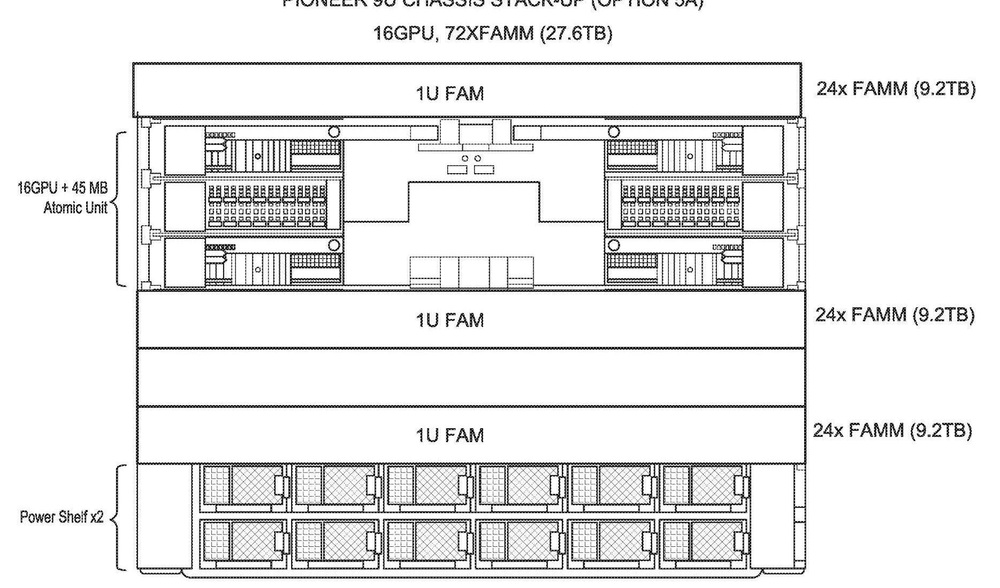

FIG. 7

> 
图 7

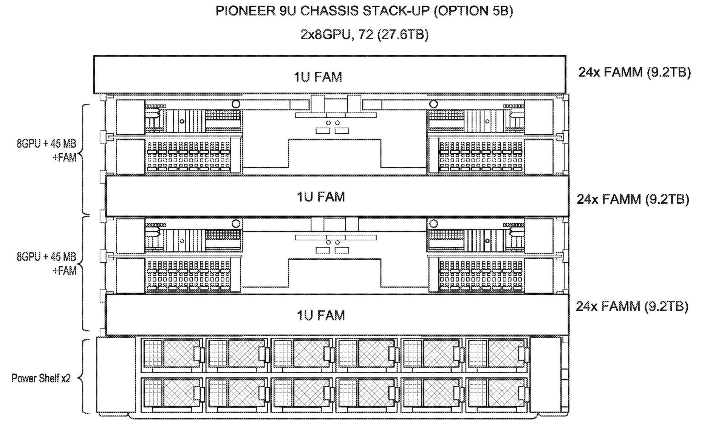

FIG. 8 (144x FAMM: 55.2TB)

> 
图 8（144x 织物附加内存模块 (Fabric Attached Memory Module, FAMM)：55.2TB）

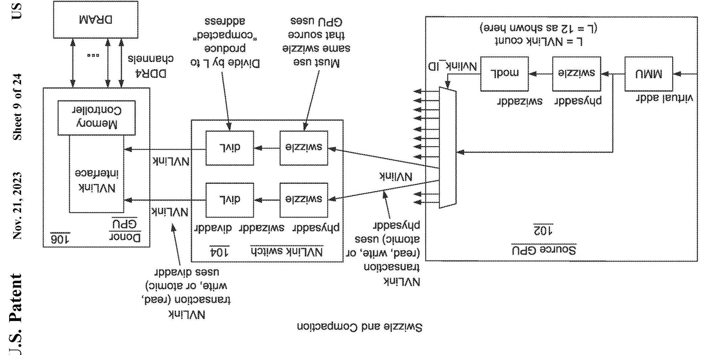

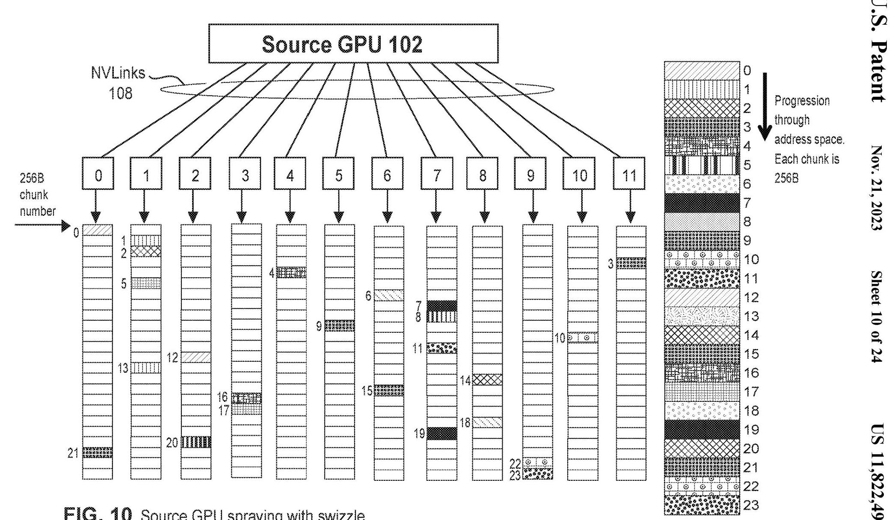

FIG. 11

> 
图11

Address Translation

> 
地址转换 (Address Translation)

FIG. 12

> 
图 12

Swizzle Effect

> 
重排效应（Swizzle Effect）

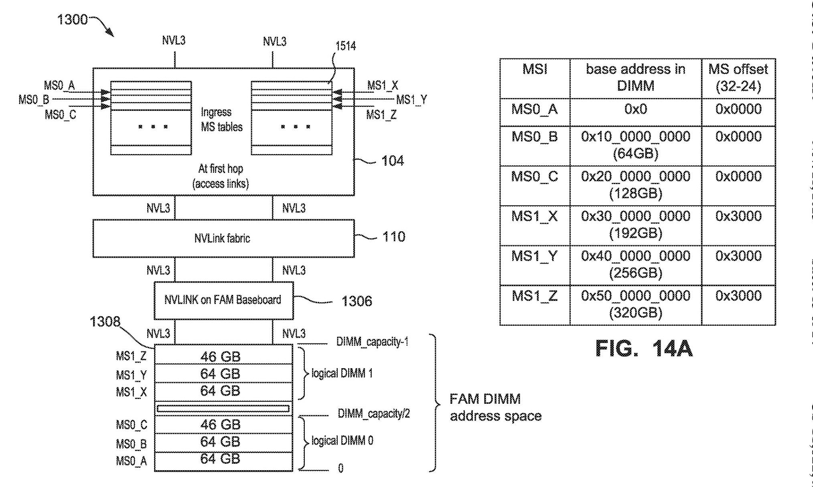

FIG. 13

> 
图 13

8th Old

> 
第八届旧 (8th Old)

<table><tr><td>000EXO</td><td>(80 89E) 0000~0000~8gX0</td><td>IZ OSW</td></tr><tr><td>OOOEXO</td><td>(89 ZSE) 0000~0000 by\$x0</td><td>EZ OSIN</td></tr><tr><td>000EXO</td><td>(89 9EE) 0000~0000~OFF</td><td>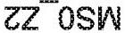</td></tr><tr><td>OOOEXO</td><td>$\left( {{89}\;{02}\;{02}}\right) \left( {{0000}\;{0000}}\right) \left( {yy}\right) \left( {yy}\right)$</td><td>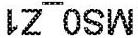</td></tr><tr><td>OOOEXO</td><td>an tool nonomomomomo</td><td>な()</td></tr><tr><td>OOOEXO</td><td>89 887) 0000 0000 8px</td><td>EA OSW</td></tr><tr><td>OOOEXO</td><td>89.z/z) 0000~0000~xxx</td><td>ZA OSW</td></tr><tr><td>OOOEXO</td><td>(95 927) 0000 0000 0tx0</td><td>LA OSW</td></tr><tr><td>000EXO</td><td>89 0yz) 0000 0000 0x0</td><td>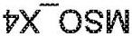</td></tr><tr><td>OOOEXO</td><td>go azz) 0000~0000~0ext</td><td>EX OSW</td></tr><tr><td>OOOEXO</td><td>(89 80Z) 0000~0000 Texo</td><td>ZX OSW</td></tr><tr><td>OOOEXO</td><td>(80 Z6L) ${0000}^{ - }{0000}^{ - }0 \in  {X0}$</td><td>LX OSW</td></tr><tr><td>(DZ-ZE) Josído SW</td><td>WWIQ и sse.jpp esseq</td><td>ISW</td></tr></table>

<table><tr><td>0000X0</td><td>$\left( {{89}\;{92} \times  }\right) \;{0000}^{\top }{0000}^{\top } = {22} \times  0$</td><td>DOSW</td></tr><tr><td>0000X0</td><td>$\left( {{890}\;{091}}\right) \;{0000}^{\top }{0000}^{\top }{87} \times  0$</td><td>CO OSW</td></tr><tr><td>0000x0</td><td>$\left( {{89} \vartriangleright  {\vartheta \bar{\vartheta }\vartheta }1}\right) {0000}^{ - }{\vartheta \bar{\vartheta }{2\vartheta }}^{ - }0$</td><td>ZO OSW</td></tr><tr><td>0000X0</td><td>(89 8ZL) ${0000}^{ - }{0000}^{ - }0\bar{2}\bar{2}\bar{0}$</td><td>LO OSW</td></tr><tr><td>0000X0</td><td>(89 Z11) 0000~0000~3X0</td><td>相 OSW</td></tr><tr><td>0000X0</td><td>(89 96) 0000~0000~8L×0</td><td>ea OSW</td></tr><tr><td>0000X0</td><td>(89 08) 0000~0000~DLX0</td><td>Z8 OSW</td></tr><tr><td>0000x0</td><td>(89 *9) 0000~0000^0!X0</td><td>LA OSW</td></tr><tr><td>0000X0</td><td>(89 8%) 0000~0000~3X0</td><td>ty OSW</td></tr><tr><td>0000X0</td><td>(89 ZE) 0000~0000~8X0</td><td>ε∀ OSW</td></tr><tr><td>0000XO</td><td>(89 9L) ${0000}^{ - }{0000}\overrightarrow{}t \times  0$</td><td>Z∀ OSW</td></tr><tr><td>0000X0</td><td>0x0</td><td>LV OSW</td></tr><tr><td>(t7-7E) JOSHO SIN</td><td>WWIC и! sss.jpp esseq</td><td>ISIN</td></tr></table>

FIG. 15

> 
图 15

No Compaction (Single Address Plane)

> 
无地址压缩（单地址平面） (No Compaction (Single Address Plane))

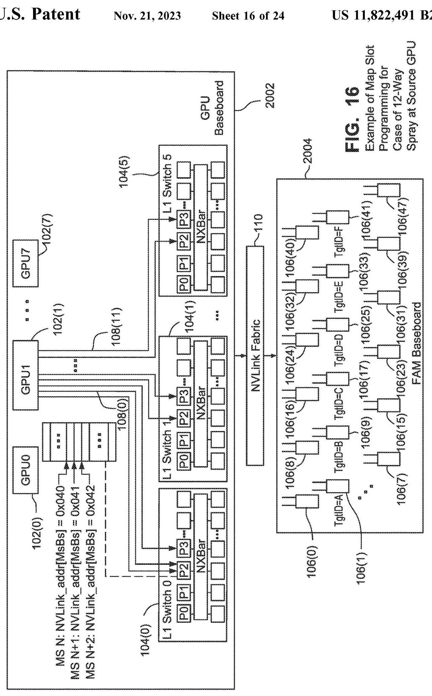

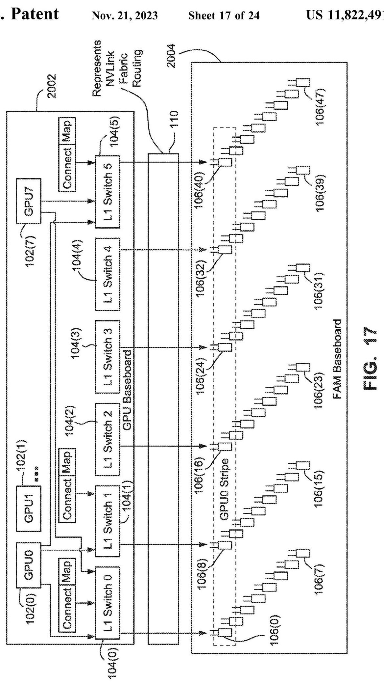

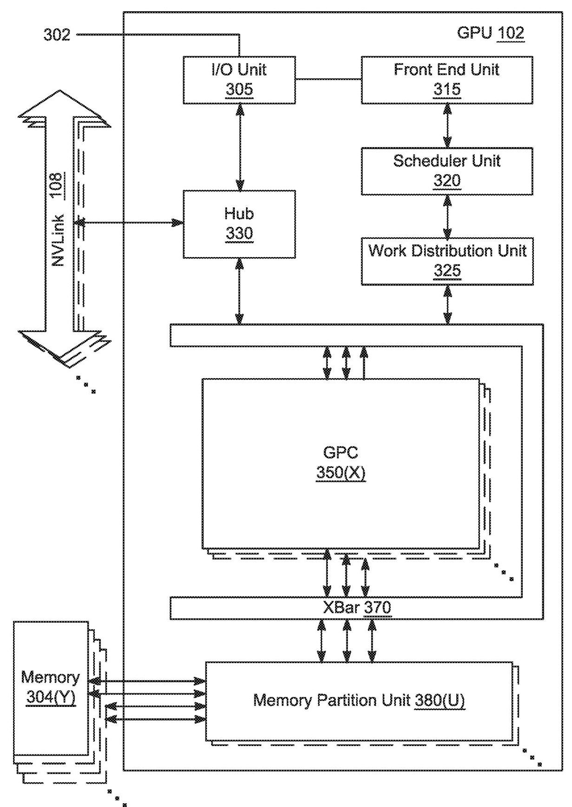

FIG. 18

> 
图18

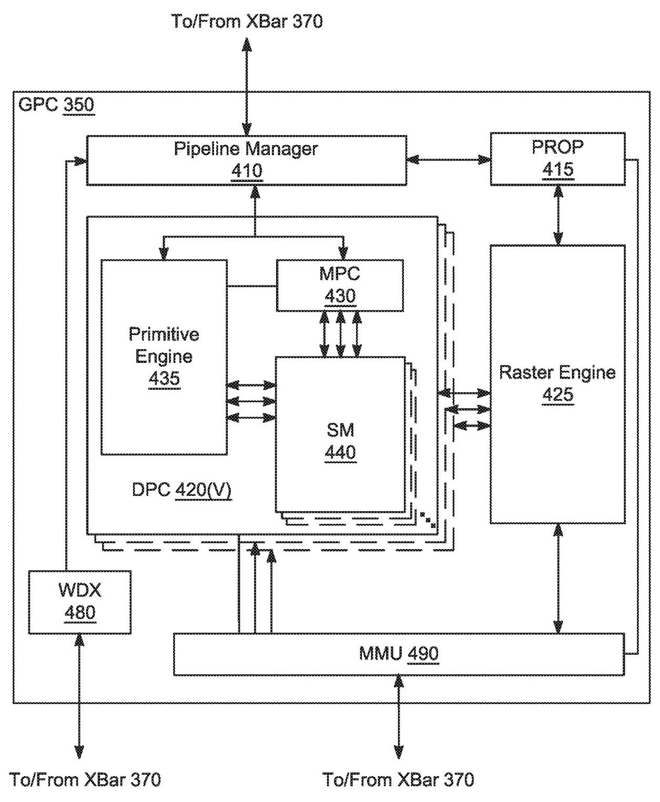

FIG. 19

> 
图 19 (FIG. 19)

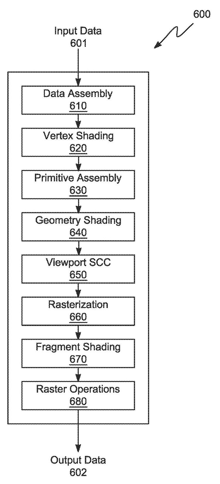

FIG. 20

> 
图 20

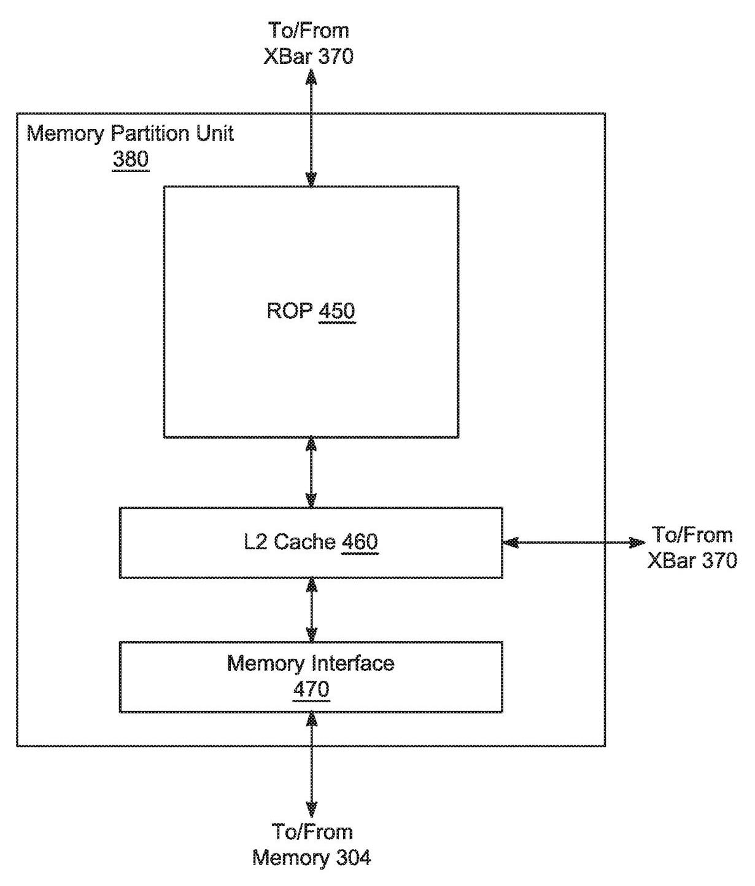

FIG. 21

> 
图21

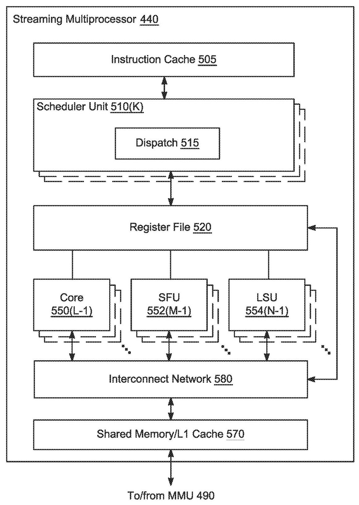

FIG. 22

> 
图 (Figure) 22

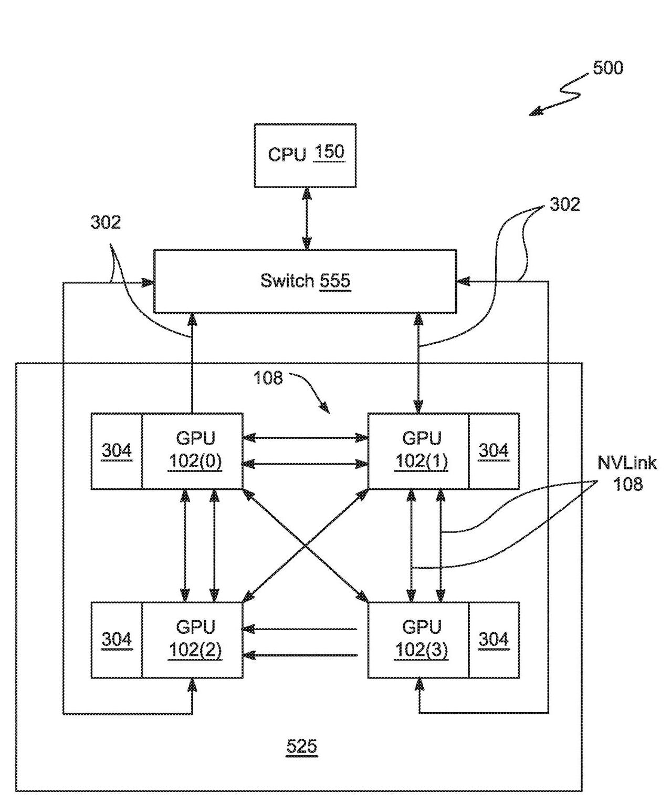

FIG. 23

> 
图23 (FIG. 23)

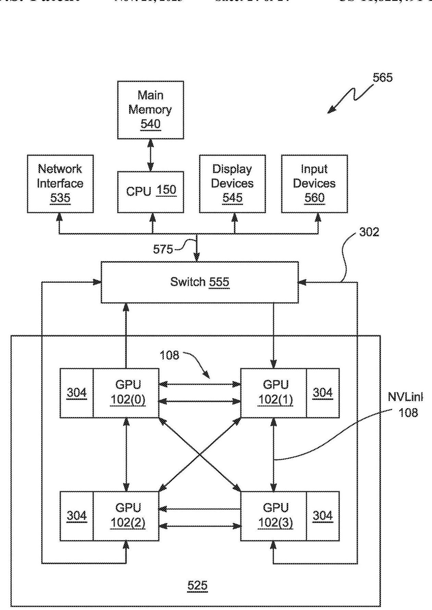

FIG. 24

> 
图24 (FIG. 24)

US 11,822,491 B2

> 
美国 (US) 11,822,491 B2

## 1 TECHNIQUES FOR AN EFFICIENT FABRIC ATTACHED MEMORY

## CROSS-REFERENCE TO RELATED APPLICATIONS

This application is a divisional of U.S. patent application Ser. No. 16/673,587 filed Nov. 4, 2019, now U.S. Pat. No. 11,182,309, which is incorporated herein by reference in its entirety and for all purposes.

> 
本申请是美国专利申请序列号16/673,587（提交于2019年11月4日，现为美国专利号11,182,309）的分案申请 (divisional)，该申请的全部内容通过引用整体并入本文用于所有目的。

## STATEMENT REGARDING FEDERALLY SPONSORED RESEARCH OR DEVELOPMENT

None.

> 
无 (None)

## FIELD

This technology relates to fabric attached memory ("FAM") and more particularly to fabric attached memory that uses address compaction over high speed data interconnects. Another aspect of this technology relates to use and/or repurposing of reduced-capability graphics processing units (GPUs) as low cost fabric attached memory controllers capable of natively processing atomic functions and/or other memory commands.

> 
该技术涉及结构附加内存（“FAM”），更具体地，涉及在高速数据互连上使用地址压缩的结构附加内存。该技术的另一方面涉及使用和/或重新利用功能缩减的图形处理单元（GPUs）作为低成本的结构附加内存控制器，这些控制器能够原生处理原子函数（atomic functions）和/或其他内存命令。

## BACKGROUND & SUMMARY

There has been an explosion in the amount of data that computers need to maintain and process. Social media, artificial intelligence and the Internet of Things have all created needs to store and quickly process vast amounts of data.

> 
计算机需要维护和处理的数据量出现了爆炸式增长。社交媒体 (Social media)、人工智能 (artificial intelligence) 和物联网 (Internet of Things) 都催生了对海量数据进行存储和快速处理的需求。

The trend in modern computing has been to deploy high performance, massively parallel processing systems, thus breaking up large computation tasks into many smaller ones that can be performed concurrently. As such parallel processing architectures have become widely adopted, this has in turn created demand for large capacity, high performance, low latency memory that can store large amounts of data and provide parallel processors with quick access.

> 
现代计算的趋势是部署高性能、大规模并行处理系统（massively parallel processing systems），从而将大型计算任务分解为许多可并发执行的小型任务。随着此类并行处理架构（parallel processing architectures）被广泛采用，这反过来催生了对大容量、高性能、低延迟内存（low latency memory）的需求，这类内存能够存储海量数据并为并行处理器提供快速访问。

High, bandwidth memory (HBM) connected directly to GPUs or other parallel processors provides high access bandwidth with low latency but its capacity may be relatively limited and thus insufficient for massively parallel workloads having very high memory capacity and/or bandwidth requirements. In the past, when a customer wanted to increase high performance low latency memory capacity, the customer would need to buy more GPUs to integrate the high-performance memory typically bundled with each GPU into the GPU system fabric. But providing more GPUs than are needed for compute functions can be costly and increases power requirements. Some customers may therefore be interested in having a larger memory footprint with fewer GPUs.

> 
直接连接到 GPU 或其他并行处理器的高带宽内存（High Bandwidth Memory, HBM）可提供高访问带宽与低延迟，但其容量可能相对有限，因此对于具有极高内存容量和/或带宽需求的大规模并行工作负载来说可能不足。过去，当客户想要增加高性能低延迟内存容量时，他们需要购买更多的 GPU，以便将通常与每块 GPU 捆绑的高性能内存集成到 GPU 系统构造（fabric）中。但是，提供超出计算功能所需的更多 GPU 可能成本高昂，并会增加功耗需求。因此，一些客户可能对用更少的 GPU 获得更大的内存占用（memory footprint）感兴趣。

One alternative has been to use system memory (SYS-MEM) i.e., memory attached to the system's central processing unit(s) (CPUs). Modern computing architectures also can provide GPUs with access to large quantities of non-volatile system memory via e.g., NVMe (Non-Volatile Memory express) drives and PCIe (Peripheral Component Interconnect express) peer-to-peer access. But a problem with using system memory or non-volatile memory attached as PCIe devices is that access bandwidth is limited in many architectures by such PCIe or other relatively slow data interconnects. Depending on the interconnect between the

> 
一种替代方案是使用系统内存（system memory, SYS-MEM），即连接至系统中央处理器（central processing unit, CPU）的内存。现代计算架构还可通过例如 NVMe（非易失性内存快速通道, Non-Volatile Memory express）驱动器和 PCIe（高速外设组件互连, Peripheral Component Interconnect express）对等访问，为 GPU 提供访问大量非易失性系统内存的能力。但使用系统内存或作为 PCIe 设备连接的非易失性内存的一个问题是，在许多架构中，此类 PCIe 或其他相对较慢的数据互连（data interconnects）会限制访问带宽。取决于该互连

2 CPU and GPU, the GPU's memory model semantics might not be mappable over the link with the same performance characteristics. As a result, applications may need to use an alternative programming model as opposed to treating the 5 memory with GPU memory semantics. This type of access may also force a block input/output (I/O) programming model (as opposed to for example word-addressability), with its inherent overheads and latency penalty.

> 
2 CPU 和 GPU，GPU 的内存模型语义 (memory model semantics) 可能无法在链路上以相同的性能特征映射。因此，应用程序可能需要使用替代的编程模型，而不是以 GPU 内存语义来处理 5 内存。这种访问方式还可能强制采用块输入/输出 (I/O) 编程模型（而非例如字寻址 (word-addressability)），从而带来其固有的开销和延迟惩罚 (latency penalty)。

Additionally, even though modern system, memory 10 capacity might seem relatively abundant, some massively parallel processing systems are now pushing the envelope in terms of memory capacity. System memory capacity is generally limited based on the maximum address space of whatever CPU(s) is employed. For example, many modern

> 
此外，即便现代系统的内存10容量可能看起来相对充裕，一些大规模并行处理系统如今在内存容量方面正不断挑战极限。系统内存容量通常受限于所使用CPU的最大地址空间。例如，许多现代

15 CPUs are unable to access more than approximately three terabytes (TBs). This capacity (three million million bytes) may sound like a lot but may not be enough for certain massively parallel GPU operations such as deep learning, data analytics, medical imaging and graphics processing.

> 
15 个 CPU 无法访问超过大约三太字节 (TB) 的内存。这一容量（三万亿字节，即 three million million bytes）听起来可能很大，但对于某些大规模并行 GPU 操作（例如深度学习 (deep learning)、数据分析 (data analytics)、医学成像 (medical imaging) 和图形处理 (graphics processing)）来说可能还不够。

From a software perspective, GPUs are becoming faster, enabling systems to perform more compute operations in shorter periods of time. Increased compute capabilities require increased data, which in turn implies it would be useful to provide fast access to more stored data. However, memory bandwidth, has not sealed as quickly as GPU compute capabilities. This means it is becoming increasingly more important to keep the GPUs-which are data consumers-fully led with data to operate on.

> 
从软件视角来看，GPU 正变得更快，使系统能够在更短的时间内执行更多的计算操作。计算能力的增加意味着对数据的需求也随之增大，这反过来意味着为更多存储数据提供快速访问将是有用的。然而，内存带宽却未以与 GPU 计算能力同样的速度扩展（scaled）。这意味着，让 GPU —— 数据的消耗者 —— 一直有充足（fully fed）的数据可供操作，正变得越来越重要。

To help solve this problem, NVIDIA developed a high-speed datalink interconnect fabric called NVLINK™ which provides increased data transfer speed between GPU compute components. Fabric interconnect arrangements such, as NVLINK™ and NVSWITCH™ allow GPUs to communicate with one another as peers over fast, highly scalable 5 multiprocessor interconnects that avoid the bandwidth bottleneck of slower kinds of data links. This allows a GPU to access another GPU's local memory almost as if it were its own, allowing the developer to pool the memory resources of multiple GPUs. See for example U.S. Pat. Nos. 7,275,123, 7,827,723 and 7,451,259. The NVLINK™ construct is slower than local on-chip memory bandwidth but is still much fester than PCIe or other such datalinks that are often used to provide access to main, system memory or other memory devices attached to the PCIe fabric.

> 
为解决这一问题，NVIDIA 开发了一种称为 NVLINK™ 的高速数据链路互连结构（interconnect fabric），它提升了 GPU 计算组件之间的数据传输速度。类似 NVLINK™ 和 NVSWITCH™ 的互连结构布置允许 GPU 通过快速、高度可扩展的多处理器互连以对等（peer）方式相互通信，从而避免了较慢数据链路带来的带宽瓶颈。这使得 GPU 几乎可以像访问自己的本地内存一样访问另一个 GPU 的本地内存，从而使开发者能够将多个 GPU 的内存资源池化（pool）。例如，参见美国专利号 7,275,123、7,827,723 和 7,451,259。NVLINK™ 结构的速度低于本地片上内存带宽，但仍远快于 PCIe 或其他常用于提供对主系统内存或连接到 PCIe 结构（fabric）的其他内存设备进行访问的类似数据链路。

Fabric Attached Memory ("FAM") has already been defined as a concept to disaggregate memory from compute resources, allowing memory capacity to grow independently of compute capacity. FAM has for example been deployed by datacenter infrastructure providers such as Hewlett Pack- 50 ard Enterprise (HPE) through industry standards such as Gen-Z, For example, HPE recently announced a memory-centric "Machine" using the Gen-Z open standard memory interconnect fabric. See for example https://genzconsortiu-m.org/wp-content/uploads/2018/05/20170303_Gen-Z-

> 
已经将 Fabric Attached Memory（"FAM"，结构附加内存）定义为一个概念，旨在将内存与计算资源解耦，使内存容量能够独立于计算容量进行扩展。例如，像 Hewlett Packard Enterprise（HPE）这样的数据中心基础设施供应商，已经通过 Gen-Z 等行业标准部署了 FAM。再如，HPE 近期发布了一款以内存为中心的“Machine”，采用了 Gen-Z 开放标准内存互连架构。示例参见 https://genzconsortium.org/wp-content/uploads/2018/05/20170303_Gen-Z-

DRAM-and-SCM-Overview.pdf; Achermann et al, "Separating Translation from Protection in Address Spaces with Dynamic Remapping", Proceedings of the 16th Workshop on Hot Topics in Operating Systems Pages 118-124 (Whistler, BC, Canada, May 7-10, 2017); and Chen, Fei et al, "Billion node graph inference: iterative processing on The Machine" (Hewlett Packard Labs HPE-2016-101, 2016). Despite such prior work, many challenges relating to efficient low-cost high capacity FAM implementations remain.

> 
DRAM-and-SCM-Overview.pdf；Achermann 等人，《在具有动态重映射的地址空间中分离转换与保护》(Separating Translation from Protection in Address Spaces with Dynamic Remapping)，第16届操作系统热点话题研讨会论文集，第118–124页（加拿大不列颠哥伦比亚省惠斯勒，2017年5月7日至10日）；以及 Chen, Fei 等人，《十亿节点图推理：在 The Machine 上的迭代处理》(Billion node graph inference: iterative processing on The Machine)，（惠普实验室 HPE-2016-101，2016年）。尽管已有这些前期工作，但许多与高效、低成本、高容量结构附加内存 (FAM) 实现相关的挑战依然存在。

The technology herein solves the problem of how to 65 increase GPU memory capacity to very high amounts (e.g., 10's to 100's of TB) and bandwidths (e.g., multiple TB/s) for multi-GPU systems without requiring the number of GPUs

> 
本文所述技术解决了如何 65 在无需成比例增加 GPU 数量的情况下，将多 GPU 系统的 GPU 内存容量大幅提升至极高量级（例如数十至数百 TB）与带宽（例如数 TB/s）的问题

3 and/or CPUs to increase. Fabric attached memory is a way to leverage strength and value of a high-bandwidth inter-GPU high speed datalink such as but not limited to the NVIDIA NVLINK™ to allow a user to grow the GPU-accessible memory capacity without having to also grow the GPU compute capacity.

> 
3 和/或中央处理器 (CPU) 来增加。结构附着内存 (Fabric Attached Memory) 是一种利用高带宽 GPU 间高速数据链路（例如但不限于英伟达 NVLINK™ (NVIDIA NVLINK™)）的优势与价值的方式，让用户能够在不增加 GPU 计算能力的情况下，扩展 GPU 可访问的内存容量。

The example non-limiting embodiments allow a user to increase memory capacity and GPU bandwidth without having to increase GPU memory computing resources. The effect of such fabric attached memory is to disaggregate memory in such systems from GPU compute resources, allowing memory capacity to grow independently of GPU compute capacity. Some GPU workloads have very high memory capacity and/or bandwidth requirements. Therefore, some applications may benefit from a larger memory footprint but relatively fewer GPUs. However, as explained below in detail, despite such disaggregation, it is highly desirable in many applications to provide the fabric attached memory with some GPU-like interface capabilities in a cost-effective manner e.g., so fabric attached memory can implement GPU-based hardware-accelerated memory access functions such as "atomic" memory access requests and so the interconnect fabric can otherwise access the fabric attached memory in the same manner and using the same mechanisms available for accessing GPU direct-attached local memory. As detailed below, the example nonlimiting technology herein provides these and other capabilities.

> 
这些示例性非限制性实施例允许用户增加内存容量和GPU带宽，而无需增加GPU内存计算资源。这种结构附加内存 (fabric attached memory) 的效果是将此类系统中的内存与GPU计算资源解耦，从而允许内存容量独立于GPU计算容量增长。一些GPU工作负载对内存容量和/或带宽有非常高的要求。因此，一些应用可能会受益于更大的内存占用但相对更少的GPU。然而，如下文详细解释的，尽管有这种解耦，在许多应用中非常需要以经济高效的方式为结构附加内存提供一些类GPU接口能力，例如，使结构附加内存能够实现基于GPU的硬件加速内存访问功能，如“原子”内存访问请求，并且互连结构可以以相同方式和机制访问结构附加内存，正如访问GPU直接挂载的本地内存一样。如下文详细描述的，本文的示例性非限制技术提供了这些及更多能力。

The example non-limiting technologies herein permit the fabric attached memory to be of variable size, and provide address mapping and memory access request distribution techniques for ensuring that the fabric attached memory capacity is fully utilized. For example, an application running on a "source GPU" (i.e., a computing device that wishes to access the fabric attached memory) can generate addresses defining a potentially large address space, e.g., hundreds of terabytes (TBs). In some non-limiting embodiments, this address space can include or be mapped into the source GPUs own locally-attached memory; the locally attached memories of other GPUs; and the fabric attached memory. Meanwhile however, each individual fabric attached memory device (i.e., a controller such as a reduced-compute capacity GPU or custom ASIC and associated bundled semiconductor high-performance volatile or nonvolatile memory such as DIMM, which may for example include any memory technologies of interest including for example DDR, GDDR, HBM, NVRAM, NVMe, etc.) will generally provide an address space that is much smaller (e.g., on the order of say 1, 2 or 4 TB as some examples). In general, there can be any number of such individual fabric attached memory devices or modules attached to the interconnect fabric, and the end user can add more fabric attached memory as desired consistent with cost-performance tradeoffs and scalability of the fabric (i.e. number of links and switches).

> 
本文所述的非限制性示例技术允许结构附加内存（Fabric Attached Memory）具有可变容量，并提供了地址映射和内存访问请求分发技术，以确保结构附加内存的容量得到充分利用。例如，运行在“源GPU”（source GPU，即希望访问结构附加内存的计算设备）上的应用程序可以生成定义一个可能极大地址空间（如数百TB）的地址。在某些非限制性实施例中，该地址空间可以包括或映射到源GPU自身所带的本地附加内存、其他GPU的本地附加内存以及结构附加内存。然而，与此同时，每个单独的结构附加内存设备（即，一个控制器——例如计算能力缩减的GPU或定制ASIC，以及相关的捆绑式半导体高性能易失性或非易失性内存如DIMM，可能包括任何感兴趣的内存技术，例如DDR、GDDR、HBM、NVRAM、NVMe等）通常提供的地址空间要小得多（举例来说，大约1、2或4 TB量级）。一般来说，可以连接到互连结构上的这类单独的结构附加内存设备或模块数量不限，终端用户可以根据成本-性能权衡和结构的可扩展性（即，链路和交换机的数量）按需添加更多的结构附加内存。

An advantage of the example non-limiting technology is that end users can conveniently expand fabric attached memory capacity to achieve better performance and reduce thrashing without the need to rewrite or modify software applications. Accordingly, the example non-limiting technology herein provides automatic mechanisms for using entropy to automatically distribute memory access requests across available interconnect links and associated fabric attached memory devices, in order to balance communications and storage/access loading. Furthermore, in example non-limiting embodiments, there is no requirement for each fabric attached memory device to be attached to all available GPU interconnect links - to the contrary, a particular fabric attached memory device can be interconnected to a relatively small subset of interconnect links -although in some applications, sufficient fabric attached memory is preferably provided so the source GPU can access some fabric attached memory over all or many of its links. This structural feature of allowing a fabric attached memory device to connect to the interconnect fabric with a reduced set of interconnects as compared for example to a compute-GPU is useful in providing cost-effective fabric attached memory modules, but also creates some addressing, routing and capacity utilization opportunities that the present example technology exploits.

> 
示例非限制性技术的一个优势是，终端用户可以方便地扩展结构附加内存 (Fabric Attached Memory) 容量，以获得更好的性能并减少颠簸 (thrashing)，而无需重写或修改软件应用程序。因此，本文所述的示例非限制性技术提供了自动机制，利用熵 (entropy) 将内存访问请求自动分布到可用的互连链路 (interconnect links) 及与其关联的结构附加内存设备上，从而平衡通信负载和存储/访问负载。此外，在示例非限制性实施例中，并不要求每个结构附加内存设备都连接到所有可用的 GPU 互连链路——恰恰相反，一个特定的结构附加内存设备可以仅互连到一个相对较小的互连链路子集——尽管在某些应用中，最好提供足够的结构附加内存，以便源 GPU 能够通过其全部或多数链路访问某些结构附加内存。与例如计算 GPU (compute-GPU) 相比，这种允许结构附加内存设备使用更少的互连集合连接到互连结构 (interconnect fabric) 的结构特征，有助于提供具有成本效益的结构附加内存模块，但也产生了若干寻址、路由和容量利用的机会，而本示例技术正是利用了这些机会。

In particular, the example non-limiting embodiments provide techniques and mechanisms for automatically handling address mapping and request routing between source GPU-generated physical addresses and fabric attached memory address locations so that the capacity of fabric attached memory can be fully utilized even though the source GPU may generate physical addresses that define address spaces much larger than those of any particular fabric attached memory device and even though the source GPU may send such physical addresses over entropy-selected interconnect links, while efficiently and flexibly supporting data striping across an array of such fabric attached memory devices.

> 
特别地，这些示例性的非限制性实施例提供了技术及机制，用于自动处理源 GPU (source GPU) 生成的物理地址与结构附加内存 (fabric attached memory) 地址位置之间的地址映射和请求路由，从而即便源 GPU 生成的物理地址所定义的地址空间远大于任何特定结构附加内存设备的地址空间，且即便源 GPU 可能通过基于熵选择的互连链路 (entropy-selected interconnect links) 发送此类物理地址，也仍能充分利用结构附加内存的容量，同时高效、灵活地支持跨此类结构附加内存设备阵列的数据条带化 (data striping)。

By attaching memory directly to a scalable high-speed fabric constructed from high speed inter-process communications links such as NVIDIA's NVLINK™ and NVSWITCH™, the technology herein can provide much higher capacity and bandwidth than CPU memory accessed through PCIe, more flexibility, and a more cost effective platform for running memory-intensive workloads. Memory footprint and performance can thus be "disaggregated" (decoupled) from compute capabilities, and this FAM approach allows GPUs to extend its memory model to cover FAM by issuing load, stores, and atomics with word-level addressability directly to fabric attached memory with appropriate visibility and ordering guarantees. This is especially valuable for GPUs or specialized ASICs for deep learning applications.

> 
通过将内存直接连接到由高速进程间通信链路（例如 NVIDIA 的 NVLINK™ 和 NVSWITCH™）构成的可扩展高速结构，本文所述技术能够提供比通过 PCIe 访问的 CPU 内存高得多的容量和带宽、更大的灵活性以及更具成本效益的平台来运行内存密集型工作负载。内存占用和性能因此可以与计算能力“分离”（disaggregated，即解耦），而该 FAM（Fabric Attached Memory，结构附加内存）方法允许 GPU 将其内存模型扩展到覆盖 FAM，通过直接向结构附加内存发出具有字级寻址能力的加载、存储和原子操作，并提供适当的可见性和顺序保证。这对于用于深度学习应用的 GPU 或专用 ASIC 尤其有价值。

The technology herein further provides improvements to FAM that provide cost-effective FAM modules ("FAMMs") 45 based on "floor swept" and/or lower-capability GPUs. As discussed above, it is desirable in many implementations to cost-effectively provide GPU-like peer-to-peer access to fabric attached memory. One non-limiting aspect of certain embodiments of the present technology is deployment of 50 lower-end GPUs that would otherwise be discarded, because of manufacturing yield fallout, as relatively simple and low-power memory controllers that operate as FAMM devices. Some GPU architectures include a sophisticated high-performance memory controller to access its local 55 frame buffer memory, typically using GDDR and/or HBM technology. Instead of having to rely on the mechanical, electrical, and protocol constraints of industry-standard memory form factors (i.e., JEDEC DIMMs) and being tied to 3rd-party product roadmaps, a system designer can lever- 0 age "native" GPU parts to more tightly optimize overall system performance, cost, and resiliency.

> 
本文技术进一步提供了对FAM的改进，这些改进提供了基于“地板级（floor swept）”和/或低能力GPU的高性价比FAM模块（"FAMMs"）45。如上所述，在许多实现中，期望以高性价比的方式提供对结构挂载内存（fabric attached memory）的类似GPU的对等访问。本技术某些实施例的一个非限制性方面是，部署50个原本会因制造良率问题而废弃的低端GPU，作为相对简单且低功耗的内存控制器，作为FAMM设备运行。一些GPU架构包含一个复杂的高性能内存控制器，用于访问其本地55帧缓冲存储器，通常使用GDDR和/或HBM技术。系统设计者不必依赖行业标准内存形态（即JEDEC DIMM）的机械、电气和协议约束，也不必受制于第三方产品路线图，而是可以利用-0“原生”GPU部件，以更紧密地优化整体系统性能、成本和弹性。

Straightforward extensions to NVIDIA's CUDA® memory management (or other party's) APIs allow application memory to be pinned to FAM and viewed as peer 5 GPU memory. Alternatively or in addition, the user can opt to rely on Unified Virtual Memory (UVM) and page migration to move transparently between a GPU's local video memory and FAM on an on-demand basis. See for example U.S. Pat. Nos. 9,767,036; 9,830,210; 9,424,201; 9,639,474 & 10,133,677.

> 
对 NVIDIA 的 CUDA® 内存管理（或其他方提供的）API 的简单扩展，允许将应用程序内存固定到 Fabric Attached Memory（FAM），并将其视为对等 5 GPU 内存。作为替代或补充，用户可选择依赖统一虚拟内存（Unified Virtual Memory，UVM）和页面迁移，按需在 GPU 本地显存和 FAM 之间透明移动数据。参见例如美国专利号 9,767,036；9,830,210；9,424,201；9,639,474 和 10,133,677。

The example non-limiting technology herein supports different programming paradigms: a given FAM region can be shared by multiple GPUs cooperating on a large high performance computing (HPC) problem for example or dedicated to a single GPU in a Cloud Service Provider (CSP) environment where each GPU runs a different customer's virtual machine (VM). If performance or fault isolation 10 among the different GPUs accessing different FAM regions is desired, this can be achieved through fabric topology construction or programming congestion control features in the interconnect fabric switches. Additionally, a subset of FAM donors can be assigned to specific GPUs, users and/or VMs to allow for policy defined Quality-of-Service guarantees between GPUs or tenants.

> 
本文中的示例非限制性技术支持不同的编程范式：例如，给定的FAM区域可由协作处理大型高性能计算（High Performance Computing, HPC）问题的多个GPU共享，或在云服务提供商（Cloud Service Provider, CSP）环境中专用于单个GPU，其中每个GPU运行不同客户的虚拟机（Virtual Machine, VM）。如果需要在访问不同FAM区域的不同GPU之间实现性能或故障隔离10，这可以通过在互连织物交换机中构建织物拓扑或编程拥塞控制特性来实现。此外，可以将一部分FAM贡献者分配给特定的GPU、用户和/或虚拟机，以实现基于策略定义的GPU或租户间的服务质量（Quality-of-Service）保证。

An example non-limiting system thus connects one or a set of "source GPUs" to one or a set of fabric attached memory modules (FAMMs) through an NVLINK™ interconnect fabric built with NVLINK™ switches. The source GPUs interleave ("spray") memory requests over a programmable set of NVLINK ${}^{\mathrm{{TM}}}\mathrm{s}$ and those requests are routed by the fabric to the set of FAMM devices. In some non-limiting implementations, a "donor" GPU (which may have reduced capability as described herein) and discrete DRAM chips it connects to over its frame buffer (FB) interface are placed together on a printed circuit board referred to as a FAM baseboard. An overall system can have any number of these FAM baseboards - none, one, two, three or n where n is any 30 integer.

> 
一个示例性非限制系统由此通过用NVLINK™交换机构建的NVLINK™互连结构（fabric），将一个或一组“源GPU”连接到一个或一组结构附加内存模块（Fabric Attached Memory Module，FAMM）。源GPU在一组可编程的NVLINK${}^{\mathrm{TM}}$链路上交错（“喷洒”，spray）内存请求，这些请求由结构路由到一组FAMM设备。在一些非限制性实现中，一颗“捐赠者”GPU（其能力可能如本文所述有所缩减）以及它通过帧缓冲（Frame Buffer，FB）接口连接的独立DRAM芯片，被一同放置在一块称为FAM基板（FAM baseboard）的印刷电路板上。一个完整的系统可以拥有任意数量的此类FAM基板——零块、一块、两块、三块或n块，其中n为任意30整数。

In one non-limiting embodiment, each FAMM connects to the fabric via a small number of NVLINK™ links (e.g., 2 or 4), as compared to a larger number of links available to the source GPU. In some non-limiting embodiments, the 3 donor GPU within a FAMM is structured so it cannot be used as a full-fledged GPU because some portion of its engines and/or cache have faults, are permanently disabled, or don't exist; but at least some of its NVLINK™ interconnects and its memory interface portions are fully functional. The FAMMs donor GPU needs only a minimal number of engines functional to perform memory initialization and diagnostics operations run at power-on or when the Cloud Service Provider (CSP) changes the guest VM assigned to the FAMM. In example non-limiting embodiments, a stripped-down version of the GPU driver or other software can handle these functions as well as interrupt handling for memory and GPU-internal errors.

> 
在一个非限制性实施例中，每个织物附加内存模块（Fabric Attached Memory Module, FAMM）通过少量NVLINK™链路（例如2条或4条）连接到互连结构（fabric），而源GPU可用的链路数量则更多。在一些非限制性实施例中，FAMM内的3个捐赠GPU（donor GPU）被构造为无法作为全功能GPU使用，因为其引擎和/或缓存的某些部分存在故障、被永久禁用或根本不存在；但至少有部分NVLINK™互连及其内存接口部分是完全可用的。该FAMM的捐赠GPU（donor GPU）仅需极少数量可工作的引擎，以执行在加电时或在云服务提供商（Cloud Service Provider, CSP）更改分配给该FAMM的客户虚拟机时需要运行的内存初始化和诊断操作。在示例的非限制性实施例中，精简版的GPU驱动程序或其他软件可处理这些功能以及内存和GPU内部错误的中断处理。

Additional Non-Limiting Features and Advantages Include:

> 
其他非限制性特征和优势包括：

In some non-limiting embodiments, use of floor swept GPUs as FAM memory controllers ("FAM donors") rather than industry-standard DIMMs with 3rd-party memory controllers. This provides higher compatibility, reduces dependency on 3rd-party form factors and standards, lowers overall system cost, capitalizes on the sophistication and known features of the in-house GPU memory controller (for both performance and resiliency), and allows tighter integration of compute and memory system elements.

> 
在某些非限制性实施例中，使用扫底式 GPU（floor swept GPU）作为 FAM 内存控制器（“FAM 捐献者”，FAM donors），而非采用带有第三方内存控制器的行业标准 DIMM。这提供了更高的兼容性，减少了对第三方外形规格和标准的依赖，降低了总体系统成本，充分利用了内部 GPU 内存控制器的精密性和已知特性（在性能和弹性方面），并允许计算和内存系统元件更紧密地集成。

Because the source GPUs and the FAM donor GPUs in some embodiments use the same protocol, the source GPU can issue the full set of transactions supported by the fabric protocol, including "atomic" operations as well as the set of memory read and write transactions. Such atomic operations can include for example arithmetic functions such as atomicAdd( ), atomicSub( ),

> 
由于源 GPU 和 FAM 施主 GPU 在某些实施例中使用相同的协议，源 GPU 可以发出由结构协议支持的全套事务，包括“原子”操作（atomic operations）以及内存读写事务集。此类原子操作可以包括例如算术函数，如 atomicAdd()、atomicSub()，

6 atomicExch(), atomicMin(), atomicMax(), atomicInc( ), atomicDec( ), atomicCAS( ); bitwise functions such as atomicAnd( ), atomicOr( ), atomicXor( ); and other functions. The ability of some non-limiting embodiments to perform native "atomics" is especially valuable, as many workloads use atomics for synchronization operations. An alternative to native atomics is mimicking atomics using read-modify-write (RMW) operations, incurring higher latency and potential burdens on the fabric switches to do the necessary conversion between RMWs and atomics.

> 
6 atomicExch()、atomicMin()、atomicMax()、atomicInc()、atomicDec()、atomicCAS()；按位操作如 atomicAnd()、atomicOr()、atomicXor()；以及其他函数。某些非限制性实施例能够执行原生“原子操作” (native atomics) 的能力特别有价值，因为许多工作负载使用原子操作进行同步操作。替代原生原子操作的一种方案是使用读-修改-写 (read-modify-write, RMW) 操作来模拟原子操作，这会带来更高的延迟，并可能给交换网芯片带来负担，去进行 RMW 与原子操作之间的必要转换。

Ability to interleave physical pages mapped to FAM across multiple FAM donors such that the source GPU's bandwidth to FAM can scale up to the aggregate bandwidth for all the donors in the "stripe" collectively making up a given memory page. By "stripe" we mean one of the logical sets of FAM devices organized to attach to the fabric in such a way so as to increase memory performance, reliability or both.

> 
能够将映射到FAM的物理页面在多个FAM供应设备 (donor) 之间交错 (interleave)，使得源GPU到FAM的带宽可以扩展到条带 (stripe) 内所有供应设备的聚合带宽，这些供应设备共同构成一个给定的内存页面。我们所说的“条带”是指逻辑上组织起来连接到互联结构 (fabric) 的一组FAM设备，其连接方式旨在提高内存性能、可靠性，或两者兼而有之。

Tasks of memory initialization and diagnostics are performed locally, in the donor GPUs and their stripped-down drivers, rather than being controlled by a host CPU or by hardware engines in the fabric. When there is a change in ownership of a FAM region, its contents can be wiped for security reasons and in some cases simple diagnostics are run at this time. Offloading these tasks from a central resource means that local components can more rapidly transition a region of FAM from one virtual machine (VM) to another as guest workloads migrate within the cloud; there is less down time for new VMs and no impact on running VMs whose resources are not shifting.

> 
内存初始化和诊断任务在本地执行，即在捐赠型GPU（donor GPU）及其精简版驱动程序（stripped‑down driver）中进行，而非由主机CPU（host CPU）或互连结构（fabric）中的硬件引擎控制。当结构附加内存（Fabric Attached Memory，FAM）区域的所有权发生变更时，出于安全考虑可将其内容擦除，且在某些情况下此时会运行简单的诊断程序。将这些任务从集中式资源卸载下来，意味着本地组件能够更快速地将一个FAM区域从一台虚拟机（virtual machine，VM）过渡到另一台VM，从而在客户工作负载于云中迁移时，新VM的停机时间更少，且对资源未发生变化的正在运行的VM没有影响。

Provides a scalable hardware/software platform to customers doing a variety of workloads requiring the compute capacity of multiple high-end GPUs—e.g., Deep Learning, graph analytics, recommender engines, HPC, medical imaging, image rendering, database and transaction processing, etc. For many of these applications, the memory bandwidth and/or capacity requirements are growing at a faster rate than the GPU or CPU compute requirements. The technology herein expands the portfolio of datacenter and other infrastructure by enabling more flexibility in the mix of compute and memory resources.

> 
为客户提供一个可扩展的硬件/软件平台，以支持多种需要多个高端图形处理器 (GPU) 计算能力的工作负载——例如，深度学习 (Deep Learning)、图分析 (graph analytics)、推荐引擎 (recommender engines)、高性能计算 (HPC)、医学成像 (medical imaging)、图像渲染 (image rendering)、数据库与事务处理 (database and transaction processing) 等。对于其中许多应用，内存带宽 (memory bandwidth) 和/或容量 (capacity) 需求的增长速度超过了图形处理器 (GPU) 或中央处理器 (CPU) 的计算需求。本文所述技术通过支持计算与内存资源混合配置方面的更大灵活性，扩展了数据中心 (datacenter) 及其他基础设施的产品组合。

In some embodiments, software can virtually disable links and/or FAM donors to allow for continued operation of the system with degraded capacity or bandwidth in an administrator-controlled manner. Applications that use FAM would need no further modification to handle the reduced capacity or bandwidth.

> 
在一些实施例中，软件可以虚拟地禁用链路和/或结构附加内存（Fabric Attached Memory，FAM）提供设备（donor），从而在管理员控制的方式下，使系统以降级的容量或带宽继续运行。使用 FAM 的应用程序无需进一步修改即可处理减少的容量或带宽。

In some embodiments, individual defective pages on a given FAM donor can be remapped and controlled in software such that a subsequent job is able to avoid ECC double bit errors or getting stuck at faults in memory, without needing an entire FAM chassis to be rebooted.

> 
在一些实施例中，给定 FAM 供体上的个别缺陷页面可以在软件中进行重映射和控制，使得后续作业能够避免 ECC 双位错误或陷入内存故障，而无需重启整个 FAM 机箱。

The technology herein leverages the performance and scalability characteristics of high-speed interconnect fabrics such as NVLINK™ and NVSWITCH™.

> 
本文所述技术利用了诸如 NVLINK™ 和 NVSWITCH™ 等高速互连结构 (fabric) 的性能和可扩展性特性。

The ability to redeem silicon that would otherwise have to be scrapped because of faults in the units required for normal applications.

> 
将那些本因正常应用所需单元（units）存在故障而不得不报废的硅片（silicon）重新利用的能力。

The architectural concepts are general enough that they can be applied to any multi-GPU systems and to future larger platforms that span multiple chassis' in a rack.

> 
这些架构概念 (architectural concepts) 具有足够的通用性，可应用于任何多GPU系统 (multi-GPU systems)，以及未来横跨机架 (rack) 中多个机箱 (chassis) 的更大平台 (platforms)。

Combined with software extensions to allocate/manage FAM as peer memory and extensions to enable migra-

> 
结合将 FAM（结构附加内存）分配/管理为对等内存的软件扩展以及启用 migra- 的扩展

7

> 
本专利（US 11,822,491 B2）提出了一种高效的结构附加内存（Fabric Attached Memory，FAM）技术，该技术将内存与计算资源解耦，使得内存容量和带宽能够独立于GPU进行扩展。所针对的主要研究问题是如何为并行处理器提供大容量、高带宽、低延迟的内存，而无需按比例增加GPU的计算能力。

关键贡献包括两种主要方法。第一，使用“地扫式（floor‑swept）”或计算能力降低的GPU（例如，计算单元有缺陷或有意熔断计算能力的部件）作为低成本的FAM内存控制器。这些捐献GPU（donor GPU）保留了足够的功能——如内存接口和硬件加速的原子操作——从而能够在高速互连网络（例如，NVIDIA NVLink）上作为全功能的对等设备。该方法重复利用了原本会被废弃的硅片，提供了对GPU内存模型语义（包括原子操作）的原生支持，并降低了功耗。

第二，本发明引入了地址映射和转换机制，以充分利用FAM的容量。当源GPU通过基于熵的地址混淆（entropy‑based address swizzling）在多个链路上“喷洒（sprays）”内存访问请求（以平衡流量）时，产生的地址分布会在各个FAM模块较小的地址空间中造成空隙。为弥补这一情况，在网络交换机或FAM控制器内部执行地址压缩操作（除以喷洒链路数），从而将稀疏的访问流映射到密集、线性的地址空间。结合交换机路由表的编程，系统支持跨多个FAM设备的灵活数据条带化（data striping）、虚拟化分区以及租户间的无相互干扰。

主要结论是，这样的系统能够利用具有成本效益和高能效的内存模块，为GPU提供可扩展、数TB级别且高带宽的内存池，同时保持与GPU原生内存模型的完全兼容，且无需修改应用程序。

tion between video memory and FAM, this hardware concept builds on existing multi-GPU systems and makes possible a roadmap that extends into the future.

> 
视频内存与FAM之间的tion，这种硬件概念建立在现有多GPU系统之上，并使一条延伸至未来的发展路线图成为可能。

## BRIEF DESCRIPTION OF THE DRAWINGS

The following detailed description of exemplary nonlimiting illustrative embodiments is to be read in conjunction with the drawings of which:

> 
以下对示例性、非限制性、说明性实施例 (exemplary nonlimiting illustrative embodiments) 的详细描述应结合附图阅读，其中：

FIG. 1 shows a non-limiting example fabric attached memory system;

> 
图1示出了一种非限制性示例的结构附加内存 (Fabric Attached Memory) 系统；

FIG. 2 shows a high-level software view of the FIG. 1 fabric attached memory architecture;

> 
图 2 展示了图 1 中织物附加内存 (fabric attached memory) 架构的高层次软件视图；

FIG. 3 illustrates an example reduced-capability GPU for use in a fabric attached memory;

> 
图 3 展示了用于结构附加存储器（fabric attached memory）的缩减功能 GPU 示例；

FIG. 4 shows example fabric attached memory striping;

> 
图 4 展示了示例的结构附加内存 (Fabric Attached Memory) 条带化；

FIG. 5 shows example subdividing of stripes in FIG. 4 into logical stripes so each FAMM provides plural stripes;

> 
图 5 展示了将图 4 中的条带 (stripes) 进一步细分为逻辑条带 (logical stripes)，使得每个 FAMM (Fabric Attached Memory Module) 提供多个条带；

FIGS. 6, 7 and 8 show example non-limiting server or other chassis configurations;

> 
图 6、图 7 和图 8 展示了示例性的非限制性服务器或其他机箱配置；

FIG. 9 shows example non-limiting address mapping;

> 
图9显示了示例的非限制性地址映射 (address mapping)；

FIG. 10 shows example non-limiting source GPU "spraying" (interleaving) with an entropy-based link selection;

> 
图10展示了示例性非限制性源GPU (source GPU) 利用基于熵的链路选择 (entropy-based link selection) 进行的“喷洒 (spraying)”（交错 (interleaving)）；

FIGS. 11 and 12 show example address translation;

> 
图11和图12展示了示例地址转换；

FIGS. 13, 14A and 14B show example map slot programming;

> 
图13、14A和14B示出了示例映射槽编程 (map slot programming)；

FIG. 15 shows a more detailed non-limiting map slot programming;

> 
图15展示了一种更详细的非限制性映射槽编程；

FIG. 16 shows a map slot programming example assigning target FAMM IDs;

> 
图 16 展示了一个分配目标 FAMM（Fabric Attached Memory Module）ID 的映射槽位编程示例；

FIG. 17 shows an example non-limiting identifier assignment for FAMMs and their reflection in interconnect fabric routing map slots;

> 
图17展示了一个示例性的非限制性标识符分配，用于FAMM（Fabric Attached Memory Modules，织物附加内存模块），以及它们在互连架构（interconnect fabric）路由映射槽位中的反映；

FIG. 18 illustrates an example GPU;

> 
图18展示了一个示例图形处理器 (GPU)；

FIG. 19 illustrates an example general processing cluster within the GPU;

> 
图19展示了GPU内的一个示例通用处理集群 (general processing cluster)；

FIG. 20 is a conceptual diagram of an example graphics processing pipeline implemented by the GPU;

> 
图20 是由图形处理器 (GPU) 实现的示例图形处理管线 (graphics processing pipeline) 的概念示意图；

FIG. 21 illustrates an example memory partition unit of the GPU;

> 
图21展示了GPU的一个示例内存分区单元；

FIG. 22 illustrates an example streaming multiprocessor;

> 
图 22 展示了一个示例流式多处理器 (streaming multiprocessor)；

FIG. 23 is an example conceptual diagram of a processing system implemented using the GPU; and

> 
图23是使用图形处理器（GPU）实现的处理系统的一个示例概念图；以及

FIG. 24 is a block diagram of an exemplary processing system including additional input devices and output devices.

> 
图24是一个示例性处理系统的框图，其中包含额外的输入设备和输出设备。

## DETAILED DESCRIPTION OF PREFERRED EMBODIMENTS

Example Non-Limiting System 100

> 
示例性非限制性系统 100

FIG. 1 is a block diagram of an example non-limiting system 100 supporting fabric attached memory (FAM). In the FIG. 1 system 100 shown, a plurality (N) of GPUs 102(0), 102(1), . . . 102(N) communicate with one another via a high-performance high-bandwidth interconnect fabric such as NVIDIA's NVLINK™ as one example. Other systems may provide a single GPU 102(0) that is connected to NVLINK™.

> 
图1是支持结构附加内存（Fabric Attached Memory, FAM）的示例性、非限制性系统100的框图。在图1所示的系统100中，多个（N个）图形处理器（GPU）102(0)、102(1)、……、102(N)通过高性能高带宽互连结构（例如NVIDIA的NVLINK™）相互通信。其他系统可能提供连接到NVLINK™的单个GPU 102(0)。

The NVLINK™ interconnect fabric (which includes links 108, 110 and switches) 104) provides multiple high-speed links NVL(0)-NVL(k) connecting GPUs 102. In the example shown, each GPU 102 connects with the switch 104 via k high-speed links 108(0)-108(k). Thus, GPU 102(0) connects to switch 104 via links 108(00)-108(0 $k$ ), GPU 102(1) connects to the switch via links 108(10)-108(1 $k$ ), and so on. In some example embodiments, k=12. But in other

> 
NVLINK™ 互连结构 (interconnect fabric)（包括链路 108、110 和交换机 104）提供多条高速链路 NVL(0)-NVL(k)，用于连接图形处理器 (GPU) 102。在所示示例中，每个 GPU 102 通过 k 条高速链路 108(0)-108(k) 与交换机 104 相连。因此，GPU 102(0) 通过链路 108(00)-108(0$k$) 连接到交换机 104，GPU 102(1) 通过链路 108(10)-108(1$k$) 连接到交换机，依此类推。在一些示例实施例中，k=12。但在其他

8 embodiments, the different GPUs 102 can connect with switch 104 via different numbers of links 108, or some GPUs can connect directly with other GPUs without interconnecting through switch 104 (see e.g., FIG. 23).

> 
8个实施例中，不同的图形处理器（GPU）102可以通过不同数量的链路（links）108与交换机（switch）104连接，或者一些GPU可以直接与其他GPU连接，而不通过交换机104互连（例如参见图23）。

In the example embodiment shown, each GPU 102 can use high-speed links 108 and switch 104 to communicate with the memory provided by any or all of the other GPUs 102. For example, there may be instances and applications in which each GPU 102 requires more memory than is provided by its own locally attached memory. As some non-limiting use cases, when system 100 is performing deep learning training of large models using network activation offload, analyzing "big data" (e.g., RAPIDS analytics (ETL), in-memory database analytics, graph analytics, etc.), computational pathology using deep learning, medical imaging, graphics rendering or the like, it may require more memory than is available as part of each GPU 102.

> 
在所示的示例性实施例中，每个 GPU 102 均可利用高速链路 108 和交换机 104，与其他任一或全部 GPU 102 提供的内存进行通信。例如，在某些场景和应用中，每个 GPU 102 所需的内存量可能超出其自身本地连接的内存所能提供的容量。作为一些非限制性用例，当系统 100 借助网络激活卸载（network activation offload）开展大型模型的深度学习训练、分析“大数据”（例如 RAPIDS 分析（ETL）、内存内数据库分析、图分析等）、利用深度学习进行计算病理学研究、医学影像、图形渲染或类似任务时，其所需内存可能会超过每个 GPU 102 所配备的可用内存。

As one possible solution, each GPU 102 of FIG. 1 can use 0 links 108 and switch 104 to access memory local to any other GPU as if it were the GPU's own local memory. Thus, each GPU 102 may be provided with its own locally attached memory that it can access without initiating transactions over the interconnect fabric but may also use the 25 interconnect fabric to address/access individual words of the local memory of other GPUs interconnected to the fabric. In some non-limiting embodiments, each GPU 102 is able to access such local memory of other GPUs using MMU hardware-accelerated atomic functions that read a memory 30 location, modify the read value and write the results back to the memory location without requiring load-to-register and store-from-register commands (see above).

> 
作为一种可能的解决方案，图1中的每个GPU 102可以使用0条链路108和交换机104来访问任何其他GPU的本地内存，就像它是该GPU自己的本地内存一样。因此，每个GPU 102可以配备自己的本地附加内存，无需在互连结构 (interconnect fabric) 上发起事务即可访问该内存，但也可以使用25互连结构来寻址/访问互连到该结构的其他GPU的本地内存中的单个字。在一些非限制性实施例中，每个GPU 102能够使用MMU硬件加速原子操作 (MMU hardware-accelerated atomic functions) 访问其他GPU的这种本地内存，这些原子操作读取一个内存30位置，修改读取的值并将结果写回该内存位置，而无需加载到寄存器和从寄存器存储命令（见上文）。

Such access by one GPU of the local memory of another GPU may be "the same" (although not quite as fast), from 35 the perspective of a n application executing on the GPU originating the access, as if the GPU were accessing its own locally attached memory. Hardware within each GPU 102 and hardware within switch 104 provides necessary address translations to map virtual addresses used by the executing 40 application into physical memory addresses of the GPU's own local memory and the local memory of one or more other GPUs. As explained herein, such peer-to-peer access is extended to fabric attached memory without the concomitant expense of adding further compute-capable GPUs.

> 
一个GPU对另一个GPU的本地内存（local memory）的这种访问，从35发起访问的GPU上所运行应用程序的角度来看，可能“相同”（尽管速度不那么快），就好像该GPU正在访问其自身本地连接的内存一样。每个GPU 102内部的硬件和交换机104内部的硬件提供必要的地址转换，以将正在执行的40应用程序使用的虚拟地址映射到该GPU自己的本地内存以及一个或多个其他GPU的本地内存的物理内存地址。如本文所述，这种对等访问（peer-to-peer access）被扩展到结构附加内存（fabric attached memory），而无需增加更多具备计算能力的GPU的额外开销。

FIG. 1 (and see also FIG. 26 for another view) also shows that each GPU 102 can access a main memory system 114 within the address space(s) of one or more CPUs 116/150. However, because the interconnect between switch 104 and main memory system 114 is via a relatively slow PCIe 50 bus(es) 112, access by GPUs 102 to main memory system 114 may involve relatively high latency and thus slow performance.

> 
图 1（另请参阅图 26 的另一视图）还示出，每个图形处理单元 (GPU) 102 可以在一个或多个中央处理单元 (CPU) 116/150 的地址空间 (address space) 内访问主存储器系统 (main memory system) 114。然而，由于交换机 (switch) 104 与主存储器系统 114 之间的互连是通过相对较慢的 PCIe 50 总线 (PCIe 50 bus) 112 实现的，GPU 102 对主存储器系统 114 的访问可能涉及相对较高的延迟 (latency)，从而导致性能缓慢。

To provide GPUs 102 with access to additional high-performance low latency storage, the FIG. 1 system provides 55 a new kind of GPU peer-fabric attached memory modules (FAMMs) 106 each comprising a specialized memory controller and associated high performance memory. The GPUs 102 communicate with the FAMMs 106 via the same high-speed interconnect 108, 110, 104 the GPUs use to 60 communicate with one another. Thus, each of FAMMs 106 connect with switch 104 via one or more high-speed links 110 that, in one example non-limiting embodiment, may have the same bandwidth as the links 108 the GPUs 102 use to communicate with the switch 104. Each of FAMMs 106 65 may communicate with switch 104 over any number of links 110 although in some non-limiting cases the number of links 110 each FAMM 106 uses to communicate with the switch

> 
为了向 GPU 102 提供额外的高性能低延迟存储，图 1 系统提供了一种新型的 GPU 对等互连结构附加内存模块 (GPU peer‑fabric attached memory modules, FAMMs) 106，每个模块包含一个专用内存控制器和关联的高性能内存。GPU 102 通过与其相互通信所用的相同高速互连 108、110、104 与 FAMM 106 进行通信。因此，每个 FAMM 106 通过一条或多条高速链路 110 与交换机 104 连接，在一个示例性非限制性实施例中，这些链路 110 的带宽可能与 GPU 102 用于与交换机 104 通信的链路 108 相同。每个 FAMM 106 65 可以通过任意数量的链路 110 与交换机 104 通信，尽管在一些非限制性情况下，每个 FAMM 106 用于与交换机通信的链路 110 数量

9 is less than number (k) of links each GPU 102 uses to communicate with the switch.

> 
9 小于每个 GPU 102 用于与交换机 (switch) 通信的链路 (link) 数量 (k)。

Until now, what has been on the other side of NVLINK™ interconnect fabric 108, 110, 104 from the perspective of a GPU 102 or a CPU is other (e.g., peer) compute GPUs. The present non-limiting technology provides GPUs 102 with peer-to-peer access to another kind of device additional FAM memory 106 that is much faster than system memory 114 and which (collectively) offers capacities that are much larger (potentially) than the GPUs' own locally connected memory and the pool of local memory connected to all compute GPUs in the system. Thus, using the example non-limiting technology herein, this additional FAM memory 106 looks like locally-connected or peer memory in the sense that existing applications can access the FAM memory in the same way they access peer GPU memory (i.e., additional memory local to other GPUs 102). A GPU application can easily make use of additional fabric attached memory 106 accessible via NVLINK™ 108, 110, 104 with no or few modifications and get capability to store its work execution into additional, high performance memory. The example non-limiting technology thus enables a GPU 102 to get much higher memory access bandwidth than it could using access to main system memory 114 with capacities that are at least as large as (and in some embodiments, much larger than) memory capacities of the memory 114 available to the CPU 116.

> 
迄今为止，从 GPU 102 或 CPU 的角度来看，NVLINK™ 互连结构（interconnect fabric）108、110、104 的另一端一直是其他（如对等的）计算 GPU。本非限制性技术为 GPU 102 提供了对等访问另一类设备——附加 FAM 内存（Fabric Attached Memory，结构附加内存）106——的能力，这种内存比系统内存（system memory）114 快得多，并且（总体上）提供的容量（可能）远大于 GPU 自身本地连接的内存以及系统中所有计算 GPU 所连接的本地内存池。因此，通过本文的示例性非限制性技术，这种附加 FAM 内存 106 看起来就像本地连接或对等内存，也就是说，现有应用程序能够以访问对等 GPU 内存（即其他 GPU 102 本地连接的附加内存）相同的方式访问 FAM 内存。GPU 应用程序可以轻松利用通过 NVLINK™ 108、110、104 访问的附加结构附着内存（fabric attached memory）106，只需很少甚至无需修改，就能将其工作执行存储到额外的高性能内存中。因此，示例性非限制性技术使得 GPU 102 能够获得比访问主系统内存 114 高得多的内存访问带宽，并且其容量至少与 CPU 116 可用的内存 114 的内存容量一样大（在一些实施例中，甚至大得多）。

Furthermore, in one non-limiting embodiment, the example non-limiting technology supports the entire GPU memory model-meaning that all of the operations that are incorporated into the application are all run natively and do not require any emulation or other slower path accommodations such as for GPU atomic operations (which may be different from a or the set of atomics that are present on the CPU 116). Such interfaces between GPU atomics and CPU atomics might require slower, software-intermediated operations or in some cases a hardware translator or other intermediator-which is still slower than being able to run GPU atomics natively.

> 
此外，在一个非限制性实施例中，该示例性非限制性技术支持完整的 GPU 内存模型（GPU memory model）——这意味着应用程序所包含的所有操作全都原生运行，无需任何仿真（emulation）或其他较慢的路径适配，例如对于 GPU 原子操作（GPU atomic operations，该操作可能与 CPU 116 上存在的一个或一组原子操作不同）。GPU 原子操作与 CPU 原子操作之间的此类接口可能需要较慢的、由软件中介的操作，或在某些情况下需要硬件转换器（hardware translator）或其他中间件（intermediator）——这仍然比原生运行 GPU 原子操作要慢。

Example FAM Implementation

> 
Fabric Attached Memory (FAM) 示例实现

FIG. 2 shows an example implementation of the FIG. 1 system including 8 GPUs 102(0)-107(7). NVLINK™ switches 104 may be disposed on a GPU Baseboard and mid-plane in a multi-GPU system. FIG. 2 shows that switches) 104 may be distributed across several functional switch modules 104A0-104A5, 104B0-104B5 as supervised by a service processor 152. FIG. 2 further shows plural FAM boards or backplanes (the horizontal blocks in the lower part of the drawing) each implementing a plurality of FAMMs 106 and each supervised by a FAM service processor(s) (SP) CPU 154. There may be any number of FAM boards or backplanes. A FAM Service Processor CPU 154 in one example embodiment is located on or near each FAM Baseboard and is used to manage the devices (FAMMs and switches, if present) on the baseboard. The FAM SP CPU 154 may in one implementation run a different operating system than host CPUs 150 and a different operating system from the service processor 152 that manages source GPUs 102 and switches 104 on a GPU Baseboard and midplane (if present). The FAM SP CPU 154 may for example manage all of the FAMMs 106 on the baseboard through a link(s) such

> 
FIG. 2 示出了图 1 系统的一个示例实现，包括 8 个 GPU 102(0)–107(7)。NVLink™ 交换器 (switch) 104 可布置在多 GPU 系统的 GPU 基板 (GPU Baseboard) 和中平面 (mid-plane) 上。图 2 示出交换器）104 可分布到多个功能交换模块 104A0–104A5、104B0–104B5 上，并由服务处理器 (service processor) 152 管理。图 2 还示出了多个 FAM 板或背板 (FAM board or backplane)（图中下部的横向块），每块上实现多个 FAM 模块 (FAMM) 106，并且每块由 FAM 服务处理器 (SP) CPU 154 管理。FAM 板或背板的数量可以是任意的。在一个示例实施例中，FAM 服务处理器 CPU 154 位于每块 FAM 基板 (FAM Baseboard) 上或附近，用于管理该基板上的设备（FAMM 以及可能存在的交换器）。在一种实现中，FAM SP CPU 154 可运行与主机 CPU 150 不同的操作系统，并且运行与负责管理源 GPU 102 及 GPU 基板和中平面（若存在）上交换器 104 的服务处理器 152 不同的操作系统。FAM SP CPU 154 可例如通过诸如……的链路来管理该基板上的所有 FAMM 106。

## 10

as PCIe. The FAM SP CPU 154 in one embodiment executes instructions stored in an additional non-transitory memory connected to it to perform some or all of the following management functions:

> 
作为 PCIe。在一个实施例中，结构附加内存服务处理器（FAM SP CPU）154 执行存储在与其相连的额外非易失性存储器中的指令，以执行以下部分或全部管理功能：

Initialization of donors

> 
供体（donor）的初始化

Configuration of memory controller registers

> 
内存控制器寄存器的配置 (Configuration of memory controller registers)

Zeroing the contents of DRAM

> 
将动态随机存取存储器 (DRAM) 的内容清零

Error monitoring and handling

> 
错误监控与处理 (Error monitoring and handling)

DRAM SBEs and DBEs

> 
DRAM 单比特错误（Single-Bit Error，SBE）和双比特错误（Double-Bit Error，DBE）

memory controller internal errors

> 
内存控制器内部错误 (memory controller internal errors)

Performance monitoring

> 
性能监控 (Performance monitoring)

Configuration and polling of performance monitors

> 
性能监视器 (performance monitors) 的配置与轮询

Processing of values read from monitors to compute statistics on throughput, etc.

> 
处理从监视器 (monitors) 读取的值以计算吞吐量 (throughput) 等统计信息。

Row remapper functions

> 
行重映射功能（Row remapper functions）

Responding to interrupts indicating SBE and DBE events

> 
响应指示单比特错误（Single Bit Error，SBE）和双比特错误（Double Bit Error，DBE）事件的中断

Management of per-FBPA (frame buffer partition address) table that performs address remapping

> 
每个FBPA（帧缓冲分区地址）表的管理，该表执行地址重映射

Environmental (power, thermal) monitoring (or this can be handled by a Baseboard Management Controller (BMC) not shown; or rather than having a separate BMC on the FAM Baseboard, the existing chassis BMC that monitors source GPUs 102 will extend its scope of responsibilities to include monitoring of the FAMMs 106.)

> 
环境（功率、温度）监控（或者这可由未示出的基板管理控制器 (Baseboard Management Controller, BMC) 处理；或者，不是在 Fabric Attached Memory (FAM) 基板上设置一个单独的 BMC，而是由监控源 GPU 102 的现有机箱 BMC 将其职责范围扩展至包含对 FAM 模块 (FAMM) 106 的监控。）

"Floor Swept" GPUs as Disaggregated Fabric Attached Memory Controllers

> 
“地板清扫”GPU 作为解耦式网络附加内存控制器（Disaggregated Fabric Attached Memory Controllers）

30 Example non-limiting embodiments provide disaggregation between GPUs 102 and memory by implementing FAMM 106 using low end, relatively inexpensive memory controller hardware that in some cases is much less costly and less power intensive as compared to a full-fledged GPU 35 but which can still offer fully-capable peer-to-peer access. Such memory controller hardware is used primarily or exclusively for communicating with DRAM or other semiconductor memory and does not need to perform tasks that are not needed for memory access and control, such as 40 compute or copy functions.

> 
30 示例非限制性实施例通过使用低端、相对廉价的内存控制器硬件来实现 FAMM（结构附着内存模块）106，从而在 GPU 102 与内存之间实现解耦；在某些情况下，与功能完整的 GPU 35 相比，这种硬件的成本和功耗低得多，但仍能提供功能完备的对等访问。此类内存控制器硬件主要用于或专门用于与 DRAM（动态随机存取存储器）或其他半导体存储器进行通信，并且不需要执行内存访问和控制所不需要的任务，例如 40 计算或复制功能。

One non-limiting opportunity is to implement FAMMs 106 using so-called "floor swept" GPUs that otherwise would or could not be sold in products because of manufacturing defects that prevent them from functioning prop- 45 erly for compute applications. If the defects of such floor swept GPU components do not affect the ability of the component to communicate with other GPUs, participate in the interconnect fabric and access bundled memory, the component can be used as a fabric attached memory con- 50 troller and other functions can be permanently disabled or deactivated to conserve power.

> 
一个非限制性机会是使用所谓的“缺陷降级 (floor swept)”GPU 来实现织物附加内存模块 (Fabric Attached Memory Modules, FAMMs) 106，这些 GPU 由于制造缺陷而无法正常用于计算应用，否则将或可能无法作为产品销售。如果此类缺陷降级 GPU 组件的缺陷不影响该组件与其他 GPU 通信、参与互连织物 (interconnect fabric) 并访问捆绑内存 (bundled memory) 的能力，则该组件可用作织物附加内存控制器 (fabric attached memory controller)，并且其他功能可以永久禁用或停用以节省功耗。

In some non-limiting embodiments, the donor GPU within FAMM 106 operates as a slave-only device, in that it responds only to requests received from link 108; it does not 55 initiate requests on the fabric (but other types of FAM donor GPUs could initiate such requests). The donor GPU thus configured is referred to as a "floor swept" part, with the non-functional units fused off or otherwise intentionally disabled so that they consume reduced (e.g, in some cases, 60 only leakage) power. See e.g., FIG. 3. In example embodiments, a mechanism is provided so that software executing on the system is able to identify such a FAM donor GPU and distinguish it from a compute GPU.

> 
在一些非限制性实施例中，FAMM 106 内的捐赠者 GPU (donor GPU) 作为仅从设备 (slave-only device) 运行，即它仅响应从链路 108 接收的请求；它不会在互联结构 (fabric) 上发起请求（但其他类型的 FAM 捐赠者 GPU 可以发起此类请求）。如此配置的捐赠者 GPU 被称为“floor swept”部件 ("floor swept" part)，其中非功能单元被熔断 (fused off) 或以其他方式有意禁用，从而降低功耗（例如，在某些情况下仅产生漏电功耗 (leakage power)）。参见例如图 3。在示例实施例中，提供了一种机制，使得系统上运行的软件能够识别此类 FAM 捐赠者 GPU 并将其与计算 GPU 进行区分。

An advantage of using a subset of a "normal" GPU 65 functionally as a FAM memory controller is that a memory controller with such a subset capability is able to communicate with other GPUs 102 using a full set of functionalities

> 
将“普通”GPU 65的功能子集用作FAM（Fabric Attached Memory，织物附加内存）内存控制器的一个优势在于，具备此种子集能力的内存控制器能够使用完整的功能集与其他GPU 102进行通信。

US 11,822,491 B2

> 
US 11,822,491 B2

## 11

including for example reads, writes and "atomic" memory access functions. Generally, as discussed above, an atomic function performs a read-modify-write atomic operation on one (e.g., 32-bit or 64-bit) word residing in global or shared memory using hardware acceleration. For example, atomi-cAdd( ) reads a word at some address in global or shared memory, adds a number to it, and writes the result back to the same address. The operation is "atomic" in the sense that it is guaranteed to be performed without interference from other threads. In other words, memory controller hardware typically performs the atomic operation, and no other thread can access this address until the operation is complete.

> 
包括例如读取、写入和“原子（atomic）”内存访问函数。通常，如上所述，一个原子（atomic）函数使用硬件加速对驻留在全局或共享内存中的一个（例如32位或64位）字执行读取-修改-写入（read-modify-write）原子操作。例如，atomi-cAdd( )读取全局或共享内存中某个地址的字，向其中加上一个数，并将结果写回同一地址。该操作是“原子（atomic）”的，即保证在没有其他线程干扰的情况下执行。换句话说，内存控制器硬件通常执行该原子（atomic）操作，且在该操作完成之前，没有其他线程可以访问该地址。

Because inter-GPU atomic commands are available in the fabric attached memories 106 provided by some non-limiting embodiments herein, a "source" GPU 102 attempting to access memory through a "donor" GPU-based memory controller 106 can use a full set of inter-GPU communication protocol transactions including such atomic functions, allowing the application to get better performance. Performance is increased because the atomics can be run natively in hardware, providing speed performance benefits. Furthermore, compatibility is maintained so the same threads that are designed to communicate with other GPUs 102 can also access fabric attached memory 106 even though such FAM is not necessarily accessed through a full-capability GPU. While atomic functions can be emulated using more basic read-modify-write commands and other techniques, it is highly efficient to provide donor GPUs with natively implemented atomic function capabilities in some non-limiting examples. 30

> 
由于本文中一些非限制性实施例提供的结构附加内存（fabric attached memories）106 支持 GPU 间原子命令，尝试通过基于“捐赠”（donor）GPU 的内存控制器 106 访问内存的“源”（source）GPU 102 可以使用包含此类原子功能的完整 GPU 间通信协议事务集，从而使应用获得更优性能。性能提升源于原子操作可在硬件中原生执行，带来速度优势。此外，兼容性得以保持，设计用于与其他 GPU 102 通信的线程同样可以访问结构附加内存（fabric attached memory）106，即使此类 FAM 并非必须通过全功能 GPU 访问。虽然原子功能可通过更基本的读-修改-写命令及其他技术来模拟，但在一些非限制性示例中，为捐赠 GPU 提供原生实现的原子功能能力是极为高效的。30

Some example non-limiting implementations might not support atomics natively. The inability to natively support atomics may support applications on the source GPU that are rewritten or initially designed to replace the native atomics operations with read/modify/write instructions or require the donor GPU's to emulate atomics. This would decrease performance but could nevertheless function well in certain applications.

> 
一些示例性的非限制实现可能本身不支持原子操作（atomics）。无法原生支持原子操作，可能需要源 GPU 上的应用程序被重写或最初设计为用读/改/写指令（read/modify/write instructions）替代原生的原子操作，或者要求 donor GPU 去模拟原子操作。这会降低性能，但在某些应用中仍能正常运行。

In one example non-limiting embodiment, it may be possible to design or construct a specialized piece of hardware such as a specialized memory controller that is not a GPU but nevertheless provides sufficient functionality to participate in the fabric attached memory architecture described herein. One such implementation could be a very simple GPU-like device that has a memory controller on it. Such a device could have minimal functionality necessary to process NVLINK TM commands including atomics as well as some primitive engines that can do initialization and clearing of memory. One example minimum GPU configuration needed to implement FAMM 106 might include a logical-to-physical link mapping function, two NVLINK™ ports (which two could vary from one donor to another), and certain other functionality e.g., for processing atomics, inbound address translation, and other functionality). As the block diagram of FIG. 3 indicates, such minimum capabilities might include for example the following:

> 
在一个示例非限制性实施例中，可能设计或构建一种专用硬件，例如专用内存控制器，它并不是 GPU，但仍然提供足够的功能以参与本文所述的结构附加内存 (Fabric Attached Memory, FAM) 架构。一个此类实现可以是一个带有内存控制器、非常简单的类似 GPU 的设备。这种设备可以具备处理 NVLINK™ 命令所需的最小功能，包括原子操作 (atomics)，以及一些能够执行内存初始化和清除的基本引擎 (primitive engines)。实现 FAMM 106 所需的一个示例最小 GPU 配置可能包括逻辑到物理链路映射功能、两个 NVLINK™ 端口（这两个端口可能因供体 (donor) 而异），以及某些其他功能（例如用于处理原子操作、入站地址转换和其他功能）。如图 3 的框图所示，这种最小能力可能例如包括以下内容：

Capacity. Nominal capacity assumes 3DS (3D stacking) and $4\mathrm{H}$ (4-high) ${16}\mathrm{{GB}} \times  8$ semiconductor memory parts in some example embodiments.

> 
容量。标称容量假定在某些示例实施例中使用 3DS（3D 堆叠）和 $4\mathrm{H}$（4 层高）${16}\mathrm{{GB}} \times 8$ 半导体存储器部件。

Bandwidth. The DRAM interface in some embodiments is matched to the bidirectional NVLINK ${}^{\mathrm{{TM}}}$ bandwidth for the two highspeed links attached to the FAM DIMM (dual inline memory module(s)). There are two scenarios where the achievable DRAM bandwidth is less than this: (1) Stream of small writes, e.g., less than 32B. Writes of this size require the GPU memory controller to perform a read-modify-write. The same applies to 65 NVLINK™ atomic operations. Most FAM workloads of interest do not include long sequences of small

> 
带宽。在一些实施例中，动态随机存取存储器（DRAM）接口与连接到 FAM（Fabric Attached Memory，结构连接内存）DIMM（双列直插内存模块）的两条高速链路的双向 NVLINK ${}^{\mathrm{{TM}}}$ 带宽相匹配。存在两种场景，其可实现的 DRAM 带宽低于此带宽：（1）小写入流，例如，小于 32B。这种大小的写入需要图形处理器（GPU）内存控制器执行一次读-修改-写操作。同样适用于 65 个 NVLINK™ 原子操作。大多数感兴趣的 FAM 工作负载不包含长的连续小

## 12

writes or atomics, i.e. they are more sporadic. (2) Random sequence of addresses across the DIMM or other high speed memory address space. Random accesses will cause a higher frequency of L2 cache misses and will create poor DRAM efficiency in general because more accesses will be to closed banks. A closed bank can be opened (activated) prior to the DRAM read cycle and the resulting overhead steals from bandwidth available. This sort of pattern is not expected for many FAM workloads but is possible. These specific constraints are examples only and are non-limiting although many memory controllers will have some access size at which write performance drops because they need to do read-modify-write, and will also have the open vs. closed bank behavior.

> 
写入或原子操作（atomics），即它们更为零星。（2）跨 DIMM 或其他高速内存地址空间的随机地址序列。随机访问会导致 L2 缓存缺失频率更高，并总体上降低 DRAM 效率，因为更多的访问将针对关闭的存储体（closed banks）。关闭的存储体可以在 DRAM 读取周期之前打开（激活），由此产生的开销会占用可用带宽。这种模式在许多 FAM 工作负载中并不常见，但有可能发生。这些具体约束仅为示例，并非限制性的，但许多内存控制器在写性能下降时会有某个访问大小，因为它们需要执行读取-修改-写入（read-modify-write）操作，并且也会出现打开与关闭存储体之间的行为差异。

Row Remapper. Additional Reliability/Accessibility/Serviceability (RAS) features in the donor GPU, along with software to manage them, can be readily employed for FAM. These features become more important with the capacity levels of FAM reaching into the 10's or potentially the 100's of TB. An example is the GPU row remapper function, which reserves a set of spare DRAM locations per bank. Row remapping feature(s) is/are helpful as a resiliency feature in FAM. When an uncorrectable (e.g., double bit error (DBE)) is detected, the system may be brought down so that system software can remap the DRAM page that suffered the DBE to a spare page. Software managing the donor GPU can configure the row remapper table remap accesses to the row suffering the error to one of the reserved rows. The remapping in some embodiments is not done on-the-fly due to security concerns.

> 
行重映射器 (Row Remapper)。捐赠 GPU 中的额外可靠性/可访问性/可服务性 (RAS) 功能以及管理这些功能的软件，可便捷地用于 FAM。随着 FAM 的容量水平达到数十 TB 乃至潜在的数百 TB，这些功能变得更加重要。一个例子是 GPU 行重映射器功能 (GPU row remapper function)，它会在每个存储体中预留一组备用 DRAM 位置。行重映射功能 (Row remapping feature) 作为 FAM 中的一项弹性功能，非常有用。当检测到不可纠正错误（例如双比特错误 (double bit error, DBE)）时，系统可能会被关闭，以便系统软件能够将遭受 DBE 的 DRAM 页面重映射到一个备用页面。管理捐赠 GPU 的软件可以配置行重映射表 (row remapper table)，将对发生错误的行的访问重映射到其中一个保留行。在某些实施例中，出于安全考虑，重映射并非动态完成 (on-the-fly)。

Link L1 Cache Translation Lookaside Buffer (TLB) coverage of the entire DRAM capacity. Software may use the Fabric Linear Address (FLA) capability (see below) to remap a page that suffered a DBE between the time the DBE is detected, and the system is brought down to do the remapping operation.

> 
链路 L1 缓存转换后备缓冲器（Translation Lookaside Buffer, TLB）覆盖整个 DRAM 容量。软件可利用结构线性地址（Fabric Linear Address, FLA）能力（见下文），在检测到 DBE 后到系统停机执行重映射操作之间的时段内，对发生 DBE 的页面进行重映射。

Support for inbound NVLINK™ read-modify-write. This is used to inter-operate if new NVLINK™ atomic operations that aren't supported natively by the GPU are added.

> 
支持入站 NVLINK™ 读-修改-写 (read-modify-write)。这用于在新增 GPU 原生不支持的新的 NVLINK™ 原子操作 (atomic operations) 时实现互操作 (inter-operate)。

Ability to do self-test and initialization of DRAM. In order to perform these functions, a minimal set of engines may be available and powered on.

> 
能够对动态随机存取存储器 (DRAM) 进行自检和初始化。为了执行这些功能，可能会有一个最小引擎 (engines) 集可用并上电。

The donor GPU, depending on its floor swept capabilities, can be enabled to offload certain housekeeping and management tasks from the centralized system management processor or host CPU, performing operations such as memory diagnostics at system initialization time or security measures (e.g. clearing the donor's memory contents when its ownership shifts from one VM to another).

> 
根据其地板级扫除（floor swept）能力，捐赠型GPU（donor GPU）可被启用来从集中式系统管理处理器或主机CPU（host CPU）分担某些内务处理和管理任务，执行诸如系统初始化时的内存诊断或安全措施（例如，当其所有权从一个虚拟机（VM）转移到另一个时，清除该捐赠型GPU的内存内容）等操作。

Thus in one embodiment, the FAMM 106 memory controller has no GPU compute capability but comprises; a boot ROM;

> 
因此在一个实施例中，织构连接内存模块 (Fabric Attached Memory, FAMM) 106 存储器控制器没有 GPU 计算能力，但却包括；一个启动 ROM；

55 a DDR memory controller capable of hardware-accelerating said atomics without emulation;

> 
55 一个能够在无需仿真 (emulation) 的情况下硬件加速 (hardware-accelerating) 所述原子操作 (said atomics) 的 DDR 内存控制器 (DDR memory controller)；

a DRAM row remapper;

> 
一个 DRAM 行重映射器 (a DRAM row remapper);

a data cache;

> 
一个数据缓存 (data cache);

a crossbar interconnection;

> 
交叉开关互连 (crossbar interconnection)

a fabric interconnect interface capable of peer-to-peer communication over the interconnect fabric with GPUs; and

> 
一种能够通过互连结构与 GPU 进行对等通信的结构互连接口 (fabric interconnect interface)；以及

DRAM interface circuitry.

> 
DRAM 接口电路 (DRAM interface circuitry)

Herein, "GPU compute capability" means multi-core, 65 multi-threaded parallel execution compute capabilities, which include hardware-accelerated graphics pipeline-based shading, real time ray tracing, deep learning acceleration

> 
在本文中，“GPU计算能力（GPU compute capability）”指多核、65多线程并行执行计算能力，包括硬件加速的基于图形管线的着色、实时光线追踪、深度学习加速。

US 11,822,491 B2

> 
美国专利（US 11,822,491 B2）

## 13

and/or real time computer vision implemented by streaming multiprocessor cores, ray tracing cores, tensor cores and texture units, as for example exemplified by NVIDIA's VOLTA, TURING, and/or AMPERE GPU architectures.

> 
和/或由流式多处理器核心 (streaming multiprocessor cores)、光线追踪核心 (ray tracing cores)、张量核心 (tensor cores) 以及纹理单元 (texture units) 实现的实时计算机视觉 (real time computer vision)，例如 NVIDIA 的 VOLTA、TURING 和/或 AMPERE GPU 架构所示。

Yet another option would be (as is shown in FIG. 3) to take fully capable GPUs and fuse off most of the compute and copy engine capabilities as described above of such GPUs to make t hem suitable for use (only) as FAM donor GPUs. In one non-limiting example, the following units can be fused off for FAM in order to save power: NVENC, NVDEC, Display, 2 NVL3 ports, and all Syspipes other than Syspipe0. Thus for example, all graphics engines and pipelines and all display functions: all microcontrollers: all compute engines: and all copy engines can be non-reversibly fused off or disabled (or otherwise not present) in the GPUs used as FAM memory controllers. Such intentional degradation (which could be accomplished also by redesign) could for example disable certain compute capability functions that would typically be present in any, most or all of the fully functional GPUs in the system, such as any or all of the following: (a) atomic addition operating on 32-bit floating point values in global and shared memory (atomicAdd( )); (b) atomic addition operating on 64-bit floating point values in global memory and shared memory (atomicAddO): (c) warp vote and ballot functions; (d) Memoiy Fence Functions: (e) Synchronization Functions: (f) Surface functions: (g) 3D grid of thread blocks; (h) Unified Memory Programming except as otherwise explained herein: (i) funnel shift: (j) dynamic parallelism; (k) half-precision floating-point operations: (I) addition, subtraction, multiplication, comparison, warp shuffle functions, conversion; and (m) tensor core. Such intentionally degraded (and/or redesigned) devices would thus not be useful for compute functionality (nor could they be easily modified by end users to restore lost compute functionality) but would still provide sufficient GPU-like functionality to support the fabric attached memory architectures described herein. Such fusing or other modifications would have the additional benefit of reducing power consumption, which could become an advantage in applications where there are many donor GPUs and/or where the power requirements are especially important (e.g., in autonomous vehicles, portable computing, spacecraft, submersibles, or any other usage where power consumption and/or heat generation should be minimized).

> 
另一种选项是（如图 3 所示）采用完全具备能力的 GPU，并将上述大部分计算和拷贝引擎功能熔断，使其仅适合（作为）FAM 供体 GPU（donor GPU）使用。在一个非限制性示例中，可以为 FAM 熔断以下单元以节省功耗：NVENC、NVDEC、Display、2 个 NVL3 端口以及除 Syspipe0 之外的所有 Syspipes。例如，所有图形引擎和管线以及所有显示功能、所有微控制器、所有计算引擎和所有拷贝引擎都可以在用作 FAM 内存控制器的 GPU 中被不可逆地熔断或禁用（或者原本就不存在）。这种有意的降级（也可以通过重新设计实现）可以禁用通常存在于系统中任何、大多数或所有全功能 GPU 中的某些计算能力功能，例如以下任意或全部功能：(a) 在全局和共享内存中对 32 位浮点值进行操作的原子加法（atomicAdd()）；(b) 在全局和共享内存中对 64 位浮点值进行操作的原子加法（atomicAdd()）；(c) warp 投票和投票函数（warp vote and ballot functions）；(d) 内存栅栏函数（Memory Fence Functions）；(e) 同步函数（Synchronization Functions）；(f) 表面函数（Surface functions）；(g) 线程块的三维网格（3D grid of thread blocks）；(h) 除非本文另有说明的统一内存编程（Unified Memory Programming）；(i) 漏斗移位（funnel shift）；(j) 动态并行（dynamic parallelism）；(k) 半精度浮点运算（half-precision floating-point operations）：(l) 加法、减法、乘法、比较、warp 洗牌函数、转换；以及 (m) 张量核心（tensor core）。因此，这种有意降级（和/或重新设计）的设备将无法用于计算功能（最终用户也无法轻易修改以恢复丧失的计算功能），但仍然能够提供足够的类 GPU 功能，以支持本文所述的结构附加内存架构。这种熔断或其他修改还具有降低功耗的额外益处，在存在许多供体 GPU 和/或对功耗要求特别重要的应用中（例如自动驾驶汽车、便携式计算、航天器、潜水器或任何需要最小化功耗和/或发热的应用场景），这将成为一项优势。

Example Non-Limiting Data Stripes

> 
示例非限制性数据条带 (Example Non-Limiting Data Stripes)

Data striping is a technique that allows a processor such as a GPU to spread its memory storage over a number of different FAMM memory devices. Using data striping, a source GPU 102 can write data to N different memory devices such as FAMMs 106 in parallel. The N memory devices can perform the accesses in parallel in 1/Nth the time it would have required one memory device to sequentially perform the same accesses.

> 
数据条带化（data striping）是一种允许处理器（如 GPU）将其内存存储分散到多个不同的 FAMM（Fabric Attached Memory Module）内存设备上的技术。利用数据条带化，源 GPU 102 可以并行地向 N 个不同的内存设备（例如 FAMM 106）写入数据。这 N 个内存设备可以并行执行访问，所需时间是单个内存设备顺序执行相同访问所需时间的 1/N。

The FAM system 100 herein supports such software -allocated memory striping. For example, in one example embodiment as shown in FIG. 4, software allocates FAMMs 106 to an application in the granularity of "stripes", where a stripe is stored across a collection of FAMMs 106. FIG. 4 shows an example with 8 FAMMs 106 per switch 104, enabling software to create eight 6-wide stripes of DIMMs or other memory. In a system with 8 GPUs 102, this provides a single stripe per GPU and two additional stripes that can be used by GPUs needing additional capacity. In general, software can allocate stripes of different widths on a given FAM Baseboard, though the more common configuration is uniform stripe widths as shown here. Stripes can be "horizontal" where a given switch 104 contributes a single

> 
本文所述FAM（结构附加内存，Fabric Attached Memory）系统100支持此类软件分配的内存条带化（striping）。例如，在图4所示的一个示例实施例中，软件以“条带（stripe）”为粒度向应用分配FAM模块（FAMM）106，其中一个条带存储于一组FAMM 106上。图4展示了一个示例，其中每个交换机104连接8个FAMM 106，使软件能够创建八个6路宽的DIMM或其他内存条带。在一个拥有8个GPU 102的系统中，这为每个GPU提供了单个条带，并额外提供两个条带可供需要更大容量的GPU使用。一般来说，软件可以在给定的FAM基板上分配不同宽度的条带，不过更常见的配置是如图所示的统一条带宽度。条带可以是“水平（horizontal）”的，即给定交换机104贡献一个单独的

## 14

FAMM 106 to the stripe, or "vertical" where a given switch contributes multiple FAMMs 106 to the stripe.

> 
FAMM 106 到条带（stripe），或者是“垂直（vertical）”的，即一个给定的交换机向条带贡献多个 FAMM 106。

Collections of FAMMs can thus be attached to the fabric as a "stripe" to provide more total capacity or memory bandwidth to the source GPU, where the number of FAMMs comprising a stripe and the number of links over which accesses are made to the stripe can be configured by memory allocation software depending on the capacity and bandwidth needs of the application.

> 
因此，可以将多个结构附加内存模块（Fabric Attached Memory Modules, FAMMs）组成的集合以“条带”（stripe）的形式连接到互连结构上，从而为源 GPU 提供更大的总容量或更高的内存带宽；其中，构成条带的 FAMM 数量以及访问该条带所使用的链路数量，均可由内存分配软件根据应用程序的容量与带宽需求进行配置。

GPUs 102 in some applications may share the memory on a given stripe rather than having exclusive access to the stripe, and the switch 104 may support this through proper programming of routing tables (as explained below). If the GPUs 102 belong to separate virtual machines (for example 15 in a cloud datacenter where the system is used by multiple tenants), then the non-interference property can help provide performance and error isolation among VMs/users. In particular, a given stripe may be constructed through design of the switching fabric and/or through programming of switch 20 routing tables (see below) such that the stripe is dedicated to a single source GPU and/or a single VM; accesses from other GPUs or VMs are prevented through security checks in the switches. A given stripe may also be shared by multiple source GPUs running the under the same VM or by 25 GPUs running under different VMs, depending on the data sharing model for the application. For either model - dedicated or shared stripes techniques for congestion control such as injection-rate limiting can be employed in the source GPUS or switches to ensure that bandwidth to the set of 60 FAMM stripes is shared equally among source GPUs.

> 
在某些应用中，GPU 102 可能会共享给定条带上的内存，而非独占访问该条带，交换机 104 可以通过适当编程路由表来支持这种共享（如下文所述）。如果这些 GPU 102 属于不同的虚拟机（例如在由多个租户使用的云数据中心系统中，每个租户包含 15 个 GPU），那么非干扰特性（non‑interference property）有助于在不同虚拟机/用户之间提供性能和错误隔离。具体而言，可以通过交换网络的设计和/或交换机路由表的编程（见下文）来构建给定的条带，使得该条带专属于单个源 GPU 和/或单个虚拟机；来自其他 GPU 或虚拟机的访问将被交换机中的安全检查阻止。此外，根据应用的数据共享模型，同一个条带也可以由运行在同一虚拟机下的多个源 GPU 共享，或由运行在不同虚拟机下的 25 个 GPU 共享。对于这两种模型——专有条带或共享条带——都可以在源 GPU 或交换机中采用诸如注入速率限制（injection‑rate limiting）之类的拥塞控制技术，以确保一组 FAMM 条带的带宽在源 GPU 之间公平共享。

As shown in FIG. 5, a FAMM 106 based stripe address space may be itself subdivided or partitioned to create multiple "logical stripes" within the same physical FAM memory. This is helpful, for example, in a multi-node 5 system when the number of source GPUs 102 exceeds the number of stripes. In this sort of system, it is helpful to give each source GPU 102 a subset of a stripe's capacity. The subdivision of stripes is accomplished through programming of the source GPU 102 and the NVSWITCH™ 104 routing tables (see below in connection with FIG. 13-15 below) and does not impact the hardware function. In FIG. 5, a board contains eight 6-wide stripes, each sub-divided into 3 logical stripes. 24 source GPUs 102 each get a logical stripe. Of course the striping shown is merely a non-limiting example 5 and other striping patters and or distributions are possible.

> 
如图5所示，基于FAMM 106的条带 (stripe) 地址空间可以自行细分或分区，以在同一物理FAM内存中创建多个“逻辑条带 (logical stripe)”。例如，在多节点系统中，当源GPU 102的数量超过条带数量时，这一特性很有帮助。在这类系统中，为每个源GPU 102分配一条条带容量的一部分是很有用的。条带的细分是通过对源GPU 102和NVSWITCH™ 104路由表 (routing table)（见下文图13-15相关描述）的编程来实现的，并不影响硬件功能。在图5中，一块电路板包含8个6路条带，每个条带细分为3个逻辑条带。24个源GPU 102各分配一个逻辑条带。当然，此处所示的条带化仅为一个非限制性示例，也可以采用其他条带化模式和/或分配方式。

The capability of interleaving across multiple donors 106, creating a "stripe" of FAM, is valuable for performance because a source GPU 102's bandwidth to FAM is not limited by an individual FAMM 106's bandwidth to the 50 fabric. Depending on how many source GPUs share a FAM baseboard, any given source GPU 102 can potentially saturate up to all of its links to the fabric in accessing FAM.

> 
跨多个捐献者（donor）106 进行交错（interleaving），创建 FAM 的“条带（stripe）”，这一能力对性能很有价值，因为源 GPU（source GPU）102 访问 FAM 的带宽不受单个 FAM 模块（FAMM）106 到 50 互连结构（fabric）的带宽的限制。取决于有多少源 GPU 共享一个 FAM 基板，任一给定源 GPU 102 在访问 FAM 时有可能使其到互连结构的所有链路达到饱和（saturate）。

Note that the above-described concept of data stripes is independent from the hardware-based "spraying" concept 55 discussed below. In particular, data stripes are selected and programmed by software (e.g., the application(s) running on a source GPU 102) and handled by routing tables, whereas "spraying" (e.g., as described in connection with FIG. 10 below) relates to how the example non-limiting embodiment

> 
请注意，上述数据条带（data stripes）概念独立于下文讨论的基于硬件的“喷洒（spraying）”概念 55。具体来说，数据条带由软件（例如，在源 GPU 102 上运行的应用程序）选择和编程，并由路由表处理；而“喷洒”（例如，如下文结合图 10 所描述的）涉及示例非限制性实施例如何

efficiently communicates memory access requests across the interconnect fabric. In the example embodiments, the same routing tables (see FIGS. 14A, 14B, 15) that manage data striping (based on mapping physical interconnect addresses to particular FAMM 106 regions) also control additional

> 
高效地在互联结构 (interconnect fabric) 上传输内存访问请求。在示例实施例中，管理数据条带化 (data striping)（基于将物理互联地址映射到特定 FAMM 106 区域）的相同路由表（参见图 14A、14B、15）也控制着额外的

data transformations that take into account "spraying" as well as disparities between the global address space size and the address space of individual FAMMs 106.

> 
考虑到“喷洒 (spraying)”操作以及全局地址空间大小与各个 FAMM 106（片上连接内存模块，Fabric Attached Memory Module）的地址空间之间的差异的数据变换。

US 11,822,491 B2

> 
US 11,822,491 B2

## 15

Example Non-Limiting Form Factor

> 
示例非限制性外形规格 (Example Non-Limiting Form Factor)

System 100 can be implemented using any of a number of different form factors. However, some implementations may provide advantages in terms of cost and convenience. For example, in some non-limiting embodiments, multiple FAMMs 106 may be disposed on a common printed circuit board, thereby providing significant memory expansion by simply adding another single board to a system. In more detail, in one non-limiting embodiment, multiple FAMMs 106 may be placed together on a FAM baseboard ("drawer") which has the same form factor as the source GPU baseboard providing GPU 102 compute resources. A datacenter rack can for example be populated with a different mix of source GPU and FAM baseboards depending on the compute vs. memory requirements for the customer workloads it is running.

> 
系统100可以使用多种不同的外形规格（form factor）来实现。然而，有些实现可能在成本和便利性方面具有优势。例如，在一些非限制性实施例中，多个FAM模块（Fabric Attached Memory Modules, FAMMs）106可以布置在一共用的印刷电路板上，从而只需向系统添加另一块单板就能提供显著的内存扩展。更详细而言，在一个非限制性实施例中，多个FAM模块106可以一起放置在一块FAM基板（“抽屉”（drawer））上，该基板的外形规格与提供GPU 102计算资源的源GPU基板相同。例如，数据中心机架可以根据其正在运行的客户工作负载对计算与内存的需求，配置不同组合的源GPU基板和FAM基板。

FIG. 6 shows one example FAM chassis to give customers running big-data multi-GPU-accelerated applications the option of a larger memory footprint. In this embodiment, a dedicated FAM baseboard ("tray") is added on top of the GPU and CPU subsystems to create a memory-expanded system. The dedicated FAM baseboard may provide a number of FAMM devices and associated bundled high-performance memory. In this example, the FAM and GPU trays are designed as interchangeable so it's possible to swap compute for more memory or vice versa.

> 
图6展示了一个FAM（Fabric Attached Memory，网络附加内存）机箱示例，旨在为运行大数据多GPU加速应用的客户提供更大内存占用（memory footprint）的选项。在该实施方式中，一个专用的FAM基板（“托盘”）被添加在GPU和CPU子系统之上，以构建一个内存扩展（memory-expanded）系统。该专用FAM基板可提供多个FAMM（Fabric Attached Memory Module，网络附加内存模块）设备及关联的捆绑式高性能内存。在本例中，FAM托盘与GPU托盘被设计为可互换的，因此可以用计算资源换取更多内存，反之亦然。

As a further example, consider a multi-GPU system of the type shown in FIG. 6 with a number of compute GPU Baseboards. FIGS. 7 and 8 show that many other configurations (e.g., mixtures of GPU baseboards and FAM baseboards) are possible. For example, it is possible to swap out one or more GPU baseboards and replace it/them with one or more FAM Baseboards. The FAM memory capacity is much larger than can be achieved with CPU DRAM or HBM (video memory), and the FAM memory bandwidth is much larger than possible through PCIe to sysmem. The value proposition is higher capacity and higher bandwidth than traditional system memory can provide. The FAM capitalizes on high bandwidth, low latency, high scalability of NVLINK™+NVSWITCH™ or other high bandwidth interconnect fabric. FAM delivers more memory without forcing customer to buy more GPUs or CPUs. FAM can also be virtualized in deployment-for example it is possible to allocate a "slice" of FAM per virtual machine (each compute GPU can support one or plural virtual machines).

> 
作为一个进一步的示例，考虑图6所示的这类多GPU系统，其中包含若干计算GPU基板（compute GPU Baseboards）。图7和图8表明还有许多其他配置（例如，GPU基板与FAM基板（FAM Baseboards）的混合）是可能的。例如，可以换下一个或多个GPU基板，并用一个或多个FAM基板取而代之。FAM的内存容量远大于通过CPU DRAM或HBM（视频内存）所能达到的容量，且FAM的内存带宽远大于通过连接系统内存（sysmem）的PCIe所能达到的带宽。其价值定位在于，提供比传统系统内存更高的容量和带宽。FAM利用了NVLink™+NVSwitch™或其他高带宽互连结构（high bandwidth interconnect fabric）的高带宽、低延迟和高可扩展性。FAM在不强制客户购买更多GPU或CPU的情况下，交付了更多的内存。FAM在部署中也可以实现虚拟化（virtualized）——例如，可以为每个虚拟机（virtual machine）分配一个FAM“切片（slice）”（每个计算GPU可以支持一个或多个虚拟机）。

Example Non-Limited Address Mapping/Transformations

> 
示例非受限地址映射/转换 (Example Non-Limited Address Mapping/Transformations)

In the current GPU architecture, hardware is provided to translate between an application's virtual memory address and a physical memory address. Specifically, in one nonlimiting embodiment, a Fabric Linear Address (FLA) is provided over the fabric interconnect and thus within an address space used by GPUs in different baseboards (nodes) communicating with each other through reads/writes/atomics. See for example U.S. application Ser. No. 16/198,649, filed Nov. 21, 2018, titled "Distributed Address Translation In A Multi-Node Interconnect Fabric," which discloses implementing a fabric linear address (FLA) space to provide a global virtual address space into which different processing nodes may uniquely map one or more ranges of local physical memory (see address mapping discussion below). In this way, shared local physical memory at a given processing node may be accessed by any other processing node or nodes through distinct and manageable address ranges within the FLA space. Example embodiments herein

> 
在当前GPU（图形处理器）架构中，硬件被提供用于在应用程序的虚拟内存地址与物理内存地址之间进行转换。具体来说，在一个非限制性实施例中，通过互连 fabric 提供了 fabric 线性地址（Fabric Linear Address, FLA），因此该地址空间被不同基板（节点）中的 GPU 使用，这些 GPU 通过读取/写入/原子操作相互通信。参见例如2018年11月21日提交的美国专利申请第16/198,649号，标题为“多节点互连 fabric 中的分布式地址转换”，该申请公开了实现 fabric 线性地址（FLA）空间以提供一个全局虚拟地址空间，不同的处理节点可以将一个或多个本地物理内存范围唯一地映射到其中（参见下文的地址映射讨论）。通过这种方式，给定处理节点的共享本地物理内存可以被任何其他一个或多个处理节点通过 FLA 空间内不同且可管理的地址范围进行访问。本文中的示例实施例

## 16

take advantage of FLA to allow GPUs 102 to reach across the interconnect fabric to access memory provided by FAMMs 106.

> 
利用 FLA (Fabric-Attached Latency) 使 GPU 102 能够跨越interconnect fabric (互连结构)访问由 FAMM 106 提供的内存。

As shown in FIG. 9, the source GPU 102 translates its 5 address from one form to another, the switch 104 performs an additional address translation, and the donor GPU 106 performs a still additional address translation. In other embodiments, the address translation could be performed by the source GPU 102 rather than the switch 104 and the donor 10 GPU 106; by the switch 104 rather than the source GPU 102 and the donor GPU 106; or by the donor GPU 106 rather than the source GPU 102 and the switch 104. Thus, in general, the address translation could be performed by one or the other GPUs and/or by the interconnect fabric itself, 15 depending on the application and the context.

> 
如图9所示，源GPU (source GPU) 102将其 5 地址从一种形式转换为另一种形式，交换机 (switch) 104执行额外的地址转换 (address translation)，而捐赠者GPU (donor GPU) 106执行进一步的地址转换。在其他实施例中，地址转换可以由源GPU 102而非交换机104和捐赠者 10 GPU 106执行；由交换机104而非源GPU 102和捐赠者GPU 106执行；或者由捐赠者GPU 106而非源GPU 102和交换机104执行。因此，一般而言，地址转换可以由一个或另一个GPU和/或互连结构 (interconnect fabric) 本身执行，15 取决于应用和上下文。

As will be explained below, example embodiments of the interconnect fabric and/or interfaces thereto provide hardware that performs several different kinds of address transformations:

> 
如下文将解释的，互连架构 (interconnect fabric) 和/或其接口的示例性实施例提供了执行几种不同地址转换 (address transformations) 的硬件：

(1) one transformation called "swizzle" uses entropy to select which NVlinks of the interconnect fabric a source GPU 102 uses to communicate or "spray" a memory access request over the interconnect fabric (the "swizzle" determines the spray pattern) - ensuring that the source GPU 25 does not "camp" on any particular link but instead distributes its access requests across all available links) and

> 
(1) 一种称为“重排 (swizzle)”的变换使用熵来选择互连结构 (interconnect fabric) 的哪些 NVlinks 源 GPU 102 用来进行通信或将内存访问请求“喷洒 (spray)”到该互连结构上（该“重排 (swizzle)”确定喷洒模式）——确保源 GPU 25 不会“停留 (camp)”在任何特定链路上，而是将其访问请求分布到所有可用链路上）以及

(2) a transformation called "compaction" which compacts the holes in the memory space created by the address space interleave which makes more efficient use of the FAMM. 30 Compaction takes into account differences in size between the address space of a source GPU 102 and the address space of a fabric attached memory, by dividing or "squeezing" (or in other embodiments, multiplying/expanding) the address the source GPU generates into a range of address values the 35 FAMM 106 can accommodate.

> 
（2）一种称为“压缩（compaction）”的转换，它紧凑化地址空间交错所产生的内存空间中的空洞，从而更高效地利用FAMM。压缩考虑了源GPU 102地址空间与织物附着内存地址空间之间的容量差异，方法是将源GPU生成的地址除以或“挤压（squeezing）”（在其他实施例中，也可乘以/扩展）到一个FAMM 106能够容纳的地址值范围。

The above transformations are theoretically independent (one could be used without the other), but if "swizzle" is used to transform the source GPU 102 addresses for purposes of link selection, the same or different component 40 (e.g., the switch 104 and/or the FAMM 106) must, in one non-limiting embodiment, swizzle the address using the same algorithm as the source GPU before address compaction, in order to preserve one-to-one correspondence between addresses and unique memory locations in the FAM 45 address space. In non-limiting examples, the fabric switch does the same swizzle as the source GPU does, and compaction operates on an unswizzled address. The swizzling done in the source GPU randomizes the link selection for a given address, but does not alter the actual address sent on 50 NVLINK™ that the switch port sees.

> 
上述变换在理论上是相互独立的（可以单独使用其中一种），但如果使用“搅乱 (swizzle)”来变换源 GPU 102 地址以实现链路选择，则在一个非限制性实施例中，相同或不同的组件 40（例如，交换机 104 和/或 FAMM 106）必须使用与源 GPU 相同的算法对地址进行搅乱，然后再进行地址压缩 (address compaction)，以保持地址与 FAM 45 地址空间中唯一存储器位置之间的一一对应关系。在非限制性示例中，结构交换机 (fabric switch) 执行与源 GPU 相同的搅乱操作，而压缩则作用于未搅乱的 (unswizzled) 地址。源 GPU 中完成的搅乱 (swizzling) 会随机化给定地址的链路选择，但不会改变在交换机端口所见的 50 NVLINK™ 上发送的实际地址。

Spraying and Swizzle Entropy-Based Address Transformation

> 
喷射与混洗：基于熵的地址变换 (Spraying and Swizzle Entropy-Based Address Transformation)

In accordance with another example non-limiting advantageous feature, a source GPU 102 can use the full inter- 55 GPU communication bandwidth for accessing fabric attached memory by interleaving the fabric attached memory accesses across multiple donor fabric attached memories. The source GPU is thus able to "spray" (interleave) memory accesses across multiple links/interconnects 60 of the fabric attached to it to access an attached memory pool via a plurality of donor memory controller hardware units.

> 
根据另一示例性的非限制性有利特征，源 GPU 102 可以通过将 fabric 附加内存访问交错（interleave）到多个供体 fabric 附加内存上，利用完整的 inter‑GPU 通信带宽来访问 fabric 附加内存。因此，源 GPU 能够在与其相连的 fabric 的多条链路/互连上“喷射”（spray，即交错）内存访问，以通过多个供体内存控制器硬件单元访问附加内存池。

FIG. 10 shows how a source GPU 102 can interleave or "spray" its memory access requests across plural (in this case 12) different interconnect links 106. In example non- 65 limiting embodiments, each such link/interconnect carries a subset of the address space, referred to as an "address plane" Those addresses direct the data to different FAM donor

> 
图 10 展示了一个源 GPU 102 如何将其内存访问请求交织或“喷洒”（spray）到多个（在本例中为 12 个）不同的互连链路 106 上。在示例性非65限制性实施例中，每条这样的链路/互连承载地址空间的一个子集，称为“地址平面”（address plane）这些地址将数据导向不同的 FAM 捐赠者（donor）

US 11,822,491 B2

> 
美国专利 US 11,822,491 B2

## 17

hardware 106 on the fabric attached memory connection circuitry. This allows the source GPU to use its full bandwidth while maintaining access to the full FAM address space. While spraying can help improve performance as compared to using a fixed stride across a number $\mathrm{N}$ of different links, other example non-limiting implementations could select fixed or variable strides, depending upon the application and associated need.

> 
组织附加内存连接电路上的硬件106。这使得源GPU能够使用其全部带宽，同时保持对完整FAM地址空间的访问。虽然与在 $\mathrm{N}$ 条不同链路上使用固定步长相比，喷洒 (spraying) 可以帮助提高性能，但其他示例性非限制性实施方案可以根据应用和相关需求选择固定或可变步长。

In more detail, access patterns by a given source GPU 102 can potentially be very regular or very erratic, depending on the work the GPU is doing. If the access pattern is regular, then depending upon how the memory accesses are strided, all those accesses could end up going out over the same link 108. If no precautions are taken, the source GPU 102 could end up "hot spotting" on certain links 108, which could overload some links while leaving other links idle. As FIG. 10 shows, to solve this problem, the source peer can be programmed to "spray" data across a programmable number of links 108. Thus, for example, the arrangement can work with only a single FAMM 106 peer, but if more FAMM 106 peers are available, the source GPU can randomly or pseudo-randomly spray its data across any or all of those FAMMs 106 and associated links.

> 
更详细地说，对于给定的源GPU 102 (source GPU)，其访问模式可能非常有规律或非常不规则，具体取决于该GPU所执行的工作。如果访问模式有规律，那么根据内存访问的跨步方式，所有这些访问可能最终都通过同一条链路 108 (link) 发出。如果不采取预防措施，源GPU 102可能会在某些链路108上出现“热点 (hot spotting)”现象，导致部分链路过载而其他链路空闲。如图10所示，为解决此问题，可以将源对等体编程为在可编程数量的链路108上“喷射 (spray)”数据。因此，例如，该配置可以仅使用单个FAMM 106对等体 (FAMM，Fabric Attached Memory Module) 工作，但如果可用的FAMM 106对等体更多，则源GPU可以随机或伪随机地将数据喷射到这些FAMM 106及关联链路的任意或全部之上。

Spraying has the effect of load-balancing memory traffic across the different links so that none are overwhelmed, and none are very underutilized. There are different ways of performing this spraying. For example, one technique is to take the address and shuffle it around or "swizzle" the address (see FIG. 11 block 210) to eliminate memory striding patterns that repeatedly hit on the same link or links 108 every time while rarely or never using other links. While such "swizzling" is itself known, the present technology implements it in combination with other techniques to provide unique advantages.

> 
喷淋（Spraying）具有在不同链路上负载均衡内存流量的效果，确保没有链路过载，也没有链路严重利用不足。执行这种喷淋有多种方式。例如，一种技术是对地址进行打乱或“重整（swizzle）”地址（参见图11框210），以消除内存跨步模式，这种模式会反复命中同一链路或链路108，而很少或从不使用其他链路。虽然这种“重整”本身是已知技术，但本技术将其与其他技术结合实施，以提供独特优势。

FIG. 9 shows that the source GPU 102 generates a virtual address (VA) which it applies to its memory management unit (MMU). If the MMU determines that the virtual address requires access over the interconnect fabric, the associated physical address is generated and "swizzled" to generate a swizzled address ("swizaddr"). A modulo-L operation responsive to the swizzled address (with L=the number of interconnect links available to the source GPU 102) determines an interconnect link ID ("Nvlink_ID) of the link 108 that will be used to send out the access request (in the example shown, there is no correspondence between address and link - any link can be used to send out any address). A multiplexer is then used to select the link 108 in response to the determined link ID and a data transmitter sends the address out over the selected link.

> 
图9展示了源GPU 102生成一个虚拟地址 (VA) 并将其应用于其内存管理单元 (MMU)。如果MMU确定该虚拟地址需要通过互连结构 (interconnect fabric) 进行访问，则会生成关联的物理地址并进行“swizzle”处理以生成一个打散地址（"swizaddr"）。根据该打散地址进行的模L运算（其中L = 源GPU 102可用的互连链路数量）确定了将用于发出该访问请求的链路108的互连链路标识（"Nvlink_ID）（在所示示例中，地址与链路之间没有对应关系——任何链路都可以用来发送任何地址）。然后，使用多路复用器 (multiplexer) 根据所确定的链路标识来选择链路108，并由数据发送器 (data transmitter) 通过所选链路将该地址发出。

As a working example, suppose the donor GPU 102 is striding across a two MB page of memory. In example non-limiting arrangements, the source GPU would interleave its associated memory requests across its interconnected links. Meanwhile, there are, in example non-limiting embodiments, hardware components within the source GPU 102 that prevent "camping" on any particular link, and a "swizzle" function that randomizes address bits so the source GPU does not "hotspot" on a given link—all to the end of maximizing the use of link resources by preventing over- and underutilization of any particular link of the interconnect. In one non-limiting embodiment that is based on Galois math, a "swizzle" creates "entropy" by taking a range of address bits, multiplying each by a number in a pre-defined Galois "string", accumulating the products via XOR, and then ORing the result into a range of lower address bits to produce the swizzled address.

> 
作为一个工作示例，假设捐赠者GPU (donor GPU) 102 正在跨步遍历一个两兆字节的内存页。在一些示例性非限制性安排中，源GPU会将其关联的内存请求交错分布到其互联链路上。同时，在一些示例性非限制性实施例中，源GPU 102内部存在硬件组件，可防止在任何特定链路上“霸占”，并且存在“搅乱 (swizzle)”功能，可随机化地址位，使得源GPU不会在某一给定链路上出现“热点”——这一切都是为了通过防止互连的任一特定链路的利用率过高或过低，来最大化链路资源的利用。在一个基于伽罗瓦数学的非限制性实施例中，搅乱操作通过以下方式产生“熵”：取一个地址位范围，将每个地址位乘以预定义的伽罗瓦“串”中的一个数，通过异或累加乘积，然后将结果与较低地址位范围的位进行或运算，以产生搅乱后的地址。

## 18

FIG. 10 shows an example result of such "swizzling." Assume that the source GPU 102 generates a sequence (0-23) of ascending addresses through the address space, each address addressing a 256B (or other sized) "chunk" or block of memory. The "swizzle" operation causes the memory access requests to be "sprayed" out of plural (in this case twelve) different links 108. In the example embodiment, a non-transformed physical address is sent over the link-not a "swizzled" or otherwise transformed address.

> 
图10显示了这种“交织（swizzling）”的示例结果。假设源GPU 102生成一个通过地址空间的升序地址序列(0-23)，每个地址寻址一个256B（或其他大小的）“块（chunk）”或内存块。该“交织（swizzle）”操作导致内存访问请求从多个（本例中为十二个）不同的链路108“分散（sprayed）”出去。在示例实施例中，通过链路发送的是未变换的物理地址，而不是“已交织（swizzled）”或其他方式变换过的地址。

10 Thus for example, the request for address 0 happens to be sent out over link 0 and the request for address 1 happens to be sent over link 1, but then the request for address 2 is sent over link 1 as well. The request for address 3 is sent over link 11, the request for address 4 is sent over link 4, the request

> 
10 因此，举例来说，对地址 (address) 0 的请求恰好通过链路 (link) 0 发送出去，而对地址 1 的请求恰好通过链路 1 发送，但随后对地址 2 的请求也通过链路 1 发送。对地址 3 的请求通过链路 11 发送，对地址 4 的请求通过链路 4 发送，该请求

15 for address 5 is sent over link 1, the request for address 6 is sent over link 6 , the request for address 7 is sent over link 7, and the request for link 8 is also sent over link 7. And so on. The requests are "sprayed" in a random or pseudorandom fashion over all available links 108(0-11), distrib- 0 uting the requests across the various links so that no one link is underutilized and no one link is overloaded. This swizzling achieves faster access because the access requests are load balanced across the links.

> 
地址 5 的请求 15 通过链路 1 发送，地址 6 的请求通过链路 6 发送，地址 7 的请求通过链路 7 发送，链路 8 的请求也通过链路 7 发送，依此类推。请求以随机或伪随机方式“喷洒”到所有可用链路 108(0‑11) 上，将请求分布到各个链路，从而避免任何一条链路利用不足或过载。这种数据乱序交错（swizzling）实现了更快的访问速度，因为访问请求在链路间实现了负载均衡。

In prior NVIDIA architectures such as VOLTA and TUR-

> 
在以前的 NVIDIA 架构（NVIDIA architectures）中，例如伏特（VOLTA）和 TUR-

ING, such spraying was also performed when two GPUs 102

> 
ING，当两个 GPU 102 时，也执行了这种喷射 (spraying)

were communicating with each other peer-to-peer. However,

> 
正在彼此之间进行点对点 (peer-to-peer) 通信。然而，

in that situation, all the links from one GPU ${102}\left( a\right)$ were

> 
在那种情况下，来自一个GPU ${102}\left( a\right)$ 的所有链接都

connected to the peer GPU $\mathbf{{102}}\left( b\right)$ . In the example non-

> 
连接到对等 GPU $\mathbf{{102}}\left( b\right)$ 。在示例非

limiting FAM embodiment herein as illustrated in FIG. 9, in

> 
本文中如图9所示的限制性结构附加内存（Fabric Attached Memory，FAM）实施例，在

contrast, only a subset of the links from a source GPU 102 are typically interconnected with any particular FAMM 106. For example, there may be 12 links 108 coming from the source GPU but only two links 110 connecting any particular one of a plurality of FAMMs 106. The source GPU 102

> 
相比之下，来自源GPU 102的链路通常只有一部分与任一特定FAMM 106互连。例如，可能有12条链路108来自源GPU，但只有两条链路110连接到多个FAMM 106中的任一特定FAMM。源GPU 102

35 can thus spray its requests across multiple FAMMs 106, e.g., to six FAMMs each having two links 110. Since each individual link 110 is matched in bandwidth (at least in some non-limiting embodiments) with the GPU links 108, the 12 source GPU links 108 are communicating with 12 FAM 40 links 108 connected to, collectively, six different FAMMs 108-with all links matched in bandwidth in the example embodiment.

> 
35 因此可以将请求分散到多个 FAMM 106，例如，分散到六个各有两个链路 110 的 FAMM。由于每个单独的链路 110 的带宽（至少在一些非限制性实施例中）与 GPU 链路 108 匹配，12 条源 GPU 链路 108 与 12 条 FAM 40 链路 108 通信，这些链路 108 共同连接到六个不同的 FAMM 108——在该示例实施例中，所有链路的带宽都匹配。

FIG. 11 shows the corresponding different address spaces, with the virtual address (VA) space of the source GPU 102 45 depicted as block 202. The MMU translate operation (block 204) translates from the virtual address (VA) (block 202) specified by the application to a Fabric Linear (physical) Address (FLA) (or in this case the FAMLA space, i.e., the fabric attached memory linear address) (block 208) to be 50 carried by the NVLINK™ switch fabric to the destination FAMM 106.

> 
FIG. 11 展示了相应的不同地址空间，其中源 GPU 102 的虚拟地址（VA）空间被描绘为块 202。MMU 翻译操作（块 204）将应用程序指定的虚拟地址（VA）（块 202）翻译为 Fabric 线性（物理）地址（FLA）（或在此情形下为 FAMLA 空间，即 fabric attached memory 线性地址）（块 208），以便由 NVLINK™ 交换网络承载至目标 FAMM 106。

In example embodiments, a memory page is distributed across FAM DIMMs in a stripe depending on how a "peer aperture" (explained below) is programmed and how the 55 interconnect fabric is constructed. The mapping may provide physical volumes with functional/performance isolation, each subdivided into logical volumes, per operating system instance. The application layers may use any of various memory allocation models. As described herein, the 50 virtual address can be translated in a source GPU 102's MMU (memory management unit) to the page of physical address space striped over FAM. Implicitly, the memory pool is expanded for page migration via UVM oversubscription (described below), e.g., using a command such as 55 cudaMallocManaged( ). When memory is allocated using the cudaMallocManaged( ) API, it can be migrated and evicted either on demand or by the system software in

> 
在示例实施例中，一个内存页面以条带形式分布到各个结构附加内存 (FAM) DIMM 上，分布方式取决于“对等孔径 (peer aperture)”（下文解释）如何编程以及 55 互连结构如何构建。这种映射可以提供具有功能/性能隔离的物理卷，每个物理卷再细分为逻辑卷，并对应于单个操作系统实例。应用层可以使用各种内存分配模型中的任意一种。如本文所述，50 虚拟地址可以在源 GPU 102 的 MMU（内存管理单元）中被转换成跨 FAM 条带化的物理地址空间页面。通过统一虚拟内存 (UVM) 超额订阅 (oversubscription)（下文描述），内存池被隐式地扩展，以支持页面迁移，例如使用 cudaMallocManaged( ) 这样的 55 命令。当使用 cudaMallocManaged( ) API 分配内存时，该内存可以按需或由系统软件在

US 11,822,491 B2

> 
US 11,822,491 B2

19 response to policies to/from memory mapped in FAM. The user application would need no modification to run on a physical system that has FAM and would just observe higher performance for GPU accesses to a working set that is larger than the capacity of the source GPU's memory. Explicitly, commands such as cudaMalloc( ) and a new CUDA driver API may thus be used to allocate/deallocate FAM as pinned memory. Resource Manager (RM) programs may source GPU's per-peer aperture FAM parameters. The Fabric Manager+RM may program NVSWITCH™ route tables. Software can also be used to enable memory page retirement due to uncorrectable errors. FAM donor error signaling for fatal errors in the donor or memory itself can be designed to provide enough information to indict a particular source GPU and/or VM so that software can perform "surgical" actions, taking down only the GPU or VM affected by the FAM errors while other GPUs or VMs are isolated from these actions.

> 
19 对映射到 FAM (Fabric Attached Memory) 的内存的策略响应。用户应用程序无需任何修改即可在配备 FAM 的物理系统上运行，并且对于超过源 GPU 内存容量的工作集 (working set)，只会观察到 GPU 访问性能的提升。具体来说，可以使用 cudaMalloc( ) 等命令以及新的 CUDA 驱动 API，将 FAM 作为固定内存 (pinned memory) 进行分配/解除分配。资源管理器 (Resource Manager, RM) 程序可以获取源 GPU 的每对等体地址窗口 (per-peer aperture) FAM 参数。Fabric Manager+RM 可以对 NVSWITCH™ 路由表进行编程。软件还可用于支持因不可纠正的错误而引发的内存页退役。FAM 捐赠方 (donor) 的错误信号——针对捐赠方或内存本身的致命错误——可以被设计为提供足够的信息，以追责到特定的源 GPU 和/或虚拟机 (VM)，从而让软件能够执行“外科手术式”操作，仅将受 FAM 错误影响的 GPU 或 VM 下线，同时将其他 GPU 或 VM 与此类操作隔离开来。

The example non-limiting technology herein uses the construct of a "peer aperture" to allow a source GPU 102 to access fabric-attached memory 106. In some non-limiting examples, "peer" is a collection of reduced-capability GPUs or other memory controllers that are attached to a fabric-attached memory baseboard. In example non-limiting embodiments, the physical memory address in the NVLINK™ architecture is associated with what is termed an "aperture." That aperture gives the GPU 102 a window (see the indication "N bytes in FAM slice" in FIG. 11 block 202) into either system memory (attached to the CPU), into the memory of a peer (i.e., memory attached to another GPU, i.e., a peer) and connected to the NVLINK™ fabric or-in the present case - into the memory of a FAMM 106. The example non-limiting technology thus extends the concept of a peer aperture to access one or a collection of FAMMs 106. As FIG. 11 shows, the PTE identifies that the target is a peer, and points to a specific peer aperture, e.g., one of 8. A peer aperture register may be used to store/ identify the number of the GPU 102's internal hubs to use to spray the traffic and the number of NVLinks 108 to use on each such internal hub. A per-peer aperture register thus controls the "spray" width.

> 
本文的示例非限制性技术使用“对等孔径（peer aperture）”构造，以便源 GPU 102 访问结构附加内存（fabric-attached memory）106。在一些非限制性示例中，“对等体（peer）”是一组连接至结构附加内存底板的能力削减的 GPU（reduced-capability GPUs）或其他内存控制器。在示例非限制性实施例中，NVLink™ 架构中的物理内存地址与所谓的“孔径（aperture）”相关联。该孔径为 GPU 102 提供一个窗口（参见图 11 方框 202 中的“FAM 切片中的 N 字节”指示），以便访问系统内存（连接至 CPU）、对等体的内存（即连接至另一个 GPU 的内存，即对等体）并连接至 NVLink™ 结构，或者——在此情形下——访问 FAMM 106 的内存。因此，该示例非限制性技术扩展了对等孔径的概念，以访问一个或一组 FAMM 106。如图 11 所示，页表条目（PTE）标识目标为一个对等体，并指向一个特定的对等孔径，例如 8 个对等孔径中的一个。对等孔径寄存器（peer aperture register）可用于存储/标识要用于分散流量的 GPU 102 内部集线器（internal hub）的数量，以及在每个此类内部集线器上使用的 NVLink 108 的数量。因此，每对等体孔径寄存器（per-peer aperture register）控制着“分散（spray）”宽度。

## Example Non-Limiting Swizzling & Compaction

As explained above, example non-limiting embodiments use entropy to interleave memory accesses across multiple FAMMs 106 and associated links 110. In the absence of any functionality provided by switch 104, the result would be multiple FAMM streams each of which access 1/N of the address space, where N is the number of FAMMs. This would imply that a given one of the FAMMs 106 will receive every Nth address. Without taking steps to modulate the address stream directed to a specific FAMM, this could result in low utilization on the FAMMs 106, i.e., utilization could be 1/Nth of the capacity the individual capacity the FAMM is capable of. This would be wasteful utilization of the FAM memory capacity.

> 
如上所述，示例性非限制性实施例利用熵（entropy）将内存访问交错（interleave）到多个FAMM（织物附加内存模块，Fabric Attached Memory Module）106及相关链路110上。如果没有交换机104提供的任何功能，结果将是多个FAMM流，每个流访问地址空间的1/N，其中N是FAMM的数量。这意味着给定的某个FAMM 106将接收到每隔N个地址。如果不采取步骤来调制发往特定FAMM的地址流，这可能导致FAMM 106上的利用率低下，即利用率可能仅为单个FAMM所能提供容量的1/N。这将造成FAM内存容量的浪费利用。

More specifically, spraying that provides a one-to-one remapping from an original global FAM address to an interconnect address including a link ID causes the original addresses to fall into different "buckets" in a non-stride/ regular intervals. If the original address is in the range of 1 . . . X and the interconnect address is also in the range of $1\ldots \mathrm{X}$ , then we can divide the interconnect address space into chunks that map to the local address space of each FAMM 106.

> 
更具体地说，提供从原始全局 FAM (Fabric Attached Memory) 地址到包含链路 ID 的互连地址的一对一重映射的喷洒操作 (spraying)，会导致原始地址以非跨步/非固定间隔落入不同的“桶 (buckets)”中。如果原始地址在 1 . . . X 的范围内，且互连地址也在 $1\ldots \mathrm{X}$ 的范围内，那么我们可以将互连地址空间划分为映射到每个 FAMM 106 (Fabric Attached Memory Module 106) 的本地地址空间的块 (chunks)。

## 20

Suppose for example that the fabric receives the original address (e.g., ranging from 0-12 GB) and a local address space of a FAMM 106 is much smaller (e.g., ranging from 0-2 GB). Due to the swizzling of the original address and 5 selecting of a FAMM 106 based on the swizzled addresses, the result would be 2 GB's worth of original addresses being sent to a single FAMM 106, with the addresses being irregularly spaced out. For example, one FAMM 106 may get original addresses 0 KB, 256 KB, 320 KB, 448 KB, etc., 10 but never original addresses 64 KB, 128 KB, 192 KB, 384 KB, etc. assuming that addresses fall on 64 KB boundaries.

> 
例如，假设结构 (fabric) 接收到原始地址（例如，范围从 0–12 GB），而一个 FAMM 106（结构附着内存模块 106）的本地地址空间要小得多（例如，范围从 0–2 GB）。由于原始地址的混洗 (swizzling) 以及基于混洗后地址的 5 次选择 FAMM 106，结果将是发送 2 GB 量的原始地址到单个 FAMM 106，这些地址的间隔不规则。例如，一个 FAMM 106 可能得到原始地址 0 KB、256 KB、320 KB、448 KB 等等，10 但永远不会得到原始地址 64 KB、128 KB、192 KB、384 KB 等等，假设地址落在 64 KB 边界上。

To prevent this inefficient memory utilization, in some example non-limiting embodiments, at the FAMM 106 or in a switch 104 or other element that is part of the intercon- 15 nection fabric, the original addresses are remapped (compacted) onto the FAMM's local address space as $0\mathrm{\;{KB}},{64}$ KB (corresponding to original address 256 KB), 128K (corresponding to original address 320 KB), 194K (original 448 KB), etc. Or some other type of original address space 20 to FAMM address space remapping is used to ensure that all of the available FAMM memory address space can be accessed using a global original address.

> 
为了防止这种低效的内存利用，在一些示例性非限制性实施例中，在FAMM（结构附加内存模块）106处，或在交换机104或作为互连结构一部分的其他元件中，原始地址被重新映射（压缩）到FAMM的本地地址空间，如$0\mathrm{\;{KB}},{64}$ KB（对应原始地址256 KB）、128K（对应原始地址320 KB）、194K（原始448 KB）等。或者使用某种其他类型的原始地址空间到FAMM地址空间的重新映射，以确保所有可用的FAMM内存地址空间都可以使用全局原始地址进行访问。

In some example non-limiting embodiments as shown in FIG. 9, the switch 104 divides the address down and 25 removes "holes" to provide a linearized address space that matches or at least "fits into" the address space of a fabric attached memory 106. The switch 104 in some non-limiting embodiments is thus capable of taking an interleaved stream that has only one out of every L addresses and divide it down 30 by the number of links L ("divL") so that the address stream coming out is linear, i.e., consecutive addresses. This provides full utilization of the FAM memory capacity. One example non-limiting embodiment thus uses a process of taking an address and manipulating it based on programmed 35 FAM parameters such that the target FAM module sees linear address space without holes.

> 
在如图9所示的一些示例性非限制性实施例中，交换机（switch）104将地址向下除，并25移除“空洞”，以提供一种线性化的地址空间（address space），该地址空间与架构连接内存（Fabric Attached Memory, FAM）106的地址空间相匹配或至少“适合”该地址空间。因此，在一些非限制性实施例中，交换机104能够接收仅包含每L个地址中的一个的交叉存取流（interleaved stream），并将其向下除30以链接数L（“divL”），使得输出的地址流是线性的，即连续的地址。这提供了FAM内存容量的充分利用。因此，一个示例性非限制性实施例使用这样一个过程：获取一个地址，并根据已编程的35个FAM参数对其进行操作，使得目标FAM模块看到没有空洞的线性地址空间。

FIG. 12 illustrates the effect of the swizzle function on addresses, and specifically how the swizzle function in the source GPU 102 effectively modulates the stream of 40 addresses that appear at a given switch port. FIG. 12 shows that the source GPU 102's swizzle replicated in the switch 104 or other part of the interconnect effectively "inflates" the space that needs to be mapped to account for the randomness introduced by the swizzle, and compaction is then used to 45 divide the address in the FAM linear address space (FAMLA) by L (the number of links in the spray) in order to transform addresses into the FAM compacted address (FAMCA) space. In other words, the compaction operation performed on each swizzled address is:

> 
图12展示了搅乱（swizzle）函数对地址的影响，特别是源GPU 102中的搅乱函数如何有效调制出现在给定交换端口的40个地址流。图12显示，在交换器104或互连的其他部分复制源GPU 102的搅乱，有效地“膨胀”了需要映射的空间，以应对搅乱引入的随机性，然后使用压缩（compaction）来45将FAM线性地址空间（FAMLA）中的地址除以L（喷射中的链路数量），从而将地址转换到FAM紧凑地址（FAMCA）空间。换句话说，对每个搅乱地址执行的压缩（compaction）操作为：

FAMLA/L.

> 
FAMLA/L。以下是文章全文的摘要，供翻译时参考上下文：
This patent (US 11,822,491 B2) presents techniques for efficient Fabric Attached Memory (FAM) that disaggregates memory from compute resources, allowing memory capacity and bandwidth to scale independently of GPUs. The main research problem addressed is how to provide high-capacity, high-bandwidth, low-latency memory for parallel processors without proportionally increasing GPU compute capacity.

Key contributions include two principal methods. First, using “floor‑swept” or reduced‑capability GPUs (e.g., parts with defective compute units or intentionally fused‑off compute capabilities) as low‑cost FAM memory controllers. These donor GPUs retain sufficient functionality—such as the memory interface and hardware‑accelerated atomic operations—to serve as full‑featured peer devices on a high‑speed interconnect fabric (e.g., NVIDIA NVLink). This approach reuses otherwise discarded silicon, provides native support for GPU memory model semantics (including atomics), and reduces power consumption.

Second, the invention introduces address mapping and transformation mechanisms to fully utilize FAM capacity. When a source GPU “sprays” memory access requests across multiple links via entropy‑based address swizzling (to balance traffic), the resulting address distribution creates gaps in the smaller address spaces of individual FAM modules. To compensate, an address compaction operation (division by the number of spray links) is performed within the fabric switch or FAM controller, mapping the sparse access stream into a dense, linear address space. Combined with switch routing table programming, the system supports flexible data striping across multiple FAM devices, virtualized partitioning, and non‑interference between tenants.

The main conclusion is that such a system enables scalable, multi‑terabyte, high‑bandwidth memory pools for GPUs using cost‑effective and power‑efficient memory modules, while maintaining full compatibility with GPU native memory models and without requiring application modifications.
"""

而用户的具体输入只有"FAMLA/L."，这看起来不是需要翻译的内容。也许用户误发了？或者是测试？根据对话历史，用户可能想让我翻译“FAMLA/L.”？但是上下文是之前提供的摘要，而现在消息是“FAMLA/L.”。可能“FAMLA/L.”是一个术语或者缩写，需要翻译？但是指令是“Translate the user's Markdown paragraph”，而用户输入的是“FAMLA/L.”，没有Markdown。而且后面又说了“以下是文章全文的摘要，供翻译时参考上下文：”然后给出了整篇摘要。可能这个用户消息是包括这两部分的？让我们重新阅读用户消息：

用户消息：
"""
FAMLA/L.</think>FAMLA/L。以下是文章全文的摘要，供翻译时参考上下文：
This patent (US 11,822,491 B2) presents techniques for efficient Fabric Attached Memory (FAM) that disaggregates memory from compute resources, allowing memory capacity and bandwidth to scale independently of GPUs. The main research problem addressed is how to provide high-capacity, high-bandwidth, low-latency memory for parallel processors without proportionally increasing GPU compute capacity.

Key contributions include two principal methods. First, using “floor‑swept” or reduced‑capability GPUs (e.g., parts with defective compute units or intentionally fused‑off compute capabilities) as low‑cost FAM memory controllers. These donor GPUs retain sufficient functionality—such as the memory interface and hardware‑accelerated atomic operations—to serve as full‑featured peer devices on a high‑speed interconnect fabric (e.g., NVIDIA NVLink). This approach reuses otherwise discarded silicon, provides native support for GPU memory model semantics (including atomics), and reduces power consumption.

Second, the invention introduces address mapping and transformation mechanisms to fully utilize FAM capacity. When a source GPU “sprays” memory access requests across multiple links via entropy‑based address swizzling (to balance traffic), the resulting address distribution creates gaps in the smaller address spaces of individual FAM modules. To compensate, an address compaction operation (division by the number of spray links) is performed within the fabric switch or FAM controller, mapping the sparse access stream into a dense, linear address space. Combined with switch routing table programming, the system supports flexible data striping across multiple FAM devices, virtualized partitioning, and non‑interference between tenants.

The main conclusion is that such a system enables scalable, multi‑terabyte, high‑bandwidth memory pools for GPUs using cost‑effective and power‑efficient memory modules, while maintaining full compatibility with GPU native memory models and without requiring application modifications.
"""

注意最开头是“FAMLA/L. response”后面跟了一个“FAMLA/L。”，然后接着“以下是文章全文的摘要...”？这看起来像是对话的格式，可能是一个提示，说“FAMLA/L. response”是助手说的，然后用户又给出了摘要。但从系统提示的视角，我现在是助手，需要基于用户提供的整个消息来翻译？用户说“Translate the user's Markdown paragraph”，而用户消息里，在摘要之前有“FAMLA/L. responseFAMLA/L。以下是文章全文的摘要，供翻译时参考上下文：”这部分可能不是要翻译的内容？可能用户实际需要翻译的是后面的英文摘要，而前面的“FAMLA/L.”和“以下是文章全文的摘要，供翻译时参考上下文：”是中文说明，不需要翻译。但是用户说“Translate the user's Markdown paragraph into Simplified Chinese.”——如果是一个段落，那么我需要把整个用户消息里的英文部分翻译成中文？但是用户消息包含了中文和英文。再看看：用户的消息开始是“FAMLA/L. responseFAMLA/L。以下是文章全文的摘要，供翻译时参考上下文：”然后换行，接着是英文摘要。可能这个“FAMLA/L.”是一个标记或者错误。我可能需要忽略那个，只翻译后面的英文摘要，因为用户提到“以下是文章全文的摘要，供翻译时参考上下文”，然后给出英文摘要，就是让我翻译这个摘要。而“FAMLA/L.”可能是一个不需要翻译的术语或缩写。或者“FAMLA/L.”就是“Fabric Attached Memory”的缩写？但是专利中用的是FAM，不是FAMLA/L。可能是“Fabric Attached Memory with something”？不管它，根据指令，我需要把提供的Markdown段落翻译成简体中文，并且保留内联的Markdown、数学公式等。那么用户提供的这个Markdown段落就是从“This patent...”开始到“...modifications.”的英文段落。前面的部分可能只是给翻译者的说明，不属于要翻译的Markdown段落。但是用户没有明确说“忽略前面的说明”，安全起见，我可以把整个用户输入当作是需要翻译的内容？但是指令是“Translate the user's Markdown paragraph”，而用户消息中，中文说明和英文摘要共同组成了一条消息。如果我翻译整个消息的英文部分，那么“以下是文章全文的摘要，供翻译时参考上下文：”是中文，无需翻译。最前面的“FAMLA/L. responseFAMLA/L。”是什么意思？可能是之前助手说“FAMLA/L.”然后用户回复说“FAMLA/L。以下是...”。但对我来说，我应当只翻译英文部分。所以我将只提取出英文摘要部分，将其翻译成简体中文，并按照要求保留术语英文原文在括号内。同时保留内联的Markdown，比如“floor‑swept”等。那么，翻译如下：

首先，标题或开头“FAMLA/L.”也许可以保留，但是单独出现，我不确定。我会忽略那个，从摘要开始翻译。输出时，我只输出翻译后的中文段落，不添加解释。所以，我会将英文摘要翻译成：

本专利（US 11,822,491 B2）提出了一种高效的结构附加内存 (Fabric Attached Memory, FAM) 技术，将内存与计算资源解耦，使内存容量和带宽能够独立于GPU进行扩展。所解决的主要研究问题是如何为并行处理器提供高容量、高带宽、低延迟的内存，而无需按比例增加GPU的计算能力。

关键贡献包括两种主要方法。首先，使用“floor‑swept”或降级性能GPU（例如，计算单元有缺陷或故意通过熔断降低计算能力的部件）作为低成本的FAM内存控制器。这些被捐赠的GPU保留了足够的功能——如内存接口和硬件加速的原子操作——以作为高速互连结构（如 NVIDIA NVLink）上的全功能对等设备。这种方法重用了原本会被丢弃的硅片，提供了对GPU内存模型语义（包括原子操作）的原生支持，并降低了功耗。

其次，本发明引入了地址映射和转换机制，以充分利用FAM容量。当源GPU通过基于熵的地址混合 (address swizzling) 将内存访问请求“喷散”到多条链路上（以平衡流量）时，产生的地址分布会在单个FAM模块较小的地址空间中造成空隙。为了补偿，在结构交换机或FAM控制器内部执行地址压缩操作（除以喷散链路数量），将稀疏的访问流映射到密集的线性地址空间。结合交换机路由表编程，系统支持跨多个FAM设备的灵活数据条带化、虚拟化分区以及租户间无干扰。

主要结论是，这样的系统能够使用成本效益高且节能的内存模块，为GPU构建可扩展、数TB级别、高带宽的内存池，同时保持与GPU原生内存模型的完全兼容，且无需应用程序修改。

注意：要保留原有Markdown格式，比如引号、破折号等。使用的中文和英文括号。并且对于术语，首次出现时附上英文全称，比如“结构附加内存 (Fabric Attached Memory, FAM)”，之后可以只用FAM。对于“floor‑swept”这类术语，保留原样并翻译为“floor‑swept”或者“地板清理过的”？但用户示例“分组 (packet)”是翻译然后括号英文。这里“floor‑swept”可能需要翻译为“地板扫除型的”，但它是加引号的非正式术语，可能保留英文并加引号。我决定保留英文原文加引号，并在括号中解释？但用户要求是“first translate the term, followed by its English original in parentheses”，所以对于“floor‑swept”我应该先翻译，再括号英文。但“floor‑swept”在文中带引号，翻译可能为“地板级扫除的”或“降級的”，但为了准确，翻译为“地板扫除式”，然后括号（“floor‑swept”）。不过这是形容词短语，可以处理为“地板扫除式”（floor‑swept）GPU。我会先翻译成“地板扫除式”（floor‑swept）或“降级”（floor‑swept）。鉴于上下文是降低能力的GPU，可能“floor‑swept”是行业术语，指经过筛选剔除不良计算单元的，我译为“筛选式”或“地板扫除式”。查阅一般说法，“floor-swept”指芯片上被禁用部分后的剩余部分，类似“地板扫过”。那么我翻译为“‘地板扫除式’（floor‑swept）或能力降低的GPU”。保留引号。对于“sprays”，翻译为“喷散”，然后括号（sprays）。同样，“entropy‑based address swizzling”翻译为“基于熵的地址混合”，然后括号（entropy‑based address swizzling），但swizzling在计算机中常译为“混淆”或“混合”，用“地址混合”。我会这样处理。

最终只返回翻译后的段落，不附带解释。开头不需要“FAMLA/L.”，因为那是闲聊部分。所以输出直接是中文翻译的段落。</think>本专利（US 11,822,491 B2）提出了高效的结构附加内存 (Fabric Attached Memory, FAM) 技术，将内存与计算资源解耦，使内存容量和带宽能够独立于GPU进行扩展。所解决的主要研究问题是如何为并行处理器提供高容量、高带宽、低延迟的内存，而无需按比例增加GPU的计算能力。

关键贡献包括两种主要方法。第一，使用“地板扫除式”（floor‑swept）或降级能力的GPU（例如，计算单元有缺陷或故意通过熔断降低计算能力的部件）作为低成本的FAM内存控制器。这些被捐赠的GPU保留了足够的功能——如内存接口和硬件加速的原子操作——以在高速互连结构（如 NVIDIA NVLink）上作为全功能对等设备。这种方法重用了原本会被丢弃的硅片，提供了对GPU内存模型语义（包括原子操作）的原生支持，并降低了功耗。

第二，本发明引入了地址映射和转换机制，以充分利用FAM容量。当源GPU通过基于熵的地址混合 (entropy‑based address swizzling) 将内存访问请求“喷散”（sprays）到多条链路上（以均衡流量）时，产生的地址分布会在单个FAM模块较小的地址空间中造成空隙。为补偿，地址压缩操作（除以喷散链路数）在结构交换机或FAM控制器内部执行，将稀疏的访问流映射为密集的线性地址空间。结合交换机路由表编程，系统支持跨多个FAM设备的灵活数据条带化、虚拟化分区以及租户间互不干扰。

主要结论是，这样的系统能够利用成本效益高且能效优的内存模块，为GPU构建可扩展、数TB级别、高带宽的内存池，同时保持与GPU原生内存模型的完全兼容，且无需修改应用程序。

By way of further explanation, in example embodiments as shown in FIG. 9, the switch 104 performs a swizzle to create the same swizzling performed in the source GPU before address compaction. In example, embodiments, the 55 switch 104 must match the GPU swizzle before compaction. As explained above, the swizzle performed within the interconnect fabric is based upon the source GPU's swizzle function - namely a function performed in source GPU 102 to distribute addresses randomly across a set of paths in 0 order to reduce unequal use of a particular path or subset of paths (camping) due to characteristics of address stride pattern. In non-limiting embodiments herein, the interconnect fabric (or, in other embodiments, the FAMM) reverses the swizzle the source GPU 102 performs before compaction 65 in order to prevent: address conflicts.

> 
为了进一步解释，在图9所示的示例实施例中，交换机104执行交织 (swizzle) 以重现源GPU在地址压缩之前进行的相同交织操作。在示例实施例中，交换机104必须在压缩之前匹配GPU的交织操作。如上所述，在互连架构内执行的交织基于源GPU的交织函数——即在源GPU 102中执行的一种函数，该函数将地址随机分布在一组路径上，以避免由于地址步进模式特征导致特定路径或路径子集被过度使用（驻留 (camping)）。在本文的非限制性实施例中，互连架构（或者，在其他实施例中，结构附加内存模块 (Fabric Attached Memory Module, FAMM)）在压缩之前反转源GPU 102执行的交织，以防止地址冲突。

In example non-limiting embodiments, the initial swizzle performed by the source GPU (intentionally) produces a

> 
在示例性非限制性实施例中，由源GPU执行的初始混杂（swizzle）（有意地）产生一个

US 11,822,491 B2

> 
US 11,822,491 B2

## 21

non-linear distribution of addresses across the various links. However, the address which is placed on any particular link is the original address. If the already-swizzled addresses were simply compacted without considering that they have already been randomly or otherwise non-uniformly distributed across the address space, at least some kinds of compaction will cause collisions.

> 
跨各个链路的地址非线性分布。然而，放在任一特定链路上的地址是原始地址。如果已混洗 (swizzled) 的地址被简单压缩，而未考虑它们已经随机地或以其他方式非均匀地分布在地址空间中，那么至少某些种类的压缩操作将引起冲突。

In one example embodiment, the address received by the switch 104 is the raw (unswizzled) address. Prior to compaction the switch 104 needs to transform the address (swizzle) matching the GPU, to put the address into the proper form to produce a bijective map.

> 
在一个示例实施例中，交换机104接收到的地址是原始（未重排）地址。在进行地址压缩之前，交换机104需要变换地址（重排）以匹配GPU，将其置于适当的形式以产生双射映射。

As one example Address Transformation and Compaction, let's assume that there is only one source GPU 102 that generates accesses to a plurality of FAM donors 106, e.g., via 12 links 108 to six FAMMs 106, each of which is connected to a pair (2) of links 110. Suppose that the source GPU 102 is producing an address of for example between 0 and 12 GB. Suppose that each FAMM 106 has 2 GB of memory. Here, the address generated by the source GPU 102 will be within the range 0-12 GB, whereas the address range of each of the donors 106 is within a range of 0-2 GB. In some example non-limiting embodiments, the source GPU 102 will randomize distribution of request transmissions across its 12 links $\mathbf{{108}}\left( \mathbf{0}\right)  - \mathbf{{108}}\left( \mathbf{{11}}\right)$ , in order to load balance utilization of the 12 links. Assuming the request is a memory read or write, it will place the memory address on that selected link, this memory address specifying an address within the 0-12 GB address space. However, this particular selected link is connected only to a FAMM 106 which has an address space of 0-2 GB.

> 
作为一个地址转换与压缩（Address Transformation and Compaction）的例子，假设只有一个源图形处理器（GPU）102 生成对多个结构附加内存（Fabric Attached Memory, FAM）捐赠者 106 的访问，例如，通过 12 条链路 108 连接到六个 FAM 模块（FAMMs）106，每个模块与一对（2 条）链路 110 相连。假设源 GPU 102 产生的地址范围例如在 0 到 12 GB 之间。假设每个 FAM 模块 106 有 2 GB 的内存。此处，源 GPU 102 生成的地址将在 0-12 GB 范围内，而每个捐赠者 106 的地址范围在 0-2 GB 范围内。在一些示例性非限制性实施例中，源 GPU 102 将在其 12 条链路 $\mathbf{{108}}\left( \mathbf{0}\right)  - \mathbf{{108}}\left( \mathbf{{11}}\right)$ 上随机化请求传输的分布，以实现这 12 条链路的负载均衡利用。假设该请求为内存读或写，它将在所选链路上放置内存地址，该内存地址指定 0-12 GB 地址空间内的一个地址。但是，这条特定选定的链路仅连接到一个地址空间为 0-2 GB 的 FAM 模块 106。

Therefore, in one example non-limiting embodiment as shown in FIG. 9, an intervening switch 104 accesses what FAMMs 106 are connected to it and what address range expectations those FAMMs have. A FAMM 106 in this particular case has an expectation of receiving an address with $0 - 2\mathrm{{GB}}$ , so the switch 104 transforms the original address so it is within the FAMM's address space. For example, if the source GPU 102 produces an address in the 6 GB range, it is desirable for switch 104 to transform it so that it is within the 0-2 GB range that a FAMM expects. Switch 104 thus determines, based on the address received from the source GPU 102 and the link 108 over which it is received, that the request is intended for FAMM 106(i), and that FAMM 106(i) is expecting an address within a 0-2 GB range. Switch 104 therefore changes the address so it fits within the memory address window of the FAMM 106(i) that is going to handle the access request. See FIGS. 11 & 12.

> 
因此，在图9所示的一个非限制性示例实施例中，中间交换机（switch）104获取连接至其的织物附加内存模块（Fabric Attached Memory Module, FAMM）106 以及这些FAMM期望的地址范围。在此特定情况下，一个FAMM 106期望接收$0 - 2\mathrm{{GB}}$范围内的地址，因此交换机104将原始地址变换，使其处于该FAMM的地址空间内。例如，如果源GPU 102生成的地址在6 GB范围内，交换机104最好将其变换到FAMM期望的0-2 GB范围内。因此，交换机104基于从源GPU 102接收的地址及其接收链路108，判定该请求的目标是FAMM 106(i)，且FAMM 106(i)期望接收0-2 GB范围内的地址。交换机104因此更改地址，使其符合即将处理该访问请求的FAMM 106(i)的内存地址窗口。参见图11和图12。

As shown in FIG. 9, switch 104 "undoes" the randomized link selection/swizzle performed by the source GPU 102 before this compaction (division) occurs. Otherwise, the non-linearities in the original source GPU 102's link selection can result in memory address collisions. This is because on the source GPU 102's side, there is no linear striding of memory addresses such that all memory accesses within a first memory range are sent over a first link 108(00), all memory access was within a second memory address range are sent over a second link 108(01), and so on. To the contrary, in some embodiments the source GPU 102 intentionally prevents any such 1-to-1 correspondence from occurring in order to load balance utilization of the different links 108. Because the source GPU 102 randomizes link selection, each of its connected links can potentially see an address within the 0-12 GB range. However in the example non-limiting embodiment, not every link 108 is going to every donor 106 because of, in some example non-limiting

> 
如图9所示，交换机104在发生此压缩（除法）之前，“撤销”源GPU 102所执行的随机化链路选择/搅乱（swizzle）。否则，原始源GPU 102的链路选择中的非线性可能导致内存地址冲突。这是因为在源GPU 102一侧，内存地址不存在线性跨步（linear striding），即并非第一内存范围内的所有内存访问都通过第一链路108(00)发送，第二内存地址范围内的所有内存访问都通过第二链路108(01)发送，等等。相反，在一些实施例中，源GPU 102有意阻止任何此类一一对应关系的出现，以便在不同链路108之间实现负载均衡。由于源GPU 102随机化链路选择，其连接的每条链路都可能看到0-12 GB范围内的地址。然而，在该示例性非限制性实施例中，并非每条链路108都会到达每个捐赠者106（donor），因为在某些示例非限制

## 22

embodiments, the non-symmetry between the (e.g., larger in some embodiments) number of links 108 connected to the source GPU 102 and the (e.g., smaller in such embodiments) number of links 110 connected to each FAMM 106.

> 
实施例中，连接到源GPU（source GPU）102的链路108的数量（例如，在某些实施例中较大）与连接到每个FAMM（Fabric Attached Memory Module，网络附加内存模块）106的链路110的数量（例如，在此类实施例中较小）之间的非对称性。

In one example non-limiting embodiment, the switch 104 may perform address swizzling and then compaction in an ingress module of switch 104 for access ports (connected to the source GPU 102). Such ingress module may include routing tables (see FIG. 13) programmed with the param- 10 eters of the FAM target and the fabric between the source GPU 102 and the target FAMM 106. The switch 104's port at the first hop (connected to the source GPU 102) uses this information to manipulate the interconnect address it receives such that a linear address stream is presented to 5 each FAMM 106. In addition to "compacting" the address (e.g., dividing it down by the number of links over which the source GPU interleaves requests), the switch 104 can also apply offsetting (adding a fixed offset to the compacted address) and masked rewrite operations on portions of the 20 address. These operations can be valuable for relocation when the FAM is shared by multiple guests in a virtualized system. The FAMM 106 may also be configured to do address validation and translation of the incoming address if a Fabric Linear Address (FLA) feature is enabled in the 25 fabric.

> 
在一个示例性非限制性实施例中，交换机 104 可在其用于（连接到源 GPU 102 的）访问端口的入口模块中执行地址搅乱 (address swizzling) 然后进行地址压缩。该入口模块可包含路由表（参见图 13），其中编程有关于 FAM 目标以及源 GPU 102 与目标 FAMM 106 之间织物的 param- 10 eters。交换机 104 在第一跳（连接到源 GPU 102）的端口利用这些信息来操纵它收到的互连地址，使得一个线性地址流被呈递给 5 每个 FAMM 106。除了“压缩”地址（例如，将其除以源 GPU 在之上交错请求的链路数目）之外，交换机 104 还可以对压缩后的地址施加偏移（添加一个固定偏移量）以及地址 20 的部分进行掩码重写操作。当 FAM 在虚拟化系统中被多个客户机(guest)共享时，这些操作对于重定位很有价值。如果织物线性地址 (Fabric Linear Address, FLA) 特性在 25 织物中使能，FAMM 106 还可以被配置为对输入地址进行地址验证与转换。

Example Interconnect Fabric Routing

> 
示例互连结构 (Interconnect Fabric) 路由

In example non-limiting embodiments, switch 104 pro-

> 
在示例性非限制性实施例中，交换机（switch）104 pro-

vides routing tables that are used to map the physical address

> 
提供路由表，用于映射物理地址

the source GPUs 102 provide over the interconnect fabric.

> 
源 GPU 102 通过互连结构 (interconnect fabric) 提供

30 These routing tables provide routing to destination FAMM 106 targets designated by software-specified "TgtID" information as well as how to perform compaction. Such routing tables in one example embodiment are based on "map slot" entries—and specifically such mapslot entries in a level 1

> 
30 这些路由表提供了到由软件指定的“目标ID (TgtID)”信息所指定的目的地结构连接内存模块 (Fabric Attached Memory Module, FAMM) 106 目标的路由，以及如何执行压缩 (compaction)。在一个示例实施例中，此类路由表基于“映射槽 (map slot)”条目——具体来说是级别 1 中的此类映射槽条目。

35 switch 104 ingress port route remap table 1302. FIG. 13 is a block diagram showing such example routing tables, which can be used to enable data striping as discussed above and also ensure that address transformations through the interconnect fabric are handled appropriately. In some non- 10 limiting embodiments, route table address remapping is used to disambiguate convergent planes.

> 
35 交换机 104 入口端口路由重映射表 1302。图 13 是示出此类示例路由表的框图，这些表可用于实现上文所述的数据条带化 (data striping)，并确保通过互连结构 (interconnect fabric) 的地址转换得以恰当处理。在一些非 10 限制性实施例中，路由表地址重映射被用来消歧汇聚平面 (convergent planes)。

In the FIG. 13 example, switch 104 maintains an ingress

> 
在图13的示例中，交换机104维护一个入口

routing table 1514 for each incoming link 108. The routing

> 
路由表 1514，用于每个传入链路 108。该路由

table 1514 includes information used to map incoming

> 
表格1514包含用于映射传入的信息

45 physical addresses to FAMMs 106-including control infor-

> 
45 个物理地址到 FAMMs 106——包括控制 infor-

mation for selectively performing swizzling/compaction.

> 
用于选择性执行重排（swizzling）/压缩（compaction）的信息。

Such information is provided within the ingress routing table

> 
此类信息在入口路由表 (ingress routing table) 中提供。

1514 because the switch 104 in one embodiment is not

> 
1514 因为在一个实施例中，交换机 104 不是

dedicated to accessing FAMM 106 and therefore is con-

> 
专用于访问结构连接内存模块 (Fabric Attached Memory Module, FAMM) 106，因此是 con-

50 trolled to selectively perform the transforms described above

> 
50 受控以选择性地执行上述变换

or not perform particular transforms depending on whether

> 
或不执行特定的变换，取决于是否

a memory access instruction is destined for a FAMM or for

> 
一条内存访问指令的目的地是 FAMM（结构附加内存模块，Fabric Attached Memory Module）或是

a peer other than a FAMM. Additionally, in example non-

> 
不同于 FAMM 的对等体。此外，在示例非

limiting implementations, the switch 104 routing table 1514

> 
在限制性实施方式中，交换机（switch）104路由表（routing table）1514

55 can be used to specify whether base and/or limit checks should be performed on the incoming address (this is useful as a security feature in cases of FAMM 106 partitions providing irregularly-sized storage capacities, e.g., 46 GB as opposed to 64 GB if 64 GB is the range mapped by the Map

> 
55 可以用于指定是否应对传入地址执行基址 (base) 和/或界限 (limit) 检查（这在 FAMM 106 分区提供不规则大小存储容量的情况下，作为安全特性很有用，例如，如果 Map 映射的范围是 64 GB，则容量为 46 GB 而非 64 GB）。

60 Slot, to ensure there is no unauthorized access to FAM). As discussed above, the swizzled address passes through a modL function, where L is the number of links over which spraying is done. In one particular non-limiting example, the swizzle can therefore increase the address range seen by a

> 
60 插槽（Slot），以确保不会发生对结构附加内存（FAM）的未授权访问）。如上所述，经过打散（swizzled）的地址会通过一个 modL 函数，其中 L 为进行喷散（spraying）的链路数量。在一个特定的非限制性示例中，该打散操作因此可以增大由 a 所见的地址范围

65 given port by up to 2^(N+1)-1 bytes (see FIG. 12), beyond the range that a regular (non-swizzled) interleave across the ports would produce, where $\mathrm{N}$ is the index of the highest-

> 
65 给定端口最多偏移 $2^{N+1}-1$ 字节（参见图 12），超出了常规（非 swizzled）跨端口交错所能产生的范围，其中 $\mathrm{N}$ 是最高-

23

> 
本专利（US 11,822,491 B2）提出了高效的结构附加内存（Fabric Attached Memory, FAM）技术，该技术将内存与计算资源解耦，使得内存容量和带宽能够独立于GPU进行扩展。其解决的主要研究问题是如何为并行处理器提供大容量、高带宽、低延迟的内存，而无需按比例增加GPU计算能力。

关键贡献包括两种主要方法。首先，利用“地板扫除”（floor‑swept）或计算能力缩减的GPU（例如，存在缺陷计算单元或因故意熔断而降低计算能力的部件）作为低成本FAM内存控制器。这些捐赠GPU（donor GPUs）保留了足够的功能——如内存接口和硬件加速原子操作——从而能够在高速互连结构（例如NVIDIA NVLink）上充当全功能的同级设备。这种方法重复利用了原本会被丢弃的硅片，提供了对GPU内存模型语义（包括原子操作）的原生支持，并降低了功耗。

其次，本发明引入了地址映射和转换机制，以充分利用FAM容量。当源GPU通过基于熵的地址搅乱（entropy‑based address swizzling）（以平衡流量）“喷射”（sprays）内存访问请求到多条链路上时，生成的地址分布在各个FAM模块较小的地址空间中会产生间隙。为补偿这一点，在结构交换机（fabric switch）或FAM控制器中执行地址压缩操作（除以喷射链路数），将稀疏的访问流映射为密集的线性地址空间。结合交换机路由表编程，系统支持跨多个FAM设备的灵活数据条带化（data striping）、虚拟化分区（virtualized partitioning）以及租户间无干扰（non‑interference between tenants）。

主要结论是，这样的系统能够利用高性价比、高能效的内存模块，为GPU提供可扩展的、数TB级别的高带宽内存池，同时保持与GPU原生内存模型（GPU native memory models）的完全兼容，且无需修改应用程序。

order bit manipulated by the swizzle to select a port. In one example non-limiting embodiment, N depends on L, and never exceeds 11, so that maximum increase of the Map Slot limit is $2\hat{} {12} = 4\;$ KB. This “slop” in the Limit value can be accounted for in software memory allocation. Practically speaking, however, if the Map Slot Base and Limit fields have a granularity of $2\hat{} {20} = 1$ MB in this particular nonlimiting example embodiment, this implies the "slop" is really 1 MB.

> 
由交织 (swizzle) 操作操纵的顺序位，用以选择端口。在一个示例非限制性实施例中，N 取决于 L，且不超过 11，因此映射槽 (Map Slot) 限制的最大增幅为 $2\hat{} {12} = 4\;$ KB。这一限制值中的“偏差”(slop) 可在软件内存分配中加以考虑。然而实际上，在该特定非限制示例实施例中，如果映射槽基址与界限字段 (Map Slot Base and Limit fields) 的粒度为 $2\hat{} {20} = 1$ MB，这意味着“slop”确实就是 1 MB。

Still additionally, one example non-limiting feature of the example embodiments uses the routing tables 1514 to program a "shuffle" mode to perform a perfect shuffle of compacted addresses from plural link 108 ports servicing different (e.g., even and odd) memory planes and whose traffic converges on the same FAMM 106, in order to prevent collisions in addresses from the plural ports. Use of "shuffle" can reduce the number of open pages in DRAM. An alternative or additional technique is to use the programmable offset in the routing tables 1514 that can be selectively applied (e.g., added) to create different fixed partitions in the address space of a FAMM 106, the different partitions corresponding to different link 108 ports.

> 
此外，示例实施例的一个示例性非限制性特征使用路由表1514来编程一种“洗牌”（"shuffle"）模式，对来自多个链路108端口的压缩地址执行完美洗牌，这些端口服务于不同的（例如，偶数和奇数）内存平面，且其流量汇聚到同一个FAMM 106上，以防止来自多个端口的地址冲突。使用“洗牌”可以减少DRAM中打开的页面数量。另一种或附加技术是使用路由表1514中的可编程偏移，该偏移可以有选择地应用（例如，相加），以在FAMM 106的地址空间中创建不同的固定分区，这些不同的分区对应于不同的链路108端口。

As shown in FIGS. 1.4A & 14B, the routing tables within switch 104 based on consecutive Map Slots can be used to map the entire address space of the DIMM, with usable DIMM capacity within a FAMM 106. In the FIG. 14A example shown, the switch 104 uses the routing table information to map addresses associated with requests received on two different incoming link 108 ports into the DIMM address space of the same FAMM 104. This diagram shows map slot programming with no swizzle or compaction for simplicity in illustration. However, the base and/or limit checking may be performed for MS0_C and MS1_Z since these mappings are for less than a "full" (in this case, 64 GB) region in this particular example. Thus, Base/Limit checking can be disabled on a per Map Slot basis, and for FAM the expectation is that it is disabled for all Map Slots that fully map the FAM target: it is in some embodiments enabled only for Map Slots for which 64 GB range is not fully mapped by the underlying FAMM.

> 
如图 FIGS. 1.4A 和 14B 所示，交换机 104 内基于连续映射槽 (Map Slot) 的路由表可用于映射 DIMM 的整个地址空间，以及 FAMM 106 内的可用 DIMM 容量。在图 14A 所示的例子中，交换机 104 使用路由表信息，将来自两个不同传入链路 108 端口的请求所关联的地址映射到同一 FAMM 104 的 DIMM 地址空间中。为简化说明，此图展示了未启用乱序 (swizzle) 或压缩 (compaction) 的映射槽编程。然而，在本例中，由于 MS0_C 和 MS1_Z 的映射针对的是小于“完整”（此例中为 64 GB）区域的映射，因此可对它们执行基址和/或界限检查 (Base/Limit checking)。因此，可按映射槽禁用基址/界限检查，并且对于 FAM 来说，期望所有完全映射 FAM 目标的映射槽都禁用它：在某些实施例中，仅对底层 FAMM 未完全映射的 64 GB 范围的映射槽启用该检查。

Note the example map slot offsets (which may be added to the physical addresses) for the mappings specified by MS1_X, MS1_Y and MS1_Z in the examples shown to enable the mapping to span the maximum DIMM range (in one particular example, 1 TB with 16 MB granularity). More efficient address space packing could be done - this is just an example.

> 
注意示例中为 MS1_X、MS1_Y 和 MS1_Z 所指定的映射给出的示例映射槽偏移（map slot offsets）（可能被加到物理地址上），以便映射能够跨越最大 DIMM 范围（在某个特定示例中为 1 TB，粒度为 16 MB）。本可进行更高效的地址空间压缩（address space packing）——这只是一个示例。

FIG. 15 illustrates a simple example of how map slots for a given switch 104 ingress routing table could map from the FAM linear address (FAMLA) space seen by the source GPU and the FAM compacted address (FAMCA) space seen at the link 110 input to the FAMM 106. In this example, there is no compaction going from FAMLA to FAMCA because the source GPU 102 uses only a single link to communicate with this particular FAMM 106.

> 
图 15 展示了一个简单示例，说明了对于给定交换机 104 的入口路由表，其映射表条目如何从源 GPU 看到的 FAM 线性地址（FAM linear address，FAMLA）空间映射到 FAMM 106 的链路 110 输入处看到的 FAM 压缩地址（FAM compacted address，FAMCA）空间。在此示例中，从 FAMLA 到 FAMCA 没有进行压缩，因为源 GPU 102 仅使用一条链路与此特定的 FAMM 106 通信。

In example non-limiting embodiments, the switch routing tables can further include software-programmable destination Target ID ("TgtID") fields that specify/assign destination FAMMs 106 for particular address ranges. FIG. 16 shows an example where source GPU 102 sprays traffic over 12 links 108, meaning that switch 104 needs to compact to transform the FAMLA linear address space to the FAMCA compacted address space. In this example, consecutive map slots can be programmed for each level 1 switch 104 on the GPU baseboard, where each level 1 switch emits traffic over two of its egress ports 108 (directed by a "TgtID" program-

> 
在示例性非限制性实施例中，交换机路由表还可包含软件可编程的目标 ID（“TgtID”，即 Target ID）字段，用于为特定地址范围指定/分配目标结构附加内存模块（Fabric Attached Memory Module, FAMM）106。图16展示了一个示例，其中源 GPU 102 将流量分散（spray）至12条链路108上，这意味着交换机104需要进行地址压缩，以将结构附加内存线性地址（Fabric Attached Memory Linear Address, FAMLA）空间转换为结构附加内存压缩地址（Fabric Attached Memory Compacted Address, FAMCA）空间。在此示例中，可以为 GPU 基板上的每个第1级交换机104编程连续的映射槽，每个第1级交换机通过其两个出口端口108发出流量（由“TgtID”程序引导）。

## 24

ming in the Map Slot) to a given column of a 6-wide slice of FAM allocated to the source GPU.

> 
映射槽 (Map Slot) 中的 ming) 到分配给源 GPU 的 6 路 FAM 切片的一个给定列。

FIG. 17 shows an example of how "TgtID" map slot-programming might be assigned to the FAMMs 106 on a FAM baseboard, assuming (in this particular example) 48 FAMMs 106 where each FAMM 106 is assigned a unique TgtID value programmed into the L1 switch Map Slot routing table.

> 
图17展示了一个示例，说明在FAM基板（FAM baseboard）上如何将“TgtID”映射槽位编程（map slot-programming）分配给FAM模块（FAMM）106，假设（在此特定示例中）有48个FAM模块（FAMM）106，其中每个FAM模块（FAMM）106都被分配了一个唯一的TgtID值，该值被编程到L1交换机（L1 switch）的映射槽（Map Slot）路由表中。

Example Non-Limiting Parallel Processing GPU Architecture for Performing the Operations and Processing Described Above

> 
示例性非限制性并行处理图形处理器 (GPU) 架构，用于执行上述操作和处理

An example illustrative architecture which can benefit from fabric attached memory will now be described in which the above techniques and structures may be implemented. The following information is set forth for illustrative purposes and should not be construed as limiting in any manner. Any of the following features may be optionally incorporated with or without the exclusion of other features described.

> 
现在将描述一个可以受益于结构附加内存 (fabric attached memory) 的示例说明性架构，其中可以实施上述技术和结构。以下信息仅出于说明目的而提出，不得以任何方式解释为限制。以下任何特征可以可选地结合，而不排除所描述的其他特征。

FIG. 18 illustrates that GPU 102 shown in FIG. 1 can be implemented as a multi-threaded multi-core processor that is 25 implemented on one or more integrated circuit devices. The GPU 102 is a latency hiding architecture designed to process many threads in parallel. A thread (e.g., a thread of execution) is an instantiation of a set of instructions configured to be executed by the GPU 102. In an embodiment, the GPU 30 102 is configured to implement a graphics rendering pipeline for processing three-dimensional (3D) graphics data in order to generate two-dimensional (2D) image data for display on a display device such as a liquid crystal display (LCD) device. In other embodiments, the GPU 102 may be utilized 5 for performing general-purpose computations.

> 
图18示出了图1中所示的GPU 102可以实现为多线程多核处理器，该处理器在一个或多个集成电路器件上25实现。GPU 102是一种延迟隐藏架构 (latency hiding architecture)，设计用于并行处理大量线程。线程 (thread)（例如，执行线程）是配置为由GPU 102执行的一组指令的实例化。在一个实施例中，GPU 102被配置为实现图形渲染管线 (graphics rendering pipeline)，用于处理三维 (3D) 图形数据，以生成二维 (2D) 图像数据，用于在诸如液晶显示 (LCD) 设备之类的显示设备上显示。在其他实施例中，GPU 102可用于5执行通用计算。

As discussed above, one or more GPUs 102 as shown may be configured to accelerate thousands of High Performance Computing (HPC), data center, and machine learning applications. The GPU 102 may be configured to accelerate 40 numerous deep learning systems and applications including autonomous vehicle platforms, deep learning, high-accuracy speech, image, and text recognition systems, intelligent video analytics, molecular simulations, drug discovery, disease diagnosis, weather forecasting, big data analytics, 45 astronomy, molecular dynamics simulation, financial modeling, robotics, factory automation, real-time language translation, online search optimizations, and personalized user recommendations, and the like.

> 
如上所述，所示的一个或多个图形处理器 (GPU) 102 可被配置为加速数千个高性能计算 (High Performance Computing, HPC)、数据中心 (data center) 及机器学习 (machine learning) 应用。该图形处理器 (GPU) 102 可被配置为加速 40 众多的深度学习 (deep learning) 系统和应用，包括自动驾驶汽车平台 (autonomous vehicle platforms)、深度学习 (deep learning)、高精度语音、图像和文本识别系统 (high-accuracy speech, image, and text recognition systems)、智能视频分析 (intelligent video analytics)、分子模拟 (molecular simulations)、药物发现 (drug discovery)、疾病诊断 (disease diagnosis)、天气预报 (weather forecasting)、大数据分析 (big data analytics)、45 天文学 (astronomy)、分子动力学模拟 (molecular dynamics simulation)、金融建模 (financial modeling)、机器人学 (robotics)、工厂自动化 (factory automation)、实时语言翻译 (real-time language translation)、在线搜索优化 (online search optimizations) 以及个性化用户推荐 (personalized user recommendations) 等。

As shown in FIG. 18, the GPU 102 includes an Input/ 50 Output (I/O) unit 305, a front end unit 315, a scheduler unit 320, a work distribution unit 325, a hub 330, a crossbar (Xbar) 370, one or more general processing clusters (GPGs) 350, and one or more partition units 380. The GPU 102 may be connected to a host processor or other PPUs 300 via one 5 or more high-speed NVLINK™ 310 interconnects forming an interconnect fabric including fabric attached memory as discussed above. The GPU 102 may be connected to a host: processor CPU 150 or other peripheral devices via a further interconnect(s) 302 (see FIG. 2). The GPU 102 may also be connected to a local high-performance memory comprising a number of memory devices 304. In an embodiment, the local memory may comprise a number of dynamic random access memory (DRAM) devices. The DRAM devices may be configured as a high-bandwidth memory (HBM) subsys-

> 
如图 18 所示，GPU 102 包括一个输入/ 50 输出 (Input/Output, I/O) 单元 305、一个前端单元 (Front End Unit) 315、一个调度器单元 (Scheduler Unit) 320、一个工作分发单元 (Work Distribution Unit) 325、一个集线器 (Hub) 330、一个交叉开关 (Crossbar, Xbar) 370、一个或多个通用处理集群 (General Processing Clusters, GPGs) 350，以及一个或多个分区单元 (Partition Units) 380。GPU 102 可经由一个 5 或多个高速 NVLINK™ 310 互连连接到主机处理器或其他 PPU 300，这些互连构成一个互连结构 (Interconnect Fabric)，其中包含如前所述的结构附加内存 (Fabric Attached Memory, FAM)。GPU 102 可经由另一互连 302 连接到主机：处理器 CPU 150 或其他外设（见图 2）。GPU 102 还可连接到包含多个存储设备 304 的本地高性能内存 (Local High-Performance Memory)。在一个实施例中，该本地内存可包含多个动态随机存取存储器 (Dynamic Random Access Memory, DRAM) 设备。这些 DRAM 设备可被配置为高带宽内存 (High-Bandwidth Memory, HBM) 子系-

5 tem, with multiple DRAM dies stacked within each device. The same or similar such memory devices are included in each FAMM 106.

> 
5 tem，每个设备内堆叠有多个 DRAM 裸片（DRAM die）。相同或类似的此类存储设备包含在每个 FAMM 106 中。

## 25

The NVLINK™ 108 interconnect enables systems to scale and include one or more PPUs 300 combined with one or more CPUs 150, supports cache coherence between the PPUs 300 and CPUs, and CPU mastering. Data and/or commands may be transmitted by the NVLINK™ 108 through the hub 330 to/from other units of the GPU 102 such as one or more copy engines, a video encoder, a video decoder, a power management unit, etc. (not explicitly shown). The NVLINK™ 108 is described in more detail in conjunction with FIG. 22.

> 
NVLINK™ 108 互连（NVLINK™ 108 interconnect）使系统能够扩展并包含一个或多个 PPU 300（并行处理单元，Parallel Processing Unit）与一个或多个 CPU 150（中央处理器，Central Processing Unit）的组合，支持 PPU 300 与 CPU 之间的缓存一致性，并支持 CPU 主控。数据和/或命令可由 NVLINK™ 108 通过集线器 330 向/从 GPU 102 的其他单元传输，例如一个或多个复制引擎、视频编码器、视频解码器、电源管理单元等（未明确示出）。NVLINK™ 108 将结合图 22 进行更详细的描述。

The I/O unit 305 is configured to transmit and receive communications (e.g., commands, data, etc.) from a host processor 150 over the interconnect 302. The I/O unit 305 may communicate with the host processor 150 directly via the interconnect 302 or through one or more intermediate devices such as a memory bridge. In an embodiment, the I/O unit 305 may communicate with one or more other processors, such as one or more of the PPUs 300 via the interconnect 302. In an embodiment, the I/O unit 305 implements a Peripheral Component Interconnect Express (PCIe) interface for communications over a PCIe bus and the interconnect 302 is a PCIe bus. In alternative embodiments, the I/O unit 305 may implement other types of well-known interfaces for communicating with external devices.

> 
I/O 单元 (I/O unit) 305 被配置为经由互连 (interconnect) 302 向主处理器 (host processor) 150 发送和接收通信（例如，命令、数据等）。I/O 单元 305 可以直接经由互连 302 与主处理器 150 通信，或者通过一个或多个中间设备，例如内存桥 (memory bridge)。在一个实施例中，I/O 单元 305 可以经由互连 302 与一个或多个其他处理器通信，例如一个或多个并行处理单元 (PPU) 300。在一个实施例中，I/O 单元 305 实现一个外设组件互连高速 (Peripheral Component Interconnect Express, PCIe) 接口用于 PCIe 总线上的通信，且互连 302 是一条 PCIe 总线。在替代实施例中，I/O 单元 305 可以实现其他类型的公知接口以与外部设备 (external devices) 通信。

The I/O unit 305 decodes packets received via the interconnect 302. In an embodiment, the packets represent commands configured to cause the GPU 102 to perform various operations. The I/O unit 305 transmits the decoded commands to various other units of the GPU 102 as the commands may specify. For example, some commands may be transmitted to the front end unit 315. Other commands may be transmitted to the hub 330 or other units of the GPU 102 such as one or more copy engines, a video encoder, a video decoder, a power management unit, etc. (not explicitly shown). In other words, the I/O unit 305 is configured to route communications between and among the various logical units of the GPU 102.

> 
I/O单元（I/O unit）305对经由互连（interconnect）302接收到的分组（packet）进行解码。在一个实施例中，这些分组表示配置为使图形处理器（GPU）102执行各种操作的命令（command）。I/O单元305将这些解码后的命令按照命令的规定传输到图形处理器102的其他各个单元。例如，一些命令可能被传输到前端单元（front end unit）315。其他命令可能被传输到集线器（hub）330或图形处理器102的其他单元，如一个或多个复制引擎（copy engine）、视频编码器（video encoder）、视频解码器（video decoder）、电源管理单元（power management unit）等（未明确示出）。换言之，I/O单元305被配置为在图形处理器102的各个逻辑单元之间以及内部路由（route）通信。

In an embodiment, a program executed by the host processor 150 encodes a command stream in a buffer that provides workloads to the GPU 102 for processing. A workload may comprise several instructions and data to be processed by those instructions. The buffer is a region in a memory that is accessible (e.g., read/write) by both the host processor 150 and the GPU 102. For example, the I/O unit 305 may be configured to access the buffer in a system memory connected to the interconnect 302 via memory requests transmitted over the interconnect 302, In an embodiment, the host processor 150 writes the command stream to the buffer and then transmits a pointer to the start of the command stream to the GPU 102. The front end unit 315 receives pointers to one or more command streams. The front end unit 315 manages the one or more streams, reading commands from the streams and forwarding commands to the various units of the GPU 102.

> 
在一个实施例中，由主机处理器（host processor）150执行的程序在缓冲区（buffer）中对命令流（command stream）进行编码，该缓冲区为GPU 102提供待处理的工作负载（workload）。一个工作负载可包含多条指令及这些指令待处理的数据。缓冲区是内存中的一个区域，主机处理器150和GPU 102均可访问（例如读/写）该区域。例如，I/O单元（I/O unit）305可被配置为，通过经由互连结构（interconnect）302传输的内存请求，访问连接至互连结构302的系统内存中的缓冲区。在一个实施例中，主机处理器150将命令流写入缓冲区，然后将指向命令流起点的指针传输至GPU 102。前端单元（front end unit）315接收指向一个或多个命令流的指针。前端单元315管理这一个或多个流，从流中读取命令，并将命令转发给GPU 102的各个单元。

The front end unit 315 is coupled to a scheduler unit 320 that configures the various GPCs 350 to process tasks defined by the one or more streams. The scheduler unit 320 is configured to track state information related to the various tasks managed by the scheduler unit 320. The state may indicate which GPC 350 a task is assigned to, whether the task is active or inactive, a priority level associated with the task, and so forth. The scheduler unit 320 manages the execution of a plurality of tasks on the one or more GPCs 350.

> 
前端单元315（front end unit 315）耦合到调度器单元320（scheduler unit 320），该调度器单元配置各个通用处理集群350（GPCs 350）以处理由一个或多个流（streams）定义的任务。调度器单元320被配置为跟踪与其所管理的各种任务相关的状态信息（state information）。该状态可以指示任务被分配到了哪个GPC 350、任务是活动还是非活动、与任务相关联的优先级等等。调度器单元320管理在一个或多个GPC 350上执行的多个任务。

The scheduler unit 320 is coupled to a work distribution unit 325 that is configured to dispatch tasks for execution on the GPCs 350. The work distribution unit 325 may track a

> 
调度器单元 (scheduler unit) 320 耦合到工作分配单元 (work distribution unit) 325，该工作分配单元被配置为分发任务以供在图形处理集群 (GPCs) 350 上执行。工作分配单元 325 可能跟踪一个

## 26

number of scheduled tasks received from the scheduler unit 320. In an embodiment, the work distribution unit 325 manages a pending task pool and an active task pool for each of the GPCs 350. The pending task pool may comprise a 5 number of slots (e.g., 32 slots) that contain tasks assigned to be processed by a particular GPC 350. The active task pool may comprise a number of slots (e.g., 4 slots) for tasks that are actively being processed by the GPCs 350. As a GPC 350 finishes the execution of a task, that task is evicted from the

> 
从调度器单元320接收的已调度任务数量。在一个实施例中，工作分发单元325为每个GPC 350（图形处理集群，Graphics Processing Cluster）管理一个待处理任务池和一个活动任务池。待处理任务池可包括5个槽位（例如，32个槽位），这些槽位包含分配给特定GPC 350处理的任务。活动任务池可包括多个槽位（例如，4个槽位），用于由GPC 350正在积极处理的任务。当GPC 350完成一个任务的执行时，该任务被从…逐出

10 active task pool for the GPC 350 and one of the other tasks from the pending task pool is selected and scheduled for execution on the GPC 350. If an active task has been idle on the GPC 350, such as while waiting for a data dependency to be resolved, then the active task may be evicted from the 15 GPC 350 and returned to the pending task pool while another task in the pending task pool is selected and scheduled for execution on the GPC 350.

> 
10 GPC 350 的活跃任务池 (active task pool)，并从待处理任务池 (pending task pool) 中选择另一个任务，调度到 GPC 350 上执行。如果某个活跃任务在 GPC 350 上处于空闲状态，例如在等待数据依赖关系 (data dependency) 被解决时，那么该活跃任务可能会从 15 GPC 350 中逐出并返回待处理任务池，同时从待处理任务池中选择另一个任务，调度到 GPC 350 上执行。

The work distribution unit 325 communicates with the one or more GPCs 350 via XBar 370. The XBar 370 is an 20 interconnect network that couples many of the units of the GPU 102 to other units of the GPU 102. For example, the XBar 370 may be configured to couple the work distribution unit 325 to a particular GPC 350. Although not shown explicitly, one or more other units of the GPU 102 may also 25 be connected to the XBar 370 via the hub 330.

> 
工作分配单元 (work distribution unit) 325 通过 XBar 370 与一个或多个 GPC 350 通信。XBar 370 是一种互连网络 (interconnect network)，将 GPU 102 的众多单元彼此耦合。例如，XBar 370 可被配置为将工作分配单元 325 耦合到特定的 GPC 350。虽然没有明确示出，GPU 102 的其他一个或多个单元也可通过集线器 330 连接到 XBar 370。

The tasks are managed by the scheduler unit 320 and dispatched to a GPC 350 by the work distribution unit 325. The GPC 350 is configured to process the task and generate results. The results may be consumed by other tasks within 30 the GPC 350, routed to a different GPC 350 via the XBar 370, or stored in the memory 304. The results can be written to the memory 304 via the partition units 380, which implement a memory interface for reading and writing data to/from the memory 304. The results can be transmitted to 85 another PPU 304 or CPU via the NVLINK™ 108. In an embodiment, the GPU 102 includes a number U of partition units 380 that is equal to the number of separate and distinct memory devices 304 coupled to the GPU 102. A partition unit 380 will be described in more detail below in conjunc- 40 tion with FIG. 20.

> 
这些任务由调度器单元（scheduler unit）320 管理，并由工作分发单元（work distribution unit）325 分派到 GPC 350。GPC 350 被配置为处理该任务并生成结果。这些结果可被该 GPC 350 内部 30 的其他任务使用，也可通过 XBar 370 路由到不同的 GPC 350，或存储到存储器 304 中。结果可通过分区单元（partition units）380 写入存储器 304，这些分区单元实现了用于从存储器 304 读取和写入数据的存储器接口（memory interface）。结果可通过 NVLINK™ 108 传输到 85 另一个 PPU 304 或 CPU。在一个实施例中，GPU 102 包括数量 U 个分区单元 380，该数量等于耦合到 GPU 102 的独立且不同的存储器设备 304 的数量。下面将结合 40 图 20 更详细地描述分区单元 380。

In an embodiment, a host processor 150 executes a driver kernel that implements an application programming interface (API) that enables one or more applications executing on the host processor to schedule operations for execution 5 on the GPU 102. In an embodiment, multiple compute applications are simultaneously executed by the GPU 102 and the GPU 102 provides isolation, quality of service (QoS), and independent address spaces for the multiple compute applications. An application may generate instruc- 50 tions (e.g., API calls) that cause the driver kernel to generate one or more tasks for execution by the GPU 102. The driver kernel outputs tasks to one or more streams being processed by the GPU 102. Each task may comprise one or more groups of related threads, referred to herein as a warp. In an 55 embodiment, a warp comprises plural (e.g., 32) related threads that may be executed in parallel. Cooperating threads may refer to a plurality of threads including instructions to perform the task and that may exchange data through shared memory.

> 
在一个实施例中，主机处理器 150 执行一个驱动程序内核 (driver kernel)，该内核实现了一个应用程序接口 (API)，使得主机处理器上运行的一个或多个应用程序能够调度操作，以在图形处理器 (GPU) 102 上执行操作 5。在一个实施例中，GPU 102 同时执行多个计算应用程序，并为这些多个计算应用程序提供隔离、服务质量 (QoS) 和独立的地址空间。应用程序可生成指令（例如，API 调用） 50，使得驱动程序内核生成一个或多个任务以供 GPU 102 执行。驱动程序内核将任务输出至由 GPU 102 处理的一个或多个流 (streams) 中。每个任务可包含一组或多组相关的线程，此处称为一个线程束 (warp) 55。在一个实施例中，一个线程束包含可并行执行的多个（例如 32 个）相关线程。协作线程可指包含执行该任务的指令、并可通过共享内存交换数据的多个线程。

FIG. 19 illustrates a GPC 350 of the GPU 102 of FIG. 18, in accordance with an embodiment. As shown in FIG. 19, each GPC 350 includes a number of hardware units for processing tasks. In an embodiment, each GPC 350 includes a pipeline manager 410, a pre-raster operations unit (PROP)

> 
根据实施例，图19展示了图18中GPU 102的一个图形处理集群 (GPC) 350。如图19所示，每个GPC 350包括多个用于处理任务的硬件单元。在一个实施例中，每个GPC 350包括一个管线管理器 (pipeline manager) 410、一个预光栅操作单元 (pre-raster operations unit, PROP)

55 415, a raster engine 425, a work distribution crossbar (WDX) 480, a memory management unit (MMU) 490, and one or more Data Processing Clusters (DPCs) 420. It will be

> 
55 415, 一个光栅引擎 (raster engine) 425, 一个工作分发交叉开关 (WDX) 480, 一个内存管理单元 (MMU) 490, 以及一个或多个数据处理集群 (DPCs) 420. 它将被

27 appreciated that the GPC 350 may include other hardware units in lieu of or in addition to the units shown in FIG. 20 including for example a real time ray tracing engine, a copy engine, a deep learning accelerator, an image processing accelerator, and other acceleration hardware.

> 
27 认识到，GPC 350（图形处理集群）可以包括替代或增补于图20（FIG. 20）中所示单元的其他硬件单元，包括例如实时光线追踪引擎（real time ray tracing engine）、拷贝引擎（copy engine）、深度学习加速器（deep learning accelerator）、图像处理加速器（image processing accelerator）以及其他加速硬件（acceleration hardware）。

In an embodiment, the operation of the GPC 350 is controlled by the pipeline manager 410. The pipeline manager 410 manages the configuration of the one or more DPCs 420 for processing tasks allocated to the GPC 350. In an embodiment, the pipeline manager 410 may configure at least one of the one or more DPCs 420 to implement at least a portion of a graphics rendering pipeline shown in FIG. 20. For example, a DPC 420 may be configured to execute a vertex shader program on the programmable streaming multiprocessor (SM) 440. The pipeline manager 410 may also be configured to route packets received from the work distribution unit 325 to the appropriate logical units within the GPC 350. For example, some packets may be routed to fixed function hardware units in the PROP 415 and/or raster engine 425 while other packets may be routed to the DPCs 420 for processing by the primitive engine 435 or the SM 440. In an embodiment, the pipeline manager 410 may configure at least one of the one or more DPCs 420 to implement a neural network model and/or a computing pipeline.

> 
在一个实施例中，GPC 350的操作由流水线管理器 (pipeline manager) 410控制。该流水线管理器410管理一个或多个DPC 420的配置，以处理分配给GPC 350的任务。在一个实施例中，流水线管理器410可将一个或多个DPC 420中的至少一个配置为实现图20所示图形渲染管线 (graphics rendering pipeline) 的至少一部分。例如，一个DPC 420可被配置为在可编程流式多处理器 (SM) 440上执行顶点着色器程序。流水线管理器410还可被配置为将从工作分配单元 (work distribution unit) 325接收的分组 (packet) 路由至GPC 350内的适当逻辑单元。例如，一些分组可被路由至PROP 415和/或光栅引擎 (raster engine) 425中的固定功能硬件单元，而其他分组可被路由至DPC 420，以供图元引擎 (primitive engine) 435或SM 440处理。在一个实施例中，流水线管理器410可将一个或多个DPC 420中的至少一个配置为实现神经网络模型和/或计算流水线 (computing pipeline)。

The PROP unit 415 is configured to route data generated by the raster engine 425 and the DPCs 420 to a Raster Operations (ROP) unit, described in more detail in conjunction with FIG. 21. The PROP unit 415 may also be configured to perform optimizations for color blending, organize pixel data, perform address translations, and the like.

> 
PROP 单元 (PROP unit) 415 被配置为将光栅引擎 (raster engine) 425 和数据处理集群 (DPCs) 420 生成的数据路由到光栅操作 (ROP) 单元 (Raster Operations unit)，该单元将结合图 21 更详细地描述。PROP 单元 415 还可被配置为执行颜色混合优化、组织像素数据、执行地址转换等。

Graphics Processing Pipeline

> 
图形处理管线 (Graphics Processing Pipeline)

In an embodiment, the GPU 102 is configured as a graphics processing unit (GPU). The GPU 102 is configured to receive commands that specify shader programs for processing graphics data. Graphics data may be defined as a set of primitives such as points, lines, triangles, quads, triangle strips, and the like. Typically, a primitive includes data that specifies a number of vertices for the primitive (e.g., in a model-space coordinate system) as well as attributes associated with each vertex of the primitive. The GPU 102 can be configured to process the graphics primitives to generate a frame buffer (e.g., pixel data for each of the pixels of the display).

> 
在一个实施例中，GPU 102 被配置为图形处理单元（GPU）。GPU 102 被配置为接收指定用于处理图形数据的着色器程序（shader programs）的命令。图形数据可以被定义为一组图元（primitives），诸如点（points）、线（lines）、三角形（triangles）、四边形（quads）、三角形带（triangle strips）等。通常，一个图元包括指定该图元多个顶点（vertices）的数据（例如，在模型空间坐标系（model-space coordinate system）中）以及与图元的每个顶点相关联的属性。GPU 102 可被配置为处理图形图元以生成帧缓冲（frame buffer）（例如，显示器每个像素的像素数据（pixel data））。

An application writes model data for a scene (e.g., a collection of vertices and attributes) to a memory such as a system memory or memory 304. The model data defines each of the objects that may be visible on a display. The application then makes an API call to the driver kernel that requests the model data to be rendered and displayed. The driver kernel reads the model data and writes commands to the one or more streams to perform operations to process the model data. The commands may reference different shader programs to be implemented on the SMs 440 of the GPU 102 including one or more of a vertex shader, hull shader, domain shader, geometry shader, and a pixel shader. For example, one or more of the SMs 440 may be configured to execute a vertex shader program that processes a number of vertices defined by the model data. In an embodiment, the different SMs 440 may be configured to execute different shader programs concurrently. For example, a first subset of SMs 440 may be configured to execute a vertex shader program while a second subset of SMs 440 may be configured to execute a pixel shader program. The first subset of SMs 440 processes vertex data to produce processed vertex data and writes the processed vertex data to the L2 cache 460 and/or the memory 304. After the processed vertex data is

> 
应用程序将场景的模型数据（例如，一组顶点和属性）写入诸如系统内存 (system memory) 或内存 304 之类的内存。模型数据定义了可能显示在显示器上的每个对象。然后，应用程序向驱动程序内核 (driver kernel) 发出 API 调用，请求渲染和显示该模型数据。驱动程序内核读取模型数据，并将命令写入一个或多个流 (streams) 以执行处理模型数据的操作。这些命令可能引用将在 GPU 102 的 SM 440 上实现的不同着色器程序 (shader programs)，包括顶点着色器 (vertex shader)、壳着色器 (hull shader)、域着色器 (domain shader)、几何着色器 (geometry shader) 和像素着色器 (pixel shader) 中的一种或多种。例如，一个或多个 SM 440 可被配置为执行顶点着色器程序，该程序处理模型数据所定义的一定数量的顶点。在一个实施例中，不同的 SM 440 可被配置为并发执行不同的着色器程序。例如，第一组 SM 440 可被配置为执行顶点着色器程序，而第二组 SM 440 可被配置为执行像素着色器程序。第一组 SM 440 处理顶点数据以产生处理后的顶点数据，并将处理后的顶点数据写入 L2 缓存 (L2 cache) 460 和/或内存 304。在处理的顶点数据被

## 28

rasterized (e.g., transformed from three-dimensional data into two-dimensional data in screen space) to produce fragment data, the second subset of SMs 440 executes a pixel shader to produce processed fragment data, which is 5 then blended with other processed fragment data and written to the frame buffer in memory 304. The vertex shader program and pixel shader program may execute concurrently, processing different data from the same scene in a pipelined fashion until all of the model data for the scene has 10 been rendered to the frame buffer. Then, the contents of the frame buffer are transmitted to a display controller for display on a display device.

> 
经过光栅化 (rasterized)（例如，在屏幕空间中将三维数据转换为二维数据）以生成片段数据 (fragment data)，第二组流式多处理器 (SM) 440 执行像素着色器 (pixel shader) 以生成处理后的片段数据，然后将其 5 与其他处理后的片段数据混合，并写入内存 304 中的帧缓冲区 (frame buffer)。顶点着色器程序 (vertex shader program) 和像素着色器程序 (pixel shader program) 可以并发执行，以流水线方式处理来自同一场景的不同数据，直到场景的所有模型数据都 10 被渲染到帧缓冲区。然后，帧缓冲区的内容被传输到显示控制器 (display controller)，以便在显示设备 (display device) 上显示。

FIG. 20 is a conceptual diagram of a graphics processing pipeline 600 implemented by the GPU 102 of FIG. 18, in 15 accordance with an embodiment. The graphics processing pipeline 600 is an abstract flow diagram of the processing steps implemented to generate 2D computer-generated images from 3D geometry data. As is well-known, pipeline architectures may perform long latency operations more 20 efficiently by splitting up the operation into a plurality of stages, where the output of each stage is coupled to the input of the next successive stage. Thus, the graphics processing pipeline 600 receives input data 601 that is transmitted from one stage to the next stage of the graphics processing 25 pipeline 600 to generate output data 602. In an embodiment, the graphics processing pipeline 600 may represent a graphics processing pipeline defined by the OpenGL® API. As an option, the graphics processing pipeline 600 may be implemented in the context of the functionality and architecture of the previous Figures and/or any subsequent Figure(s).

> 
图20是根据一个实施例，由图18中的GPU 102所实现的图形处理管线600的概念图。图形处理管线600是一个抽象流程图，展示了从三维几何数据生成二维计算机生成图像所执行的处理步骤。众所周知，管线架构可以通过将操作拆分为多个阶段来更高效地执行长延迟操作，其中每个阶段的输出耦合到下一个连续阶段的输入。因此，图形处理管线600接收输入数据601，这些数据在图形处理管线600中从一个阶段传递到下一个阶段，以生成输出数据602。在一个实施例中，图形处理管线600可以表示由OpenGL® API定义的图形处理管线。可选地，图形处理管线600可以在前述图和/或任何后续图的功能和架构的上下文中实现。

As shown in FIG. 20, the graphics processing pipeline 600 comprises a pipeline architecture that includes a number of stages. The stages include, but are not limited to, a data assembly stage 610, a vertex shading stage 620, a primitive assembly stage 630, a geometry shading stage 640, a viewport scale, cull, and clip (VSCC) stage 650, a rasterization stage 660, a fragment shading stage 670, and a raster operations stage 680. As described above, the software shading algorithms that work in connection with such shading hardware can be optimized to reduce computation time.

> 
如图20所示，图形处理管线（graphics processing pipeline）600包含一个包括许多阶段的管线架构。这些阶段包括但不限于：数据装配阶段（data assembly stage）610、顶点着色阶段（vertex shading stage）620、图元装配阶段（primitive assembly stage）630、几何着色阶段（geometry shading stage）640、视口缩放、剔除与裁剪（VSCC）阶段（viewport scale, cull, and clip stage）650、光栅化阶段（rasterization stage）660、片段着色阶段（fragment shading stage）670以及光栅操作阶段（raster operations stage）680。如上所述，与此类着色硬件（shading hardware）协同工作的软件着色算法（software shading algorithms）可进行优化以减少计算时间。

In an embodiment, the input data 601 comprises commands that configure the processing units to implement the stages of the graphics processing pipeline 600 and geometric primitives (e.g., points, lines, triangles, quads, triangle strips 5 or fans, etc.) to be processed by the stages. The output data 602 may comprise pixel data (e.g., color data) that is copied into a frame buffer or other type of surface data structure in a memory.

> 
在一个实施例中，输入数据 601 包含配置处理单元以实现图形处理流水线 (graphics processing pipeline) 600 各个阶段的命令，以及由这些阶段处理的几何图元 (geometric primitives)（例如，点、线、三角形、四边形、三角形条带 (triangle strips) 5 或扇 (fans) 等）。输出数据 602 可包含像素数据（例如，颜色数据），这些数据被复制到存储器中的帧缓冲区 (frame buffer) 或其他类型的表面数据结构 (surface data structure) 中。

The data assembly stage 610 receives the input data 601 50 that specifies vertex data for high-order surfaces, primitives, or the like. The data assembly stage 610 collects the vertex data in a temporary storage or queue, such as by receiving a command from the host processor that includes a pointer to a buffer in memory and reading the vertex data from the 55 buffer. The vertex data is then transmitted to the vertex shading stage 620 for processing.

> 
数据装配阶段（data assembly stage）610接收输入数据 601 50，该数据指定了高阶曲面（high-order surfaces）、图元（primitives）等的顶点数据（vertex data）。数据装配阶段610将顶点数据收集到临时存储或队列中，例如通过接收来自主机处理器（host processor）的一条命令，该命令包含指向内存中某个缓冲区的指针，并从该 55 缓冲区读取顶点数据。然后，顶点数据被传送至顶点着色阶段（vertex shading stage）620以进行处理。

The vertex shading stage 620 processes vertex data by performing a set of operations (e.g., a vertex shader or a program) once for each of the vertices. Vertices may be, e.g., 0 specified as a 4-coordinate vector (e.g., <x, y, z, w>) associated with one or more vertex attributes (e.g., color, texture coordinates, surface normal, etc.). The vertex shading stage 620 may manipulate individual vertex attributes such as position, color, texture coordinates, and the like. In 55 other words, the vertex shading stage 620 performs operations on the vertex coordinates or other vertex attributes associated with a vertex. Such operations commonly includ-

> 
顶点着色阶段（vertex shading stage）620 通过对每个顶点执行一组操作（例如顶点着色器（vertex shader）或程序）来处理顶点数据。顶点例如可以被 0 指定为与一个或多个顶点属性（vertex attributes）（例如颜色、纹理坐标、表面法线等）相关联的四坐标向量（4-coordinate vector）（例如 <x, y, z, w>）。顶点着色阶段 620 可以操作各个顶点属性，例如位置、颜色、纹理坐标等。55 换句话说，顶点着色阶段 620 对与顶点关联的顶点坐标或其他顶点属性执行操作。此类操作通常包括-

US 11,822,491 B2

> 
美国专利 US 11,822,491 B2

29 ing lighting operations (e.g., modifying color attributes for a vertex) and transformation operations (e.g., modifying the coordinate space for a vertex). For example, vertices may be specified using coordinates in an object-coordinate space, which are transformed by multiplying the coordinates by a matrix that translates the coordinates from the object-coordinate space into a world space or a normalized-device-coordinate (NCD) space. The vertex shading stage 620 generates transformed vertex data that is transmitted to the primitive assembly stage 630.

> 
29 包括光照操作（lighting operations，例如修改顶点的颜色属性）和变换操作（transformation operations，例如修改顶点的坐标空间）。例如，顶点可以使用对象坐标系（object‑coordinate space）中的坐标来指定，然后通过将坐标乘以一个矩阵来进行变换，该矩阵将坐标从对象坐标系转换到世界空间（world space）或标准化设备坐标空间（normalized‑device‑coordinate space，NCD 空间）。顶点着色阶段（vertex shading stage）620 生成变换后的顶点数据，并将其传递到图元装配阶段（primitive assembly stage）630。

The primitive assembly stage 630 collects vertices output by the vertex shading stage 620 and groups the vertices into geometric primitives for processing by the geometry shading stage 640. For example, the primitive assembly stage 630 may be configured to group every three consecutive vertices as a geometric primitive (e.g., a triangle) for transmission to the geometry shading stage 640. In some embodiments, specific vertices may be reused for consecutive geometric primitives (e.g., two consecutive triangles in a triangle strip may share two vertices). The primitive assembly stage 630 transmits geometric primitives (e.g., a collection of associated vertices) to the geometry shading stage 640.

> 
图元装配阶段 (primitive assembly stage) 630 收集顶点着色阶段 (vertex shading stage) 620 输出的顶点，并将这些顶点分组为几何图元 (geometric primitives)，供几何着色阶段 (geometry shading stage) 640 处理。例如，图元装配阶段 630 可被配置为将每三个连续的顶点编组为一个几何图元（例如三角形 (triangle)），以传输给几何着色阶段 640。在部分实施例中，特定顶点可被多个连续的几何图元复用（例如，三角形带 (triangle strip) 中的两个连续三角形可共享两个顶点）。图元装配阶段 630 将几何图元（例如，一组关联的顶点）发送给几何着色阶段 640。

The geometry shading stage 640 processes geometric primitives by performing a set of operations (e.g., a geometry shader or program) on the geometric primitives. Tessellation operations may generate one or more geometric primitives from each geometric primitive. In other words, the geometry shading stage 640 may subdivide each geometric primitive into a finer mesh of two or more geometric primitives for processing by the rest of the graphics processing pipeline 600. The geometry shading stage 640 transmits geometric primitives to the viewport SCC stage 650.

> 
几何着色阶段（geometry shading stage）640 通过对几何图元执行一组操作（例如，几何着色器或程序）来处理几何图元。曲面细分（Tessellation）操作可能从每个几何图元生成一个或多个几何图元。换句话说，几何着色阶段640可以将每个几何图元细分为由两个或多个几何图元组成的更精细的网格，以供图形处理管线（graphics processing pipeline）600 的其余部分处理。几何着色阶段640将几何图元传输至视口SCC阶段（viewport SCC stage）650。

In an embodiment, the graphics processing pipeline 600 may operate within a streaming multiprocessor and the vertex shading stage 620, the primitive assembly stage 630, the geometry shading stage 640, the fragment shading stage 670, and/or hardware/software associated therewith, may sequentially perform processing operations. Once the sequential processing operations are complete, in an embodiment, the viewport SCC stage 650 may utilize the data. In an embodiment, primitive data processed by one or more of the stages in the graphics processing pipeline 600 may be written to a cache (e.g. L1 cache, a vertex cache, etc.). In this case, in an embodiment, the viewport SCC stage 650 may access the data in the cache. In an embodiment, the viewport SCC stage 650 and the rasterization stage 660 are implemented as fixed function circuitry.

> 
在一个实施例中，图形处理管线（graphics processing pipeline）600 可以在流式多处理器（streaming multiprocessor）内运行，顶点着色阶段（vertex shading stage）620、图元组装阶段（primitive assembly stage）630、几何着色阶段（geometry shading stage）640、片段着色阶段（fragment shading stage）670 和/或与之相关的硬件/软件，可以顺序执行处理操作。在一个实施例中，一旦顺序处理操作完成，视口 SCC 阶段（viewport SCC stage）650 可以利用这些数据。在一个实施例中，由图形处理管线 600 中一个或多个阶段处理的图元数据可以被写入缓存（例如，L1 缓存、顶点缓存等）。在这种情况下，在一个实施例中，视口 SCC 阶段 650 可以访问缓存中的数据。在一个实施例中，视口 SCC 阶段 650 和光栅化阶段（rasterization stage）660 被实现为固定功能电路（fixed function circuitry）。

The viewport SCC stage 650 performs viewport scaling, culling, and clipping of the geometric primitives. Each surface being rendered to is associated with an abstract camera position. The camera position represents a location of a viewer looking at the scene and defines a viewing frustum that encloses the objects of the scene. The viewing frustum may include a viewing plane, a rear plane, and four clipping planes. Any geometric primitive entirely outside of the viewing frustum may be culled (e.g., discarded) because the geometric primitive will not contribute to the final rendered scene. Any geometric primitive that is partially inside the viewing frustum and partially outside the viewing frustum may be clipped (e.g., transformed into a new geometric primitive that is enclosed within the viewing frustum. Furthermore, geometric primitives may each be scaled based on a depth of the viewing frustum. All potentially visible geometric primitives are then transmitted to the rasterization stage 660.

> 
视口 SCC 阶段（viewport SCC stage）650 对几何图元（geometric primitives）执行视口缩放（viewport scaling）、剔除（culling）和裁剪（clipping）。每个被渲染的表面（surface）都与一个抽象的摄像机位置（abstract camera position）相关联。摄像机位置表示观察者观看场景的位置，并定义了一个包围场景内物体的视锥体（viewing frustum）。视锥体可能包括一个视平面（viewing plane）、一个后平面（rear plane）和四个裁剪平面（clipping plane）。任何完全位于视锥体之外的几何图元可能会被剔除（例如，丢弃），因为该几何图元不会贡献于最终渲染场景。任何部分位于视锥体内、部分位于视锥体外的几何图元可能会被裁剪（例如，变换为一个被包围在视锥体内的新几何图元。此外，每个几何图元可能会根据视锥体的深度进行缩放。然后，所有潜在可见的几何图元被传输到光栅化阶段（rasterization stage）660。

## 30

The rasterization stage 660 converts the 3D geometric primitives into 2D fragments (e.g. capable of being utilized for display, etc.). The rasterization stage 660 may be configured to utilize the vertices of the geometric primitives to setup a set of plane equations from which various attributes can be interpolated. The rasterization stage 660 may also compute a coverage mask for a plurality of pixels that indicates whether one or more sample locations for the pixel intercept the geometric primitive. In an embodiment, z-test- 10 ing may also be performed to determine if the geometric primitive is occluded by other geometric primitives that have already been rasterized. The rasterization stage 660 generates fragment data (e.g., interpolated vertex attributes associated with a particular sample location for each covered 15 pixel) that are transmitted to the fragment shading stage 670.

> 
光栅化阶段（rasterization stage）660 将三维几何图元（3D geometric primitives）转换为二维片段（2D fragments）（例如，能够用于显示等）。光栅化阶段 660 可被配置为利用几何图元的顶点来建立一组平面方程（plane equations），从中可以插值出各种属性。光栅化阶段 660 还可以为多个像素计算覆盖掩码（coverage mask），该掩码指示像素的一个或多个采样位置是否与几何图元相交。在一个实施例中，还可以执行深度测试（z-testing）以确定该几何图元是否被其他已经光栅化的几何图元所遮挡。光栅化阶段 660 生成片段数据（fragment data）（例如，与每个覆盖像素的特定采样位置相关联的插值顶点属性），这些数据被传送到片段着色阶段（fragment shading stage）670。

The fragment shading stage 670 processes fragment data by performing a set of operations (e.g., a fragment shader or a program) on each of the fragments. The fragment shading stage 670 may generate pixel data (e.g., color values) for the 20 fragment such as by performing lighting operations or sampling texture maps using interpolated texture coordinates for the fragment. The fragment shading stage 670 generates pixel data that is transmitted to the raster operations stage 680.

> 
片段着色阶段（fragment shading stage）670 通过对每个片段执行一组操作（例如，片段着色器（fragment shader）或程序）来处理片段数据。片段着色阶段 670 可能会为这20个片段生成像素数据（pixel data）（例如，颜色值），例如通过执行光照操作或使用片段的插值纹理坐标（interpolated texture coordinates）采样纹理贴图（texture maps）。片段着色阶段 670 生成的像素数据被传输到光栅化操作阶段（raster operations stage）680。

The raster operations stage 680 may perform various operations on the pixel data such as performing alpha tests, stencil tests, and blending the pixel data with other pixel data corresponding to other fragments associated with the pixel. When the raster operations stage 680 has finished processing 30 the pixel data (e.g., the output data 602), the pixel data may be written to a render target such as a frame buffer, a color buffer, or the like. The raster engine 425 this includes a number of fixed function hardware unite configured to perform various raster operations. In an embodiment, the raster engine 425 includes a setup engine, a coarse raster engine, a culling engine, a clipping engine, a fine raster engine, and a tile coalescing engine. The setup engine receives transformed vertices and generates plane equations associated with the geometric primitive defined by the 0 vertices. The plane equations are transmitted to the coarse raster engine to generate coverage information (e.g., an x, y coverage mask for a tile) for the primitive. The output of the coarse raster engine is transmitted to the culling engine where fragments associated with the primitive that fail a 45 z-test are culled, and non-culled fragments are transmitted to a clipping engine where fragments lying outside a viewing frustum are clipped. Those fragments that survive clipping and culling may be passed to the fine raster engine to generate attributes for the pixel fragments based on the plane 50 equations generated by the setup engine. The output of the raster engine 425 comprises fragments to be processed, for example, by a fragment shader implemented within a DPC 420.

> 
光栅操作阶段 680 (raster operations stage) 可对像素数据执行各种操作，诸如阿尔法测试 (alpha tests)、模板测试 (stencil tests)，以及将像素数据与对应于该像素的其他片段 (fragment) 关联的其他像素数据进行混合 (blending)。当光栅操作阶段 680 已完成处理 30 像素数据（例如，输出数据 602）时，该像素数据可被写入诸如帧缓冲 (frame buffer)、颜色缓冲 (color buffer) 等渲染目标 (render target)。光栅引擎 425 (raster engine) 包括若干固定功能硬件单元 (fixed function hardware unit)，配置为执行各种光栅操作。在一个实施例中，光栅引擎 425 包括设置引擎 (setup engine)、粗光栅引擎 (coarse raster engine)、剔除引擎 (culling engine)、裁剪引擎 (clipping engine)、精细光栅引擎 (fine raster engine) 和瓦片合并引擎 (tile coalescing engine)。设置引擎接收变换后的顶点，并生成与由 0 个顶点定义的几何图元相关联的平面方程 (plane equations)。平面方程被传送至粗光栅引擎，以为该图元生成覆盖信息（例如，一个瓦片的 x, y 覆盖掩码）。粗光栅引擎的输出被传送至剔除引擎，其中与未通过 45 z测试 (z-test) 的图元相关联的片段被剔除，未被剔除的片段被传送至裁剪引擎，在裁剪引擎中位于视锥体 (viewing frustum) 之外的片段被裁剪。那些经裁剪和剔除后保留的片段可被传递至精细光栅引擎，以基于设置引擎生成的平面方程 50 为像素片段生成属性。光栅引擎 425 的输出包括待处理的片段，例如由 DPC 420 内实现的片段着色器 (fragment shader) 进行处理。

It will be appreciated that one or more additional stages 55 may be included in the graphics processing pipeline 600 in addition to or in lieu of one or more of the stages described above. Various implementations of the abstract graphics processing pipeline may implement different stages. Furthermore, one or more of the stages described above may be 0 excluded from the graphics processing pipeline in some embodiments (such as the geometry shading stage 640). Other types of graphics processing pipelines are contemplated as being within the scope of the present disclosure. Furthermore, any of the stages of the graphics processing

> 
应当理解，除了上述一个或多个阶段之外或代替它们，可以在图形处理流水线（graphics processing pipeline）600中包括一个或多个附加阶段55。抽象图形处理流水线的各种实现可以实现不同的阶段。此外，在某些实施例中，上述一个或多个阶段可能被0排除出图形处理流水线（例如几何着色阶段（geometry shading stage）640）。其他类型的图形处理流水线被认为在本公开的范围内。此外，图形处理的任何阶段

55 pipeline 600 may be implemented by one or more dedicated hardware units within a graphics processor such as GPU 102. Other stages of the graphics processing pipeline 600

> 
55 流水线 600 可以由图形处理器（如 GPU 102）内的一个或多个专用硬件单元实现。图形处理流水线 600 的其他阶段

US 11,822,491 B2

> 
本专利（US 11,822,491 B2）提出了一种高效结构附加内存（Fabric Attached Memory, FAM）技术，将内存与计算资源解耦，使内存容量和带宽能够独立于 GPU 进行扩展。所解决的核心研究问题是如何为并行处理器提供高容量、高带宽、低延迟的内存，而无需成比例地增加 GPU 计算能力。

其主要贡献包括两项核心方法。第一，使用“地板扫掠（floor‑swept）”或降级能力的 GPU（例如，含有缺陷计算单元或有意熔断计算功能的芯片）作为低成本 FAM 内存控制器。这些捐赠 GPU（donor GPU）保留了足够的功能——如内存接口和硬件加速的原子操作——能够在高速互连结构（如 NVIDIA NVLink）上作为功能完备的对等设备运行。该方法重用了原本会被废弃的硅片，原生支持 GPU 内存模型语义（包括原子操作），并降低了功耗。

第二，本发明引入了地址映射与转换机制，以充分利用 FAM 的容量。当源 GPU 通过基于熵的地址交换（swizzling）将内存访问请求“喷洒（spray）”到多条链路上以实现负载均衡时，所产生的地址分布会在各个 FAM 模块较小的地址空间中形成空隙。为此，在结构交换机或 FAM 控制器内部执行地址压缩操作（除以喷洒链路数），将稀疏的访问流映射为稠密的线性地址空间。结合交换机路由表编程，该系统支持跨多个 FAM 设备的灵活数据条带化（striping）、虚拟化分区以及租户间无干扰。

主要结论是，此类系统能够利用具有成本效益和功耗效率的内存模块，为 GPU 构建可扩展的、数 TB 级的高带宽内存池，同时完全兼容 GPU 原生内存模型，无需修改应用程序。

## 31

may be implemented by programmable hardware units such as the SM 440 of the GPU 102.

> 
可以由诸如 GPU 102 的流式多处理器（Streaming Multiprocessor，SM）440 等可编程硬件单元实现。

The graphics processing pipeline 600 may be implemented via an application executed by a host processor, such as a CPU 150. In an embodiment, a device driver may implement an application programming interface (API) that defines various functions that can be utilized by an application in order to generate graphical data for display. The device driver is a software program that includes a plurality of instructions that control the operation of the GPU 102. The API provides an abstraction for a programmer that lets a programmer utilize specialized graphics hardware, such as the GPU 102, to generate the graphical data without requiring the programmer to utilize the specific instruction set for the GPU 102. The application may include an API call that is routed to the device driver for the GPU 102. The device driver interprets the API call and performs various operations to respond to the API call. In some instances, the device driver may perform operations by executing instructions on the CPU. In other instances, the device driver may perform operations, at least in part, by launching operations on the GPU 102 utilizing an input/output interface between the CPU and the GPU 102. In an embodiment, the device driver is configured to implement the graphics processing pipeline 600 utilizing the hardware of the GPU 102.

> 
图形处理管线 (graphics processing pipeline) 600 可通过由主机处理器 (host processor)（例如中央处理器 (CPU) 150）执行的应用程序 (application) 来实现。在一个实施例中，设备驱动程序 (device driver) 可实现一个应用程序编程接口 (API)，该接口定义了应用程序可用来生成显示用图形数据的各种功能。设备驱动程序是一种软件程序，包含多条控制图形处理器 (GPU) 102 运行的指令。该 API 为程序员提供了一种抽象，使程序员能够利用专用图形硬件，例如 GPU 102，来生成图形数据，而无需程序员使用 GPU 102 的特定指令集 (instruction set)。应用程序可包含被路由至 GPU 102 的设备驱动程序的 API 调用。设备驱动程序解释该 API 调用并执行各种操作以响应该 API 调用。在某些情况下，设备驱动程序可通过在 CPU 上执行指令来执行操作。在其他情况下，设备驱动程序可至少部分地通过利用 CPU 与 GPU 102 之间的输入/输出接口 (input/output interface) 在 GPU 102 上启动操作来执行操作。在一个实施例中，设备驱动程序被配置为利用 GPU 102 的硬件实现图形处理管线 600。

Various programs may be executed within the GPU 102 in order to implement the various stages of the graphics processing pipeline 600. For example, the device driver may launch a kernel on the GPU 102 to perform the vertex shading stage 620 on one SM 440 (or multiple SMs 440). The device driver (or the initial kernel executed by the PPU 400) may also launch other kernels on the PPU 400 to perform other stages of the graphics processing pipeline 600, such as the geometry shading stage 640 and the fragment shading stage 670. In addition, some of the stages of the graphics processing pipeline 600 may be implemented on fixed unit hardware such as a rasterizer or a data assembler implemented within the PPU 400. It will be appreciated that results from one kernel may be processed by one or more intervening fixed function hardware units before being processed by a subsequent kernel on an SM 440.

> 
可以在图形处理器 (Graphics Processing Unit, GPU) 102 内执行各种程序，以实现图形处理管线 (graphics processing pipeline) 600 的各个阶段。例如，设备驱动程序 (device driver) 可能会在 GPU 102 上启动一个内核 (kernel)，以在一个流多处理器 (Streaming Multiprocessor, SM) 440（或多个 SM 440）上执行顶点着色阶段 (vertex shading stage) 620。设备驱动程序（或由并行处理单元 (Parallel Processing Unit, PPU) 400 执行的初始内核）也可能在 PPU 400 上启动其他内核，以执行图形处理管线 600 的其他阶段，例如几何着色阶段 (geometry shading stage) 640 和片段着色阶段 (fragment shading stage) 670。此外，图形处理管线 600 的某些阶段可能会在固定单元硬件 (fixed unit hardware) 上实现，例如在 PPU 400 内实现的光栅化器 (rasterizer) 或数据装配器 (data assembler)。可以理解的是，来自一个内核的结果在被 SM 440 上的后续内核处理之前，可能会由一个或多个中间的固定功能硬件单元 (fixed function hardware units) 进行处理。

As shown in FIG. 19, each DPC 420 included in the GPC 350 includes an M-Pipe Controller (MPC) 430, a primitive engine 435, and one or more SMs 440. The MPC 430 controls the operation of the DPC 420, routing packets received from the pipeline manager 410 to the appropriate units in the DPC 420. For example, packets associated with a vertex may be routed to the primitive engine 435 , which is configured to fetch vertex attributes associated with the vertex from the memory 304. In contrast, packets associated with a shader program may be transmitted to the SM 440.

> 
如图19所示，GPC 350（图形处理集群）中包含的每个DPC 420（数据处理集群）都包括一个M-Pipe控制器（MPC）430、一个图元引擎435以及一个或多个SM 440（流式多处理器）。MPC 430控制DPC 420的操作，将从管线管理器410接收到的分组（packets）路由到DPC 420中的适当单元。例如，与顶点相关联的分组可能被路由到图元引擎435，该图元引擎被配置为从内存304中获取与顶点相关联的顶点属性。相比之下，与着色器程序相关联的分组可能被传输到SM 440。

The SM 440 comprises a programmable streaming processor that is configured to process tasks represented by a number of threads. Each SM 440 is multi-threaded and configured to execute a plurality of threads (e.g., 32 threads) from a particular group of threads concurrently. In an embodiment, the SM 440 implements a SIMD (Single-Instruction, Multiple-Data) architecture where each thread in a group of threads (e.g., a warp) is configured to process a different set of data based on the same set of instructions. All threads in the group of threads execute the same instructions. In another embodiment, the SM 440 implements a SIMT (Single-Instruction, Multiple Thread) architecture where each thread in a group of threads is configured to process a different set of data based on the same set of instructions, but where individual threads in the group of

> 
流式多处理器（SM）440 包含一个可编程流处理器，该处理器被配置为处理由多个线程表示的任务。每个 SM 440 都是多线程的，并且被配置为并发地执行来自特定线程组的多个线程（例如，32 个线程）。在一个实施例中，SM 440 实现了单指令多数据（SIMD）架构，其中线程组（例如，一个线程束 (warp)）中的每个线程被配置为基于同一指令集处理不同的数据集。该线程组中的所有线程执行相同的指令。在另一个实施例中，SM 440 实现了单指令多线程（SIMT）架构，其中线程组中的每个线程被配置为基于同一指令集处理不同的数据集，但是其中线程组中的各个线程在

## 32

threads are allowed to diverge during execution. In an embodiment, a program counter, call stack, and execution state are maintained for each warp, enabling concurrency between warps and serial execution within warps when 5 threads within the warp diverge. In another embodiment, a program counter, call stack, and execution state are maintained for each individual thread, enabling equal concurrency between all threads, within and between warps. When execution state is maintained for each individual thread, 10 threads executing the same instructions may be converged and executed in parallel for maximum efficiency. The SM 440 will be described in more detail below in conjunction with FIG. 22.

> 
线程在执行期间允许发散（diverge）。在一个实施例中，为每个线程束（warp）维护了程序计数器（program counter）、调用栈（call stack）和执行状态（execution state），从而在束内线程发散时，实现束之间的并发以及束内的串行执行（serial execution）。在另一个实施例中，为每个单独的线程维护程序计数器、调用栈和执行状态，从而在所有线程之间（无论束内还是束间）实现同等的并发（concurrency）。当为每个单独的线程维护执行状态时，执行相同指令的线程可以被收敛（converged）并并行执行，以最大化效率。SM 440（流式多处理器，Streaming Multiprocessor）将在下文结合图22进行更详细描述。

The FIG. 19 MMU 490 provides an interface between the 15 GPC 350 and the partition unit 380, As discussed above, the MMU 490 may provide translation of virtual addresses into physical addresses, memory protection, and arbitration of memory requests. In an embodiment as discussed above, the MMU 490 provides one or more translation lookaside 20 buffers (TLBs) for performing translation of virtual addresses into physical addresses in the memory 304.

> 
图19中的MMU 490在15个GPC 350和分区单元（partition unit）380之间提供了接口。如前所述，MMU 490可以提供虚拟地址到物理地址的转换、内存保护以及内存请求的仲裁。在上述实施例中，MMU 490提供一个或多个转换后备缓冲器（translation lookaside buffer, TLB），用于执行将虚拟地址转换为内存304中的物理地址。

FIG. 21 illustrates a memory partition unit 380 of the GPU 102 of FIG. 18, in accordance with an embodiment. As shown in FIG. 21, the memory partition unit 380 includes a 25 Raster Operations (ROP) unit 450, a level two (L2) cache 460, and a memory interface 470. The memory interface 470 is coupled to the memory 304. Memory interface 470 may implement 32, 64, 128, 1024-bit data buses, or the like, for high-speed data transfer. In an embodiment, the GPU 102 30 incorporates U memory interfaces 470, one memory interface 470 per pair of partition units 380, where each pair of partition units 380 is connected to a corresponding memory device 304. For example, GPU 102 may be connected to up to Y memory devices 304, such as high bandwidth memory 35 stacks or graphics double-data-rate, version 5, synchronous dynamic random access memory, or other types of persistent storage.

> 
图21展示了根据一个实施例的图18中GPU 102的存储分区单元（memory partition unit）380。如图21所示，存储分区单元380包括一个25光栅操作（ROP）单元450、一个二级（L2）缓存460以及一个存储接口（memory interface）470。该存储接口470耦合到存储器304。存储接口470可以实现32位、64位、128位、1024位数据总线等，以实现高速数据传输。在一个实施例中，GPU 102 30包含U个存储接口470，每对分区单元380对应一个存储接口470，其中每对分区单元380连接到一个对应的存储设备304。例如，GPU 102可以连接到最多Y个存储设备304，例如高带宽内存（high bandwidth memory）35堆栈，或图形双倍数据速率版本5同步动态随机存取存储器，或其他类型的持久性存储（persistent storage）。

In an embodiment, the memory interface 470 implements an HBM2 memory interface and Y equals half U. In an 40 embodiment, the HBM2 memory stacks are located on the same physical package as the GPU 102, providing substantial power and area savings compared with conventional GDDR5 SDRAM systems. In an embodiment, each HBM2 stack includes four memory dies and Y equals 4, with HBM2 45 stack including two 128-bit channels per die for a total of 8 channels and a data bus width of 1024 bits.

> 
在一个实施例中，存储器接口 470 实现了高带宽内存第二代 (HBM2) 存储器接口，且 Y 等于 U 的一半。在一个40 实施例中，HBM2 内存堆叠与 GPU 102 位于同一个物理封装上，相比于传统的图形双倍数据速率五型同步动态随机存取存储器 (GDDR5 SDRAM) 系统，提供了显著的功耗和面积节省。在一个实施例中，每个 HBM2 堆叠包括四个内存裸片 (memory dies) 且 Y 等于 4，其中 HBM2 45 堆叠每个裸片包括两个 128 位通道 (channels)，总共 8 个通道，数据总线宽度 (data bus width) 为 1024 位。

In an embodiment, as discussed above, the memory 304 supports Single-Error Correcting Double-Error Detecting (SECDED) Error Correction Code (ECC) to protect data. 50 ECC provides higher reliability for compute applications that are sensitive to data corruption. Reliability is especially important in large-scale cluster computing environments where PPUs 300 process very large datasets and/or run applications for extended periods.

> 
在一个实施例中，如上所述，内存304支持单错误纠正双错误检测（SECDED，Single-Error Correcting Double-Error Detecting）错误纠正码（ECC，Error Correction Code）以保护数据。50 ECC为对数据损坏敏感的计算应用提供了更高的可靠性。可靠性在大规模集群计算环境中尤为重要，这些环境中并行处理单元（PPU）300处理非常庞大的数据集和/或长时间运行应用程序。

In an embodiment, the GPU 102 implements a multi-level memory hierarchy. In an embodiment, the memory partition unit 380 supports a unified memory to provide a single unified virtual address space for CPU and GPU 102 memory, enabling data sharing between virtual memory systems. In an embodiment the frequency of accesses by a GPU 102 to memory located on other processors is traced to ensure that memory pages are moved to the physical memory of the GPU 102 that is accessing the pages more frequently. In an embodiment, the NVLINK™ 310 supports address transla-

> 
在一个实施例中，GPU 102 实现了多级存储器层次结构。在一个实施例中，内存分区单元 380 支持统一内存（unified memory），为 CPU 和 GPU 102 内存提供单一的统一虚拟地址空间，从而支持虚拟内存系统之间的数据共享。在一个实施例中，GPU 102 对其他处理器上内存的访问频率被跟踪，以确保内存页面被移动到更频繁访问这些页面的 GPU 102 的物理内存中。在一个实施例中，NVLINK™ 310 支持地址转译-

tion services allowing the GPU 102 to directly access a CPU's page tables and providing full access to CPU memory by the GPU 102.

> 
tion 服务 (tion services) 允许 GPU 102 直接访问 CPU 的页表，并提供 GPU 102 对 CPU 内存的完全访问。

## 33

In an embodiment, copy engines transfer data between multiple PPUs 300 or between PPUs 300 and CPUs. The copy engines can generate page faults for addresses that are not mapped into the page tables. The memory partition unit 380 can then service the page faults, mapping the addresses into the page table, after which the copy engine can perform the transfer. In a conventional system, memory is pinned (e.g., non-pageable) for multiple copy engine operations between multiple processors, substantially reducing the available memory. With hardware page faulting, addresses can be passed to the copy engines without worrying if the memory pages are resident, and the copy process is transparent.

> 
在一个实施例中，复制引擎 (copy engine) 在多个并行处理单元 (PPU) 300 之间或在 PPU 300 与中央处理器 (CPU) 之间传输数据。复制引擎可以对未映射到页表 (page table) 中的地址生成页面错误 (page fault)。然后，内存分区单元 (memory partition unit) 380 可以服务这些页面错误，将地址映射到页表中，之后复制引擎便可执行传输。在传统系统中，对于多个处理器之间的多个复制引擎操作，内存被固定 (pinned)（例如，不可分页 (non-pageable)），从而显著减少了可用内存。借助硬件页面错误 (hardware page faulting)，地址可以被传递给复制引擎而无需担心内存页面是否驻留，且复制过程是透明的。

Data from the memory 304 or other system memory may be fetched by the memory partition unit 380 and stored in the L2 cache 460, which is located on-chip and is shared between the various GPCs 350. As shown, each memory partition unit 380 includes a portion of the L2 cache 460 associated with a corresponding memory device 304. Lower level caches may then be implemented in various units within the GPCs 350. For example, each of the SMs 440 may implement a level one (L1) cache. The L1 cache (which may be a unitary cache and shared memory) is private memory that is dedicated to a particular one or ones of SM 440. Data from the L2 cache 460 may be fetched and stored in each of the L1 caches for processing in the functional units of the SMs 440. The L2 cache 460 is coupled to the memory interface 470 and the XBar 370.

> 
来自内存 304 或其他系统内存的数据可由内存分区单元 (memory partition unit) 380 获取，并存储在位于芯片上且在各个图形处理簇 (GPC) 350 之间共享的 L2 缓存 (L2 cache) 460 中。如图所示，每个内存分区单元 380 包含与相应内存设备 304 关联的一部分 L2 缓存 460。随后，可在 GPC 350 内的各个单元中实现更低级别的缓存。例如，每个流式多处理器 (SM) 440 可实现一个一级 (L1) 缓存。L1 缓存 (可能是统一缓存和共享内存 (unitary cache and shared memory)) 是专用于特定一个或多个 SM 440 的私有内存。来自 L2 缓存 460 的数据可被提取并存储在每个 L1 缓存中，以便在 SM 440 的功能单元 (functional units) 中进行处理。L2 缓存 460 耦合至内存接口 (memory interface) 470 和交叉开关 (XBar) 370。

The ROP unit 450 performs graphics raster operations related to pixel color, such as color compression, pixel blending, and the like. The ROP unit 450 also implements depth testing in conjunction with the raster engine 425, receiving a depth for a sample location associated with a pixel fragment from the culling engine of the raster engine 425. The depth is tested against a corresponding depth in a depth buffer for a sample location associated with the fragment. If the fragment passes the depth test for the sample location, then the ROP unit 450 updates the depth buffer and transmits a result of the depth test to the raster engine 425. It will be appreciated that the number of partition units 380 may be different than the number of GPCs 350 and, therefore, each ROP unit 450 may be coupled to each of the GPCs 350. The ROP unit 450 tracks packets received from the different GPCs 350 and determines which GPC 350 that a result generated by the ROP unit 450 is routed to through the Xbar 370. Although the ROP unit 450 is included within the memory partition unit 380 in FIG. 21, in other embodiments, the ROP unit 450 may be outside of the memory partition unit 380. For example, the ROP unit 450 may reside in the GPC 350 or another unit.

> 
ROP 单元（ROP unit）450 执行与像素颜色相关的图形光栅操作（graphics raster operations），例如颜色压缩（color compression）、像素混合（pixel blending）等。ROP 单元 450 还与光栅引擎（raster engine）425 协同实现深度测试（depth testing），从光栅引擎 425 的剔除引擎（culling engine）接收与像素片段（pixel fragment）关联的采样位置（sample location）的深度值。该深度值与深度缓冲区（depth buffer）中与片段关联的采样位置的对应深度值进行比较。如果片段通过了该采样位置的深度测试，则 ROP 单元 450 更新深度缓冲区，并将深度测试的结果传送给光栅引擎 425。可以理解，分区单元（partition units）380 的数量可能与 GPC（图形处理集群，Graphics Processing Clusters）350 的数量不同，因此每个 ROP 单元 450 可能耦合到每个 GPC 350。ROP 单元 450 追踪从不同 GPC 350 接收的分组（packets），并确定 ROP 单元 450 生成的结果通过 Xbar（交叉开关）370 路由到哪个 GPC 350。尽管在图 21 中，ROP 单元 450 包含在内存分区单元（memory partition unit）380 内，但在其他实施例中，ROP 单元 450 可能位于内存分区单元 380 之外。例如，ROP 单元 450 可以位于 GPC 350 或其他单元中。

FIG. 22 illustrates the streaming multiprocessor 440 of FIG. 19, in accordance with an embodiment. As shown in FIG. 22, the SM 440 includes an instruction cache 505, one or more scheduler units 510, a register file 520, one or more processing cores 550, one or more special function units (SFUs) 552, one or more load/store units (LSUs) 554, an interconnect network 580, a shared memory/L1 cache 570.

> 
图22展示了根据一个实施例的图19中的流多处理器（streaming multiprocessor）440。如图22所示，SM 440包括指令缓存（instruction cache）505、一个或多个调度器单元（scheduler units）510、寄存器文件（register file）520、一个或多个处理核心（processing cores）550、一个或多个特殊功能单元（special function units, SFUs）552、一个或多个加载/存储单元（load/store units, LSUs）554、互连网络（interconnect network）580、共享存储器/L1 缓存（shared memory/L1 cache）570。

As described above, the work distribution unit 325 dispatches tasks for execution on the GPCs 350 of the GPU 102. The tasks are allocated to a particular DPC 420 within a GPC 350 and, if the task is associated with a shader program, the task may be allocated to an SM 440. The scheduler unit 510 receives the tasks from the work distribution unit 325 and manages instruction scheduling for one or more thread blocks assigned to the SM 440. The scheduler unit 510 schedules thread blocks for execution as warps of parallel threads, where each thread block is allocated at least

> 
如上所述，工作分发单元（work distribution unit）325将任务分派到GPU 102的各个GPC 350（图形处理集群）上执行。这些任务被分配至某个GPC 350内的特定DPC 420（数据处理集群），并且如果任务与着色器程序（shader program）相关联，则该任务可能被分配至某个SM 440（流多处理器）。调度器单元（scheduler unit）510从工作分发单元（work distribution unit）325接收任务，并管理分配给SM 440的一个或多个线程块（thread block）的指令调度。调度器单元（scheduler unit）510将线程块调度为并行线程的线程束（warp）来执行，其中每个线程块至少分配有

## 34

one warp. In an embodiment, each warp executes 32 threads. The scheduler unit 510 may manage a plurality of different thread blocks, allocating the warps to the different thread blocks and then dispatching instructions from the plurality 5 of different cooperative groups to the various functional units (e.g., cores 550, SFUs 552, and LSUs 554) during each clock cycle.

> 
一个线程束 (warp)。在一个实施例中，每个线程束执行32个线程。调度器单元510可以管理多个不同的线程块，将线程束分配给这些线程块，然后在每个时钟周期内将来自多个不同协作组的指令分派到各个功能单元（例如，核心550、特殊功能单元 (SFUs) 552和加载/存储单元 (LSUs) 554）。

Cooperative Groups is a programming model for organizing groups of communicating threads that allows devel- 10 opers to express the granularity at which threads are communicating, enabling the expression of richer, more efficient parallel decompositions. Cooperative launch APIs support synchronization amongst thread blocks for the execution of parallel algorithms. Conventional programming models pro-

> 
协作组 (Cooperative Groups) 是一种组织通信线程组的编程模型，它允许开发人员表达线程进行通信的粒度，从而能够表达更丰富、更高效的并行分解。协作启动 API 支持线程块之间的同步，以执行并行算法。传统的编程模型 pro-

15 vide a single, simple construct for synchronizing cooperating threads: a barrier across all threads of a thread block (e.g., the syncthreads( ) function). However, programmers would often like to define groups of threads at smaller than thread block granularities and synchronize within the 20 defined groups to enable greater performance, design flexibility, and software reuse in the form of collective group-wide function interfaces.

> 
15 提供一种单一、简单的构造来同步协作线程：一个跨越线程块所有线程的屏障 (barrier)（例如，syncthreads() 函数）。然而，程序员通常希望定义小于线程块 (thread block) 粒度的线程组，并在已定义的组内进行同步，从而以集体组范围的函数接口形式实现更高的性能、设计灵活性和软件复用。

Cooperative Groups enables programmers to define groups of threads explicitly at sub-block (e.g., as small as a 25 single thread) and multi block granularities, and to perform collective operations such as synchronization on the threads in a cooperative group. The programming model supports clean composition across software boundaries, so that libraries and utility functions can synchronize safely within their 30 local context without having to make assumptions about convergence. Cooperative Groups primitives enable new patterns of cooperative parallelism, including producer-consumer parallelism, opportunistic parallelism, and global synchronization across an entire grid of thread blocks.

> 
协作组（Cooperative Groups）使程序员能够显式地在子块（sub-block）（例如，小至一个 25 单一线程）和多块（multi block）粒度上定义线程组，并对协作组中的线程执行诸如同步等集合操作（collective operations）。该编程模型支持跨软件边界的干净组合，使得库和工具函数能够在各自的局部上下文中安全地同步，而无需对收敛性（convergence）做任何假设。协作组原语使能的协作并行新模式包括生产者‑消费者并行（producer‑consumer parallelism）、机会并行（opportunistic parallelism）以及跨整个线程块网格的全局同步。

A dispatch unit 515 is configured to transmit instructions to one or more of the functional units. In the embodiment, the scheduler unit 510 includes two dispatch units 515 that enable two different instructions from the same warp to be dispatched during each clock cycle. In alternative embodi- 10 ments, each scheduler unit 510 may include a single dispatch unit 515 or additional dispatch units 515.

> 
调度单元 515（dispatch unit 515）被配置为向一个或多个功能单元（functional units）传送指令。在该实施例中，调度器单元 510（scheduler unit 510）包括两个调度单元 515，使得同一线程束（warp）中的两条不同指令能够在每个时钟周期内被调度。在替代实施例中，每个调度器单元 510 可以包括单个调度单元 515 或额外的调度单元 515。

Each SM 440 includes a register file 520 that provides a set of registers for the functional units of the SM 440. In an embodiment, the register file 520 is divided between each of 45 the functional units such that each functional unit is allocated a dedicated portion of the register file 520. In another embodiment, the register file 520 is divided between the different: warps being executed by the SM 440. The register file 520 provides temporary storage for operands connected 50 to the data paths of the functional units.

> 
每个 SM 440 包括一个寄存器文件 520，该寄存器文件为 SM 440 的功能单元提供一组寄存器。在一个实施例中，寄存器文件 520 在每个 45 的功能单元之间划分，使得每个功能单元分配有寄存器文件 520 的专用部分。在另一实施例中，寄存器文件 520 在 SM 440 执行的不同线程束 (warp) 之间划分。寄存器文件 520 为连接到 50 的功能单元的数据通路 (data path) 上的操作数 (operand) 提供临时存储。

Each SM 440 comprises L processing cores 550. In an embodiment, the SM 440 includes a large number (e.g., 128, etc.) of distinct processing cores 550. Each core 550 may include a fully pipelined, single-precision, double-precision, 55 and/or mixed precision processing unit that includes a floating point arithmetic logic unit and an integer arithmetic logic unit. In an embodiment, the floating point arithmetic logic units implement the IEEE 754-2008 standard for floating point arithmetic. In an embodiment, the cores 550 0 include 64 single-precision (32-bit) floating point cores, 64 integer cores, 32 double-precision (64-bit) floating point cores, and 8 tensor cores.

> 
每个流多处理器 (SM) 440 包含 L 个处理核心 (processing core) 550。在一个实施例中，SM 440 包括大量（例如，128 个等）不同的处理核心 550。每个核心 550 可包括一个全流水线化的、单精度 (single-precision)、双精度 (double-precision)、55 和/或混合精度 (mixed precision) 的处理单元，该处理单元包括一个浮点算术逻辑单元 (floating point arithmetic logic unit) 和一个整数算术逻辑单元 (integer arithmetic logic unit)。在一个实施例中，浮点算术逻辑单元实现用于浮点运算的 IEEE 754-2008 标准。在一个实施例中，核心 550 0 包括 64 个单精度（32 位）浮点核心、64 个整数核心、32 个双精度（64 位）浮点核心和 8 个张量核心 (tensor core)。

Tensor cores are configured to perform matrix operations, and, in an embodiment, one or more tensor cores are 5 included in the cores 550. In particular, the tensor cores are configured to perform deep learning matrix arithmetic, such as convolution operations for neural network training and

> 
张量核心 (Tensor core) 被配置为执行矩阵运算，在一个实施例中，核心 550 中包含一个或多个张量核心。特别地，这些张量核心被配置为执行深度学习矩阵算术，例如用于神经网络训练的卷积操作 (convolution operation)

## 35

inferencing. In an embodiment, each tensor core operates on a 4×4 matrix and performs a matrix multiply and accumulate operation D=A*B+C, where A, B, C, and D are 4×4 matrices.

> 
推断（inferencing）。在一个实施例中，每个张量核心（tensor core）对 4×4 矩阵进行操作，并执行矩阵乘加运算（matrix multiply and accumulate operation） D=A*B+C，其中 A、B、C 和 D 是 4×4 矩阵。

In an embodiment, the matrix multiply inputs A and B are 16-bit floating point matrices, while the accumulation matrices C and D may be 16-bit floating point or 32-bit floating point matrices. Tensor Cores operate on 16-bit floating point input data with 32-bit floating point accumulation. The 16-bit floating point multiply requires 64 operations and results in a full precision product that is then accumulated using 32-bit floating point addition with the other intermediate products for a $4 \times  4 \times  4$ matrix multiply. In practice, Tensor Cores are used to perform much larger two-dimensional or higher dimensional matrix operations, built up from these smaller elements. An API, such as CUDA 9 C++ API, exposes specialized matrix load, matrix multiply and accumulate, and matrix store operations to efficiently use Tensor Cores from a CUDA-C++ program. At the CUDA level, the warp-level interface assumes ${16} \times  {16}$ size matrices spanning all 32 threads of the warp.

> 
在一个实施例中，矩阵乘法输入A和B是16位浮点矩阵，而累加矩阵C和D可以是16位浮点或32位浮点矩阵。张量核心（Tensor Cores）以16位浮点输入数据和32位浮点累加进行运算。16位浮点乘法需要64次操作，产生一个全精度乘积，随后使用32位浮点加法将其与其他中间乘积累加，完成一个$4 \times 4 \times 4$矩阵乘法。在实践中，张量核心用于执行大得多的二维或更高维矩阵运算，这些运算是基于这些较小元素构建的。API（如CUDA 9 C++ API）提供了专门的矩阵加载、矩阵乘累加和矩阵存储操作，以便在CUDA-C++程序中高效使用张量核心。在CUDA层面，线程束级接口（warp-level interface）假定矩阵大小为${16} \times {16}$，横跨线程束的全部32个线程。

In some embodiments, transposition hardware is included in the processing cores 550 or another functional unit (e.g., SFUs 552 or LSUs 554) and is configured to generate matrix data stored by diagonals and/or generate the original matrix and/or transposed matrix from the matrix data stored by diagonals. The transposition hardware may be provided inside of the shared memory 570 to register file 520 load path of the SM 440.

> 
在一些实施例中，转置硬件（transposition hardware）被包含在处理核心（processing cores）550 或另一个功能单元（例如，特殊功能单元（SFUs）552 或加载/存储单元（LSUs）554）中，并被配置为生成按对角线存储的矩阵数据和/或从按对角线存储的矩阵数据生成原始矩阵和/或转置矩阵。该转置硬件可设置在流式多处理器（SM）440 的共享内存（shared memory）570 到寄存器文件（register file）520 的加载路径内。

In one example, the matrix data stored by diagonals may be fetched from DRAM and stored in the shared memory 570. As the instruction to perform processing using the matrix data stored by diagonals is processed, transposition hardware disposed in the path of the shared memory 570 and the register file 520 may provide the original matrix, transposed matrix, compacted original matrix, and/or compacted transposed matrix. Up until the very last storage prior to instruction, the single matrix data stored by diagonals may be maintained, and the matrix type designated by the instruction is generated as needed in the register file 520.

> 
在一个示例中，按对角线存储的矩阵数据可以从动态随机存取存储器 (DRAM) 中取出并存储在共享内存 (shared memory) 570 中。当处理使用按对角线存储的矩阵数据执行处理的指令时，布置在共享内存 570 和寄存器文件 (register file) 520 路径中的转置硬件可以提供原始矩阵、转置矩阵、压缩原始矩阵和/或压缩转置矩阵。直到指令执行前的最后一次存储，按对角线存储的单个矩阵数据可以被保持，并且由指令指定的矩阵类型在需要时在寄存器文件 520 中生成。

Each SM 440 also comprises M SFUs 552 that perform special funct ions (e.g., attribute evaluation, reciprocal square root, and the like). In an embodiment, the SFUs 552 may include a tree traversal unit configured to traverse a hierarchical tree data structure. In an embodiment, the SFUs 552 may include texture unit configured to perform texture map filtering operations. In an embodiment, the texture units are configured to load texture maps (e.g., a 2D array of texels) from the memory 304 and sample the texture maps to produce sampled texture values for use in shader programs executed by the SM 440. In an embodiment, the texture maps are stored in the shared memory/L1 cache 470. The texture units implement texture operations such as filtering operations using mip-maps (e.g., texture maps of varying levels of detail). In an embodiment, each SM 340 includes two texture units.

> 
每个 SM 440 还包含 M 个 SFU 552，它们执行特殊功能（例如属性求值 (attribute evaluation)、倒数平方根 (reciprocal square root) 等）。在一个实施例中，SFU 552 可以包括一个树遍历单元 (tree traversal unit)，该单元被配置为遍历层次树数据结构。在一个实施例中，SFU 552 可以包括纹理单元 (texture unit)，该单元被配置为执行纹理贴图过滤操作 (texture map filtering operations)。在一个实施例中，纹理单元被配置为从内存 304 加载纹理贴图（例如，纹素 (texels) 的二维数组），并对纹理贴图进行采样，以生成采样纹理值，供 SM 440 执行的着色器程序 (shader programs) 使用。在一个实施例中，纹理贴图存储在共享内存/L1 缓存 (shared memory/L1 cache) 470 中。纹理单元使用 mip-maps（例如，不同细节层次的纹理贴图）实现纹理操作，如过滤操作。在一个实施例中，每个 SM 340 包含两个纹理单元。

Each SM 440 also comprises N LSUs (Load-Store Units) 554 that implement load and store operations between the shared memory/L1 cache 570 and the register file 520. Each SM 440 includes an interconnect network 580 that connects each of the functional units to the register file 520 and the LSU 554 to the register file 520, shared memory/L1 cache 570. In an embodiment, the interconnect network 580 is a crossbar that can be configured to connect any of the functional units to any of the registers in the register file 520 and connect the LSUs 554 to the register file 520 and memory locations in shared memory/L1 cache 570.

> 
每个流多处理器（Streaming Multiprocessor，SM）440还包含N个加载存储单元（Load-Store Unit，LSU）554，这些单元负责在共享内存/L1缓存570与寄存器文件520之间执行加载和存储操作。每个SM 440包含一个互连网络580，该网络将各个功能单元连接到寄存器文件520，并将LSU 554连接到寄存器文件520和共享内存/L1缓存570。在一个实施例中，互连网络580是一个交叉开关（crossbar），可配置为将任何功能单元连接到寄存器文件520中的任何寄存器，并将LSU 554连接到寄存器文件520及共享内存/L1缓存570中的存储位置。

## 36

The shared memory/L1 cache 570 is an array of on-chip memory that allows for data storage and communication between the SM 440 and the primitive engine 435 and between threads in the SM 440. In an embodiment, the 5 shared memory/L1 cache 570 comprises 128 KB of storage capacity and is in the path from the SM 440 to the partition unit 380. The shared memory/L1 cache 570 can be used to cache reads and writes. One or more of the shared memory/ L1 cache 570, L2 cache 460, and memory 304 are backing 10 stores.

> 
共享内存/L1缓存 (shared memory/L1 cache) 570 是一块片上内存阵列，支持 SM 440 与图元引擎 (primitive engine) 435 之间以及 SM 440 内部线程之间的数据存储与通信。在一个实施例中，该共享内存/L1缓存 570 包含 128 KB 的存储容量，并位于从 SM 440 到分区单元 (partition unit) 380 的路径上。共享内存/L1缓存 570 可用于缓存读写操作。共享内存/L1缓存 570、L2 缓存 460 和内存 304 中的一个或多个作为后备存储 (backing stores)。

Combining data cache and shared memory functionality into a single memory block provides the best overall performance for both types of memory accesses. The capacity is usable as a cache by programs that do not use shared 15 memory. For example, if shared memory is configured to use half of the capacity, texture and load/store operations can use the remaining capacity. Integration within the shared memory/L1 cache 570 enables the shared memory/L1 cache 570 to function as a high-throughput conduit for streaming o data while simultaneously providing high-bandwidth and low-latency access to frequently reused data.

> 
将数据缓存与共享内存功能合并到单一内存块中，能为这两种类型的内存访问提供最佳的整体性能。对于不使用共享内存的程序，该容量可作为缓存（cache）使用。例如，若共享内存被配置为使用一半容量，则纹理（texture）和加载/存储操作可使用剩余容量。在共享内存/L1缓存570内的集成，使共享内存/L1缓存570能够充当流式数据的高吞吐量管道（conduit），同时为频繁重用的数据提供高带宽和低延迟访问。

When configured for general purpose parallel computation, a simpler configuration can be used compared with graphics processing. Specifically, the fixed function graphics 5 processing units shown in FIG. 18, are bypassed, creating a much simpler programming model. In the general purpose parallel computation configuration, the work distribution unit 325 assigns and distributes blocks of threads directly to the DPCs 420. The threads in a block execute the same program, using a unique thread ID in the calculation to ensure each thread generates unique results, using the SM 440 to execute the program and perform calculations, shared memory/L1 cache 570 to communicate between threads, and the LSU 554 to read and write global memory through the 35 shared memory/L1 cache 570 and the memory partition unit 380. When configured for general purpose parallel computation, the SM 440 can also write commands that the scheduler unit 320 can use to launch new work on the DPCs 420.

> 
当配置用于通用并行计算 (general purpose parallel computation) 时，可以使用比图形处理更简单的配置。具体来说，图 18 所示的固定功能图形 5 处理单元 (fixed function graphics processing units) 被绕过，从而创建了一个简单得多的编程模型。在通用并行计算配置中，工作分配单元 (work distribution unit) 325 直接将线程块 (blocks of threads) 分配并分发到 DPCs 420。一个块中的线程执行相同的程序，使用计算中唯一的线程 ID (thread ID) 来确保每个线程生成唯一的结果，使用 SM 440 执行程序并执行计算，使用共享内存/L1 缓存 (shared memory/L1 cache) 570 在线程之间通信，并使用 LSU 554 通过 35 共享内存/L1 缓存 570 和内存分区单元 (memory partition unit) 380 读写全局内存。当配置用于通用并行计算时，SM 440 还可以写出调度器单元 (scheduler unit) 320 可用来在 DPCs 420 上启动新工作的命令。

40 The GPU 102 may be included in a desktop computer, a laptop computer, a tablet computer, servers, supercomputers, a smart-phone (e.g., a wireless, hand-held device), personal digital assistant (PDA), a digital camera, a vehicle, a head mounted display, a hand-held electronic device, and the like.

> 
40 图形处理器 (GPU) 102 可被包括在台式计算机、笔记本电脑、平板计算机、服务器、超级计算机、智能手机 (例如，无线、手持设备)、个人数字助理 (PDA)、数码相机、车辆、头戴式显示器、手持电子设备等中。

45 In an embodiment, the GPU 102 is embodied on a single semiconductor substrate. In another embodiment, the GPU 102 is included in a system-on-a-chip (SoC) along with one or more other devices such as additional PPUs 300, the memory 304, a reduced instruction set computer (RISC) 50 CPU, a memory management unit (MMU), a digital-to-analog converter (DAC), and the like.

> 
45 在一个实施例中，图形处理器（GPU）102 实现在单个半导体衬底上。在另一实施例中，GPU 102 与一个或多个其他设备一起包含在片上系统（SoC）中，这些设备例如附加的并行处理单元（PPU）300、存储器（memory）304、精简指令集计算机（RISC）50 CPU、存储器管理单元（MMU）、数模转换器（DAC）等。

In an embodiment, the GPU 102 may be included on a graphics card that includes one or more memory devices 304. The graphics card may be configured to interface with a PCIe slot on a motherboard of a desktop computer. In yet another embodiment, the GPU 102 may be an integrated graphics processing unit (iGPU) or parallel processor included in the chipset of the motherboard.

> 
在实施例中，GPU 102 可被包含在包含一个或多个存储器设备 304 的图形卡上。该图形卡可被配置为与台式计算机主板上的 PCIe 插槽接口。在又一实施例中，GPU 102 可为包含在主板芯片组中的集成图形处理单元（iGPU）或并行处理器。

Exemplary Computing System

> 
示例性计算系统 (Exemplary Computing System)

Systems with multiple GPUs, fabric attached memory, and CPUs are used in a variety of industries as developers expose and leverage more parallelism in applications such as artificial intelligence computing. High-performance GPU-accelerated systems with tens to many thousands of compute nodes are deployed in data centers, research facilities, and supercomputers to solve ever larger problems. As the number of processing devices within the high-performance sys-

> 
包含多个 GPU、结构连接内存 (Fabric Attached Memory) 和 CPU 的系统被广泛应用于各行各业，因为开发人员在人工智能计算等应用中暴露并利用了更多的并行性。拥有数十到数千个计算节点的高性能 GPU 加速系统被部署在数据中心、研究机构和超级计算机中，以解决日益庞大的问题。随着高性能系统 (high-performance sys-) 中处理设备的数量

US 11,822,491 B2

> 
美国专利第 11,822,491 B2 号 (US 11,822,491 B2)

## 37

tems increases, the communication and data transfer mechanisms need to scale to support the increased bandwidth.

> 
随着 tems 的增加，通信和数据传输机制需要扩展以支持增加的带宽。

FIG. 23 is a conceptual diagram of a processing system 500 implemented using the GPU 102, in accordance with an embodiment. The exemplary system 500 may be configured to implement the methods disclosed in this application. The processing system 500 includes a CPU 530, switch 555, and multiple PPUs 300 each and respective memories 304. The NVLINK™ 108 interconnect fabric provides high-speed communication links bet ween each of the PPUs 300. Although a particular number of NVLINK™ 108 and interconnect 302 connections are illustrated in FIG. 23, the number of connections to each GPU 102 and the CPU 150 may vary. The switch 555 interfaces between the interconnect 302 and the CPU 150. The PPUs 300, memories 304, and NVLinks 108 may be situated on a single semiconductor platform to form a parallel processing module 525. In an embodiment, the switch 555 supports two or more protocols to interface between various different connections and/or links.

> 
图23是根据一个实施例的、使用GPU 102实现的处理系统500的概念示意图。示例性系统500可被配置为实现本申请中公开的方法。该处理系统500包括一个CPU 530、交换机 (switch) 555、多个PPU 300以及各自的存储器304。NVLink™ 108互连结构 (interconnect fabric) 在各个PPU 300之间提供高速通信链路。尽管图23中示出了特定数量的NVLink™ 108和互连302连接，但每个GPU 102和CPU 150的连接数量可以变化。交换机555在互连302和CPU 150之间提供接口。PPU 300、存储器304和NVLink 108可位于单个半导体平台上，从而构成一个并行处理模块525。在一个实施例中，交换机555支持两种或更多协议，以便在多种不同的连接和/或链路之间进行接口。

In another embodiment (not shown), the NVLINK™ 108 provides one or more high-speed communication links between each of the PPUs 300 and the CPU 150 and the switch 555 interfaces between the interconnect 302 and each of the PPUs 300. The PPUs 300, memories 304, and interconnect 302 may be situated on a single semiconductor platform to form a parallel processing module 525. In yet another embodiment (not shown), the interconnect 302 provides one or more communication links between each of the PPUs 300 and the CPU 150 and the switch 555 interfaces between each of the PPUs 300 using the NVLINK™ 108 to provide one or more high-speed communication links between the PPUs 300. In another embodiment (not shown), the NVLINK™ 310 provides one or more high-speed communication links between the PPUs 300 and the CPU 150 through the switch 555. In yet another embodiment (not shown), the interconnect 302 provides one or more communication links between each of the PPUs 300 directly. One or more of the NVLINK™ 108 high-speed communication links may be implemented as a physical NVLINK™ interconnect or either an on-chip or on-die interconnect using the same protocol as the NVLINK™ 108.

> 
在另一个实施例（未示出）中，NVLINK™（NVLink高速互连）108在每一个并行处理单元（PPU）300与CPU 150之间提供一个或多个高速通信链路，并且交换机（switch）555在互连（interconnect）302与每一个PPU 300之间进行接口。PPU 300、存储器（memories）304和互连302可以位于单个半导体平台上，以形成并行处理模块（parallel processing module）525。在又一个实施例（未示出）中，互连302在每一个PPU 300与CPU 150之间提供一个或多个通信链路，并且交换机555使用NVLINK™ 108在每一个PPU 300之间进行接口，以在PPU 300之间提供一个或多个高速通信链路。在另一个实施例（未示出）中，NVLINK™ 310通过交换机555在PPU 300与CPU 150之间提供一个或多个高速通信链路。在又一个实施例（未示出）中，互连302直接在每一个PPU 300之间提供一个或多个通信链路。NVLINK™ 108的一个或多个高速通信链路可以实现为物理NVLINK™互连，或者使用与NVLINK™ 108相同协议的片上（on-chip）或片内（on-die）互连。

In the context of the present description, a single semiconductor platform may refer to a sole unitary semiconductor-based integrated circuit fabricated on a die or chip. It should be noted that the term single semiconductor platform may also refer to multi-chip modules with increased connectivity which simulate on-chip operation and make substantial improvements over utilizing a conventional bus implementation. Of course, the various circuits or devices may also be situated separately or in various combinations of semiconductor platforms per the desires of the user. Alternately, the parallel processing module 525 may be implemented as a circuit board substrate and each of the PPUs 300 and/or memories 304 may be packaged devices. In an embodiment, the CPU 150, switch 555, and the parallel processing module 525 are situated on a single semiconductor platform.

> 
在本说明书的上下文中，单个半导体平台（single semiconductor platform）可以指代制造在单个裸片或芯片上的唯一的、单元式的基于半导体的集成电路。应当注意，术语单个半导体平台也可以指具有增强连接性的多芯片模块（multi-chip modules），这些模块模拟片上操作（on-chip operation），并相较于利用传统的总线实现方式（bus implementation）做出实质性改进。当然，各种电路或器件也可以根据用户的期望单独放置或以各种半导体平台的组合形式放置。或者，并行处理模块（parallel processing module）525 可以被实现为电路板基底（circuit board substrate），并且每个 PPU 300 和/或存储器（memory）304 可以是封装器件。在一个实施例中，中央处理器（CPU）150、交换机（switch）555 和并行处理模块 525 被放置在单个半导体平台上。

In an embodiment, the signaling rate of each NVLINK™ 108 is 20 to 25 Gigabits/second and each GPU 102 includes six NVLINK™ 108 interfaces (as shown in FIG. 23, five or twelve NVLINK™ 108 interfaces are included for each GPU 102). Each NVLINK™ 108 provides a data transfer rate of 25 Gigabytes/second in each direction, with six links providing 300 Gigabytes/second. The NVLinks 108 can be used exclusively for GPU-to-GPU and GPU-to-FAM communication as shown in FIG. 23, or some combination of

> 
在一个实施例中，每个 NVLink™（NVLINK™）108 的信号速率为 20 至 25 吉比特/秒，每个图形处理器（GPU）102 包含六个 NVLink™ 108 接口（如图 23 所示，每个 GPU 102 包含五个或十二个 NVLink™ 108 接口）。每个 NVLink™ 108 在每个方向上提供 25 吉字节/秒的数据传输速率，六条链路合计提供 300 吉字节/秒。NVLink 108 链路可专用于 GPU 到 GPU 和 GPU 到 Fabric 附加内存（FAM）的通信，如图 23 所示，或者某种组合的

## 38

GPU-to-GPU and GPU-to-CPU, when the CPU 150 also includes one or more NVLINK™ 108 interfaces.

> 
GPU 到 GPU 和 GPU 到 CPU 的连接，当 CPU 150 也包含一个或多个 NVLINK™ 108 接口时。

In an embodiment, the NVLINK™ 108 allows direct load/store/atomic access to each PPU's 300 memory 304. In 5 an embodiment, the NVLINK™ 108 supports coherency operations, allowing data read from the memories 304 to be stored in the cache hierarchy of the CPU 150, reducing cache access latency for the CPU 150. In an embodiment, the NVLINK™ 150 includes support for Address Transla- 10 tion Services (ATS), allowing the GPU 102 to directly access page tables within the CPU 150. One or more of the NVLinks 108 may also be configured to operate in a low-power mode.

> 
在一个实施例中，NVLINK™ 108 允许对每个 PPU 的 300 内存 304 进行直接加载/存储/原子访问。在一个5 实施例中，NVLINK™ 108 支持一致性操作，允许从内存 304 读取的数据存储在 CPU 150 的缓存层次结构中，从而降低 CPU 150 的缓存访问延迟。在一个实施例中，NVLINK™ 150 包括对地址转换 10 服务 (Address Translation Services, ATS) 的支持，允许 GPU 102 直接访问 CPU 150 内的页表。一个或多个 NVLink 108 也可以被配置为在低功耗模式下运行。

FIG. 24 illustrates an exemplary system 565 in which the 15 various architecture and/or functionality of the various previous embodiments may be implemented. The exemplary system 565 may be configured to implement the technology disclosed in this application.

> 
图 24 展示了一个示例性系统 565，其中可以实施前述各个实施例的各种架构和/或功能。该示例性系统 565 可被配置为实现本申请所公开的技术。

As shown, a system 565 is provided including at least one 20 central processing unit 150 that: is connected to a communication bus 575. The communication bus 575 may be implemented using any suitable protocol, such as PCI (Peripheral Component Interconnect), PCI-Express, AGP (Accelerated Graphics Port), HyperTransport, or any other bus 25 or point-to-point communication protocol(s). The system 565 also includes a main memory 540. Control logic (software) and data are stored in the main memory 540 which may take the form of random access memory (RAM).

> 
如图所示，提供了一种系统565，包括至少一个20中央处理单元150，其连接到通信总线575。该通信总线575可以使用任何合适的协议来实现，例如PCI（Peripheral Component Interconnect，外设组件互连）、PCI-Express（高速外设组件互连）、AGP（Accelerated Graphics Port，加速图形端口）、HyperTransport（超传输），或者任何其他总线25或点对点通信协议。系统565还包括主存储器540。控制逻辑（软件）和数据存储在主存储器540中，该存储器可以采用随机存取存储器（RAM）的形式。

The system 565 also includes input devices 560, the 0 parallel processing system 525, and display devices 545, e.g. a conventional CRT (cathode ray tube), LCD (liquid crystal display), LED (light emitting diode), plasma display or the like. User input may be received from the input devices 560, e.g., keyboard, mouse, touchpad, microphone, and the like. 5 Each of the foregoing modules and/or devices may even be situated on a single semiconductor platform to form the system 565. Alternately, the various modules may also be situated separately or in various combinations of semiconductor platforms per the desires of the user.

> 
系统565还包括输入设备560、所述0并行处理系统525、以及显示设备545，例如常规的阴极射线管（CRT）、液晶显示器（LCD）、发光二极管（LED）、等离子体显示器等。用户输入可以从输入设备560接收，例如键盘、鼠标、触摸板、麦克风等。5 上述每个模块和/或设备甚至可以位于单个半导体平台上以形成系统565。可替代地，各种模块也可以根据用户的需要单独地或以各种半导体平台的组合来布置。

Further, the system 565 may be coupled to a network (e.g., a telecommunications network, local area network (LAN), wireless network, wide area network (WAN) such as the Internet, peer-to-peer network, cable network, or the like) through a network interface 535 for communication 45 purposes.

> 
此外，系统 565 可通过网络接口 535 (network interface) 耦合到网络 (network)（例如，电信网络 (telecommunications network)、局域网 (local area network, LAN)、无线网络 (wireless network)、广域网 (wide area network, WAN) 如互联网 (Internet)、点对点网络 (peer-to-peer network)、有线电视网络 (cable network) 等），以实现通信 45 目的。

The system 565 may also include a secondary storage (not shown). The secondary storage includes, for example, a hard disk drive and/or a removable storage drive, representing a floppy disk drive, a magnetic tape drive, a compact disk 50 drive, digital versatile disk (DVD) drive, recording device, universal serial bus (USB) flash memory. The removable storage drive reads from and/or writes to a removable storage unit in a well-known manner.

> 
系统 565 还可能包括辅助存储设备（secondary storage）（未示出）。辅助存储设备包括例如硬盘驱动器和/或可移动存储驱动器（removable storage drive），代表软盘驱动器（floppy disk drive）、磁带驱动器（magnetic tape drive）、光盘 50 驱动器（compact disk 50 drive）、数字多功能光盘（DVD）驱动器（digital versatile disk (DVD) drive）、记录设备（recording device）、通用串行总线（USB）闪存（universal serial bus (USB) flash memory）。可移动存储驱动器以众所周知的方式从可移动存储单元（removable storage unit）读取和/或向其写入。

Computer programs, or computer control logic algo- 55 rithms, may be stored in the main memory 540 and/or the secondary storage. Such computer programs, when executed, enable the system 565 to perform various functions. The memory 540, the storage, and/or any other storage are possible examples of computer-readable media.

> 
计算机程序，或计算机控制逻辑算- 55 法，可被存储在主存储器 540 (main memory) 和/或辅助存储器 (secondary storage) 中。此类计算机程序当被执行时，使系统 565 能够执行各种功能。存储器 540、该辅助存储器和/或任何其他存储器是计算机可读介质 (computer-readable media) 的可能示例。

The architecture and/or functionality of the various previous figures may be implemented in the context of a general computer system, a circuit board system, a game console system dedicated for entertainment purposes, an application-specific system, and/or any other desired system. For 65 example, the system 565 may take the form of a desktop computer, a laptop computer, a tablet computer, servers, supercomputers, a smart-phone (e.g., a wireless, hand-held

> 
前面各图的架构和/或功能可以在通用计算机系统 (general computer system)、电路板系统 (circuit board system)、专用于娱乐目的的游戏机系统 (game console system dedicated for entertainment purposes)、专用系统 (application-specific system) 和/或任何其他所需系统的背景下实现。对于65示例，系统565可以采取台式计算机 (desktop computer)、膝上型计算机 (laptop computer)、平板计算机 (tablet computer)、服务器 (servers)、超级计算机 (supercomputers)、智能手机 (smart-phone)（例如，无线、手持

39

> 
39

device), personal digital assistant (PDA), a digital camera, a vehicle, a head mounted display, a hand-held electronic device, a mobile phone device, a television, workstation, game consoles, embedded system, and/or any other type of logic.

> 
设备)，个人数字助理 (personal digital assistant, PDA)，数码相机 (a digital camera)，车辆 (a vehicle)，头戴式显示器 (a head mounted display)，手持电子设备 (a hand-held electronic device)，移动电话设备 (a mobile phone device)，电视机 (a television)，工作站 (workstation)，游戏机 (game consoles)，嵌入式系统 (embedded system)，和/或任何其他类型的逻辑 (and/or any other type of logic)。

* * * * * * *

> 
* * * * * * *

In summary, Fabric Attached Memory (FAM) enables much higher capacity at high bandwidth and low latency. FAM permits memory capacity and bandwidth to grow independently of GPUs and CPUs. FAM also enables systems to achieve memory "disaggregation"-pool with multiple TBs and multiple TB/s bandwidth. Such capabilities are expected to be especially helpful for competing in datacenter applications while leveraging existing hardware and software technologies as building blocks (e.g., NVLink/ NVSwitch, CUDA, UVM, etc.) Example use cases include:

> 
总之，结构附加内存 (Fabric Attached Memory, FAM) 能够在高带宽和低延迟下实现高得多的容量。FAM 允许内存容量和带宽独立于 GPU 和 CPU 增长。FAM 还使系统能够实现内存“解聚”（disaggregation）——形成具有多 TB 容量和多 TB/s 带宽的池。这种能力预计将特别有助于在数据中心应用中竞争，同时利用现有的硬件和软件技术作为构建模块（例如，NVLink/NVSwitch、CUDA、UVM 等）。示例用例包括：

Big Data (e.g., In-memory Databases, Graph Analytics, ETL (extraction, transform, load)—Analytics)

> 
大数据 (Big Data)（例如，内存数据库 (In-memory Databases)，图分析 (Graph Analytics)，ETL（提取、转换、加载）—分析 (Analytics)）

HPC (Data Visualization, Quantum Chemistry, Astrophysics (Square Kilometer Array of Radio telescopes)

> 
高性能计算 (HPC) (数据可视化 (Data Visualization), 量子化学 (Quantum Chemistry), 天体物理学 (Astrophysics) (平方公里阵列射电望远镜 (Square Kilometer Array of Radio telescopes)

AI (Recommender Engines, Deep Learning datasets, parameter & temporal data storage, Network activation offload, Computational pathology, medical imaging Graphics Rendering

> 
AI（推荐引擎（Recommender Engines）、深度学习数据集（Deep Learning datasets）、参数与时间数据存储（parameter & temporal data storage）、网络激活卸载（Network activation offload）、计算病理学（Computational pathology）、医学影像图形渲染（medical imaging Graphics Rendering））

Wherever there are large quantities of data that, need to be accessed at high bandwidth.

> 
凡是存在需要以高带宽访问的大量数据之处。

Example Feature Combinations

> 
特征组合示例

Some example non-limiting embodiments thus provide a fabric attached memory comprising a graphics processor configured to communicate with an interconnect fabric: and at least one memory operatively coupled to the graphics processor, the graphics processor being structured to perform at least one read-modify-write atomic memory access command on the at least one memory, wherein the graphics processor is further configured such that a compute circuit capability is defective, disabled or not present.

> 
一些示例性非限制性实施例因此提供了一种织物附加内存（fabric attached memory），包括：图形处理器（graphics processor），被配置为与互连织物（interconnect fabric）通信；以及至少一个存储器，可操作地耦合到该图形处理器，该图形处理器被构造为对所述至少一个存储器执行至少一个读取‑修改‑写入原子内存访问命令（read-modify-write atomic memory access command），其中该图形处理器还被配置为使其计算电路能力（compute circuit capability）有缺陷、被禁用或不存在。

The graphic processor compute circuit is fused. The graphics processor comprises at least one streaming multiprocessor. The interconnect fabric may comprise NVIDIA NVLINK™.

> 
图形处理器计算电路被熔断。图形处理器包括至少一个流式多处理器（streaming multiprocessor）。互连架构可以包括 NVIDIA NVLINK™。

The graphics processor may include a plurality of fabric interconnect ports only a subset of which are configured to connected to the interconnect fabric. The memory may comprise at least one dual inline memory module comprising semiconductor random access memory.

> 
该图形处理器可以包括多个 fabric 互连端口 (fabric interconnect ports)，其中仅有一个子集被配置为连接到互连 fabric (interconnect fabric)。该存储器可以包括至少一个双列直插式内存模块 (dual inline memory module)，该模块包含半导体随机存取存储器 (semiconductor random access memory)。

A fabric attached memory system may comprise an interconnect fabric; at least one source GPU interconnected to the interconnect fabric, the source GPU generating a memory address; and plural fabric attached memories interconnected to the interconnect fabric, the plural fabric attached memories each defining an address space; wherein the interconnection between the source GPU and the interconnect fabric and the interconnection between each of the fabric attached memory devices and the interconnect fabric are asymmetrical; and wherein at least one of the source GPU, the interconnect fabric and the plural fabric attached memories includes an address transformer that transforms the memory address the at least one source GPU generates into a fabric attached memory address space.

> 
一种结构附加内存（fabric attached memory）系统可包括：互连结构（interconnect fabric）；至少一个源 GPU（source GPU），该源 GPU 与互连结构互连并生成内存地址；以及多个结构附加内存（fabric attached memories），这些结构附加内存与互连结构互连，且各自定义一个地址空间；其中，源 GPU 与互连结构之间的互连以及每个结构附加内存设备与互连结构之间的互连是不对称的；并且其中，源 GPU、互连结构以及多个结构附加内存中的至少一个包含地址变换器（address transformer），该地址变换器将至少一个源 GPU 生成的内存地址变换到结构附加内存地址空间内。

The address transformer may comprise a division or compaction circuit. The address transformer may include a swizzler and an address compactor. The at least one GPU may swizzle the generated address in order to select an interconnect link within the interconnect fabric. Each fabric attached memory device address space may be less than an address space defined by the memory address the GPU generates.

> 
地址变换器（address transformer）可以包含除法或压缩电路（division or compaction circuit）。该地址变换器可以包括搅乱器（swizzler）和地址压缩器（address compactor）。所述至少一个GPU可以对生成的地址进行搅乱，以便在互连结构（interconnect fabric）内选择互连链路（interconnect link）。每个结构附加内存设备（fabric attached memory device）的地址空间可能小于由GPU生成的内存地址所定义的地址空间。

## 40

An interconnect fabric switch may comprise input ports; output ports; and routing tables that enable the switch to route to the output ports, fabric attached memory access requests received on input ports, wherein the routing tables control the switch to selectively compact addresses within said memory access requests to compensate for fabric attached memory capacity.

> 
一个互连结构交换机可以包括输入端口；输出端口；以及路由表，这些路由表使交换机能够将在输入端口上接收到的结构附加内存（fabric attached memory）访问请求路由到输出端口，其中路由表控制交换机选择性地压缩所述内存访问请求内的地址，以补偿结构附加内存容量。

The routing tables may further control the switch to selectively transform addresses to compensate for entropy-based distribution of said memory access requests on the input ports. The routing tables may further control the switch to shuffle addresses to prevent collisions of memory access requests on different input ports converging on the same fabric attached memory (in some embodiments, the NVLINK™ fabric is not fully convergent at FAM so that a given FAMM device needs to see only subset of planes). The routing tables may further select base and/or limit address checking for addresses that map into irregularly-sized regions of fabric attached memory. The routing tables may further enable address offset addition to select a different partition in the fabric attached memory device's address space.

> 
路由表可进一步控制交换机以选择性地转换地址，以补偿所述内存访问请求在输入端口上的基于熵的分布。路由表可进一步控制交换机以混洗地址，防止不同输入端口上的内存访问请求汇聚到同一结构附加内存 (fabric attached memory) 上发生冲突（在一些实施例中，NVLINK™ 结构在 FAM 处并非完全汇聚，因此给定的 FAMM 设备仅需看到平面的一个子集）。路由表可进一步选择基址和/或限制地址检查，以针对映射到大小不规则的结构附加内存区域的地址。路由表可进一步启用地址偏移加法，以在结构附加内存设备的地址空间中选择不同的分区。

A method of accessing a fabric attached memory may comprise genera ting a memory access request; using entropy to select a link over which to send the memory access request; transforming an address within the memory access request to compensate for said entropy selection; further transforming the address to compensate for disparity 0 between, the size of the address the transformed address defines and the size of the address of a fabric attached, memory; and applying the further-transformed address to access the fabric attached memory.

> 
一种访问结构附加内存（Fabric Attached Memory）的方法可包括生成内存访问请求；利用熵来选择用于发送该内存访问请求的链路；对所述内存访问请求中的地址进行转换以补偿所述熵选择；进一步转换所述地址，以补偿转换后的地址所定义的地址空间大小与结构附加内存的地址空间大小之间的差异；以及应用所述进一步转换后的地址来访问所述结构附加内存。

A fabric attached memory baseboard comprises a printed 5 circuit board; a plurality of fabric attached memory modules disposed on the printed, circuit board, each of the plurality of fabric attached memory modules connected to an interconnect fabric, and a processor disposed on the printed circuit board, the processor managing the plurality of fabric

> 
一种结构连接式内存 (Fabric Attached Memory) 基板，包括印刷5电路板；多个结构连接式内存模块，布置在所述印刷，电路板上，每个所述多个结构连接式内存模块连接到互连结构 (interconnect fabric)，以及布置在所述印刷电路板上的处理器，所述处理器管理所述多个结构连接式

40 attached memory modules; wherein the plurality of fabric attached memory modules each are capable of performing GPU atomic memory operations and peer-to-peer GPU communications via the interconnect fabric while disaggre-gating the quantity of compute-capable GPUs from the 45 memory capacity provided by the fabric attached memory modules.

> 
40 个附加内存模块（attached memory modules）；其中，多个网络附加内存模块（fabric attached memory modules）各自能够通过互连网络（interconnect fabric）执行 GPU 原子内存操作（GPU atomic memory operations）和 GPU 点对点通信（peer-to-peer GPU communications），同时将具有计算能力的 GPU（compute-capable GPUs）的数量与网络附加内存模块提供的 45 内存容量解聚（disaggre-gating）。

The plurality of fabric attached memory modules may each include a floor swept GPU that is at least in part defective and/or fused to disable GPU compute operations. 50 The plurality of fabric attached memory modules may each comprise a memory controller that has no GPU compute capability but comprises; a boot ROM; a DDR memory controller capable of hardware-accelerating sa id atomics without emulation; a DRAM row remapped a data cache; a 55 crossbar interconnection; and a fabric interconnect interface capable of peer-to-peer communication over the interconnect fabric with GPUs.

> 
所述多个网络附加内存模块 (fabric attached memory modules) 可各自包括一个降级GPU (floor swept GPU)，该GPU至少部分有缺陷和/或已被熔断以禁用GPU计算操作。50 所述多个网络附加内存模块可各自包括一个内存控制器 (memory controller)，该控制器没有GPU计算能力，但包括：一个启动ROM (boot ROM)；一个能以硬件加速方式执行所述原子操作 (atomics) 而无需模拟的DDR内存控制器 (DDR memory controller)；一个DRAM行重新映射的数据缓存 (DRAM row remapped data cache)；一个55 交叉互连 (crossbar interconnection)；以及一个能够通过互连结构 (interconnect fabric) 与GPU进行对等通信的网络互连接口 (fabric interconnect interface)。

**ˇ*ˇ*ˇ*

> 
本专利（US 11,822,491 B2）提出了用于高效结构附加内存（Fabric Attached Memory, FAM）的技术，可将内存与计算资源解耦，使内存容量和带宽能够独立于 GPU 进行扩展。所解决的核心研究问题是如何在不按比例增加 GPU 算力的情况下，为并行处理器提供高容量、高带宽、低延迟的内存。

关键贡献包含两种主要方法。第一种方法是使用“地板扫掠式”（floor‑swept）或功能缩减型 GPU（例如，带有缺陷计算单元或通过熔丝故意禁用计算能力的芯片）作为低成本的 FAM 内存控制器。这些供体 GPU（donor GPUs）保留了足够的功能——比如内存接口和硬件加速的原子操作——使其能够在高速互连结构（例如 NVIDIA NVLink）中作为功能完备的对等设备运行。该方法重用了原本会被丢弃的硅片，原生支持 GPU 内存模型语义（包括原子操作），并降低了功耗。

第二种方法引入了地址映射与变换机制，以充分利用 FAM 容量。当源 GPU 通过基于熵的地址交织（entropy-based address swizzling）将内存访问请求“喷洒”（sprays）到多条链路上以均衡流量时，产生的地址分布会在各个 FAM 模块较小的地址空间中制造出空隙。为了弥补这一点，会在结构交换机或 FAM 控制器内部执行地址压缩操作（即除以喷洒链路数），将稀疏的访问流映射为密集的线性地址空间。结合交换路由表编程，该系统支持跨多个 FAM 设备的灵活数据条带化、虚拟化分区以及租户间的无干扰访问。

主要结论是，这样一种系统能够利用经济高效且节能的内存模块，为 GPU 构建可扩展的、多 TB 级的高带宽内存池，同时完全保持与 GPU 原生内存模型的兼容性，且无需修改应用程序。

All patents and printed publications referred to above are 50 incorporated by reference herein as if expressly set forth.

> 
所有上述提及的专利和印刷出版物均如同在此明确阐述（as if expressly set forth）一般，通过引用 50 并入（incorporated by reference）本文。

While the invention has been described in connection with what is presently considered to be the most practical and preferred embodiments, it is to be understood that the invention is not to be limited to the disclosed embodiments, 5 but on the contrary, is intended to cover various modifications and equivalent arrangements included within the spirit and scope of the appended claims.

> 
虽然已经结合当前被认为最实用且优选的实施例（embodiments）对本发明进行了描述，但应理解的是，本发明并不限于所公开的实施例，相反，其旨在涵盖包括在所附权利要求的精神和范围内的各种修改和等同布置（modifications and equivalent arrangements）。

41

> 
本专利（US 11,822,491 B2）提出了一种用于高效结构附加内存（Fabric Attached Memory, FAM）的技术，该技术将内存从计算资源中解耦，使得内存容量和带宽能够独立于 GPU 进行扩展。所解决的主要研究问题是如何为并行处理器提供高容量、高带宽、低延迟的内存，而无需按比例增加 GPU 计算能力。

主要贡献包括两种核心方法。第一，采用“地板清扫”（floor‑swept）或降级能力 GPU（例如，包含缺陷计算单元或通过熔断有意降低计算能力的芯片）作为低成本的 FAM 内存控制器。这些捐献 GPU 保留了足够的功能——例如内存接口和硬件加速原子操作——能够在高速互连结构（如 NVIDIA NVLink）上作为全功能对等设备运行。该方法复用了原本会被废弃的硅片，提供了对 GPU 内存模型语义（包括原子操作）的原生支持，并降低了功耗。

第二，本发明引入了地址映射和转换机制，以充分利用 FAM 的容量。当源 GPU 通过基于熵的地址交织（entropy‑based address swizzling）跨多条链路“喷洒”内存访问请求时（以均衡流量），所生成的地址分布会在各个 FAM 模块较小的地址空间中产生间隙。为此，在结构交换机或 FAM 控制器内部执行一种地址压缩操作（address compaction operation，即除以喷洒链路数），将稀疏的访问流映射为稠密的线性地址空间。结合交换机路由表的编程，系统支持跨多个 FAM 设备的灵活数据条带化、虚拟化分区，以及租户间的不干扰。

主要结论是，这样的系统能够使用成本效益高且功耗低的内存模块，为 GPU 构建可扩展、数 TB 级别、高带宽的内存池，同时保持与 GPU 原生内存模型的完全兼容，且无需修改应用程序。

The invention claimed is:

> 
所要求保护的发明是：

1. A fabric attached memory comprising:

> 
1. 一种结构附加内存 (Fabric Attached Memory)，包括：

a processor configured to communicate with an interconnect fabric; and

> 
一个被配置为与互连结构（interconnect fabric）通信的处理器；以及

at least one memory operatively coupled to the processor,

> 
至少一个存储器 (memory)，操作性地耦合 (operatively coupled) 到所述处理器

the processor being structured to perform at least one read-modify-write atomic memory access command on the at least one memory,

> 
所述处理器被构造为在所述至少一个存储器上执行至少一个读-修改-写原子内存访问命令 (read-modify-write atomic memory access command),

wherein the processor is further configured such that a compute circuit capability thereof is programmatically or otherwise intentionally disabled.

> 
其中，所述处理器还被配置成使得其计算电路能力（compute circuit capability）被以编程方式（programmatically）或以其他方式有意地禁用。

2. The fabric attached memory of claim 1 wherein the compute circuit is fused to be intentionally disabled.

> 
2. 根据权利要求1所述的结构附加内存（Fabric Attached Memory），其中所述计算电路（compute circuit）通过熔丝被有意禁用（fused to be intentionally disabled）。

3. The fabric attached memory of claim 1 wherein the processor comprises at least one streaming multiprocessor.

> 
3. 根据权利要求1所述的结构附加存储器 (Fabric Attached Memory)，其中所述处理器 (processor) 包括至少一个流式多处理器 (streaming multiprocessor)。

4. The fabric attached memory of claim 1 wherein the interconnect fabric comprises NVIDIA NVLINK™.

> 
4. 根据权利要求1所述的结构附加内存 (Fabric Attached Memory)，其中所述互连结构 (interconnect fabric) 包括英伟达 NVLINK™ (NVIDIA NVLINK™)。

5. The fabric attached memory of claim 1 wherein the at least one memory comprises an array of discrete semiconductor random access memory devices.

> 
5. 根据权利要求1所述的结构附加内存 (fabric attached memory)，其中所述至少一个存储器包括一个分立半导体随机存取存储器 (random access memory) 器件阵列。

6. A fabric attached memory comprising:

> 
6. 一种结构附加内存 (Fabric Attached Memory)，包括：

a processor configured to communicate with an interconnect fabric; and

> 
处理器（processor），被配置为与互连结构（interconnect fabric）通信；以及

at least one memory operatively coupled to the processor,

> 
至少一个存储器，操作性地耦合（operatively coupled）到处理器，

the processor being structured to perform at least one read-modify-write atomic memory access command on the at least one memory,

> 
该处理器被构造为对所述至少一个存储器执行至少一个读取‑修改‑写入原子内存访问命令 (read‑modify‑write atomic memory access command)，

wherein the processor is further configured such that a compute circuit capability thereof is defective, disabled or not present, and the processor includes a plurality of fabric interconnect ports only a subset of which are configured to be connected to the interconnect fabric.

> 
其中，所述处理器还被配置为使得其计算电路能力是有缺陷的、被禁用的或不存在，并且所述处理器包括多个网络互连（fabric interconnect）端口，这些端口中仅一个子集被配置为连接到所述互连网络（interconnect fabric）。

7. A fabric attached memory comprising:

> 
7. 一种结构附加内存 (Fabric Attached Memory)，包括：

a processor configured to communicate with an interconnect fabric; and

> 
一个被配置为与互连结构（interconnect fabric）进行通信的处理器；以及

at least one memory operatively coupled to the processor, the processor being structured to perform at least one read-modify-write atomic memory access command on the at least one memory, wherein the processor is further configured such that a compute circuit capability thereof is defective, disabled or not present, and the processor includes a boot ROM, a memory controller, a row remapper, a data cache, a crossbar connection and a fabric connection.

> 
至少一个存储器操作性地耦合到该处理器，该处理器被构造为在该至少一个存储器上执行至少一个读-修改-写原子内存访问命令（read-modify-write atomic memory access command），其中该处理器还被配置为使得其计算电路能力（compute circuit capability）是有缺陷的、被禁用的或不存在的，并且该处理器包括引导ROM（boot ROM）、内存控制器（memory controller）、行重映射器（row remapper）、数据缓存（data cache）、交叉开关连接（crossbar connection）和结构连接（fabric connection）。

8. A fabric attached memory system comprising: an interconnect fabric;

> 
8. 一种结构附加内存（fabric attached memory）系统，包括：  
一个互连结构（interconnect fabric）；

at least one source GPU interconnected to the interconnect fabric, the source GPU generating a memory address; and

> 
至少一个源GPU，该源GPU互连到所述互连结构，该源GPU生成存储器地址；以及

plural fabric attached memories interconnected to the interconnect fabric, the plural fabric attached memories each defining an address space;

> 
多个结构附加内存 (Fabric Attached Memory)，其互连到所述互连结构，所述多个结构附加内存各自定义地址空间；

wherein the interconnection between the source GPU and the interconnect fabric and the interconnection between each the fabric attached memory and the interconnect fabric are asymmetrical; and

> 
其中，源GPU (source GPU) 与互连结构 (interconnect fabric) 之间的互连以及每个结构附加内存 (fabric attached memory) 与互连结构之间的互连是不对称的；并且

wherein at least one of the source GPU, the interconnect fabric and the plural fabric attached memories includes an address transformer that transforms the memory address the at least one source GPU generates into a fabric attached memory address space.

> 
其中，源 GPU、互连结构和多个结构附加存储器中的至少一个包括地址变换器，用于将所述至少一个源 GPU 生成的存储器地址变换到结构附加存储器地址空间（fabric attached memory address space）。

9. The fabric attached memory system of claim 8 wherein 6 the address transformer comprises a division or compaction circuit.

> 
9. 根据权利要求8所述的网络附加内存系统，其中6所述地址转换器包括一个除法或压缩电路。

## 42

10. The fabric attached memory system of claim 8 wherein the address transformer includes a swizzler that matches the swizzle performed by the source GPU, and an address compactor.

> 
10. 如权利要求8所述的结构附接内存 (fabric attached memory) 系统，其中地址变换器包括与源 GPU 执行的洗牌 (swizzle) 相匹配的洗牌器 (swizzler)，以及地址压缩器 (address compactor)。

11. The fabric attached memory system of claim 10 wherein the at least one GPU swizzles the generated address in order to select an interconnect link within the interconnect fabric.

> 
11. 如权利要求10所述的结构附加内存系统 (fabric attached memory system)，其中，所述至少一个 GPU 对所生成的地址进行混合 (swizzle) 以便选择所述互连结构内的互连链路。

12. The fabric attached memory system of claim 8 10 wherein each fabric attached memory address space is less than an address space defined by the memory address the GPU generates.

> 
12. 根据权利要求8 10所述的结构附加内存 (Fabric Attached Memory) 系统，其中每个结构附加内存地址空间小于由GPU生成的内存地址所定义的地址空间。

13. A fabric attached memory baseboard comprising: a printed circuit board;

> 
13. 一种互连架构附加内存（Fabric Attached Memory）基板，包括：一块印刷电路板；

a plurality of fabric attached memory modules disposed on the printed circuit board, each of the plurality of fabric attached memory modules connected to an interconnect fabric, and

> 
多个布设在印刷电路板上的 Fabric Attached Memory (FAM) 模块，所述多个 Fabric Attached Memory (FAM) 模块中的每一个都连接至互连结构，并且

a processor disposed on the printed circuit board, the processor managing the plurality of fabric attached memory modules;

> 
一种布置在印刷电路板 (printed circuit board) 上的处理器，该处理器管理多个结构连接内存 (fabric attached memory) 模块；

wherein the plurality of fabric attached memory modules each are capable of performing GPU atomic memory operations and peer-to-peer GPU communications via the interconnect fabric while disaggregating the quantity of compute-capable GPUs from memory capacity provided by the fabric attached memory modules, wherein the plurality of fabric attached memory modules each include a floor swept GPU that is at least in part defective and/or fused to disable GPU compute operations.

> 
其中，所述多个结构附加内存 (Fabric Attached Memory, FAM) 模块各自能够通过互连结构执行 GPU 原子内存操作和点对点 GPU 通信，同时将具备计算能力的 GPU 的数量与由结构附加内存模块提供的内存容量解耦，其中，所述多个结构附加内存模块各自包含一个地板级筛选 (floor swept) GPU，该 GPU 至少部分存在缺陷和/或通过熔断来禁用 GPU 计算操作。

14. A fabric attached memory baseboard comprising:

> 
14. 一种结构附加内存（Fabric Attached Memory）基板，包括：

a printed circuit board;

> 
印刷电路板 (printed circuit board);

a plurality of fabric attached memory modules disposed on the printed circuit board, each of the plurality of fabric attached memory modules connected to an interconnect fabric, and

> 
多个设置于印刷电路板上的结构附加内存模块 (Fabric Attached Memory modules)，所述多个结构附加内存模块中的每一个连接至互连结构 (interconnect fabric)，并且

a processor disposed on the printed circuit board, the processor managing the plurality of fabric attached memory modules;

> 
设置于印刷电路板 (printed circuit board) 上的处理器，该处理器管理多个结构附加内存模块 (fabric attached memory modules)；

wherein the plurality of fabric attached memory modules each are capable of performing GPU atomic memory operations and peer-to-peer GPU communications via the interconnect fabric while disaggregating the quantity of compute-capable GPUs from memory capacity provided by the fabric attached memory modules,

> 
其中，所述多个结构附加内存模块 (fabric attached memory modules) 各自能够通过高速互连结构 (high-speed interconnect fabric) 执行 GPU 原子内存操作 (GPU atomic memory operations) 和 GPU 对等通信 (peer-to-peer GPU communications)，同时将具备计算能力的 GPU (compute-capable GPUs) 数量与由所述结构附加内存模块提供的内存容量 (memory capacity) 解耦。

wherein the plurality of fabric attached memory modules each comprise a memory controller that has no GPU compute capability but comprises at least:

> 
其中所述多个结构附加内存模块（Fabric Attached Memory modules）各自包含一个内存控制器，该内存控制器没有图形处理器（GPU）计算能力，但至少包含：

a boot ROM;

> 
一个引导只读存储器 (boot ROM);

a memory controller capable of hardware-accelerating atomic memory commands without emulation;

> 
一个能够硬件加速原子内存命令 (atomic memory commands) 而无需仿真的内存控制器；

a row remapper;

> 
行重映射器 (row remapper)；

a data cache;

> 
数据缓存 (data cache)

a crossbar interconnection; and

> 
一个交叉开关互连（crossbar interconnection）；以及

a fabric interconnect interface capable of peer-to-peer communication over the interconnect fabric with GPUs.

> 
一种交换结构互连接口（fabric interconnect interface），能够通过该互连结构与 GPU 进行对等通信。

15. A fabric attached memory system comprising:

> 
15. 一种结构附加内存（Fabric Attached Memory）系统，包括：

an interconnect fabric;

> 
互连结构（interconnect fabric）；

a graphics processing unit connected to the interconnect fabric, the graphics processing unit configured to provide a compute capability;

> 
一个与互连结构（interconnect fabric）连接的图形处理单元（graphics processing unit），所述图形处理单元被配置为提供计算能力（compute capability）；

a first memory connected to the graphics processing unit;

> 
第一存储器，连接到图形处理单元 (graphics processing unit)；

a processing circuit configured to communicate with the interconnect fabric, the processing circuit including a boot ROM, a memory controller, a row remapper, a

> 
一种处理电路，被配置为与互连结构 (interconnect fabric) 通信，所述处理电路包括启动只读存储器 (boot ROM)、存储控制器 (memory controller)、行重映射器 (row remapper)，一个

## 43

data cache, a crossbar connection, and an interconnect fabric connection and being structured to perform at least one read-modify-write atomic memory access command but configured not to provide said compute capability; and 5

> 
数据缓存 (data cache)、一个交叉开关连接 (crossbar connection) 和一个互连结构连接 (interconnect fabric connection)，并且被构造为执行至少一个读-修改-写原子内存访问命令 (read-modify-write atomic memory access command)，但被配置为不提供所述计算能力 (compute capability)；以及5

a second memory connected to the processing circuit,

> 
连接到处理电路 (processing circuit) 的第二存储器 (second memory)，

wherein the graphics processing unit is capable of atomically accessing the second memory via the interconnect fabric and the processing circuit.

> 
其中所述图形处理单元 (graphics processing unit) 能够经由所述互连结构 (interconnect fabric) 及所述处理电路 (processing circuit) 原子地访问 (atomically accessing) 所述第二存储器 (second memory)。

16. The system of claim 15 wherein the compute capa- 1 bility comprises one or more of the following:

> 
16. 根据权利要求15所述的系统，其中所述计算能力（compute capability）包括以下一项或多项：

(a) atomic addition operating on floating point values in global and shared memory;

> 
(a) 对全局内存和共享内存中的浮点值进行原子加法（atomic addition）操作；

(b) warp vote and ballot functions;

> 
(b) 线程束表决 (warp vote) 与选票 (ballot) 函数；

(c) Memory Fence Functions; 15

> 
(c) 内存栅栏函数 (Memory Fence Functions); 15

(d) Synchronization Functions;

> 
(d) 同步功能 (Synchronization Functions)；

(e) Surface functions;

> 
(e) 表面函数 (Surface functions);

(f) 3D grid of thread blocks;

> 
(f) 三维线程块网格 (3D grid of thread blocks);

(g) funnel shift;

> 
(g) 漏斗移位（funnel shift）；

(h) dynamic parallelism; 20

> 
(h) 动态并行性 (dynamic parallelism); 20

(i) half-precision floating-point operations:

> 
(i) 半精度浮点运算 (half-precision floating-point operations):

(j) addition, subtraction, multiplication, comparison, warp shuffle functions, conversion; and

> 
(j) 加 (addition)、减 (subtraction)、乘 (multiplication)、比较 (comparison)、线程束洗牌函数 (warp shuffle functions)、转换 (conversion)；以及

(k) tensor core.

> 
(k) 张量核心 (tensor core)
