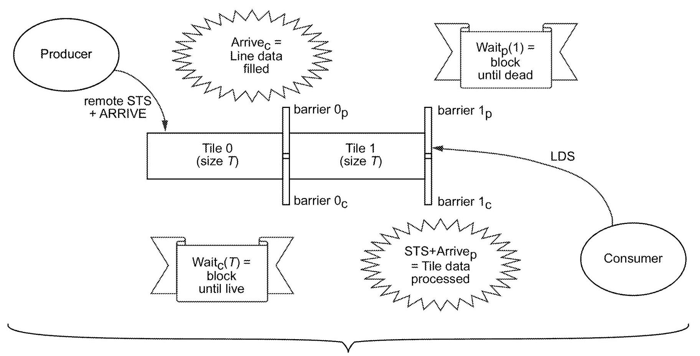
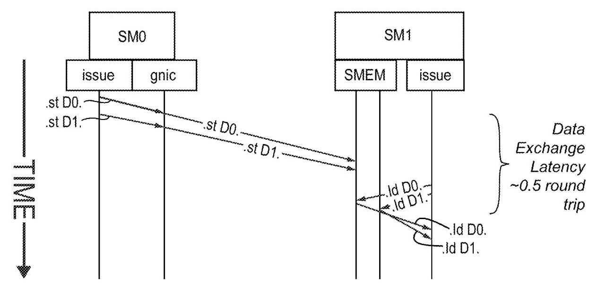
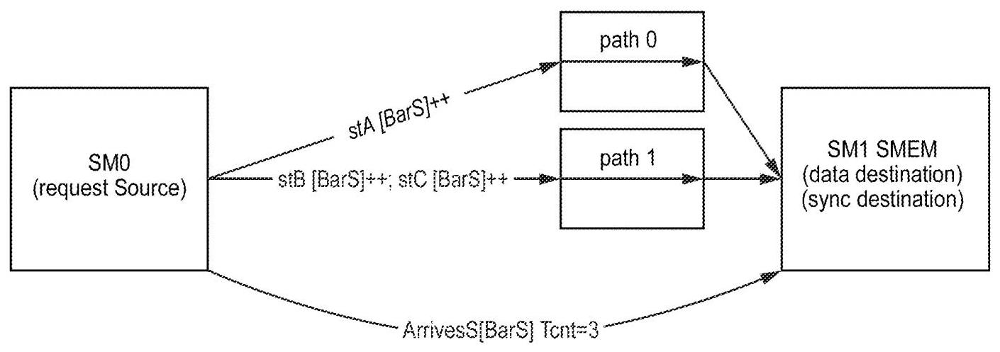
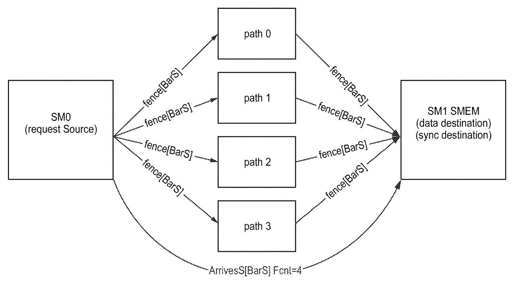
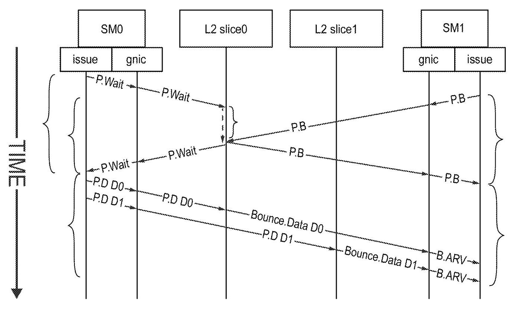

# Fast Data Synchronization in Processors and Memory 深度解读

> **作者**：Jack Choquette, Ronny Krashinsky, Timothy Guo, Carter Edwards, Steve Heinrich, John Edmondson, Prakash Bangalore Prabhakar, Apoorv Parle Jr., Manan Patel, Olivier Giroux, Michael Pellauer  
> **会议/期刊**：US Patent Application Publication US 2023/0315655 A1，公开日 2023-10-05，申请人 NVIDIA Corporation  
> **一句话总结**：这份专利提出一种面向 GPU/NUMA 多处理器的低延迟 producer-consumer 同步机制，把数据写入和 barrier 更新绑定成同一类远程操作，使 consumer 可以在数据可见后以约 0.5 roundtrip 的延迟被唤醒。

## 一、问题定义

这份文档要解决的不是传统意义上的 GPU 计算吞吐问题，而是 strong scaling 下更尖锐的跨 SM 数据同步问题。随着 GPU 每代增加更多 SM、更多并行线程和更高单 SM 算力，单个应用希望在不增大 batch 或工作集的情况下跑得更快。这样会把每个 SM 负责的 tile 变小，数据复用变差，跨 SM 数据供给和同步频率变高。此时，通信路径上的几个 roundtrip 不再是细枝末节，而会直接吞掉 strong scaling 带来的收益。

传统 producer-consumer 模式通常是：producer 写数据，执行 fence 或 membar 保证数据可见，再写 flag；consumer 看到 flag 后读取数据。这个流程正确，但专利指出在 L2 参与的常规路径上会消耗约 3 到 4 个 L2 roundtrips。即使使用 remote CGA store，把数据写到 consumer SM 的 shared memory，再写本地 flag，也仍然约为 1.5 roundtrips。核心问题因此变成：在数据和同步状态分布在不同处理器本地内存的 NUMA-like GPU 子系统里，怎样让 consumer 知道“数据已经写完且可见”，同时避免昂贵的 fence、远程轮询和独立 flag 写。

**动机评估**：动机相当 solid。文中给出明确的体系结构背景：CGA 保证多个 CTA 在同一硬件域内并发运行，distributed shared memory 允许跨 SM 访问对方 shared memory，新的 TMAU / multicast 等数据移动机制会让跨 SM producer-consumer 流更常见。问题也有量化对比：传统全局/L2 同步约 3-4 roundtrips，remote CGA store 加 flag 约 1.5 roundtrips，而目标路径约 0.5 roundtrip。弱点是这是一份专利，不是论文，没有给出真实 workload 性能曲线或硅后测量，因此“性能收益”主要来自路径级 latency 模型。

**核心 Insight**：同步标志不应作为数据写完之后的第二个独立事件在网络中传播，而应和数据写入绑定在一起，到达 destination memory 后按硬件定义的顺序完成“store visible -> barrier update”。换句话说，consumer 等待的 barrier 要和接收 buffer 同处 destination SM 本地，producer 发出的消息同时携带 data address 和 barrier address；这样同步状态天然跟随数据路径，不再需要额外的全局 fence 来证明数据先于 flag 可见。

## 二、相关工作

这份专利的相关工作主要嵌在 background 和 cross-reference 里，组织方式更像 NVIDIA 内部同一代 GPU 功能族的拼图，而不是学术论文式引用。

第一类是传统 CUDA / GPU 同步原语。`syncwarp`、thread block 内同步和 named barrier 解决的是较小范围内的线程协调。它们的优点是硬件支持成熟，但 named barrier 是 processor-local 资源，数量有限，难以直接扩展到跨 SM producer-consumer；BSP 风格的 barrier 也不适合异步数据流水。

第二类是 Cooperative Groups API 和 grid-wide synchronization。Cooperative Groups 把同步范围从 warp/block 扩展到 grid 甚至 multi-GPU 层级，给软件一个更灵活的线程组抽象。但这些 API 不必然改变底层硬件路径，跨 SM 数据依赖如果仍通过 L2、global memory 和 fence 表达，延迟仍然高。

第三类是 arrive-wait barrier。它比传统 named barrier 更接近 producer-consumer 语义，但文中指出它往往以 shared-memory backed resource 和 software polling 的形式实现，会暴露等待延迟并消耗 shared memory 带宽；如果 producer 或 consumer 需要对远端 SM 的 barrier 执行 wait，remote polling 的实现成本和延迟也会变得不现实。

第四类是同一组 NVIDIA 专利中的 locality 和 data movement 机制，包括 Cooperative Group Arrays、distributed shared memory、programmatic multicast、TMAU、hardware accelerated synchronization 等。它们让跨 SM 数据共享成为可能，但也反过来要求同步原语跟上：如果数据已经可以直接写进对方 SM 的 shared memory，同步仍绕回 L2/global memory，就会浪费 locality 带来的收益。

## 三、技术挑战

1. **store 和 flag/barrier 的顺序必须在跨 SM 网络中成立**。interconnect 可能有多条路径，同一 producer 发出的多个 store 也可能走不同路径；如果 flag 比某些数据先被 consumer 看到，就会读到不完整 buffer。

2. **不能依赖 remote wait 或 remote polling**。producer 等 consumer 本地 barrier，或 consumer 等 producer 本地 barrier，都会把本该本地化的 wait 变成跨 SM 轮询，既难实现也破坏延迟目标。

3. **多 producer 和动态数据大小会让“何时完成”变复杂**。一个 tile 可能由多个 producer 分段写入；consumer 可能知道 expected byte count，也可能不知道某个子过程到底写了多少字节。

4. **locality 和 interconnect bandwidth 之间有张力**。CGA/DSMEM 希望通过本地 shared memory 和 SM2SM 直达路径降低延迟，但 fence replication、multicast 或 L2-mediated queue 都会消耗 crossbar/L2 带宽，需要可控的流量模型。

5. **ISA 必须能表达同步语义，同时不能暴露过多硬件细节**。指令要携带 data address、barrier address、目标 CTA/SM 信息和可选 transaction count，还要能通过 library 或编程模型安全地暴露给软件。

## 四、解决方案

### 整体思路

专利提出的主方案可以概括为四步：把接收 buffer 和 consumer 等待的 barrier 放在 destination processor/SM 的本地内存中；新增 combined store-and-arrive 操作，producer 远程写数据时同时指定要更新的 barrier；使用 transaction count/expected count 判断一个 buffer 是否完整；把 producer 等“buffer dead”和 consumer 等“buffer alive”拆成 producer-local p-barrier 与 consumer-local c-barrier，避免双方在远端 barrier 上 wait。

图 6B 的关键价值在于把双向同步拆开：consumer 等自己的 c-barrier，producer 等自己的 p-barrier。跨 SM 的只有 arrive 或 combined STS+Arrive，这让等待路径保持本地化。

### 贯穿示例

可以把系统想成两个 SM 之间传递两个 tile。SM0 是 producer，SM1 是 consumer。Tile 0 和 Tile 1 都放在 SM1 的 shared memory 中；每个 tile 有一个 c-barrier 位于 SM1，表示“这个 tile 已经 live，可以读”；同时有一个 p-barrier 位于 SM0，表示“这个 tile 已经 dead，可以重新写”。

初始时 consumer 告诉 producer 两个 tile 都是 dead，于是 producer 被 p-barrier 释放，开始填 Tile 0。它不再先写数据再单独发 flag，而是对 Tile 0 的每个 line 发送 `STS+Arrive`：数据落到 SM1 的 receive buffer 后，对应 c-barrier 的 transaction count 被更新。最后一个 line 到达后，c-barrier clear，SM1 本地 wait 被释放并读取 Tile 0。SM1 读完后再向 SM0 的 p-barrier arrive，告诉 producer Tile 0 又变 dead。Tile 1 以同样方式交错进行，形成流水。

图 6D 对应最核心的 latency 论点：SM0 发出的 D0/D1 写入到 SM1 本地 shared memory 后，barrier 也在 SM1 本地被更新；SM1 的 acquire/wait 是本地动作，因此从 producer 发出消息到 consumer 获得可读通知，文中称可达到约 0.5 roundtrip。

### 关键技术点

**1. Combined Store and Arrive / Store with Synch。**  
主指令形式是 `ST_CGA_Sync Ra, Rb`。`Ra` 携带目标 CTA ID、data address 和 barrier address，`Rb` 携带要写入的数据。语义是先把数据写到目标 CTA 的 shared memory，保证可见后，再按写入数据量更新 barrier 的 transaction count。这个语义把“数据可见”和“同步释放”放到同一 destination 侧处理，减少了独立 fence 和 flag 的需求。

**2. Transaction barrier。**  
barrier 不是单个 boolean flag，而是带有 arrive count、expected arrive count、transaction count 等字段的数据结构。consumer 等待 barrier clear；clear 的条件可以是字节数、line 数或 fence transaction count 达到预期。图 7A-7C 说明多个 store 可以分别更新同一个 barrier，即使走不同 interconnect path，也不需要再发送全局 flush。

这里的设计重点是把“完成多少数据”变成硬件可累计的同步状态。多 producer 可以各写一个片段，consumer 不必知道每个 producer 的身份，只需等待总 count 达到预期。

**3. p-barrier / c-barrier 拆分。**  
单一 barrier 方案虽然可以让 producer 写 consumer 的 c-barrier，但 producer 仍可能需要等待 consumer 读完，从而产生 remote wait。专利将“tile live”和“tile dead”拆成两个方向：producer 通过 STS+Arrive 更新 consumer 本地 c-barrier；consumer 读完后 remote arrive 到 producer 本地 p-barrier。双方 wait 都在自己的 shared memory 上，跨 SM 的只有到达通知。

**4. Reduction with Synch。**  
除了 store，专利还定义 `REDS CGA.ARRIVE` / `RED CGA_Arrive` 类指令，用于把多个线程的 transaction count 规约后更新目标 barrier。这解决的是多线程/多 producer 场景下 expected count 的聚合问题，减少软件逐项维护的复杂度。

**5. Fence-and-arrive 备选实现。**  
当软件不知道准确字节数时，主方案的“按写入字节更新 barrier”不一定好用。专利提供备选：source SM 在完成任意数据写后，向所有可能的 interconnect path 复制 fence；destination barrier 统计所有 path 的 fence arrival。若共有 N 条可能路径，barrier 等到 N 个 fence arrive 后即可证明之前 store 已到达。它比 0.5 roundtrip 主方案慢，也带来 N 倍 fence traffic，但不要求软件预知写入字节数。

**6. L2-mediated SM2SM queue 模型。**  
对于超出 GPC-CGA scope 或不适合 shared-memory direct path 的场景，专利还给出 L2-mediated 模型：consumer 把 receive buffer 信息 push 到 L2 slice 中的 queue，producer 通过 PopWait 得到目标信息，把数据经 L2 bounce 到 consumer 本地 buffer。该路径约为 2 个 L2 roundtrips，慢于 0.5 roundtrip 的 SM2SM shared memory 模型，但能覆盖更广的生产者/消费者组织方式。

### 与已有方案的对比

相比传统 global/L2 memory + membar + flag，该方案把同步状态移动到 destination 本地，并把 data store 与 barrier update 合并，减少了独立 fence 和 flag 消息。相比 remote CGA store 加单独 flag，它进一步消除了 store ack 后再写 flag 的等待，延迟从约 1.5 roundtrips 降到约 0.5 roundtrip。相比 arrive-wait barrier 的直接远程扩展，它通过 p/c barrier 拆分避免 remote wait，只保留 remote arrive。

局限也很清楚。主路径强依赖硬件支持：CGA 并发调度、DSMEM/SM2SM store、barrier support unit、专用 ISA 和目标地址编码。它更适合 producer/consumer 拓扑明确、目标 buffer 位于已知 destination memory、expected count 可配置的场景。对于动态写入量、跨更大范围通信或路径数量复杂的系统，需要退到 fence replication 或 L2-mediated queue，延迟和流量开销都会上升。

## 五、实验评估

### 实验设定

这份专利没有传统论文式实验平台、benchmark、baseline 运行结果或消融实验。它的“评估”主要是体系结构路径分析和图示 latency comparison。可抽取出的 baseline 和指标如下：

- **Baseline A**：传统 global/L2 memory data exchange，producer 写数据、membar/fence、写 flag，consumer 轮询/获取 flag 后读数据。
- **Baseline B**：remote CGA memory store 加单独 flag/barrier update，数据和 flag 都在 consumer SM local memory，但 producer 仍等待 store ack 后再更新 flag。
- **Proposed main path**：SM2SM shared-memory STS+Arrive + destination-local barrier。
- **Alternative path**：path-replicated fence-and-arrive。
- **Extended path**：L2-mediated SM2SM queue / agent 模型。
- **指标**：同步数据交换的 roundtrip latency、是否需要 remote wait、是否要求预知 byte count、额外 interconnect/L2 traffic。

### 主要实验与结论

**传统 L2 同步约 3-4 roundtrips。**  
图 5A 描述 producer 写 D0/D1 到 L2 slice，等待 membar ack，再写 flag，consumer 获取 flag 后再读数据。文中明确给出该序列从 producer store 到 consumer 获得数据约消耗 3 到 4 个 L2 roundtrips。

**remote CGA store + flag 约 1.5 roundtrips。**  
图 5B/5C 把数据直接写入 consumer SM 的 shared memory，consumer 从本地 memory 读，少了绕 L2 取数据的部分。但 producer 仍需要等 store acknowledgment 后更新 flag，因此仍约为 1.5 roundtrips。

**STS+Arrive 主路径约 0.5 roundtrip。**  
图 6D 是最核心结论：producer 的 store message 抵达 consumer SM 后，data write 和 barrier update 在 destination 侧连续完成，consumer 的 wait 是本地释放；因此同步延迟接近单向传输，也就是约 0.5 roundtrip。

**fence-and-arrive 备选路径低于 1 roundtrip 但高于 0.5 roundtrip。**  
文中说明该方案让 fence 紧跟 store 并复制到所有可能 path，不需要单独 flag update，因此低于传统 roundtrip 级 fence+flag；但因为要等待所有 path 的 fence arrive，延迟会高于主方案。

**L2-mediated 模型约 2 个 L2 roundtrips。**  
图 9G/9F 的模型包括 consumer publish receive buffer 信息和 producer push data 经 L2 bounce 两个阶段。文中给出最小延迟约 2 个 L2 roundtrips；同时给出一个硬件 queue 例子：单个 256B queue 可在 4B entry 下支持 63 项，或在 2B entry 下支持 126 项。

### 结论支撑性分析

这些延迟数字足以支撑“路径级同步延迟可以显著降低”的主张，因为每个数字都对应明确消息序列。但它们不足以支撑“实际应用端到端性能一定提升多少”的主张：专利没有给出 DL/HPC workload、真实 SM occupancy、crossbar contention、barrier support unit 面积/功耗、软件调度开销或 compiler/runtime 集成成本。对架构理解而言，最可信的是机制正确性和 latency lower-bound；对产品收益而言，还需要实测。

## 六、附加洞察

**结论 1**：tile 大小 T 和 resident tile 数量是隐藏 latency 的软件调参旋钮。  
- *出处*：Improved Synchronization in NUMA-organized Systems，[0088]、[0106]-[0107]。  
- *推理链条*：consumer barrier 的 clear 条件可以设为 tile 的 line 数 T；steady state 要求 roundtrip latency 或 tile compute time 大于 T；因此软件可以在 tile 空间占用和 latency hiding 之间做 workload-specific tradeoff。薄弱点是文中没有给出自动调参策略。

**结论 2**：不知道写入字节数是实际编程模型中的关键困难。  
- *出处*：Other Implementations，[0153]-[0155]。  
- *推理链条*：主方案要求 receiver 知道 expected byte count 或 line count；但如果写入由子程序完成，调用方可能不知道精确字节数；因此 fence replication 方案用“所有路径上的 fence 都到达”替代“字节数达到预期”。代价是 fence 流量和延迟上升。

**结论 3**：SM2SM 直达的低延迟来自更强的驻留和局部性假设。  
- *出处*：Overview of Example GPU Environment，[0064]-[0073]；Other Implementations，[0175]。  
- *推理链条*：CGA 保证相关 CTA 并发且空间上可定位，DSMEM 让 CTA 互访 shared memory；因此 data/barrier 可以放在 consumer 本地并被直接更新。若 producer/consumer 不同时驻留或超出 GPC-CGA scope，就需要 L2-mediated queue，延迟上升到约 2 roundtrips。

**结论 4**：硬件可以把部分同步状态对软件隐藏，以降低 API 复杂度。  
- *出处*：Other Implementations，[0163]-[0166]。  
- *推理链条*：memory object barrier 可包含 expected arrive count、actual arrive count 和 fence transaction count；arrive count 可让软件观察，fence transaction count 可由硬件管理且对软件 opaque；wait 的 clear 条件由硬件综合判断。这减少软件处理 path-level fence 的负担，但也让正确性更依赖硬件语义清晰。

**结论 5**：专利意识到 SM2SM traffic 可能伤害 L2 traffic，并给出带宽隔离思路。  
- *出处*：Other Implementations，[0168]。  
- *推理链条*：fence replication 会在每条可能 path 上发送消息，增加 interconnect 负载；为避免挤占 L2 数据路径，系统可把 SM2SM traffic 限制在 crossbar 的部分 links 上并分摊流量。这个结论说明设计不是只追求低延迟，也在考虑全芯片带宽公平性。

## 七、总结与评价

这份专利的核心贡献是把跨 SM producer-consumer 同步从“数据写完后再证明数据写完”改成“数据写入动作本身携带同步释放”，并通过 destination-local barrier、p/c barrier 拆分和 transaction count 机制把等待保持在本地。它很好地抓住了新一代 GPU strong scaling 的瓶颈：当 CTAs 可以被硬件组织成 CGA 并共享 DSMEM 时，同步原语必须同样局部化，否则数据路径优化会被 fence/flag 路径抵消。

最大的亮点是机制与硬件拓扑匹配：CGA 给并发和空间关系，DSMEM 给远程 store，STS+Arrive 给顺序语义，barrier support unit 给本地 wait。最大的不足是文档属于专利文本，论证偏机制保护范围，没有真实应用实验、面积功耗分析或软件栈集成细节。后续最值得关注的是编译器/runtime 如何决定何时使用 STS+Arrive、如何设置 expected count，以及它在真实 DL pipeline、collective communication 和 producer-consumer kernel fusion 中能否稳定转化为端到端性能。

## 八、章节脉络与段落速览

- **ABSTRACT**：概括提出低于一个 roundtrip、约 0.5 roundtrip 的 producer-consumer 同步系统。
  - ¶Abstract：说明新同步系统在同一或不同处理器上的 producer/consumer 之间工作，关键是 producer store 后立即更新 consumer 等待的 barrier。

- **FAST DATA SYNCHRONIZATION IN PROCESSORS AND MEMORY**：给出专利题名。
  - ¶Title：标识主题是处理器与存储器中的快速数据同步。

- **CROSS-REFERENCES TO RELATED APPLICATIONS**：列出同日提交的 NVIDIA 相关专利族。
  - ¶[0001]-[0011]：把本专利放在 CGA、DSMEM、TMAU、multicast、hardware synchronization 等共同申请的体系结构功能族中。

- **FIELD**：限定技术领域。
  - ¶[0012]：说明技术涉及提高处理效率，尤其是用于数据同步的专用电路。

- **BACKGROUND**：从 strong scaling、CUDA 同步和 Cooperative Groups 说明问题来源。
  - ¶[0013]-[0018]：解释 DL/HPC 用户希望单应用 strong scaling，而不是只通过增加独立任务或 batch 获得吞吐。
  - ¶[0019]-[0020]：指出并行执行天然需要通信和 barrier synchronization。
  - ¶[0021]-[0023]：回顾 CUDA `syncwarp`、Cooperative Groups API 和 grid-wide synchronization 的能力与范围。
  - ¶[0024]：收束为仍需要更快的跨多处理器同步。

- **BRIEF DESCRIPTION OF THE DRAWINGS**：逐图说明从应用背景到 GPU 架构的图示内容。
  - ¶[0025]-[0030]：图 1A-4 覆盖 DL 应用、weak/strong scaling、GPU/GPC/SM 通信路径和 CGA。
  - ¶[0031]-[0037]：图 5A-6D 聚焦传统同步、remote CGA store、split barriers 和 0.5 roundtrip 消息流。
  - ¶[0038]-[0049]：图 7A-9I 覆盖 transaction barrier、指令格式、fence replication、三类数据交换模型和 L2-mediated queue。
  - ¶[0050]-[0055]：图 10-13B 给出可承载该机制的 PPU/GPC/SM/NVLink 系统架构。

- **DETAILED DESCRIPTION OF EXAMPLE NON-LIMITING EMBODIMENTS**：提出 SOL synchronization 并解释为什么需要它。
  - ¶[0056]：定义新 primitive 的目标是 producer/consumer 约 0.5 roundtrip 同步。
  - ¶[0057]-[0058]：把 strong scaling 的 tile 缩小、带宽需求上升和 wire scaling 困难连接起来。
  - ¶[0059]：批评 named barrier 和 arrive-wait barrier 在跨 processor producer-consumer 中的局限。

- **Overview of Example GPU Environment**：介绍 CGA/DSMEM/SM2SM 的硬件前提。
  - ¶[0060]-[0062]：描述 GPU partition、GPC、SM、MMU、crossbar 和 L2 的组织。
  - ¶[0063]：说明 SM2SM communication 和 `gpc_local_cga_id` 如何定位 CGA/DSMEM 相关状态。
  - ¶[0064]-[0068]：解释 CGA 保证多个 CTA 在指定硬件层级并发执行。
  - ¶[0069]-[0073]：说明 CGA 线程可以跨 CTA 访问 shared memory，为低延迟数据共享和同步提供基础。

- **The Problem of Synchronization**：量化传统同步和 remote store 同步的延迟。
  - ¶[0074]-[0077]：说明 producer 写数据、membar、写 flag 的传统流程需要约 3-4 个 L2 roundtrips。
  - ¶[0078]-[0080]：说明 remote CGA store 到 consumer SMEM 可降到约 1.5 roundtrips，但仍要等待 ack 后写 flag。
  - ¶[0081]-[0084]：把 producer-consumer 同步归纳为“consumer 何时能接收新数据”和“consumer 何时能处理已填充数据”两个互补问题。
  - ¶[0085]-[0086]：指出单纯 arrive/wait 若无法保证 store 和 arrive 跨 SM 顺序，仍不能直接解决分布式 producer-consumer 同步。

- **Improved Synchronization in NUMA-organized Systems**：给出 STS+Arrive、split barriers 和 SOL message flow。
  - ¶[0087]-[0088]：提出在 NUMA-like 系统中把数据写和 flag/barrier 更新放在 destination 本地连续完成。
  - ¶[0089]-[0091]：先说明单 barrier 方案会引出 remote wait，再提出 p-barrier/c-barrier 拆分。
  - ¶[0092]-[0095]：定义 combined store-and-arrive 的地址、数据、atomic barrier update 和多 producer 支持。
  - ¶[0096]-[0098]：说明 producer/consumer 分别只 wait 本地 barrier，并用 remote arrive 表达对方状态变化。
  - ¶[0099]-[0107]：用两个 tile 的时间线说明 steady-state 流水和 T 的调参含义。
  - ¶[0108]-[0110]：用图 6D 说明 0.5 roundtrip 的 SOL 数据交换路径。
  - ¶[0111]-[0115]：说明多路径 store、transaction barrier、指令字段和 barrier support unit。

- **Instruction Set Architecture**：把机制落成可暴露给软件的指令。
  - ¶[0116]：说明 buffer filled event 需要预先建立 expected update 语义。
  - ¶[0117]-[0126]：定义 `Store with Synch` / `ST_CGA_Sync`，写目标 SMEM 后按数据量更新 barrier。
  - ¶[0127]-[0133]：定义 `Reduction with Synch`，用于规约多个线程的 expected transaction count。
  - ¶[0134]-[0152]：给出显式跟踪 byte transaction count 的替代指令格式。

- **Other Implementations**：给出 fence replication 和 L2-mediated queue 两类扩展方案。
  - ¶[0153]-[0155]：当写入字节数未知时，用复制到所有 path 的 fence arrive 证明 store 已到达。
  - ¶[0156]-[0167]：描述 CGA memory object-scoped SOL synchronization、object barrier 字段和 clear 条件。
  - ¶[0168]：指出 fence replication 会增加 interconnect traffic，并可通过限制 SM2SM link 子集控制影响。
  - ¶[0169]-[0177]：比较 global memory、shared-memory SM2SM 和 L2-mediated SM2SM 三种模型及其延迟。
  - ¶[0178]-[0180]：描述 L2 queue、PushBuf/PopWait 和 split SM2SM 支持。
  - ¶[0181]-[0183]：引入 compute queue / persistent agent 模型，由代理协调 producer/consumer 队列和 DMA。

- **Example GPU Architecture**：提供可实现该机制的 PPU/GPC/SM 架构背景。
  - ¶[0184]-[0196]：概述 PPU、I/O、front end、scheduler、work distribution、XBar、GPC、memory partition 和 host driver。
  - ¶[0197]-[0208]：说明 GPC、DPC、SM、L2、HBM、unified memory 和 copy engine 等模块。
  - ¶[0209]-[0226]：细化 SM 的 warp/SIMT、register file、shared memory/L1、LSU、interconnect 和通用计算配置。
  - ¶[0227]-[0228]：说明 PPU 可集成在桌面、服务器、SoC、显卡或 iGPU 等形态中。

- **Exemplary Computing System**：把 PPU 放入多 GPU/CPU 系统。
  - ¶[0229]-[0234]：描述多 PPU、CPU、NVLink、switch、coherency 和 ATS 的系统互连。
  - ¶[0235]-[0243]：描述通用计算系统、驱动/API 和 kernel launch 如何使用 PPU。
  - ¶[0244]-[0245]：给出引用合并和权利要求解释的专利式收尾。

- **Claims 1-27**：把技术方案抽象成权利要求。
  - ¶Claims 1-18：覆盖 producer/consumer 同步方法、barrier co-location、0.5 roundtrip、combined store-and-arrive、split barriers、path fence 和 NUMA 系统。
  - ¶Claims 19-25：覆盖包含第一/第二处理器、local memory 和 interconnect 的 multiprocessor system。
  - ¶Claims 26-27：用更宽泛语言覆盖单消息写数据加更新 barrier，以及在第二处理器本地 memory 中写 data 和 completion flag 的同步方法。
