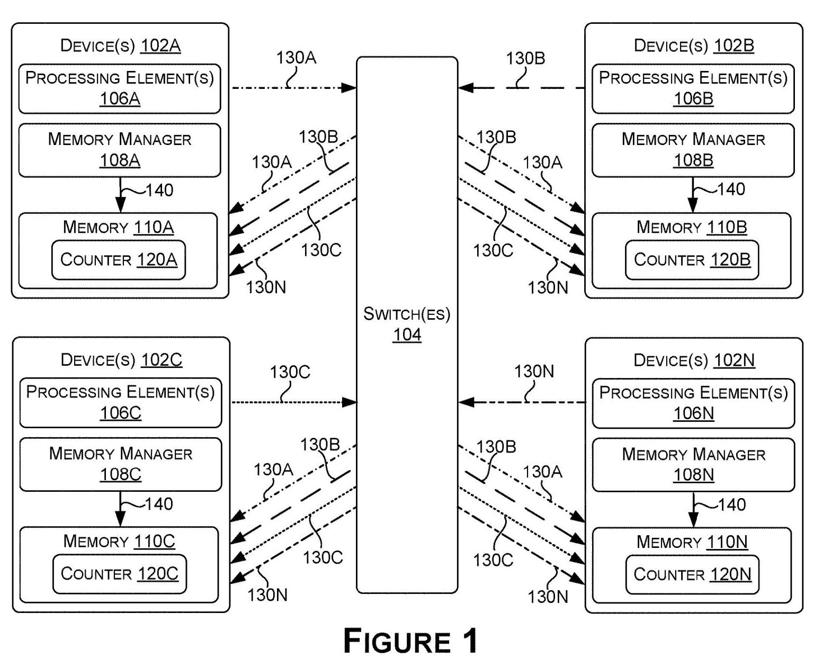
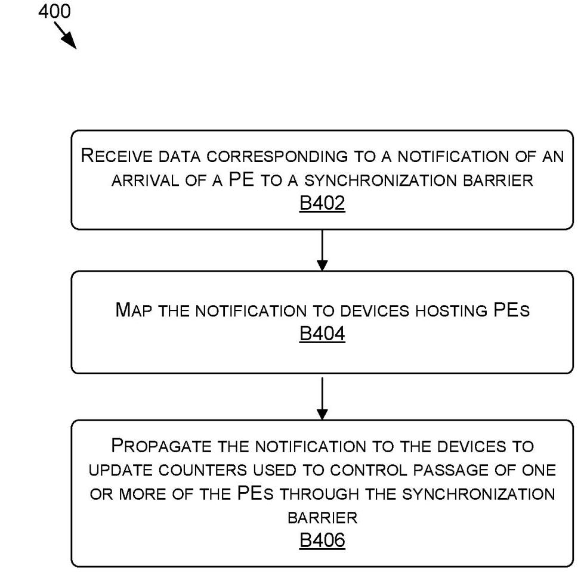
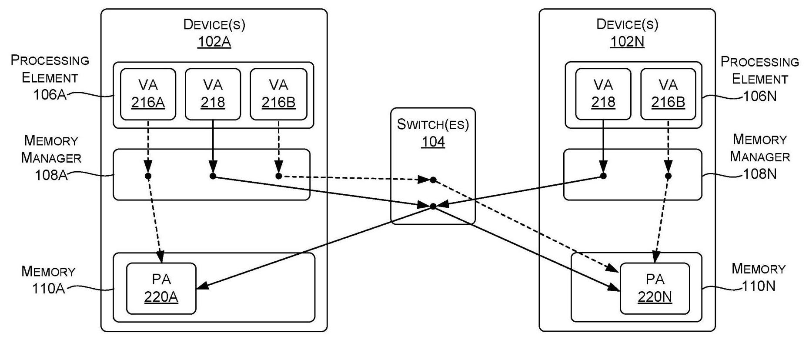
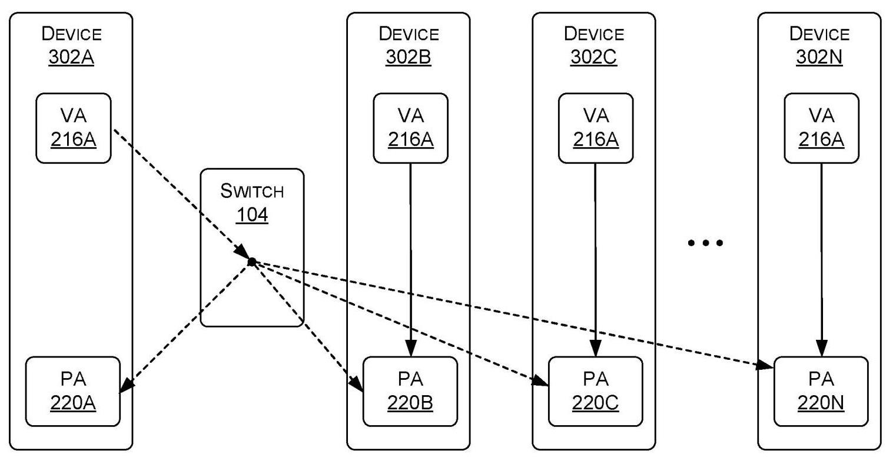

# EFFICIENT MULTI-DEVICE SYNCHRONIZATION BARRIERS USING MULTICASTING 深度解读

> **作者**: Glenn Alan Dearth; Mark Hummel; Daniel Joseph Lustig  
> **申请人**: NVIDIA Corporation  
> **公开信息**: US Patent Application Publication US 2023/0229524 A1, published Jul. 20, 2023  
> **一句话总结**: 这份专利把多设备 barrier 的到达通知建模为 multicast memory access/reduce operation, 让每个参与设备维护并轮询自己的本地 counter, 从而避免传统集中 counter 再逐设备写 flag 的放行延迟。

## 一、问题定义

这份公开文本关注的是多 GPU、多 SM 或其他多 processing element (PE) 协同执行时的 synchronization barrier。Barrier 的基本语义是: 每个 PE 完成本阶段 compute task 后必须等到 barrier group 里的所有 PE 都到达同一个执行点，之后才能继续下一阶段。这个机制在并行程序里很普通，但在跨设备场景中会变成互连、内存系统和同步语义共同决定的系统问题。

专利在 Background 中给出的传统做法是: barrier group 的 SM 分布在多个 GPU 上，其中一个 GPU 保存集中 counter。每个 SM 到达 barrier 后向保存 counter 的 GPU 发送读/改/写或类似操作来更新 counter; 该 GPU 轮询 counter, 确认所有 SM 到达后，再分别向其他 GPU 写 flag; 其他 GPU 继续本地轮询 flag。问题在于，真正的 barrier 条件已经满足后，其他 GPU 仍要等待集中设备完成检测并逐个发出放行写入，放行路径上多了一次串行化的通知阶段。

**动机评估**: 动机是 solid 的。跨 GPU 协同计算会反复遇到 barrier, 如果每个 barrier 都要经历集中计数和集中放行，延迟会累积。不过这份专利没有给出定量性能数据，因此它证明的是机制上的延迟来源和替代路径，而不是用实验数字证明收益大小。

**核心 Insight**: “到达 barrier” 本质上可以是一条可被 multicast 的 memory access notification。与其把所有到达事件汇总到一个 counter, 再由一个设备告诉其他设备可以继续，不如让每个 PE 的一次 arrival notification 同时更新 barrier group 中每个目标的本地 counter。这样每个设备都能通过轮询自己的本地 counter 判断 barrier 是否完成，放行决策从集中节点迁移到本地。

## 二、相关工作

这不是一篇带 Related Work 的学术论文，文本没有系统梳理前人论文，而是通过 Background 和后续实施例构造了几个对照对象。

第一类是传统 centralized counter + flag release。它的核心思路是把所有 PE 的到达事件收敛到一个设备上的 counter, 再由该设备负责通知其他设备。优点是协议直观，所有 barrier 完成判断集中在一个位置; 不足是完成判断之后还要给其他设备写 flag, 这一步会引入额外延迟和中心节点压力。

第二类是普通 unicast memory access。每个 virtual address (VA) 通常被翻译到一个 physical address (PA), 一条请求只访问一个目标。它适合常规 load/store, 但不能直接表达“一次到达通知更新多个设备 counter”的语义。如果用多次 unicast 模拟 multicast, 请求数量会随参与设备数增长。

第三类是 multicast/reduce memory operation。专利把 barrier arrival notification 描述成 load/store/reduction/atomic 等内存请求的一种实现方式，尤其强调 reduce multicast operation: 对 multicast group 中每个 PA 执行 atomic operation, 可以不返回响应。它的优势是把“复制通知到多个目标”下沉到 memory system 或 switch, 但挑战是地址翻译、ordering 和权限约束都要和现有编程模型兼容。

第四类是透明的 memory replication/acceleration。专利后半部分把思路推广到 barrier 之外: 如果系统能判断多个设备将访问或保存同一个值，可以用 multicast 复制本地副本，之后让 consumer 从本地读。这个方向和 barrier 共享一个关键前提: 系统必须保证 multicast 后的结果与原本的 unicast 程序语义一致。

## 三、技术挑战

**挑战 1: 一次 notification 必须可靠地映射到多个目标。** PE 发出的到达事件不能只更新一个地址，而要更新 barrier group 中所有相关设备或 PA 上的 counter。系统需要知道 multicast group、目标 PA、设备映射以及请求类型，否则会破坏 barrier 语义。

**挑战 2: 各设备看到 barrier 完成的时间可能不同。** 专利明确指出，不同链路的 latency 和 bandwidth 会导致各 counter 在不同时间被更新。本方案不是强行让所有设备同一时刻放行，而是允许每个设备在自己的 counter 达到阈值或 epoch value 后独立继续执行。

**挑战 3: multicast 和 unicast 的地址空间/指令语义要能区分。** 文本给出两条路径: 一是把 unicast VA 和 multicast VA 放在不同 VA spaces 中，例如 `CreateMulticastAlias(VA 216A, VA 216B)`; 二是通过不同指令、operand 或参数告诉 memory manager/switch 当前请求应按 multicast 处理。

**挑战 4: memory ordering 和 race condition 不能被隐藏成本打破。** 如果 multicast store 和后续 unicast store 走不同路径，内部路径可能更短，后发请求可能先完成。专利因此引入 access permission、producer/consumer、路径反射、软件 hint 等 constraints, 让结果与不使用 multicast 时一致。

**挑战 5: 多轮 barrier 需要处理 reset 和 wraparound。** 专利提出用 epoch value 避免每轮清零 counter: 4 个参与者时，第一轮阈值为 4, 后续可为 8、12、16。它还提到 64-bit counter 可以让软件基本忽略 wraparound, 但仍列出 overflow bit、慢路径清零、atomic 内检测等处理方式。

## 四、解决方案

### 整体思路

系统为 barrier group 中每个参与设备维护本地 counter。某个 PE 到达 barrier 后，发出一条 notification, 这条 notification 可以是 memory access request, reduce operation 或 atomic reduction add。Memory manager 和/或 switch 将该 notification 映射到多个设备或多个 PA, 然后 multicast 到所有目标，导致每个目标设备的 counter 更新。每个设备轮询自己的 counter; 当 counter 达到参与者数量对应的 threshold 或当前 epoch value 时，该设备上的 PE 就可以通过 barrier。

Fig. 1 展示了方案的主线: 102A 到 102N 每个设备都有 PE、memory manager、memory 和 counter; 每个 PE 的 notification 130A 到 130N 都经由 switch 104 复制到所有设备侧 counter; 每个设备再用本地 polling 140 判断是否能继续。这个图的重点不是“所有设备同时被放行”，而是“每个设备都有足够信息在本地判断是否放行”。

### 贯穿示例

假设有 4 个 GPU 各自运行一个参与同一 barrier 的 SM, 每个 GPU 本地内存里都有一个 64-bit counter, 初始值为 0。GPU A 的 SM 完成本阶段计算后，向 switch 发出一次 reduce multicast add 请求，表示“GPU A 已到达 barrier”。Switch 将这一次请求复制到 A、B、C、D 四个 GPU 的 counter PA 上，每个 counter 加 1。随后 GPU B、C、D 的 SM 也各自发出同类请求。任一 GPU 只要看到自己的本地 counter >= 4, 就知道 4 个参与者都已到达这一轮 barrier, 因而可以进入下一阶段。

如果程序后面还有下一轮 barrier, counter 不必清零。每个 GPU 维护 next epoch value: 第一轮等待 4, 第二轮等待 8, 第三轮等待 12。这样一个较快的 PE 可以先发出下一轮 notification, 而较慢设备只要按 epoch value 判断，就不会把不同轮次的到达事件混淆。

### 关键技术点

第一，arrival notification 被实现成内存系统能理解的请求。文本列举 load、store、reduction、atomic 等可能形式，并重点说明 reduce multicast operation 可以在 multicast group 的每个 PA 上执行 atomic operation 且不返回响应。对于 barrier counter 来说，这天然对应“每到达一个参与者就给每个本地 counter 加一”。

第二，switch 承担 fan-out 和 mapping。专利的独立方法权利要求 1 把流程概括成三步: 接收到 PE 到达 barrier 的数据; 将 notification 映射到承载多个 PE 的设备; 将 notification 传播到这些设备以更新 counter。也就是说，switch 不是只转发到单个 owner, 而是把一次逻辑到达事件转成多目标 counter 更新。

Fig. 4 对应 switch 侧流程: B402 接收 PE 到达 barrier 的 notification, B404 映射到承载 PE 的设备, B406 传播 notification 并更新用于控制 barrier passage 的 counters。这个流程图和 claim 1 的措辞基本一致，说明专利的核心保护点放在“接收、映射、多目标传播、更新 counter”这个抽象链条上。

第三，地址翻译可以用 separate multicast VA space。Fig. 2 中，VA 216A/216B 是普通 unicast VA, 分别映射到单个 PA; VA 218 是 multicast VA, 同一 VA 可以映射到多个 PA。软件可以先用 `Malloc()` 分配普通 VA, 再用类似 `CreateMulticastAlias(VA 216A, VA 216B)` 的 API 创建 multicast alias。这样代码仍然发出一次访问，但 memory manager/switch 知道它应被扩展到多个 PA。

Fig. 2 的价值在于解释“单次请求为什么能变成多个物理写入”。VA 218 不是普通指向单个 PA 的地址，而是带有 multicast 语义的别名。对 barrier 来说，counter PA 可以分布在每个设备本地，multicast VA 则把这些本地 counter 绑定成一个可同时更新的目标集合。

第四，系统也可以通过 constraints 隐藏 multicast。Fig. 3 中多个 device 使用同一个 VA 216A, 但系统通过访问权限和路径约束把 producer 的写入经由 switch 复制到多个 PA, consumer 则从本地副本读取。这里的要点是: multicast 不一定暴露成新的 API; 在权限、路径和 race 条件受控时，它可以作为 memory system 的优化。

Fig. 3 说明了另一个设计取舍: 如果希望应用仍像访问普通 unicast 地址一样写 VA 216A, 系统就必须限制谁能写、谁只能读、哪些请求必须经 switch 反射，以及哪些本地路径可以使用。否则 multicast/unicast 混合后可能出现后发先至的 ordering 问题。

### 与已有方案的对比

相对传统集中 counter 方案，这个设计把 barrier 完成判断从一个中心设备转移到每个参与设备本地，省掉中心设备逐个写 flag 的放行阶段。它还把 N 个设备的到达传播从软件可见的 N 次单播，变成 memory system/switch 处理的一次 multicast fan-out。

不足也很清楚。第一，专利没有给出实现成本，例如 switch 需要怎样维护 multicast group、TLB 或 PA fan-out 表。第二，它没有量化不同链路延迟下各设备本地 counter 完成时间的差异，也没有说明局部先放行是否会影响某些严格同步模型。第三，透明 multicast 依赖 constraints, 如果软件 hint、权限控制或 race 分析不准确，就可能破坏程序语义。

## 五、实验评估

### 实验设定

这份文档是专利公开而非实验论文，没有 benchmark、baseline 表格、硬件平台测量或性能曲线。它给出的“评估材料”主要是机制说明、示例数字和流程图。可直接提取的数字包括: 4 个参与者示例下 counter >= 4 表示第一轮 barrier 完成; 多轮 barrier 的 epoch value 可以按 4、8、12、16 增长; 每个设备可维护 64-bit counter 来降低 wraparound 处理频率。

### 主要实验与结论

严格来说，文本没有实验。它只用方法流程证明机制闭环:

- Fig. 4 说明 switch 可以接收 arrival notification、映射到设备、传播并更新 counters。
- Fig. 5 说明 memory manager 可以接收 participant arrival notification, 再发出导致 switch 传播的数据。
- Fig. 6 把设备或 switch 统一抽象成接收 notification 并传播到 multiple targets 的硬件组件。

这些流程支撑的是“可实现性”和“权利要求覆盖范围”，不是“性能提升幅度”。因此不能从该专利本身得出具体加速比或延迟降低百分比。

### 结论支撑性分析

专利对核心主张的逻辑支撑是充分的: 如果传统方案的额外延迟来自中心设备写 flag, 那么让每个到达事件直接更新所有本地 counter 确实能移除这一阶段。但它对收益大小的支撑不足，因为没有评估 multicast fan-out 的开销、atomic update 的竞争、switch 资源占用、counter polling 成本，也没有和已有硬件 collective 或 NVLink/NVSwitch 同步原语做定量对比。

## 六、附加洞察

**结论 1**: Epoch counter 使 barrier 可以流水化，而不是每轮 reset。  
- *出处*: [0038]-[0039]  
- *推理链条*: 多轮 barrier 都更新同一个 counter -> 如果每轮清零会增加同步和状态维护成本 -> 用参与者数量的倍数作为 epoch value -> 较快 PE 的下一轮 notification 可以提前进入 counter, 较慢 PE 仍按自己的 epoch value 判断当前轮是否完成。

**结论 2**: “是否反射回发起设备”是 ordering 和 latency 的核心取舍。  
- *出处*: [0048], [0052]-[0053]  
- *推理链条*: 发起设备本地内部路径更短 -> 不经 switch 可降低本地更新延迟 -> 但 multicast 和 unicast 混合时可能产生后发先至 -> 某些协议需要把请求反射回发起设备，使所有目标沿更一致的路径处理请求。

**结论 3**: 专利实际覆盖范围比 barrier 更宽。  
- *出处*: [0065]-[0069]  
- *推理链条*: Barrier notification 是多目标同值更新的典型场景 -> 同样的 multicast/replica 机制也可用于多个设备将相同值写入多份内存或从本地副本读取同一值 -> 系统可通过 hint、driver message 或 pattern recognition 触发复制 -> 因此权利要求前的说明把技术从 barrier 扩展到了更一般的 memory access acceleration。

## 七、总结与评价

这份专利的核心贡献是把跨设备 barrier 的“到达通知”和“放行判断”重新分配: 到达通知通过 multicast fan-out 写入每个参与设备的本地 counter, 放行判断由每个设备本地轮询完成。这个思路很贴合多 GPU coherent fabric/NVSwitch 类系统，因为 switch 本来就是跨设备通信的汇聚点，把 barrier arrival 转成 switch 级 multicast 是自然的。

最大的亮点是它把 barrier 同步、multicast memory operation、VA-to-multiple-PA translation 和本地 replica 统一到一个框架中; 最大不足是缺少实现和性能细节，尤其没有说明硬件表项规模、atomic fan-out 的冲突处理、memory ordering 约束的实际成本。作为专利文本，它更像是在圈定一组机制组合，而不是完整证明一个系统设计已经优于现有实现。

## 八、章节脉络与段落速览

- **Front matter and Abstract**: 给出公开号 US 2023/0229524 A1、申请人 NVIDIA、发明人和摘要，摘要直接说明单次 notification 可传播到多个 PA/设备并更新 barrier group counter。

- **BACKGROUND**
  - [0001] 介绍并行计算中的 synchronization barrier 语义。
  - [0002] 描述传统集中 counter + flag release 的跨 GPU barrier 流程，并指出其他 GPU 要等待 flag 被集中设备设置。

- **SUMMARY**
  - [0003] 概括公开内容: 通过 multicast arrival notification 让 PE 本地跟踪 barrier 完成状态。
  - [0004] 对比传统方案，说明单条 notification 可访问 barrier group 中每个 PE/设备的 PA 并更新对应 counter。

- **BRIEF DESCRIPTION OF THE DRAWINGS**
  - [0005]-[0013] 列出 Fig. 1 到 Fig. 8, 其中 Fig. 1 是 barrier multicast 主图，Fig. 2/3 是地址翻译路径，Fig. 4-6 是方法流程，Fig. 7/8 是通用计算设备和数据中心环境。

- **DETAILED DESCRIPTION**
  - [0014]-[0015] 重申方案总览: notification 被 multicast 到多个 PA/设备，本地 counter 决定 barrier passage。
  - [0016]-[0024] 结合 Fig. 1 定义 collaborative processing environment, device、switch、PE、memory manager、memory 和 counter。
  - [0025]-[0029] 说明 barrier group、参与者初始化、参与数量、counter 初值、increment value、multicast group 和 VA/PA mapping 等元数据。
  - [0030]-[0037] 展开核心执行路径: PE 到达 barrier 后发 notification, switch multicast 到所有目标并 increment counter, 每个设备本地 polling。
  - [0038]-[0039] 引入 epoch value 和 64-bit counter, 解决多轮 barrier reset 与 wraparound 问题。
  - [0040]-[0047] 说明 memory manager、switch、VA、intermediate address、PA 和 separate unicast/multicast VA space 的地址翻译机制。
  - [0048]-[0053] 讨论 internal path、reflected path、reducing load、multicast store、reduce multicast operation, 以及 weak ordering 带来的不确定性。
  - [0054]-[0064] 结合 Fig. 3 说明 constraints: producer/consumer 权限、请求路径控制、软件保证无 race condition, 目标是让 multicast 结果与 unicast 语义一致。
  - [0065]-[0069] 把 multicast 用于更一般的 memory access acceleration, 包括相同值 store 的合并、本地 replica load、API hint、driver message 和 pattern recognition。
  - [0070]-[0080] 对应 Fig. 4-6 给出 switch、memory manager、device/switch 三种方法流程。
  - [0081]-[0095] 给出通用 computing device 700, 主要是专利模板式硬件环境。
  - [0096]-[0106] 给出 data center 800, 说明可在数据中心分层资源中实现相关组件。
  - [0107]-[0116] 给出 network environment 和权利要求解释相关的通用法律文本。

- **Claims**
  - Claims 1-9: 保护 switch/方法侧的“接收 notification、映射到设备、传播并更新 counters”。
  - Claims 10-16: 保护系统侧，特别是 MMU/memory manager 接收 notification 后触发传播，以及本地 polling counter。
  - Claims 17-20: 保护硬件设备侧的抽象实现，即接收 arrival notification 并传播到 multiple targets 来控制 barrier passage。
