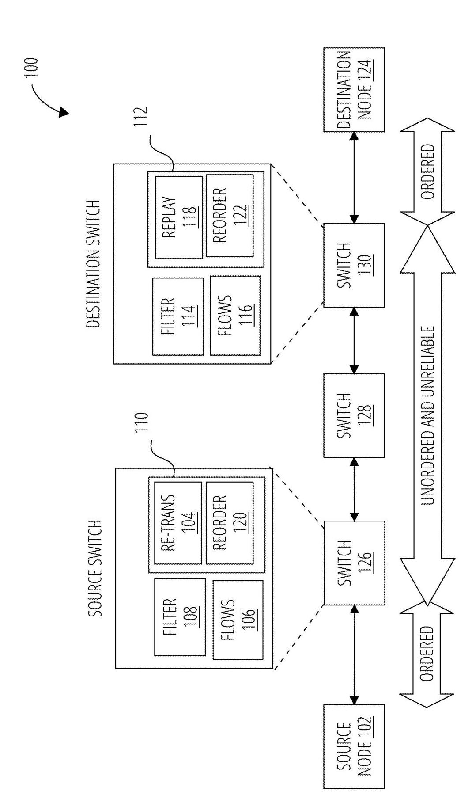
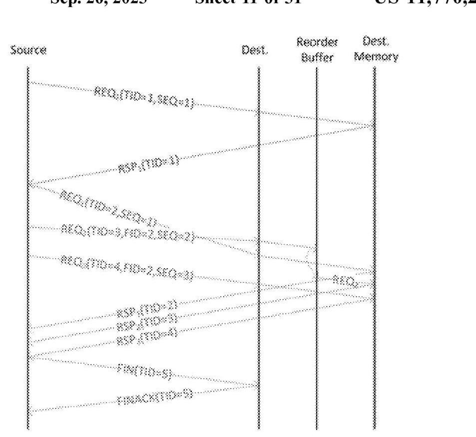
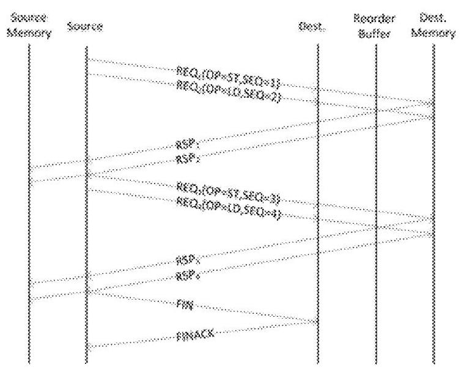
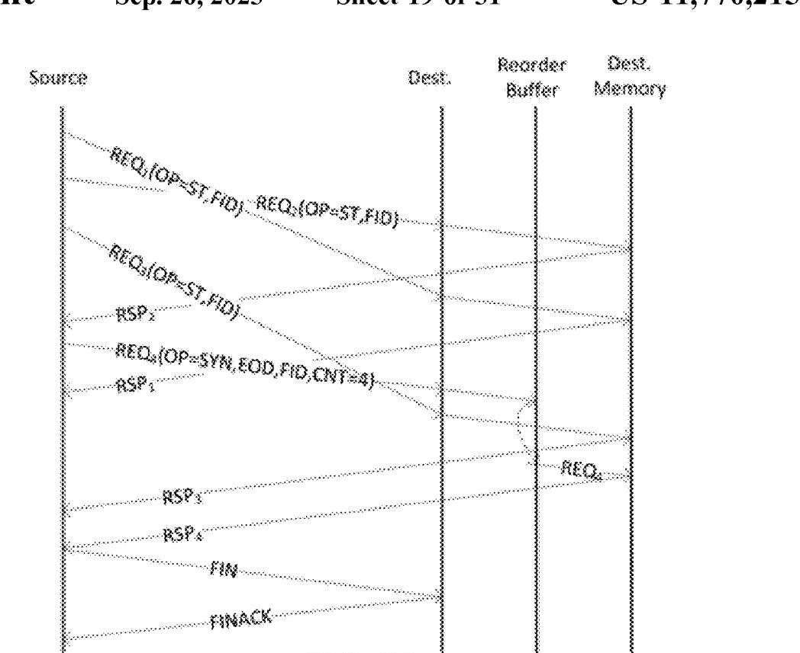
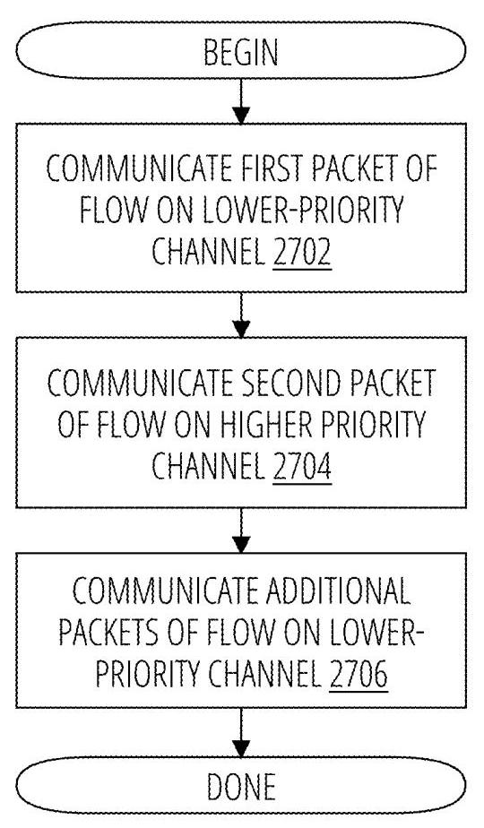

# Transceiver system with end-to-end reliability and ordering protocols 深度解读

> **作者**：Hans Eberle, Larry Robert Dennison, John Martin Snyder  
> **会议/期刊**：U.S. Patent US 11,770,215 B2，授权日 2023-09-26，Assignee: NVIDIA Corp.  
> **一句话总结**：这份专利提出一组面向 unordered and unreliable switched packet network 的端到端协议，用 late on-the-fly flow setup、history/same-address filters、go-back resynchronization、ordered response delivery、counted writes 和 fast path 机制，在不把整个网络强行变成全序可靠网络的前提下，为 GPU/多处理器内存操作提供按需的可靠性、顺序性和 exactly-once delivery。

## 一、问题定义

这份文档不是常规论文，而是一份 NVIDIA 专利。它关心的背景是多 GPU、多处理器或数据中心节点之间通过 switched packet fabric 传输内存操作：例如一个 GPU 通过 NVLink/NVSwitch 访问另一个 GPU 的 memory，网络中间可能有 source switch、destination switch 和多个 intermediate switches。为了获得吞吐，网络希望支持 adaptive routing、multi-pathing 以及 unordered delivery；但内存系统又要求某些操作必须保序，例如同一 memory address 上的 load/store 需要满足 per-location observation order，bulk data transfer 后面的 synchronization operation 不能早于数据包执行，IO traffic 也常常带有 ordering rules。

传统做法有两个极端。一个极端是让网络本身提供强可靠、强顺序，类似 TCP 或 IB RC 这类 connection-oriented protocol；问题是它们对 small, low-latency memory operations 不够轻量，也会削弱多路径和自适应路由。另一个极端是让 endpoint 自己处理乱序、丢包、重复包；这保留了网络吞吐潜力，但需要在 endpoint 或 switch 侧维护足够的状态，保证内存模型不被破坏。

本文属于**非 First 类型**：它不是首次发现 packet network 可靠性或 ordering 问题，而是在已有 reliability/ordering protocol 基础上，把问题收窄到 GPU/多处理器内存操作的 packet flow，并提出一套更轻量、更按需的协议组合。它的切入点是：不是每个 packet 都需要完整连接语义，真正需要 order 的只是那些发生数据依赖的 flow，例如同地址访问、同步操作或 IO ordering。

**动机评估**：动机是 solid 的。专利明确指出，系统如果把 relaxed memory ordering 扩展到网络，就能受益于 adaptive routing 和 multi-pathing；但同一地址顺序、LD/ST observation order、synchronization operation 又不能被破坏。薄弱点在于它没有像论文那样提供 benchmark 或硬件测量，因此“性能收益”更多是体系结构推理，而不是实验结果。

**核心 Insight**：一个 same-address flow 并不一定在第一个 packet 发送时就能被确定，只有当后续 packet 访问同一位置时，系统才知道这些 packet 需要组成一个 ordered flow。因此协议可以把 connection setup 延迟到第二个相关 packet 到达时再做：source 用 same address filter 发现依赖并打上相同 identifier/递增 SEQ，destination 用 history filter 判断第一包是否已经到达，再 late on-the-fly 地建立 flow。这个 insight 让系统避免对 singleton 预先建连接，同时保留必要的顺序控制。

## 二、相关工作

这份专利的 related work 主要通过引用列表和正文中的对比来体现，而不是论文式的相关工作章节。它引用了大量 packet reliability、transport、ordering 相关专利，以及 Hans Eberle 和 Larry Dennison 在 SC 2018 的 "Light-Weight Protocols for Wire-Speed Ordering"。从正文看，可以把相关工作分成四类。

第一类是 **connection-oriented reliable transport**，如 TCP 或 InfiniBand reliable connection。它们提供可靠、有序语义，但专利认为这些协议没有针对 small, low-latency reads/writes 优化，也不天然适配 GPU fabric 中需要的 multi-pathing 和 dynamic adaptive routing。它们的问题不是不能解决可靠性，而是代价和语义粒度太重。

第二类是 **network-level ordering**。这类方法让网络保证 packet order，从而简化 endpoint；但当系统规模从几十个 endpoint 扩展到成百上千个 endpoint 时，网络侧全局保序会增加排队、约束路由选择，降低吞吐和扩展性。本文的方向是把 unordered fabric 保留下来，只在 endpoint/switch 逻辑中对需要保序的 flow 做选择性处理。

第三类是 **endpoint-side reorder/replay/deduplication**。这类方法通过 reorder buffer、retransmission buffer、scoreboard、deduplication filter 等结构在端侧恢复语义。专利沿用了这些基本 building blocks，但进一步区分 ALOD/EOD、fetching/non-fetching operation、LD/ST observation order，并给出资源耗尽时的 NACK、reservation、backoff 策略。

第四类是 **quality-of-service / low-latency fast path**。专利引用 "Queues don't matter when you can JUMP them!" 这类低延迟队列调度思想，把它用于第二个 packet：让第二个 packet 走 higher-priority channel，尽快抵达 destination 建立 flow，从而减少 history filter 误淘汰导致的 retransmission。这里的差异点是 fast path 不是服务普通 QoS，而是服务 flow establishment 的正确性和资源控制。

## 三、技术挑战

1. **同一网络既要高吞吐又要按需保序**。完全保序会削弱 adaptive routing 和 multi-pathing；完全无序又会破坏同地址内存访问、同步操作和 IO ordering。

2. **flow 何时存在并不显然**。REQ with SEQ=1 可能是 singleton，也可能是未来 flow 的第一包。若 destination 在第一包到达时就建 flow，会浪费状态；若等太久，又可能错过正确关联。

3. **乱序会把 singleton 和后续 flow 混在一起**。如果 singleton 和一个后续 same-address flow 的 packet 交错到达，destination 仅凭地址无法判断某个 SEQ>1 packet 应该关联到哪个第一包。

4. **REQ/RSP 丢失会同时制造可靠性和顺序问题**。丢 RSP 可能意味着 destination 已执行操作但 source 不知道；盲目重放会让 loads、stores、atomics 出现不同语义风险。

5. **fetching operation 需要 replay buffer，但 replay buffer 很贵**。尤其 LD followed by ST 时，如果重试 LD，需要保留被 LD 读出的值以避免错误观察顺序；专利试图通过序列化特定模式减少 replay buffer 需求。

6. **synchronization operation 不能早于数据包执行**。bulk transfer 允许 data packets 内部 unordered，但尾部同步必须等全部 data packets 到齐；一旦中间丢包，destination 侧计数器又容易失步。

7. **有限资源不能导致协议死锁或饥饿**。flow state、history filter、reorder buffer、response buffer、replay buffer 都可能耗尽；协议必须定义 drop、NACK、reservation、retry/backoff 的行为。

8. **history filter 的正确性依赖时间窗口**。entry 必须在 TID reuse 前过期，又要保留足够久以等待第二包；如果第二包排队太久，filter miss 会触发不必要的 go-back 和 retransmission。

## 四、解决方案

### 整体思路

专利把协议逻辑放在 source switch 和 destination switch 中。source side 有 same address filter、flow states、re-transmission buffer 和 response reorder buffer；destination side 有 history filter、flow states、request reorder buffer 和 replay buffer。网络中间可以是不可靠、无序的 switched packet network，但两端通过 REQ/RSP、FIN/FINACK、GBK/GBKACK 等控制包维护必要状态。

Fig. 1 的关键不是 switch 拓扑本身，而是它把“网络可以无序不可靠”和“两端访问链路/协议状态负责恢复语义”分离开来。source switch 负责识别同地址 outstanding requests 并保留 retransmission/response 状态；destination switch 负责用 history filter、request reorder buffer 和 replay buffer 恢复 flow 内顺序或 exactly-once 语义。

### 贯穿示例

可以把场景想成 GPU0 通过 fabric 访问 GPU1 的地址 `A`。GPU0 先发一个 `LD(A)`，此时 source 还不知道后面是否会有同地址访问，所以这个 REQ 可能只是 singleton。随后 GPU0 又发出另一个访问 `A` 的 packet，source 的 same address filter 看到已有 outstanding request 也访问 `A`，于是把第二包标记为同一个 flow，使用相同 identifier 和更大的 SEQ。destination 收到第二包后，发现它和之前记录的第一包有相同 identifier 但不同 SEQ，于是建立 flow；如果第一包还没到，就把第二包放入 reorder buffer 等待。

如果后续出现 `LD(A)` followed by `ST(A)`，source 会把 store held back，等 load 完成后再发，避免 destination 必须为 load response 保留 replay buffer。如果某个 REQ/RSP 丢失，source 通过 timeout 触发 GBK，destination reset sequence pointer 或 counter，双方从失败点重新同步。若这是一段 bulk writes 加尾部同步，destination 用 packet counter 等待所有 data packets 到齐后再执行 synchronization operation。

### 关键技术点

**1. Late on-the-fly flow setup**

source 只有在 same address filter 发现新 packet 与 outstanding packet 存在依赖时，才把新 packet 标成同一 flow 的后续 packet。destination 不在 `SEQ=1` 时立即开 flow，而是在收到 `SEQ>1` packet 时，结合 history filter 判断第一包是否已经来过。这样 singleton 不需要占用 flow state，而真正的 same-address sequence 仍能被建立为 ordered flow。

flow forwarding rules 可以概括为：`REQ1` 可直接 forward；`REQ2` 只有当 history filter 有对应 tuple 时才可 forward；`REQn` 需要依据 flow state 确认 `REQn-1` 已 forward。乱序到达的 packet 暂存于 request reorder buffer，直到前序 packet 到齐。

**2. Singleton delineation and FID/TID reuse**

由于 network 可能 reorder packet，destination 不能把最近一个 same-address singleton 误认为后续 flow 的第一包。专利采用 late-binding：第一包发送时还没有 FID；当第二包触发 flow 时，后续包把第一包的 TID 作为 FID。destination 的 history filter 用 `<source_id, FID>` 查找第一包记录，从而把 singleton 和真正 flow 分开。

Fig. 11 展示了为什么只看 address 不够：一个 singleton 与后续 same-address flow 可能交错出现。使用第一包 TID 作为后续 flow 的 FID 后，destination 可以在 REQ2 先到时查不到对应 history entry，从而把它判为 out-of-order，而不是错误地接在 singleton 后面。

**3. LD/ST 序列化以减少 replay buffer**

专利区分 flow 中的 operation type。load-only、store-only、store followed by load 可以 overlap；但 load followed by store 会被 serialize，因为如果先执行 store，后面重试 load 时可能破坏 observation order。通过让 source hold back store，协议减少了为 load response 保留 replay buffer 的需求。

Fig. 4 中 `REQ2` 是 load，`REQ3` 是 store，store 不与前面的 load overlap，而是等 load 完成后再发送。这是典型的“用一点 serialization 换 replay buffer 简化”的设计：它牺牲了个别依赖序列的并行度，换来更少 destination state 和更简单的失败恢复。

**4. Go-back resynchronization and ordered response delivery**

发生 timeout 后，source 发 GBK，destination 回复 GBKACK，双方把 flow state 回到一致位置。对于 lost RSP，destination 对 retransmitted loads 和 stores 的处理不同：load 会 re-execute，以保证 observation order；store 如果已经 forward 过，则只 ACK、不重复执行，避免写入顺序被破坏。source 侧则通过 response reorder buffer 按 SEQ 把 RSP forward 到 source memory；如果收到同一 RSP 的多个副本，只 forward most-recently received one。

这里有一个重要 tradeoff：专利承认有些情况下重传是“unnecessary”的，例如收到 `RSP2` 可以推断 `REQ1` 已被 destination 收到，但它仍选择统一走 GBK 逻辑以降低异常处理复杂度。由于 exception rare，这种低频 inefficiency 被认为可接受。

**5. ALOD vs EOD**

对于 at-least once delivery，部分重复执行可以接受，关键是保证观察顺序。对于 exactly once delivery，尤其 fetching atomics，destination 必须建立 flow 以检测 duplicate，并将 fetched value 放入 replay buffer，直到 source 确认收到响应。non-fetching atomics 不返回值，因此不需要 replay buffer；fetching operations 需要 replay buffer 或等价机制保存可 replay 的 RSP。

**6. Counted writes and synchronized transfer**

对于 bulk data transfer + synchronization，data packets 自身可以 unordered forward，但 synchronization packet 必须等所有 data packets delivered 后才能执行。专利用 counted writes：sync packet 带 `CNT`，destination 为该 flow 维护 counter，只有 counter 达到 `CNT` 时才释放 synchronization operation。

Fig. 21 对应三个 store data packets 加一个 synchronization packet。data packets 即使乱序到达也可以直接执行；sync packet 如果提前到达，就进入 reorder buffer。counter 到达 `CNT` 后，destination 才执行 sync，从而避免“consumer 看到同步完成但数据尚未写完”的错误。

**7. Resource exhaustion handling**

专利逐项定义资源耗尽时的行为：source-side flows 耗尽则 source 暂停发 REQ；destination-side flows 耗尽则 NACK REQ；response buffer 可在发 fetching REQ 前预留，或在无法接收 RSP 时 drop 并触发 retransmission；replay buffer 必须在 forwarding fetching EOD operation 前有空间，否则 NACK。为了避免 starvation，destination 在打开 fetching EOD flow 时至少保留一个 replay buffer，中央 memory 也应保证至少一个 REQ slot。

**8. Fast path for the second packet**

history filter 的核心风险是：第一包 entry 被淘汰后，第二包才到，destination 无法建立 flow，只能走错误恢复。专利的 fast path 让第二个 packet 走 higher-priority channel，从而降低它晚于 history entry eviction 的概率。

Fig. 27 的流程很简单：first packet 走 lower-priority channel；second packet 走 higher-priority channel；后续 packet 回到 lower-priority channel。这样只给 flow-establishing packet 特权，而不是把整个 flow 放进高优先级队列。专利还要求限制每个 sender 的 outstanding fast-path packets，避免 fast path 自己变成拥塞点。

### 与已有方案的对比

相比传统 connection-oriented reliable protocol，这套方案的优势是连接建立更轻：没有显式 handshake，只有在第二个相关 packet 出现时才 late bind；相比 network-wide ordering，它把顺序恢复放在 endpoint/switch 逻辑，保留 unordered fabric 的吞吐潜力；相比朴素重传，它对 LD/ST、ALOD/EOD、sync transfer、resource exhaustion 做了细分，避免把所有情况都用一种粗暴语义处理。

不足也很明确。第一，它引入很多状态结构：history filter、same address filter、flow states、reorder/retransmission/replay/response buffers、dedup filter、timers。第二，正确性依赖多个时间参数和资源策略，例如 TID reuse interval、history filter lifetime、packet TTL、timeout。第三，专利没有给出端到端性能或面积功耗测量，因此很难判断 fast path、filter sizing 和 serialization 在真实 workload 下的收益/开销边界。

## 五、实验评估

### 实验设定

这份专利没有传统意义上的实验平台、baseline、benchmark 或性能指标。它的“评估材料”主要是 31 张 drawing sheets、多个 failure/retry/resource-exhaustion sequence diagrams、若干参数估算，以及最后 22 条 claims。

可以把其隐含设定理解为：平台是多 GPU/多处理器系统，网络是 unreliable and unordered switched packet network，实施位置可以是 source/destination switch、GPU/NVLink/NVSwitch、parallel processing unit 内部 interconnect、或数据中心 node computing resources。对比对象包括 TCP/IB RC 这类传统 reliable connection protocol、network-enforced ordering，以及没有 late flow setup 的常规 ordering protocol。

### 主要实验与结论

**参数估算 1：TID reuse 与 history filter lifetime。** 文中给出 `m=1000` outstanding REQs、`n=5000` TIDs、minimum packet size 32 bytes、link rate 200 Gbit/s 时，packet serialization time `t_s = 32*8 bits / 200 Gbit/s = 1.28 ns`；TID reuse interval 至少为 `(n-m)*t_s = 4000*1.28 ns = 5.2 us`。因此 history filter entry 的最大 lifetime 需要受 TID reuse 约束。

**参数估算 2：history filter 容量。** 若 RTT 为 `7 us`、`t_s=1.28 ns`，最大需要 `RTT/t_s = 5469` entries；若再考虑 `t_h=5.2 us` 的 TID reuse 约束，则按 `e*t_s < min(RTT, t_h)` 得到 `e=4063` entries。这说明 fast-path second packet 和 entry lifetime 设计会直接影响 hardware state size。

**参数估算 3：destination flow state。** 文中用 worst-case 估算：`n` 个 sources 都向同一 destination 注入 flow，aggregate injection rate 等于 ejection rate，且 same-address requests 间隔可达 RTT，则 destination 需要最多 `RTT/t_s` 个 active flows。例如 `RTT=5 us`、`t_s=1 ns`，需要约 `5k` flows。

**实施例证据：failure cases。** Fig. 5A-6C 展示 lost RSP/REQ 后 GBK 如何恢复；Fig. 9A-10B 展示 history miss/no-flow-state 如何退化为 timeout/go-back；Fig. 14A-16 展示 EOD 下 fetching/non-fetching operation 的不同 replay 需求；Fig. 22-23C 展示 counted writes 遇到 lost REQ/RSP 后如何 reset counter 或避免重复执行同步。

**系统上下文数字。** GPU/NVLink 实施环境中，专利描述 NVLink signaling rate 为 20-25 Gbit/s，每个方向 25 GB/s，六条 links 可提供 300 GB/s；SM 示例使用 32-thread warp，shared memory/L1 cache 可为 128 KB。这些数字帮助定位应用场景，但不是对协议本身的实验结果。

### 结论支撑性分析

专利足以支撑“这套协议在逻辑上可以覆盖无序、不可靠网络中的 ordered flow、EOD、sync transfer、duplicate/resource-exhaustion 情况”这一类功能性声明，因为它逐个画出了失败场景和恢复动作。它不能充分支撑“性能更好”或“资源更省”的定量声明，因为没有 workload、RTL/模拟器评估、area/power/timing 数据，也没有与 TCP/IB RC、全局网络保序或其他 endpoint-reorder 协议的测量对比。更准确地说，这是一份 protocol design disclosure，而不是一篇 evaluated systems paper。

## 六、附加洞察

**结论 1**：history filter 不是越大越好，它的有效窗口同时受 RTT 和 TID reuse interval 约束。  
- *出处*：Detailed Description，flow reassembly / history filter sizing 段落。  
- *推理链条*：第二包必须在第一包 history entry 仍有效时到达；但 entry 也不能活到 TID 被复用之后，否则可能把新 flow 错关联到旧 flow。因此容量上限由 `RTT/t_s` 给出，又被 `t_h` 约束，文中例子从 5469 entries 进一步收缩到 4063 entries。这个推理很重要，因为它把 protocol correctness 变成了硬件 state sizing 问题。

**结论 2**：异常路径可以故意选择低效但统一的 go-back 机制。  
- *出处*：Fig. 5B 相关描述。  
- *推理链条*：丢失 `RSP1` 时，source 收到 `RSP2` 实际上可以推断 destination 已收到 `REQ1`；但专利仍允许走 GBK 和重传，以避免为少见异常写复杂 special case。这个结论说明设计目标不是在所有 corner case 上最优，而是在 common path 简洁、异常路径可恢复之间取平衡。

**结论 3**：ordered response delivery 不只是整理返回顺序，而是 load failure recovery 正确性的前提。  
- *出处*：Fig. 5A 之后关于 duplicate load responses 的段落。  
- *推理链条*：failed LD 可能导致后续 LD re-execute，旧的 `RSP2/RSP3` 与新的 `RSP2/RSP3` 都可能到达 source；如果 source 先把乱序旧响应写回 source memory，后续低 SEQ timeout 又会让已观察值失效。因此 response reorder buffer 必须按序 forward，并且同 SEQ 多副本要选 most-recently received one。

**结论 4**：fast path 的价值不只是低延迟，而是降低 history filter false miss 和 filter size。  
- *出处*：Fast path 机制与 Fig. 27。  
- *推理链条*：第二包是 destination 建立 flow 的触发点；如果第二包被排队拖慢，第一包 entry 可能被 history filter 淘汰，协议被迫 go-back。给第二包 higher priority 可缩短 skew，从而允许更快淘汰 singleton、减少 receiver history filter 资源。薄弱点是专利没有量化 fast path traffic 在实际 workload 中的比例和干扰。

**结论 5**：fetching EOD 的 progress 需要 resource reservation，而不是单纯 NACK/retry。  
- *出处*：Resource exhaustion 与 replay buffer management 段落。  
- *推理链条*：fetching EOD operation 需要 replay buffer 保存返回值；如果 destination 打开 flow 却没有 replay buffer，后续可能无限 NACK 或丢失 progress。专利因此要求 opening flow 时至少保留一个 replay buffer，并建议 round-robin/resource reservation 防止 starvation。这是资源管理层面的正确性条件。

## 七、总结与评价

这份专利的核心贡献是把“可靠、有序、exactly-once”拆成一组按需协议机制，而不是把 unordered fabric 强行改造成全局 ordered fabric。最有价值的设计是 late on-the-fly flow setup：它利用第二个同地址 packet 才真正揭示 flow 这一事实，避免 singleton 过度建状态，同时通过 TID-as-FID、history filter 和 fast path 解决 late binding 带来的歧义和时序窗口。

最大的亮点是协议覆盖面很完整：ALOD/EOD、LD/ST、fetching/non-fetching、REQ/RSP loss、network duplicates、counted writes、resource exhaustion 都有对应机制。最大的不足是评估缺失：读者可以相信它的 correctness argument，但无法从文档中判断实际硬件代价、tail latency、fast path queue pressure、buffer sizing 对真实 GPU workload 的影响。

后续如果把它发展成论文式工作，最值得补的是三类数据：一是真实 multi-GPU memory traffic 中 same-address flow 与 singleton 的比例；二是 history filter/reorder/replay buffer 的容量敏感性；三是 fast-path second packet 对吞吐、P99 latency 和 retransmission rate 的影响。

## 八、章节脉络与段落速览

- **Front Matter / Abstract**：给出专利号、授权日、申请人/发明人、分类号、引用文献、摘要和 22 条 claims / 31 张图的概况。
  - ¶1-4 标识 US 11,770,215 B2、NVIDIA assignee、申请号和授权日期。
  - ¶5-8 列出 H04L reliability/ordering 分类、引用专利和其他出版物。
  - ¶9 Abstract 概括 packet flow 可在收到第二个同地址 memory operation 后建立，LD/ST 可被序列化，packet count 满足后执行 synchronization。

- **BACKGROUND**：说明多处理器/GPU switched fabric 中的 communication error、unordered delivery 和 packet duplication 会破坏系统可靠性。
  - ¶1 指出 switching fabric 或 GPU 中的 communication errors 可能不可恢复并导致 system failure。
  - ¶2 说明 retransmission 会改变 packet order 并制造 duplicate，因此 robust protocol 必须同时 recover、reorder 和 remove duplicates。

- **BRIEF DESCRIPTION OF THE DRAWINGS**：逐图列出 Fig. 1-35 的用途。
  - ¶1-8 Fig. 1-11 覆盖 packet system、duplication、in-order/out-of-order arrival、serialized LD/ST、lost REQ/RSP 和 flow reassembly。
  - ¶9-16 Fig. 12-27 覆盖 EOD、replay buffer、synchronized transfer、resource exhaustion 和 fast path。
  - ¶17-23 Fig. 28-35 描述 PPU、GPC、memory partition、SM、processing system、graphics pipeline 和 data center 这些实施载体。

- **DETAILED DESCRIPTION · Protocol Motivation**：定义协议总体目标和五个主要机制。
  - ¶1 说明协议提供 end-to-end reliability，并可提供 ordered delivery 和 exactly-once delivery。
  - ¶2-3 解释 relaxed memory ordering 可以让网络获得 adaptive routing/multi-pathing 性能，但同地址访问、bulk sync 和 IO 仍需要 ordering。
  - ¶4-8 依次提出 late on-the-fly flow setup、singleton delineation、LD/ST serialization、ordered response delivery 和 counted writes error recovery。
  - ¶9-16 定义 REQ/RSP、FIN/FINACK、GBK/GBKACK、OP/TID/FID/SEQ/EOD/ALOD、transaction、flow、singleton 和 packet TTL。

- **DETAILED DESCRIPTION · Applicability**：说明机制不限于内存操作，也适用于 synchronization 和 IO traffic。
  - ¶1 指出同地址 memory operation 只是 data dependency requiring ordering 的一个例子。
  - ¶2 用 producer/consumer queue 解释为什么 synchronization operation 必须晚于数据读写。
  - ¶3-4 说明 PCI 等 IO standards 需要 ordering，原因包括 deadlock avoidance、legacy compatibility 和 programming model 简化。

- **Fig. 1 System Architecture**：描述 source/destination switch 内的 filter、buffer 和 flow state。
  - ¶1 说明 source switch/destination switch 持有 shared memory、re-transmission buffer、response reorder buffer、replay buffer 和 request reorder buffer。
  - ¶2 说明 same address filter 识别 outstanding same-address requests，history filter 判断 incoming request 是否属于已记录 first request 的 flow。
  - ¶3 把机制抽象成 transmitter 检测 dependency、标记 same identifier/next SEQ，receiver 检测相同 identifier/different SEQ 后建立 packet flow。
  - ¶4 说明也可把 protocol logic 放入 source/destination nodes，但会增加节点面积、复杂度和功耗。

- **Fig. 2-3 Flow Ordering**：解释 ALOD same-address flow 的 forwarding rules。
  - ¶1 Fig. 2 表示 same-address weak operations 可以 at least once delivery，但仍需要 in-order。
  - ¶2-4 Fig. 3A/3B 展示 in-order 和 out-of-order 到达时，destination 如何用 history filter、flow state 和 reorder buffer forward REQs。
  - ¶5 说明 history filter 存 `<src_id, fid>`，可能有 false negatives，并需要后续错误恢复处理。
  - ¶6 总结 `REQn` forward 条件：`n=1`、`n=2` 且 history filter 命中、或 `REQn-1` 已按 flow state forward。

- **Fig. 4-6 Error Recovery for Ordered Memory Operations**：讲 LD/ST serialization 与 go-back。
  - ¶1-3 Fig. 4 说明 load followed by store 被 source 端序列化，以避免 destination 为 load response 保存 replay buffer。
  - ¶4-7 Fig. 5A-5C 说明 lost RSP 时通过 GBK/GBKACK 回退；loads re-execute，stores 若已执行则只 ACK。
  - ¶8-10 说明 destination 用 sequence pointer 和 last-forwarded-store 处理重传，source 用 ordered response delivery 丢弃旧响应并选最新副本。
  - ¶11-12 提到可用 RSP2 推断 RSP1，但专利选择统一异常路径以降低复杂度。
  - ¶13-14 Fig. 6A-6C 说明 lost REQ 时 destination 暂存后续 REQ，timeout 后 GBK 清空 reorder buffer 并重发。

- **Time-Out Timer**：比较每包 timer、单 flow timer 和双 timer 的权衡。
  - ¶1-4 Fig. 7 说明每 flow 一个 timer 可在 REQ 发送、GBK/FIN handshake 时 reset，但错误检测可能被长 flow 拖后。
  - ¶5-7 说明最大 flow length、destination no-progress detector 或 NACK 可限制 reorder buffer 占用。
  - ¶8-10 Fig. 8 说明用 in-order RSP reset timer1、用 REQ reset timer2，可以将 loss detection 绑定到 `2*max_packet_lifetime`。

- **Resource-Limited Flow Setup**：说明 history miss、no-flow-state 和 late binding 的处理。
  - ¶1-2 Fig. 9A/9B 表示 history filter entry 被 cache eviction 后，REQ2/REQ3 会被当作 out-of-order 并最终触发 go-back。
  - ¶3 Fig. 10A/10B 表示 destination no-flow-state 时 REQ2 可 NACK 或 drop，随后以 timeout/go-back 统一恢复。
  - ¶4-7 Fig. 11 说明 singleton 和后续 flow 交错时，用第一包 TID 作为后续 FID 来重新组装 flow。
  - ¶8-12 给出 history filter entry expiration、TID reuse interval 和容量估算公式。

- **Exactly Once Delivery**：区分 non-fetching 和 fetching operation。
  - ¶1-2 指出 non-idempotent atomics 需要 EOD，并定义 duplicate。
  - ¶3-5 Fig. 12/13 说明 non-fetching EOD 不需要 replay buffer，fetching EOD 需要保存 fetched data 以 replay response。
  - ¶6-7 Fig. 14A-16 说明 EOD 也使用 timeout/go-back；no-flow 可 NACK，失败 transaction 可不 reset flow state 而重传。

- **Replay Buffer and Resource Exhaustion**：定义 buffer 释放、预留和饥饿控制。
  - ¶1-4 Fig. 17A/17B 说明 replay buffers 不能像 reorder buffers 一样立刻释放，可通过限制 outstanding REQs 或 ASEQ sliding window 释放。
  - ¶5-13 列出 source-side flows、retransmission buffer、response buffer、destination-side flows、reorder buffer、replay buffer 的 resource exhaustion 处理。
  - ¶14-16 给出 destination active flows 的 worst-case 估算，并用 `RTT=5 us, t_s=1 ns` 得到约 `5k` flows。
  - ¶17-19 Fig. 18 说明 fetching EOD 在 forwarding 前必须 allocate replay buffer，缺资源则 NACK，并可用 round-robin/reservation 防止 starvation。

- **Network-Generated Duplicates**：说明 version field 和 deduplication filter。
  - ¶1 以 Ethernet flooding 为例说明 network 可能制造 duplicate packets。
  - ¶2-3 用 `<source_id, TID, version>` deduplication filter 区分 network duplicates 和 retransmission duplicates，并指出 version 主要用于 `SEQ=1` REQs、GBK 和 FIN。
  - ¶4-5 说明 return path 可用 GPU scoreboard deduplicate RSP、GBKACK、FINACK，Fig. 19 展示 REQ/RSP duplicate removal。

- **Synchronized Transfer / Counted Writes**：说明 data unordered、sync ordered 的协议。
  - ¶1-3 Fig. 20/21 说明 data packets 可按到达顺序 forward，sync packet 带 `CNT` 并等 counter 达标后执行。
  - ¶4-6 说明 data/sync packets 用 FID 关联，GBK 可在传输错误后 reset destination counter 并重新同步。
  - ¶7-11 Fig. 22-23C 说明 lost REQ/RSP 后，重新计算 CNT、避免 sync 后重复修改 memory，以及用 sync RSP 判断 transfer completed。
  - ¶12-14 Fig. 24-26 说明 no flow、no replay buffer、no reorder buffer 时的 NACK/timeout/retry 行为。

- **Fast Path**：把第二个 flow-establishing packet 放上高优先级路径。
  - ¶1-3 说明 history filter eviction 会让第二包失去第一包上下文，引发 unnecessary retransmission。
  - ¶4-6 说明 fast path second packet 可降低 skew，允许更快 evict singleton 并减小 filter size。
  - ¶7-10 讨论 outstanding fast-path packet limit、virtual channels、strict priority queueing、多级 fast path 和 age-based arbitration。
  - ¶11 Fig. 27 总结 first packet lower priority、second packet higher priority、additional packets lower priority 的过程。

- **Parallel Processing Unit**：描述可实施该协议的 GPU/PPU 架构。
  - ¶1-3 介绍 PPU 是 latency-hiding many-thread processor，可用于 GPU 或 general-purpose computing。
  - ¶4-6 Fig. 28 描述 I/O unit、front-end、scheduler、hub、crossbar、GPC、memory partitions、NVLink，并说明协议可用于 PPU components over NVLinks/crossbar。
  - ¶7-14 说明 I/O unit command routing、command stream、scheduler/work distribution、crossbar 与 memory partition 的基本行为。
  - ¶15-20 Fig. 29-31 描述 GPC、pipeline manager、raster engine、SM、MMU、memory partition、HBM/ECC/unified memory、L1/L2 cache 和 load/store unit。

- **Exemplary Computing System**：把协议放到多 GPU 系统与 NVLink 场景。
  - ¶1 指出高性能 GPU systems 随节点数增加，需要通信机制随带宽扩展。
  - ¶2-4 Fig. 32 描述 CPU、switch、多个 PPU、memory 和 NVLink 构成的 processing system，协议可在 NVLink/switch 中实现。
  - ¶5-6 给出 NVLink 20-25 Gbit/s signaling、25 GB/s per direction、six links 300 GB/s，并提到 direct load/store/atomic、coherency 和 ATS。
  - ¶7-12 Fig. 33 描述通用 computing system、network interface、secondary storage 和可运行 control logic 的 computer-readable media。

- **Graphics Processing Pipeline**：提供 GPU 图形流水实施背景。
  - ¶1-4 Fig. 34 描述 GPU graphics pipeline 从 application/driver command 到 vertex/pixel shader 的流程。
  - ¶5-13 逐段说明 data assembly、vertex shading、primitive assembly、geometry shading、viewport SCC、rasterization、fragment shading、raster operations。
  - ¶14-16 说明不同 pipeline stages 可由 fixed-function 或 programmable SM 实现，driver 可 launch kernels 完成各阶段。

- **Data Center Embodiment**：说明协议可用于数据中心 node computing resources 间通信。
  - ¶1-2 Fig. 35 描述 data center infrastructure、framework、software 和 application layers。
  - ¶3-6 说明 node computing resources 可包括 CPU/GPU/FPGA、memory、storage、network switches、VMs 等，协议可用于这些资源之间通信。
  - ¶7-10 描述 Spark-like framework、resource manager、software/applications 和 self-modifying actions。

- **Boilerplate Definitions and Claims**：收束实施方式并定义保护范围。
  - ¶1-8 定义 logic、configured to、based on、in response to、first/second、inclusive or 等专利用语。
  - Claim 1-9 保护 transceiver：dependency detection、same identifier/next SEQ、receiver flow setup、fast path、TID-as-FID、go-back、ordered load responses、most-recent RSP。
  - Claim 10-14 保护建立 packet flow 的方法：same address dependency、higher priority second packet、no handshake、LD/ST serialization 和 failed LD 后重新执行后续 loads。
  - Claim 15-22 保护 fast-path flow establishment：first packet low priority、second/next packet high priority、additional packets low priority、history/same-address filters 和 go-back。
