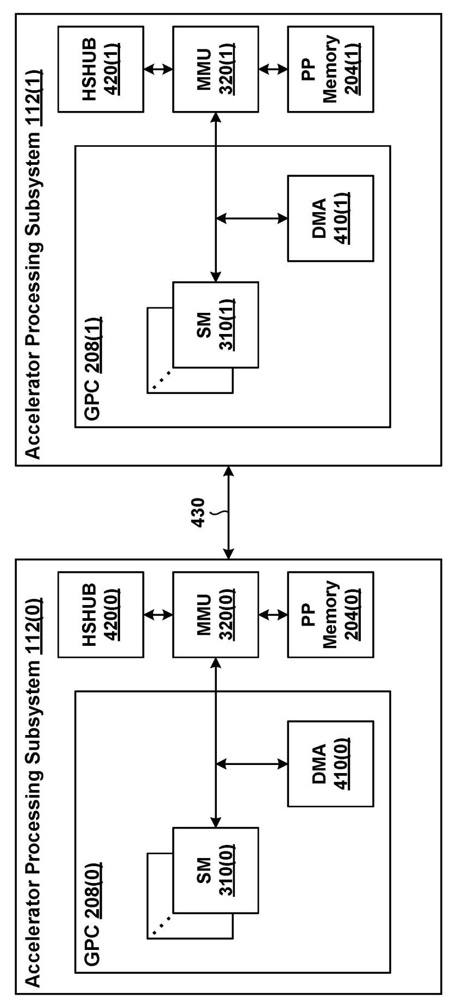
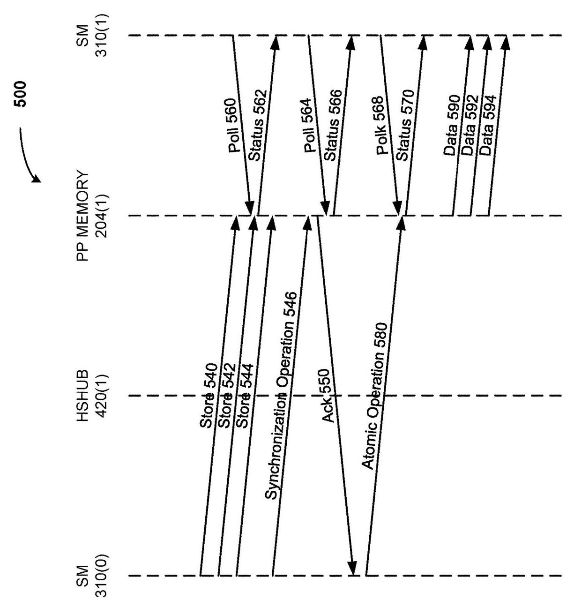
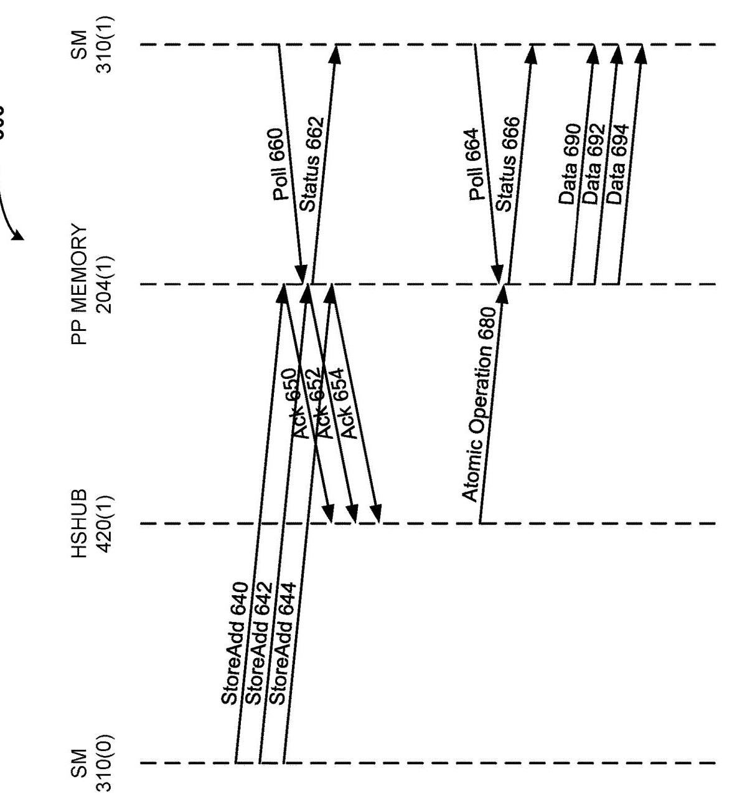
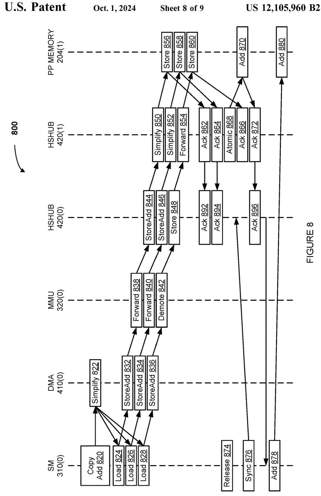
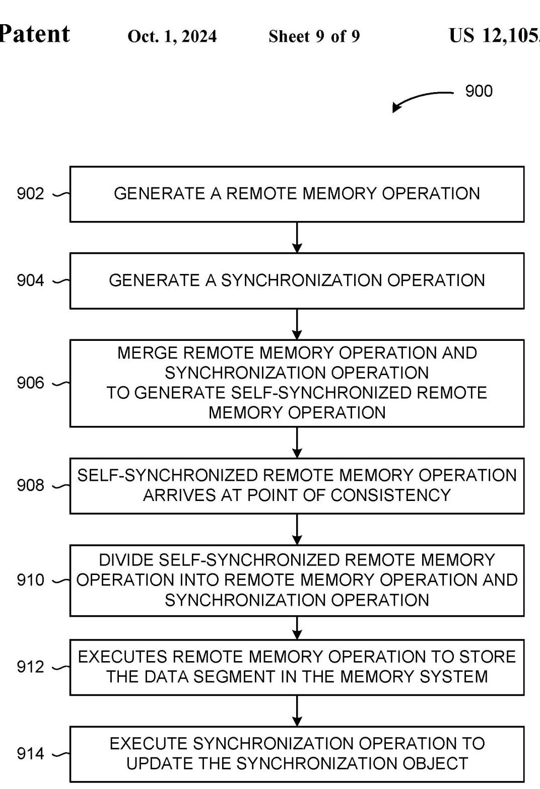

# SELF-SYNCHRONIZING REMOTE MEMORY OPERATIONS IN A MULTIPROCESSOR SYSTEM 深度解读

> **作者/发明人**：Srinivas Santosh Kumar Madugula, Olivier Giroux, Wishwesh Anil Gandhi, Michael Allen Parker, Raghuram L, Ivan Tanasic, Manan Patel, Mark Hummel, Alexander L. Minkin  
> **会议/期刊**：US Patent US 12,105,960 B2, 2024-10-01, Assignee: NVIDIA CORPORATION  
> **一句话总结**：这份专利提出把 remote memory store 与同步对象更新合并为 self-synchronizing remote memory operation，在靠近目的端的 point of consistency 再拆分并强制排序，从而减少跨处理器互连上的同步往返和细粒度同步开销。

## 一、问题定义

这不是一篇传统论文，而是一份面向多处理器/多加速器系统的专利。它关心的问题是：当一个处理单元把数据分段写入另一个处理单元的远端内存时，如何让目的端线程可靠地知道这些远端写入已经可见，同时避免额外的跨互连同步操作。

背景是典型 producer-consumer 数据传输：source processing unit 将一个大块数据拆成多个 segment，通过一系列 remote memory store 写入 destination processing unit 的 memory system。传统做法是在所有 store 之后再发 memory synchronization operation，例如 memory fence、release 或 flag write；destination 侧确认 prior memory operations 已经在相关 scope 可见后返回 acknowledgement；source 再通过 atomic update 更新同步对象。consumer 线程轮询同步对象，等其达到 saturation value 后读取数据。问题在于，这条路径在数据写入之外还需要三类跨互连动作：memory synchronization operation、acknowledgement、atomic operation。专利明确指出，在 multiprocessor system 中互连可能是相对低性能的 network、signal bus 等，因此这些额外动作会显著增加 remote memory synchronization 的延迟，尤其在每个数据段较小时更明显。

已有一个直观替代方案是把 synchronization object 嵌入每个 memory operation，让数据段和同步对象一起原子可见。但这会把可传输的数据段大小限制在网络和内存子系统能够保证 atomic visibility 的最大粒度上。专利给出的例子是：如果最大 atomic visibility 是 128 bytes，而同步对象占 8 bytes，那么同步开销比例就是 8/128；若实际架构只保证 4 bytes 或 8 bytes 的 architectural memory operation size，则即使用 1-byte 同步对象也会有明显开销。另外，512-byte atomic memory operation 中放入 8-byte synchronization object 后，真正 payload 只剩 504 bytes。另一类方案是引入中间 network data processor/NIC 来跟踪 tagged memory operations，但代价是成本、面积、功耗和复杂度，并且仍可能依赖 strict ordering 或 source 发出的 synchronization operation。

**动机评估**：动机是 solid 的。专利没有给实验曲线，但问题链条很清楚：远端小粒度数据写入本身已经受互连延迟约束，再叠加 sync、ack、atomic 会让 synchronization latency 不成比例地放大。它也给出了 atomic embedding 的定量开销例子，说明“把同步信息塞进 payload”并不是免费方案。

**核心 Insight**：关键洞察是，同步对象的更新不一定必须由 source 在收到 ack 之后再单独发起；只要能在目的端附近找到一个可以同时观察数据写入路径和同步对象更新路径的 point of consistency，就可以让 remote memory operation 自带 synchronization metadata，跨互连时保持为一个合并操作，到目的端附近再拆成 store 和 sync update，并保证 store 先于 sync update。这样既保持 consumer 的可见性语义，又把同步解析从 source-remote 往返路径移到了 destination-adjacent 位置。

## 二、相关工作

这份专利的相关工作主要以 prior art problem 的形式出现，而不是以学术引用综述展开。可以整理为三类。

第一类是传统 remote memory synchronization：source 发送多个 store，随后发送 memory fence/release 等同步操作，destination 完成可见性确认后返回 ack，source 再用 atomic operation 更新 flag 或 counter。这类方案语义可靠，适配现有硬件，但同步完成依赖跨互连的额外往返。专利的核心不满是，数据不能被 destination consumer 安全读取，直到 sync、ack、atomic 全部完成。

第二类是 per-operation embedded synchronization：每个 data segment 与一个 synchronization object 一起被原子写入。它把“数据到达”和“同步标记到达”绑定得更紧，但需要同时保证 data segment 与 synchronization object 的 atomic visibility。由于这种可见粒度通常受 cache line、network packet、architectural memory operation size 限制，方案会牺牲 payload efficiency，也会降低 portability。

第三类是 intermediary network data processor/NIC：由网络侧处理器精确标记和跟踪 memory operations，目的端据此更新同步对象。这能把复杂性外移，但需要额外硬件资源，并且可能要求 strict ordering 或仍要求 source 发同步操作。专利的定位是：不引入昂贵复杂的中间处理器，而是利用已有 memory operation 类型和目的端附近的 hub/MMU/DMA 路径完成同步解析。

## 三、技术挑战

**挑战 1：既减少互连操作，又不破坏 memory ordering 语义。** 目的端 consumer 只有在远端 store 对相关 scope 可见之后才能读取数据。如果省掉 source-side synchronization，却没有新的 ordering 点，consumer 可能过早看到同步对象更新。

**挑战 2：同步对象与数据地址可能走向不同内存位置。** self-synchronizing operation 同时携带 data store 和 synchronization metadata，二者最终可能落在不同地址，甚至不同 virtual memory page。若 MMU 每个 memory operation 只能做一次 address translation，就不能无条件支持这种合并操作。

**挑战 3：系统支持能力可能不一致。** 某些 source-destination pair 有共同定义的 point of consistency，另一些没有；某些路径能处理 store/add，另一些只能处理普通 store。方案需要在 partial support 场景下保持正确性，而不是要求全系统同时升级。

**挑战 4：多个 producer 和多个 consumer 会共享同步对象。** 一个数据传输可能由多个 SM 或 accelerator subsystem 共同完成，多个 consumer 也可能轮询同一个同步对象。同步对象因此不能只是一个简单 flag，还要支持 byte count、segment count、barrier count 等语义。

**挑战 5：细粒度同步本身可能造成同步对象更新带宽瓶颈。** 即使省掉 source-side sync，如果每个小 store 都在 destination 侧触发一次 atomic update，同步对象所在 cache line 或 memory location 仍可能成为热点。

## 四、解决方案

### 整体思路

专利提出 self-synchronizing remote memory operation：source processing unit 生成 remote memory operation，同时生成包含 synchronization object 地址/元数据的 synchronization operation，再将二者合并为一个逻辑操作发往 remote memory system。这个合并操作在跨互连传输期间保持不拆分；到达 point of consistency 后，由目的端附近组件（示例中是 remote HSHUB 420(1)）拆成 store operation 和 synchronization operation，并强制 store 先执行、sync update 后执行。这样 consumer 轮询到同步对象更新时，可以推断对应数据段已经写入并可见。

Figure 4 给出了方案依赖的硬件语境：两个 accelerator processing subsystem 通过 interconnect 430 通信，每侧有 SM、DMA、MMU、HSHUB 和 PP memory。关键点不是某个固定 NVIDIA 组件名称，而是路径上存在一个靠近目的端的 hub/一致性点，能在数据写入和同步对象更新分流前建立顺序。

### 贯穿示例

可以把场景想象成 GPU0 的一个 SM 要把 3 个数据块写入 GPU1 的 PP memory，GPU1 的 SM 在等待这些数据做下一步计算。传统做法像是：GPU0 先寄出 3 个包裹，然后再寄一封“我寄完了”的挂号信；GPU1 的仓库收完后回执给 GPU0；GPU0 再单独去公告栏更新“货已到”的标记。GPU1 的消费者只有看到公告栏标记后才拿货。这个流程可靠，但公告动作绕了一大圈。

self-synchronizing 版本则让每个包裹都带一张“到站后请给公告栏加一票”的随附单。包裹跨楼传输时仍是一个整体；到 GPU1 门口的 HSHUB 后，门口工作人员先把包裹放进仓库，再去公告栏加票。3 个包裹如果几乎同时到达，还可以把 3 张随附单合并成一次公告栏更新。GPU1 的消费者看到计数到达目标值时，就知道对应包裹已经入库。

Figure 5 展示传统路径：store 540/542/544 之后还有 synchronization operation 546、ack 550、atomic operation 580，consumer 需要轮询多次，直到 atomic 更新 flag 后才能读取 data 590/592/594。它直观说明了专利要省掉的三段额外互连活动。

Figure 6 是核心对照：store/add 640/642/644 到达远端 HSHUB 后被拆分，store 完成后 HSHUB 将 3 个 add 合并为一次 atomic operation 680。consumer 第二次 poll 就能看到状态 666 并读取数据。这里的重点不是“少一次 poll”这个例子本身，而是同步解析位置从 source 端后处理变成 destination-adjacent 后处理。

### 关键技术点

**1. Point of consistency 是 correctness anchor。** 合并操作必须在某个位置拆开，而这个位置需要能保证两件事：一是数据 store 已经沿着正确路径进入 memory system，二是同步对象更新被排在 store 之后。专利示例选择 remote high-speed hub 420(1)，但也说 point of consistency 可以是 remote computing system 中任何能把 remote memory operation 与 synchronization operation 导向不同 memory locations 的组件。

**2. 同步对象不局限于 binary flag。** 单个 remote memory operation 可以用 binary flag；多个 operations 可以用 byte count 或 data segment count。目的端先确定当前 count 和目标 count，等同步对象达到 target count 后读取数据。这样方案能覆盖单段、小块多段、多 producer 共同传输等场景。

**3. Coalescing 把细粒度同步压力从“每段一次 atomic”降为“多段一次 atomic”。** 专利给出三种合并触发方式：时间窗口/operation count、同一同步对象已有 update pending、source hint 指明后续还有同一同步对象的操作。它们可以组合使用，目标是减少 synchronization object 的 update bandwidth。

**4. Demotion 让 partial support 场景保持正确。** 如果某条路径或某个 source-destination pair 不能处理 self-synchronizing operation，系统可把它降级为普通 non-self-synchronizing remote memory store，再由 source 执行传统 synchronization。若 demotion 导致计数没有达到 target count，则需要 repair synchronization object。

Figure 8 展示了 demotion 的关键边界：store/add 836 因地址翻译等原因被 MMU demote 为普通 store 848/860，而另两个 store/add 仍在远端 HSHUB 处合并为 atomic 868/870。source 侧的 release 874、sync 876、add 878/880 用来补上 demoted store 的同步计数。这说明方案不是“所有操作必须成功自同步”，而是可混合执行并通过 repair 保持 barrier 到达 expected count。

**5. Same-page 限制来自 MMU 翻译能力。** 如果 data target 与 synchronization object 在不同 virtual memory pages，而 MMU 不能为一个 self-synchronizing operation 执行两次 translation，就需要 demote。这个限制把方案的适用范围与具体硬件 address translation 设计绑定起来，是专利中最实际的工程约束之一。

Figure 9 把流程抽象成 902 到 914：生成 remote memory operation，生成 synchronization operation，合并，抵达 point of consistency，拆分，先 store data segment，再 update synchronization object。它是 claims 的方法骨架，也解释了为什么“拆分位置”和“拆分后的顺序”是专利保护范围的核心。

### 与已有方案的对比

相比传统 source-side synchronization，本方案减少了 source 与 destination 之间的显式 sync、ack、atomic 往返，把同步对象更新放到目的端附近完成。相比 embedding synchronization object into payload，它不要求数据段与同步对象作为一个 payload 原子可见，因此可以避免 atomic visibility 粒度限制带来的 payload 浪费。相比 NIC/data processor 跟踪方案，它不依赖昂贵中间处理器，而是把逻辑放在已有 memory operation、MMU/HSHUB/DMA 路径中。

不足也很明确：专利没有给出性能测量，只有流程和架构论证；方案正确性依赖 point of consistency 的硬件语义；在不同页、不同支持能力或 demotion 场景下，需要额外 repair 机制；coalescing 的延迟/吞吐权衡也没有量化。

## 五、实验评估

### 实验设定

本文没有传统意义上的实验评估，没有 benchmark、baseline 实测平台、吞吐/延迟曲线或消融实验。它的“证据”主要来自专利说明中的 sequence diagram 和复杂场景展开：Figure 5 对比传统 non-self-synchronizing 路径，Figure 6 展示 self-synchronizing 路径，Figure 7 展示 DMA/MMU/HSHUB 细节，Figure 8 展示 demotion 和 repair。

### 主要实验与结论

严格说没有实验结论；可以把图示当作 qualitative evaluation。

Figure 5 说明传统方案除 3 个 store 外还需要 memory synchronization operation 546、ack 550 和 atomic operation 580，三者都跨越低性能 interconnect 430。Figure 6 则把 3 个 store/add 发送到 remote HSHUB，由 remote HSHUB 在 store 完成后 coalesce 为单个 atomic operation 680。由此专利声称避免了 source SM 与 remote SM 之间的 3 个额外互连事务，并因 coalescing 将 3 个同步更新合并成 1 个 atomic update。

Figure 7 进一步说明在 DMA copy/add 中，DMA 先将 copy/add 简化为 load 和 store/add，MMU 做地址翻译，remote HSHUB 再把 store/add 拆成 store 与 add；若没有 demotion，source 侧用于兜底的 sync 776 会快速 resolve。Figure 8 则说明如果某个 store/add 被 demote，source 侧 sync 876 会等待 demoted store 的 ack，再通过 add 878/880 修复 barrier。

### 结论支撑性分析

这些图示足以支撑“机制上可以减少跨互连同步操作”和“可以处理 demotion”的定性声明，但不足以支撑具体性能收益。专利没有说明 interconnect latency、HSHUB atomic latency、coalescing window 的等待代价、同步对象热点程度，也没有给出不同 segment size 下的收益曲线。因此报告中应把它理解为一种硬件机制与专利权利要求，而不是已被实验验证的系统论文。

## 六、附加洞察

**结论 1**：同步对象可以同时承担 completion counter 和 barrier 的角色。  
- *出处*：Self-Synchronizing Remote Memory Operations, pages 14-15  
- *推理链条*：作者先说明多个 remote memory operations 可用 byte count 或 segment count 表示完成度，再扩展到多个 producer 线程 decrement target count、self-synchronizing memory operations increment target count，consumer 等待 thread count 与 target count 条件同时满足；因此同步对象不只是通知 flag，而可以表达多线程 barrier 与数据可见性完成条件。

**结论 2**：partial support 不需要阻止全局使用 self-synchronizing operations。  
- *出处*：Self-Synchronizing Remote Memory Operations, pages 15-17  
- *推理链条*：作者观察到不同 source-destination pair 可能没有共同 point of consistency，于是允许路径中任一点 demote 为普通 remote store；再用可靠/不可靠双组件计数或 NACK-based source tracking 修复同步对象；因此系统可以在支持路径上获得低开销，在不支持路径上退回传统正确性。

**结论 3**：MMU 翻译能力是方案能否透明应用的重要边界。  
- *出处*：Self-Synchronizing Remote Memory Operations, page 17; Claim 7  
- *推理链条*：self-synchronizing operation 可能同时涉及 data address 和 synchronization-object address；若二者在不同 virtual pages，而 MMU 一次只能翻译一个 operation 地址，就无法保持单个合并操作的硬件处理模型；因此专利把 same physical page 或 demotion 作为解决路径。

**结论 4**：coalescing 的触发策略可以利用时间、pending 状态或 source hint。  
- *出处*：Self-Synchronizing Remote Memory Operations, pages 17-18; Claims 8-11  
- *推理链条*：作者指出多个 self-synchronizing operations 可能几乎同时抵达 point of consistency，且指向同一 synchronization object；在这种情况下用时间窗口、pending update 或 metadata hint 预测后续操作，可把多个 add 合成一次更新；因此方案不仅减少互连事务，还试图降低目的端同步对象的 atomic bandwidth 压力。

**结论 5**：hardware repair 可以用单一 barrier 简化软件，但不会消除 demotion 情况下的延迟成本。  
- *出处*：Figure 8 说明段落, page 23  
- *推理链条*：作者先给出 software repair：source 通过 release/sync/add 补上 demoted operation 的计数；再给出 hardware repair：demoted request 以 NACK 返回，SM 记录并累积 NACK，统一执行 barrier update。这样软件只看一个 barrier，但作者也承认如果 demotion 发生，latency 与 software-based repair comparable；因此硬件修复降低软件复杂性，不等价于消除 fallback 成本。

## 七、总结与评价

这份专利的核心贡献是把 remote memory store 与同步对象更新合并为一个可跨互连传输的 self-synchronizing operation，并在目的端附近的 point of consistency 拆分、排序和合并同步更新。它的技术亮点在于定位很工程化：没有试图把同步对象塞进 payload 里做原子可见，也没有要求额外 NIC 负责全局跟踪，而是把同步解析挪到已有 memory path 的靠近目的端位置。

最大不足是缺少实证评估。专利中“减少 inter-processor communications”和“提高 performance”的说法在机制上合理，但实际收益取决于 interconnect latency、remote hub 处理能力、atomic hotspot、coalescing 等待窗口、demotion 频率和 MMU 支持情况。作为系统设计启发，它说明了一个很有价值的原则：在分布式/多加速器内存系统中，完成通知最好尽量在数据可见性的最近可信点生成，而不是回到 producer 后再绕一圈。

## 八、章节脉络与段落速览

- **Front Matter / Abstract**：交代专利号、发明人、NVIDIA 归属、20 个 claims 和 9 张图，并摘要说明 source 将 remote memory operation 与 synchronization metadata 一起发送，destination 再拆分执行以减少通信。
  - ¶1 专利元数据说明这是 NVIDIA 在 2024 年授权的 self-synchronizing remote memory operation 专利。
  - ¶2 Abstract 概括核心机制：每个数据段对应的 remote operation 携带同步对象位置 metadata，作为单元传输，到目的端拆成 memory operation 和 synchronization operation。

- **BACKGROUND / Field of the Various Embodiments**：限定领域为 multiprocessor system 中的 self-synchronizing remote memory operations。
  - ¶1 说明本文属于 computer system architectures，重点是多处理器系统里的远端内存操作同步。

- **Description of the Related Art**：描述传统 remote memory transfer 与同步开销，并提出现有替代方案的局限。
  - ¶1 介绍处理单元、memory system、compute task 和 load/store 的基本背景。
  - ¶2 说明 source 将大块数据拆成多个 segment，用多次 remote memory operations 写到 destination memory。
  - ¶3 说明传统 synchronization operation、acknowledgement、atomic update 和 consumer polling 的完整流程。
  - ¶4 指出该流程在低性能 interconnect 上额外产生 sync、ack、atomic 三类操作，增加整体同步延迟。
  - ¶5-7 讨论把 synchronization object 嵌入每次 memory operation 的方案，并指出 atomic visibility 粒度和 payload 浪费问题。
  - ¶8-9 讨论使用 intermediary network data processor/NIC 的方案，并指出成本、功耗、strict ordering 和 source synchronization 依赖。
  - ¶10 总结需求：需要更有效的 remote memory operation 技术。

- **SUMMARY**：给出专利方法、系统和技术优势的高层概述。
  - ¶1 描述方法步骤：合并 store 与 synchronization operation，传输，到 point of consistency，拆分，store data，再更新 synchronization object，并支持 coalescing 和 partial support。
  - ¶2 说明 embodiments 可覆盖 system、computer readable media 和 method。
  - ¶3 归纳技术优势：同步在靠近 destination 的位置解析，减少跨处理器互连操作，并避免复杂 network data processor。

- **BRIEF DESCRIPTION OF THE DRAWINGS**：列出 Figure 1-9 各自展示的系统、处理器结构、操作序列和方法流程。
  - ¶1 说明附图只是典型实施例，不限制权利范围。
  - ¶2-10 逐一标明 Figure 1 到 Figure 9 的主题，从 computer system、PPU/GPC 到 self-synchronizing sequence 和 method flow。

- **DETAILED DESCRIPTION / System Overview**：用通用 GPU/PPU 系统背景铺垫方案落点。
  - ¶1 说明详细描述包含具体实现细节，但实施不一定依赖所有细节。
  - ¶2-6 解释 computer system 100 的 CPU、system memory、memory bridge、I/O bridge、switch、network adapter、system disk 等组成。
  - ¶7-9 说明 accelerator processing subsystem 可是 GPU/PPU，也可与 CPU 或其他连接电路集成。
  - ¶10-18 介绍 PPU 202、PP memory 204、I/O unit、front end、task/work unit、GPC、memory interface、partition unit、DRAM 和 crossbar 的常规结构。
  - ¶19-26 介绍 GPC/SM/SIMT、thread group、CTA、L1/L1.5/L2/global memory、MMU 和 texture/preROP 等组件。
  - ¶27-28 说明图示架构只是示例，shared memory 和 cache memory 的引用有宽泛含义。

- **Self-Synchronizing Remote Memory Operations**：这是核心章节，定义合并操作、point of consistency、同步对象类型、partial support、demotion 和 coalescing。
  - ¶1 概述 self-synchronizing remote memory operation：operation 携带同步对象 metadata，到 destination-adjacent point of consistency 拆分并排序。
  - ¶2-5 结合 Figure 4 描述两个 accelerator processing subsystem、SM、DMA、MMU、HSHUB、PP memory 和 interconnect 430。
  - ¶6-8 描述普通 remote store 的路径，以及 DMA 如何把大块 transfer 拆为多个 remote memory operations。
  - ¶9-10 说明 self-synchronizing operation 的生成、合并、传输、到达 point of consistency 后拆分为 store 和 synchronization update。
  - ¶11-13 说明 synchronization object 可为 binary flag、byte count 或 segment count。
  - ¶14-16 扩展到多个 producer SM 和多个 consumer SM 共享同一同步对象。
  - ¶17 说明同步对象还可作为 barrier，包含 thread count 与 target count。
  - ¶18-22 说明 partial support、opportunistic demotion、reliable/unreliable counter、NACK-based tracking 和 repair。
  - ¶23 说明 same-page/address-translation 限制及由此触发的 demotion。
  - ¶24-27 说明 coalescing：按时间窗口、pending update 或 source hint 合并多个 synchronization operations。
  - ¶28 说明该方案不限于两个 accelerator subsystem，也可应用于 CPU、GPU、DMA、IPU、NPU、TPU、DPU、FPGA 等组合。

- **Figure 5 / Figure 6 sequence discussion**：通过对比序列图说明传统同步和 self-synchronizing 同步的通信差异。
  - ¶1-4 Figure 5 描述传统 3 个 store 后还需要 synchronization operation、ack 和 atomic operation，consumer 多次 poll 才能读取。
  - ¶5 Figure 5 总结传统路径的额外互连开销。
  - ¶6-9 Figure 6 描述 store/add 到达 remote HSHUB 后拆分，store 完成 ack 后合并 add 为一次 atomic operation。
  - ¶10 Figure 6 总结 source 不再生成单独 synchronization operation，并通过 coalescing 减少同步对象更新。

- **Figure 7 / Figure 8 detailed sequence discussion**：展示 DMA/MMU/HSHUB 细节和 demotion 情况。
  - ¶1-4 Figure 7 描述 copy/add 经 DMA simplify、local loads、store/add generation、MMU translation、HSHUB forwarding 到 remote HSHUB。
  - ¶5-7 Figure 7 描述 remote HSHUB 拆分 store/add、store 先执行、add 合并为 atomic，并返回 acknowledgement。
  - ¶8 Figure 7 说明没有 demotion 时，source 侧兜底 sync 快速完成。
  - ¶9-11 Figure 8 描述三段 store/add 中一个因不同 page 等原因被 MMU demote 为普通 store。
  - ¶12-14 Figure 8 描述未 demote 的 store/add 仍由 remote HSHUB 拆分并合并 atomic，被 demote 的 store 走普通路径。
  - ¶15 Figure 8 说明 source 侧 release/sync/add 会等待 demoted store 并修复完成标记。
  - ¶16 说明 hardware repair 方案用 NACK 记录 demoted requests，统一累积为 barrier update。

- **Figure 9 / Method 900**：把机制总结为权利要求式流程。
  - ¶1 说明 method 900 可由多种 accelerator 或 processor 实现。
  - ¶2 step 902 生成指向 remote memory system 的 remote memory operation。
  - ¶3-5 step 904 生成 synchronization operation，支持 binary flag、byte count 或 segment count。
  - ¶6 step 906 合并 remote memory operation 和 synchronization operation。
  - ¶7 step 908 到达 point of consistency。
  - ¶8 step 910 在 point of consistency 拆分并规定 store 先于 synchronization update。
  - ¶9 step 912 执行 remote memory operation 存储数据段。
  - ¶10 step 914 根据 flag/count/segment count 更新 synchronization object。
  - ¶11-12 总结该方法降低 network latency/bandwidth overhead，并通过 coalescing 进一步减少细粒度同步开销。

- **Boilerplate / Claims**：给出专利保护范围和标准法律文本。
  - ¶1-7 说明实施例可有修改，可体现为 system、method 或 computer program product，并解释 flowchart/block diagram 的一般性。
  - ¶8 Claim 1 定义核心方法：生成 self-synchronizing memory store operation、传输、到 point of consistency、拆分、store data、update synchronization object。
  - ¶9-12 Claims 2-5 细化同步对象可为 binary flag、operation count、byte count，并覆盖 demoted operation 的计数修复。
  - ¶13-19 Claims 6-12 覆盖第二个 self-synchronizing operation、demotion、same/different page 判断、coalescing 条件和 hub 作为 point of consistency。
  - ¶20-28 Claims 13-20 将方法映射为系统权利要求，覆盖多 processor、多个 consumer、不同同步对象类型和 demotion 场景。
