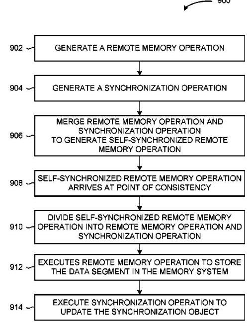
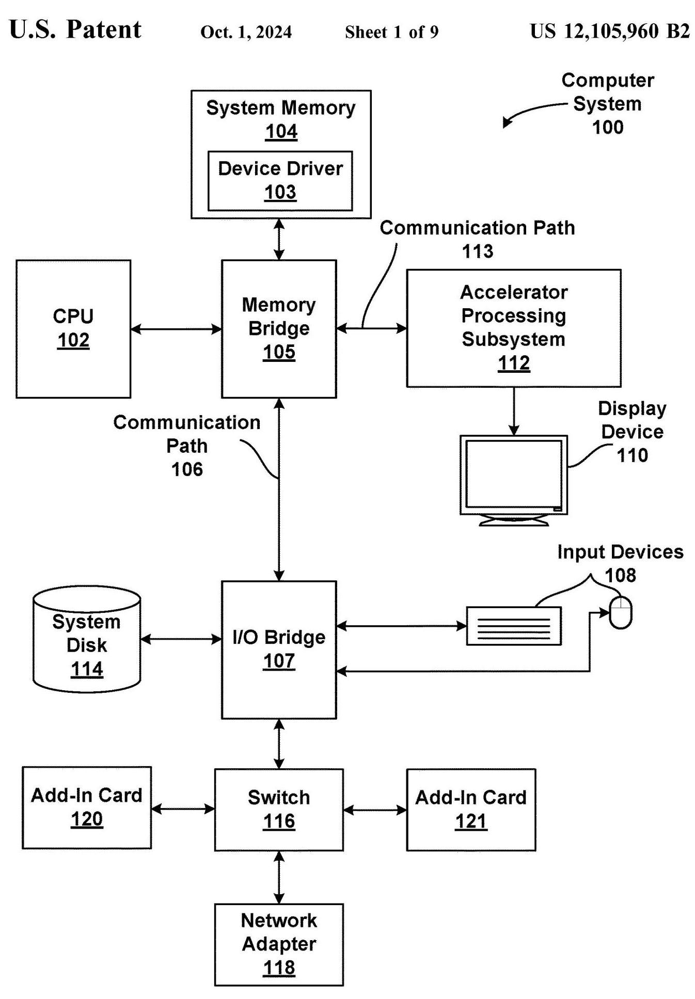
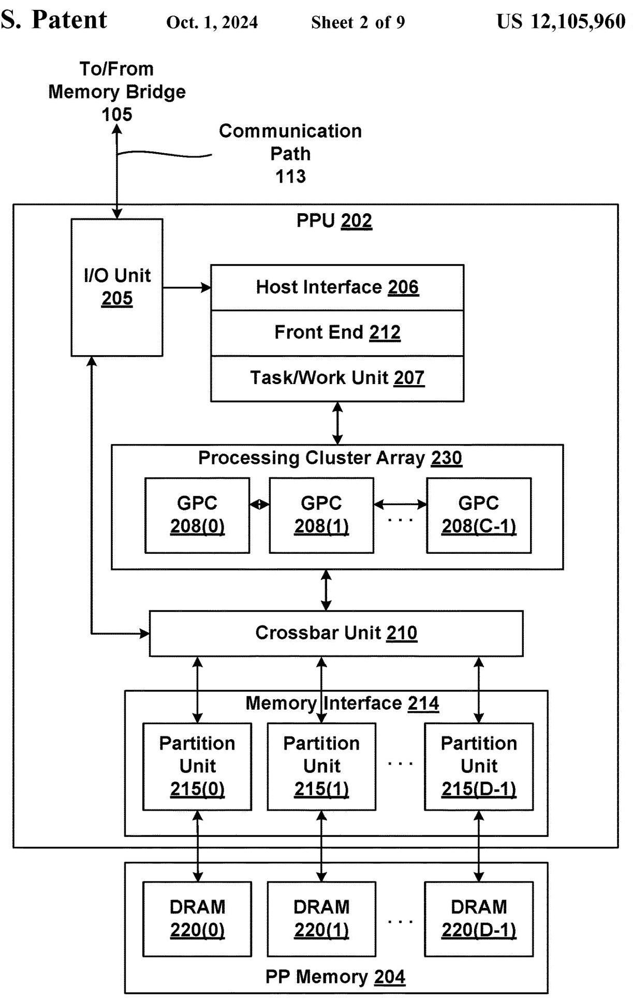
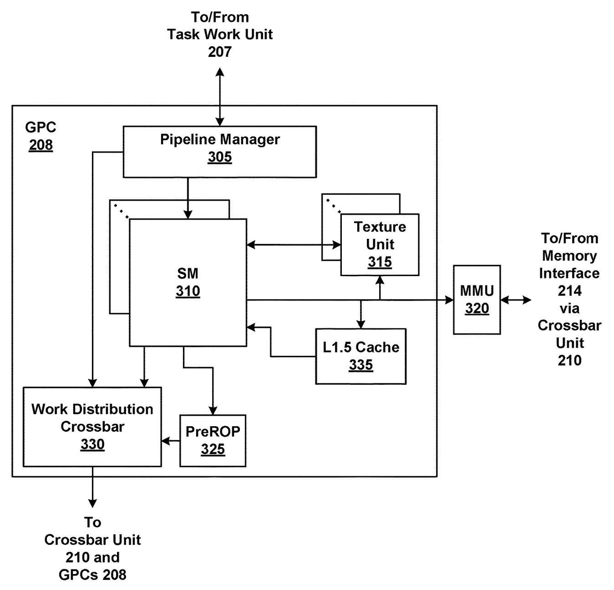
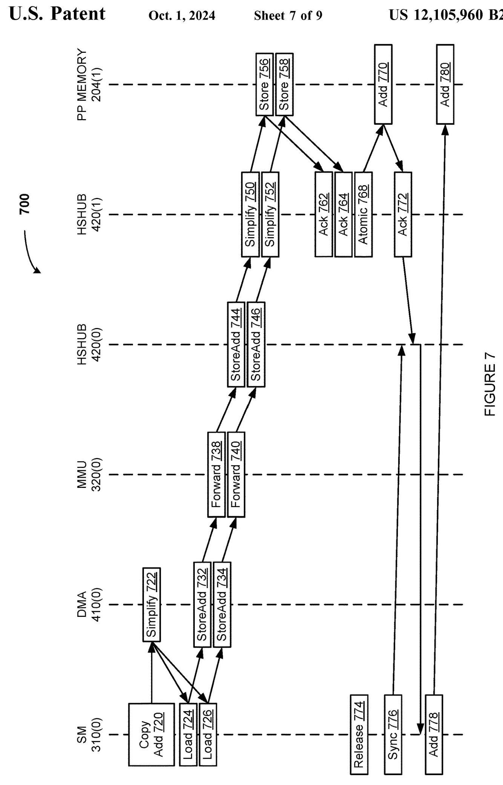

(12) United States Patent

> 
(12) 美国专利

Madugula et al.

> 
马杜古拉等人

## (54) SELF-SYNCHRONIZING REMOTE MEMORY OPERATIONS IN A MULTIPROCESSOR SYSTEM

(71) Applicant: NVIDIA CORPORATION, Santa

> 
申请人：英伟达公司，圣

Clara, CA (US)

> 
美国加利福尼亚州克拉拉

(72) Inventors: Srinivas Santosh Kumar Madugula, Visakhapatnam (IN); Olivier Giroux, Santa Clara, CA (US); Wishwesh Anil Gandhi, Sunnyvale, CA (US); Michael Allen Parker, San Jose, CA (US); Raghuram L, Bangalore (IN); Ivan Tanasic, San Francisco, CA (US); Manan Patel, San Jose, CA (US); Mark Hummel, Franklin, MA (US); Alexander L. Minkin, Los Altos, CA (US)

> 
(72) 发明人：斯里尼瓦斯·桑托什·库马尔·马杜古拉，维沙卡帕特南（印度）；奥利维尔·吉鲁，加利福尼亚州圣克拉拉（美国）；维什韦什·阿尼尔·甘地，加利福尼亚州森尼维尔（美国）；迈克尔·艾伦·帕克，加利福尼亚州圣何塞（美国）；拉古拉姆·L，班加罗尔（印度）；伊万·塔纳西奇，加利福尼亚州旧金山（美国）；马南·帕特尔，加利福尼亚州圣何塞（美国）；马克·赫梅尔，马萨诸塞州富兰克林（美国）；亚历山大·L·明金，加利福尼亚州洛斯阿尔托斯（美国）

(73) Assignee: NVIDIA CORPORATION, Santa Clara, CA (US)

> 
(73) 专利权人：NVIDIA CORPORATION, Santa Clara, CA (US)

(*) Notice: Subject to any disclaimer, the term of this patent is extended or adjusted under 35 U.S.C. 154(b) by 119 days.

> 
(*) 声明：在不违反任何免责声明的前提下，本专利的期限已根据35 U.S.C. 154(b)延长或调整119天。

(21) Appl. No.: 17/900,808

> 
(21) 申请号：17/900,808

(22) Filed: Aug. 31, 2022

> 
(22) 提交: Aug. 31, 2022

(65) Prior Publication Data

> 
（65）在先公开数据

US 2024/0069736 A1 Feb. 29, 2024

> 
US 2024/0069736 A1 2024年2月29日

(51) Int. Cl.

> 
(51) 国际专利分类

G06F 3/06 (2006.01)

> 
G06F 3/06 (2006.01)

(52) U.S. Cl.

> 
(52) 美国分类

CPC ......... G06F 3/0611 (2013.01); G06F 3/0659

> 
CPC ......... G06F 3/0611 (2013.01); G06F 3/0659

(2013.01); G06F 3/0673 (2013.01)

> 
(2013.01); G06F 3/0673 (2013.01)

(10) Patent No.: US 12,105,960 B2

> 
(10) 专利号：US 12,105,960 B2

(45) Date of Patent: Oct. 1, 2024

> 
(45) 专利日期: 2024年10月1日

(58) Field of Classification Search

> 
(58) 分类检索领域

CPC .... G06F 3/0611; G06F 3/0659; G06F 3/0673;

> 
CPC .... G06F 3/0611; G06F 3/0659; G06F 3/0673;

G06F 9/52; G06F 9/46; G06F 9/466;

> 
G06F 9/52; G06F 9/46; G06F 9/466;

G06F 9/5027

> 
G06F 9/5027

See application file for complete search history.

> 
完整的检索历史参见申请文件。

(56) References Cited

> 
(56) 参考文献

### U.S. PATENT DOCUMENTS

2018/0225208 A1* 8/2018 Fukuyama ......... G06F 9/30043

> 
2018/0225208 A1* 8/2018 Fukuyama ......... G06F 9/30043

2020/0401461 A1* 12/2020 Verrilli ........................ G06F 9/52

> 
2020/0401461 A1* 12/2020 Verrilli ........................ G06F 9/52

2021/0117248 A1* 4/2021 Wong ........................ G06F 9/52

> 
2021/0117248 A1* 2021年4月 Wong ........................ G06F 9/52

2022/0197719 A1* 6/2022 Gurtovoy .................. G06F 9/4881

> 
2022/0197719 A1* 6/2022 古尔托沃伊 .................. G06F 9/4881

2023/0116156 A1* 4/2023 Byun ............... G06F 16/9024

> 
2023/0116156 A1* 4/2023 Byun ............... G06F 16/9024

711/167

> 
711/167

* cited by examiner

> 
* 被审查员引用

Primary Examiner - Tracy A Warren

> 
主审员 - Tracy A Warren

(74) Attorney, Agent, or Firm - Squire Patton Boggs LLP; Sarah Mirza

> 
(74) 律师、代理人或事务所 - Squire Patton Boggs LLP；Sarah Mirza

## (57) ABSTRACT

Various embodiments include techniques for performing self-synchronizing remote memory operations in a multiprocessor computing system. During a remote memory operation in the multiprocessor computing system, a source processing unit transmits multiple segments of data to a destination processing. For each segment of data, the source processing unit transmits a remote memory operation to the destination processing unit that includes associated metadata that identifies the memory location of a corresponding synchronization object. The remote memory operation along with the metadata is transmitted as a single unit to the destination processing unit. The destination processing unit splits the operation into the remote memory operation and the memory synchronization operation. As a result, the source processing unit avoids the need to perform a separate memory synchronization operation, thereby reducing inter-processor communications and increasing performance of remote memory operations.

> 
多个实施例包括用于在多处理器计算系统中执行自同步远程内存操作的技术。在多处理器计算系统执行远程内存操作期间，源处理单元向目标处理单元传输多段数据。对于每个数据段，源处理单元向目标处理单元传输一个远程内存操作，该操作包含关联的元数据，该元数据标识对应同步对象的内存位置。该远程内存操作连同元数据作为单个单元传输至目标处理单元。目标处理单元将该操作拆分为远程内存操作与内存同步操作。由此，源处理单元避免了执行单独的内存同步操作的需求，从而减少了处理器间通信并提升了远程内存操作的性能。

20 Claims, 9 Drawing Sheets

> 
20项权利要求，9张附图

FIGURE 1

> 
图1

FIGURE 2

> 
图2

US 12,105,960 B2

> 
美国 12,105,960 B2

## 1 SELF-SYNCHRONIZING REMOTE MEMORY OPERATIONS IN A MULTIPROCESSOR SYSTEM

## BACKGROUND

Field of the Various Embodiments

> 
诸化身之域

Various embodiments relate generally to computer system architectures and, more specifically, to self-synchronizing remote memory operations in a multiprocessor system.

> 
各种实施例一般涉及计算机系统架构，更具体地，涉及多处理器系统中的自同步远程内存操作。

## Description of the Related Art

A computing system generally includes, among other things, one or more processing units, such as central processing units (CPUs) and/or graphics processing units (CPUs), and one or more memory systems. Processing units execute user mode software applications, which submit and launch compute tasks, executing on one or more compute engines included in the processing units. In operation, processing units load data from the one or more memory systems, perform various arithmetic and logical operations on the data, and store data back to the one or more memory systems.

> 
一个计算系统通常包括，除其他部件外，一个或多个处理单元，例如中央处理单元（CPUs）和/或图形处理单元（CPUs），以及一个或多个内存系统。处理单元执行用户模式的软件应用程序，这些应用程序提交并启动计算任务，在处理单元内包含的一个或多个计算引擎上执行。在操作中，处理单元从所述一个或多个内存系统加载数据，对数据执行各种算术和逻辑操作，并将数据存储回所述一个或多个内存系统。

In a multiprocessor system, certain tasks involve transferring data between different processing units by performing remote memory operations. For example, a first processing unit (source) can transfer a block of data to a second processing unit (destination) by storing the block of data to a memory system associated with the second processing unit. If the block of data is too large to be transferred in a single memory operation, the first processing unit divides the block of data into multiple segments where each segment can be transferred in a single memory operation. The first processing unit issues a series of memory operations, one for each segment, to store the data in the memory system associated with the second processing unit. After issuing the series of memory operations, the first processing unit issues a memory synchronization operation, such as a memory fence, followed by a flag write or a release operation. The memory synchronization operation is a synchronization mechanism that ensures the series of memory operations are visible to all participating threads at a given scope, such as system scope or processor scope.

> 
在多处理器系统中，某些任务涉及通过执行远程内存操作在不同处理单元之间传输数据。例如，第一处理单元（源端）可以通过将数据块存储到与第二处理单元（目标端）关联的内存系统中，来将该数据块传输给第二处理单元。如果数据块过大无法在单次内存操作中完成传输，第一处理单元会将其分割为多个数据段，每个数据段均可在单次内存操作中传输。第一处理单元会针对每个数据段发起一系列内存操作，将数据存储到与第二处理单元关联的内存系统中。在发起这一系列内存操作后，第一处理单元会执行内存同步操作（如内存栅栏），随后进行标志写入或释放操作。该内存同步操作是一种同步机制，可确保在给定范围内（如系统范围或处理器范围）所有参与线程均能观测到这一系列内存操作。

In response to the memory synchronization operation from a given producer, the second processing unit acknowledges the completion of the synchronization operation after ensuring that all prior memory operations are visible at the relevant scope. The second processing unit transmits an acknowledgement to the first processing unit to indicate that the series of memory operations have completed, and the memory synchronization operation has been resolved. In response to the acknowledgement, the producer of the memory operation notifies the completion of memory synchronization through a synchronization object, such as a flag. If multiple producers are synchronizing on the same a synchronization object, then the synchronization object can be atomically updated. One or more consumer threads in the remote processing unit poll the synchronization object and wait for the synchronization object to a reach a specific value, referred to as a saturation value. The condition of the synchronization object reaching the saturation value indicates the completion of all associated memory operations. Upon detecting that the synchronization object has reached

> 
响应来自给定生产者的内存同步操作，第二处理单元在确保所有先前内存操作在相关范围内可见后，确认同步操作完成。第二处理单元向第一处理单元发送确认，指示该系列内存操作已完成，且内存同步操作已解决。响应此确认，内存操作的生产者通过同步对象（如标志）通知内存同步完成。若多个生产者正针对同一同步对象进行同步，则该同步对象可被原子更新。远程处理单元中的一个或多个消费者线程轮询该同步对象，并等待同步对象达到特定值，即饱和值。同步对象达到饱和值这一条件，表明所有关联内存操作已完成。一旦检测到同步对象已达到

2 the saturation value, the consumer threads can reliably access the data stored in the memory system by the first processing unit.

> 
2 达到饱和值时，消费者线程可以可靠地访问第一处理单元存储在内存系统中的数据。

One problem with this technique for transferring data 5 between processing units is that processing units in a multiprocessor system are typically connected with one another via a relatively low performance interconnect, such as a network system, a signal bus system, and/or the like. Further, in addition to the series of memory operations to 10 transfer the data, three additional operations are performed across this low performance interconnect: the memory synchronization operation, the acknowledgement, and the atomic operation. The data cannot be reliably loaded by the second processing unit until these three additional opera- 15 tions complete, thereby adding significant latency to the overall remote memory synchronization, especially if the data in these memory operations is relatively small.

> 
这种在处理单元之间传输数据 5 的技术存在一个问题：多处理器系统中的处理单元通常通过性能相对较低的互连（例如网络系统、信号总线系统和/或类似物）彼此连接。此外，除了用于 10 传输数据的一系列内存操作之外，还会通过此低性能互连执行三项额外操作：内存同步操作、确认和原子操作。在这三项额外 opera- 15 tions 完成之前，第二处理单元无法可靠地加载数据，从而为整个远程内存同步增加了显著的延迟，特别是当这些内存操作中的数据相对较小时。

One potential solution to this problem is to embed a synchronization object with each memory operation that 20 includes a segment of data. With this potential solution, the first processing unit performs a series of memory operations, where each memory operation includes a segment of data and a synchronization object. The memory operation stores the segment of data and atomically sets the synchronization

> 
此问题的一个潜在解决方案是在每个包含数据段的内存操作（20）中嵌入一个同步对象。采用这种潜在解决方案，第一个处理单元执行一系列内存操作，每个内存操作包含一个数据段和一个同步对象。该内存操作存储数据段，并原子性地设置同步。

25 object. Once the second processing unit has determined that all of the synchronization objects have been set, the second processing unit can reliably load the data. One problem with this approach is that the size of each segment transferred in a memory operation is limited by the maximum data size, as

> 
25 对象。一旦第二个处理单元确定所有同步对象都已被设置，第二个处理单元就可以可靠地加载数据。这种方法的一个问题是，在内存操作中传输的每个段的大小受到最大数据大小的限制，因为

supported by the network and the associated memory subsystem, that can be guaranteed to be atomically visible, i.e., both the segment of data and synchronization object are atomically visible to the consumer threads. to the maximum data allowed for atomic operations. The guarantee of such

> 
由网络及相关内存子系统支持，可保证原子可见性，即数据段和同步对象对消费者线程都是原子可见的。达到原子操作允许的最大数据量。这种保证

85 atomicity is typically limited to minimum of the cache line size, the minimum packet size in the network, or the architectural memory operation size. For example, if the maximum size for atomic visibility is 128 bytes, and the synchronization object is 8 bytes, then the synchronization

> 
85 原子性通常受限于缓存行大小、网络最小数据包大小或架构内存操作大小的最小值。例如，若原子可见性的最大大小为 128 字节，而同步对象为 8 字节，则同步

40 overhead accounts for an overhead ratio of 8/128. In typical processors, such atomicity is guaranteed only up to an architectural memory operation size, which is typically 4 bytes and/or 8 bytes. This limitation results in significant overhead even with a 1-byte synchronization object. Further,

> 
40 开销的开销比率为 8/128。在典型处理器中，这种原子性仅保证在架构内存操作大小范围内，通常为 4 字节和/或 8 字节。这一限制导致即使使用 1 字节的同步对象也会产生显著的开销。此外，

5 any synchronization object size beyond these values is implementation specific and therefore not portable. Transmitting data in smaller segments is typically less efficient than transmitting data in larger segments. Further, a portion of the payload for each memory operation is reserved for the 50 synchronization object. For example, a 512-byte atomic memory operation that includes an 8-byte synchronization object has a remaining payload of only 504 bytes for data. These inefficiencies can result in decreased performance.

> 
5 任何超出这些值的同步对象大小都是实现特定的，因此不可移植。以较小段传输数据通常比以较大段传输数据效率更低。此外，每个内存操作的一部分有效负载被保留给 50 个同步对象。例如，一个包含 8 字节同步对象的 512 字节原子内存操作，只剩下 504 字节的数据有效负载。这些低效率可能导致性能下降。

Another potential solution to this problem is to process 55 memory operations via an intermediary network data processor, such as a network interface controller (NIC), situated between the two processing units. The network data processor provides a mechanism for the first processing unit and the second processing unit to precisely define and tag individual memory operations. As a result, the second processing unit can keep track of the completion of the memory operations for a given source-destination pair and update the synchronization object accordingly. One problem with this approach is that network data processors can be expensive in

> 
解决此问题的另一种潜在方法是，通过一个位于两个处理单元之间的中间网络数据处理器（例如网络接口控制器 (NIC)）来处理 55 个内存操作。该网络数据处理器为第一处理单元和第二处理单元提供了一种机制，能够精确地定义和标记每个单独的内存操作。因此，第二处理单元能够跟踪给定源-目的地对的内存操作的完成情况，并相应地更新同步对象。这种方法的一个问题是，网络数据处理器可能很昂贵在

5 terms of cost, surface area, power consumption, and/or the like. In addition, some network data processors rely either on strict ordering execution of memory operations and/or a

> 
5个成本、表面积、功耗等类似方面的术语。此外，一些网络数据处理器要么依赖严格顺序执行内存操作，和/或一个

3

> 
3

memory synchronization operation issued by the source. These requirements can be cumbersome to manage. Further, requiring a memory synchronization operation from the source can lead to reduced performance, as described above.

> 
由源发出的内存同步操作。这些要求可能难以管理。此外，要求源执行内存同步操作可能导致性能降低，如上所述。

As the foregoing illustrates, what is needed in the art are more effective techniques for performing remote memory operations in a computing system.

> 
正如前文所述，本领域需要的是在计算系统中执行远程内存操作的更有效技术。

## SUMMARY

Various embodiments of the present disclosure set forth a computer-implemented method for performing remote memory operations in a computing system. The method includes merging a first memory store operation and a first synchronization operation to generate a first self-synchronizing memory store operation. The method further includes transmitting the first self-synchronizing memory store operation to a memory system. The method further includes determining that the first self-synchronizing memory store operation has arrived at a point of consistency in a remote computing system. The method further includes dividing, at the point of consistency, the first self-synchronizing memory store operation into the first memory store operation and the first synchronization operation. The method further includes storing data included in the first memory store operation at a first location in the memory system. The method further includes updating a first synchronization object specified by the first synchronization operation, wherein the first synchronization object is stored at a second location in the memory system. The method further includes opportunistically coalescing synchronization operations to the same synchronization object, thereby reducing the number of required updates to the synchronization object and additional memory bandwidth associated with such fine-grained synchronization. The method further includes accommodating systems that partially support self-synchronizing remote memory operations depending on various constraints.

> 
本公开的各种实施例阐述了一种在计算系统中执行远程内存操作的计算机实现方法。该方法包括将第一内存存储操作与第一同步操作合并，以生成第一自同步内存存储操作。该方法还包括将第一自同步内存存储操作传输至内存系统。该方法还包括确定第一自同步内存存储操作已到达远程计算系统中的一致性点。该方法还包括在该一致性点处，将第一自同步内存存储操作划分为第一内存存储操作和第一同步操作。该方法还包括将第一内存存储操作中包含的数据存储在内存系统中的第一位置。该方法还包括更新由第一同步操作指定的第一同步对象，其中该第一同步对象存储在内存系统中的第二位置。该方法还包括机会性地合并针对同一同步对象的同步操作，从而减少对该同步对象所需的更新次数以及与这种细粒度同步相关的额外内存带宽。该方法还包括适应根据各种约束而部分支持自同步远程内存操作的系统。

Other embodiments include, without limitation, a system that implements one or more aspects of the disclosed techniques, and one or more computer readable media including instructions for performing one or more aspects of the disclosed techniques, as well as a method for performing one or more aspects of the disclosed techniques.

> 
其他实施例包括但不限于实现所公开技术的一个或多个方面的系统、包含用于执行所公开技术的一个或多个方面的指令的一个或多个计算机可读介质、以及用于执行所公开技术的一个或多个方面的方法。

At least one technical advantage of the disclosed techniques relative to the prior art is that, with the disclosed techniques, memory synchronization operations are resolved closer to the destination processing unit, thereby reducing the number of operations performed over the interconnect between processors. As a result, operating performance is increased relative to prior approaches. Another advantage of the disclosed techniques is that the disclosed techniques do not require an expensive and complex network data processor to perform remote memory operations. Instead, the disclosed techniques leverage existing memory operation types and do not rely on any explicit ordering of memory operations, leading to higher efficiency and performance for remote memory operations. These advantages represent one or more technological improvements over prior art approaches.

> 
所公开技术相对于现有技术的至少一个技术优势在于，利用所公开技术，内存同步操作在更靠近目标处理单元处被解决，从而减少了通过处理器之间互连执行的操作数量。因此，与前有方法相比，运行性能得以提升。所公开技术的另一优势在于，所公开技术无需昂贵且复杂的网络数据处理器来执行远程内存操作。相反，所公开技术利用现有的内存操作类型，并且不依赖于任何明确的内存操作排序，从而为远程内存操作带来更高的效率和性能。这些优势代表了相对于现有技术方法的一项或多项技术进步。

## BRIEF DESCRIPTION OF THE DRAWINGS

So that the manner in which the above recited features of the various embodiments can be understood in detail, a more particular description of the inventive concepts, briefly summarized above, may be had by reference to various embodiments, some of which are illustrated in the appended drawings. It is to be noted, however, that the appended drawings illustrate only typical embodiments of the inventive concepts and are therefore not to be considered limiting of scope in any way, and that there are other equally effective embodiments.

> 
为了使能够详细理解上述各种实施例中所述特征的方式，可以参考各种实施例来获得对前文简要总结的发明构思的更具体描述，其中部分实施例在附图中示出。然而，需要注意的是，附图仅示出了本发明构思的典型实施例，因此不应以任何方式被视为对范围的限制，且存在其他同样有效的实施例。

FIG. 1 is a block diagram of a computer system configured to implement one or more aspects of the various embodiments;

> 
图1是配置为实现各种实施例的一个或多个方面的计算机系统的框图；

FIG. 2 is a block diagram of a parallel processing unit 10 (PPU) included in the accelerator processing subsystem of FIG. 1, according to various embodiments;

> 
根据各种实施例，图2是包含在图1的加速器处理子系统中的并行处理单元10(PPU)的框图；

FIG. 3 is a block diagram of a general processing cluster (GPC) included in the parallel processing unit (PPU) of FIG. 2, according to various embodiments;

> 
图3是根据各种实施例的、包括在图2的并行处理单元（PPU）中的通用处理集群（GPC）的框图；

FIG. 4 is a block diagram of accelerator processing subsystems of FIG. 1 configured to perform self-synchronizing remote memory operations, according to various embodiments;

> 
图4是根据各种实施例的被配置为执行自同步远程内存操作的图1的加速器处理子系统的框图；

FIG. 5 is a sequence diagram of non-self-synchronizing remote memory operations performed by the accelerator processing subsystems of FIG. 4, according to various embodiments;

> 
图5是根据各种实施例的由图4的加速器处理子系统执行的非自同步远程存储器操作的序列图；

FIG. 6 is a sequence diagram of self-synchronizing remote memory operations performed by the accelerator processing subsystems of FIG. 4, according to various embodiments;

> 
图6是根据各种实施例的由图4的加速器处理子系统执行的自同步远程存储器操作的序列图；

FIG. 7 is a more detailed sequence diagram of self-synchronizing remote memory operations performed by the accelerator processing subsystems of FIG. 4, according to various embodiments;

> 
图7是根据各种实施例的由图4的加速器处理子系统执行的自同步远程存储器操作的更详细的序列图；

FIG. 8 is a more detailed sequence diagram of self-synchronizing remote memory operations including a demoted remote memory operation performed by the accelerator processing subsystems of FIG. 4, according to various embodiments; and

> 
图8是根据各种实施例的、包括由图4的加速器处理子系统执行的降级远程存储器操作的自同步远程存储器操作的更详细序列图；以及

FIG. 9 is a flow diagram of method steps for performing remote memory operations with the accelerator processing subsystems of FIG. 4, according to various embodiments.

> 
图9是根据各种实施例的用于与图4的加速器处理子系统执行远程存储器操作的方法步骤的流程图。

## DETAILED DESCRIPTION

In the following description, numerous specific details are set forth to provide a more thorough understanding of the various embodiments. However, it will be apparent to one skilled in the art that the inventive concepts may be practiced without one or more of these specific details.

> 
在以下描述中，为更透彻地理解各实施例，阐述了诸多具体细节。然而，对于本领域技术人员而言显而易见的是，即便缺少其中一个或多个具体细节，仍可实践这些发明构思。

## System Overview

50 FIG. 1 is a block diagram of a computer system 100 configured to implement one or more aspects of the various embodiments. As shown, computer system 100 includes, without limitation, a central processing unit (CPU) 102 and a system memory 104 coupled to an accelerator processing 55 subsystem 112 via a memory bridge 105 and a communication path 113. Memory bridge 105 is further coupled to an I/O (input/output) bridge 107 via a communication path 106, and I/O bridge 107 is, in turn, coupled to a switch 116.

> 
50 图1是配置用于实现各个实施例的一个或多个方面的计算机系统100的框图。如图所示，计算机系统100包括但不限于中央处理单元（CPU）102和系统存储器104，它们经由内存桥105和通信路径113耦合到加速器处理55子系统112。内存桥105还经由通信路径106耦合到I/O（输入/输出）桥107，而I/O桥107则耦合到开关116。

In operation, I/O bridge 107 is configured to receive user 50 input information from input devices 108, such as a keyboard or a mouse, and forward the input information to CPU 102 for processing via communication path 106 and memory bridge 105. In some examples, input devices 108 are employed to verify the identities of one or more users in order to permit access of computer system 100 to authorized users and deny access of computer system 100 to unauthorized users. Switch 116 is configured to provide connections between I/O bridge 107 and other components of the computer system 100, such as a network adapter 118 and various add-in cards 120 and 121. In some examples, network adapter 118 serves as the primary or exclusive input device to receive input data for processing via the disclosed techniques.

> 
在操作中，I/O桥107被配置为从输入设备108（例如键盘或鼠标）接收用户50的输入信息，并通过通信路径106和内存桥105将输入信息转发至CPU 102进行处理。在某些示例中，输入设备108用于验证一个或多个用户的身份，以允许授权用户访问计算机系统100，并拒绝未授权用户访问计算机系统100。交换器116被配置为提供I/O桥107与计算机系统100的其他组件之间的连接，例如网络适配器118以及各种附加卡120和121。在某些示例中，网络适配器118用作主要或唯一的输入设备，以接收输入数据，用于通过所公开的技术进行处理。

As also shown, I/O bridge 107 is coupled to a system disk 114 that may be configured to store content and applications and data for use by CPU 102 and accelerator processing subsystem 112. As a general matter, system disk 114 provides non-volatile storage for applications and data and may include fixed or removable hard disk drives, flash memory devices, and CD-ROM (compact disc read-only-memory), DVD-ROM (digital versatile disc-ROM), Blu-ray, HD-DVD (high definition DVD), or other magnetic, optical, or solid state storage devices. Finally, although not explicitly shown, other components, such as universal serial bus or other port connections, compact disc drives, digital versatile disc drives, film recording devices, and the like, may be connected to I/O bridge 107 as well.

> 
如图还示出，I/O桥107耦接到系统磁盘114，该系统磁盘可配置为存储供CPU 102和加速处理子系统112使用的内容、应用程序和数据。一般而言，系统磁盘114为应用程序和数据提供非易失性存储，并可包括固定或可移动硬盘驱动器、闪存设备，以及CD-ROM（只读光盘）、DVD-ROM（数字多功能光盘-ROM）、蓝光、HD-DVD（高清DVD）或其他磁性、光学或固态存储设备。最后，尽管未明确示出，但其他组件，例如通用串行总线或其他端口连接、光盘驱动器、数字多功能光盘驱动器、胶片记录设备等，也可连接到I/O桥107。

In various embodiments, memory bridge 105 may be a Northbridge chip, and I/O bridge 107 may be a Southbridge chip. In addition, communication paths 106 and 113, as well as other communication paths within computer system 100, may be implemented using any technically suitable protocols, including, without limitation, Peripheral Component Interconnect Express (PCIe), HyperTransport, or any other bus or point-to-point communication protocol known in the art.

> 
在不同实施例中，内存桥105可为北桥芯片，而I/O桥107可为南桥芯片。此外，通信路径106和113，以及计算机系统100内的其他通信路径，可使用任何技术上合适的协议来实现，包括但不限于外设组件互连高速标准（PCIe）、超传输（HyperTransport），或本领域已知的任何其他总线或点对点通信协议。

In some embodiments, accelerator processing subsystem 112 comprises a graphics subsystem that delivers pixels to a display device 110 that may be any conventional cathode ray tube, liquid crystal display, light-emitting diode display, or the like. In such embodiments, the accelerator processing subsystem 112 incorporates circuitry optimized for graphics and video processing, including, for example, video output circuitry. As described in greater detail below in FIG. 2, such circuitry may be incorporated across one or more accelerators included within accelerator processing subsystem 112. An accelerator includes any one or more processing units that can execute instructions such as a central processing unit (CPU), a parallel processing unit (PPU) of FIGS. 2-4, a graphics processing unit (GPU), a direct memory access (DMA) unit, an intelligence processing unit (IPU), neural processing unit (NAU), tensor processing unit (TPU), neural network processor (NNP), a data processing unit (DPU), a vision processing unit (VPU), an application specific integrated circuit (ASIC), a field-programmable gate array (FPGA), and/or the like.

> 
在一些实施例中，加速器处理子系统112包括一个图形子系统，该图形子系统将像素传送到显示设备110，该显示设备可以是任何常规的阴极射线管、液晶显示器、发光二极管显示器等。在此类实施例中，加速器处理子系统112集成了为图形和视频处理优化的电路，例如包括视频输出电路。如下文图2中更详细描述的，此类电路可以整合到加速器处理子系统112内包含的一个或多个加速器中。加速器包括任何一种或多种可执行指令的处理单元，例如中央处理单元（CPU）、图2-4的并行处理单元（PPU）、图形处理单元（GPU）、直接内存访问（DMA）单元、智能处理单元（IPU）、神经处理单元（NAU）、张量处理单元（TPU）、神经网络处理器（NNP）、数据处理单元（DPU）、视觉处理单元（VPU）、专用集成电路（ASIC）、现场可编程门阵列（FPGA）和/或类似物。

In some embodiments, accelerator processing subsystem 112 includes two processors, referred to herein as a primary processor (normally a CPU) and a secondary processor. Typically, the primary processor is a CPU and the secondary processor is a GPU. Additionally or alternatively, each of the primary processor and the secondary processor may be any one or more of the types of accelerators disclosed herein, in any technically feasible combination. The secondary processor receives secure commands from the primary processor via a communication path that is not secured. The secondary processor accesses a memory and/or other storage system, such as such as system memory 104, Compute eXpress Link (CXL) memory expanders, memory managed disk storage, on-chip memory, and/or the like. The secondary processor accesses this memory and/or other storage system across an insecure connection. The primary processor and the secondary processor may communicate with one another via a GPU-to-GPU communications channel, such as Nvidia Link (NVLink). Further, the primary processor and the secondary processor may communicate with one another via network adapter 118. In general, the distinction between an insecure communication path and a secure communication path is application dependent. A particular application program generally considers communications within a die or package to be secure. Communications of unencrypted data over a standard communications channel, such as PCIe, are considered to be unsecure.

> 
在一些实施例中，加速器处理子系统112包括两个处理器，本文中称之为主处理器（通常为CPU）和辅助处理器。通常，主处理器是CPU，辅助处理器是GPU。另外或替代地，主处理器和辅助处理器各自可以是本文所公开的任何一种或多种加速器类型，采用任何技术上可行的组合。辅助处理器通过不安全的通信路径接收来自主处理器的安全命令。辅助处理器访问内存和/或其他存储系统，诸如诸如系统内存104、Compute eXpress Link (CXL) 内存扩展器、内存管理磁盘存储、片上内存等。辅助处理器跨越不安全连接访问此内存和/或其他存储系统。主处理器与辅助处理器可经由GPU到GPU通信通道（例如英伟达NVLink）相互通信。此外，主处理器与辅助处理器可经由网络适配器118相互通信。通常，不安全通信路径与安全通信路径之间的区分依赖于应用程序。特定应用程序通常将晶片或封装内部的通信视为安全。通过标准通信通道（如PCIe）传输未加密数据被视为不安全。

In some embodiments, the accelerator processing subsystem 112 incorporates circuitry optimized for general purpose and/or compute processing. Again, such circuitry may be incorporated across one or more accelerators included within accelerator processing subsystem 112 that are con- 5 figured to perform such general purpose and/or compute operations. In yet other embodiments, the one or more accelerators included within accelerator processing subsystem 112 may be configured to perform graphics processing, general purpose processing, and compute processing opera- 20 tions. System memory 104 includes at least one device driver 103 configured to manage the processing operations of the one or more accelerators within accelerator processing subsystem 112.

> 
在某些实施例中，加速器处理子系统112集成了针对通用和/或计算处理优化的电路。再次，此类电路可以集成在加速器处理子系统112中包含的一个或多个加速器中，这些加速器被con- 5 figured以执行此类通用和/或计算操作。在另一些实施例中，加速器处理子系统112中包含的一个或多个加速器可以被配置为执行图形处理、通用处理和计算处理opera- 20 tions。系统内存104包含至少一个设备驱动程序103，其配置为管理加速器处理子系统112中一个或多个加速器的处理操作。

In various embodiments, accelerator processing subsys- 25 tem 112 may be integrated with one or more other the other elements of FIG. 1 to form a single system. For example, accelerator processing subsystem 112 may be integrated with CPU 102 and other connection circuitry on a single chip to form a system on chip (SoC).

> 
在各种实施例中，加速器处理子系统112可与图1中的一个或多个其他元件集成，以形成单个系统。例如，加速器处理子系统112可与CPU 102和其他连接电路集成在单个芯片上，以形成片上系统（SoC）。

It will be appreciated that the system shown herein is

> 
应当理解，本文所示的系统是

illustrative and that variations and modifications are pos-

> 
说明性的，且变化和修改是可-

sible. The connection topology, including the number and

> 
可能的。连接拓扑，包括数量和

arrangement of bridges, the number of CPUs 102, and the

> 
桥的排列，CPU数量102，以及

number of accelerator processing subsystems 112, may be

> 
加速处理子系统数量 112，可能是

5 modified as desired. For example, in some embodiments, system memory 104 could be connected to CPU 102 directly rather than through memory bridge 105, and other devices would communicate with system memory 104 via memory bridge 105 and CPU 102. In other alternative topologies,

> 
5 可根据需要修改。例如，在某些实施例中，系统内存 104 可直接连接到 CPU 102 而非通过内存桥 105，其他设备将通过内存桥 105 和 CPU 102 与系统内存 104 通信。在其他替代拓扑结构中，

40 accelerator processing subsystem 112 may be connected to I/O bridge 107 or directly to CPU 102, rather than to memory bridge 105. In still other embodiments, I/O bridge 107 and memory bridge 105 may be integrated into a single chip instead of existing as one or more discrete devices.

> 
40加速器处理子系统112可连接至I/O桥107或直接连接至CPU 102，而非连接至内存桥105。在其他实施例中，I/O桥107和内存桥105可集成到单个芯片中，而不是作为一个或多个分立器件存在。

45 Lastly, in certain embodiments, one or more components shown in FIG. 1 may not be present. For example, switch 116 could be eliminated, and network adapter 118 and add-in cards 120, 121 would connect directly to I/O bridge 107.

> 
45 最后，在某些实施例中，图1所示的一个或多个组件可能不存在。例如，开关116可以被移除，网络适配器118和附加卡120、121将直接连接到I/O桥接器107。

FIG. 2 is a block diagram of a parallel processing unit 50 (PPU) 202 included in the accelerator processing subsystem 112 of FIG. 1, according to various embodiments. Although FIG. 2 depicts one PPU 202, as indicated above, accelerator processing subsystem 112 may include any number of PPUs 202. Further, the PPU 202 of FIG. 2 is one example of an

> 
图2是根据各种实施例，图1的加速器处理子系统112中包含的并行处理单元50（PPU）202的框图。虽然图2描绘了一个PPU 202，但如上所述，加速器处理子系统112可以包括任意数量的PPU 202。此外，图2中的PPU 202是一个示例

55 accelerator included in accelerator processing subsystem 112 of FIG. 1. Alternative accelerators include, without limitation, CPUs, GPUs, DMA units, IPUs, NPUs, TPUs, NNPs, DPUs, VPUs, ASICs, FPGAs, and/or the like. The techniques disclosed in FIGS. 2-4 with respect to PPU 202

> 
图1的加速器处理子系统112中包含的55加速器。替代加速器包括但不限于CPU、GPU、DMA单元、IPU、NPU、TPU、NNP、DPU、VPU、ASIC、FPGA和/或类似物。关于PPU 202的图2-4中所公开的技术。

0 apply equally to any type of accelerator(s) included within accelerator processing subsystem 112, in any combination. As shown, PPU 202 is coupled to a local parallel processing (PP) memory 204. PPU 202 and PP memory 204 may be implemented using one or more integrated circuit devices,

> 
0同样适用于加速器处理子系统112中包含的任何类型的加速器，且可任意组合。如图所示，PPU 202耦接至本地并行处理(PP)存储器204。PPU 202和PP存储器204可使用一个或多个集成电路器件来实现，

55 such as programmable processors, application specific integrated circuits (ASICs), or memory devices, or in any other technically feasible fashion.

> 
55 例如可编程处理器、专用集成电路（ASIC）或存储器设备，或以任何其他技术上可行的方式。

7

> 
7

In some embodiments, PPU 202 comprises a graphics processing unit (GPU) that may be configured to implement a graphics rendering pipeline to perform various operations related to generating pixel data based on graphics data supplied by CPU 102 and/or system memory 104. When processing graphics data, PP memory 204 can be used as graphics memory that stores one or more conventional frame buffers and, if needed, one or more other render targets as well. Among other things, PP memory 204 may be used to store and update pixel data and deliver final pixel data or display frames to display device 110 for display. In some embodiments, PPU 202 also may be configured for general-purpose processing and compute operations.

> 
在某些实施例中，PPU 202 包含一个图形处理单元（GPU），其可被配置为实现图形渲染管线，以基于 CPU 102 和/或系统内存 104 提供的图形数据执行与生成像素数据相关的各种操作。在处理图形数据时，PP 内存 204 可用作图形内存，存储一个或多个常规帧缓冲区，并且如果需要，还可存储一个或多个其他渲染目标。除其他用途外，PP 内存 204 可用于存储和更新像素数据，并将最终像素数据或显示帧传送至显示设备 110 以供显示。在某些实施例中，PPU 202 还可被配置用于通用处理和计算操作。

In operation, CPU 102 is the master processor of computer system 100, controlling and coordinating operations of other system components. In particular, CPU 102 issues commands that control the operation of PPU 202. In some embodiments, CPU 102 writes a stream of commands for PPU 202 to a data structure (not explicitly shown in either FIG. 1 or FIG. 2) that may be located in system memory 104, PP memory 204, or another storage location accessible to both CPU 102 and PPU 202. Additionally or alternatively, processors and/or accelerators other than CPU 102 may write one or more streams of commands for PPU 202 to a data structure. A pointer to the data structure is written to a pushbuffer to initiate processing of the stream of commands in the data structure. The PPU 202 reads command streams from the pushbuffer and then executes commands asynchronously relative to the operation of CPU 102. In embodiments where multiple pushbuffers are generated, execution priorities may be specified for each pushbuffer by an application program via device driver 103 to control scheduling of the different pushbuffers.

> 
运行时，CPU 102 是计算机系统 100 的主处理器，控制和协调其他系统组件的操作。具体地，CPU 102 发出控制 PPU 202 操作的命令。在一些实施例中，CPU 102 将用于 PPU 202 的命令流写入数据结构（未在图 1 或图 2 中明确示出），该数据结构可能位于系统内存 104、PP 内存 204 或 CPU 102 和 PPU 202 均可访问的其他存储位置。另外或可替代地，除 CPU 102 外的处理器和/或加速器可以将用于 PPU 202 的一个或多个命令流写入数据结构。指向该数据结构的指针被写入推送缓冲区，以启动对该数据结构中命令流的处理。PPU 202 从推送缓冲区读取命令流，然后相对于 CPU 102 的操作异步执行命令。在生成多个推送缓冲区的实施例中，应用程序可以通过设备驱动程序 103 为每个推送缓冲区指定执行优先级，以控制不同推送缓冲区的调度。

As also shown, PPU 202 includes an I/O (input/output) unit 205 that communicates with the rest of computer system 100 via the communication path 113 and memory bridge 105. I/O unit 205 generates packets (or other signals) for transmission on communication path 113 and also receives all incoming packets (or other signals) from communication path 113, directing the incoming packets to appropriate components of PPU 202. For example, commands related to processing tasks may be directed to a host interface 206, while commands related to memory operations (e.g., reading from or writing to PP memory 204) may be directed to a crossbar unit 210. Host interface 206 reads each pushbuffer and transmits the command stream stored in the pushbuffer to a front end 212.

> 
如图所示，PPU 202 包含一个 I/O（输入/输出）单元 205，该单元通过通信路径 113 和内存桥 105 与计算机系统 100 的其余部分进行通信。I/O 单元 205 生成用于在通信路径 113 上传输的数据包（或其他信号），并接收来自通信路径 113 的所有传入数据包（或其他信号），将这些传入数据包引导至 PPU 202 的相应组件。例如，与处理任务相关的命令可被引导至主机接口 206，而与内存操作相关的命令（例如，读取或写入 PP 内存 204）可被引导至交叉开关单元 210。主机接口 206 读取每个推送缓冲区，并将存储于推送缓冲区中的命令流传输至前端 212。

As mentioned above in conjunction with FIG. 1, the connection of PPU 202 to the rest of computer system 100 may be varied. In some embodiments, accelerator processing subsystem 112, which includes at least one PPU 202, is implemented as an add-in card that can be inserted into an expansion slot of computer system 100. In other embodiments, PPU 202 can be integrated on a single chip with a bus bridge, such as memory bridge 105 or I/O bridge 107. Again, in still other embodiments, some or all of the elements of PPU 202 may be included along with CPU 102 in a single integrated circuit or system of chip (SoC).

> 
如上文结合图1所述，PPU 202与计算机系统100其余部分的连接方式可以变化。在一些实施例中，包含至少一个PPU 202的加速器处理子系统112被实现为可插入计算机系统100扩展槽的扩展卡。在其他实施例中，PPU 202可以与总线桥（如内存桥105或I/O桥107）集成在单个芯片上。此外，在另一些实施例中，PPU 202的部分或全部元件可以与CPU 102一起包含在单个集成电路或片上系统(SoC)中。

In operation, front end 212 transmits processing tasks received from host interface 206 to a work distribution unit (not shown) within task/work unit 207. The work distribution unit receives pointers to processing tasks that are encoded as task metadata (TMD) and stored in memory. The pointers to TMDs are included in a command stream that is stored as a pushbuffer and received by the front end 212 from the host interface 206. Processing tasks that may be encoded as TMDs include indices associated with the data to be processed as well as state parameters and commands that define how the data is to be processed. For example, the state parameters and commands could define the program to be executed on the data. The task/work unit 207 receives tasks 5 from the front end 212 and ensures that GPCs 208 are configured to a valid state before the processing task specified by each one of the TMDs is initiated. A priority may be specified for each TMD that is used to schedule the execution of the processing task. Processing tasks also may be 0 received from the processing cluster array 230. Optionally, the TMD may include a parameter that controls whether the TMD is added to the head or the tail of a list of processing tasks (or to a list of pointers to the processing tasks), thereby providing another level of control over execution priority.

> 
在操作中，前端212将从主机接口206接收的处理任务传送到任务/工作单元207内的工作分发单元（未示出）。该工作分发单元接收指向处理任务的指针，这些处理任务被编码为任务元数据（TMD）并存储在内存中。指向TMD的指针包含在命令流中，该命令流被存储为推送缓冲区并由前端212从主机接口206接收。可以编码为TMD的处理任务包括与待处理数据关联的索引，以及定义如何处理数据的状态参数和命令。例如，状态参数和命令可以定义在数据上执行的程序。任务/工作单元207从前端212接收任务 5，并确保在由每个TMD指定的处理任务启动之前，GPC 208被配置为有效状态。可以为每个TMD指定一个优先级，用于调度处理任务的执行。处理任务也可以 0 从处理集群阵列230接收。可选地，TMD可以包含一个参数，该参数控制TMD是添加到处理任务列表（或指向处理任务的指针列表）的头部还是尾部，从而提供另一层对执行优先级的控制。

PPU 202 advantageously implements a highly parallel processing architecture based on a processing cluster array 230 that includes a set of C general processing clusters (GPCs) 208, where C 1. Each GPC 208 is capable of executing a large number (e.g., hundreds or thousands) of 20 threads concurrently, where each thread is an instance of a program. In various applications, different GPCs 208 may be allocated for processing different types of programs or for performing different types of computations. The allocation of GPCs 208 may vary depending on the workload arising 25 for each type of program or computation.

> 
PPU 202 有利地实现了一种基于处理集群阵列 230 的高度并行处理架构，该阵列包括一组 C 个通用处理集群（GPC）208，其中 C 1。每个 GPC 208 能够同时执行大量（例如，数百或数千）20 个线程，其中每个线程是程序的一个实例。在各种应用中，不同的 GPC 208 可能被分配用于处理不同类型的程序或执行不同类型的计算。GPC 208 的分配可能会根据每个程序或计算类型产生 25 的工作负载而变化。

Memory interface 214 includes a set of D of partition units 215, where D 1. Each partition unit 215 is coupled to one or more dynamic random access memories (DRAMs) 220 residing within PP memory 204. In one embodiment, the 30 number of partition units 215 equals the number of DRAMs 220, and each partition unit 215 is coupled to a different DRAM 220. In other embodiments, the number of partition units 215 may be different than the number of DRAMs 220. Persons of ordinary skill in the art will appreciate that a 5 DRAM 220 may be replaced with any other technically suitable storage device. In operation, various render targets, such as texture maps and frame buffers, may be stored across DRAMs 220, allowing partition units 215 to write portions of each render target in parallel to efficiently use the available bandwidth of PP memory 204.

> 
存储器接口214包括一组D个分区单元215，其中D 1。每个分区单元215耦合到位于PP存储器204内的一个或多个动态随机存取存储器（DRAM）220。在一个实施例中，30个分区单元215的数量等于DRAM 220的数量，并且每个分区单元215耦合到不同的DRAM 220。在其他实施例中，分区单元215的数量可能与DRAM 220的数量不同。本领域普通技术人员将理解，5个DRAM 220可以用任何其他技术上合适的存储设备替换。在操作中，各种渲染目标（例如纹理贴图和帧缓冲区）可以跨DRAM 220存储，从而允许分区单元215并行写入每个渲染目标的部分，以高效地使用PP存储器204的可用带宽。

A given GPC 208 may process data to be written to any of the DRAMs 220 within PP memory 204. Crossbar unit 210 is configured to route the output of each GPC 208 to the input of any partition unit 215 or to any other GPC 208 for 45 further processing. GPCs 208 communicate with memory interface 214 via crossbar unit 210 to read from or write to various DRAMs 220. In one embodiment, crossbar unit 210 has a connection to I/O unit 205, in addition to a connection to PP memory 204 via memory interface 214, thereby 50 enabling the processing cores within the different GPCs 208 to communicate with system memory 104 or other memory not local to PPU 202. In the embodiment of FIG. 2, crossbar unit 210 is directly connected with I/O unit 205. In various embodiments, crossbar unit 210 may use virtual channels to 5 separate traffic streams between the GPCs 208 and partition units 215.

> 
给定的 GPC 208 可处理待写入 PP 存储器 204 内任意 DRAM 220 的数据。交叉开关单元 210 被配置为将每个 GPC 208 的输出路由至任意分区单元 215 的输入或任意其他 GPC 208 以进行 45 进一步处理。GPC 208 通过交叉开关单元 210 与存储器接口 214 通信，以从各 DRAM 220 读取或向其写入。在一个实施例中，交叉开关单元 210 除通过存储器接口 214 与 PP 存储器 204 连接外，还与 I/O 单元 205 连接，从而 50 使不同 GPC 208 内的处理核心能够与系统存储器 104 或 PPU 202 外部的其他存储器通信。在图 2 的实施例中，交叉开关单元 210 直接与 I/O 单元 205 连接。在各种实施例中，交叉开关单元 210 可使用虚拟通道来 5 分离 GPC 208 与分区单元 215 之间的流量流。

Again, GPCs 208 can be programmed to execute processing tasks relating to a wide variety of applications, including, without limitation, linear and nonlinear data transforms, 50 filtering of video and/or audio data, modeling operations (e.g., applying laws of physics to determine position, velocity, and other attributes of objects), image rendering operations (e.g., tessellation shader, vertex shader, geometry shader, and/or pixel/fragment shader programs), general 65 compute operations, etc. In operation, PPU 202 is configured to transfer data from system memory 104 and/or PP memory 204 to one or more on-chip memory units, process the data, and write result data back to system memory 104 and/or PP memory 204. The result data may then be accessed by other system components, including CPU 102, another PPU 202 within accelerator processing subsystem 112, or another accelerator processing subsystem 112 within computer system 100.

> 
同样，GPCs 208可被编程以执行涉及广泛应用的各类处理任务，包括但不限于：线性与非线性数据变换、50 视频和/或音频数据的滤波、建模操作（例如，应用物理定律来确定对象的位置、速度及其他属性）、图像渲染操作（例如，细分曲面着色器、顶点着色器、几何着色器和/或像素/片段着色器程序）、通用65 计算操作等。在运行过程中，PPU 202被配置为将数据从系统内存104和/或PP内存204传输至一个或多个片上存储单元，处理该数据，并将结果数据写回系统内存104和/或PP内存204。结果数据随后可由其他系统组件访问，这些组件包括CPU 102、加速处理子系统112内的另一个PPU 202，或计算机系统100内的另一个加速处理子系统112。

As noted above, any number of PPUs 202 may be included in an accelerator processing subsystem 112. For example, multiple PPUs 202 may be provided on a single add-in card, or multiple add-in cards may be connected to communication path 113, or one or more of PPUs 202 may be integrated into a bridge chip. PPUs 202 in a multi-PPU system may be identical to or different from one another. For example, different PPUs 202 might have different numbers of processing cores and/or different amounts of PP memory 204. In implementations where multiple PPUs 202 are present, those PPUs may be operated in parallel to process data at a higher throughput than is possible with a single PPU 202. Systems incorporating one or more PPUs 202 may be implemented in a variety of configurations and form factors, including, without limitation, desktops, laptops, handheld personal computers or other handheld devices, servers, workstations, game consoles, embedded systems, and the like.

> 
如前所述，加速处理子系统112中可以包含任意数量的PPU 202。例如，多个PPU 202可以配置在单个附加卡上，或者多个附加卡可以连接到通信路径113，亦或一个或多个PPU 202可以集成到桥接芯片中。多PPU系统中的PPU 202彼此可以相同，也可以不同。例如，不同的PPU 202可能拥有不同数量的处理核心和/或不同容量的PP内存204。在存在多个PPU 202的实现中，这些PPU可以并行操作，从而以比单个PPU 202更高的吞吐量处理数据。包含一个或多个PPU 202的系统可以采用多种配置和外形规格来实现，包括但不限于台式机、笔记本电脑、手持式个人计算机或其他手持设备、服务器、工作站、游戏机、嵌入式系统等。

FIG. 3 is a block diagram of a general processing cluster (GPC) 208 included in the parallel processing unit (PPU) 202 of FIG. 2, according to various embodiments. In operation, GPC 208 may be configured to execute a large number of threads in parallel to perform graphics, general processing and/or compute operations. As used herein, a "thread" refers to an instance of a particular program executing on a particular set of input data. In some embodiments, single-instruction, multiple-data (SIMD) instruction issue techniques are used to support parallel execution of a large number of threads without providing multiple independent instruction units. In other embodiments, single-instruction, multiple-thread (SIMT) techniques are used to support parallel execution of a large number of generally synchronized threads, using a common instruction unit configured to issue instructions to a set of processing engines within GPC 208. Unlike a SIMD execution regime, where all processing engines typically execute identical instructions, SIMT execution allows different threads to more readily follow divergent execution paths through a given program. Persons of ordinary skill in the art will understand that a SIMD processing regime represents a functional subset of a SIMT processing regime.

> 
图3是根据各种实施例的、包含在图2的并行处理单元（PPU）202中的通用处理集群（GPC）208的框图。在操作中，GPC 208可配置为并行执行大量线程，以执行图形处理、通用处理和/或计算操作。如本文所用，“线程”是指在特定输入数据集合上执行的特定程序的一个实例。在一些实施例中，使用单指令多数据（SIMD）指令发射技术来支持大量线程的并行执行，而无需提供多个独立的指令单元。在其他实施例中，使用单指令多线程（SIMT）技术来支持大量大致同步线程的并行执行，该技术使用一个公共指令单元，该单元配置为向GPC 208内的一组处理引擎发射指令。与所有处理引擎通常执行相同指令的SIMD执行机制不同，SIMT执行允许不同线程更轻松地在给定程序中遵循不同的执行路径。本领域普通技术人员将理解，SIMD处理机制构成了SIMT处理机制的一个功能子集。

Operation of GPC 208 is controlled via a pipeline manager 305 that distributes processing tasks received from a work distribution unit (not shown) within task/work unit 207 to one or more streaming multiprocessors (SMs) 310. Pipeline manager 305 may also be configured to control a work distribution crossbar 330 by specifying destinations for processed data output by SMs 310.

> 
GPC 208 的操作通过管线管理器 305 进行控制，该管线管理器将从任务/工作单元 207 内的工作分配单元（未示出）接收的处理任务分发给一个或多个流式多处理器 (SM) 310。管线管理器 305 还可被配置为通过指定 SM 310 输出的处理后数据的目的地来控制工作分配交叉开关 330。

In one embodiment, GPC 208 includes a set of M of SMs 310, where M≥1. Also, each SM 310 includes a set of functional execution units (not shown), such as execution units and load-store units. Processing operations specific to any of the functional execution units may be pipelined, which enables a new instruction to be issued for execution before a previous instruction has completed execution. Any combination of functional execution units within a given SM 310 may be provided. In various embodiments, the functional execution units may be configured to support a variety of different operations including integer and floating point arithmetic (e.g., addition and multiplication), comparison operations, Boolean operations (e.g., AND, OR, XOR),

> 
在一个实施例中，GPC 208包括一组M个SM 310，其中M≥1。此外，每个SM 310包括一组功能执行单元（未示出），例如执行单元和加载存储单元。特定于任何功能执行单元的处理操作可以是流水线化的，这使得在前一条指令完成执行之前就可以发出新指令以执行。在给定的SM 310内可以提供任何功能执行单元的组合。在各种实施例中，功能执行单元可以被配置为支持各种不同的操作，包括整数和浮点算术运算（例如，加法和乘法）、比较操作、布尔操作（例如，AND、OR、XOR），

## 10

bit-shifting, and computation of various algebraic functions (e.g., planar interpolation and trigonometric, exponential, and logarithmic functions, etc.). Advantageously, the same functional execution unit can be configured to perform 5 different operations.

> 
位移操作，以及各种代数函数（例如平面插值和三角函数、指数函数、对数函数等）的计算。有利的是，同一个功能执行单元可以被配置为执行5种不同的操作。

In operation, each SM 310 is configured to process one or more thread groups. As used herein, a "thread group" or "warp" refers to a group of threads concurrently executing the same program on different input data, with one thread of 10 the group being assigned to a different execution unit within an SM 310. A thread group may include fewer threads than the number of execution units within the SM 310, in which case some of the execution may be idle during cycles when that thread group is being processed. A thread group may 15 also include more threads than the number of execution units within the SM 310, in which case processing may occur over consecutive clock cycles. Since each SM 310 can support up to G thread groups concurrently, it follows that up to G*M thread groups can be executing in GPC 208 at any given 20 time.

> 
运行中，每个 SM 310 配置为处理一个或多个线程组。如本文所用，“线程组”或“束”指一组线程在不同输入数据上并发执行同一程序，其中组内一个线程 10 被分配到 SM 310 内的不同执行单元。一个线程组包含的线程数可能少于 SM 310 内执行单元的数量，此时在该线程组被处理的周期里，部分执行单元可能空闲。一个线程组也可能 15 包含多于 SM 310 内执行单元数量的线程，此时处理可能跨多个连续时钟周期完成。由于每个 SM 310 能同时支持最多 G 个线程组，因此在任何给定时刻，GPC 208 中最多可执行 G*M 个线程组 20。

Additionally, a plurality of related thread groups may be active (in different phases of execution) at the same time within an SM 310. This collection of thread groups is referred to herein as a "cooperative thread array" ("CTA") or 5 "thread array." The size of a particular CTA is equal to m*k, where $\mathrm{k}$ is the number of concurrently executing threads in a thread group, which is typically an integer multiple of the number of execution units within the SM 310, and $\mathrm{m}$ is the number of thread groups simultaneously active within the 30 SM 310. In various embodiments, a software application written in the compute unified device architecture (CUDA) programming language describes the behavior and operation of threads executing on GPC 208, including any of the above-described behaviors and operations. A given process- 35 ing task may be specified in a CUDA program such that the SM 310 may be configured to perform and/or manage general-purpose compute operations.

> 
此外，多个相关的线程组可以同时在SM 310内（处于不同的执行阶段）活跃。这种线程组的集合在本文中被称为“协作线程数组”（“CTA”）或“线程数组”。特定CTA的大小等于m*k，其中$\mathrm{k}$是一个线程组中并发执行的线程数，通常是SM 310内执行单元数量的整数倍，而$\mathrm{m}$是SM 310内同时活跃的线程组数量。在各种实施例中，以计算统一设备架构（CUDA）编程语言编写的软件应用程序描述了在GPC 208上执行的线程的行为和操作，包括任何上述行为和操作。给定的处理任务可以在CUDA程序中指定，使得SM 310可被配置为执行和/或管理通用计算操作。

Although not shown in FIG. 3, each SM 310 contains a level one (L1) cache or uses space in a corresponding L1 40 cache outside of the SM 310 to support, among other things, load and store operations performed by the execution units. Each SM 310 also has access to level two (L2) caches (not shown) that are shared among all GPCs 208 in PPU 202. The L2 caches may be used to transfer data between threads.

> 
尽管图3中未示出，每个SM 310包含一个一级(L1)缓存，或者使用SM 310外部相应的L1 40缓存空间，以支持执行单元执行的加载和存储等操作。每个SM 310还可以访问二级(L2)缓存（未示出），这些缓存在PPU 202中的所有GPC 208之间共享。L2缓存可用于在线程之间传输数据。

45 Finally, SMs 310 also have access to off-chip "global" memory, which may include PP memory 204 and/or system memory 104. It is to be understood that any memory external to PPU 202 may be used as global memory. Additionally, as shown in FIG. 3, a level one-point-five

> 
45 最后，SM 310 还可以访问片外“全局”内存，其中可包括 PP 内存 204 和/或系统内存 104。应理解，任何位于 PPU 202 外部的内存都可用作全局内存。此外，如图 3 所示，一个一级半

50 (L1.5) cache 335 may be included within GPC 208 and configured to receive and hold data requested from memory via memory interface 214 by SM 310. Such data may include, without limitation, instructions, uniform data, and constant data. In embodiments having multiple SMs 310 within GPC 208, the SMs 310 may beneficially share common instructions and data cached in L1.5 cache 335.

> 
50 (L1.5) 高速缓存 335 可包含在 GPC 208 内，并被配置为接收并保存 SM 310 经由存储器接口 214 从存储器请求的数据。此类数据可例如包括但不限于指令、统一数据和常量数据。在 GPC 208 内具有多个 SM 310 的实施例中，这些 SM 310 可有利地共享缓存在 L1.5 高速缓存 335 中的公共指令和数据。

Each GPC 208 may have an associated memory management unit (MMU) 320 that is configured to map virtual addresses into physical addresses. In various embodiments, MMU 320 may reside either within GPC 208 or within the memory interface 214. The MMU 320 includes a set of page table entries (PTEs) used to map a virtual address to a physical address of a tile or memory page and optionally a cache line index. The MMU 320 may include address

> 
每个 GPC 208 可以具有关联的内存管理单元 (MMU) 320，该内存管理单元被配置为将虚拟地址映射到物理地址。在各种实施例中，MMU 320 可以驻留在 GPC 208 内或内存接口 214 内。MMU 320 包括一组页表条目 (PTE)，用于将虚拟地址映射到分块或内存页的物理地址以及可选的缓存行索引。MMU 320 可以包括地址

translation lookaside buffers (TLB) or caches that may reside within SMs 310, within one or more L1 caches, or within GPC 208.

> 
转译后备缓冲器（TLB）或缓存，它们可能驻留在 SM 310 内部、一个或多个 L1 缓存内部，或 GPC 208 内部。

## 11

In graphics and compute applications, GPC 208 may be configured such that each SM 310 is coupled to a texture unit 315 for performing texture mapping operations, such as determining texture sample positions, reading texture data, and filtering texture data.

> 
在图形和计算应用中，GPC 208 可被配置为每个 SM 310 均与一个纹理单元 315 耦合，以执行纹理映射操作，如确定纹理采样位置、读取纹理数据和过滤纹理数据。

In operation, each SM 310 transmits a processed task to work distribution crossbar 330 in order to provide the processed task to another GPC 208 for further processing or to store the processed task in an L2 cache (not shown), parallel processing memory 204, or system memory 104 via crossbar unit 210. In addition, a pre-raster operations (preROP) unit 325 is configured to receive data from SM 310, direct data to one or more raster operations (ROP) units within partition units 215, perform optimizations for color blending, organize pixel color data, and perform address translations.

> 
在操作中，每个SM 310将处理后的任务传输到工作分配交叉开关330，以便将该处理后的任务提供给另一个GPC 208进行进一步处理，或经由交叉开关单元210将该处理后的任务存储在L2缓存（未示出）、并行处理存储器204或系统存储器104中。此外，预光栅操作(preROP)单元325被配置为从SM 310接收数据，将数据导向分区单元215内的一个或多个光栅操作(ROP)单元，执行颜色混合优化，组织像素颜色数据，并进行地址转换。

It will be appreciated that the core architecture described herein is illustrative and that variations and modifications are possible. Among other things, any number of processing units, such as SMs 310, texture units 315, or preROP units 325, may be included within GPC 208. Further, as described above in conjunction with FIG. 2, PPU 202 may include any number of GPCs 208 that are configured to be functionally similar to one another so that execution behavior does not depend on which GPC 208 receives a particular processing task. Further, each GPC 208 operates independently of the other GPCs 208 in PPU 202 to execute tasks for one or more application programs. In view of the foregoing, persons of ordinary skill in the art will appreciate that the architecture described in FIGS. 1-3 in no way limits the scope of the various embodiments of the present disclosure.

> 
可以理解，本文所述的核心架构是说明性的，且可能存在变化和修改。除其他方面外，GPC 208 内部可以包含任意数量的处理单元，例如 SM 310、纹理单元 315 或 preROP 单元 325。此外，如以上结合图 2 所述，PPU 202 可以包括任意数量的 GPC 208，这些 GPC 被配置为在功能上彼此相似，从而执行行为不依赖于哪个 GPC 208 接收特定的处理任务。另外，每个 GPC 208 独立于 PPU 202 中的其他 GPC 208 运行，为一个或多个应用程序执行任务。鉴于上述内容，本领域普通技术人员将认识到，图 1 至图 3 中描述的架构绝不以任何方式限制本公开各实施例的范围。

Please note, as used herein, references to shared memory may include any one or more technically feasible memories, including, without limitation, a local memory shared by one or more SMs 310, or a memory accessible via the memory interface 214, such as a cache memory, parallel processing memory 204, or system memory 104. Please also note, as used herein, references to cache memory may include any one or more technically feasible memories, including, without limitation, an L1 cache, an L1.5 cache, and the L2 caches.

> 
请注意，如本文所用，对共享内存的提及可包括任何一项或多项技术上可行的存储器，包括但不限于由一个或多个 SM 310 共享的本地存储器，或可通过存储器接口 214 访问的存储器，例如高速缓冲存储器、并行处理存储器 204 或系统存储器 104。另请注意，如本文所用，对高速缓冲存储器的提及可包括任何一项或多项技术上可行的存储器，包括但不限于 L1 高速缓存、L1.5 高速缓存和 L2 高速缓存。

## Self-Synchronizing Remote Memory Operations

Various embodiments include techniques for performing remote memory operations in a multiprocessor system. Processing units in a multiprocessor system perform self-synchronizing remote memory operations, where remote memory operations include the associated metadata that identifies the memory location of the corresponding synchronization object. The remote memory operation along with the metadata is transmitted as a single unit until a point relatively close to the destination, at which point the remote memory operation and the memory synchronization operation diverge. This point is referred to as the point of consistency. At the point of consistency, the remote memory operation and the memory synchronization operation is split into two operations. The memory synchronization operation, which updates the synchronization object, is ordered behind the execution of the remote memory operation. This approach facilitates fine-grained synchronization of remote memory operations with low network latency and network bandwidth overhead. This approach further facilitates coalescing of multiple updates to the same synchronization object across multiple remote memory operations that are

> 
各种实施例包括用于在多处理器系统中执行远程内存操作的技术。多处理器系统中的处理单元执行自同步远程内存操作，其中远程内存操作包含识别对应同步对象内存位置的相关元数据。远程内存操作连同元数据作为单一单元传输，直至到达相对靠近目的地的点，此时远程内存操作与内存同步操作分离。该点被称为一致性点。在一致性点，远程内存操作和内存同步操作被拆分为两个操作。更新同步对象的内存同步操作被安排在远程内存操作执行之后进行。这种方法有助于以低网络延迟和网络带宽开销实现远程内存操作的细粒度同步。该方法进一步促进了跨多个远程内存操作合并对同一同步对象的多次更新，这些操作是

## 12

temporally collocated. Coalescing of multiple remote memory operations further reduces the overhead of the fine-grained synchronization.

> 
时间上并置的。将多个远程内存操作聚合起来进一步降低了细粒度同步的开销。

FIG. 4 is a block diagram of accelerator processing 5 subsystems 112 of FIG. 1 configured to perform self-synchronizing remote memory operations, according to various embodiments. As shown, a first accelerator processing subsystem 112(0) includes, without limitation, a GPC 208 (0), PP memory 204(0), an MMU 320(0), and a high-speed

> 
图4是根据各种实施例的被配置为执行自同步远程存储器操作的加速器处理5子系统112的框图。如图所示，第一加速器处理子系统112(0)包括但不限于GPC 208 (0)、PP存储器204(0)、MMU 320(0)和高速

10 hub (HSHUB) 420(0). The GPC 208(0) includes, without limitation, SMs 310(0) and a direct memory access (DMA) controller 410(0). Likewise, a second accelerator processing subsystem 112(1) includes, without limitation, a GPC 208 (1), PP memory 204(1), an MMU 320(1), and a high-speed

> 
10 集线器 (HSHUB) 420(0)。GPC 208(0) 包括但不限于 SM 310(0) 和一个直接存储器访问 (DMA) 控制器 410(0)。同样，第二个加速器处理子系统 112(1) 包括但不限于 GPC 208(1)、PP 存储器 204(1)、MMU 320(1) 和高速

15 hub 420(1). The GPC 208(1) includes, without limitation, SMs 310(1) and a DMA controller 410(1). Although the operation of the first accelerator processing subsystem 112 (0) is described below, the second accelerator processing subsystem 112(1) functions essentially the same as the first

> 
15集线器420(1)。GPC 208(1)包括但不限于SM 310(1)和一个DMA控制器410(1)。尽管下文描述了第一加速处理子系统112 (0)的操作，但第二加速处理子系统112(1)的功能本质上与第一加速处理子系统相同。

20 accelerator processing subsystem $\mathbf{{112}}\left( \mathbf{0}\right)$ . The first accelerator processing subsystem 112(0) and the second accelerator processing subsystem 112(1) communicate via an interconnect 430. The interconnect can be any suitable inter-processor communications mechanism, such as a, such as a net- 25 work system, a signal bus system, and/or the like.

> 
20 加速器处理子系统 $\mathbf{{112}}\left( \mathbf{0}\right)$。第一个加速器处理子系统112（0）与第二个加速器处理子系统112（1）通过互连430通信。该互连可以是任何合适的处理器间通信机制，例如，例如一种网络‑25系统、一种信号总线系统和/或类似物。

In operation, the SMs 310(0) perform various processing operations by means of a set of functional execution units, such as execution units and load-store units. The SMs 310(0) employ the load-store units to load data from the local PP 80 memory 204(0) and from the remote PP memory 204(1). Similarly, the SMs 310(0) employ the load-store units to store data to the local PP memory 204(0) and to the remote PP memory 204(1).

> 
在操作中，SMs 310(0) 通过一组功能执行单元（如执行单元和加载-存储单元）执行各种处理操作。SMs 310(0) 使用加载-存储单元从本地 PP 80 内存 204(0) 和远程 PP 内存 204(1) 加载数据。同样，SMs 310(0) 使用加载-存储单元将数据存储到本地 PP 80 内存 204(0) 和远程 PP 内存 204(1)。

To store data to the remote PP memory 204(1), an SM 35 310(0) generates a remote memory operation and transmits the remote memory operation to the MMU 320(0). The MMU 320(0) translates virtual addresses included in the remote memory operation to corresponding physical addresses as needed. If the MMU 320(0) determines that the 40 physical addresses correspond to an address space belonging to another accelerator processing subsystem, such as accelerator processing subsystem 112(1), the MMU 320(0) forwards the remote memory operation to the high-speed hub 420(0). The high-speed hub 420(0), in turn, forwards the 45 remote memory operation to the remote high-speed hub 420(1). The high-speed hub 420(1) stores the data included in the remote memory operation in the remote PP memory 204(1). When the remote SM 310(1) determines that the data is ready for loading, the SM 310(1) loads the data stored in 50 the PP memory 204(1).

> 
为了将数据存储到远程PP存储器204(1)，SM 35 310(0)生成一个远程内存操作，并将该远程内存操作传输到MMU 320(0)。MMU 320(0)根据需要将远程内存操作中包含的虚拟地址转换为相应的物理地址。如果MMU 320(0)确定40物理地址对应于属于另一个加速器处理子系统的地址空间，例如加速器处理子系统112(1)，则MMU 320(0)将远程内存操作转发到高速集线器420(0)。高速集线器420(0)随后将45远程内存操作转发到远程高速集线器420(1)。高速集线器420(1)将远程内存操作中包含的数据存储到远程PP存储器204(1)中。当远程SM 310(1)确定数据已准备好加载时，SM 310(1)加载存储在50 PP存储器204(1)中的数据。

For large data block transfers, the SM 310(0) can employ

> 
对于大数据块传输，SM 310(0) 可以采用

the DMA controller 410(0). The SM 310(0) configures the

> 
DMA控制器410(0)。SM 310(0)配置

DMA controller 410(0) to transfer the block of data. In so

> 
DMA控制器410(0)传输数据块。如此

doing, the SM 310(0) can specify the starting virtual address

> 
通过这样做，SM 310(0)可以指定起始虚拟地址

5 and data block size, the starting virtual address and the

> 
5 和数据块大小、起始虚拟地址以及

ending virtual address, and/or the like. After the SM 310(0)

> 
结束虚拟地址、和/或类似项。在 SM 310(0) 之后

configures the DMA controller 410(0) to transfer the block

> 
将 DMA 控制器 410(0) 配置为传输该数据块

of data, the DMA controller 410(0) generates multiple

> 
数据，DMA控制器410(0)生成多个

remote memory operations, where each remote memory

> 
远程内存操作，其中每个远程内存

operation transfers a segment of the block of data. The DMA controller 410(0) transmits each remote memory operation to the MMU 320(0). The MMU 320(0) translates virtual addresses included in the remote memory operation to corresponding physical addresses as needed. If the MMU

> 
操作传输数据块的一个段。DMA控制器410(0)将每个远程内存操作传输到MMU 320(0)。MMU 320(0)根据需要将远程内存操作中包含的虚拟地址转换为相应的物理地址。如果MMU

5320(0) determines that the physical addresses correspond to an address space belonging to another accelerator processing subsystem, such as accelerator processing subsystem 112(1),

> 
5320(0)确定物理地址对应于属于另一个加速器处理子系统的地址空间，例如加速器处理子系统112(1)，

## 13

the MMU 320(0) forwards the remote memory operation to the high-speed hub 420(0). The high-speed hub 420(0), in turn, forwards the remote memory operation to the remote high-speed hub 420(1). The high-speed hub 420(1) stores the data segment included in the remote memory operation in the remote PP memory 204(1). When the remote SM 310(1) determines that all of the data segments of the block of data are ready for loading, the SM 310(1) loads the data stored in the PP memory 204(1).

> 
MMU 320(0) 将远程内存操作转发给高速集线器 420(0)。高速集线器 420(0) 接着将远程内存操作转发给远程高速集线器 420(1)。高速集线器 420(1) 将远程内存操作中包含的数据段存储在远程 PP 内存 204(1) 中。当远程 SM 310(1) 确定数据块的所有数据段都已准备好加载时，SM 310(1) 加载存储在 PP 内存 204(1) 中的数据。

A self-synchronizing remote memory operation can be generated by any processing unit, including an SM 310(0), a DMA controller 410(0), and/or the like. To generate a self-synchronizing remote memory operation, the processing unit generates a remote memory operation to store data in a memory system other than local PP memory 204(0). One such memory system is the remote PP memory 204(1) included in the second accelerator processing subsystem 112(1). The processing unit generates a synchronization operation that includes metadata identifying a synchronization object associated with the remote memory operation and a particular memory location where the synchronization object is stored. The processing unit merges the remote memory operation and the metadata to generate a self-synchronizing remote memory operation. The processing unit transmits the self-synchronizing remote memory operation to the second accelerator processing subsystem 112(1) as described herein.

> 
自同步远程内存操作可以由任何处理单元生成，包括 SM 310(0)、DMA 控制器 410(0) 等。为生成自同步远程内存操作，该处理单元生成一个远程内存操作，以将数据存储到本地 PP 内存 204(0) 之外的内存系统中。其中一个这样的内存系统是第二加速器处理子系统 112(1) 中包含的远程 PP 内存 204(1)。该处理单元生成一个同步操作，其中包含元数据，该元数据标识与远程内存操作相关联的同步对象以及存储该同步对象的特定内存位置。该处理单元将远程内存操作与元数据合并，以生成自同步远程内存操作。该处理单元如本文所述将自同步远程内存操作传输至第二加速器处理子系统 112(1)。

The self-synchronizing remote memory operation remains as a merged remote memory operation and synchronization operation until the self-synchronizing remote memory operation reaches a point of consistency. The point of consistency can be at any component included in the second accelerator processing subsystem 112(1) that directs the remote memory operation towards one set of memory locations and the synchronization operation towards a different set of memory locations. In one example, the point of consistency can be the remote high-speed hub 420(1). At the point of consistency, the component, such as the remote high-speed hub 420(1), divides the self-synchronizing remote memory operation into two operations: (1) the remote memory operation that stores the data segment; and (2) the synchronization operation that updates the synchronization object. The component orders the two operations such that the remote memory operation executes prior to the synchronization operation. The remote SM 310(1) polls the synchronization object to determine whether the synchronization object has been updated by the synchronization operation. When the synchronization object is updated, the remote SM 310(1) can reliably load the data stored by the remote memory operation. Because the update of the synchronization is processed at the point of consistency rather than at the first SM 310(0), traffic across the interconnect 430 is reduced, leading to improved remote memory performance.

> 
自同步远程内存操作在到达一致性点之前，保持为一个合并的远程内存操作与同步操作。该一致性点可以位于第二加速器处理子系统112(1)中的任一组件，该组件将远程内存操作导向一组内存位置，并将同步操作导向另一组内存位置。在一种示例中，一致性点可以是远程高速集线器420(1)。在一致性点处，组件（例如远程高速集线器420(1)）将自同步远程内存操作拆分为两个操作：（1）存储数据段的远程内存操作；以及（2）更新同步对象的同步操作。该组件对这两个操作进行排序，使得远程内存操作在同步操作之前执行。远程 SM 310(1)轮询同步对象，以确定该同步对象是否已被同步操作更新。当同步对象被更新后，远程 SM 310(1)可以可靠地加载由远程内存操作存储的数据。由于同步对象的更新在一致性点处处理，而非在第一个 SM 310(0)处，因此减少了通过互连430的流量，从而提高了远程内存性能。

The synchronization object can be any suitable data structure for synchronizing one or more remote memory operations. If a single remote memory operation is being synchronized, the synchronization object can be a binary flag. The binary flag can be cleared prior to the remote memory operation. After the remote memory operation executes, the synchronization operation sets the binary flag. When the remote SM 310(1) determines that the binary flag is set, the remote SM 310(1) can reliably load the data stored by the remote memory operation.

> 
同步对象可以是任何适合用于同步一个或多个远程内存操作的数据结构。如果正在同步单个远程内存操作，同步对象可以是一个二进制标志。在远程内存操作之前，可以清除二进制标志。远程内存操作执行后，同步操作会设置二进制标志。当远程 SM 310(1) 确定二进制标志已设置时，远程 SM 310(1) 可以可靠地加载由远程内存操作存储的数据。

If multiple remote memory operations are being synchronized, the synchronization object can be a count of the number of bytes being transferred by the multiple remote

> 
如果多个远程内存操作正在同步，同步对象可以是多个远程操作所传输的字节数。

## 14

memory operations. Prior to executing the multiple remote memory operations, the remote SM 310(1) determines the value of the count currently stored in the synchronization object. The remote SM 310(1) adds the number of bytes expected from the multiple remote memory operations to the current count to determine a target count. When the remote SM 310(1) determines that the count stored in the synchronization object is equal to the target count, then the multiple remote memory operations have executed. The remote SM 0 310(1) can reliably load the data stored by the multiple remote memory operations. In some examples, the count stored in the synchronization object is cleared prior to executing the multiple remote memory operations. In such examples, the target count is equal to the number of bytes 15 being transferred by the multiple remote memory operations.

> 
内存操作。在执行多个远程内存操作之前，远程 SM 310(1) 确定同步对象中当前存储的计数值。远程 SM 310(1) 将多个远程内存操作预期的字节数加到当前计数上，以确定目标计数。当远程 SM 310(1) 确定同步对象中存储的计数等于目标计数时，则多个远程内存操作已执行完毕。远程 SM 0 310(1) 可以可靠地加载由多个远程内存操作存储的数据。在一些示例中，在执行多个远程内存操作之前，同步对象中存储的计数会被清除。在这种示例中，目标计数等于由多个远程内存操作传输的字节数 15。

Additionally or alternatively, if multiple remote memory operations are being synchronized, the synchronization object can be a count of the number of data segments being 20 transferred by the multiple remote memory operations. Typically, one data segment is transferred for each remote memory operation. Prior to executing the multiple remote memory operations, the remote SM 310(1) determines the value of the count currently stored in the synchronization 25 object. The remote SM 310(1) adds the number of data segments expected from the multiple remote memory operations to the current count to determine a target count. When the remote SM 310(1) determines that the count stored in the synchronization object is equal to the target count, then the multiple remote memory operations have executed. The remote SM 310(1) can reliably load the data stored by the multiple remote memory operations. In some examples, the count stored in the synchronization object is cleared prior to executing the multiple remote memory operations. In such 35 examples, the target count is equal to the number of data segments being transferred by the multiple remote memory operations.

> 
附加地或替代地，如果正在同步多个远程内存操作，则同步对象可以是正由这些多个远程内存操作所 20 传输的数据段的数量计数。通常，每个远程内存操作传输一个数据段。在执行多个远程内存操作之前，远程 SM 310(1) 确定当前存储在同步 25 对象中的计数值。远程 SM 310(1) 将从多个远程内存操作预期的数据段数量加到当前计数值上，以确定目标计数值。当远程 SM 310(1) 确定存储在同步对象中的计数值等于目标计数值时，则多个远程内存操作已执行完毕。远程 SM 310(1) 可以可靠地加载由多个远程内存操作所存储的数据。在一些示例中，在执行多个远程内存操作之前，同步对象中存储的计数值被清零。在这类 35 示例中，目标计数值等于由多个远程内存操作所传输的数据段的数量。

In some examples, multiple SMs 310 included in the first accelerator processing subsystem 112(0) and/or other accel- 40 erator processing subsystems 112 can execute the multiple remote memory operations. In such examples, multiple SMs can execute synchronization operations to update the synchronization object. In one non-limiting example, one or more SMs 310 executing on each of four different accelera- 45 tor processing subsystems 112 can all contribute to a particular data transfer. Each of the SMs 310 executing on the various accelerator processing subsystems 112 transfer one or more data segments included the data transfer. Each of the SMs 310 can transfer any number of data segments of any 50 size. Each of the SMs 310 perform one or more of the techniques described herein to merge memory store operation(s) with corresponding synchronization operation(s) to generate one or more self-synchronizing memory store operation(s). When the remote SM 310(1) determines that 55 the count stored in the synchronization object is equal to the target count, then the multiple remote memory operations from the various SMs 310 have executed. The remote SM 310(1) can reliably load the data stored by the multiple remote memory operations executed by the multiple SMs 60 310.

> 
在一些示例中，包括在第一加速器处理子系统112(0)和/或其他加速器处理子系统112中的多个SM 310可执行多个远程内存操作。在此类示例中，多个SM可执行同步操作以更新同步对象。在一个非限制性示例中，在四个不同加速器处理子系统112的每一个上执行的一个或多个SM 310可全部参与特定数据传输。在各个加速器处理子系统112上执行的每个SM 310传输该数据传输中包含的一个或多个数据段。每个SM 310可传输任意数量的任意大小的数据段。每个SM 310执行本文所述的一种或多种技术，将内存存储操作与相应的同步操作合并，以生成一个或多个自同步内存存储操作。当远程SM 310(1)确定存储在同步对象中的计数等于目标计数时，则来自各个SM 310的多个远程内存操作均已执行。远程SM 310(1)可可靠地加载由多个SM 310执行的多个远程内存操作所存储的数据。

In some examples, multiple SMs 310 included in the second accelerator processing subsystem 112(0) and/or other accelerator processing subsystems 112 can receive the data from one or more related remote memory operations. In 65 such examples, multiple SMs can poll the same synchronization object to determine when the remote memory operations are complete. In one non-limiting example, one or

> 
在某些示例中，第二加速器处理子系统112(0)和/或其他加速器处理子系统112中包括的多个SM 310可以从一个或多个相关的远程内存操作中接收数据。在65个此类示例中，多个SM可以轮询同一同步对象以确定远程内存操作何时完成。在一个非限制性示例中，一个或多个

## 15

more SMs 310 executing on each of four different accelerator processing subsystems 112 can all be configured to receive data from a particular data transfer. Each of the SMs 310 executing on the various accelerator processing subsystems 112 poll the synchronization object to determine when the data segments included the data transfer have been received. Each of the SMs 310 can independently determine when the data transfer is complete and, in response, read any or all of the data included in the data transfer. Each of the SMs 310 perform one or more of the techniques described herein to divide, at respective points of consistency, self-synchronizing memory store operation(s) into corresponding memory store operation(s) and synchronization operation(s). As each remote SM 310 determines that the count stored in the synchronization object is equal to the target count, the remote SM 310 determines that one or more remote memory operations from one or more source SMs 310 have executed. The remote SM 310(1) can reliably load the data stored by the multiple remote memory operation(s) executed by the one or more source SMs 310.

> 
在四个不同加速器处理子系统112上执行的更多SM 310均可配置为从特定数据传输接收数据。在各个加速器处理子系统112上执行的每个SM 310轮询同步对象，以确定数据传输中包含的数据段何时被接收。每个SM 310可独立确定数据传输何时完成，并作为响应读取该数据传输中包含的任何或全部数据。每个SM 310执行本文描述的一项或多项技术，以在各自的一致性点将自同步内存存储操作划分为相应的内存存储操作和同步操作。当每个远程SM 310确定同步对象中存储的计数等于目标计数时，该远程SM 310确定来自一个或多个源SM 310的一个或多个远程内存操作已执行。远程SM 310(1)可可靠地加载由一个或多个源SM 310执行的多个远程内存操作所存储的数据。

In some examples, multiple SMs 310 can load the data stored by the self-synchronizing remote memory operations. In such examples, multiple SMs 310 can determines when the count stored in the synchronization object is equal to the target value and/or count. Then multiple SMs 310 can reliably load the data stored by the multiple remote memory operations executed by the multiple SMs 310.

> 
在一些示例中，多个SM 310可以加载由自同步远程内存操作存储的数据。在此类示例中，多个SM 310可以确定同步对象中存储的计数何时等于目标值和/或计数。然后，多个SM 310可以可靠地加载由多个SM 310执行的多个远程内存操作所存储的数据。

In some examples, multiple SMs 310 included in the first accelerator processing subsystem 112(0) and/or other accelerator processing subsystems 112 can execute multiple remote memory operations. In such examples, the synchronization object can also act as a barrier for a given set of participating threads. In such cases, the synchronization data structure includes two components, the thread count and target count. All participating threads arrive at the barrier by incrementing the thread count. Further, the producer threads decrement the target count by the total number of memory operations to be performed by that producer. The producer threads perform self-synchronizing memory operations which increment the target count providing the positive counterpart for the subsequent decrement operation. The consumer threads wait on the barrier for the thread count to be equal to the participating threads and the target count to be equal to zero. Target count being equal to zero implies that all inflight memory operations from all participating producers are visible and the remote SM 310(1) can reliably load the data stored by the multiple remote memory operations executed by the multiple SMs 310.

> 
在某些示例中，第一加速器处理子系统112(0)和/或其他加速器处理子系统112中包含的多个SM 310可执行多个远程内存操作。在此类示例中，同步对象还可充当给定参与线程集的屏障。此时，同步数据结构包含两个组件：线程计数和目标计数。所有参与线程通过递增线程计数到达屏障。此外，生产者线程按该生产者待执行的内存操作总数递减目标计数。生产者线程执行自同步内存操作，递增目标计数，为后续递减操作提供正向对应值。消费者线程在屏障处等待，直至线程计数等于参与线程数且目标计数等于零。目标计数等于零意味着所有参与生产者的进行中内存操作均已可见，远程SM 310(1)能够可靠地加载由多个SM 310执行的多个远程内存操作所存储的数据。

in some examples, a particular source SM 310 and destination SM 310 pair may not have a mutually defined point of consistency where the self-synchronizing remote memory operation can be divided into a remote memory operation and a synchronizing operation. Such a source SM 310 and destination SM 310 pair is unable to process self-synchronizing remote memory operations. However, other source SM 310 and destination SM 310 pairs may have a mutually defined point of consistency and can process self-synchronizing remote memory operations. In such examples, a source SM 310 generates self-synchronizing remote memory operations with the assumption that the source SM 310 and the destination SM 310 can process the self-synchronizing remote memory operation. If the source SM 310 and destination SM 310 pair cannot process the self-synchronizing remote memory operation, then a component included in the source SM 310 and/or destination SM 310 opportunistically demotes the self-synchronizing remote memory operation to a non-self synchronizing remote

> 
在某些示例中，特定的源 SM 310 与目的 SM 310 对可能没有相互定义的一致性点，使得自同步远程内存操作可被划分为一个远程内存操作和一个同步操作。这样的源 SM 310 与目的 SM 310 对无法处理自同步远程内存操作。然而，其他源 SM 310 与目的 SM 310 对可能具有相互定义的一致性点，并能处理自同步远程内存操作。在这些示例中，源 SM 310 生成自同步远程内存操作，并假定该源 SM 310 与目的 SM 310 能够处理该自同步远程内存操作。若源 SM 310 与目的 SM 310 对不能处理该自同步远程内存操作，则源 SM 310 和/或目的 SM 310 中包含的组件会伺机将该自同步远程内存操作降级为非自同步远程

## 16

memory store operation. The source SM 310 executes a conventional synchronization operation to synchronize the remote memory operation. In this manner, source SM 310 and destination SM 310 pairs take advantage of self-syn- 5 chronizing remote memory operations where possible. Source SM 310 and destination SM 310 pairs that are unable to take advantage can process the remote memory operations without self-synchronization.

> 
存储器存储操作。源 SM 310 执行常规同步操作以同步远程存储器操作。通过这种方式，源 SM 310 与目标 SM 310 对尽可能利用自同步远程存储器操作。无法利用该特性的源 SM 310 与目标 SM 310 对可以在没有自同步的情况下处理远程存储器操作。

In some examples, the reliable update of the synchroni-

> 
在一些示例中，同步-的可靠更新

10 zation object can be contingent on detection of a demotion

> 
10 zation 对象可以取决于检测到降级。

at the source SM 310. Additionally or alternatively, the

> 
在来源 SM 310 处。此外或替代地，该

reliable update of the synchronization object can be man-

> 
同步对象的可靠更新可以是 man-

datory irrespective of whether and when the demotion is

> 
无论降级是否发生以及何时发生，都是强制性的。

detected. In such latter examples, the destination SM 310

> 
被检测到。在这样的后一种示例中，目标 SM 310

15 can select between the reliable update mechanism, which is assured to succeed or the self-synchronizing update mechanism, which may or may not succeed. If the SM 310 selects the self-synchronizing update mechanism, then a demoted remote memory operation can complete with a synchroni-

> 
15 可以在可靠更新机制和自同步更新机制之间进行选择，前者保证成功，后者可能成功也可能失败。如果 SM 310 选择自同步更新机制，那么降级的远程内存操作可以以同步-

20 zation operation executed by the source SM 310. As a result, the count stored in the synchronization object may not reach the target count upon completion of the multiple remote memory operations. In such cases, an SM 310 can "repair" the synchronization object by updating the count to the 25 target count upon completion of the self-synchronizing remote memory operations and the demoted remote memory operations.

> 
源 SM 310 执行的 20 zation 操作。因此，存储在同步对象中的计数可能无法在多个远程内存操作完成后达到目标计数。在这种情况下，SM 310 可以通过在自同步远程内存操作和降级远程内存操作完成后将计数更新为 25 目标计数来“修复”同步对象。

In some examples, the source SM 310 can have memory operations directed towards a mix of destinations that sup- 0 port and/or do not support self-synchronizing remote-memory operations. In such cases, any point along the path from source to the destination can determine the lack of support for self-synchronizing operation and demote the memory operation to a normal non-synchronizing remote 35 memory operation. There are at least two possible implementations to process memory operations with such partial self-synchronizing support in the system.

> 
在一些示例中，源SM 310可以具有指向混合目的地的内存操作，这些目的地sup- 0 port 和/或不支持自同步远程内存操作。在这种情况下，从源到目的地的路径上的任何点都可以确定缺乏对自同步操作的支持，并将该内存操作降级为普通的非同步远程35内存操作。至少有两种可能的实现来处理系统中具有这种部分自同步支持的内存操作。

In a first implementation, the synchronization object includes a reliable and an unreliable component. The unre- 40 liable component is updated by the self-synchronizing remote operations that are not demoted. The reliable component is also updated by source SM 310 after traditional memory synchronization following a memory fence or a release operation. The destination SM 310 polls on both the 45 reliable component and the unreliable component. If either of the components reach the target count, then the destination SM 310 can reliably read the data. In such implementations, to reuse the synchronization object for the next phase, the unreliable component is "repaired" by one of the 50 participating threads based on the reliable component. Both the reliable component and the unreliable component can be placed in adjacent memory locations for the destination SM 310 to efficiently poll both the locations. Such implementations have the advantage that the source SM 310 is 55 unaware of demotion, which increases applicability and reduce hardware complexity.

> 
在第一种实现中，同步对象包括一个可靠组件和一个不可靠组件。不可靠组件由未降级的自同步远程操作更新。可靠组件也在内存栅栏或释放操作之后，由源 SM 310 在传统内存同步之后更新。目的 SM 310 轮询可靠组件和不可靠组件。如果任一组件达到目标计数，则目的 SM 310 可以可靠地读取数据。在此类实现中，为了在下一阶段重用同步对象，不可靠组件由一个参与的线程基于可靠组件进行“修复”。可靠组件和不可靠组件可以放置在相邻的内存位置，以便目的 SM 310 高效轮询这两个位置。这种实现的优点是源 SM 310 不知道降级，这增加了适用性并降低了硬件复杂性。

In a second implementation, the source SM 310 is notified of such demotion from the point where the demotion occurred by sending a negative acknowledgement (NACK) back to the SM 310. The source SM 310 maintains a record of such demoted operations and updates the synchronization object with demoted operations after performing a memory fence or a release operation. Such implementations simplify the software by maintaining a single reliable count in the 55 synchronization object rather than two counts.

> 
在第二种实现方式中，源 SM 310 通过向该 SM 310 发回否定确认 (NACK) 来从降级发生的位置获知此类降级。源 SM 310 维护此类降级操作的记录，并在执行内存栅栏或释放操作后，用降级操作更新同步对象。此类实现通过在该 55 同步对象中维护单个可靠计数而非两个计数，从而简化了软件。

In some examples, the remote memory operation and the synchronization operation included in a self-synchronizing

> 
在一些例子中，远程内存操作和包含在自同步中的同步操作

17

> 
17

remote memory operation can be restricted to the same physical memory page. As described herein, a self-synchronizing remote memory operation includes a remote memory operation and a synchronization operation. Therefore, the remote memory operation could be directed to a virtual address that resides on one physical memory page and the synchronization operation could be directed to a virtual address that resides on a different virtual memory page. As a result, the MMU 320(0) can be tasked with performing two different virtual address translations for a single self-synchronizing remote memory operation. In cases where the MMU 320(0) is unable to perform two virtual address translations for a single memory operation, self-synchronizing remote memory operations can be restricted to cases where the target of the remote memory operation the target of the synchronization operation reside on the same physical memory page. If the MMU 320(0) determines that a self-synchronizing remote memory operation has a remote memory operation and a synchronization operation that are targeted to different virtual memory pages, the self-synchronizing remote memory operation is demoted to a non-self synchronizing remote memory store operation. As a result, self-synchronizing remote memory operations are restricted to cases where the MMU 320(0) performs only one virtual address translation for a give self-synchronizing remote memory operation. This demotion mechanism can be employed in conjunction with the opportunistic demotion mechanism described above.

> 
远程内存操作可限制在同一物理内存页内。如本文所述，自同步远程内存操作包括一个远程内存操作和一个同步操作。因此，远程内存操作可能指向位于一个物理内存页上的虚拟地址，而同步操作可能指向位于不同虚拟内存页上的虚拟地址。结果，MMU 320(0)可能需要为单个自同步远程内存操作执行两次不同的虚拟地址转换。在MMU 320(0)无法为单个内存操作执行两次虚拟地址转换的情况下，自同步远程内存操作可被限制为远程内存操作目标与同步操作目标位于同一物理内存页的情况。如果MMU 320(0)确定一个自同步远程内存操作的远程内存操作和同步操作指向不同的虚拟内存页，则该自同步远程内存操作将被降级为非自同步远程内存存储操作。因此，自同步远程内存操作被限制在MMU 320(0)仅为给定的自同步远程内存操作执行一次虚拟地址转换的情况。此降级机制可与上述机会性降级机制结合使用。

In some examples, multiple self-synchronizing remote memory operations can arrive at the point of consistency at approximately the same time. In such cases, the component at the point of consistency can opportunistically coalesce the synchronization operations for multiple self-synchronizing remote memory operations. As a result, the point of consistency can perform a single synchronization operation to update the synchronization object on behalf of two or more self-synchronizing remote memory operations, thereby reducing the update bandwidth for updating the synchronization object. This opportunistic coalescing can be implemented via one or more techniques.

> 
在一些示例中，多个自同步的远程内存操作可能大约在同一时间到达一致性点。在这种情况下，位于一致性点的组件可以机会性地合并多个自同步的远程内存操作的同步操作。因此，一致性点可以代表两个或多个自同步的远程内存操作执行单个同步操作来更新同步对象，从而减少更新同步对象的更新带宽。这种机会性合并可以通过一种或多种技术来实现。

In a first technique, self-synchronizing remote memory operations that include synchronization operations directed towards the same synchronization object can be coalesced over a fixed or variable temporal window or duration of time. Additionally or alternatively, self-synchronizing remote memory operations can be coalesced over a given count of self-synchronizing remote memory operations. Additionally or alternatively, self-synchronizing remote memory operations can be coalesced over a combination of a fixed or variable temporal window or duration of time with a given count of self-synchronizing remote memory operations.

> 
在第一种技术中，包括指向同一同步对象的同步操作的自同步远程内存操作可以在固定或可变的时间窗口或时长内进行合并。附加地或替代地，自同步远程内存操作可以根据给定的自同步远程内存操作计数进行合并。附加地或替代地，自同步远程内存操作可以在固定或可变的时间窗口或时长与给定的自同步远程内存操作计数的组合下进行合并。

In a second technique, self-synchronizing remote memory operations that include synchronization operations directed towards the same synchronization object can be coalesced while a least one an existing update to the same synchronization object is in flight and/or otherwise pending.

> 
在第二种技术中，可以将包括针对同一同步对象的同步操作的自同步远程内存操作合并，同时至少有一个对同一同步对象的现有更新正在进行和/或以其他方式挂起。

In a third technique, self-synchronizing remote memory operations that include synchronization operations directed towards the same synchronization object can be coalesced based on hints in the form of data received from the source SM 310. These hints can indicate the likely number of forthcoming self-synchronizing remote memory operations directed towards a given synchronization object, a total data size for the forthcoming self-synchronizing remote memory operations directed towards the given synchronization object, and/or the like. The hints can be included in the

> 
在第三种技术中，可以根据从源 SM 310 接收的数据形式的提示，合并指向同一同步对象的自同步远程内存操作，这些操作包含同步操作。这些提示可以指示针对给定同步对象的即将到来的自同步远程内存操作的可能数量、针对给定同步对象的即将到来的自同步远程内存操作的总数据大小等。这些提示可以包含在

## 18

metadata of the synchronization operations within the self-synchronizing remote memory operations. The hints may be embedded in the application program at compile time, determined by the processing unit at runtime, and/or the like. 5 These opportunistic coalescing techniques can be employed separately or in any technically feasible combination.

> 
自同步远程内存操作内部的同步操作元数据。这些提示可以在编译时嵌入应用程序中，由处理单元在运行时确定，和/或类似方式。5 这些机会性合并技术可以单独使用，或以任何技术上可行的组合使用。

It will be appreciated that the system shown herein is illustrative and that variations and modifications are possible. The techniques described herein are in the context of 10 two accelerator processing subsystems 112 configured to perform remote memory operations. Additionally or alternatively, the techniques described herein can be performed by one or more alternative accelerators including, without limitation, CPUs, GPUs, DMA units, IPUs, NPUs, TPUs, 15 NNPs, DPUs, VPUs, ASICs, FPGAs, and/or the like, in any combination. More generally, the techniques described herein can be applied to any CPU 102, PPU 202, and/or any other processing unit in any combination.

> 
应当理解，本文所示的系统是说明性的，且变型和修改是可能的。本文所述技术是在10个双加速器处理子系统112的背景下进行，这些子系统被配置为执行远程内存操作。另外或替代地，本文所述技术可由一个或多个替代加速器执行，包括但不限于CPU、GPU、DMA单元、IPU、NPU、TPU、15 NNPs、DPU、VPU、ASIC、FPGA和/或类似物，以任何组合形式。更一般地，本文所述技术可应用于任何CPU 102、PPU 202和/或任何其他处理单元，以任何组合形式。

FIG. 5 is a sequence diagram 500 of non-self-synchro- 20 nizing remote memory operations performed by the accelerator processing subsystems 112 of FIG. 4, according to various embodiments. In some examples, a source SM, such as SM 310(0), and a destination SM or remote SM, such as SM 310(1) may not have a mutually defined point of 25 consistency. For example, the remote high-speed hub 420 (1), may not be configured to divide a self-synchronizing remote memory operation into a remote memory operation and a synchronizing operation. Such a source SM 310(0) and destination SM 310(1) pair is unable to process self-syn- 30 chronizing remote memory operations. If the source SM 310(0) is aware of this limitation a priori, the source SM 310(0) can generate non-self-synchronizing remote memory operations.

> 
图5是根据各种实施例，由图4的加速器处理子系统112执行的非自同步远程内存操作的序列图500。在一些示例中，源SM（例如SM 310(0)）与目标SM或远程SM（例如SM 310(1)）可能没有共同定义的一致性点。例如，远程高速集线器420(1)可能未被配置为将自同步远程内存操作划分为远程内存操作和同步操作。这样的源SM 310(0)与目标SM 310(1)对无法处理自同步远程内存操作。如果源SM 310(0)事先知晓这一限制，就可以生成非自同步远程内存操作。

As shown, the SM 310(0) generates three store operations 35 540, 542, and 544 and transmits the three store operations 540, 542, and 544 to the remote high-speed hub 420(1). The remote high-speed hub 420(1) forwards the store operations 540, 542, and 544 to the remote PP memory 204(1). The SM 310(0) generates a memory synchronization operation 546

> 
如图所示，SM 310(0) 生成三个存储操作 35 540、542 和 544，并将这三个存储操作 540、542 和 544 传输到远程高速集线器 420(1)。远程高速集线器 420(1) 将存储操作 540、542 和 544 转发到远程 PP 内存 204(1)。SM 310(0) 生成一个内存同步操作 546

40 and transmits the memory synchronization operation 546 to the remote PP memory 204(1) via the remote high-speed hub 420(1). When the remote PP memory 204(1) determines that the three store operations 540, 542, and 544 have completed, and in response to the memory synchronization operation

> 
40并将内存同步操作546通过远程高速集线器420(1)传输到远程PP存储器204(1)。当远程PP存储器204(1)确定三个存储操作540、542和544已完成，并响应内存同步操作

45 546, the PP memory 204(1) generates an acknowledgement (Ack) 550. The remote PP memory 204(1) transmits the acknowledgement 550 to the SM 310(0) indicating that the three store operations 540, 542, and 544 have completed. In response, the SM 310(0) generates an atomic operation 580 50 to set a flag stored in the remote PP memory 204(1).

> 
45 546，PP 存储器 204(1) 生成确认 (Ack) 550。远程 PP 存储器 204(1) 将确认 550 传输至 SM 310(0)，表明三次存储操作 540、542 和 544 已完成。作为响应，SM 310(0) 生成原子操作 580 50，以设置存储在远程 PP 存储器 204(1) 中的标志。

Meanwhile, the remote SM 310(1) polls the flag to

> 
同时，远程 SM 310(1) 轮询标志以

determine whether the three store operations 540, 542, and

> 
确定三个存储操作 540、542 和

544 have completed. The remote SM 310(1) generates a poll

> 
544 已完成。远程 SM 310(1) 生成一次轮询。

560 and transmits the poll 560 to the remote PP memory

> 
560 并将轮询 560 传输到远程 PP 内存。

56 204(1). At the time that the remote PP memory 204(1) receives the poll 560, the three store operations 540, 542, and 544 have not yet completed. Therefore, the remote PP memory 204(1) returns a status 562 indicating that the data is not yet available for loading. The remote SM 310(1)

> 
56 204(1)。在远程PP内存204(1)接收到轮询560时，三个存储操作540、542和544尚未完成。因此，远程PP内存204(1)返回状态562，指示数据尚不可用于加载。远程SM 310(1)

0 generates another poll 564 and transmits the poll 564 to the remote PP memory 204(1). At the time that the remote PP memory 204(1) receives the poll 564, the three store operations 540, 542, and 544 have completed and the remote PP memory 204(1) has received the memory synchronization

> 
0 生成另一个轮询 564，并将该轮询 564 发送到远程 PP 存储器 204(1)。在远程 PP 存储器 204(1) 接收到轮询 564 时，三个存储操作 540、542 和 544 已完成，且远程 PP 存储器 204(1) 已收到存储器同步。

55 operation 546. The remote PP memory 204(1) has transmitted an acknowledgement 550 to the SM 310(0). However, the remote PP memory 204(1) has not yet received the

> 
55 操作 546。远程 PP 内存 204(1) 已向 SM 310(0) 发送了确认 550。但是，远程 PP 内存 204(1) 尚未接收到该

19 atomic operation 580 that updates the flag. Therefore, the remote PP memory 204(1) returns a status 566 indicating that the data is not yet available for loading. The remote SM 310(1) generates another poll 568 and transmits the poll 568 to the remote PP memory 204(1). At the time that the remote PP memory 204(1) receives the poll 568, the PP memory 204(1) has received and processed the atomic operation 580 that updates the flag. Therefore, the remote PP memory 204(1) returns a status 570 indicating that the data is available for loading. In response, the remote SM 310(1) performs three data load operations 590, 592, and 594 to load the data stored by the three store operations 540, 542, and 544, respectively.

> 
19 原子操作 580 更新了该标志。因此，远程 PP 内存 204(1) 返回状态 566，表明数据尚不可用于加载。远程 SM 310(1) 生成另一个轮询 568，并将该轮询 568 传输到远程 PP 内存 204(1)。当远程 PP 内存 204(1) 收到轮询 568 时，PP 内存 204(1) 已接收并处理了更新该标志的原子操作 580。因此，远程 PP 内存 204(1) 返回状态 570，表明数据可用于加载。作为响应，远程 SM 310(1) 执行三个数据加载操作 590、592 和 594，分别加载由三个存储操作 540、542 和 544 存储的数据。

The remote memory operations illustrated in FIG. 5 reliably transfer data from the SM 310(0) to the remote SM 310(1). However, the memory synchronization operation 546, acknowledgement 550, and atomic operation 580 all transfer over the relatively low performance interconnect 430 between the SM 310(0) and the remote SM 310(1).

> 
图5中所示的远程内存操作可靠地将数据从SM 310(0)传输到远程SM 310(1)。然而，内存同步操作546、确认550和原子操作580全部通过SM 310(0)与远程SM 310(1)之间性能相对较低的互连430进行传输。

FIG. 6 is a sequence diagram 600 of self-synchronizing remote memory operations performed by the accelerator processing subsystems 112 of FIG. 4, according to various embodiments. In some examples, a source SM, such as SM 310(0), and a destination SM or remote SM, such as SM 310(1) have a mutually defined point of consistency, such as the remote high-speed hub 420(1). Such a source SM 310(0) and destination SM 310(1) pair is able to process self-synchronizing remote memory operations.

> 
根据各种实施例，图6是图4的加速器处理子系统112执行的自同步远程内存操作的序列图600。在一些示例中，源SM（例如SM 310(0)）与目的SM或远程SM（例如SM 310(1)）具有一个相互定义的一致性点，例如远程高速中心420(1)。这样的源SM 310(0)和目的SM 310(1)对能够处理自同步远程内存操作。

As shown, the SM 310(0) generates three self-synchronizing remote memory operations (store/add) operations 640, 642, and 644 and transmits the three store/add operations 640, 642, and 644 to the remote high-speed hub 420(1). These store/add operations 640, 642, and 644 include a remote memory operation (store) that stores a data segment in the PP memory 204(1) and a synchronization operation (add) that updates a synchronization object in PP memory 204(1). The remote high-speed hub 420(1) divides each of the store/add operations 640, 642, and 644 into a store operation and an add operation. The remote high-speed hub 420(1) sequences these operations such that the store operation executes before the corresponding add operation. As each store operation completes, the PP memory 204(1) transmits acknowledgements (Ack) 650, 652, and 654 to the remote high-speed hub 420(1). The acknowledgements 650, 652, and 654 correspond to store/add operations 640, 642, and 644, respectively. Upon receiving the acknowledgements 650, 652, and 654, the remote high-speed hub 420(1) coalesces the update values included in the three add operations. The remote high-speed hub 420(1) generates a single atomic operation 680 to update the synchronization object based on all three store/add operations 640, 642, and 644.

> 
如图所示，SM 310(0)生成三个自同步远程内存操作（存储/加）操作640、642和644，并将这三个存储/加操作640、642和644传输至远程高速集线器420(1)。这些存储/加操作640、642和644包括一个将数据段存储于PP内存204(1)的远程内存操作（存储），以及一个更新PP内存204(1)中同步对象的同步操作（加）。远程高速集线器420(1)将每个存储/加操作640、642和644划分为一个存储操作和一个加操作。远程高速集线器420(1)对这些操作进行排序，使得存储操作先于对应的加操作执行。随着每个存储操作完成，PP内存204(1)向远程高速集线器420(1)发送确认（Ack）650、652和654。确认650、652和654分别对应存储/加操作640、642和644。在收到确认650、652和654后，远程高速集线器420(1)合并三个加操作中包含的更新值。远程高速集线器420(1)基于所有三个存储/加操作640、642和644，生成单个原子操作680来更新同步对象。

Meanwhile, the remote SM 310(1) polls the flag to determine whether the three store/add operations 640, 642, and 644 have completed. The remote SM 310(1) generates a poll 660 and transmits the poll 660 to the remote PP memory ${204}\left( 1\right)$ . At the time that the remote PP memory 204(1) receives the poll 660, the three store/add operations 640, 642, and 644 have not yet completed. Therefore, the remote PP memory 204(1) returns a status 662 indicating that the data is not yet available for loading. The remote SM 310(1) generates another poll 664 and transmits the poll 664 to the remote PP memory 204(1). At the time that the remote PP memory 204(1) receives the poll 664, the three store operations 640, 642, and 644 have completed and the remote PP memory 204(1) has received and processed the atomic operation 680 that updates the synchronization object. Therefore, the remote PP memory 204(1) returns a status

> 
同时，远端SM 310(1)轮询标志，以确定三个存储/加操作640、642和644是否已完成。远端SM 310(1)生成轮询660，并将该轮询660发送至远端PP存储器${204}\left( 1\right)$。在远端PP存储器204(1)收到轮询660时，三个存储/加操作640、642和644尚未完成。因此，远端PP存储器204(1)返回状态662，指示数据尚不可加载。远端SM 310(1)生成另一轮询664，并将该轮询664发送至远端PP存储器204(1)。在远端PP存储器204(1)收到轮询664时，三个存储操作640、642和644已完成，且远端PP存储器204(1)已接收并处理了更新同步对象的原子操作680。因此，远端PP存储器204(1)返回状态

## 20

666 indicating that the data is available for loading. In response, the remote SM 310(1) performs three data load operations 690, 692, and 694 to load the data stored by the three store/add operations 640, 642, and 644, respectively.

> 
666 表示数据可供加载。作为响应，远程 SM 310(1) 执行三个数据加载操作 690、692 和 694，分别加载由三个存储/加法操作 640、642 和 644 所存储的数据。

With self-synchronizing remote memory operations, the SM 310(0) does not generate a separate memory synchronization operation. Instead, the SM 310(0) the synchronization operations within the self-synchronizing remote memory operations. Therefore, three transactions between the source SM 310(0) and the remote SM 310(1) over the interconnect 430 are avoided. Further, due to coalescing, the three acknowledgements 650, 652, and 654 coalesce, and the remote high-speed hub 420(1) generates a single atomic operation 680 to update the synchronization object for all 15 three store/add operations 640, 642, and 644.

> 
借助自同步远程内存操作，SM 310(0)不会生成单独的内存同步操作。相反，SM 310(0)自同步远程内存操作中的同步操作。因此，源SM 310(0)与远程SM 310(1)之间通过互连430的三次事务得以避免。此外，由于合并，三个确认650、652和654合并，远程高速集线器420(1)生成单个原子操作680，为所有15三个存储/加法操作640、642和644更新同步对象。

FIG. 7 is a more detailed sequence diagram 700 of self-synchronizing remote memory operations performed by the accelerator processing subsystems 112 of FIG. 4, according to various embodiments. As shown, the SM 310(0) 9 generates a copy/add operation 720 and transmits the copy/ add operation 720 to the DMA controller 410(0). The copy/add operation 720 includes configuration data for the DMA controller 410(0) that specifies the parameters for a copy operation and corresponding synchronization (add) 25 operations. The DMA controller 410(0) performs a simplify operation 722 to divide the copy/add operation 720 into multiple load operations 724 and 726 that load a corresponding data segment from local memory of the SM 310(0). The SM 310(0) transmits the data from the load operations 724 0 and 726 to the DMA controller 410(0). The DMA controller 410(0) generates multiple store/add operations 732 and 734, that include the data from the load operations 724 and 726, respectively. The DMA controller 410(0) transmits the store/ add operations 732 and 734 to the MMU 320(0). The MMU 5320(0) performs one or more virtual address translations for the store/add operation 732. The MMU 320(0) performs a forward operation 738 to transmit the store/add operation 732 with translated memory addresses to the local high-speed hub 420(0) as store/add operation 744. Likewise, the 40 MMU 320(0) performs a forward operation 740 to transmit the store/add operation 734 with translated memory addresses to the local high-speed hub 420(0) as store/add operation 746. The local high-speed hub 420(0) transmits the store/add operations 744 and 746 to the remote high- 45 speed hub 420(1).

> 
图7是更详细的序列图700，展示了图4中加速器处理子系统112根据各种实施例执行的自同步远程内存操作。如图所示，SM 310(0)生成拷贝/添加操作720，并将该操作发送至DMA控制器410(0)。其中，拷贝/添加操作720包含了DMA控制器410(0)的配置数据，用于指定拷贝操作及相应同步操作(添加)25的各项参数。DMA控制器410(0)执行简化操作722，将该操作拆分为多个加载操作724和726，以从SM 310(0)的本地内存中加载相应的数据段。SM 310(0)将加载操作724和726所需的数据传输至DMA控制器410(0)。DMA控制器410(0)随后生成多个存储/添加操作732和734，分别包含了来自加载操作724和726的数据。DMA控制器410(0)将这些存储/添加操作732和734发送给MMU 320(0)。MMU 320(0)为存储/添加操作732执行一次或多次虚拟地址转换，并通过转发操作738将带有已转换内存地址的存储/添加操作744发送至本地高速集线器420(0)。同样地，MMU 320(0)执行转发操作740，将带有已转换内存地址的存储/添加操作746发送至本地高速集线器420(0)。最终，本地高速集线器420(0)将存储/添加操作744和746发送至远程高速集线器420(1)。

The remote high-speed hub 420(1) performs a simplify operation 750 on the store/add operation 744 to divide the store/add operation 744 into a store operation 756 and an add operation. The remote high-speed hub 420(1) sequences 50 these operations such that the store operation executes before the corresponding add operation. Likewise, the remote high-speed hub 420(1) performs a simplify operation 752 on the store/add operation 746 to divide the store/add operation 746 into a store operation 758 and an add opera- 55 tion. The remote high-speed hub 420(1) sequences these operations such that the store operation executes before the corresponding add operation.

> 
远程高速集线器420(1)对存储/添加操作744执行简化操作750，以将存储/添加操作744拆分为存储操作756和添加操作。远程高速集线器420(1)对这些操作进行排序，使存储操作在相应的添加操作之前执行。同样，远程高速集线器420(1)对存储/添加操作746执行简化操作752，以将存储/添加操作746拆分为存储操作758和添加操作。远程高速集线器420(1)对这些操作进行排序，使存储操作在相应的添加操作之前执行。

When the store operation 756 completes, the remote PP memory 204(1) generates an acknowledgement (Ack) 762 50 and transmits the acknowledgement 762 to the remote high-speed hub 420(1). Likewise, when the store operation 758 completes, the remote PP memory 204(1) generates an acknowledgement 764 and transmits the acknowledgement 764 to the remote high-speed hub 420(1). The acknowledge-

> 
当存储操作756完成时，远程PP存储器204(1)生成确认（Ack）762，并将该确认762传输至远程高速集线器420(1)。同样地，当存储操作758完成时，远程PP存储器204(1)生成确认764，并将确认764传输至远程高速集线器420(1)。确认-

65 ments 762 and 764 correspond to store/add operations 744 and 746, respectively. Upon receiving the acknowledgements 762 and 764, the remote high-speed hub 420(1)

> 
65 元素 762 和 764 分别对应于存储/添加操作 744 和 746。在接收到确认 762 和 764 后，远程高速集线器 420(1)

21 coalesces the update values included in the two add operations. The remote high-speed hub 420(1) generates a single atomic operation 768 to update the synchronization object based on the two store/add operations 744 and 746. The remote PP memory 204(1) performs and atomic add operation 770 to update the synchronization object and notifies the remote high-speed hub 420(1). The remote high-speed hub 420(1) generates an acknowledgement 772 and transmits the acknowledgement 772 to the SM 310(0).

> 
21 合并了两个加法操作中包含的更新值。远程高速集线器 420(1) 基于两个存储/加法操作 744 和 746 生成单个原子操作 768 以更新同步对象。远程 PP 内存 204(1) 执行和原子加法操作 770 来更新同步对象，并通知远程高速集线器 420(1)。远程高速集线器 420(1) 生成确认消息 772，并将确认消息 772 发送给 SM 310(0)。

Meanwhile, after generating the copy/add operation 720, the SM 310(0) generates a release 774 to indicate that the copy/add operation 720 is in progress. The SM 310(0) generates a memory synchronization operation (sync) 776 to cover cases where one or more of the store/add operations 732 and 734 are demoted. In this case, none of the store/add operations 732 and 734 was demoted to a non-self synchronizing memory store operation. Therefore, the memory synchronization operation 776 quickly resolves. The SM 310(0) performs an add operation 778 that correspondingly causes the remote PP memory $\mathbf{{204}}\left( \mathbf{1}\right)$ to perform an add operation 780 to set a flag indicating that the copy/add operation 720 has completed.

> 
同时，在生成复制/添加操作720之后，SM 310(0)生成一个释放操作774以指示复制/添加操作720正在进行中。SM 310(0)生成一个内存同步操作（sync）776，以涵盖一个或多个存储/添加操作732和734被降级的情况。此时，没有任何存储/添加操作732和734被降级为非自同步内存存储操作。因此，内存同步操作776迅速完成。SM 310(0)执行一个添加操作778，相应导致远程PP内存$\mathbf{{204}}\left( \mathbf{1}\right)$执行一个添加操作780，以设置一个表示复制/添加操作720已完成的标志。

FIG. 8 is a more detailed sequence diagram 800 of self-synchronizing remote memory operations including a demoted remote memory operation performed by the accelerator processing subsystems 112 of FIG. 4, according to various embodiments. As shown, the SM 310(0) generates a copy/add operation 820 and transmits the copy/add operation 820 to the DMA controller 410(0). The copy/add operation 820 includes configuration data for the DMA controller 410(0) that specifies the parameters for a copy operation and corresponding synchronization (add) operations. The DMA controller 410(0) performs a simplify operation 822 to divide the copy/add operation 820 into multiple load operations 824, 826, and 828 that load a corresponding data segment from local memory of the SM 310(0). The SM 310(0) transmits the data from the load operations 824, 826, and 828 to the DMA controller 410(0). The DMA controller 410(0) generates multiple store/add operations 832, 834, and 836, that include the data from the load operations 824, 826, and 828, respectively. The DMA controller 410(0) transmits the store/add operations 832, 834, and 836 to the MMU 320(0). The MMU 320(0) performs one or more virtual address translations for the store/add operation 832. The MMU 320(0) performs a forward operation 838 to transmit the store/add operation 832 with translated memory addresses to the local high-speed hub 420(0) as store/add operation 844. Likewise, the MMU 320(0) performs a forward operation 840 to transmit the store/add operation 834 with translated memory addresses to the local high-speed hub 420(0) as store/add operation 846. The local high-speed hub 420(0) transmits the store/add operations 844 and 846 to the remote high-speed hub 420(1).

> 
图8是根据各种实施例的，由加速器处理子系统112执行的自同步远程内存操作，包括降级远程内存操作，的更详细时序图800。如图所示，SM 310(0)生成复制/添加操作820，并将该复制/添加操作820传输到DMA控制器410(0)。复制/添加操作820包含DMA控制器410(0)的配置数据，该配置数据指定了复制操作及相应的同步（添加）操作的参数。DMA控制器410(0)执行简化操作822，将复制/添加操作820划分为多个加载操作824、826和828，这些加载操作从SM 310(0)的本地内存中加载相应的数据段。SM 310(0)将加载操作824、826和828的数据传输到DMA控制器410(0)。DMA控制器410(0)生成多个存储/添加操作832、834和836，分别包含来自加载操作824、826和828的数据。DMA控制器410(0)将存储/添加操作832、834和836传输到MMU 320(0)。MMU 320(0)为存储/添加操作832执行一次或多次虚拟地址转换。MMU 320(0)执行转发操作838，将带有转换后内存地址的存储/添加操作832作为存储/添加操作844传输至本地高速集线器420(0)。类似地，MMU 320(0)执行转发操作840，将带有转换后内存地址的存储/添加操作834作为存储/添加操作846传输至本地高速集线器420(0)。本地高速集线器420(0)将存储/添加操作844和846传输至远程高速集线器420(1)。

However, the MMU 320(0) performs a demote operation 842 on the store/add operation 836, such as for one of the reasons described herein. For example, the MMU 320(0) can determine that the remote memory operation (store) of the store/add operation 836 is directed toward a different virtual address page than the synchronization operation (add) of the store/add operation 836. If the MMU 320(0) is configured to perform one virtual address translation per memory operation, then the MMU 320(0) performs the demote operation 842. The local high-speed hub 420(0) transmits the demoted store operation 848 to the remote high-speed hub 420(1).

> 
然而，MMU 320(0)对存储/加操作836执行降级操作842，例如，出于本文所述的其中一个原因。例如，MMU 320(0)可确定存储/加操作836的远程内存操作（store）所针对的虚拟地址页面，不同于该存储/加操作836的同步操作（add）所针对的虚拟地址页面。如果MMU 320(0)被配置为每个内存操作执行一次虚拟地址转换，则MMU 320(0)执行降级操作842。本地高速集线器420(0)将降级后的存储操作848发送到远程高速集线器420(1)。

The remote high-speed hub 420(1) performs a simplify operation 850 on the store/add operation 844 to divide the

> 
远程高速集线器 420(1) 对存储/加法操作 844 执行简化操作 850，以将

## 22

store/add operation 844 into a store operation 856 and an add operation. The remote high-speed hub 420(1) sequences these operations such that the store operation executes before the corresponding add operation. Likewise, the remote high-speed hub 420(1) performs a simplify operation 852 on the store/add operation 846 to divide the store/add operation 846 into a store operation 858 and an add operation. The remote high-speed hub 420(1) sequences these operations such that the store operation executes before the 10 corresponding add operation. Because the store/add operation 836 has been demoted to a non-self synchronizing memory store operation 848, the remote high-speed hub 420(1) does not need to divide the operation. Instead, the remote high-speed hub 420(1) performs a forward operation 5 854 to forward the store operation 848 to the remote PP memory $\mathbf{{204}}\left( \mathbf{1}\right)$ as store operation 860.

> 
将 store/add 操作 844 转化为 store 操作 856 和一个 add 操作。远程高速集线器 420(1) 对这些操作进行排序，使得存储操作在相应的添加操作之前执行。类似地，远程高速集线器 420(1) 对 store/add 操作 846 执行简化操作 852，以将 store/add 操作 846 划分为 store 操作 858 和一个 add 操作。远程高速集线器 420(1) 对这些操作进行排序，使得存储操作在相应的 10 添加操作之前执行。由于 store/add 操作 836 已降级为非自同步内存存储操作 848，远程高速集线器 420(1) 无需划分该操作。相反，远程高速集线器 420(1) 执行转发操作 5 854，将存储操作 848 作为存储操作 860 转发至远程 PP 内存 $\mathbf{{204}}\left( \mathbf{1}\right)$。

memory 204(1) generates an acknowledgement (Ack) 862 and transmits the acknowledgement 862 to the remote 20 high-speed hub 420(1). Likewise, when the store operation 858 completes, the remote PP memory 204(1) generates an acknowledgement 864 and transmits the acknowledgement 864 to the remote high-speed hub 420(1). The acknowledgements 862 and 864 correspond to store/add operations 844 5 and 846, respectively. Upon receiving the acknowledgements 862 and 864, the remote high-speed hub 420(1) coalesces the update values included in the two add operations. The remote high-speed hub 420(1) generates a single atomic operation 868 to update the synchronization object 0 based on the two store/add operations 844 and 846. The remote PP memory 204(1) performs and atomic add operation 870 to update the synchronization object and notifies the remote high-speed hub 420(1). The remote high-speed hub 420(1) generates an atomic acknowledgement 872 and trans- 35 mits the atomic acknowledgement 872 to the SM 310(0). When the demoted store operation 860 completes, the remote PP memory 204(1) transmits an acknowledgement 866 to the remote high-speed hub 420(1). The remote high-speed hub 420(1) waits for the atomic acknowledge- 40 ment 872 to arrive. When the atomic acknowledgement 872 arrives at the remote high-speed hub 420(1), the remote high-speed hub 420(1) transmits the acknowledgements 862 and 864, as acknowledgements 892 and 894, respectively, to the local high-speed hub 420(0), Additionally and concurrently, the remote high-speed hub 420(1) transmits the atomic acknowledgement 872, as acknowledgement 896, to the local high-speed hub 420(0).

> 
内存204(1)生成确认(Ack) 862，并将该确认862发送至远程高速集线器420(1)。同样，当存储操作858完成时，远程PP内存204(1)生成确认864，并将该确认864发送至远程高速集线器420(1)。确认862和864分别对应于存储/加法操作844和846。接收到确认862和864后，远程高速集线器420(1)将两个加法操作中所含的更新值合并。远程高速集线器420(1)基于这两个存储/加法操作844和846生成单个原子操作868，以更新同步对象0。远程PP内存204(1)执行原子加法操作870来更新该同步对象，并通知远程高速集线器420(1)。远程高速集线器420(1)生成原子确认872，并将该原子确认872发送至SM 310(0)。当降级的存储操作860完成时，远程PP内存204(1)将确认866发送至远程高速集线器420(1)。远程高速集线器420(1)等待原子确认872到达。当原子确认872到达远程高速集线器420(1)时，远程高速集线器420(1)将确认862和864分别作为确认892和894发送至本地高速集线器420(0)。此外，同时地，远程高速集线器420(1)将原子确认872作为确认896发送至本地高速集线器420(0)。

When the store operation 856 completes, the remote PP

> 
当存储操作856完成时，远程PP

Meanwhile, after generating the copy/add operation 820, the SM 310(0) generates a release 874 to indicate that the 50 copy/add operation 820 is in progress. The SM 310(0) generates a memory synchronization operation (sync) 876 to cover cases where one or more of the store/add operations 832, 834, and 836 are demoted. In this case, the store/add operations 836 was demoted. Therefore, the memory syn- 55 chronization operation 876 resolves when the SM 310(0) receives the corresponding acknowledgement 866. In response, the SM 310(0) performs an add operation 878 that correspondingly causes the remote PP memory 204(1) to perform an add operation 880 to set a flag indicating that the 60 copy/add operation 820 has completed, including the store/ add operations 832 and 834, as well as the demoted store operation 860.

> 
同时，在生成复制/添加操作820之后，SM 310(0)生成释放874以指示该50 复制/添加操作820正在进行中。SM 310(0)生成存储器同步操作（sync）876，以应对一个或多个存储/添加操作832、834和836被降级的情况。在这种情况下，存储/添加操作836被降级。因此，当SM 310(0)接收到相应的确认866时，该存储器同-55 步操作876得以解决。作为响应，SM 310(0)执行添加操作878，该操作相应地导致远程PP存储器204(1)执行添加操作880，以设置一个标志，指示该60 复制/添加操作820已完成，包括存储/添加操作832和834，以及被降级的存储操作860。

In some embodiments, the requesting SM 310(0) performs the barrier repair in hardware rather than in software. 65 Such embodiments are implemented as described in conjunction with FIG. 8, except that a request demoted by MMU 320(0), such as demote operation 842, is NACKed

> 
在一些实施例中，请求SM 310(0)在硬件而非软件中执行屏障修复。65 此类实施例的实现方式与图8中描述的相结合，不同之处在于，由MMU 320(0)降级的请求，例如降级操作842，会被NACK。

US 12,105,960 B2

> 
US 12,105,960 B2

## 23

back to the source SM 310(0). The SM 310(0) maintains a record of all forwarded and then demoted requests associated with a copy/add operation 820. When all of the associated acknowledgements (ACKs), that is, forwarded requests and NACKs, that is, demoted requests, return, the SM 310(0) accumulates the NACKs into a single barrier update in order to repair the barrier. The SM 310(0) causes the barrier to reach the expected count. The SM 310(0) repairs the barrier by performing the release 874, synchronization operation 876, add operation 878 sequence in hardware. By performing this barrier repair in hardware, a single barrier is sufficient, in that add operation 870 and add operation 880 are to the same barrier, thereby simplifying this approach with respect to the software implementation. Whether or not any demotion happened in MMU 320(0), the barrier always reaches the expected count. If no demotion occurs, the latency of the operation is reduced, similar to the software-based repair approach. If a demotion occurs, the latency of the operation is comparable to the software-based repair approach.

> 
回到源 SM 310(0)。SM 310(0) 维护着与复制/添加操作 820 相关联的所有已转发并被降级的请求的记录。当所有相关的确认（ACK），即转发的请求，以及否定确认（NACK），即降级的请求，返回时，SM 310(0) 将 NACK 累积到单一的屏障更新中以修复屏障。SM 310(0) 使屏障达到预期计数。SM 310(0) 通过硬件执行释放 874、同步操作 876、添加操作 878 序列来修复屏障。通过在硬件中执行此屏障修复，单个屏障就足够了，因为添加操作 870 和添加操作 880 是针对同一屏障的，从而相对于软件实现简化了该方法。无论 MMU 320(0) 中是否发生任何降级，屏障始终达到预期计数。如果未发生降级，则操作的延迟减少，类似于基于软件的修复方法。如果发生降级，则操作的延迟与基于软件的修复方法相当。

FIG. 9 is a flow diagram of method steps for performing remote memory operations with the accelerator processing subsystems 112 of FIG. 4, according to various embodiments. Additionally or alternatively, the method steps can be performed by one or more alternative accelerators including, without limitation, CPUs, GPUs, DMA units, IPUs, NPUs, TPUs, NNPs, DPUs, VPUs, ASICs, FPGAs, and/or the like, in any combination. Although the method steps are described in conjunction with the systems of FIGS. 1-8, persons of ordinary skill in the art will understand that any system configured to perform the method steps, in any order, is within the scope of the present disclosure.

> 
图9是根据各种实施例用于利用图4的加速器处理子系统112执行远程内存操作的方法步骤的流程图。附加地或替代地，所述方法步骤可由一个或多个替代加速器执行，所述替代加速器包括但不限于CPU、GPU、DMA单元、IPU、NPU、TPU、NNP、DPU、VPU、ASIC、FPGA和/或类似物，以任何组合形式。尽管所述方法步骤是结合图1-8的系统来描述的，但本领域普通技术人员将理解，以任何顺序执行所述方法步骤的任何系统都处于本公开的范围内。

As shown, a method 900 begins at step 902, where a processing unit included in a first accelerator processing subsystem 112(0) generates a remote memory operation directed towards a memory system included in a second accelerator processing subsystem 112(1). The remote memory operation can be a single, isolated memory operation generated by the processing unit. Alternatively, the remote memory operation one of a set of multiple remote memory operations to transfer a block of data, where each memory store operation transfers a data segment included in the bock of data.

> 
如图所示，方法900始于步骤902，其中第一加速器处理子系统112(0)中包含的处理单元生成一个远程内存操作，该操作指向第二加速器处理子系统112(1)中包含的内存系统。所述远程内存操作可以是该处理单元生成的单个、孤立的内存操作。或者，该远程内存操作是用于传输数据块的一组多个远程内存操作之一，其中每个内存存储操作传输该数据块中包含的一个数据段。

At step 904, the processing unit generates a synchronization operation that includes metadata identifying a synchronization object associated with the remote memory operation and a particular memory location where the synchronization object is stored. If a single remote memory operation is being synchronized, the synchronization object can be a binary flag. The binary flag can be cleared prior to the remote memory operation. After the remote memory operation executes, the synchronization operation sets the binary flag.

> 
在步骤904中，处理单元生成一个同步操作，该操作包含元数据，这些元数据标识与远程内存操作关联的同步对象以及存储该同步对象的特定内存位置。如果正在同步单个远程内存操作，同步对象可以是一个二进制标志。该二进制标志可在远程内存操作之前被清除。在远程内存操作执行之后，同步操作设置该二进制标志。

If multiple remote memory operations are being synchronized, the synchronization object can be a count of the number of bytes being transferred by the multiple remote memory operations. Prior to executing the multiple remote memory operations, the remote SM 310(1) determines the value of the count currently stored in the synchronization object. The remote SM 310(1) adds the number of bytes expected from the multiple remote memory operations to the current count to determine a target count. When the remote SM 310(1) determines that the count stored in the synchronization object is equal to the target count, then the multiple remote memory operations have executed.

> 
若多个远程内存操作正在同步，同步对象可以是这些多个远程内存操作所传输字节数的计数。在执行这些多个远程内存操作之前，远程 SM 310(1) 确定当前存储在同步对象中的计数值。远程 SM 310(1) 将预期来自多个远程内存操作的字节数与当前计数相加，以确定目标计数。当远程 SM 310(1) 确定同步对象中存储的计数等于目标计数时，则多个远程内存操作已执行完毕。

Additionally or alternatively, if multiple remote memory operations are being synchronized, the synchronization

> 
此外或者替代地，如果多个远程内存操作正在被同步，该同步

## 24

object can be a count of the number of data segments being transferred by the multiple remote memory operations. Typically, one data segment is transferred for each remote memory operation. Prior to executing the multiple remote 5 memory operations, the remote SM 310(1) determines the value of the count currently stored in the synchronization object. The remote SM 310(1) adds the number of data segments expected from the multiple remote memory operations to the current count to determine a target count. When 0 the remote SM 310(1) determines that the count stored in the synchronization object is equal to the target count, then the multiple remote memory operations have executed.

> 
对象可以是正在通过多个远程内存操作传输的数据段数量的计数。通常，每个远程内存操作传输一个数据段。在执行多个远程 5 内存操作之前，远程SM 310(1)确定当前存储在同步对象中的计数值。远程SM 310(1)将预期来自多个远程内存操作的数据段数量添加到当前计数，以确定目标计数。当 0 远程SM 310(1)确定存储在同步对象中的计数等于目标计数时，则多个远程内存操作已执行。

At step 906, the processing unit merges the remote memory operation generated in step 902 and the synchro- 15 nization operation generated in step 904 to generate a self-synchronizing remote memory operation. The processing unit transmits the self-synchronizing remote memory operation to the second accelerator processing subsystem 112(1) as described herein. The self-synchronizing remote 20 memory operation remains as a merged remote memory operation and synchronization operation until the self-synchronizing remote memory operation reaches a point of consistency.

> 
在步骤906，处理单元将步骤902中生成的远程内存操作与步骤904中生成的同步操作合并，生成一个自同步远程内存操作。处理单元如本文所述将该自同步远程内存操作传输至第二加速器处理子系统112(1)。该自同步远程内存操作作为一个合并的远程内存操作和同步操作保持，直至其到达一致性点。

At step 908, the self-synchronizing remote memory 25 operation arrives at the point of consistency. The point of consistency can be at any component included in the second accelerator processing subsystem 112(1) that directs the remote memory operation towards one set of memory locations and the synchronization operation towards a different set of memory locations. In one example, the point of consistency can be a remote high-speed hub 420(1) included in the second accelerator processing subsystem 112(1).

> 
在步骤908中，自同步远程内存25操作到达一致性点。一致性点可以位于第二加速器处理子系统112(1)中包含的任何组件处，该组件将远程内存操作导向一组内存位置，而将同步操作导向另一组不同的内存位置。在一个示例中，一致性点可以是第二加速器处理子系统112(1)中包含的远程高速集线器420(1)。

At step 910, at the point of consistency, the component, such as the remote high-speed hub 420(1), divides the 5 self-synchronizing remote memory operation into two operations: (1) the remote memory operation that stores the data segment; and (2) the synchronization operation that updates the synchronization object. The component orders the two operations such that the remote memory operation executes prior to the synchronization operation.

> 
在步骤 910 的一致性点，组件（例如远程高速集线器 420(1)）将 5 自同步远程内存操作拆分为两个操作：(1) 存储数据段的远程内存操作；和 (2) 更新同步对象的同步操作。该组件对这两个操作进行排序，使得远程内存操作先于同步操作执行。

At step 912, the remote memory operation executes, storing the data segment in the memory system included in the second accelerator processing subsystem 112(1). Because of the ordering imposed in step 910, the remote 5 memory operation executes prior to the synchronization operation.

> 
在步骤912，远程内存操作执行，将数据段存储在第二加速器处理子系统112(1)所包含的存储器系统中。由于步骤910中施加的排序约束，远程5内存操作先于同步操作执行。

At step 914, the synchronization operation executes to update the synchronization object. If the synchronization object is a binary flag, then the synchronization operation 50 sets the binary flag. If the synchronization object is a count of the number of bytes being transferred by the multiple remote memory operations, then the synchronization operation adds the number of bytes transferred by the remote memory operation executed in step 912 to the value stored 55 in the synchronization object. If the synchronization object is the count of the number of data segments being transferred by the multiple remote memory operations, then the synchronization operation increments the value stored in the synchronization object.

> 
在步骤914，同步操作执行以更新同步对象。若同步对象是一个二进制标志，则同步操作50设置该二进制标志。若同步对象是对由多个远程内存操作所传输字节数的计数，则同步操作将在步骤912中执行的远程内存操作所传输的字节数加到存储在55同步对象中的值上。若同步对象是对由多个远程内存操作所传输数据段数量的计数，则同步操作递增存储在同步对象中的值。

The method 900 then terminates. Alternatively, the method 900 proceeds to step 902, described above, to process additional remote memory operations.

> 
方法900随后终止。或者，方法900继续执行上述步骤902，以处理额外的远程内存操作。

In sum, processing units in a multiprocessor system perform self-synchronizing remote memory operations, 65 where remote memory operations include the associated metadata that identifies the memory location of the corresponding synchronization object. The remote memory

> 
总之，多处理器系统中的处理单元执行自同步远程内存操作，65 其中远程内存操作包含相关联的元数据，该元数据标识相应同步对象的内存位置。远程内存

## 25

operation along with the metadata is transmitted as a single unit until a point relatively close to the destination, at which point the remote memory operation and the memory synchronization operation diverge. This point is referred to as the point of consistency. At the point of consistency, the remote memory operation and the memory synchronization operation is split into two operations. The memory synchronization operation, which updates the synchronization object, is ordered behind the execution of the remote memory operation. This approach facilitates fine-grained synchronization of remote memory operations with low network latency and network bandwidth overhead. This approach further facilitates coalescing of multiple updates to the same synchronization object across multiple remote memory operations that are temporally collocated. Coalescing of multiple remote memory operations further reduces the overhead of the fine-grained synchronization.

> 
操作与元数据作为单个单元传输，直至到达相对靠近目的地的一个点，此时远程内存操作与内存同步操作分离。该点被称为一致性点。在一致性点，远程内存操作与内存同步操作拆分为两个操作。内存同步操作负责更新同步对象，被安排在远程内存操作执行之后进行。这种方法有助于以低网络延迟和低网络带宽开销实现远程内存操作的细粒度同步。此方法还便于合并同一同步对象在多个时间上邻近的远程内存操作中的多个更新。多个远程内存操作的合并进一步降低了细粒度同步的开销。

At least one technical advantage of the disclosed techniques relative to the prior art is that, with the disclosed techniques, memory synchronization operations are resolved closer to the destination processing unit, thereby reducing the number of operations performed over the interconnect between processors. As a result, operating performance is increased relative to prior approaches. Another advantage of the disclosed techniques is that the disclosed techniques do not require an expensive and complex network data processor to perform remote memory operations. Instead, the disclosed techniques leverage existing memory operation types and do not rely on any explicit ordering of memory operations, leading to higher efficiency and performance for remote memory operations. These advantages represent one or more technological improvements over prior art approaches.

> 
所公开技术相对于现有技术的至少一个技术优势在于，利用所公开的技术，内存同步操作能在更靠近目的地处理单元处完成解析，从而减少了处理器间互连上执行的操作数量。因此，与现有方法相比，操作性能得以提升。所公开技术的另一个优势在于，该技术无需昂贵且复杂的网络数据处理器来执行远程内存操作。相反，所公开技术利用已有的内存操作类型，并且不依赖于任何显式的内存操作排序，从而为远程内存操作带来更高的效率和性能。这些优势代表了相对于现有技术方法的一项或多项技术改进。

Any and all combinations of any of the claim elements recited in any of the claims and/or any elements described in this application, in any fashion, fall within the contemplated scope of the present disclosure and protection.

> 
本申请中所述任何权利要求中记载的任何权利要求要素和/或本申请中描述的任何要素以任何方式的任何及所有组合，均落入本公开和保护的预期范围内。

The descriptions of the various embodiments have been presented for purposes of illustration, but are not intended to be exhaustive or limited to the embodiments disclosed. Many modifications and variations will be apparent to those of ordinary skill in the art without departing from the scope and spirit of the described embodiments.

> 
各实施例的描述是出于说明目的而呈现，并非旨在穷举或局限于所公开的实施例。在不脱离所描述实施例的范围和精神的情况下，许多修改和变化对于本领域普通技术人员而言将是显而易见的。

Aspects of the present embodiments may be embodied as a system, method, or computer program product. Accordingly, aspects of the present disclosure may take the form of an entirely hardware embodiment, an entirely software embodiment (including firmware, resident software, microcode, etc.) or an embodiment combining software and hardware aspects that may all generally be referred to herein as a "module" or "system." Furthermore, aspects of the present disclosure may take the form of a computer program product embodied in one or more computer readable medium(s) having computer readable program code embodied thereon.

> 
本实施例的各方面可体现为系统、方法或计算机程序产品。因此，本公开的各方面可采用完全硬件实施例、完全软件实施例（包括固件、驻留软件、微代码等）或结合软件与硬件方面的实施例的形式，这些通常可统称为“模块”或“系统”。此外，本公开的各方面还可体现为包含在一个或多个计算机可读介质中的计算机程序产品，该介质上包含有计算机可读程序代码。

Any combination of one or more computer readable medium(s) may be utilized. The computer readable medium may be a computer readable signal medium or a computer readable storage medium. A computer readable storage medium may be, for example, but not limited to, an electronic, magnetic, optical, electromagnetic, infrared, or semiconductor system, apparatus, or device, or any suitable combination of the foregoing. More specific examples (a non-exhaustive list) of the computer readable storage medium would include the following: an electrical connection having one or more wires, a portable computer diskette, a hard disk, a random access memory (RAM), a read-only

> 
可使用一个或多个计算机可读介质的任意组合。该计算机可读介质可以是计算机可读信号介质或计算机可读存储介质。计算机可读存储介质例如可以是但不限于电子、磁、光、电磁、红外或半导体系统、装置或设备，或者上述的任意合适组合。计算机可读存储介质的更具体示例（非穷举列表）将包括以下：具有一根或多根电线的电连接、便携式计算机软盘、硬盘、随机存取存储器（RAM）、只读

## 26

memory (ROM), an erasable programmable read-only memory (EPROM or Flash memory), an optical fiber, a portable compact disc read-only memory (CD-ROM), an optical storage device, a magnetic storage device, or any 5 suitable combination of the foregoing. In the context of this document, a computer readable storage medium may be any tangible medium that can contain, or store a program for use by or in connection with an instruction execution system, apparatus, or device.

> 
存储器（ROM）、可擦除可编程只读存储器（EPROM或闪存）、光纤、便携式光盘只读存储器（CD-ROM）、光存储设备、磁存储设备，或前述任何5种合适的组合。在本文档的语境中，计算机可读存储介质可以是任何能够包含或存储供指令执行系统、装置或设备使用或与之结合使用的程序的有形介质。

Aspects of the present disclosure are described above with reference to flowchart illustrations and/or block diagrams of methods, apparatus (systems) and computer program products according to embodiments of the disclosure. It will be understood that each block of the flowchart illustrations 15 and/or block diagrams, and combinations of blocks in the flowchart illustrations and/or block diagrams, can be implemented by computer program instructions. These computer program instructions may be provided to a processor of a general purpose computer, special purpose computer, or 20 other programmable data processing apparatus to produce a machine, such that the instructions, which execute via the processor of the computer or other programmable data processing apparatus, enable the implementation of the functions/acts specified in the flowchart and/or block dia- 25 gram block or blocks. Such processors may be, without limitation, general purpose processors, special-purpose processors, application-specific processors, or field-programmable gate arrays.

> 
本公开的方面在上文中参考根据公开实施例的方法、装置（系统）和计算机程序产品的流程图图示和/或框图进行了描述。应当理解，流程图图示 15 和/或框图中的每个块，以及流程图图示和/或框图中的块的组合，都可以通过计算机程序指令来实现。这些计算机程序指令可以提供给通用计算机、专用计算机或 20 其他可编程数据处理装置的处理器以产生一种机器，使得通过计算机或其他可编程数据处理装置的处理器执行的指令能够实现流程图和/或框图 25 块中指定的功能/动作。这样的处理器可以包括但不限于通用处理器、专用处理器、应用特定处理器或现场可编程门阵列。

The flowchart and block diagrams in the figures illustrate 30 the architecture, functionality, and operation of possible implementations of systems, methods, and computer program products according to various embodiments of the present disclosure. In this regard, each block in the flowchart or block diagrams may represent a module, segment, or 35 portion of code, which comprises one or more executable instructions for implementing the specified logical function (s). It should also be noted that, in some alternative implementations, the functions noted in the block may occur out of the order noted in the figures. For example, two blocks 40 shown in succession may, in fact, be executed substantially concurrently, or the blocks may sometimes be executed in the reverse order, depending upon the functionality involved. It will also be noted that each block of the block diagrams and/or flowchart illustration, and combinations of 5 blocks in the block diagrams and/or flowchart illustration, can be implemented by special purpose hardware-based systems that perform the specified functions or acts, or combinations of special purpose hardware and computer instructions.

> 
这些图中的流程图和框图展示了30根据本公开各种实施方式的系统、方法和计算机程序产品的可能实现的结构、功能及操作。在此方面，流程图或框图中的每个方框可代表一个模块、程序段或代码部分，所述模块、程序段或代码部分包含用于实现指定逻辑功能的一个或多个可执行指令。35还应注意，在一些替代实现中，方框中所示的功能可能不按图中所示的顺序发生。例如，连续示出的两个方框40实际上可基本同时执行，或者这些方框有时可根据所涉及的功能以相反的顺序执行。还需要注意，框图和/或流程图图示的每个方框以及框图和/或流程图图示中方框的组合5，可通过执行指定功能或动作的基于专用硬件的系统，或专用硬件与计算机指令的组合来实现。

While the preceding is directed to embodiments of the present disclosure, other and further embodiments of the disclosure may be devised without departing from the basic scope thereof, and the scope thereof is determined by the claims that follow.

> 
尽管前文描述了本公开的实施例，但在不脱离其基本范围的前提下，仍可设计出本公开的其他及进一步的实施例，而其范围由所附权利要求加以确定。

5 What is claimed is:

> 
5 权利要求书

1. A computer-implemented method for performing remote memory operations, the method comprising:

> 
1. 一种用于执行远程内存操作的计算机实现方法，所述方法包括：

generating a first self-synchronizing memory store operation that includes a first memory store operation and a first synchronization operation that includes metadata associated with a first location of a first synchronization object stored in a memory system;

> 
生成第一自同步存储器存储操作，该第一自同步存储器存储操作包括第一存储器存储操作和第一同步操作，该第一同步操作包括与存储在存储器系统中的第一同步对象的第一位置相关联的元数据；

transmitting the first self-synchronizing memory store operation to the memory system;

> 
将第一个自同步内存存储操作传输到内存系统；

determining that the first self-synchronizing memory store operation has arrived at a point of consistency in a remote computing system;

> 
确定第一个自同步内存存储操作已达到远程计算系统中的一致性点；

## 27

dividing, at the point of consistency, the first self-synchronizing memory store operation into the first memory store operation and the first synchronization operation;

> 
在一致性点处，将第一个自同步内存存储操作分为第一个内存存储操作和第一个同步操作；

storing data included in the first memory store operation at a first location in the memory system; and

> 
将第一存储器存储操作中包含的数据存储在存储器系统中的第一位置处；以及

updating the first synchronization object based on the first synchronization operation.

> 
基于第一同步操作更新第一同步对象

2. The computer-implemented method of claim 1, wherein the first synchronization object comprises a binary flag, and wherein updating the first synchronization object comprises setting the binary flag.

> 
2. 根据权利要求1所述的计算机实现的方法，其中，所述第一同步对象包括一个二进制标志，并且其中，更新所述第一同步对象包括设置所述二进制标志。

3. The computer-implemented method of claim 1, wherein the first synchronization object comprises a count of the remote memory operations, and wherein updating the first synchronization object comprises incrementing the count.

> 
3. 根据权利要求1所述的计算机实现的方法，其中，所述第一同步对象包括远程内存操作的计数，并且其中，更新所述第一同步对象包括递增所述计数。

4. The computer-implemented method of claim 1, wherein the first synchronization object comprises a count of a number of bytes transferred by the remote memory operations, and wherein updating the first synchronization object comprises adding a number of bytes included in the first memory store operation to the count.

> 
4. 根据权利要求1所述的计算机实现的方法，其中，所述第一同步对象包括由远程内存操作传输的字节数的计数，并且其中，更新所述第一同步对象包括将第一内存存储操作中包含的字节数加到所述计数中。

5. The computer-implemented method of claim 4, further comprising:

> 
5. 根据权利要求4所述的计算机实现的方法，还包括：

determining that a second self-synchronizing memory store operation has been demoted to a non-self-synchronizing memory store operation; and

> 
确定第二自同步存储器存储操作已被降级为非自同步存储器存储操作；并且

adding a number of bytes included in the non-self-synchronizing memory store operation to the count.

> 
将非自同步内存存储操作中包含的字节数累加到计数中。

6. The computer-implemented method of claim 1, further comprising:

> 
6. 根据权利要求1所述的计算机实现的方法，进一步包括：

generating a second self-synchronizing memory store operation that includes a second memory store operation and a second synchronization operation that includes metadata associated with a third location of a second synchronization object stored in the memory system;

> 
生成包括第二存储器存储操作和第二同步操作的第二自同步存储器存储操作，所述第二同步操作包括与存储在所述存储器系统中的第二同步对象的第三位置相关联的元数据；

transmitting the second self-synchronizing memory store operation to the memory system;

> 
将第二个自同步存储器存储操作传输到存储器系统；

determining the second synchronization operation cannot be processed;

> 
确定第二个同步操作无法处理；

demoting the second self-synchronizing memory store operation to the second memory store operation; and

> 
将第二个自同步内存存储操作降级为第二个内存存储操作；以及

storing data included in the second memory store operation at the third location in the memory system.

> 
将第二个内存存储操作中包含的数据存储在内存系统中的第三个位置。

7. The computer-implemented method of claim 6, wherein determining that the second synchronization operation cannot be processed comprises:

> 
7. 根据权利要求6所述的计算机实现的方法，其中，确定不能处理所述第二同步操作包括：

determining that the third location in the memory system resides in a first virtual memory page; and

> 
确定所述存储器系统中的第三位置驻留在第一虚拟存储器页中；并且

determining that the second synchronization object resides in a second virtual memory page.

> 
确定第二同步对象驻留在第二虚拟内存页中。

8. The computer-implemented method of claim 1, further comprising:

> 
8. 根据权利要求1所述的计算机实现的方法，进一步包括：

determining that a second self-synchronizing memory store operation has arrived at the point of consistency in the remote computing system; and

> 
确定第二自同步内存存储操作已到达远程计算系统中的一致性点；以及

determining that the first synchronization operation can be merged with a second synchronization operation included in the second self-synchronizing memory store operation,

> 
确定第一同步操作可以与第二自同步存储器存储操作中包括的第二同步操作合并，

wherein the first synchronization object is updated based 65 on the first synchronization operation and the second synchronization operation.

> 
其中，所述第一同步对象基于 65 第一同步操作和所述第二同步操作被更新。

## 28

9. The computer-implemented method of claim 8, wherein determining that the first synchronization operation can be merged with the second synchronization operation comprises determining that the first synchronization operation and the second synchronization operation arrived at the point of consistency within a threshold duration of time of one another.

> 
9. 根据权利要求8所述的计算机实现的方法，其中，确定能够将所述第一同步操作与所述第二同步操作合并包括：确定所述第一同步操作和所述第二同步操作在彼此的阈值时长内到达所述一致性点。

10. The computer-implemented method of claim 8, wherein determining that the first synchronization operation can be merged with the second synchronization operation comprises determining that the second synchronization operation arrived at the point of consistency while the first synchronization operation was pending.

> 
10. 根据权利要求8所述的计算机实现的方法，其中，确定所述第一同步操作能够与所述第二同步操作合并包括确定所述第二同步操作在所述第一同步操作处于挂起状态时到达所述一致性点。

11. The computer-implemented method of claim 8, wherein determining that the first synchronization operation can be merged with the second synchronization operation comprises determining, based on metadata included in the first synchronization operation, that the second self-synchronizing memory store operation is forthcoming.

> 
11. 根据权利要求8所述的计算机实现的方法，其中，确定第一同步操作能够与第二同步操作合并包括：基于所述第一同步操作中包含的元数据，确定所述第二自同步内存存储操作即将发生。

12. The computer-implemented method of claim 1, 20 wherein the point of consistency is located at a hub in the remote computing system.

> 
12. 根据权利要求1所述的计算机实现的方法，其中，该一致性点位于远程计算系统中的集线器处。

13. A system comprising:

> 
13. 一种系统，包括：

a first processor that:

> 
第一处理器：

generates a first self-synchronizing memory store operation that includes a first memory store operation and a first synchronization operation that includes metadata associated with a first location of a first synchronization object stored in a memory system, and

> 
生成第一自同步内存存储操作，该操作包括第一内存存储操作和第一同步操作，所述第一同步操作包括与存储在内存系统中的第一同步对象的第一位置相关联的元数据，并且

transmits the first self-synchronizing memory store operation to the memory system associated with a second processor; and

> 
将第一个自同步内存存储操作传送到与第二处理器相关联的内存系统；并且

the second processor that:

> 
第二个处理器：

determines that the first self-synchronizing memory store operation has arrived at a point of consistency in a remote computing system,

> 
确定第一个自同步内存存储操作已到达远程计算系统中的一致性点，

divides, at the point of consistency, the first self-synchronizing memory store operation into the first memory store operation and the first synchronization operation,

> 
在一致性点，将第一个自同步内存存储操作划分为第一个内存存储操作和第一个同步操作，

stores data included in the first memory store operation at the first location in the memory system, and

> 
将第一存储器存储操作中包含的数据存储在存储系统中的第一位置，并且

updates the first synchronization object based on the first synchronization operation.

> 
基于第一个同步操作更新第一个同步对象。

14. The system of claim 13, wherein the system further 45 includes a third processor that:

> 
14. 根据权利要求13所述的系统，其中，所述系统进一步45包括第三处理器，该第三处理器：

generates a second self-synchronizing memory store operation that includes a second memory store operation and a second synchronization operation that includes metadata associated with a third location of a second synchronization object stored in the memory system, wherein the first memory store operation and the second memory store operation correspond to a first data transfer, and

> 
生成第二自同步内存存储操作，该第二自同步内存存储操作包括第二内存存储操作和第二同步操作，该第二同步操作包括与存储在存储器系统中的第二同步对象的第三位置相关联的元数据，其中第一内存存储操作和第二内存存储操作对应于第一数据传输，并且

transmits the second self-synchronizing memory store operation to the memory system associated with the second processor;

> 
将第二个自同步内存存储操作传输到与第二处理器相关联的内存系统；

wherein the second processor further:

> 
其中，所述第二处理器进一步：

determines that the second self-synchronizing memory store operation has arrived at the point of consistency in the remote computing system,

> 
确定第二个自同步内存存储操作已到达远程计算系统中的一致性点。

divides, at the point of consistency, the second self-synchronizing memory store operation into the second memory store operation and the second synchronization operation,

> 
在一致性点将第二个自同步内存存储操作分解为第二个内存存储操作和第二个同步操作，

stores data included in the second memory store operation at the third location in the memory system, and updates the first synchronization object.

> 
将包含在第二存储器存储操作中的数据存储在存储器系统中的第三位置，并更新第一同步对象。

## 29

15. The system of claim 13, wherein the system further includes a third processor and a fourth processor:

> 
根据权利要求13所述的系统，其中所述系统还包括第三处理器和第四处理器：

wherein the third processor:

> 
其中，所述第三处理器：

determines that the first synchronization object has reached a target value; and

> 
确定第一同步对象已达到目标值；并且

in response, reads the data stored during execution of the first memory store operation, and

> 
作为响应，读取在第一存储器存储操作执行期间存储的数据，并

wherein the fourth processor:

> 
其中，第四处理器：

determines that the first synchronization object has reached the target value; and

> 
确定第一个同步对象已达到目标值；并且

in response, reads the data stored during execution of the first memory store operation.

> 
作为响应，读取在执行第一个内存存储操作期间存储的数据。

16. The system of claim 13, wherein the first synchronization object comprises a binary flag, and wherein, to update the first synchronization object, the second processor sets the binary flag.

> 
16. 根据权利要求13所述的系统，其中，第一同步对象包括二进制标志，并且其中，为了更新第一同步对象，第二处理器设置该二进制标志。

17. The system of claim 13, wherein the first synchronization object comprises a count of remote memory operations, and wherein, to update the first synchronization object, the second processor increments the count.

> 
17. 根据权利要求13所述的系统，其中，所述第一同步对象包括远程内存操作的计数，并且其中，为了更新所述第一同步对象，所述第二处理器递增所述计数。

18. The system of claim 13, wherein the first synchronization object comprises a count of a number of bytes transferred by remote memory operations, and wherein, to update the first synchronization object, the second processor adds a number of bytes included in the first memory store operation to the count.

> 
18. 根据权利要求13所述的系统，其中，所述第一同步对象包括由远程内存操作所传输的字节数计数，并且其中，为更新所述第一同步对象，所述第二处理器将所述第一内存存储操作中包含的字节数加到该计数。

## 30

19. The system of claim 18, wherein the second processor further:

> 
19. 根据权利要求18所述的系统，其中所述第二处理器还：

determines that a second self-synchronizing memory store operation has been demoted to a non-self-synchronizing memory store operation; and

> 
确定第二自同步内存存储操作已被降级为非自同步内存存储操作；以及

adds a number of bytes included in the non-self-synchronizing memory store operation to the count.

> 
将非自同步内存存储操作中所包含的字节数添加到计数中。

20. The system of claim 13, wherein:

> 
20. 根据权利要求13所述的系统，其中：

the first processor further:

> 
第一个处理器进一步：

generates a second self-synchronizing memory store operation that includes a second memory store operation and a second synchronization operation that includes metadata associated with a third location of a second synchronization object stored in the memory system; and

> 
生成第二自同步存储器存储操作，该操作包括第二存储器存储操作和第二同步操作，该第二同步操作包括与存储在存储器系统中的第二同步对象的第三位置相关联的元数据；以及

transmits the second self-synchronizing memory store operation to the memory system, and

> 
将第二个自同步内存存储操作传输到内存系统，并

the second processor further:

> 
第二个处理器进一步：

determines the second synchronization operation cannot be processed;

> 
判定第二次同步操作无法处理；

demotes the second self-synchronizing memory store operation to the second memory store operation; and

> 
将第二个自同步内存存储操作降级为第二个内存存储操作；并且

stores data included in the second memory store operation at the third location in the memory system.

> 
将第二个内存存储操作中包含的数据存储在内存系统中的第三个位置。
