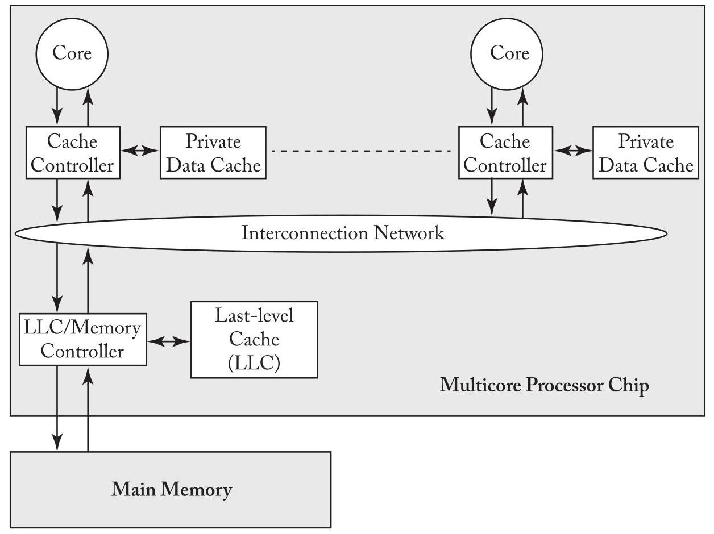
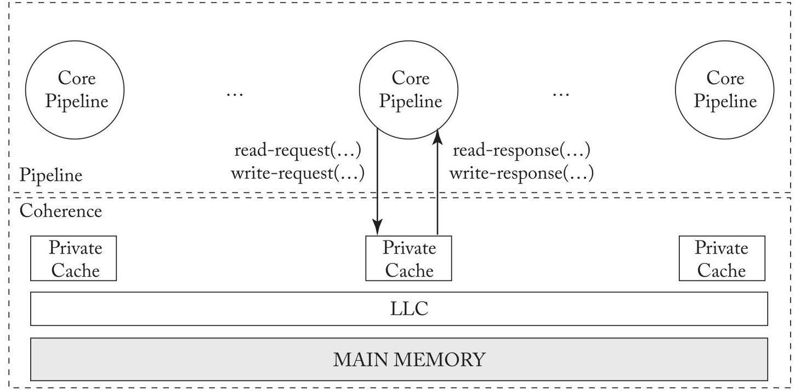

## CHAPTER 2 Coherence Basics

> 
## 第2章 一致性基础

In this chapter, we introduce enough about cache coherence to understand how consistency models interact with caches. We start in Section 2.1 by presenting the system model that we consider throughout this primer. To simplify the exposition in this chapter and the following chapters, we select the simplest possible system model that is sufficient for illustrating the important issues; we defer until Chapter 9 issues related to more complicated system models. Section 2.2 explains the cache coherence problem that must be solved and how the possibility of incoherence arises. Section 2.3 precisely defines cache coherence.

> 
在本章中，我们将介绍足够的缓存一致性知识，以理解一致性模型如何与缓存交互。我们在第2.1节开始介绍贯穿本入门书的系统模型。为简化本章及后续章节的阐述，我们选择了足以说明关键问题的最简系统模型；与更复杂系统模型相关的问题将推迟到第9章讨论。第2.2节阐释必须解决的缓存一致性问题，以及不一致是如何产生的。第2.3节精确定义缓存一致性。

### 2.1 BASELINE SYSTEM MODEL

In this primer, we consider systems with multiple processor cores that share memory. That is, all cores can perform loads and stores to all (physical) addresses. The baseline system model includes a single multicore processor chip and off-chip main memory, as illustrated in Figure 2.1. The multicore processor chip consists of multiple single-threaded cores, each of which has its own private data cache, and a last-level cache (LLC) that is shared by all cores. Throughout this primer, when we use the term "cache," we are referring to a core's private data cache and not the LLC. Each core's data cache is accessed with physical addresses and is write-back. The cores and the LLC communicate with each other over an interconnection network. The LLC, despite being on the processor chip, is logically a "memory-side cache" and thus does not introduce another level of coherence issues. The LLC is logically just in front of the memory and serves to reduce the average latency of memory accesses and increase the memory's effective bandwidth. The LLC also serves as an on-chip memory controller.

> 
在本入门指南中，我们考虑具有多个共享内存的处理器核心的系统。也就是说，所有核心都可以对所有（物理）地址执行加载和存储操作。基线系统模型包括一个多核处理器芯片和片外主存，如图2.1所示。多核处理器芯片由多个单线程核心组成，每个核心都有自己的私有数据缓存，以及一个由所有核心共享的最后一级缓存（LLC）。在本入门指南通篇中，当我们使用术语“缓存”时，指的是核心的私有数据缓存，而不是LLC。每个核心的数据缓存使用物理地址进行访问，并且是写回的。核心和LLC通过互连网络相互通信。尽管LLC位于处理器芯片上，但它在逻辑上是一个“内存侧缓存”，因此不会引入另一层一致性问题。LLC在逻辑上位于内存之前，用于减少内存访问的平均延迟并提高内存的有效带宽。LLC还充当片上内存控制器。

This baseline system model omits many features that are common but that are not required for purposes of most of this primer. These features include instruction caches, multiple-level caches, caches shared among multiple cores, virtually addressed caches, TLBs, and coherent direct memory access (DMA). The baseline system model also omits the possibility of multiple multicore chips. We will discuss all of these features later, but for now, they would add unnecessary complexity.

> 
该基线系统模型省略了许多常见但并非本书大部分内容所必需的特性，包括指令缓存、多级缓存、多核共享缓存、虚拟地址缓存、TLB以及一致性的直接内存访问（DMA）。该基线系统模型还省略了多个多核芯片的可能情况。我们将在后续讨论所有这些特性，但就目前而言，它们会增加不必要的复杂性。

10 2. COHERENCE BASICS

> 
10 2. 一致性基础

Figure 2.1: Baseline system model used throughout this primer.

> 
图 2.1：本入门读物中使用的基准系统模型。

### 2.2 THE PROBLEM: HOW INCOHERENCE COULD POSSIBLY OCCUR

The possibility of incoherence arises only because of one fundamental issue: there exist multiple actors with access to caches and memory. In modern systems, these actors are processor cores, DMA engines, and external devices that can read and/or write to caches and memory. In the rest of this primer, we generally focus on actors that are cores, but it is worth keeping in mind that other actors may exist.

> 
非一致性的可能之所以出现，仅仅源于一个根本问题：存在多个能够访问缓存和内存的参与者。在现代系统中，这些参与者是处理器核心、DMA引擎，以及能够读写缓存和内存的外部设备。在本入门指南的其余部分，我们通常重点关注作为核心的参与者，但值得留意的是，也可能存在其他参与者。

Table 2.1 illustrates a simple example of incoherence. Initially, memory location A has the value 42 in memory as well as both of the cores' local caches. At time 1, Core 1 changes the value at memory location A from 42 to 43 in its cache, making Core 2's value of A in its cache stale. Core 2 executes a while loop loading, repeatedly, the (stale) value of A from its local cache. Clearly, this is an example of incoherence as the store from Core 1 has not not been made visible to Core 2 and consequently C2 is stuck in the while loop.

> 
表 2.1 展示了一个简单的不一致示例。最初，内存位置 A 在内存和两个核心的本地缓存中都是值 42。在时刻 1，核心 1 在其缓存中将内存位置 A 的值从 42 修改为 43，使得核心 2 缓存中 A 的值变为陈旧。核心 2 执行一个 while 循环，反复从其本地缓存中加载这个（陈旧的）A 值。显然，这是一个不一致的例子，因为核心 1 的存储尚未对核心 2 可见，导致核心 2 陷入 while 循环。

To prevent incoherence, the system must implement a cache coherence protocol that makes the store from Core 1 visible to Core 2. The design and implementation of these cache coherence protocols are the main topics of Chapters 6-9.

> 
为防止出现不一致性，系统必须实现一种缓存一致性协议，使来自核心1的存储操作对核心2可见。这些缓存一致性协议的设计与实现是第6-9章的主要议题。

2.3. THE CACHE COHERENCE INTERFACE 11

> 
2.3. 缓存一致性接口 11

Table 2.1: Example of incoherence. Assume the value of memory at memory location A is initially 42 and cached in the local caches of both cores.

> 
表 2.1：非一致性的示例。假设内存位置 A 的值初始为 42，并缓存在两个核的本地缓存中。

<table><tr><td>Time</td><td>Core C1</td><td>Core C2</td></tr><tr><td>1</td><td>S1: A = 43;</td><td>L1: while (A == 42);</td></tr><tr><td>2</td><td></td><td>L2: while (A == 42);</td></tr><tr><td>3</td><td></td><td>L3: while (A == 42);</td></tr><tr><td>4</td><td></td><td>...</td></tr><tr><td>n</td><td></td><td>Ln: while (A == 42);</td></tr></table>

### 2.3 THE CACHE COHERENCE INTERFACE

Informally, a coherence protocol must ensure that writes are made visible to all processors. In this section, we will more formally understand coherence protocols through the abstract interfaces they expose.

> 
非正式地说，一致性协议必须确保写操作对所有处理器可见。在本节中，我们将通过一致性协议暴露的抽象接口，更正式地理解它们。

The processor cores interact with the coherence protocol through a coherence interface (Figure 2.2) that provides two methods: (1) a read-request method that takes in a memory location as the parameter and returns a value; and (2) a write-request method that takes in a memory location and a value (to be written) as parameters and returns an acknowledgment.

> 
处理器核心通过一致性接口（图 2.2）与一致性协议交互，该接口提供两种方法：(1) 读请求方法，以内存位置为参数并返回一个值；(2) 写请求方法，以内存位置和待写入的值作为参数并返回确认。

There are many coherence protocols that have appeared in the literature and been employed in real processors. We classify these protocols into two categories based on the nature of their coherence interfaces-specifically, based on whether there is a clean separation of coherence from the consistency model or whether they are indivisible.

> 
文献中已出现并被实际处理器采用的缓存一致性协议众多。我们根据其一致性接口的性质——具体而言，基于一致性与一致性模型是否清晰分离，抑或两者不可分割——将这些协议分为两类。

Consistency-agnostic coherence. In the first category, a write is made visible to all other cores before returning. Because writes are propagated synchronously, the first category presents an interface that is identical to that of an atomic memory system (with no caches). Thus, any subsystem that interacts with the coherence protocol-e.g., the processor core pipeline-can assume it is interacting with an atomic memory system with no caches present. From a consistency enforcement perspective, this coherence interface enables a nice separation of concerns. The cache coherence protocol abstracts away the caches completely and presents an illusion of atomic memory-it is as if the caches are removed and only the memory is contained within the coherence box (Figure 2.2)-while the processor core pipeline enforces the orderings mandated by the consistency model specification.

> 
一致性无关的缓存一致性。在第一类协议中，写操作在返回之前会对所有其他核心可见。由于写操作是同步传播的，第一类协议呈现出的接口与原子内存系统（无缓存情况下）的接口完全相同。因此，任何与一致性协议交互的子系统（例如处理器核心流水线）都可以假定其正在与一个不存在缓存的原子内存系统进行交互。从一致性强制执行的视角来看，这种一致性接口实现了良好的关注点分离。缓存一致性协议完全抽象化了缓存并呈现出原子内存的假象——就好像移除了缓存，仅将内存包含在一致性盒子中（图2.2）——而处理器核心流水线则强制执行一致性模型规范所规定的排序。

Consistency-directed coherence. In the second, more-recent category, writes are propagated asynchronously-a write can thus return before it has been made visible to all processors, thus allowing for stale values (in real time) to be observed. However, in order to correctly enforce consistency, coherence protocols in this class must ensure that the order in which writes are

> 
面向一致性的缓存一致性。在第二种更为近期的类别中，写操作被异步传播——因此，一个写操作可以在它对所有处理器变得可见之前返回，从而允许观察到（实时）过期的值。然而，为了正确执行一致性，此类一致性协议必须确保写操作被

12 2. COHERENCE BASICS eventually made visible adheres to the ordering rules mandated by the consistency model. Referring back to Figure 2.2, both the pipeline and the coherence protocol enforce the orderings mandated by the consistency model. This second category emerged to support throughput-based general-purpose graphics processing units (GP-GPUs) and gained prominence after the publication of the first edition of this primer. ${}^{1}$

> 
12 2. 一致性基础最终变得可见，遵循一致性模型所规定的排序规则。回顾图2.2，流水线和一致性协议都执行一致性模型所规定的排序。这一第二类别出现是为了支持基于吞吐量的通用图形处理单元（GP-GPU），并在本入门书第一版出版后获得了突出地位。${}^{1}$

Figure 2.2: The pipeline-coherence interface.

> 
图 2.2：流水线一致性接口。

The primer (and the rest of the chapter) focuses on the first class of coherence protocols. We discuss the second class of coherence protocols in the context of heterogeneous coherence (Chapter 10).

> 
本入门指南（以及本章其余部分）重点讨论第一类一致性协议。我们将在异构一致性（第 10 章）的背景下讨论第二类一致性协议。

### 2.4 (CONSISTENCY-AGNOSTIC) COHERENCE INVARIANTS

What invariants must a coherence protocol satisfy to make the caches invisible and present an abstraction of an atomic memory system?

> 
为了使缓存不可见并呈现出原子内存系统的抽象，一致性协议必须满足哪些不变性？

There are several definitions of coherence that have appeared in textbooks and in published papers, and we do not wish to present all of them. Instead, we present the definition we prefer for its insight into the design of coherence protocols. In the sidebar, we discuss alternative definitions and how they relate to our preferred definition.

> 
在教科书和已发表的论文中，存在若干种关于一致性的定义，我们无意在此全部罗列。相反，我们选择给出自己偏好的定义，因为它有助于洞察一致性协议的设计。在本章的边栏中，我们会讨论其他定义，并说明它们与我们首选定义之间的关系。

We define coherence through the single-writer-multiple-reader (SWMR) invariant. For any given memory location, at any given moment in time, there is either a single core that may

> 
我们通过单写多读（SWMR）不变性来定义一致性。对于任何给定的内存位置，在任何给定的时刻，要么只有一个核心可以

---

${}^{1}$ For those of you concerned about the implications on consistency, note that it is possible to to enforce a variety of consistency models, including strong models such as SC and TSO, using this approach.

> 
${}^{1}$ 对于那些担心这对一致性影响的人，请注意，使用这种方法可以强制执行多种一致性模型，包括像 SC 和 TSO 这样的强模型。

---

### 2.4. (CONSISTENCY-AGNOSTIC) COHERENCE INVARIANTS 13

write it (and that may also read it) or some number of cores that may read it. Thus, there is never a time when a given memory location may be written by one core and simultaneously either read or written by any other cores. Another way to view this definition is to consider, for each memory location, that the memory location's lifetime is divided up into epochs. In each epoch, either a single core has read-write access or some number of cores (possibly zero) have read-only access. Figure 2.3 illustrates the lifetime of an example memory location, divided into four epochs that maintain the SWMR invariant.

> 
对其进行写入（并且可能同时读取），或者允许一些核心进行读取。因此，在任何时刻，一个给定的内存单元绝不会既被一个核心写入，又同时被其他任何核心读取或写入。看待这一定义的另一种方式是，将每个内存单元的生命周期划分为多个时段。在每个时段中，要么单个核心具有读-写访问权限，要么若干核心（可能为零）具有只读权限。图2.3展示了一个示例内存单元的生命周期，它被划分为四个维持SWMR不变性的时段。

<table><tr><td></td><td></td><td></td><td>Time</td></tr><tr><td>Read-only Cores 2 and 5</td><td>Read-write Core 3</td><td>Read-write Core 1</td><td>Read-only   Cores 1, 2, and 3</td></tr></table>

Figure 2.3: Dividing a given memory location's lifetime into epochs.

> 
图2.3：将给定内存位置的生命周期划分为多个时期。

In addition to the SWMR invariant, coherence requires that the value of a given memory location is propagated correctly. To explain why values matter, let us reconsider the example in Figure 2.3. Even though the SWMR invariant holds, if during the first read-only epoch Cores 2 and 5 can read different values, then the system is not coherent. Similarly, the system is incoherent if Core 1 fails to read the last value written by Core 3 during its read-write epoch or any of Cores 1, 2, or 3 fail to read the last write performed by Core 1 during its read-write epoch.

> 
除了 SWMR 不变性，一致性还要求正确传播给定内存位置的值。为解释值的重要性，让我们重新审视图 2.3 中的示例。即使 SWMR 不变性成立，如果在第一个只读时期内核心 2 和核心 5 能够读到不同的值，系统就不是一致的。类似地，如果核心 1 在核心 3 的读写时期内未能读到核心 3 最后写入的值，或者核心 1、2 或 3 中的任何一个在核心 1 的读写时期内未能读到核心 1 执行的最后一次写入，系统也是不一致的。

Thus, the definition of coherence must augment the SWMR invariant with a data value invariant that pertains to how values are propagated from one epoch to the next. This invariant states that the value of a memory location at the start of an epoch is the same as the value of the memory location at the end of its last read-write epoch.

> 
因此，一致性的定义必须用一个与值如何从一个时段传播到下一个时段相关的数据值不变量来增强 SWMR 不变量。该不变量规定，一个内存位置在某个时段开始时的值，与该内存位置在其上一个读写时段结束时的值相同。

There are other interpretations of these invariants that are equivalent. One notable example [5] interpreted the SMWR invariants in terms of tokens. The invariants are as follows. For each memory location, there exists a fixed number of tokens that is at least as large as the number of cores. If a core has all of the tokens, it may write the memory location. If a core has one or more tokens, it may read the memory location. At any given time, it is thus impossible for one core to be writing the memory location while any other core is reading or writing it.

> 
这些不变量的其他解释也是等价的。一个值得注意的例子[5]使用令牌对单写多读（SMWR）不变量进行了解释。其不变量如下：对于每个内存位置，存在固定数量的令牌，令牌数量至少与核心数量相同。如果一个核心拥有所有令牌，它可以对该内存位置进行写操作。如果一个核心拥有一个或多个令牌，它可以对该内存位置进行读操作。因此，在任何给定时刻，不可能出现一个核心正在写某个内存位置而其他核心同时正在读或写该位置的情况。

## Coherence invariants

1. Single-Writer, Multiple-Read (SWMR) Invariant. For any memory location A, at any given time, there exists only a single core that may write to A (and can also read it) or some number of cores that may only read A.

> 
1. 单写者、多读者（SWMR）不变量。对于任何内存位置 A，在任何给定时刻，只存在单个可以写入 A（并且也可以读取它）的核，或者存在若干只能读取 A 的核。

2. Data-Value Invariant. The value of the memory location at the start of an epoch is the same as the value of the memory location at the end of the its last read-write epoch.

> 
2. 数据值不变量。一个时期开始时内存位置的值，与其上一个读写时期结束时该内存位置的值相同。

## 14 2. COHERENCE BASICS

#### 2.4.1 MAINTAINING THE COHERENCE INVARIANTS

The coherence invariants presented in the previous section provide some intuition into how coherence protocols work. The vast majority of coherence protocols, called "invalidate protocols," are designed explicitly to maintain these invariants. If a core wants to read a memory location, it sends messages to the other cores to obtain the current value of the memory location and to ensure that no other cores have cached copies of the memory location in a read-write state. These messages end any active read-write epoch and begin a read-only epoch. If a core wants to write to a memory location, it sends messages to the other cores to obtain the current value of the memory location, if it does not already have a valid read-only cached copy, and to ensure that no other cores have cached copies of the memory location in either read-only or read-write states. These messages end any active read-write or read-only epoch and begin a new read-write epoch. This primer's chapters on cache coherence (Chapters 6-9) expand greatly upon this abstract description of invalidate protocols, but the basic intuition remains the same.

> 
上一节介绍的相干性不变量让我们对相干协议的工作方式有了一些直观的理解。绝大多数相干协议被称为“无效化协议”，其设计明确以维护这些不变量为目标。如果一个核需要读取某个内存位置，它会向其他核发送消息以获取该内存位置的当前值，并确保没有其他核在读写状态下缓存了该位置的副本。这些消息会终止任何活跃的读写周期，并开启一个只读周期。如果一个核需要写入某个内存位置，且尚未持有有效的只读缓存副本，它会向其他核发送消息以获取该位置的当前值，并确保没有其他核持有该位置在只读或读写状态下的缓存副本。这些消息会终止任何活跃的读写或只读周期，并开启一个新的读写周期。本入门读物的缓存相干性章节（第6-9章）将大幅展开对无效化协议的抽象描述，但基本的直觉仍然相同。

#### 2.4.2 THE GRANULARITY OF COHERENCE

A core can perform loads and stores at various granularities, often ranging from 1-64 bytes. In theory, coherence could be performed at the finest load/store granularity. However, in practice, coherence is usually maintained at the granularity of cache blocks. That is, the hardware enforces coherence on a cache block by cache block basis. In practice, the SWMR invariant is likely to be that, for any block of memory, there is either a single writer or some number of readers. In typical systems, it is not possible for one core to be writing to the first byte of a block while another core is writing to another byte within that block. Although cache-block granularity is common, and it is what we assume throughout the rest of this primer, one should be aware that there have been protocols that have maintained coherence at finer and coarser granularities.

> 
核心能够以各种粒度执行加载和存储操作，通常范围在1到64字节之间。理论上，一致性可以在最细的加载/存储粒度上执行。然而，在实践中，一致性通常以缓存块的粒度来维护。也就是说，硬件是在缓存块逐块的基础上强制实现一致性的。实际上，单写多读（SWMR）不变式很可能意味着，对于任何内存块，要么存在单个写入者，要么存在若干个读取者。在典型系统中，一个核心不可能在写入某个块的第一个字节时，另一个核心同时写入该块的另一个字节。尽管缓存块粒度是常见的，并且我们在本入门读物的其余部分均采用这一假设，但读者应该意识到，已有协议以更细或更粗的粒度维护一致性。

## Sidebar: Consistency-Like Definitions of Coherence

Our preferred definition of coherence defines it from an implementation perspective-specifying hardware-enforced invariants regarding the access permissions of different cores to a memory location and the data values passed between cores.

> 
我们对一致性的首选定义是从实现角度来界定它的——具体规定了不同核对某一内存位置的访问权限，以及核之间传递的数据值等由硬件强制实施的不变量。

There exists another class of definitions that defines coherence from a programmer's perspective, similar to how memory consistency models specify architecturally visible orderings of loads and stores.

> 
还有另一类定义从程序员的角度来定义一致性，类似于内存一致性模型如何指定加载和存储操作在架构上可见的顺序。

One consistency-like approach to specifying coherence is related to the definition of sequential consistency. Sequential consistency (SC), a memory consistency model that we discuss in great depth in Chapter 3, specifies that the system must appear to execute all threads' loads and stores to all memory locations in a total order that respects the program order of each thread. Each load gets the value of the most recent store in that total order. A definition of coherence that is analogous to the definition of SC is that a coherent system must appear to execute all threads' loads and stores to a single memory location in a total order that respects the program order of each thread. This definition highlights an important distinction between coherence and consistency in the literature: coherence is specified on a per-memory location basis, whereas consistency is specified with respect to all memory locations. It is worth noting that any coherence protocol that satisfies the SWMR and data-value invariants (combined with a pipeline that does not reorder accesses to any specific location) is also guaranteed to satisfy this consistency-like definition of coherence. (However, the converse is not necessarily true.)

> 
一种类似一致性的定义缓存一致性的方法，与顺序一致性的定义相关。顺序一致性（SC）是一种内存一致性模型，我们将在第3章中详细讨论，它规定系统必须表现为：按照一个保留每个线程的程序顺序的全局序，执行所有线程对所有内存位置的加载和存储操作。每个加载操作获取该全局序中最近一次存储的值。与顺序一致性定义类似的缓存一致性定义为：一个一致的系统必须表现为：按照一个保留每个线程的程序顺序的全局序，执行所有线程对单一内存位置的加载和存储操作。这一定义凸显了文献中缓存一致性与内存一致性的重要区别：缓存一致性是针对每个内存位置单独规定的，而内存一致性是针对所有内存位置规定的。值得注意的是，任何满足SWMR不变量和数据值不变量（结合不会对任何特定位置的访问进行重排序的流水线）的缓存一致性协议，也必定满足这一类似一致性的缓存一致性定义。（然而，反之则不一定成立。）

Another definition [1, 2] of coherence defines coherence with two invariants: (1) every store is eventually made visible to all cores and (2) writes to the same memory location are serialized (i.e., observed in the same order by all cores). IBM takes a similar view in the Power architecture [4], in part to facilitate implementations in which a sequence of stores by one core may have reached some cores (their values visible to loads by those cores) but not other cores. Invariant 2 is equivalent to the consistency-like definition we described earlier. In contrast to invariant 2, which is a safety invariant (bad things must not happen), invariant 1 is a liveness invariant (good things must eventually happen).

> 
另一种一致性定义[1, 2]借助两个不变性来界定一致性：(1) 每个存储操作最终会对所有核心可见，(2) 对同一内存位置的写入是串行化的（即所有核心观察到的顺序相同）。IBM 在 Power 架构[4]中采用了类似的观点，部分原因是为了便于实现这样一种情形：一个核心发出的一串存储操作可能已经到达某些核心（那些核心的加载操作能看见它们的值），但尚未到达其他核心。不变性 2 等价于我们之前描述的那种类似一致性的定义。与作为安全性不变性（不允许坏事发生）的不变性 2 相对，不变性 1 是活性不变性（好事最终必定发生）。

Another definition of coherence, as specified by Hennessy and Patterson [3], consists of three invariants: (1) a load to memory location A by a core obtains the value of the previous store to A by that core, unless another core has stored to A in between; (2) a load to A obtains the value of a store S to A by another core if S and the load "are sufficiently separated in time" and if no other store occurred between S and the load; and (3) stores to the same memory location are serialized (same as invariant 2 in the previous definition). Like the previous definition, this set of invariants captures both safety and liveness.

> 
由 Hennessy 和 Patterson [3] 给出的另一组一致性定义，包含三条不变条件：（1）某核心对内存位置 A 的加载，得到的是该核心此前对 A 的最新存储的值，除非其间有另一核心对 A 进行了存储；（2）对 A 的加载，若与另一核心对 A 的存储 S “在时间上充分分离”且其间没有其他存储发生，则该加载得到 S 的值；（3）对同一内存位置的存储必须被序列化（与之前定义中的不变条件 2 相同）。与前面的定义一样，这组不变条件同时刻画了安全性和活性。

#### 2.4.3 WHEN IS COHERENCE RELEVANT?

The definition of coherence-regardless of which definition we choose-is relevant only in certain situations, and architects must be aware of when it pertains and when it does not. We now discuss two important issues.

> 
一致性的定义——无论我们选择哪种定义——只在某些情况下才相关，架构师必须清楚它何时适用、何时不适用。我们接下来讨论两个重要问题。

- Coherence pertains to all storage structures that hold blocks from the shared address space. These structures include the L1 data cache, L2 cache, shared last-level cache (LLC), and main memory. These structures also include the L1 instruction cache and translation lookaside buffers (TLBs). ${}^{2}$

> 
- 一致性涉及所有保存共享地址空间块的存储结构。这些结构包括 L1 数据缓存、L2 缓存、共享末级缓存（LLC）和主内存。它们还包括 L1 指令缓存和转译后备缓冲区（TLB）。${}^{2}$

- Coherence is not directly visible to the programmer. Rather, the processor pipeline and coherence protocol jointly enforce the consistency model—and it is only the consistency model that is visible to the programmer.

> 
- 一致性对程序员并非直接可见。相反，处理器流水线和一致性协议共同强制执行一致性模型——且只有一致性模型对程序员是可见的。

---

${}^{2}$ In some architectures, the TLB can hold mappings that are not strictly copies of blocks in shared memory.

> 
${}^{2}$ 在某些架构中，TLB 可以保存并非严格为共享内存中块副本的映射。

---

16 2. COHERENCE BASICS

> 
本章“一致性基础”介绍基本的缓存一致性概念，以解释一致性模型如何与缓存交互。它首先呈现一个简化的基线系统模型，该模型由单个多核芯片组成，每个核有私有的写回数据缓存、一个共享的末级缓存以及片外主存。核心问题通过一个不一致性的例子说明：一个核对一个位置的写入对另一个核不可见，导致读到过时数据。作者通过单写者多读者（SWMR）不变量和一个数据值不变量来定义一致性，确保对于任何内存位置，在任何时刻要么只有一个核可以写入，要么多个核可以读取，并且一个时期开始时的值等于前一个读写时期结束时的值。根据接口的不同，缓存一致性协议分为两类：与一致性无关的协议同步传播写入并呈现原子内存抽象，而一致性导向的协议异步传播写入；本章重点讨论前者。失效协议通过交换消息来获取所有权并在读或写之前使副本失效，从而维护这些不变量。一致性通常在缓存块粒度上实施，并适用于所有持有共享地址空间块的存储结构，但它对程序员并非直接可见——只有共同实施的一致性模型才是可见的。

### 2.5 REFERENCES

[1] K. Gharachorloo. Memory consistency models for shared-memory multiprocessors. Ph.D. thesis, Computer System Laboratory, Stanford University, December 1995. 15

> 
[1] K. Gharachorloo. 共享内存多处理器的存储一致性模型. 博士学位论文，斯坦福大学计算机系统实验室，1995年12月. 15

[2] K. Gharachorloo, D. Lenoski, J. Laudon, P. Gibbons, A. Gupta, and J. Hennessy. Memory consistency and event ordering in scalable shared-memory. In Proc. of the 17th Annual International Symposium on Computer Architecture, pp. 15-26, May 1990. DOI: 10.1109/isca.1990.134503. 15

> 
[2] K. Gharachorloo, D. Lenoski, J. Laudon, P. Gibbons, A. Gupta, and J. Hennessy. Memory consistency and event ordering in scalable shared-memory. In Proc. of the 17th Annual International Symposium on Computer Architecture, pp. 15-26, May 1990. DOI: 10.1109/isca.1990.134503. 15

[3] J. L. Hennessy and D. A. Patterson. Computer Architecture: A Quantitative Approach, 4th ed. Morgan Kaufmann, 2007. 15

> 
[3] J. L. Hennessy and D. A. Patterson. Computer Architecture: A Quantitative Approach, 4th ed. Morgan Kaufmann, 2007. 15

[4] IBM. Power ISA Version 2.06 Revision B. http://www.power.org/resources/ downloads/PowerISA_V2.06B_V2_PUBLIC.pdf, July 2010. 15

> 
[4] IBM. Power ISA Version 2.06 Revision B. http://www.power.org/resources/ downloads/PowerISA_V2.06B_V2_PUBLIC.pdf, 2010年7月. 15

[5] M. M. K. Martin, M. D. Hill, and D. A. Wood. Token coherence: Decoupling performance and correctness. In Proc. of the 30th Annual International Symposium on Computer Architecture, June 2003. DOI: 10.1109/isca.2003.1206999. 13

> 
[5] M. M. K. Martin、M. D. Hill 和 D. A. Wood. Token coherence：解耦性能与正确性. 见：第30届国际计算机体系结构年度研讨会论文集，2003年6月. DOI: 10.1109/isca.2003.1206999. 13
