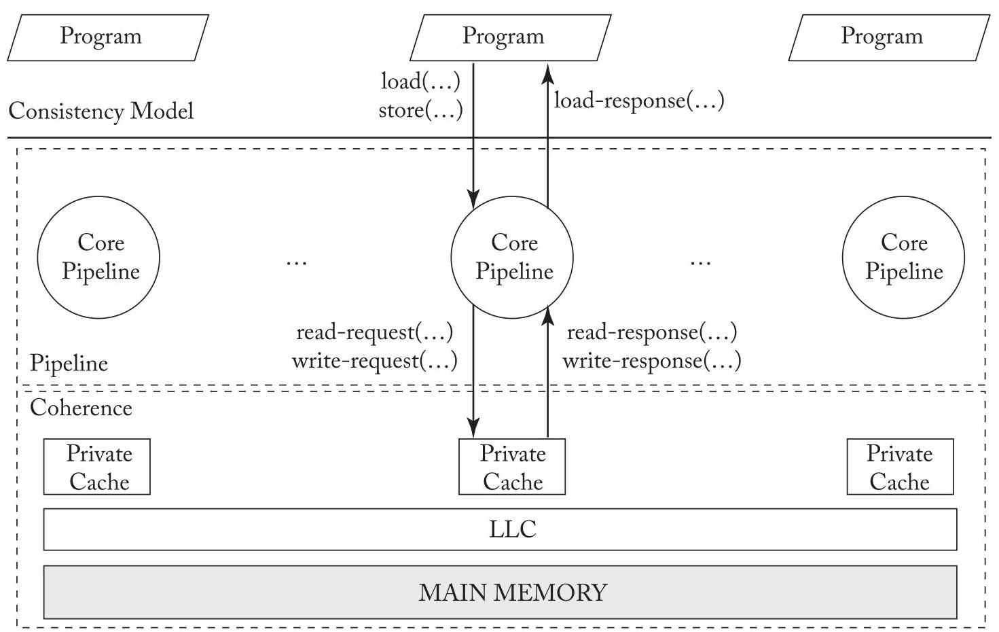
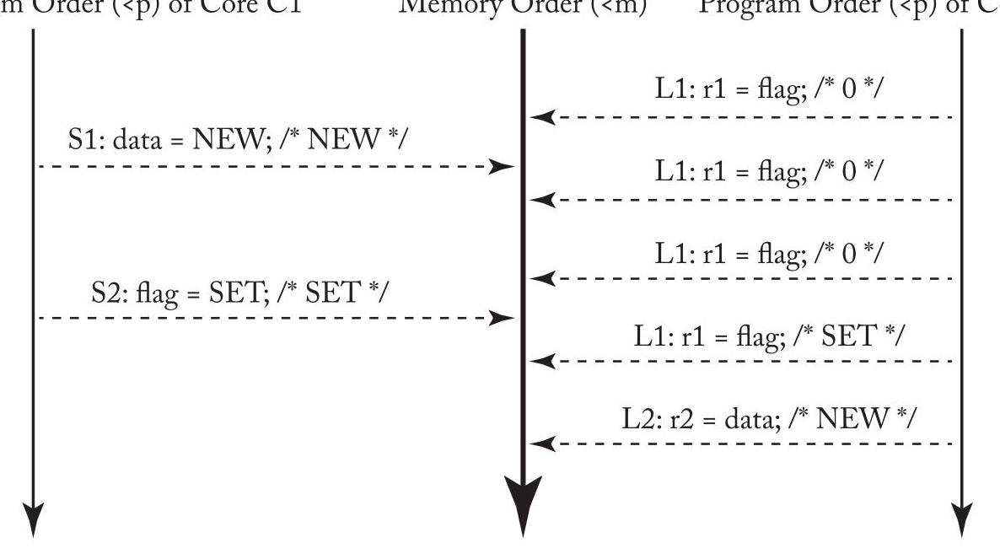
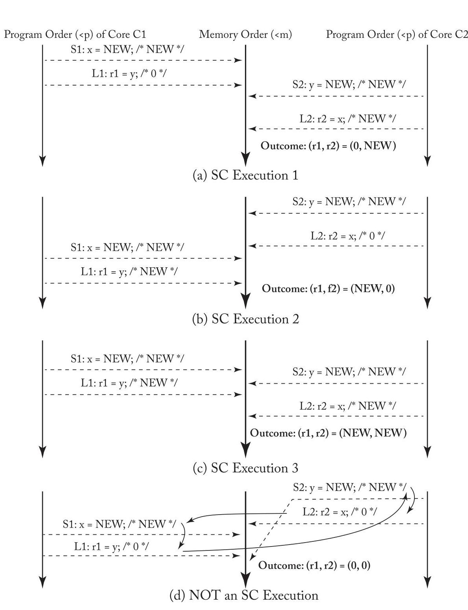
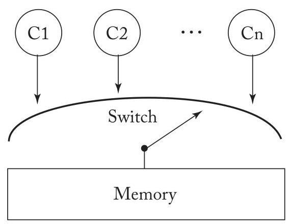
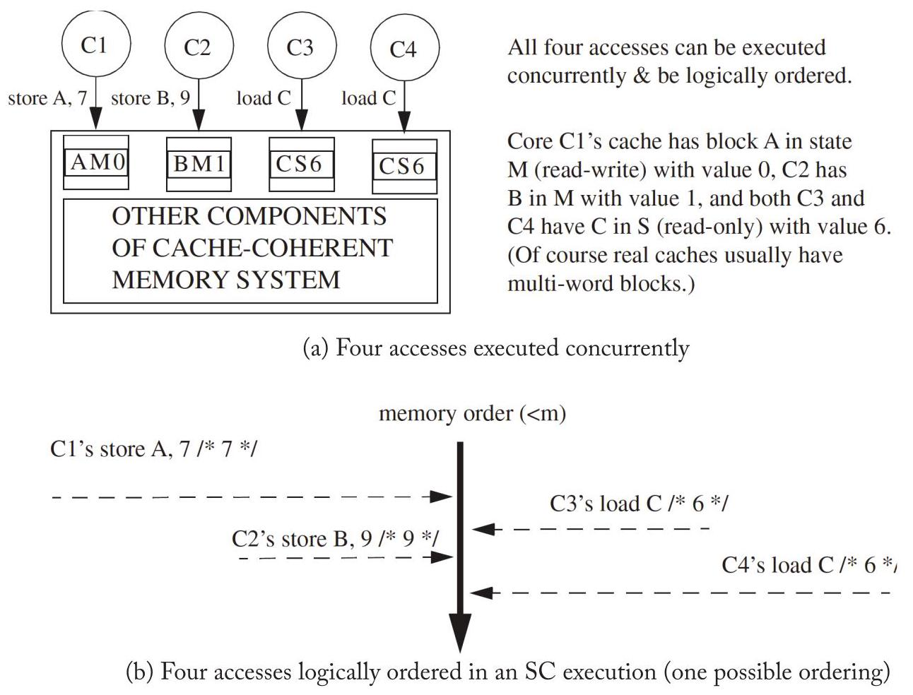
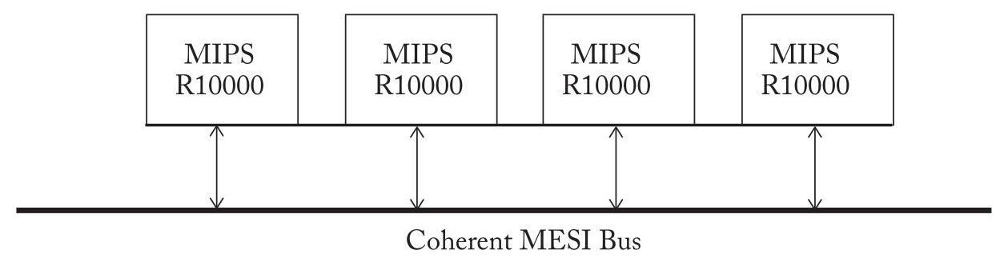

## CHAPTER 3 Memory Consistency Motivation and Sequential Consistency

This chapter delves into memory consistency models (a.k.a. memory models) that define the behavior of shared memory systems for programmers and implementors. These models define correctness so that programmers know what to expect and implementors know what to provide. We first motivate the need to define memory behavior (Section 3.1), say what a memory consistency model should do (Section 3.2), and compare and contrast consistency and coherence (Section 3.3).

> 
本章深入探讨内存一致性模型 (memory consistency models，亦称内存模型)，它们为程序员和实现者定义了共享内存系统的行为。这些模型定义了正确性，从而使程序员了解期望的行为，实现者知晓需要提供的内容。我们首先说明定义内存行为的必要性（第3.1节），阐述内存一致性模型应具备的功能（第3.2节），并对一致性 (consistency) 与缓存一致性 (coherence) 进行比较和对比（第3.3节）。

We then explore the (relatively) intuitive model of sequential consistency (SC). SC is important because it is what many programmers expect of shared memory and provides a foundation for understanding the more relaxed (weak) memory consistency models presented in the next two chapters. We first present the basic idea of SC (Section 3.4) and present a formalism of it that we will also use in subsequent chapters (Section 3.5). We then discuss implementations of SC, starting with naive implementations that serve as operational models (Section 3.6), a basic implementation of SC with cache coherence (Section 3.7), more optimized implementations of SC with cache coherence (Section 3.8), and the implementation of atomic operations (Section 3.9). We conclude our discussion of SC by providing a MIPS R10000 case study (Section 3.10) and pointing to some further reading (Section 3.11).

> 
然后，我们探讨（相对）直观的顺序一致性（sequential consistency，SC）模型。SC之所以重要，是因为它是许多程序员对共享内存的预期行为，并为理解接下来两章中介绍的那些更宽松（弱）的内存一致性模型（memory consistency models）奠定了基础。我们首先介绍SC的基本思想（第3.4节），并给出一种我们后续章节也会用到的形式化表示（第3.5节）。然后我们讨论SC的实现，首先从作为操作模型的朴素实现（第3.6节）开始，接着介绍带缓存一致性（cache coherence）的SC基本实现（第3.7节），更优化的带缓存一致性的SC实现（第3.8节），以及原子操作（atomic operations）的实现（第3.9节）。我们通过提供一个MIPS R10000案例研究（第3.10节）并指出一些进一步阅读材料（第3.11节）来结束对SC的讨论。

### 3.1 PROBLEMS WITH SHARED MEMORY BEHAVIOR

To see why shared memory behavior must be defined, consider the example execution of two cores ${}^{1}$ depicted in Table 3.1. (This example, as is the case for all examples in this chapter, assumes that the initial values of all variables are zero.) Most programmers would expect that core C2's register r2 should get the value NEW. Nevertheless, r2 can be 0 in some of today's computer systems.

> 
为了说明为何必须对共享内存行为进行定义，请参考表 3.1 中描述的双核 ${}^{1}$ 执行示例（与本章所有示例一样，该示例假定所有变量的初始值均为零）。大多数程序员会预期核心 C2 的寄存器 r2 将获得值 NEW。然而，在当前的一些计算机系统中，r2 的值可能会是 0。

Hardware can make r2 get the value 0 by reordering core C1's stores S1 and S2. Locally (i.e., if we look only at C1's execution and do not consider interactions with other threads), this reordering seems correct because S1 and S2 access different addresses. The sidebar on page 18

> 
硬件可以通过对核心 C1 的存储操作 S1 和 S2 进行重排序，使 r2 获得值 0。局部地看（即如果我们只关注 C1 的执行而不考虑与其他线程的交互），这种重排序似乎是正确的，因为 S1 和 S2 访问的是不同的地址。参见第 18 页的侧边栏。

---

${}^{1}$ Let "core" refer to software’s view of a core, which may be an actual core or a thread context of a multithreaded core.

> 
${}^{1}$ 让“核心 (core)”指代软件视角下的核心，它可能是一个实际的核心，或是一个多线程核心的线程上下文 (thread context)。

---

18 3. MEMORY CONSISTENCY MOTIVATION AND SEQUENTIAL CONSISTENCY

> 
18 3. 内存一致性动机 (Memory Consistency Motivation) 与顺序一致性 (Sequential Consistency)

Table 3.1: Should r2 always be set to NEW?

> 
表格 3.1：r2 是否应始终设为 NEW？

<table><tr><td>Core C1</td><td>Core C2</td><td>Comments</td></tr><tr><td>S1: Store data = NEW;   S2: Store flag = SET;</td><td>L1: Load r1 = flag; B1: if (r1 ≠ SET) goto L1; L2: Load r2 = data;</td><td>/* Initially, data = 0 & flag ≠ SET */ /* L1 & B1 may repeat many times */</td></tr></table>

Table 3.2: One possible execution of program in Table 3.1 describes a few of the ways in which hardware might reorder memory accesses, including these stores. Readers who are not hardware experts may wish to trust that such reordering can happen (e.g., with a write buffer that is not first-in-first-out).

> 
表3.2：表3.1中程序的一种可能执行情况描述了硬件可能重排序内存访问（包括这些存储）的几种方式。不是硬件专家的读者可以相信这种重排序是可能发生的（例如，使用非先进先出的写缓冲区）。

<table><tr><td>Cycle</td><td>Core C1</td><td>Core C2</td><td>Coherence State of Data</td><td>Coherence State of Flag</td></tr><tr><td>1</td><td>S2: Store flag = SET</td><td></td><td>Read-only for C2</td><td>Read-write for C1</td></tr><tr><td>2</td><td></td><td>L1: Load r1=flag</td><td>Read-only for C2</td><td>Read-only for C2</td></tr><tr><td>3</td><td></td><td>L2: Load r2=data</td><td>Read-only for C2</td><td>Read-only for C2</td></tr><tr><td>4</td><td>S1: Store data = NEW</td><td></td><td>Read-write for C1</td><td>Read-only for C2</td></tr></table>

With the reordering of S1 and S2, the execution order may be S2, L1, L2, S1, as illustrated in Table 3.2.

> 
通过对 S1 和 S2 的重排序 (reordering)，执行顺序 (execution order) 可能变为 S2、L1、L2、S1，如表 3.2 所示。

## Sidebar: How a Core Might Reorder Memory Access

This sidebar describes a few of the ways in which modern cores may reorder memory accesses to different addresses. Those unfamiliar with these hardware concepts may wish to skip this on first reading. Modern cores may reorder many memory accesses, but it suffices to reason about reordering two memory operations. In most cases, we need to reason only about a core reordering two memory operations to two different addresses, as the sequential execution (i.e., von Neumann) model generally requires that operations to the same address execute in the original program order. We break the possible reorderings down into three cases based on whether the reordered memory operations are loads or stores.

> 
本侧边栏描述了现代核心可能对到不同地址的内存访问进行重排序的几种方式。不熟悉这些硬件概念的读者可以在初次阅读时跳过此部分。现代核心可能重排序大量内存访问，但仅需对两次内存操作的重排序进行推理便已足够。在大多数情况下，我们只需推理核心对到两个不同地址的两次内存操作的重排序，因为顺序执行（即冯·诺依曼）模型通常要求对同一地址的操作按原始程序顺序执行。我们根据被重排序的内存操作是加载操作 (load) 还是存储操作 (store)，将可能的重排序情况划分为三种情形。

Store-store reordering. Two stores may be reordered if a core has a non-FIFO write buffer that lets stores depart in a different order than the order in which they entered. This might occur if the first store misses in the cache while the second hits or if the second store can coalesce with an earlier store (i.e., before the first store). Note that these reorderings are possible even if the core executes all instructions in program order. Reordering stores to different memory addresses has no effect on a single-threaded execution. However, in the multithreaded example of Table 3.1, reordering Core C1's stores allows Core C2 to see flag as SET before it sees the store to data. Note that the problem is not fixed even if the write buffer drains into a perfectly coherent memory hierarchy. Coherence will make all caches invisible, but the stores are already reordered.

> 
存储-存储重排序 (store-store reordering)。如果核心具有非先进先出 (non-FIFO) 的写缓冲区，允许存储操作以不同于它们进入的顺序离开，则两个存储可能被重排序。如果第一个存储未命中缓存而第二个命中，或者第二个存储能与更早的存储合并（即在第一个存储之前），就可能发生这种情况。注意，即使核心以程序顺序执行所有指令，这些重排序也是可能的。对不同内存地址的存储进行重排序对单线程执行没有影响。然而，在表3.1的多线程例子中，对核心C1的存储进行重排序会让核心C2在看到对数据的存储之前就看到flag为SET。注意，即使写缓冲区将数据排入一个完全一致的内存层次结构，这个问题也无法解决。一致性将使所有缓存不可见，但存储已经重排序了。

Load-load reordering. Modern dynamically scheduled cores may execute instructions out of program order. In the example of Table 3.1, Core C2 could execute loads L1 and L2 out of order. Considering only a single-threaded execution, this reordering seems safe because L1 and L2 are to different addresses. However, reordering Core C2's loads behaves the same as reordering Core C1's stores; if the memory references execute in the order L2, S1, S2, and L1, then r2 is assigned 0 . This scenario is even more plausible if the branch statement B1 is elided, so no control dependence separates L1 and L2.

> 
加载-加载重排序（Load-load reordering）。现代动态调度核心可能乱序执行指令。在表 3.1 的示例中，核心 C2 可能乱序执行加载操作 L1 和 L2。仅考虑单线程执行时，这种重排序似乎是安全的，因为 L1 和 L2 访问不同的地址。然而，重排序核心 C2 的加载操作与重排序核心 C1 的存储操作效果相同；如果内存访问按照 L2、S1、S2、L1 的顺序执行，则 r2 被赋值为 0。如果分支语句 B1 被省略，因此没有控制依赖将 L1 和 L2 分开，这种情况甚至更可能发生。

Load-store and store-load reordering. Out-of-order cores may also reorder loads and stores (to different addresses) from the same thread. Reordering an earlier load with a later store (a load-store reordering) can cause many incorrect behaviors, such as loading a value after releasing the lock that protects it (if the store is the unlock operation). The example in Table 3.3 illustrates the effect of reordering an earlier store with a later load (a store-load reordering). Reordering Core C1's accesses S1 and L1 and Core C2's accesses S2 and L2 allows the counterintuitive result that both r1 and r2 are 0 . Note that store-load reorderings may also arise due to local bypassing in the commonly implemented FIFO write buffer, even with a core that executes all instructions in program order.

> 
加载-存储与存储-加载重排序（Load-store and store-load reordering）。乱序核心（Out-of-order cores）也可能重排序来自同一线程的加载和存储（指向不同地址）。将较早的加载与较晚的存储重排序（加载-存储重排序（load-store reordering））可能导致许多错误行为，例如在释放保护某个值的锁之后才加载该值（假设该存储是解锁操作）。表3.3中的示例说明了将较早的存储与较晚的加载重排序（存储-加载重排序（store-load reordering））所产生的效果。对核心C1的访问S1和L1以及核心C2的访问S2和L2进行重排序，会导致r1和r2均为0这一反直觉的结果。值得注意的是，即使在按程序顺序执行所有指令的核心中，由于常见的FIFO写缓冲区（FIFO write buffer）中的本地绕过（local bypassing），也可能导致存储-加载重排序。

A reader might assume that hardware should not permit some or all of these behaviors, but without a better understanding of what behaviors are allowed, it is hard to determine a list of what hardware can and cannot do.

> 
读者可能会假定硬件不应允许部分或全部这类行为，但若没有更深入地了解哪些行为是被允许的，便难以确定一个关于硬件能做什么和不能做什么的清单。

Table 3.3: Can both r1 and r2 be set to 0?

> 
表 3.3：r1 和 r2 能都设置为 0 吗？

<table><tr><td>Core C1</td><td>Core C2</td><td>Comments</td></tr><tr><td>S1: x = NEW;   L1: r1 = y;</td><td>S2: y = NEW;   L2: r2 = x;</td><td>/* Initially, $\mathrm{x} = 0\& \mathrm{y} = 0$ */</td></tr></table>

This execution satisfies coherence because the SWMR property is not violated, so incoherence is not the underlying cause of this seemingly erroneous execution result.

> 
该执行满足一致性 (coherence)，因为单写多读 (SWMR) 属性未被违反，因此不一致性 (incoherence) 并不是这个看似错误的执行结果的根本原因。

## 20 3. MEMORY CONSISTENCY MOTIVATION AND SEQUENTIAL CONSISTENCY

Let us consider another important example inspired by Dekker's Algorithm for ensuring mutual exclusion, as depicted in Table 3.3. After execution, what values are allowed in r1 and r2? Intuitively, one might expect that there are three possibilities:

> 
让我们考虑如表 3.3 所示的另一个重要示例，其灵感来源于用于确保互斥（mutual exclusion）的德克尔算法（Dekker's Algorithm）。执行后，r1 和 r2 中允许的值是什么？直觉上，人们可能期望存在三种可能性：

$$
\text{ - }\left( {\mathrm{r}1,\mathrm{r}2}\right)  = \left( {0,\mathrm{{NEW}}}\right) \text{ for execution }\mathrm{S}1,\mathrm{L}1,\mathrm{\;S}2\text{ , then }\mathrm{L}2
$$

> 
$$
\text{ - }\left( {\mathrm{r}1,\mathrm{r}2}\right)  = \left( {0,\mathrm{{NEW}}}\right) \text{ 对于执行 }\mathrm{S}1,\mathrm{L}1,\mathrm{\;S}2\text{ ，然后 }\mathrm{L}2
$$

- $\left( {\mathrm{r}1,\mathrm{r}2}\right)  = \left( {\mathrm{{NEW}},0}\right)$ for $\mathrm{S}2,\mathrm{\;L}2,\mathrm{\;S}1$ , and $\mathrm{L}1$

> 
- $\left( {\mathrm{r}1,\mathrm{r}2}\right)  = \left( {\mathrm{{NEW}},0}\right)$ 对于 $\mathrm{S}2,\mathrm{\;L}2,\mathrm{\;S}1$ 和 $\mathrm{L}1$

$$
\text{ - }\left( {\mathrm{r}1,\mathrm{r}2}\right)  = \left( {\mathrm{{NEW}},\mathrm{{NEW}}}\right) \text{ , e.g., for }\mathrm{S}1,\mathrm{\;S}2,\mathrm{\;L}1\text{ , and }\mathrm{L}2
$$

> 
$$
\text{ - }\left( {\mathrm{r}1,\mathrm{r}2}\right)  = \left( {\mathrm{{NEW}},\mathrm{{NEW}}}\right) \text{ ，例如，对于 }\mathrm{S}1,\mathrm{\;S}2,\mathrm{\;L}1\text{ 和 }\mathrm{L}2
$$

Surprisingly, most real hardware, e.g., x86 systems from Intel and AMD, also allows (r1, r2) = (0, 0) because it uses first-in-first-out (FIFO) write buffers to enhance performance. As with the example in Table 3.1, all of these executions satisfy cache coherence, even (r1, r2) = (0, 0).

> 
令人惊讶的是，大多数真实硬件，例如来自 Intel 和 AMD 的 x86 系统，也允许出现 (r1, r2) = (0, 0) 的结果，因为它们使用了先入先出（first-in-first-out, FIFO）写缓冲区来提升性能。正如表 3.1 中的示例一样，所有这些执行都满足缓存一致性（cache coherence），即使 (r1, r2) = (0, 0) 也不例外。

Some readers might object to this example because it is non-deterministic (multiple outcomes are allowed) and may be a confusing programming idiom. However, in the first place, all current multiprocessors are non-deterministic by default; all architectures of which we are aware permit multiple possible interleavings of the executions of concurrent threads. The illusion of determinism is sometimes, but not always, created by software with appropriate synchronization idioms. Thus, we must consider non-determinism when defining shared memory behavior.

> 
一些读者可能会反对这个例子，因为它是非确定性（non-deterministic）的（允许多种结果），并可能是一种令人困惑的编程惯用法。然而，首先，所有当前的多处理器（multiprocessors）默认都是非确定性的；据我们所知，所有体系结构都允许并发线程（concurrent threads）执行存在多种可能的交织（interleavings）。确定性（determinism）的假象有时（但并非总是）由软件通过适当的同步惯用法（synchronization idioms）创造出来。因此，在定义共享内存行为（shared memory behavior）时，我们必须考虑非确定性（non-determinism）。

Furthermore, memory behavior is usually defined for all executions of all programs, even those that are incorrect or intentionally subtle (e.g., for non-blocking synchronization algorithms). In Chapter 5, however, we will see some high-level language models that allow some executions to have undefined behavior, e.g., executions of programs with data races.

> 
此外，内存行为 (memory behavior) 通常为所有程序的所有执行而定义，即使那些不正确或有意微妙的执行（例如，针对非阻塞同步算法 (non-blocking synchronization algorithms)）。然而，在第5章中，我们将看到一些高级语言模型 (high-level language models)，允许某些执行具有未定义行为 (undefined behavior)，例如，带有数据竞争 (data races) 的程序执行。

### 3.2 WHAT IS A MEMORY CONSISTENCY MODEL?

The examples in the previous sub-section illustrate that shared memory behavior is subtle, giving value to precisely defining (a) what behaviors programmers can expect and (b) what optimizations system implementors may use. A memory consistency model disambiguates these issues.

> 
前面小节的示例说明共享内存 (shared memory) 行为是微妙的，因此精确地定义 (a) 程序员可以期望哪些行为以及 (b) 系统实现者可以使用哪些优化是有价值的。内存一致性模型 (memory consistency model) 澄清了这些问题。

A memory consistency model, or, more simply, a memory model, is a specification of the allowed behavior of multithreaded programs executing with shared memory. For a multithreaded program executing with specific input data, it specifies what values dynamic loads may return. Unlike a single-threaded execution, multiple correct behaviors are usually allowed.

> 
内存一致性模型（memory consistency model），或更简单地说，内存模型（memory model），是对使用共享内存（shared memory）执行的多线程程序（multithreaded programs）的允许行为的一种规范。对于以特定输入数据执行的多线程程序，它规定了动态加载（dynamic loads）可能返回的值。与单线程执行不同，通常允许多种正确行为。

In general, a memory consistency model MC gives rules that partition executions into those obeying MC (MC executions) and those disobeying MC (non-MC executions). This partitioning of executions, in turn, partitions implementations. An MC implementation is a system that permits only MC executions, while a non-MC implementation sometimes permits non-MC executions.

> 
一般而言，内存一致性模型 (memory consistency model) MC 给出了若干规则，将执行划分为遵守 MC 的执行（MC 执行）与违反 MC 的执行（非 MC 执行）。这种对执行的划分反过来也划分了实现。一个 MC 实现是仅允许 MC 执行的系统，而非 MC 实现则有时会允许非 MC 执行。

Finally, we have been vague regarding the level of programming. We begin by assuming that programs are executables in a hardware instruction set architecture, and we assume that memory accesses are to memory locations identified by physical addresses (i.e., we are not considering the impact of virtual memory and address translation). In Chapter 5, we will discuss issues with high-level languages (HLLs). We will see then, for example, that a compiler allocating a variable to a register can affect an HLL memory model in a manner similar to hardware reordering memory references.

> 
最后，我们在编程层次 (level of programming) 方面一直较为模糊。我们首先假设程序是硬件指令集架构 (hardware instruction set architecture) 中的可执行程序 (executables)，并假设内存访问针对的是由物理地址 (physical addresses) 标识的内存位置（即，我们不考虑虚拟内存 (virtual memory) 和地址翻译 (address translation) 的影响）。在第五章中，我们将讨论高级语言 (high-level languages，HLLs) 的相关问题。届时，例如，我们将看到编译器 (compiler) 将变量分配到寄存器 (register) 可能会以类似于硬件内存引用重排序 (hardware reordering memory references) 的方式影响高级语言内存模型 (HLL memory model)。

### 3.3 CONSISTENCY VS. COHERENCE

Chapter 2 defined cache coherence with two invariants that we informally repeat here. The SWMR invariant ensures that at any time for a memory location with a given address, either (a) one core may write (and read) the address or (b) zero or more cores may only read it. The Data-Value Invariant ensures that updates to the memory location are passed correctly so that cached copies of the memory location always contain the most recent version.

> 
第2章用两个不变量（invariants）非正式地定义了缓存一致性（cache coherence），我们在此对此加以复述。SWMR不变量（SWMR invariant）确保在任何时刻，对于给定地址的内存位置，要么（a）一个核心可以写入（并读取）该地址，要么（b）零个或多个核心只能读取它。数据值不变量（Data-Value Invariant）确保对内存位置的更新被正确传递，这样一来，内存位置的缓存副本始终包含最新版本。

It may seem that cache coherence defines shared memory behavior. It does not. As we can see from Figure 3.1, the coherence protocol simply provides the processor core pipeline an abstraction of a memory system. It alone cannot determine shared memory behavior; the

> 
乍看之下，缓存一致性（cache coherence）似乎定义了共享内存的行为。实则不然。从图 3.1 可以看出，一致性协议（coherence protocol）仅仅为处理器核心流水线提供了一个内存系统的抽象。它自身无法决定共享内存的行为；

Figure 3.1: A consistency model is enforced by the processor core pipeline combined with the coherence protocol.

> 
图3.1：一致性模型 (consistency model) 由处理器核心流水线 (processor core pipeline) 结合一致性协议 (coherence protocol) 共同实施。

## 22 3. MEMORY CONSISTENCY MOTIVATION AND SEQUENTIAL CONSISTENCY

pipeline matters, too. If, for example, the pipeline reorders and presents memory operations to the coherence protocol in an order contrary to program order—even if the coherence protocol does its job correctly—shared memory correctness may not ensue.

> 
流水线 (pipeline) 也很重要。例如，如果流水线重排序并以与程序顺序 (program order) 相反的顺序向一致性协议 (coherence protocol) 呈现内存操作——即使一致性协议正确执行其工作——共享内存 (shared memory) 的正确性也可能无法实现。

In summary:

> 
综上所述：

- Cache coherence does not equal memory consistency.

> 
- 缓存一致性（cache coherence）不等于内存一致性（memory consistency）。

- A memory consistency implementation can use cache coherence as a useful "black box."

> 
- 内存一致性 (memory consistency) 实现可以将缓存一致性 (cache coherence) 作为一个有用的“黑盒” (black box)。

### 3.4 BASIC IDEA OF SEQUENTIAL CONSISTENCY(SC)

Arguably the most intuitive memory consistency model is SC. It was first formalized by Lam-port [12], who called a single processor (core) sequential if "the result of an execution is the same as if the operations had been executed in the order specified by the program." He then called a multiprocessor sequentially consistent if "the result of any execution is the same as if the operations of all processors (cores) were executed in some sequential order, and the operations of each individual processor (core) appear in this sequence in the order specified by its program." This total order of operations is called memory order. In SC, memory order respects each core's program order, but other consistency models may permit memory orders that do not always respect the program orders.

> 
最直观的内存一致性模型无疑是顺序一致性（Sequential Consistency, SC）。它首次由Lam-port [12]形式化，他将单处理器（核心）称为顺序的，如果“执行的结果与操作按照程序指定的顺序执行的结果相同。”他随后将多处理器称为顺序一致的，如果“任何执行的结果与所有处理器（核心）的操作按某种顺序执行的结果相同，并且每个处理器（核心）的操作在该序列中按照其程序指定的顺序出现。”这种操作的全序被称为内存顺序 (memory order)。在SC中，内存顺序尊重每个核心的程序顺序 (program order)，但其他一致性模型可能允许并不总是尊重程序顺序的内存顺序。

Figure 3.2 depicts an execution of the example program from Table 3.1. The middle vertical downward arrow represents the memory order (<m) while each core's downward arrow represents its program order (<p). We denote memory order using the operator $< \mathrm{m}$ , so op1 $< \mathrm{m}$ op2 implies that op1 precedes op2 in memory order. Similarly, we use the operator 
 
图3.2描绘了表3.1中示例程序的一次执行。中间的垂直向下箭头表示内存顺序（$< \mathrm{m}$），而每个核的向下箭头表示其程序顺序（<p）。我们使用操作符$< \mathrm{m}$表示内存顺序（memory order），因此op1 $< \mathrm{m}$ op2意味着在内存顺序中op1先于op2。同样，我们使用操作符<p来表示给定核的程序顺序（program order），因此op1 
 
核心 C1 的程序顺序 (Program Order) (<p) 内存顺序 (Memory Order) (<m) 核心 C2 的程序顺序 (Program Order) (<p)

Figure 3.2: A sequentially consistent execution of Table 3.1's program.

> 
图 3.2：表 3.1 程序的顺序一致性执行 (sequentially consistent execution)

This example illustrates the value of SC. In Section 3.1, if you expected that r2 must be NEW, you were perhaps independently inventing SC, albeit less precisely than Lamport.

> 
这个例子展示了顺序一致性（SC）的价值。在第3.1节中，如果你预期r2必须是NEW，那么你可能独立地发明了顺序一致性（SC），尽管不如Lamport精确。

The value of SC is further revealed in Figure 3.3, which illustrates four executions of the program from Table 3.3. Figure 3.3a-c depict SC executions that correspond to the three intuitive outputs: (r1, r2) = (0, NEW), (NEW, 0), or (NEW, NEW). Note that Figure 3.3c depicts only one of the four possible SC executions that leads to (r1, r2) = (NEW, NEW); this execution is \{S1, S2, L1, L2\}, and the others are \{S1, S2, L2, L1\}, \{S2, S1, L1, L2\}, and \{S2, S1, L2, L1\}. Thus, across Figure 3.3a-c, there are six legal SC executions.

> 
顺序一致性 (SC) 的价值在图3.3中进一步揭示，该图展示了表3.3中程序的四种执行情况。图3.3a-c描绘了与三种直观输出对应的SC执行：(r1, r2) = (0, NEW)、(NEW, 0) 或 (NEW, NEW)。注意，图3.3c仅描绘了导致(r1, r2) = (NEW, NEW)的四种可能SC执行之一；该执行为 \{S1, S2, L1, L2\}，其他为 \{S1, S2, L2, L1\}、\{S2, S1, L1, L2\} 和 \{S2, S1, L2, L1\}。因此，在图3.3a-c中，共有六种合法的SC执行。

Figure 3.3d shows a non-SC execution corresponding to the output $\left( {\mathrm{r}1,\mathrm{r}2}\right)  = \left( {0,0}\right)$ . For this output, there is no way to create a memory order that respects program orders. Program order dictates that:

> 
图3.3d展示了一个对应输出 $\left( {\mathrm{r}1,\mathrm{r}2}\right)  = \left( {0,0}\right)$ 的非SC执行 (non-SC execution)。对于这个输出，无法创建一种尊重程序顺序 (program order) 的内存顺序 (memory order)。程序顺序规定：

- S1 
 
- S1 
 
- S2 
 
但是内存顺序 (memory order) 规定：

- L1 <m S2 (so r1 is 0)

> 
- L1 <m S2 (因此 r1 为 0)

- L2 <m S1 (so r2 is 0)

> 
- L2 <m S1（因此 r2 为 0）

Honoring all these constraints results in a cycle, which is inconsistent with a total order. The extra arcs in Figure 3.3d illustrate the cycle.

> 
遵守所有这些约束会导致一个循环，这与全序不一致。图3.3d中的额外弧线说明了这个循环。

We have just seen six SC executions and one non-SC execution. This can help us understand SC implementations: an SC implementation must allow one or more of the first six executions, but cannot allow the seventh execution.

> 
我们刚刚看到了六个顺序一致性（SC）执行和一个非顺序一致性执行。这可以帮助我们理解顺序一致性实现：一个顺序一致性实现必须允许前六个执行中的一个或多个，但不能允许第七个执行。

### 3.5 A LITTLE SC FORMALISM

In this section, we define SC more precisely, especially to allow us to compare SC with the weaker consistency models in the next two chapters. We adopt the formalism of Weaver and Germond [20]—an axiomatic method to specify consistency which we discuss more in Chapter 11-with the following notation: L(a) and S(a) represent a load and a store, respectively, to address a. Orders $< \mathrm{p}$ and $< \mathrm{m}$ define program and global memory order, respectively. Program order $< \mathrm{p}$ is a per-core total order that captures the order in which each core logically (sequentially) executes memory operations. Global memory order $< \mathrm{m}$ is a total order on the memory operations of all cores.

> 
在本节中，我们将更精确地定义顺序一致性 (SC)，特别是为了能够将 SC 与接下来两章中更弱的一致性模型 (weaker consistency models) 进行比较。我们采用 Weaver 和 Germond [20] 的形式化方法——一种用于指定一致性的公理化方法 (axiomatic method)，我们将在第 11 章中进一步讨论——使用以下符号：L(a) 和 S(a) 分别表示对地址 a 的加载 (load) 和存储 (store) 操作。顺序 $< \mathrm{p}$ 和 $< \mathrm{m}$ 分别定义程序顺序 (program order) 和全局内存顺序 (global memory order)。程序顺序 $< \mathrm{p}$ 是每个核心的全序 (per-core total order)，它捕获了每个核心在逻辑上（顺序地）执行内存操作 (memory operations) 的次序。全局内存顺序 $< \mathrm{m}$ 是所有核心的内存操作上的一个全序 (total order)。

Figure 3.3: Four alternative executions of Table 3.3's program.

> 
图 3.3：表 3.3 程序的四种替代执行方式。

An SC execution requires the following.

> 
一个 SC（顺序一致性，Sequential Consistency）执行需满足以下条件。

(1) All cores insert their loads and stores into the order $< \mathrm{m}$ respecting their program order, regardless of whether they are to the same or different addresses (i.e., a=b or $a \neq  b$ ). There are four cases:

> 
(1) 所有核心 (core) 将其加载 (load) 和存储 (store) 操作插入到顺序 $< \mathrm{m}$ 中，同时遵循其程序顺序 (program order)，无论这些操作是针对相同还是不同的地址 (即 a=b 或 $a \neq b$)。有四种情况：

$$
\text{ - If }L\left( a\right)  < {pL}\left( b\right)  \Rightarrow  L\left( a\right)  < {mL}\left( b\right) /{}^{ * }\text{ Load } \rightarrow  \text{ Load }{}^{ * }/
$$

> 
$$
\text{ - 如果 }L\left( a\right)  < {pL}\left( b\right)  \Rightarrow  L\left( a\right)  < {mL}\left( b\right) /{}^{ * }\text{ 加载 } \rightarrow  \text{ 加载 }{}^{ * }/
$$

$$
\text{ - If }L\left( a\right)  < {pS}\left( b\right)  \Rightarrow  L\left( a\right)  < {mS}\left( b\right) /\text{ * Load } \rightarrow  \text{ Store*/ }
$$

> 
$$
\text{ - 如果 }L\left( a\right)  < {pS}\left( b\right)  \Rightarrow  L\left( a\right)  < {mS}\left( b\right) /\text{ * 加载 (Load) } \rightarrow  \text{ 存储 (Store) */ }
$$

- If $\mathrm{S}\left( \mathrm{a}\right)  < \mathrm{p}\mathrm{S}\left( \mathrm{b}\right)  \Rightarrow  \mathrm{S}\left( \mathrm{a}\right)  < \mathrm{m}\mathrm{S}\left( \mathrm{b}\right) /{}^{ * }$ Store $\rightarrow$ Store ${}^{ * }/$

> 
- 如果 $\mathrm{S}\left( \mathrm{a}\right)  < \mathrm{p}\mathrm{S}\left( \mathrm{b}\right)  \Rightarrow  \mathrm{S}\left( \mathrm{a}\right)  < \mathrm{m}\mathrm{S}\left( \mathrm{b}\right) /{}^{ * }$ 存储 $\rightarrow$ 存储 ${}^{ * }/$

$$
\text{ - If }\mathrm{S}\left( \mathrm{a}\right)  < \mathrm{{pL}}\left( \mathrm{b}\right)  \Rightarrow  \mathrm{S}\left( \mathrm{a}\right)  < \mathrm{{mL}}\left( \mathrm{b}\right) / * \text{ Store } \rightarrow  \text{ Load } * /
$$

> 
$$
\text{ - 如果 }\mathrm{S}\left( \mathrm{a}\right)  <  \mathrm{{pL}}\left( \mathrm{b}\right)  \Rightarrow  \mathrm{S}\left( \mathrm{a}\right)  <  \mathrm{{mL}}\left( \mathrm{b}\right) / * \text{ 存储 } \rightarrow  \text{ 加载 } * /
$$

(2) Every load gets its value from the last store before it (in global memory order) to the same address:

> 
(2) 每个加载（load）都从在全局内存顺序（global memory order）中位于其之前的、对同一地址的最后一次存储（store）获取其值：

Value of $L\left( a\right)  = {\text{ Value of MAX }}_{ < m}\{ S\left( a\right)  \mid  S\left( a\right)  < {mL}\left( a\right) \}$ , where MAX ${}_{ < m}$ denotes "latest in memory order."

> 
$L\left( a\right)$ 的值等于 ${\text{ Value of MAX }}_{ < m}\{ S\left( a\right)  \mid  S\left( a\right)  < {mL}\left( a\right) \}$ ，其中 MAX ${}_{ < m}$ 表示“内存顺序中最新的 (latest in memory order)”。

Atomic read-modify-write (RMW) instructions, which we discuss in more depth in Section 3.9, further constrain allowed executions. Each execution of a test-and-set instruction, for example, requires that the load for the test and the store for the set logically appear consecutively in the memory order (i.e., no other memory operations for the same or different addresses interpose between them).

> 
原子读-修改-写（RMW）指令（我们将在第3.9节更深入地讨论）进一步约束了允许的执行。例如，每次执行测试并设置指令 (test-and-set instruction) 都要求测试的加载 (load) 与设置的存储 (store) 在内存顺序 (memory order) 中逻辑上连续出现（即，没有其他针对相同或不同地址的内存操作 (memory operations) 插入其间）。

We summarize SC's ordering requirements in Table 3.4. The table specifies which program orderings are enforced by the consistency model. For example, if a given thread has a load before a store in program order (i.e., the load is "Operation 1" and the store is "Operation 2" in the table), then the table entry at this intersection is an "X" which denotes that these operations must be performed in program order. For SC, all memory operations must appear to perform in program order; under other consistency models, which we study in the next two chapters, some of these ordering constraints are relaxed (i.e., some entries in their ordering tables do not contain an "X").

> 
我们将 SC 的排序要求总结在表 3.4 中。该表规定了该一致性模型 (consistency model) 强制实施了哪些程序顺序 (program order)。例如，如果给定线程在程序顺序中先有一条加载 (load) 后有一条存储 (store)（即加载是表中的“操作 1”，存储是“操作 2”），那么该交叉处的表项为一个“X”，表示这些操作必须按程序顺序执行。对于 SC，所有内存操作必须看起来按程序顺序执行；而在接下来两章中研究的其他一致性模型下，其中一些排序约束被放宽（即其排序表中的某些条目不包含“X”）。

An SC implementation permits only SC executions. Strictly speaking, this is the safety property for SC implementations (do no harm). SC implementations should also have some liveness properties (do some good). Specifically, a store must become eventually visible to a load that is repeatedly attempting to load that location. This property, referred to as eventual write-propagation, is typically ensured by the coherence protocol. More generally, starvation avoidance and some fairness are also valuable, but these issues are beyond the scope of this discussion.

> 
顺序一致性 (Sequential Consistency, SC) 实现仅允许 SC 执行。严格来说，这是 SC 实现的安全性质（不造成损害）。SC 实现还应具备一些活性性质 (liveness properties)（做好事）。具体来说，一个存储操作必须最终对反复尝试加载该位置的加载操作变得可见。这一性质，被称为最终写入传播 (eventual write-propagation)，通常由一致性协议来保证。更一般地，避免饥饿 (starvation avoidance) 和某种公平性 (some fairness) 也是很有价值的，但这些问题超出了本讨论的范围。

## 26 3. MEMORY CONSISTENCY MOTIVATION AND SEQUENTIAL CONSISTENCY

Table 3.4: SC ordering rules. An "X" denotes an enforced ordering.

> 
表 3.4：SC 排序规则。“X” 表示强制排序。

<table><tr><td colspan="5">Operation 2</td></tr><tr><td rowspan="4">Operation 1</td><td></td><td>Load</td><td>Store</td><td>RMW</td></tr><tr><td>Load</td><td>X</td><td>X</td><td>X</td></tr><tr><td>Store</td><td>X</td><td>X</td><td>X</td></tr><tr><td>RMW</td><td>X</td><td>X</td><td>X</td></tr></table>

### 3.6 NAIVE SC IMPLEMENTATIONS

SC permits two naive implementations that make it easier to understand which executions SC permits.

> 
顺序一致性 (Sequential Consistency, SC) 允许两种朴素实现 (naive implementations)，这使得更容易理解 SC 允许哪些执行 (executions)。

## The Multitasking Uniprocessor

First, one can implement SC for multithreaded user-level software by executing all threads on a single sequential core (a uniprocessor). Thread T1's instructions execute on core C1 until a context switch to thread T2, etc. On a context switch, any pending memory operations must be completed before switching to the new thread. Because each thread's instructions in its quanta execute as one atomic block (and because the uniprocessor correctly honors memory dependencies), all of the SC rules are enforced.

> 
首先，可以通过将所有线程在单个顺序核心（单处理器 (uniprocessor)）上执行，来实现多线程用户级软件的顺序一致性 (SC)。线程 T1 的指令在核心 C1 上执行，直到发生上下文切换到线程 T2，等等。在上下文切换时，任何未完成的内存操作必须在切换到新线程之前完成。因为每个线程在其时间片 (quanta) 内的指令都作为一个原子块 (atomic block) 执行（并且因为单处理器能正确遵循内存依赖关系 (memory dependencies)），所以所有 SC 规则都得到了强制施行。

## The Switch

Second, one can implement SC with a set of cores C, a single switch, and memory, as depicted in Figure 3.4. Assume that each core presents memory operations to the switch one at a time in its program order. Each core can use any optimizations that do not affect the order in which it presents memory operations to the switch. For example, a simple five-stage in-order pipeline with branch prediction can be used.

> 
其次，可以使用一组核心 C、一个交换机和存储器来实现顺序一致性 (SC)，如图 3.4 所示。假设每个核心按照其程序顺序，一次向交换机提交一个存储器操作。每个核心可以使用任何不影响其向交换机提交存储器操作顺序的优化。例如，可以使用一个简单的、带分支预测的五级顺序流水线 (five-stage in-order pipeline with branch prediction)。

Each core Ci seeks to do its next memory access in its program order $< p$ .

> 
每个核心 Ci 试图按照其程序顺序 $< p$ 进行下一次内存访问。

The switch selects one core, allows it to complete one memory access, and repeats; this defines memory order <m.

> 
交换开关 (switch) 选择一个核心，允许它完成一次内存访问，并重复；这定义了内存顺序 <m。

Figure 3.4: A simple SC implementation using a memory switch.

> 
图 3.4: 一个使用存储器开关 (memory switch) 的简单 SC 实现。

#### 3.7.A BASIC SC IMPLEMENTATION WITH CACHE COHERENCE 27

Assume next that the switch picks one core, allows memory to fully satisfy the load or store, and repeats this process as long as requests exist. The switch may pick cores by any method (e.g., random) that does not starve a core with a ready request. This implementation operationally implements SC by construction.

> 
接下来假设交换机（switch）选择一个核心（core），允许内存（memory）完整地满足该加载（load）或存储（store）操作，并在存在请求时不断重复此过程。交换机可以采用任何不会使具有就绪请求的核心饥饿（starve）的选择方法（例如随机）。这一实现通过构造在操作层面实现了顺序一致性（SC）。

## Assessment

The good news from these implementations is that they provide operational models defining (1) allowed SC executions and (2) SC implementation "gold standards." (In Chapter 11, we will see that such operational models can be used to formally specify consistency models.) The switch implementation also serves as an existence proof that SC can be implemented without caches or coherence.

> 
这些实现带来的好消息是它们提供了操作模型 (operational models)，定义了 (1) 允许的顺序一致性 (SC) 执行和 (2) 顺序一致性 (SC) 实现的“黄金标准”。（在第 11 章中，我们将看到这样的操作模型可用于正式指定一致性模型 (consistency models)。）交换机实现 (switch implementation) 也作为一个存在性证明 (existence proof)，即顺序一致性 (SC) 可以在没有缓存 (caches) 或一致性 (coherence) 的情况下实现。

The bad news, of course, is that the performance of these implementations does not scale up with increasing core count, due to the sequential bottleneck of using a single core in the first case and the single switch/memory in the second case. These bottlenecks have led some people to incorrectly conclude that SC precludes true parallel execution. It does not, as we will see next.

> 
当然，坏消息是，这些实现的性能并不会随着核心数量的增加而扩展，原因在于第一种情况下使用单核、第二种情况下使用单一交换机/内存所造成的顺序瓶颈。这些瓶颈导致一些人错误地得出结论，认为顺序一致性（Sequential Consistency, SC）妨碍了真正的并行执行。事实并非如此，我们接下来就会看到。

### 3.7 A BASIC SC IMPLEMENTATION WITH CACHE COHERENCE

Cache coherence facilitates SC implementations that can execute non-conflicting loads and stores-two operations conflict if they are to the same address and at least one of them is a store-completely in parallel. Moreover, creating such a system is conceptually simple.

> 
缓存一致性有助于顺序一致性（SC）实现，可以完全并行地执行非冲突的加载和存储操作——如果两个操作访问同一地址且至少其中一个是存储操作，则它们冲突。此外，创建这样的系统在概念上很简单。

Here, we treat coherence as mostly a black box that implements the SWMR invariant of Chapter 2. We provide some implementation intuition by opening the coherence block box slightly to reveal simple level-one (L1) caches that:

> 
在这里，我们将一致性 (coherence) 主要视为一个黑盒，它实现了第 2 章中的 SWMR 不变性 (SWMR invariant)。为了提供一些实现层面的直观理解，我们稍微打开这个一致性黑盒，揭示其中简单的第一级 (L1) 缓存 (caches)，它们：

- use state modified $\left( M\right)$ to denote an L1 block that one core can write and read,

> 
- 使用修改状态 (state modified) $\left( M\right)$ 来表示一个内核可以读写的一个 L1 块，

- use state shared (S) to denote an L1 block that one or more cores can only read, and

> 
- 使用共享状态 (state shared, S) 来表示一个L1块，该块仅能被一个或多个核心读取，并且

- have GetM and GetS denote coherence requests to obtain a block in M and S, respectively.

> 
- 令获取修改 (GetM) 和获取共享 (GetS) 分别表示以修改态 (M) 和共享态 (S) 获取数据块的一致性请求。

We do not require a deep understanding of how coherence is implemented, as discussed in Chapter 6 and beyond.

> 
我们不需要深入了解一致性 (coherence) 是如何实现的，如第6章及后续章节所讨论的。

Figure 3.5a depicts the model of Figure 3.4 with the switch and memory replaced by a cache-coherent memory system represented as a black box. Each core presents memory operations to the cache-coherent memory system one at a time in its program order. The memory system fully satisfies each request before beginning the next request for the same core.

> 
图3.5a描绘了图3.4的模型，其中交换机和内存被一个表示为黑盒的缓存一致性内存系统 (cache-coherent memory system) 所取代。每个核心 (core) 按程序顺序 (program order) 一次一个地向缓存一致性内存系统发出内存操作 (memory operations)。对于同一个核心，该内存系统在开始处理下一个请求前，会完全满足每个请求。

Figure 3.5b "opens" the memory system black box a little to reveal that each core connects to its own L1 cache (we will talk about multithreading later). The memory system can respond to a load or store to block B if it has B with appropriate coherence permissions (state M or S for loads and M for stores). Moreover, the memory system can respond to requests from different

> 
图 3.5b 稍稍“打开”了内存系统（memory system）的黑箱（black box），揭示了每个核心（core）都连接到自己的一级缓存（L1 cache）（我们稍后将讨论多线程（multithreading））。内存系统可以对块 B 的加载（load）或存储（store）请求做出响应，前提是它拥有块 B 并具有适当的一致性权限（coherence permissions）（加载要求状态 M 或 S，存储要求状态 M）。此外，内存系统还可以响应来自不同

28 3. MEMORY CONSISTENCYMOTIVATION AND SEQUENTIAL CONSISTENCY

> 
28 3. 内存一致性 (Memory Consistency) 动机与顺序一致性 (Sequential Consistency)

C1 C2 ... Cn

> 
C1 C2 ... Cn

Each core Ci seeks to do its next memory access in its program order $< \mathrm{p}$ .

> 
每个核 (core) Ci 寻求按照其程序顺序 (program order) $< \mathrm{p}$ 进行其下一次内存访问 (memory access)。

The memory system logically selects one core, allows it to complete one memory CACHE-COHERENT

> 
内存系统在逻辑上选择一个核心，允许它完成一个内存缓存一致性（CACHE-COHERENT）

MEMORY SYSTEM access, and repeats; this defines memory

> 
内存系统 (memory system) 访问，并重复；这定义了内存。

order $< \mathrm{m}$ .

> 
阶 (order) $< \mathrm{m}$ .

(a) Black-box memory system

> 
(a) 黑盒存储系统 (Black-box memory system)

C1 C2 ... Cn Same as above

> 
C1 C2 ... Cn 同上

Same as above, but cores can concurrently complete accesses to blocks with sufficient (L1) cache coherence permission, because such accesses must be non-conflicting (to different blocks or all loads) and may be placed into memory order in any logical order. L1\$ L1\$ ... L1\$

> 
与上述相同，但核心可以并发完成对具有足够（L1）缓存一致性权限的块的访问，因为这样的访问必须是非冲突的（针对不同块或全部都是加载操作），并且可以按任何逻辑顺序放入内存顺序中。L1\$ L1\$ ... L1\$

OTHER COMPONENTS

> 
其他组件 (OTHER COMPONENTS)

OF CACHE-COHERENT

> 
缓存一致性 (cache-coherent) 的

MEMORY SYSTEM

> 
存储系统 (MEMORY SYSTEM)

(b) Memory system with L1 caches exposed

> 
(b) 暴露 L1 缓存（L1 caches）的内存系统（memory system）

Figure 3.5: Implementing SC with cache coherence. cores in parallel, provided that the corresponding L1 caches have the appropriate permissions. For example, Figure 3.6a depicts the cache states before four cores each seek to do a memory operation. The four operations do not conflict, can be satisfied by their respective L1 caches, and therefore can be done concurrently. As depicted in Figure 3.6b, we can arbitrarily order these operations to obtain a legal SC execution model. More generally, operations that can be satisfied by L1 caches always can be done concurrently because coherence's SWMR invariant ensures they are non-conflicting.

> 
图3.5：通过缓存一致性（cache coherence）实现SC。内核并行执行，前提是相应的一级缓存（L1 caches）具有适当的权限。例如，图3.6a描绘了四个内核各自寻求执行内存操作之前的缓存状态。这四个操作不冲突，可以由各自的一级缓存满足，因此可以并发执行。如图3.6b所示，我们可以任意排序这些操作以获得合法的SC执行模型。更一般地说，可由一级缓存满足的操作总是可以并发执行，因为缓存一致性的单写多读（SWMR）不变量确保它们是非冲突的。

## Assessment

We have created an implementation of SC that:

> 
我们创建了一个顺序一致性 (SC) 的实现：

- fully exploits the latency and bandwidth benefits of caches,

> 
- 充分利用缓存的延迟和带宽优势，

- is as scalable as the cache coherence protocol it uses, and

> 
- 与其使用的缓存一致性协议（cache coherence protocol）一样具有可扩展性，并且

- decouples the complexities of implementing cores from implementing coherence.

> 
- 将实现核心 (cores) 与实现一致性 (coherence) 的复杂性解耦。

3.8. OPTIMIZED SC IMPLEMENTATIONS WITH CACHE COHERENCE 29

> 
3.8. 基于缓存一致性的优化 SC 实现 29

Figure 3.6: A concurrent SC execution with cache coherence.

> 
图3.6：具有缓存一致性（cache coherence）的并发顺序一致性（SC）执行。

### 3.8 OPTIMIZED SC IMPLEMENTATIONS WITH CACHE COHERENCE

Most real core implementations are more complicated than our basic SC implementation with cache coherence. Cores employ features like prefetching, speculative execution, and multithread-ing in order to improve performance and tolerate memory access latencies. These features interact with the memory interface, and we now discuss how these features impact the implementation of SC. It is worth bearing in mind that any feature or optimization is legal as long as it does not produce an end result (values returned by loads) that violates SC.

> 
大多数现实的核心实现比我们带有缓存一致性 (cache coherence) 的基本顺序一致性 (SC) 实现更为复杂。核心采用诸如预取 (prefetching)、推测执行 (speculative execution) 和多线程 (multithreading) 等特性，以提升性能并容忍内存访问延迟 (memory access latencies)。这些特性与内存接口 (memory interface) 相互作用，我们现在讨论这些特性如何影响 SC 的实现。值得注意的是，只要任何特性或优化不会产生违反 SC 的最终结果（由加载返回的值），它就是合法的。

## Non-Binding Prefetching

A non-binding prefetch for block B is a request to the coherent memory system to change B's coherence state in one or more caches. Most commonly, prefetches are requested by software, core hardware, or the cache hardware to change B's state in the level-one cache to permit loads (e.g., B's state is M or S) or loads and stores (B's state is M) by issuing coherence requests such

> 
对于块B的非绑定预取（non-binding prefetch）是一种向一致性内存系统（coherent memory system）发出的请求，旨在更改一个或多个缓存（cache）中B的一致性状态（coherence state）。最常见的是，预取由软件、核心硬件或缓存硬件请求，通过发出一致性请求（coherence requests）来改变B在一级缓存（level-one cache）中的状态，以允许加载（loads）（例如，B的状态为M或S）或加载和存储（loads and stores）（B的状态为M），例如

## 30 3. MEMORY CONSISTENCY MOTIVATION AND SEQUENTIAL CONSISTENCY

as GetS and GetM. Importantly, in no case does a non-binding prefetch change the state of a register or data in block B. The effect of the non-binding prefetch is limited to within the "cache-coherent memory system" block of Figure 3.5a, making the effect of non-binding prefetches on the memory consistency model to be the functional equivalent of a no-op. So long as the loads and stores are performed in program order, it does not matter in what order coherence permissions are obtained.

> 
如同 GetS 和 GetM 一样。重要的是，非绑定预取 (non-binding prefetch) 在任何情况下都不会改变寄存器或块 B 中数据的状态。非绑定预取的效果仅限于图 3.5a 中的 "缓存一致内存系统 (cache-coherent memory system)" 块，使得非绑定预取对内存一致性模型的影响在功能上等同于空操作 (no-op)。只要加载和存储按程序顺序 (program order) 执行，以何种顺序获得一致性权限 (coherence permissions) 就无关紧要了。

Implementations may do non-binding prefetches without affecting the memory consistency model. This is useful for both internal cache prefetching (e.g., stream buffers) and more aggressive cores.

> 
实现可以采用非绑定预取 (non-binding prefetch)，而不会影响内存一致性模型 (memory consistency model)。这对于内部缓存预取 (internal cache prefetching，例如流缓冲区 (stream buffer)) 和更激进的内核都很有用。

## Speculative Cores

Consider a core that executes instructions in program order, but also does branch prediction wherein subsequent instructions, including loads and stores, begin execution, but may be squashed (i.e., have their effects nullified) on a branch misprediction. These squashed loads and stores can be made to look like non-binding prefetches, enabling this speculation to be correct because it has no effect on SC. A load after a branch prediction can be presented to the L1 cache, wherein it either misses (causing a non-binding GetS prefetch) or hits and then returns a value to a register. If the load is squashed, the core discards the register update, erasing any functional effect from the load-as if it never happened. The cache does not undo non-binding prefetches, as doing so is not necessary and prefetching the block can help performance if the load gets re-executed. For stores, the core may issue a non-binding GetM prefetch early, but it does not present the store to the cache until the store is guaranteed to commit.

> 
考虑一个按程序顺序执行指令的核心，但它也进行分支预测，其中后续指令（包括加载和存储）开始执行，但在分支预测错误时可能会被废弃（squashed，即其效果被作废）。这些被废弃的加载和存储可以使其看起来像非绑定预取（non-binding prefetches），使这种推测得以正确，因为它对顺序一致性（SC）没有影响。分支预测之后的加载可以被提交到L1缓存，在缓存中它要么缺失（导致非绑定GetS预取），要么命中，然后向寄存器返回一个值。如果加载被废弃，核心会丢弃寄存器更新，抹去加载的任何功能性效果——就好像从未发生过一样。缓存不会撤销非绑定预取，因为这并非必要，并且如果加载被重新执行，预取该块有助于提升性能。对于存储，核心可能会提前发出非绑定GetM预取，但在存储保证会提交之前，它不会将存储提交到缓存。

Flashback to Quiz Question 1: In a system that maintains sequential consistency, a core must issue coherence requests in program order. True or false?

> 
回顾测验问题1：在维护顺序一致性 (sequential consistency) 的系统中，核心必须按程序顺序 (program order) 发出一致性请求 (coherence requests)。正确还是错误？

Answer: False! A core may issue coherence requests in any order.

> 
答案：错误！核心可以以任意顺序发出一致性请求（coherence requests）。

## Dynamically Scheduled Cores

Many modern cores dynamically schedule instruction execution out of program order to achieve greater performance than statically scheduled cores that must execute instructions in strict program order. A single-core processor that uses dynamic or out-of-(program-)order scheduling must simply enforce true data dependences within the program. However, in the context of a multicore processor, dynamic scheduling introduces a new issue: memory consistency speculation. Consider a core that wishes to dynamically reorder the execution of two loads, L1 and L2 (e.g., because L2's address is computed before L1's address). Many cores will speculatively execute L2 before L1, and they are predicting that this reordering is not visible to other cores, which would violate SC.

> 
许多现代处理器核心会动态地对指令执行进行乱序调度 (dynamically schedules instruction execution out of program order)，相比那些必须严格遵循程序顺序执行的静态调度核心而言，能够实现更高的性能。一个采用动态或乱序执行 (out-of-(program-)order) 调度的单核处理器，只需保证程序内部真实数据依赖关系的正确性。然而，在多核处理器的语境下，动态调度引入了一个新的问题：内存一致性推测 (memory consistency speculation)。设想某个核心希望动态地重新排列两条加载指令 L1 和 L2 的执行顺序（例如，因为 L2 的地址先于 L1 的地址被计算出来）。许多核心会投机性地在 L1 之前执行 L2，此时它们预测这种重排序对于其他核心而言是不可见的，而此类重排序倘若可见便会违反顺序一致性 (SC)。

Speculating on SC requires that the core verify that the prediction is correct. Gharachorloo et al. [8] presented two techniques for performing this check. First, after the core speculatively

> 
对顺序一致性 (SC) 进行推测要求核心验证该预测是否正确。Gharachorloo et al. [8] 提出了两种进行这一检查的技术。首先，在核心推测性地

### 3.8. OPTIMIZED SC IMPLEMENTATIONS WITH CACHE COHERENCE 31

executes L2, but before it commits L2, the core could check that the speculatively accessed block has not left the cache. So long as the block remains in the cache, its value could not have changed between the load's execution and its commit. To perform this check, the core tracks the address loaded by L2 and compares it to blocks evicted and to incoming coherence requests. An incoming GetM indicates that another core could observe L2 out of order, and this GetM would imply a mis-speculation and squash the speculative execution.

> 
执行 L2，但在提交 L2 之前，核心可以检查投机访问的块尚未离开缓存。只要该块仍保留在缓存中，其值在加载的执行和提交之间就不会改变。为了执行此检查，核心会记录 L2 加载的地址，并将其与被逐出的块和传入的一致性请求进行比较。传入的 GetM 表示另一个核心可能观察到 L2 的乱序执行，此 GetM 将意味着一次错误投机并作废该投机执行。

The second checking technique is to replay each speculative load when the core is ready to commit the load ${}^{2}\left\lbrack  {2,{17}}\right\rbrack$ . If the value loaded at commit does not equal the value that was previously loaded speculatively, then the prediction was incorrect. In the example, if the replayed load value of L2 is not the same as the originally loaded value of L2, then the load-load reordering has resulted in an observably different execution and the speculative execution must be squashed.

> 
第二种检查技术是在核心 (core) 准备好提交 (commit) 加载 (load) 时，重放每个推测性加载 (speculative load) ${}^{2}\left\lbrack  {2,{17}}\right\rbrack$。如果在提交时加载的值不等于之前推测性加载的值，那么预测 (prediction) 是不正确的。在示例中，如果 L2 的重放加载 (replayed load) 值与最初加载的 L2 值不相同，那么加载-加载重排序 (load-load reordering) 导致了可观察的不同执行，因此推测执行 (speculative execution) 必须被撤销 (squash)。

## Non-Binding Prefetching in Dynamically Scheduled Cores

A dynamically scheduled core is likely to encounter load and store misses out of program order. For example, assume that program order is Load A, Store B, then Store C. The core may initiate non-binding prefetches "out of order," e.g., GetM C first and then GetS A and GetM B in parallel. SC is not affected by the order of non-binding prefetches. SC requires only that a core's loads and stores (appear to) access its level-one cache in program order. Coherence requires the level-one cache blocks to be in the appropriate states to receive loads and stores.

> 
动态调度内核（dynamically scheduled core）可能会以非程序顺序（program order）遇到加载和存储未命中。例如，假设程序顺序为加载 A（Load A）、存储 B（Store B），再存储 C（Store C）。内核可能"乱序"发起非绑定预取（non-binding prefetches），例如先执行 *GetM C*，然后并行执行 *GetS A* 和 *GetM B*。存储一致性（SC）不受非绑定预取顺序的影响。SC 仅要求内核的加载和存储（看起来）按程序顺序访问其一级缓存（level-one cache）。一致性（Coherence）则要求一级缓存块处于适当状态以接收加载和存储。

Importantly, SC (or any other memory consistency model):

> 
重要的是，顺序一致性（SC，Sequential Consistency，或任何其他内存一致性模型）：

- dictates the order in which loads and stores (appear to) get applied to coherent memory but

> 
- 决定了加载 (load) 和存储 (store)（看似）应用到一致性内存 (coherent memory) 的顺序，但是

- does NOT dictate the order of coherence activity.

> 
- 不规定一致性活动 (coherence activity) 的顺序。

Flashback to Quiz Question 2: The memory consistency model specifies the legal orderings of coherence transactions. True or false?

> 
回顾测验问题2：内存一致性模型（memory consistency model）规定了一致性事务（coherence transactions）的合法排序。正确还是错误？

Answer: False!

> 
答案: 错误！

## Multithreading

Multithreading-at coarse grain, fine grain, or simultaneous-can be accommodated by SC implementations. Each multithreaded core should be made logically equivalent to multiple (virtual) cores sharing each level-one cache via a switch where the cache chooses which virtual core to service next. Moreover, each cache can actually serve multiple non-conflicting requests concurrently because it can pretend that they were serviced in some order. One challenge is ensuring that a thread T1 cannot read a value written by another thread T2 on the same core before the store has been made "visible" to threads on other cores. Thus, while thread T1 may read the

> 
多线程——无论是粗粒度、细粒度还是同时多线程——都可以被顺序一致性（Sequential Consistency，SC）实现所容纳。每个多线程核心应该被逻辑等效为多个通过交换器共享一级缓存的（虚拟）核心，其中缓存会选择下一个为哪个虚拟核心服务。此外，每个缓存实际上可以并发服务多个无冲突的请求，因为它可以假想这些请求是以某种顺序被服务的。一个挑战是确保在线程 T2 在同一个核心上写入的值对其他核心上的线程变得“可见”之前，线程 T1 不能读取该值。因此，虽然线程 T1 可以读取该

---

${}^{2}$ Roth [17] demonstrated a scheme for avoiding many load replays by determining when they are not necessary.

> 
${}^{2}$ Roth [17] 展示了一种通过确定何时不需要加载重放 (load replays) 来避免许多加载重放的方案。

---

## 32 3. MEMORY CONSISTENCY MOTIVATION AND SEQUENTIAL CONSISTENCY

value as soon as thread T2 inserts the store in the memory order (e.g., by writing it to a cache block in state M), it cannot read the value from a shared load-store queue in the processor core.

> 
一旦线程T2将存储操作 (store) 插入内存序 (memory order)（例如，通过将其写入处于状态M (state M) 的缓存块 (cache block)），它就无法从处理器核心 (processor core) 中的共享加载-存储队列 (shared load-store queue) 读取该值。

## Sidebar: Advanced SC Optimizations

This sidebar describes some advanced SC optimizations.

> 
此边栏描述了一些高级的连续消除 (Successive Cancellation, SC) 优化。

Post-retirement speculation. A single-core processor typically employs a structure called the write (store) buffer for hiding the latency of store misses; a store retires from the processor pipeline into the write buffer from where it drains into the cache/memory system off the critical path. This is safe on a single-core as long as loads check the write buffer for outstanding stores to the same address. On a multicore, however, the SC ordering rules preclude the naive use of a write buffer. Dynamically scheduled cores can hide some, but not all, of the store miss latency. To hide even more of the store miss latency, there have been many proposals for aggressive implementations of SC, utilizing speculation beyond the instruction window. The key idea is to speculatively retire loads and stores past pending store misses, while maintaining the state of speculatively retired instructions separately at either a fine granularity $\left\lbrack  {9,{16}}\right\rbrack$ or coarse-grained chunks $\left\lbrack  {1,3,{11},{19}}\right\rbrack$ .

> 
指令退休后推测 (Post-retirement speculation)。单核处理器通常采用一种称为写（存储）缓冲区 (write (store) buffer) 的结构来隐藏存储缺失的延迟；存储指令从处理器流水线退休后进入写缓冲区，再从那里离开关键路径排空到缓存/内存系统。这在单核上是安全的，只要加载指令检查写缓冲区中是否存在对同一地址的未完成存储。然而，在多核上，顺序一致性 (Sequential Consistency, SC) 排序规则排除了对写缓冲区的简单使用。动态调度核心可以隐藏一部分，但并非全部，的存储缺失延迟。为了隐藏更多的存储缺失延迟，已经有许多针对激进 SC 实现的提议，它们利用指令窗口之外的推测。其核心思想是推测性地将加载和存储指令退休，越过悬而未决的存储缺失，同时以细粒度 $\left\lbrack  {9,{16}}\right\rbrack$ 或粗粒度块 $\left\lbrack  {1,3,{11},{19}}\right\rbrack$ 的方式分别维护推测退休指令的状态。

Non-speculative reordering. It is even possible to non-speculatively perform memory operations out of order while enforcing SC, as long as the reordering is invisible to other cores [7, 18]. How do you ensure that reordering is invisible to other cores, without rollback recovery?

> 
非推测性重排序 (Non-speculative reordering)。甚至可以在强制顺序一致性 (SC) 的同时，非推测性地乱序执行内存操作，只要这种重排序对其他核心不可见即可 [7, 18]。如何在不进行回滚恢复 (rollback recovery) 的情况下，确保重排序对其他核心不可见？

One approach (dubbed coherence delaying) involves delaying coherence requests: specifically, when a younger memory operation is retired past a pending older one, coherence requests to the younger one's location are delayed until the older memory operation retires. There is an inherent deadlock hazard with coherence delaying that necessitates careful deadlock avoidance mechanisms. In the example shown in Table 3.3, if both loads L1 and L2 retire past the stores and coherence requests to the respective locations are delayed, this can prevent either of the stores from completing, thereby leading to a deadlock.

> 
一种称为一致性延迟（coherence delaying）的方法涉及延迟一致性请求：具体而言，当一条较年轻的内存操作在一条未完成的较年长操作之前退休时，对于较年轻操作地址的一致性请求将被延迟，直到较年长的内存操作退休。一致性延迟存在固有的死锁风险，需要谨慎的死锁避免机制。在表3.3所示的例子中，如果两条加载指令L1和L2都在存储指令之前退休，并且对各自地址的一致性请求被延迟，这可能阻止任一存储指令的完成，从而引发死锁。

Another approach (dubbed predecessor serialization) requires the older memory operation to do just enough-typically serializing at a central point-to ensure that it is safe for younger operations to complete past it. Conflict ordering [6] allows for loads and stores to retire past a pending store miss, as soon as the pending store serializes at the directory and determines a global list of pending stores; as long as the younger memory operation does not conflict with this list, it can safely retire. Gope and Lipasti [4] propose an approach tailored for in-order processors, wherein every load or store obtains a mutex from the directory in program order, but can retire out of order.

> 
另一种方法（被称为前驱串行化 (predecessor serialization)）要求较旧的内存操作做足够的工作——通常是在一个中心点进行串行化 (serializing)——以确保较年轻的内存操作能够安全地在其之前完成。冲突排序 (conflict ordering) [6] 允许加载 (load) 和存储 (store) 操作在一个未决存储缺失 (pending store miss) 之前退休，只要该未决存储在目录 (directory) 处进行串行化并确定一个全局未决存储列表 (global list of pending stores)；只要较年轻的内存操作不与该列表冲突，它就可以安全退休。Gope 和 Lipasti [4] 提出了一种为顺序处理器 (in-order processors) 定制的方法，其中每个加载或存储按程序顺序从目录获取一个互斥锁 (mutex)，但可以乱序退休。

Finally, it is possible to leverage the help of the compiler or the memory management unit to determine accesses that can be safely reordered [5]. For example, two accesses to thread-private or read-only variables can be safely reordered.

> 
最后，可以利用编译器 (compiler) 或内存管理单元 (memory management unit) 的帮助来确定哪些访问可以被安全地重排序 [5]。例如，对线程私有 (thread-private) 或只读 (read-only) 变量的两次访问可以被安全地重排序。

3.9 ATOMIC OPERATIONS WITH SC

> 
3.9 具有顺序一致性 (SC) 的原子操作

To write multithreaded code, a programmer needs to be able to synchronize the threads, and such synchronization often involves atomically performing pairs of operations. This functionality is provided by instructions that atomically perform a "read-modify-write" (RMW), such as the well-known "test-and-set," "fetch-and-increment," and "compare-and-swap." These atomic instructions are critical for proper synchronization and are used to implement spin-locks and other synchronization primitives. For a spin-lock, a programmer might use an RMW to atomically read whether the lock's value is unlocked (e.g., equal to 0) and write the locked value (e.g., equal to 1). For the RMW to be atomic, the read (load) and write (store) operations of the RMW must appear consecutively in the total order of operations required by SC.

> 
编写多线程代码时，程序员需要能够同步线程，而这种同步通常涉及原子地执行成对的操作。这一功能由原子地执行“读取-修改-写入”（read-modify-write，RMW）的指令提供，例如众所周知的“测试并设置”（test-and-set）、“获取并递增”（fetch-and-increment）和“比较并交换”（compare-and-swap）。这些原子指令对于正确的同步至关重要，并用于实现自旋锁（spin-locks）和其他同步原语。对于自旋锁，程序员可能使用 RMW 来原子地读取锁的值是否处于解锁状态（例如，等于 0）并写入锁定值（例如，等于 1）。为了使 RMW 成为原子操作，RMW 的读（加载）和写（存储）操作必须在 SC 所要求的操作全序中连续出现。

Implementing atomic instructions in the microarchitecture is conceptually straightforward, but naive designs can lead to poor performance for atomic instructions. A correct but simplistic approach to implementing atomic instructions would be for the core to effectively lock the memory system (i.e., prevent other cores from issuing memory accesses) and perform its read, modify, and write operations to memory. This implementation, although correct and intuitive, sacrifices performance.

> 
在微架构 (microarchitecture) 中实现原子指令 (atomic instructions) 在概念上很简单，但朴素的设计可能会导致原子指令的性能不佳。一种正确但过于简单化的原子指令实现方法是让核心 (core) 有效地锁定内存系统 (memory system)（即阻止其他核心发出内存访问 (memory accesses)），并执行其对内存的读取、修改和写入操作。这种实现虽然正确且直观，却牺牲了性能。

More aggressive implementations of RMWs leverage the insight that SC requires only the appearance of a total order of all requests. Thus, an atomic RMW can be implemented by first having a core obtain the block in state $\mathrm{M}$ in its cache, if the block is not already there in that state. The core then needs to only load and store the block in its cache-without any coherence messages or bus locking-as long as it waits to service any incoming coherence request for the block until after the store. This waiting does not risk deadlock because the store is guaranteed to complete.

> 
更激进的 RMW 实现利用了这样一个洞察：顺序一致性（Sequential Consistency, SC）仅要求所有请求呈现出全序的表象。因此，原子 RMW 可以通过以下方式实现：首先让核心在其缓存中获取处于 $\mathrm{M}$ 状态的块（如果该块尚未处于该状态）。然后，核心只需在其缓存中加载和存储该块——无需任何一致性消息或总线锁定——只要它推迟对该块的所有传入一致性请求的处理，直至存储完成。这种等待不会引发死锁风险，因为存储操作保证能够完成。

Flashback to Quiz Question 3: To perform an atomic read-modify-write instruction (e.g., test-and-set), a core must always communicate with the other cores. True or false? Answer: False!

> 
回顾测验问题3：要执行原子读-修改-写指令（例如 test-and-set），一个核心必须始终与其他核心通信。正确还是错误？答案：错误！

An even more optimized implementation of RMWs could allow more time between when the load part and store part perform, without violating atomicity. Consider the case where the block is in a read-only state in the cache. The load part of the RMW can speculatively perform immediately, while the cache controller issues a coherence request to upgrade the block's state to read-write. When the block is then obtained in read-write state, the write part of the RMW performs. As long as the core can maintain the illusion of atomicity, this implementation is correct. To check whether the illusion of atomicity is maintained, the core must check whether the loaded block is evicted from the cache between the load part and the store part; this speculation support is the same as that needed for detecting mis-speculation in SC (Section 3.8).

> 
RMW（读-修改-写）的一种更加优化的实现，可以在不违背原子性的前提下，让加载部分与存储部分执行之间的间隔更长。设想块在缓存中处于只读状态的情形。RMW 的加载部分可以立即推测执行，同时缓存控制器发出一致性请求，将块的状态升级为读写。当随后以读写状态获取该块时，RMW 的写入部分再执行。只要核心能够维持原子性的假象，这种实现就是正确的。为了检查原子性假象是否得以维持，核心必须检查所加载的块在加载部分与存储部分之间是否被从缓存中逐出；这种推测支持与检测 SC（顺序一致性，第 3.8 节）中推测错误所需的支持相同。

34 3. MEMORY CONSISTENCY MOTIVATION AND SEQUENTIAL CONSISTENCY

> 
34 3. 内存一致性动机与顺序一致性

### 3.10 PUTTING IT ALL TOGETHER: MIPS R10000

The MIPS R10000 [21] provides a venerable, but clean, commercial example for a speculative microprocessor that implements SC in cooperation with a cache-coherent memory hierarchy. Herein, we concentrate on aspects of the R10000 that pertain to implementing memory consistency.

> 
MIPS R10000 [21] 提供了一个古老但清晰的商业实例：一个与缓存一致性（cache-coherent）存储层次结构协同工作来实现顺序一致性（SC）的推测执行微处理器（speculative microprocessor）。本文中，我们重点关注 R10000 中与实现内存一致性（memory consistency）相关的方面。

The R10000 is a four-way superscalar RISC processor core with branch prediction and out-of-order execution. The chip supports writeback caches for L1 instructions and L1 data, as well as a private interface to an (off-chip) unified L2 cache.

> 
R10000 是一款具备分支预测 (branch prediction) 和乱序执行 (out-of-order execution) 的四路超标量RISC处理器核心 (four-way superscalar RISC processor core)。该芯片支持用于 L1指令 (L1 instructions) 和 L1数据 (L1 data) 的写回缓存 (writeback caches)，并提供一个连接至 (片外 (off-chip)) 统一L2缓存 (unified L2 cache) 的私有接口 (private interface)。

The chip's main system interface bus supports cache coherence for up to four processors, as depicted in Figure 3.7 (adapted from Figure 1 in Yeager [21]). To construct an R10000-based system with more processors, such as the SGI Origin 2000 (discussed at length in Section 8.8.1), architects implemented a directory coherence protocol that connects R10000 processors via the system interface bus and a specialized Hub chip. In both cases, the R10000 processor core sees a coherent memory system that happens to be partially on-chip and partially off-chip.

> 
芯片的主系统接口总线支持最多四个处理器的缓存一致性（cache coherence），如图3.7所示（改编自Yeager [21]中的图1）。为了构建具有更多处理器的基于R10000的系统，比如SGI Origin 2000（将在第8.8.1节详细讨论），架构师们实现了一种目录一致性协议（directory coherence protocol），通过系统接口总线和一个专门的Hub芯片（Hub chip）连接R10000处理器。在这两种情况下，R10000处理器核心所看到的一致内存系统（coherent memory system）恰好部分位于片上（on-chip），部分位于片外（off-chip）。

During execution, an R10000 core issues (speculative) loads and stores in program order into an address queue. A load obtains a (speculative) value from the last store before it to the same address or, if none, the data cache. Loads and stores commit in program order and then remove their address queue entries. To commit a store, the L1 cache must hold the block in state M and the store's value must be written atomically with the commit.

> 
在执行过程中，R10000 核心按程序顺序 (program order) 将（推测性 (speculative)）的加载 (load) 和存储 (store) 发射到地址队列 (address queue) 中。一条加载从它之前对同一地址的最后一条存储获取一个（推测性）值，如果没有这样的存储，则从数据缓存 (data cache) 获取。加载和存储按程序顺序提交 (commit)，然后移除它们在地址队列中的条目 (entry)。要提交一条存储，L1 缓存 (L1 cache) 必须持有处于 M 状态 (state M) 的缓存块 (block)，并且存储的值必须与提交原子性地 (atomically) 写入。

Importantly, the eviction of a cache block-due to a coherence invalidation or to make room for another block-that contains a load's address in the address queue squashes the load and all subsequent instructions, which then re-execute. Thus, when a load finally commits, the loaded block was continuously in the cache between when it executed and when it commits, so it must get the same value as if it executed at commit. Because stores actually write to the cache at commit, the R10000 logically presents loads and stores in program order to the coherent memory system, thereby implementing SC, as discussed earlier.

> 
重要的是，缓存块 (cache block) 的驱逐——由于一致性失效 (coherence invalidation) 或为另一块腾出空间——如果该块包含地址队列 (address queue) 中某个加载 (load) 的地址，则会取消该加载及其后续所有指令，这些指令随后重新执行。因此，当加载最终提交 (commit) 时，被加载的块从执行到提交期间一直处于缓存中，所以它必定获得与在提交时执行相同的值。由于存储 (store) 实际上在提交时才写入缓存，R10000 以逻辑上的程序顺序向一致性内存系统 (coherent memory system) 呈现加载和存储，从而实现了顺序一致性 (SC)，如前所述。

Figure 3.7: Coherent MESI bus connects up to four MIPS R10000 processors.

> 
图 3.7：一致性 MESI 总线 (Coherent MESI bus) 最多可连接四个 MIPS R10000 处理器。

### 3.11 FURTHER READING REGARDING SC

Below we highlight a few of the papers from the vast literature surrounding SC.

> 
下面我们重点介绍围绕 SC 的浩瀚文献中的几篇论文。

Lamport [12] defined SC. As far as we know, Meixner and Sorin [15] were the first to prove that a system in which cores present loads and stores in program order to a cache coherent memory system was sufficient to implement SC, even as this result was intuitively believed for some time.

> 
Lamport [12] 定义了顺序一致性 (SC)。据我们所知，Meixner 和 Sorin [15] 首次证明，一个系统，其中核心以程序顺序向缓存一致性内存系统 (cache coherent memory system) 呈现加载 (loads) 和存储 (stores) 操作，便足以实现顺序一致性 (SC)，尽管这一结果在一段时间内已被直觉上相信。

SC can be compared with database serializability [10]. The two concepts are similar in that they both insist that the operations from all entities appear to affect shared state in a serial order. The concepts differ due to the nature of and expectation for operations and shared state. With SC, each operation is a single memory access to volatile state (memory) that is assumed not to fail. With serializability, each operation is a transaction on a database that can read and write multiple database entities and is expected to obey ACID properties: Atomic-all or nothing even with failures; Consistent-leave the database consistent; Isolated-no effect from concurrent transactions; and Durable-effects survive crashes and power loss.

> 
SC 可以与数据库可串行化 (serializability) [10] 进行比较。这两个概念相似之处在于，它们都坚持所有实体的操作看起来以串行顺序影响共享状态。由于操作和共享状态的性质及期望不同，这两个概念存在差异。在 SC 中，每个操作是对假定不会失败的易失性状态（内存）的单次内存访问。而在可串行化中，每个操作是数据库上的一个事务，它可以读写多个数据库实体，并期望遵循 ACID 特性：原子性 (Atomic)——即使发生故障，也全做或全不做；一致性 (Consistent)——使数据库保持一致；隔离性 (Isolated)——不受并发事务影响；持久性 (Durable)——效果在崩溃和断电后仍然存在。

We followed Lamport and SPARC to define a total order of all memory accesses. While this can ease intuition for some, it is not necessary. Recall that two accesses conflict if they are from different threads, access the same location, and at least one is a store (or RMW). Instead of a total order, one can just define the constraints on conflicting accesses and leave non-conflicting accesses unordered, as pioneered by Shasha and Snir [18]. This view can be especially valuable for the relaxed models of Chapter 5.

> 
我们遵循 Lamport 和 SPARC 的方法定义所有内存访问的全序 (total order)。虽然这可以帮助一些人建立直觉，但并非必需。回忆一下，若两个访问来自不同线程、访问相同位置，且至少一个是存储 (store)（或读-改-写 (RMW)），则它们构成冲突 (conflict)。不同于全序，我们可以只定义冲突访问 (conflicting accesses) 的约束，而让非冲突访问 (non-conflicting accesses) 保持无序，这一观点由 Shasha 和 Snir [18] 首创。这种视角对第5章的放松模型 (relaxed models) 尤其有价值。

Finally, a cautionary tale. We stated earlier (Section 3.7) that one way to check whether a speculatively executed load could have been observed out of order is to remember the value A that is speculatively read by a load and to commit the load if, at commit, the memory location has the same value A. Martin et al. [14] show that this is not the case for cores that perform value prediction [13]. With value prediction, when a load executes, the core can speculate on its value. Consider a core that speculates that a load of block X will produce the value A, although the value is actually B. Between when the core speculates on the load of X and when it replays the load at commit, another core changes block X's value to A. The core then replays the load at commit, compares the two values, which are equal, and mistakenly determines that the speculation was correct. The system can violate SC if it speculates in this way. This situation is analogous to the so-called ABA problem (http://en.wikipedia.org/wiki/ABA_problem), and Martin et al. showed that there are ways of checking speculation in the presence of value prediction that avoid the possibility of consistency violations (e.g., by also replaying all loads dependent on the initially speculated load). The point of this discussion is not to delve into the details of this particular corner case or its solutions, but rather to convince you to prove that your implementation is correct rather than rely on intuition.

> 
最后，讲一个警示故事。我们之前（第3.7节）说过，检查一个推测执行的加载（speculatively executed load）是否可能被乱序观察到的一种方法是，记住该加载推测读取的值A，并在提交时，若内存位置的值仍为A，则提交该加载。Martin等人[14]指出，对于执行值预测（value prediction）[13]的核心来说，情况并非如此。通过值预测，当加载执行时，核心可以推测其值。考虑一个核心，它推测对块X的加载将产生值A，但实际上值是B。在该核心对X的加载进行推测之后、在提交时重放（replay）该加载之前，另一个核心将块X的值改为A。然后该核心在提交时重放该加载，比较两个值，发现它们相等，从而错误地判定推测正确。如果以这种方式推测，系统可能违反顺序一致性（Sequential Consistency, SC）。这种情况类似于所谓的ABA问题（http://en.wikipedia.org/wiki/ABA_problem），Martin等人表明，存在一些在存在值预测的情况下检查推测的方法，可避免一致性违规的可能性（例如，通过同时重放所有依赖于最初推测加载的加载）。这段讨论的目的不是深入探讨这一特定边界情况或其解决方案的细节，而是让你相信，应该证明自己的实现是正确的，而不是依赖直觉。

36 3. MEMORY CONSISTENCY MOTIVATION AND SEQUENTIAL CONSISTENCY

> 
36 3. 内存一致性 (Memory Consistency) 动机与顺序一致性 (Sequential Consistency)

### 3.12 REFERENCES

[1] C. Blundell, M. M. K. Martin, and T. F. Wenisch. InvisiFence: Performance-transparent memory ordering in conventional multiprocessors. In Proc. of the 36th Annual International Symposium on Computer Architecture, June 2009. DOI: 10.1145/1555754.1555785. 32

> 
[1] C. Blundell、M. M. K. Martin 和 T. F. Wenisch. InvisiFence：传统多处理器中的性能透明内存排序（performance-transparent memory ordering）. 载于《第36届国际计算机体系结构年度研讨会论文集》，2009年6月. DOI: 10.1145/1555754.1555785. 32

[2] H. W. Cain and M. H. Lipasti. Memory ordering: A value-based approach. In Proc. of the 31st Annual International Symposium on Computer Architecture, June 2004. DOI: 10.1109/isca.2004.1310766. 31

> 
[2] H. W. Cain 与 M. H. Lipasti. 内存排序 (Memory ordering)：一种基于值的方法。见第31届国际计算机体系结构年度研讨会 (International Symposium on Computer Architecture) 会议论文集，2004年6月。DOI: 10.1109/isca.2004.1310766. 31

[3] L. Ceze, J. Tuck, P. Montesinos, and J. Torrellas. BulkSC: Bulk enforcement of sequential consistency. In Proc. of the 34th Annual International Symposium on Computer Architecture, June 2007. DOI: 10.1145/1250662.1250697. 32

> 
[3] L. Ceze、J. Tuck、P. Montesinos 和 J. Torrellas. BulkSC：顺序一致性的批量强制实施（Bulk enforcement of sequential consistency）。收录于《第34届计算机体系结构年度国际研讨会论文集》（Proc. of the 34th Annual International Symposium on Computer Architecture），2007年6月。DOI: 10.1145/1250662.1250697. 32

[4] D. Gope and M. H. Lipasti. Atomic SC for simple in-order processors. In 20th IEEE International Symposium on High Performance Computer Architecture, 2014. DOI: 10.1109/hpca.2014.6835950. 32

> 
[4] D. Gope 和 M. H. Lipasti. 面向简单顺序处理器的原子 SC (Atomic SC). 载于第20届IEEE国际高性能计算机架构研讨会 (International Symposium on High Performance Computer Architecture), 2014. DOI: 10.1109/hpca.2014.6835950. 32

[5] A. Singh, S. Narayanasamy, D. Marino, T.D Millstein, and M. Musuvathi. End-to-end sequential consistency. In 39th International Symposium on Computer Architecture, 2012. DOI: 10.1109/isca.2012.6237045. 32

> 
[5] A. Singh, S. Narayanasamy, D. Marino, T.D Millstein, 和 M. Musuvathi. 端到端顺序一致性 (End-to-end sequential consistency). 载于 第39届计算机体系结构国际研讨会 (39th International Symposium on Computer Architecture), 2012. DOI: 10.1109/isca.2012.6237045. 32

[6] C. Lin, V. Nagarajan, R. Gupta, and B. Rajaram. Efficient sequential consistency via conflict ordering. In Proc. of the 17th International Conference on Architectural Support for Programming Languages and Operating Systems ASPLOS, 2012. DOI: 10.1145/2150976.2151006. 32

> 
[6] C. Lin, V. Nagarajan, R. Gupta, 和 B. Rajaram. 通过冲突排序 (conflict ordering) 实现的高效顺序一致性 (sequential consistency). 收录于第17届编程语言与操作系统架构支持国际会议 (ASPLOS) 论文集，2012. DOI: 10.1145/2150976.2151006. 32

[7] K. Gharachorloo, S. V. Adve, A. Gupta, J. Hennessy, and M. D. Hill. Specifying system requirements for memory consistency models. Technical Report CSL-TR93-594, Stanford University, December 1993. 32

> 
[7] K. Gharachorloo, S. V. Adve, A. Gupta, J. Hennessy, and M. D. Hill. 规定内存一致性模型的系统要求 (Specifying system requirements for memory consistency models). 技术报告 CSL-TR93-594，斯坦福大学，1993 年 12 月。32

[8] K. Gharachorloo, A. Gupta, and J. Hennessy. Two techniques to enhance the performance of memory consistency models. In Proc. of the International Conference on Parallel Processing, vol. I, pp. 355-64, August 1991. 30

> 
[8] K. Gharachorloo, A. Gupta, and J. Hennessy. 提升内存一致性模型 (memory consistency models) 性能的两种技术。收录于并行处理国际会议论文集 (Proc. of the International Conference on Parallel Processing), 卷I, 页码355-64, 1991年8月。30

[9] C. Guiady, B. Falsafi, and T. Vijaykumar. Is SC + ILP = RC? In Proc. of the 26th Annual International Symposium on Computer Architecture, pp. 162-71, May 1999. DOI: 10.1109/isca.1999.765948. 32

> 
[9] C. Guiady, B. Falsafi 和 T. Vijaykumar. 顺序一致性 (SC) + 指令级并行 (ILP) = 释放一致性 (RC) 吗？ 见《第26届计算机体系结构年度国际研讨会会议录》，第162-71页，1999年5月。DOI: 10.1109/isca.1999.765948. 32

[10] J. Gray and A. Reuter. Transaction Processing: Concepts and Techniques. Morgan Kaufmann Publishers, 1993. 35

> 
[10] J. Gray 和 A. Reuter. 《事务处理：概念与技术》 (Transaction Processing: Concepts and Techniques). Morgan Kaufmann 出版社, 1993. 35

[11] L. Hammond et al. Transactional memory coherence and consistency. In Proc. of the 31st Annual International Symposium on Computer Architecture, June 2004. DOI: 10.1109/isca.2004.1310767. 32

> 
[11] L. Hammond 等人. 事务内存（Transactional memory）的一致性与连贯性（coherence and consistency）. 见《第31届年度国际计算机体系结构（Computer Architecture）研讨会会议论文集》，2004年6月. DOI: 10.1109/isca.2004.1310767. 32

[12] L. Lamport. How to make a multiprocessor computer that correctly executes multiprocess programs. IEEE Transactions on Computers, C-28(9):690-91, September 1979. DOI: 10.1109/tc.1979.1675439. 22, 35

> 
[12] L. Lamport. 如何制造能正确执行多处理器程序的多处理器计算机 (How to make a multiprocessor computer that correctly executes multiprocess programs). IEEE Transactions on Computers, C-28(9):690-91, September 1979. DOI: 10.1109/tc.1979.1675439. 22, 35

[13] M. H. Lipasti and J. P. Shen. Exceeding the dataflow limit via value prediction. In Proc. of the 29th Annual IEEE/ACM International Symposium on Microarchitecture, pp. 226-37, December 1996. DOI: 10.1109/micro.1996.566464. 35

> 
[13] M. H. Lipasti 和 J. P. Shen. 通过值预测超越数据流限制. 载于第29届年度IEEE/ACM国际微架构研讨会论文集，pp. 226-37，1996年12月. DOI: 10.1109/micro.1996.566464. 35

[14] M. M. K. Martin, D. J. Sorin, H. W. Cain, M. D. Hill, and M. H. Lipasti. Correctly implementing value prediction in microprocessors that support multithreading or multiprocessing. In Proc. of the 34th Annual IEEE/ACM International Symposium on Microarchitecture, pp. 328-37, December 2001. DOI: 10.1109/micro.2001.991130. 35

> 
[14] M. M. K. Martin, D. J. Sorin, H. W. Cain, M. D. Hill, and M. H. Lipasti. 在支持多线程或多处理的微处理器中正确实现值预测（Correctly implementing value prediction in microprocessors that support multithreading or multiprocessing）. 载于第34届IEEE/ACM国际微架构研讨会会议录（Proc. of the 34th Annual IEEE/ACM International Symposium on Microarchitecture），第328–37页，2001年12月。DOI: 10.1109/micro.2001.991130.

[15] A. Meixner and D. J. Sorin. Dynamic verification of memory consistency in cache-coherent multithreaded computer architectures. In Proc. of the International Conference on Dependable Systems and Networks, pp. 73-82, June 2006. DOI: 10.1109/dsn.2006.29. 35

> 
[15] A. Meixner 和 D. J. Sorin. 缓存一致性多线程计算机体系结构中内存一致性的动态验证 (Dynamic verification of memory consistency in cache-coherent multithreaded computer architectures). 载于 国际可信系统与网络会议论文集 (Proc. of the International Conference on Dependable Systems and Networks), 第73-82页, 2006年6月. DOI: 10.1109/dsn.2006.29. 35

[16] P. Ranganathan, V. S. Pai, and S. V. Adve. Using speculative retirement and larger instruction windows to narrow the performance gap between memory consistency models. In Proc. of the 9th ACM Symposium on Parallel Algorithms and Architectures, pp. 199-210, June 1997. DOI: 10.1145/258492.258512. 32

> 
[16] P. Ranganathan, V. S. Pai, 和 S. V. Adve. 使用推测性退休（speculative retirement）和更大的指令窗口（instruction windows）来缩小内存一致性模型（memory consistency models）之间的性能差距。在第九届ACM并行算法与架构研讨会论文集（Proc. of the 9th ACM Symposium on Parallel Algorithms and Architectures）中，第199-210页，1997年6月。DOI: 10.1145/258492.258512. 32

[17] A. Roth. Store vulnerability window (SVW): Re-execution filtering for enhanced load optimization. In Proc. of the 32nd Annual International Symposium on Computer Architecture, June 2005. DOI: 10.1109/isca.2005.48. 31

> 
[17] A. Roth. 存储漏洞窗口 (Store vulnerability window, SVW): 面向增强型加载优化的重新执行过滤。收录于第32届国际计算机体系结构研讨会 (International Symposium on Computer Architecture) 会议论文集，2005年6月。DOI: 10.1109/isca.2005.48. 31

[18] D. Shasha and M. Snir. Efficient and correct execution of parallel programs that share memory. ACM Transactions on Programming Languages and Systems, 10(2):282-312, April 1988. DOI: 10.1145/42190.42277. 32, 35

> 
[18] D. Shasha 和 M. Snir. 高效且正确的共享内存并行程序执行 (Efficient and correct execution of parallel programs that share memory). ACM编程语言与系统汇刊 (ACM Transactions on Programming Languages and Systems), 10(2):282-312, 1988年4月. DOI: 10.1145/42190.42277. 32, 35

[19] T. F. Wenisch, A. Ailamaki, A. Moshovos, and B. Falsafi. Mechanisms for store-wait-free multiprocessors. In Proc. of the 34th Annual International Symposium on Computer Architecture, June 2007. DOI: 10.1145/1250662.1250696. 32

> 
[19] T. F. Wenisch, A. Ailamaki, A. Moshovos, and B. Falsafi. 面向无存储等待多处理器的机制 (Mechanisms for store-wait-free multiprocessors). 载于第34届国际计算机体系结构 (Computer Architecture) 年度研讨会论文集, 2007年6月. DOI: 10.1145/1250662.1250696. 32

[20] D. L. Weaver and T. Germond, Eds. SPARC Architecture Manual (Version 9). PTR Prentice Hall, 1994. 23

> 
[20] D. L. 韦弗与 T. 热尔蒙，编。《SPARC 架构手册（第9版）》。PTR Prentice Hall，1994年。23

[21] K. C. Yeager. The MIPS R10000 superscalar microprocessor. IEEE Micro, 16(2):28-40, April 1996. DOI: 10.1109/40.491460. 34

> 
[21] K. C. Yeager. MIPS R10000 超标量微处理器 (superscalar microprocessor). IEEE Micro, 16(2):28-40, 1996年4月. DOI: 10.1109/40.491460. 34
