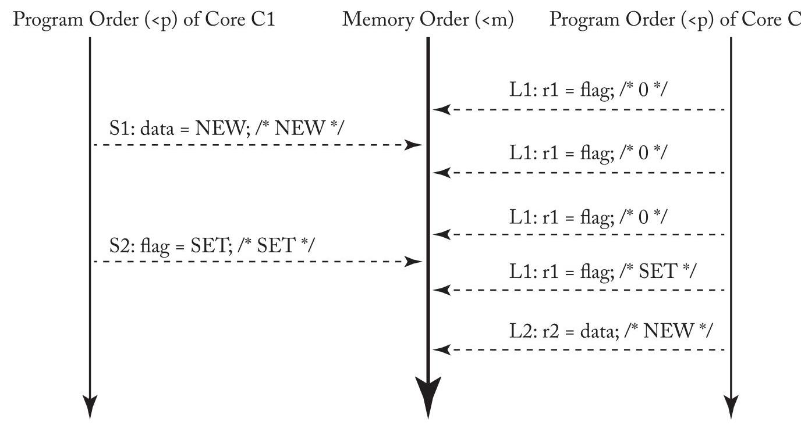
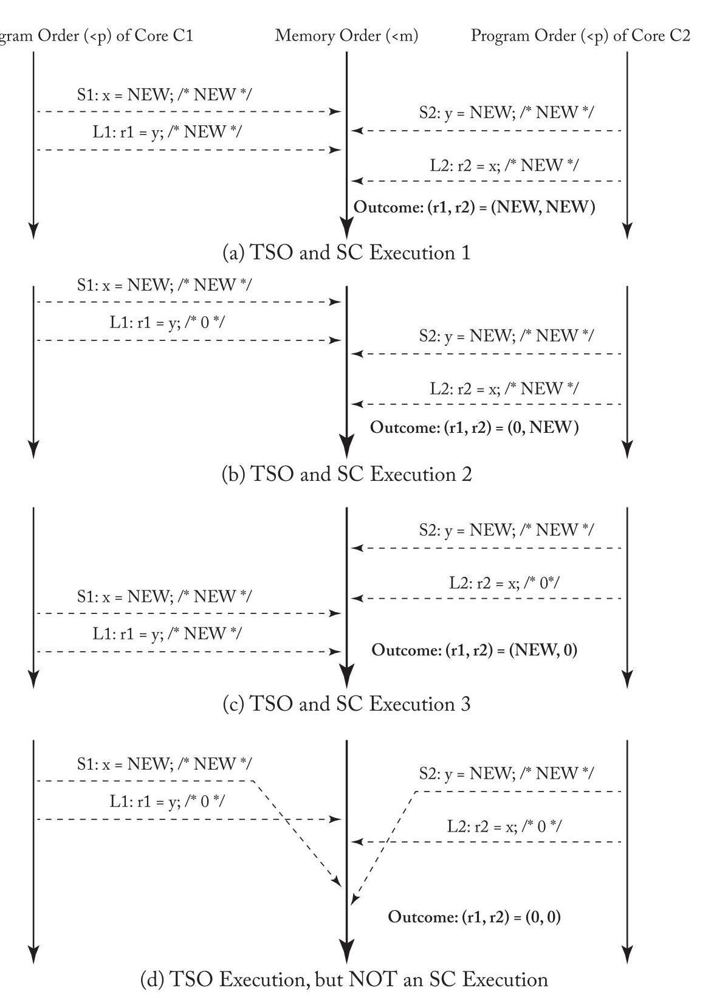
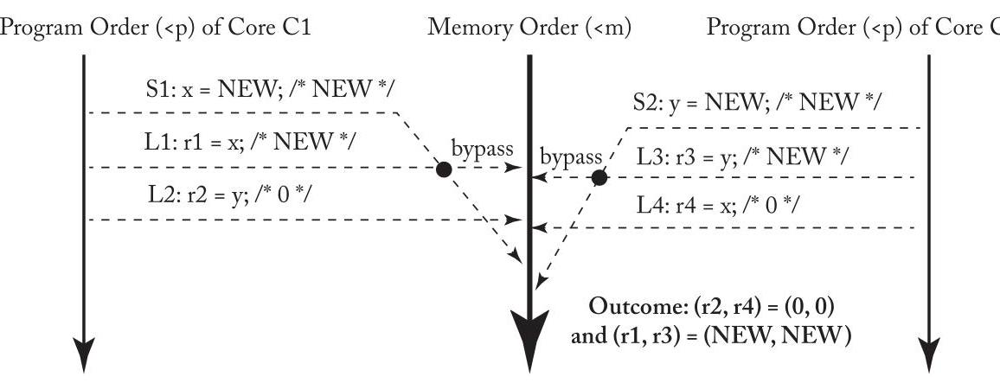
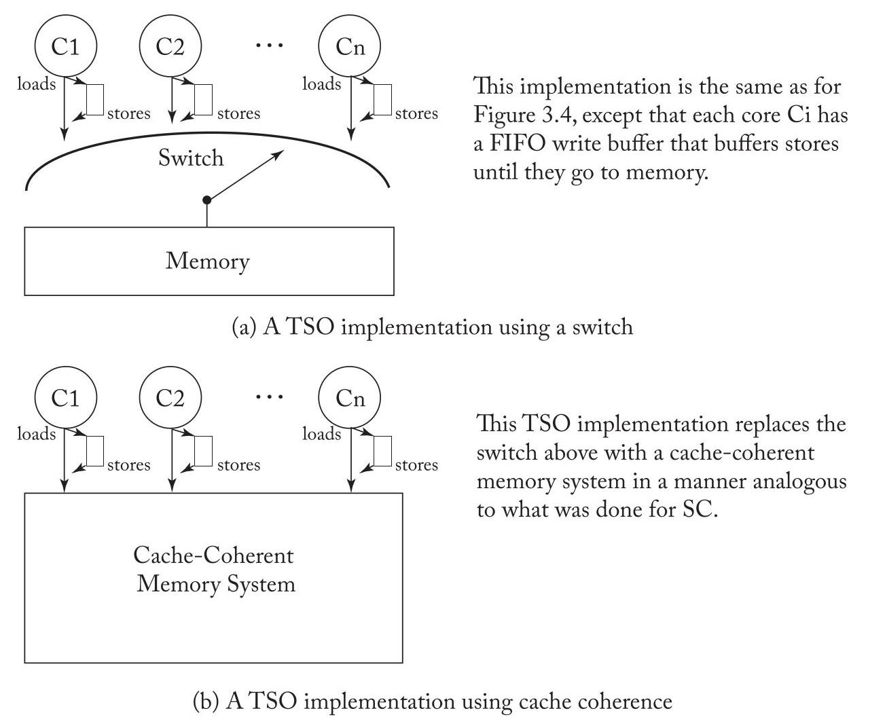
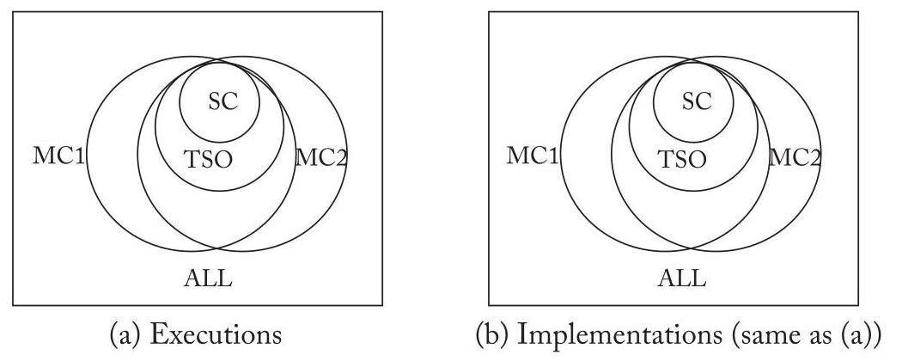

## CHAPTER 4 Total Store Order and the x86 Memory Model

A widely implemented memory consistency model is total store order (TSO). TSO was first introduced by SPARC and, more importantly, appears to match the memory consistency model of the widely used x86 architecture. RISC-V also supports a TSO extension, RVTSO, in part to aid porting of code originally written for x86 or SPARC architectures. This chapter presents this important consistency model using a pattern similar to that in the previous chapter on sequential consistency. We first motivate TSO/x86 (Section 4.1) in part by pointing out limitations of SC. We then present TSO/x86 at an intuitive level (Section 4.2) before describing it more formally (Section 4.3), explaining how systems implement TSO/x86, including atomic instructions and instructions used to enforce ordering between instructions (Section 4.4). We conclude by discussing other resources for learning more about TSO/x86 (Section 4.5) and comparing TSO/x86 and SC (Section 4.6).

> 
一种被广泛实现的内存一致性模型是全序存储 (total store order, TSO)。TSO 最初由 SPARC 引入，更重要的是，它似乎与广泛使用的 x86 架构的内存一致性模型相符。RISC-V 也支持一种 TSO 扩展，即 RVTSO，部分原因是为了帮助移植最初为 x86 或 SPARC 架构编写的代码。本章采用与上一章介绍顺序一致性 (sequential consistency, SC) 时类似的模式，来介绍这一重要的内存一致性模型。我们首先通过指出 SC 的局限性来引出 TSO/x86（第 4.1 节）。然后，我们先在直观层面介绍 TSO/x86（第 4.2 节），再更正式地描述它（第 4.3 节），并解释系统如何实现 TSO/x86，包括原子指令和用于强制指令间排序的指令（第 4.4 节）。最后，我们讨论其他学习 TSO/x86 的资料（第 4.5 节），并对 TSO/x86 与 SC 进行比较（第 4.6 节）。

### 4.1 MOTIVATION FOR TSO/X86

Processor cores have long used write (store) buffers to hold committed (retired) stores until the rest of the memory system could process the stores. A store enters the write buffer when the store commits, and a store exits the write buffer when the block to be written is in the cache in a read-write coherence state. Significantly, a store can enter the write buffer before the cache has obtained read-write coherence permissions for the block to be written; the write buffer thus hides the latency of servicing a store miss. Because stores are common, being able to avoid stalling on most of them is an important benefit. Moreover, it seems sensible to not stall the core because the core does not need anything, as the store seeks to update memory but not core state.

> 
处理器核心长期以来一直使用写（存储）缓冲区 (write (store) buffer) 来保存已提交（退休）的存储操作 (committed (retired) stores)，直到内存系统的其余部分能够处理这些存储。当存储操作提交时，它进入写缓冲区；当要写入的块以可读写的一致性状态存在于缓存中时，存储操作离开写缓冲区。重要的是，存储操作可以在缓存获得要写入块的可读写一致性权限之前就进入写缓冲区；因此，写缓冲区隐藏了服务存储未命中时的延迟。由于存储操作很常见，能够在大多数存储操作上避免停顿是一个重要的好处。此外，不让核心停顿似乎是合理的，因为核心不需要任何东西，存储操作试图更新内存而非核心状态。

For a single-core processor, a write buffer can be made architecturally invisible by ensuring that a load to address A returns the value of the most recent store to A even if one or more stores to A are in the write buffer. This is typically done by either bypassing the value of the most recent store to A to the load from A, where "most recent" is determined by program order, or by stalling a load of A if a store to A is in the write buffer.

> 
对于单核处理器，通过确保对地址 A 的加载 (load) 返回最近一次对 A 的存储 (store) 的值，即使有一个或多个对 A 的存储位于写缓冲区 (write buffer) 中，也可以使写缓冲区在架构上不可见。这通常通过以下两种方式实现：要么将最近一次对 A 的存储的值旁路 (bypassing) 到对 A 的加载，其中“最近”由程序顺序 (program order) 确定；要么如果对 A 的存储位于写缓冲区中，则使对 A 的加载停顿 (stalling)。

When building a multicore processor, it seems natural to use multiple cores, each with its own bypassing write buffer, and assume that the write buffers continue to be architecturally invisible.

> 
在构建多核处理器时，很自然地会使用多个核心，每个核心都有自己的旁路写缓冲区，并假设这些写缓冲区在架构上仍然不可见。

40 4. TOTAL STORE ORDER AND THE x86 MEMORY MODEL

> 
40 4. 全存储排序 (TOTAL STORE ORDER) 与 x86 内存模型

Table 4.1: Can both r1 and r2 be set to 0?

> 
表 4.1：r1 和 r2 可以都设为 0 吗？

<table><tr><td>Core C1</td><td>Core C2</td><td>Comments</td></tr><tr><td>S1: x = NEW;   L2: r1 = y;</td><td>S2: y = NEW;   L2: r2 = x;</td><td>/* Initially, $\mathrm{x} = 0\& \mathrm{y} = 0$ */</td></tr></table>

This assumption is wrong. Consider the example code in Table 4.1 (which is the same as Table 3.3 in the previous chapter). Assume a multicore processor with in-order cores, where each core has a single-entry write buffer and executes the code in the following sequence.

> 
这一假设是错误的。考虑表 4.1 中的示例代码（与前一章的表 3.3 相同）。假设一个多核处理器，其核心为顺序执行 (in-order) 核心，每个核心带有一个单条目写缓冲区，并按以下顺序执行代码。

- Core C1 executes store S1, but buffers the newly stored NEW value in its write buffer.

> 
- 核心 C1 (Core C1) 执行存储操作 (store) S1，但将新存储的 NEW 值缓冲在其写缓冲区 (write buffer) 中。

- Likewise, core C2 executes store S2 and holds the newly stored NEW value in its write buffer.

> 
- 同样地，核心 C2 执行存储指令 (store) S2，并将新存储的 NEW 值保留在其写缓冲区 (write buffer) 中。

- Next, both cores perform their respective loads, L1 and L2, and obtain the old values of 0.

> 
- 接下来，两个核心分别执行各自的加载操作 L1 和 L2，并获取到旧值 0。

- Finally, both cores' write buffers update memory with the newly stored values NEW.

> 
- 最终，两个核心的写缓冲区 (write buffers) 用新存储的值 NEW 更新内存。

The net result is that $\left( {\mathrm{r}1,\mathrm{r}2}\right)  = \left( {0,0}\right)$ . As we saw in the previous chapter, this is an execution result forbidden by SC. Without write buffers, the hardware is SC, but with write buffers, it is not, making write buffers architecturally visible in a multicore processor.

> 
最终结果是 $\left( {\mathrm{r}1,\mathrm{r}2}\right)  = \left( {0,0}\right)$ 。正如我们在前一章中所看到的，这是一个被顺序一致性 (SC) 所禁止的执行结果。在没有写缓冲区 (write buffer) 的情况下，硬件是顺序一致性的；但在有写缓冲区的情况下，它就不是了，这使得写缓冲区在多核处理器中在架构上变得可见。

One response to write buffers being visible would be to turn them off, but vendors have been loath to do this because of the potential performance impact. Another option is to use aggressive, speculative SC implementations that make write buffers invisible again, but doing so adds complexity and can waste power to both detect violations and handle mis-speculations.

> 
针对写缓冲区 (write buffer) 可见的一种应对措施是将其关闭，但厂商一直不愿这样做，因为这可能会影响性能。另一种选择是采用激进的、推测性顺序一致性 (speculative SC) 实现，使写缓冲区再次不可见，但这样做会增加复杂性，并可能在检测违规 (violation) 和处理误推测 (mis-speculation) 时浪费功耗。

The option chosen by SPARC and later x86 was to abandon SC in favor of a memory consistency model that allows straightforward use of a first-in-first-out (FIFO) write buffer at each core. The new model, TSO, allows the outcome "(r1, r2) = (0, 0)." This model astonishes some people but, it turns out, behaves like SC for most programming idioms and is well defined in all cases.

> 
SPARC 以及后来的 x86 选择放弃顺序一致性 (SC)，转而采用一种能够在每个核心上直接使用先进先出 (FIFO) 写缓冲的内存一致性模型。这种新模型——全存储排序 (TSO)——允许出现结果 "(r1, r2) = (0, 0)"。该模型令一些人感到惊讶，但事实证明，对于大多数编程惯用法，它的行为与 SC 类似，并且在所有情况下都有明确的定义。

### 4.2 BASIC IDEA OF TSO/X86

As execution proceeds, SC requires that each core preserves the program order of its loads and stores for all four combinations of consecutive operations:

> 
随着执行的进行，顺序一致性 (SC) 要求每个核心对于所有四种连续操作组合，保持其加载和存储的程序顺序：

---

- Load $\rightarrow$ Load

> 
- 加载 $\rightarrow$ 加载

- Load $\rightarrow$ Store

> 
- 加载 (Load) $\rightarrow$ 存储 (Store)

- Store $\rightarrow$ Store

> 
- 存储 (Store) $\rightarrow$ 存储 (Store)

---

- Store $\rightarrow$ Load /* Included for SC but omitted for TSO */

> 
- 存储 $\rightarrow$ 加载 /* 在 SC 中包含，但在 TSO 中省略 */

TSO includes the first three constraints but not the fourth. This omission does not matter for most programs. Table 4.2 repeats the example program of Table 3.1 in the previous chapter. In this case, TSO allows the same executions as SC because TSO preserves the order of core C1's two stores and core C2's two (or more) loads. Figure 4.1 (the same as Figure 3.2 in the previous chapter) illustrates the execution of this program.

> 
TSO 包含前三项约束，但不包含第四项。这一省略对大多数程序而言无关紧要。表 4.2 重复了前一章中表 3.1 的示例程序。在此情况下，TSO 允许与 SC（顺序一致性）相同的执行结果，因为 TSO 保留了核 C1 的两次存储操作 (store) 以及核 C2 的两次（或更多次）加载操作 (load) 的顺序。图 4.1（与前一章中的图 3.2 相同）展示了该程序的执行过程。

Table 4.2: Should r2 always be set to NEW?

> 
表 4.2：r2 是否应始终设为 NEW？

<table><tr><td>Core C1</td><td>Core C2</td><td>Comments</td></tr><tr><td>S1: Store data = NEW;   S2: Store flag = SET;</td><td>L1: Load r1 = flag B1: if (r1 ≠ SET) goto L1; L2: Load r2=data;</td><td>/* Initially, data = 0 & flag ≠ SET */ /* L1 & B1 may repeat many times */</td></tr></table>

Figure 4.1: A TSO execution of Table 4.2's program.

> 
图4.1：表4.2程序的一次TSO (Total Store Order) 执行。

More generally, TSO behaves the same as SC for common programming idioms that follow:

> 
更一般地说，对于如下常见的编程惯用语，全存储定序 (Total Store Order, TSO) 的行为与顺序一致性 (Sequential Consistency, SC) 相同：

- C1 loads and stores to memory locations D1, ..., Dn (often data),

> 
- C1 对内存位置 D1，...，Dn 进行加载和存储（通常是数据），

- C1 stores to $\mathrm{F}$ (often a synchronization flag) to indicate that the above work is complete,

> 
- C1 存入 $\mathrm{F}$（通常是同步标志）以表示上述工作已完成，

## 42 4. TOTAL STORE ORDER AND THE x86 MEMORYMODEL

- C2 loads from F to observe the above work is complete (sometimes spinning first and often using a RMW instruction), and

> 
- C2 从 F 加载 (load) 以观察上述工作已完成（有时先自旋 (spinning) 并且通常使用读-改-写指令 (RMW instruction)），并且

- C2 loads and stores to some or all of the memory locations D1, ..., Dn.

> 
- C2 对部分或全部内存位置 D1, ..., Dn 进行加载和存储。

TSO, however, allows some non-SC executions. Under TSO, the program from Table 4.1 (repeat of Table 3.3 from the last chapter) allows all four outcomes depicted in Figure 4.2. Under SC, only the first three are legal outcomes (as depicted in Figure 3.3 of the last chapter). The execution in Figure 4.2d illustrates an execution that conforms to TSO but violates SC by not honoring the fourth (i.e., Store $\rightarrow$ Load) constraint. Omitting the fourth constraint allows each core to use a write buffer. Note that the third constraint means that the write buffer must be FIFO (and not, for example, coalescing) to preserve store-store order.

> 
TSO 则允许某些非顺序一致性 (SC) 的执行。在 TSO 下，来自表 4.1 的程序（即上一章表 3.3 的重现）允许图 4.2 所描绘的全部四种结果。在 SC 下，仅前三种是合法结果（如上一章图 3.3 所示）。图 4.2d 的执行描绘了一种符合全存储排序 (TSO) 但违背顺序一致性 (SC) 的情况，因为它未遵守第四条（即 Store $\rightarrow$ Load）约束。忽略第四条约束使得每个核都能使用写缓冲区 (write buffer)。注意，第三条约束意味着写缓冲区必须是先入先出 (FIFO)（而非例如合并 (coalescing)）以维持存储-存储顺序 (store-store order)。

Programmers (or compilers) can prevent the execution in Figure 4.2d by inserting a FENCE instruction between S1 and L1 on core C1 and between S2 and L2 on core C2. Executing a FENCE on core Ci ensures that Ci's memory operations before the FENCE (in program order) get placed in memory order before Ci's memory operations after the FENCE. FENCEs (a.k.a. memory barriers) are rarely used by programmers using TSO because TSO "does the right thing" for most programs. Nevertheless, FENCEs play an important role for the relaxed models discussed in the next chapter.

> 
程序员（或编译器）可以通过在核心 C1 的 S1 和 L1 之间插入一条 FENCE 指令，以及在核心 C2 的 S2 和 L2 之间插入一条 FENCE 指令，来阻止图 4.2d 中的执行。在核心 Ci 上执行 FENCE 可确保其在 FENCE 之前的内存操作（按程序顺序）在内存顺序中被置于其 FENCE 之后的内存操作之前。使用 TSO 的程序员很少使用 FENCE（又称内存屏障），因为 TSO 对大多数程序“做了正确的事”。然而，FENCE 在下一章讨论的宽松模型中起着重要作用。

TSO does allow some non-intuitive execution results. Table 4.3 illustrates a modified version of the program in Table 4.1 in which cores C1 and C2 make local copies of $\mathrm{x}$ and $\mathrm{y}$ , respectively. Many programmers might assume that if both r2 and r4 equal 0, then r1 and r3 should also be 0 because the stores S1 and S2 must be inserted into memory order after the loads L2 and L4. However, Figure 4.3 illustrates an execution that shows r1 and r3 bypassing the value NEW from the per-core write buffers. In fact, to preserve single-thread sequential semantics, each core must see the effect of its own store in program order, even though the store is not yet observed by other cores. Thus, under all TSO executions, the local copies r1 and r3 will always be set to the NEW value.

> 
全存储定序（Total Store Order，TSO）确实允许一些非直观的执行结果。表4.3展示了表4.1中程序的修改版本，其中核心C1和C2分别创建了 $\mathrm{x}$ 和 $\mathrm{y}$ 的本地副本。许多程序员可能会认为，如果r2和r4都等于0，那么r1和r3也应为0，因为存储操作S1和S2必须在加载操作L2和L4之后插入内存顺序。然而，图4.3展示了一个执行情况，其中r1和r3从每核写缓冲区中绕过了内存，直接获取了值NEW。事实上，为了保持单线程顺序语义，每个核心必须按程序顺序看到自己存储操作的效果，即使该存储操作尚未被其他核心观察到。因此，在所有TSO执行下，本地副本r1和r3将始终被设置为值NEW。

Table 4.3: Can r1 or r3 be set to 0?

> 
表 4.3：r1 或 r3 可以设为 0 吗？

<table><tr><td>Core C1</td><td>Core C2</td><td>Comments</td></tr><tr><td>S1: x = NEW;</td><td>S2: y = NEW;</td><td>/* Initially, x = 0 & y = 0 */</td></tr><tr><td>L1: r1 = x;</td><td>L3: r3 = y;</td><td></td></tr><tr><td>L2: r2 = y;</td><td>L4: r4 = x;</td><td>/* Assume r2 = 0 & r4 = 0 */</td></tr></table>

### 4.3 A LITTLE TSO/X86 FORMALISM

In this section we define TSO more precisely with a definition that makes only three changes to the SC definition of Section 3.5.

> 
在本节中，我们通过一个定义更精确地定义了全序存储（Total Store Order，TSO），该定义仅对第3.5节中的顺序一致性（Sequential Consistency，SC）定义做了三处改动。

Figure 4.2: Four alternative TSO executions of Table 4.1's program.

> 
图4.2：表4.1程序的四种备选TSO（总存储顺序）执行。

Figure 4.3: A TSO execution of Table 4.3's program (with "bypassing").

> 
图 4.3：表 4.3 程序的 TSO（全存储排序）执行（带有“绕过（bypassing）”）

A TSO execution requires the following.

> 
TSO 执行需要满足以下条件。

1. All cores insert their loads and stores into the memory order $< \mathrm{m}$ respecting their program order, regardless of whether they are to the same or different addresses (i.e., a==b or a!=b). There are four cases:

> 
1. 所有核心将其加载与存储（loads and stores）插入到内存顺序（memory order）$< \mathrm{m}$ 中，并遵守各自的程序顺序（program order），无论它们访问的是相同还是不同的地址（即 a==b 或 a!=b）。共有四种情况：

- If $\mathrm{L}\left( \mathrm{a}\right)  < \mathrm{p}\mathrm{L}\left( \mathrm{b}\right)  \Rightarrow  \mathrm{L}\left( \mathrm{a}\right)  < \mathrm{{mL}}\left( \mathrm{b}\right) /{}^{ * }$ Load $\rightarrow$ Load ${}^{ * }/$

> 
- 如果 $\mathrm{L}\left( \mathrm{a}\right)  < \mathrm{p}\mathrm{L}\left( \mathrm{b}\right)  \Rightarrow  \mathrm{L}\left( \mathrm{a}\right)  < \mathrm{{mL}}\left( \mathrm{b}\right) /{}^{ * }$ 加载 (Load) $\rightarrow$ 加载 (Load) ${}^{ * }/$

- If $\mathrm{L}\left( \mathrm{a}\right)  < \mathrm{p}\mathrm{S}\left( \mathrm{b}\right)  \Rightarrow  \mathrm{L}\left( \mathrm{a}\right)  < \mathrm{m}\mathrm{S}\left( \mathrm{b}\right) /{}^{ * }$ Load $\rightarrow$ Store ${}^{ * }/$

> 
- 如果 $\mathrm{L}\left( \mathrm{a}\right)  < \mathrm{p}\mathrm{S}\left( \mathrm{b}\right)  \Rightarrow  \mathrm{L}\left( \mathrm{a}\right)  < \mathrm{m}\mathrm{S}\left( \mathrm{b}\right) /{}^{ * }$ 加载 (Load) $\rightarrow$ 存储 (Store) ${}^{ * }/$

- If $\mathrm{S}\left( \mathrm{a}\right)  < \mathrm{p}\mathrm{S}\left( \mathrm{b}\right)  \Rightarrow  \mathrm{S}\left( \mathrm{a}\right)  < \mathrm{m}\mathrm{S}\left( \mathrm{b}\right) /{}^{ * }$ Store $\rightarrow$ Load*//* Change 1: Enable FIFO Write

> 
- 如果 $\mathrm{S}\left( \mathrm{a}\right)  < \mathrm{p}\mathrm{S}\left( \mathrm{b}\right)  \Rightarrow  \mathrm{S}\left( \mathrm{a}\right)  < \mathrm{m}\mathrm{S}\left( \mathrm{b}\right) /{}^{ * }$ 存储 (Store) $\rightarrow$ 加载 (Load)*//* 变更 1：启用先进先出 (FIFO) 写入

- If $\mathrm{S}\left( \mathrm{a}\right)  < \mathrm{{pL}}\left( \mathrm{b}\right)  \Rightarrow  \mathrm{S}\left( \mathrm{a}\right)  < \mathrm{{mL}}\left( \mathrm{b}\right) /{}^{ * }$ Store $\rightarrow$ Load*//* Change 1: Enable FIFO Write Buffer ${}^{ * }/$

> 
- 如果 $\mathrm{S}\left( \mathrm{a}\right)  < \mathrm{{pL}}\left( \mathrm{b}\right)  \Rightarrow  \mathrm{S}\left( \mathrm{a}\right)  < \mathrm{{mL}}\left( \mathrm{b}\right) /{}^{ * }$ 存储 (Store) $\rightarrow$ 加载 (Load)*//* 变更 1：启用 FIFO 写缓冲区 (FIFO Write Buffer) ${}^{ * }/$

2. Every load gets its value from the last store before it to the same address:

> 
2. 每条加载（load）指令从同一地址上在它之前的最后一个存储（store）指令获取值：

- Value of L(a) = Value of MAX ${}_{ < \mathrm{m}}\{ \mathrm{S}\left( \mathrm{a}\right)  \mid  \mathrm{S}\left( \mathrm{a}\right)  < \mathrm{m}$ L(a) $\} /{}^{ * }$ Change 2: Need Bypassing*/

> 
L(a) 的值 = MAX ${}_{ < \mathrm{m}}\{ \mathrm{S}\left( \mathrm{a}\right)  \mid  \mathrm{S}\left( \mathrm{a}\right)  < \mathrm{m}$ L(a) $\}$ 的值  /{}^{ * }$ 变更 2：需要绕过 */

$$
\text{ - Value of }L\left( a\right)  = \text{ Value of }{MA}{X}_{ < m}\{ S\left( a\right)  \mid  S\left( a\right)  < {mL}\left( a\right) \text{ or }S\left( a\right)  < {pL}\left( a\right) \}
$$

> 
$$
\text{ - }L\left( a\right)\text{的值} = {MA}{X}_{ < m}\{ S\left( a\right)  \mid  S\left( a\right)  < {mL}\left( a\right) \text{ 或 }S\left( a\right)  < {pL}\left( a\right) \} \text{的值}
$$

This last mind-bending equation says that the value of a load is the value of the last store to the same address that is either (a) before it in memory order or (b) before it in program order (but possibly after it in memory order), with option (b) taking precedence (i.e., write buffer bypassing overrides the rest of the memory system).

> 
这个最后的令人费解的等式表明，一个加载（load）的值是对同一地址的最后一次存储（store）的值，该存储要么（a）在内存顺序（memory order）上先于该加载，要么（b）在程序顺序（program order）上先于该加载（但在内存顺序上可能后于该加载），其中选项（b）具有优先权（即，写缓冲绕过（write buffer bypassing）会覆盖内存系统的其余部分）。

3. Part (1) must be augmented to define FENCEs: /* Change 3: FENCEs Order Everything */

> 
3. 第 (1) 部分必须进行扩充以定义 FENCEs：/* Change 3: FENCEs Order Everything */

- If L(a) 
 
- 如果 L(a) 
 
- 如果 S(a) 
 
- 如果栅栏 (FENCE) $< p$ 栅栏 (FENCE) $\Rightarrow$ 栅栏 (FENCE) $< m$ 栅栏 (FENCE) $/{}^{ * }$ 栅栏 (FENCE) $\rightarrow$ 栅栏 (FENCE) ${}^{ * }/$

- If FENCE $< p\mathrm{\;L}\left( \mathrm{a}\right)  \Rightarrow$ FENCE $< \mathrm{m}\mathrm{L}\left( \mathrm{a}\right) /{}^{ * }$ FENCE $\rightarrow$ Load ${}^{ * }/$

> 
- 如果 内存屏障指令 (FENCE) $< p\mathrm{\;L}\left( \mathrm{a}\right)  \Rightarrow$ 内存屏障指令 (FENCE) $< \mathrm{m}\mathrm{L}\left( \mathrm{a}\right) /{}^{ * }$ 内存屏障指令 (FENCE) $\rightarrow$ Load ${}^{ * }/$

- If FENCE $< p\mathrm{\;S}\left( \mathrm{a}\right)  \Rightarrow$ FENCE $< \mathrm{m}\mathrm{S}\left( \mathrm{a}\right) {/}^{ * }$ FENCE $\rightarrow$ Store ${}^{ * }/$

> 
- 如果 FENCE $< p\mathrm{\;S}\left( \mathrm{a}\right)  \Rightarrow$ FENCE $< \mathrm{m}\mathrm{S}\left( \mathrm{a}\right) {/}^{ * }$ FENCE $\rightarrow$ 存储(Store) ${}^{ * }/$

Because TSO already requires all but the Store $\rightarrow$ Load order, one can alternatively define TSO FENCEs as only ordering:

> 
因为TSO（全存储定序）已经要求了除Store → Load顺序之外的所有顺序，因此可以换一种方式将TSO FENCE指令定义为仅保证排序：

- If $\mathrm{S}\left( \mathrm{a}\right)  < \mathrm{p}$ FENCE $\Rightarrow  \mathrm{S}\left( \mathrm{a}\right)  < \mathrm{m}$ FENCE ${/}^{ * }$ Store $\rightarrow$ FENCE ${}^{ * }/$

> 
- 如果 $\mathrm{S}\left( \mathrm{a}\right)  < \mathrm{p}$ 内存屏障 (FENCE) $\Rightarrow  \mathrm{S}\left( \mathrm{a}\right)  < \mathrm{m}$ 内存屏障 (FENCE) ${/}^{ * }$ 存储 (Store) $\rightarrow$ 内存屏障 (FENCE) ${}^{ * }/$

- If FENCE 
 
- 如果 FENCE 
 
我们选择让 TSO 的 FENCE（内存屏障）冗余地对所有操作进行排序，因为这样做不会带来负面影响，并且使它们类似于我们在下一章中为更宽松模型定义的 FENCE（内存屏障）。

We summarize TSO's ordering rules in Table 4.4. This table has two important differences from the analogous table for SC (Table 3.4). First, if Operation #1 is a store and Operation #2 is a load, the entry at that intersection is a "B" instead of an "X"; if these operations are to the same address, the load must obtain the value just stored even if the operations enter memory order out of program order. Second, the table includes FENCEs, which were not necessary in SC; an SC system behaves as if there is already a FENCE before and after every operation.

> 
我们用表4.4总结了TSO的排序规则。该表与SC（顺序一致性）的对应表（表3.4）有两个重要区别。首先，如果操作#1是存储 (store) 而操作#2是加载 (load)，那么两者交叉处的条目为“B”而非“X”；若这些操作针对同一地址，即使操作以不同于程序顺序 (program order) 的次序进入内存顺序 (memory order)，加载也必须获得刚刚存储的值。其次，表中包含了屏障 (FENCE)，这在SC中是不必要的；一个SC系统的行为就像每个操作前后都已经有一个屏障一样。

Table 4.4: TSO ordering rules. An "X" denotes an enforced ordering. A "B" denotes that bypassing is required if the operations are to the same address. Entries that are different from the SC ordering rules are shaded and shown in bold.

> 
表4.4：TSO（Total Store Order）排序规则。“X”表示强制排序。“B”表示如果操作指向同一地址，则需要进行旁路（bypassing）。与SC（Sequential Consistency）排序规则不同的条目用阴影标示并以粗体显示。

<table><tr><td colspan="6">Operation 2</td></tr><tr><td rowspan="5">Operation 1</td><td></td><td>Load</td><td>Store</td><td>RMW</td><td>FENCE</td></tr><tr><td>Load</td><td>X</td><td>X</td><td>X</td><td>X</td></tr><tr><td>Store</td><td>B</td><td>X</td><td>X</td><td>X</td></tr><tr><td>RMW</td><td>X</td><td>X</td><td>X</td><td>X</td></tr><tr><td>FENCE</td><td>X</td><td>X</td><td>X</td><td>X</td></tr></table>

It is widely believed that the x86 memory model is equivalent to TSO (for normal cacheable memory and normal instructions), but to the best of our knowledge, neither AMD nor Intel have guaranteed this or released a formal x86 memory model specification. AMD and Intel publicly define the x86 memory model with examples and prose in a process that is well summarized in Section 2 of Sewell et al. [15]. All examples conform to TSO, and all prose seems consistent with TSO. This equivalence can be proven only if a public, formal description of the x86 memory model were made available. This equivalence could be disproved if counterexample(s) showed an x86 execution not allowed by TSO, a TSO execution not allowed by x86, or both.

> 
人们普遍认为 x86 内存模型与全序存储 (TSO) 等价（针对普通可缓存内存和普通指令），但据我们所知，AMD 和英特尔均未对此给出保证，也未发布正式的 x86 内存模型规范。AMD 和英特尔通过示例和文字描述公开定义 x86 内存模型，这一过程在 Sewell 等人 [15] 的第 2 节中有很好的总结。所有示例均符合 TSO，所有文字描述似乎也与 TSO 一致。只有当一份公开、正式的 x86 内存模型描述可供使用时，这种等价关系才能被证明。如果能找到反例，显示某个 x86 执行不被 TSO 允许，某个 TSO 执行不被 x86 允许，或两者兼有，那么这种等价关系就能被证伪。

## 46 4. TOTAL STORE ORDER AND THE x86 MEMORY MODEL

That x86 is equivalent to TSO is supported by Sewell et al. [15], summarized in CACM with more details elsewhere [9, 14]. In particular, the authors propose the x86-TSO model. The model has two forms that the authors prove equivalent. The first form provides an abstract machine that resembles Figure 4.4a of the next section with the addition of a single global lock for modeling x86 LOCK'd instructions. The second form is a labeled transition system. The first form makes the model accessible to practitioners while the latter eases formal proofs. On one hand, x86-TSO appears consistent with the informal rules and litmus tests in x86 specifications. On the other hand, empirical tests on several AMD and Intel platforms did not reveal any violations of the x86-TSO model (but this is no proof that they cannot). In summary, like Sewell et al., we urge creators of x86 hardware and software to adopt the unambiguous and accessible x86-TSO model.

> 
x86 与全存储排序 (Total Store Order, TSO) 等效这一点得到了 Sewell 等人 [15] 的支持，并在《ACM 通讯》(CACM) 中进行了总结，更多细节见于他处 [9, 14]。特别是，作者提出了 x86-TSO 模型。该模型有两种形式，作者证明了二者等效。第一种形式提供了一个抽象机 (abstract machine)，类似于下一节的图 4.4a，并增加了一个单一全局锁，用于建模 x86 的 LOCK'd 指令。第二种形式是一个标记迁移系统 (labeled transition system)。第一种形式使模型易于为从业者所理解，而后者则简化了形式证明。一方面，x86-TSO 似乎与 x86 规范中的非正式规则和石蕊测试 (litmus tests) 相一致。另一方面，在多个 AMD 和 Intel 平台上的经验测试并没有发现任何违反 x86-TSO 模型的情况（但这并不能证明它们不会违反）。总之，与 Sewell 等人一样，我们敦促 x86 硬件和软件的创建者采纳这种明确且易于理解的 x86-TSO 模型。

Figure 4.4: Two TSO implementations.

> 
图 4.4：两种全存储顺序（TSO）实现。

### 4.4 IMPLEMENTING TSO/X86

The implementation story for TSO/x86 is similar to SC with the addition of per-core FIFO write buffers. Figure 4.4a updates the switch of Figure 3.4 to accommodate TSO and operates as follows.

> 
TSO/x86 的实现情形与顺序一致性 (SC) 类似，不同之处是增加了每核先进先出 (FIFO) 写缓冲区。图 4.4a 对图 3.4 中的开关进行了更新以适配 TSO，并按如下方式运行。

- Loads and stores leave each core in that core's program order <p.

> 
- 加载 (load) 和存储 (store) 按照各自核心的程序顺序 (program order) 离开各个核心。<p.

- A load either bypasses a value from the write buffer or awaits the switch as before.

> 
- 一条加载 (load) 指令要么从写缓冲器 (write buffer) 中旁路 (bypass) 一个值，要么像以前一样等待切换 (switch)。

- A store enters the tail of the FIFO write buffer or stalls the core if the buffer is full.

> 
存储（store）进入 FIFO 写缓冲区（FIFO write buffer）的尾部，或者在缓冲区已满时使核心停顿。

- When the switch selects core Ci, it performs either the next load or the store at the head of the write buffer.

> 
- 当交换机 (switch) 选择核心 (core) Ci 时，它执行下一个加载 (load) 操作或写入缓冲区 (write buffer) 头部 (head) 的存储 (store) 操作。

In Section 3.7, we showed that, for SC, the switch can be replaced by a cache coherent memory system and then argued that cores could be speculative and/or multithreaded and that nonbinding prefetches could be initiated by cores, caches, or software.

> 
在3.7节中，我们展示了，对于顺序一致性 (SC)，交换机可以被缓存一致性内存系统 (cache coherent memory system) 替代，然后论述了核心可以是推测的 (speculative) 和/或多线程的 (multithreaded)，并且非绑定预取 (nonbinding prefetches) 可以由核心、缓存或软件发起。

As illustrated in Figure 4.4b, the same argument holds for TSO with a FIFO writer buffer interposed between each core and the cache-coherent memory system. Thus, aside from the write buffer, all the previous SC implementation discussion holds for TSO and provides a way to build TSO implementations. Moreover, most current TSO implementations seem to use only the above approach: take an SC implementation and insert write buffers.

> 
如图4.4b所示，同样的论证适用于在每个核心与缓存一致的内存系统（cache-coherent memory system）之间插入一个先进先出写缓冲区（FIFO writer buffer）的 TSO（全存储定序）。因此，除了写缓冲区之外，之前所有关于 SC（顺序一致性）实现的讨论都适用于 TSO，并提供了构建 TSO 实现的方法。此外，大多数当前的 TSO 实现似乎仅使用上述方法：采用一个 SC 实现并插入写缓冲区。

Regarding the write buffer, the literature and product space for how exactly speculative cores implement them is beyond the scope of this chapter. For example, microarchitectures can physically combine the store queue (uncommitted stores) and write buffer (committed stores), and/or physically separate load and store queues.

> 
关于写缓冲区 (write buffer)，文献和产品领域中推测执行核心 (speculative cores) 具体如何实现它们的细节已超出本章范围。例如，微架构 (microarchitectures) 可以在物理上将存储队列 (store queue，未提交存储) 与写缓冲区 (write buffer，已提交存储) 合并，和/或在物理上分离加载和存储队列 (load and store queues)。

Finally, multithreading introduces a subtle write buffer issue for TSO. TSO write buffers are logically private to each thread context (virtual core). Thus, on a multithreaded core, one thread context should never bypass from the write buffer of another thread context. This logical separation can be implemented with per-thread-context write buffers or, more commonly, by using a shared write buffer with entries tagged by thread-context identifiers that permit bypassing only when tags match.

> 
最后，多线程为完全存储定序（Total Store Order，TSO）引入了一个微妙的写缓冲区问题。TSO 的写缓冲区在逻辑上对每个线程上下文（虚拟核心）是私有的。因此，在一个多线程核心上，一个线程上下文绝不应从另一个线程上下文的写缓冲区进行绕过。这种逻辑隔离可以通过为每个线程上下文设置独立的写缓冲区来实现，或者更常见的是，采用一个共享的写缓冲区，其中的条目按线程上下文标识符标记，仅当标记匹配时才允许绕过。

Flashback to Quiz Question 4: In a TSO system with multithreaded cores, threads may bypass values out of the write buffer, regardless of which thread wrote the value. True or false? Answer: False! A thread may bypass values that it has written, but other threads may not see the value until the store is inserted into the memory order.

> 
回顾测验问题4：在具有多线程核心的TSO（全局存储定序）系统中，线程可以从写缓冲区（write buffer）中绕过值，而不管哪个线程写入了该值。正确还是错误？答案：错误！一个线程可以绕过它自己写入的值，但其他线程可能看不到该值，直到该存储被插入到内存顺序（memory order）中。

#### 4.4.1 IMPLEMENTING ATOMIC INSTRUCTIONS

The implementation issues for atomic RMW instructions in TSO are similar to those for atomic instructions for SC. The key difference is that TSO allows loads to pass (i.e., be ordered before)

> 
在 TSO（全存储排序）中，原子 RMW（读-改-写）指令的实现问题与 SC（顺序一致性）中原子指令的实现问题类似。关键区别在于 TSO 允许加载操作越过（即，排序在前）

48 4. TOTAL STORE ORDER AND THE x86 MEMORY MODEL

> 
48 4. 全存储排序 (TOTAL STORE ORDER) 与 x86 内存模型 (THE x86 MEMORY MODEL)

earlier stores that have been written to a write buffer. The impact on RMWs is that the "write" (i.e., store) may be written to the write buffer.

> 
已经被写入写缓冲区 (write buffer) 的早期存储操作。其对读-修改-写（RMW）操作的影响在于，“写”（即存储操作）可能会被写入该写缓冲区。

To understand the implementation of atomic RMWs in TSO, we consider the RMW as a load immediately followed by a store.

> 
为了理解 TSO 中原子读-改-写操作 (atomic RMWs) 的实现，我们将 RMW 视为一个加载 (load) 之后立即跟随一个存储 (store)。

The load part of the RMW cannot pass earlier loads due to TSO's ordering rules. It might at first appear that the load part of the RMW could pass earlier stores in the write buffer, but this is not legal. If the load part of the RMW passes an earlier store, then the store part of the RMW would also have to pass the earlier store because the RMW is an atomic pair. But because stores are not allowed to pass each other in TSO, the load part of the RMW cannot pass an earlier store either.

> 
读-改-写 (RMW) 的加载部分由于全序存储 (TSO) 的排序规则，无法越过先前的加载操作。乍看起来，RMW 的加载部分似乎可以越过写缓冲区中更早的存储操作，但这并不合法。如果 RMW 的加载部分越过了一个更早的存储，那么由于 RMW 是一个原子对，其存储部分也必须越过那个更早的存储。但因为在 TSO 中存储操作之间不允许相互越过，所以 RMW 的加载部分同样不能越过更早的存储。

These ordering constraints on RMWs impact the implementation. Because the load part of the RMW cannot be performed until earlier stores have been ordered (i.e., exited the write buffer), the atomic RMW effectively drains the write buffer before it can perform the load part of the RMW. Furthermore, to ensure that the store part can be ordered immediately after the load part, the load part requires read-write coherence permissions, not just the read permissions that suffice for normal loads. Lastly, to guarantee atomicity for the RMW, the cache controller may not relinquish coherence permission to the block between the load and the store.

> 
这些对读-修改-写 (RMW) 操作的顺序约束会影响实现。由于 RMW 的加载部分必须在更早的存储被排序（即，退出写缓冲区）之后才能执行，原子 RMW 实际上会在执行其加载部分之前排空写缓冲区。此外，为了确保存储部分能够在加载部分之后立即排序，加载部分需要读写一致性权限，而不仅仅是普通加载所需的读权限。最后，为了保证 RMW 的原子性，缓存控制器不能在加载和存储之间放弃对该块的一致性权限。

More optimized implementations of RMWs are possible. For example, the write buffer does not need to be drained as long as (a) every entry already in the write buffer has read-write permission in the cache and maintains the read-write permission in the cache until the RMW commits, and (b) the core performs MIPS R10000-style checking of load speculation (Section 3.8). Logically, all of the earlier stores and loads would then commit as a unit (sometimes called a "chunk") immediately before the RMW.

> 
更优化的读-修改-写（RMW）实现是可能的。例如，只要满足以下条件，写缓冲就不需要被排空：(a) 写缓冲中已有的每个条目都在缓存中拥有读写权限，并且保持该读写权限直到 RMW 提交；(b) 处理器核心执行 MIPS R10000 风格的加载推测检查（第 3.8 节）。从逻辑上讲，所有先前的存储和加载将作为一个单元（有时称为“块”）在 RMW 之前立即提交。

#### 4.4.2 IMPLEMENTING FENCES

Systems that support TSO do not provide ordering between a store and a subsequent (in program order) load, although they do require the load to get the value of the earlier store. In situations in which the programmer wants those instructions to be ordered, the programmer must explicitly specify that ordering by putting a FENCE instruction between the store and the subsequent load. The semantics of the FENCE specify that all instructions before the FENCE in program order must be ordered before any instructions after the FENCE in program order. For systems that support TSO, the FENCE thus prohibits a load from bypassing an earlier store. In Table 4.5, we revisit the example from Table 4.1, but we have added two FENCE instructions that were not present earlier. Without these FENCEs, the two loads (L1 and L2) can bypass the two stores (S1 and S2), leading to an execution in which r1 and r2 both get set to zero. The added FENCEs prohibit that reordering and thus prohibit that execution.

> 
支持全存储排序（Total Store Order, TSO）的系统不保证一个存储指令与其后（按程序顺序）的加载指令之间的执行顺序，尽管它们要求该加载指令必须获得之前存储指令所写入的值。在程序员希望这些指令按序执行的情况下，必须通过在这两条指令之间插入一条 FENCE 指令来显式指定该顺序。FENCE 的语义规定：在程序顺序中，所有位于 FENCE 之前的指令必须排在所有位于 FENCE 之后的指令之前。对于支持 TSO 的系统，FENCE 因此禁止一个加载指令绕过其之前的存储指令。在表 4.5 中，我们重新审视表 4.1 中的示例，但添加了两条之前没有的 FENCE 指令。如果没有这些 FENCE，两条加载指令（L1 和 L2）可以绕过两条存储指令（S1 和 S2），从而导致 r1 和 r2 均被设置为零的执行结果。新增的 FENCE 禁止了这种重排序，从而排除了那种执行结果。

Because TSO permits only one type of reordering, FENCEs are fairly infrequent and the implementation of FENCE instructions is not too critical. A simple implementation—such as draining the write buffer when a FENCE is executed and not permitting subsequent loads to execute until an earlier FENCE has committed—may provide acceptable performance.

> 
由于 TSO（全存储排序）仅允许一种类型的重排序（reordering），FENCE（内存屏障指令）相当少见，并且 FENCE 指令的实现也不是特别关键。一种简单的实现——例如在执行 FENCE 时排空写缓冲（write buffer），并且不允许后续的加载（load）指令执行，直到较早的 FENCE 已提交（commit）——可能提供可接受的性能。

Table 4.5: Can both r1 and r2 be set to 0?

> 
表4.5：能否将 r1 和 r2 都设为0？

<table><tr><td>Core C1</td><td>Core C2</td><td>Comments</td></tr><tr><td>S1: x = NEW;</td><td>S2: y = NEW;</td><td>/* Initially, $\mathrm{x} = 0\& \mathrm{y} = 0$ */</td></tr><tr><td>FENCE</td><td>FENCE</td><td></td></tr><tr><td>L1: r1 = y;</td><td>L2: r2 = x;</td><td></td></tr></table>

However, for consistency models that permit far more reordering (discussed in the next chapter), FENCE instructions are more frequent and their implementations can have a significant impact on performance.

> 
然而，对于允许远多数量重排序的一致性模型（consistency models）（将在下一章讨论），FENCE指令（FENCE instructions）更为频繁，其实现（implementations）会对性能（performance）产生显著影响。

## Sidebar: Non-speculative TSO Optimizations

This sidebar describes some advanced non-speculative TSO optimizations.

> 
本侧边栏介绍了一些高级的非推测性 TSO（全序存储，Total Store Order）优化。

Non-speculative TSO reordering. There have been papers that have shown that both loads [11, 12] and stores [13] can be reordered non-speculatively, while still enforcing TSO, using coherence delaying. As mentioned earlier, the key challenge is to ensure that the delays do not cause cyclic dependencies that lead to a deadlock, which all of the above papers address.

> 
非推测性 TSO 重排序。已有研究论文表明，通过一致性延迟（coherence delaying），负载（loads）[11,12]和存储（stores）[13]都可以在仍遵循 TSO 的情况下进行非推测性重排序。如前所述，关键挑战在于确保这种延迟不会引发循环依赖（cyclic dependencies）从而导致死锁（deadlock），而上述论文均解决了这一问题。

RMW without write buffer drain. In Section 4.4.1, we showed how to move the write buffer drain off the critical path using speculation. Rajaram et al. [10] show that the same effect can be achieved non-speculatively if the atomicity semantics of an RMW are redefined. Recall that for the RMW to be atomic, we earlier mandated that the read and the write operations of the RMW must appear consecutively in the TSO global memory order. Consider the following relaxation in which an RMW is deemed to be atomic as long as writes to the same address as that of the RMW do not appear between the read and write in the global memory order. Note that this relaxed definition matches the intuitive definition of an RMW and is sufficient for them to be used in synchronization situations. At the same time, it allows for an RMW implementation in which the load part of the RMW can bypass the earlier stores in the write buffer without requiring MIPS R10000-style load speculation checks. However, ensuring RMW atomicity necessitates coherence delaying until the write buffer drains, which introduces a deadlock hazard. Rajaram et al. [10] show how deadlocks can be avoided.

> 
无需写缓冲排空（write buffer drain）的读-改-写（RMW）。在第4.4.1节中，我们展示了如何使用推测（speculation）将写缓冲排空从关键路径（critical path）上移开。Rajaram等人[10]表明，如果重新定义RMW的原子性语义（atomicity semantics），则可以非推测地实现相同的效果。回想一下，为了使RMW具有原子性，我们之前要求RMW的读操作和写操作必须在TSO全局内存顺序（TSO global memory order）中连续出现。考虑以下放松（relaxation）方式：只要在全局内存顺序中，与RMW地址相同的写操作不出现在该RMW的读和写之间，就认为该RMW是原子的。请注意，这种放松后的定义符合RMW的直观定义，并且足以在同步场景（synchronization situations）中使用它们。同时，它允许一种RMW实现，其中RMW的加载部分可以绕过写缓冲中的较早存储，而无需MIPS R10000风格的加载推测检查（load speculation checks）。然而，确保RMW原子性需要一致性延迟（coherence delaying）直到写缓冲排空，这会引入死锁危险（deadlock hazard）。Rajaram等人[10]展示了如何避免死锁。

Reordering past a FENCE. There have been several papers that have proposed optimized FENCE implementations $\left\lbrack  {3,4,6,8}\right\rbrack$ that enable memory operations following the FENCE to be non-speculatively retired before those that precede the FENCE. These techniques either use coherence delays or predecessor serialization or a combination of both.

> 
越过内存屏障 (FENCE) 的重排序。已经有若干论文提出了优化的内存屏障 (FENCE) 实现 $\left\lbrack {3,4,6,8}\right\rbrack$，使得位于内存屏障 (FENCE) 之后的内存操作可以在那些位于内存屏障 (FENCE) 之前的操作被非推测性地提交 (retired) 之前就被非推测性地提交 (retired)。这些技术要么使用一致性延迟 (coherence delays)，要么使用前驱串行化 (predecessor serialization)，或者两者的结合。

### 4.5 FURTHER READING REGARDING TSO

Collier [2] characterized alternative memory consistency models, including that of the IBM System/370, via a model in which each core has a full copy of memory, its loads read from the local copy, and its writes update all copies according to some restrictions that define a model. Were TSO defined with this model, each store would write its own core's memory copy immediately and then possibly later update all other memories together.

> 
Collier [2] 通过一个模型描述了一组替代的内存一致性模型 (memory consistency models)，包括 IBM System/370 的模型，在该模型中，每个核心 (core) 拥有完整的内存副本 (full copy of memory)，其加载操作 (loads) 从本地副本 (local copy) 读取，其写入操作 (writes) 根据定义模型的某些限制 (restrictions) 更新所有副本。倘若总存储序 (TSO) 以此模型定义，那么每个存储操作 (store) 会立即写入自己核心的内存副本，然后可能稍后一起更新所有其他内存。

Goodman [7] publicly discussed the idea of processor consistency (PC), wherein a core's stores reach other cores in order but do not necessarily reach other cores at the same "time." Gharachorloo et al. [5] more precisely define PC. TSO and x86-TSO are special cases of PC in which each core sees its own store immediately, and when any other cores see a store, all other cores see it. This property is called write atomicity in the next chapter (Section 5.5).

> 
Goodman [7] 公开讨论了处理器一致性 (processor consistency, PC) 的思想，其中一个核心的存储按顺序到达其他核心，但不一定在相同的“时间”到达其他核心。Gharachorloo 等人 [5] 更精确地定义了 PC。TSO 和 x86-TSO 是 PC 的特例，其中每个核心立即看到自己的存储，并且当任何其他核心看到某个存储时，所有其他核心也都看到它。这一特性在下一章（第 5.5 节）中被称为写原子性 (write atomicity)。

To the best of our knowledge, TSO was first formally defined by Sindhu et al. [16]. As discussed, in Section 4.3, Sewell et al. [9, 14, 15] propose and formalize the x86-TSO model that appears consistent with AMD and Intel x86 documentation and current implementations.

> 
据我们所知，总存储顺序 (TSO) 最早由 Sindhu 等人 [16] 正式定义。如第 4.3 节所述，Sewell 等人 [9, 14, 15] 提出并形式化了 x86 总存储顺序 (x86-TSO) 模型，该模型看起来与 AMD 和 Intel 的 x86 文档及现有实现相一致。

### 4.6 COMPARING SC AND TSO

Now that we have seen two memory consistency models, we can compare them. How do SC, TSO, etc., relate?

> 
现在我们已经看到了两种内存一致性模型，我们可以对它们进行比较。SC（顺序一致性，Sequential Consistency）、TSO（全存储排序，Total Store Order）等如何关联？

- Executions: SC executions are a proper subset of TSO executions; all SC executions are TSO executions, while some TSO executions are SC executions and some are not. See the Venn diagram in Figure 4.5a.

> 
- 执行：SC 执行是 TSO 执行的真子集；所有 SC 执行都是 TSO 执行，而有些 TSO 执行是 SC 执行，有些则不是。参见图 4.5a 中的文氏图。

- Implementations: Implementations follow the same rules: SC implementations are a proper subset of TSO implementations. See Figure 4.5b, which is the same as Figure 4.5a.

> 
- 实现：实现遵循相同的规则：SC（顺序一致性）实现是 TSO（全存储排序）实现的真子集。请参见图 4.5b，该图与图 4.5a 相同。

More generally, a memory consistency model Y is strictly more relaxed (weaker) than a memory consistency model X if all X executions are also Y executions, but not vice versa. If Y is more relaxed than X, then it follows that all X implementations are also Y implementations. It is also possible that two memory consistency models are incomparable because both allow executions precluded by the other.

> 
更一般地，如果内存一致性模型 (memory consistency model) Y 的所有执行 (executions) 也是内存一致性模型 X 的执行，但反之不成立，则 Y 严格比 X 更宽松 (更弱) (strictly more relaxed (weaker))。如果 Y 比 X 更宽松，那么可以得出所有 X 的实现 (implementations) 也是 Y 的实现。同样可能的是，两个内存一致性模型是不可比较的 (incomparable)，因为两者都允许对方所排除 (precluded) 的执行。

As Figure 4.5 depicts, TSO is more relaxed than SC but less relaxed than incomparable models MC1 and MC2. In the next chapter, we will see candidates for MC1 and MC2, including a case study for the IBM Power memory consistency model.

> 
如图 4.5 所示，TSO 比 SC 更宽松，但不如不可比较的模型 MC1 和 MC2 宽松。在下一章中，我们将看到 MC1 和 MC2 的候选模型，包括对 IBM Power 内存一致性模型的一个案例研究。

Figure 4.5: Comparing memory consistency models.

> 
图4.5：比较内存一致性模型（memory consistency models）。

## What is a Good Memory Consistency Model?

A good memory consistency model should possess Sarita Adve's 3Ps [1] plus our fourth P:

> 
一个好的内存一致性模型应当具备 Sarita Adve 的 3P [1]，再加上我们的第四个 P：

- Programmability: A good model should make it (relatively) easy to write multithreaded programs. The model should be intuitive to most users, even those who have not read the details. It should be precise, so that experts can push the envelope of what is allowed.

> 
- 可编程性（Programmability）：一个好的模型应使编写多线程程序（multithreaded programs）变得（相对）容易。该模型应对大多数用户而言直观易懂，即使那些未阅读细节的用户也能如此。它应足够精确，以便专家能够突破所允许的界限。

- Performance: A good model should facilitate high-performance implementations at reasonable power, cost, etc. It should give implementors broad latitude in options.

> 
- 性能 (Performance): 一个好的模型应能够在合理的功耗、成本等条件下促进高性能实现。它应为实现者提供广泛的选择余地。

- Portability: A good model would be adopted widely or at least provide backward compatibility or the ability to translate among models.

> 
- 可移植性（Portability）：一个好的模型应当被广泛采用，或者至少提供向后兼容性（backward compatibility）或在模型之间进行转换的能力。

- Precision: A good model should be precisely defined, usually with mathematics. Natural languages are too ambiguous to enable experts to push the envelope of what is allowed.

> 
- 精确性 (Precision): 一个好的模型应当被精确定义，通常借助数学。自然语言过于模糊，无法让专家突破被允许的边界。

## How good are SC and TSO?

Using these 4Ps:

> 
使用这些4P (4Ps)：

- Programmability: SC is the most intuitive. TSO is close because it acts like SC for common programming idioms. Nevertheless, subtle non-SC executions can bite programmers and tool authors.

> 
- 可编程性：顺序一致性 (SC) 是最直观的。全存储排序 (TSO) 接近，因为它对于常见的编程惯用法表现得像顺序一致性 (SC)。然而，微妙的不符合顺序一致性 (SC) 的执行可能会困扰程序员和工具作者。

- Performance: For simple cores, TSO can offer better performance than SC, but the difference can be made small with speculation.

> 
- 性能：对于简单核心，全存储排序 (TSO) 可以提供比顺序一致性 (SC) 更好的性能，但通过推测可以将这种差异缩小。

- Portability: SC is widely understood, while TSO is widely adopted.

> 
可移植性：顺序一致性 (SC) 被广泛理解，而全存储排序 (TSO) 被广泛采用。

- Precise: SC and TSO are formally defined.

> 
- 精确：SC 和 TSO 得到了正式定义。

The bottom line is that SC and TSO are pretty close, especially compared with the more complex and more relaxed memory consistency models discussed in the next chapter.

> 
归根结底，顺序一致性 (SC) 和全序存储 (TSO) 非常接近，尤其是与下一章讨论的更复杂且更宽松的内存一致性模型 (memory consistency models) 相比较时。

52 4. TOTAL STORE ORDER AND THE x86 MEMORY MODEL

> 
52 4. 全存储排序 (Total Store Order) 与 x86 内存模型 (x86 Memory Model)

### 4.7 REFERENCES

[1] S. V. Adve. Designing memory consistency models for shared-memory multiprocessors. Ph.D. thesis, Computer Sciences Department, University of Wisconsin-Madison, November 1993. 51

> 
[1] S. V. Adve. 为共享内存多处理器设计内存一致性模型 (Designing memory consistency models for shared-memory multiprocessors). 博士论文 (Ph.D. thesis), 计算机科学系 (Computer Sciences Department), 威斯康星大学麦迪逊分校 (University of Wisconsin-Madison), 1993年11月. 51

[2] W. W. Collier. Reasoning About Parallel Architectures. Prentice-Hall, Inc., 1990. 50

> 
[2] W. W. Collier. 《并行架构推理》。Prentice-Hall 出版社，1990年。50

[3] Y. Duan, A. Muzahid, and J. Torrellas. WeeFence: Toward making fences free in TSO. In The 40th Annual International Symposium on Computer Architecture, 2013. DOI: 10.1145/2485922.2485941. 49

> 
[3] Y. Duan, A. Muzahid 和 J. Torrellas. WeeFence: 迈向在TSO中消除内存屏障. 收录于第40届计算机体系结构国际研讨会, 2013. DOI: 10.1145/2485922.2485941. 49

[4] Y. Duan, N. Honarmand, and J. Torrellas. Asymmetric memory fences: Optimizing both performance and implementability. In Proc. of the 20th International Conference on Architectural Support for Programming Languages and Operating Systems, 2015. DOI: 10.1145/2694344.2694388. 49

> 
[4] Y. Duan、N. Honarmand 和 J. Torrellas. 非对称内存栅障 (Asymmetric memory fences)：优化性能与可实现性。收录于《第20届编程语言与操作系统架构支持国际会议论文集》，2015年。DOI: 10.1145/2694344.2694388. 49

[5] K. Gharachorloo, D. Lenoski, J. Laudon, P. Gibbons, A. Gupta, and J. Hennessy. Memory consistency and event ordering in scalable shared-memory. In Proc. of the 17th Annual International Symposium on Computer Architecture, pp. 15-26, May 1990. DOI: 10.1109/isca.1990.134503. 50

> 
[5] K. Gharachorloo, D. Lenoski, J. Laudon, P. Gibbons, A. Gupta, and J. Hennessy. 可扩展共享内存中的内存一致性与事件排序 (Memory consistency and event ordering in scalable shared-memory). 收录于第17届计算机架构年度国际研讨会会议录 (Proc. of the 17th Annual International Symposium on Computer Architecture), 第15-26页, 1990年5月. DOI: 10.1109/isca.1990.134503. 50

[6] K. Gharachorloo, M. Sharma, S. Steely, and S. Van Doren. Architecture and design of AlphaServer GS320. In Proc. of the 9th International Conference on Architectural Support for Programming Languages and Operating Systems, 2000. DOI: 10.1145/378993.378997. 49

> 
[6] K. Gharachorloo, M. Sharma, S. Steely, 和 S. Van Doren. AlphaServer GS320的架构 (Architecture) 与设计. 见：第9届编程语言与操作系统架构支持 (Architectural Support) 国际会议论文集, 2000. DOI: 10.1145/378993.378997. 49

[7] J. R. Goodman. Cache consistency and sequential consistency. Technical Report 1006, Computer Sciences Department, University of Wisconsin-Madison, February 1991. 50

> 
[7] J. R. Goodman. 缓存一致性 (Cache consistency) 与顺序一致性 (sequential consistency). 技术报告 1006，威斯康星大学麦迪逊分校计算机科学系，1991年2月. 50

[8] C. Lin, V. Nagarajan, and R. Gupta. Efficient sequential consistency using conditional fences. In 19th International Conference on Parallel Architectures and Compilation Techniques, 2010. DOI: 10.1145/1854273.1854312. 49

> 
[8] C. Lin, V. Nagarajan 和 R. Gupta. 利用条件栅栏 (conditional fences) 实现高效顺序一致性 (sequential consistency). 载于第19届并行架构与编译技术国际会议 (19th International Conference on Parallel Architectures and Compilation Techniques), 2010. DOI: 10.1145/1854273.1854312. 49

[9] S. Owens, S. Sarkar, and P. Sewell. A better x86 memory model: x86-TSO. In Proc. of the Conference on Theorem Proving in Higher Order Logics, 2009. DOI: 10.1007/978-3-642- 03359-9_27. 46, 50

> 
[9] S. Owens、S. Sarkar 和 P. Sewell. 一种更好的 x86 内存模型 (x86 memory model)：x86-TSO. 载于《高阶逻辑中的定理证明 (Theorem Proving in Higher Order Logics)》会议论文集，2009. DOI: 10.1007/978-3-642- 03359-9_27. 46, 50.

[10] B. Rajaram, V. Nagarajan, S. Sarkar, and M. Elver. Fast RMWs for TSO: Semantics and implementation. In Proc. of ACM SIGPLAN Conference on Programming Language Design and Implementation, 2013. DOI: 10.1145/2491956.2462196. 49

> 
[10] B. Rajaram, V. Nagarajan, S. Sarkar, 和 M. Elver. 面向全序存储 (TSO) 的快速读-改-写操作 (RMWs)：语义与实现. 收录于 ACM SIGPLAN 编程语言设计与实现会议论文集, 2013. DOI: 10.1145/2491956.2462196. 49

[11] A. Ros, T. E. Carlson, M. Alipour, and S. Kaxiras. Non-speculative load-load reordering in TSO. In Proc. of the 44th Annual International Symposium on Computer Architecture, 2017. DOI: 10.1145/3079856.3080220. 49

> 
[11] A. Ros, T. E. Carlson, M. Alipour 和 S. Kaxiras. TSO中的非推测性加载-加载重排序 (Non-speculative load-load reordering in TSO). 收录于第44届国际计算机体系结构研讨会论文集 (Proceedings of the 44th Annual International Symposium on Computer Architecture), 2017. DOI: 10.1145/3079856.3080220. 49

4.7. REFERENCES 53

> 
4.7. 参考文献 53

[12] A. Ros and S. Kaxiras. The superfluous load queue. In 51st Annual IEEE/ACM International Symposium on Microarchitecture, 2018. DOI: 10.1109/micro.2018.00017. 49

> 
[12] A. Ros 和 S. Kaxiras. 多余的加载队列（load queue）. 在第51届IEEE/ACM国际微架构年度研讨会（51st Annual IEEE/ACM International Symposium on Microarchitecture），2018. DOI: 10.1109/micro.2018.00017. 49

[13] A. Ros and S. Kaxiras. Non-speculative store coalescing in total store order. In 45th ACM/IEEE Annual International Symposium on Computer Architecture, 2018. DOI: 10.1109/isca.2018.00028. 49

> 
[13] A. Ros 和 S. Kaxiras. 全存储顺序（total store order）中的非推测性存储合并（Non-speculative store coalescing）。见第45届 ACM/IEEE 计算机体系结构年度国际研讨会（45th ACM/IEEE Annual International Symposium on Computer Architecture），2018. DOI: 10.1109/isca.2018.00028. 49

[14] S. Sarkar, P. Sewell, F. Z. Nardelli, S. Owens, T. Ridge, T. Braibant, M. O. Myreen, and J. Alglave. The semantics of x86-CC multiprocessor machine code. In Proc. of the 36th Annual ACM SIGPLAN-SIGACT Symposium on Principles of Programming Lanouages, pp. 379- 391, 2009. DOI: 10.1145/1480881.1480929. 46, 50

> 
[14] S. Sarkar、P. Sewell、F. Z. Nardelli、S. Owens、T. Ridge、T. Braibant、M. O. Myreen 和 J. Alglave。x86-CC 多处理器机器码的语义。载于《第36届 ACM SIGPLAN-SIGACT 编程语言原理研讨会论文集》，第379–391页，2009年。DOI: 10.1145/1480881.1480929。46, 50

[15] P. Sewell, S. Sarkar, S. Owens, F. Z. Nardelli, and M. O. Myreen. x86-TSO: A rigorous and usable programmer's model for x86 multiprocessors. Communications of the ACM, July 2010. DOI: 10.1145/1785414.1785443. 45, 46, 50

> 
[15] P. Sewell、S. Sarkar、S. Owens、F. Z. Nardelli 和 M. O. Myreen。x86-TSO：一个严谨且实用的 x86 多处理器程序模型 (x86-TSO: A rigorous and usable programmer's model for x86 multiprocessors)。《美国计算机协会通讯》(Communications of the ACM)，2010年7月。DOI: 10.1145/1785414.1785443。45, 46, 50

[16] P. Sindhu, J.-M. Frailong, and M. Ceklov. Formal specification of memory models. Technical Report CSL-91-11, Xerox Palo Alto Research Center, December 1991. DOI: 10.1007/978-1-4615-3604-8_2. 50

> 
[16] P. Sindhu, J.-M. Frailong, 和 M. Ceklov. 内存模型的形式化规约 (Formal specification of memory models). 技术报告 CSL-91-11, 施乐帕洛阿尔托研究中心 (Xerox Palo Alto Research Center), 1991年12月. DOI: 10.1007/978-1-4615-3604-8_2. 50
