# FLUX: Fast Software-Based Communication Overlap on GPUs through Kernel Fusion 深度解读

> **作者**：Li-Wen Chang、Wenlei Bao、Qi Hou、Chengquan Jiang、Ningxin Zheng、Yinmin Zhong、Xuanrun Zhang、Zuquan Song、Ziheng Jiang、Chengji Yao、Haibin Lin、Xin Jin、Xin Liu；机构为 ByteDance 与北京大学，前七位作者共同一作。  
> **版本与年份**：arXiv:2406.06858v5，首页标注 “A PREPRINT”，2024 年 10 月 25 日；本文按该预印本解读，不推定会议归属。  
> **一句话总结**：FLUX 把张量并行中有数据依赖的通信与 GEMM 分解到 GPU 原生 tile 粒度，并把通信或等待逻辑融入同一个 GEMM kernel，在尽量保住矩阵乘效率的同时隐藏通信延迟。

## 一、问题定义

### 背景：为什么计算分到多张卡，反而会等通信？

大模型的参数和中间结果可能放不进单张 GPU；即使放得下，推理也可能需要多卡共同计算来降低延迟。张量并行（tensor parallelism，TP）把**同一层**的矩阵计算分给多张卡，区别于把不同层放到不同卡的流水并行。它缩小了每张卡承担的计算，但下一步所需的数据未必已经在本地，因此会引入 AllGather 和 ReduceScatter。

AllGather 将每张卡的一份数据拼成完整输入；ReduceScatter 将各卡的部分和相加，再让每张卡只保留自己负责的结果分片。二者都可以与矩阵乘（GEMM）存在直接数据依赖：输入没到就不能计算对应输出，输出还没算好就不能发送它。直接把两个完整操作放到不同 CUDA stream，不能消除这些依赖。

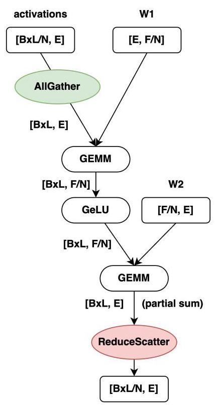

图 2 给出本文的主要应用模式。设展平 batch 与序列后有 (BL) 个 token，隐层宽度为 (E)，MLP 中间宽度为 (F)，TP 度数为 (N)。输入激活按 token 维分片为 ([BL/N,E])，第一层权重为 ([E,F/N])，所以先 AllGather 激活再计算；第二层权重为 ([F/N,E])，每张卡得到 ([BL,E]) 的部分和，再 ReduceScatter 回 ([BL/N,E])。这说明通信不是可随意移动的附属操作，而是相邻计算布局转换的一部分。论文后续报告的 GEMM 尺寸通常是**分片前的全局尺寸**。

本文属于**改进性工作**。已有方法已会将一个大 GEMM 及其通信拆成约 (N) 或 (2N) 个 chunk，通过计算一个 chunk、传输另一个 chunk 来重叠。FLUX 要解决的是：这种在操作层面看似合理的调度，落到 GPU 后，常因 GEMM 被拆小、同步依赖与执行时机不可控而得不偿失。

### 动机是否充分？

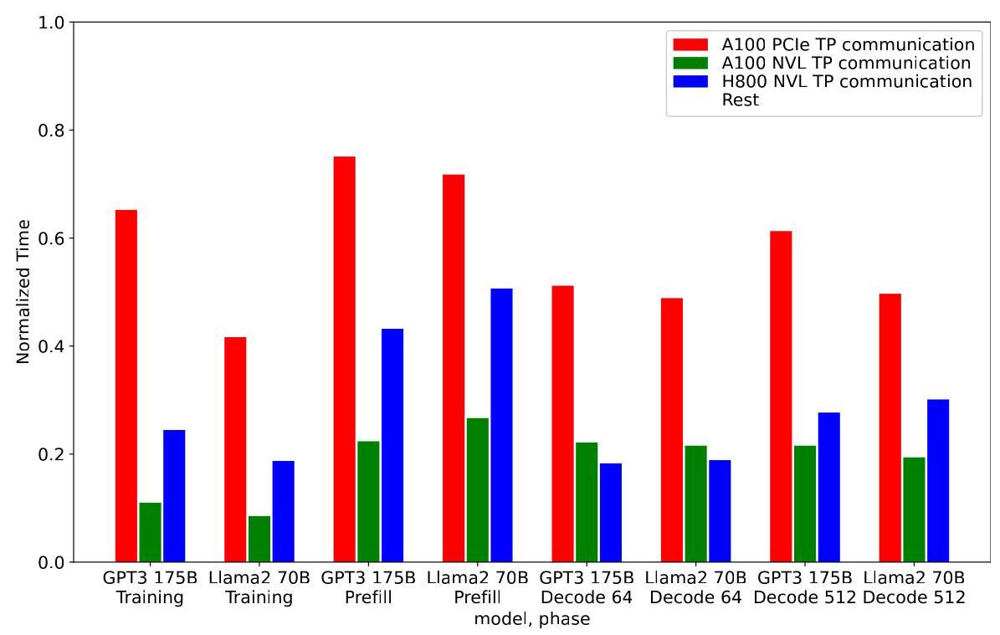

图 1 的训练配置是 128 卡上的 2-way DP、8-way PP、8-way TP，推理为 8 卡 TP。正文归纳 A100 PCIe 的训练与 prefill 通信占比约 **40%–75%**，而 A100 NVLink 训练只有 **8%–11%**。这既证明问题真实存在，也表明不同机器的收益上限很不同：通信占比高的环境更值得优化，通信已经很少时，局部算子再快也难大幅改变端到端时间。

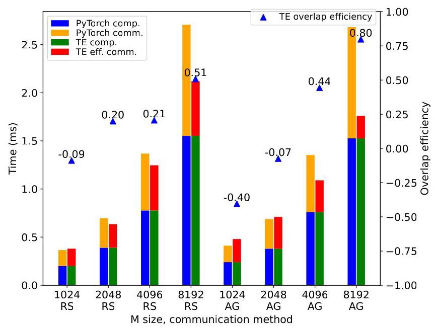

图 4 比较 PyTorch 未重叠基线与 TransformerEngine（TE）。当全局 (m=1024) 时，TE 的 ReduceScatter、AllGather 重叠效率分别为 **−9% 和 −40%**，意味着总时间比不重叠更长；大 (m) 才更容易获益。因此问题不只是“通信够不够快”，还包括“为重叠付出的计算代价是否过高”。这些图直接支持论文的切入点，动机总体扎实；不过它聚焦特定 GEMM 与集合通信组合，不能由此推断所有分布式计算都适合这种融合。

### 核心 Insight

**高性能 GPU GEMM 本来就由许多 tile 并行完成，可以直接在 tile 的输入或输出边界处理通信依赖，而无须把一个大 GEMM 拆成多个独立的小 GEMM。** 等待某个远端输入或发送某个局部输出时，其他就绪 warp 仍可计算，利用 GPU 原有的延迟隐藏机制。

这里的巧妙之处在于同时改变了两个边界：调度粒度变细，独立 kernel 的边界却变少。只有“细分”而没有“融合”，仍可能付出小 kernel 的启动与利用率代价；只有“融合”而没有按 tile 处理依赖，又会保留整块输入或输出的等待。

## 二、相关工作

论文在 §2 解释最直接的技术前驱，在 §7 按并行方式和通信优化路线整理相关研究。

**与依赖计算重叠的中粒度分解**是直接比较对象。Wang 等人的 ASPLOS 2023 工作 [13]、TransformerEngine [14] 等将通信与计算拆成一组 chunk 并精心安排执行顺序；Jang 等人的 ASPLOS 2022 工作 [12] 还将通信与逐元素操作融合。它们已经认识到可以通过分解绕开完整操作之间的串行依赖，但保留了多个拆分 GEMM，GPU 利用率与跨 kernel 调度仍是问题。FLUX 将分解推进到 GEMM 本身的 tile，并在 GEMM 内部融合依赖处理。论文认为原有方法在 TPU 上可能表现良好，并非否定分解思想本身。

**流水并行与多维并行调度**，如 Megatron 的混合并行、Breadth-First Pipeline Parallelism、Fold3D、GPipe、PipeDream，主要从层、微批次和梯度通信的调度入手减少流水气泡。它们优化的时间尺度与 FLUX 不同，原则上可以组合；本文的 128 卡实验本身就同时采用 DP、PP 和 TP。不过“可组合”不等于每一种组合都已被实验验证。

**集合通信加速与通信压缩**分别提高互连利用率、减少传输字节。TACCL、MSCCLang、MSCCL++ 等关注通信算法和实现，QSGD、TernGrad、DeepReduce 等关注量化或稀疏化。FLUX 的主线是减少暴露在关键路径上的通信时间，不以减少字节数为前提。作者认为这些方向可以互补，但没有给出与上述每一种系统组合的结果。

**ZeRO、ZeRO-Offload、ZeRO-Infinity 与 FSDP**通过分片权重或梯度节约内存，计算前也会做 AllGather。论文指出，权重在相应消费 GEMM 之前通常没有新的生产者依赖，较容易提前预取，与本文重点处理的激活依赖不同。因此这些方法属于可结合的内存与并行策略，而不是本文评测中的直接替代方案。

## 三、技术挑战

| 挑战 | 难点及后果 | FLUX 的对应设计 |
|---|---|---|
| C1：重叠不能牺牲 GEMM 效率 | 将一个 GEMM 拆成多个小 GEMM 后，每次可用的并行工作减少；TP 越大，问题可能越明显 | 保留一个 GEMM kernel，把依赖处理下沉到其原生 tile |
| C2：输入、输出依赖方向不同 | AG 必须先收到对应输入，RS 必须先产生对应部分和；整操作同步太粗，跨 stream 精确时机又难保证 | AG 在 prologue 等局部信号，RS 在 epilogue 发送已完成 tile |
| C3：细粒度并发会产生新的拥塞或等待 | 各卡按相同 tile 顺序执行，可能同时写一个目的卡；先调度尚未到达的输入又会占用等待资源 | 按 rank 调整 tile 坐标，并让 AG 的计算顺序配合数据到达顺序 |
| C4：最合适的传输方式依赖硬件 | PCIe、NVLink、跨节点互连的方向性、共享路径和带宽不同，指令支持也不同 | 多种写入/归约实现、拓扑相关通信顺序、push/pull 与 tile 尺寸自动调优 |
| C5：如何判断“重叠”是否真的有用 | 更慢的计算也能制造更多覆盖通信的时间，单看时间线重叠比例可能奖励低效实现 | 用统一最快未拆分 GEMM 作为参照，统计 ECT 与 overlap efficiency |

GPU 的 warp 切换可以隐藏延迟，但不能凭空增加算力、带宽或就绪工作。整个设计依赖存在足够多可并行 tile，并不保证极小矩阵也能获益。

## 四、解决方案

### 整体思路与贯穿示例

FLUX 为两种模式提供不同融合位置：**GEMM→ReduceScatter 将数据输出通信融入 epilogue；AllGather→GEMM 将“数据是否就绪”的等待融入 prologue**。后者的实际数据传输仍由 host 侧异步安排，不能把论文的“单个融合 GEMM kernel”误读为所有通信都在该 kernel 内执行。

用一个四卡 MLP 例子贯穿设计。假设有 8,192 个 token，四张卡各持有 2,048 个 token 的输入，每张卡又只拥有第一层的四分之一输出通道。为直观起见，把 token 分成每份 128 行的“工作单”，于是全层有 64 份，每卡最初有 16 份本地工作单；真实 tile 尺寸由调优决定，这些数值仅用于解释机制。

在第一层，每张卡都要对全部 token 计算自己负责的通道。传统方式可能先等完整输入，或启动四个较小 GEMM，分别处理四个来源卡的输入。FLUX 启动一个 GEMM：本地 16 份工作单先计算，远端工作单一到就置位信号，对应 tile 随即可算。来到第二层，每张卡都算出不同通道贡献的部分和；一份输出 tile 完成，就送到最终负责这些 token 的卡上汇总，不必等本卡全部输出算完。

### 1. ReduceScatter：完成一小块，就输出一小块

标准 GEMM 的 epilogue 将累加器结果写到一个本地输出矩阵；FLUX 把输出参数改为参与 TP 的多张卡的输出指针集合。每个 thread block 根据 tile 坐标选择目的卡，执行本地或远端写入。对应四卡例子，属于第一张卡那 2,048 个 token 的输出 tile，就直接发往第一张卡的目标缓冲。

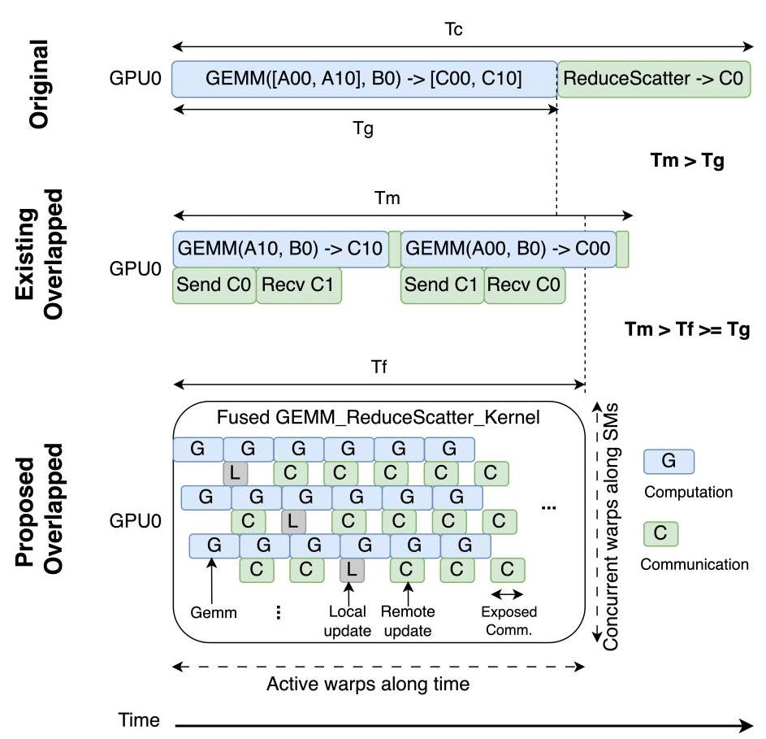

图 5 下部把一个融合 kernel 展开为多条 warp 时间线：部分 warp 的远端写较慢时，其他 warp 仍能推进 GEMM。暴露通信主要集中在计算结束后的尾部。图中 (T_f) 接近纯 GEMM 时间 (T_g) 是机制示意，不是对所有形状的保证。该设计直接回应 C1 与 C2：保留大 kernel 的可调度工作，同时把输出依赖局限于已经完成的 tile。

ReduceScatter 还可拆为“交换部分和的 AlltoAll + 目的卡本地 reduction”。**仅把数据交换融合进去就能实现主要的通信重叠；归约本身不要求总是融合**。论文明确说进一步融合归约通常只带来边际收益。实现可选择 P2P store、Hopper 的 `cp.async.bulk` / TMA 写入、或跨节点 NVSHMEM `put`；归约可采用合适的数据类型与硬件支持的原子指令，或 Hopper 上负责拉取就绪远端结果的专用 warp/thread block。跨节点版本只融合 AlltoAll，归约另行执行。

### 2. AllGather：数据搬运与 GEMM tiling 分开，等待放进 kernel

第一层开始时，host 为传输 tile 安排异步搬运，并在该 tile 到达后设置一个 32-bit GPU 内存信号。GEMM 中每个 tile 在 prologue 通过 `WaitSignal` 自旋，确认自己需要的输入已经可用，随后执行正常 GEMM。四卡例子中，本地工作单的信号预先为真，远端工作单分别在到达后放行。

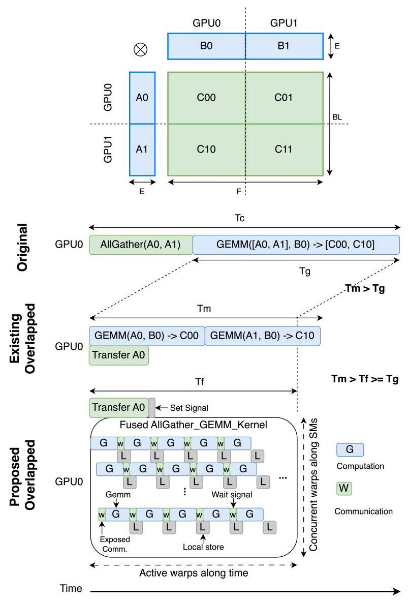

图 6 的短绿色等待块位于计算开始前；其他已就绪 warp 的计算覆盖这些等待。与 RS 暴露尾部通信相对，AG 主要面临开头的数据等待。这里不是取消数据依赖，而是只等真正相关的输入，并让其余工作继续执行。

通信 tile 与 GEMM tile **不必一一对应**。例如一次传输可覆盖几份 128 行工作单，多个计算 tile 共享该到达事件；这样不会为了更细通信而破坏高效 GEMM 的 tiling。通信可由本卡 pull 远端数据，也可由源卡 push 到本卡；P2P 可用时采用 `cudaMemcpy` 系列调用，不可用时可采用配对的 NCCL send/recv。信号由 stream 上的 `cuStreamWriteValue` 写入，并通过 stream/event 管理复位以避免数据竞争。这回应 C2、C4，但论文并未把自旋等待成本视为零。

### 3. Tile coordinate swizzling：除了能重叠，还要错开拥塞

四张卡如果都从“发给 GPU0 的输出”开始算，第一波远端写就会同时涌向 GPU0。FLUX 将 tile 坐标映射按 rank 平移，使同一时段各卡面向不同目的地，随后轮换。这里改变的是 thread block 对 tile 的映射，矩阵乘的数学结果不变。

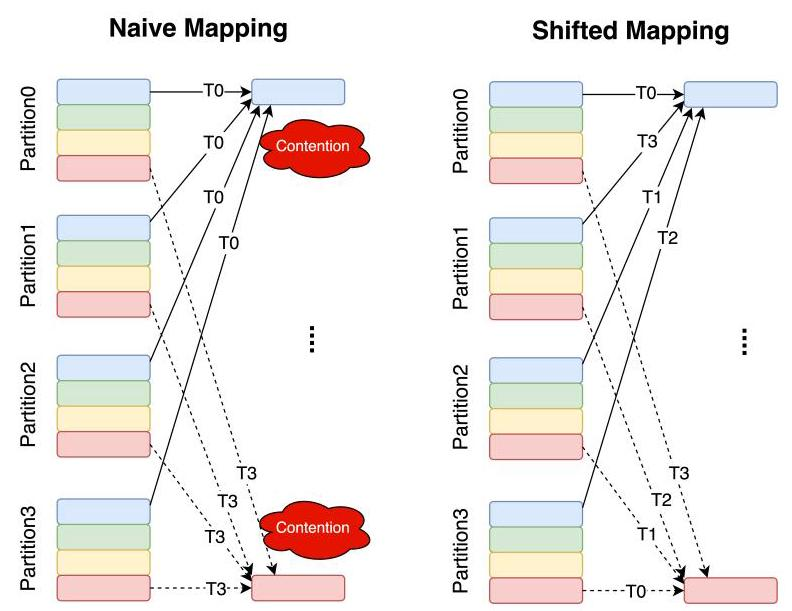

图 7 左边多个发送者在 (T_0) 同时指向同一目的分区，右边把这些访问错开，回应 C3 中的内存控制器争用问题。对于 AG，映射要配合输入到达顺序：四卡例子应先算本地和早到的数据，避免大量 thread block 先等一个尚未收到的来源。

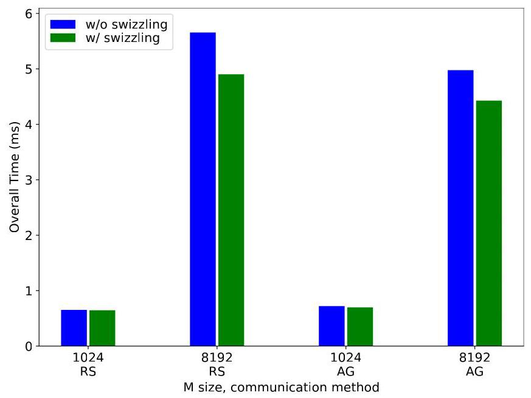

图 8 在 (m=1024) 时差异小，在 (m=8192) 时 RS 与 AG 都有更明显改善。作者将其分别解释为大矩阵增加了原始映射的写争用和输入等待。这一消融说明，简单加入远端写或信号并不足以获得最好表现；计算顺序与通信顺序需要共同设计。

### 4. 拓扑相关通信与自动调优

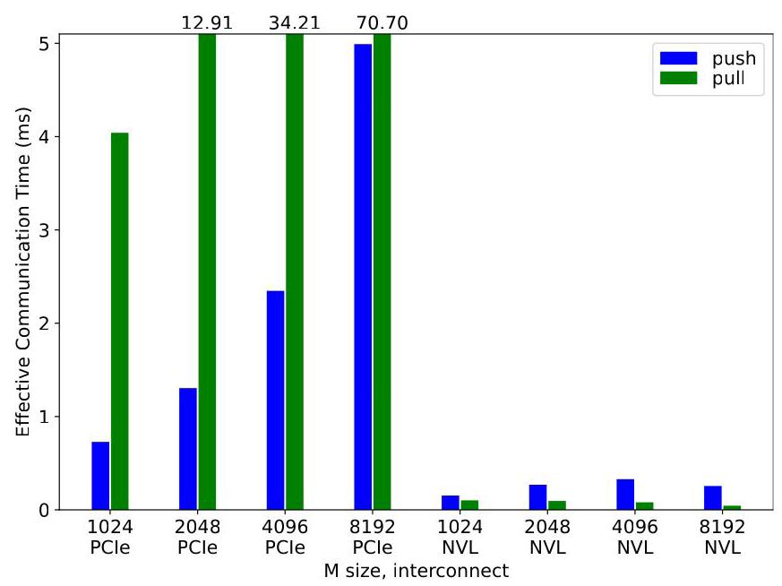

图 9 展示了 C4 的实际影响：所测 PCIe 更适合 push，NVLink 更适合 pull；PCIe 的部分 pull 柱甚至超出坐标范围，被标为 12.91、34.21、70.70 ms。因而不能把一种机器上的传输方向硬编码成通用最优选择。

单节点 NVLink 采用直接通信，但按从本 rank 后一位开始的环形顺序组织；例如 8 卡中 rank 5 依次对应 6、7、0、1、2、3、4。这里“环形顺序”不等于所有数据都沿 ring 转发。PCIe 的实现则采用 ring-based communication 来利用互连带宽。跨节点时还需协调节点内外的传输：NVLink 环境可并发推进节点间接收和本地传输，收到新 tile 后再在节点内传播；所测 PCIe 拓扑要先完成跨 NUMA 通信，再同时推进 NUMA 内与节点间通信，以避免共享路径冲突。

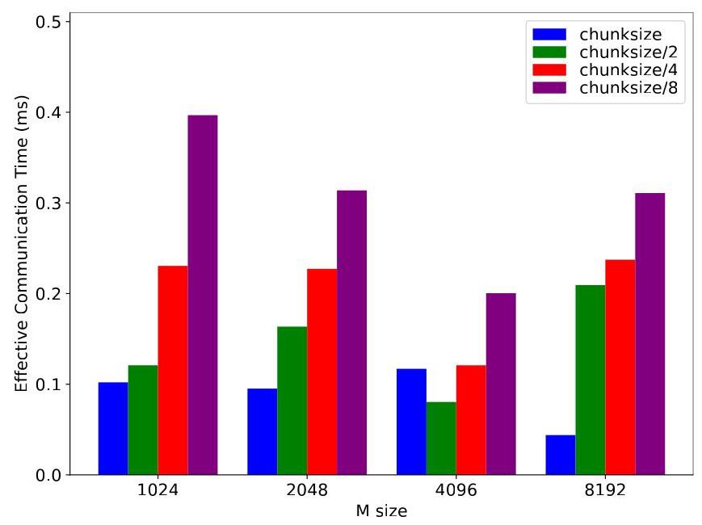

图 10 中，更小通信 tile 并没有单调变好：多数所测形状更偏好较大 chunk，(m=4096) 则是 `chunksize/2` 优于 `chunksize`。细传输提供更早放行机会，也增加传输与协调成本。因此 FLUX 从传统 chunk 大小开始逐次减半，直到 GEMM tile 尺寸，搜索最好配置，保持通信 tiling 与计算 tiling 解耦。

实现建立在 CUTLASS 上，以模板暴露 GEMM、prologue、epilogue 和通信策略的选择。Ampere 通常优先采用 workload-balanced GEMM，Hopper 通常采用 warp/thread block specialization。设计的通用性来自可替换组件与调优，而非一个固定 kernel 自动适应所有环境。

### 5. 如何衡量真正收益

针对 C5，作者定义：

$$
ECT=T_{\mathrm{overall}}-T_{\mathrm{GEMM,non\text{-}split}},
\qquad
E_{\mathrm{overlap}}=1-\frac{ECT_{\mathrm{overlap}}}{ECT_{\mathrm{non\text{-}overlap}}}.
$$

同一形状使用统一的最快未拆分 GEMM 时间作为参照。ECT（Effective Communication Time，有效通信时间）因此不仅含未隐藏通信，也包含为重叠而产生的计算退化、等待和其他额外成本。零 ECT 对应理想地只剩该 GEMM 时间，负重叠效率则表示整体比未重叠基线更慢。

举一个独立的指标示例：最快 GEMM 为 10 ms，串行通信为 5 ms，未重叠共 15 ms；若某方案总计 12 ms，则 ECT 为 2 ms、重叠效率为 60%。若一个方案把 GEMM 拉长到 16 ms，即使通信全部藏在其中，按该指标仍为 ECT=6 ms、效率=−20%。这正是该指标比肉眼看时间线更公平的原因。论文“最高 96%”应按这个定义理解，不代表通信字节减少了 96%。

### 相比已有方案的优势与边界

FLUX 的主要优势是让大 GEMM 的执行结构与细粒度依赖处理共存，并能按 GPU 架构及互连调优。其代价是需要控制 GEMM 的内部实现、管理远端缓冲及信号，并维护多种模板配置；现成黑盒 GEMM 通常无法直接插入这些逻辑。RS 的远端输出还依赖 P2P 或 NVSHMEM 等能力。更重要的是，极小矩阵可能没有足够 warp 隐藏延迟，此时“融合得更细”本身不能确保加速。

## 五、实验评估

### 实验设定

实现使用 CUTLASS 3.4.1 与 NVSHMEM 2.10.1，A100 由 NVCC 11.8 编译，H800 使用 NVCC 12.2，实验数据类型均为 **bfloat16**。

| 平台 | 每节点 GPU 与节点内互连 | 文中列出的节点间配置 |
|---|---|---|
| A100 PCIe | 8×A100 PCIe 80 GB，PCIe | 2×100 Gb/s |
| A100 NVLink | 8×A100 SXM4 80 GB，NVLink | 4×200 Gb/s |
| H800 NVLink | 8×H800 SXM5，NVLink | 8×400 Gb/s，每卡有独立对应链路 |

原文 §5 对 A100 NVLink 的括号说明另出现 “2 GPUs sharing 1200Gbs”，与前述配置不一致，本文不据此额外推算带宽。PCIe 拓扑文字将 CPU 连接域称为 “CPU core”，结合后文仅按其描述的两个 NUMA 域理解调度，不扩展解释具体服务器配置。

**基线与负载。** 算子级未重叠基线是 PyTorch 路径上的最快 GEMM 与 NCCL；重叠基线为 TransformerEngine 1.4.0 + UserBuffer，作者搜索其配置并报告最好结果。AG 与 RS 的全局 ((n,k)) 分别取 GPT-3 175B 的 ((49152,12288)) 与 ((12288,49152))，(m=1024)–8192 模拟训练/prefill，(m=64,512) 模拟 decode；多数算子实验是 8-way TP，跨节点另测 16-way TP。

端到端模型为 GPT-3 175B、Llama-2 70B。训练在 128 卡上使用 2-way DP × 8-way PP × 8-way TP，分别基于 Megatron-LM core r0.4.0（commit `27cbe46`）和 Megatron-LLaMA，报告包含梯度与优化器阶段的整体训练时间。推理使用 vLLM 0.2.1、8 卡 TP；prefill 的 batch=8、序列长=2048，decode 的 batch=64 或 512。本文是性能系统评测，没有任务精度数据集或质量提升主张。

### 主要实验与结论

**1. 常规尺寸：大部分形状能减少通信暴露，也避免 TE 的性能退化。** §5.1 给出的算子结果范围如下，速度比均为相对 TE，效率为相对各自未重叠基线按上述公式计算。

| 平台，(m=1024)–8192 | FLUX / TE 加速比 | FLUX 重叠效率 | TE 重叠效率 |
|---|---:|---:|---:|
| A100 PCIe | 1.20×–3.25× | 41%–57% | −125%–36% |
| A100 NVLink | 1.01×–1.33× | 36%–96% | −99%–74% |
| H800 NVLink | 1.10×–1.51× | 37%–93% | −40%–80% |

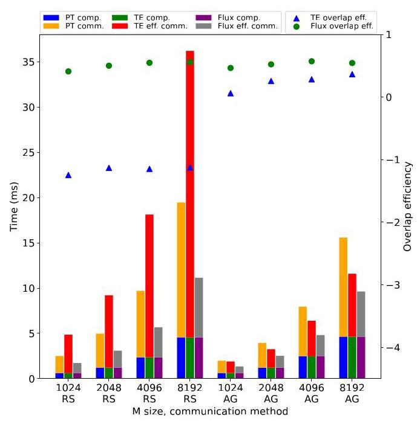

图 11 的 RS 中，TE 的红色 ECT 明显大于未重叠的橙色通信部分，而 FLUX 将其压低。该图说明相对 TE 的较大加速，有一部分来自避免对方的负优化，因此必须同时查看未重叠基线，不能把 3.25× 当作相对普通 PyTorch 的普遍收益。

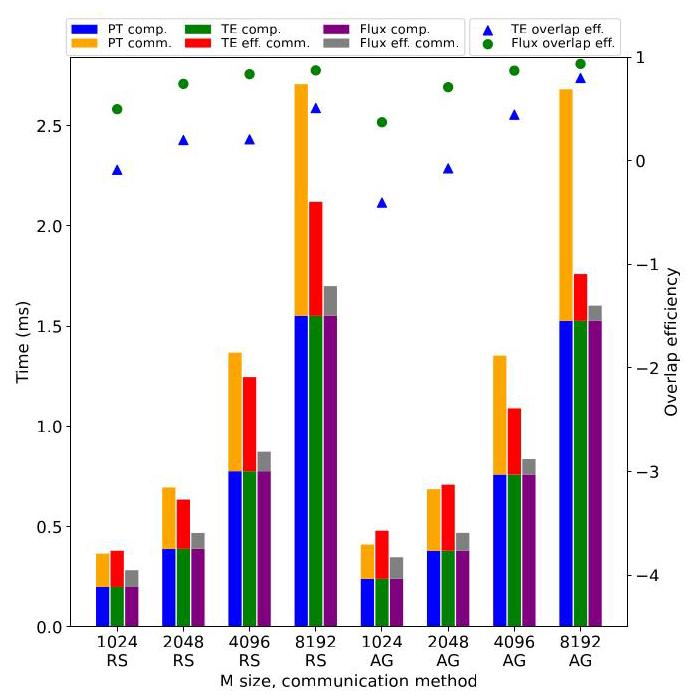

图 13 显示即使是更快的 GPU 和 NVLink，通信仍可能占很大比例；较大形状下 FLUX 的灰色 ECT 很短，支撑“保持计算效率并隐藏通信”的主张。A100 NVLink 的完整趋势见本地原图 [Figure 12](images/fig12.jpg)，数值已纳入上表。

**2. 极小尺寸：相对 TE 更好，不代表比不重叠更好。** 当 (m=64,512) 时：

| 平台 | FLUX / TE 加速比 | FLUX 重叠效率 | TE 重叠效率 |
|---|---:|---:|---:|
| A100 PCIe | 1.45×–3.21× | −2%–41% | −213%–−36% |
| A100 NVLink | 1.33×–4.68× | 14%–88% | −325%–−49% |
| H800 NVLink | 0.95×–1.03× | −165%–−82% | −142%–−93% |

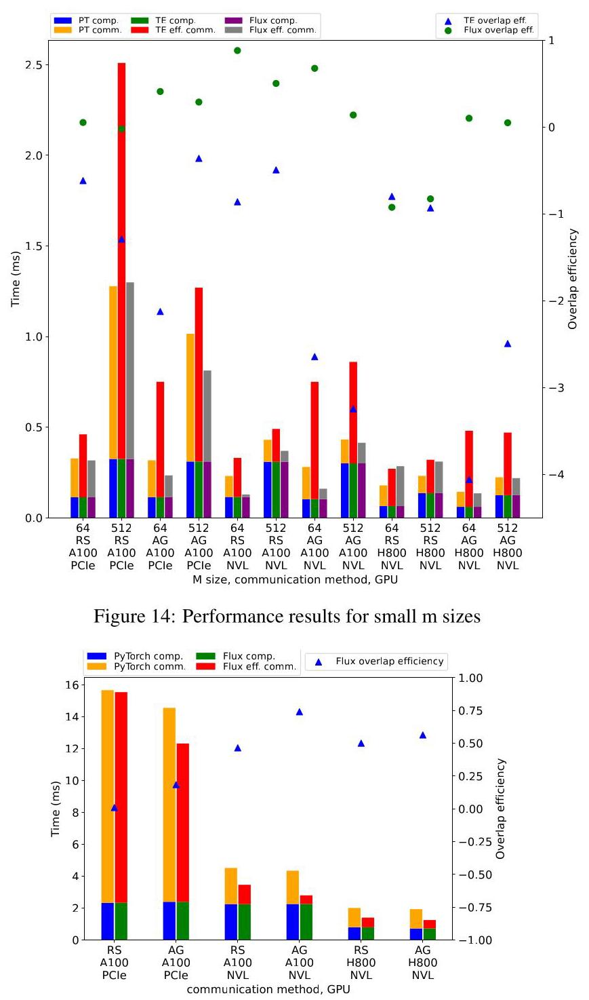

图 14（上半）的 H800 点揭示明确失败边界：FLUX 在这些小形状上的效率均为负，且 (m=64) 的 RS 比 TE 还慢，速度比为 0.95×。作者解释为 warp 数量不足以隐藏延迟；该 H800 RS 案例在 8-way TP 后，TMA 的输出 store 沿 (m) 只有 8，进一步降低传输效率。它是论文主动报告的反例，而非可略去的噪声。

**3. 跨节点：验证可扩展到 16-way TP，但通信未被完全隐藏。** 图 15（下半）在两节点共 16 卡上测试 (m=8192)。TE 不支持此多节点重叠，因此只比较最快 GEMM + NCCL 的 PyTorch 基线。A100 PCIe、A100 NVLink、H800 NVLink 的最高加速分别为 **1.32×、1.57×、1.55×**，最高重叠效率分别为 **18%、74%、56%**。这支持跨节点可用性，但 PCIe 的低效率表明互连与共享路径仍构成限制；本实验并未把单一 TP 组扩展到 128 卡。

**4. 模型级：训练、prefill 与 decode 的收益明显不同。** 下表取 §5.2 的“各平台最高值”，不同列的最大值可能来自不同模型或 batch，不能直接组合成同一案例。

| 平台 | 相对 Megatron / vLLM：训练、prefill、decode | 相对 TE：训练、prefill、decode |
|---|---|---|
| A100 PCIe | 1.24×、1.46×、1.28× | 1.37×、2.06×、1.69× |
| A100 NVLink | 1.05×、1.45×、1.30× | 1.04×、1.14×、2.10× |
| H800 NVLink | 1.10×、1.66×、无 decode 加速 | 1.05×、1.18×、1.76× |

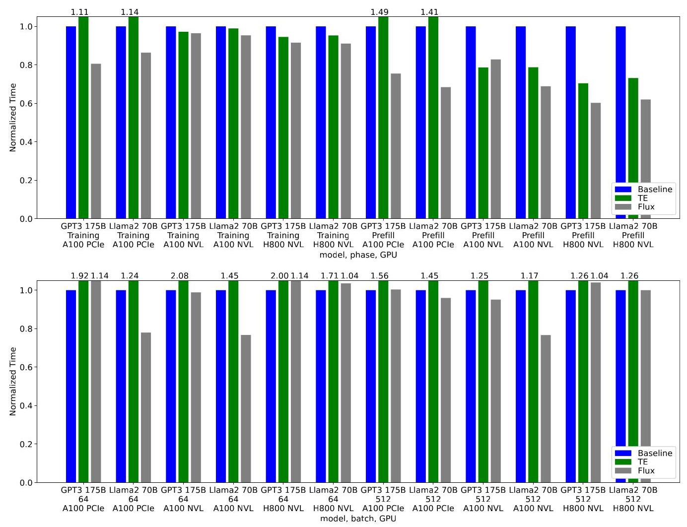

图 16（上半）把局部算子收益落实到了完整模型：相对未重叠框架，全文最高训练加速为 **1.24×**、prefill 为 **1.66×**。图 17（下半）最高 decode 加速为 **1.30×**，但正文明确指出有 **5 个 decode 案例慢于 vLLM**，尤其 batch=64 更容易受限。Introduction 将相对 TE 的最高训练加速写为 1.38×，§5.2 写为 1.37×；本文沿用实验节数值并保留这处轻微不一致。

### 结论支撑性分析

证据链较完整：图 1 说明通信有优化价值，图 4 显示已有重叠方案可能损伤计算，图 5–10 解释机制并给出局部消融，图 11–17 再从算子走到完整模型。三个平台覆盖慢 PCIe、A100 NVLink、计算更快的 H800，两个模型同时测训练和推理，还公开了负结果，这些都支持主要结论。

收益必须结合通信占比理解。§6 指出 A100 NVLink 训练仅有 8%–11% 的 TP 通信，因此即便平均算子重叠效率较高，相对 Megatron 的训练提升仍只有 1.04×–1.05×。以简化的 Amdahl 模型理解，若初始通信比例为 (p)，隐藏其中 (e)，且其他部分不变，整体速度比约为 (1/(1-pe))；这是对论文解释的辅助推导，并非作者额外测量。

局限也很具体：算子形状主要来自 GPT-3 的两种 MLP GEMM，数据类型只测 BF16，平台只覆盖 NVIDIA A100/H800；没有全面展示 attention、MoE 或其他 GEMM 家族。论文未报告误差条、重复次数、调优耗时与编译开销，也未系统拆分每一种实现选择的贡献。128 卡训练证明系统集成有效，但 TP 始终是 8-way，不能用它证明 128-way TP 扩展性。作者的“普遍适用”应理解为实现框架的设计意图，实验强支持的是所列模型、形状和平台。

## 六、附加洞察

**结论 1：通信比例上升既可能来自互连慢，也可能来自计算变快。** 出处为 §6 “High communication proportion” 段。作者观察 A100 PCIe 与 H800 NVLink 都有较高通信占比，但前者归因于慢互连，后者归因于快计算；同样的比例症状背后是不同瓶颈来源，因此即使升级计算硬件，也不意味着通信优化的重要性下降。该判断由跨平台结果支持，不过论文没有对算力、内存带宽和互连分别做单变量控制，因此不能把每一项影响精确拆开。

**结论 2：标准 NCCL 的通信耗时不总是该问题形状的性能下界。** 出处为 §6 “High communication proportion” 段后半。作者在 A100 PCIe 大 (m) 的一些案例发现，FLUX 的完整执行甚至快于基线单独通信的时间；若它仅把一个同样快的通信过程叠在计算上，总时间不可能低于该通信本身，因此结果也包含通信实现或调优更适合该拓扑的收益。作者据此指出 NCCL 在部分尺寸可能不是最优。这里没有提供“保持通信算法完全相同、仅改变重叠”的严格对照，所以不能把全部收益都归于纯延迟隐藏，也不能据少数形状否定 NCCL 的一般性能。

**结论 3：归约指令支持会把看似统一的融合实现分裂成不同路径。** 出处为 §4.2 “Reduce” 段及脚注 5。算法层面可以在输出处直接累加，但原文特别指出 A100/H800 的 BF16 atomic 不受支持，因此只在合适数据类型与 GPU 上采用相关指令，其余选择专用 warp/thread block 或独立归约。由“归约需要具体指令”到“指令覆盖受类型约束”，作者得出的工程结论是必须保留多种路径。该脚注没有细分原子操作的作用域、P2P 场景与所有指令变体，所以应限定为论文所用融合路径的实现约束，不外推成对两代 GPU 全部 BF16 功能的判断。

## 七、总结与个人评价

FLUX 最有价值的贡献，是把“依赖计算与通信如何重叠”转化为 GEMM tile 内的生产、等待与消费，让 GPU 原有的并行调度承担一部分协调工作。它既减少暴露通信，又避免中粒度方案把 GEMM 拆小造成的计算效率损失，并通过拓扑相关顺序和自动调优落到实际硬件。

最大的亮点是机制、消融、算子及端到端结果互相对应，而且保留了 H800 小矩阵与 decode 的失败案例。最大的不足是收益依赖形状和平台，维护、调优成本未量化，尚不足以证明它能无代价覆盖所有 GEMM 或通信模式。进一步值得探索的是依据形状和拓扑自动选择“融合或未重叠”路径，并把小矩阵与调优成本纳入整体优化目标；这是本文解读提出的方向，不是原文已经完成的结果。

## 八、章节脉络与段落速览

以下按原文自然段编号；算法、公式、贡献列表及脚注归入对应论述，图注不另计为正文自然段，跨页连续段合并；参考文献列为条目组导航。已通读摘要、§1–9 与全部 52 条参考文献，提供的版本没有附录。

- **ABSTRACT**：概括 TP 通信瓶颈、细粒度融合与主要性能结果。
  - ¶1：大模型依赖多设备执行，而 TP 通信限制可扩展性。
  - ¶2：FLUX 通过过度分解与 kernel 融合隐藏通信，并报告算子及模型收益。
- **1 Introduction**：从大模型需求引出传统 GPU 重叠不足与本文贡献。
  - ¶1：模型规模增大推动多领域能力提升，也增加计算资源需求。
  - ¶2：比较流水并行与张量并行，并借图 1 指出 TP 通信的重要性。
  - ¶3：现有 chunk 重叠依赖精细执行时机，且拆小 GEMM 容易降低利用率。
  - ¶4：提出 tile 级分解融合及面向架构和互连的联合优化。
  - ¶5（含贡献列表）：归纳问题识别、方法、实现平台和端到端性能四项贡献。
- **2 Backgrounds on Tensor Parallelism and Overlapping**：建立分片、已有调度与性能度量的背景。
  - ¶1：说明本节介绍常见层内分片及相应重叠策略。
  - **2.1 Common Partitioning and Communication Patterns**：用 MLP 解释典型通信依赖。
    - ¶1：限定讨论对象为带激活分片的扩展 Megatron-LM 模式。
    - ¶2：借图 2 解释前后向的 AllGather/ReduceScatter，并约定使用全局矩阵尺寸。
    - ¶3：说明权重分片的 AllGather 易于提前预取，因此本文重点是另一类依赖模式。
  - **2.2 Conventional Communication Overlapping Strategies**：解释传统 chunk 调度及其 GPU 局限。
    - ¶1：描述按 TP 度数或其两倍分解并安排点对点通信的方案。
    - ¶2：依次分析执行时机不可控、归约依赖妨碍并发和小 GEMM 利用率不足三个问题。
  - **2.3 Effective Communication Time and Overlapping Efficiency**：建立能计入计算退化的公平度量。
    - ¶1：解释为何直接衡量重叠比例和比较不同 GEMM 的总时间存在困难。
    - ¶2：用总时间减去最快未拆分 GEMM 时间定义 ECT。
    - ¶3：说明统一 GEMM 基准使 ECT 同时捕捉暴露通信与低效实现开销。
    - ¶4：以相对未重叠 ECT 的下降比例定义 overlap efficiency。
    - ¶5：选 NCCL 作为标准通信基线，并解释零、百分之百及负效率。
    - ¶6：借图 4 说明小矩阵和 ReduceScatter 更易暴露传统方案的效率问题。
- **3 Overview of Fused GEMM with Communication**：说明融合通信和等待逻辑的两类算法。
  - ¶1：将本文细粒度 tile 分解与已有中粒度 chunk 分解区分开来。
  - **3.1 ReduceScatter Overlapping**：把输出通信放入 GEMM epilogue。
    - ¶1（含 Algorithm 1）：解释输出指针集合、tile 坐标与目的 GPU 的选择。
    - ¶2：将 ReduceScatter 分成 AlltoAll 与本地归约，并说明进一步融合归约的收益有限。
    - ¶3：说明节点内 P2P 与跨节点 NVSHMEM 的访问条件。
  - **3.2 AllGather Overlapping**：将输入就绪检查放入 GEMM prologue。
    - ¶1（含 Algorithms 2–3）：介绍 kernel 等待和 host 通信两个协作部分。
    - ¶2：按计算 tile 选择信号，并在对应输入到达前阻塞计算。
    - ¶3：说明 pull/push 的地址选择与本地、远端信号区别。
    - ¶4：强调仅融合等待且通信 tile 与 GEMM tile 独立选择。
  - **3.3 Comparison among Decomposition Strategies**：用时间线说明细粒度机制为何保持计算效率。
    - ¶1：借图 5 对比 RS 的三种分解粒度及尾部暴露通信。
    - ¶2：借图 6 解释 AG 的信号等待如何通过就绪 warp 和本地 tile 得到隐藏。
- **4 Optimizations and Implementation Details**：从基础融合进一步处理争用、传输与调优。
  - ¶1：说明本节介绍提升基础算法性能的实现优化。
  - **4.1 Tile Coordinate Swizzling**：联合调整计算 tile 的执行顺序与通信顺序。
    - ¶1：从 GEMM 常见的 tile 坐标映射引出通信相关 swizzling。
    - ¶2：按 rank 平移 RS 映射以减少多卡同时写入同一目的卡的争用。
    - ¶3：让 AG tile 顺序与输入到达顺序及网络拓扑一致。
    - ¶4：借图 8 解释 swizzling 的收益随矩阵规模增加而更明显。
    - ¶5：指出已有拆分 GEMM 的顺序优化不能直接套用到单 kernel 实现。
  - **4.2 Implementation Details of ReduceScatter**：选择适配硬件的输出与归约实现。
    - ¶1（Write）：列出节点内存储、Hopper TMA 和跨节点 NVSHMEM 的模板实现。
    - ¶2（Reduce）：说明原子操作、专用 warp/block 与独立归约的适用条件。
  - **4.3 Implementation Details of AllGather**：解释搬运、信号、粒度和拓扑调度。
    - ¶1（DataTransfer）：比较 P2P 的 push/pull 与非 P2P 的 NCCL 路径。
    - ¶2（Signals）：介绍信号内存、置位、自旋与安全复位。
    - ¶3（Communication tile size）：通过独立通信粒度搜索平衡重叠机会与搬运效率。
    - ¶4（Communication order among tiles）：分别安排 NVLink、PCIe 与跨节点拓扑的通信顺序。
  - **4.4 GEMM Implementation and Auto-Tuning**：以 CUTLASS 模板组合实现架构与形状适配。
    - ¶1：说明 Ampere/Hopper 的 GEMM 偏好及对所有融合组件的自动调优。
- **5 Evaluation**：比较三类平台上的算子和模型整体性能。
  - ¶1：列出软件版本、BF16 类型及三类 GPU 集群配置。
  - ¶2：说明 TE 基线配置选择与算子级、模型级指标的区别。
  - **5.1 Operation-level Performance Evaluation**：评测常规、小矩阵及跨节点形状。
    - ¶1：从 GPT-3 175B 选取全局 GEMM 形状与不同阶段的 (m)。
    - ¶2：归纳图 11–13 的常规矩阵加速与重叠效率范围。
    - ¶3：归纳图 14 的小矩阵结果，包括 H800 上的负效率。
    - ¶4：用图 15 比较两节点 16-way TP 与未重叠基线。
  - **5.2 Model-level Performance Evaluation**：检查 GPT-3 与 Llama-2 的完整训练和推理。
    - ¶1：说明模型、框架、训练并行布局与推理 batch 设置。
    - ¶2：归纳图 16–17 中各平台对 TE 和原框架的最高收益。
- **6 Discussion**：解释负结果、端到端收益差异及通信基线边界。
  - ¶1（Small m sizes and decoding）：将小矩阵退化与 warp 不足及特定 H800 TMA 低效联系起来。
  - ¶2（Overlap efficiency and speedups）：用初始通信占比和重叠效率解释模型加速的大小。
  - ¶3（High communication proportion）：区分高通信占比的不同来源，并指出 NCCL 在部分形状上不是最优。
- **7 Related Work**：按重叠对象和优化方向定位 FLUX。
  - ¶1：交代更广泛分布式系统中的通信计算重叠背景。
  - ¶2：将 FLUX 与 TP 中粒度分解及逐元素通信融合比较。
  - ¶3：说明流水并行和多维并行调度与 FLUX 的互补关系。
  - ¶4：说明集合通信加速、压缩与本文重叠机制的互补关系。
  - ¶5：解释 ZeRO 类分片预取与 FLUX 可结合的原因。
- **8 Conclusion**：概括细粒度分解融合对训练与推理的价值。
  - ¶1：重申传统 GPU 重叠不足，以及 FLUX 减少暴露通信和提高系统利用率的结论。
- **9 Acknowledgements**：列出项目获得的协助。
  - ¶1：感谢 Zhekun Zhang、Dongyang Wang、Yawei Wen 及其他同事的支持。
- **References**：提供模型、并行策略、GPU 库与通信优化的完整来源。
  - [1–11]：支持模型规模趋势与多领域大模型应用背景。
  - [12–20]：支持依赖计算重叠、流水并行与集合通信优化路线。
  - [21–26]：给出 CUTLASS、训练推理框架及张量分片背景。
  - [27–37]：给出 ZeRO/FSDP、集群训练、通信库、EVT/Stream-K 和评测模型来源。
  - [38–46]：补充分布式重叠、流水并行及通信加速研究。
  - [47–52]：补充量化、稀疏化和压缩通信研究。
