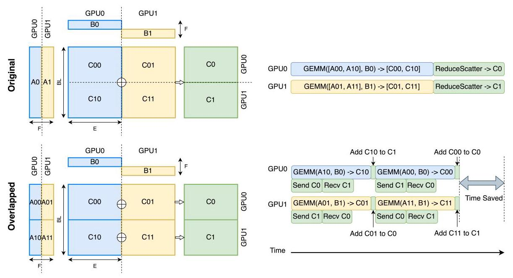
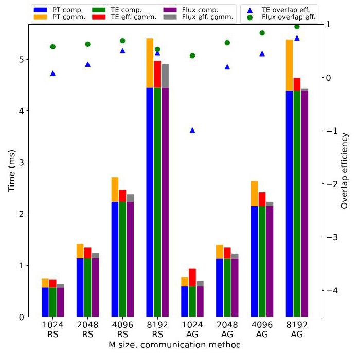

# FLUX: FAST SOFTWARE-BASED COMMUNICATION OVERLAP ON GPUS THROUGH KERNEL FUSION

A PREPRINT

Li-Wen Chang ${}^{*1}$ , Wenlei Bao ${}^{*1}$ , Qi Hou ${}^{*1}$ , Chengquan Jiang ${}^{*1}$ , Ningxin Zheng ${}^{*1}$ , Yinmin Zhong ${}^{*2}$ , Xuanrun Zhang ${}^{*1}$ , Zuquan Song ${}^{1}$ , Ziheng Jiang ${}^{1}$ , Chengji Yao ${}^{1}$ , Haibin Lin ${}^{1}$ , Xin Jin ${}^{2}$ , and Xin Liu ${}^{1} \; {}^{1}$ ByteDance Ltd

> 
Li-Wen Chang ${}^{*1}$，Wenlei Bao ${}^{*1}$，Qi Hou ${}^{*1}$，Chengquan Jiang ${}^{*1}$，Ningxin Zheng ${}^{*1}$，Yinmin Zhong ${}^{*2}$，Xuanrun Zhang ${}^{*1}$，Zuquan Song ${}^{1}$，Ziheng Jiang ${}^{1}$，Chengji Yao ${}^{1}$，Haibin Lin ${}^{1}$，Xin Jin ${}^{2}$，和 Xin Liu ${}^{1} \; {}^{1}$ ByteDance Ltd

\{liwen.chang, wenlei.bao, houqi.1993, jiangchengquan, zhengningxin,

> 
\{liwen.chang, wenlei.bao, houqi.1993, jiangchengquan, zhengningxin,

zhangxuanrun, zuquan.song, chengji.yao, ziheng.jiang, haibin.lin, liuxin.ai\}@bytedance.com ${}^{2}$ Peking University

> 
{zhangxuanrun, zuquan.song, chengji.yao, ziheng.jiang, haibin.lin, liuxin.ai\}@bytedance.com ${}^{2}$ 北京大学

\{zhongyinmin, xinjinpku\}@pku.edu.cn

> 
\{zhongyinmin, xinjinpku\}@pku.edu.cn

October 25, 2024

## ABSTRACT

Large deep learning models have demonstrated strong ability to solve many tasks across a wide range of applications. Those large models typically require training and inference to be distributed. Tensor parallelism is a common technique partitioning computation of an operation or layer across devices to overcome the memory capacity limitation of a single processor, and/or to accelerate computation to meet a certain latency requirement. However, this kind of parallelism introduces additional communication that might contribute a significant portion of overall runtime. Thus limits scalability of this technique within a group of devices with high speed interconnects, such as GPUs with NVLinks in a node.

> 
大型深度学习 (deep learning) 模型已展现出强大的能力，能够在广泛的应用中解决许多任务。这些大型模型通常需要以分布式方式进行训练 (training) 和推理 (inference)。张量并行 (tensor parallelism) 是一种常见技术，它将一个操作或层的计算划分到多个设备上，以克服单个处理器的内存容量限制，和/或加速计算以满足特定的延迟要求。然而，这种并行会引入额外的通信 (communication)，而通信可能占总体运行时间的很大一部分。因此，这限制了该技术在通过高速互连 (high-speed interconnects) 连接的一组设备中的可扩展性 (scalability)，例如节点内带有 NVLink 的 GPU。

This paper proposes a novel method, Flux, to significantly hide communication latencies with dependent computations for GPUs. Flux overdecomposes communication and computation operations into much finer-grained operations and further fuses them into a larger kernel to effectively hide communication without compromising kernel efficiency. Flux can potentially overlap up to 96% of communication given a fused kernel. Overall, it can achieve up to 1.24x speedups for training over Megatron-LM on a cluster of 128 GPUs with various GPU generations and interconnects, and up to 1.66x and 1.30x speedups for prefill and decoding inference over vLLM on a cluster with 8 GPUs with various GPU generations and interconnects.

> 
本文提出了一种新颖方法 Flux，可在 GPU 上利用依赖计算 (dependent computation) 显著隐藏通信延迟 (communication latency)。Flux 将通信和计算操作过度分解 (overdecompose) 为粒度细得多的操作，并进一步将它们融合 (fuse) 为更大的内核 (kernel)，从而在不损害内核效率的情况下有效隐藏通信。在给定融合内核 (fused kernel) 的情况下，Flux 有望实现高达 96% 的通信重叠 (communication overlap)。总体而言，在具有不同 GPU 代际和互连 (interconnect) 的 128 个 GPU 集群上，相较于 Megatron-LM，它可在训练中实现高达 1.24 倍的加速比 (speedup)；在具有不同 GPU 代际和互连的 8 个 GPU 集群上，相较于 vLLM，它可实现高达 1.66 倍的预填充 (prefill) 加速比和 1.30 倍的解码 (decoding) 推理加速比。

## 1 Introduction

In the rapidly evolving field of deep learning, one of the most significant trends recently has been the development of increasingly large models [1]. This progression towards large models is not merely a pursuit of scale for its own sake, but a strategic response to the diverse and complex challenges encountered across various domains. These large models have demonstrated remarkable proficiency in tasks ranging from natural language processing [2, 3, 4], computer vision [5, 6], to speech recognition [7, 8], showcasing their versatility and effectiveness. By leveraging vast amounts of data and computational power, they have been able to unearth intricate patterns and insights that were previously inaccessible, offering unprecedented opportunities in fields as varied as healthcare [9], finance [10], software development [11], and beyond. This growth in model size correlates strongly with enhanced performance, opening new frontiers in artificial intelligence applications and redefining what machines are capable of achieving.

> 
在快速发展的深度学习 (deep learning) 领域，近期最显著的趋势之一便是日益庞大的大模型 (large models) 的发展 [1]。这种向大模型发展的进程并不仅仅是为了规模本身而追求规模，而是对各个领域所遇到的多样且复杂挑战的一种战略性应对。这些大模型已在从自然语言处理 (natural language processing) [2, 3, 4]、计算机视觉 (computer vision) [5, 6] 到语音识别 (speech recognition) [7, 8] 等任务中展现出卓越的能力，彰显了其通用性与有效性。通过利用海量数据和计算能力 (computational power)，它们得以挖掘出此前无法获得的复杂模式与洞见，为医疗健康 (healthcare) [9]、金融 (finance) [10]、软件开发 (software development) [11] 以及其他领域带来了前所未有的机遇。模型规模的这种增长与性能提升密切相关，开辟了人工智能 (artificial intelligence) 应用的新前沿，并重新定义了机器所能实现的目标。

These large deep learning models typically require training and inference to be distributed, due to their parameters well beyond the memory capacity of one single device. Model parallelism, such as tensor and pipeline parallelism, is applied to overcome this limitation. While pipeline parallelism partitions a model across layers into multiple devices, executing multiple batches in a pipeline fashion, tensor parallelism partitions an individual layer into multiple devices, executing in parallel. Both are important and could be applied together, but they do have different characteristics. Compared to pipeline parallelism improving throughput, tensor parallelism can shrink latency, which is critical for inference. Since tensor parallelism partitions a layer into multiple devices, additional data communication across devices might be required for gathering or (re-)distributing correct data, especially when a consecutive layer applies a different partitioning strategy or consumes data across partitions. Figure 1 shows the substantial portion of communication time over the overall runtime for training and inference specifically for applying tensor parallelism, demonstrating the motivation and strong need to reduce the exposed communication time.

> 
这些大型深度学习模型 (deep learning models) 通常要求将训练 (training) 和推理 (inference) 进行分布式 (distributed) 处理，因为其参数 (parameters) 远远超出单个设备 (single device) 的内存容量 (memory capacity)。模型并行 (model parallelism)，例如张量并行 (tensor parallelism) 和流水线并行 (pipeline parallelism)，被用于克服这一限制。流水线并行 (pipeline parallelism) 将模型按层 (layer) 划分到多个设备 (device) 上，以流水线 (pipeline) 方式执行多个批次 (batch)；而张量并行 (tensor parallelism) 将单个层 (layer) 划分到多个设备 (device) 上，并行执行。两者都很重要，并且可以一起应用，但它们确实具有不同特性。与流水线并行 (pipeline parallelism) 提升吞吐量 (throughput) 相比，张量并行 (tensor parallelism) 可以缩短延迟 (latency)，这对推理 (inference) 至关重要。由于张量并行 (tensor parallelism) 将一层 (layer) 划分到多个设备 (device) 上，可能需要额外的跨设备 (cross-device) 数据通信 (data communication) 来收集 (gathering) 或 (重新)分配 ((re-)distributing) 正确的数据，尤其是当连续层 (consecutive layer) 采用不同的划分策略 (partitioning strategy) 或跨分区 (partition) 消费数据时。图 1 (Figure 1) 展示了在应用张量并行 (tensor parallelism) 时，通信时间 (communication time) 在训练 (training) 和推理 (inference) 的总运行时间 (overall runtime) 中所占的相当大比例，这说明了减少暴露的通信时间 (exposed communication time) 的动机和强烈需求。

---

*These authors contributed equally to this work

> 
*这些作者对本工作贡献相同

---

Figure 1: Non-overlapped communication portion within tensor parallelism in common LLM workloads for training with 2-way data, 8-way pipeline, 8-way tensor parallelism on various 128-GPU clusters, and inference with 8-way tensor parallelism on various 8-GPU clusters.

> 
图 1：常见大语言模型 (LLM) 工作负载中，张量并行 (tensor parallelism) 内未重叠 (non-overlapped) 的通信部分；这些工作负载包括在多种 128-GPU 集群上采用 2 路数据并行 (data parallelism)、8 路流水线并行 (pipeline parallelism)、8 路张量并行的训练，以及在多种 8-GPU 集群上采用 8 路张量并行的推理。

Communication overlapping techniques [12, 13, 14, 15, 16, 17, 18, 19, 20] have become crucial for various kinds of parallelism in training and inferring large deep learning models. The existing overlapping techniques [12, 13, 14] for tensor parallelism decompose a communication operation along with the dependent computation operation into a sequence of chunk, point-to-point operations based on the number of partitions, and carefully execute paired decomposed communication and computation with no data dependence in parallel. These methods might have several limitations on GPUs, such as no precise control of execution timing on GPUs when using streams, and poor GPU utilization for executing multiple smaller kernel instances.

> 
通信重叠 (communication overlapping) 技术 [12, 13, 14, 15, 16, 17, 18, 19, 20] 对于训练和推理大型深度学习模型中的各类并行 (parallelism) 已变得至关重要。用于张量并行 (tensor parallelism) 的现有重叠技术 [12, 13, 14] 会根据分区 (partition) 数量，将一个通信操作及其依赖的计算操作分解为一系列分块 (chunk) 的点对点 (point-to-point) 操作，并仔细地并行执行成对的、分解后的、无数据依赖的通信与计算。这些方法在 GPU 上可能存在若干局限，例如在使用流 (stream) 时无法精确控制 GPU 上的执行时序，以及在执行多个较小内核 (kernel) 实例时 GPU 利用率较差。

To better overlap communication without compromising GPU utilization, we propose a new overlapping method, Fine-grained Communication Overlapping (Flux), that decomposes the original communication and computation into much finer-grained tiles than the existing methods, and then fuses tiled computation and communication into a single larger kernel. In the fused kernel, each dependent computation and communication tile is mapped into each thread block I Flux optimizes communication together with computation, including kernel fusion, tile coordinate swizzling, GPU instruction selection, communication order selection, etc., and Flux could better adapt the GPU architecture as well as the interconnect over the existing methods. On top of that, Flux is built in a modular way by adopting NVIDIA CUTLASS [21], and can be easily auto-tuned across various combinations of GPU architectures and interconnects. Therefore, Flux can deliver more efficient communication overlapping over the existing methods.

> 
为了在不损害 GPU 利用率的情况下更好地重叠通信，我们提出了一种新的重叠方法——细粒度通信重叠 (Fine-grained Communication Overlapping, Flux)，它将原始通信和计算分解为比现有方法细粒度得多的瓦片 (tile)，然后将瓦片化的计算和通信融合为单个更大的内核 (kernel)。在融合内核中，每个相互依赖的计算和通信瓦片被映射到每个线程块 (thread block)。Flux 将通信与计算一起优化，包括内核融合 (kernel fusion)、瓦片坐标重排 (tile coordinate swizzling)、GPU 指令选择 (GPU instruction selection)、通信顺序选择 (communication order selection) 等，并且相比现有方法，Flux 能更好地适应 GPU 架构以及互连 (interconnect)。此外，Flux 通过采用 NVIDIA CUTLASS [21] 以模块化方式构建，并且可以轻松地在各种 GPU 架构与互连组合上进行自动调优 (auto-tuned)。因此，相比现有方法，Flux 能够提供更高效的通信重叠。

Overall, we make the following contributions in this paper:

> 
总的来说，我们在本文中做出了以下贡献：

- We identify several performance issues when applying the existing communication overlapping techniques for tensor parallelism on GPUs.

> 
- 我们发现了在 GPU 上为张量并行 (tensor parallelism) 应用现有通信重叠 (communication overlap) 技术时存在的若干性能问题。

- We propose a new novel communication overlapping technique that overcomes the above issues and naturally fits the modern GPU design.

> 
我们提出了一种新的、新颖的通信重叠 (communication overlapping) 技术，它克服了上述问题，并自然地契合现代 GPU 设计。

---

${}^{1}$ Depending on GEMM implementations, a tile can also be mapped into a warp or a thread block cluster as well.

> 
${}^{1}$ 取决于 GEMM 实现，瓦片 (tile) 也可以映射到线程束 (warp) 或线程块集群 (thread block cluster)。

---

Figure 2: Forward-propagation of the MLP portion with a $N$ -way partitioning across N devices. Here, B and L are flattened to fit the common notation of GEMM.

> 
图 2：在 N 个设备上以 $N$ 路划分 (N-way partitioning) 方式对 MLP 部分进行前向传播 (forward-propagation)。此处，B 和 L 被展平，以符合 GEMM 的通用表示法。

- We implement the proposed technique using NVIDIA CUTLASS with multiple optimizations for various GPU generations (A100 and H800), and various intra-node interconnects (PCIe and NVLink).

> 
- 我们使用 NVIDIA CUTLASS 实现所提出的技术，并进行了多项优化，以适配多种 GPU 代际（A100 和 H800）以及多种节点内互连 (intra-node interconnect)（PCIe 和 NVLink）。

- We evaluate the proposed technique on various 128-GPU clusters for training and 8-GPU clusters for inference. The evaluation results demonstrate up to 1.24x, 1.66x, and 1.30x speedups over the non-overlapping method, such as Megatron-LM [22] and vLLM [23], and 1.38x, 2.06x, and 2.10x speedups over the previous overlapping method, TransformerEngine [14], for training, prefill, and decoding, respectively.

> 
- 我们在用于训练的多种 128-GPU 集群以及用于推理的 8-GPU 集群上评估了所提出的技术 (proposed technique)。评估结果表明，在训练、预填充 (prefill) 和解码 (decoding) 上，相较于非重叠方法 (non-overlapping method)（例如 Megatron-LM [22] 和 vLLM [23]），分别实现了最高 1.24x、1.66x 和 1.30x 的加速比 (speedup)，而相较于先前重叠方法 (previous overlapping method) TransformerEngine [14]，分别实现了最高 1.38x、2.06x 和 2.10x 的加速比 (speedup)。

## 2 Backgrounds on Tensor Parallelism and Overlapping

Tensor parallelism, also called intra-layer model parallelism, is a technique partitioning a layer of a model over multiple devices. This section covers the common state-of-the-art partitioning patterns widely used in large deep learning models, and the corresponding conventional communication overlap strategies.

> 
张量并行 (tensor parallelism)，也称为层内模型并行 (intra-layer model parallelism)，是一种将模型的一层划分到多个设备上的技术。本节介绍大型深度学习模型 (large deep learning models) 中广泛使用的常见最先进划分模式 (partitioning patterns)，以及相应的传统通信重叠 (communication overlap) 策略。

### 2.1 Common Partitioning and Communication Patterns

The common partitioning strategy we discuss in the paper is an extended Megatron-LM [24] with sharded activation [13, 25]. For the sake of brevity, we use a multi-layer perception (MLP) portion within a transformer as an example to explain common partitioning and communication patterns. Strategies for other operations, such as multi-head attention, or multi-query attention, can be found in [24, 25, 26].

> 
我们在论文中讨论的常见划分策略 (partitioning strategy) 是一种带有分片激活 (sharded activation) [13, 25] 的扩展 Megatron-LM [24]。为简洁起见，我们以 Transformer 中的多层感知机 (MLP) 部分为例，来解释常见的划分和通信模式。其他操作（例如多头注意力 (multi-head attention) 或多查询注意力 (multi-query attention)）的策略可在 [24, 25, 26] 中找到。

Figure 2 shows the common communication partitioning pattern in forward-propagation of the MLP example. The first GEMM shards the weight (W1) along the the row direction, and AllGathers the sharded input activations along the column direction before GEMM, while the second GEMM shards the weight (W2) along the column direction, and ReduceScatters the output activation along the column direction. In backward-propagation, AllGathers and ReduceScatters are interchanged. As the figure shown, the dimensions of these two GEMM operations depends on the degree of tensor parallelism $\left( N\right)$ . To avoid confusion, in the later sections, when describing problem sizes, we would use a global, original shape, such as $\left\lbrack  {E, F}\right\rbrack$ , instead of a local shapes $\left\lbrack  {E, F/N}\right\rbrack$ , unless specified otherwise.

> 
图 2 展示了 MLP 示例前向传播 (forward-propagation) 中常见的通信划分模式 (communication partitioning pattern)。第一个 GEMM 将权重 (W1) 沿行方向分片 (shard)，并在 GEMM 之前沿列方向对分片后的输入激活 (input activations) 执行 AllGather；第二个 GEMM 将权重 (W2) 沿列方向分片，并沿列方向对输出激活 (output activation) 执行 ReduceScatter。在反向传播 (backward-propagation) 中，AllGather 与 ReduceScatter 互换。如图所示，这两个 GEMM 操作的维度取决于张量并行度 (degree of tensor parallelism) $\left( N\right)$。为避免混淆，在后续章节 (later sections) 中，描述问题规模 (problem sizes) 时，除非另有说明，我们将使用全局原始形状 (global, original shape)，例如 $\left\lbrack  {E, F}\right\rbrack$，而不是局部形状 (local shape) $\left\lbrack  {E, F/N}\right\rbrack$。

Figure 3: An illustration of the prior GEMM-ReduceScatter overlapping with 2-way tensor parallelism.

> 
图 3：先前 GEMM-ReduceScatter 在 2 路张量并行 (tensor parallelism) 下重叠的示意图。

Another common partitioning pattern that further shards all weights (W1 and W2) over devices involved in data parallelism, and AllGathers weights before GEMM [20, 27, 28, 29, 30]. In this partitioning pattern, since all weights have no data dependence before its consumer GEMM operations, those AllGather operations can be easily prefetched and overlapped with independent operations. Therefore, in the paper, we mainly discuss the first pattern.

> 
另一种常见的划分模式 (partitioning pattern) 会进一步将所有权重 (weights) (W1 和 W2) 分片 (shard) 到参与数据并行 (data parallelism) 的设备上，并在 GEMM 之前对权重执行 AllGather [20, 27, 28, 29, 30]。在这种划分模式中，由于所有权重在其消费方 GEMM 操作之前都没有数据依赖 (data dependence)，因此这些 AllGather 操作可以很容易地被预取 (prefetch)，并与独立操作重叠 (overlap)。因此，在本文中，我们主要讨论第一种模式 (first pattern)。

### 2.2 Conventional Communication Overlapping Strategies

Conventional methods [12, 13, 14, 31] decompose the original computation and communication operations into chunks. Then, carefully scheduling operations potentially can overlap communication with computation. The number of partitions in decomposition is aligned with the number of devices in tensor parallelism (or twofold of it to better utilize bidirectional data transfer). Limiting the number of partitions can potentially avoid complicating scheduling and reduce possible scheduling overheads. Figure 3 illustrates a ReduceScatter overlapping scenario ${}^{2}$ As we can see, ideally communication can be completely hidden by GEMM computation.

> 
传统方法 [12, 13, 14, 31] 将原始的计算和通信操作分解为分块 (chunk)。然后，仔细调度操作有可能使通信与计算重叠。分解中的分区数量 (number of partitions) 与张量并行 (tensor parallelism) 中的设备数量对齐（或取其两倍，以更好地利用双向数据传输 (bidirectional data transfer)）。限制分区数量有可能避免使调度复杂化，并减少可能的调度开销 (scheduling overhead)。图 3 展示了一个 ReduceScatter 重叠场景 ${}^{2}$。如我们所见，理想情况下，通信可以被 GEMM 计算完全隐藏。

These methods might work greatly on TPUs, but not on GPUs, due to different programming models. First, the performance of these methods heavily rely on the execution order, concurrent execution, and execution timing of independent partitions. While the execution order and concurrent execution among GPU kernels can be achieved through streams and events ${}^{3}$ however, the execution timing is not trivially controlled by most GPU programming models. The time variance might be stable and controllable in per-operation evaluation, but it typically becomes unpredictable in the real production environment that involved with many streams and events. Second, ReduceScatter overlapping typically requires performing additional computation operations, such as add operations in Figure 3. between GEMM operations, creating data dependence that avoid concurrent execution of multiple GEMM kernels through GPU multiplexing ${}^{4}$ | Although the add operations can be further fused with communication [14], they still avoid concurrent execution of multiple GEMM kernels. Last and most importantly, splitting one single large GEMM kernel to multiple smaller GEMM kernels could highly likely underutilize GPU stream processors (SMs) even with a number of partitions as the number of devices, especially when tensor parallelism scales.

> 
这些方法在 TPU 上可能非常有效，但在 GPU 上则不然，因为二者的编程模型 (programming models) 不同。首先，这些方法的性能严重依赖独立分区 (independent partitions) 的执行顺序 (execution order)、并发执行 (concurrent execution) 和执行时序 (execution timing)。虽然 GPU 内核 (GPU kernels) 之间的执行顺序和并发执行可以通过流 (streams) 和事件 (events) ${}^{3}$ 实现，然而，执行时序并不容易被大多数 GPU 编程模型 (programming models) 简单控制。在逐操作评估 (per-operation evaluation) 中，时间方差 (time variance) 可能稳定且可控，但在涉及许多流和事件的真实生产环境 (production environment) 中，它通常会变得不可预测。其次，ReduceScatter 重叠 (overlapping) 通常需要在 GEMM 操作之间执行额外的计算操作，例如图 3 中的加法操作，这会产生数据依赖 (data dependence)，阻止通过 GPU 多路复用 (GPU multiplexing) ${}^{4}$ 并发执行多个 GEMM 内核。 | 尽管加法操作可以进一步与通信融合 [14]，但它们仍然会阻止多个 GEMM 内核的并发执行。最后也最重要的是，将单个大型 GEMM 内核拆分为多个较小的 GEMM 内核，即使分区数量与设备数量相同，也极有可能导致 GPU 流处理器 (stream processors, SMs) 利用率不足，尤其是在张量并行 (tensor parallelism) 扩展时。

### 2.3 Effective Communication Time and Overlapping Efficiency

It is non-trivial to indicate performance of communication overlapping methods. Overlapping methods typically mix communication with computation, increasing difficulty of directly measuring overlapped time. Moreover, splitting a GEMM kernel into multiple small GEMM ones delivers longer computation time, but longer computation time might provide a higher chance to overlap communication. In the end, it may or may not imply shorter overall time. Overall time is a fair performance indicator, but different methods might still use different GEMM algorithm and/or implementation, impacting overall time.

> 
衡量通信重叠 (communication overlap) 方法的性能并非易事。重叠方法通常将通信与计算混合在一起，增加了直接测量重叠时间 (overlapped time) 的难度。此外，将 GEMM 内核 (kernel) 拆分为多个小型 GEMM 内核会带来更长的计算时间，但更长的计算时间可能提供更高的通信重叠机会。最终，这可能意味着总时间更短，也可能不会。总时间是公平的性能指标，但不同方法仍可能使用不同的 GEMM 算法和/或实现，从而影响总时间。

---

${}^{2}$ Note the existing overlapping method transfers initialized ${C0}$ and ${C1}$ in the beginning [13].

> 
${}^{2}$ 注意，现有的重叠方法在开始时传输已初始化的 ${C0}$ 和 ${C1}$ [13]。

${}^{3}$ Different GPU programming models might have different terminology. In this paper, we mainly use CUDA terminology.

> 
${}^{3}$ 不同的GPU编程模型可能采用不同的术语。在本文中，我们主要使用CUDA术语。

${}^{4}$ GPU multiplexing can be achieved through multiple CUDA streams.

> 
${}^{4}$ GPU 多路复用可以通过多个 CUDA 流来实现。

---

Figure 4: Performance between PyTorch (non-overlapping) and TransformerEngine (prior overlapping method) from m = 1024 to 8192, with (n, k) as (49152, 12288) and (12288, 49152) in AllGather and ReduceScatter on an 8-H800 cluster with NVLink interconnections.

> 
图 4：在采用 NVLink 互连的 8-H800 集群上，PyTorch（非重叠 (non-overlapping)）与 TransformerEngine（先前的重叠方法 (prior overlapping method)）在 m = 1024 到 8192 范围内的性能，其中 AllGather 和 ReduceScatter 中的 (n, k) 分别为 (49152, 12288) 和 (12288, 49152)。

We propose Effective Communication Time in Eq. 1 to fairly compare different methods and highlight communication time. Effective communication time (ECT) is defined as overall time (OverallTime) minus with best, non-split GEMM computation time (GEMM ${}_{\text{ non-split }}$ ).

> 
我们在公式 1 中提出有效通信时间 (Effective Communication Time)，以公平比较不同方法并突出通信时间。有效通信时间 (ECT) 定义为总时间 (OverallTime) 减去最佳的、非拆分 (non-split) 的 GEMM 计算时间 (GEMM ${}_{\text{ non-split }}$ )。

$$
{ECT} = \text{ OverallTime } - {GEM}{M}_{\text{ non-split }} \tag{1}
$$

> 
$$
{ECT} = \text{ OverallTime } - {GEM}{M}_{\text{ non-split }} \tag{1}
$$

To minimize impacts of GEMM kernels, we use the fastest GEMM kernels from the best of our knowledge in all of the evaluation. Since we use the same, fastest GEMM kernels across methods, given a shape of problem, making ${GEM}{M}_{\text{ non-split }}$ identical across different methods, effective communication time simply has a shift of overall time, but highlights more in communication. Particularly, for a non-overlapping method, effective communication time is equal to regular communication running with the fastest GEMM kernels, while for an overlapping method, slowdown time from any inefficient factor and non-overlapped communication portion all contributes to its effective communication time. It is also worth mentioning that a perfect overlapping method delivers zero effective communication time.

> 
为了最小化 GEMM 内核 (kernel) 的影响，在所有评估中，我们都使用据我们所知最快的 GEMM 内核 (kernel)。由于我们在各方法中使用相同的、最快的 GEMM 内核 (kernel)，给定一个问题形状，使 ${GEM}{M}_{\text{ non-split }}$ 在不同方法之间保持一致，有效通信时间 (effective communication time) 只是整体时间的一个偏移，但在通信方面更为突出。特别地，对于非重叠 (non-overlapping) 方法，有效通信时间等于使用最快 GEMM 内核 (kernel) 运行的常规通信，而对于重叠 (overlapping) 方法，任何低效因素导致的减速时间以及未重叠的通信部分都会计入其有效通信时间。还值得一提的是，完美的重叠 (overlapping) 方法可实现零有效通信时间。

On top of effective communication time, we further define Overlap Efficiency ( ${E}_{\text{ overlap }}$ ) in Eq 2 as one minus the ratio between effective communication time of an overlapping method $\left( {{EC}{T}_{\text{ overlap }}}\right)$ and effective communication time of an non-overlapping baseline $\left( {{EC}{T}_{\text{ non-overlap }}}\right)$ .

> 
在有效通信时间 (effective communication time) 的基础上，我们进一步将式2中的重叠效率 (Overlap Efficiency)（${E}_{\text{ overlap }}$）定义为 1 减去重叠方法的有效通信时间 $\left( {{EC}{T}_{\text{ overlap }}}\right)$ 与非重叠基线的有效通信时间 $\left( {{EC}{T}_{\text{ non-overlap }}}\right)$ 之间的比值。

$$
{E}_{\text{ overlap }} = 1 - \frac{{EC}{T}_{\text{ overlap }}}{{EC}{T}_{\text{ non-overlap }}} \tag{2}
$$

> 
$$
{E}_{\text{ overlap }} = 1 - \frac{{EC}{T}_{\text{ overlap }}}{{EC}{T}_{\text{ non-overlap }}} \tag{2}
$$

To minimize impacts of the non-overlapping baseline, the widely used, standard GPU communication library, NCCL [32], is chosen in all of the evaluation, and NCCL is also the fastest non-overlapping communication from the best of our knowledge. Particularly, overlap efficiency of the non-overlapping baseline is zero, while a perfect overlapping method has a 100% overlap efficiency. An overlapping method with a negative overlap efficiency implies that the method runs slower than the non-overlapping baseline.

> 
为了尽量减少非重叠基线 (non-overlapping baseline) 的影响，在所有评估中均选用广泛使用的标准 GPU 通信库 (GPU communication library) NCCL [32]；并且据我们所知，NCCL 也是最快的非重叠通信 (non-overlapping communication)。具体而言，非重叠基线的重叠效率 (overlap efficiency) 为零，而完美的重叠方法 (overlapping method) 具有 100% 的重叠效率。重叠效率为负的重叠方法意味着该方法运行速度慢于非重叠基线。

Figure 4 shows computation time and effective communication time of PyTorch and the conventional overlapping technique (implemented with TransformerEngine [14]), and the corresponding overlapping efficiency, demonstrating a overlapping technique might deliver poor performance or even worse than the original non-overlapping method, due to the above-mentioned limitations. When $m$ of the matrix is small, the prior overlapping technique delivers worse performance than the non-overlapping baseline (PyTorch), that supports the third reason mentioned earlier. The prior overlapping technique performs better in AllGather than ReduceScatter. It is mainly because the splited GEMM operations in AllGather might run concurrently through GPU multiplexing, but ReduceScatter cannot, that supports the second reason mentioned earlier.

> 
图 4 展示了 PyTorch 与使用 TransformerEngine [14] 实现的传统重叠技术 (conventional overlapping technique) 的计算时间 (computation time) 和有效通信时间 (effective communication time)，以及对应的重叠效率 (overlapping efficiency)，表明由于上述限制，重叠技术可能表现不佳，甚至比原始的非重叠方法 (non-overlapping method) 更差。当矩阵的 $m$ 较小时，先前的重叠技术比非重叠基线 (non-overlapping baseline)（PyTorch）表现更差，这支持了前文提到的第三个原因。先前的重叠技术在 AllGather 中比在 ReduceScatter 中表现更好。这主要是因为 AllGather 中拆分后的 GEMM 操作可能通过 GPU 多路复用 (GPU multiplexing) 并发运行，而 ReduceScatter 则不能，这支持了前文提到的第二个原因。

Algorithm 1: A simplified GEMM-ReduceScatter (or -AlltoAll) overlapping kernel

> 
算法 1：一个简化的 GEMM-ReduceScatter（或 -AlltoAll）重叠内核

---

Parameters: Input matrix pointers $A, B$

> 
参数：输入矩阵指针 $A, B$

Parameter: List of output matrix pointers ${Cs}$

> 
参数 (Parameter)：输出矩阵指针列表 ${Cs}$

Parameters: Int scalars rank_id, ${N}_{TP}$

> 
参数：整型标量 rank_id、${N}_{TP}$

$\left\lbrack  {m, n}\right\rbrack   \leftarrow$ TileCoord $\left( {\text{ threadblock\_id },\text{ rank\_id },{N}_{TP}}\right)$ ;

> 
$\left\lbrack  {m, n}\right\rbrack   \leftarrow$ TileCoord $\left( {\text{ threadblock\_id },\text{ rank\_id },{N}_{TP}}\right)$ ;

${acc} \leftarrow  0$

standard GEMM prologue $\left( {A, B, m, n}\right)$ ;

> 
标准 GEMM 前导 (prologue) $\left( {A, B, m, n}\right)$ ;

standard GEMM mainloop $\left( {A, B, m, n}\right)$ updating acc;

> 
标准 GEMM 主循环 $\left( {A, B, m, n}\right)$ 更新累加器 (acc)；

// epilogue start

$C \leftarrow$ GetOutput $\left( {{Cs},{N}_{TP}, m, n}\right)$ ;

> 
$C \leftarrow$ GetOutput $\left( {{Cs},{N}_{TP}, m, n}\right)$ ;

if fuse reduction then

Reduce $\left( {C,{acc}}\right)$ ;

> 
Reduce $\left( {C,{acc}}\right)$ ;

else

Write $\left( {C,{acc}}\right)$ ;

> 
写出 $\left( {C,{acc}}\right)$ ;

end

// epilogue end

---

## 3 Overview of Fused GEMM with Communication

This paper proposes a more efficient communication overlapping method, Flux, over the conventional methods [12, 14] on GPUs. Different from the existing methods partitioning the computation and communication into the number of devices or twofold of the number, Flux overdecomposes computation and communication into tiles. Here, since the computation operation is GEMM, and most high-performance GEMM kernels on GPUs are written with tiling, such as thread block tiling or warp tiling, our decomposition can naturally map into existing tiling in the kernels. Flux fuses dependent communication and/or wait logic into a GEMM kernel, and launches only one fused kernel, compared to the prior methods launching multiple split GEMM kernels. Considering Flux has much finer-grained than the prior methods, in the rest of the paper, we would refer the prior ones as medium-grained decomposition, and the proposed method as fine-grained decomposition.

> 
本文提出了一种相较于 GPU 上的传统方法 [12, 14] 更高效的通信重叠 (communication overlap) 方法 Flux。不同于将计算和通信划分为设备数量份或该数量的两倍份的现有方法，Flux 将计算和通信过度分解 (overdecompose) 为瓦片 (tile)。在这里，由于计算操作是 GEMM，并且 GPU 上的大多数高性能 GEMM 内核 (kernel) 都采用瓦片化 (tiling) 编写，例如线程块瓦片化 (thread block tiling) 或线程束瓦片化 (warp tiling)，我们的分解可以自然地映射到内核中现有的瓦片化中。Flux 将依赖的通信和/或等待逻辑融合进一个 GEMM 内核，并且与先前方法启动多个拆分 GEMM 内核相比，仅启动一个融合内核 (fused kernel)。考虑到 Flux 比先前方法粒度细得多，在本文其余部分，我们将先前方法称为中粒度分解 (medium-grained decomposition)，将所提出的方法称为细粒度分解 (fine-grained decomposition)。

### 3.1 ReduceScatter Overlapping

In Flux, ReduceScatter is implemented as epilogue fusion into a GEMM kernel. More specifically, ReduceScatter communication is fused into the epilogue of the GEMM kernel. Algorithm 1 shows pseudocode of the fused GEMM with ReduceScatter (or AlltoAll) for $C = A \times  B$ , where $A$ and $B$ are the two input matrices, and ${Cs}$ are a collection of output matrix pointers on all devices involved in tensor parallelism. Unlike a standard GEMM kernel having only one single output pointer, the number of output pointers $\left( {Cs}\right)$ in the fused GEMM kernel is increased to the number of devices in tensor parallelism $\left( {N}_{TP}\right)$ , and can be collected through inter-process communication in the initialization phase of the corresponding PyTorch operation. The output coordinate $\left( {m\text{ and }n}\right)$ can be computed through a function TileCoord with thread block indices and the local rank index(rank_id). Selection (GetOutput) of an output pointer in the fused GEMM is based on the output coordinate $\left( {m\text{ and }n}\right)$ and the number of devices in tensor parallelism $\left( {N}_{TP}\right)$ . For example, in the two GEMM operations of Figure 2, the selection is based on the row index.

> 
在 Flux 中，ReduceScatter 通过后处理融合 (epilogue fusion) 实现到 GEMM 内核 (GEMM kernel) 中。更具体地说，ReduceScatter 通信被融合到 GEMM 内核的后处理 (epilogue) 中。算法 1 展示了针对 $C = A \times  B$ 的、带有 ReduceScatter（或 AlltoAll）的融合 GEMM 的伪代码，其中 $A$ 和 $B$ 是两个输入矩阵，${Cs}$ 是参与张量并行 (tensor parallelism) 的所有设备上的一组输出矩阵指针。与只有一个输出指针的标准 GEMM 内核不同，融合 GEMM 内核中输出指针 $\left( {Cs}\right)$ 的数量增加到张量并行中的设备数量 $\left( {N}_{TP}\right)$，并且可以在对应 PyTorch 操作的初始化阶段通过进程间通信 (inter-process communication) 收集。输出坐标 $\left( {m\text{ and }n}\right)$ 可以通过函数 TileCoord 使用线程块索引 (thread block indices) 和本地 rank 索引 (rank_id) 计算得到。融合 GEMM 中输出指针的选择 (GetOutput) 基于输出坐标 $\left( {m\text{ and }n}\right)$ 以及张量并行中的设备数量 $\left( {N}_{TP}\right)$。例如，在图 2 的两个 GEMM 操作中，选择基于行索引 (row index)。

A ReduceScatter operation can be further decoupled to an AlltoAll operation and a reduction one. Here, AlltoAll refers to only communication across devices, while reduction happens locally on individual devices. Therefore, fusing AlltoAll (Write branch) into GEMM epilogue is typically enough to overlap communication, the reduction fusion (Reduce branch) only provides marginal performance gain. Section 4.2 would discuss the implementation details of reduction.

> 
ReduceScatter 操作可以进一步解耦为一个 AlltoAll 操作和一个归约 (reduction) 操作。这里，AlltoAll 仅指跨设备通信，而归约则在各个设备本地发生。因此，将 AlltoAll (Write branch) 融合进 GEMM 后处理 (epilogue) 通常就足以实现通信重叠，归约融合 (Reduce branch) 仅提供边际性能增益。4.2 节将讨论归约的实现细节。

This algorithm requires GPUs with peer-to-peer (P2P) supports, which modern NVIDIA GPUs within a node already have, regardless with NVLink or PCIe interconnects. NVSHMEM [33] extends P2P on NVIDIA GPUs across nodes. The detailed implementations of TileCoord, Reduce and Write would be discussed in Section 4

> 
该算法要求 GPU 支持点对点 (P2P)，而节点内的现代 NVIDIA GPU 已经具备此能力，无论采用 NVLink 还是 PCIe 互连。NVSHMEM [33] 将 NVIDIA GPU 上的 P2P 扩展到跨节点。TileCoord、Reduce 和 Write 的详细实现将在第 4 节讨论。

Algorithm 2: A simplified AllGather-GEMM overlapping kernel

> 
算法 2：简化的 AllGather-GEMM 重叠内核 (kernel)

---

Parameters: Input matrix pointers ${A}_{agg}, B$

> 
参数：输入矩阵指针 ${A}_{agg}, B$

Parameter: Output matrix pointer $C$

> 
参数：输出矩阵指针 $C$

Parameter: List of scalar signal_list

> 
参数：标量列表 signal_list

Parameters: Int scalars rank_id, ${N}_{TP}$

> 
参数：整型标量 (Int scalars) rank_id、${N}_{TP}$

$\left\lbrack  {m, n}\right\rbrack   \leftarrow$ TileCoord $\left( {\text{ threadblock\_id },\text{ rank\_id },{N}_{TP}}\right)$ ;

> 
$\left\lbrack  {m, n}\right\rbrack   \leftarrow$ TileCoord $\left( {\text{ threadblock\_id },\text{ rank\_id },{N}_{TP}}\right)$ ;

signal $\leftarrow  \mathtt{{GetSignal}}\left( {\text{ signal\_list },{N}_{TP}, m, n}\right)$ ;

> 
signal $\leftarrow  \mathtt{{GetSignal}}\left( {\text{ signal\_list },{N}_{TP}, m, n}\right)$ ;

WaitSignal(signal);

standard GEMM( $A, B, C, m, n$ );

> 
标准 GEMM( $A, B, C, m, n$ );

---

Algorithm 3: A host function for AllGather-GEMM overlapping

> 
算法3：用于AllGather-GEMM重叠的主机函数

---

Parameter: List of input matrix pointers A_list

> 
参数：输入矩阵指针列表 A_list

Parameter: List of output matrix pointer ${A}_{\text{ agg }}$ _list

> 
参数 (Parameter)：输出矩阵指针 (output matrix pointer) ${A}_{\text{ agg }}$ _list 的列表

Parameter: List of scalar signal_list

> 
参数：标量 (scalar) signal_list 的列表

Parameter: Int scalar rank_id, ${N}_{TP}$

> 
参数 (Parameter)：整型标量 (Int scalar) rank_id，${N}_{TP}$

Parameter: List of tile info tiles ${}_{\text{ comm }}$

> 
参数：瓦片信息 tiles ${}_{\text{ comm }}$ 的列表

for tile from tiles ${}_{\text{ comm }}$ do

> 
for tile from tiles ${}_{\text{ comm }}$ do

if pull then

// pull-based

${A}_{\text{ remote }} \leftarrow$ GetRemotePtr $\left( {A\_ \text{ list },\text{ tile }}\right)$ ;

> 
${A}_{\text{ remote }} \leftarrow$ GetRemotePtr $\left( {A\_ \text{ list },\text{ tile }}\right)$ ;

${A}_{\text{ local }} \leftarrow$ GetLocalPtr $\left( {{A}_{\text{ agg }}\_ \text{ list },\text{ tile }}\right) ;$

> 
${A}_{\text{ local }} \leftarrow$ GetLocalPtr $\left( {{A}_{\text{ agg }}\_ \text{ list },\text{ tile }}\right) ;$

DataTransfer $\left( {{A}_{\text{ remote }},{A}_{\text{ local }},}\right.$ tile.size $)$ ;

> 
DataTransfer $\left( {{A}_{\text{ remote }},{A}_{\text{ local }},}\right.$ tile.size $)$ ;

else

// push-based

${A}_{\text{ remote }} \leftarrow$ GetRemotePtr $\left( {{A}_{\text{ agg }}\text{ \_list },\text{ tile }}\right)$ ;

> 
${A}_{\text{ 远程 }} \leftarrow$ GetRemotePtr $\left( {{A}_{\text{ 聚合 }}\text{ \_list },\text{ tile }}\right)$ ;

${A}_{\text{ local }} \leftarrow  \mathtt{{GetLocalPtr}}\left( {A\_ \text{ list },\text{ tile }}\right) ;$

> 
${A}_{\text{ local }} \leftarrow  \mathtt{{GetLocalPtr}}\left( {A\_ \text{ list },\text{ tile }}\right) ;$

DataTransfer $\left( {{A}_{\text{ local }},{A}_{\text{ remote }},\text{ tile.size }}\right)$ ;

> 
DataTransfer $\left( {{A}_{\text{ local }},{A}_{\text{ remote }},\text{ tile.size }}\right)$ ;

end

signal ← GetSignalHost(signal_list, tile);

> 
`signal ← GetSignalHost(signal_list, tile);`

SetSignal(signal);

end

---

### 3.2 AllGather Overlapping

Different from ReduceScatter, AllGather is implemented as prologue fusion into a GEMM kernel. More specifically, AllGather signal checking is fused into the prologue of the GEMM kernel. Algorithm 2 shows pseudocode of the fused GEMM with AllGather for $C = {A}_{agg} \times  B$ , where ${A}_{agg}$ is the aggregated matrix buffer for input A matrices through AllGather, $B$ is the other input matrix, and $C$ is the output matrix, and Algorithm 3 shows the corresponding communication happening on the host side.

> 
与 ReduceScatter 不同，AllGather 以融合到 GEMM 内核 (kernel) 前导 (prologue) 中的方式实现。更具体地说，AllGather 信号检查被融合到 GEMM 内核 (kernel) 的前导 (prologue) 中。算法 2 展示了针对 $C = {A}_{agg} \times  B$ 的融合了 AllGather 的 GEMM 伪代码，其中 ${A}_{agg}$ 是通过 AllGather 得到的输入 A 矩阵的聚合矩阵缓冲区，$B$ 是另一个输入矩阵，$C$ 是输出矩阵；算法 3 展示了主机侧 (host side) 发生的相应通信。

On the kernel side, GEMM tile computation is blocked by the function WaitSignal until the value contained in the signal is set to true. Here, the signal is chosen by GetSignal from a collection of signals (signal_list) based on the output coordinate $\left( {m\text{ and }n}\right)$ , and the number of devices in tensor parallelism $\left( {N}_{TP}\right)$ . For example, in the MLP of Figure 2 the selection is based on the row index. The signal for each communication is only set to true on the host side when the corresponding portion (communication tile) of the input tensor becomes ready, meaning the portion is received on the device running the fused kernel.

> 
在内核侧 (kernel side)，GEMM 瓦片 (tile) 计算被函数 WaitSignal 阻塞，直到信号中包含的值被设置为 true。这里，信号由 GetSignal 根据输出坐标 $\left( {m\text{ and }n}\right)$ 以及张量并行 (tensor parallelism) 中的设备数 $\left( {N}_{TP}\right)$，从信号集合 (signal_list) 中选择。例如，在图 2 的 MLP 中，选择基于行索引 (row index)。每次通信的信号只有在输入张量的对应部分（通信瓦片 (communication tile)）就绪时，才会在主机侧 (host side) 被设置为 true，这意味着该部分已在运行融合内核 (fused kernel) 的设备上被接收。

The host side (either pull- or push-based) performs tiled communication operations (DataTransfer) and set the corresponding signals (SetSignal) to true asynchronously. Particularly, the pull-based method transfers tiles by pulling tiles from remote devices through GetRemotePtr function and GetLocalPtr function choosing the right pointers from a list of the sharded A matrices, A_list, and a list of aggregated matrix buffers, A ${}_{{agg}\_ }$ list, and then setting local signals. The signal is chosen by GetSignalHost from a collection of signals (signal_list) based on the communication tile index. On the other hand, the push-based one transfers tiles by pushing tiles to remote devices and then setting remote signals. Note signal_list in the pull-based version contains only local signals, while signal_list in the push-based version contains signals in remote devices. Selection between these two variants is considered as a tuning knob, and is discussed in Section 4.3

> 
主机侧 (host side)（基于拉取或推送）异步执行分块通信操作 (DataTransfer)，并将相应的信号 (SetSignal) 置为 true。特别地，基于拉取 (pull-based) 的方法通过 GetRemotePtr 函数和 GetLocalPtr 函数从分片 A 矩阵列表 A_list 和聚合矩阵缓冲区列表 A ${}_{{agg}\_ }$ list 中选择正确的指针来从远程设备拉取瓦片 (tile)，从而传输瓦片，然后设置本地信号 (local signal)。该信号由 GetSignalHost 根据通信瓦片索引从信号集合 (signal_list) 中选择。另一方面，基于推送 (push-based) 的方法通过将瓦片推送到远程设备然后设置远程信号 (remote signal) 来传输瓦片。注意，基于拉取版本中的 signal_list 仅包含本地信号，而基于推送版本中的 signal_list 包含远程设备中的信号。这两种变体之间的选择被视为一个调优旋钮 (tuning knob)，并在第 4.3 节中讨论。

Figure 5: An illustration of differences among the non-overlapping and different overlapping methods in a GEMM-ReduceScatter pattern with 2-way tensor parallelism.

> 
图 5：在采用 2 路张量并行 (tensor parallelism) 的 GEMM-ReduceScatter 模式中，非重叠 (non-overlapping) 与不同重叠 (overlapping) 方法之间差异的示意图。

It is worth mentioning that in AllGather our method fuses only the wait logic of communication into the GEMM kernel, instead of entire communication operations. Therefore, AllGather does not necessarily require P2P. Meanwhile, in AllGather, the tiling strategy of communication (tiles ${}_{comm}$ ) is decoupled from the tiling strategy of GEMM computation. This design provides a flexible way to choose a trade off between overlapping opportunity and communication efficiency without compromising the GEMM efficiency. Section 4 would discuss all optimizations, and implementation details in the functions TileCoord, WaitSignal, SetSignal, and DataTransfer.

> 
值得一提的是，在 AllGather 中，我们的方法仅将通信的等待逻辑 (wait logic) 融合进 GEMM 内核，而非整个通信操作。因此，AllGather 并不一定需要 P2P。同时，在 AllGather 中，通信的切分策略 (tiling strategy)（瓦片 ${}_{comm}$）与 GEMM 计算的切分策略解耦。这种设计提供了一种灵活的方式，在重叠机会与通信效率之间进行权衡，而不损害 GEMM 效率。第 4 节将讨论所有优化，以及函数 TileCoord、WaitSignal、SetSignal 和 DataTransfer 中的实现细节。

### 3.3 Comparison among Decomposition Strategies

Figure 5 illustrates the major differences among the overlapping techniques in ReduceScatter. Although the existing overlapping $\left( {T}_{m}\right)$ can potentially perform faster than the original coarse-grained method $\left( {T}_{c}\right)$ , the existing method $\left( {T}_{m}\right)$ is typically still slower than the original GEMM time $\left( {T}_{g}\right)$ . One major reason is that GPU GEMM efficiency decreases by splitting a GEMM kernel into a sequence of multiple smaller GEMM kernels. GEMM typically requires reasonably large matrices to fully utilize GPU compute power. The sequence of smaller GEMM operations with data dependence further blocks those GEMM kernels from concurrently running through GPU multiplexing, and consequently, the more way of tensor parallelism, the worse GEMM efficiency on GPUs. Compared to the existing method, our proposed technique does not have the above limitation. Our new overlapping technique $\left( {T}_{f}\right)$ can perform as fast as the original GEMM operation $\left( {T}_{q}\right)$ with a very small overhead. Its fine-grained decomposition strategy perfectly fits the nature of the modern GPU design, latency hiding among context-switching warps and hundreds of concurrent active warps among SMs, illustrated in the bottom zoom-in view. In the end, our method only exposes a small portion of communication in the tail of execution without compromising GEMM computation efficiency.

> 
图 5 说明了 ReduceScatter 中重叠技术 (overlapping techniques) 的主要差异。尽管现有的重叠方法 $\left( {T}_{m}\right)$ 可能比原始粗粒度方法 (coarse-grained method) $\left( {T}_{c}\right)$ 执行得更快，但现有方法 $\left( {T}_{m}\right)$ 通常仍慢于原始 GEMM 时间 $\left( {T}_{g}\right)$。一个主要原因是，将一个 GEMM 内核 (kernel) 拆分为一系列多个更小的 GEMM 内核会降低 GPU GEMM 效率。GEMM 通常需要合理大的矩阵才能充分利用 GPU 计算能力。具有数据依赖的这一系列更小 GEMM 操作进一步阻碍了这些 GEMM 内核通过 GPU 多路复用 (multiplexing) 并发运行，因此，张量并行 (tensor parallelism) 的路数越多，GPU 上的 GEMM 效率越差。与现有方法相比，我们提出的技术没有上述限制。我们新的重叠技术 $\left( {T}_{f}\right)$ 能以极小开销达到与原始 GEMM 操作 $\left( {T}_{q}\right)$ 一样快的速度。其细粒度分解策略 (fine-grained decomposition strategy) 完美契合现代 GPU 设计的本质，即通过上下文切换的线程束 (warp) 以及多个 SM 中数百个并发活跃线程束来隐藏延迟 (latency hiding)，如底部放大视图所示。最终，我们的方法仅在执行尾部暴露一小部分通信，而不损害 GEMM 计算效率。

Figure 6 illustrates the major differences among the overlapping techniques in AllGather. Similarly, the existing overlapping $\left( {T}_{m}\right)$ could be faster than the original coarse-grained method $\left( {T}_{c}\right)$ , but is still slower than the original GEMM time $\left( {T}_{g}\right)$ , due to lower GPU GEMM efficiency, and our new overlapping technique $\left( {T}_{f}\right)$ can deliver a similar performance as the original GEMM operation $\left( {T}_{g}\right)$ . The long latency instruction in AllGather is from waiting signals, happening in the beginning of each warp since WaitSignal is fused in the prologue. Its latency varies based on arrival time of corresponding data transfers. For the tile with data already arrived, the latency is close to zero. For the tile with data not ready, context switching among warps can hide the latency. It is worth mentioning that signals for local tiles are always preset to true, so there is always some warps not needing to wait signals. In the end, our method only exposes a small portion of communication in the head of execution without compromising GEMM computation efficiency. Section 4 further discusses optimization reducing the waiting latency.

> 
图6展示了 AllGather 中重叠 (overlapping) 技术之间的主要差异。类似地，现有重叠方法 $\left( {T}_{m}\right)$ 可能比原始粗粒度 (coarse-grained) 方法 $\left( {T}_{c}\right)$ 更快，但由于 GPU GEMM 效率较低，仍比原始 GEMM 时间 $\left( {T}_{g}\right)$ 更慢，而我们的新重叠技术 $\left( {T}_{f}\right)$ 可以达到与原始 GEMM 操作 $\left( {T}_{g}\right)$ 相似的性能。AllGather 中的长延迟指令源于等待信号 (waiting for signals)，它发生在每个线程束 (warp) 的开头，因为 WaitSignal 被融合在前导 (prologue) 中。其延迟根据对应数据传输的到达时间而变化。对于数据已到达的瓦片 (tile)，延迟接近于零。对于数据尚未就绪的瓦片，线程束之间的上下文切换 (context switching) 可以隐藏该延迟。值得一提的是，本地瓦片的信号总是预置为 true，因此总有一些线程束不需要等待信号。最终，我们的方法仅在执行头部暴露一小部分通信，而不损害 GEMM 计算效率。第4节进一步讨论了减少等待延迟 (waiting latency) 的优化。

Figure 6: An illustration of differences among the non-overlapping and different overlapping methods in an AllGather-GEMM pattern with 2-way tensor parallelism.

> 
图 6：在采用 2 路张量并行的 AllGather-GEMM 模式中，非重叠与不同重叠方法之间差异的图示。

## 4 Optimizations and Implementation Details

As mentioned in Section 3.3, our algorithms fit the nature of the modern GPU design. Therefore, direct implementations of Algorithm 1, 2, and 3 can already outperform the prior methods by delivering better communication overlapping and GEMM efficiency. This section covers advanced optimizations that push the performance to the limit, and the implementation details.

> 
如第 3.3 节所述，我们的算法契合现代 GPU 设计的特性。因此，算法 1、2 和 3 的直接实现通过带来更好的通信重叠 (communication overlap) 和 GEMM 效率 (GEMM efficiency)，已经能够超越先前的方法。本节涵盖将性能推向极限的高级优化以及实现细节。

### 4.1 Tile Coordinate Swizzling

An efficient GPU kernel relies on tiling to exploit parallelism and locality. Therefore, the kernel has a tile mapping logic, such as TileCoord in Algorithm 1 and 2 from a thread block index to a tile coordinate. Inspired from a well-tuned GEMM typically swizzling the mapping logic for maximizing memory efficiency [21], we explore tile coordinate swizzling to further improve the efficiency of our fused kernels.

> 
高效的 GPU 内核 (GPU kernel) 依赖分块 (tiling) 来利用并行性 (parallelism) 和局部性 (locality)。因此，该内核具有瓦片映射逻辑 (tile mapping logic)，例如算法 1 和 2 中的 TileCoord，将线程块索引 (thread block index) 映射到瓦片坐标 (tile coordinate)。受经过良好调优的 GEMM 通常为最大化内存效率 (memory efficiency) 而重排 (swizzling) 映射逻辑 [21] 的启发，我们探索瓦片坐标重排 (tile coordinate swizzling)，以进一步提高我们的融合内核 (fused kernels) 的效率。

Figure 7: An illustration of memory contention happening at time-step ${T}_{i}$ in the naive tile coordinate mapping, and the proposed solution in GEMM-ReduceScatter overlapping with 4-way tensor parallelism.

> 
图 7：朴素瓦片坐标映射 (naive tile coordinate mapping) 中在时间步 (time-step) ${T}_{i}$ 发生内存争用 (memory contention)，以及 4 路张量并行 (4-way tensor parallelism) 下 GEMM-ReduceScatter 重叠 (overlapping) 中所提出解决方案的图示。

Figure 8: Performance with or without applying tile coordinate swizzling for small (1024) and large (8192) m with (n, k) as (49152, 12288) and (12288, 49152) in AllGather and ReduceScatter, respectively, on an 8-A100 NVLink cluster.

> 
图 8：在 8-A100 NVLink 集群上，针对小 m (1024) 和大 m (8192)，当 (n, k) 在 AllGather 和 ReduceScatter 中分别为 (49152, 12288) 和 (12288, 49152) 时，应用与不应用瓦片坐标重排 (tile coordinate swizzling) 的性能。

In the fused GEMM-ReduceScatter, tile coordinate is shifted with the device rank index to avoid write request conflicts from the kernels running on different devices, minimizing possible contention in the memory controller on each individual device. Figure 7 illustrates the possible memory contention in a naive mapping, and how a shifted mapping avoids the possible memory contention.

> 
在融合的 GEMM-ReduceScatter 中，瓦片坐标 (tile coordinate) 会根据设备 rank 索引进行偏移，以避免由运行在不同设备上的内核 (kernel) 产生的写请求冲突，并最大限度地减少每个单独设备上内存控制器 (memory controller) 中可能的争用。图 7 展示了朴素映射 (naive mapping) 中可能的内存争用，以及偏移映射 (shifted mapping) 如何避免可能的内存争用。

A similar strategy is applied in the fused AllGather-GEMM as well to minimize thread blocks waiting, in the end minimizing overall delay. The fused AllGather-GEMM requires tile coordinate swizzling (TileCoord) to align with the order of the signal arrival order, which is determined by the communication order on the host side (controlled by tiles ${}_{comm}$ in Algorithm 3). In the implementation, these two orders are chosen together based on the network topology to minimize the overall delay, and the more detailed implementation is discussed in Section 4.3.

> 
类似的策略也应用于融合的 AllGather-GEMM 中，以最小化线程块 (thread block) 等待，最终最小化整体延迟。融合的 AllGather-GEMM 需要瓦片坐标重排 (tile coordinate swizzling, TileCoord)，以与信号到达顺序对齐，而该顺序由主机侧的通信顺序 (communication order) 决定（由算法 3 中的瓦片 ${}_{comm}$ 控制）。在实现中，这两种顺序基于网络拓扑 (network topology) 一起选择，以最小化整体延迟，更详细的实现将在第 4.3 节中讨论。

Figure 8 shows performance impacts before and after applying the tile coordinate swizzling technique on an 8-A100 cluster with NVLink interconnects. The adjusted mapping with tile coordinate swizzling always outperforms the naive mapping. We can also observe that the performance impact increases when the matrix size increases. It is mainly because the memory contention of the naive mapping in GEMM-ReduceScatter and the waiting time of AllGather-GEMM also increase when the matrix size increase.

> 
图 8 展示了在具有 NVLink 互连的 8-A100 集群上应用瓦片坐标重排 (tile coordinate swizzling) 技术前后的性能影响。采用瓦片坐标重排的调整后映射始终优于朴素映射 (naive mapping)。我们还可以观察到，当矩阵大小增加时，性能影响也会增加。这主要是因为当矩阵大小增加时，GEMM-ReduceScatter 中朴素映射的内存争用 (memory contention) 以及 AllGather-GEMM 的等待时间 (waiting time) 也会增加。

Figure 9: Performance comparison between pull- and push-based data transfers with different m, and (n, k) as (49152, 12288) in AllGather on an 8-A100 cluster with PCIe or NVLink interconnects.

> 
图 9：在具有 PCIe 或 NVLink 互连的 8-A100 集群上，AllGather 中不同 m 以及 (n, k) 为 (49152, 12288) 时，基于拉取 (pull) 与基于推送 (push) 的数据传输之间的性能比较。

It is worth mentioning that existing method [13] also applied a similar swizzling idea by changing execution order of split GEMM operations. Since our method does not split a GEMM operation, their idea cannot be directly applied in our algorithms.

> 
值得一提的是，现有方法 [13] 也通过改变拆分后 GEMM 操作的执行顺序，应用了类似的重排 (swizzling) 思想。由于我们的方法不拆分 GEMM 操作，他们的思想无法直接应用于我们的算法。

### 4.2 Implementation Details of ReduceScatter

Write. Writing data on a local GPU or remote intra-node P2P GPUs is implemented through 1) storing data from registers to global memory using all variants of st instructions (including vector versions), 2) storing data from scratchpad to global memory using all variants of cp.async.bulk instructions or all variants of Tensor Memory Accelerator (TMA) instructions cp. async. bulk.tensor on Hopper GPUs. On the other hand, for writing data on remote inter-node GPUs, NVSHMEM is applied and those writes are implemented through all variants of put APIs. All methods are implemented using CUTLASS EVT [34] with templates, and template parameters are chosen during auto-tuning.

> 
写入。在本地 GPU 或远程节点内 P2P GPU 上写入数据通过以下方式实现：1）使用 st 指令（st instructions）的所有变体（包括向量版本），将数据从寄存器（register）存储到全局内存（global memory）；2）使用 cp.async.bulk 指令（cp.async.bulk instructions）的所有变体，或在 Hopper GPU 上使用张量内存加速器（Tensor Memory Accelerator, TMA）指令 cp. async. bulk.tensor 的所有变体，将数据从暂存器（scratchpad）存储到全局内存。另一方面，对于在远程跨节点 GPU 上写入数据，采用 NVSHMEM，并且这些写入通过 put API（put APIs）的所有变体实现。所有方法均使用带模板的 CUTLASS EVT [34] 实现，模板参数在自动调优（auto-tuning）期间选择。

Reduce. As mentioned in Section 3.1, reduction can be potentially fused into the GEMM kernel as well. In this case, 1) red or atomic instructions can be used to directly implement reduction on device memory without changing code structure or introducing too much overhead if GPUs enable P2P memory access. These kinds of instructions are useful, but might not support all data types or all kinds of GPUs ${}^{5}$ Therefore, we only apply these instructions for selected data types with capable GPUs. On Hopper GPUs, 2) warp or thread block specialization ${}^{6}$ [21] is applied to implement reduction by each GPU writing partial results to its local memory and a specialized warp or thread block pulling ready remote data to perform a local reduction on the destination GPU. These kinds of warp or thread block specialized reduction methods specifically perform well with warp or thread block specialized GEMM kernels on Hopper. For remote inter-node GPUs, we fuse only AlltoAll in the kernel, and perform discrete reduction. All methods are also implemented using CUTLASS EVT with templates, and template parameters are chosen during auto-tuning.

> 
归约 (Reduce)。如第 3.1 节所述，归约也可以潜在地融合到 GEMM 内核 (GEMM kernel) 中。在这种情况下，1) 如果 GPU 启用了 P2P 内存访问 (P2P memory access)，则可以使用 red 或原子指令 (red or atomic instructions) 直接在设备内存 (device memory) 上实现归约，而无需改变代码结构或引入过多开销。这类指令很有用，但可能不支持所有数据类型或所有类型的 GPU${}^{5}$。因此，我们仅对选定的数据类型在具备能力的 GPU 上应用这些指令。在 Hopper GPU (Hopper GPUs) 上，2) 应用 warp 或线程块特化 (warp or thread block specialization)${}^{6}$ [21]，通过每个 GPU 将部分结果写入其本地内存 (local memory)，并由一个特化的 warp 或线程块拉取已就绪的远程数据 (remote data) 以在目标 GPU (destination GPU) 上执行本地归约来实现归约。这类 warp 或线程块特化归约方法在 Hopper 上与 warp 或线程块特化 GEMM 内核 (warp or thread block specialized GEMM kernels) 配合时表现尤为良好。对于远程跨节点 GPU (remote inter-node GPUs)，我们在内核中仅融合 AlltoAll，并执行离散归约 (discrete reduction)。所有方法也都使用 CUTLASS EVT 与模板 (templates) 实现，并且模板参数 (template parameters) 在自动调优 (auto-tuning) 期间选择。

---

${}^{5}$ BF16 atomic operations are not supported on A100 and H800.

> 
${}^{5}$ A100 和 H800 不支持 BF16 原子操作 (atomic operations)。

${}^{6}$ Warp or thread block specialization is a CUDA programming method on Hopper GPUs allowing a warp or thread block in a kernel to perform a specific task, such as load/store/wgmma and synchronizing warps or thread blocks performing different tasks within a single kernel in a producer-consumer fashion.

> 
${}^{6}$ 线程束 (warp) 或线程块 (thread block) 特化 (specialization) 是 Hopper GPU 上的一种 CUDA 编程方法，允许内核 (kernel) 中的一个线程束 (warp) 或线程块 (thread block) 执行特定任务，例如 load/store/wgmma，并以生产者-消费者 (producer-consumer) 方式同步在单个内核 (kernel) 内执行不同任务的线程束 (warp) 或线程块 (thread block)。

---

Figure 10: Performance results among different communication tile sizes with different m, and (n, k) as (49152, 12288) in AllGather on an 8-A100 NVLink cluster.

> 
图 10：在 8-A100 NVLink 集群上的 AllGather 中，不同通信瓦片大小 (communication tile size) 在不同 m 下、且 (n, k) 为 (49152, 12288) 时的性能结果。

### 4.3 Implementation Details of AllGather

DataTransfer. Although the proposed AllGather algorithm does not necessarily require P2P, we still separate implementations with and without P2P. For GPUs with P2P memory access, either pull-based or push-based transfers can be implemented with cudaMemcpy APIs. The only differences are the pointers. Pull-based uses a local destination pointer and a remote source pointer, while push-based uses the opposite way. Figure 9 shows performance difference between two transfer methods on 8-A100 PCIe and 8-A100 NVLink clusters. As the results shown, different interconnects might have different preference. Therefore, autotuning is applied to select proper transfer methods. On the other hand, for GPUs without P2P access, NCCL [32] send/recv are used. Since NCCL send/recv are paired, there is not difference between pull or push. All methods are implemented in C++ with templates, and template parameters are chosen during auto-tuning.

> 
DataTransfer。尽管所提出的 AllGather 算法并不一定需要 P2P，我们仍然将有无 P2P 的实现分开。对于具备 P2P 内存访问能力的 GPU，基于拉取 (pull-based) 或基于推送 (push-based) 的传输均可用 cudaMemcpy API 实现。唯一的区别在于指针。基于拉取使用本地目标指针和远端源指针，而基于推送则相反。图 9 展示了在 8-A100 PCIe 和 8-A100 NVLink 集群上两种传输方法的性能差异。如结果所示，不同互连可能具有不同偏好。因此，采用自动调优 (autotuning) 来选择合适的传输方法。另一方面，对于不支持 P2P 访问的 GPU，使用 NCCL [32] 的 send/recv。由于 NCCL 的 send/recv 是成对出现的，拉取或推送之间没有区别。所有方法均以 C++ 模板实现，模板参数在自动调优期间选定。

Signals. We use a regular 32-bit GPU memory to implement a signal. All signals are allocated contiguously for easy preset and reset, and they are preset in the corresponding PyTorch operator's initialization or reset after the corresponding GEMM computation with a stream and an event avoiding data race. On the host side, a signal is set through a cuStreamWriteValue API with a stream, while on the kernel, WaitSignal is implemented through spinning.

> 
信号 (Signals)。我们使用常规的 32 位 GPU 内存来实现信号 (signal)。所有信号 (signal) 都连续分配，以便于预置和重置；它们会在相应 PyTorch 算子 (operator) 的初始化阶段被预置，或在相应 GEMM 计算后通过流 (stream) 和事件 (event) 重置，以避免数据竞争 (data race)。在主机侧 (host side)，信号 (signal) 通过带有流 (stream) 的 cuStreamWriteValue API 设置；而在内核 (kernel) 中，WaitSignal 通过自旋 (spinning) 实现。

Communication tile size. In AllGather, communication tiling is decoupled from GEMM computation tiling for avoiding interfering GEMM tiling, considering GEMM performance is sensitive to GEMM tiling. Tuning communication tiling independently allows us to find a best trade off between overlapping opportunity and communication efficiency, minimizing effective communication time. During tuning, we start from the tiling size of medium-grained partitioning (denoted as chunksize in Figure 10), meaning the tiling size equal m divided by the number of tensor parallelism, and then keep dividing by two until it equal to the GEMM tile size. Figure 10 shows the communication tile size does impact the overall performance. However, since there is no clear trend that one size always outperforming the other, autotuning is applied to select a best tiling factor.

> 
通信瓦片大小 (communication tile size)。在 AllGather 中，通信瓦片划分 (communication tiling) 与 GEMM 计算瓦片划分 (GEMM computation tiling) 解耦，以避免干扰 GEMM 瓦片划分 (GEMM tiling)，这是因为 GEMM 性能对 GEMM 瓦片划分很敏感。独立调优通信瓦片划分 (communication tiling) 使我们能够在重叠机会 (overlapping opportunity) 与通信效率 (communication efficiency) 之间找到最佳权衡，从而最小化有效通信时间 (effective communication time)。在调优期间，我们从中等粒度划分 (medium-grained partitioning) 的瓦片大小开始（在图 10 中记为 chunksize），即瓦片大小等于 m 除以张量并行 (tensor parallelism) 的数量，然后不断除以二，直到其等于 GEMM 瓦片大小 (GEMM tile size)。图 10 表明通信瓦片大小 (communication tile size) 确实会影响整体性能。然而，由于没有明确的趋势表明某一种大小总是优于另一种，因此采用自动调优 (autotuning) 来选择最佳瓦片划分因子 (tiling factor)。

Communication order among tiles. As discussed in Section 4.1, the communication order on the host side is aligned with tile coordinate swizzling, and chosen based on the network topology to minimize the overall delay. Intra-node NVLink interconnects apply direct communication with a ring order starting after the local rank. For example, given a local rank index 5 of 8-way tensor parallelism, the communication order of this rank is 6, 7, 0, 1, 2, 3, 4. Intra-node PCIe interconnects use ring-based communication to efficiently utilize PCIe bandwidth for single-node tensor parallelism. In multi-node tensor parallelism, for example, 16-way tensor parallelism, inter-node communication potentially can overlap with intra-node communication as well. Therefore, in the intra-node NVLink interconnects, inter-node direct communication is issued with local intra-node communication, and then after each communication tile received from inter-node communication, corresponding new intra-node communication would be issued. In the intra-node PCIe interconnects, communication is much tricky, since some parts of PCIe interconnects are shared between inter-node and intra-node communication. In the evaluated PCIe cluster (the A100 PCIe cluster in Section 5), 4 GPUs and 1 NIC connect to one CPU core, and there are 2 CPU cores per node. In this cluster, inter-numa (still intra-node) communication and inter-node communication should not be scheduled at the same time for avoiding possible traffic. Therefore, inter-numa communication is issued first, and then intra-numa and inter-node communication is issued together.

> 
瓦片间通信顺序 (communication order among tiles)。如第 4.1 节所述，主机侧 (host side) 的通信顺序与瓦片坐标重排 (tile coordinate swizzling) 对齐，并基于网络拓扑 (network topology) 选择，以最小化整体延迟 (overall delay)。节点内 NVLink 互连 (intra-node NVLink interconnects) 采用直接通信 (direct communication)，其环形顺序 (ring order) 从本地 rank (local rank) 之后开始。例如，在 8 路张量并行 (8-way tensor parallelism) 中，给定本地 rank 索引为 5，则该 rank 的通信顺序为 6, 7, 0, 1, 2, 3, 4。节点内 PCIe 互连 (intra-node PCIe interconnects) 使用基于环的通信 (ring-based communication)，以在单节点张量并行 (single-node tensor parallelism) 中高效利用 PCIe 带宽 (PCIe bandwidth)。在多节点张量并行 (multi-node tensor parallelism) 中，例如 16 路张量并行 (16-way tensor parallelism)，节点间通信 (inter-node communication) 也可能与节点内通信 (intra-node communication) 重叠。因此，在节点内 NVLink 互连中，节点间直接通信 (inter-node direct communication) 与本地节点内通信 (local intra-node communication) 一起发出，然后在从节点间通信接收到每个通信瓦片 (communication tile) 后，发出相应的新节点内通信。在节点内 PCIe 互连中，通信则棘手得多，因为 PCIe 互连的某些部分由节点间通信和节点内通信共享。在所评估的 PCIe 集群 (evaluated PCIe cluster)（第 5 节中的 A100 PCIe 集群）中，4 个 GPU 和 1 个网卡 (NIC) 连接到 1 个 CPU 核，并且每个节点有 2 个 CPU 核。在该集群中，跨 NUMA（仍是节点内）通信 (inter-numa (still intra-node) communication) 和节点间通信不应同时调度，以避免可能的流量。因此，先发出跨 NUMA 通信，然后一起发出 NUMA 内通信 (intra-numa communication) 和节点间通信。

### 4.4 GEMM Implementation and Auto-Tuning

Flux is generally applicable for almost all kinds of GEMM kernels. Considering GEMM performance is critical for overall performance, workload-balanced GEMM [35] is typically preferred on Ampere GPUs, and warp or thread block specialized GEMM [21] is preferred on Hopper GPUs. Also, since regular tiling of GEMM in Flux is not bond to the number of tensor parallelism, tiling sizes can be adjusted without impacting correctness. Flux is implemented using CUTLASS [21] to fully control GEMM tiling and corresponding prologue or epilogue fusion. Similarly to traditional GEMM libraries tuning and selecting GEMM kernels based on matrix shapes, data types, and GPU architecture, all prologues, epilogues, GEMM algorithms, and all tuning knobs, are written in templates, allowing us to autotune kernels by selecting proper template parameters.

> 
Flux 通常适用于几乎所有类型的 GEMM 内核 (GEMM kernel)。考虑到 GEMM 性能对整体性能至关重要，在 Ampere GPU 上通常首选工作负载均衡的 GEMM (workload-balanced GEMM) [35]，而在 Hopper GPU 上首选线程束 (warp) 或线程块 (thread block) 特化的 GEMM (specialized GEMM) [21]。此外，由于 Flux 中 GEMM 的规则分块 (regular tiling) 不绑定于张量并行度 (tensor parallelism degree)，因此可以在不影响正确性的情况下调整分块大小。Flux 使用 CUTLASS [21] 实现，以完全控制 GEMM 分块 (GEMM tiling) 以及相应的前导 (prologue) 或后处理 (epilogue) 融合。与传统 GEMM 库根据矩阵形状、数据类型和 GPU 架构来调优和选择 GEMM 内核类似，所有前导、后处理、GEMM 算法以及所有调优参数 (tuning knobs) 都以模板 (template) 形式编写，使我们能够通过选择合适的模板参数来自动调优内核 (autotune kernels)。

## 5 Evaluation

Flux is implemented with CUTLASS 3.4.1 [21] and NVSHMEM 2.10.1 [33], with compiled with NVCC 11.8 for NVIDIA A100 GPUs and NVCC 12.2 for H800 GPUs. The results are evaluated with bfloat16 on three different clusters, 1) an A100 PCIe (80GB) cluster (denoted as A100 PCIe) with 8 GPUs per node, PCIe intra-node interconnects, and 2 100Gbs inter-node interconnects (4 GPUs and 1 NIC per CPU core), 2) an A100 SXM4 (80GB) cluster (denoted as A100 NVLink) with 8 GPUs per node, NVLink intra-node interconnects, and 4 200Gbs inter-node interconnects (2 GPUs sharing 1200Gbs inter-node interconnect), and 3) an H800 SXM5 cluster (denoted as H800 NVLink) with 8 GPUs per node, NVLink intra-node interconnects, and 8 400Gbs inter-node interconnects (each GPU having its own dedicated 400Gbs inter-node interconnect to its corresponding GPUs on other nodes).

> 
Flux 使用 CUTLASS 3.4.1 [21] 和 NVSHMEM 2.10.1 [33] 实现，并针对 NVIDIA A100 GPU 使用 NVCC 11.8 编译，针对 H800 GPU 使用 NVCC 12.2 编译。结果在三个不同集群 (cluster) 上使用 bfloat16 进行评估：1) 一个 A100 PCIe (80GB) 集群 (记为 A100 PCIe)，每节点 (node) 8 个 GPU，PCIe 节点内互连 (intra-node interconnect)，以及 2 条 100Gbs 节点间互连 (inter-node interconnect) (每个 CPU 核 (CPU core) 对应 4 个 GPU 和 1 个网卡 (NIC))；2) 一个 A100 SXM4 (80GB) 集群 (记为 A100 NVLink)，每节点 8 个 GPU，NVLink 节点内互连，以及 4 条 200Gbs 节点间互连 (2 个 GPU 共享 1200Gbs 节点间互连)；3) 一个 H800 SXM5 集群 (记为 H800 NVLink)，每节点 8 个 GPU，NVLink 节点内互连，以及 8 条 400Gbs 节点间互连 (每个 GPU 都拥有自己专用的 400Gbs 节点间互连，连接到其他节点上对应的 GPU)。

For the existing medium-grained overlapping method, we use TransformerEngine 1.4.0 [14] with UserBuffer, since the rest [12, 13] are not available 7 for A100 and H800 GPUs. TransformerEngine has multiple configurations for communication overlapping, and the reported numbers are from the best of all configurations. In operation-level evaluation, we evaluate GEMM with ReduceScatter, and AllGather patterns, and report both computation time and effective communication time, as well as overlap efficiency (defined in Section 2.3), while in model-level evaluation, we evaluate the entire model and only report overall time.

> 
对于现有的中等粒度重叠方法 (medium-grained overlapping method)，我们使用带 UserBuffer 的 TransformerEngine 1.4.0 [14]，因为其余方法 [12, 13] 在 A100 和 H800 GPU 上不可用 7。TransformerEngine 有多种用于通信重叠 (communication overlapping) 的配置，报告的数字来自所有配置中的最佳结果。在算子级评估 (operation-level evaluation) 中，我们评估带有 ReduceScatter 和 AllGather 模式的 GEMM，并报告计算时间与有效通信时间 (effective communication time)，以及重叠效率 (overlap efficiency)（定义见第 2.3 节）；而在模型级评估 (model-level evaluation) 中，我们评估整个模型，仅报告总体时间。

### 5.1 Operation-level Performance Evaluation

The GEMM dimensions for evaluation are selected from GPT-3 175B [2]. Therefore, (n, k) is determined as (49152, 12288) and (12288, 49152) in AllGather and ReduceScatter, respectively. Note we use (n, k) is the original shape before applying tensor parallelism. We evaluated GEMM for m from 1024 to 8192, simulating different workloads on training and prefill phases, and much smaller m as 64 and 512 for workloads on decoding phases.

> 
用于评估的 GEMM 维度选自 GPT-3 175B [2]。因此，在 AllGather 和 ReduceScatter 中，(n, k) 分别被确定为 (49152, 12288) 和 (12288, 49152)。注意，我们使用的 (n, k) 是应用张量并行之前的原始形状。我们评估了 m 从 1024 到 8192 的 GEMM，以模拟训练和预填充阶段的不同工作负载，并评估了小得多的 m，即 64 和 512，用于解码阶段的工作负载。

Figure 11, 12 and 13 show performance results for ReduceScatter and AllGather overlapping. Given these evaluated sizes, Flux can deliver 1.20x to 3.25x speedups on A100 PCIe, 1.01x to 1.33x speedups on A100 NVLink, and 1.10x to 1.51x speedups on H800 NVLink over TransformerEngine. In terms of overlap efficiency, Flux can deliver 41% to 57% on A100 PCIe, 36% to 96% on A100 NVLink, and 37% to 93% on H800 NVLink, while TransformerEngine has -125% to 36% on A100 PCIe, -99% to 74% on A100 NVLink, and -40% to 80% on H800 NVLink. Note a negative overlap efficiency implies worse performance than the non-overlapping baseline.

> 
图 11、12 和 13 展示了 ReduceScatter 和 AllGather 重叠的性能结果。在给定的评估规模下，相较于 TransformerEngine，Flux 在 A100 PCIe 上可实现 1.20x 到 3.25x 的加速，在 A100 NVLink 上可实现 1.01x 到 1.33x 的加速，在 H800 NVLink 上可实现 1.10x 到 1.51x 的加速。在重叠效率 (overlap efficiency) 方面，Flux 在 A100 PCIe 上可实现 41% 到 57%，在 A100 NVLink 上可实现 36% 到 96%，在 H800 NVLink 上可实现 37% 到 93%，而 TransformerEngine 在 A100 PCIe 上为 -125% 到 36%，在 A100 NVLink 上为 -99% 到 74%，在 H800 NVLink 上为 -40% 到 80%。注意，负的重叠效率意味着性能比非重叠基线 (non-overlapping baseline) 更差。

Figure 14 shows performance comparison for much smaller m sizes. Given these evaluated sizes, Flux can deliver 1.45x to 3.21x speedups on A100 PCIe, 1.33x to 4.68x speedups on A100 NVLink, and a 0.95x slowdown to a 1.03 speedup on H800 NVLink over TransformerEngine. In terms of overlap efficiency, Flux delivers -2% to 41% on A100 PCIe, 14% to 88% on A100 NVLink, and -165% to -82% on H800 NVLink, while TransformerEngine has -213% to -36% on A100 PCIe, -325% to -49% on A100 NVLink, and -142% to -93% on H800 NVLink.

> 
图 14 展示了针对小得多的 m 尺寸的性能比较。在这些评估的尺寸下，相较于 TransformerEngine，Flux 在 A100 PCIe 上可实现 1.45 倍到 3.21 倍的加速 (speedup)，在 A100 NVLink 上可实现 1.33 倍到 4.68 倍的加速，而在 H800 NVLink 上则从 0.95 倍的减速 (slowdown) 到 1.03 倍的加速。在重叠效率 (overlap efficiency) 方面，Flux 在 A100 PCIe 上为 -2% 到 41%，在 A100 NVLink 上为 14% 到 88%，在 H800 NVLink 上为 -165% 到 -82%；而 TransformerEngine 在 A100 PCIe 上为 -213% 到 -36%，在 A100 NVLink 上为 -325% 到 -49%，在 H800 NVLink 上为 -142% 到 -93%。

Figure 15 shows performance comparison for 16-way tensor parallelism on 16-GPU cluster (8 GPUs per node and two nodes), with (m, n, k) as (8192, 49152, 12288) and (8192, 12288, 49152) in AllGather and ReduceScatter. We only compare Flux with the PyTorch baseline, since TransformerEngine does not support multi-node overlapping. Flux can deliver up to 1.32x speedups and 18% overlap efficiency on A100 PCIe, up to 1.57x speedups and 74% overlap efficiency on A100 NVLink, and up to 1.55x speedups and 56% overlap efficiency on H800 NVLink over PyTorch with fastest GEMM and NCCL.

> 
图 15 展示了在 16 个 GPU 的集群（每节点 8 个 GPU、共两个节点）上进行 16 路张量并行 (tensor parallelism) 的性能比较，其中在 AllGather 和 ReduceScatter 中 (m, n, k) 分别为 (8192, 49152, 12288) 和 (8192, 12288, 49152)。我们仅将 Flux 与 PyTorch 基线 (baseline) 进行比较，因为 TransformerEngine 不支持多节点重叠 (multi-node overlapping)。相较于使用最快 GEMM 和 NCCL 的 PyTorch，Flux 在 A100 PCIe 上可实现最高 1.32 倍加速比 (speedup) 和 18% 的重叠效率 (overlap efficiency)，在 A100 NVLink 上可实现最高 1.57 倍加速比 (speedup) 和 74% 的重叠效率 (overlap efficiency)，并在 H800 NVLink 上可实现最高 1.55 倍加速比 (speedup) 和 56% 的重叠效率 (overlap efficiency)。

---

[12] does not support well new GPUs, like A100 or H800, while [13] only supports TPUs.

> 
[12] 无法很好地支持新 GPU，例如 A100 或 H800，而 [13] 仅支持 TPU。

---

Figure 11: Performance results on an 8-A100 PCIe cluster

> 
图 11：在 8 卡 A100 PCIe 集群上的性能结果

Figure 12: Performance results on an 8-A100 NVLink cluster

> 
图 12：8-A100 NVLink 集群上的性能结果

### 5.2 Model-level Performance Evaluation

The evaluated models are GPT-3 175B and Llama-2 70B for both training and inference. In training, we use Megatron-LM core r0.4.0 ${}^{8}$ [22] for GPT-3 175B and Megatron-LLaMA [36] for Llama-2 70B [37] on 128-GPU clusters with 2-way data, 8-way pipeline, and 8-way tensor parallelism. The entire training time, including gradient and optimizer phases, are reported. In inference, we use vLLM 0.2.1 [23] for both models, with batch size as 8 and sequence length as 2048 in the prefill phase, and batch sizes as 64 or 512 in the decoding phase.

> 
被评估的模型为 GPT-3 175B 和 Llama-2 70B，用于训练和推理。在训练中，对于 GPT-3 175B，我们在 128-GPU 集群上使用 Megatron-LM core r0.4.0 ${}^{8}$ [22]，对于 Llama-2 70B [37]，使用 Megatron-LLaMA [36]，采用 2 路数据并行 (data parallelism)、8 路流水线并行 (pipeline parallelism) 和 8 路张量并行 (tensor parallelism)。报告了整个训练时间，包括梯度与优化器阶段。在推理中，我们对两个模型均使用 vLLM 0.2.1 [23]，在预填充 (prefill) 阶段批大小为 8、序列长度为 2048，在解码 (decoding) 阶段批大小为 64 或 512。

---

${}^{8}$ commit 27cbe46

---

Figure 13: Performance results on an 8-H800 NVLink cluster

> 
图13：在8卡H800 NVLink集群上的性能结果

Figure 16 and 17 show performance results for training, prefill, and decoding phases. Flux can deliver up to 1.37x training, 2.06x prefill, and 1.69x decoding speedups on A100 PCIe, 1.04x training, 1.14x prefill, and 2.10x decoding speedups on A100 NVLink, and 1.05x training, 1.18x prefill, and 1.76x decoding speedups on H800 NVLink over TransformerEngine, while Flux can deliver up to 1.24x training, 1.46x prefill, and 1.28x speedups on A100 PCIe, 1.05x training, 1.45x prefill, and 1.30x decoding speedups on A100 NVLink, and 1.10x training, 1.66x prefill, and no decoding speedups on H800 NVLink over Megatron-LM and vLLM baselines.

> 
图 16 和 17 展示了训练 (training)、预填充 (prefill) 和解码 (decoding) 阶段的性能结果。相较于 TransformerEngine，Flux 在 A100 PCIe 上可实现高达 1.37 倍的训练加速、2.06 倍的预填充加速和 1.69 倍的解码加速，在 A100 NVLink 上可实现 1.04 倍的训练加速、1.14 倍的预填充加速和 2.10 倍的解码加速，在 H800 NVLink 上可实现 1.05 倍的训练加速、1.18 倍的预填充加速和 1.76 倍的解码加速；而相较于 Megatron-LM 和 vLLM 基线 (baseline)，Flux 在 A100 PCIe 上可实现高达 1.24 倍的训练加速、1.46 倍的预填充加速和 1.28 倍加速，在 A100 NVLink 上可实现 1.05 倍的训练加速、1.45 倍的预填充加速和 1.30 倍的解码加速，在 H800 NVLink 上可实现 1.10 倍的训练加速、1.66 倍的预填充加速，且无解码加速。

## 6 Discussion

Small m sizes and decoding. When m is small (less than or equal to 1024), Flux outperforms TransformerEngine significantly by 1.03x to 4.68x speedups, except a 0.95x slowdown case of ReduceScatter with m as 64 on H800 NVLink. Figure 14 echoes our earlier statement that the existing methods could underutilize GPU compute power by splitting GEMM kernels. The effect becomes more apparent when the problem size getting small. The figure also shows that Flux could perform worse than the non-overlapping baseline in a few extremely small $\mathrm{m}$ cases, while TransformerEngine performs even much worse in all small cases. That is mainly because when $\mathrm{m}$ is extremely small, the GEMM kernels typically have fewer warps, making latency hiding less efficient. Moreover, when m as 64 on H800 GPU, after 8-way tensor parallelism, Flux ReduceScatter further makes TMA instruction less efficient by reducing TMA store size to 8 along m, causing the only data point worse than TransformerEngine. Similar effects can be observed from the decoding results in Figure 17 especially for the results with the batch size as 64 . As the figure shown, Flux outperforms TransformerEngine by 1.21x to 2.10x speedups, but still has 5 cases slower than the non-overlapping vLLM baseline. The results of the batch size 512 are better than ones of the batch size 64, aligning with the above mentioned reason.

> 
小 m 尺寸与解码 (decoding)。当 m 较小（小于或等于 1024）时，Flux 相比 TransformerEngine 取得显著加速 (speedup)，加速为 1.03x 到 4.68x，但在 H800 NVLink 上 m 为 64 的 ReduceScatter 情况除外，该情况出现了 0.95x 的减速 (slowdown)。图 14 印证了我们此前的说法：现有方法通过拆分 GEMM 内核 (kernel) 可能导致 GPU 计算能力利用不足。当问题规模 (problem size) 变小时，这种效应更加明显。该图还表明，在少数极小 $\mathrm{m}$ 的情况下，Flux 可能比非重叠 (non-overlapping) 基线 (baseline) 表现更差，而 TransformerEngine 在所有小规模情况下表现甚至差得多。这主要是因为当 $\mathrm{m}$ 极小时，GEMM 内核通常具有更少的线程束 (warp)，从而使延迟隐藏 (latency hiding) 效率更低。此外，在 H800 GPU 上 m 为 64 时，经过 8 路张量并行 (tensor parallelism) 后，Flux ReduceScatter 通过沿 m 将 TMA 存储大小减小到 8，进一步降低了 TMA 指令效率，从而导致唯一一个比 TransformerEngine 更差的数据点 (data point)。类似效应可以从图 17 的解码结果中观察到，尤其是批大小 (batch size) 为 64 的结果。如图所示，Flux 相比 TransformerEngine 取得 1.21x 到 2.10x 的加速，但仍有 5 个案例比非重叠 vLLM 基线更慢。批大小为 512 的结果优于批大小为 64 的结果，这与上述原因一致。

Overlap efficiency and speedups. The model-level performance is highly correlated to 2 factors, 1) tensor parallel communication portion shown in Figure 1 and 2) overlap efficiency. When the communication portions are about $8\%$ to 11% on A100 NVLink training, the overall speedups of Flux are only 1.04x to 1.05x over Megatron-LM and only 1.01x to 1.04x over TransformerEngine, regardless of Flux having 63% average overlap efficiency on A100 NVLink cluster. For the workloads with much higher communication portions, such as 40% to 75% on A100 PCIe training and prefill, Flux can easily deliver 1.16x to 1.46x speedups over Megatron-LM, and 1.32x to 2.06x speedups over TransformerEngine. As the results of the operation-level evaluation shown, Flux can deliver 40%, 63% and 72% average overlap efficiency on A100 PCIe, A100 NVLink, and H800 NVLink clusters, respectively, while TransformerEngine only delivers -67%, -61%, and 20% average overlap efficiency, respectively. With that high overlap efficiency, Flux has a great potential to improve performance of tensor parallelism.

> 
重叠效率 (overlap efficiency) 与加速比 (speedups)。模型级性能 (model-level performance) 与 2 个因素高度相关：1) 图1 所示的张量并行 (tensor parallelism) 通信占比 (communication portion)，以及 2) 重叠效率。当 A100 NVLink 训练中的通信占比约为 $8\%$ 到 11% 时，尽管 Flux 在 A100 NVLink 集群上具有 63% 的平均重叠效率，但相比 Megatron-LM，Flux 的整体加速比仅为 1.04x 到 1.05x；相比 TransformerEngine，仅为 1.01x 到 1.04x。对于通信占比高得多的工作负载，例如 A100 PCIe 训练和预填充 (prefill) 中 40% 到 75%，Flux 可以轻松实现相比 Megatron-LM 的 1.16x 到 1.46x 加速比，以及相比 TransformerEngine 的 1.32x 到 2.06x 加速比。如算子级 (operation-level) 评估结果所示，Flux 在 A100 PCIe、A100 NVLink 和 H800 NVLink 集群上分别可实现 40%、63% 和 72% 的平均重叠效率，而 TransformerEngine 分别仅实现 -67%、-61% 和 20% 的平均重叠效率。凭借如此高的重叠效率，Flux 在提升张量并行性能方面具有巨大潜力。

Figure 15: Performance results for 16-way tensor parallelism

> 
图15：16路张量并行 (tensor parallelism) 的性能结果

High communication proportion. As just mentioned, the communication proportion is a key factor to take benefits from Flux. With high communication proportion on A100 PCIe and H800 NVLink clusters, Flux outperforms TransformerEngine by noticeable speedups, up to 3.25x on A100 PCIe and 1.51x on H800 NVLink, in the operation level. These two clusters have high communication proportion for different reasons, A100 PCIe due to slow interconnects and H800 NVLink due to fast computation. No matter the reason, Flux can still deliver high efficient communication overlapping, demonstrating its robustness, and the advantages fundamentally from the algorithm, optimization, and implementation sides. On the A100 PCIe cluster, we even observe that Flux sometimes can run faster than the nonoverlapping communication only time, especially in large m sizes. Although we tend to use the best communication library as the baseline in the evaluation from the best of our knowledge, the widely used, standard GPU communication library, NCCL, can still underperform in some problem sizes. This also demonstrates the performance of Flux and its auto-tuning mechanism adapting the interconnection well.

> 
高通信占比。正如刚才提到的，通信占比 (communication proportion) 是从 Flux 中获益的关键因素。在 A100 PCIe 和 H800 NVLink 集群上具有高通信占比时，Flux 在算子层面相比 TransformerEngine 取得显著加速，在 A100 PCIe 上最高达 3.25 倍，在 H800 NVLink 上最高达 1.51 倍。这两个集群由于不同原因而具有高通信占比：A100 PCIe 是因为互连 (interconnect) 较慢，H800 NVLink 则是因为计算较快。无论原因如何，Flux 仍能实现高效的通信重叠 (communication overlap)，这证明了其鲁棒性，且这些优势从根本上来自算法、优化和实现方面。在 A100 PCIe 集群上，我们甚至观察到 Flux 有时可以比非重叠情况下仅通信的时间还快，尤其是在大 m 尺寸下。尽管据我们所知，我们在评估中倾向于使用最好的通信库作为基线 (baseline)，但广泛使用的标准 GPU 通信库 (GPU communication library) NCCL 在某些问题规模下仍可能表现不佳。这也展示了 Flux 的性能及其自动调优机制 (auto-tuning mechanism) 对互连的良好适应。

Figure 17: End-to-End results for decoding of GPT-3 175B and Llama-2 70B on various 8-GPU clusters.

> 
图 17：GPT-3 175B 与 Llama-2 70B 在多种 8-GPU 集群上的端到端 (End-to-End) 解码结果。

## 7 Related Work

Communication overlapping techniques are widely applied on distributed systems for various applications, using various techniques [38, 39, 40, 41]. Flux uses kernel fusion and mainly targets at training and inference of large deep learning models.

> 
通信重叠 (communication overlapping) 技术被广泛应用于分布式系统中的各类应用，并采用了多种技术手段 [38, 39, 40, 41]。Flux 采用内核融合 (kernel fusion)，主要面向大型深度学习模型的训练与推理。

With tensor parallelism for large deep learning models, prior works [12, 13, 14] decompose coarse-grained operations into a sequence of medium-grained ones, and carefully schedule them to overlap communication with computation for TPUs and GPUs. The work [26] applies the same overlap technique with [13] to efficient inference. The work [12] fuses communication with elementwise operations, overlapping with GEMM in a medium-grained fashion. In comparison, Flux applies much finer-grained decomposition for GPUs, fuses GEMM with communication, and supports both training and inference.

> 
对于大型深度学习模型的张量并行 (tensor parallelism)，先前工作 [12, 13, 14] 将粗粒度操作 (coarse-grained operations) 分解为一系列中等粒度操作 (medium-grained operations)，并精心调度它们，以在张量处理单元 (TPU) 和 GPU 上使通信与计算重叠 (overlap communication with computation)。工作 [26] 将 [13] 中相同的重叠技术 (overlap technique) 应用于高效推理 (efficient inference)。工作 [12] 将通信与逐元素操作 (elementwise operations) 融合，以中等粒度方式 (medium-grained fashion) 与 GEMM 重叠。相比之下，Flux 为 GPU 采用细粒度得多的分解 (finer-grained decomposition)，将 GEMM 与通信融合，并同时支持训练和推理 (training and inference)。

Pipeline parallelism [15, 16, 17, 42, 43, 44] is another common technique for large deep learning models. These work [15, 16, 17] potentially can overlap some pipeline communication with gradient reduction, reducing pipeline bubbles. Particularly, work [16, 17] combine tensor parallelism, pipeline parallelism, and data parallelism together for large deep learning model training. Flux can be applied in addition to further improve performance.

> 
流水线并行 (pipeline parallelism) [15, 16, 17, 42, 43, 44] 是大型深度学习模型的另一种常用技术。这些工作 [15, 16, 17] 有可能将一些流水线通信与梯度规约 (gradient reduction) 重叠，从而减少流水线气泡 (pipeline bubbles)。特别地，工作 [16, 17] 将张量并行 (tensor parallelism)、流水线并行 (pipeline parallelism) 和数据并行 (data parallelism) 结合在一起，用于大型深度学习模型训练。Flux 可以额外应用以进一步提升性能。

Accelerating collective communication [12, 18, 19, 45, 46] is another direction for improving network utilization. Flux is a communication overlapping solution and can work with accelerated collective communication. Communication compression techniques [20, 47, 48, 49, 50, 51, 52] for deep learning also improve network utilization by reducing communication sizes. Flux can be combined with the above methods.

> 
加速集合通信 (accelerating collective communication) [12, 18, 19, 45, 46] 是提高网络利用率 (network utilization) 的另一方向。Flux 是一种通信重叠 (communication overlapping) 解决方案，可与加速集合通信配合工作。用于深度学习 (deep learning) 的通信压缩技术 (communication compression techniques) [20, 47, 48, 49, 50, 51, 52] 也通过减小通信规模来提高网络利用率。Flux 可与上述方法结合。

ZeRO sharding techniques [20, 27, 28, 29, 30] partition weights and/or gradients onto multiple devices with data parallelism, and perform AllGather operation before computations. Those AllGather communications can be easily prefetched and overlapped with independent computation. Flux can be applied to activations, weights and gradients, thus can be coupled with the above techniques.

> 
ZeRO 分片技术 (ZeRO sharding techniques) [20, 27, 28, 29, 30] 利用数据并行 (data parallelism) 将权重 (weights) 和/或梯度 (gradients) 划分到多个设备上，并在计算前执行 AllGather 操作。这些 AllGather 通信可以很容易地被预取 (prefetched)，并与独立计算 (independent computation) 重叠。Flux 可应用于激活值 (activations)、权重和梯度，因此可与上述技术耦合。

## 8 Conclusion

Communication overlapping techniques are crucial for running large deep learning models with tensor parallelism. Conventional overlapping techniques perform poorly on GPUs. The paper propose a novel technique, Flux, to resolve the issues. By over-decomposing communication with corresponding computation, and fusing them into a single large kernel, the proposed technique can significantly reduce the exposed communication time and effectively improve system FLOPS utilization regardless of training or inference.

> 
通信重叠 (communication overlap) 技术对于使用张量并行 (tensor parallelism) 运行大型深度学习模型至关重要。传统的重叠 (overlap) 技术在 GPU 上表现不佳。本文提出了一种新颖的技术 Flux，以解决这些问题。通过将通信与相应的计算进行过度分解 (over-decomposing)，并将它们融合为单个大型内核 (kernel)，所提出的技术可以显著减少暴露的通信时间 (exposed communication time)，并无论训练 (training) 还是推理 (inference) 都能有效提升系统 FLOPS 利用率 (system FLOPS utilization)。

## 9 Acknowledgements

We would like to express our sincere gratitude to Zhekun Zhang, Dongyang Wang and Yawei Wen for their assistance and guidance throughout the development of FLUX. Their expertise and insights were instrumental in overcoming the challenges encountered during this project. We also thank all our colleagues who contributed their time and knowledge, providing support and encouragement.

> 
我们衷心感谢 Zhekun Zhang、Dongyang Wang 和 Yawei Wen 在 FLUX 整个开发过程中给予的协助与指导。他们的专业知识和深刻见解对克服本项目所遇到的挑战起到了关键作用。我们也感谢所有贡献时间和知识、给予支持与鼓励的同事。

## References

[1] J. Kaplan, S. McCandlish, T. Henighan, T. B. Brown, B. Chess, R. Child, S. Gray, A. Radford, J. Wu, and D. Amodei, "Scaling laws for neural language models," 2020.

> 
[1] J. Kaplan、S. McCandlish、T. Henighan、T. B. Brown、B. Chess、R. Child、S. Gray、A. Radford、J. Wu 和 D. Amodei，《神经语言模型的缩放定律 (Scaling laws for neural language models)》，2020年。

[2] T. Brown, B. Mann, N. Ryder, M. Subbiah, J. D. Kaplan, P. Dhariwal, A. Neelakantan, P. Shyam, G. Sastry, A. Askell, et al., "Language models are few-shot learners," Advances in neural information processing systems, vol. 33, pp. 1877-1901, 2020.

> 
[2] T. Brown, B. Mann, N. Ryder, M. Subbiah, J. D. Kaplan, P. Dhariwal, A. Neelakantan, P. Shyam, G. Sastry, A. Askell, 等, "语言模型是少样本学习器 (Language models are few-shot learners)", 《神经信息处理系统进展》 (Advances in neural information processing systems), 第 33 卷, 第 1877-1901 页, 2020.

[3] A. Chowdhery, S. Narang, J. Devlin, M. Bosma, G. Mishra, A. Roberts, P. Barham, H. W. Chung, C. Sutton, S. Gehrmann, P. Schuh, K. Shi, S. Tsvyashchenko, J. Maynez, A. Rao, P. Barnes, Y. Tay, N. Shazeer, V. Prab-hakaran, E. Reif, N. Du, B. Hutchinson, R. Pope, J. Bradbury, J. Austin, M. Isard, G. Gur-Ari, P. Yin, T. Duke, A. Levskaya, S. Ghemawat, S. Dev, H. Michalewski, X. Garcia, V. Misra, K. Robinson, L. Fedus, D. Zhou, D. Ippolito, D. Luan, H. Lim, B. Zoph, A. Spiridonov, R. Sepassi, D. Dohan, S. Agrawal, M. Omernick, A. M. Dai, T. S. Pillai, M. Pellat, A. Lewkowycz, E. Moreira, R. Child, O. Polozov, K. Lee, Z. Zhou, X. Wang, B. Saeta, M. Diaz, O. Firat, M. Catasta, J. Wei, K. Meier-Hellstern, D. Eck, J. Dean, S. Petrov, and N. Fiedel, "Palm: Scaling language modeling with pathways," 2022.

> 
[3] A. Chowdhery, S. Narang, J. Devlin, M. Bosma, G. Mishra, A. Roberts, P. Barham, H. W. Chung, C. Sutton, S. Gehrmann, P. Schuh, K. Shi, S. Tsvyashchenko, J. Maynez, A. Rao, P. Barnes, Y. Tay, N. Shazeer, V. Prab-hakaran, E. Reif, N. Du, B. Hutchinson, R. Pope, J. Bradbury, J. Austin, M. Isard, G. Gur-Ari, P. Yin, T. Duke, A. Levskaya, S. Ghemawat, S. Dev, H. Michalewski, X. Garcia, V. Misra, K. Robinson, L. Fedus, D. Zhou, D. Ippolito, D. Luan, H. Lim, B. Zoph, A. Spiridonov, R. Sepassi, D. Dohan, S. Agrawal, M. Omernick, A. M. Dai, T. S. Pillai, M. Pellat, A. Lewkowycz, E. Moreira, R. Child, O. Polozov, K. Lee, Z. Zhou, X. Wang, B. Saeta, M. Diaz, O. Firat, M. Catasta, J. Wei, K. Meier-Hellstern, D. Eck, J. Dean, S. Petrov, and N. Fiedel, "Palm：使用 Pathways 扩展语言建模 (Palm: Scaling language modeling with pathways)，" 2022。

[4] S. Smith, M. Patwary, B. Norick, P. LeGresley, S. Rajbhandari, J. Casper, Z. Liu, S. Prabhumoye, G. Zerveas, V. Korthikanti, E. Zhang, R. Child, R. Y. Aminabadi, J. Bernauer, X. Song, M. Shoeybi, Y. He, M. Houston, S. Tiwary, and B. Catanzaro, "Using deepspeed and megatron to train megatron-turing nlg 530b, a large-scale generative language model," 2022.

> 
[4] S. Smith, M. Patwary, B. Norick, P. LeGresley, S. Rajbhandari, J. Casper, Z. Liu, S. Prabhumoye, G. Zerveas, V. Korthikanti, E. Zhang, R. Child, R. Y. Aminabadi, J. Bernauer, X. Song, M. Shoeybi, Y. He, M. Houston, S. Tiwary, and B. Catanzaro, "使用 DeepSpeed 和 Megatron 训练 Megatron-Turing NLG 530B，一个大规模生成式语言模型 (large-scale generative language model)," 2022.

[5] A. Ramesh, M. Pavlov, G. Goh, S. Gray, C. Voss, A. Radford, M. Chen, and I. Sutskever, "Zero-shot text-to-image generation," 2021.

> 
[5] A. Ramesh, M. Pavlov, G. Goh, S. Gray, C. Voss, A. Radford, M. Chen, and I. Sutskever, "零样本 (zero-shot) 文本到图像生成 (text-to-image generation)," 2021.

[6] M. Dehghani, J. Djolonga, B. Mustafa, P. Padlewski, J. Heek, J. Gilmer, A. Steiner, M. Caron, R. Geirhos, I. Alabdulmohsin, R. Jenatton, L. Beyer, M. Tschannen, A. Arnab, X. Wang, C. Riquelme, M. Minderer, J. Puigcerver, U. Evci, M. Kumar, S. van Steenkiste, G. F. Elsayed, A. Mahendran, F. Yu, A. Oliver, F. Huot, J. Bastings, M. P. Collier, A. Gritsenko, V. Birodkar, C. Vasconcelos, Y. Tay, T. Mensink, A. Kolesnikov, F. Pavetić, D. Tran, T. Kipf, M. Lučić, X. Zhai, D. Keysers, J. Harmsen, and N. Houlsby, "Scaling vision transformers to 22 billion parameters," 2023.

> 
[6] M. Dehghani, J. Djolonga, B. Mustafa, P. Padlewski, J. Heek, J. Gilmer, A. Steiner, M. Caron, R. Geirhos, I. Alabdulmohsin, R. Jenatton, L. Beyer, M. Tschannen, A. Arnab, X. Wang, C. Riquelme, M. Minderer, J. Puigcerver, U. Evci, M. Kumar, S. van Steenkiste, G. F. Elsayed, A. Mahendran, F. Yu, A. Oliver, F. Huot, J. Bastings, M. P. Collier, A. Gritsenko, V. Birodkar, C. Vasconcelos, Y. Tay, T. Mensink, A. Kolesnikov, F. Pavetić, D. Tran, T. Kipf, M. Lučić, X. Zhai, D. Keysers, J. Harmsen, and N. Houlsby, "将视觉 Transformer (Vision Transformer) 扩展到 220 亿参数," 2023.

[7] A. Radford, J. W. Kim, T. Xu, G. Brockman, C. McLeavey, and I. Sutskever, "Robust speech recognition via large-scale weak supervision," 2022.

> 
[7] A. Radford, J. W. Kim, T. Xu, G. Brockman, C. McLeavey, and I. Sutskever, "通过大规模弱监督的鲁棒语音识别 (Robust speech recognition via large-scale weak supervision)," 2022.

[8] Y. Zhang, D. S. Park, W. Han, J. Qin, A. Gulati, J. Shor, A. Jansen, Y. Xu, Y. Huang, S. Wang, Z. Zhou, B. Li, M. Ma, W. Chan, J. Yu, Y. Wang, L. Cao, K. C. Sim, B. Ramabhadran, T. N. Sainath, F. Beaufays, Z. Chen, Q. V. Le, C.-C. Chiu, R. Pang, and Y. Wu, "Bigssl: Exploring the frontier of large-scale semi-supervised learning for automatic speech recognition," IEEE Journal of Selected Topics in Signal Processing, vol. 16, p. 1519-1532, Oct. 2022.

> 
[8] Y. Zhang, D. S. Park, W. Han, J. Qin, A. Gulati, J. Shor, A. Jansen, Y. Xu, Y. Huang, S. Wang, Z. Zhou, B. Li, M. Ma, W. Chan, J. Yu, Y. Wang, L. Cao, K. C. Sim, B. Ramabhadran, T. N. Sainath, F. Beaufays, Z. Chen, Q. V. Le, C.-C. Chiu, R. Pang, 和 Y. Wu，“Bigssl：探索用于自动语音识别 (automatic speech recognition) 的大规模半监督学习 (semi-supervised learning) 的前沿，” IEEE Journal of Selected Topics in Signal Processing, vol. 16, p. 1519-1532, Oct. 2022.

[9] X. Liu, D. McDuff, G. Kovacs, I. Galatzer-Levy, J. Sunshine, J. Zhan, M.-Z. Poh, S. Liao, P. D. Achille, and S. Patel, "Large language models are few-shot health learners," 2023.

> 
[9] X. Liu, D. McDuff, G. Kovacs, I. Galatzer-Levy, J. Sunshine, J. Zhan, M.-Z. Poh, S. Liao, P. D. Achille, and S. Patel, “大型语言模型是少样本健康学习者 (Large language models are few-shot health learners),” 2023.

[10] S. Wu, O. Irsoy, S. Lu, V. Dabravolski, M. Dredze, S. Gehrmann, P. Kambadur, D. Rosenberg, and G. Mann, "Bloomberggpt: A large language model for finance," 2023.

> 
[10] S. Wu, O. Irsoy, S. Lu, V. Dabravolski, M. Dredze, S. Gehrmann, P. Kambadur, D. Rosenberg, and G. Mann, "Bloomberggpt：面向金融领域的大语言模型 (Bloomberggpt: A large language model for finance)，" 2023.

[11] M. Chen, J. Tworek, H. Jun, Q. Yuan, H. P. de Oliveira Pinto, J. Kaplan, H. Edwards, Y. Burda, N. Joseph, G. Brockman, A. Ray, R. Puri, G. Krueger, M. Petrov, H. Khlaaf, G. Sastry, P. Mishkin, B. Chan, S. Gray, N. Ryder, M. Pavlov, A. Power, L. Kaiser, M. Bavarian, C. Winter, P. Tillet, F. P. Such, D. Cummings, M. Plappert, F. Chantzis, E. Barnes, A. Herbert-Voss, W. H. Guss, A. Nichol, A. Paino, N. Tezak, J. Tang, I. Babuschkin, S. Balaji, S. Jain, W. Saunders, C. Hesse, A. N. Carr, J. Leike, J. Achiam, V. Misra, E. Morikawa, A. Radford, M. Knight, M. Brundage, M. Murati, K. Mayer, P. Welinder, B. McGrew, D. Amodei, S. McCandlish, I. Sutskever, and W. Zaremba, "Evaluating large language models trained on code," 2021.

> 
[11] M. Chen, J. Tworek, H. Jun, Q. Yuan, H. P. de Oliveira Pinto, J. Kaplan, H. Edwards, Y. Burda, N. Joseph, G. Brockman, A. Ray, R. Puri, G. Krueger, M. Petrov, H. Khlaaf, G. Sastry, P. Mishkin, B. Chan, S. Gray, N. Ryder, M. Pavlov, A. Power, L. Kaiser, M. Bavarian, C. Winter, P. Tillet, F. P. Such, D. Cummings, M. Plappert, F. Chantzis, E. Barnes, A. Herbert-Voss, W. H. Guss, A. Nichol, A. Paino, N. Tezak, J. Tang, I. Babuschkin, S. Balaji, S. Jain, W. Saunders, C. Hesse, A. N. Carr, J. Leike, J. Achiam, V. Misra, E. Morikawa, A. Radford, M. Knight, M. Brundage, M. Murati, K. Mayer, P. Welinder, B. McGrew, D. Amodei, S. McCandlish, I. Sutskever, and W. Zaremba, "评估基于代码训练的大型语言模型 (Evaluating large language models trained on code)," 2021.

[12] A. Jangda, J. Huang, G. Liu, A. H. N. Sabet, S. Maleki, Y. Miao, M. Musuvathi, T. Mytkowicz, and O. Saarikivi, "Breaking the computation and communication abstraction barrier in distributed machine learning workloads," in Proceedings of the 27th ACM International Conference on Architectural Support for Programming Languages and Operating Systems, pp. 402-416, 2022.

> 
[12] A. Jangda, J. Huang, G. Liu, A. H. N. Sabet, S. Maleki, Y. Miao, M. Musuvathi, T. Mytkowicz, and O. Saarikivi, "打破分布式机器学习工作负载中的计算与通信抽象壁垒," in 第27届ACM编程语言与操作系统体系结构支持国际会议论文集, pp. 402-416, 2022.

[13] S. Wang, J. Wei, A. Sabne, A. Davis, B. Ilbeyi, B. Hechtman, D. Chen, K. S. Murthy, M. Maggioni, Q. Zhang, et al., "Overlap communication with dependent computation via decomposition in large deep learning models," in Proceedings of the 28th ACM International Conference on Architectural Support for Programming Languages and Operating Systems, Volume 1, pp. 93-106, 2023.

> 
[13] S. Wang, J. Wei, A. Sabne, A. Davis, B. Ilbeyi, B. Hechtman, D. Chen, K. S. Murthy, M. Maggioni, Q. Zhang, 等， “通过分解 (decomposition) 在大型深度学习模型 (large deep learning models) 中将通信 (communication) 与依赖计算 (dependent computation) 重叠，” 载于第28届 ACM 编程语言与操作系统体系结构支持国际会议 (ACM International Conference on Architectural Support for Programming Languages and Operating Systems) 论文集，第1卷，第93-106页，2023。

[14] NVIDIA, "TransformerEngine."https://github.com/NVIDIA/TransformerEngine.2022.

> 
[14] NVIDIA，“TransformerEngine。”https://github.com/NVIDIA/TransformerEngine.2022.

[15] J. Lamy-Poirier, "Breadth-first pipeline parallelism," Proceedings of Machine Learning and Systems, vol. 5, 2023.

> 
[15] J. Lamy-Poirier，《广度优先流水线并行》，《机器学习系统会议录》，第 5 卷，2023 年。

[16] D. Narayanan, M. Shoeybi, J. Casper, P. LeGresley, M. Patwary, V. Korthikanti, D. Vainbrand, P. Kashinkunti, J. Bernauer, B. Catanzaro, et al., "Efficient large-scale language model training on gpu clusters using megatron-lm," in Proceedings of the International Conference for High Performance Computing, Networking, Storage and Analysis, pp. 1-15, 2021.

> 
[16] D. Narayanan, M. Shoeybi, J. Casper, P. LeGresley, M. Patwary, V. Korthikanti, D. Vainbrand, P. Kashinkunti, J. Bernauer, B. Catanzaro, *et al.*, “Efficient large-scale language model training on gpu clusters using megatron-lm,” 载于 *Proceedings of the International Conference for High Performance Computing, Networking, Storage and Analysis*，第 1-15 页，2021 年。

[17] F. Li, S. Zhao, Y. Qing, X. Chen, X. Guan, S. Wang, G. Zhang, and H. Cui, "Fold3d: Rethinking and parallelizing computational and communicational tasks in the training of large dnn models," IEEE Transactions on Parallel and Distributed Systems, vol. 34, no. 5, pp. 1432-1449, 2023.

> 
[17] F. Li, S. Zhao, Y. Qing, X. Chen, X. Guan, S. Wang, G. Zhang, and H. Cui, “Fold3d：重新思考并并行化大型深度神经网络 (DNN) 模型训练中的计算与通信任务”，《IEEE 并行与分布式系统汇刊》(IEEE Transactions on Parallel and Distributed Systems)，第 34 卷，第 5 期，第 1432-1449 页，2023 年。

[18] A. Shah, V. Chidambaram, M. Cowan, S. Maleki, M. Musuvathi, T. Mytkowicz, J. Nelson, O. Saarikivi, and R. Singh, "\{TACCL\}: Guiding collective algorithm synthesis using communication sketches," in 20th USENIX Symposium on Networked Systems Design and Implementation (NSDI 23), pp. 593-612, 2023.

> 
[18] A. Shah, V. Chidambaram, M. Cowan, S. Maleki, M. Musuvathi, T. Mytkowicz, J. Nelson, O. Saarikivi, and R. Singh, “{TACCL}：使用通信草图 (communication sketches) 指导集合算法 (collective algorithm) 合成，” 载于第20届USENIX网络系统设计与实现研讨会 (NSDI 23)，第593-612页，2023年。

[19] M. Cowan, S. Maleki, M. Musuvathi, O. Saarikivi, and Y. Xiong, "Mscclang: Microsoft collective communication language," in Proceedings of the 28th ACM International Conference on Architectural Support for Programming Languages and Operating Systems, Volume 2, pp. 502-514, 2023.

> 
[19] M. Cowan、S. Maleki、M. Musuvathi、O. Saarikivi 和 Y. Xiong，“Mscclang：微软集合通信语言 (Microsoft collective communication language)”，载于《第28届 ACM 编程语言与操作系统体系结构支持国际会议论文集》，第2卷，第502-514页，2023年。

[20] G. Wang, H. Qin, S. A. Jacobs, C. Holmes, S. Rajbhandari, O. Ruwase, F. Yan, L. Yang, and Y. He, "Zero++: Extremely efficient collective communication for giant model training," arXiv preprint arXiv:2306.10209, 2023.

> 
[20] G. Wang, H. Qin, S. A. Jacobs, C. Holmes, S. Rajbhandari, O. Ruwase, F. Yan, L. Yang, and Y. He, “Zero++：面向巨型模型训练的极高效集合通信 (collective communication),” arXiv 预印本 arXiv:2306.10209, 2023.

[21] V. Thakkar, P. Ramani, C. Cecka, A. Shivam, H. Lu, E. Yan, J. Kosaian, M. Hoemmen, H. Wu, A. Kerr, M. Nicely, D. Merrill, D. Blasig, F. Qiao, P. Majcher, P. Springer, M. Hohnerbach, J. Wang, and M. Gupta, "CUTLASS." https://github.com/NVIDIA/cutlass, 2024.

> 
[21] V. Thakkar, P. Ramani, C. Cecka, A. Shivam, H. Lu, E. Yan, J. Kosaian, M. Hoemmen, H. Wu, A. Kerr, M. Nicely, D. Merrill, D. Blasig, F. Qiao, P. Majcher, P. Springer, M. Hohnerbach, J. Wang, and M. Gupta, "CUTLASS." https://github.com/NVIDIA/cutlass, 2024.

[22] NVIDIA, "Megatron-LM."https://github.com/NVIDIA/Megatron-LM.2021.

> 
[22] NVIDIA，"Megatron-LM。"https://github.com/NVIDIA/Megatron-LM.2021.

[23] W. Kwon, Z. Li, S. Zhuang, Y. Sheng, L. Zheng, C. H. Yu, J. E. Gonzalez, H. Zhang, and I. Stoica, "Efficient memory management for large language model serving with pagedattention," in Proceedings of the ACM SIGOPS 29th Symposium on Operating Systems Principles, 2023.

> 
[23] W. Kwon, Z. Li, S. Zhuang, Y. Sheng, L. Zheng, C. H. Yu, J. E. Gonzalez, H. Zhang, and I. Stoica, “基于 PagedAttention 的大语言模型服务高效内存管理”，见《ACM SIGOPS 第 29 届操作系统原理研讨会论文集》，2023。

[24] M. Shoeybi, M. Patwary, R. Puri, P. LeGresley, J. Casper, and B. Catanzaro, "Megatron-Im: Training multi-billion parameter language models using model parallelism," arXiv preprint arXiv:1909.08053, 2019.

> 
[24] M. Shoeybi, M. Patwary, R. Puri, P. LeGresley, J. Casper, and B. Catanzaro，“Megatron-Im：使用模型并行 (model parallelism) 训练数十亿参数语言模型 (language models)，” arXiv 预印本 arXiv:1909.08053, 2019。

[25] V. A. Korthikanti, J. Casper, S. Lym, L. McAfee, M. Andersch, M. Shoeybi, and B. Catanzaro, "Reducing activation recomputation in large transformer models," Proceedings of Machine Learning and Systems, vol. 5, 2023.

> 
[25] V. A. Korthikanti, J. Casper, S. Lym, L. McAfee, M. Andersch, M. Shoeybi, 和 B. Catanzaro, “减少大型Transformer模型中的激活重计算,” 机器学习系统会议录, vol. 5, 2023.

[26] R. Pope, S. Douglas, A. Chowdhery, J. Devlin, J. Bradbury, J. Heek, K. Xiao, S. Agrawal, and J. Dean, "Efficiently scaling transformer inference," Proceedings of Machine Learning and Systems, vol. 5, 2023.

> 
[26] R. Pope、S. Douglas、A. Chowdhery、J. Devlin、J. Bradbury、J. Heek、K. Xiao、S. Agrawal 和 J. Dean，“高效扩展 Transformer 推理 (Efficiently scaling transformer inference)”，机器学习系统会议录 (Proceedings of Machine Learning and Systems)，第 5 卷，2023。

[27] S. Rajbhandari, J. Rasley, O. Ruwase, and Y. He, "Zero: Memory optimizations toward training trillion parameter models," in SC20: International Conference for High Performance Computing, Networking, Storage and Analysis, pp. 1-16, IEEE, 2020.

> 
[27] S. Rajbhandari、J. Rasley、O. Ruwase 和 Y. He，“Zero：面向训练万亿参数模型的内存优化”，载于 SC20：国际高性能计算、网络、存储与分析会议 (International Conference for High Performance Computing, Networking, Storage and Analysis)，第 1-16 页，IEEE，2020。

[28] J. Ren, S. Rajbhandari, R. Y. Aminabadi, O. Ruwase, S. Yang, M. Zhang, D. Li, and Y. He, "\{ZeRO-Offload\}: Democratizing \{Billion-Scale\} model training," in 2021 USENIX Annual Technical Conference (USENIX ATC 21), pp. 551-564, 2021.

> 
[28] J. Ren、S. Rajbhandari、R. Y. Aminabadi、O. Ruwase、S. Yang、M. Zhang、D. Li 和 Y. He，“\{ZeRO-Offload\}：让 \{十亿级 (Billion-Scale)\} 模型训练大众化”，载于 2021 USENIX 年度技术会议 (USENIX ATC 21)，第 551-564 页，2021 年。

[29] S. Rajbhandari, O. Ruwase, J. Rasley, S. Smith, and Y. He, "Zero-infinity: Breaking the gpu memory wall for extreme scale deep learning," in SC21: International Conference for High Performance Computing, Networking, Storage and Analysis, pp. 1-15, IEEE, 2021.

> 
[29] S. Rajbhandari, O. Ruwase, J. Rasley, S. Smith, 和 Y. He，“Zero-infinity：打破极端规模深度学习的 GPU 内存墙 (GPU memory wall)，”载于 SC21：国际高性能计算、网络、存储与分析会议 (International Conference for High Performance Computing, Networking, Storage and Analysis)，第 1-15 页，IEEE，2021。

[30] Y. Zhao, A. Gu, R. Varma, L. Luo, C.-C. Huang, M. Xu, L. Wright, H. Shojanazeri, M. Ott, S. Shleifer, et al., "Pytorch fsdp: experiences on scaling fully sharded data parallel," arXiv preprint arXiv:2304.11277, 2023.

> 
[30] Y. Zhao, A. Gu, R. Varma, L. Luo, C.-C. Huang, M. Xu, L. Wright, H. Shojanazeri, M. Ott, S. Shleifer, 等，《Pytorch fsdp：扩展完全分片数据并行 (fully sharded data parallel) 的经验》，arXiv 预印本 arXiv:2304.11277, 2023。

[31] Z. Jiang, H. Lin, Y. Zhong, Q. Huang, Y. Chen, Z. Zhang, Y. Peng, X. Li, C. Xie, S. Nong, et al., "Megascale: Scaling large language model training to more than 10,000 gpus," in 21st USENIX Symposium on Networked Systems Design and Implementation (NSDI 24'), 2024.

> 
[31] Z. Jiang, H. Lin, Y. Zhong, Q. Huang, Y. Chen, Z. Zhang, Y. Peng, X. Li, C. Xie, S. Nong, 等，“Megascale：将大型语言模型 (large language model) 训练扩展至超过 10,000 个 GPU”，载于第 21 届 USENIX 网络系统设计与实现研讨会 (USENIX Symposium on Networked Systems Design and Implementation) (NSDI 24')，2024。

[32] NVIDIA, "NCCL." https://github.com/NVIDIA/nccl, 2016.

> 
[32] NVIDIA, "NCCL." https://github.com/NVIDIA/nccl, 2016.

[33] NVIDIA, "NVSHMEM."https://developer.nvidia.com/nvshmem.2020.

> 
[33] NVIDIA，“NVSHMEM。”https://developer.nvidia.com/nvshmem.2020.

[34] Z. Chen, A. Kerr, R. Cai, J. Kosaian, H. Wu, Y. Ding, and Y. Xie, "EVT: Accelerating deep learning training with epilogue visitor tree," in Proceedings of the 29th ACM International Conference on Architectural Support for Programming Languages and Operating Systems, 2024 (in press).

> 
[34] Z. Chen、A. Kerr、R. Cai、J. Kosaian、H. Wu、Y. Ding 和 Y. Xie，“EVT：利用后处理访问者树 (epilogue visitor tree) 加速深度学习训练”，载于第29届 ACM 编程语言与操作系统体系结构支持国际会议 (ACM International Conference on Architectural Support for Programming Languages and Operating Systems) 论文集，2024（即将出版）。

[35] M. Osama, D. Merrill, C. Cecka, M. Garland, and J. D. Owens, "Stream-k: Work-centric parallel decomposition for dense matrix-matrix multiplication on the gpu," in Proceedings of the 28th ACM SIGPLAN Annual Symposium on Principles and Practice of Parallel Programming, pp. 429-431, 2023.

> 
[35] M. Osama、D. Merrill、C. Cecka、M. Garland 和 J. D. Owens，“Stream-k：面向 GPU 的稠密矩阵乘法 (dense matrix-matrix multiplication) 的以工作为中心的并行分解 (work-centric parallel decomposition)，” 载于《第 28 届 ACM SIGPLAN 并行编程原理与实践年度研讨会论文集》，第 429-431 页，2023 年。

[36] Alibaba, "Megatron-LLaMA."https://github.com/alibaba/Megatron-LLaMA.2023.

> 
[36] 阿里巴巴 (Alibaba)，"Megatron-LLaMA."https://github.com/alibaba/Megatron-LLaMA.2023.

[37] H. Touvron, L. Martin, K. Stone, P. Albert, A. Almahairi, Y. Babaei, N. Bashlykov, S. Batra, P. Bhargava, S. Bhosale, et al., "Llama 2: Open foundation and fine-tuned chat models," arXiv preprint arXiv:2307.09288, 2023.

> 
[37] H. Touvron, L. Martin, K. Stone, P. Albert, A. Almahairi, Y. Babaei, N. Bashlykov, S. Batra, P. Bhargava, S. Bhosale, et al., "Llama 2: Open foundation and fine-tuned chat models," arXiv preprint arXiv:2307.09288, 2023.

[38] A. Danalis, K.-Y. Kim, L. Pollock, and M. Swany, "Transformations to parallel codes for communication-computation overlap," in SC'05: Proceedings of the 2005 ACM/IEEE conference on Supercomputing, pp. 58-58, IEEE, 2005.

> 
[38] A. Danalis、K.-Y. Kim、L. Pollock 和 M. Swany，“面向通信-计算重叠的并行代码变换”，载于 SC'05：2005 年 ACM/IEEE 超级计算会议论文集，第 58-58 页，IEEE，2005 年。

[39] A. Danalis, L. Pollock, M. Swany, and J. Cavazos, "Mpi-aware compiler optimizations for improving communication-computation overlap," in Proceedings of the 23rd international conference on Supercomput-ing, pp. 316-325, 2009.

> 
[39] A. Danalis、L. Pollock、M. Swany 和 J. Cavazos，“MPI 感知的编译器优化 (MPI-aware compiler optimizations) 以提高通信-计算重叠 (communication-computation overlap)，”载于第 23 届国际超级计算会议 (International Conference on Supercomputing) 论文集，第 316-325 页，2009 年。

[40] V. Marjanović, J. Labarta, E. Ayguadé, and M. Valero, "Overlapping communication and computation by using a hybrid mpi/smpss approach," in Proceedings of the 24th acm International Conference on Supercomputing, pp. 5-16, 2010.

> 
[40] V. Marjanović、J. Labarta、E. Ayguadé 和 M. Valero，“通过使用混合 MPI/SMPSS 方法重叠通信与计算”，载于第 24 届 ACM 国际超级计算会议 (International Conference on Supercomputing) 论文集，第 5-16 页，2010 年。

[41] T. Gysi, J. Bär, and T. Hoefler, "dcuda: hardware supported overlap of computation and communication," in SC'16: Proceedings of the International Conference for High Performance Computing, Networking, Storage and Analysis, pp. 609-620, IEEE, 2016.

> 
[41] T. Gysi, J. Bär, and T. Hoefler, "dcuda: 硬件支持的计算与通信重叠 (overlap of computation and communication)，" in SC'16: Proceedings of the International Conference for High Performance Computing, Networking, Storage and Analysis, pp. 609-620, IEEE, 2016.

[42] Y. Huang, Y. Cheng, A. Bapna, O. Firat, D. Chen, M. Chen, H. Lee, J. Ngiam, Q. V. Le, Y. Wu, et al., "Gpipe: Efficient training of giant neural networks using pipeline parallelism," Advances in neural information processing systems, vol. 32, 2019.

> 
[42] Y. Huang, Y. Cheng, A. Bapna, O. Firat, D. Chen, M. Chen, H. Lee, J. Ngiam, Q. V. Le, Y. Wu, et al.，“Gpipe：使用流水线并行高效训练巨型神经网络”，《神经信息处理系统进展》，第32卷，2019年。

[43] D. Narayanan, A. Harlap, A. Phanishayee, V. Seshadri, N. R. Devanur, G. R. Ganger, P. B. Gibbons, and M. Zaharia, "Pipedream: Generalized pipeline parallelism for dnn training," in Proceedings of the 27th ACM Symposium on Operating Systems Principles, pp. 1-15, 2019.

> 
[43] D. Narayanan、A. Harlap、A. Phanishayee、V. Seshadri、N. R. Devanur、G. R. Ganger、P. B. Gibbons 和 M. Zaharia，“Pipedream：面向 DNN 训练的通用流水线并行 (Generalized pipeline parallelism for dnn training)”，载于第 27 届 ACM 操作系统原理研讨会论文集 (Proceedings of the 27th ACM Symposium on Operating Systems Principles)，第 1-15 页，2019。

[44] B. Yang, J. Zhang, J. Li, C. Ré, C. Aberger, and C. De Sa, "Pipemare: Asynchronous pipeline parallel dnn training," Proceedings of Machine Learning and Systems, vol. 3, pp. 269-296, 2021.

> 
[44] B. Yang, J. Zhang, J. Li, C. Ré, C. Aberger, and C. De Sa, "Pipemare：异步流水线并行 DNN 训练," 机器学习与系统会议录 (Proceedings of Machine Learning and Systems), vol. 3, pp. 269-296, 2021.

[45] S. Rashidi, M. Denton, S. Sridharan, S. Srinivasan, A. Suresh, J. Nie, and T. Krishna, "Enabling compute-communication overlap in distributed deep learning training platforms," in 2021 ACM/IEEE 48th Annual International Symposium on Computer Architecture (ISCA), pp. 540-553, IEEE, 2021.

> 
[45] S. Rashidi, M. Denton, S. Sridharan, S. Srinivasan, A. Suresh, J. Nie, and T. Krishna, "在分布式深度学习训练平台中实现计算-通信重叠 (Enabling compute-communication overlap in distributed deep learning training platforms)," in 2021 ACM/IEEE 第48届国际计算机体系结构年会 (Annual International Symposium on Computer Architecture, ISCA), pp. 540-553, IEEE, 2021.

[46] Microsoft, "MSCCL++." https://github.com/microsoft/mscclpp, 2023.

> 
[46] Microsoft（微软），"MSCCL++." https://github.com/microsoft/mscclpp, 2023.

[47] N. Dryden, T. Moon, S. A. Jacobs, and B. Van Essen, "Communication quantization for data-parallel training of deep neural networks," in 2016 2nd Workshop on Machine Learning in HPC Environments (MLHPC), pp. 1-8, IEEE, 2016.

> 
[47] N. Dryden, T. Moon, S. A. Jacobs, and B. Van Essen, “用于深度神经网络数据并行训练的通信量化 (Communication quantization for data-parallel training of deep neural networks)，” 载于 2016 年第二届 HPC 环境机器学习研讨会 (MLHPC)，第 1-8 页，IEEE，2016 年。

[48] D. Alistarh, D. Grubic, J. Li, R. Tomioka, and M. Vojnovic, "Qsgd: Communication-efficient sgd via gradient quantization and encoding," Advances in neural information processing systems, vol. 30, 2017.

> 
[48] D. Alistarh, D. Grubic, J. Li, R. Tomioka, and M. Vojnovic, "Qsgd: Communication-efficient sgd via gradient quantization and encoding," Advances in neural information processing systems, vol. 30, 2017.

[49] W. Wen, C. Xu, F. Yan, C. Wu, Y. Wang, Y. Chen, and H. Li, "Terngrad: Ternary gradients to reduce communication in distributed deep learning," Advances in neural information processing systems, vol. 30, 2017.

> 
[49] W. Wen, C. Xu, F. Yan, C. Wu, Y. Wang, Y. Chen, and H. Li, "Terngrad: Ternary gradients to reduce communication in distributed deep learning," Advances in neural information processing systems, vol. 30, 2017.

[50] H. Xu, K. Kostopoulou, A. Dutta, X. Li, A. Ntoulas, and P. Kalnis, "Deepreduce: A sparse-tensor communication framework for federated deep learning," Advances in Neural Information Processing Systems, vol. 34, pp. 21150- 21163, 2021.

> 
[50] H. Xu, K. Kostopoulou, A. Dutta, X. Li, A. Ntoulas, and P. Kalnis, "Deepreduce：面向联邦深度学习 (federated deep learning) 的稀疏张量通信框架 (sparse-tensor communication framework)"，神经信息处理系统进展 (Advances in Neural Information Processing Systems)，第 34 卷，第 21150- 21163 页，2021.

[51] H. Xu, C.-Y. Ho, A. M. Abdelmoniem, A. Dutta, E. H. Bergou, K. Karatsenidis, M. Canini, and P. Kalnis, "Grace: A compressed communication framework for distributed machine learning," in 2021 IEEE 41st international conference on distributed computing systems (ICDCS), pp. 561-572, IEEE, 2021.

> 
[51] H. Xu, C.-Y. Ho, A. M. Abdelmoniem, A. Dutta, E. H. Bergou, K. Karatsenidis, M. Canini, and P. Kalnis，“Grace：面向分布式机器学习 (distributed machine learning) 的压缩通信框架 (compressed communication framework)”，载于 2021 IEEE 第41届国际分布式计算系统会议 (International Conference on Distributed Computing Systems, ICDCS)，第 561-572 页，IEEE，2021。

[52] J. Fei, C.-Y. Ho, A. N. Sahu, M. Canini, and A. Sapio, "Efficient sparse collective communication and its application to accelerate distributed deep learning," in Proceedings of the 2021 ACM SIGCOMM 2021 Conference, pp. 676-691, 2021.

> 
[52] J. Fei、C.-Y. Ho、A. N. Sahu、M. Canini 和 A. Sapio，“高效稀疏集合通信 (efficient sparse collective communication) 及其在加速分布式深度学习 (distributed deep learning) 中的应用，”载于《2021 年 ACM SIGCOMM 2021 会议论文集 (Proceedings of the 2021 ACM SIGCOMM 2021 Conference)》，第 676-691 页，2021。
