# ASTRA-sim 3.0: Next-Level Distributed Machine Learning Simulations via High-Fidelity GPU and Infrastructure Modeling 深度解读

> **作者**：William Won, Jinsun Yoo, Tuan Ta, Moumita Dey, Andy Balogh, Pradosh Datta, Furkan Eris, Conor Green, Winston Liu, Changhai Man, Kingshuk Mandal, Amos Rai, Vinay Ramakrishnaiah, Ruchi Shah, David Sidler, Harsh Sikhwal, Hanjiang Wu, Tushar Krishna, Bradford M. Beckmann  
> **会议/期刊**：arXiv 预印本，2026  
> **一句话总结**：ASTRA-sim 3.0 把 ASTRA-sim 从偏粗粒度的分布式 ML 性能模拟器推进到能表达自定义 collective、cache-line 粒度 GPU 执行路径和可复用网络基础设施图的高保真模拟框架。

## 一、问题定义

这篇论文解决的是一个分布式 ML 系统 co-design 里的模拟保真度问题。大模型训练和推理依赖成千上万张 GPU，设计空间横跨模型并行策略、collective communication、GPU 架构、scale-up/scale-out 网络和模拟后端。真实系统太贵、太慢、太难重复，模拟器就成为系统设计前期做 design space exploration 的关键工具。但如果模拟器只能把一次通信抽象成一个粗粒度网络传输，或者只能调用少数 textbook collective，那么它很容易在新的推理场景、高速互连和自定义通信算法面前给出错误结论。

本文属于**非 First 类型**工作：ASTRA-sim 1.0 已经提出分布式 DL 训练平台的 SW/HW co-design 模拟框架，ASTRA-sim 2.0 又引入 Chakra execution trace、扩展网络拓扑和 Simple 网络后端。ASTRA-sim 3.0 的切入点不是重新发明模拟器，而是指出 2.0 在今天的分布式 ML 场景下留下了三个明显缺口：不能直接模拟 MSCCL++ 这类自定义 collective；缺少 GPU device 内部的数据路径、控制路径和资源竞争模型；不同网络后端各自使用不同拓扑描述，难以复现和共享基础设施配置。

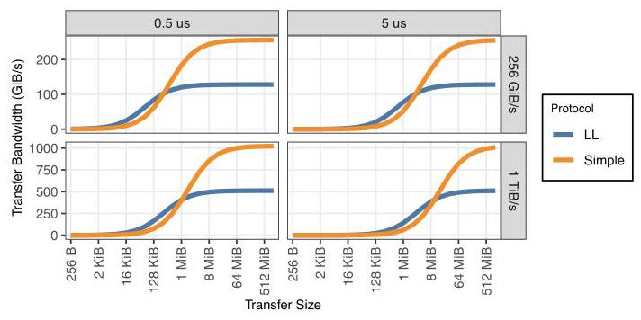

上图是论文动机里最有说服力的证据之一。作者比较 low-latency protocol 和 Simple protocol 时发现，仅仅把链路延迟假设从 $0.5\mu s$ 改成 $5\mu s$，Simple protocol 超过 LL protocol 的传输大小阈值就会明显移动：在 256 GiB/s 链路上从 512 KiB 移到 2 MiB，在 1 TiB/s 链路上从 4 MiB 移到 16 MiB。这说明模拟器如果低估或高估控制路径延迟，就会直接改变通信协议和架构设计的选择。

**动机评估**：动机比较 solid。论文不是抽象地声称“需要更高保真度”，而是用 collective protocol crossover、GPU cache-line 级数据搬运、semaphore/fence/barrier 控制路径、以及多后端拓扑描述碎片化来说明 ASTRA-sim 2.0 的抽象边界已经影响结论。不过论文的实验主要是展示 ASTRA-sim 3.0 能打开哪些探索空间，而不是系统性地用真实硬件校准模拟误差；因此它证明“这些能力有用”的力度强于证明“模拟结果绝对准确”。

**核心 Insight**：ASTRA-sim 3.0 的核心洞察是：分布式 ML 的关键性能差异越来越多地藏在“粗粒度 collective 事件”以下，包括 cache-line-sized Load/Store、CU 资源竞争、workgroup/wavefront 调度、semaphore 等控制流，以及网络后端对物理拓扑的解释方式。只要把 workload、GPU model 和 infrastructure representation 都降到足够细但仍可扩展的中间粒度，就能比二选一的方案更实用：它不需要像 GPU binary simulator 那样完整模拟 ISA，也不再像旧 ASTRA-sim 那样把通信当成单次粗粒度传输。

## 二、相关工作

论文把相关工作主要分成三条脉络。

第一条是 ASTRA-sim 自身和分布式 ML 模拟器。ASTRA-sim 1.0 解决了分布式训练系统 co-design 的基础问题，但 workload、collective 和 topology 都比较固定；ASTRA-sim 2.0 通过 Chakra ET 支持任意 workload，并扩展了网络后端，但 collective 仍以预定义算法为主，device 内部执行仍然非常粗。其他分布式 ML 模拟器如 Calculon、TrioSim、Maya、Phantora、SimAI、Arcadia 等分别强调 analytical modeling、单 GPU trace 外推、复用模型代码、并行离散事件模拟或多作业调度，但论文认为它们普遍没有同时支持任意 custom collective 和 CU/cache-line 级 GPU 行为。

第二条是 collective algorithm 与 collective representation。传统 CCL 里的 ring、all-pairs、double binary tree、recursive halving-doubling 是 textbook algorithms；近期研究则包括 topology-aware collective、collective synthesis、multi-commodity-flow 视角和 fault-tolerant collective。MSCCLang/MSCCL++ 这类 DSL 说明社区已经需要用更灵活的方式表达 per-GPU、per-workgroup 的 put/get/copy、barrier、semaphore 等操作。旧 ASTRA-sim 不能直接消费这种表示，意味着新算法要靠手工实现才能进入模拟器。

第三条是 GPU 级模拟和基础设施表示。GPGPU-Sim、MacSim、Accel-Sim 等 GPU binary simulator 能做 cycle-accurate 或 instruction-level 模拟，但它们模拟单 GPU 都成本很高，不适合大规模多 GPU 分布式 ML 探索。另一方面，网络模拟后端如 Simple、ns-3、HT-Sim 对物理拓扑的输入格式不同，研究论文常用“两层 fat-tree”这类高层描述，缺少可交换、可复现、后端无关的完整基础设施表达。InfraGraph 就是对这条脉络的回应。

## 三、技术挑战

**挑战 1：保真度和可扩展性之间的粒度选择。** 如果直接模拟 GPU ISA，准确但无法扩展到几十、上百 GPU；如果只模拟 collective kernel 或整块网络传输，可扩展但会丢掉 latency-sensitive inference 关心的控制路径和资源竞争。ASTRA-sim 3.0 需要找到一个中间层，使得 cache-line 级网络请求、CU 调度和 workgroup 依赖可见，同时避免陷入完整 GPU binary simulation。

**挑战 2：自定义 collective 的语义需要落到可执行模拟模型。** MSCCL++ 描述的是每个 GPU、每个 workgroup 的 put/get/copy/signal/wait 等操作。模拟器不能只把它当作一个 collective 名称，而要把这些操作转成具体 GPU operation 和 Load/Store 请求，否则就无法比较 get 与 put、control/data arbitration、barrier/semaphore 等细节带来的性能差异。

**挑战 3：控制路径不是附属开销，而会改变结论。** put 之后的 signal、get 之前的 wait、memory fence、barrier 和 semaphore 都可能产生 cache-line 级请求，并与数据流竞争网络和 CU 资源。旧模型若忽略这些路径，就可能误判某个 collective 算法、通信协议或网络配置。

**挑战 4：网络模型必须同时覆盖 on-chip、scale-up 和 scale-out。** 对一个 remote store 来说，数据不是从 GPU A 直接“跳”到 GPU B；它会经过 CU、HBM channel、I/O port、scale-up/scale-out fabric、远端 I/O 和远端 HBM。Simple 后端原先以 GPU 为节点建模，缺少 NoC 细节，因此需要升级到包含 CU、HBM channel、I/O port 的层次化网络表示。

**挑战 5：基础设施描述要能跨后端复用。** 一个物理系统如果在 Simple、ns-3、HT-Sim 中分别手写配置，就会引入语义不一致和复现实验困难。InfraGraph 需要既足够紧凑地表达大规模拓扑，又能展开成每个后端可消费的具体配置。

## 四、解决方案

### 整体思路

ASTRA-sim 3.0 的方案可以概括为三层增强：在 workload 层，把 kernel 和 collective 拆成 Load-Store granularity 的 GPU instructions、GPU operations、workgroups、wavefronts；在 execution 层，用 GPU Model 显式模拟 CU 映射、wavefront ready/stall、Wavefront Request 和 loop unrolling；在 infrastructure 层，用升级后的 Simple 后端和 InfraGraph 表达 NoC 细节与可复用物理拓扑。它保留 ASTRA-sim 2.0 的 Chakra ET 端到端 workload flow，但用更细的内部表示替代粗粒度事件。

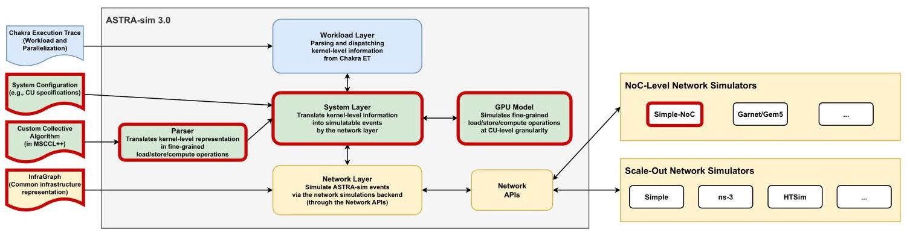

Figure 1 展示了 ASTRA-sim 3.0 的全栈位置：workload 仍可来自 Chakra ET，collective 可来自 MSCCL++，系统层负责把高层 kernel 分解成细粒度执行表示，网络层则可以接 Simple/ns-3/HT-Sim 等后端。红框强调的是本文新增或增强的部分，包括 GPU Model、MSCCL++ parser、InfraGraph 和更新后的 Simple network。

### 贯穿示例

可以用一个 16 GPU 上的 All-Gather/Reduce-Scatter 来理解整篇论文。旧 ASTRA-sim 可能只看到“某 GPU 向另一个 GPU 传输一段 buffer”，然后按 $\alpha-\beta$ 模型或粗粒度网络事件估算耗时。ASTRA-sim 3.0 会先从 MSCCL++ 里读到每个 GPU 的 workgroup 操作：这个 workgroup 是 get 远端数据，还是 put 本地数据，是否需要 signal/wait；然后把这些操作转成 MemcpyOp、SemaphoreAcquireOp、SemaphoreReleaseOp 等 GPU operations；再把每个 operation 展开成 128 B cache-line 大小的 Wavefront Requests。GPU Model 决定哪些 workgroup 映射到哪些 CU，哪些 wavefront 因 wait 或 barrier 暂停，哪些请求可以通过 loop unrolling 同时在途。最后，更新后的网络后端把这些请求放到本地 HBM、NoC、I/O port 和远端链路上模拟。

这个例子的关键是：同样的“collective bandwidth”结果，在 ASTRA-sim 3.0 中不是一个黑盒公式，而是由 control request、data request、CU 并发、register/outstanding request 限制、NoC/scale-up 路径和拓扑配置共同产生。于是它能解释为什么 get 在 Reduce-Scatter 中更好，却在 All-Gather 中反而更差。

### 关键技术点

**Load-Store 粒度 workload representation。** ASTRA-sim 3.0 不模拟完整 ISA，而是定义三类 primitive GPU instructions：data instruction 包括 Load/Store，control instruction 包括 SemaphoreAcquire/SemaphoreRelease，其他 instruction 包括 Reduce/Waitcnt。GPU operation 是这些 instruction 的逻辑组合，例如 LoadOp、StoreOp、MemcpyOp、SemaphoreAcquireOp、SemaphoreReleaseOp、ReduceOp、NopOp、BarrierOp。workgroup 是 GPU operations 的序列，wavefront 是 CU 中 lock-step 执行的单位，kernel 则是一组并行 workgroups。

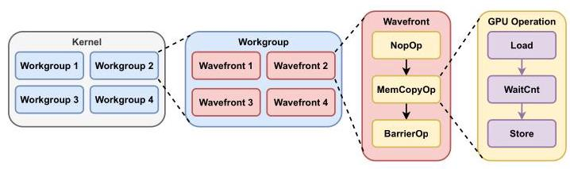

Figure 5 的价值在于把“kernel → workgroup → wavefront → GPU operation → Load/Store instruction”的层次画清楚。它解释了为什么 ASTRA-sim 3.0 不是简单给网络传输加一个更细的延迟常数，而是把 workload 本身变成能驱动 GPU Model 和网络后端的细粒度事件流。

**MSCCL++ custom collective support。** 论文实现了一个 straightforward translator，把 MSCCL++ JSON 中的 put/get/copy 映射到 MemcpyOp，把 signal/wait 映射到 SemaphoreReleaseOp/SemaphoreAcquireOp。这个设计看似直接，但意义很大：它把 collective algorithm synthesis 或 DSL 生成的 per-workgroup 控制流直接接入 ASTRA-sim，而不需要为每个新算法手写模拟逻辑。

**端到端 workload execution。** ASTRA-sim 3.0 继承 ASTRA-sim 2.0 对 Chakra ET 的支持，但不再把 compute/communication kernel 当作粗事件直接执行。communication kernel 通过 MSCCL++ parser 分解，compute kernel 可分解为多个执行 ReduceOp 的 workgroups。这样，compute kernel 和 communication kernel 都进入同一套细粒度 GPU Model，资源竞争不需要靠“同一时间只能 dispatch 一个 kernel”这类人为限制来近似。

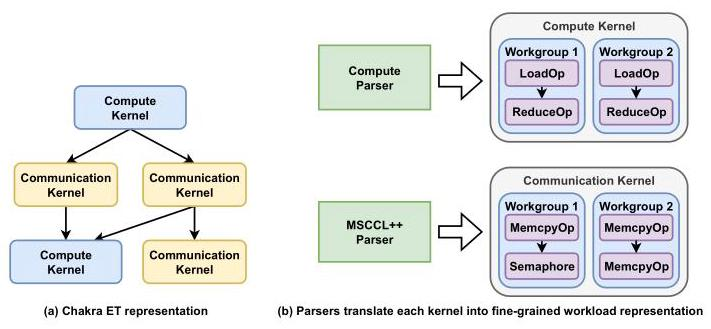

Figure 6 对应的是从 Chakra ET 到 GPU Model 的数据流：trace 中的 kernel 先被 parser 拆开，再由 GPU Model 逐步 dispatch 到 CU 和 network。它说明本文的细粒度建模不是单独的 microbenchmark 组件，而是被嵌入了端到端 workload simulation。

**GPU Model 与 Wavefront Request。** GPU Model 由多个 CUs 组成，kernel dispatch 后 workgroups 以 round-robin 映射到空闲 CU，从而模拟 CU 资源冲突。CU 在执行 workgroup 时选择 ready wavefront；如果某个 wavefront 因控制路径 stall，就执行其他 ready wavefront。cache-line 大小的 Wavefront Request 是网络后端接收的基本单位，SemaphoreAcquire/Release 产生单个控制请求，Load/Store/Memcpy 产生多个数据请求。

**Loop unrolling。** 当 wavefront 执行内存操作时，ASTRA-sim 3.0 允许通过可调 loop unrolling 让多个 cache-line request 同时在途。这个参数对应 GPU intra-wavefront instruction-level parallelism 的抽象，也为后文 GPU architecture exploration 提供了可调设计变量。

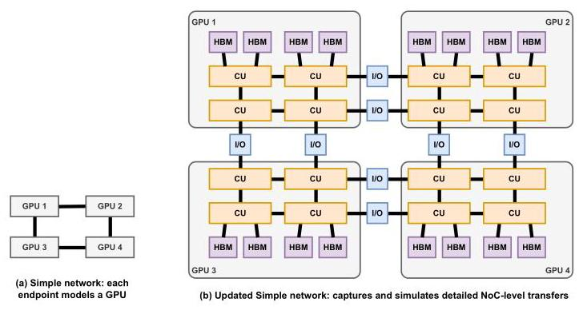

Figure 8 说明 Simple 后端的升级方向：旧模型以 GPU 作为主要节点，更新后把 CUs、HBM channels、I/O ports 等 NoC 级组件纳入拓扑。这样 ASTRA-sim 3.0 dispatch 出来的 Wavefront Request 才能同时覆盖本地 memory traffic 和远端 GPU 间通信。

**InfraGraph。** InfraGraph 把基础设施定义成有向带属性图：vertex 表示 GPU、NIC、switch、storage 等组件，edge 表示连接，link annotation 可携带 bandwidth/latency 等属性。用户通过 Device、Instance、Infrastructure、Device.Edge 等原语复用组件并程序化展开大规模拓扑；blueprints 则提供 SingleTierFabric、ClosFatTreeFabric 等常用模板。Translator 再把同一份 InfraGraph 转成 Simple、ns-3、HT-Sim 的后端配置，Visualizer 用来检查拓扑是否符合用户意图。

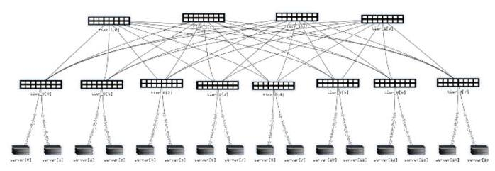

Figure 9 是 InfraGraph 的可视化例子。它的作用不是展示某个新网络拓扑，而是说明“完整、可复用、可视化检查”的 topology description 可以成为模拟输入的一等对象，减少不同后端之间手写配置造成的偏差。

### 与已有方案的对比

相对 ASTRA-sim 2.0，ASTRA-sim 3.0 的优势在于能表达任意 MSCCL++ collective、模拟控制路径和 CU/cache-line 级资源竞争，并用 InfraGraph 减少网络后端之间的配置碎片化。相对 GPU binary simulator，它牺牲完整 ISA 级准确性，换取多 GPU、大 buffer、不同 topology 下的可扩展模拟。相对一般 analytical simulator，它能解释 get/put、loop unrolling、outstanding request limit 这类微观设计变量对 collective bandwidth 的影响。

主要不足也来自这个折中。首先，论文没有给出和真实 GPU/集群测量之间的误差校准，所以高保真更多体现在“建模维度更细”，而不是“已验证精度更高”。其次，case studies 使用 generic GPU architecture 和 power-of-two 配置，适合展示能力，但不等于产品级结论。再次，Load-Store 抽象避免了 ISA 复杂性，也意味着它无法回答依赖具体指令、cache hierarchy 或 compiler behavior 的 GPU 微架构问题。

## 五、实验评估

### 实验设定

论文的实验被定位为 case studies，而不是单一 baseline 对比。作者实现了一个 generic GPU architecture：每个 GPU 有 $8 \times 4$ 的二维 mesh NoC，共 32 routers；每个 router 配 4 个 CUs，总计 128 CUs；上下边 router 分别连 16 个 memory channels，累计 4 TiB/s memory bandwidth；左右边 router 各有 4 个 I/O ports，提供 1 TiB/s scale-up bandwidth，每 GPU link latency 为 $1\mu s$。因此每个 GPU 被建模为 448 个 endpoints。

评估对象包括 custom collective algorithm design、GPU architecture exploration、fine-grained simulation scalability 和 scale-out infrastructure simulation。主要指标包括 collective bandwidth、AllReduce completion time、bus bandwidth、flow completion time、wall-clock simulation time 和 simulation throughput。workload 包括 Reduce-Scatter、All-Gather、All-to-All、ring All-Reduce 等 collective。

### 主要实验与结论

**Collective algorithm design：get 与 put 的结论取决于 collective 语义。** 在 32 GPU、每 GPU 32 workgroups 的 Reduce-Scatter 中，get-based Reduce-Scatter 在大 collective 上优于 put-based 版本。原因是 put 需要 sender 在 remote Store 后通知 receiver，额外的 SemaphoreRelease/SemaphoreAcquire 带来控制流量，并阻碍 data transfer 与 reduction computation 重叠；get 则在发起者收到 remote Load 数据后可立即做 reduction。

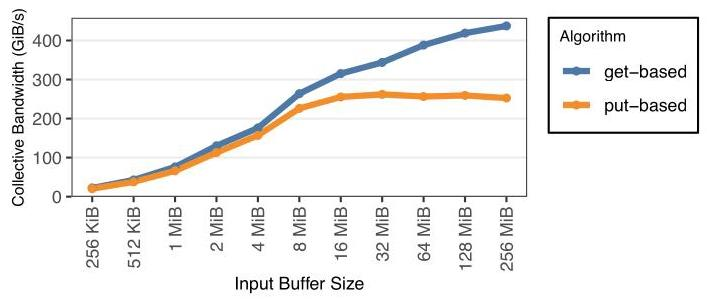

Figure 10 支撑的是“同样是数据搬运，控制路径和计算重叠会改变 collective 算法优劣”。ASTRA-sim 3.0 能看见 semaphore 和 cache-line 级 overlap，因此能解释 get 为什么在 Reduce-Scatter 里有优势。

在 16 GPU、每 GPU 60 workgroups 的 All-Gather 中，结论反过来：get-based collective 比 put-based 更慢。原因是 All-Gather 没有 reduction，get 少了计算重叠收益，反而会让请求远端发送数据的 control messages 被 data responses 阻塞；put 先把数据推入网络，acknowledgment 被阻塞的影响较小。引入 control/data fair arbitration 后，两者差距被缩小。

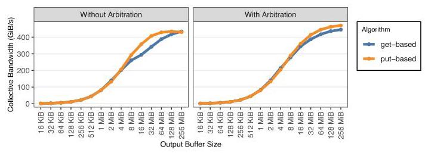

Figure 11 的意义在于提醒网络设计者：control/data arbitration 不是细枝末节，它会改变 get/put 这类算法选择的性能表现。旧模拟器如果看不见 control messages，就难以解释这种反转。

**GPU architecture exploration：intra-wavefront parallelism 和 outstanding request limit 有饱和点。** Figure 12 用 16 GPU、每 GPU 60 workgroups 的 All-to-All 测 loop unrolling。结果显示，增加 instruction-level parallelism 能改善 bandwidth-bound 大 collective，但收益会在达到每 CU 最大可 dispatch Wavefront Request 数后饱和；对 latency-bound 小 collective，这个优化并不关键。

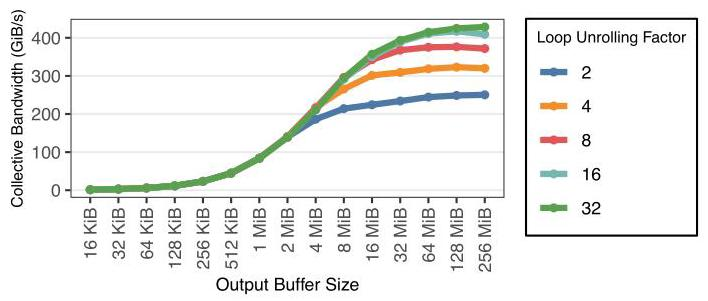

Figure 12 把 loop unrolling 从实现参数变成架构探索变量：如果 collective 主要受带宽限制，更多 in-flight cache-line request 有价值；如果主要受控制路径延迟限制，增加并行度并不能解决瓶颈。

Figure 13 进一步测试每个 CU 最大 outstanding Wavefront Request 数对 32 GPU All-Gather 的影响。作者把这个参数视为 register file size 的 proxy，因为 register file 会限制 CU 同时服务多少 cache-line request。结论与 loop unrolling 类似：对 control-path-dominated、latency-bound collective，收益不明显；即使对可受益场景，收益也会在某个规模后快速饱和。

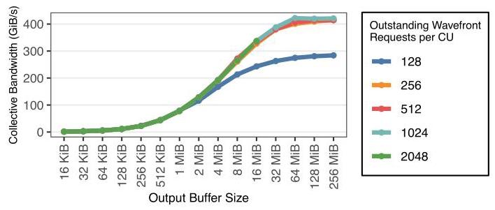

**Fine-grained simulation scalability：128 B 粒度仍可扩展到上百 GPU，但成本随 buffer size 线性增长。** 作者在 All-Gather 中把 output buffer 从 1 MiB 扩到 256 MiB，把系统规模从 2 GPU 扩到 128 GPU。128 GPU 时，模拟器同时建模 $128 \times 448 = 57,344$ 个 endpoints，且每个请求是 128 B 粒度。Figure 14 显示 wall-clock simulation time 随 output buffer size 近似线性增长，因为 buffer 越大需要模拟的 Wavefront Requests 越多。Figure 15 显示 simulation throughput 更主要由目标系统规模决定，而不是单纯由请求数量决定。

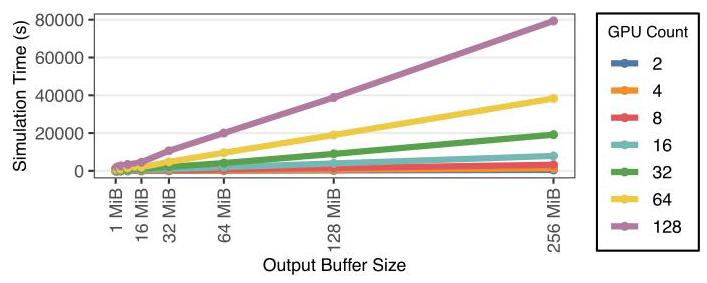

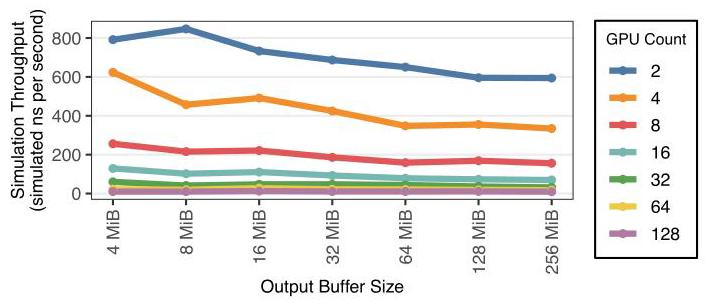

这两张图是 ASTRA-sim 3.0 粒度折中的关键证据：它确实比粗粒度模型更贵，但没有贵到只能跑单 GPU 或小规模 toy case；同时线性增长也让用户可以预估更大 buffer 或更多 GPU 时的模拟开销。

**Scale-out infrastructure simulation：InfraGraph 能驱动 ns-3 packet-level 后端。** 作者用 InfraGraph 描述 Figure 9 的 Clos fabric，通过 ns-3 packet-level backend 模拟 8 GPU 上的 1 MB ring All-Reduce。Table 1 报告 AllReduce completion time 为 165.98 $\mu s$，achieved bus bandwidth 为 88.45 Gbps；min/max/avg FCT 分别为 11,250 ns、14,552 ns、11,477 ns，standalone FCT 为 11,857 ns，peak FCT overhead 为 2,695 ns。作者还指出没有 packet drops，说明这个 ring traffic pattern 在模拟 fabric 中保持 lossless。

### 结论支撑性分析

实验对论文的主要主张有较好支撑：custom collective case study 证明 MSCCL++ 和控制路径建模能产生旧模型看不到的算法差异；GPU architecture case study 证明 Load-Store/GPU Model 可以用于探索 loop unrolling 与 outstanding request limit；scalability case study 证明 128 B 粒度在 128 GPU、57,344 endpoints 下仍可运行；InfraGraph case study 证明同一基础设施表示可以驱动 ns-3 后端。

但实验支撑也有边界。论文没有系统比较 ASTRA-sim 3.0 与真实硬件、NCCL/MSCCL++ 实测或其他模拟器在误差上的差异；也没有给出不同后端之间由 InfraGraph 生成配置后的跨后端一致性误差。换句话说，论文更像是“系统能力展示 + 设计空间示例”，不是完整的 simulator validation study。

## 六、附加洞察

**结论 1：链路延迟建模误差会放大为协议选择误差。**  
- *出处*：Section 3.2 / Figure 4  
- *推理链条*：作者先用 analytical $\alpha-\beta$ 模型比较 LL 和 Simple protocol，再改变 latency/bandwidth 参数；观察到 $0.5\mu s$ 与 $5\mu s$ 的 latency 假设会把 Simple 超过 LL 的阈值从 512 KiB 推到 2 MiB，或从 4 MiB 推到 16 MiB；因此，即使协议本身很简单，错误的 latency model 也会让设计者在不同 message size 区间选择错误协议。这个结论支撑了细粒度控制路径建模的必要性。

**结论 2：get/put 的优劣不是通信 primitive 的静态属性，而取决于 collective 是否能利用计算重叠。**  
- *出处*：Section 5.2 / Figure 10 / Figure 11  
- *推理链条*：Reduce-Scatter 中 get 可以在 remote Load 返回后立刻做 reduction，避免 put 的 sender notification 和 receiver wait；All-Gather 中没有 reduction，get 的 control requests 反而可能被 data responses 阻塞；因此同样的 get/put primitive 在不同 collective 下会反转优劣。这个结论对 collective algorithm synthesis 有启发：不能只优化数据路径，还要把控制路径和 computation placement 纳入搜索。

**结论 3：fair arbitration 可以缓解 control/data 争用，但不是所有性能差距都来自带宽不足。**  
- *出处*：Section 5.2 / Figure 11  
- *推理链条*：作者观察到 All-Gather 的 get-based 版本较慢，并将原因定位到 control messages 被 data responses 阻塞；加入 fair arbitration 后差距缩小，说明一部分损失确实来自控制/数据消息调度策略；但论文没有把差距完全归零描述为必然，因此仍需保留 collective 语义本身带来的差异。

**结论 4：增加 wavefront 内并行度主要帮助 bandwidth-bound collective，无法通吃 latency-bound 场景。**  
- *出处*：Section 5.3 / Figure 12  
- *推理链条*：loop unrolling 允许一个 CU 同时发出更多 cache-line Wavefront Requests；对于大 buffer、带宽受限的 All-to-All，这提升了网络利用；但当 collective 小到主要受控制路径和固定延迟支配时，更多 in-flight data request 并不能改变瓶颈。因此，GPU 架构参数需要和目标 collective/message size 一起考虑。

**结论 5：register-file-like outstanding request 能力有快速饱和点。**  
- *出处*：Section 5.3 / Figure 13  
- *推理链条*：作者把每 CU 最大 outstanding Wavefront Request 数作为 register file size 的 proxy；实验显示提升该上限后带宽改善会在某个点后饱和，且对 control-path-dominated 小 collective 不明显；因此为 collective 性能盲目扩大寄存器或请求窗口可能不是高性价比设计。

**结论 6：细粒度模拟成本主要随 buffer size 线性放大，吞吐更受系统规模影响。**  
- *出处*：Section 5.4 / Figure 14 / Figure 15  
- *推理链条*：128 B 粒度意味着 buffer 越大，需要模拟的 Wavefront Requests 越多；Figure 14 呈现 wall-clock time 随 1-256 MiB buffer size 增长；Figure 15 则说明不同 GPU 数下每秒可模拟的 nanoseconds 更受 endpoints/system scale 影响；因此 ASTRA-sim 3.0 的开销是可预期的，但大规模 topology 仍会主导 throughput。

## 七、总结与评价

ASTRA-sim 3.0 的核心贡献是把一个已有的分布式 ML 模拟框架升级成更适合现代 inference/training co-design 的高保真基础设施：它能直接接 MSCCL++ 自定义 collective，把 GPU 执行和控制路径降到 cache-line Load-Store 粒度，并用 InfraGraph 统一网络基础设施描述。论文最亮的地方在于用 get/put 反转、loop unrolling 饱和、control/data arbitration 等案例展示了“细粒度建模真的会改变设计结论”。

最大的不足是验证深度还不够。论文展示了模拟器能跑什么、能观察到什么，但没有充分回答“相对真实系统准到什么程度”。如果后续工作能补上真实 GPU/cluster 测量校准、不同网络后端的一致性测试，以及更丰富的 production-scale workload case study，ASTRA-sim 3.0 会更容易成为系统设计中的决策依据，而不仅是探索工具。

## 八、章节脉络与段落速览

- **Title / Abstract**：提出 ASTRA-sim 3.0 的定位，即通过高保真 GPU 与基础设施建模提升分布式 ML 模拟能力。
  - ¶1 标题和作者信息说明该工作来自 AMD Research、Georgia Tech、Keysight、Purdue 等机构。
  - ¶2 摘要说明现代分布式 ML 尤其是 inference 需要忠实建模 latency-sensitive collective、device architecture 和 infrastructure representation，并概括 ASTRA-sim 3.0 的三项增强。

- **Section 1 · Introduction**：从大模型规模、分布式 ML 设计空间和旧 ASTRA-sim 限制引出 ASTRA-sim 3.0。
  - ¶1 说明 foundation AI model 的训练和推理需求快速增长，推理占生命周期能耗和成本的大头，因而需要分布式 GPU 基础设施。
  - ¶2 说明分布式 ML co-design 横跨模型、并行策略、GPU 架构和通信，必须依赖系统化模拟基础设施。
  - ¶3 回顾 ASTRA-sim 1.0/2.0 的演进，并指出 2.0 在当前场景下面临新的限制。
  - ¶4 指出旧 ASTRA-sim 只支持少数 textbook collective，无法直接捕获快速发展的 custom collective 研究。
  - ¶5 说明旧模型缺少 device control path、cache-line 数据路径和 CU 资源竞争，尤其会影响 latency-sensitive inference。
  - ¶6 通过 Figure 1 前后的讨论说明细粒度操作需要 NoC 级网络模型，而旧 ASTRA-sim 只支持粗粒度 inter-GPU communication。
  - ¶7 指出不同网络后端配置格式碎片化，阻碍基础设施细节复用和结果复现。
  - ¶8 总结 ASTRA-sim 3.0 的能力：MSCCL++ custom collective、Load-Store granularity、GPU Model 和 InfraGraph。

- **Section 2 · Background**：介绍 ASTRA-sim、GPU 编程/架构、collective communication 和 MSCCL++ 表示。
  - **2.1 · ASTRA-sim**：说明 ASTRA-sim 的 workload/system/network 三层结构，以及 1.0/2.0 的功能边界。
    - ¶1 概括 ASTRA-sim 三层架构及 system layer 在 workload 与 network 之间的中介作用。
    - ¶2 说明 ASTRA-sim 1.0 缺少灵活性，2.0 引入 Chakra ET 和 Simple 后端但仍有限。
  - **2.2 · Graphics Processing Unit**：给出 GPU kernel、workgroup、wavefront、CU 等术语背景。
    - ¶1 简要说明 GPU 是分布式 ML 的主流计算设备。
    - ¶2 解释 kernel/thread/workgroup/wavefront 的编程模型和 Figure 2。
    - ¶3 解释 GPU 硬件由多个 CU 并行执行 workgroup。
  - **2.3 · Collective Communication**：介绍分布式 ML 中设备间同步和 textbook collective algorithms。
    - ¶1 说明模型/数据分散到多设备后需要 collective communication。
    - ¶2 说明 collective algorithm 定义数据 chunk 如何在网络上移动，并列举 ring、all-pairs、double binary tree 等传统算法。
  - **2.4 · MSCCL++ Custom Collective Representation**：介绍 DSL 化 collective 表示为何重要。
    - ¶1 说明 MSCCLang/MSCCL++ 能表达 put/get、多远端通信和控制依赖，Figure 3 展示 per-GPU/workgroup JSON 表示。

- **Section 3 · Motivation**：从 custom collective、fine-grained GPU modeling、common infrastructure representation 三方面论证需求。
  - ¶1 总述本节目标是识别当前 ASTRA-sim 的限制。
  - **3.1 · Customized Collective Algorithms**：说明 textbook collective 不足以覆盖新算法设计。
    - ¶1 说明训练与推理 collective 的目标不同，算法设计需要调 chunk、workgroup、protocol、primitive、topology-aware synthesis 等参数。
    - ¶2 指出旧 ASTRA-sim 支持的算法和参数有限，无法低成本模拟快速变化的 collective。
  - **3.2 · Fine-Grained GPU Modeling**：说明 latency-sensitive inference 需要 device 细节。
    - ¶1 指出现有 ASTRA-sim 不捕获细粒度 device modeling。
    - ¶2 以 remote put 为例说明真实路径包含 destination readiness、CU Load、network transfer、remote Store 和资源竞争。
    - ¶3 用 Figure 4 说明错误 latency 建模会移动 LL/Simple protocol 的性能交叉点。
  - **3.3 · Common Infrastructure Representation**：说明后端专用拓扑描述阻碍共享和复现。
    - ¶1 说明 ASTRA-sim 支持多网络后端，但每个后端需要不同物理系统配置。
    - ¶2 说明后端绑定格式增加手写成本，也让论文中的高层拓扑描述难以精确复现。
    - ¶3 总结需要后端无关、可共享、可翻译的基础设施图表示。

- **Section 4 · ASTRA-sim 3.0**：详细介绍 workload representation、MSCCL++ parser、GPU Model、Simple 后端和 InfraGraph。
  - ¶1 总述本节解释 ASTRA-sim 3.0 的新功能与实现。
  - **4.1 · Fine-Grained Workload Representation**：定义 Load-Store 粒度执行层次。
    - ¶1 说明选择 Load-Store granularity 是为了捕获通信关键路径，同时避免完整 GPU binary simulation 的开销。
    - ¶2 用 Figure 5 说明 kernel 被分解为 workgroup、wavefront、GPU operation 和 Load-Store instruction。
    - ¶3 说明 primitive GPU instructions 分为 data、control 和 other 三类。
    - ¶4-6 分别定义 Load/Store、SemaphoreAcquire/Release、Reduce/Waitcnt 等 instruction。
    - ¶7-11 定义 GPU operations，包括 LoadOp、StoreOp、MemcpyOp、SemaphoreAcquireOp、SemaphoreReleaseOp、ReduceOp、NopOp、BarrierOp。
    - ¶12 说明 workgroup/wavefront 的执行关系，以及控制操作只由 wavefront zero 发控制请求的假设。
    - ¶13 说明 kernel 是一组 workgroups，dispatch 到 GPU 后并行执行。
    - ¶14 总结 instruction、operation、workgroup、kernel 的层级关系。
  - **4.2 · MSCCL++ Custom Collective Support**：说明如何把 MSCCL++ 操作映射到 GPU operations。
    - ¶1 说明 put/get/copy 转为 MemcpyOp，signal/wait 转为 SemaphoreReleaseOp/SemaphoreAcquireOp。
  - **4.3 · End-to-End Workload Execution**：说明如何继承 Chakra ET 并统一 compute/communication kernel。
    - ¶1 说明 ASTRA-sim 3.0 将 Chakra kernel 分解为细粒度表示，并通过统一 GPU Model 捕获 compute/communication 资源竞争。
  - **4.4 · GPU Model**：定义 GPU Model、CU、Wavefront Request 和 loop unrolling。
    - ¶1 总述 GPU Model 用于执行细粒度表示。
    - ¶2 说明 GPU Model 把 workgroups round-robin 映射到 CU 以模拟资源冲突。
    - ¶3 说明 CU 选择 ready wavefront 执行，并在 wavefront stall 时切换到其他 wavefront。
    - ¶4-6 说明 NopOp、BarrierOp、ReduceOp 和其他 Load/Store 操作如何在 CU 中执行。
    - ¶7 说明 Wavefront Request 是 cache-line-sized 网络请求，是网络后端模拟的最小传输单位。
    - ¶8-9 说明 semaphore 操作产生单个请求，Load/Store/Memcpy 产生多个请求。
    - ¶10 说明 loop unrolling 用多个 in-flight memory requests 表达 intra-wavefront parallelism。
  - **4.5 · Detailed Simple Network Modeling**：说明 Simple 后端从 GPU 级扩展到 NoC 级。
    - ¶1 说明 Simple 要支持 NoC-level requests 和 cache-line transfers。
    - ¶2 说明 Figure 8 中新 Simple 后端包含 CU、HBM channel、I/O port 等组件，可模拟本地与远端操作。
  - **4.6 · Infrastructure as a Graph**：说明 InfraGraph 的图表示和原语。
    - ¶1 说明 InfraGraph 用有向带属性图表达 GPU、NIC、storage 和链路属性。
    - ¶2 说明用户通过 reusable infrastructure objects 和 programmatic expansion 构造完整图。
    - ¶3-4 定义 Component、Link、Device、Instance、Infrastructure、Device.Edge 等基本原语。
    - ¶5 说明蓝图提供常见 device/fabric 模板，如 SingleTierFabric 和 ClosFatTreeFabric。
  - **4.7 · InfraGraph Toolchain**：说明 translator、visualizer、fully qualified graph 和服务层。
    - ¶1 说明 translator 把 InfraGraph 转成 Simple、ns-3、HT-Sim 配置，并让不同后端共享同一物理假设。
    - ¶2 说明 visualizer 用于检查拓扑定义是否符合用户意图。
    - ¶3 说明 fully qualified graph 使用层次化 identifier 表达 node/edge，支持路径发现、遍历和 topology-aware simulation。

- **Section 5 · Case Studies**：展示 ASTRA-sim 3.0 能打开的设计空间，而非产品级优化结论。
  - ¶1 说明本节目标是展示适用性和新探索机会，使用 generic GPU architecture。
  - **5.1 · Target GPU Architecture**：定义 generic GPU 配置。
    - ¶1 说明每 GPU 有 32 routers、128 CUs、4 TiB/s memory bandwidth、1 TiB/s scale-up bandwidth、$1\mu s$ latency 和 448 endpoints。
  - **5.2 · Collective Algorithm Design**：比较 get/put collective 及控制路径影响。
    - ¶1 说明 ASTRA-sim 3.0 让网络设计者能比较 get 与 put 这类隐含不同同步需求的实现。
    - ¶2 说明 32 GPU Reduce-Scatter 中 get-based 版本在大 collective 上更好。
    - ¶3 解释 put 需要通知和 semaphore，get 能在 remote Load 后立即 reduction，从而实现 cache-line 粒度 overlap。
    - ¶4 说明 16 GPU All-Gather 中 get-based 反而更差。
    - ¶5 解释 All-Gather 没有 reduction，get control requests 会被 data responses 阻塞，fair arbitration 可缩小差距。
    - ¶6 总结 get/put 这类小差异也会显著影响性能和网络设计。
  - **5.3 · GPU Architecture Exploration**：探索 loop unrolling 与 outstanding request limit。
    - ¶1 说明 ASTRA-sim 3.0 可用于 GPU architecture design，并用 All-to-All 评估 loop unrolling。
    - ¶2 说明 32 GPU All-Gather 评估每 CU 最大 outstanding Wavefront Request 数。
    - ¶3 说明 outstanding request limit 可近似 register file size，且收益对 latency-bound collective 不明显并会快速饱和。
    - ¶4 总结这些例子体现 Load-Store 级 architecture modeling 的有效性。
  - **5.4 · Fine-Grained Simulation Scalability**：评估 128 B 粒度模拟的开销。
    - ¶1 说明实验在 2-128 GPU、1-256 MiB buffer 上模拟 All-Gather，128 GPU 时有 57,344 endpoints。
    - ¶2 说明 simulation time 随 buffer size 线性增长，而 simulation throughput 主要由目标系统规模决定。
  - **5.5 · Scale-Out Infrastructure Simulation**：验证 InfraGraph 与 ns-3 的 scale-out 模拟。
    - ¶1 说明用 Clos fabric 上 8 GPU 1 MB ring All-Reduce 评估 ns-3 后端，并报告 FCT、completion time、bandwidth 和无 packet drop。

- **Section 6 · Related Work**：把已有模拟器分成 GPU binary simulator 和 distributed ML simulator。
  - ¶1 总述相关模拟器分为两个领域。
  - ¶2 说明 GPGPU-Sim、MacSim、Accel-Sim 等 ISA/cycle 级模拟器精细但不适合大规模多 GPU。
  - ¶3 说明多种 distributed ML simulator 缺少任意 custom collective 和 CU/cache-line 级行为建模。

- **Section 7 · Conclusion**：总结 ASTRA-sim 3.0 的更新。
  - ¶1 说明 ASTRA-sim 3.0 通过细粒度控制路径、架构细节、自定义 collective 和 InfraGraph 打开新 design space。

- **Acknowledgments / References**：给出致谢、AI 使用说明和参考文献。
  - ¶1 感谢 ASTRA-sim 原始开发者和作者。
  - ¶2 声明 AMD 商标信息。
  - ¶3 声明 generative AI 仅用于写作质量和语法检查。
  - ¶4 参考文献覆盖 GPU 架构、collective、ASTRA-sim、网络模拟、LLM inference 和基础设施等背景。
