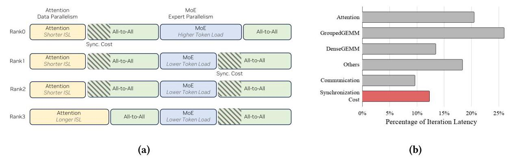
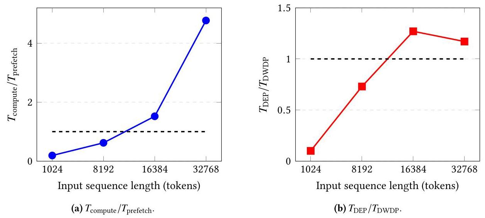
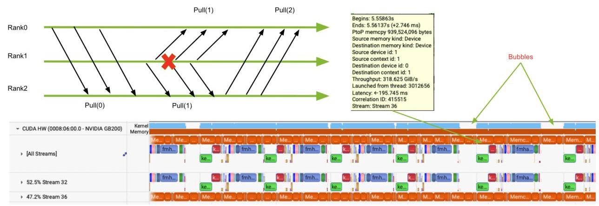
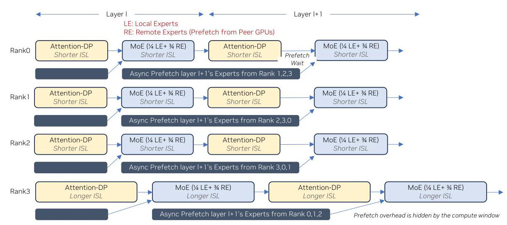
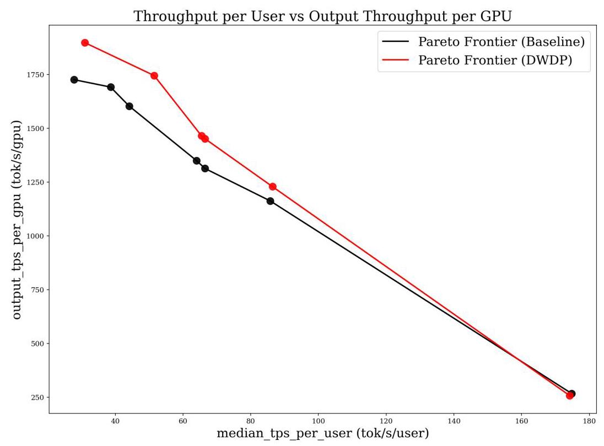
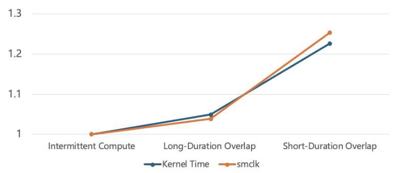

# DWDP: Distributed Weight Data Parallelism for High-Performance LLM Inference on NVL72 深度解读

> **作者**：Wanqian Li, Jintao Peng, Zongfei Jing, Tianyu Zhang, Ze Long, Xianjie Qiao, Xiaoming Chen, Dongxu Yang, Kefeng Duan, June Yang  
> **会议/期刊**：arXiv preprint, 2026  
> **一句话总结**：DWDP 把 MoE 权重分布式存放在 NVL72 的多张 GPU 上，但保持每张 GPU 独立 data-parallel 推理，通过按层异步拉取远端 expert 权重来去掉 DEP/EP 路径中的 layer-wise collective synchronization，从而在 DeepSeek-R1 的 disaggregated serving 场景中提升 context-side 和端到端 GPU 效率。

## 一、问题定义

这篇论文属于非 First 类型：它并不是首次讨论 LLM inference 的多 GPU 并行，也不是首次提出 disaggregated serving、expert parallelism 或 cache-aware scheduling；它的切入点是现有多 GPU inference parallelism 在真实 serving 负载下仍然要在每层做 inter-rank synchronization。对于 tensor parallelism、expert parallelism、pipeline parallelism 以及 attention data parallelism + expert parallelism 的组合，虽然切分对象不同，但跨 GPU 协同通常被放在层边界或 MoE 阶段的 all-to-all / all-gather 上。只要一个 rank 因请求长度、KV-cache 命中率或 expert routing 偏斜而变慢，其他 rank 就会等待，整体吞吐被最慢 rank 拖住。

Fig. 1 是论文动机最关键的证据。左侧把 request-level imbalance 和 weight-level imbalance 映射到 DEP 的两个 all-to-all 等待点，右侧给出 kernel breakdown：当每 rank 序列长度的 coefficient of variation 达到 20% 时，同步开销约为 12%。这说明作者不是在优化一个纯理论上的 collective overhead，而是在指出生产 serving 中常见的 rank-level skew 会被 layer-wise synchronization 放大。

**动机评估**：动机比较 solid。MoE LLM 的 inference 已经天然依赖多 GPU，DeepSeek-R1 这类大模型又使 context phase 需要较大的 GPU 资源池；同时 serving 请求在输入长度、cache 命中、expert 热度上的不均衡是真实存在的。论文给出的 Fig. 1 和 Table 1 能把“同步等待”量化到 12.26% synchronization cost 和 126.74 us communication cost 的量级。不过动机有明确适用边界：DWDP 依赖高带宽 peer-to-peer GPU fabric 和足够大的 compute window，因此它更像 NVL72 这类高互联单域系统上的 context-server 策略，而不是通用集群互联上的默认并行方式。

**核心 Insight**：作者的关键洞察是，MoE 模型的“权重容量问题”和“执行同步问题”可以拆开处理。传统 expert parallelism 把 expert 放在不同 rank 上，同时也把 token/expert 计算绑定成 collective all-to-all；DWDP 则让每个 rank 仍像 data parallel worker 一样独立处理自己的请求，只把 MoE expert 权重 offload 到 peer GPUs，需要某层 expert 时再异步拉取。换句话说，权重可以分布式存储，但执行不一定要分布式同步。这个 insight 直接连接了问题和方案：只要远端权重 prefetch 能被当前层计算隐藏，就可以用额外的 P2P weight traffic 换掉 DEP 的 collective synchronization。

## 二、相关工作

论文对相关工作的组织方式比较隐含，主要可以分成三类。

第一类是模型并行策略，包括 expert parallelism、tensor parallelism 和 pipeline parallelism。它们解决的是单 GPU 容量不足或单卡算力不足的问题：把权重、hidden dimension、layer 或 expert 拆到多张 GPU 上。问题在于，这些策略通常要求跨 rank 通信来完成一层计算，尤其是 MoE 的 expert parallelism 会引入 all-to-all token dispatch 和 combine。DWDP 与这类工作的关系不是替代所有 model parallelism，而是在 MoE context inference 中重新选择切分语义：不切 token 执行流，而切 expert 权重存储。

第二类是 serving 调度和负载均衡，包括 cache-aware scheduling、load-aware scheduling、ADP balance、DistServe、Splitwise 等。这些工作尝试把请求分配得更均衡，或者把 prefill/context 和 generation/decode 分离，让资源配置更贴近阶段特征。它们能降低 imbalance 的发生概率，但不能消除现有并行策略的同步语义：只要每层仍要 collective，局部延迟差异仍会在 barrier 处变成等待。DWDP 的区别在于直接移除 context path 上的 collective barrier，而不是只在 barrier 前做更聪明的调度。

第三类是 MoE 系统与 expert load balancing，例如 DeepSpeed-MoE、Tutel 和 TensorRT-LLM 的 expert parallelism 优化。它们关注 expert routing、expert placement、token dispatch、kernel 和通信优化。DWDP 继承了“MoE expert 占主要权重容量”的事实，但反向利用它：既然 attention 权重相对小，可以复制；MoE expert 权重大，可以分散存储并按层拉取。已有 EP 更偏向让 token 去 expert 所在 rank，DWDP 更偏向让每个 rank 把当前层所需 expert 权重拉到本地。

## 三、技术挑战

**挑战 1：去掉 collective 后，模型权重仍然必须放得下。** 每个 rank 独立 data-parallel 推理意味着它要能执行完整模型逻辑；但 DeepSeek-R1 级别 MoE 模型的权重无法简单复制到每张 GPU。因此 DWDP 只能复制相对小的 attention weights，把 MoE experts 切分到 peers，再按层临时拉取远端 expert。

**挑战 2：remote-weight prefetch 必须被计算隐藏。** DWDP 的每层延迟近似是 `max(T_compute, T_prefetch)`，只有当 attention + MoE 的 compute window 足够覆盖下一层 expert prefetch 时，它才会赢过 DEP 的 `T_compute + T_all2all`。如果 batch 太小、context 太短或互联带宽不够，远端权重拉取会暴露在 critical path 上。

Fig. 3 用 roofline model 给出了这个边界：在 batch size 1 的 DeepSeek-R1 context phase 上，DWDP4 大约到 16K tokens 才开始优于 DEP4。图里的虚线不是一个普适常数，而是提醒读者：DWDP 的收益来自“计算窗口覆盖通信窗口”，因此 batch size、MNT、ISL 和 fabric 带宽都会改变适用区间。

**挑战 3：split-weight layout 会破坏已有 MoE groupedGEMM 的连续权重假设。** DWDP 中本地 expert 和远端 prefetched expert 分别在不同 buffer 里。朴素实现要在 kernel launch 前做 D2D copy，把 split weights 合并到连续 buffer；Table 1 中这带来 34.00 us D2D copy，占 DEP4 latency 的 -2.58%。

**挑战 4：异步 P2P 拉取会产生 many-to-one source-side contention。** 每个 rank 都独立拉取其他 rank 的 expert。没有 collective barrier 并不意味着没有通信冲突：多个 destination 可能同时从同一个 source rank 拉权重，source copy engine 会串行化部分请求，导致 compute bubble。

Fig. 4 的 Nsight Systems trace 展示了这个实现层面的风险：当 prefetch 时间和 layer compute window 接近时，source 端 copy engine 的串行化会把通信窗口拉长，让原本应被隐藏的权重拉取重新暴露出来。

**挑战 5：通信和计算重叠并不免费。** 即使用 cudaMemcpyAsync 通过 copy engine 拉取，不占 SM，也会共享 NoC、L2、DRAM 和功耗预算。Appendix A 表明，memory-bound kernels 可能受 HBM/L2 竞争影响，compute-intensive attention 更主要受 power-induced frequency throttling 影响。

## 四、解决方案

### 整体思路

DWDP 的核心是“权重分布式、执行数据并行”。在一个 DWDP group 内，每个 rank 复制 attention weights，MoE experts 按 rank 分布式存放；执行第 `l` 层时，rank 使用本地和已拉取的远端 expert 完成本地请求的 MoE 计算，同时异步 prefetch 第 `l+1` 层缺失的 remote experts。通信不是 NCCL all-gather，而是 copy-engine-based `cudaMemcpyAsync` P2P pulls，因此每个 rank 可以独立前进，不需要等其他 rank 到达同一个 collective。

Fig. 2 可以看作 DWDP 的“时序图”。每行是一个 rank，黄色 attention 和蓝色 MoE 都在本地执行；深色条表示异步拉取下一层 remote experts。即使 Rank3 的 ISL 更长，它也只是自己的 attention/MoE 方块更长，不会像 DEP 那样在 all-to-all 处把其他 rank 卡住。图底部的文字也点明了设计前提：prefetch overhead 被 compute window 隐藏。

### 贯穿示例

可以把一个 4-GPU NVL72 小组想象成四个独立服务窗口，每个窗口都能处理自己的用户请求。DeepSeek-R1 的 attention 部分像每个窗口都必须常备的工具，体积较小，所以四个窗口各放一份；MoE experts 像一大套专业工具箱，单个窗口放不下，于是四个窗口各保管四分之一。传统 DEP 的做法更像每一步都把用户材料在窗口之间传来传去，所有窗口必须等最慢的窗口完成当前步骤再进入下一步。DWDP 则让每个窗口提前从其他窗口借下一步要用的工具箱，借工具的过程在当前处理用户时后台进行；只要借工具足够快，窗口就能一直独立服务，不被其他窗口的请求长度拖慢。

### 关键技术点

**1. MoE 权重 offload + attention 复制。** DWDP 选择只分布 MoE expert weights，因为 MoE 权重主导模型 memory footprint，而 attention weights 相对较小。这样每个 rank 可以本地完成 attention，并只在 MoE 层前补齐当前层缺失 experts。这个设计回应了容量挑战：模型整体不用在每张 GPU 上完整复制，但 execution stream 仍保持 data parallel。

**2. 按层 on-demand prefetch 和 double buffering。** 对第 `l+1` 层 remote experts 的拉取与第 `l` 层 MoE 以及第 `l+1` 层 attention 重叠。double buffering 用来让正在使用的 expert buffer 和下一层 prefetch buffer 分离，避免读写冲突。这个 pipeline 回应了 prefetch latency 挑战：如果 compute window 足够大，`T_prefetch` 不进入关键路径。

**3. 避免 NCCL collective，使用 copy engine P2P pulls。** 作者明确避开 all-gather 这类 NCCL collective，因为它不仅带同步语义，还可能消耗 SM 资源。DWDP 的远端权重通过 serial peer-to-peer pulls 拉取，rank 之间不需要同时进入同一个 collective。这个点是“异步执行”的根：DWDP 不是把 all-to-all 优化得更快，而是换掉通信语义。

**4. TensorList-based groupedGEMM，消除 split-weight merge。** 朴素 DWDP 要把 local experts 和 prefetched remote experts 合并成连续 buffer，带来 34.00 us D2D copy。作者扩展 MoE groupedGEMM kernel，使其直接接收多个 weight buffer，通过 TensorList 在 kernel 内选择对应 expert 权重。这样 D2D merge copy 从 critical path 消失，论文报告该优化让 DWDP baseline 的 TPS/GPU 再提升约 3%，且 groupedGEMM 没有明显回退。

**5. fixed-size slice + round-robin 的 time-division multiplexing。** 为了缓解 many-to-one source contention，DWDP 把每个 remote-weight transfer 切成固定大小 slices，并按 destination round-robin 生成 copy plan。大块 monolithic pull 容易让一个 destination 长时间占住 source copy engine；小 slice interleaving 则让 source 能在多个 destination 之间交替推进。论文用随机模型说明，DWDP4 下 `C=1` 和 `C=2` 的概率各为 44.44%，`C=3` 为 11.11%；更大 group 会有更高阶 contention。slice 化的目标正是让常见低阶 contention 不变成长期 bubble。

### 与已有方案的对比

相对 DEP/EP，DWDP 的优势是把慢 rank 的影响局部化：Rank A 的长输入或热 expert 不再强制 Rank B 在 layer boundary 等待。它还支持更细粒度的资源配置，因为 expert 数不必严格被 group size 整除，允许必要的冗余放置；实验中的 DWDP3 与 DWDP4 有接近的 context TPS/GPU speedup，说明这种灵活性有实际意义。

不足也很明确。第一，DWDP 强依赖高带宽 P2P fabric；如果跨节点或低带宽互联，权重 prefetch 很可能暴露。第二，它主要适合 context/prefill 阶段，因为 context 计算窗口更大；generation 阶段每步 token 少，难以隐藏整层 expert 权重拉取。第三，端到端结果显示 DWDP 会带来 TTFT tradeoff，尤其在减少 context GPU 数量后可能增加 queueing delay。第四，论文的实现和评测高度绑定 GB200 NVL72、DeepSeek-R1、TensorRT-LLM 与 NVFP4 checkpoint，外推到其他模型和系统时需要重新验证。

## 五、实验评估

### 实验设定

硬件平台是 GB200 NVL72；实现基于 TensorRT-LLM，论文注明基于 commit `3a89495`，上游集成通过 TensorRT-LLM PR #12136 推进。模型是 DeepSeek-R1，使用 NVFP4 checkpoint，MoE weights 为 NVFP4，attention 使用 FP8 KV cache。所有评测都在 disaggregated serving mode 下进行，DWDP 只应用到 context server，generation-server configuration 除特殊搜索点外保持不变。

Baseline 是相同 runtime 和硬件约束下的传统 DEP-based configuration。context-only 实验报告 TPS/GPU speedup 和 TTFT speedup；end-to-end 实验报告 TPS/user、output TPS/GPU 和 median TTFT，并重点看给定 TPS/user 约束下的 GPU 效率。

### 主要实验与结论

**1. Baseline DWDP 已经能去掉同步成本，但会暴露新开销。** Table 1 中 DEP4 的 iteration latency 是 1319.85 us，DWDP4 baseline 是 1165.58 us，净改善 11.69%。拆开看，DWDP 去掉 126.74 us communication 和 161.85 us synchronization cost，合计对应 21.86% gross reduction；但 attention 从 269.67 us 增到 320.56 us，Others 从 241.69 us 增到 284.32 us，并新增 34.00 us D2D copy，说明通信计算重叠和 split-weight merge 吃掉了部分收益。

**2. context-only ablation 支持 DWDP 的核心假设。** 在固定 MNT=32768 时，ISL 从 1K 到 32K，DWDP 的 TPS/GPU speedup 为 1.09-1.11x，TTFT speedup 为 1.11-1.27x。固定 ISL=8192 时，MNT 从 16384 到 32768，TPS/GPU speedup 从 1.01x 提高到 1.10x，说明更大的 token budget 提供更大的 compute window。随着 ISL standard deviation 从 0 到 4096，TPS/GPU speedup 从 1.09x 提高到 1.15x，TTFT speedup 从 1.12x 提高到 1.18x，这直接验证了“负载越不均衡，去掉同步越有价值”。

**3. group size 灵活性成立，但 TTFT 受系统配置影响。** 固定 ISL=16384、MNT=32768 时，DWDP3 与 DWDP4 的 TPS/GPU speedup 分别为 1.093x 和 1.091x，几乎相同；但 DWDP3 的 TTFT speedup 是 0.86x，DWDP4 是 1.15x。作者解释 DWDP3 的 context-side aggregate throughput 更低，可能增加 first token 前的 queueing delay。这说明 DWDP 的资源粒度优势是真实的，但 serving pipeline 的 rate matching 仍要谨慎调。

**4. contention mitigation 在短 compute window 下最有价值。** Table 4 用 1MB slices 比较 merge elimination-only 和 full DWDP。ISL ratio=0.5、MNT=16384 时，merge elimination-only 只有 0.995x，full DWDP 达到 1.081x；而 MNT=32768 时二者都是约 1.14x。结论是，当 compute window 足够长，随机通信延迟本来就能被隐藏，TDM 的增益有限；当 compute window 短，TDM 能把暴露出来的随机 contention 拉回去。

Fig. 5 显示 DWDP 的红色 Pareto frontier 在多数 20-100 TPS/user 区间位于 baseline 黑线之上，也就是同等 per-user throughput 下有更高 output TPS/GPU。这个图的含义不是“DWDP 总能提高用户体验”，而是“DWDP 能以更少 context GPU 支撑相似服务点，从而提高 GPU 效率”。

**5. end-to-end GPU efficiency 有提升，但高 TPS/user 和 TTFT 是弱点。** Table 5 中 20-30 TPS/user 区间，DWDP 的 TPS/user speedup 为 1.15x，TPS/GPU speedup 为 1.10x；40-50 区间为 1.16x 和 1.08x；60-70 和 80-90 区间 TPS/user 基本持平，TPS/GPU 仍有 1.10x 和 1.06x。论文摘要中概括为 20-100 TPS/user、8K/1K serving 场景下，end-to-end output TPS/GPU 平均提升 8.8%。但 170-180 TPS/user 区间 TPS/GPU speedup 变成 0.97x，说明高负载下 context 阶段不一定有足够 token accumulation 来摊薄 prefetch。

**6. TTFT tradeoff 不能忽略。** Table 6 中，在相近 TPS/user 下，DWDP 的 median TTFT 全部高于 baseline：20-30 区间从 2538 ms 增到 8314 ms，40-50 从 1919 ms 增到 7012 ms，60-70 从 965 ms 增到 1640 ms，80-90 从 1669 ms 增到 2280 ms，170-180 从 494 ms 增到 660 ms。作者认为这主要来自减少 context GPU 后 context stage aggregate service rate 下降，引起排队和 context/generation rate matching 问题。这是论文最重要的端到端限制。

### 结论支撑性分析

实验基本支撑了论文的主张：DWDP 确实能在 context phase 去掉同步等待，并在典型中低 TPS/user 区间提升 output TPS/GPU。论文也没有回避实现成本，Table 1、Table 4 和 Appendix A 都解释了为什么 naive DWDP 不能直接拿满理论收益。

但实验覆盖仍有几个局限。第一，主要评测集中在 DeepSeek-R1 + GB200 NVL72，缺少不同 MoE 结构、不同 expert 数、不同互联拓扑的泛化数据。第二，generation 阶段基本不适用 DWDP，这使端到端收益依赖 disaggregated serving 中 context 是否是 GPU 配置瓶颈。第三，TTFT 退化很明显，论文把它归因于 rate matching，但没有给出完整调度器或 admission-control 方案来修复。第四，contention mitigation 的 end-to-end gain 尚未纳入 Table 5/6 的主结果，论文明确说明 end-to-end result 不包含 Section 4 contention-mitigation optimization 的收益，因此最终系统收益可能还需要上游集成后再验证。

## 六、附加洞察

**结论 1：DWDP 的收益不是随 context 长度单调增加。**  
*出处*：Section 3 / Figure 3。  
*推理链条*：作者先用 roofline model 得到 `T_DWDP=max(T_compute,T_prefetch)`、`T_DEP=T_compute+T_all2all`；随着 ISL 增大，`T_compute/T_prefetch` 增大，DWDP 更容易隐藏 prefetch；但当 ISL 继续增大，计算占两种方案的绝大多数延迟，DEP 中同步 all-to-all 的相对占比下降，因此 DWDP 的 marginal speedup 反而变小。这个结论提醒系统设计者不要把“长上下文”简单等同于“DWDP 一定更赚”，还要看 batch/MNT 和通信占比。

**结论 2：copy engine 通信虽然不占 SM，但仍可能通过功耗预算拖慢 attention。**  
*出处*：Appendix A.2 / Table 7 / Figure 8。  
*推理链条*：作者比较 Intermittent Compute、Long-Duration Overlap 和 Short-Duration Overlap 三种模式，观察到 attention kernel time 从 1.000 增到 1.049 和 1.226，同时 GPU frequency 从 1.000 降到 0.963 和 0.798；memory utilization 只在 45%-50% 之间，L2 miss penalty 也不明显。因此主要瓶颈不是 L2/DRAM/NVLink 带宽，而是 heavy SM compute 与 CE communication 叠加后超过 TDP，引发 DVFS 降频。

Fig. 8 把 Appendix A 的判断压缩成一条直观证据：kernel time 上升和 GPU frequency 变化几乎同步。对 DWDP 这类“用 overlap 换同步”的方案来说，这说明 overlap 粒度不是越细越好，频繁短通信可能制造更坏的功耗尖峰。

**结论 3：DWDP 的资源粒度优势可能和 TTFT 目标冲突。**  
*出处*：Section 5.2 Table 3d / Section 5.3 Table 6。  
*推理链条*：Table 3d 显示 DWDP3 和 DWDP4 的 TPS/GPU speedup 几乎相同，说明 DWDP 能支持 conventional DEP 不方便使用的细粒度 group size；但 DWDP3 的 TTFT speedup 只有 0.86x，端到端 Table 6 也显示减少 context GPU 后 TTFT 明显上升。由此可见，更少 context GPU 带来的 per-GPU efficiency 不等于更低 latency，部署时需要同时优化 context/generation rate matching。

**结论 4：contention mitigation 的价值集中在“刚好隐藏不住”的边界区。**  
*出处*：Section 5.2 / Table 4。  
*推理链条*：当 ISL ratio=0.5、MNT=16384 时，compute window 短，merge elimination-only 的 DWDP 甚至略低于 DEP，为 0.995x；加入 TDM 后变成 1.081x。MNT=32768 时 compute window 足够长，merge elimination-only 与 full DWDP 都在约 1.14x。这个结果说明 TDM 不是主要提升平均带宽，而是减少随机 source contention 在短窗口下暴露成 bubble 的概率。

## 七、总结与评价

DWDP 的核心贡献是把 MoE LLM 多 GPU inference 中的“权重容量扩展”和“跨 rank 同步执行”解耦：MoE expert 权重仍分布在多张 GPU 上，但每个 rank 保持独立 data-parallel 推理，通过按层异步 P2P 拉取远端权重来替代 DEP 的 collective synchronization。论文还完整处理了朴素实现的两个关键问题：split-weight merge overhead 和 asynchronous pull 的 source-side contention。

这篇论文最大的亮点是系统视角清楚：它不是只提出一个并行名字，而是从 workload imbalance、roofline 边界、kernel breakdown、trace contention、copy scheduling、end-to-end Pareto 全链路论证。最有价值的结果是，在 8K/1K、20-100 TPS/user serving 区间，DWDP 能以相近 TPS/user 提升 output TPS/GPU 平均 8.8%。

最大不足是适用边界偏硬：NVL72 高带宽互联、context phase 足够大、MoE 权重占主导、TensorRT-LLM kernel 可改，这些条件缺一项都可能显著削弱收益。端到端 TTFT 退化也说明 DWDP 还不是一个单独打开就完事的优化，它需要和 disaggregated serving 的调度、队列控制、context/generation 配比一起设计。后续最值得看的方向是：把 contention mitigation 纳入完整 end-to-end 评测，探索 generation-side 或混合阶段下的变体，以及建立自动配置器，在 TTFT 约束下选择 DWDP group size、context GPU 数和 expert redundancy。

## 八、章节脉络与段落速览

- **Section 1 · Introduction**：提出 LLM inference 中多 GPU 并行的 layer-wise synchronization 问题，并给出 DWDP 的动机与贡献。
  - ¶1 说明 LLM 能力提升伴随模型规模增长，单 GPU 容量难以承载 inference。
  - ¶2 概述 expert/tensor/pipeline parallelism 都通过不同方式切分模型，但共同需要跨 GPU 协调。
  - ¶3 分析 request length、KV-cache hit rate 和 MoE routing skew 会造成 per-rank latency variation，而同步会把局部 variation 放大全局等待。
  - ¶4 结合 Fig. 1 说明 DEP 中 request-level 和 weight-level imbalance 如何转化为 all-to-all 等待，并量化约 12% synchronization overhead。
  - ¶5 指出现有 scheduling/load balancing 只能缓解 imbalance，不能移除并行策略自身的同步要求。
  - ¶6 提出 DWDP：保持 data-parallel execution，把 MoE 权重 offload 到 peer GPUs，并按需 fetch，从而去掉 critical path 上的 collective synchronization。
  - Contributions ¶1-3 分别声明 DWDP 策略、两个实现挑战及优化、TensorRT-LLM/DeepSeek-R1/GB200 NVL72 上的性能结果。

- **Section 2 · Methodology Overview**：解释 DWDP 的权重布局、prefetch pipeline、通信语义和 placement 灵活性。
  - ¶1 说明 DWDP 针对 MoE 权重主导 memory footprint 的事实，只分布 MoE experts，复制 attention weights。
  - ¶2 描述 DWDP group 内每个 rank 存本地 experts，缺失 experts 位于 peer GPUs。
  - ¶3 说明 layer `l+1` 的远端 expert prefetch 与 layer `l` 的 MoE 和 layer `l+1` 的 attention 重叠，并使用 double buffering。
  - ¶4 解释为什么 DWDP 避免 NCCL collective，改用 copy-engine-based `cudaMemcpyAsync` P2P pulls，使 rank 能独立推进。
  - ¶5 指出 DWDP 不要求 expert 数严格整除 group size，允许冗余 expert placement，因此支持更细粒度资源配置。
  - ¶6 总结 DWDP 的两个主要收益是 fully asynchronous inference 和 flexible expert placement，同时引出 split-weight management 与 communication contention。

- **Section 3 · Preliminary Analysis**：用 layer-wise roofline model 判断 DWDP 何时优于 DEP。
  - ¶1 说明分析对象是 DeepSeek-R1 在 GB200 上的 context phase，并比较 DWDP4 与 DEP4。
  - ¶2 建立 DWDP 与 DEP 的 per-layer latency model：DWDP 看 `max(compute,prefetch)`，DEP 看 `compute+all2all`。
  - ¶3 说明如何用 operator-level roofline 估计 attention 与 MoE 的 compute latency。
  - ¶4 定义 `T_compute/T_prefetch` 和 `T_DEP/T_DWDP` 两个指标，并由 Fig. 3 展示 ISL 变化下的趋势。
  - ¶5 指出 batch size 1 下约 16K tokens 后 DWDP 开始优于 DEP，且 batch size 增大可让较短 context 也受益。
  - ¶6 解释 DWDP 的收益来自去掉 synchronized all-to-all，但当序列很长时计算主导，边际 speedup 会下降。
  - ¶7 说明该初步分析假设负载均衡，未覆盖 imbalance benefit 和实际实现 contention。

- **Section 4 · Design Challenges and Optimizations**：从 profiling 出发解决 DWDP 的 split-weight 和 communication contention 问题。
  - **4.1 · Baseline Implementation and Profiling**：评估朴素 DWDP 的收益和剩余瓶颈。
    - **4.1.1 · Kernel Breakdown Analysis**：用 Table 1 对比 DEP4 与 DWDP4 的 context-only latency breakdown。
      - ¶1 说明实验目标是理解 naive DWDP 的实际瓶颈。
      - ¶2 总结 DWDP 去掉 communication/synchronization 后有 21.86% gross reduction，但 D2D copy 和 compute slowdown 抵消部分收益，净提升 11.69%。
      - ¶3 将 D2D copy 归因于 split-weight merge，将 attention/Others slowdown 归因于 communication-computation interference。
    - **4.1.2 · Runtime-Trace Analysis**：用 Nsight Systems trace 暴露 many-to-one source-side contention。
      - ¶1 说明多个 destination 同时从同一 source rank 拉权重会造成 source copy engine contention。
      - ¶2 结合 Fig. 4 指出当 compute window 与 prefetch time 接近时，source serialization 会暴露 compute bubbles。
  - **4.2 · Eliminating Split-Weight Merge Overhead**：通过 kernel 接口扩展消除 D2D merge。
    - ¶1 说明 DWDP 产生 local 和 remote split weights，MoE 计算所需权重不在单一连续 buffer 中。
    - ¶2 指出既有 groupedGEMM kernel 通常假设连续 weight buffer，朴素实现需要 pre-launch D2D merge。
    - ¶3 介绍 TensorList-based groupedGEMM，使 kernel 直接消费多个 weight buffers，避免外部 merge。
  - **4.3 · Mitigating Asynchronous Communication Contention**：用理论模型和 TDM copy plan 处理 source contention。
    - **4.3.1 · Theoretical Analysis**：建立随机源选择模型来估算 contention probability。
      - ¶1 说明分析关注 ideal communication time 与 layer compute time 接近的边界区。
      - ¶2-5 定义 DWDP group、单次 pull 服务时间、binomial contention model 和 contention level。
      - ¶6 说明模型只估计 contention probability，不试图精确预测通信时间。
      - ¶7 根据 Table 2 总结低阶 contention 最常见，但 group size 增大时高阶 contention 概率增加。
    - **4.3.2 · Copy with Time-Division Multiplexing**：把 remote transfer 切片并 round-robin 调度。
      - ¶1 说明 fixed-size slices 和 round-robin 能让 source 在多个 destination 之间交替推进。
      - ¶2 描述 pending-slice queue、slice size `s`、shard size `M` 和 copy plan 生成过程。
      - ¶3 用 virtual-lane 类比解释 per-destination slice queues 如何避免单个 blocked pull 拖住所有传输。
      - ¶4 指出两条小 slice in-flight 时，低阶 contention 不一定造成 rank-level slowdown。

- **Section 5 · Experimental Results**：评估 DWDP 的 context-only 和 end-to-end 效果。
  - **5.1 · Experimental Setup**：说明硬件、软件、模型、baseline 和 metrics。
    - ¶1 说明实验运行在 GB200 NVL72，DWDP 实现于 TensorRT-LLM，模型是 DeepSeek-R1 NVFP4 checkpoint。
    - ¶2 说明 baseline 是相同约束下的 conventional DEP，并且 DWDP 用于 disaggregated serving 的 context server。
    - ¶3 解释 context-only 和 end-to-end metrics，包括 TPS/GPU、TPS/user 和 median TTFT。
  - **5.2 · Context-Only Results**：隔离评估 context phase 下不同负载和优化的贡献。
    - ¶1 说明使用 Artificial Analysis dataset，并评估 workload characteristics、server configurations 和两个优化。
    - ¶2 说明 ablation 改变 ISL、MNT、imbalance 和 group size，且起初不含 contention mitigation。
    - ¶3 总结 Table 3a：DWDP 在 1K-32K ISL 上达到 1.09-1.11x TPS/GPU 和 1.11-1.27x TTFT speedup。
    - ¶4 总结 Table 3b：MNT 越大，compute window 越大，DWDP speedup 越高。
    - ¶5 总结 Table 3c：输入长度标准差越大，DWDP 相对 DEP 的收益越高。
    - ¶6 总结 Table 3d：DWDP3 和 DWDP4 TPS/GPU speedup 接近，但 DWDP3 TTFT 更差。
    - ¶7 总结 ablation 说明 DWDP 在 context side 一致提升，且收益受 compute window 和 imbalance 影响。
    - ¶8 说明 split-weight merge elimination 在 Table 1 配置下给 DWDP baseline 约 3% 额外 TPS/GPU 提升。
    - ¶9 说明 contention mitigation 在 ISL=8K、1MB slices 下评估，短 compute window 时增益最大。
    - ¶10 结合 Table 4 指出 full DWDP 在 MNT 小、ISL ratio 低时比 merge elimination-only 更有优势。
  - **5.3 · End-to-End Results**：在 disaggregated serving 中评估 Pareto frontier、TPS/GPU 和 TTFT。
    - ¶1 说明使用 SemiAnalysis dataset，最大输入 8K、输出 1K、input ratio 0.8，并在 20-200 TPS/user baseline Pareto 点附近搜索 DWDP 配置。
    - ¶2 结合 Fig. 5 和 Table 5 指出 DWDP 在多数目标区间提高 output TPS/GPU，20-30 TPS/user 区间有 1.15x TPS/user 和 1.10x TPS/GPU。
    - ¶3 解释收益主要来自减少 context GPU 需求，而不是直接加速 generation-bottlenecked 全链路吞吐。
    - ¶4 指出高 TPS/user 区间 serving-efficiency benefit 变小，甚至可能回退。
    - ¶5 结合 Table 6 说明 DWDP 在所有对比区间都增加 median TTFT，原因是 context GPU 减少后 queueing 和 rate matching 变差。

- **Section 6 · Conclusion**：总结 DWDP 的价值、适用条件和后续方向。
  - ¶1 重申 DWDP 通过 fully asynchronous execution 减少 workload imbalance 下的 synchronization cost，并支持 finer-grained resource provisioning。
  - ¶2 指出 DWDP 需要 NVL72 这类高带宽通信系统，并且要求通信、kernel、runtime 的协同优化。

- **Appendix A · In-Depth Analysis of Communication-Computation Interference**：分析 DWDP 中 communication-computation overlap 的残余干扰。
  - ¶1 总述 remote-weight prefetch 与 computation 重叠会引入 hardware contention，降低预期收益。
  - ¶2 结合 Fig. 6 说明 CE P2P transfer 虽不占 SM，但仍经过 NoC、L2、DRAM 和 NVLink。
  - ¶3 解释 source/destination GPU 上的远端读取和写入路径，以及 DVFS/power budget 可能导致的干扰。
  - ¶4 将干扰分成 memory-bound kernel contention 和 compute-intensive kernel contention 两类。
  - **A.1 · Contention with Memory-Bound Kernels**：说明 NVLink traffic 最坏可消耗约 22.5% HBM bandwidth，Table 1 中 Others 约 17.6% slowdown 与此一致。
  - **A.2 · Contention with Compute-Intensive Kernels**：说明 attention slowdown 主要来自 power-induced frequency throttling。
    - ¶1 指出 Table 1 中 DWDP4 attention 约 1.19x slower，提示 heavy SM execution 与 CE communication 重叠有严重干扰。
    - ¶2 用 power budget 估算 overlap 可达到 114.4% TDP，从而触发 DVFS。
    - ¶3-6 介绍三种 overlap strategy：Intermittent Compute、Long-Duration Overlap 和 Short-Duration Overlap。
    - ¶7 总结 Table 7 和 Fig. 8 的四个观察：runtime 跟 frequency 强相关，L2/DRAM 非主要瓶颈，L2 miss penalty 小，NVLink traffic 不是主要 slowdown 来源。
    - ¶8 总结 heavy compute overlap 下主要证据指向 power-induced frequency throttling，并建议避免放大 power spikes 的 fine-grained overlap pattern。
