# Dissecting How Die Scaling Breaks GPU Fine-grained Scheduling 深度解读

> **作者**：Xiaoze Fan、Jianhao Wang、Weihao Cui、Han Zhao、Zhuobin Huang、Yangjie Zhou、Yuxian Qiu、Shixuan Sun、Bingsheng He、Quan Chen、Minyi Guo。  
> **来源与年份**：arXiv 预印本，2026，2609.24270v1；所提供版本未标明正式录用会议或期刊。  
> **一句话总结**：论文通过逐卡探测揭示现代 GPU 的计算拓扑与内存亲和性不对称，说明细粒度调度除了分配“多少资源”，还必须决定“哪些物理资源”，并用三个层次的原型展示收益与适用边界。  
> **阅读范围**：基于完整 Doc2X 导出，覆盖正文、参考文献及附录 A–G；以下数字均来自本文及本地图表，个人推论另行标明。

## 一、问题定义（Problem）

### 先理解：同一块 GPU 内部也可能有“远近”和“残缺”

NVIDIA GPU 的计算资源按 GPU → GPC（Graphics Processing Cluster）→ TPC（Texture Processing Cluster）→ SM（Streaming Multiprocessor）组织，本文所测架构中一个 TPC 含两个 SM。SM 不是彼此完全独立、完全等价的工人：同一 GPC 内的 SM 共享通向 L2 的部分带宽，而且 Thread Block Cluster 要求一组线程块在同一 GPC 内协同执行。Cluster size 8 因而不只是“总共有八个 SM”这么简单，还取决于它们的位置和能否参与这类调度。

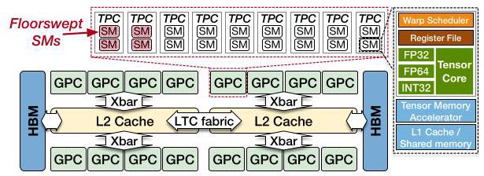

图 1 把问题的两条来源放在一起。计算侧，制造缺陷通过 **floorsweeping** 永久禁用部分 TPC；软件看到的是剩余 SM 重新编号后的逻辑 ID，无法直接看出每个 GPC 被裁掉多少。内存侧，每个 SM 有私有 L1，而 L2 及其关联 HBM 分成具有访问亲和性的区域，区域间通过 LTC fabric 互连；统一地址空间并不意味着统一访问成本。本文讨论的是一块 GPU 内的 NUMA，不是跨 GPU 的 Unified Memory 迁移。

以 H200 为例，完整 GH100 有 8 × 9 × 2 = 144 个 SM，产品启用 132 个；B200 两个 chiplet 合计完整 160 个、启用 148 个（Table 1）。禁用数量相同也不保证禁用位置相同。另一方面，H200 和 B200 的地址经过物理地址 XOR 哈希，以 4 KB 为粒度交错进入两个主要 NUMA 分区；它与虚拟地址转换所用的 2 MB 大页是不同层次的粒度。

### 原始问题、已有抽象与本文切入点

原始问题是如何细粒度利用 GPU：一个 kernel 要把工作分给 SM，一个 LLM 服务要同时运行 prefill 与 decode，多个租户要共享同一设备。已有方法已经可以控制 SM 数、内存容量、资源份额甚至干扰，却通常将同等数量的逻辑资源视为可互换。本文是沿着这些已有工作的**改进性硬件刻画与系统应用研究**，不是首次发现 GPU 内存分区或首次实现 GPU 空间共享。

它指出资源的“身份”会改变可用能力：同样名义数量的 SM，可能分散在不同 GPC、包含不能运行大 cluster 的 SM，或远离数据所在的内存分区。因而论文要解决两个问题：如何在架构细节未公开且同 SKU 芯片存在差异时恢复这些关系；以及如何把恢复出的信息加入现有调度。

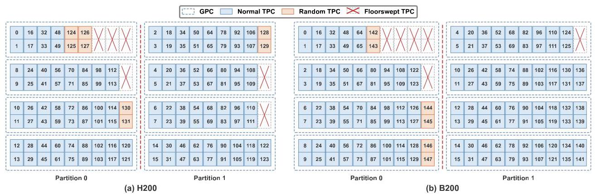

图 3 的蓝色是作者称为 normal 的 SM，橙色是 random SM，红叉为被禁用的 TPC。“Random”指同 SKU 不同芯片上的 GPC 归属会随制造裁剪结果变化，**不指运行时随机迁移**。图中某些 GPC 明显比其他 GPC 少 SM；左右分区次序不代表芯片照片中的真实左右位置。28 张 H200 中，23 张是六个 16-SM GPC 加两个 18-SM GPC，其余五张布局不同，其中一张出现 10-SM GPC（§5.2.1）。这使逐卡校准具有实际必要性。

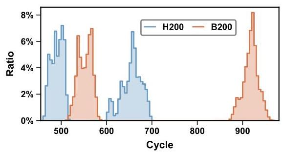

图 4 的分离峰说明远近差异确实可测，而不是纯粹的结构推测。结合 Fig. 5，作者给出的代表性延迟如下；百分比是同一设备内远程相对本地的增幅，不能直接把跨设备 cycle 差异解释成相同倍数的纳秒差异。

|访问路径|H200 本地 → 远程|B200 本地 → 远程|
|---|---|---|
|HBM|约 490 → 655 cycles，增加约 34%|约 552 → 920 cycles，增加约 67%|
|L2|约 309 → 466 cycles，增加约 51%|约 364 → 725 cycles，接近翻倍|

**动机评估。** 动机相当扎实：既有跨 28 张 H200 的拓扑差异，也有访问延迟与容量微基准，还有生产 kernel 和 LLM 服务原型的后续证据。但“die scaling”是作者对制造裁剪、缓存分区与多 chiplet 的统一解释，论文没有控制其他架构变量来独立量化工艺缩小或面积增加的因果贡献；同样，也不能据此说所有 kernel 都值得做 NUMA 优化。

**核心 Insight。** GPU 暴露的逻辑资源总数掩盖了两种相关约束：能一起执行的计算资源，以及能便宜地访问的数据。只有把 SM 的 GPC 归属、cluster 资格和 SM–内存亲和性一起纳入分配，局部性优化才可能转化为整体收益；只做到“内存本地”而忽略两边算力不均衡，仍会变慢。

## 二、相关工作（Related Work）

论文 §3 按可用控制机制组织相关工作，而非按年代排列。第一类是软件细粒度调度：persistent thread blocks（PTB）让线程块常驻 SM 并循环领取任务，LithOS、Paella、Tally 等系统通过控制 SM 数量来共享 GPU，Thread Block Cluster 提供 GPC 内协作能力。这些技术为本文提供执行基础，但数量控制本身不能保证所分 SM 的物理能力和数据亲和性一致。

第二类是厂商支持。MPS 提供静态计算划分，Green Contexts 支持 SM 级资源分组及 GPC 对齐，MIG 提供硬件隔离的计算与内存实例，MLOPart 则已在 Blackwell 及之后架构上提供 NUMA 感知分区。这一点限制了本文的新颖性表述：不能说厂商接口完全没有 NUMA 意识。作者认为现有接口仍隐藏具体物理拓扑，不能让用户同时自由选择物理 SM 和每次分配的本地/交错内存策略，因此还不足以实现本文全部动作。

第三类是逆向工程与资源着色。FGPUs 把 page coloring 与 PTB 结合，用于预留计算与内存带宽；SGDRC 动态分配 SM 和 VRAM channels；libsmctrl 通过 TPC masking 实现 kernel 级计算划分。本文沿用了“用软件测出未公开映射，再控制资源”的路线，增量在于**逐芯片 floorsweeping 拓扑与计算–内存 NUMA 亲和性共同参与决策**，而非重新发明 coloring 或 SM pinning。

由此看，论文的贡献应理解为给既有 kernel、runtime 和云端资源调度补充一层硬件能力描述。它没有实现并评测一个完整通用调度器，也没有与上述所有系统逐一做端到端比较。

## 三、技术挑战（Challenges）

|挑战|为什么困难|对应设计与验证|
|---|---|---|
|恢复逐芯片 SM–GPC 关系|逻辑 ID 已重编号；大 cluster 探针恰好无法覆盖部分存活 SM|先用 cluster 共现恢复 normal SM，再用 GPC 内 L2 带宽竞争定位 random SM；与 nvdebug 核对|
|从地址找出内存亲和性|公开地址空间统一，分区由未公开物理地址哈希决定|延迟分层判别本地/远程，再逐位翻转地址恢复 XOR 哈希，并从每个 SM 探测亲和性|
|保留局部性但避免额外开销|4 KB 分区与大页转换粒度不一致；软件重映射增加指令，PTB 增加启动成本|大页内间接重映射，或修改驱动直接分配；通过 kernel 与 profiling 判断盈亏|
|让局部性与负载均衡同时成立|两侧内存容量近似对称，SM 数却可能是 70/78|按每分区 SM 数分配工作与数据，用不均衡 B200 消融验证|
|接入真实服务并保证资源能力匹配|闭源 kernel 难以改写，PD 有共享/私有数据；租户 cluster 要求不同|跨 MIG 映射解决 kernel 透明共享；把 cluster 大小和可用 SM 组成纳入分配顺序|

最后一项包含不同应用场景下的两个原型，而不是一个已经实现的统一机制；跨 MIG 改动也不能自动等同于安全可部署的多租户接口。

## 四、解决方案（Solution）

### 整体思路与贯穿示例

作者先建立每块卡的“资源地图”：逻辑 SM → GPC → NUMA 分区，再确定物理页 → NUMA 分区的哈希及相应访问代价。此后不改变细粒度调度的基本目标，而在全卡 kernel、单应用多任务、跨应用共享三个层次加入不同的放置规则。

可以把一张 B200 看作两座共用地址簿的车间：左边 70 名工人，右边 78 名工人，各有本地仓库；跨车间取料需走较慢的桥。每个车间又有几个班组（GPC），一项 cluster8 工序要求八名符合条件的工人在同一班组协作。这个例子的 70/78 来自本文实验，车间、工人与工序是解释性比喻。接下来始终围绕“给这两个车间派任务、备材料、拼协作组”理解方法。

### 1. 先画计算地图：协作共现 + 带宽竞争

第一阶段启动 cluster size 3–8 的 kernel，通过 `%smid` 记录每个 cluster 使用的 SM。既然同一 cluster 必须位于同一 GPC，共现关系便能恢复部分班组。在 H200 上，这会找出逻辑 ID 0–123；124–131 不出现在 cluster size >2 的启动中。

如果把未出现者直接当作坏 SM，地图就错了。第二阶段以连续两个 SM、即一个 TPC 为探测单位，让它与各个已知 GPC 的 SM 一起反复读取“超过 L1、能放入 L2”的数据。如果新 TPC 确实属于这个 GPC，就会争用同一 L2 crossbar 通道，聚合带宽增加小于一个独立 TPC 应有的贡献。

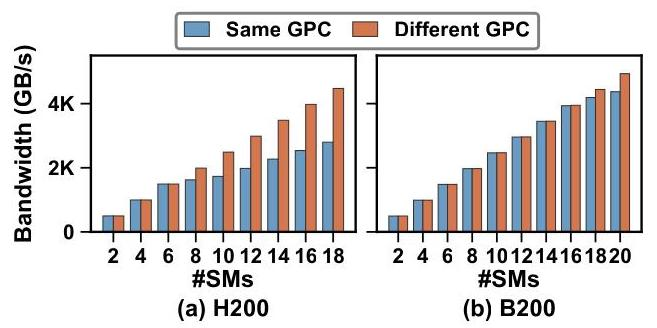

图 2 是第二阶段能够工作的依据：H200 同 GPC 超过 6 个 SM、B200 超过 16 个 SM 后，带宽开始明显落后于相同数量但分散到不同 GPC 的情况。于是，即使某些工人不参加八人协作工序，也能通过“是否争用同一出货口”认出所在班组。完整计算拓扑探测每卡不到 1 分钟；作者报告所有测试卡与 nvdebug 结果 100% 一致，但没有完整列出各 SKU 的验证样本数（§5.1）。

### 2. 再画内存地图：延迟分层 + 地址位翻转

单线程在单 SM 上随机访问约 10 万个地址，先使相应 L2 行失效，再以 `.cg` load 绕过 L1，用 `clock64()` 计时（附录 C）。本地与远程延迟峰为地址提供分区标签；从不同 SM 对相同地址重复测量，就能把计算地图接到仓库地图上。

随后逐位改变物理地址，观察分区标签是否切换，以找出 XOR 哈希的参与位。H200、B200 各有 16 个参与位，H100 PCIe 为 14 个，但最低位都是 bit 12，所以 4 KB 内地址归同一主要分区。哈希发现约需 10 秒；如果逐地址大范围验证，80 GB 约需 15 分钟（§6.1.2）。这两个成本不能混为一谈，也不是每次 kernel 执行都要支付。

这里的关键假设是可以获得和控制所需物理地址关系，后续分配原型也确实修改了驱动；不能把这部分描述成任意普通 CUDA 用户态程序都可无条件使用的标准接口。两主分区结论适用于本文所测 NVIDIA 设备；B200 本地延迟双峰是否代表更细的片内分区，作者并未唯一辨识出来。

### 3. 为什么本地化有价值：远程数据还会占据本地 L2

过桥取料的代价不只是走得慢。§6.2 的微基准先让本地 SM 读取远程归属的 cache line，再由远端 SM 使远端副本失效，最后本地重新读取。重读仅需 H200 约 310、B200 约 360 cycles，符合本地 L2 命中；作者据此并结合其他 load/store 实验推断，远程数据被复制进了本地 L2，而不是直接送到 L1。

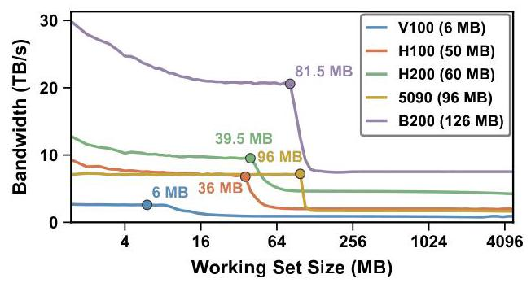

图 7 中 H200 在约 39.5 MB、B200 在约 81.5 MB 处出现容量拐点，分别只有图中物理容量 60 MB、126 MB 的 65.8%、64.7%。这是特定访问模式下的**有效容量**，并非硬件真的少装了三分之一 L2，也不是任何程序都只可使用这个比例。Fig. 8 将本地/远程页分开测，揭示远程 HBM 带宽还受 LTC fabric 限制。两座车间重复缓存对方物料，既占仓库，又占桥；这解释了为什么本地化可能同时改善延迟、带宽与缓存利用。

作者的实验支持“跨分区会复制数据”的行为结论，但并未公开完整 coherence 状态机；报告不把局部微基准扩展为对全部一致性语义的形式化证明。

### 4. 全卡 kernel：大页内重映射或直接分配，再按算力分工

**间接分配。** 为减少 TLB 压力，保留大页映射，在一个物理连续分配内以 4 KB 粒度构造两个逻辑视图。起始物理页号为偶数时，成对页 `(2j, 2j+1)` 只在物理地址 bit 12 上不同，因而一页属于左仓库、一页属于右仓库。

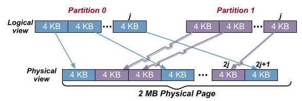

图 9 的交叉箭头表示逻辑连续不等于物理连续，具体选哪一页必须看哈希。附录 E 的映射可写为：

\[
\mathrm{offsetPage}(j,P)=2j+\left(\operatorname{parity}((\mathrm{startPage}+2j)\mathbin{\&}\mathrm{MASK})\oplus P\right).
\]

其中 `startPage` 是实际起始物理页号，`MASK` 已换算到页号粒度，`P` 是目标分区 0 或 1；结果是相对分配基址的页偏移，页内字节偏移不变。数据写入与 kernel 读取都必须使用同一映射，它不会凭空把现有数据搬到本地。映射只需按位运算和 popcount parity，时间为 O(1)，但 O(1) 仍然有可见指令成本。

**直接分配。** 在 Blackwell 及之后架构，作者扩展 NVIDIA 驱动的 MLOPart 相关代码，让内存分配接受目标 NUMA 分区，从而省掉 kernel 内地址重映射。它扩大了优化收益，但依赖特定硬件和驱动修改，并非本文提出了一个普遍可用的新 CUDA API。

分到本地材料后还要把工单分给对应工人。作者将 kernel 转为 PTB，一块 SM 上常驻一个 block，查询其 SM ID，根据 SM–分区映射处理相应本地数据。在 70/78 示例中，按两侧 SM 数比例分配工作，而非机械各分一半。其必要性由后面的 Fig. 11(b) 展示：只做 NUMA 本地化但不看拓扑，收益可以反转为退化。对于数据如何精确支持不等量分区，附录 E 只详细写出完整页对下的等容量两视图，正文没有穷尽不均衡工作分配的全部实现细节。

### 5. 同一应用内的 PD 复用：私有本地、共享交错

现在让左车间做 prefill，右车间做 decode。两边有各自中间状态，但权重与 KV cache 需要共享。把所有数据都强制放左边或右边会伤害另一阶段，合理策略是私有状态留本地，共享数据由两边共同承担。

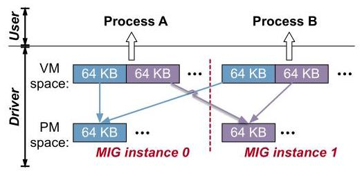

作者使用两个与 NUMA 对齐的 MIG 半实例，修改驱动，把一个实例的物理分配映射进另一实例。私有状态各自本地分配，共享数据一半来自本地、一半来自另一实例，并以 64 KB 物理页粒度交错。该 64 KB 是此共享映射方案的交错粒度，不能替代前述硬件 4 KB 分区粒度。

选择这条路径是为了让现有服务栈的闭源 kernel 无须理解地址重映射和 SM 亲和性。此处的“kernel 透明”不等于“无系统改造”：它仍需驱动、runtime 与部署配置改动。作者仅报告测试中未遇到正确性问题；并未证明跨 MIG 共享保留默认 MIG 隔离承诺，此原型的使用场景是同一个应用的两个阶段。

### 6. 跨应用共享：把 cluster 资格与 GPC 内余量写入分配规则

Green Context 默认以 GPC 对齐的八 SM 块分配，并跨 GPC 铺开。为尽量满足大 cluster，较早创建的 context 优先获得 normal SM，random SM 往往留给最后一个；这使同样的逻辑份额未必支持同样的协作工序。

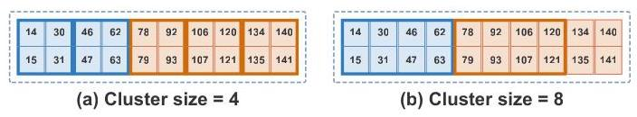

回到班组比喻，另一租户先占八名工人后，剩下十二人可以组成三个四人组，却只能组成一个八人组，余下四人闲置。这是**整组装填造成的碎片**，与 random SM 根本不能参与 cluster >2 是两种可叠加损失。图 16 解释了为什么知道“总共剩十二个 SM”还不足以判断性能。

论文通过交换租户拿到资源的先后顺序展示问题，并建议调度器接收 cluster size 等拓扑需求，把适合大 cluster 的 SM 集合留给真正需要它的任务。它没有实现一个在任意租户到达/退出、动态负载和 QoS 约束下都有效的全局分配算法；这是原型结果与未来调度原则的边界。

## 五、实验评估（Experiments）

### 实验设定与指标

主平台是 NVIDIA H200（132 SM）与 B200（148 SM），不是模拟器。Fig. 10 使用分区 SM 数对称的 66/66 H200 和 74/74 B200；Fig. 11(b) 专门使用 70/78 B200 验证拓扑不均衡。计算拓扑调查包含 28 张 H200，另有 B200 与 H100 PCIe 的结果；全文没有统一列出完整卡数、驱动/CUDA 版本、频率设置及每项测量的重复次数和置信区间。

全卡实验覆盖 MHA、GQA、MLA 的 prefill/decode 和 GroupGEMM。正文称 H200 attention 基线来自 FlashAttention-3，B200 来自 FlashAttention-4，GroupGEMM 用 CUTLASS；H200 用间接分配，B200 用直接分配，因此跨架构收益同时包含硬件差异和实现路径差异，不能当作纯架构控制实验。

附录 F 指定 attention 的 batch 为 1–64，prefill query 长度 128、decode 为 1，KV 长度从 512 开始倍增；MHA/GQA 的 KV heads 分别为 32/8，head dimension 128。图中工作集为十进制 GB 的**逻辑 KV 数据量**，不是 GPU 总显存占用。GroupGEMM 用四组 `(G,M)` 与四组 `(N,K)` 交叉成 16 个配置，每组五个随机 shape seed，共 80 个实例/设备；各组行数在期望 M 的 0.7–1.3 倍随机采样。

PD 实验在 mini-SGLang 上运行 Qwen3-8B，prefill batch 4、序列长 4K，decode batch 128、平均 KV 长度 512。H200 的 P/D 分配为 64/56 SM，B200 为 64/64 SM，取满足 cluster size 8 的可用规模；这些实验并未使用整卡全部 SM。多租户实验采用 CUTLASS GEMM，A 的 cluster size 为 2、4、8，B 固定为 2，并交换拿到先后两组资源的顺序。

|实验|基线或对照|指标与主要结论|
|---|---|---|
|硬件刻画|本地/远程、同 GPC/不同 GPC、nvdebug 地图|延迟、带宽、容量、拓扑吻合度，建立可操作硬件模型|
|全卡 kernel|相应原始库 kernel|相对加速比；最佳为 B200 GroupGEMM 1.22×，也有明显退化|
|不均衡拓扑消融|同样 NUMA-aware，但不考虑 70/78 算力差|MLA decode 在所举配置由 0.78× 恢复到约 1.10×|
|PD 复用|Cluster-Aware Overlap 对比 Adaptive-NUMA Overlap|decode 吞吐 H200 +14.3%、B200 +10.4%，prefill 改善较小|
|跨应用共享|交换 A/B 的资源分配顺序|大 cluster 吞吐比最高 1.33×；不是统计方差|

### 全卡结果：收益取决于工作集与额外指令

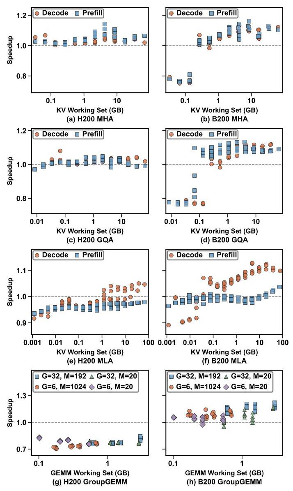

图 10 的虚线 1.0 是原始实现。B200 GroupGEMM 最高约 1.22×；较大 KV 工作集的部分 attention 配置也获益，但小工作集 B200 MHA/GQA 有显著退化，因为 PTB 查询 SM ID 等启动开销尚未被局部性收益摊薄。H200 GroupGEMM 则普遍位于 1.0 以下，约在 0.7–0.85 区域；这一区间是读图近似，原文没有逐点数表。它说明“支持 NUMA”不构成默认开启优化的充分条件。

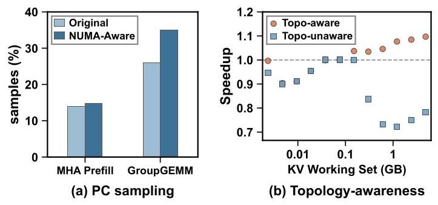

图 11(a) 中 H200 GroupGEMM 的 Selected 状态采样比例从 25.96% 升至 35.04%，MHA 从 13.92% 升至 14.71%（附录 F）。Selected 意味着 warp 发射了指令，它**不是专门统计地址计算的时间百分比**；结合新增算术/位运算及实际性能退化，作者将其作为 GroupGEMM 重映射开销更高的支持证据，但并非严格的独立开销分解。

图 11(b) 更重要：同在 70/78 B200 上，只考虑 NUMA 而忽略算力不均衡的曲线在较大工作集明显低于 baseline，正文用 0.78× 对比拓扑感知的约 1.10×。这里“78%”指性能为 baseline 的 78%，不是性能下降 78%；图中其他点还有更低表现，不能把 0.78× 误当全图最差值。实验支持局部性和负载均衡必须共同设计，但只展示一个 kernel、一个不均衡配置，未证明按 SM 比例对所有工作负载都最优。

作者还报告 profiler 观察到各 kernel 的 LTC 请求明显减少，支持优化确实降低跨分区通信；正文没有给出逐项请求降幅或完整 counters 表，因此不能进一步量化每单位通信减少对应多少收益。

### 单应用复用：相同 cluster 条件下仍可从数据放置获益

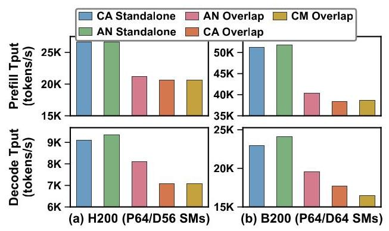

CA（Cluster-Aware）保证 cluster 可用而不控制 NUMA，AN（Adaptive-NUMA）再加入私有本地、共享交错策略，CM（Cluster-Mismatched）故意让部分资源不支持所需大 cluster。CA/AN Standalone 吞吐接近，作者据此判断该配置下跨 MIG 实现没有明显吞吐损失；这不是任意工作负载上的零开销证明。

AN Overlap 相比 CA Overlap 的 decode 提升为 H200 14.3%、B200 10.4%（§7.2）；prefill 因主要受计算约束而收益较小。这是 decode 阶段吞吐改善，不能直接写成整体请求 goodput、端到端延迟或全服务吞吐同幅提升。论文没有报告动态请求分布、SLO 达标率、首 token 延迟及多模型工作负载。

正文另报 B200 CM Overlap 相对 CA Overlap 降低 decode 吞吐 18.9%，并解释 H200 多数 kernel 用 cluster2，故影响较小。**但 Fig. 13 的 B200 两柱高度并不明显对应 18.9% 的差距**；该值在本文报告中仅作为作者文字声明保留，未用低分辨率图反推替代数字，应待原始数据核实。

### 多租户：资源分配顺序足以改变性能

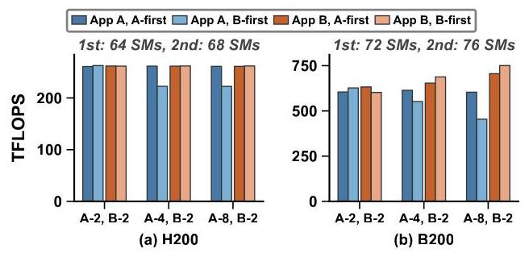

当 A/B 都使用 cluster2，两种顺序的吞吐接近；当 A 用 cluster4，先分配相对后分配的吞吐比为 H200 1.18×、B200 1.11×；A 用 cluster8 时为 H200 1.18×、B200 1.33×（§7.3 主要结果段）。后者是两种分配的吞吐比，不是方差，也不是所有租户共同获得 33% 加速。

一个重要实验细节是图 15 标明，H200 前后资源组实际为 **64/68 SM**，B200 为 **72/76 SM**。所以这不是严格固定等量 SM 的实验；它更直接显示“后获得更多名义 SM，仍可能更慢”。结果与 cluster 资格及 GPC 碎片解释相符，但报告不把这一实验改写成未实施的完全等量控制。

### 跨厂商验证及整体证据边界

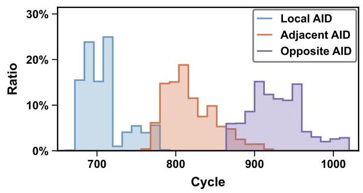

附录 G 在 MI300X 的 32 GiB 分配中采样一百万个 128-byte 对齐地址，从每个 XCD 测八遍并保留最小延迟。地址亲和性形成四组 XCD 对，每组约占地址样本 25%；从 XCD 0 看，本地、中等远程、最远程均值约 707、817、926 cycles，分别差约 110、219 cycles。图 20 各分布独立归一化，峰高不能当作各类地址总体占比；Adjacent/Opposite 是推断的亲和类别，不是测出的 fabric 跳数。

这支持“延迟探测可跨不同 GPU 内存组织工作”，但 AMD 部分没有恢复与 NVIDIA 相同的 XOR 位映射，也没有实现 AMD 调度优化或报告相应应用收益。

综合来看，论文对“硬件不对称存在且会影响调度”支撑充分，对三个特定原型的收益也有实测证据；对通用调度最优性、生产稳定性、安全隔离和跨工作负载泛化则覆盖有限。尤其缺少相同 B200 上间接/直接分配的同条件消融，以及完全剥离 PTB、地址重映射、放置策略各自贡献的完整实验矩阵。驱动版本、频率和重复统计缺失，也使精确复现仍需代码与配置补充；正文只承诺将开源，所给版本未提供可确认的代码仓库地址。

还应保留三个可回查的原文一致性问题：Table 1/Fig. 7 用 B200 总 L2 126 MB，§6.2.1 却把每分区 62 MB 称为总量一半；§7.3 最后一段把 B200 cluster4 差距写成 1.18×，与该节前述 1.11× 不一致；正文 FlashAttention-3 指向的参考文献 [31] 标题实际是 FlashAttention-2。报告分别按各处原文记录，没有自行统一数字或替换实现版本。Doc2X 将 PTX `ld` 显示为 `1d` 等字符问题则可按指令语境识别，不影响本报告的机制解释。

## 六、附加洞察（Side Findings）

**1. MIG 的固定产品规格会主动舍弃仍正常工作的 SM，且不只舍弃 random SM。** 出处：§5.3.2，Fig. 3。H200 的 4g 与 3g 各提供 64、60 SM，总计 124，低于全卡 132；观察不同芯片的 MIG 归属后，作者将这种损失解释为同 SKU 必须满足一致 profile 的保守配额。在所画芯片中，4g 所属区域有 68 个功能正常的 SM，但为凑到 64，连 normal SM 122、123 也被禁用。推理不是“这些 SM 本身有缺陷”，而是“跨芯片统一规格要求取可保证下限”。B200 3g 的 70 SM 超出简单最坏情形推算的 68，作者提出制造规则限制裁剪分布的可能解释，但未验证；不能把该假说当作已逆向得到的厂商规则。

**2. 大 cluster 排除 random SM，未必只是某张卡碰巧没有足够相邻资源。** 出处：§5.2.2。作者特意找一张每个 GPC 至少 16 SM 的较平衡 H200，其中一个 GPC 含 8 normal + 8 random；即使从数量上看能容纳大 cluster，后八个仍不被 cluster >2 使用。这个对照削弱了“仅由当前芯片 SM 数不足造成”的解释，支持存在驱动或固件的保守限制。论文没有进一步区分限制究竟位于驱动还是设备固件，也未证明硬件本身的全部可编程能力。

**3. 为追求物理局部性而直接缩小页表页尺寸，可能得不偿失。** 出处：附录 E 首段。作者最初尝试通过驱动使用 4 KB 映射实现 NUMA 分配，发现 memory-bound kernel 因 TLB 压力退化，才保留大页、在 kernel 内做小粒度重映射。链条是“分区粒度小”不等于“地址转换粒度也应小”，需要同时考虑 locality 与 translation reach。论文没有提供这次失败尝试的数值曲线，结论强度限于作者报告的实验观察。

**4. 可测出的更细延迟结构不一定就是值得暴露的调度边界。** 出处：§6.1.1、§6.2.1，Fig. 4、Fig. 8。B200 本地访问稳定出现双峰，作者据此猜测片内仍有更细分区；但峰重叠使地址归属无法由延迟可靠区分，而容量实验显示每个 die 内 L2 在其基准下表现为统一整体。因此作者实际采用 die 间边界做优化，而非强行增加更多 NUMA 节点。其证据支持“本文可利用的主要边界在 die 间”，不支持“片内没有不对称”。

**5. 同一 die 的较低规格产品可能需要更认真地对待局部资源缺口。** 出处：§5.2.1 与附录 A、Fig. 17。H100 PCIe 启用 114 SM，较 H200 的 132 更少；作者画出的卡只有七个启用 GPC，并观察 0–109 为 normal、110–113 为 random，甚至一个 GPC 可整体被裁掉。结合更激进 floorsweeping，作者指出较低档产品可能暴露更大 GPC 不均衡。这是有限样本支持的趋势判断，不能仅凭 SKU 总 SM 数推导每张卡的精确布局。

## 七、总结与个人评价（Wrap-up）

这篇论文最有价值的贡献是把三个常分开讨论的事实接起来：SM 的制造裁剪影响 cluster 能力，内存分区影响数据访问，而资源调度只有同时看计算组成与数据亲和性，才能把名义份额变成可用吞吐。两阶段拓扑探测、地址分区刻画和三个调度原型让这条主张可测、可解释，同时负结果说明局部性并非免费的优化。

最大亮点是证据链跨过了微架构现象与服务系统之间的距离，并明确展示“NUMA-aware 但 topology-unaware”也会失败。最大不足是系统原型范围和复现细节仍有限，部分归因依赖间接指标，且存在数处图文/引用不一致；论文应被视为有力的设计原则与案例集合，而不是已完成的通用公平调度方案。

个人判断：后续最值得做的是把逐卡地图变成稳定的资源能力接口，并让 runtime 根据工作集、cluster 需求和当前负载选择是否启用本地化，而非静态全开；同时需要验证驱动更新后映射与策略是否仍成立。这些是由本文边界引出的研究方向，并非论文已经完成的结果。

## 八、章节脉络与段落速览（Structure Map）

以下按原文编号与标题导航；¶ 在各最小小节内重新计数，图表标题不算自然段，跨页断开的同一段合并，公式、脚注及贡献列表归入其所属段；明确标出的 Takeaway 单列为 T，参考文献作为目录整体说明。

- **Abstract**：概述隐藏硬件不对称与三个场景的调度收益。
  - ¶1 指出 die scaling 带来的计算与内存不对称及其性能量级。
  - ¶2 概述逐卡刻画方法与三个层次的应用结果。
- **1 Introduction**：从数量驱动的细粒度调度引出物理资源身份问题。
  - ¶1 介绍 kernel、单应用和多租户三个细粒度调度层次。
  - ¶2 指出现有数量抽象隐含资源对称性假设。
  - ¶3 解释 floorsweeping 与 L2 分区如何破坏该假设。
  - ¶4 用计算差异和本地/远程延迟展示实际影响。
  - ¶5 提出如何发现未公开逐芯片拓扑的挑战 C-1。
  - ¶6 提出如何把拓扑用于现有调度的挑战 C-2。
  - ¶7 概述计算与内存刻画技术及 normal/random SM 的含义。
  - ¶8 概述三个调度原型及其核心结果。
  - ¶9及贡献列表 承诺开源并归纳刻画、调度维度与三层验证三项贡献。
- **2 Background**：解释 GPU 计算与内存组织随规模扩张发生的变化。
  - ¶1 用代际规格说明计算、缓存和 HBM 规模增长。
  - ¶2 解释计算层级、floorsweeping 与逻辑 SM 重编号。
  - ¶3 解释分区 L2、LTC 互连与 B200 双 chiplet 内存组织。
- **3 Related Work**：按软件调度、厂商接口和逆向分区三类定位贡献。
  - ¶1 说明既有细粒度调度主要控制 SM 数量。
  - ¶2 比较 MPS、Green Context、MIG、MLOPart 的能力与缺口。
  - ¶3 说明着色和 TPC masking 工作尚未联合使用逐芯片拓扑与 NUMA 亲和性。
- **4 Motivation**：说明隐藏物理映射为何影响多层 GPU 使用。
  - ¶1 指出公开总量不足以确定逻辑资源的实际物理组成。
  - ¶2 分别说明 kernel、单应用和云端共享对映射信息的需求。
  - ¶3 以 MIG 隐式禁用 SM 为例说明简化抽象的代价。
  - ¶4 交代先刻画再评估原型的组织方式和主测试平台。
- **5 Compute Asymmetry Analysis**：恢复 SM 布局并解释其调度后果。
  - **5.1 SM Topology Discovery**：提出两阶段逐卡计算拓扑探测。
    - ¶1 概述恢复逻辑 SM 到物理 GPC 映射的目标。
    - **5.1.1 Phase 1: Cluster probing**：利用 cluster 内 SM 同属 GPC 的性质恢复部分映射。
      - ¶1 说明启动不同 cluster size 并记录 SM ID 的做法。
      - ¶2 根据 H200 的可见与不可见 ID 引入 normal/random SM 分类。
    - **5.1.2 Phase 2: L2 bandwidth probing**：利用共享带宽竞争补全剩余映射。
      - ¶1 提出通过 L2 命中型 kernel 观察 GPC 内争用。
      - ¶2 解释同 GPC 与跨 GPC 带宽随 SM 数增长的不同趋势。
      - ¶3 描述逐 TPC 加入候选 GPC 并按带宽增量定位的方法。
      - ¶4 给出探测时间与 nvdebug 验证结果。
      - T1 总结两类逻辑 SM 的映射稳定性差异。
  - **5.2 Chip-specific SM Topology**：展示跨芯片差异及大 cluster 的额外限制。
    - **5.2.1 SM Topology Variability**：说明同 SKU 的 GPC 和 NUMA 组成并不固定。
      - ¶1 解释 Fig. 3 颜色、分区和逻辑 ID 的含义。
      - ¶2 汇总多张 H200 的 GPC 组成并引出其他型号的差异。
      - T2 总结 floorsweeping 造成卡内与卡间计算不均衡。
    - **5.2.2 Thread Block Cluster Scheduling**：用较平衡芯片验证 random SM 仍不能参加大 cluster。
      - ¶1 描述一张包含足量 random SM 的平衡 H200 对照。
      - ¶2 结合实际排除行为与 CUTLASS 配置推断保守调度限制。
      - T3 总结 cluster size >2 对 random SM 的排除。
  - **5.3 Scheduling SMs with different mechanisms**：追踪硬件差异如何进入资源划分机制。
    - ¶1 引出对不同 SM 分区接口的分析。
    - **5.3.1 Priority in Green Context**：解释创建顺序带来的 SM 能力优先级。
      - ¶1 陈述早期 context 优先获得 normal SM 的观察。
      - ¶2 介绍默认 Green Context 的分配粒度与铺开方式。
      - ¶3 说明大 cluster 需求为何推动优先分配 normal SM。
      - ¶4 解释最后一个 context 的名义份额可能高于其大 cluster 可用资源。
      - T4 总结 floorsweeping 导致的分配先后优先级。
    - **5.3.2 Wasted SMs in MIG**：解释固定 MIG profile 额外禁用正常 SM 的现象。
      - ¶1 引入相同 SKU 共享 profile 的限制。
      - ¶2 用 H200 两个半实例说明保留全部内存却丢失部分 SM。
      - ¶3 以 4g 的保证容量说明具体芯片上的额外禁用。
      - ¶4 扩展到 3g 与 B200 并指出简单模型的未解例外。
      - T5 总结 MIG 为跨卡一致性可能禁用 normal SM。
- **6 Memory Asymmetry Analysis**：恢复内存分区并分析其访问与容量代价。
  - ¶1 引入 Ampere 之后的多分区 L2。
  - **6.1 NUMA Layout Discovery**：从访问时间恢复分区与计算亲和性。
    - **6.1.1 Access Latency Distribution**：测出本地/远程层次及 SM 归属。
      - ¶1 介绍单线程随机采样 HBM 地址的方法。
      - ¶2 根据 HBM 延迟峰比较 H200 与 B200 的 NUMA 差异。
      - ¶3 讨论 B200 本地双峰及其无法可靠区分的片内边界。
      - ¶4 由跨 SM 探测得到分区亲和性及两分区 SM 数不均衡。
      - ¶5 介绍在已知亲和性下测本地/远程 L2 的方法。
      - ¶6 说明 L2 延迟与 HBM 观察的一致性。
      - T6 总结两主分区和计算资源不均衡。
    - **6.1.2 NUMA partition identification**：恢复分区哈希与最小交错粒度。
      - ¶1 定义分区粒度并说明它对页放置的重要性。
      - ¶2 解释 XOR 参与位与最低参与位的含义。
      - ¶3 描述位翻转实验和不同 SKU 的参与位结果。
      - ¶4 区分哈希发现与全量验证的时间成本。
      - T7 总结所测设备共享 4 KB 粒度但哈希位不同。
  - **6.2 Performance Impact of NUMA**：解释带宽限制与有效缓存容量损失。
    - **6.2.1 Effective L2 Cache**：用容量扫描定位工作集何时溢出 L2。
      - ¶1 说明以带宽拐点估计有效容量的基准方法。
      - ¶2 对比单体与分区 L2 的有效容量比例。
      - ¶3 介绍按亲和性分类 4 KB 页的带宽实验。
      - ¶4 给出单分区容量与远程 HBM 带宽限制。
      - ¶5 用容量行为界定 B200 实际采用的 NUMA 边界。
      - T8 总结 LTC fabric 对远程 HBM 带宽的约束。
    - **6.2.2 L2 cache coherency**：区分远程数据直接转发与本地复制模型。
      - ¶1 提出跨分区读取如何影响本地缓存的两种假说。
      - ¶2 描述远端失效后本地重读的延迟实验。
      - ¶3 由本地命中推断远程复制并说明其替换影响。
      - ¶4 指向汇总访问路径的附录 D。
      - T9 总结复制行为对有效 L2 容量的影响。
- **7 Scheduling Implications**：通过三类原型将硬件刻画转化为调度动作。
  - ¶1 说明按场景研究而不构造单一调度器的选择。
  - ¶2 概述三个场景各自强调的硬件不对称。
  - **7.1 Full-GPU Kernels: NUMA Locality with Topology Awareness**：测试本地数据放置与逐分区工作分配。
    - ¶1 说明先测试对称设备再检查不均衡拓扑的实验安排。
    - **7.1.1 NUMA-aware Memory Allocation**：介绍两种局部分配实现。
      - ¶1 说明 4 KB 交错下实现数据与 SM 共址的需求。
      - ¶2 介绍大页内逻辑视图和 O(1) 地址重映射。
      - ¶3 介绍通过 MLOPart 相关驱动改动直接分配的方法。
    - **7.1.2 Integration with popular kernels**：将本地分配接入 PTB kernel 并展示条件性收益。
      - ¶1 用 PTB 与 SM 亲和性实现按算力比例的静态工作分配。
      - ¶2 介绍 attention、GroupGEMM、基线库与分配方法选择。
      - ¶3 总结收益及小工作集的 PTB 开销回退。
      - ¶4 结合 PC sampling 解释 H200 地址重映射的成本。
      - ¶5 通过不均衡 B200 说明 topology awareness 的必要性。
  - **7.2 Intra-Application Multiplexing: Joint Compute-Memory Placement**：在 PD 共享中联合安排私有与共享数据。
    - ¶1 用 prefill/decode 介绍同时控制计算与内存的场景。
    - ¶2 解释闭源 kernel 约束及跨 MIG 驱动映射方案。
    - ¶3 描述私有本地和共享交错的内存布局。
    - ¶4 给出 mini-SGLang、Qwen3-8B 和两阶段资源配置。
    - ¶5 定义 CA、CM、AN 及 Standalone 对照。
    - ¶6 汇报 AN 的 decode 收益与 prefill 的有限改善。
    - ¶7 比较 cluster mismatch 对两代 GPU 的影响。
  - **7.3 Inter-Application Co-location: Topology-Aware Isolation and Fairness**：研究不同 cluster 需求下的租户资源匹配。
    - ¶1 说明为何多租户重点转向 SM 组成和公平性。
    - ¶2 介绍使用不同 cluster size 的 CUTLASS GEMM。
    - ¶3 描述 A/B 的资源需求与交换分配次序的实验。
    - ¶4 汇报各 cluster 大小下的吞吐差异。
    - ¶5 将差异分解为 random SM 排除和 GPC 组成影响。
    - ¶6 用剩余十二个 SM 的例子解释 cluster8 装填浪费。
  - **7.4 Lessons for Future Fine-Grained Scheduling**：把三个案例归纳为不同软件层的设计建议。
    - **7.4.1 Full-GPU kernels**：局部性优化应抵偿执行开销并兼顾算力比例。
      - ¶1 建议 kernel 和编译器联合使用拓扑与 NUMA 信息。
    - **7.4.2 Intra-application multiplexing**：兼顾 cluster 可用性、私有本地与共享交错。
      - ¶1 总结 runtime 的放置原则及厂商接口支持需求。
    - **7.4.3 Inter-application co-location**：将 cluster 需求作为租户资源规格的一部分。
      - ¶1 建议用拓扑需求匹配资源集合以减少浪费和性能短缺。
- **8 Discussion**：讨论跨厂商适用性及模拟器建模方向。
  - **8.1 Asymmetry in Non-NVIDIA GPUs**：区分 AMD 的均匀计算组成与不均匀内存路径。
    - ¶1 介绍 MI300X 的 CU/XCD 与多芯粒内存组织。
    - ¶2 强调 AMD 的内存不对称仍使亲和性感知有意义。
  - **8.2 Impact on Hardware Simulators**：把不对称建模列为后续方向。
    - ¶1 说明本文发现可帮助模拟器但未实现这些扩展。
- **9 Conclusion**：总结逐卡硬件刻画和三个调度案例。
  - ¶1 重申 GPU 软件栈应适应计算与内存不对称。
- **References**：列出 [1]–[39] 的调度、架构文档、kernel 库及工具来源。
- **A SM Topology on H100 PCIe**：补充裁剪更强的同 die 产品案例。
  - ¶1 展示 H100 PCIe 的七 GPC 布局及 normal/random SM 组成。
- **B Mode in GreenContext**：解释两种其他 SM 分组模式。
  - ¶1 对比忽略 GPC 协作约束与集中最大 cluster 能力的模式。
- **C Kernel Implementation Details**：给出延迟微基准的实现细节。
  - **C.1 HBM Access Latency**：测量绕过缓存后的 HBM 往返时间。
    - ¶1 说明失效 L2、绕过 L1 及计时步骤。
  - **C.2 L2 Cache Access Latency**：在预热 L2 后分别从本地和远程 SM 测量。
    - ¶1 说明预热、SM 选择与 `.cg` load 的使用。
- **D Summarized Memory Hierarchy**：区分地址转换与内存分区并汇总请求路径。
  - ¶1 解释虚拟页大小与 4 KB 分区粒度相互独立。
  - ¶2 描述物理地址决定的本地/远程访问和远程数据复制路径。
- **E NUMA-aware Address Remapping**：推导保留大页的局部页映射。
  - ¶1 用 4 KB 页表方案失败说明 TLB 压力的重要性。
  - ¶2 说明物理连续分配与成对页分属两个分区的条件。
  - ¶3及公式 给出目标分区逻辑页到物理页偏移的映射。
  - ¶4 解释掩码、页号和常数时间运算的语义。
- **F Full-GPU Kernel Experimental Configurations**：补充全卡实验平台、工作负载和 profiling 配置。
  - ¶1 指定对称与不对称实验所用 SM 分区数量。
  - ¶2 定义 attention 的 query/KV 长度与 batch 范围。
  - ¶3及公式 说明 KV 长度扫描与逻辑工作集计量方式。
  - ¶4 解释 MHA/GQA head 参数和 MLA 的压缩表示。
  - ¶5及公式 列出 GroupGEMM 形状采样及工作集计算。
  - ¶6 指定 PC sampling 对比的两个具体工作负载。
  - ¶7 解释 NCU Selected 状态和新增地址运算的证据关系。
- **G Results on AMD GPUs**：展示 MI300X 的内存亲和性探测。
  - ¶1 引出跨 AMD 平台的内存不对称刻画。
  - ¶2 描述 XCD、AID、Infinity Cache 和 HBM 的组织。
  - ¶3 说明采样地址、缓存处理及多遍最小延迟的测量方法。
  - ¶4 汇报三个延迟层次并与 NVIDIA 的主要两层比较。
  - ¶5 用跨 XCD 延迟相关性识别四个亲和组。
  - ¶6 解释 Local、Adjacent、Opposite 是推断类别而非跳数。
  - ¶7 总结延迟探测跨内存组织恢复亲和性的能力。
