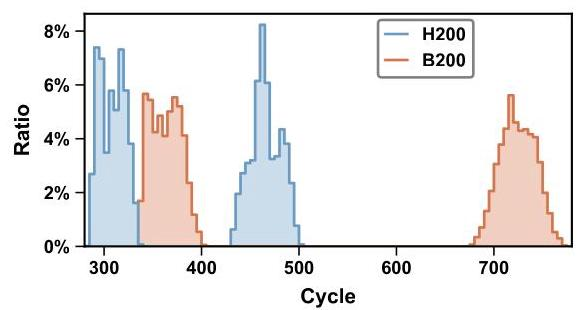
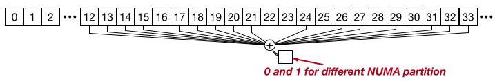
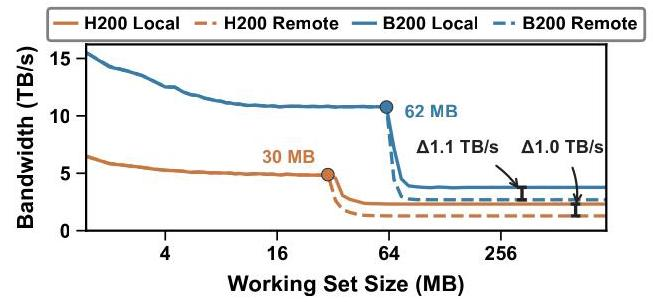
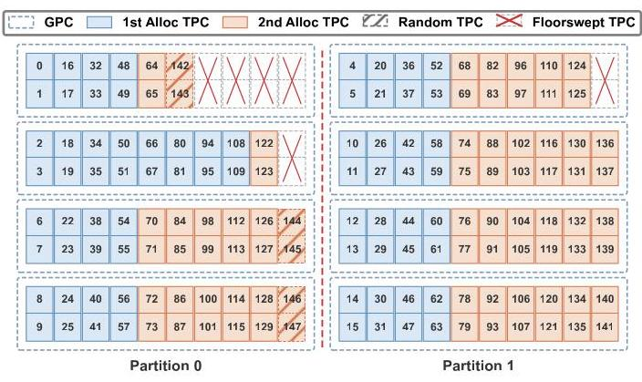
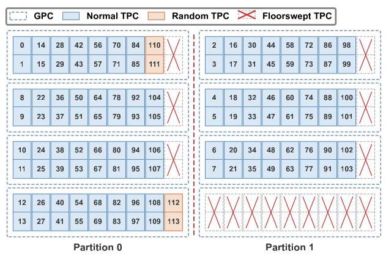
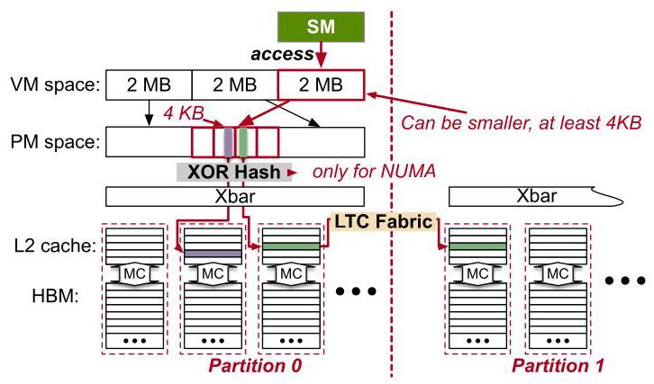

# Dissecting How Die Scaling Breaks GPU Fine-grained Scheduling

Xiaoze Fan

jasonfxz@sjtu.edu.cn

Shanghai Jiao Tong University

Jianhao Wang

sword-k@sjtu.edu.cn

Shanghai Jiao Tong University

Weihao Cui

weihao@sjtu.edu.cn

Shanghai Jiao Tong University

Han Zhao

zhaohan_miven@sjtu.edu.cn

Shanghai Jiao Tong University

Zhuobin Huang

zhuobin@u.nus.edu

National University of Singapore

> 
新加坡国立大学 (National University of Singapore)

Yangjie Zhou

yj_zhou@nus.edu.sg

National University of Singapore

> 
新加坡国立大学 (National University of Singapore)

Yuxian Qiu

yuxianq@nvidia.com

NVIDIA

Shixuan Sun

sunshixuan@sjtu.edu.cn

Shanghai Jiao Tong University

Bingsheng He

dcsheb@nus.edu.sg

National University of Singapore

> 
新加坡国立大学 (National University of Singapore)

Quan Chen

chen-quan@cs.sjtu.edu.cn

Shanghai Jiao Tong University

Minyi Guo

guo-my@cs.sjtu.edu.cn

Shanghai Jiao Tong University

## Abstract

Modern GPUs are no longer physically symmetric. Die scaling leads to both manufacturing-driven floorsweeping and cache and memory partitioning. The former creates chip-specific compute topologies, while the latter causes nonuniform memory access. These asymmetries are substantial. Topology-oblivious compute unit allocation can lead to up to ${1.33} \times$ performance variation, while remote accesses increase HBM latency by up to 67% and nearly double L2 latency.

> 
现代图形处理器 (GPU) 已不再在物理上对称。芯片缩放 (die scaling) 既带来制造驱动的熔断屏蔽 (floorsweeping)，也带来缓存与内存分区 (cache and memory partitioning)。前者产生芯片特定的计算拓扑 (chip-specific compute topologies)，而后者导致非均匀内存访问 (nonuniform memory access)。这些不对称性 (asymmetries) 十分显著。拓扑无关的计算单元分配 (topology-oblivious compute unit allocation) 可导致高达 ${1.33} \times$ 的性能变化，而远程访问 (remote accesses) 会使高带宽内存 (HBM) 延迟增加高达 67%，并使二级缓存 (L2 cache) 延迟几乎翻倍。

However, these asymmetries are hidden behind the GPU's logical resource abstractions and can vary across chips. We develop lightweight characterization methods to uncover per-chip compute topology and memory affinity. We then use the discovered information to make existing fine-grained scheduling asymmetry-aware, considering not only how many resources are allocated but also which physical resources are assigned. Across full-GPU kernel execution, intra-application multiplexing, and inter-application co-location, asymmetry-aware scheduling improves mainstream kernels by up to ${1.22} \times$ , multiplexed LLM inference by up to ${14.3}\%$ , and avoids up to ${1.33} \times$ performance variation.

> 
然而，这些非对称性 (asymmetries) 隐藏在 GPU 的逻辑资源抽象 (logical resource abstractions) 背后，并且可能因芯片而异。我们开发了轻量级表征方法 (characterization methods)，以揭示每芯片的计算拓扑 (per-chip compute topology) 和内存亲和性 (memory affinity)。然后，我们利用所发现的信息，使现有的细粒度调度 (fine-grained scheduling) 具备非对称性感知 (asymmetry-aware) 能力，不仅考虑分配了多少资源，还考虑分配了哪些物理资源 (physical resources)。在全 GPU 内核执行 (full-GPU kernel execution)、应用内多路复用 (intra-application multiplexing) 和应用间共置 (inter-application co-location) 中，非对称性感知调度将主流内核 (mainstream kernels) 提升最高达 ${1.22} \times$，将多路复用 LLM 推理 (multiplexed LLM inference) 提升最高达 ${14.3}\%$，并避免最高达 ${1.33} \times$ 的性能波动 (performance variation)。

## 1 Introduction

Modern GPUs integrate many parallel resources. Efficiently utilizing these resources requires fine-grained scheduling at multiple levels. Kernel libraries schedule work across compute units to approach hardware performance limits $\left\lbrack  {1,2}\right\rbrack$ . Within an application, recent LLM serving systems spatially multiplex prefill and decode phases to improve goodput $\left\lbrack  {3,4}\right\rbrack$ . Across applications, cloud systems co-locate kernels from different tenants on the same GPU and control each tenant's compute and memory allocation [5-10].

> 
现代 GPU 集成了许多并行资源。高效利用这些资源需要在多个层级进行细粒度调度 (fine-grained scheduling)。内核库 (kernel libraries) 跨计算单元 (compute units) 调度工作，以接近硬件性能极限 $\left\lbrack  {1,2}\right\rbrack$。在单个应用 (application) 内，近期的 LLM 服务系统 (LLM serving systems) 对预填充 (prefill) 和解码 (decode) 阶段进行空间复用 (spatially multiplex)，以提高有效吞吐量 (goodput) $\left\lbrack  {3,4}\right\rbrack$。跨应用 (applications) 时，云系统 (cloud systems) 将来自不同租户 (tenants) 的内核 (kernels) 共置 (co-locate) 在同一 GPU 上，并控制每个租户的计算和内存分配 [5-10]。

Figure 1. Architecture of an NVIDIA H200 GPU. Streaming Multiprocessors (SMs) are grouped into Texture Processing Clusters (TPCs), which in turn form Graphics Processing Clusters (GPCs). Each SM has a private L1 cache, while all SMs share a partitioned L2 cache backed by HBM.

> 
图1. NVIDIA H200 GPU 的架构。流式多处理器 (Streaming Multiprocessors, SM) 被分组为纹理处理集群 (Texture Processing Clusters, TPC)，后者又构成图形处理集群 (Graphics Processing Clusters, GPC)。每个 SM 都有一个私有的一级缓存 (L1 cache)，而所有 SM 共享一个由高带宽内存 (HBM) 支撑的分区式二级缓存 (L2 cache)。

Existing fine-grained scheduling works [1-4, 6, 8-10] generally operate by controlling logical resource quantities. For example, they control how many compute units a task uses and how much memory it accesses. These works omit the physical locations of compute units and memory. It implicitly assumes architectural symmetry, that allocations with the same number of compute units and the same memory capacity offer equivalent performance.

> 
现有的细粒度调度 (fine-grained scheduling) 工作 [1-4, 6, 8-10] 通常通过控制逻辑资源数量来运作。例如，它们控制任务使用的计算单元 (compute unit) 数量以及访问的内存大小。这些工作忽略了计算单元和内存的物理位置。它隐含地假设了架构对称性 (architectural symmetry)，即分配相同数量的计算单元和相同的内存容量能提供同等性能。

Die scaling introduces asymmetries, which increases the number of transistors per die by enlarging die area [11] and shrinking process nodes $\left( {7\mathrm{\;{nm}} \rightarrow  3\mathrm{\;{nm}}}\right)$ [12]. Figure 1 shows a modern NVIDIA GPU architecture and how die scaling affects it. First, floorsweeping disables defective Streaming Multiprocessors (SMs, NVIDIA GPUs' basic compute units) to improve yield, creating chip-specific compute topologies. Second, larger L2 caches are partitioned for high bandwidth and low latency. These partitions and their associated HBM form a non-uniform memory access (NUMA) topology with different local and remote access costs.

> 
芯片缩放 (die scaling) 引入了不对称性，其通过扩大芯片面积 [11] 和缩小工艺节点 $\left( {7\mathrm{\;{nm}} \rightarrow  3\mathrm{\;{nm}}}\right)$ [12] 来增加每芯片的晶体管数量。图1展示了一个现代NVIDIA GPU架构以及芯片缩放 (die scaling) 如何影响它。首先，熔断屏蔽 (floorsweeping) 会禁用有缺陷的流式多处理器 (Streaming Multiprocessors, SMs，NVIDIA GPU的基本计算单元) 以提高良率，从而形成芯片特定的计算拓扑 (compute topologies)。其次，更大的L2缓存 (L2 caches) 被分区以实现高带宽和低延迟。这些分区及其关联的HBM构成了一种非均匀内存访问 (non-uniform memory access, NUMA) 拓扑，具有不同的本地和远程访问成本。

These asymmetries have substantial performance consequences. Floorsweeping creates compute asymmetry. Two GPCs can differ by up to 10 SMs on either NVIDIA H200 or B200. Remote HBM accesses incur approximately 34% higher latency than local accesses on H200 ( $\sim  {490} \rightarrow   \sim  {655}$ cycles) and ${67}\%$ on B200 ( $\sim  {552} \rightarrow   \sim  {920}$ cycles). Remote L2 latency is about 51% higher than local latency on H200 ( $\sim  {309} \rightarrow   \sim  {466}$ cycles) and nearly twice as high on B200 ( $\sim  {364} \rightarrow   \sim  {725}$ cycles). As we show later in $§7$ , ignoring these differences can cause up to ${1.33} \times$ performance variation.

> 
这些不对称性 (asymmetries) 会带来显著的性能影响。熔断屏蔽 (floorsweeping) 会造成计算不对称性 (compute asymmetry)。在 NVIDIA H200 或 B200 上，两个 GPC 之间最多可相差 10 个 SM。在 H200 上，远程 HBM 访问的延迟比本地访问高约 34%（$\sim  {490} \rightarrow   \sim  {655}$ 个周期），在 B200 上则高 ${67}\%$（$\sim  {552} \rightarrow   \sim  {920}$ 个周期）。在 H200 上，远程 L2 延迟比本地延迟高约 51%（$\sim  {309} \rightarrow   \sim  {466}$ 个周期），而在 B200 上几乎高出近一倍（$\sim  {364} \rightarrow   \sim  {725}$ 个周期）。正如我们稍后在 $§7$ 中所示，忽略这些差异可能导致高达 ${1.33} \times$ 的性能变化。

This paper addresses two challenges raised by such hidden physical asymmetry. C-1: How can software efficiently discover hidden and chip-specific compute and memory asymmetries without architectural documentation? Vendor exposes logical rather than physical SM topology, floorsweep-ing differs across chips of the same ${\mathrm{{SKU}}}^{1}$ , NUMA mapping is encoded in undocumented physical-address hashing, and different architectures use different mappings. Thus, asymmetry often requires per-chip calibration rather than a static lookup table shared across chips of the same SKU.

> 
本文旨在应对这种隐藏的物理不对称性 (physical asymmetry) 所引发的两个挑战。C-1：软件如何在没有架构文档 (architectural documentation) 的情况下，高效地发现隐藏且因芯片而异的计算不对称性 (compute asymmetry) 与内存不对称性 (memory asymmetry)？厂商 (vendor) 暴露的是逻辑 SM 拓扑 (logical SM topology)，而非物理 SM 拓扑 (physical SM topology)；熔断屏蔽 (floorsweeping) 在同一 ${\mathrm{{SKU}}}^{1}$ 的不同芯片之间也存在差异；NUMA 映射 (NUMA mapping) 被编码在未公开的物理地址哈希 (physical-address hashing) 中；并且不同架构使用不同映射 (mapping)。因此，不对称性通常需要逐芯片校准 (per-chip calibration)，而不是使用同一 SKU 各芯片共享的静态查找表 (static lookup table)。

C-2: How should existing fine-grained scheduling exploit the discovered physical asymmetry? Existing scheduling works determine only resource quantity. Asymmetry awareness adds a complementary dimension by considering physical resource identity, topology, and compute-memory affinity. The goal is not to replace fine-grained scheduling, but to make it more precise by considering not only how many resources are allocated, but which physical resources are allocated.

> 
C-2：现有细粒度调度 (fine-grained scheduling) 应如何利用所发现的物理非对称性 (physical asymmetry)？现有调度工作仅确定资源数量 (resource quantity)。非对称性感知 (asymmetry awareness) 通过考虑物理资源标识 (physical resource identity)、拓扑 (topology) 和计算-内存亲和性 (compute-memory affinity)，增加了一个互补维度。目标不是取代细粒度调度，而是通过不仅考虑分配了多少资源，还考虑分配了哪些物理资源，使其更加精确。

To address the first challenge, we develop lightweight characterization methods for compute and memory asymmetry. For compute asymmetry, we uncover the complete per-chip SM-to-GPC assignment using two probing techniques. We observe two groups of logical SM IDs. Normal SMs follow an architecture-specific predefined SM-to-GPC mapping, whereas the remaining SMs are assigned to physical GPCs depending on the chip-specific floorsweeping outcome. For convenience, we refer to the latter as random SMs. "random" does not mean runtime-random scheduling, but that their physical GPC locations may vary across chips. For memory asymmetry, we develop a latency hierarchy discovery method that uncovers the memory partition hash and HBM interleaving granularity on the measured GPUs. With the uncovered hash, we characterize local/remote latency gaps, remote bandwidth bottlenecks, and effective L2 capacity loss from cross-partition cache replication.

> 
为解决第一个挑战，我们开发了针对计算与内存不对称性 (compute and memory asymmetry) 的轻量级表征方法 (lightweight characterization methods)。对于计算不对称性 (compute asymmetry)，我们使用两种探测技术 (probing techniques) 揭示完整的每芯片 SM 到 GPC 分配 (SM-to-GPC assignment)。我们观察到两组逻辑 SM ID。常规 SM (normal SM) 遵循架构特定的预定义 SM 到 GPC 映射 (SM-to-GPC mapping)，而其余 SM 则根据芯片特定的熔断屏蔽 (floorsweeping) 结果分配到物理 GPC。为方便起见，我们将后者称为随机 SM (random SM)。“随机”并不意味着运行时随机调度 (runtime-random scheduling)，而是指其物理 GPC 位置可能因芯片而异。对于内存不对称性 (memory asymmetry)，我们开发了一种延迟层级发现 (latency hierarchy discovery) 方法，可揭示被测 GPU 上的内存分区哈希 (memory partition hash) 和 HBM 交织粒度 (HBM interleaving granularity)。利用所揭示的哈希，我们刻画了本地/远程延迟差距 (local/remote latency gaps)、远程带宽瓶颈 (remote bandwidth bottlenecks)，以及跨分区缓存复制 (cross-partition cache replication) 导致的 L2 有效容量损失 (effective L2 capacity loss)。

To address the second challenge, we build asymmetry-aware prototypes for three representative fine-grained scheduling scenarios. For full-GPU kernels, we develop two methods that steers memory accesses to NUMA-local partitions. Integrating these methods with mainstream GPU kernels improves throughput by up to ${1.22} \times$ with minimal code changes. For intra-application multiplexing, we develop a kernel-transparent cross-NUMA allocation method for LLM serving systems that spatially multiplex prefill and decode phases. This improves decode throughput by up to 14.3% by restricting task-private allocations to NUMA-local partitions while sharing others across partitions. For inter-application co-location, we evaluate topology-aware SM allocation strategies and show that equal SM counts do not imply equal physical capability. Topology-oblivious allocation causes up to ${1.33} \times$ throughput variation.

> 
为了解决第二个挑战，我们为三类具有代表性的细粒度调度 (fine-grained scheduling) 场景构建了不对称性感知原型 (asymmetry-aware prototypes)。对于全GPU内核 (full-GPU kernels)，我们开发了两种方法，将内存访问引导至NUMA本地分区 (NUMA-local partitions)。将这些方法与主流GPU内核集成，仅需极少的代码改动即可将吞吐量 (throughput) 提升至多 ${1.22} \times$。对于应用内复用 (intra-application multiplexing)，我们为LLM服务系统 (LLM serving systems) 开发了一种内核透明的跨NUMA分配方法 (kernel-transparent cross-NUMA allocation method)，以空间复用预填充 (prefill) 和解码 (decode) 阶段。该方法通过将任务私有分配 (task-private allocations) 限制在NUMA本地分区，同时在其他分区之间共享其余分配，将解码吞吐量提升至多 14.3%。对于应用间共置 (inter-application co-location)，我们评估了拓扑感知 (topology-aware) 的SM分配策略 (SM allocation strategies)，并表明相同的SM数量并不意味着相同的物理能力 (physical capability)。拓扑无感分配 (topology-oblivious allocation) 会导致高达 ${1.33} \times$ 的吞吐量变化。

Table 1. GPU die specifications across generations. H100 ships in SXM and PCIe variants; this table lists the PCIe SKU. H100 PCIe and H200 share the GH100 die but differ in enabled resources. B200 fuses two GB100 chiplets; values marked $\times  2$ denote per-chiplet quantities, while unmarked values are package totals.

> 
表 1. 各代 GPU 裸片 (die) 规格。H100 以 SXM 和 PCIe 变体出货；本表列出 PCIe SKU。H100 PCIe 和 H200 共享 GH100 裸片，但启用的资源不同。B200 融合两个 GB100 芯粒 (chiplet)；标有 $\times  2$ 的数值表示每个芯粒的数量，而未标记的数值为封装总量 (package totals)。

<table><tr><td>SKU</td><td>V100</td><td>A100</td><td>H100</td><td>H200</td><td>B200</td></tr><tr><td>Die</td><td>GV100 [15]</td><td>GA100 [16]</td><td></td><td>GH100 [17]</td><td>GB100×2 [18]</td></tr><tr><td>Die $\left( {\mathrm{{mm}}}^{2}\right)$</td><td>815</td><td>826</td><td colspan="2">814</td><td>800×2</td></tr><tr><td>Full SMs</td><td>84</td><td>128</td><td colspan="2">144</td><td>${80} \times  2$</td></tr><tr><td>SKU SMs</td><td>80</td><td>108</td><td>114</td><td>132</td><td>148</td></tr><tr><td>Disabled SMs</td><td>4</td><td>20</td><td>30</td><td>12</td><td>12</td></tr><tr><td>GPCs</td><td>6</td><td>7</td><td>7/8</td><td>8</td><td>4×2</td></tr><tr><td>TPCs/GPC</td><td>7</td><td>8</td><td colspan="2">9</td><td>10</td></tr><tr><td>L2 (MB)</td><td>6</td><td>40</td><td>50</td><td>60</td><td>126</td></tr><tr><td>L2 partitions</td><td>1</td><td>2</td><td>2</td><td>2</td><td>2</td></tr><tr><td>HBM type</td><td>HBM2</td><td>HBM2e</td><td>HBM2e</td><td>HBM3e</td><td>HBM3e</td></tr><tr><td>HBM (GB)</td><td>32</td><td>80</td><td>80</td><td>141</td><td>${90} \times  2$</td></tr></table>

We will open-source our code to enable reproduction of all our results. Our main contributions are as follows:

> 
我们将开源 (open-source) 我们的代码，以支持复现 (reproduction) 我们的所有结果。我们的主要贡献 (main contributions) 如下：

- We develop lightweight methods to uncover hidden, chip-specific GPU compute and memory asymmetry, including SM-to-GPC mapping, floorsweeping-dependent topology, NUMA partition hashes, and local/remote latency and bandwidth behavior.

> 
- 我们开发了轻量级方法，以揭示隐藏的、芯片特定的 GPU 计算与内存不对称性，包括 SM 到 GPC 映射、依赖熔断屏蔽 (floorsweeping) 的拓扑 (topology)、NUMA 分区哈希 (NUMA partition hashes)，以及本地/远程延迟和带宽行为 (local/remote latency and bandwidth behavior)。

- We show how fine-grained scheduling can incorporate physical resource identity, topology, and memory affinity rather than relying only on logical resource counts.

> 
- 我们展示了细粒度调度 (fine-grained scheduling) 如何能够纳入物理资源身份 (physical resource identity)、拓扑 (topology) 和内存亲和性 (memory affinity)，而不是仅依赖逻辑资源数量 (logical resource counts)。

- We validate asymmetry-aware scheduling across three levels. These results motivate making asymmetry awareness a design principle for future GPU programming.

> 
- 我们在三个层面上验证了感知不对称的调度 (asymmetry-aware scheduling)。这些结果推动将不对称感知 (asymmetry awareness) 作为未来 GPU 编程的设计原则。

## 2 Background

Workloads such as large language models [13, 14] demand increasing compute throughput and memory bandwidth, driving aggressive GPU die scaling. While Figure 1 shows the microarchitecture of a modern GPU die, Table 1 further summarizes five SKUs spanning four generations of NVIDIA data-center GPUs. From Volta to Blackwell, full-die SM counts grew from 84 to 160, L2 caches from 6 MB to 126 MB, and HBM stacks from 4 to 8.

> 
诸如大语言模型 (large language models) [13, 14] 之类的工作负载 (workloads) 对计算吞吐量 (compute throughput) 和内存带宽 (memory bandwidth) 的需求日益增长，推动 GPU 芯片缩放 (GPU die scaling) 愈发激进。图 1 展示了现代 GPU 芯片 (GPU die) 的微架构 (microarchitecture)，而表 1 则进一步总结了五款跨越四代 NVIDIA 数据中心 GPU (data-center GPU) 的产品型号 (SKU)。从 Volta 到 Blackwell，全芯片 SM 数量从 84 增至 160，L2 缓存从 6 MB 增至 126 MB，HBM 堆栈从 4 增至 8。

Compute. As shown in Figure 1, GPU compute is organized hierarchically (GPU - GPC - TPC - SM). As dies grow, defective SMs must be disabled to maintain manufacturing yield, a process called floorsweeping. The full GH100 die contains 8 GPCs of 9 TPCs each, totaling $8 \times  9 \times  2 = {144}$ SMs. Floorsweeping permanently disables selected TPCs within each GPC, leaving H200 with 132 SMs across 8 GPCs. Which TPCs are disabled depends on per-die manufacturing defects. After floorsweeping, surviving TPCs are renumbered into a contiguous logical SM ID space, making the logical-to-physical mapping chip-specific and opaque to software.

> 
计算 (Compute)。如图 1 所示，GPU 计算按层级组织 (GPU - GPC - TPC - SM)。随着裸片 (die) 尺寸增大，必须禁用有缺陷的 SM 以维持制造良率 (manufacturing yield)，这一过程称为熔断屏蔽 (floorsweeping)。完整的 GH100 裸片 (die) 包含 8 个 GPC，每个 GPC 有 9 个 TPC，总计 $8 \times  9 \times  2 = {144}$ 个 SM。熔断屏蔽 (floorsweeping) 会永久禁用每个 GPC 内选定的 TPC，使 H200 在 8 个 GPC 上共有 132 个 SM。哪些 TPC 被禁用取决于每个裸片 (die) 的制造缺陷。熔断屏蔽 (floorsweeping) 后，存活的 TPC 会被重新编号到连续的逻辑 SM ID 空间，使得逻辑到物理映射 (logical-to-physical mapping) 因芯片而异 (chip-specific)，并且对软件不透明。

---

${}^{1}$ SKU (Stock Keeping Unit): a unique product identifier that encodes the GPU product name and interface, e.g., H200.

> 
${}^{1}$ 库存量单位 (SKU): 一种唯一的产品标识符，编码了 GPU 产品名称和接口，例如 H200。

---

Memory. On the memory side, each SM has a private L1 data cache, and all SMs share a last-level L2 cache backed by off-chip HBM stacks. SMs communicate with the L2 through a crossbar (Xbar in Figure 1). Starting with Ampere, the L2 grew to ${40}\mathrm{{MB}}$ and was physically split into multiple physical partitions. On the NVIDIA GPUs studied in this paper, each GPU exposes two memory-affinity partitions. An LTC fabric connects these partitions to present a unified address space to software. Newer Blackwell GPUs, such as B200, integrate two chiplets into a single GPU. Official documentation describes one L2 partition per chiplet, with the two partitions connected by the LTC fabric. Whether the L2 within each chiplet is further partitioned remains unknown.

> 
内存 (Memory)。在内存方面，每个 SM 都有一个私有的一级数据缓存 (L1 data cache)，而所有 SM 共享一个由片外 HBM 堆栈 (off-chip HBM stacks) 支持的末级 L2 缓存 (last-level L2 cache)。SM 通过一个交叉开关 (crossbar)（图 1 中的 Xbar）与 L2 通信。从 Ampere 开始，L2 增长到 ${40}\mathrm{{MB}}$，并在物理上被拆分为多个物理分区 (physical partitions)。在本文研究的 NVIDIA GPU 上，每个 GPU 对外暴露两个内存亲和性分区 (memory-affinity partitions)。一个 LTC 互连结构 (LTC fabric) 连接这些分区，以向软件呈现统一的地址空间 (unified address space)。较新的 Blackwell GPU（例如 B200）将两个小芯片 (chiplet) 集成到一个 GPU 中。官方文档描述了每个小芯片 (chiplet) 一个 L2 分区，两个分区由 LTC fabric 连接。每个小芯片 (chiplet) 内的 L2 是否进一步分区仍然未知。

## 3 Related Work

Fine-grained scheduling of GPU. Existing works implement fine-grained scheduling at multiple granularities. Within a single kernel, persistent thread blocks [6, 8, 19] allow users to pin thread blocks to specific SMs. Thread Block Clusters [20], a scheduling feature introduced in Hopper, further leverages this for acceleration. For multi-task or co-located applications, several systems [8-10] schedule multiplexed kernels by controlling the number of SMs. All these systems control how many SMs are used, but none considers which SMs are assigned or their NUMA affinity.

> 
GPU 的细粒度调度 (fine-grained scheduling)。现有工作在多个粒度上实现了细粒度调度。在单个内核 (kernel) 内，持久线程块 (persistent thread blocks) [6, 8, 19] 允许用户将线程块固定到特定 SM。Thread Block Clusters [20] 是 Hopper 中引入的一种调度特性，进一步利用这一点进行加速。对于多任务或共置 (co-located) 应用，若干系统 [8-10] 通过控制 SM 的数量来调度复用内核 (multiplexed kernels)。所有这些系统都控制使用了多少个 SM，但没有一个考虑分配了哪些 SM 或它们的 NUMA 亲和性 (NUMA affinity)。

Vendor-supported scheduling. NVIDIA's MPS (MultiProcess Service) [5] supports static SM partitioning. Green Contexts [3] provide SM-level partitions with optional GPC alignment. MIG (Multi-Instance GPU) [21] provides hardware-isolated compute and memory partitions that can align with NUMA boundaries. MPS's MLOPart (Memory Locality Optimized Partition) [22] adds NUMA-aware partitioning for Blackwell and newer GPUs. Both MIG and MLOPart hide detailed physical compute and memory topology. Moreover, users cannot freely select specific physical SMs or choose between NUMA-local and interleaved placement for each device-memory allocation.

> 
厂商支持的调度。NVIDIA 的 MPS（多进程服务 (MultiProcess Service)）[5] 支持静态 SM 分区。Green Context [3] 提供 SM 级分区，并可选择 GPC 对齐。MIG（多实例 GPU (Multi-Instance GPU)）[21] 提供硬件隔离的计算和内存分区，可与 NUMA 边界对齐。MPS 的 MLOPart（内存局部性优化分区 (Memory Locality Optimized Partition)）[22] 为 Blackwell 及更新 GPU 增加了 NUMA 感知 (NUMA-aware) 分区。MIG 和 MLOPart 都会隐藏详细的物理计算和内存拓扑。此外，用户无法自由选择特定的物理 SM，也无法为每个设备内存分配在 NUMA 本地 (NUMA-local) 与交错 (interleaved) 放置之间进行选择。

Reverse-engineered scheduling. FGPUs [23] and SG-DRC [7] reverse-engineer physical memory mappings and use coloring to reduce interference between co-located workloads. FGPUs combines page coloring with persistent blocks to reserve SMs and memory bandwidth. SGDRC dynamically allocates SMs and VRAM channels to improve utilization. libsmctr1 [24] enables per-kernel SM partitioning through TPC masking. The partitioning policies of FGPUs and SGDRC control resource shares and interference without incorporating chip-specific floorsweeping topology or SM-to-memory NUMA affinity into allocation decisions.

> 
逆向工程调度 (Reverse-engineered scheduling)。FGPUs [23] 和 SG-DRC [7] 逆向工程物理内存映射 (physical memory mappings)，并使用着色 (coloring) 来减少共置工作负载 (co-located workloads) 之间的干扰。FGPUs 将页着色 (page coloring) 与持久块 (persistent blocks) 相结合，以预留流式多处理器 (SM) 和内存带宽。SGDRC 动态分配 SM 和 VRAM 通道 (VRAM channels)，以提高利用率。libsmctr1 [24] 通过 TPC 掩码 (TPC masking) 实现逐内核 (per-kernel) SM 划分。FGPUs 和 SGDRC 的划分策略控制资源份额 (resource shares) 和干扰，而未将芯片特定的熔断屏蔽拓扑 (chip-specific floorsweeping topology) 或 SM 到内存的 NUMA 亲和性 (SM-to-memory NUMA affinity) 纳入分配决策 (allocation decisions)。

## 4 Motivation

NVIDIA publishes the total SM count, L2 cache size, and HBM capacity for each GPU product, but does not disclose the per-chip floorsweeping pattern or the mapping between compute units and memory partitions. Without this information, software cannot determine which physical resources a logical allocation actually receives.

> 
NVIDIA 会公布每款 GPU 产品的总 SM 数量、L2 缓存 (L2 cache) 大小和 HBM 容量，但不披露逐芯片的熔断屏蔽 (floorsweeping) 模式，也不披露计算单元与内存分区之间的映射。没有这些信息，软件就无法确定逻辑分配实际获得的是哪些物理资源。

Understanding this relationship matters at multiple granularities. At the single-kernel level, thread blocks share SMs and memory partitions, and NUMA-unaware placement can create cross-partition bottlenecks that degrade overall kernel performance. At the single-application level, developers could overlap internal tasks on the same GPU more effectively if they knew the compute-to-memory affinity. At the multi-application level, cloud vendors need topology-aware partitioning strategies to ensure fairness across co-located applications.

> 
理解这种关系在多个粒度（granularity）上都很重要。在单内核（single-kernel）层面，线程块（thread block）共享 SM 和内存分区（memory partition），而未感知 NUMA（NUMA-unaware）的放置可能造成跨分区（cross-partition）瓶颈，从而降低整体内核性能。在单应用（single-application）层面，如果开发者了解计算到内存的亲和性（compute-to-memory affinity），就能更有效地在同一 GPU 上重叠内部任务。在多应用（multi-application）层面，云厂商需要拓扑感知（topology-aware）的分区策略，以确保共置应用（co-located applications）之间的公平性。

NVIDIA hides these variable architectural features from software to simplify the runtime and user-level programming model. For instance, since the introduction of MIG, certain SMs are silently disabled when MIG mode is active, yet no official documentation explains why. The goal of this paper is to characterize the variable, per-chip architectural asymmetries that die scaling introduces and to show how fine-grained scheduling can use that information.

> 
NVIDIA 对软件隐藏这些可变的架构特性 (architectural features)，以简化运行时 (runtime) 和用户级编程模型 (user-level programming model)。例如，自 MIG 引入以来，当 MIG 模式处于激活状态时，某些 SM 会被静默禁用，但没有任何官方文档解释其原因。本文的目标是刻画芯片缩放 (die scaling) 所引入的可变、每芯片 (per-chip) 架构不对称性 (architectural asymmetries)，并展示细粒度调度 (fine-grained scheduling) 如何利用这些信息。

In the following sections, we first characterize the floor-sweeping topology and NUMA affinity mapping. We then evaluate asymmetry-aware scheduling through several prototype implementations. We use H200 and B200 as our primary testbeds throughout this paper.

> 
在以下各节中，我们首先刻画熔断屏蔽拓扑 (floor-sweeping topology) 和 NUMA 亲和性映射 (NUMA affinity mapping)。随后，我们通过若干原型实现来评估不对称感知调度 (asymmetry-aware scheduling)。在本文全文中，我们使用 H200 和 B200 作为主要测试平台。

## 5 Compute Asymmetry Analysis

### 5.1 SM Topology Discovery

Topology-aware partition placement requires mapping logical SM IDs to physical GPCs. We uncover the full mapping with a lightweight, two-phase probing method.

> 
拓扑感知的分区放置 (topology-aware partition placement) 需要将逻辑 SM ID 映射到物理 GPC。我们通过一种轻量级的两阶段探测方法 (two-phase probing method) 揭示完整映射。

5.1.1 Phase 1: Cluster probing. Thread Block Clusters [20] are a Hopper-introduced new CUDA feature. They co-schedule a group of thread blocks from a kernel onto GPC-local SMs, enabling direct cross-block distributed shared memory access and cluster barriers without going through L2. In this case, the SMs in the same Thread Block Cluster are guaranteed to be in the same GPC. To this end, we launch kernels via cudaLaunchKernelEx with cluster sizes ranging from 3 to 8 and log each cluster's constituent SM IDs (obtained via the %smid PTX register). SM IDs that co-occur in a cluster belong to the same GPC. With this method, we can partially uncover the GPC layout of the SMs on the GPU.

> 
5.1.1 阶段 1：簇探测 (Cluster probing)。Thread Block Clusters [20] 是 Hopper 引入的一项新 CUDA 特性。它们将来自某个内核 (kernel) 的一组线程块 (thread block) 协同调度到 GPC 本地的 SM 上，从而无需经过 L2 即可实现直接的跨块分布式共享内存 (distributed shared memory) 访问和簇屏障 (cluster barrier)。在这种情况下，同一个 Thread Block Cluster 中的 SM 保证位于同一个 GPC 中。为此，我们通过 cudaLaunchKernelEx 启动内核，簇大小 (cluster size) 范围为 3 到 8，并记录每个簇的组成 SM ID（通过 %smid PTX 寄存器获得）。在同一个簇中共同出现的 SM ID 属于同一个 GPC。通过这种方法，我们可以部分揭示 GPU 上 SM 的 GPC 布局。

Figure 2. Per-GPC L2 bandwidth on H200 and B200 with varied SMs. Because each GPC in Hopper has 9 TPCs, and each GPC in B200 has 10 TPCs, the bandwidth test ends at 18 SMs on H200, and 20 SMs on B200.

> 
图 2. H200 和 B200 上不同流式多处理器 (SM) 数量下每个图形处理集群 (GPC) 的 L2 带宽。由于 Hopper 中的每个 GPC 有 9 个纹理处理集群 (TPC)，而 B200 中的每个 GPC 有 10 个 TPC，因此带宽测试在 H200 上于 18 个 SM 处结束，在 B200 上于 20 个 SM 处结束。

For instance, on H200, we can uncover the GPC layout of the SMs with IDs 0-123 (62 TPCs across 8 GPCs). These SMs reliably appear in cluster launches, while SM IDs 124-131 (4 TPCs) never appear at cluster sizes >2. We observe two groups of logical SM IDs. The SMs identified by cluster probing follow an architecture-specific predefined SM-to-GPC mapping. For convenience, we call them normal SMs. The remaining SMs have GPC locations determined by the chip-specific floorsweeping outcome. We call them random SMs. Here, "random" does not mean that these SMs are randomly scheduled at runtime. Rather, their physical GPC locations may vary across chips because of floorsweeping.

> 
例如，在H200上，我们可以揭示ID为0-123的SM（62个TPC，分布于8个GPC）的GPC布局。这些SM能够可靠地出现在Cluster启动中，而SM ID 124-131（4个TPC）在Cluster大小>2时从不出现。我们观察到两组逻辑SM ID。通过Cluster探测识别出的SM遵循架构特定的预定义SM到GPC映射 (SM-to-GPC mapping)。为方便起见，我们称它们为常规SM (normal SMs)。其余SM的GPC位置由芯片特定的熔断屏蔽 (floorsweeping) 结果决定。我们称它们为随机SM (random SMs)。这里的“随机”并不意味着这些SM在运行时被随机调度。相反，由于熔断屏蔽 (floorsweeping)，它们的物理GPC位置可能因芯片而异。

5.1.2 Phase 2: L2 bandwidth probing. To assign the remaining random SMs, we exploit the observation that SMs sharing a GPC contend on the GPC's L2 Xbar bandwidth [25]. This means that the SMs in the same GPC have lower L2 bandwidth than the same number of SMs which are distributed to different GPCs. To get the L2 bandwidth, we use a kernel that repeatedly reads a buffer sized to exceed L1 but fit within L2, forcing all accesses to hit the L2 cache.

> 
5.1.2 第2阶段：L2 带宽探测 (L2 bandwidth probing)。为分配剩余的随机 SM (random SM)，我们利用以下观察：共享同一 GPC (Graphics Processing Cluster) 的 SM 会在该 GPC 的 L2 Xbar 带宽 (L2 Xbar bandwidth) 上发生竞争 [25]。这意味着，同一 GPC 中的 SM 相比分布到不同 GPC 的相同数量 SM，具有更低的 L2 带宽 (L2 bandwidth)。为获得 L2 带宽，我们使用一个内核 (kernel)，该内核重复读取一个大小超过 L1 但可容纳于 L2 的缓冲区 (buffer)，从而迫使所有访问都命中 L2 缓存 (L2 cache)。

Figure 2 shows the L2 bandwidth of SMs within the same GPC and across different GPCs on H200 and B200, respectively. As shown, the L2 bandwidth grows linearly with the number of SMs when the SMs are located in different GPCs. However, this trend does not hold for SMs within the same GPC. When the number of SMs exceeds 6 on H200 and 16 on B200, their L2 bandwidth becomes lower than that of SMs in different GPCs.

> 
图2分别展示了 H200 和 B200 上同一图形处理集群 (GPC) 内以及跨不同 GPC 的流式多处理器 (SM) 的 L2 带宽 (L2 bandwidth)。如图所示，当 SM 位于不同 GPC 中时，L2 带宽随 SM 数量线性增长。然而，对于同一 GPC 内的 SM，这一趋势并不成立。当 SM 数量在 H200 上超过 6、在 B200 上超过 16 时，其 L2 带宽会低于不同 GPC 中 SM 的 L2 带宽。

With this observation, we can assign the random SMs to the GPCs with the lowest aggregated L2 bandwidth. Specifically, for each two random SMs from the same TPC with consecutive SM ids, we co-run them with the known SMs of each GPC $g$ to record aggregate bandwidth. If adding $s$ causes a bandwidth improvement smaller than a single TPC's bandwidth, $s$ is contending with $g$ ’s SMs and therefore belongs to $g$ ; otherwise $s$ resides elsewhere. Sweeping all remaining GPCs unambiguously places every random SM.

> 
基于这一观察，我们可以将随机SM分配给聚合L2带宽最低的GPC。具体而言，对于来自同一TPC且具有连续SM id的每一对随机SM，我们将它们与每个GPC $g$ 的已知SM共同运行，以记录聚合带宽。如果添加 $s$ 带来的带宽提升小于单个TPC的带宽，则 $s$ 正与 $g$ 的SM竞争，因此属于 $g$；否则，$s$ 位于其他地方。遍历所有剩余的GPC即可无歧义地定位每个随机SM。

The combined method runs in under1minute per GPU and requires only standard GPU kernels. We validate the uncovered mapping against nvdebug on machines and confirm 100% agreement across all tested cards.

> 
该组合方法在每块 GPU 上运行时间不到 1 分钟，且仅需标准 GPU 内核 (kernel)。我们在多台机器上使用 nvdebug 验证所揭示的映射 (mapping)，并确认在所有测试过的显卡 (card) 上 100% 一致。

Takeaway 1: Logical SM IDs fall into two groups. Normal SMs follow an architecture-specific predefined SM-to-GPC mapping, while random SMs have GPC locations determined by the chip-specific floorsweeping outcome.

> 
要点 1：逻辑 SM ID (logical SM IDs) 分为两组。常规 SM (normal SMs) 遵循架构特定的预定义 SM 到 GPC 映射 (SM-to-GPC mapping)，而随机 SM (random SMs) 的 GPC 位置由芯片特定的熔断屏蔽 (floorsweeping) 结果决定。

### 5.2 Chip-specific SM Topology

5.2.1 SM Topology Variability. Figure 3-(a) shows the fully uncovered SM-to-GPC mapping on a specific H200 and B200 chip, with the blue regions indicating the normal SMs, the orange regions indicating the random SMs, and the part with red crosses indicating the floorswept SMs. Notably, Figure 3 already shows the affinity of the SMs to the NUMA partitions. Any 4 GPCs could constitute a NUMA partition. The logical SM IDs within a NUMA partition are not guaranteed to be the same across different chips. We will demonstrate the NUMA partition probing in §6.

> 
5.2.1 SM拓扑可变性 (SM Topology Variability)。图3-(a)展示了在特定H200和B200芯片上完全揭示的SM到GPC映射 (SM-to-GPC mapping)，其中蓝色区域表示常规SM (normal SMs)，橙色区域表示随机SM (random SMs)，带红色叉号的部分表示熔断屏蔽的SM (floorswept SMs)。值得注意的是，图3已经展示了SM与NUMA分区 (NUMA partitions)之间的亲和性 (affinity)。任意4个GPC都可以构成一个NUMA分区。NUMA分区内的逻辑SM ID (logical SM IDs)在不同芯片之间并不保证相同。我们将在§6中演示NUMA分区探测 (NUMA partition probing)。

By conducting the topology discovery on multiple H200 and B200 chips of the same SKUs, we find that SM counts differ across GPCs within a chip, and GPC configurations vary across chips of the same SKU. Of the 28 H200 GPUs measured, 23 each have six 16-SM GPCs and two 18-SM GPCs. Three GPUs each have one 12-SM GPC, three 16-SM GPCs, and four 18-SM GPCs. One GPU has one 14-SM GPC, four 16-SM GPCs, and three 18-SM GPCs. The remaining GPU has one 10-SM GPC, two 16-SM GPCs, and five 18-SM GPCs. Although B200 has two additional SMs per GPC, the GPC imbalance is similar to that on H200. Additional topology results for the lower-tier H100 PCIe are provided in Appendix A. Lower-tier products from the same die floorsweep more aggressively and thus expose larger imbalance.

> 
通过对相同 SKU 的多个 H200 和 B200 芯片进行拓扑发现 (topology discovery)，我们发现同一芯片内各 GPC 的 SM 数量不同，且同一 SKU 的不同芯片之间 GPC 配置也会变化。在测量的 28 个 H200 GPU 中，23 个各有 6 个 16-SM GPC 和 2 个 18-SM GPC。3 个 GPU 各有 1 个 12-SM GPC、3 个 16-SM GPC 和 4 个 18-SM GPC。1 个 GPU 有 1 个 14-SM GPC、4 个 16-SM GPC 和 3 个 18-SM GPC。剩余的 1 个 GPU 有 1 个 10-SM GPC、2 个 16-SM GPC 和 5 个 18-SM GPC。尽管 B200 每个 GPC 多 2 个 SM，其 GPC 不均衡情况与 H200 类似。关于较低层级的 H100 PCIe 的额外拓扑结果见附录 A。同一裸片 (die) 上的较低层级产品会进行更激进的熔断屏蔽 (floorsweeping)，因而暴露出更大的不均衡。

Takeaway 2: Due to floorsweeping, SM topology varies within a chip and across chips of the same SKU, producing varied GPC imbalance.

> 
要点2：由于熔断屏蔽 (floorsweeping)，SM拓扑在同一芯片内以及同一SKU的不同芯片间存在差异，导致不同程度的GPC不均衡。

5.2.2 Thread Block Cluster Scheduling. With the full SM topology uncovered, we re-run the cluster probing experiment on a balanced H200 chip whose 8 GPCs each contain at least 16 SMs. In this case, one GPC contains 8 normal SMs and 8 random SMs. Even on this balanced chip, the hardware never schedules blocks with cluster size larger than 2 onto the 8 random SMs.

> 
5.2.2 线程块簇调度 (Thread Block Cluster Scheduling)。在揭示完整的 SM 拓扑 (SM topology) 后，我们在一个均衡的 H200 芯片上重新运行簇探测实验 (cluster probing experiment)，该芯片的 8 个 GPC 每个至少包含 16 个 SM。在这种情况下，一个 GPC 包含 8 个常规 SM (normal SM) 和 8 个随机 SM (random SM)。即使在这个均衡芯片上，硬件也从不将簇大小 (cluster size) 大于 2 的块调度到 8 个随机 SM 上。

In principle, these 8 random SMs should support Thread Block Cluster scheduling with cluster sizes larger than 2. However, the driver or on-device firmware disables random SMs from Thread Block Cluster scheduling. This hides the floorsweeping induced GPC imbalance from software. Inspecting CUTLASS [26] confirms this design. Its kernel configuration logic for H200 supports a maximum of 15 thread

> 
原则上，这 8 个随机SM (random SM) 应支持集群大小大于 2 的 Thread Block Cluster 调度。然而，驱动程序或片上固件禁止随机SM进行 Thread Block Cluster 调度。这向软件隐藏了熔断屏蔽 (floorsweeping) 导致的 GPC 不均衡 (GPC imbalance)。检查 CUTLASS [26] 证实了这一设计。其针对 H200 的内核配置逻辑最多支持 15 个线程

Figure 3. Physical SM layout across GPCs on H200 and B200. Floorsweeping disables different TPCs on each chip. The depicted left-right partition order has no physical significance, and partition 0 can correspond to either side in the actual die shot.

> 
图 3. H200 和 B200 上跨 GPC 的物理 SM 布局。熔断屏蔽 (floorsweeping) 会在每个芯片上禁用不同的 TPC。图中所示的左右分区顺序没有物理意义，而分区 (partition) 0 在实际裸片照片 (die shot) 中可以对应任意一侧。

block clusters with size 8 (14 clusters in 7 intact GPCs + 1 cluster in the smallest GPC).

> 
大小为 8 的块簇 (block cluster)（7 个完整 GPC 中有 14 个簇 + 最小 GPC 中有 1 个簇）。

Takeaway 3: Thread Block Cluster scheduling is constrained by chip-specific floorsweeping. Random SMs cannot be used for Thread Block Cluster with cluster size larger than 2.

> 
要点 3：线程块集群 (Thread Block Cluster) 调度受芯片特定的熔断屏蔽 (floorsweeping) 约束。随机 SM (random SMs) 不能用于集群大小大于 2 的线程块集群 (Thread Block Cluster)。

### 5.3 Scheduling SMs with different mechanisms

With the uncovered SM topology, we can further analyze its impact on the different mechanisms that partition the SMs.

> 
在揭示SM拓扑之后，我们可以进一步分析其对划分SM的不同机制所产生的影响。

5.3.1 Priority in Green Context. We observe Green Contexts prioritizing normal SMs for earlier contexts, leaving random SMs for the last.

> 
5.3.1 Green Context 中的优先级。我们观察到，Green Context 会为较早的上下文优先分配常规 SM (normal SMs)，而将随机 SM (random SMs) 留到最后。

Green Contexts partition SMs among kernels running concurrently on the same GPU. Each kernel is bound to a lightweight Green Context that determines its available SMs. The driver offers several SM allocation modes for Green Contexts. By default, the driver allocates SMs in GPC-aligned chunks of 8, tiled across all GPCs so that no allocation concentrates within a few GPCs. We use the default mode throughout this paper. The other modes are described in Appendix B.

> 
Green Context 在同一 GPU 上并发运行的内核之间划分 SM。每个内核都绑定到一个轻量级 Green Context，由其决定可用的 SM。驱动程序为 Green Context 提供了若干种 SM 分配模式。默认情况下，驱动程序以按 GPC 对齐的 8 个 SM 为块分配 SM，并平铺到所有 GPC 上，从而使任何分配都不会集中在少数几个 GPC 内。本文通篇使用默认模式。其他模式在附录 B 中描述。

Since Thread Block Clusters are widely used in production kernel libraries such as CUTLASS [26], most deployments require the mode with large cluster size. This mode introduces an allocation priority across Green Contexts. Because thread block cluster with size larger than 2 cannot be scheduled onto random SMs, the driver must allocate normal SMs first to maximize the performance for current task.

> 
由于线程块簇 (Thread Block Cluster) 在生产内核库（如 CUTLASS [26]）中被广泛使用，大多数部署都需要采用大簇尺寸的模式。该模式引入了跨多个绿色上下文 (Green Context) 的分配优先级。由于尺寸大于 2 的线程块簇无法调度到随机 SM (random SM) 上，驱动程序必须优先分配常规 SM (normal SM)，以最大化当前任务的性能。

Therefore, all SMs assigned to earlier allocated Green Contexts are normal SMs, and the last allocated context has the random SMs. At this time, while the last Green Context may hold the same total SM count as an earlier one, only a subset of its SMs supports Thread Block Clusters larger than 2. This causes the last context to receive lower performance than expected, because random SMs cannot execute Thread Block Clusters.

> 
因此，所有分配给先前分配的 Green Context 的 SM 都是常规SM (normal SM)，而最后分配的 Green Context 则拥有随机SM (random SM)。此时，虽然最后一个 Green Context 可能拥有与先前某个 Green Context 相同的总 SM 数，但其 SM 中仅有一个子集支持规模大于 2 的 Thread Block Cluster。这导致最后一个 Green Context 获得低于预期的性能，因为随机SM (random SM) 无法执行 Thread Block Cluster。

Takeaway 4: To enable large Thread Block Clusters, floor-sweeping forces GreenContext to allocate normal SMs first as much as possible, and only allocate random SMs at the end. This creates a priority in SM allocation.

> 
要点 4：为了启用大型线程块簇 (Thread Block Clusters)，熔断屏蔽 (floor-sweeping) 会迫使 GreenContext 尽可能优先分配常规 SM (normal SMs)，并且只在最后分配随机 SM (random SMs)。这在 SM 分配 (SM allocation) 中形成了一种优先级。

5.3.2 Wasted SMs in MIG. MIG partitions a GPU into physically isolated instances. A predefined MIG profile specifies the SM count, L2 cache size, and HBM capacity of each instance. Every chip of the same SKU exposes the same set of profiles. We find that chip-specific floorsweeping causes MIG to leave some otherwise functional SMs unused.

> 
5.3.2 MIG 中浪费的 SM。MIG 将一块 GPU 划分为物理隔离的实例。一个预定义的 MIG 配置文件 (MIG profile) 指定每个实例的 SM 数量、L2 缓存 (L2 cache) 大小和 HBM 容量。同一 SKU 的每颗芯片都提供同一组配置文件。我们发现，芯片特定的熔断屏蔽 (floorsweeping) 会导致 MIG 留下一些原本可用的 SM 未被使用。

To examine this loss, we use two H200 MIG profiles, 4g.71 GB and 3g.71 GB, abbreviated as 4g and 3g. They provide 64 and 60 SMs, respectively, each with 30 MB L2 and 71 GB HBM. Their instances can coexist on one GPU, retaining the full memory capacity but leaving 8 of the GPU's 132 SMs unused.

> 
为了考察这一损失，我们使用两个 H200 多实例 GPU (Multi-Instance GPU, MIG) 配置档，即 4g.71 GB 和 3g.71 GB，分别简写为 4g 和 3g。它们分别提供 64 个和 60 个流式多处理器 (Streaming Multiprocessor, SM)，每个均具有 30 MB 的二级缓存 (L2 cache) 和 71 GB 的高带宽内存 (High Bandwidth Memory, HBM)。它们的实例可以共存在一个图形处理器 (Graphics Processing Unit, GPU) 上，保留完整的内存容量，但会使该 GPU 的 132 个 SM 中的 8 个未被使用。

Comparing full-GPU and MIG topologies across chips, we find that each GPC has a fixed SM composition, but the GPCs assigned to each MIG profile vary across chips. On the H200 in Figure 3, the 4g instance corresponds to the right-hand partition, containing four relatively intact GPCs. In the worst case, each of these four GPCs loses two of its 18 SMs to floorsweeping, leaving $4 \times  \left( {{18} - 2}\right)  = {64}$ SMs. The 4g profile must accommodate this worst case across chips. The depicted chip retains 68 functional SMs in this region, so MIG disables normal SMs 122 and 123 and random SMs 128 and 129 to match the 64-SM profile.

> 
比较不同芯片上的全 GPU (full-GPU) 与多实例 GPU (MIG) 拓扑 (topology) 时，我们发现每个图形处理集群 (GPC) 具有固定的流式多处理器 (SM) 组成，但分配给每个 MIG 配置 (profile) 的 GPC 会因芯片而异。在图 3 的 H200 上，4g 实例 (instance) 对应右侧分区 (partition)，包含四个相对完整的 GPC。在最坏情况下，这四个 GPC 中的每一个都会因熔断屏蔽 (floorsweeping) 损失其 18 个 SM 中的 2 个，剩下 $4 \times  \left( {{18} - 2}\right)  = {64}$ 个 SM。4g 配置 (profile) 必须跨芯片适配这种最坏情况。图中所示芯片在该区域保留了 68 个可用 SM，因此 MIG 禁用常规 SM (normal SM) 122 和 123 以及随机 SM (random SM) 128 和 129，以匹配 64-SM 配置 (profile)。

The same reasoning gives ${72} - {12} = {60}\mathrm{{SMs}}$ for $\mathrm{H}{200}^{\prime }\mathrm{s}3\mathrm{g}$ profile if all 12 floorswept SMs fall within its 72-SM region. It also explains B200's 4g profile, but not its 3g profile. The 80-SM region for B200's 3g profile could theoretically lose 12 random SMs to floorsweeping, leaving 68 SMs. However, creating this instance exposes 70 SMs. One plausible explanation is that manufacturing yield permits a tighter limit of 10 floorswept random SMs in this region, guaranteeing 70 SMs. Manufacturers control floorsweeping and can impose such limits when defining a SKU.

> 
同样的推理给出，对于 $\mathrm{H}{200}^{\prime }\mathrm{s}3\mathrm{g}$ 配置文件 (profile)，如果所有 12 个被熔断屏蔽的 SM (floorswept SMs) 都落在其 72-SM 区域内，则 ${72} - {12} = {60}\mathrm{{SMs}}$。它也能解释 B200 的 4g 配置文件，但无法解释其 3g 配置文件。B200 的 3g 配置文件的 80-SM 区域理论上可能因熔断屏蔽 (floorsweeping) 损失 12 个随机 SM (random SMs)，剩下 68 个 SM。然而，创建该实例会暴露 70 个 SM。一种可能的解释是，制造良率允许该区域中随机 SM 的熔断屏蔽数量有更严格的限制，即最多 10 个，从而保证 70 个 SM。制造商控制熔断屏蔽 (floorsweeping)，并可以在定义 SKU 时施加此类限制。

Figure 4. HBM access latency distribution on H200 and B200. H200 exhibits 2 tiers (~490 and ~655 cycles); B200 exhibits 2 tiers (~552 and ~920 cycles).

> 
图4. H200和B200上的HBM访问延迟分布。H200呈现2个层级（约490和约655个周期）；B200呈现2个层级（约552和约920个周期）。

Takeaway 5: Floorsweeping also affects the number of SMs exposed by MIG. To keep profiles identical across chips of the same SKU, MIG sometimes disables even normal SMs.

> 
要点 5：熔断屏蔽 (floorsweeping) 也会影响 MIG 所暴露的 SM 数量。为使同一 SKU 的各芯片之间的配置文件 (profiles) 保持一致，MIG 有时甚至会禁用常规 SM (normal SMs)。

## 6 Memory Asymmetry Analysis

Starting from Ampere, the L2 cache is physically split into multiple memory-affinity partitions. This section analyzes the resulting memory layout on modern GPUs.

> 
从 Ampere 开始，L2缓存 (L2 cache) 在物理上被拆分为多个内存亲和性 (memory affinity) 分区。本节分析现代 GPU 上由此产生的内存布局 (memory layout)。

### 6.1 NUMA Layout Discovery

6.1.1 Access Latency Distribution. We first check the latency distribution of the HBM memory access to validate that the split of the L2 cache does introduce the NUMA effect. With this information, we can identify whether a memory access is local or remote. To measure the memory access latency distribution, we launch a single-thread kernel on a single SM. The kernel accesses about ${100}\mathrm{k}$ randomly sampled addresses across the full address space. Using this method, we can get the memory access latency distribution of the local and remote HBM memory access. Kernel implementation details are provided in Appendix C.1.

> 
6.1.1 访问延迟分布 (Access Latency Distribution)。我们首先检查 HBM 内存访问的延迟分布，以验证 L2 缓存 (L2 cache) 的划分确实引入了 NUMA 效应 (NUMA effect)。借助这些信息，我们可以识别一次内存访问是本地还是远程。为了测量内存访问延迟分布 (memory access latency distribution)，我们在单个 SM 上启动一个单线程内核 (single-thread kernel)。该内核访问整个地址空间 (address space) 中约 ${100}\mathrm{k}$ 个随机采样的地址。使用该方法，我们可以得到本地和远程 HBM 内存访问的延迟分布。内核实现细节 (kernel implementation details) 见附录 C.1。

Figure 4 shows the HBM access latency distribution on H200 and B200. We can see there is a clear gap between the local and remote HBM memory access latency. This validates that the split of the L2 cache does introduce the NUMA effect. Moreover, both the local and remote HBM access latencies on B200 are higher than those on H200. In addition, the latency gap between local and remote HBM accesses is also larger on B200. This could be attributed to B200's larger die size and die-level NUMA structure.

> 
图4展示了H200和B200上的HBM访问延迟分布。我们可以看到，本地和远程HBM内存访问延迟之间存在明显差距。这验证了L2缓存的拆分确实引入了NUMA效应。此外，B200上本地和远程HBM访问延迟均高于H200上的对应延迟。另外，B200上本地与远程HBM访问之间的延迟差距也更大。这可能归因于B200更大的芯片尺寸和芯片级NUMA结构。

Meanwhile, we also observe that there are twin peaks in the local HBM memory access latency on B200, which stably occurs on all the tested B200 chips. This suggests that the intra-die L2 cache on B200 is also split into two memory-affinity partitions, which is consistent with the die shot of the B200 chip. However, the two peaks overlap with each other, making it impossible to distinguish the intra-die partition boundaries from latency alone. We therefore further analyze whether the intra-die partition matters for bandwidth.

> 
与此同时，我们还观察到，B200 上的本地 HBM 内存访问延迟存在双峰 (twin peaks)，这一现象稳定出现在所有测试过的 B200 芯片上。这表明 B200 上的片内 L2 缓存 (intra-die L2 cache) 也被划分为两个内存亲和性分区 (memory-affinity partition)，这与 B200 芯片的裸片图 (die shot) 一致。然而，这两个峰相互重叠，使得仅凭延迟无法区分片内分区边界 (intra-die partition boundary)。因此，我们进一步分析片内分区是否对带宽 (bandwidth) 有影响。

Figure 5. L2 cache access latency distribution on H200 and B200. H200 exhibits 2 tiers (~309 and ~466 cycles); B200 exhibits 2 tiers (~364 and ~725 cycles).

> 
图 5。H200 和 B200 上的 L2 缓存 (L2 cache) 访问延迟分布 (access latency distribution)。H200 呈现 2 个层级 (tiers)（约 309 和约 466 个周期 (cycles)）；B200 呈现 2 个层级 (tiers)（约 364 和约 725 个周期 (cycles)）。

Figure 6. XOR-based hash for NUMA partition on B200.

> 
图6. B200上用于NUMA分区的基于XOR的哈希。

The latency measurement also reveals SM-to-partition affinity, because we could probe from all SMs to each memory partition. Figure 3 shows the resulting SM layout on an H200 and a B200 chip. Floorsweeping distributes SM disablement unevenly across the measured NUMA partitions, creating an imbalance in both normal SMs and random SMs. Across the layouts we observe when creating NUMA-aligned MIG instances, the two H200 partitions differ by up to 12 SMs, and the corresponding B200 partitions differ by up to 8 SMs.

> 
延迟测量 (latency measurement) 还揭示了 SM 到分区的亲和性 (SM-to-partition affinity)，因为我们可以从所有 SM 探测到每个内存分区 (memory partition)。图 3 展示了在 H200 和 B200 芯片上由此得到的 SM 布局 (SM layout)。熔断屏蔽 (floorsweeping) 在测得的 NUMA 分区 (NUMA partition) 之间不均匀地分配 SM 禁用 (SM disablement)，从而在常规 SM (normal SM) 和随机 SM (random SM) 中造成不平衡。在创建 NUMA 对齐的 MIG 实例 (NUMA-aligned MIG instance) 时我们观察到的各布局中，两个 H200 分区最多相差 12 个 SM，而对应的 B200 分区最多相差 8 个 SM。

Using the SM-to-partition affinity, we measure local and remote L2 cache access latency. We first cache an address in its local L2 partition, then time accesses from SMs local or remote to that partition while bypassing L1. Kernel implementation details are provided in Appendix C.2.

> 
利用 SM 到分区亲和性 (SM-to-partition affinity)，我们测量本地和远程 L2 缓存 (L2 cache) 访问延迟。我们首先将一个地址缓存在其本地 L2 分区 (L2 partition) 中，然后在绕过 L1 的情况下，对来自相对于该分区处于本地或远程的 SM 的访问进行计时。内核 (kernel) 实现细节见附录 C.2。

Figure 5 shows the L2 cache access latency distribution on H200 and B200. The L2 latency gap shows a similar pattern to the HBM access latency distribution. B200's local and remote L2 access latencies are both larger than H200's, and the latency gap is also larger. These observations are consistent with the HBM access latency distribution.

> 
图5展示了H200和B200上的L2缓存 (L2 cache) 访问延迟分布。L2延迟差距与HBM访问延迟分布呈现出相似的模式。B200的本地和远程L2访问延迟均大于H200，且延迟差距也更大。这些观察结果与HBM访问延迟分布一致。

Takeaway 6: The split L2 creates a two-node NUMA topology with distinct local and remote latency tiers on both H200 and B200. Probing this gap from every SM also reveals SM-to-partition affinity, and floorsweeping leaves the two partitions with unequal SM counts.

> 
要点 6：拆分后的 L2 缓存 (L2 cache) 在 H200 和 B200 上均创建了具有不同本地与远程延迟层级的双节点非统一内存访问 (NUMA) 拓扑。从每个流多处理器 (SM) 探测这一差距，还能揭示 SM 到分区的亲和性 (SM-to-partition affinity)，而熔断屏蔽 (floorsweeping) 会使两个分区的 SM 数量不相等。

6.1.2 NUMA partition identification. The latency distribution identifies the partition to which a given address belongs. We also need to determine the partition granularity, defined as the smallest contiguous address range that maps to the same partition. Knowing the granularity enables us to establish the locality mapping between compute units (SM, TPC, GPC) and memory pages, which is essential for NUMA-aware characterization.

> 
6.1.2 NUMA 分区识别 (NUMA partition identification)。延迟分布 (latency distribution) 可识别给定地址所属的分区 (partition)。我们还需要确定分区粒度 (partition granularity)，其定义为映射到同一分区的最小连续地址范围 (contiguous address range)。了解粒度 (granularity) 使我们能够建立计算单元 (compute units)（SM、TPC、GPC）与内存页 (memory pages) 之间的局部性映射 (locality mapping)，这对于 NUMA 感知表征 (NUMA-aware characterization) 至关重要。

Figure 7. Memory bandwidth as a function of working-set size. The bandwidth cliff marks the effective L2 capacity.

> 
图7. 内存带宽随工作集大小的变化。带宽悬崖标志着有效L2容量。

Commonly, a hardware hash function is employed to map each physical address to a partition. For the two latency-visible partitions, prior work suggests the GPU uses an XOR-based hash over selected physical address bits [23]. As shown in Figure 6, the partition hash computes a single parity bit from a subset of physical address bits. The lowest participating bit determines the granularity, since all addresses differing only below that bit map to the same partition.

> 
通常，会采用硬件哈希函数 (hardware hash function) 将每个物理地址 (physical address) 映射到一个分区 (partition)。对于两个延迟可见分区 (latency-visible partitions)，先前工作表明，GPU 会对选定的物理地址位使用基于 XOR 的哈希 (XOR-based hash) [23]。如图 6 所示，分区哈希 (partition hash) 从物理地址位的子集中计算出一个奇偶校验位 (parity bit)。最低的参与位 (lowest participating bit) 决定了粒度 (granularity)，因为所有仅在该位以下不同的地址都会映射到同一分区。

We uncover the exact bit positions by flipping each bit individually and observing whether the address switches partitions, measured via latency. On H200 and B200, 16 bits participate in the hash, with bit 12 as the lowest; on H100 PCIe, 14 bits participate, also starting at bit 12. Although different SKUs use different partition hashes, the lowest participating bit is consistently bit 12, corresponding to a 4 KB partition granularity across all three GPUs.

> 
我们通过逐个翻转每个位 (bit)，并观察地址是否切换分区 (partition)（通过延迟 (latency) 测量）来揭示确切的位位置 (bit position)。在 H200 和 B200 上，有 16 个位 (bit) 参与哈希 (hash)，其中第 12 位是最低位；在 H100 PCIe 上，有 14 个位 (bit) 参与，同样从第 12 位开始。尽管不同 SKU 使用不同的分区哈希 (partition hash)，最低参与位 (lowest participating bit) 始终是第 12 位，这对应于所有三款 GPU 上 4 KB 的分区粒度 (partition granularity)。

Generally, uncovering the XOR-hash function on a new GPU requires about $\mathbf{{10}}\mathrm{\;s}$ , most of which is spent obtaining an accurate HBM access latency distribution. If verification is required, the time grows linearly with the memory size, taking about 15 mins for 80GB.

> 
通常，在新 GPU 上揭示 XOR 哈希 (XOR hash) 函数大约需要 $\mathbf{{10}}\mathrm{\;s}$，其中大部分时间都用于获取准确的 HBM 访问延迟分布 (HBM access latency distribution)。如果需要进行验证，时间会随内存大小线性增长，对于 80GB 大约需要 15 分钟。

Takeaway 7: All dissected GPUs use an XOR hash over physical address bits to map 4 KB pages across NUMA partitions. The hash width and participating bits differ across SKUs, but the 4 KB partition granularity is consistent.

> 
要点 7：所有被剖析的 GPU 都使用基于物理地址位的 XOR 哈希 (XOR hash) 将 4 KB 页面映射到各个 NUMA 分区 (NUMA partitions)。哈希宽度和参与的比特位因 SKU 而异，但 4 KB 的分区粒度保持一致。

### 6.2 Performance Impact of NUMA

6.2.1 Effective L2 Cache. To measure the effective L2 capacity, we adopt an L2 cache benchmark [27] that runs a read-intensive kernel with progressively increasing working-set sizes. When the working set fits in L2, accesses hit the cache and yield high bandwidth. Once the working set exceeds the effective L2 capacity, accesses spill to HBM and bandwidth drops sharply. The inflection point in the bandwidth-vs-working-set curve reveals the effective L2 cache.

> 
6.2.1 有效L2缓存 (Effective L2 Cache)。为了测量有效L2容量 (effective L2 capacity)，我们采用一个L2缓存基准测试 (L2 cache benchmark) [27]，它运行一个读密集型内核 (read-intensive kernel)，且工作集 (working set) 大小逐步增大。当工作集能放入L2时，访问会命中缓存并产生高带宽 (bandwidth)。一旦工作集超过有效L2容量，访问就会溢出到HBM，带宽会急剧下降。带宽-工作集曲线 (bandwidth-vs-working-set curve) 中的拐点 (inflection point) 揭示了有效L2缓存。

Figure 7 shows the results across five GPU SKUs. V100 and 5090 have a monolithic L2 cache, while H100, H200, and B200 have a NUMA-structured L2 cache. For the monolithic GPUs, effective L2 capacity matches the physical L2 size. For the NUMA-structured GPUs, effective L2 capacity is only 65.8% of the physical L2 size on H200 and 64.7% on B200.

> 
图7展示了五种GPU型号 (SKU) 的结果。V100和5090采用单片式L2缓存 (monolithic L2 cache)，而H100、H200和B200采用NUMA结构化的L2缓存 (NUMA-structured L2 cache)。对于单片式GPU (monolithic GPU)，有效L2容量 (effective L2 capacity) 与物理L2大小 (physical L2 size) 相匹配。对于NUMA结构化的GPU (NUMA-structured GPU)，有效L2容量在H200上仅为物理L2大小的65.8%，在B200上为64.7%。

With the known NUMA partition granularity, we further measure local and remote memory bandwidth separately. We classify each 4 KB page by its NUMA partition within a contiguous memory region, then restrict the benchmark kernel to read only local or remote pages.

> 
在已知 NUMA 分区粒度 (NUMA partition granularity) 的情况下，我们进一步分别测量本地和远程内存带宽 (local and remote memory bandwidth)。我们在连续内存区域 (contiguous memory region) 内按每个 4 KB 页 (4 KB page) 所属的 NUMA 分区对其进行分类，然后限制基准测试内核 (benchmark kernel) 仅读取本地或远程页 (local or remote pages)。

Figure 8 shows the local and remote bandwidth on H200 and B200. The effective L2 capacity per partition is ${30}\mathrm{{MB}}$ on H200 and 62 MB on B200, each half of the respective GPU's total physical L2 capacity. At the HBM level, a local-remote bandwidth gap persists because the LTC fabric connecting the two L2 partitions limits remote HBM bandwidth.

> 
图8展示了 H200 和 B200 上的本地 (local) 与远程 (remote) 带宽。每个分区 (partition) 的有效 L2 容量 (effective L2 capacity) 在 H200 上为 ${30}\mathrm{{MB}}$，在 B200 上为 62 MB，分别为对应 GPU 总物理 L2 容量 (total physical L2 capacity) 的一半。在 HBM 层面 (HBM level)，本地-远程带宽差距 (local-remote bandwidth gap) 依然存在，因为连接两个 L2 分区 (L2 partition) 的 LTC fabric 限制了远程 HBM 带宽 (remote HBM bandwidth)。

The effective L2 capacity measurements also reveal B200's intra-die cache behavior. Although the twin latency peaks in fig. 4 suggest that each die may contain two L2 partitions, the measured capacity indicates that the L2 within each die behaves as a unified one. The exploitable NUMA boundary on B200 therefore lies between dies.

> 
有效L2容量 (effective L2 capacity) 测量还揭示了 B200 的芯片内缓存行为 (intra-die cache behavior)。尽管图4中的双延迟峰值 (twin latency peaks) 表明每个芯片可能包含两个L2分区 (L2 partitions)，但测得的容量 (measured capacity) 表明每个芯片内的L2表现为一个统一整体 (unified one)。因此，B200上可利用的NUMA边界 (NUMA boundary) 位于芯片之间 (between dies)。

Takeaway 8: Remote HBM bandwidth is bottlenecked by the LTC fabric that connects the two L2 cache partitions, not by the HBM itself.

> 
要点 8：远端 HBM 带宽的瓶颈在于连接两个 L2 缓存分区的 LTC 互连结构 (LTC fabric)，而非 HBM 本身。

6.2.2 L2 cache coherency. The L2 cache is physically split into memory-affinity partitions connected by the LTC fabric. This organization raises the question of whether cross-partition access forwards data directly from the remote L2 to the local L1, bypassing the local L2, or replicates data in the local L2 partition using a coherency protocol.

> 
6.2.2 L2缓存一致性 (L2 cache coherency)。L2缓存 (L2 cache) 在物理上被划分为由 LTC fabric 连接的内存亲和性分区 (memory-affinity partition)。这种组织方式引出了一个问题：跨分区访问 (cross-partition access) 是将数据从远端 L2 (remote L2) 直接转发到本地 L1 (local L1)，绕过本地 L2 (local L2)，还是使用一致性协议 (coherency protocol) 在本地 L2 分区 (local L2 partition) 中复制数据？

We design a microbenchmark to distinguish these two models. A local SM first loads a cache line that maps to the remote L2 partition. A remote SM then invalidates that line. Finally, the local SM reloads the same address and we measure the access latency. The reload completes in $\sim  {310}$ cycles on H200 and 360 cycles on B200, matching the local L2 hit latency in Figure 5.

> 
我们设计了一个微基准测试 (microbenchmark) 来区分这两种模型。一个本地流式多处理器 (SM) 首先加载一个映射到远端 L2 分区 (remote L2 partition) 的缓存行 (cache line)。随后，一个远端 SM 使该行失效。最后，本地 SM 重新加载同一地址，我们测量访问延迟 (access latency)。重新加载在 H200 上需要 $\sim  {310}$ 个周期，在 B200 上需要 360 个周期，与图5中的本地 L2 命中延迟一致。

This result indicates that the first cross-partition load copied the data into the local L2 partition, where it remained accessible even after the remote copy was invalidated. Additional load-store experiments confirm this behavior. Cross-partition L2 access therefore affects local L2 state. A remote fetch can evict or invalidate existing local L2 entries that alias to the same cache set.

> 
该结果表明，首次跨分区 (cross-partition) 加载 (load) 将数据复制到本地 L2 分区 (local L2 partition) 中，即使远端副本 (remote copy) 已失效，该数据在其中仍可访问。额外的加载-存储 (load-store) 实验证实了这一行为。因此，跨分区 L2 访问 (cross-partition L2 access) 会影响本地 L2 状态 (local L2 state)。远端取数 (remote fetch) 可以驱逐或使与同一缓存组 (cache set) 存在别名 (alias) 关系的现有本地 L2 条目 (local L2 entries) 失效。

Based on the above analysis, we could also uncover the GPU NUMA hierarchy and access path. Appendix D provides a detailed diagram abouth this.

> 
基于以上分析，我们还可以揭示GPU NUMA层次结构 (GPU NUMA hierarchy) 和访问路径 (access path)。附录D提供了关于这一点的详细图示。

Takeaway 9: The LTC fabric keeps the two L2 partitions coherent by replicating remote data into the local L2 rather than forwarding it to L1. Remote data therefore competes for local L2 capacity, which is why NUMA-structured GPUs expose an effective L2 smaller than the physical size.

> 
要点 9：LTC 互连结构 (LTC fabric) 通过将远程数据 (remote data) 复制到本地 L2 (local L2)，而不是将其转发到 L1，来使两个 L2 分区 (L2 partition) 保持一致。因此，远程数据会竞争本地 L2 容量 (local L2 capacity)，这就是为什么采用非统一内存访问 (NUMA) 结构的 GPU 会暴露出比物理大小更小的有效 L2 (effective L2)。

Table 2. Three scenarios for asymmetry-aware fine-grained scheduling.

> 
表2. 感知不对称的细粒度 (fine-grained) 调度的三种场景。

<table><tr><td>Usage scenario</td><td>Example</td><td>Relevant asymmetry</td><td>Scheduling action</td><td>Key result</td></tr><tr><td>Full-GPU kernels</td><td>Attention&MoE</td><td>Memory&Compute</td><td>Topology + NUMA-aware workload assignment</td><td>up to ${1.22} \times$</td></tr><tr><td>Intra-app multiplexing</td><td>Multiplexed prefill/decode</td><td>Compute&Memory</td><td>Topology-aware SM + adaptive NUMA allocation</td><td>+14.3% decode</td></tr><tr><td>Inter-app co-location</td><td>Multi-tenant GEMM</td><td>Compute</td><td>Topology-aware allocation/order</td><td>up to ${1.33} \times$ variance</td></tr></table>

Figure 8. Local vs. remote NUMA partition bandwidth on H200 and B200.

> 
图 8. H200 和 B200 上的本地与远程 NUMA 分区 (NUMA partition) 带宽。

## 7 Scheduling Implications

Sections 5 and 6 reveal two architectural asymmetries introduced by GPU die scaling. However, their scheduling implications depend on how the GPU is used. We therefore study three representative GPU usage scenarios rather than attempting to build a single monolithic scheduler.

> 
第5节和第6节揭示了由GPU芯片缩放 (die scaling) 引入的两种架构不对称性 (architectural asymmetries)。然而，它们的调度 (scheduling) 影响取决于GPU的使用方式。因此，我们研究三种具有代表性的GPU使用场景 (usage scenarios)，而不是尝试构建单一的整体式调度器 (monolithic scheduler)。

Table 2 summarizes these scenarios. In full-GPU kernel execution, Topology and NUMA-aware memory placement are both evaluated. In intra-application multiplexing, tasks share the GPU and the scheduler controls both their SM placement and memory placement, making compute and memory asymmetry interact. In inter-application co-location, independent tenants compete for spatial partitions. In ths case, floorsweeping-induced SM heterogeneity and Thread Block Cluster compatibility directly affect performance isolation and fairness.

> 
表2总结了这些场景。在全 GPU 内核执行 (full-GPU kernel execution) 中，拓扑 (topology) 与 NUMA 感知的内存放置 (NUMA-aware memory placement) 都会被评估。在应用内多路复用 (intra-application multiplexing) 中，任务共享 GPU，调度器同时控制其 SM 放置 (SM placement) 与内存放置 (memory placement)，从而使计算与内存非对称性 (compute and memory asymmetry) 相互作用。在应用间共置 (inter-application co-location) 中，相互独立的租户 (tenants) 竞争空间分区 (spatial partitions)。在这种情况下，熔断屏蔽 (floorsweeping) 引发的 SM 异质性 (SM heterogeneity) 与 Thread Block Cluster 兼容性 (Thread Block Cluster compatibility) 会直接影响性能隔离 (performance isolation) 与公平性 (fairness)。

### 7.1 Full-GPU Kernels: NUMA Locality with Topology Awareness

We examine how topology- and NUMA-aware workload assignment affects a single kernel occupying the entire GPU. We first present two NUMA-aware allocation methods that integrate with existing kernels. Although the kernels occupy all SMs, SM counts per NUMA partition vary across GPUs. E.g., B200 have three configurations: 70/78, 72/76, and 74/74. To this end, we first evaluate NUMA awareness alone on GPUs with equal SM counts across partitions, using popular kernels widely deployed in production LLM serving. We then evaluate combined topology and NUMA awareness on GPUs with unequal SM counts across partitions using a representative kernel.

> 
我们考察拓扑 (topology) 与 NUMA 感知 (NUMA-aware) 的工作负载分配 (workload assignment) 如何影响占用整个 GPU 的单个内核 (kernel)。我们首先提出两种与现有内核集成的 NUMA 感知分配方法。尽管这些内核占用所有 SM，但每个 NUMA 分区的 SM 数量因 GPU 而异。例如，B200 有三种配置：70/78、72/76 和 74/74。为此，我们首先在跨分区 SM 数量相等的 GPU 上，使用广泛部署于生产 LLM 服务中的流行内核，仅评估 NUMA 感知。然后，我们在跨分区 SM 数量不等的 GPU 上，使用具有代表性的内核，评估拓扑与 NUMA 感知的组合。

7.1.1 NUMA-aware Memory Allocation. As established in §6.1.2, the GPU interleaves memory across NUMA partitions at 4 KB granularity. NUMA-aware execution requires placing data in the same partition as the SMs that process it. We implement two allocation methods with different architecture coverage and address-computation requirements.

> 
7.1.1 NUMA感知的内存分配 (NUMA-aware Memory Allocation)。如§6.1.2所述，GPU以4 KB粒度在NUMA分区 (NUMA partition) 之间交错存取内存。NUMA感知执行 (NUMA-aware execution) 要求将数据放置在与处理该数据的SM相同的分区中。我们实现了两种分配方法，它们在架构覆盖范围 (architecture coverage) 和地址计算 (address-computation) 需求方面有所不同。

Figure 9. Indirect allocation maps each partition's logical pages to its local 4KB pages within a 2MB physical page.

> 
图9. 间接分配 (Indirect allocation) 将每个分区的逻辑页 (logical pages) 映射到其位于 2MB 物理页 (physical page) 内的本地 4KB 页 (local 4KB pages)。

Indirect allocation through remapping. Our first method supports all NVIDIA GPUs with NUMA. We first allocate a physically contiguous memory region using large page mappings. Figure 9 illustrates this process within a $2\mathrm{{MB}}$ physical page. Each aligned pair of consecutive $4\mathrm{\;{KB}}$ pages contains one page from each partition. We construct two logical views, each indexing only the pages belonging to its target partition. To access logical page $j$ , the kernel remaps it to one of the two physical pages $\left( {{2j},{2j} + 1}\right)$ . The discovered partition hash selects the page belonging to the target partition, while the byte offset within the page remains unchanged. Both data placement and kernel accesses use this mapping to keep each view's data in its target partition. This indirection adds an $O\left( 1\right)$ computation to the kernel’s address calculation. Appendix E provides the implementation details and remapping formula.

> 
通过重映射 (remapping) 的间接分配 (indirect allocation)。我们的第一种方法支持所有具有 NUMA 的 NVIDIA GPU。我们首先使用大页映射 (large page mappings) 分配一段物理连续的内存区域 (physically contiguous memory region)。图 9 展示了在 $2\mathrm{{MB}}$ 物理页 (physical page) 内的这一过程。每一对对齐的连续 $4\mathrm{\;{KB}}$ 页都包含来自每个分区 (partition) 的一页。我们构建两个逻辑视图 (logical view)，每个视图仅索引属于其目标分区 (target partition) 的页。为了访问逻辑页 (logical page) $j$，内核 (kernel) 将其重映射到两个物理页 $\left( {{2j},{2j} + 1}\right)$ 之一。所发现的分区哈希 (partition hash) 选择属于目标分区的页，而页内的字节偏移 (byte offset) 保持不变。数据放置 (data placement) 和内核访问 (kernel access) 都使用该映射，以将每个视图的数据保留在其目标分区中。这种间接寻址 (indirection) 为内核的地址计算 (address calculation) 增加了一个 $O\left( 1\right)$ 计算。附录 E 提供了实现细节和重映射公式 (remapping formula)。

Direct allocation through driver modification. Our second method extends the NVIDIA driver's MLOPart-related code [22] to expose an allocation interface that accepts a target NUMA partition. The interface allocates the requested memory within that partition, allowing kernels to access it without software address remapping. This method removes the remapping overhead but is limited to Blackwell and later GPUs, where the required MLOPart support is available.

> 
通过驱动修改的直接分配 (Direct allocation through driver modification)。我们的第二种方法扩展了 NVIDIA 驱动 (NVIDIA driver) 的 MLOPart 相关代码 [22]，以公开一个分配接口 (allocation interface)，该接口接受目标 NUMA 分区 (target NUMA partition)。该接口在该分区内分配所请求的内存 (requested memory)，使内核 (kernel) 无需软件地址重映射 (software address remapping) 即可访问它。该方法消除了重映射开销 (remapping overhead)，但仅限于 Blackwell 及之后的 GPU，这些 GPU 上具备所需的 MLOPart 支持。

7.1.2 Integration with popular kernels. With either NUMA-aware allocation method, we need to assign the kernel's workload to match its data placement. We first convert all kernels to use persistent thread blocks (PTB) [6], with one block pinned to each SM to process tasks in a loop. This fixed block-to-SM mapping allows us to plan in advance which data each block should process. In this case, we first place the kernel's data in NUMA-local allocations, and then use the discovered SM-to-partition affinity to assign each block the tasks whose data resides in its SM's local partition. To make the assignment topology-aware, we distribute the data across NUMA partitions in proportion to their SM counts.

> 
7.1.2 与常用内核的集成。无论采用哪种NUMA感知的分配方法 (NUMA-aware allocation method)，我们都需要分配内核的工作负载，以匹配其数据放置 (data placement)。我们首先将所有内核转换为使用持久线程块 (persistent thread blocks, PTB) [6]，并将一个块固定到每个SM上以循环处理任务。这种固定的块到SM映射 (block-to-SM mapping) 使我们能够提前规划每个块应处理哪些数据。在这种情况下，我们首先将内核的数据放置在NUMA本地分配 (NUMA-local allocations) 中，然后使用已发现的SM到分区亲和性 (SM-to-partition affinity)，为每个块分配其数据位于该SM本地分区中的任务。为使分配具备拓扑感知 (topology-aware)，我们按照各NUMA分区的SM数量比例，将数据分布到这些NUMA分区上。

We apply NUMA-aware assignment to three attention variants and grouped general matrix multiplication (GroupGEMM), all widely used in LLM. The attention variants are multi-head attention (MHA) [28], grouped-query attention (GQA) [29], and multi-head latent attention (MLA) [30]. GroupGEMM executes multiple independent matrix multiplications within a single kernel. This structure matches the expert computations in mixture-of-experts (MoE) LLMs, where each expert multiplies its routed token activations by its own weights. Our baseline implementations come from state-of-the-art kernel libraries. We use FlashAttention-3 [31] on H200 and FlashAttention-4 [1] on B200 for attention, and CUTLASS on both GPUs for GroupGEMM. We use indirect allocation on H200 and direct allocation on B200. We evaluate prefill and decode for all three attention variants with varying key-value (KV) working set sizes, and GroupGEMM with varying GEMM working set sizes. Benchmark configurations are adopted from the original libraries. Appendix F details the kernel implementations, workload configurations.

> 
我们将NUMA感知分配应用于三种注意力变体以及分组通用矩阵乘法 (GroupGEMM)，这些在LLM中均被广泛使用。注意力变体包括多头注意力 (MHA) [28]、分组查询注意力 (GQA) [29] 和多头潜在注意力 (MLA) [30]。GroupGEMM在单个内核中执行多个独立的矩阵乘法。这种结构匹配混合专家 (MoE) LLM中的专家计算，其中每个专家将其路由的token激活值与其自身的权重相乘。我们的基线实现来自最先进的内核库。我们在H200上使用FlashAttention-3 [31]，在B200上使用FlashAttention-4 [1]进行注意力计算，并在两种GPU上均使用CUTLASS进行GroupGEMM。我们在H200上使用间接分配，在B200上使用直接分配。我们评估所有三种注意力变体在不同键值 (KV) 工作集大小下的预填充和解码，以及GroupGEMM在不同GEMM工作集大小下的表现。基准配置采用原始库的配置。附录F详述了内核实现和工作负载配置。

Figure 10. Kernel speedup with NUMA-aware optimizations relative to the corresponding baseline on H200 and B200. For GroupGEMM, G denotes the number of grouped gemms, while M denotes the expected number of rows per group.

> 
图 10. 在 H200 和 B200 上，使用 NUMA 感知优化 (NUMA-aware optimizations) 相对于相应基线 (baseline) 的内核加速比 (kernel speedup)。对于 GroupGEMM，G 表示分组 GEMM (grouped gemms) 的数量，而 M 表示每组预期行数。

Figure 11. (a) Selected (instruction issue) PC sample fractions for MHA prefill and GroupGEMM on H200, whose increase reflects additional address calculations from NUMA-aware remapping. (b) MLA decode speedup with and without compute topology awareness on B200.

> 
图 11. (a) 在 H200 上，针对多头注意力 (MHA) 预填充 (prefill) 与 GroupGEMM 的选定（指令发射）程序计数器 (PC) 采样占比；其增长反映了 NUMA 感知重映射 (NUMA-aware remapping) 带来的额外地址计算。(b) 在 B200 上，启用与不启用计算拓扑感知 (compute topology awareness) 时的 MLA 解码 (decode) 加速比。

Figure 10 reports speedups over the corresponding baselines on H200 and B200 with equal SM counts across partitions. Most kernels on both GPUs benefit from NUMA awareness in some configurations, with GroupGEMM on B200 achieving up to ${1.22} \times$ speedup. Hardware counters collected by profilers [32] shows a large reduction in LTC fabric requests across all kernels, confirming that our methods reduce cross-partition accesses. However, NUMA awareness also degrades performance in some cases. E.g., attention kernels on B200 with small KV working sets gain little from NUMA awareness. PTB-based workload assignment [6] requires each block to query which SM it is running on, adding startup overhead relative to the original kernel. For small workloads, this overhead outweighs the gains from NUMA awareness, resulting in worse performance.

> 
图10报告了在H200和B200上、各分区 (partition) 的SM数量相同时相对于相应基线 (baseline) 的加速比 (speedup)。两款GPU上的大多数内核 (kernel) 在某些配置下受益于NUMA感知 (NUMA awareness)，其中B200上的GroupGEMM实现了高达${1.22} \times$的加速比 (speedup)。性能分析器 (profiler) [32] 收集的硬件计数器 (hardware counter) 显示，所有内核 (kernel) 的LTC fabric请求大幅减少，这证实了我们的方法减少了跨分区访问 (cross-partition access)。然而，NUMA感知 (NUMA awareness) 在某些情况下也会降低性能。例如，在B200上，具有小KV工作集 (KV working set) 的注意力内核 (attention kernel) 从NUMA感知 (NUMA awareness) 中获益甚微。基于PTB的工作负载分配 (PTB-based workload assignment) [6] 要求每个线程块 (block) 查询自己运行在哪个SM上，这相对于原始内核 (original kernel) 增加了启动开销 (startup overhead)。对于小工作负载 (small workload)，这种开销超过了NUMA感知 (NUMA awareness) 带来的收益，导致性能更差。

Overall, NUMA-aware execution performs better on B200 for two reasons. B200's cross-die NUMA effect is larger than H200's, and direct allocation incurs negligible address-calculation overhead. On H200, indirect allocation requires address remapping, which adds overhead, particularly for GroupGEMM. Figure 11-(a) shows program counter (PC) samples associated with address calculation in MHA and GroupGEMM on H200. This overhead is much larger for GroupGEMM than for MHA, outweighing GroupGEMM's gains from NUMA awareness.

> 
总体而言，NUMA 感知 (NUMA-aware) 执行在 B200 上表现更好，原因有两个。B200 的跨芯片 (cross-die) NUMA 效应比 H200 更大，并且直接分配 (direct allocation) 带来的地址计算开销可忽略不计。在 H200 上，间接分配 (indirect allocation) 需要地址重映射 (address remapping)，这会增加开销，尤其是对 GroupGEMM 而言。图 11-(a) 显示了 H200 上 MHA 和 GroupGEMM 中与地址计算相关的程序计数器 (program counter, PC) 采样。对于 GroupGEMM，这一开销远大于 MHA，超过了 GroupGEMM 从 NUMA 感知中获得的收益。

Finally, we evaluate combined topology and NUMA awareness. Figure 11-(b) compares MLA decode performance with and without topology awareness on B200 with unequal SM counts across partitions (70/78). Without topology awareness, NUMA-aware execution can turn a speedup into a slowdown, from ${1.10} \times$ to ${78}\%$ . NUMA locality is important for full-GPU kernel performance, but NUMA-aware workload assignment must also account for SM topology.

> 
最后，我们评估联合的拓扑 (topology) 与 NUMA 感知 (NUMA awareness)。图 11-(b) 比较了在 B200 上跨分区 (partition) SM 数量不相等（70/78）时，有无拓扑感知 (topology awareness) 的 MLA 解码 (MLA decode) 性能。没有拓扑感知时，NUMA 感知执行 (NUMA-aware execution) 可能将加速变为减速，从 ${1.10} \times$ 变为 ${78}\%$。NUMA 局部性 (NUMA locality) 对全 GPU 内核 (full-GPU kernel) 性能很重要，但 NUMA 感知的工作负载分配 (NUMA-aware workload assignment) 还必须考虑 SM 拓扑 (SM topology)。

Figure 12. Sharing each MIG instance's local memory between two MIG instances.

> 
图12. 在两个MIG实例之间共享每个MIG实例的本地内存。

### 7.2 Intra-Application Multiplexing: Joint Compute-Memory Placement

Intra-application multiplexing co-executes multiple tasks from one application on a GPU, with the scheduler controlling both their SM and memory placement. A representative example is prefill/decode multiplexing in recent LLM serving systems, which spatially co-execute the two phases to improve throughput [4, 33]. The phases share weights and KV cache but maintain separate intermediate state, making both compute topology and memory affinity relevant to their placement.

> 
应用内多路复用 (Intra-application multiplexing) 在一个 GPU 上协同执行来自同一应用的多个任务，并由调度器控制它们的 SM 和内存放置 (memory placement)。一个代表性示例是近期 LLM 服务系统 (LLM serving systems) 中的预填充/解码多路复用 (prefill/decode multiplexing)，它在空间上协同执行这两个阶段以提升吞吐量 (throughput) [4, 33]。这两个阶段共享权重和 KV缓存 (KV cache)，但维护独立的中间状态 (intermediate state)，这使得计算拓扑 (compute topology) 和内存亲和性 (memory affinity) 都与它们的放置相关。

We aim to keep each phase's private state local to its SMs while preserving access to shared weights and KV cache. However, both allocation methods in §7.1.1 require kernel changes for asymmetry-aware scheduling, which closed-source libraries in LLM serving stacks prevent. We instead use two MIG half-instances to run the phases with local and remote memory allocations. Although MIG does not natively support cross-instance memory sharing, the two phases need access to the same weights and KV cache. We modify the CUDA driver to allocate physical memory in one instance and map it into the other without changing kernels. We observed no correctness issues in our tests.

> 
我们的目标是让每个阶段 (phase) 的私有状态 (private state) 保留在其 SM 本地，同时保持对共享权重 (shared weights) 和 KV 缓存 (KV cache) 的访问。然而，§7.1.1 中的两种分配方法 (allocation method) 都需要为感知非对称性的调度 (asymmetry-aware scheduling) 修改内核 (kernel)，而 LLM 服务栈 (LLM serving stack) 中的闭源库 (closed-source library) 使这一点无法实现。我们转而使用两个 MIG 半实例 (MIG half-instance) 来运行各阶段，并采用本地和远程内存分配 (local and remote memory allocation)。尽管 MIG 原生不支持跨实例内存共享 (cross-instance memory sharing)，但这两个阶段需要访问相同的权重 (weights) 和 KV 缓存 (KV cache)。我们修改 CUDA 驱动 (CUDA driver)，在一个实例中分配物理内存 (physical memory)，并在不修改内核 (kernel) 的情况下将其映射到另一个实例中。在我们的测试 (test) 中，我们没有观察到正确性问题 (correctness issue)。

Figure 12 illustrates the resulting memory placement. Each phase's private state resides in its local MIG instance. Half of the shared memory is allocated locally, and the other half is mapped from the remote instance. We interleave physical pages across the two instances at 64 KB granularity. Our experiments and prior work [34] confirm that this granularity does not degrade kernel performance.

> 
图12展示了由此产生的内存放置 (memory placement)。每个阶段 (phase) 的私有状态 (private state) 都驻留在其本地 MIG 实例 (MIG instance) 中。共享内存 (shared memory) 的一半在本地分配，另一半则从远程实例 (remote instance) 映射而来。我们以 64 KB 粒度 (granularity) 在两个实例之间交错物理页 (physical pages)。我们的实验和先前工作 [34] 证实，该粒度不会降低内核性能 (kernel performance)。

We integrate this method into mini-SGLang [35] to run Qwen3-8B on H200 and B200. Each phase can use at most the SMs available in its MIG instance. Across strategies, prefill and decode receive 64 and 56 SMs on H200, and 64 and 64 on B200, respectively. These counts are the largest available per MIG half-instance that support kernels with cluster size 8. On both GPUs, we configure prefill with batch size 4 and sequence length 4K. Decode uses batch size 128 and average KV length 512.

> 
我们将该方法集成到 mini-SGLang [35] 中，以在 H200 和 B200 上运行 Qwen3-8B。每个阶段最多可以使用其 MIG 实例 (MIG instance) 中可用的 SM。在不同策略下，预填充 (prefill) 和解码 (decode) 在 H200 上分别获得 64 和 56 个 SM，在 B200 上分别获得 64 和 64 个 SM。这些数量是每个 MIG 半实例 (MIG half-instance) 中支持簇大小 (cluster size) 为 8 的内核 (kernel) 时可用的最大数量。在两块 GPU 上，我们将预填充 (prefill) 配置为批次大小 (batch size) 4 和序列长度 (sequence length) 4K。解码 (decode) 使用批次大小 (batch size) 128 和平均 KV 长度 (KV length) 512。

We compare three multiplexed placements. Cluster-Aware (CA) Overlap uses Green Contexts with MPS to allocate SMs supporting cluster size 8, without NUMA-aware memory placement, following prior work [4, 33]. Cluster-Mismatched (CM) Overlap uses the same memory policy, but its SM allocations do not all support cluster size 8. Adaptive-NUMA (AN) Overlap allocates SMs supporting cluster size 8 and applies the NUMA-aware MIG placement above. CA and AN also have Standalone configurations, where prefill and decode each run alone with their corresponding placements. We compare these configurations to verify that our cross-MIG implementation itself does not reduce throughput.

> 
我们比较三种多路复用放置方案 (multiplexed placements)。集群感知 (Cluster-Aware, CA) 重叠 (Overlap) 使用 Green Contexts 与 MPS 来分配支持集群大小 8 的 SM，但不采用 NUMA 感知 (NUMA-aware) 的内存放置，遵循先前工作 [4, 33]。集群不匹配 (Cluster-Mismatched, CM) 重叠 (Overlap) 使用相同的内存策略，但其 SM 分配并非全部支持集群大小 8。自适应 NUMA (Adaptive-NUMA, AN) 重叠 (Overlap) 分配支持集群大小 8 的 SM，并应用上述 NUMA 感知的 MIG 放置。CA 和 AN 也有独立 (Standalone) 配置，其中预填充 (prefill) 和解码 (decode) 各自使用其对应的放置方案单独运行。我们比较这些配置，以验证我们的跨 MIG (cross-MIG) 实现本身不会降低吞吐量 (throughput)。

Figure 13. Throughput of prefill and decode under different PD multiplexing strategies on H200 and B200.

> 
图13. H200和B200上不同PD复用策略下的预填充 (prefill) 与解码 (decode) 吞吐量。

Figure 13 presents all the results. As shown in the figure, CA Standalone and AN Standalone show similar throughput, indicating no evident throughput overhead from the cross-MIG implementation in this configuration. AN Overlap improves decode throughput over CA Overlap by 14.3% on H200 and 10.4% on B200. These gains come from keeping task-private accesses local, restricting cross-NUMA traffic to shared data. Prefill gains little because it is compute-bound.

> 
图13展示了全部结果。如图所示，CA Standalone 和 AN Standalone 显示出相近的吞吐量 (throughput)，表明在此配置下跨MIG (cross-MIG) 实现没有明显的吞吐量开销。AN Overlap 将解码 (decode) 吞吐量较 CA Overlap 在 H200 上提升 14.3%，在 B200 上提升 10.4%。这些收益来自将任务私有访问 (task-private access) 保持为本地 (local)，并将跨NUMA (cross-NUMA) 流量限制在共享数据 (shared data) 上。预填充 (prefill) 收益很小，因为它是计算受限 (compute-bound) 的。

CM Overlap reduces decode throughput by 18.9% relative to CA Overlap on B200, while the two perform similarly on H200. Most H200 kernels launch with cluster size 2, so SM topology has limited impact. On B200, decode kernels perform better with cluster size 8 than with cluster size 2, making cluster-compatible SM placement important.

> 
在 B200 上，CM 重叠 (CM Overlap) 相对于 CA 重叠 (CA Overlap) 将解码吞吐量 (decode throughput) 降低了 18.9%，而两者在 H200 上表现相近。大多数 H200 内核 (kernel) 以簇大小 (cluster size) 2 启动，因此 SM 拓扑 (SM topology) 的影响有限。在 B200 上，解码内核 (decode kernel) 在簇大小 (cluster size) 为 8 时比簇大小 2 时表现更好，这使得与簇兼容的 SM 放置 (cluster-compatible SM placement) 变得重要。

### 7.3 Inter-Application Co-location: Topology-Aware Isolation and Fairness

In this scenario, we study how the interaction between compute-level asymmetry and Thread Block Cluster affects co-located tenants. In fine-grained multi-tenancy, compute partitioning can occur at a much finer granularity than physical memory partitioning, so a scheduler cannot always align every tenant's SM allocation with a distinct NUMA partition. The dominant scheduling problem therefore shifts toward floorsweeping-induced SM heterogeneity, cluster eligibility, and allocation fairness. Topology-aware compute allocation becomes central. Equal-sized logical partitions can provide substantially different physical capability.

> 
在此场景中，我们研究计算层级不对称性 (compute-level asymmetry) 与线程块集群 (Thread Block Cluster) 之间的交互如何影响共置租户 (co-located tenants)。在细粒度多租户 (fine-grained multi-tenancy) 中，计算分区 (compute partitioning) 可以以比物理内存分区 (physical memory partitioning) 细得多的粒度发生，因此调度器 (scheduler) 无法总是将每个租户的 SM 分配 (SM allocation) 与一个不同的 NUMA 分区 (NUMA partition) 对齐。因此，主导性的调度问题转向熔断屏蔽导致的 SM 异构性 (floorsweeping-induced SM heterogeneity)、集群资格 (cluster eligibility) 和分配公平性 (allocation fairness)。拓扑感知的计算分配 (Topology-aware compute allocation) 成为核心。大小相等的逻辑分区 (logical partitions) 可能提供显著不同的物理能力 (physical capability)。

Thread Block Cluster, introduced in the Hopper architecture, is widely adopted in production libraries such as CUTLASS [26] to accelerate kernels like GEMM. We extract GEMM kernels from CUTLASS with cluster sizes of 2, 4, and 8, and co-locate each with a baseline GEMM kernel that requires the minimum cluster size of 2.

> 
线程块簇 (Thread Block Cluster) 在 Hopper 架构中引入，已被 CUTLASS [26] 等生产库广泛采用，以加速诸如 GEMM 之类的内核。我们从 CUTLASS 中提取簇大小为 2、4 和 8 的 GEMM 内核，并将每个内核与一个需要最小簇大小为 2 的基线 (baseline) GEMM 内核共置。

Figure 14. The SM allocation plan created by Green Context on B200.

> 
图14. Green Context在B200上创建的SM分配方案。

Figure 15. Throughput of different applications launched with varying cluster sizes and SM allocation orders to simulate co-located tenants.

> 
图15. 不同应用在变化集群规模 (cluster sizes) 和SM分配顺序 (SM allocation orders) 下的吞吐量 (throughput)，以模拟共置租户 (co-located tenants)。

Figure 16. The difference in utilized SMs when launching kernels with cluster sizes 4 and 8 in a B200 GPC with 20 normal SMs.

> 
图16. 在包含20个常规SM的B200 GPC中，分别以簇大小 (cluster size) 4和8启动内核 (kernel) 时，所使用SM数量的差异。

We denote the two co-located applications as $A$ and $B.B$ uses cluster size 2, while $A$ uses cluster size 2,4, or 8 . On H200, each application requires at least 64 SMs; on B200, at least 72 SMs. We use Green Contexts with MPS to obtain two SM sets through successive allocations. In one co-location test, $A$ runs on the first set and $B$ on the second. In the other, $A$ runs on the second set and $B$ on the first. Figure 14 shows an example of the resulting SM allocation on B200.

> 
我们将两个共置应用 (co-located applications) 分别记为 $A$ 和 $B$。$B$ 使用簇大小 (cluster size) 2，而 $A$ 使用簇大小 2、4 或 8。在 H200 上，每个应用至少需要 64 个流式多处理器 (SM)；在 B200 上，至少需要 72 个 SM。我们使用 Green Context 与 MPS，通过逐次分配获得两个 SM 集合。在一次共置测试 (co-location test) 中，$A$ 在第一个集合上运行，$B$ 在第二个集合上运行。在另一次中，$A$ 在第二个集合上运行，$B$ 在第一个集合上运行。图 14 展示了 B200 上所得 SM 分配 (SM allocation) 的一个示例。

Figure 15 shows the throughput of the two applications in the two cases. When they use cluster size 2, the two cases yield nearly identical throughput. For larger cluster sizes, $A$ achieves higher throughput in the case where it runs on the first SM set. Relative to the other case, the speedups are ${1.18} \times$ on H200 and ${1.11} \times$ on B200 at cluster size 4. At cluster size 8, the speedups are ${1.18} \times$ on H200 and ${1.33} \times$ on B200.

> 
图15 展示了两种情形下这两个应用的吞吐量 (throughput)。当它们使用簇大小 (cluster size) 2 时，两种情形产生的吞吐量几乎相同。对于更大的簇大小，$A$ 在运行于第一个 SM 集 (SM set) 的情形下获得更高的吞吐量。相对于另一种情形，在簇大小为 4 时，加速比 (speedup) 分别为 H200 上的 ${1.18} \times$ 和 B200 上的 ${1.11} \times$。在簇大小为 8 时，加速比分别为 H200 上的 ${1.18} \times$ 和 B200 上的 ${1.33} \times$。

This gap stems from compute asymmetry. When $A$ is allocated second, it receives random SMs that cannot form valid clusters, which therefore remain idle during execution. The effect worsens on B200 at cluster size 8 due to GPC composition. Figure 14 shows the detailed SM allocation plan on B200. The SMs allocated to the first application are marked in blue, while those allocated to the second application are marked in orange. First, all random SMs are assigned to the second application and cannot be utilized for Thread Block Clusters. Second, within an intact GPC on B200, the allocation order of $A$ also leads to different outcomes.

> 
这一差距源于计算不对称性 (compute asymmetry)。当 $A$ 被第二个分配时，它会获得随机SM (random SM)，这些SM无法形成有效簇 (valid cluster)，因此这些SM在执行期间保持空闲。由于GPC组成 (GPC composition)，这种影响在簇大小 (cluster size) 为8时的B200上会加剧。图14展示了B200上详细的SM分配方案 (SM allocation plan)。分配给第一个应用的SM用蓝色标记，而分配给第二个应用的SM用橙色标记。首先，所有随机SM (random SM) 都被分配给第二个应用，无法用于线程块簇 (Thread Block Cluster)。其次，在B200上一个完整GPC (intact GPC) 内，$A$ 的分配顺序也会导致不同结果。

As shown in Figure 16, each B200 GPC contains 20 SMs. After $B$ claims 8 SMs from a GPC,12 SMs remain. If these 12 SMs are assigned to $A$ , they can form three clusters of size 4 but only one cluster of size 8, leaving 4 SMs unused. This GPC-level asymmetry explains why the throughput penalty increases from ${1.18} \times$ to ${1.33} \times$ on B200 at cluster size 8 .

> 
如图 16 所示，每个 B200 图形处理簇 (GPC) 包含 20 个流式多处理器 (SM)。在 $B$ 从某个 GPC 中占用 8 个 SM 后，剩余 12 个 SM。如果将这 12 个 SM 分配给 $A$，它们可以组成三个大小为 4 的簇 (cluster)，但只能组成一个大小为 8 的簇，剩余 4 个 SM 未使用。这种 GPC 级不对称解释了为什么在 B200 上，簇大小为 8 时，吞吐量损失从 ${1.18} \times$ 增加到 ${1.33} \times$。

### 7.4 Lessons for Future Fine-Grained Scheduling

7.4.1 Full-GPU kernels. Kernel developers should apply NUMA-local placement when locality gains outweigh PTB and any address-remapping overhead. Our prototype requires persistent execution and static task assignment using the discovered SM-to-partition affinity. Developers should distribute data and work in proportion to each partition's SM count to preserve load balance. In particular, GPU compilers should incorporate NUMA awareness to automate these optimizations across large GPU programs.

> 
7.4.1 全 GPU 内核 (Full-GPU kernels)。当局部性收益 (locality gains) 超过 PTB 以及任何地址重映射开销 (address-remapping overhead) 时，内核开发者应应用 NUMA 本地放置 (NUMA-local placement)。我们的原型需要利用所发现的 SM 到分区亲和性 (SM-to-partition affinity) 进行持久执行 (persistent execution) 和静态任务分配 (static task assignment)。开发者应按每个分区的 SM 数量比例分配数据和工作，以保持负载均衡 (load balance)。特别是，GPU 编译器应纳入 NUMA 感知 (NUMA awareness)，以在大型 GPU 程序中自动执行这些优化。

7.4.2 Intra-application multiplexing. NUMA locality remains important for intra-application multiplexing even when SM allocations are cluster-compatible. Application run-times should therefore keep task-private state local and interleave shared state while preserving the cluster compatibility of each phase's SM allocation. Our cross-MIG prototype implements this policy through driver and runtime changes without modifying kernels. With current vendor interfaces, our prototype accommodates closed-source kernels through MIG. However, broader practical adoption will depend on GPU vendors providing mechanisms that enable flexible physical SM selection and per-allocation NUMA placement.

> 
7.4.2 应用内多路复用 (intra-application multiplexing)。即使 SM 分配是集群兼容的，NUMA 局部性 (NUMA locality) 对应用内多路复用仍然重要。因此，应用运行时 (application run-times) 应保持任务私有状态 (task-private state) 本地，并在保持每个阶段 SM 分配的集群兼容性 (cluster compatibility) 的同时交错共享状态 (interleave shared state)。我们的跨 MIG 原型 (cross-MIG prototype) 通过驱动和运行时更改实现该策略，而无需修改内核 (kernel)。在当前的厂商接口 (vendor interfaces) 下，我们的原型通过 MIG 适配闭源内核 (closed-source kernel)。然而，更广泛的实践采用 (practical adoption) 将取决于 GPU 厂商 (GPU vendors) 提供能够支持灵活物理 SM 选择 (physical SM selection) 和按分配 NUMA 放置 (per-allocation NUMA placement) 的机制 (mechanism)。

7.4.3 Inter-application co-location. Cloud platforms should allow tenants to specify SM topology requirements, such as required Thread Block Cluster sizes, alongside requested SM counts. Schedulers could then match these requirements to available SM sets when placing co-located workloads to maximize SM utilization. Such matching would help avoid performance shortfalls caused by SM allocations that cannot support a tenant's topology requirements. It would also avoid assigning SM sets that support larger clusters to workloads that do not need this capability.

> 
7.4.3 应用间共置 (co-location)。云平台 (cloud platform) 应允许租户 (tenant) 在请求 SM 数量的同时，指定 SM 拓扑 (topology) 要求，例如所需的 Thread Block Cluster 大小。调度器 (scheduler) 随后可以在放置共置工作负载 (co-located workload) 时，将这些要求与可用 SM 集合 (SM set) 进行匹配，以最大化 SM 利用率 (SM utilization)。此类匹配将有助于避免因 SM 分配 (SM allocation) 无法支持租户的拓扑要求而导致的性能不足 (performance shortfall)。它还可以避免将支持更大集群 (cluster) 的 SM 集合分配给不需要此能力 (capability) 的工作负载 (workload)。

## 8 Discussion

### 8.1 Asymmetry in Non-NVIDIA GPUs

Our characterization methodology also applies to non-NVIDIA GPUs, such as AMD GPUs, which also use die scaling to improve performance. We investigate AMD GPUs such as MI300X, which have a simpler compute topology than NVIDIA GPUs. An accelerator complex die (XCD) is analogous to an NVIDIA GPC. Each XCD contains 40 compute units (CUs), analogous to NVIDIA SMs, with two disabled by floorsweep-ing. All XCDs thus have the same number of usable CUs. These CUs are uniform and do not support hardware features such as Thread Block Cluster. However, AMD GPUs exhibit NUMA behavior due to their multi-chiplet design. For example, MI300X integrates four I/O dies within a single GPU, with a memory hierarchy that differs from NVIDIA's. The partition-local caches are not interconnected by a fabric like NVIDIA's LTC fabric. AMD GPUs instead integrate an Infinity Fabric linking each XCD to all partition-local caches. Appendix G provides detailed analysis.

> 
我们的表征方法 (characterization methodology) 同样适用于非 NVIDIA GPU，例如 AMD GPU，它们也使用芯片缩放 (die scaling) 来提升性能。我们研究了诸如 MI300X 之类的 AMD GPU，其计算拓扑 (compute topology) 比 NVIDIA GPU 更简单。加速器复合裸片 (accelerator complex die, XCD) 类似于 NVIDIA 的 GPC。每个 XCD 包含 40 个计算单元 (compute units, CU)，类似于 NVIDIA 的 SM，其中两个因熔断屏蔽 (floorsweeping) 被禁用。因此，所有 XCD 都具有相同数量的可用 CU。这些 CU 是同构的，不支持诸如 Thread Block Cluster 之类的硬件特性。然而，AMD GPU 由于其多芯粒设计 (multi-chiplet design) 而表现出 NUMA 行为。例如，MI300X 在单个 GPU 内集成四个 I/O 裸片 (I/O dies)，其内存层次结构 (memory hierarchy) 与 NVIDIA 的不同。分区本地缓存 (partition-local caches) 并不像 NVIDIA 的 LTC fabric 那样通过互连结构 (fabric) 互连。相反，AMD GPU 集成了 Infinity Fabric，将每个 XCD 连接到所有分区本地缓存 (partition-local caches)。附录 G 提供了详细分析。

Overall, AMD GPUs exhibit memory asymmetry despite their more uniform compute topology. Thus, we view asymmetry awareness as a key direction for improving fine-grained GPU scheduling performance.

> 
总体而言，尽管AMD GPU的计算拓扑更为均匀，但仍表现出内存不对称性。因此，我们将不对称性感知 (asymmetry awareness) 视为提升细粒度GPU调度 (fine-grained GPU scheduling) 性能的关键方向。

### 8.2 Impact on Hardware Simulators

As in prior hardware architecture characterization work [36], our findings could also improve accuracy of GPU simulators by enabling them to model compute and memory asymmetries. However, such extensions are orthogonal to our focus on using these asymmetries to guide higher-level system design, particularly fine-grained scheduling. We leave these extensions to future work.

> 
与先前的硬件架构表征 (hardware architecture characterization) 工作 [36] 一样，我们的发现也可以通过使 GPU 模拟器 (GPU simulators) 能够对计算与内存不对称性 (compute and memory asymmetries) 进行建模，从而提高其准确性。然而，此类扩展与我们聚焦于利用这些不对称性来指导更高层系统设计 (higher-level system design)，尤其是细粒度调度 (fine-grained scheduling) 是正交的。我们将这些扩展留作未来工作。

## 9 Conclusion

This paper presents a detailed characterization of the compute and memory asymmetry introduced by GPU die scaling. Through three prototype case studies, we demonstrate how this asymmetry affects fine-grained scheduling and how awareness of physical topology and memory affinity improves GPU utilization. We envision that existing GPU programming stacks need to adapt to compute and memory asymmetry to use GPU resources more efficiently.

> 
本文对由 GPU 芯片缩放 (GPU die scaling) 引入的计算与内存不对称性 (compute and memory asymmetry) 进行了详细表征。通过三个原型案例研究，我们展示了这种不对称性如何影响细粒度调度 (fine-grained scheduling)，以及对物理拓扑 (physical topology) 和内存亲和性 (memory affinity) 的感知如何提升 GPU 利用率 (GPU utilization)。我们展望，现有 GPU 编程栈 (GPU programming stacks) 需要适应计算与内存不对称性，以更高效地利用 GPU 资源。

## References

[1] Ted Zadouri, Markus Hoehnerbach, Jay Shah, Timmy Liu, Vijay Thakkar, and Tri Dao. Flashattention-4: Algorithm and kernel pipelining co-design for asymmetric hardware scaling. 2026.

> 
[1] Ted Zadouri、Markus Hoehnerbach、Jay Shah、Timmy Liu、Vijay Thakkar 和 Tri Dao. Flashattention-4：面向非对称硬件扩展 (asymmetric hardware scaling) 的算法与内核流水线协同设计 (algorithm and kernel pipelining co-design)。2026。

[2] Zihao Ye, Lequn Chen, Ruihang Lai, Wuwei Lin, Yineng Zhang, Stephanie Wang, Tianqi Chen, Baris Kasikci, Vinod Grover, Arvind Krishnamurthy, and Luis Ceze. FlashInfer: Efficient and customizable attention engine for LLM inference serving. In Proceedings of the Eighth Conference on Machine Learning and Systems, 2025.

> 
[2] Zihao Ye, Lequn Chen, Ruihang Lai, Wuwei Lin, Yineng Zhang, Stephanie Wang, Tianqi Chen, Baris Kasikci, Vinod Grover, Arvind Krishnamurthy, and Luis Ceze. FlashInfer：面向LLM推理服务 (LLM inference serving) 的高效且可定制注意力引擎 (attention engine)。载于《第八届机器学习与系统会议 (Conference on Machine Learning and Systems) 论文集 (Proceedings)》，2025。

[3] NVIDIA. Green contexts - CUDA programming guide, 2025. Accessed: 2026-03-29.

> 
[3] NVIDIA. 绿色上下文 (Green contexts) - CUDA编程指南 (CUDA programming guide), 2025. 访问日期: 2026-03-29.

[4] Yukang Chen, Weihao Cui, Han Zhao, Ziyi Xu, Xiaoze Fan, Xusheng Chen, Yangjie Zhou, Shixuan Sun, Bingsheng He, and Quan Chen. Towards high-goodput LLM serving with prefill-decode multiplexing. In Proceedings of the 31st ACM International Conference on Architectural Support for Programming Languages and Operating Systems, Volume 2, ASPLOS '26, pages 2030-2047, New York, NY, USA, March 2026. Association for Computing Machinery.

> 
[4] Yukang Chen, Weihao Cui, Han Zhao, Ziyi Xu, Xiaoze Fan, Xusheng Chen, Yangjie Zhou, Shixuan Sun, Bingsheng He, 和 Quan Chen. 面向采用预填充-解码复用 (prefill-decode multiplexing) 的高有效吞吐量 (high-goodput) 大语言模型 (LLM) 服务。载于第31届 ACM 编程语言与操作系统架构支持国际会议论文集，第2卷，ASPLOS '26，第2030-2047页，美国纽约州纽约市，2026年3月。Association for Computing Machinery。

[5] NVIDIA. Multi-Process Service - NVIDIA documentation, 2025. Accessed: 2026-03-29.

> 
[5] NVIDIA. 多进程服务 (Multi-Process Service) - NVIDIA 文档, 2025. 访问日期: 2026-03-29.

[6] Bo Wu, Guoyang Chen, Dong Li, Xipeng Shen, and Jeffrey Vetter. Enabling and exploiting flexible task assignment on gpu through sm-centric program transformations. In Proceedings of the 29th ACM on International Conference on Supercomputing, pages 119-130, 2015.

> 
[6] Bo Wu, Guoyang Chen, Dong Li, Xipeng Shen, and Jeffrey Vetter. 通过以SM为中心 (SM-centric) 的程序变换，在GPU上实现并利用灵活的任务分配 (task assignment)。载于第29届ACM国际超级计算会议 (International Conference on Supercomputing) 论文集，第119-130页，2015年。

[7] Yongkang Zhang, Haoxuan Yu, Chenxia Han, Cheng Wang, Baotong Lu, Yunzhe Li, Zhifeng Jiang, Yang Li, Xiaowen Chu, and Huaicheng Li. SGDRC: Software-Defined Dynamic Resource Control for Concurrent DNN Inference on NVIDIA GPUs. In Proceedings of the 30th ACM SIGPLAN Annual Symposium on Principles and Practice of Parallel Programming, pages 267-281, February 2025.

> 
[7] Yongkang Zhang, Haoxuan Yu, Chenxia Han, Cheng Wang, Baotong Lu, Yunzhe Li, Zhifeng Jiang, Yang Li, Xiaowen Chu, and Huaicheng Li. SGDRC：面向 NVIDIA 图形处理器 (GPU) 上并发深度神经网络 (DNN) 推理的软件定义动态资源控制 (Software-Defined Dynamic Resource Control for Concurrent DNN Inference on NVIDIA GPUs). 载于第30届 ACM SIGPLAN 并行编程原理与实践年度研讨会论文集 (Proceedings of the 30th ACM SIGPLAN Annual Symposium on Principles and Practice of Parallel Programming)，第267-281页，2025年2月。

[8] Patrick H. Coppock, Brian Zhang, Eliot H. Solomon, Vasilis Kypriotis, Leon Yang, Bikash Sharma, Dan Schatzberg, Todd C. Mowry, and Dimitrios Skarlatos. LithOS: An operating system for efficient machine learning on GPUs. In Proceedings of the ACM SIGOPS 31st Symposium on Operating Systems Principles, SOSP '25, pages 1-17, New York, NY, USA, 2025. Association for Computing Machinery.

> 
[8] Patrick H. Coppock, Brian Zhang, Eliot H. Solomon, Vasilis Kypriotis, Leon Yang, Bikash Sharma, Dan Schatzberg, Todd C. Mowry, and Dimitrios Skarlatos. LithOS：面向 GPU 上高效机器学习 (machine learning) 的操作系统 (operating system)。载于《ACM SIGOPS 第31届操作系统原理研讨会论文集》(Proceedings of the ACM SIGOPS 31st Symposium on Operating Systems Principles)，SOSP '25，第 1-17 页，美国纽约州纽约市，2025 年。美国计算机协会 (Association for Computing Machinery)。

[9] Kelvin K. W. Ng, Henri Maxime Demoulin, and Vincent Liu. Paella: Low-latency model serving with software-defined GPU scheduling. In Proceedings of the 29th Symposium on Operating Systems Principles, pages 595-610, Koblenz Germany, October 2023. ACM.

> 
[9] Kelvin K. W. Ng, Henri Maxime Demoulin, and Vincent Liu. Paella：使用软件定义 GPU 调度 (software-defined GPU scheduling) 的低延迟模型服务 (low-latency model serving)。载于第29届操作系统原理研讨会 (Symposium on Operating Systems Principles) 论文集，第595-610页，德国科布伦茨，2023年10月。ACM。

[10] Wei Zhao, Anand Jayarajan, and Gennady Pekhimenko. Tally: Nonintrusive performance isolation for concurrent deep learning workloads. In Proceedings of the 30th ACM International Conference on Architectural Support for Programming Languages and Operating Systems, Volume 1, ASPLOS '25, pages 1052-1068, New York, NY, USA, March 2025. Association for Computing Machinery.

> 
[10] Wei Zhao、Anand Jayarajan 和 Gennady Pekhimenko. Tally：面向并发深度学习工作负载的非侵入式性能隔离 (Nonintrusive performance isolation for concurrent deep learning workloads). 载于第30届 ACM 编程语言与操作系统体系结构支持国际会议论文集 (Proceedings of the 30th ACM International Conference on Architectural Support for Programming Languages and Operating Systems)，第1卷，ASPLOS '25，第1052-1068页，美国纽约州纽约市，2025年3月。美国计算机协会 (Association for Computing Machinery).

[11] Ronny Krashinsky, Olivier Giroux, Stephen Jones, Nick Stam, and Sridhar Ramaswamy. NVIDIA Ampere Architecture In-Depth. https: //developer.nvidia.com/blog/nvidia-ampere-architecture-in-depth/, May 2020. Accessed: 2026-09-10.

> 
[11] Ronny Krashinsky、Olivier Giroux、Stephen Jones、Nick Stam 和 Sridhar Ramaswamy. NVIDIA Ampere 架构 (NVIDIA Ampere Architecture) 深度解析. https://developer.nvidia.com/blog/nvidia-ampere-architecture-in-depth/, 2020年5月. 访问日期：2026-09-10.

[12] TSMC. TSMC holds 3nm volume production and capacity expansion ceremony, marking a key milestone for advanced manufacturing. https: //pr.tsmc.com/english/news/2986, December 2022. Accessed: 2026-09- 10.

> 
[12] 台积电 (TSMC)。台积电 (TSMC) 举行3纳米 (3nm) 量产及产能扩张典礼，标志着先进制造 (advanced manufacturing) 的关键里程碑。https: //pr.tsmc.com/english/news/2986，2022年12月。访问日期：2026-09-10。

[13] Aaron Grattafiori, Abhimanyu Dubey, Abhinav Jauhri, et al. The llama 3 herd of models, July 2024.

> 
[13] Aaron Grattafiori、Abhimanyu Dubey、Abhinav Jauhri 等. Llama 3 模型群 (The llama 3 herd of models)，2024年7月。

[14] Ziheng Jiang, Haibin Lin, Yinmin Zhong, Qi Huang, Yangrui Chen, Zhi Zhang, Yanghua Peng, Xiang Li, Cong Xie, Shibiao Nong, Yulu Jia, Sun He, Hongmin Chen, Zhihao Bai, Qi Hou, Shipeng Yan, Ding Zhou, Yiyao Sheng, Zhuo Jiang, Haohan Xu, Haoran Wei, Zhang Zhang, Pengfei Nie, Leqi Zou, Sida Zhao, Liang Xiang, Zherui Liu, Zhe Li, Xiaoying Jia, Jianxi Ye, Xin Jin, and Xin Liu. MegaScale: Scaling large language model training to more than 10,000 GPUs. In Proceedings of the 21st USENIX Symposium on Networked Systems Design and Implementation (NSDI), pages 745-760. USENIX Association, 2024.

> 
[14] Ziheng Jiang, Haibin Lin, Yinmin Zhong, Qi Huang, Yangrui Chen, Zhi Zhang, Yanghua Peng, Xiang Li, Cong Xie, Shibiao Nong, Yulu Jia, Sun He, Hongmin Chen, Zhihao Bai, Qi Hou, Shipeng Yan, Ding Zhou, Yiyao Sheng, Zhuo Jiang, Haohan Xu, Haoran Wei, Zhang Zhang, Pengfei Nie, Leqi Zou, Sida Zhao, Liang Xiang, Zherui Liu, Zhe Li, Xiaoying Jia, Jianxi Ye, Xin Jin, 和 Xin Liu. MegaScale：将大语言模型 (large language model) 训练扩展至超过10,000个GPU。载于第21届 USENIX 网络系统设计与实现研讨会（NSDI）论文集，第745-760页。USENIX 协会，2024。

[15] NVIDIA. NVIDIA Tesla V100 GPU Architecture. Technical Report WP-08608-001_v1.1, NVIDIA Corporation, August 2017.

> 
[15] NVIDIA. NVIDIA Tesla V100 GPU架构 (GPU Architecture). 技术报告 (Technical Report) WP-08608-001_v1.1, NVIDIA公司, 2017年8月.

[16] NVIDIA. NVIDIA A100 Tensor Core GPU Architecture. Technical Report v1.0, NVIDIA Corporation, 2020.

> 
[16] NVIDIA. NVIDIA A100 Tensor Core GPU架构. 技术报告 v1.0, NVIDIA公司, 2020.

[17] NVIDIA. NVIDIA H100 Tensor Core GPU Architecture. Technical Report v1.0, NVIDIA Corporation, 2022.

> 
[17] NVIDIA. NVIDIA H100 Tensor Core GPU架构. 技术报告v1.0，NVIDIA Corporation，2022.

[18] NVIDIA. NVIDIA Blackwell Architecture Technical Brief. Technical report, NVIDIA Corporation, 2024.

> 
[18] NVIDIA. NVIDIA Blackwell Architecture Technical Brief. 技术报告，NVIDIA Corporation，2024.

[19] Han Zhao, Weihao Cui, Quan Chen, and Minyi Guo. Ispa: Exploiting intra-sm parallelism in gpus via fine-grained resource management. IEEE Transactions on Computers, 72(5):1473-1487, 2022.

> 
[19] Han Zhao, Weihao Cui, Quan Chen, and Minyi Guo. Ispa：通过细粒度资源管理 (fine-grained resource management) 利用 GPU 中的 SM 内并行性 (intra-SM parallelism). IEEE Transactions on Computers, 72(5):1473-1487, 2022.

[20] NVIDIA. Thread block clusters - CUDA Hopper tuning guide, 2025. Accessed: 2026-04-02.

> 
[20] NVIDIA. Thread Block Cluster - CUDA Hopper 调优指南 (tuning guide)，2025。访问日期：2026-04-02。

[21] NVIDIA. Multi-Instance GPU user guide - NVIDIA documentation, 2025. Accessed: 2026-03-29.

> 
[21] NVIDIA. 多实例GPU (Multi-Instance GPU) 用户指南 - NVIDIA 文档，2025。访问日期：2026-03-29。

[22] Sherwin Nassernia. Boost GPU memory performance with no code changes using NVIDIA CUDA MPS, December 2025. Accessed: 2026- 09-06.

> 
[22] Sherwin Nassernia. 使用 NVIDIA CUDA MPS 无需更改代码即可提升 GPU 内存性能，2025 年 12 月。访问日期：2026-09-06。

[23] Saksham Jain, Iljoo Baek, Shige Wang, and Ragunathan Rajkumar. Fractional GPUs: Software-based compute and memory bandwidth reservation for GPUs. In 2019 IEEE Real-Time and Embedded Technology and Applications Symposium (RTAS), pages 29-41, April 2019.

> 
[23] Saksham Jain, Iljoo Baek, Shige Wang, and Ragunathan Rajkumar. 分数 GPU (Fractional GPUs)：面向 GPU 的基于软件的计算与内存带宽预留 (Software-based compute and memory bandwidth reservation for GPUs). 载于 2019 IEEE 实时与嵌入式技术与应用研讨会 (Real-Time and Embedded Technology and Applications Symposium, RTAS)，第 29-41 页，2019 年 4 月。

[24] Joshua Bakita and James H. Anderson. Hardware compute partitioning on NVIDIA GPUs. In 2023 IEEE 29th Real-time and Embedded Technology and Applications Symposium (RTAS), pages 54-66, May 2023.

> 
[24] Joshua Bakita 和 James H. Anderson. NVIDIA GPU 上的硬件计算分区 (Hardware compute partitioning)。载于 2023 IEEE 第29届实时与嵌入式技术和应用研讨会 (RTAS)，第 54-66 页，2023年5月。

[25] Zhixian Jin, Christopher Rocca, Jiho Kim, Hans Kasan, Minsoo Rhu, Ali Bakhoda, Tor M. Aamodt, and John Kim. Uncovering real GPU NoC characteristics: Implications on interconnect architecture. In 2024 57th IEEE/ACM International Symposium on Microarchitecture (MICRO), pages 885-898, November 2024.

> 
[25] Zhixian Jin, Christopher Rocca, Jiho Kim, Hans Kasan, Minsoo Rhu, Ali Bakhoda, Tor M. Aamodt, and John Kim. 揭示真实GPU片上网络 (NoC) 特性：对互连架构的启示. In 2024 57th IEEE/ACM International Symposium on Microarchitecture (MICRO), pages 885-898, November 2024.

[26] NVIDIA. CUTLASS: CUDA Templates for Linear Algebra Subroutines, 2025. GitHub repository.

> 
[26] NVIDIA. CUTLASS：用于线性代数子程序的 CUDA 模板，2025。GitHub 仓库。

[27] RRZE-HPC. GPU-Benches: GPU microbenchmarks, 2024.

> 
[27] RRZE-HPC. GPU-Benches：GPU微基准测试 (GPU microbenchmarks)，2024。

[28] Ashish Vaswani, Noam Shazeer, Niki Parmar, Jakob Uszkoreit, Llion Jones, Aidan N. Gomez, Łukasz Kaiser, and Illia Polosukhin. Attention is all you need. In Advances in Neural Information Processing Systems, volume 30. Curran Associates, Inc., 2017.

> 
[28] Ashish Vaswani、Noam Shazeer、Niki Parmar、Jakob Uszkoreit、Llion Jones、Aidan N. Gomez、Łukasz Kaiser 和 Illia Polosukhin。注意力就是你所需要的一切 (Attention Is All You Need)。载于《神经信息处理系统进展 (Advances in Neural Information Processing Systems)》，第30卷。Curran Associates, Inc.，2017。

[29] Joshua Ainslie, James Lee-Thorp, Michiel de Jong, Yury Zemlyanskiy, Federico Lebron, and Sumit Sanghai. GQA: Training generalized multi-query transformer models from multi-head checkpoints. In Proceedings of the 2023 Conference on Empirical Methods in Natural Language Processing, pages 4895-4901. Association for Computational Linguistics, 2023.

> 
[29] Joshua Ainslie、James Lee-Thorp、Michiel de Jong、Yury Zemlyanskiy、Federico Lebron 和 Sumit Sanghai. GQA：从多头检查点训练广义多查询 Transformer 模型 (GQA: Training generalized multi-query transformer models from multi-head checkpoints)。载于 2023 年自然语言处理经验方法会议 (Conference on Empirical Methods in Natural Language Processing) 论文集，第 4895-4901 页。计算语言学协会 (Association for Computational Linguistics)，2023。

[30] DeepSeek-AI. DeepSeek-V2: A strong, economical, and efficient mixture-of-experts language model, 2024.

> 
[30] DeepSeek-AI. DeepSeek-V2：一个强大、经济且高效的混合专家 (mixture-of-experts) 语言模型，2024。

[31] Tri Dao. FlashAttention-2: Faster attention with better parallelism and work partitioning. In The Twelfth International Conference on Learning Representations, 2024.

> 
[31] Tri Dao. FlashAttention-2：具有更好并行性和工作分区的更快注意力 (attention)。In 第十二届国际学习表征会议 (The Twelfth International Conference on Learning Representations)，2024。

[32] NVIDIA Corporation. NVIDIA Nsight Compute. https://developer.nvidia.com/nsight-compute, 2026. Accessed: 2026-09-10.

> 
[32] 英伟达公司 (NVIDIA Corporation). NVIDIA Nsight Compute. https://developer.nvidia.com/nsight-compute, 2026. 访问日期：2026-09-10。

[33] Zejia Lin, Hongxin Xu, Guanyi Chen, Zhiguang Chen, Yutong Lu, and Xianwei Zhang. Bullet: Boosting gpu utilization for llm serving via dynamic spatial-temporal orchestration. In Proceedings of the 31st ACM International Conference on Architectural Support for Programming Languages and Operating Systems, Volume 2, ASPLOS '26, page 290-306. Association for Computing Machinery, 2026.

> 
[33] Zejia Lin, Hongxin Xu, Guanyi Chen, Zhiguang Chen, Yutong Lu, and Xianwei Zhang. Bullet: Boosting gpu utilization for llm serving via dynamic spatial-temporal orchestration. In Proceedings of the 31st ACM International Conference on Architectural Support for Programming Languages and Operating Systems, Volume 2, ASPLOS '26, page 290-306. Association for Computing Machinery, 2026.

[34] Ramya Prabhu, Ajay Nayak, Jayashree Mohan, Ramachandran Ramjee, and Ashish Panwar. vattention: Dynamic memory management for serving llms without pagedattention. In Proceedings of the 30th ACM International Conference on Architectural Support for Programming Languages and Operating Systems, Volume 1, page 1133-1150, New York, NY, USA, 2025. Association for Computing Machinery.

> 
[34] Ramya Prabhu、Ajay Nayak、Jayashree Mohan、Ramachandran Ramjee 和 Ashish Panwar. vattention：无需分页注意力 (PagedAttention) 的大语言模型 (LLM) 服务动态内存管理。载于《第30届 ACM 编程语言与操作系统架构支持国际会议论文集》，第1卷，第1133-1150页，美国纽约州纽约市，2025年。美国计算机协会 (Association for Computing Machinery)。

[35] sgl-project. Mini-sglang: A lightweight yet high-performance inference framework for large language models. https://github.com/sgl-project/mini-sglang, 2026. Accessed: 2026-04-08.

> 
[35] sgl-project. Mini-sglang：一种轻量级yet高性能的大语言模型 (Large Language Model) 推理框架 (inference framework). https://github.com/sgl-project/mini-sglang, 2026. 访问日期：2026-04-08.

[36] Rodrigo Huerta, Mojtaba Abaie Shoushtary, José-Lorenzo Cruz, and Antonio Gonzalez. Dissecting and modeling the architecture of modern GPU cores. In Proceedings of the 58th IEEE/ACM International Symposium on Microarchitecture, MICRO '25, pages 369-384, New York, NY, USA, October 2025. Association for Computing Machinery.

> 
[36] Rodrigo Huerta, Mojtaba Abaie Shoushtary, José-Lorenzo Cruz, 和 Antonio Gonzalez. 剖析并建模现代 GPU 核心的架构 (architecture of modern GPU cores). 载于第 58 届 IEEE/ACM 国际微架构研讨会 (International Symposium on Microarchitecture) 会议论文集, MICRO '25, 第 369-384 页, 美国纽约州纽约市, 2025 年 10 月. 美国计算机协会 (Association for Computing Machinery).

[37] NVIDIA. Pascal mmu format changes - NVIDIA open gpu documentation, 2024. Accessed: 2026-04-08.

> 
[37] NVIDIA. Pascal MMU 格式变更 - NVIDIA 开放 GPU 文档，2024。访问日期：2026-04-08。

Figure 17. Physical SM layout on an H100 PCIe.

> 
图17. H100 PCIe上的物理SM布局。

[38] AMD. GPU partitioning. AMD SMI Documentation. Accessed: September 9, 2026.

> 
[38] AMD. GPU 分区 (GPU partitioning). AMD SMI 文档. 访问日期：2026年9月9日。

[39] AMD. Introducing AMD CDNA 3 architecture. White paper, Advanced Micro Devices, Inc., 2025.

> 
[39] AMD。介绍 AMD CDNA 3 架构。白皮书 (white paper)，超威半导体公司 (Advanced Micro Devices, Inc.)，2025。

## A SM Topology on H100 PCIe

To explore the impact of the GPC imbalance on more GPUs, we also conduct the topology discovery on a lower-tier product, H100 PCIe, whose total SMs is 114. Figure 17 shows the physical SM layout on H100 PCIe. On H100 PCIe, the SMs numbered from 0 to 109 are the normal SMs, and the SMs numbered from 110 to 113 are the random SMs. We can see that this H100 PCIe chip has 7 GPCs, with 6 GPCs having at least 16 SMs and 1 GPC having at least 14 SMs, and 1 GPC could be floorswept completely. In addition, the GPC locations of 4 SMs (2 TPCs) depend on the chip-specific floorsweeping outcome.

> 
为了探究图形处理集群 (GPC) 不均衡 (GPC imbalance) 对更多 GPU 的影响，我们还在更低层级的产品 H100 PCIe 上开展拓扑发现 (topology discovery)，其流式多处理器 (SM) 总数为 114。图 17 展示了 H100 PCIe 上的物理 SM 布局。在 H100 PCIe 上，编号 0 到 109 的 SM 是常规 SM (normal SM)，编号 110 到 113 的 SM 是随机 SM (random SM)。我们可以看到，这个 H100 PCIe 芯片有 7 个 GPC，其中 6 个 GPC 至少有 16 个 SM，1 个 GPC 至少有 14 个 SM，并且 1 个 GPC 可能被完全熔断屏蔽 (floorswept)。此外，4 个 SM（2 个纹理处理集群 (TPC)）的 GPC 位置取决于芯片特定的熔断屏蔽 (floorsweeping) 结果。

## B Mode in GreenContext

In IGNORE_SM_COSCHEDULING mode, the driver treats each TPC independently of the GPC hierarchy, enabling fine-grained partitions at the cost of disabling Thread Block Cluster (cluster size > 2). In MAX_POTENTIAL_CLUSTER_SIZE mode, the driver groups SMs to maximize the achievable cluster size, allocating GPC-aligned chunks of 8 but concentrating them within a few GPCs.

> 
在 IGNORE_SM_COSCHEDULING 模式下，驱动程序将每个 TPC 独立于 GPC 层级处理，从而实现细粒度分区，但代价是禁用 Thread Block Cluster（簇大小 > 2）。在 MAX_POTENTIAL_CLUSTER_SIZE 模式下，驱动程序对 SM 进行分组以最大化可实现的簇大小，分配按 GPC 对齐的、大小为 8 的块，但将它们集中在少数几个 GPC 内。

## C Kernel Implementation Details

### C.1 HBM Access Latency

To reproduce the HBM latency measurements in Figure 4, we launch a single-thread kernel on one SM to access about 100k randomly sampled addresses across the full address space. For each address, the kernel first invalidates the L2 line with a PTX instruction discard.global.L2 and then issues a PTX 1d instruction with the .cg suffix to bypass L1 cache. Finally, we time the round trip with clock64() to get the global memory access latency.

> 
为了复现图 4 中的高带宽内存 (HBM) 延迟测量，我们在一个流式多处理器 (SM) 上启动单线程内核 (single-thread kernel)，以访问整个地址空间中约 100k 个随机采样的地址。对于每个地址，内核首先使用 PTX 指令 discard.global.L2 使 L2 缓存行 (L2 cache line) 无效，然后发出带有 .cg 后缀的 PTX 1d 指令以绕过 L1 缓存 (L1 cache)。最后，我们使用 clock64() 对往返过程计时，以获得全局内存 (global memory) 访问延迟。

Figure 18. Memory hierarchy layout of a modern GPU. The L2 cache is physically split into memory-affinity partitions backed by dedicated memory controllers and HBM stacks.

> 
图18. 现代GPU的内存层次布局。L2缓存 (L2 cache) 在物理上被划分为由专用内存控制器和HBM堆栈支持的内存亲和性分区 (memory-affinity partition)。

### C.2 L2 Cache Access Latency

To measure the local and remote L2 access latencies in Figure 5, we first use an SM $s$ to load an address $p$ mapped to its local partition. The load uses a PTX 1d instruction with the . cg suffix to cache the data in L2 while bypassing L1. For local latency, we time a second load of $p$ from the same SM $s$ . For remote latency, we instead time the second load from an SM ${s}^{\prime }$ with a different NUMA affinity. The timed loads also use .cg to bypass L1.

> 
为了测量图 5 中的本地 (local) 和远程 (remote) L2 缓存 (L2 cache) 访问延迟，我们首先使用一个流式多处理器 (SM) $s$ 来加载映射到其本地分区 (local partition) 的地址 $p$。该加载使用带有 . cg 后缀的 PTX 1d 指令 (PTX 1d instruction)，以将数据缓存到 L2 中，同时绕过 L1。对于本地延迟 (local latency)，我们对来自同一 SM $s$ 的 $p$ 的第二次加载计时。对于远程延迟 (remote latency)，我们改为对来自具有不同 NUMA 亲和性 (NUMA affinity) 的 SM ${s}^{\prime }$ 的第二次加载计时。计时的加载也使用 .cg 以绕过 L1。

## D Summarized Memory Hierarchy

Figure 18 summarizes the memory hierarchy of a modern GPU based on our analysis in §6 and prior work [7, 23, 25]. When an application allocates memory, the GPU driver maps virtual addresses to physical addresses through page tables at a configurable page size. A hardware XOR hash maps physical addresses to NUMA partitions at 4 KB granularity, interleaving memory across partitions to mitigate bandwidth imbalance. The partition granularity is independent of the page size used for address translation.

> 
图18基于我们在§6中的分析以及先前工作 (prior work) [7, 23, 25]，总结了现代 GPU 的内存层次结构 (memory hierarchy)。当应用程序 (application) 分配内存 (allocates memory) 时，GPU 驱动程序 (GPU driver) 通过页表 (page table) 以可配置页大小 (configurable page size) 将虚拟地址 (virtual address) 映射到物理地址 (physical address)。硬件 XOR 哈希 (hardware XOR hash) 以 4 KB 粒度将物理地址映射到 NUMA 分区 (NUMA partition)，在分区之间交错内存以缓解带宽不均衡 (bandwidth imbalance)。分区粒度 (partition granularity) 独立于用于地址转换 (address translation) 的页大小 (page size)。

When an SM issues a memory request, the GPU translates the virtual address and uses the resulting physical address to determine the target NUMA partition. For address spaces whose sizes are not powers of two, prior work identifies a separate, non-XOR hash for L2 slice and HBM channel selection [7]. Because the NUMA effects studied here occur at the partition level, we omit these lower-level mappings. If the target page resides in the local partition, the request proceeds through the local L2 slices to the local HBM channels. For a remote page, the request traverses the LTC fabric to the remote L2 slices and HBM channels. The fetched data is then copied into the local L2 slices.

> 
当 SM 发出内存请求时，GPU 会转换虚拟地址，并使用得到的物理地址来确定目标 NUMA 分区。对于大小不是 2 的幂的地址空间，先前工作识别出一种单独的、非 XOR 哈希，用于 L2 切片和 HBM 通道选择 [7]。由于这里研究的 NUMA 效应发生在分区级别，我们省略这些更低层级的映射。如果目标页位于本地分区，则请求会经过本地 L2 切片到达本地 HBM 通道。对于远程页，请求会穿过 LTC fabric 到达远程 L2 切片和 HBM 通道。随后，取回的数据会被复制到本地 L2 切片中。

## E NUMA-aware Address Remapping

The address-remapping method in §7.1.1 provides partition-local memory access while retaining large page mappings to limit translation lookaside buffer (TLB) pressure. The 4KB NUMA interleaving granularity is independent of the page size used for address translation. Our initial attempt modified the GPU driver to use a $4\mathrm{\;{KB}}$ page size for NUMA-aware allocation ${}^{2}$ . The resulting TLB pressure degraded the performance of memory-bound kernels. We instead retain large page mappings and remap addresses within the kernel at 4 KB granularity.

> 
§7.1.1 中的地址重映射方法 (address-remapping method) 提供分区本地内存访问 (partition-local memory access)，同时保留大页映射 (large page mappings) 以限制转译后备缓冲器 (translation lookaside buffer, TLB) 压力。4KB 的 NUMA 交错粒度 (NUMA interleaving granularity) 与用于地址转换 (address translation) 的页大小 (page size) 无关。我们最初的尝试修改了 GPU 驱动程序，以在 NUMA 感知分配 (NUMA-aware allocation) 中使用 $4\mathrm{\;{KB}}$ 页大小 ${}^{2}$。由此产生的 TLB 压力降低了内存受限内核 (memory-bound kernels) 的性能。相反，我们保留大页映射 (large page mappings)，并在内核内以 4 KB 粒度重映射地址。

Following vAttention [34], we modify the NVIDIA driver to allocate physically contiguous memory and expose its base physical address. The partition hash is an XOR of physical address bits (§6.1.2). On H200 and B200, the hash mask includes bit 12, the lowest bit of the 4 KB physical page number. For an allocation starting at an even physical page number, the two pages in each pair $\left( {{2j},{2j} + 1}\right)$ differ only in bit 12. As shown in Figure 9, these pages therefore hash to different partitions, so each pair contains exactly one page from each partition.

> 
继 vAttention [34] 之后，我们修改 NVIDIA 驱动程序 (NVIDIA driver)，以分配物理连续内存 (physically contiguous memory) 并暴露其基物理地址 (base physical address)。分区哈希 (partition hash) 是物理地址位 (physical address bits) 的异或 (XOR)（§6.1.2）。在 H200 和 B200 上，哈希掩码 (hash mask) 包含第 12 位 (bit 12)，即 4 KB 物理页号 (physical page number) 的最低位。对于从偶数物理页号 (even physical page number) 开始的分配 (allocation)，每个页对 (pair) $\left( {{2j},{2j} + 1}\right)$ 中的两页仅在第 12 位 (bit 12) 上不同。如图 9 所示，这些页因此会哈希到不同分区 (partitions)，所以每个页对 (pair) 恰好包含来自每个分区的一页。

For an $S$ -byte allocation comprising complete page pairs, each partition holds $S/2$ bytes. To map logical page $j$ to the page in pair $\left( {{2j},{2j} + 1}\right)$ belonging to target partition $P$ , we compute:

> 
对于由完整页对 (page pair) 组成的 $S$ 字节分配 (allocation)，每个分区 (partition) 持有 $S/2$ 字节。为了将逻辑页 (logical page) $j$ 映射到属于目标分区 (target partition) $P$ 的页对 (page pair) $\left( {{2j},{2j} + 1}\right)$ 中的页，我们计算：

$$
{\text{ page }}_{\text{ phys }} = {2j} + \left\lbrack  {\operatorname{parity}\left( {\left( {{\text{ page }}_{\text{ start }} + {2j}}\right) \& \text{ MASK }}\right)  \oplus  P}\right\rbrack \tag{1}
$$

> 
$$
{\text{ page }}_{\text{ phys }} = {2j} + \left\lbrack  {\operatorname{parity}\left( {\left( {{\text{ page }}_{\text{ start }} + {2j}}\right) \& \text{ MASK }}\right)  \oplus  P}\right\rbrack \tag{1}
$$

where ${pag}{e}_{\text{ start }}$ is the allocation’s starting physical page number, MASK is the GPU-specific partition bitmask shifted to page granularity, and $P \in  \{ 0,1\}$ . The result ${pag}{e}_{phys}$ is a page offset relative to the allocation base, and the byte offset within the page is unchanged. The partition selection uses bitwise AND, popcount parity, and XOR, providing $O\left( 1\right)$ address translation without a lookup table. This mapping lets the SMs in each NUMA partition process the corresponding $S/2$ portion of the total $S$ -byte workload using local pages.

> 
其中 ${pag}{e}_{\text{ start }}$ 是分配的起始物理页号 (physical page number)，MASK 是移位到页粒度 (page granularity) 的 GPU 特定分区位掩码 (partition bitmask)，且 $P \in  \{ 0,1\}$。结果 ${pag}{e}_{phys}$ 是相对于分配基址 (allocation base) 的页偏移 (page offset)，而页内字节偏移 (byte offset) 保持不变。分区选择使用按位与 (bitwise AND)、popcount 奇偶性 (popcount parity) 和异或 (XOR)，无需查找表 (lookup table) 即可提供 $O\left( 1\right)$ 地址转换 (address translation)。该映射让每个 NUMA 分区 (NUMA partition) 中的 SM 使用本地页 (local pages) 处理总 $S$ 字节工作负载 (workload) 中对应的 $S/2$ 部分。

## F Full-GPU Kernel Experimental Configurations

Hardware. Figure 10 uses NVIDIA H200 and B200 devices with 132 and 148 SMs, respectively. The two NUMA partitions contain 66/66 SMs on H200 and 74/74 SMs on B200. The topology-awareness experiment in Figure 11-(b) uses a B200 device with 70/78 SMs in its two partitions.

> 
硬件。图 10 使用分别具有 132 和 148 个 SM 的 NVIDIA H200 和 B200 设备。两个 NUMA 分区在 H200 上各包含 66/66 个 SM，在 B200 上各包含 74/74 个 SM。图 11-(b) 中的拓扑感知 (topology-awareness) 实验使用一个 B200 设备，其两个分区中分别有 70/78 个 SM。

Workloads. For the attention workloads, we denote the query and KV sequence lengths by ${S}_{q}$ and ${S}_{k}$ , respectively, measured in tokens per request. Prefill processes ${S}_{q} = {128}$ query tokens per request against a KV sequence of length ${S}_{k}$ , while decode processes ${S}_{q} = 1$ query token per request. Across the attention experiments, batch sizes $B$ range from 1 to 64 for both phases.

> 
工作负载 (Workloads)。对于注意力工作负载 (attention workloads)，我们分别用 ${S}_{q}$ 和 ${S}_{k}$ 表示查询序列长度 (query sequence length) 与 KV 序列长度 (KV sequence length)，其以每请求的 token 数计量。预填充 (Prefill) 针对长度为 ${S}_{k}$ 的 KV 序列，每请求处理 ${S}_{q} = {128}$ 个查询 (query) token；而解码 (decode) 每请求处理 ${S}_{q} = 1$ 个查询 (query) token。在所有注意力实验中，两个阶段的批大小 (batch size) $B$ 均在 1 到 64 范围内。

For each batch size, we sweep ${S}_{k}$ from 512 tokens by doubling. The attention plots report the logical KV working set in decimal GB:

> 
对于每个批大小 (batch size)，我们从 512 个词元 (token) 开始，对 ${S}_{k}$ 进行倍增扫描。注意力图 (attention plots) 报告以十进制 GB (decimal GB) 为单位的逻辑 KV 工作集 (logical KV working set)：

$$
{W}_{\mathrm{{MHA}}/\mathrm{{GQA}}} = {4B}{S}_{k}{H}_{kv}D/{10}^{9},
$$

> 
$$
{W}_{\mathrm{{MHA}}/\mathrm{{GQA}}} = {4B}{S}_{k}{H}_{kv}D/{10}^{9},
$$

$$
{W}_{\mathrm{{MLA}}} = {2B}{S}_{k}\left( {{512} + {64}}\right) /{10}^{9},
$$

> 
$$
{W}_{\mathrm{{MLA}}} = {2B}{S}_{k}\left( {{512} + {64}}\right) /{10}^{9},
$$

---

${}^{2}$ NVIDIA GPUs natively support at least three page sizes: 4KB,64KB, and 2 MB [37]. The default page size is $2\mathrm{{MB}}$ to reduce TLB pressure.

> 
${}^{2}$ NVIDIA GPU 原生支持至少三种页大小 (page size)：4KB、64KB 和 2 MB [37]。默认页大小 (page size) 为 $2\mathrm{{MB}}$，以减少 TLB 压力 (TLB pressure)。

---

where ${H}_{kv}$ is the number of KV heads (32 for MHA and 8 for GQA), and $D = {128}$ is the head dimension for both. MLA counts one compressed KV representation without an additional head-count or K/V duplication factor.

> 
其中 ${H}_{kv}$ 是 KV 头数 (KV heads)（MHA 为 32，GQA 为 8），而 $D = {128}$ 是两者的头维度 (head dimension)。MLA 只计入一个压缩的 KV 表示 (compressed KV representation)，不包含额外的头数 (head-count) 或 K/V 重复因子 (K/V duplication factor)。

For GroupGEMM, we test $\left( {G, M}\right)  = \left( {{32},{192}}\right) ,\left( {6,{1024}}\right)$ , $\left( {{32},{20}}\right) ,\left( {6,{20}}\right)$ . Each setting uses four matrix shapes: $\left( {N, K}\right)  = \; \left( {{6144},{7168}}\right) ,\left( {{7168},{3072}}\right) ,\left( {{4096},{4096}}\right) ,\left( {{4096},{2048}}\right)$ , for 16 configurations in total. For each configuration, we independently sample the actual row count of each group as ${M}_{i} = \left\lfloor  {M{U}_{i}}\right\rfloor$ , where ${U}_{i} \sim  \operatorname{Uniform}\left( {{0.7},{1.3}}\right)$ for $i = 1,\ldots , G$ . Five shape seeds per configuration yield 80 instances per GPU, plotted individually. The GroupGEMM plots report the logical working set of the input and output matrices in decimal GB:

> 
对于 GroupGEMM，我们测试 $\left( {G, M}\right)  = \left( {{32},{192}}\right) ,\left( {6,{1024}}\right)$ , $\left( {{32},{20}}\right) ,\left( {6,{20}}\right)$ 。每种设置使用四种矩阵形状：$\left( {N, K}\right)  = \; \left( {{6144},{7168}}\right) ,\left( {{7168},{3072}}\right) ,\left( {{4096},{4096}}\right) ,\left( {{4096},{2048}}\right)$ ，总共 16 种配置。对于每种配置，我们独立采样每个组的实际行数，记为 ${M}_{i} = \left\lfloor  {M{U}_{i}}\right\rfloor$ ，其中 ${U}_{i} \sim  \operatorname{Uniform}\left( {{0.7},{1.3}}\right)$ ，$i = 1,\ldots , G$ 。每种配置五个形状种子 (shape seed) 会在每个 GPU 上产生 80 个实例，并分别绘制。GroupGEMM 图报告输入和输出矩阵的逻辑工作集 (logical working set)，单位为十进制 GB：

$$
{W}_{\text{ GEMM }} = 2\left\lbrack  {\left( {\mathop{\sum }\limits_{i}{M}_{i}}\right) \left( {K + N}\right)  + {GNK}}\right\rbrack  /{10}^{9}.
$$

> 
$$
{W}_{\text{ GEMM }} = 2\left\lbrack  {\left( {\mathop{\sum }\limits_{i}{M}_{i}}\right) \left( {K + N}\right)  + {GNK}}\right\rbrack  /{10}^{9}.
$$

For the H200 PC-sampling comparison in Figure 11-(a), we use MHA prefill with $B = {64},{S}_{q} = {128}$ , and ${S}_{k} = {65},{536}$ , and GroupGEMM with $G = {32}, M = {192}$ , and $N = K = {4096}$ .

> 
对于图 11-(a) 中的 H200 PC 采样 (PC-sampling) 比较，我们使用多头注意力 (MHA) 预填充 (prefill)，其中 $B = {64},{S}_{q} = {128}$，以及 ${S}_{k} = {65},{536}$；并使用 GroupGEMM，其中 $G = {32}, M = {192}$，以及 $N = K = {4096}$。

Profiling setup. We collect hardware counters and PC samples using NVIDIA Nsight Compute (NCU) [32]. To examine the address-remapping overhead on H200 discussed in the main text, we use PC sampling to compare the original and NUMA-aware kernels in Figure 11-(a). The figure reports the fraction of samples in the Selected state, which indicates that a warp issued an instruction. Address remapping adds arithmetic and bitwise operations, which can increase the fraction of samples in which warps issue instructions rather than wait for memory. The Selected share increases from 25.96% to 35.04% for GroupGEMM, compared with 13.92% to 14.71% for MHA, supporting the conclusion that address remapping adds more overhead to GroupGEMM than to MHA.

> 
性能分析设置 (Profiling setup)。我们使用 NVIDIA Nsight Compute (NCU) [32] 收集硬件计数器 (hardware counters) 和 PC 采样样本 (PC samples)。为了考察正文中讨论的 H200 上的地址重映射 (address-remapping) 开销，我们使用 PC 采样 (PC sampling) 来比较图 11-(a) 中的原始内核 (original kernels) 与 NUMA 感知内核 (NUMA-aware kernels)。该图报告了处于 Selected 状态 (Selected state) 的样本比例，这表示某个线程束 (warp) 发出了指令 (instruction)。地址重映射会引入算术运算 (arithmetic operations) 和位运算 (bitwise operations)，这可能会增加线程束发出指令而非等待内存 (memory) 的样本比例。对于 GroupGEMM，Selected 占比 (Selected share) 从 25.96% 增至 35.04%，而 MHA 则从 13.92% 增至 14.71%，这支持了以下结论：地址重映射给 GroupGEMM 带来的开销大于给 MHA 带来的开销。

## G Results on AMD GPUs

We characterize memory access asymmetry on an AMD Instinct MI300X GPU. We first describe its memory organization, then examine how access latency varies with the requesting XCD and the target address.

> 
我们刻画了 AMD Instinct MI300X GPU 上的内存访问不对称性 (memory access asymmetry)。我们首先描述其内存组织 (memory organization)，然后考察访问延迟 (access latency) 如何随请求方 XCD (requesting XCD) 和目标地址 (target address) 而变化。

Memory organization. Figure 19 illustrates the MI300X package. It contains eight XCDs and four active interposer dies (AIDs), also called I/O dies (IODs). Each AID supports two vertically stacked XCDs and connects to two HBM3 stacks [38]. Each XCD contains a shared 4MB L2 cache. The AIDs contain the HBM controllers and slices of Infinity Cache, a memory-side cache with 64 MB per AID and 256 MB in total. Infinity Cache resides on the AIDs, rather than in the HBM stacks. Infinity Fabric provides the interconnect linking the compute and I/O dies: accesses leaving an XCD's L2 traverse the fabric to reach the memory-side resources on the IODs [39]. This organization motivates examining whether different compute-memory locations exhibit different access latencies.

> 
内存组织 (Memory organization)。图19展示了 MI300X 封装 (package)。它包含八个加速器复合体裸片 (Accelerator Complex Die, XCD) 和四个有源中介层裸片 (Active Interposer Die, AID)，也称为 I/O 裸片 (I/O Die, IOD)。每个 AID 支持两个垂直堆叠的 XCD，并连接到两个 HBM3 堆栈 (HBM3 stack) [38]。每个 XCD 包含一个共享的 4MB L2 缓存 (L2 cache)。AID 包含 HBM 控制器 (HBM controller) 以及 Infinity Cache 的切片 (slice)；Infinity Cache 是一种内存侧缓存 (memory-side cache)，每个 AID 上为 64 MB，总计 256 MB。Infinity Cache 位于 AID 上，而不是位于 HBM 堆栈 (HBM stack) 中。Infinity Fabric 提供连接计算裸片 (compute die) 和 I/O 裸片的互连 (interconnect)：离开 XCD 的 L2 的访问会穿越该互连网络 (fabric) 以到达 IOD 上的内存侧资源 (memory-side resource) [39]。这种组织方式促使我们考察不同的计算-内存位置 (compute-memory location) 是否表现出不同的访问延迟 (access latency)。

Figure 19. Simplified MI300X architecture. Each AID supports two stacked XCDs and connects to two HBM3 stacks. The vertical layout illustrates component relationships: HBM stacks physically sit beside the AIDs, and Infinity Fabric denotes connectivity rather than a separate physical layer.

> 
图 19. 简化的 MI300X 架构。每个 AID 支持两个堆叠的 XCD，并连接到两个 HBM3 堆栈。垂直布局展示了组件关系：HBM 堆栈在物理上位于 AID 旁边，而 Infinity Fabric 表示连接性，而非单独的物理层。

Access latency distribution. Following the latency-based characterization in §6.1.1, we measure the HBM access latency distribution to examine NUMA effects on MI300X. We adapt the single-thread latency probe in Appendix C. 1 to AMD, bypassing L1/L2 and flushing Infinity Cache between passes. We probe the same one million randomly sampled, 128-byte-aligned addresses within a 32 GiB allocation from each XCD. For each address and XCD, we retain the minimum latency over eight passes.

> 
访问延迟分布 (Access latency distribution)。遵循 §6.1.1 中基于延迟的表征 (latency-based characterization)，我们测量高带宽内存 (HBM) 访问延迟分布，以考察 MI300X 上的非统一内存访问 (NUMA) 效应。我们将附录 C. 1 中的单线程延迟探针 (single-thread latency probe) 适配到 AMD，绕过 L1/L2，并在各轮之间刷新 Infinity Cache。我们探测每个加速器复合芯片 (XCD) 的 32 GiB 分配内相同的 100 万个随机采样、128 字节对齐的地址。对于每个地址和 XCD，我们保留八轮中的最小延迟。

Figure 20 shows the HBM access latency distribution from XCD 0, with addresses classified by their memory affinity as described below. We observe three distinct latency tiers, with mean latencies of approximately 707, 817, and 926 cycles. The gap between these tiers shows that memory access latency depends on the affinity between the requesting XCD and the target address. H200 and B200 exhibit two main local and remote latency tiers in §6.1.1. On MI300X, remote accesses further separate into two tiers, approximately 110 and 219 cycles above the local mean.

> 
图 20 展示了来自 XCD 0 的 HBM 访问延迟分布，其中地址按下文所述按其内存亲和性 (memory affinity) 分类。我们观察到三个不同的延迟层级 (latency tier)，平均延迟约为 707、817 和 926 个周期。这些层级之间的差距表明，内存访问延迟取决于发起请求的 XCD 与目标地址之间的亲和性。在 §6.1.1 中，H200 和 B200 表现出两个主要的本地与远程延迟层级。在 MI300X 上，远程访问进一步分为两个层级，分别比本地均值高约 110 和 219 个周期。

XCD-to-memory affinity. As the SM-level probes in §6.1.1 reveal SM-to-partition affinity, probing the same addresses from different XCDs reveals XCD-to-memory affinity on MI300X. We group XCDs by correlations in their address-dependent latency patterns and identify four pairs: $\{ 0,1\}$ , $\{ 2,3\} ,\{ 4,5\}$ , and $\{ 6,7\}$ . For each address, we infer its home group as the pair with the lowest mean access latency. Each group accounts for approximately 25% of the sampled addresses. This four-pair structure is consistent with the two-XCD-per-AID organization in Figure 19.

> 
XCD 到内存亲和性 (XCD-to-memory affinity)。正如 §6.1.1 中的 SM 级探测 (SM-level probes) 揭示了 SM 到分区亲和性 (SM-to-partition affinity)，从不同 XCD 探测相同地址揭示了 MI300X 上的 XCD 到内存亲和性 (XCD-to-memory affinity)。我们根据 XCD 在地址相关延迟模式 (address-dependent latency patterns) 中的相关性对其进行分组，并识别出四对：$\{ 0,1\}$、$\{ 2,3\}$、$\{ 4,5\}$ 以及 $\{ 6,7\}$。对于每个地址，我们将其归属组 (home group) 推断为平均访问延迟 (mean access latency) 最低的那一对。每个组约占采样地址 (sampled addresses) 的 25%。这种四对结构与图 19 中每个 AID 两个 XCD 的组织结构 (two-XCD-per-AID organization) 一致。

Figure 20. HBM access latency distribution on MI300X from XCD 0. Local, Adjacent, and Opposite accesses have mean latencies of approximately 707, 817, and 926 cycles, respectively. Each series is normalized independently using all of its samples.

> 
图 20. 在 MI300X 上从 XCD 0 发起的高带宽内存 (HBM) 访问延迟分布。本地 (Local)、相邻 (Adjacent) 和对侧 (Opposite) 访问的平均延迟分别约为 707、817 和 926 个周期。每个数据系列均使用其全部样本独立归一化。

From XCD 0, addresses assigned to its own group form the Local series. The two remote groups with intermediate mean latency form the Adjacent series, while the group with the highest mean latency forms the Opposite series. These names denote inferred locality classes rather than measured fabric hop counts.

> 
从 XCD 0 出发，分配给其自身组的地址构成 本地 (Local) 系列。两个平均延迟居中的远程组构成 相邻 (Adjacent) 系列，而平均延迟最高的组构成 对侧 (Opposite) 系列。这些名称表示推断出的局部性类别 (locality classes)，而非实测的互连结构 (fabric) 跳数。

The measurements therefore reveal four memory-affinity groups and three access-latency tiers on MI300X. Together with the H200 and B200 results in §6.1, they show that latency-based probing can reveal compute-memory affinity across different GPU memory organizations.

> 
因此，这些测量结果揭示了 MI300X 上的四个内存亲和性分组 (memory-affinity groups) 和三个访问延迟层级 (access-latency tiers)。结合 §6.1 中的 H200 和 B200 结果，它们表明，基于延迟的探测 (latency-based probing) 能够跨不同 GPU 内存组织 (GPU memory organizations) 揭示计算-内存亲和性 (compute-memory affinity)。
