# Every μs Matters: Achieving Near Speed-of-Light Latency in GPU Collectives 深度解读

> **作者**：Siyuan Shen、Anton Korzh、John Bachan、Tiancheng Chen、Arnav Goel、Ludwig Schneider、Pouya Kousha、Zhenhao He、Sylvain Jeaugey、Kamil Iskra、Nishank Chandawala、Jeff R. Hammond、Torsten Hoefler（ETH Zürich / NVIDIA）。
> **发表信息**：arXiv 预印本，2026，2607.16100v1；原文未标注正式会议。
> **一句话总结**：本文将数据到达检测和缓冲区复用许可融入 GPU 通信过程，消除小消息 AllReduce 的全局 barrier，以 NCCL 低延迟接口及多种内核逼近作者估计的硬件数据移动下界，并改善长上下文推理与分布式线性代数性能。
> **阅读依据**：[完整原文](original.md)、[逐段翻译](translated.md)及原文图表；下文数字均指论文实验，费用为论文所用价格下的估算。

## 一、问题定义（Problem）

### 背景：为什么带宽很高，几个微秒仍然重要？

AllReduce 让 N 张 GPU 对各自持有的向量逐元素归约，并使每张 GPU 最终得到完整、相同的结果。例如，四张 GPU 分别算出某个位置的局部值 1、2、3、4，AllReduce 求和后四张卡都应拿到 10。Tensor Parallelism（TP，张量并行）把同一层模型拆给多张 GPU，因此推理过程中需要反复交换和合并局部结果。

大消息通信往往受带宽限制；小消息即使只传一点数据，也必须付出发起、到达检测、同步等固定成本。长上下文推理的 KV cache 占用大量显存，服务系统可能缩小 batch；decode 阶段又逐 token 推进，导致许多小 AllReduce 直接落在生成关键路径上。本文针对的正是这种“每次数据少、次数多、后续计算必须等”的负载，属于**既有 collective 优化方向上的改进性工作**，不是首次提出低延迟通信。

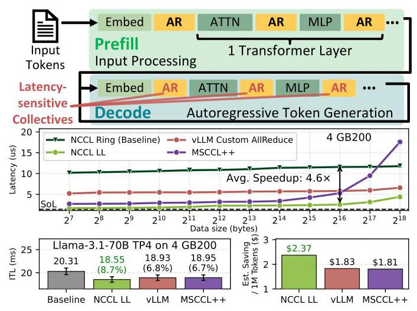

原 Fig. 1 把微基准与应用收益放在同一条因果链上：4 张 GB200 上，小消息平均延迟从 NCCL ring 的 **11.0 μs 降到 2.37 μs**，Llama-3.1-70B 的 ITL（inter-token latency，token 间延迟）降低 **8.7%**。作者采用 4 GB200 每小时 42 美元的价格，估算该工作负载中 AllReduce 每减少 1 μs，输出 token 成本约降低 0.9%；这个斜率依赖模型、通信频率和计费设定，不能当作通用换算公式。

### 必要的硬件与内存假设

本文只研究**同一个 NVLink domain 内的 scale-up 通信**。NVL72 可以跨多个物理节点构成同一域，因此论文中的“2 nodes / 8 GPUs”不意味着已经研究了 InfiniBand/RoCE 的 scale-out 路径。每个 rank 可理解为一个参与 collective 的 GPU。

Symmetric memory（对称内存）在每个 rank 上具有相同类型、大小和布局，允许通过逻辑对象与 rank 标识访问远端对象；这不意味着所有 GPU 共用一份数据。借助 CUDA VMM，区域可映射为 load/store accessible（LSA），设备线程能够直接访问 peer 内存；NVSwitch/NVLink SHARP 则进一步支持 `multimem` 广播和归约。Scratch buffer 是接收中间数据的临时空间，常驻通信路径；它的容量和复用方式直接影响算法。

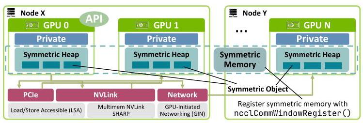

原 Fig. 2 区分了普通 LSA 访问、NVLS multicast/reduction 与网络通信。本文使用图中 scale-up 部分；GPU 能够发起远端写、接收端能观察这些写、必要的 fence 能保证复用顺序，是后文协议成立的前提。

### 现有方案留下的瓶颈与核心 Insight

Ring 以较少通信量换取随 N 增长的通信轮次，tree/recursive doubling 把轮次降到 O(log N)，one-shot / two-shot 又能在 scale-up 中降到常数轮次。但即使算法只需一两轮，显式发布 readiness flag、等待所有 peer 的 barrier 仍然可能占掉大量时间。

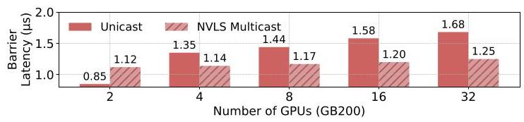

原 Fig. 3 测得每次 barrier 超过 **1 μs**；如果一次小 AllReduce 约 5 μs 且包含两个 barrier，同步就约占 **40%**。作者使用 NCCL `ncclLsaBarrierSession`、relaxed ordering 测量，并承认其具体实现未必最优；它说明这类“向所有 peer 发信号并等待”的机制很贵，但不是对一切可能同步实现的数学下界证明。

**核心 Insight**：接收方真正需要知道的是“这个数据已经到达”和“这块旧缓冲可以再写”，不一定需要额外的全局集合点。前者可以由数据与 flag 原子共传、sentinel 被有效数据替换，或原子归约计数来表达；后者可以由双向交换中的接收事件隐式提供。把同步信息嵌进已有数据流，就有机会省掉完整的 GPU 间往返。

**动机评估**：动机较扎实，既有 barrier profiling，也有推理关键路径和端到端收益佐证；传统 HPC 中频繁的小归约则提供了第二类应用。不过论文主动选择长上下文、小 batch、同一 NVLink 域的延迟敏感场景，不能据此判断大 batch、大消息或跨网络负载也有相同收益。

## 二、相关工作（Related Work）

原文的研究脉络分散在 II、III 和 IX 节，主要按**通信抽象与目标负载**分类，而非单纯按年代排列。

|工作类别|基本思路|与本文关注点的关系及不足|
|---|---|---|
|NCCL、RCCL、oneCCL 等 GPU collective 库；CUDA-aware MPI|提供面向互连优化的集合通信，MPI 从 CPU 模型扩展支持 GPU|传统大消息路径不是小消息最优解；原文也承认 MPI 在点对点通信上仍可能有竞争力|
|NVSHMEM、NCCL device API、MSCCL++|让 GPU 直接管理远端内存和通信，降低 CPU 介入并支持定制内核|提供构建能力不等于自动消除协议内部 barrier；本文在现有设备 API 上组合更细的低延迟机制|
|Ring、tree、one-shot、two-shot AllReduce|在通信量、轮次和冗余计算间取舍|常数通信轮次仍可能含昂贵的 readiness/reuse barrier，本文进一步优化每一轮的实现|
|vLLM custom AllReduce、SGLang、FlashInfer、TensorRT-LLM|为推理的小消息优化专用归约|作者认为 SGLang/FlashInfer 与 vLLM 设计相似，因此未独立测试；TensorRT-LLM 的 sentinel 变体仍使用全局 barrier flag，这是论文陈述而非本文新增实测|
|DeepEP、NCCL EP|针对专家并行通信模式设计低延迟原语|目标更专门；本文追求可组合的通用接口，但没有实验证明其覆盖全部 expert-parallel 实现能力|
|NIXL|面向异构后端的数据传输调度和集成|优化层级不同，因此不是 collective latency 的直接替代基线|

本文没有声称发明 LL、sentinel 或 double buffering。主要增量是分析这些机制的适用边界、组合出免全局 barrier 的实现、提出 two-shot LL128 atomic，以及把它们接入已有 NCCL 生态。其优势也不是“对称内存天然更快”这么简单：NCCL 已有 AGxLL、RSxLD-AGxST 等 symmetric kernels，本文仍需与它们正面对比。

## 三、技术挑战（Challenges）

1. **数据到达与通知顺序难以廉价保证。** 独立发送数据和 flag 时，接收方看见 flag 不应早于数据真正可用；用 barrier/fence 粗粒度保证正确性容易付出微秒级代价。
2. **单次交换安全不代表循环复用安全。** Scratch 有限时需要分块；快 rank 可能在慢 rank 尚未读完时覆盖同一槽位，sentinel 还需要恢复初始状态。
3. **最少轮次、最少流量和最少 scratch 无法同时免费获得。** One-shot 每张卡接收所有输入，small-message latency 好，但 N 或消息长度增大后会遭遇冗余传输与轮询压力；two-shot 减流量却多一轮同步。
4. **将归约搬到硬件后，必须同时证明 readiness 和数值语义。** 原子累加需要知道全部 rank 是否到齐，浮点累加次序也不固定；缓存行级原子性还是特定硬件前提。
5. **可复用接口需要保留性能，又不能掩盖约束。** 线程级 API、编译期展开与 multicast 可降低开销，但用户仍须匹配类型、初始化 sentinel、满足缓冲区及内存可见性条件。
6. **“接近极限”需要明确极限是什么。** 若把启动、计算、输出写完成等都混进来，会混淆算法优化和测量口径；若全部理想化，又必须说明下界的条件。

## 四、解决方案（Solution）

### 整体思路与贯穿示例

本文先用 push 代替 latency 更高的 pull，再把数据准备信号合入负载，用双向通信配合双缓冲保证分块复用；针对更大规模提供原子 ReduceScatter + AllGather；最后将可复用部分封装成 `ncclLLBuffer`，按 GPU 数和消息大小选择合适内核。所谓 barrier-free 指**消除跨 GPU 全局 memory barrier**，并非没有等待、CTA 内 `__syncthreads()` 或必要的 fence。

贯穿下面各项设计，设四张 GPU A/B/C/D 都有一份长向量，每个位置的局部值分别为 1、2、3、4，目标是在每张 GPU 输出全 10 的向量；为便于解释，scratch 一开始只容纳当前一小块数据。这里的常数输入只是教学示例，真实输入可不同；原子算法还必须满足所选浮点类型和加法条件。

### 1. One-shot 与 two-shot：先决定做几轮、搬多少数据

在 one-shot push 中，A 把自己的当前块写给 B/C/D，其余卡同样发送；四张卡分别等齐四份输入并本地求和。这样只需要一轮跨卡数据传播，适合很小的消息。Pull 则需要发起远端读取并等待返回；论文将 push 的关键延迟描述为约半个 GPU-to-GPU RTT，而 pull 需要完整 RTT，代价是接收端额外 scratch。

在 two-shot 中，先把向量分为四段：A 负责第一段的最终归约，B 负责第二段，依此类推；所有卡只把相应段发给其负责人。这是 ReduceScatter。随后四位负责人互发各自算好的 10，完成 AllGather。第二轮增加同步次数，却避免所有卡对完整向量重复接收和归约，适合中等消息或更多 GPU。

这里“one-shot / two-shot”描述每个数据块的通信阶段数；有限 scratch 下，整个大消息仍可能循环多个 iteration，不能把 one-shot 理解为任意大小都只发一次。

### 2. LL 与 sentinel：数据本身承担到达通知

**LL（Low Latency）** 将数据和 epoch flag 打包，原文以 8 字节数据 + 8 字节 flag、16 字节原子 store 为例。A 发送的不只是 1，而是“1，当前轮号”；B 轮询直到 flag 等于期望 epoch，就能确认负载同时到达，回应挑战 1。代价是有效带宽约减半，scratch 也翻倍；API 以模板类型 T 定义负载与 flag 大小。

**Sentinel** 则提前将接收槽设置为特定 sentinel 编码，例如原文使用的负 NaN，然后只发送有效数值。B 发现该槽不再是 sentinel，就知道 A 的 1 已到。它没有 LL 的 flag 流量，适合消息变大后的带宽需求；但每次复用必须 reset，而且**有效输入不能与 sentinel 编码冲突**。这里应理解为实现识别预定 sentinel 状态，不能直接用普通浮点 `x != NaN` 编写 readiness 判断，因为 IEEE NaN 的比较规则不支持这样的逻辑。

两种模式把“到达”检测局部化，但都没有自动解决“下一轮能不能覆盖”的挑战 2。

### 3. 双向通信 + 双缓冲：一次接收也是下一次发送的许可

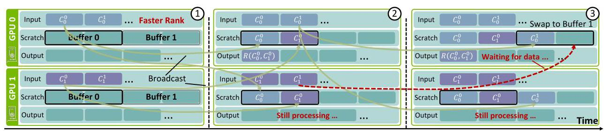

现在假设 A 比 B 快。第一轮双方向 buffer 0 写第 0 块；A 先读完，也不能马上覆盖 B 的 buffer 0。它改向 buffer 1 写第 1 块，然后等待 B 的第 1 块。B 只有完成自身前一轮处理并推进后才会发送第 1 块，因此 A 收到它时，就获得了 B 已推进的证据；下一次回到 buffer 0 才安全。原 Fig. 4 的价值在于把**数据接收变成类似 credit-based flow control 的隐式许可**，而不是额外发一个“可以覆盖了”的全局通知。

这个推理依赖双向配对、交替使用不重叠区域，以及每个 iteration 对同一 peer 最多一次相应写入等条件；它不是“开两个 buffer 就对任何算法都成立”。Sentinel 的 reset 还需要确保可见性，API 返回并不自动保证 reset 已对远端可见。Ring 存在“先收、归约、再转发”的跨步依赖，原文明确指出仍需要显式 barrier。

### 4. Two-shot LL128 atomic：把“到齐”和“求和”合成同一件事

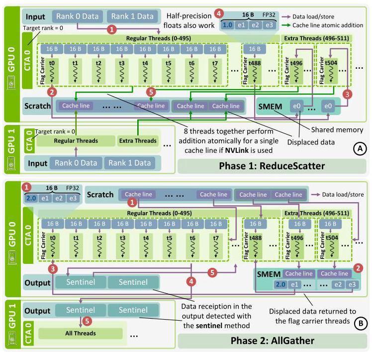

在四卡示例中，A 负责的第一段不用给 B/C/D 各留一份待归约输入；四张卡直接向 A 的同一归约区域做 atomic add，结果在 L2 累加。为知道何时完成，每 8 个线程共同处理一个 128 字节 cache line，各线程拿 16 字节；FP32 时第一个线程把其中一个真实元素移到 shared memory，由 extra threads 另行处理，然后用数值 1 占据该元素的位置。四张卡都按同一布局累加后，标记达到 N=4，就表示该缓存行的四份贡献到齐。

关键正确性前提是**论文所依赖的 NVLink 缓存行级原子更新保证**：计数与同一行的贡献不能在接收者看来脱节。不能将其泛化为任意 CUDA 多元素 atomic 天然具有同样保证。图中的 CTA 包含 496 个 regular threads 和 16 个 extra threads；FP16 对 displaced elements 只需 8 个 extra threads。

在 AllGather 阶段，负责该片段的 CTA 轮询计数直到 N，extra threads 将被挪走元素的归约结果放回 shared memory，经 CTA 内同步后由 flag carrier 恢复正确位置，再发布到各 GPU 的输出区域。图中输出预置 sentinel，其他 CTA 通过 sentinel 检测输出是否到达。因此“atomic 计数”替换的是关键 ReduceScatter readiness 机制，并不意味着整个内核完全不使用 sentinel。

这同时回应挑战 3、4：中间值直接累积，scratch 明显减小；标记开销只有每 128 字节额外 4 字节（FP32，约 3%），或 2 字节（FP16，约 1.5%）。但实现依赖 NVLink、向量化 atomics，限制于原文所述单精度/半精度与加法，且结果随执行顺序可能变化。LL128 的 8 线程协同方式也使它**不属于统一线程级 `ncclLLBuffer` 原语所封装的同步模式**，而是另行集成的内核；原文概括性地说“using APIs”时不能掩盖这项明确限制。

原文用标准浮点求和前向误差界说明其数值误差，在无 overflow/underflow 且通常要求 `(N−1)u < 1` 的条件下：

\[
|\mathrm{fl}(\sum_i x_i)-\sum_i x_i|\le\gamma_{N-1}\sum_i|x_i|,\qquad \gamma_k=\frac{ku}{1-ku}.
\]

FP32、64 ranks 时系数约为 **3.8×10⁻⁶**；这是相对绝对值之和的误差界，不保证发生抵消时相对最终结果的误差仍然很小，也不等于确定性。原文指出低精度的界更大，但没有给出应用精度/收敛性的全面实验。

### 5. 算法代价对照

下表重建原 Table I。M 是每个 rank 的完整输入消息大小，D 是一次 iteration 归约的数据量；scratch 是表中给出的每 iteration 容量，**并非含 round-robin、多 CTA 与初始化管理在内的完整分配大小**。

|算法|每 GPU 通信量|每 iteration 同步阶段|Scratch / iteration|确定性|
|---|---:|---:|---:|---|
|One-shot LL|2(N−1)M|1|2ND|是|
|One-shot sentinel|(N−1)M|1|ND|是|
|Two-shot LL|4(N−1)M/N|2|2D|是|
|Two-shot sentinel|2(N−1)M/N|2|D|是|
|Two-shot LL128 atomic|约 2(N−1)M/N|2|约 D/N|否|

这张表也澄清了原 III-A 的一个表述问题：那里将 one-shot 的 O(NM) 和 two-shot 的 O(M) 称为 “total communication volume”，但 Table I 对应的是**每 GPU**量级；若把所有 GPU 发出的字节相加，整个系统还要再乘 N。分析扩展性时应以明确口径的表格为准。

### 6. 接口：让上述设计可组合，但保留安全义务

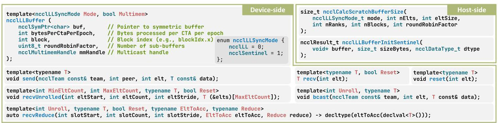

`ncclLLBuffer` 包装已有 symmetric scratch，用模板参数选择 LL/sentinel 和是否使用 NVLS multicast。`send` / `recv` 处理单槽，`recvUnrolled` 用编译期最小/最大元素数展开轮询，`recvReduce` 组合接收、类型转换和归约，`bcast` 选择硬件 multicast 或遍历 peer，`reset` / `resetRange` 控制复用。Host 端计算 scratch 容量、初始化 sentinel，用户仍按常规分配对称内存。

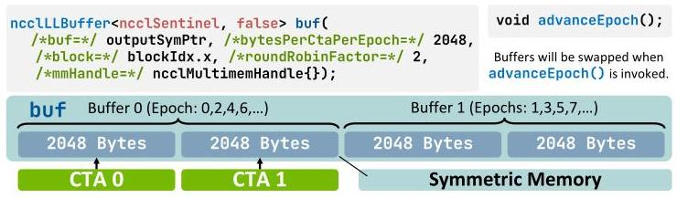

`bytesPerCtaPerEpoch` 决定每个 CTA 在一个 epoch 的容量，`roundRobinFactor=2` 实现双缓冲；`advanceEpoch()` 切换区域并推进 LL flag。若 factor=0，对象不再细分缓冲、advance 不生效，用户必须自己管理偏移。图中把 CTA 与 epoch 两个维度分开，解释了为何并行线程块和连续 iteration 不应随意复用同一地址。

回到四卡示例，原 Fig. 9 的 one-shot 代码可按语义概括为下面的伪代码（不是可直接编译的 API 示例）：

```text
用 symmetric scratch 构造 LL buffer，并启用双缓冲
对线程负责的每个数据块：
    读取本地输入，广播到所有 rank 对应槽位
    按当前 epoch 轮询所有 peer，收到后本地求和
    写入本地 output
    advanceEpoch，进入另一块 scratch
```

与挑战 5 对应，接口将低延迟机制集中封装，但仍是 thread-level 原语：send/recv 类型必须一致，sentinel 必须预先初始化，reset 后若需要立即保证远端可见须使用显式 fence。One-shot 只要求 NCCL 管理的 symmetric scratch；two-shot 还要求 output 是 symmetric/LSA buffer。论文通过 `NCCL_SYM_KERNEL` 选择 `AllReduce_LLBuffer`、`AllReduce_LLBuffer_Twoshot`、`AllReduce_LL128_Atomic`，用 `NCCL_SYM_LLBUFFER_SYNC` 选择 LL/sentinel；另实现了 Broadcast、Reduce、ReduceScatter、AllGather，但主要性能证据集中于 AllReduce。

### 7. 如何定义并估计 Speed-of-Light 下界

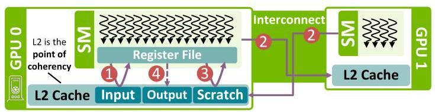

作者用一个 128 字节 cache line 建模，并假设输入及接收数据都 L2 hit、所有 peer 同时发送/到达、读取可以并行，忽略调度和归约计算，且不计最终 output store 发出后的完成时间。于是四卡示例的最理想路径为：本地 L2 → SM、一次 remote store → 对方 L2、接收方 L2 → SM；多发给几个 peer 被假定不增加关键路径。

\[
L_{SoL}=2L_{L2\_RTT}+L_{remote\_store}.
\]

作者用 `__threadfence()` 延迟近似 L2 RTT，用两卡 ping-pong 分解远端 store：

\[
L_{remote\_store}=\frac{L_{ping\_pong}-2L_{L2\_RTT}}2.
\]

GB200 实测两项分别为 **0.306 μs、0.792 μs**，得到 **1.404 μs**。因此文中“仅比 SoL 高 7%”指特定小消息条件下接近这个估计值，约 1.50 μs（由下界与比例计算），不是完整应用或包含主机调度的普遍绝对物理极限。论文将其称为 absolute lower bound，但测量采用 fence 近似与理想并行假设，解释结果时应保留这些条件；没有缓存命中或大规模同时发送能力时，实际可达下界会受更多因素限制。

## 五、实验评估（Experiments）

### 实验设定与比较范围

|实验|平台与软件|负载、指标与统计|
|---|---|---|
|AllReduce 微基准|GB200 NVL72，4 GPU/节点、72 GPU 同一 NVLink 域、聚合带宽130 TB/s；NVIDIA vLLM container 26.02，Ubuntu24.04、CUDA13.1、vLLM0.15.1、PyTorch2.11、OpenMPI4.1.9|2/4/8/16/32/64 GPU，Fig.11 消息从128B到32MiB；每配置10次取均值，误差条为标准差；NCCL至多64 CTA、每CTA512线程|
|vLLM 推理|同一GB200系统，TP=4或8|输入100–200k tokens、输出16K、batch8；5次试验；ITL、输出吞吐、估算成本|
|cuSOLVERMp|Alps单节点GH200，卡间150GB/s NVLink；PyTorch container25.10、Ubuntu24.04、CUDA12.6、OpenMPI4.1.7、cuSOLVERMp0.7.2|`mp_sygvd` 广义对称定特征值问题，矩阵阶32768/65536；5次试验；每GPU GFLOPS|

微基准比较 NCCL 2.29.1 的 legacy ring/tree 与 symmetric kernels、NVSHMEM 3.5.21、MSCCL++ 0.8.0、vLLM custom AllReduce 0.15.1，以及 NCCLX CTran `ctdirect`。其他库使用默认配置，而 NCCL 采用论文所设资源配置，因此结果是这些实现/配置的比较，并非每个基线都经过同等程度重新调优的比较。

比较范围也有明确缺口：NCCLX `ctdirect` 和 vLLM custom AllReduce 只测2/4卡；MSCCL++ multicast 在 GB200 上挂起而排除，非multicast只测2/4卡，two-shot不支持2 ranks及4KiB以下消息。作者提到其已有的双节点 hierarchical 变体要求每节点8卡，与这里节点布局不符。大规模图中基线数量减少，不能将缺失曲线当成本文直接击败相同规模实现的证据。

### Scratch 容量：为什么不是越大越好？

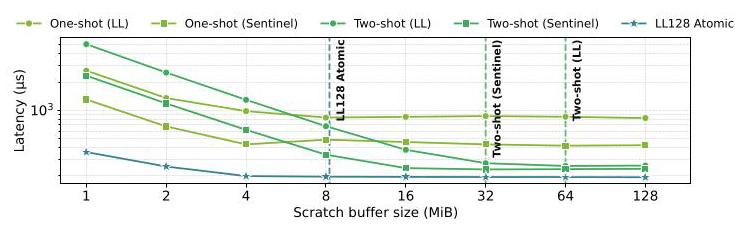

在8卡、32MiB消息下，scratch小于8MiB时two-shot反而比one-shot慢：虽然减少了整体迭代需求，每次仍要付两阶段同步，未能抵偿固定开销。Two-shot随着scratch增大迅速改善，直到可以一次处理整个消息后趋于平稳；one-shot增大每次发送块却提高瞬时NVLink压力，超过一定点后收益很小甚至略变差。因此作者为one-shot选择 **4MiB**，two-shot和LL128 atomic选择 **64MiB** 默认scratch。

这一实验支持的是“算法和容量必须一起选”，不是支持任意消息都必须预分配64MiB。对贯穿示例而言，扩大A/B/C/D的临时收件空间可以少循环，但如果四方同时大量广播，交换网络本身也会成为瓶颈。

### 微基准：小消息接近下界，中等消息按规模切换

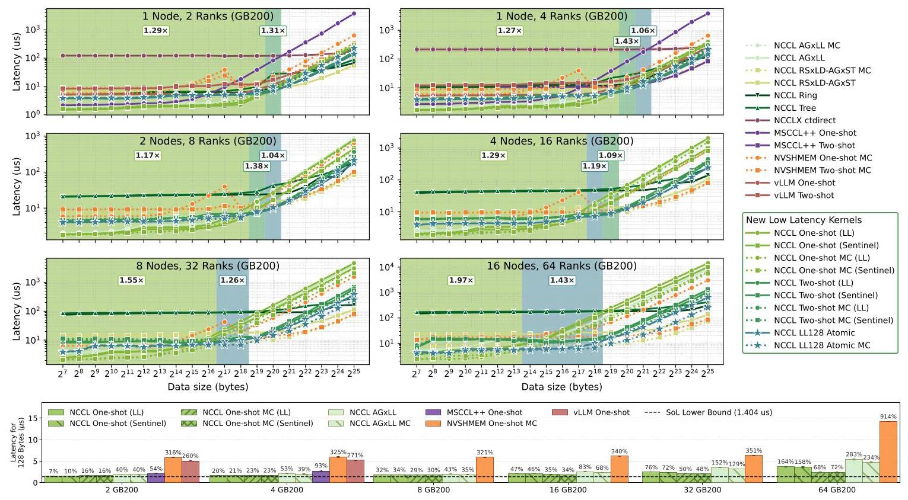

原 Fig. 11 下半部分直接检验“接近SoL”：**2卡128B，one-shot LL仅比1.404μs高7%**；4卡最佳约高20%；64卡最佳multicast LL约高68%（正文概述为约70%）。因此“7%”是最佳小规模点，不是64卡仍保持7%，但64卡的最佳值仍约2.36μs（按下界和68%计算）。

上半部分阴影表示本文不同算法赢过**该消息大小下最快已有实现**的区间，标注为区间内几何平均加速比，不能当作所有消息的平均收益。例如one-shot优势区间在2/4/8/16/32/64卡分别标注 **1.29×/1.27×/1.17×/1.29×/1.55×/1.97×**；64卡LL128 atomic优势区间为 **1.43×**。这种比较比只对比ring更能体现新增优化的有效性。

机制上，极小消息偏向LL，消息和rank数增加后sentinel避免flag流量的优势出现；编译期展开、跨rank并行轮询与归约也帮助新one-shot超过已有LL实现。LL128 atomic在少量GPU时会付出L2原子串行化代价，扩大到更多卡后扩展性优势更明显。大消息下已有RSxLD-AGxST multicast利用`multimem.ld_reduce`降低软件轮询和归约工作，新内核并不能全面取代它；论文因此把新设计定位为补充。

### vLLM：微秒级改善能否进入应用关键路径？

作者根据微基准修改NCCL经验选核，例如4 ranks下小于1MiB用one-shot，1–2MiB用two-shot。推理baseline是**只用legacy kernels的NCCL**；`NCCL LL`启用本文one-shot，`No MC`关闭multicast，`Sym Mem`注册PyTorch输入/输出为对称内存以开放two-shot和LL128 atomic。没有symmetric output时，大于LL阈值会回退legacy路径。

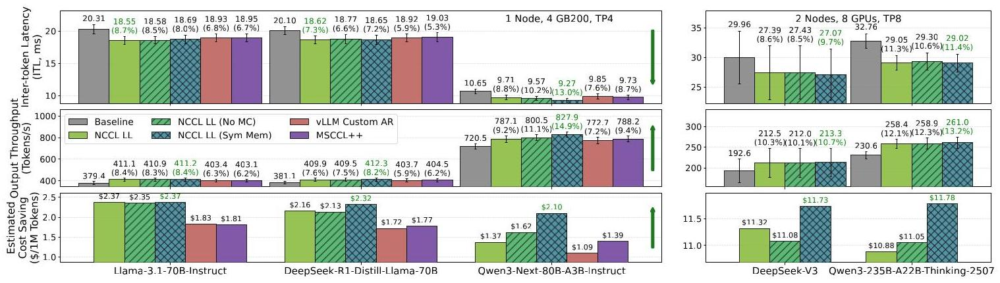

以下直接摘取图中对应配置的标注，避免将不同配置的最佳值拼接成一次不存在的运行：

|模型与卡数|配置|ITL：baseline → 该配置|吞吐：baseline → 该配置（tokens/s）|
|---|---|---|---|
|Llama-3.1-70B-Instruct，4卡|NCCL LL|20.31 → 18.55ms（−8.7%）|379.4 → 411.1（+8.4%）|
|DeepSeek-R1-Distill-Llama-70B，4卡|NCCL LL|20.10 → 18.62ms（−7.3%）|381.1 → 409.9（+7.6%）|
|Qwen3-Next-80B-A3B-Instruct，4卡|NCCL LL + Sym Mem|10.65 → 9.27ms（−13.0%）|720.5 → 827.9（+14.9%）|
|DeepSeek-V3，8卡|NCCL LL + Sym Mem|29.96 → 27.07ms（−9.7%）|192.6 → 213.3（+10.7%）|
|Qwen3-235B-A22B-Thinking-2507，8卡|NCCL LL + Sym Mem|32.76 → 29.02ms（−11.4%）|230.6 → 261.0（+13.2%）|

总体覆盖dense、MoE和hybrid-attention模型。正文将最佳ITL改善概括为4卡7–13%、8卡9–11%，图中Qwen3-235B精确标注为11.4%；这里保留图中数字，并将正文范围理解为粗略取整。DeepSeek-R1-Distill-Llama的Sym Mem吞吐为412.3，比表中LL配置更高，但它的ITL不是该模型最低值。

费用计算使用 `p×10⁶/(3600r)`，p为小时价格，r为输出tokens/s；图中8卡DeepSeek-V3和Qwen3-235B对应最佳吞吐配置分别节约 **11.73、11.78美元/百万输出tokens**。这是固定硬件价格下的吞吐换算，不是包含prefill/decode分离资源池、利用率、排队和服务SLO的完整成本模型。

### cuSOLVERMp：迁移到传统HPC是否仍有效？

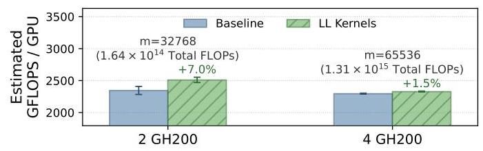

矩阵阶 **32768、2 GH200** 时每GPU GFLOPS提升 **7.0%**；矩阵阶 **65536、4 GH200** 时提升 **1.5%**。两种矩阵都超出单GPU内存容量，因此分布式执行有实际必要；较小矩阵的通信占比更高，收益更大。cuSOLVERMp不注册symmetric buffers，因此这里只能对小于1MiB的消息使用one-shot；这证明无需应用全面重构内存路径也能获得收益。

这一比较同时改变矩阵大小和GPU数，因此不能把7.0%到1.5%的差异严格归因为其中某一个变量。Alps没有跨节点NVSwitch scale-up，实验限制在单节点；MSCCL++因MPI错误未纳入，HPC对照也仅为legacy NCCL。原文排除GROMACS/LAMMPS、QMCPACK、HPCG的理由分别涉及MPI为主、NCCL支持局限或只用点对点，故HPC证据仍主要是一个库、一个solver家族。

### 结论支撑性分析

证据链较完整：barrier开销解释优化目标，scratch敏感性支撑配置选择，微基准验证小消息接近估计下界，LLM和HPC再检验收益是否出现在应用层。跨2–64卡的曲线还显示了新方法失去优势的区间，比仅展示单个最佳点更有说服力。

但不能据此声称“所有collective、所有GPU或所有推理都接近硬件极限”：实验主体是GB200和NVLink，GH200应用只验证one-shot；LL128的数值稳定性主要来自理论界，缺少任务精度和多次运行误差分布；API包含其他collective，却没有同等详尽的实验；低延迟方案同时改了协议、循环展开和轮询方式，缺少将所有贡献逐个拆开的完整消融。应用baseline也不是每种场景下经过全部对称内存优化的最强stock配置，应用增益应按论文给定基线理解。

## 六、附加洞察（Side Findings）

**结论1：把LL128 atomic直接改成one-shot，可能破坏AllReduce要求的跨rank结果一致性。** 出处：IV-5 “Algorithm Comparison” 的限制段。推理链条：原子浮点累加的到达顺序不确定 → 如果每张GPU独立收集并累加同一批值，各卡可能采用不同顺序 → 浮点非结合性使各卡得到不同结果 → 这超出“跨次运行不确定”的范畴，违反一次AllReduce各rank应得到相同结果的语义。Two-shot由每个片段的单一负责人产生结果再分发，因而避免各rank独立重算同片段；原文给的是语义论证，没有提供反例输入的实测表。

**结论2：小规模时启用hardware multicast未必减少延迟。** 出处：VII-C，Observation 3及Fig.11下半图。推理链条：2卡128B时one-shot LL unicast比SoL高7%，multicast版本高16% → 少量目的地并没有足够多的软件发送需要摊薄 → multicast路径自身代价可能超过节省的工作 → 它的价值随规模增大才突出。原文没有把额外开销分解为具体指令或交换机部件，因此只能得出此配置下不宜默认multicast更快，不能反推硬件原因已被证明。

**结论3：对称内存对吞吐的改善可能比对ITL更明显，因为服务基准还包含mixed prefill/decode。** 出处：VIII-A结果段及Fig.13。推理链条：decode的小AllReduce已能用one-shot LL → symmetric output额外开放的two-shot主要帮助超过LL阈值的操作 → vLLM混合执行中prefill会包含这类较大消息 → 总输出tokens除以wall-clock time的吞吐指标能捕捉这部分收益，而ITL更直接反映decode间隔。比如DeepSeek-R1-Distill-Llama的LL配置ITL更低，Sym Mem吞吐却略高，说明两个指标不必选出同一配置；这由原文解释和结果共同支持，但论文没有单独拆分prefill耗时来完成严格归因。

## 七、总结与个人评价（Wrap-up）

本文最有价值的贡献是把“少通信轮次”继续推进到“每轮中哪些同步真正必要”，用数据就绪检测、隐式复用许可和硬件原子累加构造可落地的低延迟路径，并通过NCCL接口把它们带入现有应用。最佳128B两卡配置距作者估计的SoL约7%，LLM和cuSOLVERMp也获得可测收益，说明微秒级优化并非只对微基准有意义。

最大的亮点是正确性机制、硬件成本模型与应用证据相互衔接；最大的不足是最强结论依赖特定互连与理想化测量口径，且原子方案缺少充分的应用数值验证。后续最值得研究的是可解释的性能模型选核、原子归约精度与一致性测试，以及在保持安全约束的前提下提供warp/block级接口；这些是评述和原文未来方向，不是本文已经完成的结果。

## 八、章节脉络与段落速览（Structure Map）

以下沿用原文编号和英文标题，¶在各节/带标题子项内重新计数；列表、公式与代码并入所属自然段，跨页被拆开的句子恢复为同一段，图注和表格单独按图表索引回查，不当作正文自然段。

- **Abstract**：概括scale-up低延迟collective的设计、下界和应用价值。
  - ¶1 从推理延迟需求引出barrier-free接口、内核和应用验证。
- **I. INTRODUCTION**：建立小消息延迟的重要性与本文贡献。
  - ¶1 说明模型规模、长上下文和小batch如何让AllReduce进入decode关键路径。
  - ¶2 说明传统HPC的小全局归约也影响强扩展性。
  - ¶3 用GB200延迟、Llama ITL与估算成本展示现有实现距离SoL的空间。
  - ¶4 指出global barrier并概述将其移除的技术及接口。
  - ¶5 说明微基准、vLLM与cuSOLVERMp验证路径。
  - ¶6（含四项贡献列表）归纳机制分析、API、新AllReduce和应用评估四项贡献。
  - 脚注说明多数工作完成于作者在NVIDIA实习期间。
- **II. BACKGROUND**：介绍GPU通信库、内存抽象及研究范围。
  - **A. GPU Communication Libraries**：定位GPU-native库与MPI的关系。
    - ¶1 对比NCCL、NVSHMEM、跨厂商库与CUDA-aware MPI的用途。
  - **B. Device-Initiated Communication and Symmetric Memory**：解释设备通信与对称内存能力。
    - ¶1 介绍NVSHMEM与NCCL device API，以及VMM/GDAKI等支持。
    - ¶2 定义symmetric object、PE和symmetric heap。
    - ¶3 说明LSA与NVLS使对称内存支持直接访问和硬件广播归约。
    - ¶4 解释选择NVIDIA/NCCL的生态集成理由。
    - ¶5 说明LL、sentinel和双缓冲可迁移所需的基本硬件属性。
    - ¶6 给出聚焦单一NVLink域、排除scale-out的三个原因。
- **III. TOWARD NEAR SPEED-OF-LIGHT ALLREDUCE**：从算法轮次与barrier开销确定优化对象。
  - ¶1 解释选择AllReduce及其对其他collective构件的代表性。
  - **A. Low-Latency AllReduce Algorithms**：梳理小消息下不同算法的同步轮次。
    - ¶1 从ring/tree过渡到常数轮次的one-shot/two-shot。
    - **1) One-shot AllReduce**：说明单阶段交换并各自归约的机制。
      - ¶1 对比push/pull的延迟和缓冲区代价。
    - **2) Two-shot AllReduce**：说明分片归约后再收集的机制。
      - ¶1 解释多一阶段同步如何换取更少通信量。
  - **B. Cost of Memory Barriers**：测量现有跨GPU同步的固定成本。
    - ¶1 描述典型barrier模式、NCCL测量方法及其代表性限制。
    - ¶2 用barrier占小AllReduce总时长的比例说明消除它的价值。
- **IV. DESIGNING BARRIER-FREE COLLECTIVES**：组合数据就绪协议与复用机制实现免全局barrier通信。
  - ¶1 选择以scratch空间换取较低延迟的push路线。
  - **1) LL**：将数据和flag原子共传。
    - ¶1 解释LL readiness及其带宽和空间代价。
  - **2) Sentinel**：用接收槽状态变化识别到达。
    - ¶1 解释sentinel收益、reset义务及有效值冲突风险。
  - **3) Bidirectional Communication & Double Buffering**：解决分块循环的覆盖风险。
    - ¶1 指出单次LL/sentinel交换不足以保证多iteration安全。
    - ¶2 按Fig.4说明快慢rank如何交替两块缓冲。
    - ¶3 将双向接收解释为隐式发送许可并列出适用前提。
  - **4) LL128 Atomic AllReduce**：引入缓存行计数与原子归约协同的新two-shot设计。
    - ¶1 说明命名与两阶段总体结构。
    - **a) ReduceScatter**：分配目标rank并原子累加分片。
      - ¶1（含五步列表）说明8线程缓存行分组、移出元素、计数替换及原子更新。
    - **b) AllGather**：检测完成并发布恢复后的结果。
      - ¶1（含五步列表）说明计数到N、恢复displaced elements及输出就绪检测。
  - **5) Algorithm Comparison**：比较原子设计的空间、带宽、语义和精度。
    - ¶1 解释L2归约与更少scratch的扩展性动机及标记开销。
    - ¶2 列出NVLink、类型、运算及非确定性限制并解释one-shot变体的问题。
    - ¶3（含公式）给出浮点累加前向误差界。
    - ¶4 用FP32/64rank举例并说明较低精度的适用约束。
- **V. LOW-LATENCY API DESIGN**：将可组合机制包装为线程级buffer接口。
  - ¶1（跨页续接）提出兼容性、统一抽象与灵活性三个要求并指向代码文档。
  - **a) ncclLLBuffer**：定义buffer中心抽象及配置参数。
    - ¶1 说明LL/sentinel与multicast选择，并解释LL128为何不适合该线程级接口。
    - ¶2 说明CTA/epoch布局、round-robin及factor为0的行为。
  - **b) send**：定义发送布局与负载类型约束。
    - ¶1 解释LL打包及sentinel预初始化责任。
  - **c) recv**：定义轮询、类型匹配与可选reset。
    - ¶1 解释两种readiness条件及reset后的可见性约束。
  - **d) recvUnrolled**：提供编译期展开的多元素轮询。
    - ¶1 说明必访问和条件访问区间及其优化意义。
  - **e) recvReduce**：组合接收与归约。
    - ¶1 说明多peer接收、累加类型转换和用户归约算子。
  - **f) bcast**：向所有peer广播。
    - ¶1 说明multicast与peer循环两条路径及展开参数。
  - **g) reset**：提供独立槽位清理。
    - ¶1 说明不同模式的reset值、fence责任及resetRange扩展。
  - **h) Host-side Functions**：最小化主机侧准备。
    - ¶1 说明容量计算和sentinel初始化函数。
    - ¶2 解释常规分配后即可包装使用的简洁host设计。
  - **i) Constraints**：明确细粒度接口的适用边界。
    - ¶1 对比NVSHMEM抽象粒度，并说明双向算法与ring的安全差异。
  - **j) NCCL Collective Integration**：把内核接入NCCL选择机制。
    - ¶1 列出环境变量与one-shot/two-shot输出内存要求。
    - ¶2 说明artifact还提供其他四类collective内核。
  - **A. Example One-shot AllReduce**：用代码展示接口组合。
    - ¶1（并入Fig.9代码）概括构造双缓冲、broadcast、recvReduce、写输出与推进epoch的循环。
- **VI. MEASURING THE SPEED-OF-LIGHT OF ALLREDUCE**：建立并测量最小数据移动下界。
  - ¶1 定义忽略其他开销的128B cache-line SoL。
  - ¶2（含四步列表）从one-shot push分解两次L2访问和一次远端store。
  - ¶3（含公式）汇总SoL表达式。
  - ¶4 说明理想同时发送使下界与rank数无关。
  - ¶5 用threadfence近似测量L2 RTT。
  - ¶6（含公式）由双GPU ping-pong反推remote-store延迟。
  - ¶7 报告GB200测量值和最终SoL估计。
- **VII. MICROBENCHMARKS**：分析scratch与不同规模的延迟表现。
  - **A. Experimental Setup**：交代主平台与统计方法。
    - ¶1 列出NVL72硬件、容器软件版本及重复试验方式。
  - **B. Impact of Scratch Buffer**：用容量敏感性确定默认配置。
    - ¶1 说明8卡32MiB负载与CTA配置。
    - ¶2 解释小scratch时two-shot的阶段成本及容量增大后的收益。
    - ¶3 解释one-shot因瞬时网络压力而出现容量收益上限。
    - ¶4 解释原子累加降低保存各rank中间数据的需求。
    - ¶5 给出one-shot和two-shot/atomic的默认容量。
  - **C. Latency**：比较新内核与现有框架。
    - ¶1 列出基线、版本和资源配置。
    - ¶2 说明Fig.11的128B下界视图与精度展示选择。
    - ¶3 解释各基线算法映射、单节点限制和缺失数据原因。
    - ¶4 引出三条观测。
    - **a) Observation 1**：讨论one-shot最小延迟与同步模式交叉点。
      - ¶1 关联SoL差距、编译期展开、并行轮询和LL/sentinel适用区间。
    - **b) Observation 2**：讨论原子内核的规模依赖。
      - ¶1 解释小规模串行化代价与大规模扩展收益。
    - **c) Observation 3**：讨论硬件multicast/reduction的规模效应。
      - ¶1 说明小规模额外代价与更大规模下减少软件工作的价值。
    - 小节结尾¶1 总结新内核补充而不能完全替换既有symmetric kernel。
- **VIII. CASE STUDIES**：将经验选核接入真实应用。
  - ¶1 说明按rank数和消息大小选取内核后评估两个应用。
  - **A. LLM Inference**：评估长上下文服务性能。
    - ¶1 说明GB200平台、vLLM框架和TP4/TP8配置。
    - ¶2 定义上下文长度、输出长度、batch与试验次数。
    - ¶3 解释legacy baseline、LL、No MC、Sym Mem和框架基线。
    - ¶4 归纳模型间收益并解释mixed prefill/decode对吞吐与ITL的影响。
    - ¶5 给出成本换算公式、收益和生产部署模型限制。
  - **B. Traditional HPC**：以cuSOLVERMp检验科学计算收益。
    - ¶1（跨页续接）说明排除其他应用的原因与选择eigensolver的实际背景。
    - ¶2 说明Alps平台、软件、内存约束及可用对照。
    - ¶3 解释Fig.14的收益趋势与仅one-shot可用的限制。
- **IX. RELATED WORK AND DISCUSSION**：区分相近方案并提出接口与选核方向。
  - ¶1 讨论SGLang/FlashInfer的相似性及TensorRT-LLM的剩余barrier。
  - ¶2 区分专家并行专用库和本文通用接口。
  - ¶3 解释NIXL位于不同优化层级。
  - ¶4 提出性能模型选核及warp/block级接口两个未来方向。
- **X. CONCLUSION**：汇总机制、下界和应用成效。
  - ¶1 总结低延迟原则、API、AllReduce及LLM/HPC验证结果。
- **XI. ACKNOWLEDGMENTS**：交代支持来源与编辑辅助。
  - ¶1 致谢实验协助、项目资助，并披露ChatGPT用于轻度编辑校对。
- **REFERENCES**：列出[1]–[66]的背景论文、库文档、工作负载和相关实现来源。
  - 条目[1]–[66]均为参考文献，不视为正文自然段。

图表索引：原Fig.1–8对应本地fig01–08；原Fig.9是代码，无独立位图；原Fig.10–14对应本地fig09–13；Table I在第四部分重建。
