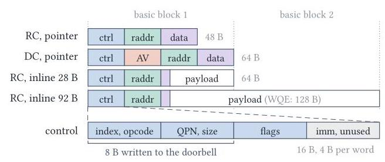
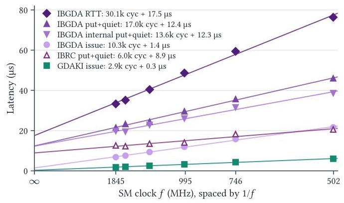
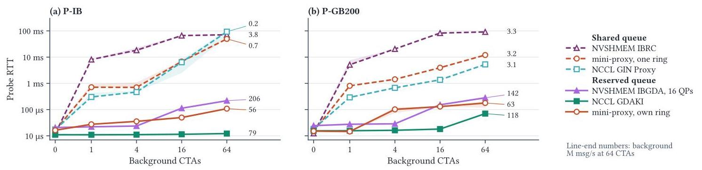
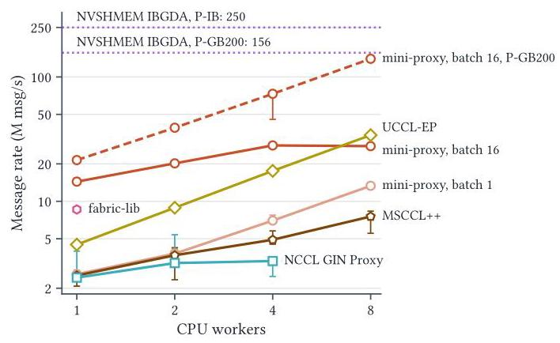
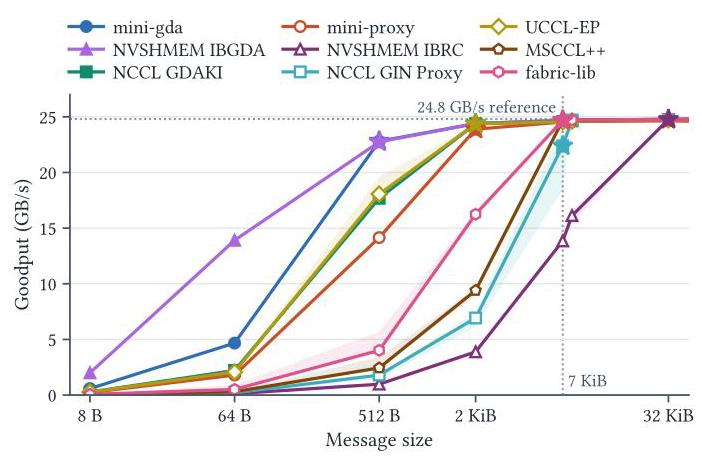
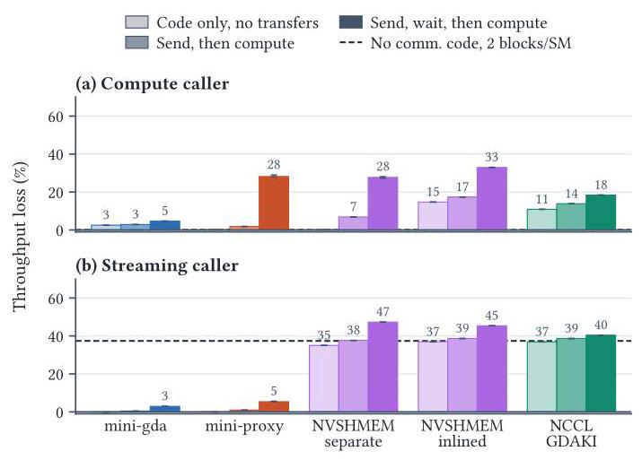
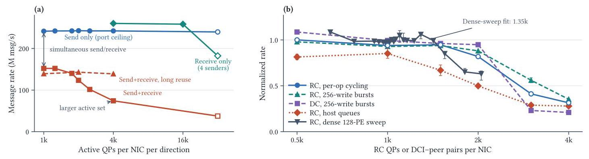

# GPU-Initiated Communication: Dissecting Down to the Bone 深度解读

> **作者**：Javid Baydamirli、Ismayil Ismayilov、Kaan Oktay、Didem Unat  
> **发表信息**：arXiv 预印本，2026，arXiv:2610.01380v1；所给版本未确认会议或期刊。  
> **一句话总结**：通过最小 GPU 提交路径 mini-gda、最小 CPU 代理路径 mini-proxy 和受控微基准，论文说明 GPU 通信的延迟、消息率与资源开销取决于排队、发布、内存排序、完成范围和流量形态，不能只凭“是否绕过 CPU”判断。  
> **阅读依据**：完整原文及附录 A–D；[原文转录](original.md) · [逐段中文翻译](translated.md)。下文的 §、Figure、Table 均指原论文，数值限定于其平台和测试配置。

## 一、问题定义（Problem）

### 背景：GPU 决定通信，不等于 GPU 完成所有提交工作

MoE 模型把一个 token 路由给若干专家，目标由 GPU 上的计算动态决定。若每次发送都必须让 CPU 重新接管执行，细粒度通信就容易直接阻塞 GPU。GPUDirect RDMA 先解决“NIC 能否直接读写显存”：NIC 可以 DMA 访问 GPU buffer，不必经过主机中转拷贝；IBGDA、GDAKI 等进一步让 GPU 内核构造 RDMA 请求并写 NIC 的 doorbell（门铃寄存器）。

这里必须分清三个角色：**谁决定发送、谁构造 WQE、谁写 doorbell**。GPU-initiated 只说明操作由设备代码发起；它既可以由 GPU 直接提交，也可以交给 CPU proxy。甚至还有混合路径：GPU 已构造好 WQE，CPU 只替它写 doorbell。因而，“GPU 发起”和“CPU 提交”可以同时成立（§2）。

RDMA 的基本对象是 Queue Pair（QP），内含发送队列 SQ 和接收队列 RQ；发送队列中的 Work Queue Element（WQE）描述要做什么，Completion Queue（CQ）中的 CQE 报告完成。doorbell 是告知 NIC“已有新工作”的硬件通知，并不是把用户 payload 本身送到远端。本文的关键对象是这些机制之间的边界。

Figure 1 把路径拆成六步：GPU 写 WQE、更新 doorbell record、确保可见性后写 8 B doorbell；NIC 再取 WQE、写 CQE，GPU 轮询 CQ。图中 doorbell record 位于 GPU memory，doorbell register 位于 NIC，二者不能混为一谈。普通 proxy 则由 CPU 承担构造、提交和完成处理，GPU 只交出请求描述符。

### 本文补上的缺口

这是**已有通信机制上的测量与解释工作，并非首次提出 GPU-initiated communication**。既有研究有的报告 proxy 空载延迟更低，有的报告 GPU 路径小消息吞吐更高，但往往比较整个库。一个库用一个队列、另一个用十六个；一个等待当前 QP、另一个扫描所有 QP；一个 CPU worker 处于基频、另一个已睿频——这些差异足以改变排名。

本文提出三个问题：一次操作究竟花在哪里；GPU 和 proxy 各在什么负载与配置下占优；达到高消息率需要什么，又消耗多少 GPU 和 NIC 资源。它把“哪个库最快”的问题转成“哪个机制、在何种条件下限制性能”。

**动机评估**：动机扎实。P-IB 上相同 8 B 操作，最小 GPU 路径 issue 为 0.70 μs，而 NVSHMEM public 为 5.31 μs；有序实现仅改变排序范围，issue 就从 0.70 增至 2.62 μs；完成范围扩大后，单次 put+completion 随配置队列数显著上升（Table 3–4、Figure 4）。这些不是人为虚构的问题，而是实际库默认配置和 API 语义的差异。原文引言没有独立的动机实验图，以上是正文实验对动机的回证。其局限是大量证据来自 8 B 微基准，不能直接等同于完整 MoE 应用的加速比例。

**核心 Insight**：**提交者只是路径的一项属性；软件协议决定控制成本，排队与资源共享决定负载下的表现。** 因此，要理解性能，必须独立改变 WQE 构造、排序、批处理、队列数量与完成范围，并同时观察 issue、完成、RTT、吞吐和资源占用。本文不是找到一个永远占优的路径，而是建立可解释的参照点。

## 二、相关工作（Related Work）

原文 §5 按研究对象和应用层次组织相关工作，可归为以下五条脉络。

| 脉络 | 既有思路 | 与本文的关系及不足 |
|---|---|---|
| GPU 通信栈剖析 | Demystifying NCCL/NVSHMEM 分析协议、算法和内存抽象；NCCL GIN 描述设备 API 及 GPU/proxy backend；Landscape 建立 initiation/submission 分类 | 解释库如何组织，但较难隔离库封装与硬件边界成本；本文采用其术语，并以最小实现独立改变机制 |
| HPC 中的设备发起通信 | GPUDirect Async 让 GPU 触发 CPU 预先准备的工作；GPU OpenSHMEM 处理长驻内核的一致性；迭代求解器与编译器工作减少 CPU 编排 | 主要验证应用或执行模型收益，未全面拆出排序、队列发布和完成范围的单独代价 |
| RDMA 性能工程 | CPU RDMA 早已采用 doorbell batching、inline、unsignaled completion；NIC 资源研究、FaRM、ScaleRPC、Collie 关注状态缓存、共享和双向流量 | 本文的若干优化并非全新发明，其贡献在于验证 GPU 构造请求时这些机制如何变化，并结合收发角色、连接复用和 payload 重新测量 |
| 专家并行通信库 | DeepEP、pplx-kernels、Hybrid-EP、NIXL、NCCL EP 消费设备通信机制；fabric-lib、UCCL-EP、NCCLX 等借 CPU 路径追求可移植性 | 这些库面向完整工作负载，公开成绩混合了调度、通知、批处理与不同平台；本文解释其中部分差异，而非给所有应用作最终排名 |
| 其他 GPU/NIC 生态 | rocSHMEM、ROCm DeepEP、MORI、Intel SHMEM、EFA DP Direct、Slingshot 提供不同设备通信路径 | 相似问题仍涉及请求构造、排序和完成，但接口与代价不同；本文没有在这些平台实测，不能推广 ConnectX-7 的精确数值 |

另一个重要参照是 Shen 等在 NVLink 域内进行的机制级研究：小消息 collective 可由同步而非数据搬运主导。本文把类似的拆解视角推进到 GPU–NIC 边界，加入网络队列、CPU proxy 和 NIC 连接状态。这种联系支持方法论，但不意味着 NVLink 和跨节点 RDMA 有相同的性能下界。

## 三、技术挑战（Challenges）

1. **分清测量边界。** GPU issue 包括 WQE 构造与提交，proxy issue 可能只测 GPU enqueue；CQE、proxy counter、signal、远端回复也并非同一事件。不先固定含义，数字再精确也可能比较错对象。
2. **在异构内存系统里正确发布工作。** NIC 必须先看到 WQE/payload，再看到 doorbell；多线程共享 QP 时，发布者还必须先看到其他写者的内容。GPU、主机内存和 MMIO 的访问范围不同，过强 fence 昂贵，删掉 fence 又不能由“没测出错误”证明安全。
3. **并发构造不保证并发发布。** WQE 槽位可以并行填充，但 NIC 必须按顺序看到完成的前缀；warp lane 进度分散时会相互等待。更多线程、QP 或 batch 未必独立产生收益。
4. **吞吐资源和延迟资源纠缠。** 更多 QP 可以扩大消息率，也会增加 all-QP quiet 成本和 NIC 活跃状态；队列共享节约资源，却可能把延迟敏感请求放到 bulk traffic 后面。
5. **通信代码会改变它所嵌入的计算。** 即使运行时分支从不执行，编译器仍可能增加寄存器、降低 block residency 或引发 spilling；单独测通信函数看不到这些代价。
6. **硬件“背景状态”不恒定。** GPU SM clock、CPU 基频/睿频、NUMA 位置、GPU–NIC 拓扑、双向收发与连接复用都会影响结果，必须通过控制实验把合理解释与已证实原因区分开。

## 四、解决方案（Solution）

### 整体思路：用可调的最小实现拆解机制

本文的方案是一套研究方法和工具，而非取代现有库的新通信产品。**mini-gda** 把队列放在 GPU 可访问内存，GPU 自己构造 WQE、更新队列状态、发布 doorbell 和轮询 CQ；排序方式编译时选择，payload 放置、队列数量与批处理大小可配置。**mini-proxy** 则由 GPU 把 16 B 请求描述符写入主机 ring，CPU worker 用 ibverbs 构造并提交 RDMA write，可分别改变 worker 数 T、ring 数 R、每次链式提交请求数 B。

这两个实现提供“拿掉库外壳之后”的实验基线，再与 NVSHMEM IBGDA/IBRC、NCCL GIN GDAKI/Proxy、DeepEP V1、UCCL-EP、MSCCL++、fabric-lib 对照。DeepEP V2 的 GIN backend 由 GDAKI 机制测试覆盖，但这不等于作者完整测试了 DeepEP V2 应用性能。

### 贯穿示例：一个 token 到远端专家的旅程

设 GPU A 刚计算出一个 token 的路由，需要把 **7,168 B 的 FP8 隐藏向量**发往 GPU B 的专家，然后等待结果。为解释机制，先把发送缩小为一个 **8 B 状态值**，再恢复到真实向量大小；这两个大小对应论文的测量对象，下面的 A/B 故事是解读示例，不是新增实验。

我们依次问：A 是自己填写发送工单，还是交给 CPU；工单和门铃放在哪里；A 能否在写好工单之前就按铃；多个 token 如何拼成一批；A 等待的是这个专家，还是所有专家的队列；bulk token 流是否挡住一个紧急回复；把发送代码编译进计算内核以后，还能同时驻留多少 block；专家分布扩展到更多 GPU 时，NIC 要反复访问多少连接状态。这样，同一个例子串起论文全部主要变量。

### 1. 先确定内存位置和访问方向

GPU 要直接提交，既需要 NIC 能访问 GPU 中的队列，也需要 GPU 能写 NIC 的 UAR（User Access Region，PCIe BAR 的一部分）。前者由 GPUDirect RDMA 注册实现，后者需要将 doorbell BAR 映射进 GPU 地址空间。**DMA-BUF 使 NIC 能访问显存，并不自动建立反方向映射。** 在论文所述 NVIDIA 环境中，后者还依赖 `PeerMappingOverride=1`（§3.1）。

回到 token 示例，若平台不允许 A 直接按 NIC 门铃，它仍可把 WQE 写好，让 CPU 只负责按铃，而不必把全部发送控制退回 CPU。P-H100 就采用这种方式。因此论文把“WQE 构造位置”和“doorbell writer”分开记录，回应挑战 1 和 6。

### 2. 区分 payload inline 与 doorbell 搬运

Figure 2 中，RC pointer WQE 含 control、remote address、data 三段，共 48 B，按 64 B 基本块取用；DC 增加地址向量 AV，紧凑形式为 16 B。inline 把 payload 写入 WQE，替代指向源 buffer 的描述，图示 28 B inline 可放入一个 64 B 块，92 B inline 则占 128 B WQE。底部 control 段的前 8 B 才是写入 doorbell 的值。

对 8 B 状态值，inline 可省去 NIC 单独读取源 buffer；对 7,168 B token，GPU 逐段复制进 WQE 的成本就不划算，pointer 路径更自然。还应区分另一种“inline”：CPU rdma-core 可以通过 BlueFlame 把小 WQE 自身拷入 MMIO 区；论文测的 GPU 路径都只发固定大小通知，WQE 仍由 NIC DMA 获取。**payload inline 不代表 GPU 把整个 WQE 直接写进 NIC。**

### 3. 排序保证的是“工单先到，门铃后到”

正确性要求两层顺序：写者的 WQE 和源数据必须先对 NIC 可见；多个写者共享 QP 时，每个写者的内容必须在它的 ready 状态被发布线程看见之前可见。原文比较 GPU-scope fence/release、`__threadfence()`、system-scope fence/release 等实现，说明满足具体放置条件的更窄排序可以降低成本。

在示例中，不能因为通知只有 8 B 就忽略之前 7,168 B 源数据的发布。也不能把“看到 CQE/flag”自动解释为已正确看到所有对应 payload：GPU 弱内存模型下还需要相应可见性语义，尤其是缺少内核启动边界同步的 persistent kernel（§3.3）。这解释了为什么挑战 2 不能靠简单删除同步解决。

### 4. 让一个 warp 共同发布，而非让每个 lane 争一把锁

多个 token 可共享 QP：先保留连续槽位，并行构造 WQE，再按保留顺序发布，最后一次 doorbell 宣告多个 WQE。如果每个 lane 各自推进发布头，某个 lane 落后就可能阻塞已完成的后继；warp 协作可一次保留 32 个槽位、同步构造并统一发布，摊薄 reservation、锁和有序 doorbell 序列（§3.2、§4.3.1）。

这里批处理阈值只是上限，不等于每次实际凑到相同批量：NVSHMEM 默认 32，但孤立操作可立即提交；DeepEP 低延迟路径每专家每四条消息按铃；GDAKI 暴露调用者控制的 aggregation。因而，示例中只有一个 token 时不必为了 batch 32 一直等待；持续 token 流则可利用协作发布。该设计回应挑战 3。

### 5. 完成范围与队列隔离应独立选择

NIC 在 signaled WQE 完成时写 CQE，因为同一 SQ 有序，一个 CQE 也能回收其前面的 unsignaled WQE。但上层 API 可以只完成本次用到的 QP，也可以扫描所有已配置 QP：NVSHMEM `quiet` 遍历 RC QP 与 DCI pool；DeepEP V1 使用选定 `(peer, QP)`；NCCL 的 flush/wait 具有 context、peer 和参与线程范围（§3.3）。

若 A 只等 B 上的这个专家，遍历其他未参与通信的专家队列可能是多余成本。论文的做法是固定内部 put，只替换完成范围，验证差异来自语义范围，而非把一个库整体换成另一个库。

同理，给紧急回复预留 ring/QP/context，可避免它排在 bulk token 后面；不必自动额外预留一个 CPU worker，因为多个独立 ring 仍可以共用 worker。隔离的队列能减少软件排队，但 NIC 和 worker 仍共享资源，不能保证完全无干扰。这回应挑战 4。

### 6. proxy 优化也是协议优化，并非 CPU 天生更快

mini-proxy baseline 的 enqueue 包括原子保留 ring 槽位、读取主机进度以及 system-scope release。调优版本对工作负载施加更强约束：**一个 ring 一个生产者、缓存进度、在描述符中编码有效性**，把 enqueue 简化为一次 posted 16 B store；完成计数器放在 GPU 内存，由 CPU 经 GDRCopy 更新（Table 3）。

在示例中，相当于 A 拥有自己的一格“交接窗口”，不必每次竞争编号并跨 PCIe 查询窗口是否空闲。它能显著降低 GPU 入队成本，但需要专用且靠近 NIC 的 CPU core，也牺牲了 baseline 的通用共享模式。把这种定制协议的 0.13 μs 入队称为“一次网络写只需 0.13 μs”是错误的。

### 与已有方法相比：强在归因，边界也清楚

这套方法的价值在于能够保持其余因素不变，只改变一个控制机制，解释库层排名为什么变化；它还把单次通信扩展到调用内核和 NIC 状态两个资源层。最小实现省掉通用接口、丰富同步语义和兼容性工作，其低成本是参考点，并不说明现有库的所有额外工作都无价值。本文也没有提出一种能同时消除排序、资源竞争和连接状态代价的统一方案。

## 五、实验评估（Experiments）

### 1. 平台、基线与测量口径

| 平台 | GPU/节点规模 | CPU；NIC | 链路 | 用途与边界 |
|---|---|---|---|---|
| P-IB | 4 节点 × 4 H200 | Xeon 6548Y+；每节点 4×CX-7 | 200 Gb/s InfiniBand | 主要单操作、proxy、消息率、内核开销实验；GPU 写 doorbell |
| P-RoCE | 2 节点 × 8 B200 | Xeon 8581C；每节点 8×CX-7 | 400 Gb/s RoCEv2 | SM clock、完成范围和跨平台控制；GPU 写 doorbell |
| P-H100 | 100 节点 × 4 H100 | Xeon 8460Y+；每节点 4×CX-7 | 200 Gb/s InfiniBand | 活跃连接实验；GPU 构造 WQE，CPU 转发 doorbell |
| P-GB200 | 2 节点 × 1 GB200 | Grace；每节点 1×CX-7 | 400 Gb/s InfiniBand | 重复单操作/proxy实验；主机交接经过一致性 NVLink-C2C |

软件版本见原文 Table 1–2：NVSHMEM 3.4.5/3.7.2、NCCL 2.30.7/2.31.2，UCCL-EP `a3d520e`、MSCCL++ `6231b4f`、fabric-lib `2446003`。这些数字属于论文版本，不作为当前软件版本推荐。MSCCL++ 使用作者修复 shared-pointer 引用计数争用后的构建；fabric-lib 按其原生 host client 测试，未计 GPU→host handoff。

内核内部用 `globaltimer`，以 `clock64` 记录有效 SM clock，端到端用 CUDA events；校验 payload，并在适用时以 NIC counter 核对实际包数和协议开销。通常报告固定节点对上三个独立进程运行的 p50；冷 proxy 经 45 s idle、暖 proxy 经 20 s 持续负载。附录 A 用 50 μs 人为回复延迟得到 49.6–50.3 μs 的 RTT 增量，验证计时路径。并非所有实验都锁定全部时钟，尤其 Figure 8 有明确例外。

主要 workload 是 8 B RDMA write/request-reply、payload sweep、FMA 与 streaming 合成内核，以及一组 DeepEP V1 完整 low-latency kernel 插桩；没有训练数据集或完整模型质量指标。指标包括 issue、put+completion、RTT/p99、M msg/s、payload goodput、计算有效吞吐损失与寄存器数。**不同路径的完成及通知协议并不完全相同，因此跨库 RTT 是各自协议的实际结果，不是纯硬件链路延迟。**

### 2. 一次操作：库开销能超过最小机制本身

下表摘自 Table 3；单位均为 μs，P-IB proxy 为冷状态。mini-gda 采用 GPU-scope 有序实现，NVSHMEM 为两条 RC QP/peer 的默认配置，GDAKI 为一个 context。

| 路径 | P-IB issue | P-IB put+completion | P-IB RTT | P-GB200 put+completion |
|---|---:|---:|---:|---:|
| mini-gda，8 B inline | 0.70 | 4.03 | 6.85 | 5.70 |
| mini-gda，pointer | 0.70 | 4.64 | 未报告 | 6.62 |
| GDAKI，inline | 1.60 | 6.02 | 10.50 | 7.26 |
| NVSHMEM internal | 4.26 | 9.18 | 未报告 | 12.19 |
| NVSHMEM public | 5.31 | 11.10 | 21.50 | 13.82 |
| NVSHMEM IBRC | 0.99 | 6.40 | 11.07 | 7.14 |
| NCCL GIN Proxy | 2.46 | 8.19 | 16.32 | 7.87 |
| mini-proxy baseline | 2.27 | 7.07 | 14.59 | 6.91 |
| mini-proxy tuned | 0.13 | 4.10 | 5.89 | 4.99 |

NVSHMEM public 比 mini-gda 多 4.61 μs issue；但把 NVSHMEM 默认 fence 换成 GPU-scope release，在同一节点对上只追回 0.16 μs。因此不能把全部额外开销归罪于 fence，slot reservation、ready-head、doorbell lock、QP lookup 等也在路径上。一次插桩中，有效 CQE 在 doorbell store 之后 3.30 μs 可见，这包含门铃传递、NIC/网络处理和 GPU 轮询，不是被单独测出的“网络纯传输时延”。

**排序范围的隔离实验**更有因果解释力：mini-gda 的 P-IB issue 从 GPU-scope fence 的 0.70 μs，增至额外 fenced doorbell record 的 0.93、`__threadfence()` 的 1.22、system release 的 2.37 和 system fence 的 2.62 μs（Table 4），后者约为前者 3.7 倍。GPU-scope release store 为 0.70/4.00 μs（issue/完成），与 GPU-scope fence 的 0.70/4.03 μs 接近。

完全去掉 ordering 的 unsafe control 达到 0.19/3.46 μs，作者未观察到 corruption，但这不构成一般正确性证明。原文建议经特定工作负载验证后可探索去 fence；本解读认为其证据只能给出性能参照，不能把未发现错误升级为内存模型保证。Table 4 的安全配置比较也须保留队列位置与访问范围前提。

Figure 3(a) 显示 8 B inline 在不增加 issue 的条件下省去源 buffer DMA read，使完成从 4.64 降到 4.03 μs，节约 0.61 μs；但每增加 16 B inline，issue 大约再增 0.1 μs，到 92 B 时完成收益消失。Figure 3(b) 在 16 QP、每 doorbell 16 WQE 下显示 inline 消息率随长度迅速下降，而 pointer 在较小 payload 区间更平稳。这说明示例中的 8 B 状态值与 7 KiB token 应采用不同 payload 策略。

Figure 4 固定同一个 NVSHMEM internal put，只改变完成函数：1→16 QP 时 all-QP put+completion 约翻倍，DeepEP 移植的单 QP quiet 基本不变。NVSHMEM 自己的 per-QP quiet 在 16 QP 时距移植版本不超过 0.5 μs，证明关键是**完成范围**而非“DeepEP 队列代码天生更快”。P-RoCE 的 Table 7 同样显示，1→32 QP 时 all-QP 从 18.02 增至 34.85 μs，used-QP port 的两个端点都是 16.93 μs。

Figure 5 与 Table 6 使用模型 `T(f)=C/f+B`，在 502–1,845 MHz 的六个 SM clock 上测量，C 是有效时钟敏感系数，不是逐条指令精确计数。NVSHMEM public issue 的 C=10,313 cycles、B=1.44 μs；GDAKI 为 2,929 cycles、0.27 μs，C 相差约 3.5 倍，issue 拟合 R² 分别为 0.9970/0.9977。在最高测量时钟下，时钟敏感项占各自 issue 的 80%/85%。IBRC enqueue 也有 92% 时钟敏感占比，因为 GPU 仍须执行入队代码。

### 3. proxy：空载可很快，负载下要看隔离与容量

tuned mini-proxy 在 P-IB 完成为 4.10 μs，仅比 mini-gda 的 4.03 μs 多 0.07 μs，RTT 则为 5.89 对 6.85 μs；P-GB200 上 tuned proxy 完成 4.99 μs，也低于 mini-gda 的 5.70 μs。但需要专用且固定位置的 CPU worker，其 0.13 μs 仅是 GPU enqueue。

CPU 状态可以改变结果：P-IB 冷/暖 worker 实测为 2.5/4.0 GHz，tuned proxy RTT 从 5.89 降至 5.22 μs，p99 从 8.86 降至 5.57 μs；IBRC 消息率从 1.9 增至 3.8 M msg/s。CPU-only warm-up 能复现改善，而 GPU-submitted control 变化很小，支持主机运行状态是重要变量（Table 9–10）。

Figure 6 纵轴为对数尺度，虚线是探针与 bulk traffic 共享队列，实线为预留队列；曲线末端数字是同时承载的背景 M msg/s。共享 proxy FIFO/context 可升到几十毫秒，而 GPU 直接提交也不能天然隔离：GDAKI 单 context 被全部背景 CTA 共享时，64 CTA 下 RTT 362 μs、背景约 2.6 M msg/s；私有 context 则 RTT 12–16 μs、背景 73–79 M msg/s。二者同时改变了队列资源和负载能力，不应仅据此计算“纯隔离收益”。

附录 C.2 因此补上固定资源的控制。GDAKI 保持 65 个 context，仅把探针从一个后台 CTA 的 context 中移出，RTT 从 27.3 降至 13.9 μs；mini-proxy T4/R32/B16 在 P-IB 从共享 2,190 降至预留 115 μs，P-GB200 为 1,401→178 μs。把承载负载统一限速到约 30 M msg/s 后，reserved GDAKI 为 12.9 μs，reserved mini-proxy 为 29.2 μs：仍有差异，但已经减少“一个承载更多流量”的混淆。

Figure 7 表明 worker 与 batching 是两个不同杠杆：P-IB 单 worker、32 ring 下，mini-proxy 从 B=1 的 2.6 增至 B=16 的 14.4 M msg/s，约 5.5 倍。八 worker 的 UCCL-EP 冷/暖为 34.0/60.8 M msg/s，修补后的 MSCCL++ 为 7.5/10.2；GIN Proxy 在所测四 context、1–4 worker 配置中仍约 3 M msg/s。增加 CPU 线程不一定绕过共享状态争用。

P-GB200 上 mini-proxy 的 B=16、八 worker 达 140 M msg/s，约为当地 IBGDA 156 M msg/s 的 90%；P-IB 的 IBGDA 则约 250 M msg/s。作者明确指出 CPU、链路、固件和 RDMA provider 都不同，所以这不能证明“140 M 完全由 NVLink-C2C 带来”。也不能把八个专用 CPU worker 的容量视为免费收益。

### 4. 从 8 B 状态值恢复到 7 KiB token：带宽趋同，延迟不一定趋同

P-IB 以 24.8 GB/s 为参考，达到其 90% 的首个**已采样**大小为：mini-gda/IBGDA 512 B；GDAKI/mini-proxy/UCCL-EP 2 KiB；MSCCL++/GIN Proxy/fabric-lib 7 KiB；冷 IBRC 32 KiB，暖 IBRC 可在 7 KiB 达到。7,168 B 是 DeepSeek-V3 FP8 hidden state 向量大小，除了冷 IBRC，所测路径此时都超过参考带宽 90%。

这说明当每个工单携带更多字节，控制消息率的差异可被网络带宽瓶颈掩盖。它不表示某一方案在 513 B 等未测大小就必然跨过阈值，也不代表 token dispatch 总延迟已经相同。Figure 8 随大小把生产者 CTA 从 16 降到 1，且除 IBRC 外 proxy 时钟状态未控制；所以这是一组实用配置下的流水吞吐结果，不是固定 launch geometry 的纯 payload 因果实验。

附录 Figure 11 刻意补上单次完成：在约 7 KiB 附近，各路径仍处在不同延迟水平，NVSHMEM all-QP quiet 曲线尤其明显。Figure 8 的“都能填满链路”不能替代 Figure 11 的“一个 token 何时完成”。P-GB200 Table 12 也显示 4 KiB 时 mini-proxy/IBGDA/GIN Proxy 为 49.1/49.3/47.9 GB/s，而该配置 GDAKI 为 21.3 GB/s，到 64 KiB 才到 48.0 GB/s；原文明示粗粒度采样及变化的 geometry 不能定位精确 crossover。

### 5. 消息率：并发构造、协作发布与批量 doorbell 缺一不可

Table 5 和附录 Table 13 的关键对照如下，单位为 M msg/s，平台为 P-IB。

| 配置 | 消息率 | 能说明什么 |
|---|---:|---|
| 单线程、单 QP、batch 1 | 1.79 | 一条 GPU 提交流水线远不能填满 NIC |
| 单线程、2–32 QP、batch 1 | 1.85 | 仅分配更多 QP，没有更多独立提交者，收益很小 |
| 单线程、单 QP、batch 16 | 4.70 | 摊薄 doorbell 序列可提高单线程容量 |
| 32 线程共享单 QP、每 WQE 一次 doorbell 锁 | 1.27 | 朴素并发会比单线程更慢 |
| 单 warp 协作、单 QP、batch 32 | 21.6 | 以 warp 为单位保留和发布比逐 WQE 争用有效 |
| 64 线程、64 QP、batch 16、同一 SM | 206 | 独立队列可扩展，SM 执行位置仍影响吞吐 |
| 同上，分布到 64 SM | 260 | 更多独立执行资源达到所测平台消息率上限 |
| NVSHMEM 16 QP、4,096 线程、batch 32 | 250（另一控制为 251.5） | 较高单次开销并不妨碍高并发吞吐 |

正文报告，协作共享一个 QP 的更高并发可达 30.7 M msg/s；mini-gda 还可以用 16 个共享 QP、4,096 线程达到 260 M msg/s。原文 Table 5 中两行都显示“256*、1 QP、batch 32”却对应不同速率，单靠表格无法完整恢复其实现差别，因此这里不把那两行作为完全相同配置的可重复对照，而依正文解释协作发布的收益。

NVSHMEM 从默认 2 QP 增至 16 QP，在每 QP 一个 CTA 配置下约从 50.2 增至 251.5 M msg/s，即约 5 倍；代价是 all-QP completion 更贵、每个 peer 上更多活跃连接。GDAKI 每线程 aggregation 仍受保留顺序制约，P-IB 32 threads/context 时每次 put 后 `__syncwarp` 可把约 34.3 提至 106–110 M msg/s（Table 13）：同步不总是纯额外开销，它也能减少 lane 之间无效等待。

更能打破简单二分的是：GPU 构造 WQE、CPU 仅转发 doorbell，在 P-H100/P-IB 分别达到 257/258 M msg/s，但 put+completion 多 2.6–5.8 μs（§4.3.1）。**达到峰值消息率并不要求 GPU 亲自按铃；低单次延迟与峰值吞吐是不同目标。**

### 6. GPU 资源：未执行的通信分支也可能降低有效吞吐

作者在 P-IB 用 528 个 block、每 block 256 线程，对比无通信代码、编译进去但不走分支、发送后继续计算、发送并等待后三种变体，block 内仅一个线程发消息，其他 warp 持续工作。每 block 分散发送 0/1/4/16 个 8 B 或 7 KiB 消息，测内核执行而不含最终 completion drain（§4.3.2）。这测的是通信对有用工作的干扰，不是完整网络请求的墙钟总时间。

Figure 9 的三根柱都相对“无通信代码”基准，**不能相加**。compute caller 保持 8 个 live value 时，inlined NVSHMEM/GDAKI 仅携带 dormant code 就损失约 15%/11%；streaming caller 保持 16 个 live value 时，NVSHMEM 两种构建和 GDAKI 已损失约 35%–37%，接近图中低 residency 参考线。Table 14 进一步显示 compute caller 中 GDAKI 寄存器由 29 增至 95，inlined NVSHMEM 由 34 增至 98，说明 API 调用可以改变整个 kernel 的静态资源需求。

发送但不等待的增量较小，因为该 compute caller 即使每 block 发 16 条，平均也只有约 4 M msg/s；等待则额外损失 mini-gda 1.9%、GDAKI 5.3%、separate NVSHMEM 22.3%、inlined NVSHMEM 18.8%、mini-proxy 26.8%（Table 14，相对 send-without-wait，而非图中总基准）。当 NVSHMEM 的 RC QP/PE 为 16、64、528，另一个 16-live-value 设置的等待损失为 7%、20%、64%，再次暴露完成范围成本。

因此对示例中的 token kernel，选发送路径前应把通信代码编译进真正 caller 后测量；通信微基准快，并不保证更多计算 block 能驻留或获得更高有效吞吐。

### 7. NIC 资源：连接数必须结合收发角色和访问局部性

P-H100 预分配 QP pool，在固定 GPU grid 中改变真正访问的连接子集；GPU 构造请求、CPU handler 转发门铃，吞吐包含最终 drain。Figure 10(a) 将发送、接收、同时收发分开：send-only 在活跃 QP 增至 32,768 时仍约 242 M msg/s；同时收发在相同扩展范围从 152 降到 74 M msg/s，除初始收发竞争外又损失约 51%。receive-only 的明显下降出现在约大一个数量级的活跃集合，且受 sender 数影响。

默认每次连接访问发 32 次；增加到 8,192 次后，1,024–4,096 QP 范围内同时收发保持 139–143 M msg/s。这支持连接访问局部性很重要，但并未消除双向流量自身的开销。payload 也会遮蔽消息率差异：4,096 QP 时，同时收发/只发的 goodput 比在 8 B 为 0.31、128 B 为 0.55，256 B 为 0.98，4,096 B 为 0.99（Table 16）。

Figure 10(b) 的 dense 128-PE RC sweep 拟合下降起点约为每 NIC 1,350 个活跃连接；另一个 32-PE sweep 在约 3,000 连接时较两 peer 控制下降 59%。二者来自不同扫参，不应把“1,350 起点”和“3,000 损失”当成同一条曲线的精确普适阈值。示例若扩到 128 PE、每远端 16 QP，则每 NIC 需循环 127×16=2,032 条连接，已超过该实验拟合起点，但不能据此直接推算应用损失比例。

DC 减少持久 initiator QP，却未消除扩展下降：每目标 256 次 write burst 时，1,984 DCI-peer pair 保持两 peer 速率的 95%，到 2,976 只剩 23%；同 burst 的 RC 尚有 56%。改变每 PE 的 DCT 数 1→8 也未消除下降。DC 单操作在 mini-gda 中仅比 RC 多 0.45 μs completion，但在 P-H100 的 NVSHMEM DC 路径里每 WQE 切换目标可让消息率低约 60 倍，短 burst 可恢复大部分。

作者用 host/GPU queue、queue depth、无 GPU 的 host verbs 和 packet counter 做控制，说明现象不只属于 GPU doorbell 路径。包数没有显示重传驱动的流量放大，但现有观测**不能区分 context-cache miss、内部 packet processing contention 和 backpressure**。因此，“NIC 状态/处理资源受压”有证据，“已经定位为某一特定 cache 的 miss”没有证据。

### 8. 结论支撑性与实验边界

最有说服力的是能保持其余条件相近的控制：同 internal put 的完成范围切换、mini-gda 的排序变体、固定 context pool 的隔离、CPU-only warm-up、固定 GPU grid 的活跃连接子集。它们很好地支持“具体机制决定表现”的主张。跨四个平台的复测增强了现象可信度，但四个平台均为 NVIDIA GPU 和 ConnectX-7，且若干关键结论只在特定平台完成系统扫参。

仍需保留四个边界。第一，绝大多数指标是少量节点对上的微基准中位数，跨拓扑、长期尾延迟、拥塞和不同 NIC 泛化有限。第二，最小实现与通用库的 API、队列和完成语义并不等价，raw gap 不是全部可删除的浪费。第三，吞吐实验中的 worker、context、CTA 和 clock 条件不同，库间排名只能连同配置阅读。第四，作者没有给出完整 MoE 模型端到端优化结果，也没有硬件计数器证据把 NIC 扩展损失归因到唯一内部单元；这些没有被本文“证明解决”。

## 六、附加洞察（Side Findings）

**结论 1：更长的 warm-up 不一定让通信测量更稳定，可能放大 warp lane 漂移。** 出处：附录 D.1、Table 13。P-GB200 的 GDAKI aggregation 测试把 warm-up 从 100 次延长到 1,000 次，速率从 67.10 降至 16.61 M msg/s；每次 put 后同步则两种 warm-up 都约 82 M msg/s。作者据此把热身敏感性联系到有序发布中的 lane drift，而不是简单归因于硬件尚未预热；控制实验支持该解释，但没有给出逐 lane 时间轨迹来穷尽其他因素。

**结论 2：自动配置出来但业务没有显式使用的 DCI pool，也可能成为完成操作的隐藏成本。** 出处：§4.1 “All-QP quiet” 与附录 B.2、Table 8。P-GB200 保持 2 RC QP/peer，显式要求 1 DCI 时 public completion 为 13.86 μs；把 requested DCI 设为 0（含义是自动 sizing，而非禁用），实际创建 153 DCI，completion 增至 94.88 μs，而 issue 不变。差异约 81 μs → 发生在完成阶段 → 与 quiet 遍历配置池相符，说明 benchmark 必须报告实际资源数量，不能只报告用户传入的“0”。

**结论 3：通信函数内联可以增加轻量 caller 的寄存器压力，却延后重状态 caller 的 spilling。** 出处：§4.3.2 第二个资源段及附录 D.2。较薄的 caller 中内联增加寄存器需求，但附录早期插桩构建在 160 个 live value 时，separate NVSHMEM 仅保留 15% 吞吐，inlined 保留 100%；224 个时分别保留 8%/25%。作者解释为独立编译调用迫使 caller 的 live value 跨调用保存，而内联允许更多整体优化，所以不存在“总应内联”或“总应 separate”的答案；这些附录数值来自标注的早期构建，不应与 Figure 9 当成完全相同配置合并。

**结论 4：完整 DeepEP 低延迟内核的主要时间不在发起发送，单独优化 issue 可触及的时间很有限。** 出处：§4.3.2 “In DeepEP, issuing finishes early” 和附录 D.2。八张 P-IB GPU、每 rank 128 token、hidden size 7,168、288 experts、top-8、全 RDMA 设置下，dispatch 约 25 μs 已发完，而整个操作约 0.49 ms；combine 约 24 μs 发完，中位 warp 在 grid synchronization 等待约 0.93 ms。先排除“整个 kernel 都在 issue”的直觉，再定位到接收等待、拷贝和同步占据剩余执行阶段；这不证明等待都来自网络，也不是完整模型的端到端性能分解。

**结论 5：Grace–Blackwell 的一致性交接有利于 proxy 容量，不代表 NIC 访问 GPU 队列的单次路径更短。** 出处：§4.1 “Completion arrives…”、§4.2 “The proxy's ceiling…”。P-GB200 的 GPU-submitted completion 比 P-IB 多约 1.2–3.0 μs，而 NIC 对 GPU memory 的访问要经 Grace 与 NVLink-C2C；同一排序下把 mini-gda 队列移到 host memory，completion 缩短 0.86 μs。这个放置控制支持“队列所在位置及到达路径有实际代价”，也解释为什么一致性平台可有高 proxy 吞吐但更长单次 RTT；它不足以把全部跨平台差异归结为 C2C。

## 七、总结与个人评价（Wrap-up）

论文最重要的贡献，是把 GPU 通信从“GPU versus CPU”的标签争论还原为一组可独立检验的机制，并用最小实现、库级对照和附录控制把很多性能差异解释清楚。尤其值得保留的是三个独立评价层次：**发起线程付多少钱、调用内核损失多少有用工作、NIC 为活跃连接付多少资源**；只看其中一个很容易得出相反的选型结论。

最大亮点是实验归因细致，愿意承认负载、完成范围和时钟等比较条件的差异；最大不足是对更广泛硬件与真实应用的证据仍有限，NIC 内部瓶颈也未被唯一定位。后续值得研究的是：在完整专家并行 workload 内联合优化完成范围、优先级隔离和连接复用，并在固定正确性语义下验证端到端收益；这是由论文证据启发的研究方向，不是本文已经完成的成果。

## 八、章节脉络与段落速览（Structure Map）

下列编号在每个原文小节内重新计数，以原文转录的自然段为定位基础：连续的项目列表并入引出该列表的段落，独立成段的 `(1)–(3)` 问题/发现沿用其段落位置；图注、表格、脚注不另充作正文段，而单列图表索引。转录把 §4 的 “Minimal Implementations/Platforms” 和 §4.2 的 “Question/Setup” 各连成一个段落，这里分别以同一段的 a/b 标记覆盖两个主题；§4.3.1–4.3.3 是行内标题，标题后的首段计为 ¶1。

- **Abstract**：概括研究缺口、最小实现与主要发现。
  - ¶1 指出 GPU-initiated 通信的机制成本在库级比较中被遮蔽。
  - ¶2 概括两条最小路径、四平台评估及延迟、吞吐和资源方面的发现。
- **Keywords**：一个关键词段标记 GPU 通信、RDMA、MoE 和 NIC 的研究范围。
- **1 Introduction**：从现有方案的不同成绩引出三个机制级问题。
  - ¶1 说明 MoE 的数据依赖通信需求，以及 GPU 提交和 CPU proxy 两类实现的出现。
  - ¶2 指出整库比较混杂队列数、排序、批处理和完成范围。
  - ¶3–6 引出并分别提出单操作成本、GPU/proxy 条件优势、高消息率与资源代价三个问题。
  - ¶7 介绍 mini-gda、mini-proxy 和生产库对照的总体方法。
  - ¶8（含贡献列表）归纳机制说明、最小工具和多平台实验三项贡献。
  - ¶9–12 引出并分别概括软件决定单次成本、proxy 的条件性优势、并发吞吐的资源代价三组发现。
  - ¶13 给出后续章节的组织顺序。
  - 图表：Table 1 对照各实现的 submitter、队列/worker、batch 和 completion scope。
- **2 Background**：建立后续实验需要的通信对象和术语。
  - ¶1 回顾 GPUDirect RDMA、Async 到 IBGDA/GDAKI 的控制迁移。
  - ¶2 介绍 GDRCopy 与 mlx5dv 在主机交接和队列配置中的作用。
  - ¶3 说明 QP、SQ/RQ、WQE、CQ/CQE 及 signaled/unsignaled 的关系。
  - ¶4 区分语义发起者、物理提交者和 WQE 构造者。
  - ¶5 以 Table 1 引导读者比较各库的机制选择。
  - 图表：Figure 1 展示 GPU 提交路径及 proxy 替代的步骤。
- **3 The GPU-NIC Boundary**：按真实发送流程拆解库的共同硬件边界。
  - ¶1 引出队列放置、请求构造、有序提交和完成轮询四部分。
  - **3.1 Memory geography**：解释哪些内存位置可以移动、哪些硬件映射不能省略。
    - ¶1 说明 GPU 可访问队列及 NIC 的 GPUDirect 注册映射。
    - ¶2 说明 NIC UAR/BAR doorbell 映射到 GPU 地址空间的过程。
    - ¶3 区分 DMA-BUF 与反向 BAR 映射，并介绍 CPU 辅助门铃路径。
    - 图表：Figure 2 给出 WQE 布局供后续构造与传输选择引用。
  - **3.2 Work requests, submission, and doorbell semantics**：解释 WQE 如何被构造和按序发布。
    - ¶1 说明 WQE 的段、基本块及 inline/DC 扩展。
    - ¶2 区分 doorbell record 更新和 NIC 寄存器写入。
    - ¶3 区分 BlueFlame 拷贝 WQE 与固定 doorbell 后由 NIC 获取 WQE。
    - ¶4 说明 doorbell batching 的机制及各库的触发策略。
    - ¶5 说明共享 QP 的按序发布限制及 warp 协作方法。
    - ¶6 解释跨 NIC 与跨写线程两类发布排序要求和库实现。
  - **3.3 The completion path**：区分 CQE 回收与上层完成语义。
    - ¶1 说明 CQE 回收前序工作及各库完成范围差异。
    - ¶2 指出看到 CQE/flag 不自动保证 payload 可见，尤其影响 persistent kernel。
  - **3.4 Transport choice**：说明 RC/DC 在队列状态和目标选择上的折中。
    - ¶1 解释 RC 的预连接优势及随 peer/并行度增长的状态成本。
    - ¶2 解释 DC 的共享 initiator、AV 和目标切换代价，并联系按需连接设计。
- **4 Mechanism Evaluation**：以三组问题组织受控测量。
  - ¶1 声明评估沿用引言的三个问题。
  - ¶2a 介绍最小实现及其可配置参数，并说明 DeepEP backend 的机制覆盖范围。
  - ¶2b 说明四个平台分别承担的实验任务和选用小消息的理由。
  - ¶3 说明计时方法、payload 校验与 NIC counter 校验。
  - ¶4 定义 proxy 冷暖运行状态及表格报告约定。
  - ¶5 说明节点对、进程重复和 GPU–NIC 放置约定。
  - 图表：Table 2 汇总硬件、驱动/CUDA、库版本和 doorbell writer；两条脚注补充 GPU-only 构建及 release-store 指令。
  - **4.1 The cost of one operation**：逐项拆解单次通信成本。
    - ¶1 提出线程发起一次 RDMA write 的成本和归因问题。
    - ¶2（含计时项目列表）定义单 outstanding 操作下 issue、completion 和 RTT 三个边界。
    - ¶3（含配置列表）列出 mini-gda、GDAKI 和 NVSHMEM 的单操作配置。
    - ¶4 说明 proxy 参照路径及各栈不同的通知协议。
    - ¶5 比较最小机制与库的 issue 成本，并指出 fence 仅解释部分差距。
    - ¶6 通过排序变体比较有序成本，同时说明无 fence 控制不保证安全。
    - ¶7 定位 doorbell 后的完成时间，并讨论 GB200 拓扑和队列位置影响。
    - ¶8 解释 inline 省去源读取却增加 GPU store 的长度折中。
    - ¶9 说明 all-QP quiet 随配置队列增长，used-QP 完成更稳定。
    - ¶10 用 SM clock 扫描解释 GPU 提交及 proxy enqueue 的时钟敏感性。
    - ¶11 说明专用生产者、进度缓存和有效位编码降低 proxy 入队成本。
    - ¶12 说明 CPU 运行状态影响 proxy 的延迟尾部和消息容量。
    - ¶13 总结单次成本由软件选择、处理器状态及完成范围共同决定。
    - 图表：Table 3 是单次路径比较，Table 4 是排序控制；Figure 3/4/5 分别为 inline、完成范围和时钟；Figure 6 在此跨栏出现、内容服务于下一小节。
  - **4.2 The proxy design space**：将空载性能、隔离和流水容量分开考察。
    - ¶1a 提出为何已有工作对 proxy 与 GPU 提交的结论不一致。
    - ¶1b 定义 ring、worker、batch 和 GPU–CPU handoff 四个配置维度。
    - ¶2 说明双端背景流量、请求回复及同时报告承载速率的原则。
    - ¶3 说明 worker 放置、GB200 复测及 fabric-lib 的 host 测量边界。
    - ¶4 解释各 proxy 的空载 RTT 取决于完整通知协议。
    - ¶5 说明共享队列在背景流量下造成两类提交路径的严重排队。
    - ¶6 用预留队列和固定资源/等负载控制区分隔离收益与容量差异。
    - ¶7 解释 chaining 和 worker 增长提高容量，同时指出共享状态可限制扩展。
    - ¶8 说明 GB200 的 proxy 相对容量更高但单次延迟不因此更低。
    - ¶9 说明更大 payload 掩盖 posting-rate 差异及其采样边界。
    - ¶10 总结空载软件开销、负载隔离、容量和 goodput 的不同角色。
    - 图表：Figure 6/7/8 分别展示负载 RTT、worker 扩展、payload goodput；脚注说明 MSCCL++ patch；Table 5 在版面上提前出现、用于下一小节。
  - **4.3 Message rate and resource costs**：连接提交能力与 GPU/NIC 两侧资源成本。
    - **4.3.1 What does message rate take?**：拆解线程、QP、SM 和 doorbell batch 对速率的作用。
      - ¶1 提出单提交线程不足以饱和 NIC 的问题。
      - ¶2 说明多 outstanding 的 inline write 及各库最优实测配置。
      - ¶3 比较朴素共享与 warp 协作发布的单 QP 速率。
      - ¶4 说明 doorbell 批处理摊薄有序提交成本。
      - ¶5 说明 CPU 代按门铃也可达到峰值消息率但增加完成延迟。
      - ¶6 解释发布顺序和 lane drift 为什么限制更多线程的收益。
      - ¶7 总结高吞吐需要独立队列与协作发布，并把队列成本引向后文。
      - 图表：Table 5 系统比较线程、QP、SM 和 batch 配置。
    - **4.3.2 What does the enclosing kernel pay?**：将通信成本放回有用计算的上下文。
      - ¶1 提出携带、执行和等待通信代码对 caller 的不同影响。
      - ¶2 说明 compute/streaming caller、live value、消息次数及三种变体。
      - ¶3 展示 dormant code 改变寄存器和 residency 导致吞吐损失。
      - ¶4 说明更高初始 residency 和内联/spilling 的情境依赖性。
      - ¶5 比较发送与等待成本，并说明 QP 数放大 NVSHMEM 等待代价。
      - ¶6 通过完整 DeepEP 插桩指出 issue 很早完成、后续等待占主导。
      - ¶7 总结库封装、重叠和完成范围决定有用工作的实际成本。
      - 图表：Figure 9 对照两个 caller 的总吞吐损失且柱值不可相加。
    - **4.3.3 What does the NIC pay? Sending and serving many connections.**：研究不同流量形态下的活跃连接扩展。
      - ¶1 介绍 ICM/缓存状态并提出收发角色、复用与 DC 的问题。
      - ¶2 说明 P-H100 的固定 grid、活跃子集和 CPU 门铃转发方法。
      - ¶3 比较 send-only、receive-only 和同时收发的扩展差异。
      - ¶4 说明每次连接访问的复用及 payload 大小改变资源压力的表现。
      - ¶5 给出 dense all-to-all 的拟合起点和多 peer 的下降幅度。
      - ¶6 说明 DC 并未消除较大 DCI-peer 活跃集合下的下降。
      - ¶7 区分 DC 单操作、切换目标和底层扩展问题，并限定能归因的程度。
      - ¶8 总结连接预算必须结合收发角色、复用与 payload。
      - 图表：Figure 10 展示角色/复用及 RC/DC 的扩展曲线。
- **5 Related Work**：把本研究放到通信栈、HPC、RDMA 工程和专家并行背景中。
  - ¶1 对照通信栈剖析、领域综述及 NVLink 机制级研究。
  - ¶2 对照 HPC 中设备发起通信和自主执行模型。
  - ¶3 联系 CPU RDMA 优化、NIC 资源共享和双向退化研究。
  - ¶4 区分专家并行库的 GPU 与 proxy 设计路线。
  - ¶5 介绍 AMD/Intel GPU 的设备通信机制。
  - ¶6 介绍 EFA/Slingshot 的 NIC 接口差异并限制数值推广。
- **6 Conclusion**：把实验归纳成库设计和基准测试准则。
  - ¶1（含五条准则）总结机制分解，并建议独立选完成范围、报告处理器状态、为隔离与容量配置队列、在真实 caller 编译、按流量预算连接。
  - ¶2 说明该领域仍需要专业测试，并公布最小实现和 benchmark。
- **Acknowledgments**：一个段落说明研究资助与实验计算资源来源。
- **References**：条目 [1–53] 提供研究文献、开源实现、硬件/API 文档和模型配置的溯源，不按正文论证段计数。
- **A Methodology Details**：补充计时器、时钟和节点对验证。
  - ¶1 通过人为 responder delay 验证 RTT 计时，并给出有效 SM clock、warm-up 和节点对使用范围。
- **B Single-Operation Controls**：补充时钟拟合和完成范围控制。
  - **B.1 SM-clock sensitivity**：说明六个 SM clock 下的拟合实验。
    - ¶1 给出库配置、随机顺序重复、每格样本数及 payload/packet 校验。
    - 图表：Table 6 列出 `T(f)=C/f+B` 的系数与拟合优度。
  - **B.2 Completion scope**：验证同 put、不同 quiet 的影响及自动 DCI 配置。
    - ¶1 给出重复顺序、warm-up、时钟以及两种 used-QP completion 的共同 put。
    - 图表：Table 7 对照 P-RoCE 的 all/used-QP 与 RTT，Table 8 展示 GB200 实际 DCI 池大小的影响。
- **C Proxy Controls**：补充 CPU 状态、队列隔离和 payload 控制。
  - **C.1 Operating state**：比较冷暖 worker 并记录实现修补。
    - ¶1 定义冷暖 CPU 时钟及 CPU-only preconditioning 控制。
    - ¶2 说明按 const reference 传递 memory handle 解除 MSCCL++ 引用计数争用。
    - 图表：Table 9 为延迟/尾延迟，Table 10 为冷暖容量。
  - **C.2 Queue isolation**：以固定资源及限速控制验证预留队列收益。
    - 本节由 Table 11 及其说明组成，无额外正文段，覆盖共享/预留 RTT、context/worker 配置和等负载比较。
  - **C.3 Payload size**：补充单操作延迟和 GB200 大 payload goodput。
    - 本节由 Figure 11、Table 12 及其说明组成，无额外正文段，特别限定粗采样和变化 geometry 不能定位 crossover。
- **D Resource and Scaling Controls**：补充发布顺序、caller 编译和活跃连接控制。
  - **D.1 Queue publication**：验证 lane drift 与 warm-up 的交互。
    - ¶1 对比原始与 put 后同步实现的 warm-up 敏感性。
    - 图表：Table 13 同时给出 GDAKI 线程/context、NVSHMEM QP、mini-gda 和 GB200 同步控制。
  - **D.2 Enclosing-kernel resources**：给出 caller 实验和 DeepEP 插桩的补充条件。
    - ¶1 说明配对重复与 NVSHMEM 内联构建开关。
    - ¶2 给出较多 live value 时 separate/inlined 构建的吞吐保持差异。
    - ¶3 说明 DeepEP 的 token、expert、routing、GPU 配置和 combine 同步观察。
    - 图表：Table 14 给出寄存器数和相对 send-without-wait 的等待损失。
  - **D.3 Active connections**：验证活跃集合下降及 payload 的影响。
    - ¶1 说明 dense sweep 用 log-space 最小二乘拟合平台段与幂律下降。
    - 图表：Table 15 覆盖队列位置、深度、DCT、host verbs 和包计数控制，Table 16 给出不同 payload 的 send-only/双向 goodput 及重复范围。
