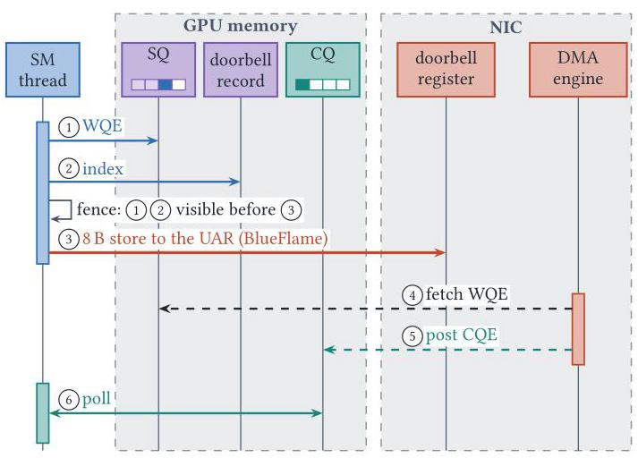
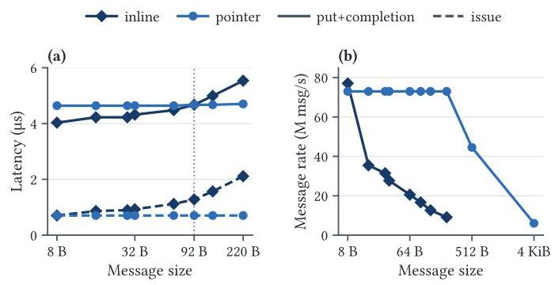
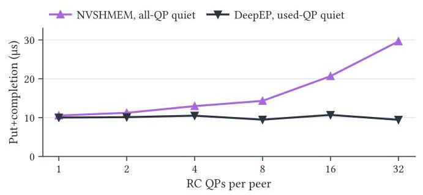
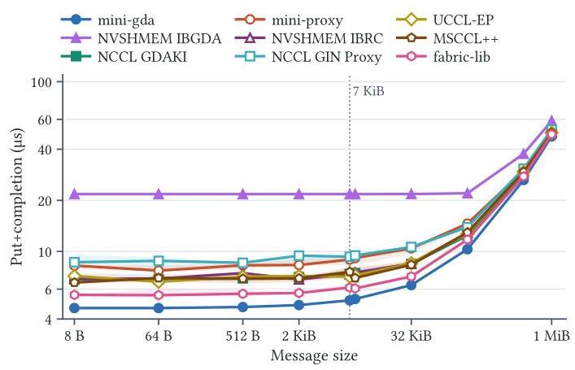

# GPU-Initiated Communication: Dissecting Down to the Bone

Javid Baydamirli

Koç University, Türkiye

jbaydamirli21@ku.edu.tr

Ismayil Ismayilov

fal

ismayil@fal.ai

Kaan Oktay

fal

kaan@fal.ai

Didem Unat

Koç University, Türkiye

dunat@ku.edu.tr

## Abstract

GPU-initiated communication lets GPU threads post RDMA operations directly to the NIC. It underpins NVSHMEM, NCCL GIN, and DeepEP, which serve the fine-grained, latency-critical communication of Mixture-of-Experts (MoE) models, yet its performance characteristics and optimizations remain scarcely documented beyond source code, and library comparisons fail to separate the costs of the hardware mechanism from those of the library around it.

> 
GPU 发起的通信 (GPU-initiated communication) 允许 GPU 线程将远程直接内存访问 (RDMA) 操作直接提交至网卡 (NIC)。它支撑着 NVSHMEM、NCCL GIN 和 DeepEP，这些库服务于混合专家 (Mixture-of-Experts, MoE) 模型的细粒度、延迟关键型通信，然而其性能特征与优化除了源代码之外鲜有文档记录，并且库之间的比较未能将硬件机制 (hardware mechanism) 的成本与围绕它的库的成本区分开来。

This paper dissects GPU-initiated communication at the GPU-NIC boundary. We first detail the GPU-side network path: queue placement, work-request construction, doorbell ordering, and completion semantics. We then introduce mini-gda and mini-proxy, minimal transports for the GPU and CPU-proxy submission paths, and measure them alongside NVSHMEM IBGDA, NCCL GIN, DeepEP, UCCL-EP, MSCCL++, and fabric-lib on NVIDIA H100, H200, B200, and GB200 platforms. A minimal GPU path issues an operation in ${0.7\mu }\mathrm{s}$ and completes in ${4.0\mu }\mathrm{s}$ ; libraries add up to ${4.6\mu }\mathrm{s}$ of issue time through queue management, memory ordering, and completion scope, and issue time scales with the SM clock. A tuned CPU proxy matches or beats the GPU path at idle, at the cost of a dedicated core whose operating state sets its latency and throughput. On either path, sharing a queue with bulk traffic raises latency by one to three orders of magnitude. Reaching the ${260}\mathrm{M}\mathrm{m}\mathrm{s}\mathrm{g}/\mathrm{s}$ ceiling of our InfiniBand platform requires doorbell batching and queue parallelism, and both have resource costs: communication code can reduce GPU block residency even when unused, and all-to-all traffic loses 59% of its NIC message rate at about 3,000 active connections. The submission path alone therefore does not predict communication performance. Our experiment code and results are available at https://github.com/ParCoreLab/Dissecting-GPU-Communication-Experiments.

> 
本文在 GPU 与网络接口卡 (NIC) 的边界处剖析 GPU 发起通信 (GPU-initiated communication)。我们首先详述 GPU 侧网络路径：队列放置 (queue placement)、工作请求构造 (work-request construction)、门铃顺序 (doorbell ordering) 以及完成语义 (completion semantics)。随后，我们介绍 mini-gda 和 mini-proxy，即用于 GPU 与 CPU 代理 (CPU-proxy) 提交路径的最小传输 (minimal transports)，并将它们与 NVSHMEM IBGDA、NCCL GIN、DeepEP、UCCL-EP、MSCCL++ 和 fabric-lib 一起在 NVIDIA H100、H200、B200 和 GB200 平台上测量。最小 GPU 路径可在 ${0.7\mu }\mathrm{s}$ 内发起一个操作 (operation)，并在 ${4.0\mu }\mathrm{s}$ 内完成；通过队列管理 (queue management)、内存排序 (memory ordering) 和完成范围 (completion scope)，库最多增加 ${4.6\mu }\mathrm{s}$ 的发起时间 (issue time)，并且发起时间随 SM 时钟 (SM clock) 缩放。经过调优的 CPU 代理 (CPU proxy) 在空闲时可匹配或优于 GPU 路径，但代价是需要一个专用核心 (dedicated core)，其运行状态 (operating state) 决定其延迟和吞吐。在任一路径上，与批量流量 (bulk traffic) 共享队列会使延迟提高一到三个数量级。要达到我们 InfiniBand 平台的 ${260}\mathrm{M}\mathrm{m}\mathrm{s}\mathrm{g}/\mathrm{s}$ 上限，需要门铃批处理 (doorbell batching) 和队列并行 (queue parallelism)，而两者都有资源成本：即使未被使用，通信代码也可能降低 GPU 块驻留 (GPU block residency)，并且在约 3,000 个活跃连接 (active connections) 时，全对全流量 (all-to-all traffic) 会损失其 NIC 消息速率的 59%。因此，仅凭提交路径 (submission path) 并不能预测通信性能 (communication performance)。我们的实验代码和结果可在 https://github.com/ParCoreLab/Dissecting-GPU-Communication-Experiments 获取。

## Keywords

GPU-initiated communication, GPU-initiated networking, RDMA, IBGDA, GDAKI, GPUDirect Async, CPU proxies, NVSHMEM, NCCL GIN, DeepEP, Mixture-of-Experts, expert parallelism, Infini-Band, ConnectX-7, performance characterization

> 
GPU发起的通信 (GPU-initiated communication)、GPU发起的网络 (GPU-initiated networking)、远程直接内存访问 (RDMA)、IBGDA、GDAKI、GPUDirect Async、中央处理器代理 (CPU proxies)、NVSHMEM、NCCL GIN、DeepEP、专家混合 (Mixture-of-Experts)、专家并行 (expert parallelism)、InfiniBand、ConnectX-7、性能表征 (performance characterization)

## 1 Introduction

Communication across GPUs has historically been managed by the CPU, where a host thread builds RDMA work requests, rings the NIC doorbell, and polls for completion. Modern GPU-initiated transports like IBGDA [32] and GDAKI [13] instead move this control to the GPU, enabling GPU threads to construct RDMA descriptors and ring NIC doorbells themselves, over PCIe. Workloads with irregular, latency-critical communication patterns benefit the most from this paradigm. In Mixture-of-Experts (MoE) models, GPU kernels decide which experts each token is sent to, so transfers are fine-grained and data-dependent, and network delay stalls the GPU directly [24, 53]. This pattern has motivated several specialized communication libraries like DeepEP [53] and pplx-kernels [25] that build on top of GPU-initiated NVSHMEM and NCCL GIN to reduce the latency of dispatch and combine kernels [24, 42]. Conversely, the same workload is also targeted by libraries that opt to keep the host on the communication path. UCCL-EP [31], pplx-garden/fabric-lib [26], and MSCCL++ PortChannel [17] forgo GPU submission to maintain cross-vendor GPU and NIC portability, while still reporting low latency with workload-specific proxy designs.

> 
跨 GPU 的通信历来由 CPU 管理：主机线程构建 RDMA 工作请求 (work requests)，按响 NIC 门铃 (doorbell)，并轮询完成 (completion)。诸如 IBGDA [32] 和 GDAKI [13] 之类的现代 GPU 发起的传输 (GPU-initiated transports) 则将这种控制权转移到 GPU，使 GPU 线程能够通过 PCIe 自行构造 RDMA 描述符 (descriptors) 并按响 NIC 门铃。具有不规则、对延迟至关重要的通信模式的工作负载从这一范式中获益最多。在混合专家 (Mixture-of-Experts, MoE) 模型中，GPU 内核决定每个词元 (token) 被发送到哪些专家 (experts)，因此传输是细粒度且数据依赖的，网络延迟会直接导致 GPU 停顿 [24, 53]。这一模式促使了若干专用通信库，如 DeepEP [53] 和 pplx-kernels [25]，它们构建在 GPU 发起的 NVSHMEM 和 NCCL GIN 之上，以降低分发 (dispatch) 和合并 (combine) 内核的延迟 [24, 42]。反过来，一些选择将主机保留在通信路径上的库也以相同的工作负载为目标。UCCL-EP [31]、pplx-garden/fabric-lib [26] 和 MSCCL++ PortChannel [17] 放弃 GPU 提交 (GPU submission)，以保持跨厂商 GPU 和 NIC 的可移植性，同时仍通过针对特定工作负载的代理 (proxy) 设计报告低延迟。

Published measurements favor each design on a different metric. Proxies report lower latency for a single unloaded operation, and GPU paths higher rates for concurrent small messages [13, 26, 32]. These studies [13, 17, 24, 31, 32, 53], however, typically evaluate libraries as a whole, conflating higher-level software wrappers with the underlying hardware mechanisms. A library-level comparison obscures whether the performance differences come from queue counts, batching strategies, memory fence strengths, or other API overheads, even when said libraries drive the same hardware interface. It may compare an implementation with a single queue against one with sixteen, or a completion over all available queues against one for a single peer.

> 
已发表的测量结果在不同指标上分别偏向不同设计。代理 (proxy) 在单个无负载操作 (unloaded operation) 上报告了更低的延迟 (latency)，而 GPU 路径 (GPU path) 在并发小消息 (concurrent small messages) 上报告了更高的速率 [13, 26, 32]。然而，这些研究 [13, 17, 24, 31, 32, 53] 通常将库作为整体进行评估，从而将更高层的软件封装 (software wrapper) 与底层硬件机制 (hardware mechanism) 混为一谈。库级比较 (library-level comparison) 会掩盖性能差异究竟来自队列数量 (queue count)、批处理策略 (batching strategy)、内存栅栏强度 (memory fence strength)，还是其他 API 开销 (API overhead)，即使这些库驱动的是同一硬件接口 (hardware interface)。它可能将一个使用单个队列 (queue) 的实现与一个使用十六个队列的实现进行比较，或者将覆盖所有可用队列 (available queue) 的完成 (completion) 与仅针对单个对端 (peer) 的完成进行比较。

We therefore isolate each mechanism from the libraries and ask three questions:

> 
因此，我们将每种机制与库隔离开来，并提出三个问题：

(1) What is the cost of a single operation? What does one GPU-initiated RDMA write cost, and how do WQE construction, queue management, memory ordering, completion scope, and the processor clock contribute?

> 
(1) 单次操作的成本是多少？一次 GPU 发起的 RDMA 写入 (GPU-initiated RDMA write) 的成本是多少，WQE 构造 (WQE construction)、队列管理 (queue management)、内存顺序 (memory ordering)、完成范围 (completion scope) 和处理器时钟 (processor clock) 分别如何造成影响？

(2) When does GPU or proxy submission perform better? How do proxy design choices such as workers, batching, and queue sharing dictate latency and throughput, and how do the two paths compare under different load conditions?

> 
(2) GPU 提交 (GPU submission) 或代理提交 (proxy submission) 何时性能更佳？诸如工作线程 (workers)、批处理 (batching) 和队列共享 (queue sharing) 等代理设计选择 (proxy design choices) 如何决定延迟和吞吐量？在不同负载条件下，这两条路径 (two paths) 相比如何？

(3) What sustains high message rates, and what does it cost? How do GPU threads, NIC queues, doorbell batching, and warp and SM placement contribute to throughput, and what do they cost in GPU block residency and NIC connection state?

> 
(3) 高消息速率 (message rate) 靠什么维持，代价是什么？GPU 线程 (GPU thread)、NIC 队列 (NIC queue)、门铃批处理 (doorbell batching) 以及线程束 (warp) 和 SM 放置 (SM placement) 如何影响吞吐量 (throughput)，并且它们在 GPU 块驻留 (GPU block residency) 和 NIC 连接状态 (NIC connection state) 方面的代价是什么？

To answer these questions, we implement two minimal transport drivers: mini-gda for the GPU-submission path, and mini-proxy for the CPU-proxy path. They perform only the steps the hardware requires and parametrize the design choices, which lets us evaluate each mechanism in isolation without an attached library. Alongside them, we evaluate several production libraries (Table 1) on NVIDIA H100, H200, B200, and GB200 platforms with ConnectX-7 NICs over InfiniBand and RoCEv2.

> 
为了回答这些问题，我们实现了两个最小传输驱动 (minimal transport driver)：用于 GPU 提交路径 (GPU-submission path) 的 mini-gda，以及用于 CPU 代理路径 (CPU-proxy path) 的 mini-proxy。它们只执行硬件所需的步骤，并将设计选择参数化，这使我们能够在不依赖附加库的情况下单独评估每种机制。与此同时，我们在配备 ConnectX-7 网卡 (NIC)、通过 InfiniBand 和 RoCEv2 互连的 NVIDIA H100、H200、B200 和 GB200 平台上，评估了若干生产级库 (production libraries)（表 1）。

Table 1: Queue, posting, and completion choices of the implementations we measure. Worker and queue counts are benchmark settings. PE: processing element (one GPU rank); DCI: dynamically connected initiator (§3.4); LL: DeepEP's low-latency kernels. Versions: NVSHMEM 3.4.5 and 3.7.2, NCCL 2.30.7 and 2.31.2 (Table 2), UCCL-EP a3d520e, MSCCL++ 6231b4f, fabric-lib 2446003.

> 
表 1：我们测量的各实现的队列 (queue)、提交 (posting) 与完成 (completion) 选择。工作线程 (worker) 和队列 (queue) 数量为基准设置。PE：处理单元 (processing element，一个 GPU rank)；DCI：动态连接发起端 (dynamically connected initiator，§3.4)；LL：DeepEP 的低延迟内核 (low-latency kernels)。版本：NVSHMEM 3.4.5 和 3.7.2，NCCL 2.30.7 和 2.31.2（表 2），UCCL-EP a3d520e，MSCCL++ 6231b4f，fabric-lib 2446003。

<table><tr><td>Implementation</td><td>Submitter</td><td>Queues and workers</td><td>Posting batch</td><td>Completion scope</td></tr><tr><td>NVSHMEM IBGDA</td><td>GPU</td><td>RC per peer or a shared DCI pool</td><td>default 32; earlier if alone</td><td>all configured QPs</td></tr><tr><td>DeepEP V1</td><td>GPU</td><td>LL kernels assign RC QPs to local experts</td><td>every 4th message per expert</td><td>one (peer, QP)</td></tr><tr><td>NCCL GIN GDAKI</td><td>GPU</td><td>explicit contexts with per-peer RC connections</td><td>caller-controlled aggregation</td><td>local or context flush</td></tr><tr><td>mini-gda</td><td>GPU</td><td>1-528 QPs, 1-16,384 threads</td><td>1-256 WQEs per doorbell</td><td>selected QP progress</td></tr><tr><td>NVSHMEM IBRC</td><td>one CPU proxy</td><td>one descriptor FIFO per PE</td><td>library-managed</td><td>proxy quiet</td></tr><tr><td>NCCL GIN Proxy</td><td>1-4 CPU workers</td><td>per-context descriptor rings</td><td>library-managed</td><td>context flush</td></tr><tr><td>UCCL-EP</td><td>1-8 CPU workers</td><td>8 FIFOs per worker; MSCCL++ FIFO backend</td><td>adaptive chains</td><td>channel local</td></tr><tr><td>MSCCL++</td><td>1-8 CPU services</td><td>one FIFO per service, 16 B entries</td><td>one request</td><td>service local</td></tr><tr><td>fabric-lib</td><td>one CPU/NIC</td><td>host-initiated native client in this study</td><td>up to four</td><td>transfer local</td></tr><tr><td>mini-proxy</td><td>1-8 CPU workers</td><td>1-32 host rings, 16 B entries</td><td>1-16</td><td>host or GPU counter</td></tr></table>

Our contributions are the following:

> 
我们的贡献如下：

- A mechanism-level description of the GPU-NIC boundary (§3), covering where GPU-resident RDMA queues live, how device code constructs work requests, and the doorbell, ordering, and completion semantics that libraries implement differently.

> 
- 对 GPU-NIC 边界 (GPU-NIC boundary) 的机制级描述（§3），涵盖 GPU 驻留的 RDMA 队列 (GPU-resident RDMA queues) 位于何处、设备代码 (device code) 如何构造工作请求 (work requests)，以及各库以不同方式实现的门铃 (doorbell)、排序 (ordering) 与完成 (completion) 语义。

- mini-gda and mini-proxy, two minimal transports that isolate the mechanism from the library, together with a microbenchmark suite built on them (§4). We release both as open source.

> 
- mini-gda 和 mini-proxy，这两种最小传输 (transport) 将机制与库隔离开来，以及一个基于它们构建的微基准测试套件 (microbenchmark suite)（§4）。我们将两者开源发布。

- An evaluation across NVIDIA H100, H200, B200, and GB200 platforms (§4) that quantifies single-operation cost, proxy trade-offs, message rate, and the resource costs of the transport, and identifies the configuration choices behind divergent performance across libraries.

> 
- 在 NVIDIA H100、H200、B200 和 GB200 平台上的评估（§4），量化了单次操作成本、代理 (proxy) 权衡、消息速率以及传输 (transport) 的资源成本，并识别出导致各库性能差异的配置选择。

The evaluation yields three main findings.

> 
评估得出三项主要发现。

(1) Software overhead and completion semantics determine single-operation latency. A minimal GPU path issues an $8\mathrm{\;B}$ write in ${0.7\mu }\mathrm{s}$ and completes in ${4.0\mu }\mathrm{s}$ . Communication libraries add varying costs on top through their queue handling, memory ordering, and completion scope: GDAKI takes ${1.6\mu }\mathrm{s}$ to issue and NVSHMEM’s public API ${5.3\mu }\mathrm{s}$ . Ordering scope alone changes issue time ${3.7} \times$ across safe configurations, and completing all configured queues doubles put+completion latency from 1 to 16 queues. Issue latency scales strongly with the SM clock.

> 
(1) 软件开销 (software overhead) 与完成语义 (completion semantics) 决定了单操作延迟 (single-operation latency)。最小 GPU 路径 (minimal GPU path) 在 ${0.7\mu }\mathrm{s}$ 内发出 $8\mathrm{\;B}$ 写入，并在 ${4.0\mu }\mathrm{s}$ 内完成。通信库 (communication library) 通过其队列处理 (queue handling)、内存排序 (memory ordering) 和完成范围 (completion scope) 在此之上增加不同程度的开销：GDAKI 发出需要 ${1.6\mu }\mathrm{s}$，NVSHMEM 的公共 API (public API) 需要 ${5.3\mu }\mathrm{s}$。仅排序范围 (ordering scope) 一项，就会在安全配置 (safe configurations) 之间使发出时间变化 ${3.7} \times$，而完成所有已配置队列 (configured queue) 会使 put+completion 延迟 (put+completion latency) 从 1 个队列到 16 个队列翻倍。发出延迟 (issue latency) 随 SM 时钟 (SM clock) 强烈成比例变化。

(2) GPU path vs. CPU proxy depends on latency, capacity, and isolation needs. A tuned proxy completes within ${0.07\mu }\mathrm{s}$ of the minimal GPU path and has a lower median round trip (5.9 vs. 6.9 μs), at the cost of a dedicated core whose operating state determines its results. Shared queues degrade under load for both submission paths: a proxy FIFO shared with bulk traffic reaches tens of milliseconds, and a reserved queue recovers one to two orders of magnitude. More workers and batching raise the proxy message rate, which stays well below IBGDA's on our InfiniBand platform but reaches ${90}\%$ of it on GB200. Every path except a cold IBRC proxy exceeds ${90}\%$ of line rate by $7\mathrm{{KiB}}$ , the size of a DeepSeek-V3 token's FP8 hidden state.

> 
（2）GPU 路径 (GPU path) 与 CPU 代理 (CPU proxy) 的取舍取决于延迟 (latency)、容量 (capacity) 和隔离 (isolation) 需求。经调优的代理 (tuned proxy) 的完成时间与最小 GPU 路径 (minimal GPU path) 相差在 ${0.07\mu }\mathrm{s}$ 以内，并具有更低的中位往返延迟 (median round trip)（5.9 vs. 6.9 μs），代价是需要一个专用核心 (dedicated core)，其运行状态 (operating state) 决定其结果。对于两种提交路径 (submission paths)，共享队列 (shared queues) 在负载下都会退化：与批量流量 (bulk traffic) 共享的代理 FIFO (proxy FIFO) 会达到数十毫秒，而预留队列 (reserved queue) 可恢复一到两个数量级。更多工作线程 (workers) 与批处理 (batching) 会提升代理消息速率 (proxy message rate)，该速率在我们的 InfiniBand 平台上仍远低于 IBGDA 的速率，但在 GB200 上达到其 ${90}\%$。除冷启动的 IBRC 代理 (cold IBRC proxy) 外，每条路径到 $7\mathrm{{KiB}}$ 时都超过线速 (line rate) 的 ${90}\%$，这正是一个 DeepSeek-V3 token 的 FP8 隐藏状态 (hidden state) 的大小。

(3) High message rates require queue scaling and doorbell batching, but both cost resources. One submitting thread posts 1.8 M msg/s. Cooperative publication lets a warp reach ${21.6}\mathrm{M}\mathrm{{msg}}/\mathrm{s}$ on one queue, and independent queues raise GPU submission throughput to ${260}\mathrm{M}\mathrm{{msg}}/\mathrm{s}$ . GPU submission is not required for this peak: a host thread ringing doorbells for GPU-built WQEs reaches 257-258 M msg/s. Communication code can cost up to 37% of a kernel's useful throughput even when dormant, by lowering block residency. At the NIC, active connections cost more when sending and receiving together: a send-only NIC keeps about ${242}\mathrm{M}\mathrm{{msg}}/\mathrm{s}$ through 32,768 active queues, while all-to-all traffic loses 59% of its rate near 3,000 connections, and Dynamically Connected (DC) transport does not remove this decline.

> 
(3) 高消息速率 (High message rates) 需要队列扩展 (queue scaling) 和门铃批处理 (doorbell batching)，但二者都会消耗资源。一个提交线程 (submitting thread) 的投递速率为 1.8 M msg/s。协作式发布 (cooperative publication) 使一个线程束 (warp) 在单个队列 (queue) 上达到 ${21.6}\mathrm{M}\mathrm{{msg}}/\mathrm{s}$，而独立队列 (independent queues) 将 GPU 提交吞吐量 (GPU submission throughput) 提升至 ${260}\mathrm{M}\mathrm{{msg}}/\mathrm{s}$。达到该峰值并不需要 GPU 提交 (GPU submission)：一个主机线程 (host thread) 为 GPU 构建的工作队列元素 (WQE) 敲响门铃 (doorbell)，即可达到 257-258 M msg/s。通信代码 (communication code) 即使处于休眠状态，也会通过降低线程块驻留 (block residency) 使内核 (kernel) 的有效吞吐量损失高达 37%。在网卡 (NIC) 处，同时发送和接收时，活跃连接 (active connections) 的代价更高：仅发送网卡 (send-only NIC) 在 32,768 个活跃队列 (active queues) 下仍能保持约 ${242}\mathrm{M}\mathrm{{msg}}/\mathrm{s}$，而全对全 (all-to-all) 流量在接近 3,000 个连接时损失 59% 的速率，并且动态连接 (Dynamically Connected, DC) 传输 (transport) 并不能消除这种下降。

Section 2 introduces GPU-initiated communication and the libraries we measure, Section 3 describes the GPU-NIC boundary, Section 4 presents the evaluation, Section 5 discusses related work, and Section 6 concludes with guidelines for library designers and benchmarkers.

> 
第 2 节介绍 GPU 发起通信 (GPU-initiated communication) 以及我们测量的库 (libraries)，第 3 节描述 GPU-NIC 边界 (GPU-NIC boundary)，第 4 节给出评估 (evaluation)，第 5 节讨论相关工作 (related work)，第 6 节以面向库设计者 (library designers) 和基准测试者 (benchmarkers) 的指南 (guidelines) 作结。

## 2 Background

GPUDirect. GPUDirect is a family of technologies that progressively removes the host from the networking path. GPUDirect RDMA [46] exposes GPU memory over PCIe for direct NIC access, removing host-side staging copies. GPUDirect Async [1] shifts synchronization onto the device, letting GPUs trigger and wait on communication pre-posted by the CPU. Its kernel-initiated successors, IBGDA [34] and GDAKI [13], move submission entirely into the kernel, enabling GPU threads to build queue elements, ring doorbells over PCIe, and poll completions natively.

> 
GPUDirect。GPUDirect 是一系列技术，逐步将主机 (host) 从网络路径 (networking path) 中移除。GPUDirect RDMA [46] 通过 PCIe 暴露 GPU 内存以供网络接口卡 (NIC) 直接访问，从而消除主机侧暂存副本 (host-side staging copies)。GPUDirect Async [1] 将同步 (synchronization) 转移到设备上，使 GPU 能够触发并等待由 CPU 预先投递 (pre-posted) 的通信。其内核发起 (kernel-initiated) 的后继者 IBGDA [34] 和 GDAKI [13] 将提交 (submission) 完全移入内核，使 GPU 线程能够构建队列元素 (queue elements)、通过 PCIe 敲响门铃 (doorbells)，并原生轮询完成项 (completions)。

Two auxiliary components are important to note: GDRCopy [39], which gives the CPU low-latency load/store access to GPU memory and underpins CPU-assisted proxy paths, and rdma-core's mlx5dv direct verbs [29], with which user space creates the queues, doorbell pages, and memory registrations that transport libraries place in GPU memory.

> 
有两个辅助组件 (auxiliary components) 值得注意：GDRCopy [39]，它使 CPU 能够以低延迟的加载/存储访问 (load/store access) 访问 GPU 内存 (GPU memory)，并支撑 CPU 辅助代理路径 (CPU-assisted proxy paths)；以及 rdma-core 的 mlx5dv direct verbs [29]，用户空间 (user space) 借此创建队列 (queues)、门铃页 (doorbell pages) 和内存注册 (memory registrations)，传输库 (transport libraries) 会将这些放置到 GPU 内存中。

RDMA Communication. RDMA communication is organized around Queue Pairs (QPs), each consisting of a Send Queue (SQ) and a Receive Queue (RQ), both structured as circular rings of Work Queue Elements (WQEs). Send and receive completions are directed to completion queues (CQs), which can be distinct or shared with other QPs. The NIC reports a finished signaled WQE by writing a completion queue entry (CQE), while unsignaled WQEs produce no CQE of their own.

> 
RDMA 通信 (RDMA Communication)。RDMA 通信围绕队列对 (Queue Pairs, QPs) 组织，每个队列对由一个发送队列 (Send Queue, SQ) 和一个接收队列 (Receive Queue, RQ) 组成，二者都构造为工作队列元素 (Work Queue Elements, WQEs) 的环形结构。发送完成和接收完成会被导向完成队列 (completion queues, CQs)，这些完成队列可以是独立的，也可以与其他 QP 共享。NIC 通过写入完成队列条目 (completion queue entry, CQE) 来报告已完成的带信号 WQE (signaled WQE)，而无信号 WQE (unsignaled WQEs) 不会产生自身的 CQE。

Figure 1: The GPU-submitted path with GPU-resident queues and in-kernel WQE construction. In a CPU-proxy path the host performs (1)-(3) and (6), and the GPU instead enqueues a request descriptor.

> 
图 1：GPU 提交路径 (GPU-submitted path)，其队列驻留于 GPU (GPU-resident queues)，并在内核内构造 WQE (in-kernel WQE construction)。在 CPU 代理路径 (CPU-proxy path) 中，主机执行 (1)-(3) 和 (6)，而 GPU 则改为将请求描述符 (request descriptor) 入队。

Communication Control vs. Submission. We distinguish the agent that semantically decides what to communicate from the agent that physically submits work to the network [51]. The operation is initiated either by a CPU call (host-initiated), as in classic MPI/NCCL collectives, or by device code (GPU-initiated). A GPU-initiated operation may then be GPU-submitted, where the GPU writes the doorbell itself, or proxy-submitted, where the request is forwarded to a CPU proxy thread. Additionally, WQEs can be constructed either by the CPU or the GPU, irrespective of the submitter: some implementations delegate only the doorbell submission to the CPU to bypass platform limitations (§3.1).

> 
通信控制与提交 (Communication Control vs. Submission)。我们区分在语义上决定要通信什么的主体 (agent) 和物理上将工作提交到网络的主体 [51]。该操作要么由 CPU 调用 (CPU call) 发起（主机发起，host-initiated），如经典 MPI/NCCL 集合通信 (collectives) 中那样；要么由设备代码 (device code) 发起（GPU 发起，GPU-initiated）。一次 GPU 发起的操作随后可由 GPU 提交 (GPU-submitted)，此时 GPU 自行写门铃 (doorbell)；也可由代理提交 (proxy-submitted)，此时请求被转发到 CPU 代理线程 (CPU proxy thread)。此外，无论提交者是谁，WQE 都可由 CPU 或 GPU 构造：一些实现仅将门铃提交委托给 CPU，以绕过平台限制 (platform limitations)（§3.1）。

Table 1 summarizes the queue, posting, and completion choices of the GPU-submitted and proxy-submitted libraries we use in our evaluation.

> 
表1总结了我们评估中使用的GPU提交和代理提交库的队列、提交和完成选择。

## 3 The GPU-NIC Boundary

A network transfer requires NIC queues the submitter can reach, WQE construction, ordered doorbell updates, and completion polling (Figure 1), which we explain in turn. Libraries implement each step differently, and we measure the respective costs of each choice in Section 4.

> 
一次网络传输 (network transfer) 需要提交方可访问的网卡 (NIC) 队列、工作队列元素 (WQE) 构造、有序门铃 (doorbell) 更新以及完成轮询 (completion polling)（图 1），我们将依次说明这些步骤。不同库对每个步骤的实现方式不同，我们将在第 4 节测量每种选择各自的开销。

### 3.1 Memory geography

In traditional CPU-side RDMA, the SQ and RQ WQE buffers, the completion queue, and the doorbell record typically live in host memory. As GPU submission requires device access to these RDMA queues, implementations like IBGDA and GDAKI allocate them in GPU-accessible memory (typically with cudaMalloc), where SMs populate and modify them with loads and stores. The NIC reaches the buffers through GPUDirect RDMA mappings established at registration time with nvidia-peermem or DMA-BUF [35, 44].

> 
在传统的 CPU 侧 RDMA (CPU-side RDMA) 中，发送队列 (SQ) 和接收队列 (RQ) 的工作队列元素 (WQE) 缓冲区、完成队列 (completion queue) 以及门铃记录 (doorbell record) 通常位于主机内存 (host memory) 中。由于 GPU 提交 (GPU submission) 需要设备访问这些 RDMA 队列，IBGDA 和 GDAKI 等实现会将它们分配在 GPU 可访问内存 (GPU-accessible memory) 中（通常使用 cudaMalloc），由流式多处理器 (SM) 通过加载和存储 (loads and stores) 来填充和修改。网卡 (NIC) 通过注册时使用 nvidia-peermem 或 DMA-BUF 建立的 GPUDirect RDMA 映射来访问这些缓冲区 [35, 44]。

Figure 2: ml x5 send WQEs for an RDMA write, built from 16 B segments (ctrl: control, AV: address vector, raddr: remote address) and fetched in 64 B basic blocks. Only DC WQEs carry the AV (§3.4). An inline payload replaces the data segment's pointer with a length word and the payload. The bottom row expands the control segment; the doorbell store carries its first 8 B.

> 
图 2：用于远程直接内存访问 (RDMA) 写的 ml x5 发送工作队列元素 (WQE)，由 16 B 段构建（ctrl：控制 (control)，AV：地址向量 (address vector)，raddr：远程地址 (remote address)），并以 64 B 基本块取回。只有动态连接 (DC) 的 WQE 携带 AV (§3.4)。内联载荷 (inline payload) 将数据段的指针替换为长度字和载荷。底行展开控制段；门铃存储 (doorbell store) 携带其前 8 B。

While the queues can live in any memory subsystem the NIC can reach by DMA, the doorbell register cannot be freely moved. It is a hardware register inside a User Access Region (UAR), which is a slice of the NIC's PCIe BAR through which user-space processes submit doorbells. The UAR must be mapped into the GPU's virtual address space for kernels to submit doorbells directly. This is achieved by allocating the UAR with m1x5dv_devx_alloc_uar, and registering its BAR page with the CUDA driver as I/O memory (cuMemHostRegister), which can then be used as an opaque device pointer that SMs can store to (cuMemHostGetDevicePointer) [44].

> 
虽然队列 (queue) 可以驻留在网卡 (NIC) 可通过直接内存访问 (DMA) 到达的任何内存子系统 (memory subsystem) 中，但门铃寄存器 (doorbell register) 不能被随意移动。它是用户访问区域 (User Access Region, UAR) 内的硬件寄存器 (hardware register)，而 UAR 是网卡的 PCIe 基地址寄存器 (PCIe BAR) 的一个片段，用户态进程 (user-space process) 通过它提交门铃 (doorbell)。UAR 必须映射到 GPU 的虚拟地址空间 (virtual address space) 中，以便内核 (kernel) 直接提交门铃。这通过使用 m1x5dv_devx_alloc_uar 分配 UAR，并将其 BAR 页作为 I/O 内存 (I/O memory) 注册到 CUDA 驱动程序 (CUDA driver) (cuMemHostRegister) 来实现；随后可将其用作不透明的设备指针 (opaque device pointer)，流式多处理器 (SM) 可以对其执行存储 (store to) (cuMemHostGetDevicePointer) [44]。

Mapping a third-party PCIe BAR into GPU address space is a potential security hazard, and the NVIDIA kernel module permits it only with the option PeerMappingOverride=1 [23]. DMA-BUF registration lets the NIC access GPU memory but does not by itself establish this reverse mapping [44]. NVSHMEM's CPU-assisted mode keeps GPU-built WQEs and has a host thread forward the doorbell value to the UAR for systems where the mapping is disallowed [23].

> 
将第三方 PCIe 基址寄存器 (PCIe BAR) 映射到 GPU 地址空间是一种潜在的安全隐患，NVIDIA 内核模块 (NVIDIA kernel module) 仅在选项 PeerMappingOverride=1 下才允许这样做 [23]。DMA-BUF 注册 (DMA-BUF registration) 让网卡 (NIC) 能够访问 GPU 内存，但其本身并不会建立这种反向映射 (reverse mapping) [44]。对于不允许该映射的系统，NVSHMEM 的 CPU 辅助模式 (CPU-assisted mode) 会保留由 GPU 构建的工作队列元素 (WQE)，并让主机线程 (host thread) 将门铃值 (doorbell value) 转发到用户访问区域 (UAR) [23]。

### 3.2 Work requests, submission, and doorbell semantics

WQE anatomy. An mlx5 send WQE is a concatenation of 16-byte segments packed into 64-byte basic blocks, shown in Figure 2 for an RDMA write. The payload can either be named by the data segment or packed directly into the WQE, trading the NIC's DMA read of the payload for a larger WQE (§4.1). DC transports additionally include an address-vector segment to identify the dynamically connected target (DCT).

> 
工作队列元素 (WQE) 剖析。一个 mlx5 发送 WQE 是由 16 字节段拼接而成，并被打包进 64 字节基本块；图 2 以 RDMA 写 (RDMA write) 为例展示了这一点。有效载荷 (payload) 既可以由数据段 (data segment) 指定，也可以直接打包进 WQE，从而以更大的 WQE 为代价省去网络接口卡 (NIC) 对有效载荷的直接内存访问 (DMA) 读取（§4.1）。动态连接传输 (DC) 还额外包含一个地址向量段 (address-vector segment)，用于标识动态连接目标 (DCT)。

Submission. Doorbell posting is a two-step process. First, the submitting thread updates the doorbell record (dbrec) with the index of the next free WQE basic block, which the NIC reads to get the number of posted WQEs [33]. The thread then performs an ordered 64-bit store to the doorbell register on the UAR to notify the NIC of available work. The doorbell store carries the first 8 bytes of the WQE's control segment, which pack the WQE index and the QP number.

> 
提交 (Submission)。门铃提交 (doorbell posting) 是一个两步过程。首先，提交线程用下一个空闲的工作队列元素 (WQE) 基本块的索引更新门铃记录 (doorbell record, dbrec)，网络接口卡 (NIC) 读取该记录以获取已提交 WQE 的数量 [33]。然后，该线程对用户访问区域 (UAR) 上的门铃寄存器 (doorbell register) 执行一次有序的 64 位存储，以通知 NIC 有可用工作。门铃存储携带 WQE 控制段 (control segment) 的前 8 个字节，其中打包了 WQE 索引和队列对 (QP) 编号。

The doorbell targets the UAR's send-doorbell/BlueFlame region. WQEs can either be copied into the BlueFlame buffer via write-combining stores, or DMA-fetched by the NIC separately. Inline copying inflates the MMIO write payload of the doorbell, whereas NIC fetching preserves a fixed doorbell size regardless of message length. Every GPU-side implementation we evaluate opts for fixed-size notifications and NIC-fetched WQEs [10, 37, 43], whereas host-side rdma-core inline-copies small WQEs into the BlueFlame buffer [28].

> 
门铃 (doorbell) 指向用户访问区域 (UAR) 的发送门铃 (send-doorbell)/BlueFlame 区域。工作队列元素 (WQE) 既可以通过写合并存储 (write-combining stores) 复制到 BlueFlame 缓冲区，也可以由网络接口卡 (NIC) 单独通过直接内存访问 (DMA) 获取。内联复制会增大门铃的内存映射 I/O (MMIO) 写负载，而 NIC 获取则无论消息长度如何都保持固定的门铃大小。我们评估的每个 GPU 侧实现都选择固定大小通知和由 NIC 获取的 WQE [10, 37, 43]，而主机侧 rdma-core 则会将小型 WQE 内联复制到 BlueFlame 缓冲区 [28]。

Doorbell Batching. Announcing several WQEs with one doorbell raises throughput, with a possible latency penalty if submitters wait to form batches. The mechanism has been studied for CPU-side RDMA [20], and GPU libraries make use of the same optimization. NVSHMEM defers the doorbell until a configured number of WQEs is ready (default 32), but posts isolated operations immediately [43, 45]. NCCL GDAKI exposes caller-controlled aggregation through its device API and DOCA posting path [37, 41], and DeepEP's low-latency kernels ring on every fourth message of an expert's queue [10]. The batch a library achieves therefore depends on how many threads post at once and in what order they publish, not only on its threshold. We measure the effects of batching in Section 4.3.1.

> 
门铃批处理 (Doorbell Batching)。用一个门铃 (doorbell) 通知若干工作队列元素 (WQE) 可提高吞吐量；但如果提交者等待组成批次，则可能带来延迟惩罚。该机制已在 CPU 侧远程直接内存访问 (RDMA) 中被研究 [20]，GPU 库也利用了同样的优化。NVSHMEM 会推迟门铃，直到配置数量的 WQE 就绪（默认 32），但会立即提交单独操作 [43, 45]。NCCL GDAKI 通过其设备 API 和 DOCA 提交路径暴露调用方控制的聚合 [37, 41]，而 DeepEP 的低延迟内核会在某个专家 (expert) 队列的每第四条消息上触发门铃 [10]。因此，一个库所达到的批处理取决于有多少线程同时提交以及它们以什么顺序发布，而不仅仅取决于其阈值。我们在 4.3.1 节测量批处理的效果。

Sharing a QP. Threads can share a QP by reserving consecutive WQE slots, building their WQEs in parallel, and publishing them in reservation order before one doorbell announces them. Publication is serialized: a thread cannot publish past an unfinished predecessor, so lanes that drift apart wait for each other. Cooperative publication avoids this by letting a warp reserve, build, and publish its WQEs together, paying the reservation and the doorbell once per warp [37, 43]. Section 4.3.1 compares these strategies.

> 
共享一个队列对 (QP)。线程可以通过预留连续的工作队列元素 (WQE) 槽位、并行构建各自的 WQE，并在单个门铃 (doorbell) 通告它们之前按预留顺序发布这些 WQE，从而共享一个队列对 (QP)。发布 (publication) 是串行化的：线程不能越过尚未完成的前驱进行发布，因此发生偏移的通道 (lane) 会互相等待。协作式发布 (cooperative publication) 通过让一个线程束 (warp) 一起预留、构建并发布其 WQE，从而避免了这一点，每个线程束只需支付一次预留和门铃 (doorbell) 开销 [37, 43]。第 4.3.1 节比较了这些策略。

Ordering. Correct GPU-side RDMA delivery hinges on two ordering requirements: (1) WQE and source-payload stores must be visible to the NIC before the doorbell that announces them; and (2) when one thread rings the doorbell for WQEs that other threads wrote, each writer's stores must be visible before the ringing thread sees its slot as ready. NVSHMEM implements both with plain stores by default, each preceded by __threadfence() (__threadfence_system() when the queues reside in host memory). When built without host-side queue support ${}^{1}$ , it instead uses GPU-scope release stores ${}^{2}$ on the doorbell path. NCCL’s bundled DOCA implementation supports a GPU-scope release fence followed by a relaxed MMIO store, along with architecture and scope-dependent alternatives [37]. We measure the cost of each of these orderings in Section 4.1.

> 
顺序性 (Ordering)。正确的 GPU 侧远程直接内存访问 (RDMA) 交付取决于两个顺序性要求：（1）工作队列元素 (WQE) 和源载荷 (source-payload) 存储必须在宣告它们的门铃 (doorbell) 之前对网络接口卡 (NIC) 可见；（2）当一个线程为其他线程写入的 WQE 敲响门铃 (doorbell) 时，在敲铃线程 (ringing thread) 看到其槽位 (slot) 就绪之前，每个写入者的存储操作都必须可见。NVSHMEM 默认使用普通存储 (plain stores) 实现二者，每个存储之前都先有 __threadfence()（当队列驻留在主机内存中时为 __threadfence_system()）。当在不带主机侧队列支持 ${}^{1}$ 的情况下构建时，它在门铃 (doorbell) 路径上转而使用 GPU 作用域 (GPU-scope) 释放存储 (release stores) ${}^{2}$。NCCL 捆绑的 DOCA 实现支持 GPU 作用域 (GPU-scope) 释放栅栏 (release fence)，后跟一次宽松的内存映射 I/O (MMIO) 存储 (relaxed MMIO store)，以及依赖于架构和作用域的替代方案 [37]。我们在第 4.1 节中测量这些顺序性 (ordering) 各自的成本。

### 3.3 The completion path

Upon executing a signaled WQE, the NIC writes a CQE that identifies the completed work and reports its status. Because send queues are strictly ordered, a single CQE implicitly retires all preceding unsignaled WQEs on the same queue [27, 28]. GPU threads poll the CQ ring to consume these entries, but completion scope varies across libraries. NVSHMEM's quiet walks all configured RC QPs and the DCI pool, while DeepEP V1 polls a selected (peer, QP), usually one QP per local expert [10, 43]. NCCL GIN's flushAsync and wait complete one peer on one context, while flush covers the context's pending transfers for the participating threads [40]. We measure the cost of the completion scope in Section 4.1.

> 
在执行带信号的工作队列元素 (signaled WQE) 后，网卡 (NIC) 会写入一个完成队列条目 (CQE)，用于标识已完成的工作并报告其状态。由于发送队列 (send queue) 严格有序，单个 CQE 会隐式完成同一队列上所有先前的未带信号工作队列元素 (unsignaled WQE) [27, 28]。GPU 线程轮询完成队列环 (CQ ring) 以消费这些条目，但完成范围 (completion scope) 因库而异。NVSHMEM 的 quiet 会遍历所有已配置的可靠连接队列对 (RC QP) 和 DCI 池 (DCI pool)，而 DeepEP V1 则轮询一个选定的 (对等端 (peer), QP)，通常每个本地专家 (local expert) 一个 QP [10, 43]。NCCL GIN 的 flushAsync 和 wait 在一个上下文 (context) 上完成一个对等端 (peer)，而 flush 覆盖参与线程 (participating threads) 在该上下文中的待处理传输 (pending transfers) [40]。我们在第 4.1 节测量完成范围的开销。

The NIC writes both remote payloads and local CQEs into GPU memory by DMA, and an SM accessing them observes them within the GPU memory hierarchy. Under its relaxed memory model, a thread that observes a given CQE - or any arbitrary flag in memory - is not thereby guaranteed to observe the payload written before it. Libraries handle this in their wait and signal primitives, and user code that polls raw memory must also handle it for correctness. This is a common hazard for persistent kernels, which lack the implicit synchronization of a kernel-launch boundary [14, 19, 49, 51], and for barrier-free NVLink collectives, which avoid it by writing the flag and the data in one atomic store [47].

> 
网卡 (NIC) 通过直接内存访问 (DMA) 将远端有效载荷 (payload) 和本地完成队列条目 (CQE) 写入 GPU 内存，而流式多处理器 (SM) 访问它们时，会在 GPU 内存层次结构中观察到它们。在其宽松内存模型 (relaxed memory model) 下，观察到某个给定 CQE——或内存中任意标志 (flag)——的线程并不因此保证能观察到在其之前写入的有效载荷 (payload)。库在其等待和信号原语 (wait and signal primitives) 中处理这一点，而轮询原始内存的用户代码也必须为正确性处理这一点。对于持久内核 (persistent kernel) 来说，这是一种常见隐患，因为它们缺乏内核启动边界 (kernel-launch boundary) 的隐式同步 [14, 19, 49, 51]；对于无屏障 NVLink 集合通信 (barrier-free NVLink collectives) 也是如此，后者通过在一次原子存储 (atomic store) 中写入标志和数据来避免这一点 [47]。

### 3.4 Transport choice

The transport decision influences both communication latency and scalability. Reliable Connection (RC) transport binds each local QP to one remote QP at creation time. Pre-establishing this connection eliminates the need to specify destination addresses in individual send WQEs, but forces each peer to establish a dedicated QP for every other remote endpoint. With parallel submitters needed to saturate the NIC (§4.3.1), RC QPs may be allocated per GPU, CTA, or warp, growing the local QP state. The associated QP contexts, CQs, WQEs, and memory translations occupy NIC caches and host-backed state, and poor locality across them reduces message rate [21]. Section 4.3.3 measures this for GPU-driven traffic.

> 
传输决策 (transport decision) 同时影响通信延迟和可扩展性。可靠连接 (Reliable Connection, RC) 传输在创建时将每个本地队列对 (Queue Pair, QP) 绑定到一个远程 QP。预先建立该连接消除了在各个发送工作队列元素 (Work Queue Element, WQE) 中指定目标地址的需要，但迫使每个对等端为其他每个远程端点建立专用 QP。由于需要并行提交者来饱和网卡 (NIC)（§4.3.1），RC QP 可能按 GPU、CTA 或 warp 分配，从而增大本地 QP 状态。相关的 QP 上下文、完成队列 (Completion Queue, CQ)、WQE 和内存转换 (memory translation) 会占用 NIC 缓存和主机侧支撑状态 (host-backed state)，而它们之间较差的局部性会降低消息速率 [21]。第 4.3.3 节针对 GPU 驱动的流量对此进行了测量。

Dynamically Connected (DC) transport, by contrast, lets a pool of dynamically connected initiators (DCIs) address many remote DC targets (DCTs). This reduces the number of initiator QPs at the cost of an additional WQE segment in each send. Each DC send WQE carries an address vector of 16 B (48 B on HCAs without the compact form [29]) identifying its destination. Changing a DCI's destination may incur additional work on the NIC [38, 43]. Section 4.3.3 measures both costs. The same per-peer state pressure has motivated transport redesigns beyond InfiniBand: the Ultra Ethernet Transport replaces the long-lived per-peer connection state of RC with packet-delivery contexts that are established and released on demand [50].

> 
动态连接 (Dynamically Connected, DC) 传输则允许一组动态连接发起方 (Dynamically Connected Initiator, DCI) 寻址许多远程动态连接目标 (Dynamically Connected Target, DCT)。这减少了发起方队列对 (Queue Pair, QP) 的数量，代价是每次发送增加一个工作队列元素 (Work Queue Element, WQE) 段。每个 DC 发送 WQE 携带一个 16 B 的地址向量 (address vector)（在未采用紧凑形式 [29] 的主机通道适配器 (Host Channel Adapter, HCA) 上为 48 B），用于标识其目的地。更改 DCI 的目的地可能会在网络接口卡 (Network Interface Card, NIC) 上引入额外工作 [38, 43]。第 4.3.3 节测量了这两种成本。同样的每对等端状态压力也推动了 InfiniBand 之外的传输重新设计：超以太网传输 (Ultra Ethernet Transport) 用按需建立和释放的分组投递上下文 (packet-delivery context) 取代了可靠连接 (Reliable Connection, RC) 中长期存在的每对等端连接状态 [50]。

## 4 Mechanism Evaluation

We organize the experiments and evaluations around the three questions introduced in Section 1.

> 
我们围绕第 1 节中提出的三个问题来组织实验和评估。

Minimal Implementations. We implement two minimal paths to accompany the production libraries listed in Table 1. mini-gda is a GPU-initiated communication implementation with GPU-resident NIC queues and the doorbell register mapped into GPU address space. GPU threads construct WQEs, update queue state, ring the doorbell, and poll completions, without a surrounding library. Ordering is selected at build time, and payload placement, queue count, and doorbell batching are launch parameters. mini-proxy is a proxy implementation where GPU threads write 16 B request descriptors into rings in host memory, from which CPU workers construct RDMA writes and submit them through ibverbs. Worker count, ring count, and the number of requests submitted together are configurable. We measure DeepEP V1, whose device path uses NVSHMEM. DeepEP V2 replaces the NVSHMEM backend with NCCL GIN; since we measure GIN's GDAKI path directly, the two cover both DeepEP backends at the mechanism level. Platforms. Table 2 shows the platforms used in our evaluation. P-IB is the primary platform for GPU-submitted networking and the proxy comparison. P-RoCE is used for the SM-clock and completion-scope experiments, as well as cross-platform controls. P-H100 is a larger cluster without NIC doorbell mapping support used for active-connection experiments. P-GB200 is a Grace-Blackwell system with coherent memory between the CPU and the GPU, where host rings and counters used by proxies travel over NVLink-C2C rather than PCIe. We repeat the one-operation and proxy experiments on P-GB200 with one GPU and one NIC per node. We use 8 B operations to expose per-operation control costs, then increase payload size to identify when link bandwidth dominates.

> 
最小实现 (Minimal Implementations)。我们实现两条最小路径 (minimal paths)，以配套表 1 中列出的生产库 (production libraries)。mini-gda 是一种 GPU 发起的通信 (GPU-initiated communication) 实现，具有驻留在 GPU 上的 NIC 队列 (GPU-resident NIC queues)，并将门铃寄存器 (doorbell register) 映射到 GPU 地址空间。GPU 线程构造 WQE，更新队列状态，敲响门铃 (ring the doorbell)，并轮询完成 (poll completions)，无需外围库 (surrounding library)。顺序 (Ordering) 在构建时选择，而负载放置 (payload placement)、队列数量 (queue count) 和门铃批处理 (doorbell batching) 是启动参数 (launch parameters)。mini-proxy 是一种代理实现 (proxy implementation)，其中 GPU 线程将 16 B 请求描述符 (request descriptors) 写入主机内存中的环形缓冲区 (rings)，CPU 工作线程 (CPU workers) 从这些环形缓冲区构造 RDMA 写 (RDMA writes)，并通过 ibverbs 提交。工作线程数量、环形缓冲区数量和一起提交的请求数量均可配置。我们测量 DeepEP V1，其设备路径 (device path) 使用 NVSHMEM。DeepEP V2 用 NCCL GIN 替换 NVSHMEM 后端 (backend)；由于我们直接测量 GIN 的 GDAKI 路径，二者在机制层面 (mechanism level) 覆盖了 DeepEP 的两个后端。平台 (Platforms)。表 2 显示了评估中使用的平台。P-IB 是用于 GPU 提交网络 (GPU-submitted networking) 和代理比较 (proxy comparison) 的主要平台。P-RoCE 用于 SM 时钟 (SM-clock) 和完成范围 (completion-scope) 实验，以及跨平台对照 (cross-platform controls)。P-H100 是一个更大的集群，不支持 NIC 门铃映射 (NIC doorbell mapping)，用于活动连接 (active-connection) 实验。P-GB200 是一个 Grace-Blackwell 系统，CPU 与 GPU 之间具有一致内存 (coherent memory)，其中代理使用的主机环形缓冲区 (host rings) 和计数器 (counters) 通过 NVLink-C2C 而不是 PCIe 传输。我们在 P-GB200 上重复单操作 (one-operation) 和代理实验，每个节点一个 GPU 和一个 NIC。我们使用 8 B 操作来暴露每操作控制成本 (per-operation control costs)，然后增加负载大小 (payload size)，以确定链路带宽 (link bandwidth) 何时占主导。

---

${}^{1}$ NVSHMEM_IBGDA_SUPPORT_GPUMEM_ONLY=ON

> 
${}^{1}$ NVSHMEM_IBGDA_SUPPORT_GPUMEM_ONLY=ON

${}^{2}$ PTX st.release.gpu.global.L1: :no_allocate

> 
${}^{2}$ PTX st.release.gpu.global.L1: :no_allocate

---

Table 2: Evaluation platforms.

> 
表2：评估平台。

<table><tr><td></td><td>P-IB</td><td>P-RoCE</td><td>P-H100</td><td>P-GB200</td></tr><tr><td>Nodes $\times$ GPUs</td><td>4 × 4 H200</td><td>2 × 8 B200</td><td>${100} \times  4\mathrm{H}{100}$</td><td>2 × 1 GB200</td></tr><tr><td>CPU</td><td>Xeon 6548Y+</td><td>Xeon 8581C</td><td>Xeon 8460Y+</td><td>Grace</td></tr><tr><td>NICs / node</td><td>4×CX-7</td><td>8×CX-7</td><td>4×CX-7</td><td>1×CX-7</td></tr><tr><td>Link</td><td>200 Gb/s IB</td><td>400 Gb/s RoCEv2</td><td>200 Gb/s IB</td><td>400 Gb/s IB</td></tr><tr><td>Driver / CUDA</td><td>580.95 / 13.0</td><td>590.48 / 13.2</td><td>595.71 / 12.6</td><td>580.159 / 13.0</td></tr><tr><td>NVSHMEM</td><td>3.4.5 / 3.7.2</td><td>3.7.2</td><td>3.4.5 / 3.7.2</td><td>3.7.2</td></tr><tr><td>NCCL</td><td>2.30.7 / 2.31.2</td><td>2.31.2</td><td>-</td><td>2.31.2</td></tr><tr><td>Doorbell writer</td><td>GPU</td><td>GPU</td><td>host thread</td><td>GPU</td></tr></table>

Timing and Validation. We time in-kernel operations with globaltimer and use clock64 to record the effective SM clock. End-to-end measurements use CUDA events. We validate payloads after each run and, where applicable, check NIC counters against the expected traffic, including protocol overhead (Appendix A).

> 
计时与验证 (Timing and Validation)。我们使用 globaltimer 对内核内 (in-kernel) 操作计时，并使用 clock64 记录有效 SM 时钟 (SM clock)。端到端测量使用 CUDA 事件 (CUDA events)。我们在每次运行后验证有效载荷 (payload)，并在适用时根据预期流量检查 NIC 计数器 (NIC counters)，包括协议开销 (protocol overhead)（附录 A）。

Proxy Clock State. On P-IB, CPU-proxy latency and rate depend on host operating state. We compare cold workers after ${45}\mathrm{\;s}$ idle with warm workers after ${20}\mathrm{\;s}$ of sustained load; telemetry shows base and turbo clocks, respectively. P-IB proxy tables report cold values unless marked; Appendix C. 1 gives both states.

> 
代理时钟状态 (Proxy Clock State)。在 P-IB 上，CPU 代理 (CPU proxy) 的延迟与速率取决于主机运行状态。我们比较空闲 ${45}\mathrm{\;s}$ 后的冷工作进程 (cold worker) 与持续负载 ${20}\mathrm{\;s}$ 后的热工作进程 (warm worker)；遥测分别显示基础时钟 (base clock) 与加速时钟 (turbo clock)。P-IB 代理表报告冷状态值，除非另有标记；附录 C. 1 给出了两种状态。

Pairs and Placement. Unless stated otherwise, latencies are p50 over three independent process runs on one pinned pair of nodes, using the NIC attached to the GPU's PCIe switch.

> 
节点对与部署。除非另有说明，延迟为在固定的一对节点上进行三次独立进程运行所测得的 p50 (p50)，使用连接至 GPU 的 PCIe 交换机 (PCIe switch) 的 NIC (NIC)。

### 4.1 The cost of one operation

Question. What does one GPU-initiated RDMA write cost the issuing thread, how much of that is the mechanism and how much the library, and how does handing the operation to a CPU proxy compare?

> 
问题。一次 GPU 发起的 RDMA 写入 (GPU-initiated RDMA write) 会给发起线程 (issuing thread) 带来多少开销，其中多少来自机制 (mechanism)、多少来自库 (library)，以及将操作交给 CPU 代理 (CPU proxy) 相比如何？

Setup. One GPU thread issues 8 B puts to a remote processing element (PE), with at most one outstanding put. We time the following:

> 
设置。一个 GPU 线程向远程处理单元 (processing element, PE) 发出 8 B 的 put，且最多只有一个未完成的 put。我们测量以下内容的时间：

- Issue: Time the GPU thread spends submitting the put, including WQE construction, queue management, ordering, and doorbell stores. Completion time is excluded.

> 
- 发起 (Issue)：GPU 线程提交 put 所花费的时间，包括 WQE 构建、队列管理、排序和 doorbell 写入。完成时间不包括在内。

- Put+completion: Issue and completion-routine return, including polling, ordering, and queue updates.

> 
- Put+completion（放置+完成）：发出与完成例程返回，包括轮询 (polling)、排序 (ordering) 和队列更新 (queue updates)。

- Round trip: Time to send a request and observe the remote GPU's reply.

> 
- 往返 (round trip)：发送请求并观察到远程 GPU 回复所需的时间。

Table 3: One 8 B operation. Completion is one CQE for mini-gda, a host-resident counter for the baseline mini-proxy, and a GPU-resident counter written through GDRCopy for the tuned one.

> 
表 3：一次 8 B 操作。对于 mini-gda，完成 (completion) 是一个完成队列条目 (CQE)；对于基线 mini-proxy，是一个主机驻留计数器 (host-resident counter)；对于调优后的版本，则是通过 GDRCopy 写入的 GPU 驻留计数器 (GPU-resident counter)。

<table><tr><td rowspan="2">Path</td><td colspan="3">P-IB (μs)</td><td colspan="3">P-GB200 (μs)</td></tr><tr><td>Issue</td><td>Put+c.</td><td>RTT</td><td>Issue</td><td>Put+c.</td><td>RTT</td></tr><tr><td colspan="7">GPU submits</td></tr><tr><td>mini-gda, inline</td><td>0.70</td><td>4.03</td><td>6.85</td><td>0.77</td><td>5.70</td><td>8.64</td></tr><tr><td>mini-gda, non-inline</td><td>0.70</td><td>4.64</td><td>-</td><td>0.80</td><td>6.62</td><td>-</td></tr><tr><td>mini-gda, unordered (unsafe)</td><td>0.19</td><td>3.46</td><td>-</td><td>0.16</td><td>5.09</td><td>-</td></tr><tr><td>GDAKI, inline</td><td>1.60</td><td>6.02</td><td>10.50</td><td>1.60</td><td>7.26</td><td>14.40</td></tr><tr><td>GDAKI, non-inline</td><td>1.82</td><td>6.85</td><td>-</td><td>1.79</td><td>8.48</td><td>-</td></tr><tr><td>NVSHMEM internal</td><td>4.26</td><td>9.18</td><td>-</td><td>5.50</td><td>12.19</td><td>-</td></tr><tr><td>NVSHMEM public</td><td>5.31</td><td>11.10</td><td>21.50</td><td>6.62</td><td>13.82</td><td>25.25</td></tr><tr><td colspan="7">CPU proxy submits</td></tr><tr><td>NVSHMEM IBRC</td><td>0.99</td><td>6.40</td><td>11.07</td><td>1.18</td><td>7.14</td><td>12.42</td></tr><tr><td>NCCL GIN Proxy</td><td>2.46</td><td>8.19</td><td>16.32</td><td>2.27</td><td>7.87</td><td>17.54</td></tr><tr><td>mini-proxy, baseline</td><td>2.27</td><td>7.07</td><td>14.59</td><td>2.24</td><td>6.91</td><td>14.91</td></tr><tr><td>mini-proxy, tuned</td><td>0.13</td><td>4.10</td><td>5.89</td><td>0.13</td><td>4.99</td><td>7.46</td></tr></table>

We compare three GPU-submitted stacks:

> 
我们比较三种 GPU 提交栈 (GPU-submitted stacks)：

- mini-gda: One RC QP, GPU-scope ordering as in DOCA, and completion by polling its CQ.

> 
- mini-gda：一个 RC QP（可靠连接队列对），采用 DOCA 中的 GPU 范围排序，并通过轮询其 CQ 完成。

- NCCL GIN GDAKI: One context and one RC QP per peer, completing with flushAsync and wait without doorbell aggregation.

> 
- NCCL GIN GDAKI：每个对等方 (peer) 一个上下文 (context) 和一个 RC QP，通过 flushAsync 和 wait 完成，不进行门铃聚合 (doorbell aggregation)。

- NVSHMEM: Two RC QPs per peer (default) through the internal nvshmemi_ibgda_rma_nbi + internal quiet, and public nvshmem_putmem_nbi + nvshmem_quiet. We separately measure 16 QPs, which achieves the highest message rate (§4.3.1).

> 
- NVSHMEM：默认情况下，每个对等端 (peer) 使用两个可靠连接队列对 (RC QP)，通过内部的 nvshmemi_ibgda_rma_nbi + 内部 quiet，以及公开的 nvshmem_putmem_nbi + nvshmem_quiet。我们单独测量 16 个 QP，其实现了最高的消息速率 (message rate)（§4.3.1）。

In addition to the GPU-submitted paths, we report NVSHMEM IBRC, NCCL GIN Proxy, and mini-proxy as CPU-submitted references. A proxy's issue interval measures GPU enqueue without the host-side WQE construction. Round trips use each stack's own notification mechanism: put-with-signal for NVSHMEM, putValue with a signal increment for NCCL, and a polled data word for mini-gda and mini-proxy.

> 
除了 GPU 提交路径 (GPU-submitted paths) 之外，我们还报告 NVSHMEM IBRC、NCCL GIN Proxy 和 mini-proxy 作为 CPU 提交参考 (CPU-submitted references)。代理 (proxy) 的发出间隔 (issue interval) 测量 GPU 入队 (GPU enqueue)，而不包含主机侧 WQE 构建 (host-side WQE construction)。往返 (round trips) 使用各协议栈自己的通知机制 (notification mechanism)：NVSHMEM 使用带信号 put (put-with-signal)，NCCL 使用带信号递增 (signal increment) 的 putValue，mini-gda 和 mini-proxy 使用轮询数据字 (polled data word)。

The mechanism costs ${0.7\mu }\mathrm{s}$ to issue. Constructing the WQE, updating the doorbell record, and writing the doorbell to the NIC takes mini-gda ${0.70\mu }\mathrm{s}$ (Table 3). GDAKI is the next fastest GPU-submitted path, and NVSHMEM's internal and public paths add significant further costs before completion (Table 3). Replacing NVSHMEM's default fence with a GPU-scope release recovers only ${0.16\mu }\mathrm{s}$ of issue on the same pair. NVSHMEM’s additional work includes slot reservations, ready-head updates, doorbell locks, and QP lookups [37, 43]. The SM-clock experiment later in this section tests how much of the issue gap scales with device execution speed. P-GB200 repeats the ranking of the GPU-submitted paths (Table 3).

> 
该机制的发起 (issue) 开销为 ${0.7\mu }\mathrm{s}$。构造工作队列元素 (WQE)、更新门铃记录 (doorbell record) 并将门铃 (doorbell) 写入网卡 (NIC)，在 mini-gda 上需 ${0.70\mu }\mathrm{s}$（表 3）。GDAKI 是次快的 GPU 提交 (GPU-submitted) 路径，而 NVSHMEM 的内部和公共路径在完成 (completion) 前会增加显著的额外开销（表 3）。在同一配对 (same pair) 上，将 NVSHMEM 的默认栅栏 (fence) 替换为 GPU 作用域释放 (GPU-scope release)，仅能恢复 ${0.16\mu }\mathrm{s}$ 的发起开销。NVSHMEM 的额外工作包括槽位预留 (slot reservations)、就绪头更新 (ready-head updates)、门铃锁 (doorbell locks) 和队列对 (QP) 查找 (QP lookups) [37, 43]。本节后面的 SM 时钟 (SM clock) 实验测试发起差距中有多少会随设备执行速度缩放。P-GB200 复现了 GPU 提交路径的排名（表 3）。

Ordering changes the latency floor. WQE stores must become visible before the doorbell announces them for the NIC to read the correct data (§3.2). Table 4 compares different ordering configurations used by production libraries in mini-gda. GPU-scope release ordering has a lower cost than system scope on both platforms: a system-scope fence costs ${3.7} \times$ the issue time of a GPU-scope fence on P-IB (2.62 vs. 0.70 μs). Shen et al. report the same pattern over NVLink, where one barrier costs more than ${1\mu }\mathrm{s}$ against a ${1.4\mu }\mathrm{s}$ data-movement floor [47]. Omitting fences and using plain CQ loads achieves the lowest latencies $- {0.19\mu }\mathrm{s}$ issue and ${3.46\mu }\mathrm{s}$ through completion - but is not guaranteed to be safe (§3.2). We found no corruption with the ordering removed. While this does not prove it safe in general, an implementation could drop the fence for a workload it has verified to get closer to the mechanism's floor.

> 
排序 (Ordering) 会改变延迟下限 (latency floor)。WQE 存储必须在门铃 (doorbell) 将其公布之前变得可见，以便网卡 (NIC) 读取正确的数据 (§3.2)。表 4 比较了生产库在 mini-gda 中使用的不同排序 (ordering) 配置。在两个平台上，GPU 作用域释放排序 (GPU-scope release ordering) 的成本都低于系统作用域 (system scope)：在 P-IB 上，系统作用域栅栏 (system-scope fence) 的成本是 GPU 作用域栅栏 (GPU-scope fence) 发出时间 (issue time) 的 ${3.7} \times$（2.62 vs. 0.70 μs）。Shen 等人报告了 NVLink 上的相同模式：相对于 ${1.4\mu }\mathrm{s}$ 的数据移动下限 (data-movement floor)，一个屏障 (barrier) 的成本超过 ${1\mu }\mathrm{s}$ [47]。省略栅栏 (fences) 并使用普通 CQ 加载 (CQ loads) 可实现最低延迟——发出为 $- {0.19\mu }\mathrm{s}$，截至完成 (completion) 为 ${3.46\mu }\mathrm{s}$——但不能保证安全 (§3.2)。在移除排序 (ordering) 后，我们未发现损坏 (corruption)。虽然这不能一般性地证明其安全，但实现可以针对其已验证的工作负载 (workload) 去掉栅栏 (fence)，以更接近机制 (mechanism) 的下限 (floor)。

Table 4: mini-gda ordering configurations. Each row orders the WQE and doorbell-record stores before the doorbell store (§3.2) and polls the CQ at the matching scope.

> 
表 4：mini-gda 排序配置。每一行将工作队列元素 (WQE) 存储和门铃记录 (doorbell-record) 存储排序在门铃存储 (doorbell store) 之前（§3.2），并在匹配的作用域 (scope) 轮询完成队列 (CQ)。

<table><tr><td rowspan="2">Ordering</td><td colspan="2">P-IB (μs)</td><td colspan="2">P-GB200 (μs)</td></tr><tr><td>Issue</td><td>Put+c.</td><td>Issue</td><td>Put+c.</td></tr><tr><td>None (unsafe control)</td><td>0.19</td><td>3.46</td><td>0.16</td><td>5.09</td></tr><tr><td>GPU-scope fence (DOCA, GDAKI)</td><td>0.70</td><td>4.03</td><td>0.77</td><td>5.70</td></tr><tr><td>+ fenced doorbell record</td><td>0.93</td><td>4.26</td><td>0.99</td><td>5.89</td></tr><tr><td>GPU-scope release store (DeepEP)</td><td>0.70</td><td>4.00</td><td>0.77</td><td>5.66</td></tr><tr><td>___threadfence() (NVSHMEM)</td><td>1.22</td><td>4.48</td><td>1.22</td><td>6.14</td></tr><tr><td>System-scope release store</td><td>2.37</td><td>5.66</td><td>2.08</td><td>7.01</td></tr><tr><td>System-scope fence</td><td>2.62</td><td>5.92</td><td>2.34</td><td>7.26</td></tr></table>

Figure 3: Inline vs. pointer payloads in mini-gda on P-IB. (a) One-thread issue and put+completion latency against inline payload size. (b) Message rate at 16 QPs with 16 WQEs per doorbell.

> 
图3：mini-gda 在 P-IB 上的内联 (inline) 与指针 (pointer) 载荷 (payload)。(a) 单线程 (one-thread) 发起 (issue) 与 put+完成 (completion) 延迟随内联 (inline) 载荷 (payload) 大小变化。(b) 在 16 个队列对 (QP) 下、每个门铃 (doorbell) 16 个工作队列元素 (WQE) 时的消息速率 (message rate)。

Completion arrives ${3\mu }$ s after the doorbell. An instrumented run observes a valid CQE 3.30 μs after the doorbell store, covering doorbell delivery, NIC and network processing, and GPU polling. The rest of each path's put+completion time in Table 3 is spent in its completion routine, which bundles polling, ordering, and queue updates, so we do not attribute it to one mechanism. Every GPU-submitted path completes 1.2-3.0 µs later on P-GB200 than on P-IB, while issue times stay within ${1.3\mu }\mathrm{s}$ . On P-GB200 the NIC reaches GPU memory through the Grace CPU and NVLink-C2C rather than through a shared PCIe switch, so every WQE fetch, payload read, and CQE write takes a longer path. Consistent with this, moving mini-gda's queues to host memory there shortens put+completion by ${0.86\mu }\mathrm{s}$ at the same ordering.

> 
完成 (completion) 在门铃 (doorbell) 之后 ${3\mu }$ s 到达。一次插桩运行 (instrumented run) 在门铃 (doorbell) 存储后 3.30 μs 观察到一个有效完成队列条目 (CQE)，涵盖门铃 (doorbell) 传递、网卡 (NIC) 与网络处理以及 GPU 轮询 (polling)。表 3 中每条路径 put+完成 (put+completion) 时间的其余部分花费在其完成例程 (completion routine) 上，该例程捆绑了轮询 (polling)、定序 (ordering) 和队列更新，因此我们不将其归因于单一机制。每条由 GPU 提交的路径 (GPU-submitted path) 在 P-GB200 上完成比在 P-IB 上晚 1.2-3.0 µs，而发起时间 (issue time) 保持在 ${1.3\mu }\mathrm{s}$ 以内。在 P-GB200 上，网卡 (NIC) 通过 Grace CPU 和 NVLink-C2C 而非共享 PCIe 交换机 (PCIe switch) 访问 GPU 内存，因此每次工作队列元素 (WQE) 获取、有效载荷 (payload) 读取和完成队列条目 (CQE) 写入都需要经过更长的路径。与此一致，在那里将 mini-gda 的队列移到主机内存 (host memory) 后，在相同定序 (ordering) 下使 put+完成 (put+completion) 缩短 ${0.86\mu }\mathrm{s}$。

Inlining trades a source read for GPU stores. Inlining an $8\mathrm{\;B}$ value spares the NIC a read of the source buffer at no extra issue cost, saving ${0.61\mu }\mathrm{s}$ of completion time. At larger inline payloads, however, the issue cost increases, and the batched message rate falls (Figure 3). We find that issue time grows by about ${0.1\mu }\mathrm{s}$ per additional 16 B chunk, and the completion savings are gone by 92 B. NVSHMEM, GDAKI, and DeepEP inline only 8 B values.

> 
内联 (inlining) 将一次源读取 (source read) 替换为 GPU 存储操作 (stores)。内联一个 $8\mathrm{\;B}$ 值可使网络接口卡 (NIC) 无需读取源缓冲区 (source buffer)，且不增加提交开销 (issue cost)，从而节省 ${0.61\mu }\mathrm{s}$ 的完成时间 (completion time)。然而，在更大的内联载荷 (inline payload) 下，提交开销会增加，批量消息速率 (batched message rate) 会下降（图 3）。我们发现，每增加一个 16 B 块 (chunk)，提交时间 (issue time) 约增长 ${0.1\mu }\mathrm{s}$，而到 92 B 时完成时间节省 (completion savings) 已消失。NVSHMEM、GDAKI 和 DeepEP 仅内联 8 B 值。

Figure 4: Completion scope against queue count on P-IB. Both quiet curves use the same internal put (NVSHMEM 3.4.5); the all-QP quiet sweeps every configured RC QP, while DeepEP's ported quiet polls only the used QP.

> 
图 4：在 P-IB 上，完成范围 (completion scope) 与队列数 (queue count) 的关系。两条静默 (quiet) 曲线使用相同的内部 put (NVSHMEM 3.4.5)；全 QP 静默 (all-QP quiet) 会遍历每个已配置的可靠连接 (RC) 队列对 (QP)，而 DeepEP 移植的静默 (quiet) 只轮询已使用的 QP。

Figure 5: Latency against $1/f$ , where $f$ is the locked SM clock. Both GPUs are on the same node, each with its own NIC across the fabric. The slope is an effective clock-sensitive coefficient in cycles and the intercept is the fitted clock-insensitive component.

> 
图 5：延迟 (latency) 与 $1/f$ 的关系，其中 $f$ 为锁定的 SM 时钟 (SM clock)。两块 GPU 位于同一节点上，各自拥有自己的网卡 (NIC)，并跨网络结构 (fabric) 连接。斜率是以周期 (cycles) 为单位的有效时钟敏感系数，截距是拟合得到的时钟不敏感分量。

All-QP quiet grows with queue count. While adding queues increases posting capacity, they each individually require completions. NVSHMEM's PE-wide quiet visits all configured QPs regardless of use, so its put+completion latency doubles between 1 and 16 QPs (Figure 4), while DeepEP's ported single-QP quiet stays flat, as does a signal-based round trip. NVSHMEM's own per-QP quiet is within ${0.5\mu }\mathrm{s}$ of the port at 16 QPs, so the gain comes from narrowing the completion scope rather than faster queue handling. NVSHMEM 3.7.2 on P-RoCE shows the same growth to 32 QPs (Appendix Table 7). Letting NVSHMEM size its DCI pool automatically adds a further ${81\mu }\mathrm{s}$ on P-GB200 without changing issue time (Appendix Table 8).

> 
全 QP 静默 (All-QP quiet) 随队列数量增长。虽然增加队列会提升提交容量 (posting capacity)，但每个队列各自都需要完成 (completions)。NVSHMEM 的 PE 范围静默 (PE-wide quiet) 会访问所有已配置的 QP (configured QP)，而无论其是否被使用，因此其 put+完成 (put+completion) 延迟在 1 到 16 个 QP 之间翻倍（图 4），而 DeepEP 移植的单 QP 静默 (single-QP quiet) 保持平稳，基于信号的往返 (signal-based round trip) 也如此。NVSHMEM 自身的每 QP 静默 (per-QP quiet) 在 16 个 QP 时与移植版本相差在 ${0.5\mu }\mathrm{s}$ 以内，因此收益来自缩小完成范围 (completion scope)，而非更快的队列处理 (queue handling)。在 P-RoCE 上的 NVSHMEM 3.7.2 在扩展到 32 个 QP 时也表现出相同的增长（附录表 7）。让 NVSHMEM 自动设置其 DCI 池 (DCI pool) 大小，会在 P-GB200 上额外增加 ${81\mu }\mathrm{s}$，且不改变发起时间 (issue time)（附录表 8）。

A throttled SM is a slower communicator. On P-RoCE, lowering the SM clock slows issue more than put+completion for both NVSH-MEM and GDAKI (Figure 5). At the top clock, the clock-sensitive term is 80% of NVSHMEM's public issue and 85% of GDAKI's, but NVSHMEM’s coefficient is ${3.5} \times$ larger, which accounts for most of the issue-latency gap. A throttled GPU can therefore communicate more slowly over the same network. Offloading to a CPU proxy does not remove this dependence, as the GPU still enqueues the request: the fit attributes 92% of IBRC's enqueue time and 27% of its put+completion to the SM clock (Appendix Table 6).

> 
被限频的流式多处理器 (Streaming Multiprocessor, SM) 是更慢的通信方。在 P-RoCE 上，对于 NVSH-MEM 和 GDAKI 两者，降低 SM 时钟 (SM clock) 对发起 (issue) 的减慢程度都大于对 put+completion 的减慢程度（图 5）。在最高时钟频率下，时钟敏感项占 NVSHMEM 公开发起 (public issue) 的 80%、GDAKI 的 85%，但 NVSHMEM 的系数要大 ${3.5} \times$，这解释了大部分发起延迟 (issue-latency) 差距。因此，被限频的 GPU 在同一网络上通信会更慢。卸载到 CPU 代理 (CPU proxy) 并不能消除这种依赖，因为 GPU 仍会将请求入队：拟合将 IBRC 入队时间 (enqueue time) 的 92% 及其 put+completion 的 27% 归因于 SM 时钟（附录表 6）。

Figure 6: RTT under load on (a) P-IB and (b) P-GB200, with background CTAs loading both endpoints. Dashed curves share one ring or context with the bulk traffic; solid curves reserve a probe queue. IBGDA uses a fixed 16-QP pool and GDAKI a private context. Labels give the background M msg/s carried at 64 CTAs.

> 
图 6：(a) P-IB 和 (b) P-GB200 上负载下的往返时延 (RTT)，其中背景线程块 (CTA) 加载两个端点。虚线曲线与批量流量共享一个环 (ring) 或上下文 (context)；实线曲线保留一个探测队列 (probe queue)。IBGDA 使用固定的 16-QP 池，而 GDAKI 使用私有上下文 (private context)。标签给出在 64 个 CTA 下承载的背景 M msg/s。

Reducing the Proxy Enqueue Cost. mini-proxy's baseline protocol takes ${2.27\mu }\mathrm{s}$ to enqueue a request, including a device atomic for ring reservation, a PCIe read of host-resident progress, and a system-scope release. We can tune the proxy to the workload by allocating one producer per ring, caching progress, and encoding validity in the descriptor, which together reduce enqueue to a single posted ${16}\mathrm{\;B}$ store taking ${0.13\mu }\mathrm{s}$ . The tuned proxy matches mini-gda through completion on P-IB and has a lower median round trip on both platforms (Table 3). These results require a dedicated CPU worker pinned to a core on the NIC's NUMA node (§4.2).

> 
降低代理 (proxy) 入队 (enqueue) 成本。mini-proxy 的基线协议将请求入队需要 ${2.27\mu }\mathrm{s}$，其中包括用于环形队列预留 (ring reservation) 的设备原子操作 (device atomic)、对主机驻留进度 (host-resident progress) 的 PCIe 读取，以及系统作用域释放 (system-scope release)。我们可以通过为每个环分配一个生产者、缓存进度并在描述符 (descriptor) 中编码有效性，使代理针对工作负载进行调优；这些共同将入队缩减为一次提交的 ${16}\mathrm{\;B}$ 存储 (posted store)，耗时 ${0.13\mu }\mathrm{s}$。调优后的代理在 P-IB 上直至完成阶段与 mini-gda 相当，并在两个平台上具有更低的中位往返时延 (median round trip)（表 3）。这些结果要求一个专用 CPU 工作线程 (CPU worker) 被固定到网卡 (NIC) 的 NUMA 节点上的某个核心（§4.2）。

Proxy latency depends on host operating state. On P-IB, CPU-only warm-up improves proxy latency and tails while leaving GPU-submitted paths largely unchanged. When warm, the tuned proxy's round-trip p99 falls from 8.9 to ${5.6\mu }\mathrm{s}$ , and IBRC’s small-message rate doubles from 1.9 to ${3.8}\mathrm{M}\mathrm{m}\mathrm{s}\mathrm{g}/\mathrm{s}$ (Appendix C.1). This sensitivity shows that worker placement and host-side preconditioning must be considered for reproducible proxy comparisons.

> 
代理 (proxy) 延迟取决于主机运行状态 (host operating state)。在 P-IB 上，仅 CPU 预热 (CPU-only warm-up) 可改善代理延迟和尾部延迟 (proxy latency and tails)，而基本不改变 GPU 提交路径 (GPU-submitted paths)。预热后，经调优的代理的往返 p99 (round-trip p99) 从 8.9 降至 ${5.6\mu }\mathrm{s}$，IBRC 的小消息速率 (small-message rate) 从 1.9 翻倍至 ${3.8}\mathrm{M}\mathrm{m}\mathrm{s}\mathrm{g}/\mathrm{s}$（附录 C.1）。这种敏感性表明，为实现可复现的代理比较 (proxy comparisons)，必须考虑工作进程放置 (worker placement) 和主机侧预调节 (host-side preconditioning)。

Takeaway. Software choices, not the hardware mechanism, set single-operation latency. A minimal GPU path issues an 8 B write in ${0.7\mu }\mathrm{s}$ and completes in ${4.0\mu }\mathrm{s}$ , while libraries add up to ${4.6\mu }\mathrm{s}$ of issue time through queue management, ordering, and completion scope. Ordering scope alone changes issue time ${3.7} \times$ across safe configurations, and all-QP completion doubles put+completion from 1 to 16 QPs while per-QP completion stays flat. Issue time follows the SM clock on both paths, including a proxy's GPU-side enqueue. A tuned proxy matches the minimal GPU path through completion and has a lower median round trip, at the cost of a dedicated core whose clock state sets its latency, tail, and rate.

> 
要点 (Takeaway)。软件选择，而非硬件机制，决定了单次操作延迟 (single-operation latency)。最小 GPU 路径 (minimal GPU path) 在 ${0.7\mu }\mathrm{s}$ 内发起一个 8 B 写入，并在 ${4.0\mu }\mathrm{s}$ 内完成，而库 (libraries) 通过队列管理 (queue management)、排序 (ordering) 和完成范围 (completion scope) 最多增加 ${4.6\mu }\mathrm{s}$ 的发起时间 (issue time)。仅排序范围 (ordering scope) 就可在安全配置间使发起时间变化 ${3.7} \times$，并且所有队列对完成 (all-QP completion) 会在从 1 到 16 个队列对 (QP) 时将 put+completion 翻倍，而每队列对完成 (per-QP completion) 保持平稳。发起时间在两条路径上都跟随 SM 时钟 (SM clock)，包括代理 (proxy) 在 GPU 侧的入队 (enqueue)。调优后的代理 (proxy) 在直至完成 (through completion) 的全过程中与最小 GPU 路径相匹配，并具有更低的中位往返延迟 (median round trip)，代价是需要一个专用核心 (dedicated core)，其时钟状态决定其延迟、尾延迟 (tail) 和速率 (rate)。

### 4.2 The proxy design space

Question. Several libraries argue that a well-designed proxy matches GPU submission [17, 26, 31], while others [13, 32, 53] report latency and message-rate wins for GPU submission. The libraries make different choices for threads, rings, batching, and the GPU-CPU handoff (Table 1). When can a CPU proxy match GPU submission, and which of these choices matter where? Setup. Four design choices differ across proxy implementations (Table 1): the descriptor rings $\left( R\right)$ ; the CPU workers $\left( T\right)$ that poll rings and post requests, each with its own NIC QP; the batch of work requests (B) chained into one send (ibv_post_send); and the GPU-CPU handoff, that is, how GPU threads reserve slots, publish descriptors, and observe worker progress.

> 
问题。若干库认为，设计良好的代理 (proxy) 可匹配 GPU 提交 (GPU submission) [17, 26, 31]，而另一些 [13, 32, 53] 则报告 GPU 提交在延迟 (latency) 和消息速率 (message-rate) 上胜出。这些库在线程 (threads)、环 (rings)、批处理 (batching) 以及 GPU-CPU 交接 (GPU-CPU handoff) 方面做出不同选择（表 1）。CPU 代理 (CPU proxy) 何时能匹配 GPU 提交，这些选择中哪些又在何处重要？设置。代理实现 (proxy implementations) 之间有四种设计选择不同（表 1）：描述符环 (descriptor rings) $\left( R\right)$；轮询环 (poll rings) 并提交请求 (post requests) 的 CPU 工作线程 (CPU workers) $\left( T\right)$，每个线程都有自己的 NIC QP；链接为一次发送 (send) (ibv_post_send) 的工作请求 (work requests) 批次 (B)；以及 GPU-CPU 交接 (GPU-CPU handoff)，即 GPU 线程如何预留槽位 (reserve slots)、发布描述符 (publish descriptors)，并观察工作线程进度 (observe worker progress)。

We measure the round trip of an 8 B request-reply with and without background CTAs issuing writes through the same NIC from another stream. We also report the message rate and goodput when many GPU threads issue puts before waiting for completion. Both endpoints generate background traffic. We report the rate carried during the probe alongside latency, since each configuration sustains a different total load.

> 
我们测量了一个 8 B 请求-应答 (request-reply) 的往返 (round trip)，分别在有无背景 CTA (background CTA) 从另一个流 (stream) 通过同一网卡 (NIC) 发出写操作的情况下进行。我们还报告了当许多 GPU 线程在等待完成 (completion) 之前发出 put 操作 (put) 时的消息速率 (message rate) 和有效吞吐量 (goodput)。两个端点 (endpoint) 都生成背景流量 (background traffic)。我们报告探测 (probe) 期间承载的速率以及延迟 (latency)，因为每种配置 (configuration) 维持的总负载 (total load) 不同。

Proxy workers are placed near the GPU's NIC: mini-proxy and UCCL-EP pin workers to cores, while MSCCL++ binds them to the local NUMA node. The loaded, message-rate, and payload experiments are repeated on P-GB200 for mini-proxy, IBRC, GIN Proxy, IBGDA, and GDAKI. fabric-lib is host-initiated by design [26], so we drive its native client from a host loop and time it on the CPU; its GPU-to-host handoff is not measured.

> 
代理工作进程 (proxy workers) 被放置在 GPU 的网络接口卡 (NIC) 附近：mini-proxy 和 UCCL-EP 将工作进程固定到核心 (cores)，而 MSCCL++ 将它们绑定到本地 NUMA 节点 (NUMA node)。负载 (loaded)、消息速率 (message-rate) 和有效载荷 (payload) 实验在 P-GB200 上针对 mini-proxy、IBRC、GIN Proxy、IBGDA 和 GDAKI 重复进行。fabric-lib 按设计由主机发起 (host-initiated) [26]，因此我们从主机循环 (host loop) 驱动其原生客户端 (native client)，并在 CPU 上计时；其 GPU 到主机 (GPU-to-host) 的交接 (handoff) 未被测量。

Latency at Idle. Published evaluations place proxies and GPU-submitted transports in overlapping ranges, and Hamidouche et al. measure IBRC's round trip below IBGDA's [13]. We reproduce this with IBRC answering a round trip in 11.1 μs against NVSHMEM's public 21.5 (Table 3). These results do not establish an intrinsic proxy advantage, as the minimal GPU path and GDAKI both answer faster than IBRC. The other proxies' round trips reflect their notification protocols: fabric-lib answers in ${10.1\mu }\mathrm{s}$ with its write-immediate counter, UCCL-EP in 13.1 polling the received word, and MSCCL++ in 18.5 with a semaphore and per-iteration flush.

> 
空闲时延 (Latency at Idle)。已发表的评估将代理 (proxy) 和 GPU 提交的传输 (GPU-submitted transport) 归入重叠区间，而 Hamidouche 等人测得 IBRC 的往返时延 (round trip) 低于 IBGDA 的 [13]。我们复现了这一点：IBRC 在 11.1 μs 内完成一次往返 (round trip)，而 NVSHMEM 公开值为 21.5（表 3）。这些结果并未确立代理 (proxy) 的固有优势，因为最小 GPU 路径 (minimal GPU path) 和 GDAKI 二者的应答都比 IBRC 更快。其他代理 (proxy) 的往返时延 (round trip) 反映了其通知协议 (notification protocol)：fabric-lib 用其立即写计数器 (write-immediate counter) 在 ${10.1\mu }\mathrm{s}$ 内应答，UCCL-EP 以 13.1 轮询接收到的字 (received word)，MSCCL++ 以 18.5 借助信号量 (semaphore) 和每次迭代刷新 (per-iteration flush)。

Shared queues suffer under load. The latency measurements shift when background traffic is introduced (Figure 6). Every proxy that sends the probe through a queue shared with bulk traffic loses three orders of magnitude: IBRC's single FIFO, mini-proxy with one ring, and GIN Proxy's shared context all reach tens of milliseconds at 64 background CTAs while carrying only 2-4 M msg/s. IBRC, which reported competitive round-trip latency at idle, collapses ${670} \times$ with a single background CTA. These configurations force latency-sensitive requests through the same FIFO as bulk traffic with no isolation or priority. GPU submission does not isolate by itself either: a single GDAKI context shared by the probe and all background CTAs answers in ${362\mu }\mathrm{s}$ at 64 CTAs while carrying ${2.6}\mathrm{M}\mathrm{m}\mathrm{s}\mathrm{g}/\mathrm{s}$ , whereas a private context keeps p50 at ${12} - {16\mu }\mathrm{s}$ with the background rate at ${73} - {79}\mathrm{M}\mathrm{{msg}}/\mathrm{s}$ .

> 
共享队列 (shared queues) 在负载下会性能恶化。当引入背景流量 (background traffic) 时，延迟测量结果会发生变化（图 6）。每个通过与大流量 (bulk traffic) 共享的队列发送探测 (probe) 的代理 (proxy) 都会损失三个数量级：IBRC 的单个 FIFO、带一个环形缓冲区 (ring) 的 mini-proxy，以及 GIN Proxy 的共享上下文 (shared context)，在 64 个背景 CTA (background CTA) 时都达到数十毫秒，而仅承载 2-4 M msg/s。IBRC 在空闲 (idle) 时曾报告具有竞争力的往返延迟 (round-trip latency)，但在仅有一个背景 CTA 时便恶化 ${670} \times$。这些配置迫使延迟敏感型请求 (latency-sensitive requests) 与批量流量经过同一个 FIFO，且没有隔离或优先级。GPU 提交 (GPU submission) 本身也不能实现隔离：由探测和所有背景 CTA 共享的单个 GDAKI 上下文 (GDAKI context) 在 64 个 CTA 时响应时间为 ${362\mu }\mathrm{s}$，同时承载 ${2.6}\mathrm{M}\mathrm{m}\mathrm{s}\mathrm{g}/\mathrm{s}$，而私有上下文 (private context) 将 p50 保持在 ${12} - {16\mu }\mathrm{s}$，背景速率为 ${73} - {79}\mathrm{M}\mathrm{{msg}}/\mathrm{s}$。

Figure 7: 8 B proxy message rate against worker count on P-IB. Batch counts the requests mini-proxy chains into one post; batch 16 is repeated on P-GB200 (dashed). fabric-lib runs one worker per NIC. Dotted lines mark NVSHMEM IBGDA on the same pairs. Worker cores are at their base clock; turbo raises every proxy rate ${1.3} - {3.2} \times$ (Appendix C.1).

> 
图 7：P-IB 上 8 B 代理 (proxy) 消息速率与 worker 数量的关系。batch 表示 mini-proxy 链接到一次 post 中的请求数量；batch 16 在 P-GB200 上重复（虚线）。fabric-lib 为每个 NIC 运行一个 worker。虚线标记同一对上的 NVSHMEM IBGDA。Worker 核心处于基础时钟；turbo 将每个代理 (proxy) 速率提高 ${1.3} - {3.2} \times$（附录 C.1）。

Queue reservation reduces interference. Reserving a queue for the probe recovers most of the loss: UCCL-EP and MSCCL++ go from milliseconds to 120 and ${825\mu }\mathrm{s}$ . With workers, rings, and batching held fixed, a private mini-proxy ring cuts the loaded round trip by one to two orders of magnitude on both platforms, and a private UCCL-EP FIFO or a reserved MSCCL++ service does the same (Figure 6, Appendix C.2). GPU submission exhibits the same behavior: with GDAKI's 65-context pool and carried load held fixed, moving the probe off a context shared with a single background CTA halves its latency, from 27.3 to ${13.9\mu }\mathrm{s}$ (Appendix Table 11). Reserving a worker as well adds little and takes capacity from bulk traffic, but shared workers and NIC resources still permit interference, so latency must also be read with the load carried. Paced to the same ${30}\mathrm{M}\mathrm{m}\mathrm{s}\mathrm{g}/\mathrm{s}$ , a reserved GDAKI context still answers in less than half the time of a reserved mini-proxy ring, and comparing them at their unrestricted loads would mix isolation with posting capacity.

> 
队列预留 (queue reservation) 可减少干扰。为探测 (probe) 预留一个队列可恢复大部分损失：UCCL-EP 和 MSCCL++ 从毫秒降至 120 和 ${825\mu }\mathrm{s}$。在工作进程 (worker)、环 (ring) 和批处理 (batching) 保持不变的情况下，私有 mini-proxy 环 (ring) 在两个平台上都将有负载时的往返时延降低一到两个数量级，而私有的 UCCL-EP FIFO 或预留的 MSCCL++ 服务也能做到同样效果（图 6，附录 C.2）。GPU 提交 (GPU submission) 也表现出相同行为：在 GDAKI 的 65 上下文池 (context pool) 和所承载的负载 (carried load) 保持不变的情况下，将探测 (probe) 从与单个后台 CTA 共享的上下文移开，可将其延迟减半，从 27.3 降至 ${13.9\mu }\mathrm{s}$（附录表 11）。同时预留一个工作进程 (worker) 收益甚微，却会占用批量流量 (bulk traffic) 的容量，但共享的工作进程 (worker) 和 NIC 资源仍会允许干扰，因此延迟还必须结合所承载的负载来解读。以相同的 ${30}\mathrm{M}\mathrm{m}\mathrm{s}\mathrm{g}/\mathrm{s}$ 限速时，预留的 GDAKI 上下文的响应时间仍不到预留的 mini-proxy 环 (ring) 的一半，而在它们不受限的负载下进行比较，会把隔离性 (isolation) 与投递容量 (posting capacity) 混为一谈。

Message rate: chaining and workers raise capacity. As with GPU submission, proxy message rate can be raised by batching (chaining) and parallel submitters. GPU threads construct WQEs in parallel, whereas each CPU worker serializes its posting work. Chaining requests amortizes that work, and additional workers provide parallel submission (Table 1). Libraries implement a mix of the two: MSCCL++ ${}^{3}$ adds workers as services but posts each write individually, fabric-lib chains up to four requests on one worker, UCCL-EP drains several FIFOs into variable-length chains, and mini-proxy exposes $T, R$ , and $B$ separately (Appendix Table 10). Figure 7 shows the resulting scaling. At $T = 1, R = {32}$ , increasing mini-proxy’s batch limit $B$ from 1 to 16 raises the message rate ${5.5} \times$ . Adding workers scales every library tested up to a point, though they still stay an order of magnitude below NVSHMEM IBGDA's ${250}\mathrm{M}\mathrm{m}\mathrm{s}\mathrm{g}/\mathrm{s}\left( {§{4.3.1}}\right)$ . Under load, the batch costs little latency: with one worker, eight rings, and 64 background CTAs, a private probe answers in ${272\mu }\mathrm{s}$ at $B = {16}$ against ${255\mu }\mathrm{s}$ at $B = 1$ while the background carries ${5.2} \times$ more traffic. Independent workers still need to avoid contending on shared state: GIN Proxy stays near $3\mathrm{M}\mathrm{{msg}}/\mathrm{s}$ over one to four workers in the tested four-context configuration, and MSCCL++'s services scale only with the refcount patch. fabric-lib's single worker reaches ${8.6}\mathrm{M}\mathrm{{msg}}/\mathrm{s}$ by amortizing its native calls across paged chains of up to four requests.

> 
消息速率 (message rate)：链式提交 (chaining) 与工作线程 (workers) 提升容量。与 GPU 提交 (GPU submission) 一样，代理消息速率 (proxy message rate) 可通过批处理（链式提交）(batching (chaining)) 与并行提交者 (parallel submitters) 来提高。GPU 线程并行构造工作队列元素 (WQE)，而每个 CPU 工作线程 (CPU worker) 将其投递工作 (posting work) 串行化。链式提交请求 (chaining requests) 摊销了该工作，而额外的工作线程 (workers) 提供了并行提交 (parallel submission)（表 1）。各库实现了二者的混合：MSCCL++ ${}^{3}$ 以服务 (services) 形式添加工作线程，但逐条投递每个写操作 (write)，fabric-lib 在一个工作线程上链式提交最多四个请求，UCCL-EP 从多个先进先出队列 (FIFO) 中抽取为可变长度链 (variable-length chains)，而 mini-proxy 分别暴露 $T, R$ 和 $B$（附录表 10）。图 7 展示了由此产生的扩展性 (scaling)。在 $T = 1, R = {32}$ 时，将 mini-proxy 的批处理限制 (batch limit) $B$ 从 1 增至 16，可使消息速率提高 ${5.5} \times$。增加工作线程可在一定程度上扩展所测试的每个库，不过它们仍比 NVSHMEM IBGDA 的 ${250}\mathrm{M}\mathrm{m}\mathrm{s}\mathrm{g}/\mathrm{s}\left( {§{4.3.1}}\right)$ 低一个数量级。在负载下，批处理带来的延迟开销很小：在一个工作线程、八个环 (ring) 和 64 个后台 CTA (background CTA) 的情况下，私有探针 (private probe) 在 $B = {16}$ 时用时 ${272\mu }\mathrm{s}$，而在 $B = 1$ 时为 ${255\mu }\mathrm{s}$，同时后台承载的流量多 ${5.2} \times$。独立工作线程仍需避免在共享状态 (shared state) 上争用：在测试的四上下文配置 (four-context configuration) 中，GIN Proxy 在一到四个工作线程上保持在约 $3\mathrm{M}\mathrm{{msg}}/\mathrm{s}$ 附近，而 MSCCL++ 的服务只有在应用引用计数补丁 (refcount patch) 后才能扩展。fabric-lib 的单个工作线程通过将原生调用 (native calls) 摊销到最多四个请求的分页链 (paged chains) 上，达到 ${8.6}\mathrm{M}\mathrm{{msg}}/\mathrm{s}$。

Figure 8: Pipelined goodput against payload size on P-IB. Stars mark the first sampled size at ${90}\%$ of the 24.8 GB/s reference. Vertical line is a DeepSeek-V3 FP8 token vector (7,168 B). Proxies use four workers (UCCL-EP eight, fabric-lib and IBRC one). IBRC is measured cold and the other proxies' clock state was not controlled. Producer CTAs fall from 16 to one with size.

> 
图 8：P-IB 上流水线有效吞吐量 (pipelined goodput) 随有效载荷 (payload) 大小的变化。星号标记首个采样大小，其位于 24.8 GB/s 参考值的 ${90}\%$ 处。竖线为一个 DeepSeek-V3 FP8 词元向量 (token vector)（7,168 B）。代理 (proxy) 使用四个工作进程 (worker)（UCCL-EP 八个，fabric-lib 和 IBRC 一个）。IBRC 在冷态 (cold) 下测量，其他代理 (proxy) 的时钟状态 (clock state) 未受控制。生产者 CTA (producer CTA) 随大小从 16 降至 1。

The proxy's ceiling is platform-dependent. On P-GB200, mini-proxy continues scaling to eight workers at $B = {16}$ , reaching 140 M msg/s, or 90% of IBGDA's 156 M msg/s there, against 250 on P-IB (Figure 7), although CPU, link, firmware, and RDMA provider all differ between the pairs. Coherent NVLink-C2C helps capacity but not latency: the tuned proxy’s round trip is ${7.5\mu }\mathrm{s}$ on P-GB200 against ${5.9\mu }\mathrm{s}$ on P-IB (Table 3).

> 
代理 (proxy) 的上限 (ceiling) 取决于平台 (platform-dependent)。在 P-GB200 上，mini-proxy 在 $B = {16}$ 时继续扩展至八个工作进程 (worker)，达到 140 M msg/s，即该平台上 IBGDA 的 156 M msg/s 的 90%，而 P-IB 上为 250 M msg/s（图 7），尽管这两组平台之间的中央处理器 (CPU)、链路 (link)、固件 (firmware) 和 RDMA 提供程序 (RDMA provider) 均不相同。Coherent NVLink-C2C 有助于提升容量 (capacity)，但无助于降低延迟 (latency)：调优后的代理 (proxy) 的往返时间 (round trip) 在 P-GB200 上为 ${7.5\mu }\mathrm{s}$，而 P-IB 上为 ${5.9\mu }\mathrm{s}$（表 3）。

Bandwidth: larger payloads hide the posting-rate differences. Posting rate sets the payload size needed to fill the link (Figure 8). The experiment compares three GPU-submitted paths with six proxy implementations on one pair. The first measured size reaching ${90}\%$ of 24.8 GB/s is ${512}\mathrm{\;B}$ for NVSHMEM IBGDA and mini-gda. GDAKI, mini-proxy, and UCCL-EP reach it at 2 KiB, while MSCCL++, GIN Proxy, and fabric-lib lag until 7 KiB. Paths with higher small-message rates saturate the link with smaller payloads. At 7,168 B, the size of a DeepSeek-V3 token's FP8 hidden-state vector [9], all paths in the sweep except cold IBRC exceed 90% of the reference bandwidth; IBRC reaches it at ${32}\mathrm{{KiB}}$ cold and $7\mathrm{{KiB}}$ warm. On P-GB200's 400 Gb/s link, mini-proxy, IBGDA, and GIN Proxy also approach line rate at 4KiB (Appendix Table 12). Completion latency remains different even as goodput converges (Appendix C.3).

> 
带宽 (Bandwidth)：更大的有效载荷 (payload) 会掩盖投递速率 (posting rate) 差异。投递速率决定了填满链路 (link) 所需的有效载荷大小（图 8）。该实验在一对 (pair) 上比较三条 GPU 提交路径 (GPU-submitted path) 与六种代理实现 (proxy implementation)。对于 NVSHMEM IBGDA 和 mini-gda，达到 24.8 GB/s 的 ${90}\%$ 的首个测得大小为 ${512}\mathrm{\;B}$。GDAKI、mini-proxy 和 UCCL-EP 在 2 KiB 时达到该值，而 MSCCL++、GIN Proxy 和 fabric-lib 直到 7 KiB 才达到。小消息速率 (small-message rate) 更高的路径用更小的有效载荷使链路饱和 (saturate)。在 7,168 B（DeepSeek-V3 词元 (token) 的 FP8 隐藏状态向量 [9] 的大小）下，扫描中除冷 (cold) IBRC 外的所有路径都超过参考带宽 (reference bandwidth) 的 90%；IBRC 在冷 (cold) 条件下于 ${32}\mathrm{{KiB}}$ 达到该值，在热 (warm) 条件下于 $7\mathrm{{KiB}}$ 达到该值。在 P-GB200 的 400 Gb/s 链路上，mini-proxy、IBGDA 和 GIN Proxy 也在 4KiB 时接近线速 (line rate)（附录表 12）。即使有效吞吐 (goodput) 收敛，完成延迟 (completion latency) 仍存在差异（附录 C.3）。

---

${}^{3}$ We patched a shared-pointer refcount bug that serializes MSCCL++’s services (Appendix C.1); we use this build throughout and retain the one-request posting policy.

> 
${}^{3}$ 我们修补了一个会导致 MSCCL++ 服务串行化的共享指针 (shared-pointer) 引用计数 (refcount) 错误（附录 C.1）；我们全程使用该构建，并保留单请求投递 (one-request posting) 策略。

---

Table 5: mini-gda 8 B message rate on P-IB. Per QP is the total rate divided by the QP count. $\ddagger   :$ one QP per CTA shared cooperatively, reserved per warp and rung once per 32 WQEs, as NVSHMEM does. †: one doorbell lock per WQE. *: slots handed off per thread rather than per warp.

> 
表 5：P-IB 上 mini-gda 的 8 B 消息速率。每 QP 速率是总速率除以 QP 数量。$\ddagger$：每个 CTA 一个 QP 协作共享，按 warp 预留，每 32 个 WQE 敲响一次，如 NVSHMEM 所做的那样。†：每个 WQE 一个 doorbell 锁。*：slot 按线程而非按 warp 移交。

<table><tr><td></td><td>Thr.</td><td>QPs</td><td>SMs</td><td>Batch</td><td>Mmsg/s</td><td>per QP</td></tr><tr><td rowspan="3">One thread</td><td>1</td><td>1</td><td>1</td><td>1</td><td>1.79</td><td>1.79</td></tr><tr><td>1</td><td>2-32</td><td>1</td><td>1</td><td>1.85</td><td>-</td></tr><tr><td>1</td><td>1</td><td>1</td><td>16</td><td>4.70</td><td>4.70</td></tr><tr><td rowspan="4">One QP</td><td>${32}^{ \dagger  }$</td><td>1</td><td>1</td><td>1</td><td>1.27</td><td>1.27</td></tr><tr><td>256*</td><td>1</td><td>1</td><td>32</td><td>2.60</td><td>2.60</td></tr><tr><td>${32}^{ \ddagger  }$</td><td>1</td><td>1</td><td>32</td><td>21.6</td><td>21.6</td></tr><tr><td>256*</td><td>1</td><td>1</td><td>32</td><td>30.7</td><td>30.7</td></tr><tr><td rowspan="5">Several QPs</td><td>16</td><td>16</td><td>16</td><td>1</td><td>27.9</td><td>1.74</td></tr><tr><td>16</td><td>16</td><td>16</td><td>16</td><td>74.4</td><td>4.65</td></tr><tr><td>32</td><td>32</td><td>1</td><td>16</td><td>133</td><td>4.15</td></tr><tr><td>64</td><td>64</td><td>1</td><td>16</td><td>206</td><td>3.21</td></tr><tr><td>64</td><td>64</td><td>64</td><td>16</td><td>260</td><td>4.06</td></tr><tr><td rowspan="2">NVSHMEM   v3.7.2</td><td>256</td><td>1</td><td>1</td><td>32</td><td>25.2</td><td>25.2</td></tr><tr><td>4,096</td><td>16</td><td>16</td><td>32</td><td>250</td><td>15.6</td></tr></table>

Takeaway. Idle latency reflects per-operation software costs, while loaded latency depends on queue isolation and carried traffic. Separate rings reduce interference, while workers and chaining raise proxy capacity. Larger payloads hide posting-rate differences in pipelined goodput, but completion latency remains a separate consideration. Proxy capacity stays well below GPU submission on P-IB but reaches 90% of IBGDA's rate on P-GB200.

> 
要点。空闲延迟 (idle latency) 反映了每次操作的软件成本 (per-operation software costs)，而负载延迟 (loaded latency) 取决于队列隔离 (queue isolation) 与承载流量 (carried traffic)。分离的环 (separate rings) 可减少干扰，而工作线程 (workers) 与链式处理 (chaining) 可提升代理容量 (proxy capacity)。更大的有效载荷 (larger payloads) 会在流水线化有效吞吐量 (pipelined goodput) 中掩盖投递速率差异 (posting-rate differences)，但完成延迟 (completion latency) 仍需单独考虑。在 P-IB 上，代理容量 (proxy capacity) 仍远低于 GPU 提交 (GPU submission)，但在 P-GB200 上达到 IBGDA 速率的 90%。

### 4.3 Message rate and resource costs

4.3.1 What does message rate take? A single submitting thread cannot saturate the NIC, and concurrent submission is needed. How does message rate grow with threads, CTAs, and QPs, and what does doorbell batching add?

> 
4.3.1 消息速率需要什么？单个提交线程无法使网卡 (NIC) 饱和，因此需要并发提交。消息速率如何随线程、CTA 和 QP 增长，门铃批处理 (doorbell batching) 又能带来什么增益？

Setup. On P-IB, GPU threads issue 8 B inline puts to one remote GPU with many writes outstanding, periodic queue reclamation, and a final drain. mini-gda varies threads, QPs, SMs, and WQEs announced per doorbell (Table 5). NVSHMEM runs with 16 RC QPs and 256 threads per CTA, and GDAKI with one context and eight threads per CTA, each library's best measured configuration.

> 
设置。在 P-IB 上，GPU 线程向一台远程 GPU 发起 8 B 内联 put (inline put)，并保持大量写入在途、周期性回收队列，最后进行最终排空。mini-gda 改变线程数、队列对 (QP) 数、流式多处理器 (SM) 数以及每个门铃 (doorbell) 通告的工作队列元素 (WQE) 数（表 5）。NVSHMEM 以 16 个可靠连接 (RC) QP 和每个线程块 (CTA) 256 个线程运行，GDAKI 则以一个上下文 (context) 和每 CTA 8 个线程运行，二者均为各库测得的最佳配置。

Cooperative sharing raises the rate of one queue. One thread with one QP and one WQE per doorbell posts 1.79 M msg/s (Table 5). Adding parallelism to either the QPs or the threads individually does not meaningfully change the posting rate. Sharing the QP cooperatively instead raises the rate: a warp can reserve 32 slots and build its WQEs in lockstep, with one lane publishing the group with a single ring (as NVSHMEM does). The same QP in this regime posts ${21.6}\mathrm{M}\mathrm{m}\mathrm{s}\mathrm{g}/\mathrm{s}$ from one warp and 30.7 from two or more warps, because the reservation, the ordered doorbell sequence, and the QP lock are paid once per warp rather than once per WQE. Adding more threads or larger doorbell batches does not raise the single-QP ceiling in our experiment.

> 
协作式共享 (cooperative sharing) 提升了单个队列的速率。一个线程使用一个队列对 (QP)，且每个门铃 (doorbell) 一个工作队列元素 (WQE) 时，投递速率为 1.79 M msg/s（表 5）。单独增加 QP 或线程的并行度并不会显著改变投递速率。相反，协作式共享 QP 会提升速率：一个线程束 (warp) 可以预留 32 个槽位，并以锁步方式构建其 WQE，由一条通道 (lane) 通过单次振铃 (ring) 发布该组（如 NVSHMEM 所做的那样）。在这种模式下，同一个 QP 由一个线程束投递 ${21.6}\mathrm{M}\mathrm{m}\mathrm{s}\mathrm{g}/\mathrm{s}$，由两个或更多线程束投递 30.7，因为预留、有序门铃序列和 QP 锁的代价是按每个线程束支付一次，而不是按每个 WQE 支付一次。在我们的实验中，增加更多线程或更大的门铃批次并不会提升单 QP 上限。

Batching raises the per-thread rate and queues multiply it. Batching amortizes the ordered doorbell sequence, including its 8 B MMIO store, across several WQEs. Announcing 16 WQEs per doorbell gets one thread a ${2.6} \times$ boost from 1.79 to ${4.70}\mathrm{M}\mathrm{m}\mathrm{s}\mathrm{g}/\mathrm{s}$ , with diminishing gains from larger batches. GDAKI's doorbell aggregation raises its rate by about $6 \times$ per context, and NVSHMEM batches ready WQEs across threads. This is the GPU equivalent of host-side doorbell batching [20].

> 
批处理 (Batching) 提高了每线程速率，而队列会将其倍增。批处理将有序门铃 (doorbell) 序列（包括其 8 B 的内存映射 I/O (MMIO) 存储）分摊到多个工作队列元素 (WQE) 上。每个门铃通告 16 个 WQE 可使一个线程获得 ${2.6} \times$ 的提升，从 1.79 提高到 ${4.70}\mathrm{M}\mathrm{m}\mathrm{s}\mathrm{g}/\mathrm{s}$，而更大批量带来的增益递减。GDAKI 的门铃聚合将每个上下文的速率提高约 $6 \times$，而 NVSHMEM 会跨线程批处理就绪的 WQE。这是主机侧门铃批处理 [20] 的 GPU 等价形式。

GPU submission is not needed for peak rate. A host thread ringing the doorbells for GPU-built WQEs reaches ${257}\mathrm{M}\mathrm{{msg}}/\mathrm{s}$ at 16 active QPs on P-H100 and ${258}\mathrm{M}\mathrm{{msg}}/\mathrm{s}$ on P-IB, at the cost of 2.6-5.8 µs more put+completion.

> 
要达到峰值速率，并不需要 GPU 提交 (GPU submission)。一个主机线程 (host thread) 为 GPU 构建的工作队列元素 (WQE) 敲响门铃 (doorbell)，在 P-H100 上、16 个活跃队列对 (QP) 时达到 ${257}\mathrm{M}\mathrm{{msg}}/\mathrm{s}$，在 P-IB 上达到 ${258}\mathrm{M}\mathrm{{msg}}/\mathrm{s}$，代价是 put+完成 (put+completion) 多出 2.6-5.8 µs。

Publication order limits library rates. The libraries fill their queues differently. NVSHMEM batches ready WQEs across warps; GDAKI aggregates per thread but publishes in reservation order. Lanes that drift apart therefore wait for each other. At 32 threads per context, a __syncwarp after each put roughly triples GDAKI's rate (Appendix D.1). The minimal path likewise shows that cooperative publication is much faster than handing off individual slots on the same QP. More submitting threads help only when publication can keep up.

> 
发布顺序限制了各库的速率。各库填充其队列的方式不同。NVSHMEM 跨线程束 (warp) 批量处理就绪的工作队列元素 (WQE)；GDAKI 按线程聚合，但按预留顺序发布。因此，彼此偏离的通道 (lane) 会相互等待。当每个上下文 (context) 有 32 个线程时，每次 put 之后执行一次 __syncwarp 会使 GDAKI 的速率大约增至三倍（附录 D.1）。最小路径同样表明，在同一队列对 (QP) 上，协作式发布比逐个移交槽位 (slot) 快得多。更多提交线程只有在发布能跟上时才有帮助。

Takeaway. Message rate depends on independent queues, batching, and how warps and QPs are shared: mini-gda and NVSHMEM reach the 250-260 M msg/s ceiling with 16 shared QPs and 4,096 threads. mini-gda also reaches this rate with 64 batched single-thread QPs. Increasing NVSHMEM from the default 2 to 16 QPs raises rate about $5 \times$ at one CTA per QP. The queues that buy rate are paid for elsewhere: each lengthens a PE-wide quiet (§4.1) and is one more active connection for the NIC (§4.3.3).

> 
要点。消息速率 (message rate) 取决于独立队列 (independent queues)、批处理 (batching)，以及线程束 (warp) 和队列对 (QP) 如何共享：mini-gda 和 NVSHMEM 以 16 个共享 QP 和 4,096 个线程达到 250-260 M msg/s 的上限 (ceiling)。mini-gda 也以 64 个批处理的单线程 QP 达到该速率。在每 QP 一个线程块 (CTA) 时，将 NVSHMEM 从默认的 2 个 QP 增至 16 个 QP 可使速率提高约 $5 \times$。换来速率的队列会在其他地方付出代价：每个队列都会延长一次处理单元 (PE) 范围的静默期 (quiet)（§4.1），并且对网络接口卡 (NIC) 而言是多一个活动连接 (active connection)（§4.3.3）。

4.3.2 What does the enclosing kernel pay? Communication code can change a kernel's register allocation, block residency, and spilling even when unused. Section 4.1 measured the submitting thread's latency; what does carrying this code, executing it, and waiting for completion cost the kernel's useful work?

> 
4.3.2 外层内核 (enclosing kernel) 要付出什么代价？通信代码 (communication code) 即使未被使用，也可能改变内核的寄存器分配 (register allocation)、线程块驻留 (block residency) 和溢出 (spilling)。第 4.1 节测量了提交线程 (submitting thread) 的延迟；那么，承载这段代码、执行它并等待完成，会让内核的有用工作付出什么代价？

Setup. On P-IB, compute (FMA) and memory-bound streaming kernels keep $N$ live values per thread across communication calls, in 528 blocks of 256 threads (four per SM on average), so every variant has the same useful work and launch shape. Each block sends 0,1,4, or 16 individual 8 B or 7 KiB messages spread through its work. We compare a kernel without communication code to three variants: code only, where the path is compiled in but its branch is never taken; send, then compute, where one thread per block submits each message and its warp resumes computing while the transfer proceeds; and send, wait, then compute, where that warp first waits for the message's completion. Other warps compute throughout. mini-gda (one QP per block) and mini-proxy (four workers, 32 rings) are the bare paths; NVSHMEM (16 RC QPs per PE) is built both with separately compiled device functions and with its body inlined into the caller, and GDAKI (32 contexts) submits with put plus flushAsync. Times measure kernel execution, excluding the final completion drain (Appendix D.2).

> 
实验设置。在 P-IB 上，计算 (compute) (FMA) 和内存受限的流式内核 (memory-bound streaming kernel) 在通信调用 (communication call) 之间为每个线程 (thread) 保持 $N$ 个活跃值 (live value)，位于 528 个块 (block) 中，每块 256 个线程（平均每个流式多处理器 (SM) 四个），因此每个变体 (variant) 都有相同的有效工作 (useful work) 和启动形态 (launch shape)。每个块在其工作中分散发送 0、1、4 或 16 条单独的 8 B 或 7 KiB 消息 (message)。我们将一个不含通信代码 (communication code) 的内核 (kernel) 与三个变体进行比较：仅代码 (code only)，其中该路径被编译进来，但其分支从未被执行；发送后计算 (send, then compute)，其中每个块的一个线程提交每条消息，其线程束 (warp) 在传输 (transfer) 进行期间恢复计算；以及发送、等待，再计算 (send, wait, then compute)，其中该线程束首先等待该消息的完成 (completion)。其他线程束全程计算。mini-gda（每个块一个队列对 (QP)）和 mini-proxy（四个工作线程 (worker)，32 个环 (ring)）是裸路径 (bare path)；NVSHMEM（每个处理单元 (PE) 16 个可靠连接 (RC) 队列对 (QP)）有两种构建方式：使用单独编译的设备函数 (device function)，以及将其函数体内联到调用方 (caller)。而 GDAKI（32 个上下文 (context)）通过 put 加 flushAsync 提交。计时测量内核执行，不包含最终的完成排空 (completion drain)（附录 D.2）。

Dormant communication code can reduce throughput. Adding communication increases register use, but its throughput cost depends on the caller. In the compute caller (Figure 9a), mini-gda, mini-proxy, and separately compiled NVSHMEM retain nearly all throughput, while inlined NVSHMEM and GDAKI lose 11-15%. In the streaming caller, both NVSHMEM builds and GDAKI lose about 37% before sending a message, consistent with lower block residency (Figure 9b).

> 
休眠的通信代码 (dormant communication code) 会降低吞吐量 (throughput)。添加通信会增加寄存器使用量 (register use)，但其吞吐量代价取决于调用方 (caller)。在计算调用方 (compute caller) 中（图 9a），mini-gda、mini-proxy 和单独编译的 NVSHMEM 保留了几乎全部吞吐量，而内联的 NVSHMEM 和 GDAKI 损失 11-15%。在流式调用方 (streaming caller) 中，NVSHMEM 的两种构建版本 (NVSHMEM builds) 和 GDAKI 在发送消息之前都损失约 37%，这与较低的块驻留 (block residency) 一致（图 9b）。

Figure 9: Useful-work throughput loss relative to the kernel without communication code, for (a) a compute caller with eight live values (2.1 ms) and (b) a streaming caller with 16 live values $\left( {{2.6}\mathrm{\;{ms}}}\right)$ . The three bars of an arm are not additive.

> 
图 9：相对于不含通信代码 (communication code) 的内核 (kernel)，有效工作吞吐量 (useful-work throughput) 损失，针对 (a) 具有八个活跃值 (live values) 的计算调用者 (compute caller)（2.1 ms）和 (b) 具有 16 个活跃值 (live values) 的流式调用者 (streaming caller) $\left( {{2.6}\mathrm{\;{ms}}}\right)$。同一试验臂 (arm) 的三根柱条不可相加。

A separate run with eight blocks per SM shows that even mini-gda's dormant path costs a streaming caller 27% by lowering residency. Inlining also changes the trade-off: it raises register demand in a thin caller but postpones spilling as the caller's live state grows, because a separately compiled call forces the caller's live values to survive it (Appendix D.2).

> 
一次以每个流式多处理器 (Streaming Multiprocessor, SM) 八个块 (block) 进行的单独运行表明，即使是 mini-gda 的休眠路径 (dormant path)，也会因降低常驻性 (residency) 而使流式调用方 (streaming caller) 损失 27%。内联 (inlining) 也改变了这一权衡：它会提高瘦调用方 (thin caller) 的寄存器需求 (register demand)，但随着调用方活跃状态 (live state) 增长会推迟溢出 (spilling)，因为单独编译的调用 (separately compiled call) 会迫使调用方的活跃值 (live values) 在调用期间保持存活（附录 D.2）。

Waiting costs more than intermittent submission. Sending without waiting adds little loss, since even at 16 messages per block the compute caller averages only about $4\mathrm{M}\mathrm{m}\mathrm{s}\mathrm{g}/\mathrm{s}$ . Waiting for each 8 B message reduces throughput by a further 2-5% with mini-gda or GDAKI and 19-27% with NVSHMEM or mini-proxy. Queue count amplifies NVSHMEM's waiting cost: with 16 live values, separately compiled NVSHMEM's waiting loss grows from 7% to 20% and 64% at 16, 64, and 528 RC QPs per PE.

> 
等待 (waiting) 的代价高于间歇提交 (intermittent submission)。不等待就发送 (sending without waiting) 增加的损失很小，因为即使每个块 (block) 有 16 条消息，计算调用方 (compute caller) 平均也只有约 $4\mathrm{M}\mathrm{m}\mathrm{s}\mathrm{g}/\mathrm{s}$。等待每条 8 字节 (8 B) 消息会进一步降低吞吐量 (throughput)：使用 mini-gda 或 GDAKI 时降低 2-5%，使用 NVSHMEM 或 mini-proxy 时降低 19-27%。队列数 (queue count) 会放大 NVSHMEM 的等待代价：在 16 个活跃值 (live values) 下，单独编译的 NVSHMEM 的等待损失 (waiting loss) 当每个处理单元 (PE) 的 RC 队列对 (RC QP) 数为 16、64 和 528 时从 7% 增长到 20%，再到 64%。

In DeepEP, issuing finishes early. In DeepEP V1's intact low-latency kernels on eight P-IB GPUs, dispatch finishes issuing about ${25\mu }\mathrm{s}$ into a ${0.49}\mathrm{\;{ms}}$ operation; the rest is receive-side waiting and copying. Combine also finishes issuing early, then waits at grid synchronization (Appendix D.2). Reducing issue cost alone therefore addresses only a small part of their execution.

> 
在 DeepEP 中，发起 (issuing) 会提前完成。在八块 P-IB GPU 上运行的 DeepEP V1 完整低延迟内核 (low-latency kernels) 中，分发 (dispatch) 在 ${0.49}\mathrm{\;{ms}}$ 操作进行到约 ${25\mu }\mathrm{s}$ 时完成发起；其余部分是接收端等待与复制 (copying)。合并 (combine) 也会提前完成发起，然后在网格同步 (grid synchronization) 处等待（附录 D.2）。因此，仅降低发起开销 (issue cost) 只能解决其执行中的一小部分。

Takeaway. A kernel can pay for communication before it sends a message. Library packaging, available overlap, and completion scope determine the cost to useful work.

> 
要点。内核 (kernel) 可以在发送消息之前就为通信付出代价。库封装 (library packaging)、可用重叠 (available overlap) 和完成范围 (completion scope) 决定了对有效工作的开销。

4.3.3 What does the NIC pay? Sending and serving many connections. RC connections keep per-connection QP state in the NIC's Interconnect Context Memory (ICM), backed by host memory and cached on the NIC, alongside completion and memory-translation state. How does message rate change as the active connection set grows, does it matter whether the NIC sends, receives, or both, and can connection reuse or DC reduce the cost?

> 
4.3.3 网络接口卡 (NIC) 要付出什么代价？发送并服务大量连接。可靠连接 (RC) 会在 NIC 的互连上下文内存 (Interconnect Context Memory, ICM) 中保留每连接的队列对 (QP) 状态，该内存由主机内存作为后备并缓存在 NIC 上，同时还伴随完成状态和内存转换状态。随着活跃连接集合增长，消息速率如何变化？NIC 是发送、接收还是二者兼有，这有影响吗？连接复用或动态连接传输 (DC) 能否降低成本？

Setup. On P-H100, GPU threads issue RDMA writes through GPU-resident queues while a host handler rings the doorbells. We select active QP subsets from preallocated pools at a fixed GPU grid. Eight PEs on eight nodes exercise three roles: one sender, a receive-only target, or every NIC sending and receiving. Unless varied, each warp posts 32 writes per connection visit. We measure throughput including the final completion drain, vary payload and connection reuse, and corroborate the results with 32-128-PE all-to-all sweeps and host verbs.

> 
设置。在 P-H100 上，图形处理器 (GPU) 线程通过驻留 GPU 的队列 (GPU-resident queues) 发起远程直接内存访问 (RDMA) 写，而主机处理程序 (host handler) 敲响门铃 (doorbell)。我们在固定 GPU 网格 (GPU grid) 下从预分配池中选择活动队列对 (QP) 子集。八个节点上的八个处理单元 (PE) 承担三种角色：一个发送方、一个仅接收目标，或每个网络接口卡 (NIC) 同时发送和接收。除非另有变化，每个线程束 (warp) 在每次连接访问时提交 32 次写。我们测量包括最终完成排空 (completion drain) 在内的吞吐量，改变有效负载 (payload) 和连接复用，并通过 32-128-PE 的全对全 (all-to-all) 扫描以及主机端 verbs 来佐证结果。

Sending and receiving together drives the loss. A send-only NIC sustains its rate through much larger active sets, staying near ${242}\mathrm{M}\mathrm{{msg}}/\mathrm{s}$ as the set of active QPs grows to 32,768. When every NIC also receives, rate falls from 152 to 74 M msg/s over the same range (Figure 10a). Simultaneous traffic pays an initial penalty and loses a further 51% as the active set grows. Receive-only traffic sits between the two, declining only at about ten times larger active sets, and sooner with more senders. A connection count that is inexpensive for one traffic role or workload can be costly for another.

> 
发送和接收同时进行会导致损失。仅发送网卡 (send-only NIC) 通过大得多的活跃集合 (active set) 维持其速率；当活跃队列对 (QP) 的集合增长到 32,768 时，其速率仍保持在 ${242}\mathrm{M}\mathrm{{msg}}/\mathrm{s}$ 附近。当每个网卡 (NIC) 也进行接收时，在相同范围内，速率从 152 降至 74 M msg/s（图 10a）。同时收发流量会先付出初始代价，并随着活跃集合增长再损失 51%。仅接收流量 (receive-only traffic) 介于两者之间，仅在活跃集合大约大十倍时才开始下降，并且发送方更多时会更早下降。对某一种流量角色 (traffic role) 或工作负载 (workload) 而言成本低廉的连接数 (connection count)，对另一种而言可能代价高昂。

Connection reuse and payload change the outcome. Holding each connection for 8,192 writes per warp visit flattens the simultaneous-traffic curve to 139-143 M msg/s across 1,024-4,096 QPs (Figure 10a). Reuse removes much of the growing-set penalty, although the cost of simultaneous traffic remains. Conversely, changing connection on every write also hurts send-only traffic at large sets. Larger payloads hide the message-rate loss: at 4,096 QPs, simultaneous traffic retains only 55% of send-only goodput with 128 B writes but 98% from 256 B onward (Appendix D.3).

> 
连接复用 (connection reuse) 和有效载荷 (payload) 会改变结果。每次 warp 访问时为每条连接保持 8,192 次写，可将同时流量曲线 (simultaneous-traffic curve) 在 1,024-4,096 个 QP 范围内拉平至 139-143 M msg/s（图 10a）。复用消除了集合增长惩罚 (growing-set penalty) 的很大一部分，尽管同时流量的代价仍然存在。相反，每次写都更换连接也会在较大集合下损害仅发送流量 (send-only traffic)。更大的有效载荷会掩盖消息速率损失：在 4,096 个 QP 下，128 B 写时同时流量仅保留仅发送有效吞吐量 (send-only goodput) 的 55%，但从 256 B 起保留 98%（附录 D.3）。

All-to-all loses 59% by 3,000 active connections. The dense 128- PE RC sweep places the fitted onset near 1,350 active connections per NIC. In the 32-PE sweep, cycling 31 peers loses 59% of the two-peer rate by roughly 3,000 connections (Figure 10b).

> 
全对全 (all-to-all) 在 3,000 个活跃连接时损失 59%。密集的 128 个处理单元 (PE) 的可靠连接 (RC) 扫描将拟合起始点置于每个网络接口卡 (NIC) 约 1,350 个活跃连接附近。在 32-PE 扫描中，轮换 31 个对等端 (peer) 在大约 3,000 个连接时损失双对等端速率的 59%（图 10b）。

DC does not eliminate the loss. With 256 writes per destination, DC retains 95% of its two-peer rate around 1,984 DCI-peer pairs, but 23% at 2,976; RC with the same bursts retains 56% there (Figure 10b). Varying DCTs per PE from 1 to 8 does not remove this decline.

> 
动态连接传输 (DC) 并不能消除这种损失。当每个目的地有 256 次写入时，DC 在大约 1,984 个 DCI-peer 对时仍保留其双对等端速率的 95%，但在 2,976 个时仅保留 23%；具有相同突发量的可靠连接 (RC) 在该点保留 56%（图 10b）。将每个 PE 的 DCT 数从 1 变化到 8 并不能消除这种下降。

DC itself is cheap per operation, ${0.45\mu }\mathrm{s}$ above RC through completion in mini-gda, but switching destination on every WQE costs NVSHMEM's DC path ${60} \times$ in message rate on P-H100, most of which short per-destination bursts recover. The decline itself persists with host-resident queues, other queue depths, and host verbs without a GPU, and packet counters show no retransmission-driven amplification but cannot separate context-cache misses, packet-processing contention, and backpressure (Appendix D.3).

> 
动态连接 (DC) 本身每次操作都很便宜，在 mini-gda 中到完成阶段仅比可靠连接 (RC) 高 ${0.45\mu }\mathrm{s}$，但在每个工作队列元素 (WQE) 上切换目的地会使 NVSHMEM 的 DC 路径在 P-H100 上的消息速率损失 ${60} \times$，其中大部分可由按目的地的短突发恢复。这种下降本身在主机驻留队列 (host-resident queues)、其他队列深度 (queue depths) 以及无 GPU 的主机 verbs 下仍然存在，并且数据包计数器 (packet counters) 显示没有重传驱动的放大，但无法区分上下文缓存未命中 (context-cache misses)、数据包处理争用 (packet-processing contention) 和背压 (backpressure)（附录 D.3）。

Takeaway. Traffic role, connection reuse, and payload determine the cost of active connections. With one PE per NIC, cycling 16 QPs across 127 peers already exceeds the all-to-all onset, even though a send-only NIC can sustain much larger sets. Queue count alone is therefore insufficient to budget NIC capacity.

> 
要点。流量角色 (traffic role)、连接复用 (connection reuse) 和有效载荷 (payload) 决定活跃连接 (active connections) 的成本。每个 NIC 一个处理单元 (PE) 时，在 127 个对端 (peer) 之间轮转 16 个 QP 已经超过 all-to-all 的起始点，即使仅发送 (send-only) 的 NIC 可以维持大得多的集合。因此，仅凭队列数量不足以对 NIC 容量进行预算。

![Figure 10: Connection scaling on P-H100. (a) 8 B rate through one NIC against its active QPs per direction. Long reuse increases writes per connection visit from 32 to 8,192. Receive-only uses total incoming QPs and aggregate rate over a common duration; other curves use the median sender. (b) 32-PE RC/DC and dense 128-PE RC sweeps, normalized to their two-peer controls within each pass. The x axis counts visited QPs or DCI-peer pairs. Medians over passes with their range; hollow markers are single-pass points; (b) uses the mean over NICs.](images/fig10.jpg)

Figure 10: Connection scaling on P-H100. (a) 8 B rate through one NIC against its active QPs per direction. Long reuse increases writes per connection visit from 32 to 8,192. Receive-only uses total incoming QPs and aggregate rate over a common duration; other curves use the median sender. (b) 32-PE RC/DC and dense 128-PE RC sweeps, normalized to their two-peer controls within each pass. The x axis counts visited QPs or DCI-peer pairs. Medians over passes with their range; hollow markers are single-pass points; (b) uses the mean over NICs.

> 
图 10：P-H100 上的连接扩展 (connection scaling)。(a) 通过一个网络接口卡 (NIC) 的 8 B 速率与其每个方向上的活动队列对 (QP) 数量的关系。长期复用 (Long reuse) 将每次连接访问的写入次数从 32 增加到 8,192。仅接收 (Receive-only) 使用总传入 QP 数和共同持续时间内的聚合速率；其他曲线使用中位数发送方。(b) 32 个处理单元 (PE) 的可靠连接/动态连接 (RC/DC) 和密集 128 个处理单元 (PE) 的可靠连接 (RC) 扫描，在每轮内归一化到其双对等端 (peer) 对照。x 轴统计访问过的 QP 或 DCI 对等端对 (DCI-peer pairs)。跨轮次的中位数及其范围；空心标记表示单轮点；(b) 使用各 NIC 的均值。

## 5 Related Work

GPU Communication Studies. Several recent works explore GPU communication stacks. Demystifying NCCL [16] analyzes NCCL's protocols and algorithms, and Demystifying NVSHMEM [30] analyzes symmetric memory, transport selection, device-side RMA, collective algorithms, and DeepEP integration. The NCCL GIN paper [13] describes its device API and its GPU and proxy backends, focusing on the library rather than the mechanism beneath it. The Landscape of GPU-Centric Communication [51] surveys the field and establishes the initiation-vs.-submission taxonomy we adopt. Shen et al. [47] take the same mechanism-first approach inside an NVLink domain, deriving a speed-of-light bound from fence and remote-store latency and showing that synchronization, rather than data movement, dominates small-message collectives. Our work complements these studies by analyzing communication at the mechanism level through minimal GPU-submitted and proxy transports that vary WQE construction, ordering, queue sharing, and completion independently.

> 
GPU 通信研究。若干近期工作探索了 GPU 通信栈 (GPU communication stacks)。Demystifying NCCL [16] 分析了 NCCL 的协议与算法；Demystifying NVSHMEM [30] 分析了对称内存 (symmetric memory)、传输选择 (transport selection)、设备端 RMA (device-side RMA)、集合算法 (collective algorithms) 以及 DeepEP 集成 (DeepEP integration)。NCCL GIN 论文 [13] 描述了其设备 API (device API) 及其 GPU 与代理 (proxy) 后端 (backends)，重点关注库 (library) 而非其底层机制 (mechanism)。The Landscape of GPU-Centric Communication [51] 综述了该领域，并确立了我们所采用的发起与提交 (initiation-vs.-submission) 分类法 (taxonomy)。Shen 等人 [47] 在 NVLink 域内采用相同的机制优先 (mechanism-first) 方法，从栅栏 (fence) 与远程存储 (remote-store) 延迟推导出光速界 (speed-of-light bound)，并表明在小消息集合操作 (small-message collectives) 中，起主导作用的是同步 (synchronization) 而非数据移动 (data movement)。我们的工作通过最小 GPU 提交 (GPU-submitted) 与代理 (proxy) 传输 (transports)，独立变化 WQE 构造 (WQE construction)、排序 (ordering)、队列共享 (queue sharing) 与完成 (completion)，在机制层面分析通信，从而补充了这些研究。

GPU-Initiated Communication in HPC. Agostini et al. [1] explore GPUDirect Async, where GPUs trigger InfiniBand communication that the CPU prepares, and Hamidouche and LeBeane [14] build a GPU-initiated OpenSHMEM that handles the GPU-NIC consistency problem of long-running kernels. Ismayilov et al. [19] propose a CPU-free execution model for iterative solvers, and Trotter et al. [49] compare CPU- and GPU-initiated communication for conjugate gradient solvers on GPU clusters. Baydamirli et al. [7] extend this model with compiler support that automatically transforms multi-GPU code to run without CPU orchestration. These studies evaluate communication strategies within applications; we measure the mechanisms those strategies rely on.

> 
高性能计算 (HPC) 中的 GPU 发起通信 (GPU-Initiated Communication)。Agostini 等人 [1] 探索了 GPUDirect Async，其中 GPU 触发由 CPU 准备的 InfiniBand 通信；Hamidouche 和 LeBeane [14] 构建了一个 GPU 发起的 OpenSHMEM，用于处理长时间运行内核 (kernel) 的 GPU-NIC 一致性问题 (GPU-NIC consistency problem)。Ismayilov 等人 [19] 提出了一种面向迭代求解器 (iterative solver) 的无 CPU 执行模型 (CPU-free execution model)，Trotter 等人 [49] 比较了 GPU 集群 (GPU cluster) 上共轭梯度求解器 (conjugate gradient solver) 的 CPU 发起通信与 GPU 发起通信。Baydamirli 等人 [7] 通过编译器支持 (compiler support) 扩展了该模型，该支持可自动转换多 GPU 代码 (multi-GPU code)，使其无需 CPU 编排 (CPU orchestration) 即可运行。这些研究评估应用内的通信策略 (communication strategy)；我们则测量这些策略所依赖的机制 (mechanism)。

RDMA Performance Engineering. Kalia et al. [20] established several mechanisms as host-side optimizations, including doorbell batching, compact WQEs, payload inlining, and unsignaled completions, some of which have been adapted into GPU-side RDMA that we analyze in this work. Kong et al. [21] characterize NIC-side resources including QP context, address translation, and WQE cache. They find that large QP counts can pressure NIC-side caches and degrade scaling, which motivates our active-connection experiment (§4.3.3) for GPU-driven traffic. FaRM shares connections among threads to limit this per-connection state [11]. ScaleRPC finds that inbound and outbound WRITEs scale differently and groups connections for locality [8], and Collie reports bidirectional RDMA degradation from internal packet-processing contention [22]; our experiment separates traffic roles on ConnectX-7 and adds connection reuse and payload as variables.

> 
RDMA 性能工程 (RDMA Performance Engineering)。Kalia 等人 [20] 将若干机制确立为主机侧优化 (host-side optimizations)，包括门铃批处理 (doorbell batching)、紧凑工作队列元素 (compact WQEs)、有效载荷内联 (payload inlining) 和无信号完成 (unsignaled completions)，其中一些已被适配到 GPU 侧 RDMA (GPU-side RDMA)，本文对此进行分析。Kong 等人 [21] 刻画了 NIC 侧资源 (NIC-side resources)，包括队列对上下文 (QP context)、地址转换 (address translation) 和工作队列元素缓存 (WQE cache)。他们发现，队列对 (QP) 数量很大时会给 NIC 侧缓存 (NIC-side caches) 带来压力并降低扩展性 (scaling)，这促使我们针对 GPU 驱动流量 (GPU-driven traffic) 开展活动连接实验 (active-connection experiment) (§4.3.3)。FaRM 在线程间共享连接，以限制这种每连接状态 (per-connection state) [11]。ScaleRPC 发现入站和出站 WRITE (inbound and outbound WRITEs) 的扩展方式不同，并按局部性 (locality) 将连接分组 [8]，Collie 则报告了由内部数据包处理争用 (internal packet-processing contention) 导致的双向 RDMA 性能下降 (bidirectional RDMA degradation) [22]；我们的实验在 ConnectX-7 上区分流量角色 (traffic roles)，并将连接复用 (connection reuse) 与有效载荷 (payload) 作为变量加入。

Expert-Parallelism Libraries. DeepEP [53] introduced IBGDA-based MoE communication and remains the reference implementation, and pplx-kernels [24, 25] implements dispatch and combine over NVSHMEM. Hybrid-EP [52], NIXL [36], and NCCL EP [12] bring these designs into NVIDIA's Megatron, Dynamo, and NCCL ecosystems, respectively. In contrast, fabric-lib [26], UCCL-EP [31], and NCCLX [48] route GPU requests through host threads for portability across GPU and NIC architectures. These libraries are the consumers of the mechanisms this paper dissects, and our measurements explain several of the differences in their published performance.

> 
专家并行库 (Expert-Parallelism Libraries)。DeepEP [53] 引入了基于 IBGDA 的专家混合 (MoE) 通信，并且仍是参考实现 (reference implementation)，而 pplx-kernels [24, 25] 在 NVSHMEM 上实现了分派 (dispatch) 与合并 (combine)。Hybrid-EP [52]、NIXL [36] 和 NCCL EP [12] 分别将这些设计引入 NVIDIA 的 Megatron、Dynamo 和 NCCL 生态系统。相比之下，fabric-lib [26]、UCCL-EP [31] 和 NCCLX [48] 通过主机线程 (host threads) 转发 GPU 请求，以实现跨 GPU 与网络接口卡 (NIC) 架构的可移植性 (portability)。这些库是本文所剖析机制的使用方，而我们的测量解释了它们已发表性能中的若干差异。

Beyond NVIDIA GPUs and ConnectX NICs. GPU-initiated communication is not exclusive to NVIDIA GPUs and ConnectX NICs. AMD's rocSHMEM has GPU-submitting (GPUDirect Async) back-ends for ConnectX-7, Broadcom Thor 2, and Pensando Pollara NICs [5]. These backends, like IBGDA and GDAKI, submit from GPU code rather than only letting the NIC reach GPU buffers by DMA. The ROCm port of DeepEP drives ConnectX NICs from AMD GPUs through the same mlx5 doorbell path [6], and the MORI interface provides modular RDMA primitives for MI-series GPUs [4]. Intel SHMEM provides a device-initiated OpenSHMEM API for Intel GPUs [18].

> 
超越 NVIDIA GPU 与 ConnectX 网卡 (NIC)。GPU 发起的通信 (GPU-initiated communication) 并非 NVIDIA GPU 和 ConnectX NIC 所独有。AMD 的 rocSHMEM 具有面向 ConnectX-7、Broadcom Thor 2 和 Pensando Pollara 网卡的 GPU 提交 (GPU-submitting) (GPUDirect Async) 后端 [5]。这些后端如 IBGDA 和 GDAKI 一样，从 GPU 代码提交，而不是仅让 NIC 通过 DMA 访问 GPU 缓冲区。DeepEP 的 ROCm 移植版通过相同的 mlx5 门铃 (doorbell) 路径，从 AMD GPU 驱动 ConnectX NIC [6]；MORI 接口为 MI 系列 GPU 提供模块化远程直接内存访问 (RDMA) 原语 [4]。Intel SHMEM 为 Intel GPU 提供设备发起 (device-initiated) 的 OpenSHMEM API [18]。

On the NIC side, AWS EFA DP Direct posts work requests from CUDA, updating a 32-bit producer-index doorbell, rather than mlx5's control-segment store, between system-scope fences [2, 3], and HPE Slingshot lets a GPU trigger NIC commands that the host prepared [15]. The mechanisms we measure (WQE construction, ordered doorbells, completion scope, and NIC connection state) apply to all of these paths, though their costs differ.

> 
在网卡 (NIC) 侧，AWS EFA DP Direct 从 CUDA 投递工作请求 (work request)，在系统作用域栅栏 (system-scope fence) 之间 [2, 3] 更新一个 32 位生产者索引门铃 (producer-index doorbell)，而不是 mlx5 的控制段存储 (control-segment store)；HPE Slingshot 则允许 GPU 触发主机准备好的 NIC 命令 [15]。我们测量的机制（WQE 构造 (WQE construction)、有序门铃 (ordered doorbell)、完成作用域 (completion scope) 以及 NIC 连接状态 (NIC connection state)）适用于所有这些路径，尽管它们的开销不同。

## 6 Conclusion

This paper dissected GPU-initiated communication at the GPU-NIC boundary. Using two minimal transports, mini-gda and mini-proxy, we separated the costs of the hardware mechanism from those of the libraries built on it, and measured both on four NVIDIA platforms. Our experiments connect queue management, ordering, and completion choices to their costs: the mechanism itself is cheap, and the choices a library makes around it determine latency, message rate, and the resources the kernel and the NIC must provide. We close with guidelines for library designers and for those who benchmark them.

> 
本文在 GPU 与网络接口卡 (NIC) 的边界处剖析了 GPU 发起的通信 (GPU-initiated communication)。我们使用两种最小传输 (transport)——mini-gda 和 mini-proxy——将硬件机制 (hardware mechanism) 的成本与构建于其上的库 (library) 的成本分离开来，并在四个 NVIDIA 平台上对两者进行了测量。我们的实验将队列管理 (queue management)、排序 (ordering) 和完成 (completion) 选择与其成本联系起来：机制本身开销很低，而库 (library) 围绕它所做的选择决定了延迟 (latency)、消息速率 (message rate)，以及内核 (kernel) 和网络接口卡 (NIC) 必须提供的资源 (resources)。最后，我们为库 (library) 设计者以及对其进行基准测试 (benchmark) 的人提供指南。

- Price the completion needed. Choose completion scope independently of the queues needed for throughput. A PE-wide quiet walks every configured queue, while a signal or per-QP completion stays flat, so compare paths at the same queue count.

> 
- 衡量所需完成 (completion) 的代价。独立于达到吞吐量 (throughput) 所需的队列 (queue) 来选择完成范围 (completion scope)。PE 范围的静默 (PE-wide quiet) 会遍历每个已配置队列 (queue)，而信号 (signal) 或每 QP 完成 (per-QP completion) 保持恒定，因此应在相同队列数 (queue count) 下比较各路径。

- Report the processor state. GPU submission depends on SM clock rate, while proxies depend on host operating state; report both for fair benchmarks and reproducibility.

> 
- 报告处理器状态 (processor state)。GPU 提交 (GPU submission) 取决于 SM 时钟频率 (SM clock rate)，而代理 (proxies) 取决于主机运行状态 (host operating state)；为了公平基准测试 (fair benchmarks) 和可复现性 (reproducibility)，应同时报告两者。

- Provision queues for isolation and capacity. Reserve queues for latency-sensitive traffic in either design, and use batching and parallel submitters to raise capacity. A separate proxy ring isolates traffic even when it shares a worker.

> 
- 配置队列 (provision queues)，以实现隔离 (isolation) 与容量 (capacity)。在任一设计中，为延迟敏感型流量 (latency-sensitive traffic) 预留队列 (reserve queues)，并使用批处理 (batching) 和并行提交者 (parallel submitters) 来提升容量。独立的代理环 (proxy ring) 即使与工作进程 (worker) 共享，也能隔离流量。

- Compile for the final caller. Compile and measure communication in its final caller, where even dormant code can reduce useful throughput. Inspect register and stack usage for the actual kernel and block size, since neither inlining nor separate compilation is a universal default.

> 
- 针对最终调用者 (final caller) 编译。在其最终调用者中编译并测量通信 (communication)，其中即使休眠代码 (dormant code) 也可能降低有效吞吐量 (useful throughput)。检查实际内核 (kernel) 和块大小 (block size) 的寄存器 (register) 与栈 (stack) 使用量，因为内联 (inlining) 和分离编译 (separate compilation) 都不是通用默认做法 (universal default)。

- Budget connections by traffic, not by count. Budget active connections by traffic role, reuse, and payload, which determine their cost to the NIC. DC reduces the number of persistent queues but does not remove this cost.

> 
- 按流量 (traffic) 而非数量来规划连接 (connection)。按流量角色 (traffic role)、复用 (reuse) 和有效载荷 (payload) 来规划活跃连接 (active connection)，这些因素决定其对网络接口卡 (NIC) 的开销。动态连接传输 (DC) 减少了持久队列 (persistent queue) 的数量，但并未消除这一开销。

Understanding and using GPU-initiated communication efficiently demands expert knowledge and extensive testing, even inside vendor libraries. By dissecting the GPU-NIC boundary and measuring each mechanism in isolation, this paper aims to give users and developers of communication libraries an explainable reference point and a performance oracle for the transport. We release mini-gda, mini-proxy, and the benchmark suite as open source at https://github.com/ParCoreLab/Dissecting-GPU-Communication-Experiments.

> 
即便在厂商库 (vendor libraries) 内部，高效地理解和使用 GPU 发起的通信 (GPU-initiated communication) 也需要专家知识和大量测试。通过剖析 GPU-NIC 边界 (GPU-NIC boundary) 并隔离测量每种机制，本文旨在为通信库 (communication libraries) 的用户和开发者提供一个可解释的参考点 (reference point) 以及面向传输 (transport) 的性能预言器 (performance oracle)。我们以开源形式发布 mini-gda、mini-proxy 和基准测试套件 (benchmark suite)，地址为 https://github.com/ParCoreLab/Dissecting-GPU-Communication-Experiments。

## Acknowledgments

Authors from Koç University have received funding from the European Research Council (ERC) under the European Union's Horizon 2020 research and innovation programme (grant agreement No 949587). We acknowledge the EuroHPC Joint Undertaking for awarding access to the MareNostrum5 supercomputer in Spain, and TÜBİTAK ULAKBÍM, High Performance and Grid Computing Center (TRUBA resources), where the experiments reported in this paper were partially performed.

> 
来自科奇大学 (Koç University) 的作者获得了欧盟“地平线2020”研究与创新计划 (Horizon 2020 research and innovation programme) 下欧洲研究理事会 (European Research Council, ERC) 的资助（资助协议编号 949587）。我们感谢欧洲高性能计算联合执行体 (EuroHPC Joint Undertaking) 授予对西班牙 MareNostrum5 超级计算机的访问权，以及 TÜBİTAK ULAKBÍM 高性能与网格计算中心 (High Performance and Grid Computing Center, TRUBA resources)，本文报告的部分实验在此完成。

## References

[1] Elena Agostini, Davide Rossetti, and Sreeram Potluri. 2018. GPUDirect Async: Exploring GPU synchronous communication techniques for InfiniBand clusters. J. Parallel and Distrib. Comput. 114 (2018), 28-45. doi:10.1016/j.jpdc.2017.12.007

> 
[1] Elena Agostini, Davide Rossetti, 和 Sreeram Potluri. 2018. GPUDirect Async：探索InfiniBand集群的GPU同步通信技术. J. Parallel and Distrib. Comput. 114 (2018), 28-45. doi:10.1016/j.jpdc.2017.12.007

[2] Amazon Web Services. 2025. EFA DP Direct: GPU-initiated data path for Elastic Fabric Adapter. https://github.com/amzn/efa-dp-direct Accessed 2026-09-13.

> 
[2] Amazon Web Services. 2025. EFA DP Direct：用于弹性结构适配器 (Elastic Fabric Adapter) 的 GPU 发起的数据路径。https://github.com/amzn/efa-dp-direct 访问于 2026-09-13。

[3] Amazon Web Services. 2026. EFA DP Direct CUDA posting and completion implementation. https://github.com/amzn/efa-dp-direct/blob/5b50aab8fa0c81 957cfe85461adc2e1201c8016f/CUDA/device/efa_cuda_dp_impl.cuh Accessed 2026-09-13.

> 
[3] Amazon Web Services. 2026. EFA DP Direct CUDA 提交与完成实现 (EFA DP Direct CUDA posting and completion implementation). https://github.com/amzn/efa-dp-direct/blob/5b50aab8fa0c81 957cfe85461adc2e1201c8016f/CUDA/device/efa_cuda_dp_impl.cuh 访问于 2026-09-13。

[4] AMD. 2026. MORI: Modular RDMA Interface. https://github.com/ROCm/mori Accessed 2026-09-13.

> 
[4] AMD. 2026. MORI：模块化 RDMA 接口 (Modular RDMA Interface). https://github.com/ROCm/mori 访问于 2026-09-13。

[5] AMD. 2026. rocSHMEM 3.5.0 environment variables: GDA providers. https: //rocm.docs.amd.com/projects/rocSHMEM/en/docs-7.14.0/env_variables.html ROCm 7.14.0 documentation. Accessed 2026-09-13.

> 
[5] AMD. 2026. rocSHMEM 3.5.0 环境变量 (environment variables)：GDA 提供程序 (GDA providers). https: //rocm.docs.amd.com/projects/rocSHMEM/en/docs-7.14.0/env_variables.html ROCm 7.14.0 文档. 访问于 2026-09-13.

[6] AMD ROCm. 2025. DeepEP: A High-Performance Expert-Parallel Communication Library (ROCm port). https://github.com/ROCm/DeepEP Accessed 2026-09-13.

> 
[6] AMD ROCm. 2025. DeepEP：高性能专家并行通信库 (High-Performance Expert-Parallel Communication Library)（ROCm 移植版）。https://github.com/ROCm/DeepEP 访问于 2026-09-13。

[7] Javid Baydamirli, Tal Ben-Nun, and Didem Unat. 2024. Autonomous Execution for Multi-GPU Systems: Compiler Support. In SC24-W: Workshops of the International Conference for High Performance Computing, Networking, Storage and Analysis (Atlanta, GA, USA). IEEE, 1129-1140. doi:10.1109/SCW63240.2024.00155

> 
[7] Javid Baydamirli、Tal Ben-Nun 和 Didem Unat. 2024. 多 GPU 系统 (Multi-GPU Systems) 的自主执行 (Autonomous Execution)：编译器支持 (Compiler Support). 载于 SC24-W：国际高性能计算、网络、存储与分析会议 (International Conference for High Performance Computing, Networking, Storage and Analysis) 研讨会 (Workshops)（美国佐治亚州亚特兰大）. IEEE, 1129-1140. doi:10.1109/SCW63240.2024.00155

[8] Youmin Chen, Youyou Lu, and Jiwu Shu. 2019. Scalable RDMA RPC on Reliable Connection with Efficient Resource Sharing. In Proceedings of the Fourteenth EuroSys Conference 2019. Association for Computing Machinery, New York, NY, USA, 14 pages. doi:10.1145/3302424.3303968

> 
[8] Youmin Chen、Youyou Lu 和 Jiwu Shu. 2019. 基于可靠连接 (Reliable Connection) 且具有高效资源共享的可扩展 RDMA RPC. 载于 2019 年第十四届 EuroSys 会议论文集. 计算机协会 (Association for Computing Machinery)，美国纽约州纽约市，14 页. doi:10.1145/3302424.3303968

[9] DeepSeek-AI. 2024. DeepSeek-V3 model configuration. https://huggingface.co/deepseek-ai/DeepSeek-V3/blob/main/config.json Hidden dimension 7,168. Accessed 2026-09-13.

> 
[9] DeepSeek-AI. 2024. DeepSeek-V3 模型配置 (model configuration). https://huggingface.co/deepseek-ai/DeepSeek-V3/blob/main/config.json 隐藏维度 (hidden dimension) 为 7,168。访问于 2026-09-13。

[10] DeepSeek-AI. 2026. DeepEP legacy IBGDA device path. https://github.com/dee pseek-ai/DeepEP/blob/01dc3aaac82068020353dce2c302e38153c0bfaa/csrc/ker nels/legacy/ibgda_device.cuh Single-QP quiet and exclusive-use requirement. Accessed 2026-09-13.

> 
[10] DeepSeek-AI. 2026. DeepEP legacy IBGDA 设备路径 (device path). https://github.com/deepseek-ai/DeepEP/blob/01dc3aaac82068020353dce2c302e38153c0bfaa/csrc/kernels/legacy/ibgda_device.cuh 单 QP (Single-QP) 静默 (quiet) 与独占使用 (exclusive-use) 要求。访问于 2026-09-13。

[11] Aleksandar Dragojević, Dushyanth Narayanan, Miguel Castro, and Orion Hod-son. 2014. FaRM: Fast Remote Memory. In 11th USENIX Symposium on Networked Systems Design and Implementation (NSDI 14). USENIX Association, Seattle, WA, 401-414. https://www.usenix.org/system/files/conference/nsdi14/nsdi14-paper-dragojevic.pdf

> 
[11] Aleksandar Dragojević, Dushyanth Narayanan, Miguel Castro, and Orion Hod-son. 2014. FaRM：快速远程内存 (Fast Remote Memory)。In 11th USENIX Symposium on Networked Systems Design and Implementation (NSDI 14). USENIX Association, Seattle, WA, 401-414. https://www.usenix.org/system/files/conference/nsdi14/nsdi14-paper-dragojevic.pdf

[12] Amos Goldman, Nimrod Boker, Maayan Sheraizin, Nimrod Admoni, Artem Polyakov, Subhadeep Bhattacharya, Fan Yu, Kai Sun, Georgios Theodorakis, Hsin-Chun Yin, Peter-Jan Gootzen, Aamir Shafi, Assaf Ravid, Salvatore Di Girolamo, James Dinan, Xiaofan Li, Manjunath Gorentla Venkata, and Gil Bloch. 2026. NCCL EP: Towards a Unified Expert Parallel Communication API for NCCL. arXiv:2603.13606 [cs.DC] https://arxiv.org/abs/2603.13606

> 
[12] Amos Goldman, Nimrod Boker, Maayan Sheraizin, Nimrod Admoni, Artem Polyakov, Subhadeep Bhattacharya, Fan Yu, Kai Sun, Georgios Theodorakis, Hsin-Chun Yin, Peter-Jan Gootzen, Aamir Shafi, Assaf Ravid, Salvatore Di Girolamo, James Dinan, Xiaofan Li, Manjunath Gorentla Venkata, 和 Gil Bloch. 2026. NCCL EP：迈向用于 NCCL 的统一专家并行 (Expert Parallel) 通信 API. arXiv:2603.13606 [cs.DC] https://arxiv.org/abs/2603.13606

[13] Khaled Hamidouche, John Bachan, Pak Markthub, Peter-Jan Gootzen, Elena Agostini, Sylvain Jeaugey, Aamir Shafi, Georgios Theodorakis, and Man-junath Gorentla Venkata. 2025. GPU-Initiated Networking for NCCL. arXiv:2511.15076 [cs.DC] https://arxiv.org/abs/2511.15076

> 
[13] Khaled Hamidouche、John Bachan、Pak Markthub、Peter-Jan Gootzen、Elena Agostini、Sylvain Jeaugey、Aamir Shafi、Georgios Theodorakis 和 Man-junath Gorentla Venkata. 2025. 面向 NCCL 的 GPU 发起网络通信 (GPU-Initiated Networking for NCCL). arXiv:2511.15076 [cs.DC] https://arxiv.org/abs/2511.15076

[14] Khaled Hamidouche and Michael LeBeane. 2020. GPU Initiated OpenSHMEM: Correct and Efficient Intra-Kernel Networking for dGPUs. In Proceedings of the 25th ACM SIGPLAN Symposium on Principles and Practice of Parallel Programming (PPoPP '20). Association for Computing Machinery, New York, NY, USA, 336-347. doi:10.1145/3332466.3374544

> 
[14] Khaled Hamidouche 和 Michael LeBeane. 2020. GPU 发起 (GPU Initiated) 的 OpenSHMEM：面向独立 GPU (dGPU) 的正确且高效的内核内网络 (Intra-Kernel Networking)。载于第 25 届 ACM SIGPLAN 并行编程原理与实践研讨会 (PPoPP '20) 论文集。美国计算机协会 (Association for Computing Machinery)，美国纽约州纽约市，336-347。doi:10.1145/3332466.3374544

[15] Hewlett Packard Enterprise. 2025. HPE Cray MPI: GPU-NIC Async communication strategies. https://h41374.www4.hpe.com/docs/25.09/mpt/mpich/intro_m pi.html HPE Cray Programming Environment 25.09. Accessed 2026-09-13.

> 
[15] 惠普企业 (Hewlett Packard Enterprise)。2025。HPE Cray MPI：GPU-NIC 异步通信策略 (GPU-NIC Async communication strategies)。https://h41374.www4.hpe.com/docs/25.09/mpt/mpich/intro_m pi.html HPE Cray 编程环境 (HPE Cray Programming Environment) 25.09。访问日期 2026-09-13。

[16] Zhiyi Hu, Siyuan Shen, Tommaso Bonato, Sylvain Jeaugey, Cedell Alexander, Eric Spada, James Dinan, Jeff R. Hammond, and Torsten Hoefler. 2025. Demystifying NCCL: An In-Depth Analysis of GPU Communication Protocols and Algorithms. In 2025 IEEE Symposium on High-Performance Interconnects (HOTI). IEEE, San Jose, CA, USA, 48-59. doi:10.1109/HOTI66940.2025.00024

> 
[16] Zhiyi Hu, Siyuan Shen, Tommaso Bonato, Sylvain Jeaugey, Cedell Alexander, Eric Spada, James Dinan, Jeff R. Hammond, and Torsten Hoefler. 2025. 揭秘 NCCL (Demystifying NCCL)：GPU 通信协议与算法的深入分析 (An In-Depth Analysis of GPU Communication Protocols and Algorithms)。载于 2025 IEEE 高性能互连研讨会 (2025 IEEE Symposium on High-Performance Interconnects, HOTI)。IEEE，美国加利福尼亚州圣何塞，48-59。doi:10.1109/HOTI66940.2025.00024

[17] Changho Hwang, Peng Cheng, Roshan Dathathri, Abhinav Jangda, Saeed Maleki, Madan Musuvathi, Olli Saarikivi, Aashaka Shah, Ziyue Yang, Binyang Li, Caio Rocha, Qinghua Zhou, Mahdieh Ghazimirsaeed, Sreevatsa Anantharamu, and Jithin Jose. 2026. MSCCL++: Rethinking GPU Communication Abstractions for AI Inference. In Proceedings of the 31st ACM International Conference on Architectural Support for Programming Languages and Operating Systems, Volume 2 (ASPLOS '26). Association for Computing Machinery, New York, NY, USA, 1201-1215. doi:10.1145/3779212.3790188

> 
[17] Changho Hwang, Peng Cheng, Roshan Dathathri, Abhinav Jangda, Saeed Maleki, Madan Musuvathi, Olli Saarikivi, Aashaka Shah, Ziyue Yang, Binyang Li, Caio Rocha, Qinghua Zhou, Mahdieh Ghazimirsaeed, Sreevatsa Anantharamu, 以及 Jithin Jose. 2026. MSCCL++：重新思考面向 AI 推理 (AI Inference) 的 GPU 通信抽象 (GPU Communication Abstractions). 载于第 31 届 ACM 编程语言与操作系统体系结构支持国际会议 (International Conference on Architectural Support for Programming Languages and Operating Systems) 论文集，第 2 卷 (ASPLOS '26). 计算机协会 (Association for Computing Machinery)，美国纽约州纽约市，1201-1215. doi:10.1145/3779212.3790188

[18] Intel. 2026. Intel SHMEM. https://github.com/oneapi-src/ishmem Accessed 2026-07-20.

> 
[18] 英特尔 (Intel). 2026. Intel SHMEM. https://github.com/oneapi-src/ishmem 访问日期 2026-07-20。

[19] Ismayil Ismayilov, Javid Baydamirli, Dogan Sagbili, Mohamed Wahib, and Didem Unat. 2023. Multi-GPU Communication Schemes for Iterative Solvers: When CPUs are Not in Charge. In Proceedings of the 37th ACM International Conference on Supercomputing (Orlando, FL, USA) (ICS '23). Association for Computing Machinery, New York, NY, USA, 192-202. doi:10.1145/3577193.3593713

> 
[19] Ismayil Ismayilov, Javid Baydamirli, Dogan Sagbili, Mohamed Wahib, 和 Didem Unat. 2023. 面向迭代求解器的多 GPU 通信方案：当 CPU 不再主导时。载于第 37 届 ACM 国际超级计算会议论文集（美国佛罗里达州奥兰多）（ICS '23）。美国计算机协会，美国纽约州纽约市，192-202。doi:10.1145/3577193.3593713

[20] Anuj Kalia, Michael Kaminsky, and David G. Andersen. 2016. Design Guidelines for High Performance RDMA Systems. In 2016 USENIX Annual Technical Conference (USENIX ATC 16). USENIX Association, Denver, CO, 437-450. https: //www.usenix.org/conference/atc16/technical-sessions/presentation/kalia

> 
[20] Anuj Kalia、Michael Kaminsky 和 David G. Andersen. 2016. 高性能 RDMA 系统设计指南. 载于 2016 USENIX 年度技术会议 (USENIX ATC 16). USENIX 协会, 科罗拉多州丹佛, 437-450. https: //www.usenix.org/conference/atc16/technical-sessions/presentation/kalia

[21] Xinhao Kong, Jingrong Chen, Wei Bai, Yechen Xu, Mahmoud Elhaddad, Shachar Raindel, Jitendra Padhye, Alvin R. Lebeck, and Danyang Zhuo. 2023. Understanding RDMA Microarchitecture Resources for Performance Isolation. In 20th USENIX Symposium on Networked Systems Design and Implementation (NSDI 23). USENIX Association, Boston, MA, 31-48. https://www.usenix.org/conference/ nsdi23/presentation/kong

> 
[21] Xinhao Kong、Jingrong Chen、Wei Bai、Yechen Xu、Mahmoud Elhaddad、Shachar Raindel、Jitendra Padhye、Alvin R. Lebeck 和 Danyang Zhuo. 2023. 理解 RDMA 微架构资源以实现性能隔离 (Understanding RDMA Microarchitecture Resources for Performance Isolation). 载于第20届 USENIX 网络系统设计与实现研讨会 (NSDI 23)。USENIX Association，Boston, MA，31-48. https://www.usenix.org/conference/ nsdi23/presentation/kong

[22] Xinhao Kong, Yibo Zhu, Huaping Zhou, Zhuo Jiang, Jianxi Ye, Chuanxiong Guo, and Danyang Zhuo. 2022. Collie: Finding Performance Anomalies in RDMA Subsystems. In 19th USENIX Symposium on Networked Systems Design and Implementation (NSDI 22). USENIX Association, Renton, WA, 287-305. https: //www.usenix.org/conference/nsdi22/presentation/kong

> 
[22] Xinhao Kong, Yibo Zhu, Huaping Zhou, Zhuo Jiang, Jianxi Ye, Chuanxiong Guo, and Danyang Zhuo. 2022. Collie：发现 RDMA 子系统中的性能异常 (Finding Performance Anomalies in RDMA Subsystems)。载于第 19 届 USENIX 网络系统设计与实现研讨会 (NSDI 22)。USENIX Association, Renton, WA, 287-305. https: //www.usenix.org/conference/nsdi22/presentation/kong

[23] Akhil Langer, Seth Howell, Aditya Goel, Pak Markthub, Heath Petty, and Fred Oh. 2024. Enhancing Application Portability and Compatibility Across New Platforms Using NVIDIA Magnum IO NVSHMEM 3.0. https://developer.nvidia .com/blog/enhancing-application-portability-and-compatibility-across-new-platforms-using-nvidia-magnum-io-nvshmem-3-0/ Accessed 2026-07-20.

> 
[23] Akhil Langer, Seth Howell, Aditya Goel, Pak Markthub, Heath Petty, 和 Fred Oh. 2024. 使用 NVIDIA Magnum IO NVSHMEM 3.0 增强应用在新平台上的可移植性与兼容性。https://developer.nvidia .com/blog/enhancing-application-portability-and-compatibility-across-new-platforms-using-nvidia-magnum-io-nvshmem-3-0/ 访问于 2026-07-20。

[24] Nandor Licker, Kevin Hu, Vladimir Zaytsev, and Lequn Chen. 2025. Efficient and Portable Mixture-of-Experts Communication. https://research.perplexity.ai/a rticles/efficient-and-portable-mixture-of-experts-communication Accessed 2026-07-20.

> 
[24] Nandor Licker、Kevin Hu、Vladimir Zaytsev 和 Lequn Chen。2025。高效且可移植的专家混合 (Mixture-of-Experts) 通信。https://research.perplexity.ai/articles/efficient-and-portable-mixture-of-experts-communication 访问日期 2026-07-20。

[25] Nandor Licker, Kevin Hu, Vladimir Zaytsev, and Lequn Chen. 2025. pplx-kernels: Perplexity MoE Kernels. https://github.com/perplexityai/pplx-kernels.

> 
[25] Nandor Licker, Kevin Hu, Vladimir Zaytsev, and Lequn Chen. 2025. pplx-kernels：Perplexity MoE 内核 (Perplexity MoE Kernels)。https://github.com/perplexityai/pplx-kernels。

[26] Nandor Licker, Kevin Hu, Vladimir Zaytsev, and Lequn Chen. 2026. fabric-lib: RDMA Point-to-Point Communication for LLM Systems. In Proceedings of Machine Learning and Systems, Vol. 8. MLSys, Bellevue, WA, 169-185. https: //proceedings.mlsys.org/paper_files/paper/2026/hash/dea9b4b6f55ae611c5406 5d6fc750755-Abstract-Conference.html

> 
[26] Nandor Licker、Kevin Hu、Vladimir Zaytsev 和 Lequn Chen. 2026. fabric-lib：面向 LLM 系统 (LLM Systems) 的 RDMA 点对点 (Point-to-Point) 通信. 载于 Machine Learning and Systems 会议录，第 8 卷. MLSys, Bellevue, WA, 169-185. https://proceedings.mlsys.org/paper_files/paper/2026/hash/dea9b4b6f55ae611c54065d6fc750755-Abstract-Conference.html

[27] Linux RDMA Community. 2006. ibv_post_send(3): Work requests and completion signaling. https://man7.org/linux/man-pages/man3/ibv_post_send.3.html Upstream libibverbs manual. Accessed 2026-09-13.

> 
[27] Linux RDMA 社区 (Linux RDMA Community). 2006. ibv_post_send(3)：工作请求 (Work requests) 与完成信号 (completion signaling). https://man7.org/linux/man-pages/man3/ibv_post_send.3.html 上游 libibverbs 手册。访问日期：2026-09-13。

[28] Linux RDMA Community. 2025. rdma-core mlx5 send posting and BlueFlame selection. https://github.com/linux-rdma/rdma-core/blob/558104fc33266a be8a9deb50a81769d1a72fbf72/providers/mlx5/qp.c Release v61.0, function post_send_db. Accessed 2026-09-13.

> 
[28] Linux RDMA 社区 (Linux RDMA Community)。2025。rdma-core mlx5 发送投递 (send posting) 与 BlueFlame 选择 (BlueFlame selection)。https://github.com/linux-rdma/rdma-core/blob/558104fc33266a be8a9deb50a81769d1a72fbf72/providers/mlx5/qp.c 发布 v61.0，函数 (function) post_send_db。访问于 2026-09-13。

[29] Linux RDMA Community. 2026. RDMA Core Userspace Libraries and Daemons. https://github.com/linux-rdma/rdma-core Includes libibverbs and mlx5dv. Accessed 2026-09-13.

> 
[29] Linux RDMA 社区。2026。RDMA 核心用户空间库与守护进程。https://github.com/linux-rdma/rdma-core 包含 libibverbs 和 mlx5dv。访问于 2026-09-13。

[30] Yijun Ma, Siyuan Shen, Tiancheng Chen, Akhil Langer, Jiri Kraus, Benjamin Glick, Craig Belusar, Jeff Hammond, and Torsten Hoefler. 2026. Demystify-ing NVSHMEM: A System-Level Analysis on Symmetric Memory and Device-Initiated Operations in GPU Communication. arXiv:2606.05951 [cs.DC] https: //arxiv.org/abs/2606.05951

> 
[30] Yijun Ma, Siyuan Shen, Tiancheng Chen, Akhil Langer, Jiri Kraus, Benjamin Glick, Craig Belusar, Jeff Hammond, and Torsten Hoefler. 2026. 揭秘 NVSHMEM：GPU 通信 (GPU communication) 中对称内存 (symmetric memory) 与设备发起操作 (device-initiated operations) 的系统级分析 (system-level analysis)。arXiv:2606.05951 [cs.DC] https: //arxiv.org/abs/2606.05951

[31] Ziming Mao, Yihan Zhang, Chihan Cui, Zhen Huang, Kaichao You, Zhongjie Chen, Zhiying Xu, Zhenyu Gu, Scott Shenker, Costin Raiciu, Yang Zhou, and Ion Stoica. 2026. UEP: Portable Expert-Parallel Communication. In 20th USENIX Symposium on Operating Systems Design and Implementation (OSDI 26). USENIX Association, Seattle, WA, 1107-1123. https://www.usenix.org/conference/ osdi26/presentation/mao-ziming-uep Preprint titled "UCCL-EP: Portable Expert-Parallel Communication", arXiv:2512.19849.

> 
[31] Ziming Mao, Yihan Zhang, Chihan Cui, Zhen Huang, Kaichao You, Zhongjie Chen, Zhiying Xu, Zhenyu Gu, Scott Shenker, Costin Raiciu, Yang Zhou, and Ion Stoica. 2026. UEP：可移植专家并行通信 (Portable Expert-Parallel Communication). 载于第20届 USENIX 操作系统设计与实现研讨会 (USENIX Symposium on Operating Systems Design and Implementation, OSDI 26). USENIX 协会 (USENIX Association)，华盛顿州西雅图 (Seattle, WA)，1107-1123. https://www.usenix.org/conference/ osdi26/presentation/mao-ziming-uep 预印本标题为 "UCCL-EP：可移植专家并行通信 (Portable Expert-Parallel Communication)"，arXiv:2512.19849.

[32] Pak Markthub, Jim Dinan, Sreeram Potluri, and Seth Howell. 2022. Improving Network Performance of HPC Systems Using NVIDIA Magnum IO NVSHMEM and GPUDirect Async. https://developer.nvidia.com/blog/improving-network-performance-of-hpc-systems-using-nvidia-magnum-io-nvshmem-and-gpudirect-async/ Accessed 2026-07-20.

> 
[32] Pak Markthub, Jim Dinan, Sreeram Potluri, and Seth Howell. 2022. 使用 NVIDIA Magnum IO NVSHMEM 和 GPUDirect Async 提升 HPC 系统的网络性能 (Improving Network Performance of HPC Systems Using NVIDIA Magnum IO NVSHMEM and GPUDirect Async). https://developer.nvidia.com/blog/improving-network-performance-of-hpc-systems-using-nvidia-magnum-io-nvshmem-and-gpudirect-async/ 访问于 2026-07-20。

[33] NVIDIA. 2020. Mellanox Adapters Programmer's Reference Manual (PRM). https://network.nvidia.com/files/doc-2020/ethernet-adapters-programming-manual.pdf Accessed 2026-09-13.

> 
[33] NVIDIA. 2020. Mellanox 适配器程序员参考手册 (Mellanox Adapters Programmer's Reference Manual, PRM). https://network.nvidia.com/files/doc-2020/ethernet-adapters-programming-manual.pdf 访问于 2026-09-13。

[34] NVIDIA. 2022. NVIDIA OpenSHMEM Library (NVSHMEM) version 2.6.0 documentation. https://docs.nvidia.com/nvshmem/archives/nvshmem- 260/api/docs/introduction.html Accessed 2026-07-18.

> 
[34] NVIDIA. 2022. NVIDIA OpenSHMEM 库 (NVSHMEM) 2.6.0 版文档. https://docs.nvidia.com/nvshmem/archives/nvshmem- 260/api/docs/introduction.html 访问于 2026-07-18.

[35] NVIDIA. 2025. GPUDirect RDMA: Synchronization and Memory Ordering. https://docs.nvidia.com/cuda/archive/13.0.0/gpudirect-rdma/index.html#sy nchronization-and-memory-ordering CUDA 13.0 documentation. Accessed 2026-09-13.

> 
[35] NVIDIA. 2025. GPUDirect RDMA：同步与内存排序 (Synchronization and Memory Ordering). https://docs.nvidia.com/cuda/archive/13.0.0/gpudirect-rdma/index.html#sy nchronization-and-memory-ordering CUDA 13.0 文档。访问于 2026-09-13。

[36] NVIDIA. 2025. NIXL: NVIDIA Inference Xfer Library. https://github.com/ai-dynamo/nixl Accessed 2026-07-20.

> 
[36] NVIDIA. 2025. NIXL：NVIDIA 推理传输库 (NVIDIA Inference Xfer Library)。https://github.com/ai-dynamo/nixl 访问日期 2026-07-20。

[37] NVIDIA. 2026. DOCA GPUNetIO device queue posting, bundled with NCCL 2.31.2. https://github.com/NVIDIA/nccl/blob/7b83616df3ae082a1f32bb74c27458 bfe8153a13/src/transport/net_ib/gdaki/doca-gpunetio/include/device/doca_g punetio_dev_verbs_qp.cuh Release v2.31.2-1. Accessed 2026-09-13.

> 
[37] NVIDIA. 2026. DOCA GPUNetIO 设备队列提交 (device queue posting)，随 NCCL 2.31.2 捆绑。https://github.com/NVIDIA/nccl/blob/7b83616df3ae082a1f32bb74c27458 bfe8153a13/src/transport/net_ib/gdaki/doca-gpunetio/include/device/doca_g punetio_dev_verbs_qp.cuh 发布版本 v2.31.2-1。访问日期 2026-09-13。

[38] NVIDIA. 2026. Dynamically Connected QPs. https://networking-docs.nvidia.co m/doca/archive/3-5-0/dynamically-connected-qps DOCA 3.5.0 documentation. Accessed 2026-09-13.

> 
[38] NVIDIA. 2026. 动态连接 QP (Dynamically Connected QPs). https://networking-docs.nvidia.co m/doca/archive/3-5-0/dynamically-connected-qps DOCA 3.5.0 文档。访问于 2026-09-13。

[39] NVIDIA. 2026. GDRCopy: A low-latency GPU memory copy library based on NVIDIA GPUDirect RDMA. https://github.com/NVIDIA/gdrcopy Accessed 2026-09-13.

> 
[39] NVIDIA. 2026. GDRCopy：一个基于 NVIDIA GPUDirect RDMA 的低延迟 GPU 内存复制库 (low-latency GPU memory copy library)。https://github.com/NVIDIA/gdrcopy 访问于 2026-09-13。

[40] NVIDIA. 2026. NCCL 2.31.2 Device API: GIN. https://docs.nvidia.com/deeplear ning/nccl/user-guide/docs/api/device_gin.html Context, flush, flushAsync, and wait contracts. Accessed 2026-09-13.

> 
[40] NVIDIA. 2026. NCCL 2.31.2 设备 API：GIN。https://docs.nvidia.com/deeplear ning/nccl/user-guide/docs/api/device_gin.html Context、flush、flushAsync 和 wait 契约。访问日期：2026-09-13。

[41] NVIDIA. 2026. NCCL 2.31.2 GDAKI device implementation. https://github.com /NVIDIA/nccl/blob/7b83616df3ae082a1f32bb74c27458bfe8153a13/src/include/n ccl_device/gin/gdaki/gin_gdaki.h Release v2.31.2-1. Accessed 2026-09-13.

> 
[41] NVIDIA. 2026. NCCL 2.31.2 GDAKI 设备实现 (device implementation). https://github.com /NVIDIA/nccl/blob/7b83616df3ae082a1f32bb74c27458bfe8153a13/src/include/n ccl_device/gin/gdaki/gin_gdaki.h 发布版本 v2.31.2-1。访问日期 2026-09-13。

[42] NVIDIA. 2026. NVIDIA OpenSHMEM Library (NVSHMEM) documentation. https://docs.nvidia.com/nvshmem/api/index.html Accessed 2026-09-13.

> 
[42] NVIDIA。2026。NVIDIA OpenSHMEM 库 (NVSHMEM) 文档。https://docs.nvidia.com/nvshmem/api/index.html 访问于 2026-09-13。

[43] NVIDIA. 2026. NVSHMEM 3.7.2 IBGDA device implementation. https://github.c om/NVIDIA/nvshmem/blob/3f4c6d81225f45f9c42ed9af09bdb3c61eb356d4/src/ include/non_abi/device/pt-to-pt/ibgda_device.cuh Release v3.7.2-0. Publication, posting, CQ polling, and QP-specific quiet. Accessed 2026-09-13.

> 
[43] NVIDIA. 2026. NVSHMEM 3.7.2 IBGDA 设备实现。https://github.c om/NVIDIA/nvshmem/blob/3f4c6d81225f45f9c42ed9af09bdb3c61eb356d4/src/ include/non_abi/device/pt-to-pt/ibgda_device.cuh Release v3.7.2-0. 发布 (publication)、投递 (posting)、CQ 轮询 (CQ polling) 以及 QP 特定静默 (QP-specific quiet)。访问日期 2026-09-13。

[44] NVIDIA. 2026. NVSHMEM 3.7.2 IBGDA host setup and CPU-assisted progress. https://github.com/NVIDIA/nvshmem/blob/3f4c6d81225f45f9c42ed9af09bdb3c 61eb356d4/src/modules/transport/ibgda/ibgda.cpp Release v3.7.2-0. Accessed 2026-09-13.

> 
[44] NVIDIA。2026。NVSHMEM 3.7.2 IBGDA 主机设置 (host setup) 与 CPU 辅助进展 (CPU-assisted progress)。https://github.com/NVIDIA/nvshmem/blob/3f4c6d81225f45f9c42ed9af09bdb3c 61eb356d4/src/modules/transport/ibgda/ibgda.cpp 发布版本 v3.7.2-0。访问于 2026-09-13。

[45] NVIDIA. 2026. NVSHMEM 3.7.2 transport configuration defaults. https://github .com/NVIDIA/nvshmem/blob/3f4c6d81225f45f9c42ed9af09bdb3c61eb356d4/sr c/modules/transport/common/env_defs.h Release v3.7.2-0. Accessed 2026-09-13.

> 
[45] NVIDIA. 2026. NVSHMEM 3.7.2 传输配置默认值 (transport configuration defaults). https://github .com/NVIDIA/nvshmem/blob/3f4c6d81225f45f9c42ed9af09bdb3c61eb356d4/sr c/modules/transport/common/env_defs.h 发布版 v3.7.2-0。访问于 2026-09-13。

[46] Sreeram Potluri, Khaled Hamidouche, Akshay Venkatesh, Devendar Bureddy, and Dhabaleswar K. Panda. 2013. Efficient Inter-node MPI Communication Using GPUDirect RDMA for InfiniBand Clusters with NVIDIA GPUs. In 2013 42nd International Conference on Parallel Processing. IEEE, Lyon, France, 80-89. doi:10.1109/ICPP.2013.17

> 
[46] Sreeram Potluri, Khaled Hamidouche, Akshay Venkatesh, Devendar Bureddy, 和 Dhabaleswar K. Panda. 2013. 面向带有 NVIDIA GPU 的 InfiniBand 集群、使用 GPUDirect RDMA 的高效节点间 (inter-node) MPI 通信. 载于 2013 年第 42 届国际并行处理会议 (International Conference on Parallel Processing). IEEE, 法国里昂, 80-89. doi:10.1109/ICPP.2013.17

[47] Siyuan Shen, Anton Korzh, John Bachan, Tiancheng Chen, Arnav Goel, Ludwig Schneider, Pouya Kousha, Zhenhao He, Sylvain Jeaugey, Kamil Iskra, Nis-hank Chandawala, Jeff R. Hammond, and Torsten Hoefler. 2026. Every Microsecond Matters: Achieving Near Speed-of-Light Latency in GPU Collectives. arXiv:2607.16100 [cs.DC] https://arxiv.org/abs/2607.16100

> 
[47] Siyuan Shen, Anton Korzh, John Bachan, Tiancheng Chen, Arnav Goel, Ludwig Schneider, Pouya Kousha, Zhenhao He, Sylvain Jeaugey, Kamil Iskra, Nis-hank Chandawala, Jeff R. Hammond, and Torsten Hoefler. 2026. 每一微秒都至关重要：在 GPU 集合通信 (GPU collectives) 中实现接近光速的延迟 (Every Microsecond Matters: Achieving Near Speed-of-Light Latency in GPU Collectives). arXiv:2607.16100 [cs.DC] https://arxiv.org/abs/2607.16100

[48] Min Si, Pavan Balaji, et al. 2025. Collective Communication for 100k+ GPUs. arXiv:2510.20171 [cs.DC] https://arxiv.org/abs/2510.20171

> 
[48] Min Si, Pavan Balaji, 等. 2025. 面向10万+ GPU的集合通信 (Collective Communication)。arXiv:2510.20171 [cs.DC] https://arxiv.org/abs/2510.20171

[49] James D. Trotter, Sinan Ekmekçibas1, Doğan Sağbili, Johannes Langguth, Xing Cai, and Didem Unat. 2025. CPU- and GPU-initiated Communication Strategies for Conjugate Gradient Methods on Large GPU Clusters. In Proceedings of the International Conference for High Performance Computing, Networking, Storage and Analysis (St. Louis, MO, USA) (SC '25). Association for Computing Machinery, New York, NY, USA, 298-315. doi:10.1145/3712285.3759774

> 
[49] James D. Trotter, Sinan Ekmekçibas1, Doğan Sağbili, Johannes Langguth, Xing Cai, and Didem Unat. 2025. 面向大型 GPU 集群上共轭梯度方法的 CPU 发起与 GPU 发起通信策略 (CPU- and GPU-initiated Communication Strategies for Conjugate Gradient Methods on Large GPU Clusters). 载于 国际高性能计算、网络、存储与分析会议论文集 (Proceedings of the International Conference for High Performance Computing, Networking, Storage and Analysis) (St. Louis, MO, USA) (SC '25). 计算机协会 (Association for Computing Machinery), New York, NY, USA, 298-315. doi:10.1145/3712285.3759774

[50] Ultra Ethernet Consortium. 2025. Ultra Ethernet Specification v1.0.1. https://ultr aethernet.org/wp-content/uploads/sites/20/2025/10/UE-Specification-1.0.1.pdf Accessed 2026-09-13.

> 
[50] Ultra Ethernet Consortium. 2025. Ultra Ethernet Specification v1.0.1. https://ultr aethernet.org/wp-content/uploads/sites/20/2025/10/UE-Specification-1.0.1.pdf 访问日期 2026-09-13。

[51] Didem Unat, Ilyas Turimbetov, Mohammed Issa, Doğan Sagbili, Flavio Vella, Daniele De Sensi, and Ismayil Ismayilov. 2026. The Landscape of GPU-Centric Communication. Comput. Surveys 58, 12, Article 322 (Sept. 2026), 36 pages. doi:10.1145/3813799

> 
[51] Didem Unat, Ilyas Turimbetov, Mohammed Issa, Doğan Sagbili, Flavio Vella, Daniele De Sensi, 和 Ismayil Ismayilov. 2026. 以 GPU 为中心的通信图景 (The Landscape of GPU-Centric Communication). Comput. Surveys 58, 12, Article 322 (2026 年 9 月), 36 页. doi:10.1145/3813799

[52] Fan Yu, Tong Liu, and Kai Sun. 2026. Optimizing Communication for Mixture-of-Experts Training with Hybrid Expert Parallel. https://developer.nvidia.com/b log/optimizing-communication-for-mixture-of-experts-training-with-hybrid-expert-parallel/ Accessed 2026-07-20.

> 
[52] Fan Yu、Tong Liu 和 Kai Sun. 2026. 使用混合专家并行 (Hybrid Expert Parallel) 优化混合专家 (Mixture-of-Experts) 训练的通信. https://developer.nvidia.com/b log/optimizing-communication-for-mixture-of-experts-training-with-hybrid-expert-parallel/ 访问于 2026-07-20。

[53] Chenggang Zhao, Shangyan Zhou, Liyue Zhang, Chengqi Deng, Zhean Xu, Yuxuan Liu, Kuai Yu, Jiashi Li, and Liang Zhao. 2025. DeepEP: an efficient expert-parallel communication library. https://github.com/deepseek-ai/DeepEP.Accessed 2026-07-20.

> 
[53] Chenggang Zhao、Shangyan Zhou、Liyue Zhang、Chengqi Deng、Zhean Xu、Yuxuan Liu、Kuai Yu、Jiashi Li 和 Liang Zhao. 2025. DeepEP：一种高效的专家并行 (expert parallelism) 通信库。https://github.com/deepseek-ai/DeepEP。访问于 2026-07-20。

## A Methodology Details

As a timer check, adding a 50 μs responder delay shifts round trips by ${49.6} - {50.3\mu }\mathrm{s}$ on both P-IB and P-GB200. The SM clock measured 1,962-1,980 MHz during P-IB latency runs and 2,062 MHz on P-GB200. Runs discard 100-1,000 warm-up operations. Section 4.1 and the idle, handoff, message-rate, and payload measurements of Section 4.2 use one P-IB pair; the loaded-RTT curves, including their idle controls, come from a second pair.

> 
作为计时器校验 (timer check)，加入 50 μs 的响应方延迟 (responder delay) 会使 P-IB 和 P-GB200 上的往返时延 (round trips) 偏移 ${49.6} - {50.3\mu }\mathrm{s}$。SM 时钟 (SM clock) 在 P-IB 延迟运行 (latency runs) 期间测得 1,962-1,980 MHz，在 P-GB200 上测得 2,062 MHz。各次运行会丢弃 100-1,000 次预热操作 (warm-up operations)。第 4.1 节以及第 4.2 节的空闲 (idle)、交接 (handoff)、消息速率 (message-rate) 和载荷 (payload) 测量使用一对 P-IB；负载 RTT 曲线 (loaded-RTT curves)，包括其空闲对照 (idle controls)，来自第二对。

## B Single-Operation Controls

### B.1 SM-clock sensitivity

The P-RoCE sweep uses NVSHMEM 3.7.2 with two RC QPs per peer and NCCL 2.31.2 GDAKI with one context. Three shuffled passes measure 5,000 operations per cell at six SM clocks (502-1,845 MHz); payload and NIC packet-count checks pass.

> 
P-RoCE 扫描使用 NVSHMEM 3.7.2，每个对等端两个可靠连接队列对 (RC QP)，并使用带一个上下文的 NCCL 2.31.2 GDAKI。三次打乱顺序的遍历在六个 SM 时钟频率 (502-1,845 MHz) 下每个单元测量 5,000 次操作；有效载荷和网络接口卡 (NIC) 数据包计数检查均通过。

Table 6: Selected P-RoCE fits, $T\left( f\right)  = C/f + B$ , using six clock medians, with $T$ in $\mu$ s and $f$ in MHz. $C$ is an effective clock-sensitive coefficient.

> 
表 6：选定的 P-RoCE 拟合，$T\left( f\right)  = C/f + B$，使用六个时钟中位数 (clock medians)，其中 $T$ 的单位为 $\mu$s，$f$ 的单位为 MHz。$C$ 是有效时钟敏感系数 (effective clock-sensitive coefficient)。

<table><tr><td>Sequence</td><td>$C$ (cycles)</td><td>$B\left( {\mu s}\right)$</td><td>${R}^{2}$</td></tr><tr><td>NVSHMEM public issue</td><td>10,313</td><td>1.44</td><td>0.9970</td></tr><tr><td>NVSHMEM public put+completion</td><td>16,987</td><td>12.39</td><td>0.9963</td></tr><tr><td>GDAKI inline issue</td><td>2,929</td><td>0.27</td><td>0.9977</td></tr><tr><td>GDAKI inline put+flush</td><td>5,683</td><td>10.30</td><td>0.9432</td></tr><tr><td>IBRC enqueue</td><td>1,891</td><td>0.09</td><td>0.9986</td></tr><tr><td>IBRC put+completion</td><td>6,045</td><td>8.91</td><td>0.9514</td></tr></table>

### B.2 Completion scope

The P-RoCE scope experiment uses three shuffled passes of 5,000 operations after 1,000 warm-up operations at a measured 1,965 MHz. Both used-QP routines complete the QP selected by the same internal put.

> 
P-RoCE 作用域 (scope) 实验在实测 1,965 MHz 下，在 1,000 次预热操作 (warm-up operation) 后使用三轮打乱顺序的 5,000 次操作。两种使用队列对 (QP) 的例程 (used-QP routine) 都完成由同一个内部 put 选中的 QP。

Table 7: P-RoCE completion scope, NVSHMEM 3.7.2: 8 B latency. All-QP, DeepEP port, and NVSHMEM stock completion use the same internal put. DeepEP and stock complete only its selected QP. RTT is a signal-based control.

> 
表 7：P-RoCE 完成作用域 (completion scope)，NVSHMEM 3.7.2：8 B 延迟。全 QP (All-QP)、DeepEP 移植版 (DeepEP port) 和 NVSHMEM 原生完成 (NVSHMEM stock completion) 使用相同的内部 put (internal put)。DeepEP 和原生完成仅完成其选定的队列对 (QP)。往返时延 (RTT) 是一种基于信号的控制 (signal-based control)。

<table><tr><td rowspan="2">QPs/peer</td><td colspan="3">Put+completion (μs)</td><td rowspan="2">RTT (μs)</td></tr><tr><td>All QPs</td><td>Used, port</td><td>Used, stock</td></tr><tr><td>1</td><td>18.02</td><td>16.93</td><td>17.25</td><td>31.17</td></tr><tr><td>2</td><td>18.78</td><td>16.90</td><td>17.09</td><td>31.78</td></tr><tr><td>4</td><td>19.78</td><td>15.14</td><td>17.98</td><td>31.94</td></tr><tr><td>8</td><td>20.96</td><td>15.87</td><td>17.60</td><td>31.58</td></tr><tr><td>16</td><td>24.77</td><td>17.09</td><td>17.92</td><td>30.98</td></tr><tr><td>32</td><td>34.85</td><td>16.93</td><td>15.49</td><td>29.98</td></tr></table>

Table 8: P-GB200 NVSHMEM 3.7.2 put+completion. DCI requested = 0 selects automatic sizing. One GPU and NIC per node, all traffic through the NIC. SM clock at 2,062 MHz.

> 
表 8：P-GB200 NVSHMEM 3.7.2 put+completion。请求的 DCI = 0 会选择自动确定大小。每个节点一个图形处理器 (GPU) 和一个网卡 (NIC)，所有流量均通过该网卡 (NIC)。流式多处理器时钟 (SM clock) 为 2,062 MHz。

<table><tr><td rowspan="2">RC/peer</td><td rowspan="2">DCI requested</td><td rowspan="2">DCI actual</td><td colspan="2">Put+completion (μs)</td></tr><tr><td>Public</td><td>Internal</td></tr><tr><td>2</td><td>1</td><td>1</td><td>13.86</td><td>12.19</td></tr><tr><td>16</td><td>1</td><td>1</td><td>22.98</td><td>21.28</td></tr><tr><td>2</td><td>0</td><td>153</td><td>94.88</td><td>92.86</td></tr></table>

## C Proxy Controls

### C.1 Operating state

Cold workers follow ${45}\mathrm{\;s}$ idle (2.5 GHz); warm workers follow ${20}\mathrm{\;s}$ sustained load (4.0 GHz). CPU-only preconditioning reproduces the warm results while GPU-submitted controls change little.

> 
冷工作线程 (cold workers) 在空闲 ${45}\mathrm{\;s}$ 后出现 (2.5 GHz)；热工作线程 (warm workers) 在持续负载 ${20}\mathrm{\;s}$ 后出现 (4.0 GHz)。仅CPU预处理 (CPU-only preconditioning) 可复现热工作线程的结果，而GPU提交的对照组 (GPU-submitted controls) 变化甚微。

Table 9: P-IB proxy latency, measured cold and warm in one session on one pair.

> 
表9：P-IB代理 (proxy) 延迟 (latency)，在同一会话 (session) 中针对同一配对 (pair) 分别进行冷启动与热启动测量。

<table><tr><td rowspan="2">Path</td><td colspan="2">Put+c. (μs)</td><td colspan="2">RTT (μs)</td><td colspan="2">RTT p99 (μs)</td></tr><tr><td>Cold</td><td>Warm</td><td>Cold</td><td>Warm</td><td>Cold</td><td>Warm</td></tr><tr><td>IBRC</td><td>6.40</td><td>6.30</td><td>11.07</td><td>10.69</td><td>12.80</td><td>11.46</td></tr><tr><td>GIN Proxy</td><td>8.19</td><td>7.57</td><td>16.32</td><td>14.53</td><td>16.86</td><td>15.07</td></tr><tr><td>mini-proxy, baseline</td><td>7.07</td><td>6.91</td><td>14.59</td><td>13.44</td><td>16.93</td><td>13.86</td></tr><tr><td>mini-proxy, tuned</td><td>4.10</td><td>3.62</td><td>5.89</td><td>5.22</td><td>8.86</td><td>5.57</td></tr></table>

Table 10: Selected P-IB proxy capacity.

> 
表 10：选定的 P-IB 代理 (proxy) 容量。

<table><tr><td rowspan="2">Path</td><td rowspan="2">Workers</td><td colspan="2">Mmsg/s</td></tr><tr><td>Cold</td><td>Warm</td></tr><tr><td>mini-proxy, $B = 1$</td><td>1</td><td>2.6</td><td>6.6</td></tr><tr><td>mini-proxy, $B = {16}$</td><td>1</td><td>14.4</td><td>28.6</td></tr><tr><td>UCCL-EP</td><td>8</td><td>34.0</td><td>60.8</td></tr><tr><td>MSCCL++, patched</td><td>8</td><td>7.5</td><td>10.2</td></tr><tr><td>GIN Proxy, 4 contexts</td><td>4</td><td>3.3</td><td>7.0</td></tr><tr><td>fabric-lib</td><td>1</td><td>8.6</td><td>12.6</td></tr></table>

MSCCL++ Patch. Passing memory handles by const reference removes shared-pointer refcount contention, raising P-IB capacity from 2.5 to ${7.5}\mathrm{M}\mathrm{m}\mathrm{s}\mathrm{g}/\mathrm{s}$ over one to eight services. The patched build retains one signaled post per message and is used throughout the paper.

> 
MSCCL++ 补丁 (Patch)。通过 const 引用 (const reference) 传递内存句柄 (memory handles) 消除了共享指针引用计数争用 (shared-pointer refcount contention)，在 1 到 8 个服务 (services) 上把 P-IB 容量 (capacity) 从 2.5 提升到 ${7.5}\mathrm{M}\mathrm{m}\mathrm{s}\mathrm{g}/\mathrm{s}$。打过补丁的构建 (patched build) 对每条消息保留一次带信号提交 (signaled post)，并在全文使用。

### C.2 Queue isolation

Table 11: Loaded 8 B RTT p50, 64 background CTAs. GDAKI uses eight threads per CTA and a fixed 65-context pool: the shared probe uses one background CTA's context. mini-proxy uses T4/R32/B16; its shared/private initiator rates are 47.5/44.9 M msg/s on P-IB and 61.8/62.9 on P-GB200. UCCL-EP uses eight workers. Paced rows compare reserved queues at approximately ${30}\mathrm{M}\mathrm{m}\mathrm{s}\mathrm{g}/\mathrm{s}$ .

> 
表 11：负载下 8 B 往返时延 (RTT) p50，64 个后台线程块 (background CTA)。GDAKI 每个 CTA 使用八个线程，并使用固定的 65 上下文池 (context pool)：共享探测 (probe) 使用一个后台 CTA 的上下文 (context)。mini-proxy 使用 T4/R32/B16；其在 P-IB 上的共享/私有发起方速率 (shared/private initiator rate) 为 47.5/44.9 M msg/s，在 P-GB200 上为 61.8/62.9。UCCL-EP 使用八个工作线程 (worker)。限速行 (paced row) 比较了大约 ${30}\mathrm{M}\mathrm{m}\mathrm{s}\mathrm{g}/\mathrm{s}$ 下的保留队列 (reserved queue)。

<table><tr><td rowspan="2">Path</td><td colspan="2">RTT (μs)</td></tr><tr><td>Shared</td><td>Reserved</td></tr><tr><td colspan="3">Unpaced</td></tr><tr><td>GDAKI, P-IB</td><td>27.3</td><td>13.9</td></tr><tr><td>mini-proxy, P-IB</td><td>2,190</td><td>115</td></tr><tr><td>mini-proxy, P-GB200</td><td>1,401</td><td>178</td></tr><tr><td>UCCL-EP, P-IB</td><td>7,570</td><td>120</td></tr><tr><td>MSCCL++, P-IB</td><td>50,800</td><td>825</td></tr><tr><td colspan="3">Paced to about ${30}\mathrm{M}\mathrm{m}\mathrm{s}\mathrm{g}/\mathrm{s}$</td></tr><tr><td>GDAKI, P-IB</td><td>-</td><td>12.9</td></tr><tr><td>mini-proxy, P-IB</td><td>-</td><td>29.2</td></tr></table>

### C.3 Payload size

Figure 11: Single-operation put+completion against payload size on P-IB, for the paths of Figure 8. NVSHMEM uses all-QP quiet.

> 
图 11：在 P-IB 上，针对图 8 中的路径，单次操作 put+completion 随有效载荷大小的变化。NVSHMEM 使用全 QP quiet。

Table 12: Selected P-GB200 pointer-write goodput, with four CTAs at 4 KiB and one at 64KiB. mini-proxy uses T4/R32/B16, IBGDA 16 RC QPs, GIN Proxy four requested workers and one context per CTA, and GDAKI 32 threads and one context per CTA. Coarse sizes and changing geometry do not locate a crossover.

> 
表 12：选定的 P-GB200 指针写 (pointer-write) 有效吞吐量 (goodput)，其中四个协作线程数组 (CTA) 在 4 KiB 下，一个在 64KiB 下。mini-proxy 使用 T4/R32/B16，IBGDA 16 个 RC QP，GIN Proxy 四个请求的工作线程 (worker) 和每个 CTA 一个上下文 (context)，以及 GDAKI 32 个线程 (thread) 和每个 CTA 一个上下文 (context)。粗粒度尺寸和变化的几何结构无法定位交叉点 (crossover)。

<table><tr><td rowspan="2">Path</td><td colspan="2">Goodput (GB/s)</td></tr><tr><td>4 KiB</td><td>64 KiB</td></tr><tr><td>mini-proxy</td><td>49.1</td><td>49.0</td></tr><tr><td>NVSHMEM IBGDA</td><td>49.3</td><td>49.5</td></tr><tr><td>GIN Proxy</td><td>47.9</td><td>48.5</td></tr><tr><td>GDAKI</td><td>21.3</td><td>48.0</td></tr></table>

## D Resource and Scaling Controls

### D.1 Queue publication

Lane drift also explains a warm-up sensitivity on P-GB200: lengthening the warm-up from 100 to 1,000 iterations cuts GDAKI's aggregated rate from 67 to ${17}\mathrm{M}\mathrm{m}\mathrm{s}\mathrm{g}/\mathrm{s}$ , while synchronizing after each put keeps it at ${82}\mathrm{M}\mathrm{{msg}}/\mathrm{s}$ in both cases (Table 13).

> 
通道漂移 (Lane drift) 也解释了 P-GB200 上的预热敏感性 (warm-up sensitivity)：将预热从 100 次迭代延长到 1,000 次迭代会使 GDAKI 的聚合速率从 67 降至 ${17}\mathrm{M}\mathrm{m}\mathrm{s}\mathrm{g}/\mathrm{s}$，而在每次 put 后同步则在这两种情况下都将其保持在 ${82}\mathrm{M}\mathrm{{msg}}/\mathrm{s}$（表 13）。

Table 13: Selected 8 B message-rate controls. P-IB GDAKI uses 16 contexts, one per CTA; synchronizing after each put raises the 32-thread case to 106- 110 M msg/s. NVSHMEM and mini-gda use 256 threads per CTA and one QP per CTA; mini-gda publishes cooperatively with 32 WQEs per doorbell. P-GB200 GDAKI uses 16 contexts of 32 threads, aggregates every 16 puts, disables NCCL's RAS monitoring, and measures 10,000 iterations.

> 
表 13：选定的 8 B 消息速率控制项。P-IB GDAKI 使用 16 个上下文 (context)，每个 CTA 一个；在每次 put 后同步会将 32 线程情形提升至 106–110 M msg/s。NVSHMEM 和 mini-gda 每个 CTA 使用 256 个线程以及每个 CTA 一个队列对 (QP)；mini-gda 以每个门铃 (doorbell) 32 个工作队列元素 (WQE) 协作发布。P-GB200 GDAKI 使用 16 个 32 线程的上下文，每 16 次 put 聚合一次，禁用 NCCL 的 RAS 监控，并测量 10,000 次迭代。

<table><tr><td>P-IB configuration</td><td></td><td>M msg/s</td></tr><tr><td>GDAKI, 1 / 8 threads per context</td><td></td><td>12.0 / 39.5</td></tr><tr><td>GDAKI, 32 / 64 threads per context</td><td></td><td>34.3 / 27.2</td></tr><tr><td>NVSHMEM, 2 / 16 RC QPs</td><td></td><td>50.2 / 251.5</td></tr><tr><td>mini-gda, 16 QPs / 4,096 threads</td><td></td><td>260</td></tr><tr><td>P-GB200 warm-up iterations</td><td>Original</td><td>Sync after put</td></tr><tr><td>100</td><td>67.10</td><td>82.20</td></tr><tr><td>1,000</td><td>16.61</td><td>82.12</td></tr></table>

### D.2 Enclosing-kernel resources

Kernel times are medians of three paired passes of 15 launches. The inlined build sets NVSHMEM_ENABLE_ALL_DEVICE_INLINING=ON.

> 
内核时间 (kernel time) 为三次配对遍历中每次15次启动的中位数。内联构建设置 NVSHMEM_ENABLE_ALL_DEVICE_INLINING=ON。

Table 14: P-IB compute caller with eight live values (sm_90, -03). Waiting loss is relative to sending without waiting, with 16 individual 8 B messages per block.

> 
表 14：P-IB 计算调用方 (compute caller) 带八个活跃值 (live values)（sm_90，-03）。等待损失 (waiting loss) 相对于不等待发送而言，每个块 (block) 有 16 条单独的 8 B 消息。

<table><tr><td rowspan="2">Path</td><td colspan="2">Registers/thread</td><td rowspan="2">Waiting loss (%)</td></tr><tr><td>Absent</td><td>Dormant</td></tr><tr><td>mini-gda</td><td>29</td><td>32</td><td>1.9</td></tr><tr><td>mini-proxy</td><td>29</td><td>34</td><td>26.8</td></tr><tr><td>NVSHMEM, separate</td><td>34</td><td>44</td><td>22.3</td></tr><tr><td>NVSHMEM, inlined</td><td>34</td><td>98</td><td>18.8</td></tr><tr><td>GDAKI</td><td>29</td><td>95</td><td>5.3</td></tr></table>

With dormant NVSHMEM code and the earlier instrumented builds, a compute caller with 160 live values retains 15% of its throughput when NVSHMEM is compiled separately and 100% when it is inlined; at 224 live values, it retains 8% and 25%.

> 
在使用休眠 (dormant) 的 NVSHMEM 代码和早先的插桩构建 (instrumented builds) 时，一个具有 160 个活跃值 (live values) 的计算调用方 (compute caller) 在 NVSHMEM 单独编译 (compiled separately) 时保留其 15% 的吞吐量 (throughput)，在 NVSHMEM 内联 (inlined) 时保留 100%；在 224 个活跃值时，它分别保留 8% 和 25%。

DeepEP Configuration. DeepEP V1 (NVSHMEM 3.4.5) uses two four-GPU P-IB nodes, 128 tokens per rank, hidden size 7,168, 288 experts, top-8 routing, and all-RDMA traffic. Across five runs, combine finishes issuing after ${24\mu }\mathrm{s}$ , and its median warp spends ${0.93}\mathrm{\;{ms}}$ at grid synchronization before reduction.

> 
DeepEP 配置。DeepEP V1（NVSHMEM 3.4.5）使用两个四 GPU 的 P-IB 节点，每个 rank 128 个 token，隐藏维度 (hidden size) 7,168，288 个专家 (experts)，top-8 路由 (routing)，以及全 RDMA 流量。在五次运行中，合并 (combine) 在 ${24\mu }\mathrm{s}$ 后完成发出，其中位线程束 (warp) 在归约 (reduction) 前的网格同步 (grid synchronization) 处花费 ${0.93}\mathrm{\;{ms}}$。

### D.3 Active connections

The dense 128-PE sweep fits a plateau joined to a power-law decline by least squares in log space.

> 
密集的 128 个处理单元 (PE) 扫描在对数空间中通过最小二乘法拟合出一个与幂律下降相连的平台。

Table 15: P-H100 active-connection controls. GPU runs use CPU-forwarded doorbells and normalize to each configuration's two-peer control. Host verbs normalize to their one-sender control.

> 
表 15：P-H100 活跃连接对照 (active-connection controls)。GPU 运行 (GPU runs) 使用经 CPU 转发的门铃 (doorbell)，并归一化到每种配置的双对等方对照 (two-peer control)。主机端 verbs (Host verbs) 归一化到其单发送方对照 (one-sender control)。

<table><tr><td>Control</td><td>Observation</td></tr><tr><td>RC, host / GPU queues</td><td>0.50 / 0.82 at 1,984 connections; 0.29 / 0.41 at 2,976</td></tr><tr><td>Queue depth</td><td>Rate changes within $\pm  2\%$</td></tr><tr><td>DC, 1-8 DCTs per PE</td><td>0.95 at 1,984 DCI-peer pairs; 0.23-0.24 at 2,976</td></tr><tr><td>Host verbs, send + receive</td><td>0.60-0.75 at 1,024 QPs/direction; $\leq  {0.10}$ from 2,048</td></tr><tr><td>Host verbs, one sender</td><td>Flat through 7,168 QPs</td></tr><tr><td>Packets, send + receive</td><td>1.01-1.09 per message, $\leq  {0.1}$ ACK per received message over 1,024-7,168 QPs</td></tr></table>

Table 16: Selected P-H100 payload controls: 4,096 active QPs per NIC, four peers, 32 writes per connection visit. Goodput is the median sender rate per pass, then median [min, max] over passes (three at 8 B, two otherwise). Ratio divides the two medians.

> 
表 16：选定的 P-H100 有效载荷控制：每个网络接口卡 (NIC) 有 4,096 个活动队列对 (QP)，四个对等端 (peer)，每次连接访问进行 32 次写入。有效吞吐量 (goodput) 为每轮的发送端速率中位数，再为各轮次上的中位数 [最小值, 最大值]（8 B 时为三次，其他情况为两次）。比率由两个中位数相除得到。

<table><tr><td rowspan="2">Size (B)</td><td colspan="2">Goodput (GB/s)</td><td rowspan="2">Ratio</td></tr><tr><td>Send only</td><td>Send + receive</td></tr><tr><td>8</td><td>1.94 [1.94, 1.94]</td><td>0.59 $\left\lbrack  {{0.58},{0.61}}\right\rbrack$</td><td>0.31</td></tr><tr><td>128</td><td>18.12 [18.12, 18.13]</td><td>9.90 [9.71, 10.09]</td><td>0.55</td></tr><tr><td>256</td><td>21.00 [21.00, 21.00]</td><td>20.65 [20.64, 20.66]</td><td>0.98</td></tr><tr><td>4,096</td><td>24.68 [24.68, 24.68]</td><td>24.35 [24.35, 24.35]</td><td>0.99</td></tr></table>
