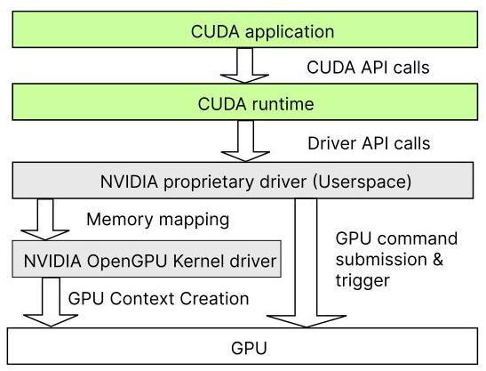
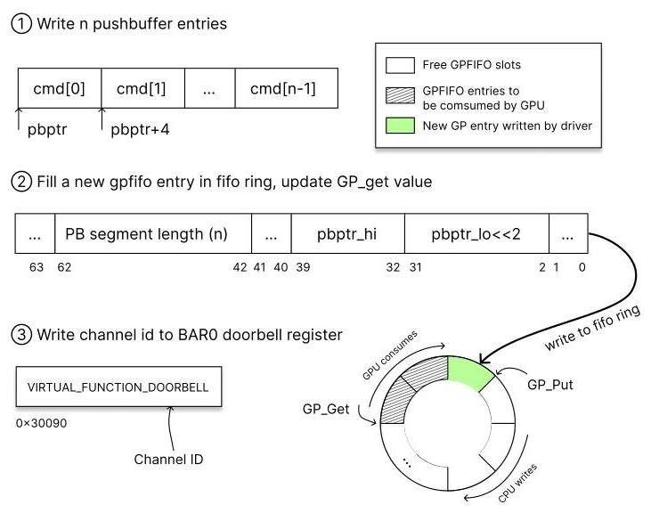
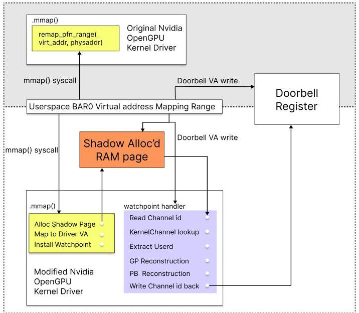
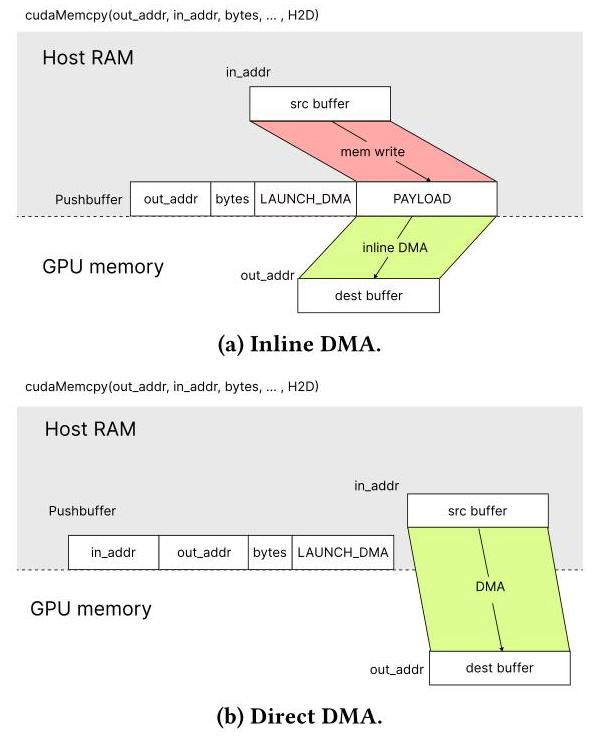
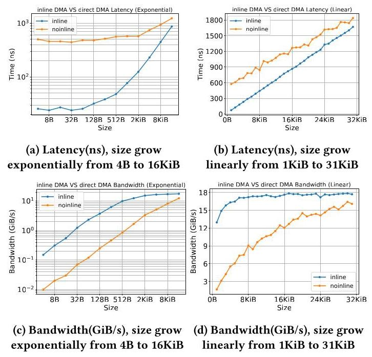
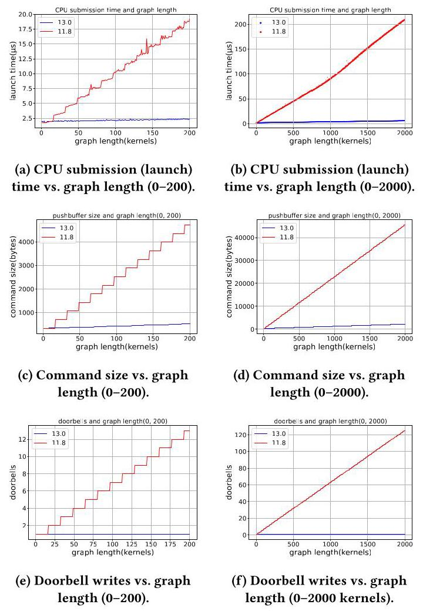
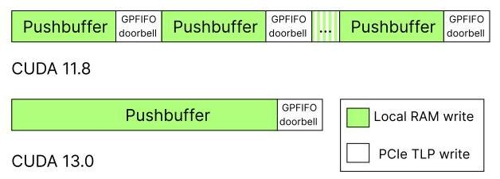
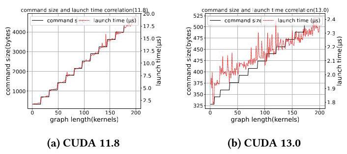

# Revealing NVIDIA Closed-Source Driver Command Streams for CPU-GPU Runtime Behavior Insight 深度解读

> **作者**：Yuang Yan, Ian Karlin, Ryan Grant  
> **会议/期刊**：arXiv 2026, arXiv:2604.26889, 2026-04-29  
> **一句话总结**：这篇论文通过修改 NVIDIA open-source kernel driver 并在 GPU doorbell 的 userspace 映射上安装硬件 watchpoint，把闭源 CUDA userspace driver 发出的底层 GPU command stream 捕获出来，从而解释 cudaMemcpy 与 CUDA Graph 的真实提交路径和开销来源。

## 一、问题定义

现代 CUDA 程序看到的是 `cudaMemcpy`、kernel launch、stream、event、CUDA Graph 这些高层 API，但真正把这些 API 翻译成 GPU 能执行的硬件命令的是 NVIDIA driver，尤其是闭源的 userspace driver。CUDA runtime 只是入口之一，driver 会生成 pushbuffer、GPFIFO entry，再通过 doorbell 通知 GPU PBDMA 去取命令。这个路径一旦不可见，开发者就很难判断一次 CUDA API 的时间到底花在 raw hardware execution、driver-side staging、command serialization、MMIO 通知，还是 profiler 本身的边界定义上。

Figure 1 把问题边界画得很清楚：CUDA runtime 往下是 userspace driver 与 kernel driver，灰色部分代表社区难以直接观察的闭源逻辑。论文的核心问题不是“GPU 能不能快”，而是“CUDA API 到 GPU hardware command 的翻译路径到底发生了什么”。这对短小 kernel、small-message data movement、disaggregated GPU、网络化 GPU 等场景尤其重要，因为软件提交开销可能比硬件传输本身更显著。

这篇工作更接近 First 类型的系统观察方法论文。已有研究利用 open-source kernel driver 研究 GPU scheduling、UVM、virtualization 或安全隔离，也有工作在 kernel space 拦截 command buffer，但本文的切入点是恢复闭源 userspace driver 为高层 CUDA API 实际发出的 end-to-end command trajectory，并进一步通过 CUDA-bypassing command issuance 测量原始 DMA engine 性能。

**动机评估**：动机比较 solid。NVIDIA kernel driver 已开源，但 CUDA operation-handling logic 仍主要在闭源 userspace driver 中；Nsight Systems 这类工具把多个阶段合并为 runtime-level 或 “CUDA HW” 时间，无法直接拆开 raw engine time 与提交路径开销。论文用两个 case study 给出实证支撑：小尺寸数据传输中 Nsight 报告时间与 raw DMA 时间差距巨大，CUDA Graph 11.8 到 13.0 的 launch overhead 变化也能从 command footprint 和 doorbell pattern 中得到解释。弱点是实验平台较单一，阈值和路径选择不一定能直接推广到所有 GPU/driver 组合。

**核心 Insight**：GPU doorbell write 是 userspace driver 提交命令的 final commit boundary。只要能在这个边界暂停 driver，并且此时 GP_PUT、GPFIFO、pushbuffer 已经被写好，就能得到一个静态、一致、完整的 command stream 视图。进一步，UVM 让 GPU virtual address 与进程 userspace virtual address 在一些场景下保持一致，这使作者不仅能观察命令，还能找到 pushbuffer、GPFIFO、semaphore 等对象并主动构造命令来做受控测量。

## 二、相关工作

论文把相关工作主要放在 NVIDIA kernel driver 开源之后的系统研究脉络中。第一类是 GPU driver/runtime 行为分析，例如 GPU context scheduling、CUDA Unified Virtual Memory、GPU sharing 与 multi-tenant isolation。这些工作通常能看到 kernel driver 或 OS-level 状态，但没有复原闭源 userspace driver 从 CUDA API 到硬件命令的完整翻译结果。

第二类是安全和隔离相关研究，包括 NVIDIA Confidential Computing、GPU TEE、GPU forensics、MIG TLB reverse engineering 等。这些研究关心的核心是隔离边界、攻击面或可信执行，虽然可能涉及 driver state 和硬件机制，但目标不是性能归因，也不是把 CUDA runtime behavior 映射到 command stream。

第三类是 vendor 文档与 open-source kernel module 本身。OpenGPU Kernel Modules 与 open-gpu-doc 提供了 GPFIFO、RAMFC、USERD、PBDMA、method encoding 等基础知识，但没有告诉用户闭源 userspace driver 对每个 CUDA API 实际发什么命令。本文的差异在于把这些公开结构与运行时截获结合起来，恢复具体 API 的 command footprint 和 submission pattern。

因此，本文不是提出新的 CUDA 编程抽象，而是给已有 CUDA stack 加了一个 command-level observability layer。它补上的是 “API-level profiler” 和 “kernel-driver source code” 之间的空白。

## 三、技术挑战

**挑战 1：关键提交路径绕过 kernel。** 为了性能，NVIDIA userspace driver 会把 PCIe BAR 区域映射到自己的虚拟地址空间，直接写 doorbell/MMIO register。常规 kernel instrumentation 看不到每次提交的完整路径。

**挑战 2：polling 无法可靠捕获 command stream。** Command stream 比单个 register 大得多，提交频率又高。周期性采样可能漏掉 submission，也可能读到 GP_PUT、GPFIFO、pushbuffer 之间不一致的中间状态。

**挑战 3：doorbell register 本身不可直接回读。** 作者发现截获 doorbell write 后再读该 register 总是得到 0，说明它可能不可读或写后立刻被 GPU 消费。因此必须设计 shadow doorbell page，先接收 userspace 写入，再在观测完成后转发到真实 doorbell。

**挑战 4：从 channel ID 到 pushbuffer 需要跨多层状态重建。** Doorbell write 只暴露 channel identifier；要恢复命令，需要定位 KernelChannel，映射 USERD/RAMFC，读取 GP_PUT 和 GP_BASE，计算新 GPFIFO entry 地址，再走 GPU MMU page table 找到物理地址，最后读取并解析 pushbuffer。

**挑战 5：raw hardware measurement 不能再混入 driver 提交开销。** 论文想测 DMA engine 自身行为，就不能只调用 `cudaMemcpy` 计时。它需要绕过 CUDA runtime，直接向 pushbuffer/GPFIFO 写入自定义命令，并用 GPU semaphore timestamp 作为设备侧时间边界。

**挑战 6：闭源命令语义仍不完整。** 即使能恢复 command stream，CUDA Graph 中很多字段仍是 NVIDIA internal terms，公开文档没有完整语义。作者因此选择用 command size、doorbell write count 这类 submission-level 指标做机制解释，而不是对每个私有字段过度猜测。

## 四、解决方案

### 整体思路

作者的方案是沿着提交路径反向追踪：doorbell write 代表提交完成，从这里拿到 channel ID；再通过 kernel driver 中的 channel 数据结构找 USERD/RAMFC/GPFIFO；最后定位 pushbuffer 并解析其中的硬件命令。为了保证观察窗口一致，作者把真实 doorbell 映射替换成 shadow page，在 userspace driver 写 doorbell 时触发 CPU debug-register watchpoint，暂停进程、读取状态、保存命令，然后再把 doorbell 值转发给真实 GPU register，让程序继续执行。

Figure 2 是理解全文的关键图。CUDA API 最终被写成 pushbuffer 里的 4-byte command entries；driver 再把 pushbuffer segment 的 GPU virtual address 和长度写入 GPFIFO；最后推进 GP_PUT 并写 doorbell。论文所有截获和重建都围绕这个三步路径展开。

### 贯穿示例

可以把一次 `cudaMemcpyAsync` 想成“CPU 给 GPU 递一张工单”。工单内容是 pushbuffer，里面写着 DMA source、destination、size、launch mode 等方法字段；GPFIFO 是取工单的索引卡，告诉 GPU 从哪里读这张工单、读多长；doorbell 是门铃，提醒 GPU 有新工单到了。正常情况下，这三个动作都由闭源 userspace driver 快速完成，外部只看到 `cudaMemcpyAsync` 返回或 profiler 里的一段时间。

本文的方法是在门铃线上装一个断点。driver 按原样写好工单和索引卡，但在按门铃的一瞬间被暂停。此时作者读取 GP_PUT，找到刚写入的 GPFIFO entry，再顺着 entry 找到 pushbuffer，解码出这次 `cudaMemcpyAsync` 到底用了 inline DMA 还是 direct DMA。随后，作者又反过来自己写工单和索引卡，只按一次门铃，让 GPU 连续执行一批 DMA 命令，并用 semaphore timestamp 测量纯设备执行时间。

### 关键技术点

**1. Watchpoint-based doorbell interception。** 作者利用 `nv_mmap` 是 userspace driver 建立 BAR/doorbell 映射的必经路径这一点，在 mapping 覆盖 doorbell register 时安装 CPU hardware watchpoint。相比 page fault 式方法，watchpoint 触发时 channel ID 已经写入，且控制流停在 kernel handler 中，便于读取一致状态。

Figure 4 展示了最关键的工程改造：原始路径中 userspace write 直达 GPU doorbell；修改后，write 先落入 shadow page 并触发 watchpoint，kernel handler 读取 command state 后再 forward 到真实 doorbell。这个设计解决了 “要观察但不能破坏提交语义” 的问题。

**2. GPFIFO/pushbuffer state reconstruction。** 截获 channel ID 后，作者从 OpenGPU kernel driver 的 `KernelChannel` 找到 USERD、RAMIN、RAMFC 的 memory descriptor。USERD 提供最新 GP_PUT，RAMFC 提供 GPFIFO base，新的 GPFIFO entry 地址按 `GP_BASE + (GP_PUT - 1) * 8` 计算。随后通过 GPU MMU page table 把 GPU virtual address 转成物理地址，再映射到 CPU 侧读取。

**3. Command parsing。** Pushbuffer entry 是硬件 method stream。作者根据 open-source driver headers 解码 method address、subchannel、class 等字段，Listing 1 给出了 64 MB `cudaMemcpyAsync` 的样例，其中能看到 `AMPERE_DMA_COPY_B`、`LAUNCH_DMA`、source/destination address 等信息。这使高层 CUDA API 和底层 engine command 第一次能直接对应起来。

**4. UVM-based object attribution and custom issuance。** Finding 1 指出，在 UVM 背景下，pushbuffer command 中使用的 GPU virtual address 与进程 userspace virtual address 一致。作者记录 mmap 返回地址，再与 command stream 里的 pushbuffer、GPFIFO、semaphore address 匹配，定位这些对象后直接写入自定义 command stream，并用 32-bit channel ID ring doorbell。

**5. 设备侧 timing。** CUDA stream/event 的底层可以用 memory semaphore 表达。GPU 在命令序列尾部执行 semaphore release，并可写入纳秒级 timestamp。作者把 warmup transfers、measurement transfers、progress trackers 合并进一个 pushbuffer，只提交一次，然后用两次 semaphore timestamp 差值计算 raw engine latency，避免每次 transfer 都经过 runtime/driver。

### 与已有方案的对比

相对于 Nsight 这类 profiler，本文能把“CUDA API 看起来花了多久”拆成更接近硬件的执行边界和提交路径边界。相对于只读 OpenGPU driver source，它能观察闭源 userspace driver 在真实 CUDA workload 下发出的具体命令。相对于只在 kernel space 拦截 buffer 的方法，它把 doorbell、GPFIFO、pushbuffer 和 CUDA API 行为连成完整轨迹。

局限也比较明确。第一，方法需要修改 kernel driver，且依赖 CPU debug registers 和具体 GPU generation 的 method headers，不是无侵入工具。第二，CUDA Graph 中许多 internal command 仍不能逐字段解释，论文只能用宏观 submission indicators 推理。第三，实验主要基于 NVIDIA A40/Ampere、Rocky Linux 9.5、CUDA 11.8/13.0，结论中的阈值如 24 KiB 不应直接当作跨平台常数。

## 五、实验评估

### 实验设定

实验硬件是 Intel Xeon Gold 6338 @ 2.00 GHz CPU、NVIDIA A40 Ampere GPU、PCIe Gen4 x16 interconnect。软件包括 CUDA Toolkit 11.8 与 13.0，对应 userspace driver 520.61.07 和 580.105.08；性能测量使用 unmodified OpenGPU kernel module，command logging 使用 modified OpenGPU driver；OS 是 Rocky Linux 9.5，Linux 5.14 patched。作者把四套环境命名为 11.8-perf、11.8-log、13.0-perf、13.0-log。

主要评测分两组。第一组分析 CUDA data movement，关注 H2D `cudaMemcpy` 在不同 transfer size 下采用 inline DMA 还是 direct DMA，并比较 Nsight-reported latency 与 raw DMA latency。第二组分析 CUDA Graph，从 CUDA 11.8 到 13.0 对比 graph launch 的 CPU time、pushbuffer command size 和 doorbell write count。

### 主要实验与结论

**1. cudaMemcpy 存在两种 H2D DMA submission path。** 在作者的 CUDA 13.0-log 环境中，小于 24 KiB 的 H2D transfer 使用 inline DMA：source data 被直接嵌入 pushbuffer payload，由 compute engine 读取并写入目的地址。大于等于 24 KiB 时，driver 切换到 direct DMA：pushbuffer 明确指定 source/destination address，由 dedicated copy engine 执行。

Figure 5 的价值在于把 `cudaMemcpy` 这种看似单一的 API 拆成两条硬件路径。小消息走 inline path，减少启动成本但把数据塞进 command path；大消息走 copy engine，启动更重但更适合长数据流。

**2. raw DMA 性能与 profiler 时间差异很大。** 作者通过自定义 command stream 单次提交多轮 transfer，用 semaphore timestamp 测 raw engine time。结果显示，inline DMA 在 compute engine 上启动延迟约 24 ns，而 copy engine 约 500 ns；inline path 在 8 KiB 左右达到约 17.5 GiB/s 后很快饱和，copy engine 则能在约 1 MiB 附近达到约 22 GiB/s 饱和带宽。

Figure 6 支撑了一个重要判断：inline DMA 适合极小消息，因为 startup latency 极低；copy engine 适合更大传输，因为带宽扩展性更好。这个结论也解释了 driver 为什么设置 size-dependent protocol switch。

**3. Nsight 的 “CUDA HW” 不是纯硬件执行时间。** Table 2 中，compute-engine inline DMA 的 8 B transfer，Nsight 报告 468.25 ns，而 raw 只有 24 ns，差异占 94.87%；8 KiB 时 Nsight 1924.75 ns，raw 448 ns，差异仍有 76.72%。copy-engine path 中，32 KiB transfer 差异占 49.89%，但到 32 MiB 时差异降到 0.36%。这说明小传输里 runtime/submission/staging/profiler boundary 占比很高，大传输里 hardware transfer time 才逐渐主导。

**4. CUDA Graph 13.0 的 launch overhead 接近常数，且与 command footprint 下降一致。** 对 chain-structured graph，长度从 1 增长到 2000 时，CUDA 13.0 launch time 只从约 1.9 us 增到 5.9 us；CUDA 11.8 则从约 1.8 us 增到 209 us，近似线性增长。对应的 pushbuffer command size 在 CUDA 11.8 中从 328 B 增到 45476 B，而 CUDA 13.0 只从 340 B 增到 2216 B。

Figure 7 把性能现象和 command-level 证据放在同一张图里：11.8 的 launch time、command size、doorbell writes 都随 graph length 明显增长；13.0 则大幅压平。尤其在短链范围内，11.8 的 command size 和 launch time 都有 staircase pattern，说明 host-side command emission 本身就是 launch overhead 的一个直接来源。

**5. CUDA 13.0 改善了 submission memory access pattern。** CUDA 11.8 随 graph length 增大会产生更多 doorbell writes，说明 driver 执行多个 submission cycles；CUDA 13.0 始终只有一次 doorbell write。由于作者发现 pushbuffer 位于 host RAM、GPFIFO 位于 GPU video memory，11.8 的模式会频繁在 host memory write 和 remote GPU memory/MMIO write 之间切换，而 13.0 更像是先批量写 pushbuffer，再一次性通知 GPU。

Figure 8 解释了为什么同样的 command bytes 数量也可能有不同 CPU 开销：频繁在 RAM 写和 PCIe TLP/MMIO 写之间摆动，会破坏 batching 并引入 ordering 成本；13.0 的单次通知路径更接近批处理。

Figure 10 进一步强化了 “command footprint 是 launch overhead precursor” 的判断。CUDA 11.8 中 command size 的 step transition 与 launch time 的 step transition 对齐；CUDA 13.0 的变化幅度较小，系统 jitter 已经接近信号量级，但整体趋势仍然存在。Figure 9 中的线性拟合也显示，CUDA 13.0 的 effective command-emission bandwidth 约 432.16/450.11 MiB/s，而 CUDA 11.8 约 243.97/205 MiB/s，接近两倍差距。

### 结论支撑性分析

实验比较好地支撑了论文主张：command-level visibility 能解释 CUDA API 的隐藏实现路径，也能把 profiler-level timing 进一步拆解。Data movement case study 直接证明 `cudaMemcpy` 的 protocol switch 和 raw engine behavior；CUDA Graph case study 则把 13.0 的 launch overhead 改善与 command size、doorbell count、submission pattern 联系起来。

不过，实验覆盖仍有边界。作者只展示了一个 GPU 平台，虽然 submission workflow 在 NVIDIA GPU 世代间相似，但具体 threshold、memory placement、driver policy 仍可能变化。CUDA Graph 部分没有完全解码所有 internal commands，因此“命令量更小导致 launch 更低”是强相关和机制合理的解释，而不是对每条内部命令语义的完整证明。此外，modified driver 的观测开销没有作为工具开销单独系统化评估。

## 六、附加洞察

**结论 1：UVM 不只是应用层统一地址抽象，也被 driver command path 用作地址一致性基础。**  
- *出处*：Finding 1, Section 5.2  
- *推理链条*：作者在 pushbuffer command 中看到的 GPU virtual address 能与 process userspace virtual address 对上，说明 driver 可以直接发出 CPU-side virtual address 形式的地址，并依赖 UVM/HMM 维护共享地址空间一致性。因此，UVM 的作用不仅是让 kernel 和 CPU 共享 pointer，也降低了作者定位 pushbuffer、GPFIFO、semaphore 等对象的难度。这个结论对工具构建很重要，但论文没有进一步讨论不同 UVM/HMM 配置下是否总成立。

**结论 2：GPFIFO 与 pushbuffer 的物理位置差异会影响 command submission 的优化空间。**  
- *出处*：Finding 2, Section 6.1 / Figure 5  
- *推理链条*：作者发现 baremetal 环境下 GPFIFO 在 GPU video memory，而 pushbuffer 在 host RAM；CPU 写 pushbuffer 是本地写，写 GPFIFO/doorbell 是远端 PCIe 写；GPU 读取 GPFIFO 是本地读，读取 pushbuffer 又是远端读。这个非对称路径说明 command buffer 放在哪里本身就是硬件软件协同设计问题，也解释了 CUDA Graph 13.0 减少远端写切换为什么有效。

**结论 3：小尺寸 `cudaMemcpy` 的 profiler 时间主要不是 raw transfer time。**  
- *出处*：Section 6.2 / Table 2  
- *推理链条*：作者用自定义 command stream 把 repeated transfers 放进单次 GPU-side execution，再用 semaphore timestamp 测量 raw DMA；与 Nsight “CUDA HW” 对比后，小尺寸 compute-engine path 有 76.72% 到 94.94% 的时间无法由 raw engine execution 解释。因此，短消息性能分析如果只看 profiler 的 API/HW timeline，很容易把 staging、PBDMA fetch、submission 或 profiler boundary 当成硬件能力限制。

**结论 4：CUDA Graph launch overhead 可以用 command footprint 做早期判断指标。**  
- *出处*：Section 6.3.1 / Figure 7 / Figure 10  
- *推理链条*：CUDA 11.8 中 command size 从 328 B 增到 45476 B，launch time 从 1.8 us 增到 209 us，且短链范围内两者 staircase transition 对齐；CUDA 13.0 中两者都显著压平。作者据此推断 command footprint 与 host-side launch overhead 紧密相关。薄弱点是这不是独立消融实验，但跨版本趋势、短链 step alignment 和机制解释相互支撑。

**结论 5：减少 doorbell/submission cycles 的收益来自 memory access pattern，而不只是命令字节数。**  
- *出处*：Section 6.3.2 / Figure 8 / Figure 9  
- *推理链条*：11.8 随 graph length 增加多次 doorbell write，意味着 CPU 多次在 host RAM pushbuffer construction 与 remote GPU memory/MMIO 更新之间切换；13.0 始终单次 doorbell，effective command-emission bandwidth 约为 432 到 450 MiB/s，高于 11.8 的 205 到 244 MiB/s。由此可见，driver-side batching 和写目标组织能显著影响 launch overhead。

## 七、总结与评价

这篇论文最大的贡献是把 NVIDIA closed-source userspace driver 的命令提交路径变成可观测对象，并通过两个具体 case study 说明 command-level visibility 为什么比 API-level timing 更有解释力。它没有提出新的 GPU 编程模型，但提供了一套能把 CUDA API、driver command stream、GPU engine behavior 连接起来的方法。

论文最亮的地方是方法选择很准：doorbell write 作为 final commit boundary，既足够接近硬件，又足够稳定，可以恢复完整提交单元；再结合 shadow doorbell、USERD/RAMFC reconstruction 和 UVM address matching，形成了可闭环的观察与控制能力。实验中 `cudaMemcpy` 与 CUDA Graph 的分析也都给出了具体数字，不只是展示工具能工作。

主要不足是泛化性和可用性。方法需要修改 kernel driver，对 GPU generation 和 driver version 有依赖；一些阈值和 memory placement 可能是平台特定；CUDA Graph 内部命令语义仍有黑箱部分。后续如果能把该方法扩展到更多 GPU、更多 CUDA APIs、更多 workload，并系统量化 tracing overhead，就会更接近一个通用 GPU middleware observability 工具。

## 八、章节脉络与段落速览

- **Abstract**：概括 CUDA userspace driver opaque 的问题、doorbell watchpoint 方法，以及 data movement 和 CUDA Graph 两个 case study。
  - ¶1 说明 CUDA 是 GPU orchestration 主接口，但闭源 driver 让 API 到 hardware command 的映射不可见。
  - ¶2 提出利用 open-source kernel driver、memory-mapping instrumentation 和 doorbell watchpoint 捕获完整 command submission。
  - ¶3 总结两个 case study：DMA submission modes 与 CUDA Graph command footprint。

- **Section 1 · Introduction**：从 CUDA stack 的不可见性引出 command-stream recovery 的必要性。
  - ¶1 说明 CPU/GPU 分工与异构执行背景。
  - ¶2 介绍 CUDA streams、kernel launch、data transfer、synchronization 等抽象。
  - ¶3 借 Figure 1 说明 CUDA API 的实际工作由 driver 翻译为硬件命令。
  - ¶4 指出 driver overhead 随 GPU 计算优化而越来越重要。
  - ¶5 说明 kernel driver 虽开源，但主要 operation-handling logic 仍在闭源 userspace driver。
  - ¶6 解释高层 API 到底层 command 的不透明性阻碍系统理解和优化。
  - ¶7 指出 Nsight 这类 profiler 聚合多个阶段，难以分离 raw device behavior。
  - ¶8 提出本文目标：恢复 command stream 并支持 CUDA-bypassing raw DMA measurement。
  - **Contributions**：列出 command-stream capture、data movement analysis/custom DMA launch、CUDA Graph overhead lesson 三项贡献。

- **Section 2 · Related Work**：说明已有 open-source kernel driver 研究没有覆盖本文的 end-to-end userspace command trajectory。
  - ¶1 总结 scheduling、virtualization、UVM、安全与 confidential computing 等相关方向。
  - ¶2 指出已有工作即使修改 driver 或概念性讨论 command submission，也没有复原闭源 userspace driver 对 CUDA API 的完整命令轨迹。

- **Section 3 · Technical Challenges and Our Approach**：解释为什么不能简单 polling，以及为什么 doorbell watchpoint 是合适边界。
  - ¶1 说明 userspace driver 直接映射 PCIe BAR 来写 command/doorbell，绕过 kernel。
  - ¶2 分析 polling MMIO/register 对 command stream 捕获不可靠。
  - ¶3 提出在 userspace doorbell mapping 上配置 CPU debug register watchpoint。
  - ¶4 强调 watchpoint 在提交边界暂停进程，能捕获完整提交单元。

- **Section 4 · NVIDIA GPU Command Submission Architecture**：给出后续重建所需的 NVIDIA command submission 背景。
  - **4.1 · Command Submission Hierarchy**：解释 GPFIFO 与 pushbuffer 的两级提交结构。
    - ¶1 概述 NVIDIA GPU 使用 GPFIFO 和 pushbuffer。
    - ¶2 说明 pushbuffer 存储 GPU engine 直接消费的 raw command stream。
    - ¶3 说明 driver 推进 GP_PUT 并写 doorbell 通知 GPU。
    - ¶4 说明 GPU PBDMA 取 GPFIFO entry 并读取 pushbuffer。
  - **4.2 · Channel Context Structure**：解释 USERD、RAMFC、RAMIN 与 GP_PUT/GP_GET 的关系。
    - ¶1 把 channel 类比为 runnable context，并说明其 memory state 和 engine state。
    - ¶2 说明 RAMIN/RAMFC 保存 per-channel 与 host state。
    - ¶3 指出 USERD 让 userspace driver 可更新 GP_PUT。
    - ¶4 对比 USERD 中的最新 GP_PUT/GP_GET 与 RAMFC 中的 saved state。
    - ¶5-9 解释 Figure 3 中 GP_PUT/GP_GET 在 USERD、RAMFC 和 PBDMA registers 之间传播。
  - **4.3 · Synchronization and Timing Mechanism**：说明 CUDA synchronization/event timing 底层可由 memory semaphore 表达。
    - ¶1 介绍 stream/event synchronization 的顺序语义。
    - ¶2 说明 semaphore release 如何作为 completion barrier。
    - ¶3 说明 timestamped semaphore 可用于设备侧 elapsed time measurement。

- **Section 5 · Command Stream Extraction Methodology**：描述从 doorbell 反向恢复 command stream 并主动发命令的方法。
  - ¶1 提出从 doorbell write 反向追踪 GPFIFO 和 pushbuffer。
  - ¶2 说明 5.1、5.2、5.3 的章节安排。
  - **5.1 · Intercepting doorbell writes**：描述 `nv_mmap` instrumentation、watchpoint 和 shadow doorbell。
    - ¶1 指出 doorbell mapping 必须经过 kernel driver 的 `nv_mmap`。
    - ¶2 用 Figure 4 对比原始和修改后路径。
    - ¶3 说明 watchpoint 如何在 userspace write doorbell 时暂停 driver 并保持状态一致。
    - ¶4 解释 doorbell readback 为 0 的问题。
    - ¶5 说明 shadow page 先接收写入，观测后再 forward 到真实 doorbell。
  - **5.2 · Reconstructing the execution state**：说明从 channel ID 找到 USERD/RAMFC/GPFIFO/pushbuffer 的步骤。
    - ¶1 指出 doorbell write 直接只给出 channel identifier。
    - ¶2 说明从 KernelChannel 获取 USERD、RAMIN、RAMFC 的 memory descriptors。
    - ¶3 给出用 GP_PUT 和 GP_BASE 计算新 GPFIFO entry 的公式。
    - ¶4 说明 GPU MMU translation、pushbuffer mapping 和 command parsing。
  - **Finding 1 · NVIDIA UVM and its implication on driver addressing**：说明 UVM 使 GPU VA 与 userspace VA 对齐，有助于自定义命令注入。
    - ¶1 介绍 UVM 和 Linux HMM 的地址空间统一背景。
    - ¶2 指出 driver 可直接在 command 中使用 CPU virtual address 形式的地址。
  - **5.3 · Customizing Command submission**：说明如何定位对象并写入自定义 pushbuffer/GPFIFO。
    - ¶1 提出通过改写命令来定向测量硬件机制。
    - ¶2 说明 mmap address matching 如何识别 pushbuffer、GPFIFO、semaphore buffer。
    - ¶3 说明写入自定义命令、ring doorbell 并读取 semaphore timestamp。

- **Section 6 · Case Studies: Unveiling Driver Logic and Optimization**：用 data movement 和 CUDA Graph 说明方法价值。
  - ¶1 说明两个 case study 都用于拆分 hardware 与 software side effects。
  - ¶2 概述 cudaMemcpy raw DMA measurement 和 CUDA Graph version comparison。
  - **6.1 · Evaluation platform**：给出硬件、软件栈和 modified driver 设置。
    - ¶1 说明 Table 1 中的硬件与四套软件环境。
    - ¶2 说明 patched Linux 5.14 用于支持 modified driver。
    - ¶3 说明单 GPU 平台足以演示方法，但适配其他 GPU 需要换对应 headers。
  - **Finding 2 · GPFIFO and pushbuffer locality**：指出 GPFIFO 在 GPU memory、pushbuffer 在 host RAM，形成非对称提交路径。
  - **6.2 · Analyzing CUDA Data Movement Mechanism**：分析 H2D `cudaMemcpy` 的两种 DMA path 和 raw performance。
    - ¶1 说明 `cudaMemcpy` 是显式数据迁移接口。
    - ¶2 指出 13.0-log 中观察到 inline DMA 与 direct DMA 两种 command-flow pattern。
    - ¶3 说明小于 24 KiB 使用 inline DMA，payload 嵌入 pushbuffer。
    - ¶4 说明大于等于 24 KiB 使用 direct DMA 和 copy engine。
    - ¶5-6 解释为什么 CUDA API 计时不能直接暴露 raw hardware behavior。
    - ¶7 说明作者把 warmup、measurement 和 progress trackers 合并进单次 pushbuffer submission。
    - ¶8 总结 Figure 6 的测试范围。
    - ¶9 给出 inline DMA 24 ns startup、copy engine 500 ns startup、17.5/22 GiB/s 带宽结论。
    - ¶10-13 用 Table 2 对比 Nsight 与 raw DMA latency 并解释差异来源。
  - **6.3 · Evolution of CUDA Graph from 11.8 to 13.0**：分析 CUDA Graph launch overhead 下降的 command-level 原因。
    - ¶1 介绍 CUDA Graph 的用途和重复 launch 优势。
    - ¶2 说明 `cudaGraphUpload` 与 `cudaGraphLaunch` 的分工。
    - ¶3 对比 CUDA 11.8 线性增长与 13.0 近常数 launch cost。
    - ¶4 说明用 perf stack 复现实验、用 log stack 追踪 command traffic。
    - ¶5-7 描述 chain-structured graph benchmark 和 submission-level indicators。
    - **6.3.1 · Command size and launch-time scaling**：说明 command size 与 launch time 的共同增长和 staircase pattern。
      - ¶1 说明 Figure 7 记录 CPU launch time、command size、doorbell writes。
      - ¶2 给出 13.0 从 1.9 到 5.9 us、11.8 从 1.8 到 209 us 的差异。
      - ¶3 指出短链范围内 11.8 command size 与 launch time 的 staircase pattern。
      - ¶4 说明 Figure 10 对比短链范围下两版本的关系。
      - ¶5 推断 command footprint 对 cudaGraphLaunch overhead 有预测意义。
    - **6.3.2 · Submission memory access pattern**：说明 doorbell write count 和 memory write pattern 的差异。
      - ¶1 指出 11.8 多次 doorbell writes，13.0 单次 doorbell write。
      - ¶2 结合 Finding 2 解释 11.8 在 host RAM 与 remote GPU memory write 间频繁切换。
      - ¶3 说明 Figure 9 用 effective write bandwidth 衡量提交效率。
      - ¶4 给出 13.0 约两倍 command-emission bandwidth 的结果。

- **Section 7 · Conclusion and Future work**：总结 command-level visibility 对 driver overhead 分解和未来设计的意义。
  - ¶1 总结本文让 command buffers locality 和 command footprint 变得明确，并提出 command buffer placement 是未来设计问题。
  - ¶2 说明直接编程 DMA engine 能暴露 CUDA transfer protocol，有助于网络化或 disaggregated GPU 系统诊断。
  - ¶3 总结 CUDA Graph case study 表明 driver-side command organization 能降低 launch latency。

