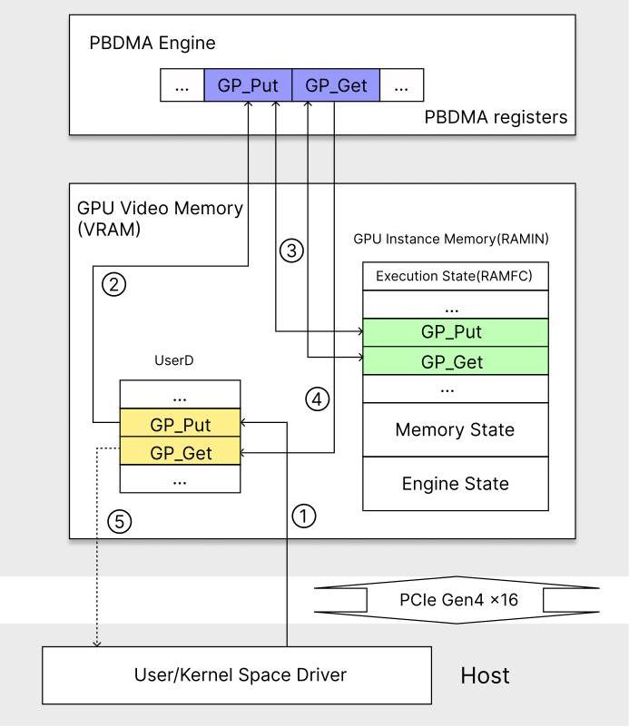

# Revealing NVIDIA Closed-Source Driver Command Streams for CPU-GPU Runtime Behavior Insight

Yuang Yan

> 
渊源

yuang.yan@queensu.ca

> 
yuang.yan@queensu.ca

Queen's University

> 
女王大学

Kingston, Ontario, Canada

> 
加拿大安大略省金斯顿

Ian Karlin

> 
伊恩·卡林

ian.karlin@queensu.ca

> 
ian.karlin@queensu.ca

本文提出一种揭示 NVIDIA 闭源用户态驱动程序所发出的硬件命令流的方法，旨在为从高层 CUDA API 到底层 GPU 命令的不透明翻译过程提供透明性。该研究的关键挑战在于驱动程序的直接用户态提交路径，该路径绕过了内核，使得观测变得困难。

核心贡献是一种拦截并完整无误地重建命令提交的技术。通过插桩开源内核驱动程序的内存映射路径，并在 GPU 门铃寄存器的用户态映射上使用 CPU 硬件观察点来实现。当一条命令被提交时，观察点陷阱会创建一个静态观测窗口，从而能够从 GPFIFO 和推式缓冲区中提取并解析出完整的命令流。

基于该方法，本文展示了两个案例研究。首先，对于 CUDA 数据移动（`cudaMemcpy`），作者识别出了两种不同的 DMA 提交模式——用于小规模传输的、经由计算引擎的内联 DMA，以及用于更大规模传输的、经由拷贝引擎的直接 DMA——并通过自定义命令注入，独立于驱动程序开销测量了它们的原始硬件性能。其次，对 CUDA Graphs 的分析表明，更新版本 CUDA 中降低的启动开销直接关联于更小的命令占用空间以及一种更高效的单周期提交模式，该模式减少了对远端 GPU 内存的高开销交互。主要结论是，命令级的可见性能够清晰地区分硬件成本与驱动成本，从而为性能解读提供实用基础，并为未来的软硬件协同设计提供启示。

Queen's University

> 
女王大学

Kingston, Ontario, Canada

> 
加拿大安大略省金斯顿

Ryan Grant

> 
本文提出一种方法，用以揭示NVIDIA闭源用户空间驱动程序所发出的硬件命令流，旨在为高层CUDA API到底层GPU命令的不透明转换提供透明性。其关键研究挑战在于驱动程序的直接用户空间提交路径，该路径绕过内核，使观测变得困难。

核心贡献是一种在保持完全完整性的前提下截获并重建完整命令提交的技术。该技术通过插桩开源内核驱动程序的内存映射路径，并在GPU门铃寄存器的用户空间映射上使用CPU硬件观察点来实现。当命令被提交时，观察点陷停会产生一个静态观测窗口，从而允许从GPFIFO和pushbuffer中提取并解析完整的命令流。

利用该方法，本文展示了两个案例研究。首先，针对CUDA数据移动（`cudaMemcpy`），作者识别出两种不同的DMA提交模式（小数据传输通过计算引擎的内联DMA，较大数据传输通过拷贝引擎的直接DMA），并通过自定义命令注入测量了它们独立于驱动开销的原始硬件性能。其次，对CUDA图的分析表明，较新CUDA版本中降低的启动开销直接源于更小的命令足迹和更高效的单周期提交模式，该模式减少了对远程GPU内存的高开销访问。主要结论是，命令级可见性实现了硬件与驱动开销的清晰分离，为性能解读提供了实用基础，并可为未来软硬件协同设计提供参考。

ryan.grant@queensu.ca

> 
ryan.grant@queensu.ca

Queen's University

> 
女王大学

Kingston, Ontario, Canada

> 
加拿大安大略省金斯顿

## Abstract

For NVIDIA GPUs, CUDA is the primary interface through which applications orchestrate GPU execution, yet much of the logic that realizes CUDA operations resides in NVIDIA's closed-source userspace driver. As a result, the translation from high-level CUDA APIs to low-level hardware commands remains opaque, limiting both software understanding and performance attribution.

> 
对于 NVIDIA GPU 而言，CUDA 是应用程序编排 GPU 执行的主要接口，然而实现 CUDA 操作的大部分逻辑都驻留在 NVIDIA 的闭源用户空间驱动程序中。因此，从高层 CUDA API 到底层硬件命令的转换过程仍然是不透明的，这限制了对软件的理解和性能归因。

This paper makes that command path visible. We recover the hardware command streams emitted by NVIDIA's closed-source userspace driver with full integrity by leveraging the recently open-sourced kernel driver, instrumenting the memory-mapping path, and installing a hardware watchpoint on the userspace mapping of the GPU doorbell register. This lets us capture complete command submissions at the moment they are committed.

> 
本文使该命令路径变得可见。我们通过利用最近开源的内核驱动、插桩内存映射路径，并在 GPU 门铃寄存器的用户态映射上安装硬件观察点，完整还原了 NVIDIA 闭源用户态驱动程序发出的硬件命令流。这使得我们能够在命令提交的时刻捕获完整的命令提交。

Using this methodology, we present two case studies. For CUDA data movement, we identify the DMA submission modes selected by the driver and characterize their raw hardware performance independently of driver overhead through CUDA-bypassing controlled command issuance. For CUDA Graphs, we show that the reduced launch overhead in newer CUDA releases is associated with a smaller command footprint and a more efficient submission pattern. Together, these results show that command-level visibility provides a practical basis for understanding and optimizing GPU middleware behavior, improving performance interpretation, and informing future hardware-software co-design for CUDA and related accelerator stacks.

> 
基于该方法，我们展示了两项案例研究。对于 CUDA 数据移动，我们识别出驱动程序所选择的 DMA 提交模式，并通过绕过 CUDA 的受控命令下发，在不受驱动开销影响的情况下刻画其原始硬件性能。对于 CUDA 图，我们表明新版 CUDA 版本中启动开销的降低与更小的命令占用空间及更高效的提交模式有关。这些结果共同表明，命令级可见性为理解和优化 GPU 中间件行为、改进性能解读，以及为 CUDA 及相关加速器栈的未来软硬件协同设计提供信息，奠定了实用基础。

## CCS Concepts

- Computing methodologies $\rightarrow$ Graphics processors; - Software and its engineering $\rightarrow$ Software performance; $\bullet$ Computer systems organization $\rightarrow$ Heterogeneous (hybrid) systems.

> 
- 计算方法学 $\rightarrow$ 图形处理器；- 软件及其工程 $\rightarrow$ 软件性能；$\bullet$ 计算机系统组织 $\rightarrow$ 异构（混合）系统。

## Keywords

CUDA runtime, NVIDIA GPU driver, GPU command stream, push-buffer/GPFIFO, GPU synchronization, DMA engine

> 
CUDA 运行时，NVIDIA GPU 驱动程序，GPU 命令流，推送缓冲区/GPFIFO，GPU 同步，DMA 引擎

## 1 Introduction

GPUs have become indispensable for scientific computing and AI due to their massive parallel compute capability. In modern computing systems, CPUs and GPUs are separate processors with distinct roles: the CPU remains the control center and the primary interface to the operating system, while the GPU executes offloaded computational work. As CPUs and GPUs are distinct processing units connected through the system interconnect, their execution is not intrinsically unified.

> 
凭借其强大的并行计算能力，GPU 已成为科学计算与人工智能不可或缺的一部分。在现代计算系统中，CPU 与 GPU 是承担不同角色的独立处理器：CPU 仍是控制中心及操作系统的主要接口，而 GPU 执行被卸载的计算工作。由于 CPU 与 GPU 是通过系统互连相连的不同处理单元，它们的执行并非天然统一。

To coordinate CPUs and GPUs efficiently, one representative software framework is NVIDIA's CUDA, which provides a programming interface for issuing work to the GPU from ordinary host programs. In the CUDA model, code executed on the GPU (i.e., kernels) can run concurrently with code on the CPU, thereby exploiting system heterogeneity. In addition, the GPU can overlap host-device data transfer with its own computation. CUDA abstracts different parallelisms through streams: operations issued to different streams are independent, while operations within the same stream follow program order. CUDA also provides interfaces for launching kernels, initiating data transfers, and synchronizing device progress so that the host can determine when GPU work has completed. In modern scientific applications, CUDA becomes the default way to orchestrate GPU execution, with no more direct interface exposed to users.

> 
为了高效地协调 CPU 与 GPU，NVIDIA 的 CUDA 是一个具有代表性的软件框架，它为普通主机程序提供了向 GPU 下发工作的编程接口。在 CUDA 模型中，在 GPU 上执行的代码（即内核函数）可以与 CPU 上的代码并发运行，从而利用系统的异构性。此外，GPU 可以将主机与设备间的数据传输与自身计算重叠进行。CUDA 通过流来抽象不同的并行性：下发到不同流的操作相互独立，而同一流内的操作遵循程序顺序。CUDA 还提供了启动内核函数、发起数据传输以及同步设备进度的接口，使主机能判断 GPU 工作何时完成。在现代科学应用中，CUDA 已成为编排 GPU 执行的默认方式，不再向用户暴露更直接的接口。

Figure 1: CUDA software stack with layer responsibilities and key interaction paths to the GPU

> 
图1：CUDA软件栈及其各层职责和与GPU的关键交互路径

The functionality of CUDA APIs, however is not provided by the CUDA runtime alone, but largely by the GPU driver underneath it, which serves as the middleware layer between host software and GPU hardware. Figure 1 shows the hierarchy of this supporting software stack. When a CUDA routine involves GPU work, the driver translates the high-level API request into hardware commands and submits them to the device. The driver consists of two parts: a userspace driver and a kernel driver. Most requests are handled in userspace, while operations that require operating-system privileges, such as memory mapping, are forwarded to the kernel driver through system calls.

> 
CUDA API 的功能并非仅由 CUDA 运行时提供，而是在很大程度上依赖于其底层的 GPU 驱动程序，该驱动程序充当主机软件与 GPU 硬件之间的中间件层。图 1 展示了该支持软件栈的层次结构。当一个 CUDA 例程涉及 GPU 工作时，驱动程序会将高层的 API 请求转换为硬件命令并将其提交到设备。驱动程序由两部分组成：用户空间驱动程序与内核驱动程序。大多数请求在用户空间处理，而需要操作系统特权（例如内存映射）的操作则通过系统调用转发至内核驱动程序。

Because this driver layer mediates communication between the host and the GPU, application performance depends not only on the hardware capability itself, but also on how the driver interacts with the GPU and on the overhead introduced by the driver's own processing. This middleware overhead has also become increasingly important as GPU computation grows more optimized and intense, making software-side overheads harder to ignore. Techniques such as kernel fusion [9] and CUDA Graphs [7] have therefore been introduced, in part, to reduce this cost.

> 
由于该驱动层负责主机与 GPU 之间的通信中介，应用程序的性能不仅取决于硬件本身的能力，还取决于驱动与 GPU 的交互方式以及驱动自身处理所引入的开销。随着 GPU 计算日益优化和密集，这类中间件开销也变得越来越重要，使得软件侧的开销更难被忽视。因此，部分是为了降低这一成本，引入了诸如内核融合[9]和 CUDA Graph[7]等技术。

Despite the important role of the GPU driver in efficient host-device interaction, analyzing it remains technically difficult because much of the driver stack remains difficult to inspect directly (grey layers in Figure 1). Although NVIDIA has recently open-sourced the kernel driver [2], most CUDA operation-handling logic still resides in the userspace driver, which remains proprietary.

> 
尽管 GPU 驱动程序在高效的主机-设备交互中扮演着重要角色，但由于驱动程序栈的大部分仍然难以直接检查（图 1 中的灰色层），对其进行分析在技术上仍很困难。尽管 NVIDIA 最近已开源了内核驱动程序 [2]，但大部分 CUDA 操作处理逻辑仍驻留在用户空间驱动程序中，而该部分仍为专有。

As a result, the mapping from high-level software interfaces to low-level hardware commands remains opaque. Without such knowledge, it is difficult to understand the established mechanisms of CPU-GPU interaction and to extract design lessons from them. This opacity also limits broader community efforts to reason about, improve, or adapt similar accelerator software stacks, and hinders collaborative optimization of CUDA's internal driver behavior for the benefit of applications built on top of it.

> 
因此，从高层软件接口到底层硬件命令的映射机制仍然不透明。缺乏这方面的知识，就难以理解CPU-GPU交互的既定机制，也无法从中提炼设计经验。这种不透明性同样制约了更广泛的社区对类似加速器软件栈进行推理、改进或适配的努力，并阻碍了为惠及上层应用而对CUDA内部驱动程序行为进行的协同优化。

A second implication is performance interpretation. Tools such as Nsight Systems [14] report timings at the runtime level, where costs from multiple stages along the software-hardware path are aggregated into a single duration. As a result, the contribution of each stage is not directly visible, making it difficult to isolate raw device behavior, especially in non-vendor-built environments such as disaggregated systems, where software-side costs can dominate small-message performance.

> 
第二层含义在于性能解释。诸如 Nsight Systems [14] 这类工具在运行时层面报告计时，将软件-硬件路径上多个阶段的成本聚合为单一持续时间。因此，各阶段的贡献无法直接可见，这使得隔离原始设备行为变得困难，尤其是在非供应商构建的环境中，例如解聚系统，其中软件侧成本可能主导小消息性能。

A deeper understanding of device behavior motivates this work. The goal is: to recover the hardware command streams generated from CUDA API calls by the closed-source userspace driver, and to enable CUDA-bypassing hardware control for direct measurement of raw data-transfer performance. We achieve this by analyzing the command-submission mechanism in detail, as presented in Section 4, and by instrumenting the kernel-driver memory-mapping path together with CPU debug registers, with high level overview in Section 3 and details in Section 5. Specifically, our contributions are as follows:

> 
对设备行为的更深入理解推动了这项工作。目标是：恢复由闭源用户空间驱动程序从CUDA API调用生成的硬件命令流，并实现绕过CUDA的硬件控制，以直接测量原始数据传输性能。我们通过详细分析命令提交机制（如第4节所述），以及对内核驱动内存映射路径与CPU调试寄存器进行插桩来实现这一点，第3节给出了高层次概述，第5节提供了细节。具体而言，我们的贡献如下：

## Contributions

- Command-stream capture and reconstruction We capture, reconstruct, and parse the full runtime command stream emitted by NVIDIA's closed-source user-space driver, (Listing 1). By examining the translated hardware commands, we gain insight into how high-level CUDA abstractions are implemented at the hardware level, including mechanisms such as stream ordering and event recording.

> 
- 命令流捕获与重建：我们捕获、重建并解析由 NVIDIA 闭源用户空间驱动程序发出的完整运行时命令流（清单 1）。通过检查转换后的硬件命令，我们得以深入了解高级 CUDA 抽象是如何在硬件层实现的，包括像流排序和事件记录这样的机制。

- Data-Movement Analysis and Controlled DMA Launch We analyze CUDA data-movement behavior, revealing how the driver switches between DMA submission modes which employs different driver path as transfer size varies. Beyond observation, we introduce a CUDA-bypassing mechanism that directly programs the DMA engines to perform the same data movement as cudaMemcpy, enabling controlled measurements that decouple raw GPU DMA-engine performance from driver overhead.

> 
- 数据移动分析与受控DMA启动 我们分析CUDA数据移动行为，揭示了驱动程序如何根据传输大小的变化在不同的DMA提交模式间切换，这些模式采用不同的驱动程序路径。除了观察之外，我们还引入了一种绕过CUDA的机制，直接对DMA引擎编程以执行与cudaMemcpy相同的数据移动，从而能够进行受控测量，将原始GPU DMA引擎性能与驱动程序开销分离。

- Lesson for reducing driver overhead from CUDA Graph We analyze CUDA Graph execution, a mechanism for reducing repeated CUDA runtime launch overhead, and show how newer CUDA releases lower host-side launch cost by reshaping the command stream and submission pattern, thereby reducing CPU involvement in the critical path.

> 
- 从 CUDA Graph 减少驱动开销的教训  
我们分析了 CUDA Graph 执行——一种用于减少重复 CUDA runtime 启动开销的机制，并展示了较新的 CUDA 版本如何通过重塑命令流和提交模式来降低主机端启动成本，从而减少关键路径上的 CPU 参与。

Together, the two case studies (data movement and CUDA Graphs) demonstrate the benefit of making the driver's translation into hardware commands visible. They represent only the first examples explored in this paper, not the limit of the methodology. The same approach can be applied to other CUDA APIs and applications of interest. More generally, the visibility provided by this broadly applicable method helps the community better understand and improve accelerator software stacks.

> 
这两个案例研究（数据移动和 CUDA 图）共同展示了让驱动到硬件命令的翻译过程变得可见的好处。它们只是本文探索的首批示例，并不代表该方法的应用极限。同样的方法可以应用于其他 CUDA API 和感兴趣的应用。更广泛地说，这一适用范围广泛的方法所提供的可见性，有助于社区更好地理解并改进加速器软件栈。

## 2 Related Work

Since NVIDIA open-sourced its GPU kernel driver in 2022, a growing body of work has begun to analyze this operating-system-level software stack from several perspectives. Existing studies have examined GPU context scheduling and management [3], virtualized GPU sharing for cloud services [16], and the behavior of CUDA Unified Virtual Memory (UVM) [1]. A substantial portion of this literature is security-oriented. This includes studies of NVIDIA Confidential Computing [6], systems for confidential collaborative learning and privacy-preserving GPU services [5, 18], forensic analysis of driver state for detecting malicious GPU activity [4], and side-channel attacks on MIG through reverse engineering of GPU TLBs [17].

> 
自2022年NVIDIA将其GPU内核驱动程序开源以来，越来越多的研究开始从多个角度分析这一操作系统级软件栈。现有工作已考察了GPU上下文调度与管理[3]、面向云服务的虚拟化GPU共享[16]，以及CUDA统一虚拟内存（UVM）的行为[1]。其中相当一部分文献以安全为导向，涵盖NVIDIA机密计算研究[6]、机密协作学习与隐私保护GPU服务系统[5, 18]、用于检测恶意GPU活动的驱动状态取证分析[4]，以及通过逆向GPU TLB对MIG发起的侧信道攻击[17]。

Some of these works modify the driver or discuss the structure of GPU command submission and related data paths at a conceptual level. For example, Allen et al. [1] instrument the driver to collect fine-grained fault metadata, while Zhang et al. [16] intercept GPU command buffers in kernel space to support multi-tenant GPU sharing and isolation. However, these works do not reconstruct the end-to-end command trajectory of high-level CUDA API calls as emitted by NVIDIA's closed-source user-space driver, as done in this work.

> 
这些工作部分通过修改驱动程序或在概念层面探讨 GPU 命令提交的结构与相关数据路径。例如，Allen 等人[1]对驱动程序进行插桩以收集细粒度故障元数据，而 Zhang 等人[16]在内核空间拦截 GPU 命令缓冲区，以支持多租户 GPU 共享与隔离。然而，这些工作并未重构高层 CUDA API 调用经由 NVIDIA 闭源用户空间驱动程序所发出的端到端命令轨迹，而本研究正实现了这一点。

## 3 Technical Challenges and Our Approach

For performance, the closed-source user-space driver maps the GPU's PCIe BAR (Base Address Register) region into its virtual address space, allowing it to issue command and doorbell writes directly to GPU registers without entering the kernel. This design avoids frequent user-kernel context switches and makes GPU notification more immediate. [10] However this makes the submission path difficult to observe.

> 
为了获得高性能，闭源的用户空间驱动程序将GPU的PCIe BAR（基址寄存器）区域映射到其虚拟地址空间中，从而能够直接向GPU寄存器发出命令和门铃写入，而无需进入内核。这种设计避免了频繁的用户态与内核态之间的上下文切换，并使GPU通知更加即时。[10] 然而，这也使得提交路径难以观察。

A natural approach is to periodically poll the memory regions established by the open-source kernel driver. One prior effort [3] sampled MMIO (Memory-Mapped IO) execution registers to study GPU context preemption. While polling can work for byte-wide registers, it is inadequate for capturing the much larger command stream. Its limited sampling rate cannot guarantee that every submission is observed, given the command stream size and the high frequency of GPU updates. Moreover, without intervening in the submission path, sampled register and memory state may be inconsistent, producing partial or corrupted views of in-flight commands.

> 
一种自然的做法是定期轮询由开源内核驱动程序建立的内存区域。此前一项工作[3]通过采样MMIO（内存映射I/O）执行寄存器来研究GPU上下文抢占。尽管轮询对于字节宽度的寄存器可行，但对于捕获大得多的命令流则力有不逮。其有限的采样速率无法保证观察到每一次提交，考虑到命令流的大小和GPU更新的高频率。此外，在不介入提交路径的情况下，采样得到的寄存器和内存状态可能不一致，从而产生对飞行中命令的不完整或已损坏的视图。

We configure the CPU debug registers to watch the userspace virtual address mapped to the GPU doorbell, an MMIO register used to notify the GPU of new work. When this write occurs, the watchpoint traps into the kernel and pauses the userspace driver, creating a static window in which we can inspect the command buffer and recover a complete, intact view of the newly submitted command stream.

> 
我们配置 CPU 调试寄存器，以监视映射到 GPU 门铃（doorbell）的用户态虚拟地址，门铃是一个 MMIO 寄存器，用于通知 GPU 有新工作到达。当该写入发生时，监视点会陷入内核并暂停用户态驱动，从而创建一个静态窗口，使我们能够检查命令缓冲区，并恢复出新提交命令流的完整、无损视图。

This mechanism creates an observation window at the submission boundary. By pausing the process when a submission is committed, we capture each submission cycle as a complete, intact unit instead of a partial or fragmented view.

> 
该机制在提交边界处创建了一个观察窗口。通过在提交被确认时暂停进程，我们将每个提交周期捕获为一个完整、未受损的单元，而非部分或碎片化的视图。

## 4 NVIDIA GPU Command Submission Architecture

This section provides an overview of NVIDIA command submission based on the OpenGPU Kernel Modules source code [12] and its documentation [11]. Unless otherwise noted, the descriptions in this section are derived from these sources. We first explain how work is packaged into command buffers and queued for execution. Then we introduce the command encoding needed to interpret parsed streams. We next explain how command submission and progress state are tracked and synchronized between driver data structures and hardware registers, which later supports command reconstruction (Section 5.2). Finally, we discuss how CUDA synchronization and timing map onto GPU command primitives, enabling device-side timing of custom-issued operations in Section 5.3.

> 
本节基于 OpenGPU 内核模块源代码 [12] 及其文档 [11]，概述 NVIDIA 的命令提交机制。除非另有说明，本节中的描述均源自这些来源。我们首先解释工作如何打包至命令缓冲区并排队等待执行。然后介绍解析命令流所需的命令编码。接下来解释命令提交和进度状态如何在驱动程序数据结构与硬件寄存器之间进行跟踪和同步，这为后续的命令重建提供支持（第 5.2 节）。最后，我们讨论 CUDA 同步和计时如何映射到 GPU 命令原语，从而能够在第 5.3 节中对自定义发出的操作进行设备端计时。

### 4.1 Command Submission Hierarchy

NVIDIA GPUs employ a two-level command submission hierarchy composed of the GPFIFO (Get/Put FIFO) and the pushbuffer (PB). A typical command submission path is depicted in Figure 2.

> 
NVIDIA GPU 采用由 GPFIFO（获取/放置 FIFO）和推送缓冲区（PB）组成的两级命令提交层次结构。典型的命令提交路径如图2所示。

The pushbuffer holds the raw command stream that is directly consumed by GPU engines. Each PB entry is 4 bytes. To submit a batch of work, the driver first writes the translated commands from higher-level API calls (e.g., encoding a cudaMemcpy() into copy/DMA descriptors) into the pushbuffer (①). Next, the driver enqueues a GPFIFO entry (2)), which encodes the starting GPU virtual address of the pushbuffer segment and its length into a 64-bit descriptor.

> 
推送缓冲区保存着由GPU引擎直接消耗的原始命令流。每个PB条目为4字节。为提交一批工作，驱动程序首先将从高层API调用翻译后的命令（例如，将cudaMemcpy()编码为复制/DMA描述符）写入推送缓冲区(①)。接着，驱动程序将一条GPFIFO条目入队(②)，该条目将推送缓冲区段的起始GPU虚拟地址及其长度编码到一个64位描述符中。

The GPFIFO itself is a ring buffer established when a GPU context (channel) is created (details in Section 4.2). The driver acts as the producer, advancing the producer index GP_Put, while the GPU consumes entries by advancing GP_Get. After filling a new slot, the driver increments GP_Put and rings the doorbell (③) by writing the channel/context identifier to a doorbell register. This doorbell register is global across channels and is accessed via the PCIe BAR0 MMIO range at the VIRTUAL_FUNCTION_DOORBELL offset.

> 
GPFIFO 本身是一个环形缓冲区，在 GPU 上下文（通道）创建时建立（细节见 4.2 节）。驱动程序充当生产者，通过推进生产者索引 GP_Put 来填充条目，而 GPU 则通过推进 GP_Get 来消费条目。在填充一个新的槽位后，驱动程序递增 GP_Put，并通过将通道/上下文标识符写入门铃寄存器来振铃门铃（③）。该门铃寄存器是跨通道全局的，通过 PCIe BAR0 MMIO 范围内位于 VIRTUAL_FUNCTION_DOORBELL 偏移处的地址访问。

Upon receiving the doorbell notification, the GPU PBDMA (pushbuffer DMA) engine fetches the newly enqueued GPFIFO entry, reconstructs the pushbuffer address and length, and then reads the corresponding command stream from the pushbuffer. The PBDMA front-end parses the stream and dispatches work to the appropriate engines (e.g., compute, copy), acting as the consumer-side mirror of the driver's submission logic.

> 
收到门铃通知后，GPU PBDMA（pushbuffer DMA）引擎会获取新入队的GPFIFO条目，重建pushbuffer的地址和长度，然后从pushbuffer中读取相应的命令流。PBDMA前端解析该命令流，并将工作分派到相应的引擎（例如计算引擎、复制引擎），充当驱动程序提交逻辑的消费端镜像。

Figure 2: Driver command submission path: pushbuffer writes, GPFIFO enqueue, and doorbell notification.

> 
图 2：驱动命令提交路径：推送缓冲区写入、GPFIFO 入队和门铃通知。

### 4.2 Channel Context Structure

In Section 4.1, we described how commands are queued and consumed using GP_PUT and GP_GET. These pointers, analogous to a CPU thread's program counter, represents the execution state of a runnable context. A runable context is referred to as a Channel. In addition, a channel contains the memory state that resolves GPU virtual to physical memory addressing, and engine state that specifies the status of the engine executing the work.

> 
在第4.1节中，我们描述了如何使用GP_PUT和GP_GET对命令进行排队和消费。这些指针类似于CPU线程的程序计数器，代表了一个可运行上下文的执行状态。一个可运行上下文被称为通道（Channel）。此外，一个通道包含用于解析GPU虚拟地址到物理地址寻址的内存状态，以及引擎状态，它指定了执行该工作的引擎的状态。

The persistent per-channel state is stored in RAMIN (channel instance memory). The execution state (also known as host state) resides in RAMFC (FIFO context memory). During a context switch, the GPU front-end saves and restores per-channel fields between RAMIN and the PBDMA registers, similar to a CPU saving/restoring thread state from the Program Control Block (Linux task_struct).

> 
持久化的每通道状态存储在 RAMIN（通道实例内存）中。执行状态（也称主机状态）驻留在 RAMFC（FIFO 上下文内存）中。在上下文切换期间，GPU 前端在 RAMIN 和 PBDMA 寄存器之间保存和恢复每通道字段，类似于 CPU 从程序控制块（Linux task_struct）保存/恢复线程状态。

The RAMFC containing the GP_Put value is allocated in a privileged region that the user-mode driver cannot directly access. To support the direct user-space command submission, NVIDIA exposes a user-accessible memory region called USERD. USERD allows the user-mode driver to update producer index GP_PUT through its virtual address mapping.

> 
包含 GP_Put 值的 RAMFC 分配在用户模式驱动程序无法直接访问的特权区域中。为了支持直接用户空间命令提交，NVIDIA 公开了一个名为 USERD 的用户可访问内存区域。USERD 允许用户模式驱动程序通过其虚拟地址映射更新生产者索引 GP_PUT。

When the context is in execution, USERD therefore holds the freshest GP_PUT value written by the userspace driver. After the driver rings the doorbell, the PBDMA engine loads the corresponding state from USERD into its execution registers to begin (or continue) consuming the GPFIFO. When configured, the GPU periodically writes the consumer index GP_GET back to USERD. In contrast, the copies of GP_PUT/GP_GET stored in RAMFC remain unchanged while the channel is running, and are only updated when a context switch saves/restores channel state.

> 
当上下文处于执行状态时，USERD 因此持有由用户态驱动程序写入的最新 GP_PUT 值。驱动程序敲响门铃后，PBDMA 引擎从 USERD 加载相应状态到其执行寄存器中，以开始（或继续）消费 GPFIFO。在配置启用后，GPU 会定期将消费者索引 GP_GET 写回 USERD。相比之下，存储在 RAMFC 中的 GP_PUT/GP_GET 副本在通道运行时保持不变，仅在上下文切换保存/恢复通道状态时才会更新。

Figure 3 illustrates how these replicated GP_PUT/GP_GET values are synchronized across USERD, RAMFC, and live PBDMA registers.

> 
图 3 展示了这些复制的 GP_PUT/GP_GET 值如何在 USERD、RAMFC 和活跃的 PBDMA 寄存器之间同步。

- ① The driver writes a pushbuffer segment, assembles a GPFIFO entry, and advances GP_PUT in USERD.

> 
- ① 驱动程序写入一个推送缓冲段，组装一个 GPFIFO 条目，并推进 USERD 中的 GP\_PUT。

- ② After the doorbell write, PBDMA fetches the latest GP_PUT from USERD into its execution registers.

> 
- ② 门铃写入后，PBDMA 从 USERD 中将最新的 GP_PUT 取入其执行寄存器。

- 3) On a context switch, GP_PUT/GP_GET are saved to RAMFC when the channel is switched out, and restored back into PBDMA registers when the channel is switched in.

> 
- 3) 在上下文切换时，当通道被切出时，GP_PUT/GP_GET将被保存到RAMFC中；当通道被切入时，再将其恢复至PBDMA寄存器。

- ④ If write-back is enabled, the GPU periodically writes GP_GET (the consumer index) back to USERD.

> 
- ④ 如果回写（write-back）被启用，GPU 会定期将 GP_GET（消费者索引）写回到 USERD。

- 5 The driver may poll GP_GET in USERD to track progress, However the documentation discourage this manner [11].

> 
- 5 驱动程序可能会在 USERD 中轮询 GP_GET 来跟踪进度，但文档不鼓励这种方式 [11]。

GPU (Nvidia A40)

> 
GPU（英伟达 A40）

Figure 3: Synchronization of different copies of GPFIFO values. Arrows show how GP_PUT/GP_GET values propagate between USERD (userspace window), RAMFC/RAMIN (saved context), and live PBDMA execution registers.

> 
图 3：不同 GPFIFO 值副本的同步。箭头展示了 GP_PUT/GP_GET 值如何在 USERD（用户空间窗口）、RAMFC/RAMIN（保存的上下文）和活动的 PBDMA 执行寄存器之间传播。

### 4.3 Synchronization and Timing Mechanism

In CUDA, operations issued to the same stream are executed in order: a later operation in that stream does not begin until all earlier operations have completed. If subsequent CPU work depends on the completion of previously issued GPU operations, the programmer must explicitly wait using stream synchronization or event synchronization. Stream synchronization blocks until all earlier work in the stream finishes, while event synchronization waits until execution reaches a specific recorded point in the stream, so that dependent CPU code can safely proceed without data hazards from incomplete GPU work [13].

> 
在 CUDA 中，提交到同一流的操作是按序执行的：流中后序的操作直到所有前序操作完成后才开始。若后续的 CPU 工作依赖于先前发出的 GPU 操作的完成，程序员必须显式地通过流同步或事件同步来等待。流同步会阻塞，直到流中所有更早的工作完成，而事件同步则会等待执行到达流中某个特定的记录点，这样依赖的 CPU 代码就可以安全地继续执行，而不会因未完成的 GPU 工作产生数据冒险 [13]。

Both intra-device and device-host synchronization are implemented using a hardware primitive referred to a memory semaphore, which acts as a completion barrier. The driver appends a semaphore release command at the end of a sequence of submitted hardware commands (aka. a progress tracker in NVIDIA terms). A semaphore release specifies (i) a target address and (ii) a payload value to be written to that address. Because the engines execute commands in order, the payload appearing at the target address implies that all preceding commands in that submission sequence have completed. Synchronization waits for the semaphore value to match the expected payload, enforcing dependencies in the same way.

> 
设备内同步和设备与主机间的同步都通过一种称为内存信号量的硬件原语实现，它充当着完成屏障的角色。驱动程序会在所提交硬件命令序列（NVIDIA 术语中称为进度跟踪器）的末尾附加一条信号量释放命令。信号量释放命令指定了（i）一个目标地址和（ii）要写入该地址的有效载荷值。由于引擎按顺序执行命令，目标地址出现有效载荷即意味着该提交序列中所有前置命令均已完成。同步操作会等待信号量值与预期的有效载荷匹配，以同样的方式强制依赖关系。

The GPU can also be configured to write a timestamp with nanosecond resolution next to the payload location, indicating when the semaphore update occurred. By subtracting the timestamps associated with two semaphore releases, we obtain the elapsed time between the corresponding completion points, which is equivalent to how cudaEventElapsedTime works.

> 
GPU 也可以被配置为在有效载荷位置旁边写入一个纳秒级分辨率的时间戳，指示信号量更新发生的时间。通过将两次信号量释放所关联的时间戳相减，我们得到相应完成点之间经过的时间，这相当于 cudaEventElapsedTime 的工作方式。

## 5 Command Stream Extraction Methodology

To restore the trajectory of GPU commands, we trace the submission path in reverse: From the doorbell write through the corresponding GPFIFO entries to the originating pushbuffer, since the doorbell write is the driver's final commit point.

> 
为了复原 GPU 命令的轨迹，我们逆向追踪提交路径：以门铃写入为起点，经由对应的 GPFIFO 条目回溯至最初的推送缓冲区（pushbuffer），因为门铃写入是驱动程序的最终提交点。

In Section 5.1, we describe how we identify the submitting channel when the doorbell is being written. We then present the procedure for recovering the channel's submission state and extracting the newly enqueued commands in Section 5.2. Finally, Section 5.3 shows how we actively emit customized commands to exert specific mechanisms.

> 
在 5.1 节中，我们描述了当门铃被写入时如何识别提交通道。随后，在 5.2 节中给出了恢复通道提交状态并提取新入队命令的流程。最后，5.3 节展示了如何主动发送定制命令以触发特定机制。

### 5.1 Intercepting doorbell writes

While user space can issue doorbell writes directly, bypassing the kernel for submission as introduced in Section 3, it must still rely on the kernel driver to establish the memory mapping to the physical I/O address of the doorbell register. In NVIDIA's current kernel driver, all such mapping requests are handled by nv_mmap, where user space supplies the target physical address through the mmap system call.

> 
虽然用户空间可以直接发出门铃写入，如第3节所述绕过内核进行提交，但它仍然依赖内核驱动来建立到门铃寄存器物理I/O地址的内存映射。在NVIDIA当前的内核驱动中，所有此类映射请求都由`nv_mmap`处理，其中用户空间通过`mmap`系统调用提供目标物理地址。

Figure 4, shows how the driver works before and after our modifications. The top half (grey block) shows the data path of doorbell triggers for the original opengpu kernel driver, where the signal is directly delivered to the mapped doorbell register on GPU. The bottom half (white block) shows our modified driver that leverages the mandatory nv_mmap step to intercept the user-mode submission path and make doorbell-triggered submissions observable.

> 
图 4 展示了修改前后驱动的工作方式。上半部分（灰色块）显示了原始 opengpu 内核驱动中门铃触发器的数据路径，信号直接传递到 GPU 上映射的门铃寄存器。下半部分（白色块）展示了我们修改后的驱动，它利用必须执行的 nv_mmap 步骤来拦截用户模式提交路径，并使门铃触发的提交变得可观测。

Inside nv_mmap, if the requested range covers the doorbell register, we install a hardware watchpoint on the corresponding user-space virtual address, similar to a watchpoint set in GDB. When the userspace driver writes to this mapped doorbell address, the watchpoint triggers and execution traps into the kernel, and we use this window to observe memory state and capture the push-buffer state at the moment of submission in the watchpoint handler callback. Compared with the fault-triggering method, watchpoint installation guarantees that when the callback occurs, the channel ID has already been written. It also keeps execution in kernel space until memory observation is finished, so no new commands can be written during this window. As a result, we can observe a static, integrity-preserving view of the GPFIFO and pushbuffer state.

> 
在 `nv_mmap` 内部，如果请求的地址范围覆盖了门铃寄存器，我们就在对应的用户空间虚拟地址上安装一个硬件监视点，类似于在 GDB 中设置的监视点。当用户空间驱动程序写入这个映射的门铃地址时，监视点触发并且执行陷入内核，我们利用这个窗口观察内存状态，并在监视点处理回调中捕获提交时刻的推送缓冲区状态。与故障触发方法相比，监视点安装保证了当回调发生时，通道 ID 已经被写入；它还将执行保持在核心空间直到内存观察完成，因此在此窗口期间不会有新命令被写入。因此，我们可以观察到 GPFIFO 和推送缓冲区状态的静态、完整性保持的视图。

When we first implemented this mechanism, the doorbell writes were successfully intercepted. However, reading the doorbell register back from the GPU always returned zero. This behavior suggests that the register is either non-readable or that its contents are flushed immediately after a write. To address this, we allocate a RAM page during the mapping process and use it as a shadow doorbell page. When the user-space driver performs a write, the value first lands in this shadow page. After we perform the memory observation inside the watchpoint handler, we then forward the captured value to the real doorbell register to allow the submission flow to proceed normally.

> 
当我们首次实现该机制时，门铃寄存器写入被成功拦截。然而，从GPU读回门铃寄存器总是返回零。这一行为表明，该寄存器要么不可读，要么其内容在写入后立即被清除。为解决此问题，我们在映射过程中分配一个内存页，并将其用作影子门铃页。当用户态驱动执行写入时，数值首先落入该影子页。在观察点处理程序内完成内存观测后，我们再将被捕获的数值转发至真实门铃寄存器，以使提交流程正常继续。

Datapath with original Driver

> 
原始驱动程序的数据路径

Datapath with Modified Driver

> 
修改驱动后的数据通路

Figure 4: Comparison of mapping and submission paths. Top: In the original driver. Bottom: Our modified driver.

> 
图4：映射与提交路径对比。顶部：原始驱动。底部：我们修改后的驱动。

### 5.2 Reconstructing the execution state

When we intercept a doorbell write, the only information we directly observe is the channel identifier. To reconstruct the submitted command stream, we must recover the channel's backing execution state and the memory regions it references.

> 
当我们截获门铃写入时，唯一能直接观察到的信息是通道标识符。为了重构提交的命令流，我们必须恢复该通道的后备执行状态及其引用的内存区域。

In the OpenGPU kernel driver, the KernelChannel structure records memory descriptors for USERD, RAMIN, and RAMFC, which provide the physical addresses of the corresponding regions. We use the intercepted channel ID to locate the channel's KernelChannel object, and then map USERD and RAMFC into the CPU virtual address space so their fields can be read during reconstruction.

> 
在 OpenGPU 内核驱动中，KernelChannel 结构记录了 USERD、RAMIN 和 RAMFC 的内存描述符，其中包含相应区域的物理地址。我们利用被截获的信道 ID 定位该信道的 KernelChannel 对象，再将 USERD 和 RAMFC 映射到 CPU 虚拟地址空间，以便在重构过程中读取它们的字段。

Next, we locate the newly enqueued GPFIFO entry, corresponding to 2) in Figure 2. We retrieve the GP_PUT index from USERD, which contains the latest value updated by the driver, and obtain the GPFIFO base address GP_BASE from RAMFC. The GPU virtual address of the new GPFIFO entry is then computed as:

> 
接下来，我们定位新加入队列的GPFIFO条目，对应于图2中的步骤2）。我们从USERD中获取GP_PUT索引，该索引包含驱动程序更新的最新值，并从RAMFC中获得GPFIFO基地址GP_BASE。新的GPFIFO条目的GPU虚拟地址随后计算如下：

GP_PUT_VA = GP_BASE + (GP_PUT - 1) × GP_ENTRY_SIZE, where GP_ENTRY_SIZE is 8 bytes.

> 
GP_PUT_VA = GP_BASE + (GP_PUT - 1) × GP_ENTRY_SIZE，其中 GP_ENTRY_SIZE 为 8 字节。

After obtaining the GPU virtual address, we resolve the physical address by walking the GPU MMU pagetable We then map the GPFIFO entry's physical address to read its contents. From these GPFIFO entries, we extract the pushbuffer segment's GPU virtual address and repeat the same translation and mapping steps to read the pushbuffer instructions. Finally, we parse the pushbuffer commands according to the method format provided by the opensourced driver headers. As an example, Listing 1 shows the reconstructed GPU command stream generated by a cudaMemcpyAsync transferring 64MB.

> 
在获取 GPU 虚拟地址后，我们通过遍历 GPU MMU 页表解析物理地址。随后，映射 GPFIFO 条目的物理地址以读取其内容。从这些 GPFIFO 条目中，我们提取推送缓冲区段落的 GPU 虚拟地址，并重复相同的翻译与映射步骤来读取推送缓冲区指令。最后，根据开源驱动头文件提供的方法格式解析推送缓冲区命令。例如，列表 1 展示了由传输 64MB 数据的 cudaMemcpyAsync 生成的重构 GPU 命令流。

## Finding 1: NVIDIA UVM and its implication on driver addressing

In CUDA, Unified Virtual Memory (UVM) allows a pointer to be dereferenced by both the host and the device (e.g., within CUDA kernels). Under the hood, the UVM kernel module manages a unified virtual address space by tracking mappings and triggering page migration on demand when an access occurs to a page that is not resident on the accessing processor [1]. Recent integration with Linux HMM [15] (heterogeneous memory management) further extends UVM beyond CUDA-managed allocations by leveraging OS support for mirroring page-table entries [8].

> 
在 CUDA 中，统一虚拟内存（Unified Virtual Memory，UVM）允许主机与设备（如在 CUDA 内核中）对同一个指针进行解引用。在底层，UVM 内核模块通过追踪映射，并在访问一个未驻留在当前处理器上的页面时按需触发页面迁移，来管理一个统一的虚拟地址空间[1]。近期与 Linux HMM[15]（异构内存管理）的集成，通过利用操作系统对镜像页表项的支持，进一步将 UVM 扩展到了超出 CUDA 托管分配的范围[8]。

With the adoption of UVM, GPU virtual addresses used in pushbuffer commands are shared with the process's user-space virtual addresses space. In other words, UVM address unification is leveraged internally by the driver: it can emit addresses directly using CPU virtual addresses without an additional GPU-VA translation step, relying on the UVM machinery to maintain consistency of the shared address space. This feature also facilitate our capability to issue a customized command stream to the GPU.

> 
随着UVM的采用，pushbuffer命令中使用的GPU虚拟地址与进程的用户空间虚拟地址空间实现了共享。换言之，驱动程序内部利用了UVM的地址统一特性：它可以直接使用CPU虚拟地址发出地址，无需额外的GPU虚拟地址转换步骤，依靠UVM机制来维护共享地址空间的一致性。这一特性也便利了我们向GPU发出定制化的命令流。

Listing 1: Example debug trace captured at a doorbell interception, including GPFIFO state and decoded pushbuffer entries.

> 
清单 1：在门铃拦截处捕获的示例调试跟踪，包括 GPFIFO 状态和解码后的推送缓冲区条目。

---

value 0x10011, Kernel Channel 0xFF4A64B8958C3808

> 
值 0x10011，内核通道 0xFF4A64B8958C3808

===== GPFIFO SUMMARY ====

> 
===== GPFIFO 摘要 =====

GP_GET (index) : 1

> 
GP_GET (index) : 1

GP_PUT (index) : 2

> 
GP_PUT (index) : 2

GP_base (VA) : 0x20021b000

> 
GP_base (VA) : 0x20021b000

GP_NEWENTRY (VA) : 0x20021b008

> 
GP_NEWENTRY (虚拟地址) : 0x20021b008

GP_NEWENTRY : 0x00003e0202600020

> 
GP_NEWENTRY : 0x00003e0202600020

===== END GPFIFO SUMMARY ====

> 
===== GPFIFO 摘要结束 =====

Pushbuffer Entries count 15

> 
推送缓冲区条目计数 15

PB entry[0] = 0x20048100

> 
PB entry[0] = 0x20048100

PB entry[1] = 0x00007fa8

> 
PB entry[1] = 0x00007fa8

SUBCH4 AMPERE_DMA_COPY_B(0xc7b5) OFFSET_IN_UPPER(0x400) data=0x00007fa8

> 
SUBCH4 AMPERE_DMA_COPY_B(0xc7b5) OFFSET_IN_UPPER(0x400) data=0x00007fa8

PB entry[2] = 0x20000000

> 
PB entry[2] = 0x20000000

SUBCH4 AMPERE_DMA_COPY_B(0xc7b5) OFFSET_IN_LOWER(0x404) data=0x20000000

> 
SUBCH4 AMPERE_DMA_COPY_B(0xc7b5) OFFSET_IN_LOWER(0x404) data=0x20000000

PB entry[3] = 0x00007fa8

> 
PB entry[3] = 0x00007fa8

SUBCH4 AMPERE_DMA_COPY_B(0xc7b5) OFFSET_OUT_UPPER(0x408) data=0x00007fa8

> 
子通道4 AMPERE_DMA_COPY_B(0xc7b5) OFFSET_OUT_UPPER(0x408) 数据=0x00007fa8

PB entry[4] = 0x0e000000

> 
PB entry[4] = 0x0e000000

SUBCH4 AMPERE_DMA_COPY_B(0xc7b5) OFFSET_OUT_LOWER(0x40c) data=0x0e000000

> 
SUBCH4 AMPERE_DMA_COPY_B(0xc7b5) OFFSET_OUT_LOWER(0x40c) data=0x0e000000

PB entry[5] = 0x20018106

> 
PB entry[5] = 0x20018106

PB HDR INC count=1 subch=4 addr_dw=0x106 (byte 0x418)

> 
PB HDR INC count=1 subch=4 addr_dw=0x106 (byte 0x418)

PB entry[6] = 0x04000000

> 
PB entry[6] = 0x04000000

PB HDR INC count=1 subch=4 addr_dw=0xc0 (byte 0x300)

> 
PB HDR INC 计数=1 子通道=4 地址双字=0xc0（字节 0x300）

PB entry[8] = 0x00000182

> 
PB 条目[8] = 0x00000182

SUBCH4 AMPERE_DMA_COPY_B(0xc7b5) LAUNCH_DMA(0x300) data=0x00000182

> 
SUBCH4 AMPERE_DMA_COPY_B(0xc7b5) LAUNCH_DMA(0x300) data=0x00000182

DATA_TRANSFER_TYPE=2 (NON_PIPELINED)

> 
DATA_TRANSFER_TYPE=2 (非流水线)

---

FLUSH_ENABLE=0 (FALSE)

> 
FLUSH_ENABLE=0 (FALSE)

SRC_MEMORY_LAYOUT=1 (PITCH)

> 
SRC_MEMORY_LAYOUT=1（步幅）

DST_MEMORY_LAYOUT=1 (PITCH)

> 
DST_MEMORY_LAYOUT=1 (PITCH)

MULTI_LINE_ENABLE=0 (FALSE)

> 
本文提出了一种揭示NVIDIA闭源用户空间驱动程序所发出硬件命令流的方法，旨在为从高层CUDA API到底层GPU命令的不透明转换提供透明性。关键研究挑战在于驱动程序使用直接用户空间提交路径，该路径绕过了内核，使观测变得困难。

核心贡献是一种能够完整拦截并重构具有完全完整性的命令提交的技术。通过插桩开源内核驱动程序的内存映射路径，并在GPU门铃寄存器用户空间映射上使用CPU硬件观察点，即可实现该技术。当命令被提交时，观察点陷阱会创建一个静态观测窗口，从而能够从GPFIFO和pushbuffer中提取并解析完整的命令流。

利用该方法，本文给出了两个案例研究。首先，针对CUDA数据移动（`cudaMemcpy`），作者识别出两种不同的DMA提交模式（小数据传输通过计算引擎的内联DMA，较大传输通过复制引擎的直接DMA），并通过自定义命令注入，在不受驱动程序开销影响的情况下测量其原始硬件性能。其次，对CUDA Graphs的分析表明，较新CUDA版本中启动开销的降低直接源于更小的命令占用空间，以及一种更高效的单周期提交模式，该模式减少了与远程GPU内存的高开销交互。主要结论是，命令级的可见性能够清晰地分离硬件与驱动程序的成本，为性能解读提供了实用基础，并为未来的软件——硬件协同设计提供了参考。

SRC_TYPE=0 (VIRTUAL)

> 
SRC_TYPE=0 (VIRTUAL)

DST_TYPE=0 (VIRTUAL)

> 
DST_TYPE=0 (虚拟)

...

> 
本文提出了一种揭示NVIDIA闭源用户态驱动所发出的硬件命令流的方法，旨在为高层CUDA API到底层GPU命令的不透明转译过程提供透明性。关键的研究挑战在于驱动采用的直接用户空间提交流径，该路径绕过了内核，致使观测变得困难。

核心贡献在于一种截获并完整重建命令提交的技术，同时保证完整性。该方法通过插桩开源内核驱动的内存映射路径，并在GPU门铃寄存器的用户空间映射上使用CPU硬件观察点来实现。当命令被提交时，观察点陷入会形成一个静态的观测窗口，从而能够从GPFIFO和推缓冲区中提取并解析出完整的命令流。

基于这一方法，本文展示了两项案例研究。首先，对于CUDA数据搬运（`cudaMemcpy`），作者识别出两种不同的DMA提交模式（小数据量时通过计算引擎的内联DMA，以及大数据量时通过拷贝引擎的直接DMA），并通过自定义命令注入，在排除驱动开销的情况下独立测算它们的原始硬件性能。其次，对CUDA图的分析表明，新版CUDA中降低的启动开销直接归因于更小的命令体量以及更高效的单周期提交模式，该模式减少了与远端GPU内存的昂贵交互。主要结论是，命令层级的可见性使得硬件成本与驱动成本得以清晰分离，为性能解读提供了实用的基础，并为未来的软件-硬件协同设计提供了启示。

### 5.3 Customizing Command submission

Now that we understand the submission path, we can adjust submitted commands in controlled ways to target specific mechanisms within the hardware and driver and measure the GPU's response.

> 
既然我们已经理解了提交流程，就可以以受控方式调整已提交的命令，以针对硬件和驱动程序中的特定机制进行测试，并测量 GPU 的响应。

In the presence of UVM, GPU virtual addresses are consistent with the process's user-space virtual addresses (Finding 1). We therefore track user-space virtual addresses returned by mmap and compare them against the addresses that appear later in our intercepted submission path, including the pushbuffer, GPFIFO, and memory semaphore addresses decoded from command streams. When a match is observed, we can attribute that mmap allocation to the corresponding object (pushbuffer, GPFIFO, and semaphore buffer).

> 
在开启UVM的情况下，GPU虚拟地址与进程的用户空间虚拟地址保持一致（发现1）。因此，我们追踪mmap返回的用户空间虚拟地址，并将其与我们拦截的提交路径中后续出现的地址进行比对，这些地址包括pushbuffer、GPFIFO以及从命令流解码的内存信号量地址。当观察到匹配时，我们即可将该mmap分配归属于相应的对象（pushbuffer、GPFIFO和信号量缓冲区）。

After identifying these allocations, we inject customized commands by writing directly to the identified pushbuffer and GPFIFO, then ring the doorbell by writing the 32-bit channel ID. For time measurement, we read and calculate timestamps written by GPU from the semaphore buffer.

> 
在识别这些分配后，我们通过直接写入已识别的推送缓冲区和GPFIFO来注入自定义命令，然后通过写入32位通道ID来敲响门铃。对于时间测量，我们从信号量缓冲区读取并计算由GPU写入的时间戳。

## 6 Case Studies: Unveiling Driver Logic and Optimization

Using the methodology introduced in Section 5, we present two case studies that show how our modified driver can separate hardware and software side effects.

> 
利用第5节介绍的方法，我们展示了两个案例研究，说明修改后的驱动如何分离硬件和软件副作用。

First, we study cudaMemcpy from a hardware-centric perspective. By issuing a customized command sequence, we directly measure GPU DMA engine behavior excluding driver-side overheads that can obscure short transfers. Second, we study CUDA Graphs from a software-centric perspective. We compare graph execution under CUDA 11.8 and CUDA 13.0, and use the reconstructed command streams to pinpoint driver-side changes that align with the observed reduction in host launch cost.

> 
首先，我们从以硬件为中心的视角研究 cudaMemcpy。通过发送定制的命令序列，我们直接测量 GPU DMA 引擎行为，排除了可能混淆短数据传输的驱动端开销。其次，我们从以软件为中心的视角研究 CUDA Graphs。我们比较了 CUDA 11.8 和 CUDA 13.0 下的图执行，并使用重构的命令流来精确定位与观察到的主机启动成本降低相一致的驱动端变化。

### 6.1 Evaluation platform

The hardware of our evaluation platform is shown in Table 1a, and software stacks used in our experiments are summarized in Table 1b. We evaluate two major stacks, based on CUDA 11.8 and CUDA 13.0. For all performance measurements, we use the unmodified OpenGPU kernel module, denoted as 11.8-perf and 13.0-perf. For command logging, we use a modified OpenGPU driver, denoted as 11.8-log and 13.0-log.

> 
我们评估平台的硬件配置如表1a所示，实验中使用的软件栈总结于表1b。我们评估了两个主要软件栈，分别基于CUDA 11.8和CUDA 13.0。对于所有性能测量，我们使用未修改的OpenGPU内核模块，记作11.8-perf和13.0-perf。对于命令记录，我们使用修改过的OpenGPU驱动，记作11.8-log和13.0-log。

To run the modified driver, we export sched_task_fork from the default Linux 5.14 kernel to offload sleepable operations out of the watchpoint handler.

> 
为了运行修改后的驱动程序，我们从默认的 Linux 5.14 内核中导出 `sched_task_fork`，以便将可休眠的操作从监视点处理程序中卸载出来。

While we evaluate a single GPU platform, the GPU driver submission workflow (pushbuffer, GPFIFO filling and doorbell triggering) remains the same across generations. Therefore, one platform is sufficient to demonstrate the methodology, and adapting it to other models only requires altering to the header of the given model.

> 
尽管我们评估的是单个 GPU 平台，但 GPU 驱动提交工作流程（pushbuffer、GPFIFO 填充和 doorbell 触发）在不同代际之间保持不变。因此，一个平台足以展示该方法，而将其适配到其他型号仅需修改给定型号的头部。

Table 1: Experimental platform

> 
表 1：实验平台

(a) Hardware configuration.

> 
(a) 硬件配置。

<table><tr><td>CPU</td><td>Intel Xeon Gold 6338 @ 2.00 GHz</td></tr><tr><td>GPU</td><td>NVIDIA A40 (Ampere)</td></tr><tr><td>Interconnect</td><td>PCIe Gen4 ×16 (16 GT/s capable)</td></tr></table>

(b) Software stacks.

> 
(b) 软件栈。

<table><tr><td>Component</td><td>11.8-perf</td><td>11.8-log</td><td>13.0-perf</td><td>13.0-log</td></tr><tr><td>CUDA Toolkit</td><td colspan="2">11.8</td><td colspan="2">13.0</td></tr><tr><td>Userspace driver</td><td colspan="2">520.61.07</td><td colspan="2">580.105.08</td></tr><tr><td>Opengpu kernel</td><td>520.61.07</td><td>520.61.07</td><td>580.105.08</td><td>580.105.08</td></tr><tr><td>module</td><td>(original)</td><td>(modified)</td><td>(original)</td><td>(modified)</td></tr><tr><td>Operating System Linux Kernel</td><td colspan="4">Rocky Linux 9.5   5.14 (Patched)</td></tr></table>

## Finding 2: GPFIFO and pushbuffer locality

In our baremetal environment, we find that the GPFIFO ring buffer resides in GPU video memory, while the pushbuffer is allocated in host RAM. This creates an asymmetric submission path: the CPU writes pushbuffer commands locally in system memory and then updates the GPFIFO entries remotely on the GPU, whereas the GPU performs the reverse-it reads GPFIFO entries locally from its own RAM and then fetches pushbuffer commands remotely from host memory.

> 
在我们的裸机环境中，我们发现 GPFIFO 环形缓冲区驻留在 GPU 显存中，而推送缓冲区分配在主机 RAM 中。这形成了一条非对称的提交路径：CPU 在系统内存本地写入推送缓冲区命令，然后远程更新 GPU 上的 GPFIFO 条目；而 GPU 执行相反操作——它从自身 RAM 中本地读取 GPFIFO 条目，然后从主机内存远程获取推送缓冲区命令。

Figure 5: DMA submission paths of CUDA data movement

> 
图 5：CUDA 数据移动的 DMA 提交路径

### 6.2 Analyzing CUDA Data Movement Mechanism

We begin by analyzing cudaMemcpy, a CUDA API that explicitly transfers data between different domains. A cudaMemcpy operation is defined by the source address, destination address, transfer direction, and transfer size. Because it is the explicit data movement interface in CUDA, it is commonly used to measure transfer latency and bandwidth.

> 
我们首先分析 cudaMemcpy，这是一个在不同域之间显式传输数据的 CUDA API。一个 cudaMemcpy 操作由源地址、目标地址、传输方向和传输大小定义。由于它是 CUDA 中的显式数据移动接口，因此常被用于测量传输延迟和带宽。

In the Host-to-Device direction of cudaMemcpy on the 13.0-log stack (CUDA 13.0), we observe two distinct command-flow patterns. In one case, the transfer is issued using an inline DMA (Direct Memory Access) path. In the other, it follows a direct DMA path. We illustrate these two patterns in Figure 5a and Figure 5b.

> 
在13.0-log栈（CUDA 13.0）上，对于cudaMemcpy的主机到设备方向，我们观察到两种不同的命令流模式。一种情况下，传输通过内联DMA（直接内存访问）路径发出。另一种则遵循直接DMA路径。我们在图5a和图5b中展示了这两种模式。

When the transfer size is small (< 24 KiB on our environment), the driver uses the inline DMA method. In this mode, the pushbuffer specifies only the destination address (out_addr) and the transfer size, while the source data is embedded directly as part of the remaining pushbuffer payload. On the device side, the compute engine fetches this staged payload and writes it to the destination.

> 
当传输大小较小时（在我们的环境中 < 24 KiB），驱动程序使用内联 DMA 方法。在此模式下，pushbuffer 仅指定目标地址 (out_addr) 和传输大小，而源数据则直接嵌入作为剩余 pushbuffer 负载的一部分。在设备端，计算引擎获取这个暂存的负载并将其写入目标位置。

For larger transfers $\left( { \geq  {24}\mathrm{{KiB}}}\right)$ , the driver switches to the direct DMA method. Here, the pushbuffer command explicitly specifies both the source address and destination address, and the transfer is executed by a dedicated copy engine rather than the compute engine.

> 
对于更大规模的传输 $\left( { \geq  {24}\mathrm{{KiB}}}\right)$，驱动程序会切换至直接 DMA 方法。此时，pushbuffer 命令显式指定源地址与目标地址，且传输由专用的拷贝引擎而非计算引擎执行。

Extracting the hardware performance of DMA engines. While cudaMemcpy is widely used to evaluate interconnect capability, several factors prevent it from directly exposing the underlying hardware behavior.

> 
提取 DMA 引擎的硬件性能。虽然 cudaMemcpy 被广泛用于评估互连能力，但多个因素导致它无法直接暴露底层硬件行为。

First, as shown above for host-to-device transfers, two distinct DMA mechanisms exist: inline DMA through the compute engine and direct DMA through the copy engine. These mechanisms follow different submission paths and exhibit different performance characteristics. Since the CUDA runtime does not expose control over which mechanism is used, the CUDA API alone does not permit a direct comparison between them.

> 
首先，如上文针对主机到设备传输所示，存在两种不同的 DMA 机制：通过计算引擎的内联 DMA 和通过拷贝引擎的直接 DMA。这些机制遵循不同的提交路径，并表现出不同的性能特征。由于 CUDA 运行时未暴露对使用哪种机制的控制，仅靠 CUDA API 无法对二者进行直接比较。

Second, timing accuracy presents another obstacle. A cudaMemcpy call issues one transfer at a time, so the measured latency includes more than the engine transfer time alone. Since runtime-level timing does not isolate the engine execution boundary itself, the reported duration also includes part of the submission path before the transfer begins.

> 
其次，计时精度构成了另一个障碍。cudaMemcpy 调用每次仅发起一次传输，因此所测量到的延迟不仅包含引擎传输时间本身。由于运行时级别的计时无法隔离引擎执行边界本身，所报告的时间还包含了传输开始前提交路径的部分耗时。

Using the command customization techniques in Section 5.3, we could explicitly control transfer size and DMA mode, providing a complete map of behavior across size-mode combinations. In our benchmarking, we implement this by coalescing all transfer commands and their progress trackers covering both the warmup phase and the measured phase into a single pushbuffer segment. The command segment is organized as (transfer_cmd $\times$ warmup_iters), warmup_tracker, (transfer_cmd $\times$ test_iters), test_tracker, and we submit this entire command stream once. After this submission, no further driver intervention occurs while the GPU runs through the sequence uninterrupted. We then poll on the two progress trackers until the expected payload values are observed, read out the corresponding timestamps, and subtract them. As a result, the repeated transfers execute without further host-side or driver-side intervention, and the elapsed time is determined entirely from device-side start and completion timestamps, more directly reflecting the underlying hardware performance. Performance Analysis of two DMA modes. We plot the performance of the two DMA submission modes in Figure 6. The top row reports latency (Figures 6a and 6b), and the bottom row reports bandwidth (Figures 6c and 6d). We evaluate two transfer-size sweeps: an exponential sweep from 4B, doubling up to 16 KiB, and a linear sweep from 1 KiB to 31 KiB. We cap the linear sweep at 31 KiB, because transfers larger than this were not accepted by the compute-engine in our experiments.

> 
利用第5.3节中的命令定制技术，我们能够显式控制传输大小和DMA模式，从而提供一张涵盖所有尺寸-模式组合的完整行为图谱。在我们的基准测试中，具体实现方式是将覆盖预热阶段与测量阶段的所有传输命令及其进度跟踪器合并到单个推送缓冲区段中。该命令段的结构为 (transfer_cmd $\times$ warmup_iters)、warmup_tracker、(transfer_cmd $\times$ test_iters)、test_tracker，我们一次性提交整个命令流。提交后，GPU在不间断地执行该序列时不再需要任何驱动介入。之后，我们对两个进度跟踪器进行轮询，直到观察到预期的有效载荷值，读出对应的时间戳并相减。这样一来，重复传输的执行无需主机端或驱动端的继续干预，所耗时间完全由设备端的起始和完成时间戳决定，从而更直接地反映基础硬件性能。两种DMA模式的性能分析。我们在图6中绘制了两种DMA提交模式的性能。上排为延迟（图6a与图6b），下排为带宽（图6c与图6d）。我们评估了两组传输大小的扫描：从4B开始、逐次翻倍直至16 KiB的指数扫描，以及从1 KiB到31 KiB的线性扫描。我们将线性扫描的上限定为31 KiB，因为在我们的实验中，计算引擎不接受大于此值的传输。

Figure 6: DMA transfer performance across two copy engines. Top: Latency, Bottom: Bandwidth

> 
图6：两个复制引擎间的DMA传输性能。上：延迟，下：带宽

The results show that inline DMA on the compute engine achieves a much lower startup latency of about ${24}\mathrm{\;{ns}}$ , compared with about ${500}\mathrm{\;{ns}}$ for copy engine. However, the compute-engine path saturates quickly, reaching about 17.5 GiB/s at a transfer size of 8 KiB. The copy-engine in contrast scales to larger transfer sizes and reaches its saturation bandwidth of ${22}\mathrm{{GiB}}/\mathrm{s}$ at around $1\mathrm{{MiB}}$ in our experiments, which is beyond the range shown in the figure.

> 
结果表明，计算引擎上的内联DMA实现了约 ${24}\mathrm{\;{ns}}$ 的极低启动延迟，而拷贝引擎约为 ${500}\mathrm{\;{ns}}$ 。然而，计算引擎路径很快达到饱和，在传输大小为 8 KiB 时达到约 17.5 GiB/s。相比之下，拷贝引擎可扩展到更大的传输尺寸，在我们的实验中，在约 $1\mathrm{{MiB}}$ 时达到饱和带宽 ${22}\mathrm{{GiB}}/\mathrm{s}$ ，这超出了图中所示的范围。

The latency extracted from raw hardware performance shows a clear disparity from the Nsight "CUDA HW" duration (Table 2). The left half of the table corresponds to the compute-engine, while the right half corresponds to the copy-engine(the protocol switch is at ${24}\mathrm{{KiB}}$ in our environment). The percentage column is computed as $\left( {{T}_{\text{ Nsight }} - {T}_{\text{ raw }}}\right) /{T}_{\text{ Nsight }}$ , representing the fraction of profiler-reported latency not accounted for by raw hardware execution.

> 
从原始硬件性能中提取的延迟与 Nsight 的"CUDA HW"持续时间（表 2）之间存在明显差异。表的左半部分对应计算引擎，而右半部分对应复制引擎（在我们的环境中协议切换点为 ${24}\mathrm{{KiB}}$）。百分比列的计算公式为 $\left( {{T}_{\text{ Nsight }} - {T}_{\text{ raw }}}\right) /{T}_{\text{ Nsight }}$ ，表示分析器报告的延迟中无法由原始硬件执行所解释的部分。

This fraction shows a clear declining trend as transfer size grows, since hardware transmission time increasingly dominates. As discussed earlier in this section, the compute-engine and copy-engine paths involve different mechanisms, so the non-hardware portion has different meanings in the two cases. For the compute-engine path, NSight could include 4 things in its measurements, driver-side staging of user data into the command buffer, PBDMA fetching of that command buffer, compute engine loading the inlined data and Nsight overheads. However, the documentation does not clearly define what is included in this interval. Although Nsight labels it as "CUDA HW", it does not expose how the reported time is partitioned internally. Thus, the source of the extra time seen by Nsight could combine runtime-level submission/measurement overhead with CPU-side staging work for inlined data. By separating the raw engine execution time, our method clarifies the attribution and enables further decomposition of the remaining stages.

> 
随着传输尺寸的增长，这一比例呈现出明显的下降趋势，因为硬件传输时间逐渐占据主导。如本节前文所述，计算引擎路径与拷贝引擎路径涉及不同的机制，因此非硬件部分在两种情况下的含义也有所不同。对计算引擎路径而言，Nsight测量中可能包含四项：驱动层将用户数据暂存至命令缓冲区、PBDMA取走该命令缓冲区、计算引擎加载内联数据以及Nsight自身开销。然而，官方文档并未明确定义该测量区间具体涵盖哪些内容。虽然Nsight将其标记为“CUDA HW”，但它并未暴露内部如何划分所报告的时间。因此，Nsight观察到的额外时间可能同时来自运行时提交/测量开销与为内联数据所做的CPU侧暂存工作。通过剥离原始引擎的执行时间，我们的方法厘清了时间归属，并使剩余各阶段的进一步分解成为可能。

For the copy-engine path, the transfer itself is carried out by the copy engine between host and GPU memory. Therefore, the gap between Nsight-reported latency and raw DMA latency mainly reflects runtime and submission overhead outside engine execution. Our method removes this runtime-level offset and more accurately reflects the underlying engine behavior.

> 
对于复制引擎路径，传输本身由复制引擎在主机与GPU内存之间执行。因此，Nsight 报告的延迟与原始 DMA 延迟之间的差距主要反映了引擎执行之外的运行时和提交开销。我们的方法消除了这种运行时层面的偏差，更准确地反映了底层引擎的行为。

Table 2: Nsight-measured latency VS raw DMA latency.

> 
表 2：Nsight 测量延迟与原始 DMA 延迟对比

<table><tr><td colspan="4">Compute engine (Inline DMA)</td><td colspan="4">Copy engine (Non-inline/direct DMA)</td></tr><tr><td></td><td>Size Nsight(ns) raw(ns)</td><td></td><td>%</td><td>Size</td><td>Nsight $\left( {\mu \mathrm{s}}\right)$</td><td>raw(μs)</td><td>%</td></tr><tr><td>8</td><td>468.25</td><td>24.00</td><td>94.87%</td><td>32 Ki</td><td>3.78</td><td>1.90</td><td>49.89%</td></tr><tr><td>32</td><td>474.50</td><td>24.00</td><td>94.94%</td><td>128 Ki</td><td>6.97</td><td>5.95</td><td>14.65%</td></tr><tr><td>128</td><td>495.50</td><td>32.00</td><td>93.54%</td><td>512 Ki</td><td>22.80</td><td>22.06</td><td>3.25%</td></tr><tr><td>512</td><td>564.50</td><td>48.00</td><td>91.50%</td><td>2 Mi</td><td>87.89</td><td>87.11</td><td>0.89%</td></tr><tr><td>2 Ki</td><td>1763.50</td><td>124.80</td><td>92.92%</td><td>8 Mi</td><td>348.60</td><td>346.90</td><td>0.49%</td></tr><tr><td>8 Ki</td><td>1924.75</td><td>448.00</td><td>76.72%</td><td>32 Mi</td><td>1389.98</td><td>1384.96</td><td>0.36%</td></tr></table>

### 6.3 Evolution of CUDA Graph from 11.8 to 13.0

Next, we study CUDA Graph execution in detail. CUDA Graph allows a CUDA program to represent a sequence of operations, such as kernel launches and memory copies, together with their dependencies. Compared with issuing these operations individually, launching them as a graph can significantly reduce CPU overhead by avoiding repeated API invocation, redundant submission work, and repeated command emission to the GPU. This advantage is especially important when the same sequence is executed many times, such as in AI training loops or time-stepped physics simulations.

> 
接下来，我们详细研究CUDA图的执行过程。CUDA图允许CUDA程序将一系列操作（如内核启动和内存拷贝）及其依赖关系一并表示。与分别提交这些操作相比，以图的形式启动它们可以避免重复的API调用、冗余的提交工作以及对GPU的重复命令下发，从而显著降低CPU开销。当同一序列被多次执行时，例如在AI训练循环或时间步进物理模拟中，这一优势尤为突出。

In this workflow, cudaGraphUpload uploads reusable execution metadata for the graph, and cudaGraphLaunch subsequently triggers execution using that uploaded state. This separation makes CUDA Graph a useful mechanism for reducing the redundant CPU-side cost of repeatedly launching the same sequence of operations.

> 
在此工作流程中，cudaGraphUpload 上传图的可复用执行元数据，而 cudaGraphLaunch 随后利用已上传的状态触发执行。这种分离使 CUDA Graph 成为一种有用机制，可用于减少重复启动相同操作序列时冗余的 CPU 端开销。

Recent advances from CUDA 11.8 to 13.0 for Ampere+ GPUs further reduce graph launch overhead [7]. Rather than increasing with the number of kernel nodes, the launch cost in CUDA 13.0 remains nearly constant, compared to CUDA 11.8 where launch time grows linearly with kernel count inside the graph.

> 
CUDA 11.8 到 13.0 为 Ampere+ GPU 带来的最新进展进一步降低了图启动开销 [7]。相较于 CUDA 11.8 中启动时间随图中内核节点数量线性增长，CUDA 13.0 中的启动成本近乎保持恒定，而不再随内核数量增加而上升。

For our investigation, we first reproduce the performance figures for CUDA 11.8 and CUDA 13.0 using their corresponding driver stacks, 11.8-perf and 13.0-perf, as described in Section 6.1. We then substitute the kernel driver with our modified versions, 11.8- log and 13.0-log, to trace the command traffic generated under varying graph sizes during benchmarking.

> 
为开展研究，我们首先按照第6.1节所述，使用对应的驱动程序栈11.8-perf与13.0-perf，重现了CUDA 11.8和CUDA 13.0的性能数据。随后，我们将内核驱动替换为修改版本11.8-log和13.0-log，以追踪在不同图规模下基准测试过程中生成的命令流。

Figure 7: Scaling of CPU submission cost and command stream activity with CUDA Graph chain length. Top to bottom: CPU submission time, command size, and doorbell writes. Left: short chains (0-200), right: full range to 2000.

> 
图7：CPU提交开销和命令流活动随CUDA图链长度的扩展情况。自上而下：CPU提交时间、命令大小和门铃写入次数。左侧：短链（0-200），右侧：全范围至2000。

Figure 8: Submission patterns of CUDA 11.8 (top) and CUDA 13.0 (bottom).

> 
图 8：CUDA 11.8（上）和 CUDA 13.0（下）的提交模式。

The graph structure we use is a sequence of kernel launches issued to the same stream. Since a CUDA stream enforces in-order execution, each kernel is dependent on the completion of the previous one, yielding a simple chain structured graph. We therefore define the graph size (length) as the number of kernels in the chain. We benchmarked for the graph size ranging from 1 to 2000.

> 
我们使用的图结构是向同一个流发出一系列内核启动的序列。由于 CUDA 流强制按顺序执行，每个内核都依赖于前一个内核的完成，因此形成了一个简单的链式图结构。因此，我们将图的大小（长度）定义为链中内核的数量。我们对图的大小进行了基准测试，范围从 1 到 2000。

Each graph node launches an identical short compute kernel operating on an $N$ -element array, which applies a fixed scalar multiplication to each element.

> 
图中的每个节点都会启动一个相同的短计算内核，该内核操作一个包含 $N$ 个元素的数组，对每个元素执行固定的标量乘法。

While our tool can recover field names in the GPU command stream, many commands emitted during cudaGraphLaunch use NVIDIA-internal terms whose semantics are not publicly documented. Rather than speculate on individual closed-source fields, we analyze graph execution through submission-level indicators: doorbell activity and reconstructed command volume. These metrics provide a macroscopic but mechanism-relevant view of driver behavior, reflecting both CPU-side command work and interaction frequency with the GPU submission path.

> 
尽管我们的工具能够还原 GPU 命令流中的字段名称，但在 cudaGraphLaunch 期间发出的许多命令使用了 NVIDIA 内部的术语，其语义并未公开文档化。我们不猜测单个闭源字段，而是通过提交级指标来分析图执行：doorbell 活动和重建的命令量。这些指标提供了宏观但机制相关的驱动程序行为视图，反映了 CPU 侧的命令工作以及与 GPU 提交路径的交互频率。

Figure 9: Relationship between pushbuffer command size and CPU submission time for CUDA Graph launches. The annotated slope is a linear fit as an effective write bandwidth (MiB/s). Results are shown for CUDA 11.8 and CUDA 13.0 at two graph-length ranges (0-200 and 0-2000 kernels).

> 
图9：CUDA图启动中推送缓冲区命令大小与CPU提交时间的关系。标注斜率为线性拟合，表示为有效写入带宽（MiB/s）。结果展示了CUDA 11.8和CUDA 13.0在两个图长度范围（0-200和0-2000个内核）下的情况。

6.3.1 Command size and launch-time scaling. In Figure 7, we present three submission indicators as graph size increases: CPU launch time, total size of commands issued, and the number of doorbell writes. Since a doorbell write is the CPU-side MMIO notification that new GPFIFO entries have been posted to the GPU, we interpret the doorbell-write count as a proxy for the number of distinct command submission cycles performed by the driver.

> 
6.3.1 命令大小与启动时间缩放。在图 7 中，我们随着图规模的增加展示了三个提交指标：CPU 启动时间、发出的命令总大小以及门铃写入次数。由于门铃写入是 CPU 侧的 MMIO 通知，表明新的 GPFIFO 条目已提交至 GPU，因此我们将门铃写入次数解释为驱动程序执行的不同命令提交周期数的替代指标。

Under CUDA 13.0, graph launch time shows only a slight increase, from ${1.9\mu }\mathrm{s}$ to ${5.9\mu }\mathrm{s}$ , as graph length grows from 1 to 2000 . In contrast, CUDA 11.8 starts from a similar startup $\left( {{1.8\mu }\mathrm{s}}\right)$ but increases steadily to ${209\mu }\mathrm{s}$ at graph length 2000, exhibiting a clear linear growth with respect to graph length. This contrast is mirrored in the total command size: CUDA 11.8 increases from 328 B to 45476 B, whereas CUDA 13.0 increases only from 340 B to 2216 B over the same range, following the same scaling trend observed in launch time.

> 
在 CUDA 13.0 下，当图长度从 1 增长到 2000 时，图启动时间仅从 ${1.9\mu }\mathrm{s}$ 略微增加到 ${5.9\mu }\mathrm{s}$。相比之下，CUDA 11.8 从相近的启动时间 $\left( {{1.8\mu }\mathrm{s}}\right)$ 开始，但稳步增长至 ${209\mu }\mathrm{s}$（图长度 2000），表现出随图长度的明显线性增长。这一差异也反映在总命令大小上：CUDA 11.8 从 328 B 增加到 45476 B，而 CUDA 13.0 在相同范围内仅从 340 B 增加到 2216 B，遵循启动时间所呈现的相同缩放趋势。

It is noticable that when zooming into the short-chain range (0-200) in Figures 7a, 7c and 7e, the growth of launch time and command size not only matches in magnitude, but also shows the same stepwise pattern, most clearly under CUDA 11.8. In Figure 7c, the command size changes in discrete steps: it remains unchanged over multiple consecutive graph lengths and then jumps at specific breakpoints, yielding a staircase shape of the plot. The launch time in Figure 7a also shows a similar, approximate staircase behavior, with short plateaus across ranges of graph lengths and intermittent increases.

> 
值得注意的是，当放大观察图7a、7c和7e中的短链范围（0–200）时，启动时间和命令大小的增长不仅在幅度上吻合，而且呈现出相同的阶梯式模式，这在CUDA 11.8下最为明显。在图7c中，命令大小呈离散阶跃变化：它在连续多个图长度上保持不变，然后在特定断点处跳跃，形成阶梯状的图形。图7a中的启动时间也表现出类似、近似的阶梯行为，在多个图长度范围内维持短暂的平台期，并间歇性上升。

We plot Figure 10 to better compare the relationship between reconstructed command size and graph launch time in the short-chain range (1-200) for CUDA 11.8 and CUDA 13.0. Under CUDA 11.8, the step transitions in launch time and command size are closely aligned in graph length. For CUDA 13.0, a similar staircase in launch time is not apparent in this zoomed view: the increase across graph length is modest (192 bytes and ${0.5\mu }\mathrm{s}$ ), so system jitter becomes comparable to the signal at this time scale. Nevertheless, the overall increasing trend with graph length remains visible for CUDA 13.0 even within this small range.

> 
我们绘制了图10，以更好地比较CUDA 11.8和CUDA 13.0在短链范围（1-200）内重构的命令大小与图启动时间之间的关系。在CUDA 11.8中，启动时间和命令大小的阶梯式跃变在图长度上紧密对齐。对于CUDA 13.0，在这一放大的视图中，启动时间的类似阶梯现象并不明显：图长度增长引起的增加幅度较小（192字节和${0.5\mu }\mathrm{s}$），因此在此时间尺度上系统抖动与信号变得相当。尽管如此，即使在这一小范围内，CUDA 13.0随图长度增长的整体上升趋势仍然可见。

Given the observations above, the tight coupling between command size and launch time suggests that cudaGraphLaunch overhead is sensitive to the command footprint. From a driver perspective, a larger command stream typically incurs more host-side work to assemble and serialize the submission buffer (e.g mapping the method address to different types of pushbuffer headers), and it also increases the volume of data written through the submission path. While other factors may influence driver-GPU interaction, our CUDA 11.8 vs. CUDA 13.0 comparison shows that a smaller command footprint is consistent with substantially lower launch overhead, with agreement not only in overall magnitude but also in the observed fine-grained stepwise behavior. Taken together, the command size could serve as a useful precursor for reasoning about CUDA runtime launch overhead.

> 
基于以上观察，命令大小与启动时间之间的紧密耦合表明，`cudaGraphLaunch` 的开销对命令占用空间敏感。从驱动程序角度来看，更大的命令流通常会引起更多的主机端工作以组装和序列化提交缓冲区（例如，将方法地址映射到不同类型的推送缓冲区头），并且还会增加通过提交路径写入的数据量。虽然其他因素可能影响驱动程序与GPU之间的交互，但我们的CUDA 11.8与CUDA 13.0对比显示，更小的命令占用空间与显著降低的启动开销相一致，不仅总体幅度相符，观察到的细粒度阶梯行为也吻合。综上所述，命令大小可作为推断CUDA运行时启动开销的有用先导。

Figure 10: Command size and CPU launch time correlation as a function of CUDA Graph chain length (0-200 kernels), comparing CUDA 11.8 and CUDA 13.0. Left y-axis shows reconstructed pushbuffer command size (bytes) and right y-axis shows measured CPU launch time (μs).

> 
图10：命令大小与CPU启动时间的相关性随CUDA图链长度（0-200个内核）的变化，对比CUDA 11.8和CUDA 13.0。左y轴表示重构的推式缓冲区命令大小（字节），右y轴表示测量的CPU启动时间（μs）。

6.3.2 Submission memory access pattern. Another distinction in command issuing between CUDA 11.8 and CUDA 13.0 is the number of doorbell writes, shown in Figures 7e and 7f. Under CUDA 11.8, as graph length increases, the number of submission doorbell writes during the cudaGraphLaunch API call also increases. This suggests that the driver performs multiple submission cycles, In contrast, CUDA 13.0 consistently issues a single doorbell write, indicating a single submission cycle.

> 
6.3.2 提交内存访问模式。CUDA 11.8 与 CUDA 13.0 在命令提交上的另一个区别是门铃写入的次数，如图 7e 和 7f 所示。在 CUDA 11.8 下，随着图长度的增加，cudaGraphLaunch API 调用期间提交门铃写入的次数也随之增加。这表明驱动程序执行了多次提交周期。相比之下，CUDA 13.0 始终只发出一次门铃写入，表明是单次提交周期。

Note that in our environment the pushbuffer and GPFIFO reside in different memory domains (Finding 2): host RAM and GPU video memory, respectively. Consequently, the CUDA 11.8 pattern repeatedly alternates the CPU write destination between host memory (pushbuffer construction) and remote GPU memory (GP-FIFO/doorbell), as illustrated in Figure 8, which incurs PCIe TLP (Transport Layer Packet) writes. Under CUDA 13.0, the driver writes the pushbuffer and then notifies the GPU once, resulting in only one transition to remote GPU writes.

> 
需要注意的是，在我们的环境中，推缓冲区（pushbuffer）与GPFIFO位于不同的内存域（发现2）：分别处于主机RAM和GPU显存。因此，CUDA 11.8的模式会反复在主机内存（推缓冲区构建）与远程GPU内存（GPFIFO/门铃寄存器）之间切换CPU写目标，如图8所示，这引发了PCIe TLP（传输层数据包）写入。而在CUDA 13.0下，驱动先写入推缓冲区，再一次性通知GPU，仅产生一次向远程GPU写入的切换。

To evaluate the efficiency of these two command submission patterns, we compare command size and the resulting graph-launch overhead in Figure 9 across both driver stacks and at different scales. We use a least-squares linear fit and report the fitted slope as an effective write bandwidth (MiB/s) as an indicator of submission efficiency.

> 
为了评估这两种命令提交模式的效率，我们在图 9 中跨两种驱动栈并在不同规模下比较了命令大小及其导致的图启动开销。我们采用最小二乘线性拟合，并将拟合斜率以有效写入带宽（MiB/s）的形式报告，作为提交效率的指标。

The fitted command-emission bandwidth remains relatively stable across the evaluated command-size ranges for both stacks. For graph lengths 1-200 and 1-2000, CUDA 11.8 achieves 243.97 MiB/s and ${205}\mathrm{{MiB}}/\mathrm{s}$ , respectively, while CUDA 13.0 achieves 432.16MiB/s and 450.11 MiB/s. Overall, CUDA 13.0 sustains roughly twice the effective bandwidth of CUDA 11.8, showing the impact of different memory writing patterns: swinging between RAM and TLP frequently will reduce the benefit of batched writing and could introduce additional PCIe ordering in the submission path, which can increase host-side launch overhead.

> 
在评估的命令大小范围内，拟合的命令发射带宽在两个驱动栈上保持相对稳定。对于图长度 1–200 和 1–2000，CUDA 11.8 分别达到 243.97 MiB/s 和 ${205}\mathrm{{MiB}}/\mathrm{s}$，而 CUDA 13.0 则分别达到 432.16 MiB/s 和 450.11 MiB/s。总体而言，CUDA 13.0 维持的有效带宽约为 CUDA 11.8 的两倍，这体现了不同内存写入模式的影响：在 RAM 和 TLP 之间频繁切换会降低批量写入的收益，并可能在提交路径中引入额外的 PCIe 排序，从而增加主机端启动开销。

## 7 Conclusion and Future work

In this work, we study NVIDIA's GPU command-submission path and break down its cost into hardware and software components. We make this path concrete by identifying where command buffers reside (pushbuffer/GPFIFO locality) and by quantifying the command footprint of each submission. With both the command-delivery path and its acknowledgment path made explicit, driver overhead can be broken down more precisely into stages such as host-memory writes, host-device DMA transfers, host-device MMIO writes, and completion signaling. This in turn raises an important future design question: where command buffers should be placed, whether in device memory, host memory, or a hybrid arrangement as observed in our experiments. Such design trade-offs have received little attention in the literature, despite their likely importance on platforms with different host-device memory characteristics.

> 
本研究考察了NVIDIA GPU的命令提交路径，并将其开销分解为硬件与软件两部分。通过确定命令缓冲区所在位置（推缓冲区/GPFIFO局部性）并量化每次提交的命令足迹，使该路径得到具象化。在明确了命令递交路径及其确认路径之后，驱动开销可以更精确地分解为若干阶段，如主机内存写入、主机与设备间的DMA传输、主机与设备间的MMIO写入以及完成信号通知。这进而提出了一个面向未来的重要设计问题：命令缓冲区应置于何处——设备内存、主机内存，还是我们在实验中观察到的混合布局。尽管此类设计权衡在不同主机与设备内存特性的平台上可能至关重要，却在已有文献中很少受到关注。

With the stage-level view of command submission, it becomes possible to investigate specific driver mechanisms more directly. For data transfer, unlike open-source stacks such as Open MPI, where protocol thresholds are exposed and tunable, the corresponding logic in CUDA has remained opaque and not user-controllable. By directly programming the DMA engine, our method makes the transfer protocol explicit, creating opportunities for tuning and for informing the design of future networked or disaggregated GPU systems. If the measured raw bandwidth over the interconnect is already below the hardware baseline, the bottleneck likely lies in the link itself. If raw DMA-engine performance remains intact but command travel time becomes longer, the issue is more likely the command path and submission pattern. Without this clarity, both cases would appear simply as non-optimal performance, making them hard to reason about and improve.

> 
借助命令提交的阶段级视角，我们可以更直接地探究特定驱动机制。对于数据传输，与 Open MPI 等开源堆栈中协议阈值公开且可调优不同，CUDA 中的对应逻辑一直是不透明且不受用户控制的。通过直接对 DMA 引擎编程，我们的方法使传输协议变得明确，这为调优以及指导未来网络化或解耦 GPU 系统的设计创造了机会。如果测得的互连原始带宽已低于硬件基线，那么瓶颈很可能出在链路本身。如果原始 DMA 引擎性能完好，但命令传输时间变长，问题则更可能出在命令路径和提交模式上。缺少这种清晰性，两种情况都只会表现为性能不理想，难以分析和改进。

The same stage-level breakdown also provides useful lessons for reducing GPU launch overhead. As the CUDA Graph case study shows, newer CUDA releases reduce host-side launch cost by reshaping the command stream and submission pattern, thereby reducing CPU involvement in the critical path. This highlights that launch latency can be mitigated through driver-side organization of GPU work.

> 
同样的分阶段拆解也为降低 GPU 启动开销提供了有益的启示。正如 CUDA Graph 案例研究所展示的，更新版本的 CUDA 通过重塑命令流和提交模式来降低主机端启动开销，从而减少了 CPU 在关键路径中的参与。这突显了启动延迟可以通过驱动程序侧对 GPU 工作的组织来缓解。

## References

[1] Tyler Allen, Bennett Cooper, and Rong Ge. 2024. Fine-grain Quantitative Analysis of Demand Paging in Unified Virtual Memory. ACM Trans. Archit. Code Optim. 21, 1, Article 14 (Jan. 2024), 24 pages. doi:10.1145/3632953

> 
[1] Tyler Allen, Bennett Cooper, Rong Ge. 2024. 统一虚拟内存中按需分页的细粒度定量分析. ACM Trans. Archit. Code Optim. 21, 1, Article 14 (2024年1月), 24页. doi:10.1145/3632953

[2] Rob Armstrong, Kevin Mittman, and Fred Oh. 2024. NVIDIA Transitions Fully Towards Open-Source GPU Kernel Modules. NVIDIA Technical Blog. https://developer.nvidia.com/blog/nvidia-transitions-fully-towards-open-source-gpu-kernel-modules/

> 
[2] Rob Armstrong、Kevin Mittman 和 Fred Oh. 2024. NVIDIA全面转向开源GPU内核模块. NVIDIA 技术博客. https://developer.nvidia.com/blog/nvidia-transitions-fully-towards-open-source-gpu-kernel-modules/

[3] Joshua Bakita and James H. Anderson. 2024. Demystifying NVIDIA GPU Internals to Enable Reliable GPU Management. In 2024 IEEE 30th Real-Time and Embedded Technology and Applications Symposium (RTAS). 294-305. doi:10.1109/RTAS61025. 2024.00031

> 
[3] Joshua Bakita 和 James H. Anderson. 2024. 揭秘NVIDIA GPU内部机制以实现可靠的GPU管理. 见 2024年IEEE第30届实时与嵌入式技术与应用研讨会 (RTAS). 294-305. doi:10.1109/RTAS61025. 2024.00031

[4] Christopher J. Bowen, Andrew Case, Ibrahim Baggili, and Golden G. Richard. 2024. A step in a new direction: NVIDIA GPU kernel driver memory forensics. Forensic Science International: Digital Investigation 49 (2024), 301760. doi:10.1016/ j.fsidi.2024.301760 DFRWS USA 2024 - Selected Papers from the 24th Annual Digital Forensics Research Conference USA.

> 
[4] Christopher J. Bowen, Andrew Case, Ibrahim Baggili, and Golden G. Richard. 2024. 迈向新方向的一步：NVIDIA GPU 内核驱动内存取证. Forensic Science International: Digital Investigation 49 (2024), 301760. doi:10.1016/ j.fsidi.2024.301760 DFRWS USA 2024 - 选自第24届美国数字取证研究年度会议论文。

[5] Shulin Fan, Zhichao Hua, Yubin Xia, and Haibo Chen. 2025. XpuTEE: A High-Performance and Practical Heterogeneous Trusted Execution Environment for GPUs. ACM Trans. Comput. Syst. 43, 1-2, Article 2 (April 2025), 27 pages. doi:10. 1145/3719653

> 
[5] Shulin Fan, Zhichao Hua, Yubin Xia, 和 Haibo Chen. 2025. XpuTEE: 面向GPU的高性能实用异构可信执行环境. ACM Trans. Comput. Syst. 43, 1-2, Article 2 (April 2025), 27 pages. doi:10.1145/3719653

[6] Zhongshu Gu, Enriquillo Valdez, Salman Ahmed, Julian James Stephen, Michael Le, Hani Jamjoom, Shixuan Zhao, and Zhiqiang Lin. 2025. NVIDIA GPU Confidential Computing Demystified. arXiv:2507.02770 [cs.CR] https://arxiv.org/abs/ 2507.02770

> 
[6] Zhongshu Gu, Enriquillo Valdez, Salman Ahmed, Julian James Stephen, Michael Le, Hani Jamjoom, Shixuan Zhao 和 Zhiqiang Lin. 2025. 《NVIDIA GPU 机密计算揭秘》. arXiv:2507.02770 [cs.CR] https://arxiv.org/abs/ 2507.02770

[7] Houston Hoffman and Fred Oh. 2024. Constant Time Launch for Straight-Line CUDA Graphs and Other Performance Enhancements. NVIDIA Technical Blog. https://developer.nvidia.com/blog/constant-time-launch-for-straight-line-cuda-graphs-and-other-performance-enhancements

> 
[7] Houston Hoffman 和 Fred Oh. 2024. 直线型CUDA图的恒定时间启动及其他性能增强. NVIDIA 技术博客. https://developer.nvidia.com/blog/constant-time-launch-for-straight-line-cuda-graphs-and-other-performance-enhancements

[8] John Hubbard, Gonzalo Brito, Chirayu Garg, Nikolay Sakharnykh, and Fred Oh. 2023. Simplifying GPU Application Development with Heterogeneous Memory Management. NVIDIA Technical Blog. https://developer.nvidia.com/blog/simplifying-gpu-application-development-with-heterogeneous-memory-management/

> 
[8] John Hubbard, Gonzalo Brito, Chirayu Garg, Nikolay Sakharnykh, 和 Fred Oh. 2023. 利用异构内存管理简化 GPU 应用程序开发. NVIDIA 技术博客. https://developer.nvidia.com/blog/simplifying-gpu-application-development-with-heterogeneous-memory-management/

[9] Ao Li, Bojian Zheng, Gennady Pekhimenko, and Fan Long. 2022. Automatic horizontal fusion for GPU kernels. In Proceedings of the 20th IEEE/ACM International Symposium on Code Generation and Optimization (CGO '22). IEEE Press, 14-27. doi:10.1109/CGO53902.2022.9741270

> 
[9] Ao Li、Bojian Zheng、Gennady Pekhimenko 和 Fan Long。2022年。面向GPU内核的自动水平融合。载于第20届IEEE/ACM国际代码生成与优化研讨会（CGO '22）会议论文集。IEEE Press，14–27页。doi:10.1109/CGO53902.2022.9741270

[10] Microsoft. 2024. User-mode Work Submission. https://learn.microsoft.com/en-us/windows-hardware/drivers/display/user-mode-work-submission

> 
[10] Microsoft. 2024. 用户模式工作提交. https://learn.microsoft.com/en-us/windows-hardware/drivers/display/user-mode-work-submission

[11] NVIDIA. [n. d.]. open-gpu-doc: Documentation of NVIDIA chip/hardware interfaces. https://github.com/NVIDIA/open-gpu-doc

> 
[11] NVIDIA. [n. d.]. open-gpu-doc: NVIDIA 芯片/硬件接口文档. https://github.com/NVIDIA/open-gpu-doc

[12] NVIDIA. 2025. Open GPU Kernel Modules. GitHub repository. Version 580.105.08.

> 
[12] NVIDIA. 2025. Open GPU Kernel Modules. GitHub 仓库. 版本 580.105.08.

[13] NVIDIA Corporation. 2026. CUDA C++ Programming Guide: Asynchronous Execution. https://docs.nvidia.com/cuda/cuda-programming-guide/02-basics/ asynchronous-execution.html

> 
[13] NVIDIA Corporation. 2026. CUDA C++ 编程指南：异步执行. https://docs.nvidia.com/cuda/cuda-programming-guide/02-basics/ asynchronous-execution.html

[14] NVIDIA Corporation. 2026. NVIDIA Nsight Systems User Guide. https://docs.nvidia.com/nsight-systems/UserGuide/index.html

> 
[14] NVIDIA Corporation. 2026. 《NVIDIA Nsight Systems 用户指南》. https://docs.nvidia.com/nsight-systems/UserGuide/index.html

[15] The Linux Kernel community. 2026. Heterogeneous Memory Management (HMM). https://www.kernel.org/doc/html/latest/mm/hmm.html

> 
[15] Linux 内核社区。2026。异构内存管理（HMM）。https://www.kernel.org/doc/html/latest/mm/hmm.html

[16] Shulai Zhang, Ao Xu, Quan Chen, Han Zhao, Weihao Cui, Zhen Wang, Yan Li, Limin Xiao, and Minyi Guo. 2025. Efficient performance-aware GPU sharing with compatibility and isolation through kernel space interception. In Proceedings of the 2025 USENIX Conference on Usenix Annual Technical Conference (USENIX ATC '25). USENIX Association, USA, Article 59, 17 pages.

> 
[16] Shulai Zhang, Ao Xu, Quan Chen, Han Zhao, Weihao Cui, Zhen Wang, Yan Li, Limin Xiao, and Minyi Guo. 2025. 通过内核空间拦截实现高效且性能感知的GPU共享，兼具兼容性与隔离性. 载于《2025年USENIX年度技术会议（USENIX ATC '25）论文集》. USENIX协会，美国，文章59，17页.

[17] Zhenkai Zhang, Tyler Allen, Fan Yao, Xing Gao, and Rong Ge. 2023. Tunnels for Bootlegging: Fully Reverse-Engineering GPU TLBs for Challenging Isolation Guarantees of NVIDIA MIG. In Proceedings of the 2023 ACM SIGSAC Conference on Computer and Communications Security (CCS '23). Association for Computing Machinery, New York, NY, USA, 960-974. doi:10.1145/3576915.3616672

> 
[17] Zhenkai Zhang, Tyler Allen, Fan Yao, Xing Gao, 和 Rong Ge. 2023. 《Tunnels for Bootlegging: Fully Reverse-Engineering GPU TLBs for Challenging Isolation Guarantees of NVIDIA MIG》. 载于《2023年ACM SIGSAC计算机与通信安全会议论文集》(CCS '23). 美国计算机协会, 美国纽约, 960-974页. doi:10.1145/3576915.3616672

[18] Shixuan Zhao, Zhongshu Gu, Salman Ahmed, Enriquillo Valdez, Hani Jamjoom, and Zhiqiang Lin. 2025. GPU Travelling: Efficient Confidential Collaborative Training with TEE-Enabled GPUs. In Proceedings of the 2025 ACM SIGSAC Conference on Computer and Communications Security (CCS '25). Association for Computing Machinery, New York, NY, USA, 2653-2667. doi:10.1145/3719027.3765029

> 
[18] 赵世轩, 顾中舒, 萨尔曼·艾哈迈德, 恩里基洛·瓦尔迪兹, 哈尼·贾姆乔姆, 林志强. 2025. GPU旅行：利用TEE使能GPU进行高效机密协作训练. 载于《2025年ACM SIGSAC计算机与通信安全会议论文集》(CCS '25). 美国计算机协会, 美国纽约州纽约市, 2653–2667页. doi:10.1145/3719027.3765029
