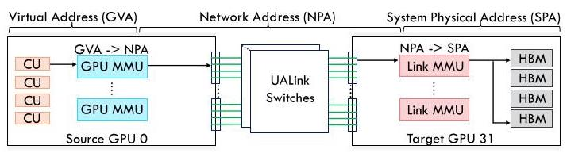
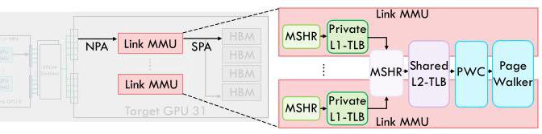
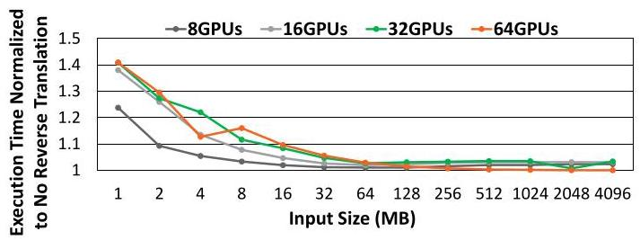
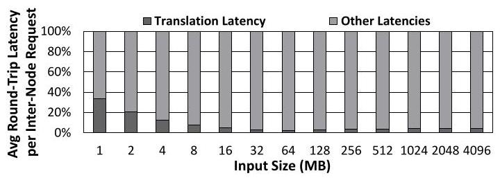
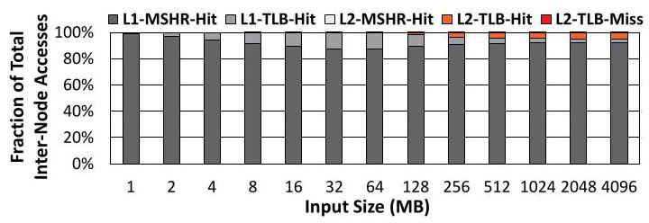
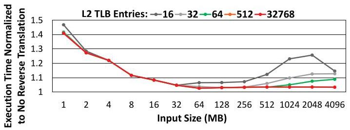

# Analyzing Reverse Address Translation Overheads in Multi-GPU Scale-Up Pods 深度解读

> **作者**：Amel Fatima, Tuan Ta, Bradford M. Beckmann  
> **会议/期刊**：arXiv 2026, arXiv:2604.02473v1  
> **一句话总结**：这篇论文首次系统分析 multi-GPU scale-up pod 中目标端 Reverse Address Translation 的性能影响，指出小规模 All-to-All collective 会被 cold TLB miss 放大到最高约 $1.4\times$ 开销，而真正值得优化的是 cold miss 隐藏而不是盲目加大 L2 Link TLB。

## 一、问题定义

大规模训练和推理已经从单机多 GPU 扩展到 multi-node multi-GPU pod。传统跨节点通信通常经由 NIC/RDMA，带宽和语义都弱于节点内互连；NVLink Network 和 UALink 这类 scale-up fabric 试图把多个节点上的 accelerator 连接成更接近统一设备的 pod，让 GPU 可以跨节点执行 direct load/store/atomic。这里引入了一个新地址空间：Network Physical Address (NPA)。源 GPU 发起远程访问时，先把自己的虚拟地址翻译成 NPA；目标 GPU 真正访问本地 HBM 前，还必须把 NPA 翻译成 System Physical Address (SPA)。作者把目标端的 NPA $\rightarrow$ SPA 过程称为 Reverse Address Translation。

Figure 2 的关键点是翻译位置发生了变化：常规 GPU MMU 在源端处理 GVA $\rightarrow$ NPA/SPA，而 Reverse Address Translation 发生在目标 GPU 的 Link MMU 上。这个设计让每个跨节点请求在到达目标端后多经过一套 translation hierarchy，因此它不是单纯的网络问题，也不是传统 source-side TLB 优化能直接覆盖的问题。

这篇论文属于 First 类型工作：它不是提出一个完整可部署系统，而是第一次把 Reverse Address Translation 的性能开销在大规模 GPU collective 场景下建模并量化。问题重要性的支撑比较 solid：UALink/NVLink 规格已经承认 Link MMU 和 Link TLB 的存在，但公开材料缺少设计细节和性能分析；同时 ML inference 越来越 latency-sensitive，小 batch 下通信延迟更难被带宽摊薄。如果目标端翻译引入 cold miss，它会直接进入 collective 的关键路径。

**动机评估**：动机成立，但适用范围需要收窄理解。论文把重点放在 MSCCLang 生成的 All-to-All/all-pairs/direct collective 上，这是 MoE 和 model parallelism 的重要通信模式，但还不能代表所有 collective、所有实现和真实生产系统。它的贡献更像是“暴露并解释一个潜在瓶颈”，而不是证明所有 UALink pod 都会遭遇同样开销。

**核心 Insight**：Reverse Address Translation 的瓶颈不是长期 steady-state 下 TLB 容量不足，而是小 collective 或 warm-up 阶段的 cold page walk。All-to-All 的访问模式是 streaming stride，空间局部性存在，时间局部性很弱；任一时刻目标 GPU 看到的活跃页数大约只与参与 GPU 数量成正比。因此，超过该 working set 的 L2 Link TLB 容量收益很小，优化重点应转向 pre-translation、software-guided prefetching 或与 compute overlap。

## 二、相关工作

论文没有单独的 Related Work 章节，相关脉络分散在 Introduction、Background 和 References 中，可以整理成四类。

第一类是 multi-GPU 和 multi-node GPU 系统。已有系统依赖 PCIe、NVLink/NVSwitch、AMD Infinity Fabric Link、HCCS，以及跨节点 InfiniBand/Ethernet RDMA。它们解决的是“GPU 如何互联”和“如何把通信调度到合适拓扑”这类问题，但对目标端网络物理地址到系统物理地址的转换开销讨论很少。

第二类是 distributed ML collective 和通信库，包括 NCCL、RCCL、oneCCL、MPI、MSCCLang 等。这些工作关注 AllReduce、AllGather、All-to-All 的算法、调度和带宽利用率。本文继承了这个背景，选择 All-to-All 作为高流量且对 MoE 关键的评测对象，但把观察焦点从 collective 算法本身移到目标端地址翻译。

第三类是传统 address translation 优化，包括更大/更高相联 TLB、多级 TLB、page walk cache、speculative/coalesced TLB、TLB prefetching 等。它们通常面向 CPU/GPU 发起访问时的 virtual-to-physical translation，即 source-side translation。本文指出这些方法不能直接回答 NPA 到 SPA 的 destination-side translation 对 collective 的影响。

第四类是 multi-GPU 数据移动优化和 GPU-centric communication 研究，例如细粒度传输优化、通信计算融合、RDMA 资源隔离和 GPU 网络建模。这些工作能降低通信开销，但大多默认地址翻译不是目标端瓶颈。本文的差异在于把 Link MMU/Link TLB 作为网络请求路径上的显式模块，分析它对端到端 collective runtime 的贡献。

## 三、技术挑战

**挑战 1：目标端翻译缺乏公开 baseline。** UALink 规格描述了 Link MMU 的存在，但没有给出可直接模拟的内部层级、容量、命中延迟和 miss 行为。作者必须构造一个合理的 baseline hierarchy，才能进一步讨论性能影响。

**挑战 2：collective 流量高度并发，cold miss 容易同步放大。** All-to-All 中每个源 GPU 会向多个目标 GPU 发送 remote store，请求在目标端同时触发 NPA $\rightarrow$ SPA。小 collective 请求数量有限，第一次访问页时的 page table walk 更难被后续大量请求摊薄。

**挑战 3：TLB 命中率本身不足以解释延迟。** Figure 7 显示超过 90% 请求可被归类为 L1-MSHR hit，但如果它们是 hit-under-miss，仍然会等待较低层级 page walk 完成。也就是说，评价指标必须区分普通 hit、hit-under-miss、L2 miss、page walk 等场景。

**挑战 4：容量规划不能简单套用“越大越好”。** 如果 All-to-All 的 active translation working set 只等于参与 GPU 数量附近，那么超大 L2 Link TLB 只会增加面积/复杂度，却不改善 runtime。论文需要通过访问轨迹和容量 sweep 验证这一点。

**挑战 5：仿真模型要同时覆盖网络和翻译层级。** Reverse Address Translation 既依赖 UALink 网络路径，也依赖目标端 Link MMU/TLB/PWC/PTW。只用高层通信模型会丢失翻译细节，只用微架构模型又无法反映 collective traffic。

## 四、解决方案

### 整体思路

论文的“方案”不是一个已经实现并评估的优化系统，而是一套 characterization methodology。作者扩展 ASTRA-sim，并使用 Omnet++ 作为 packet-level network backend，构造 UALink single-level Clos pod 和目标 GPU 上的 Reverse Address Translation hierarchy。然后以理想零翻译开销为上界 baseline，对 8、16、32、64 GPU 和 1MB 到 4GB All-to-All 输入规模做 sweep，回答三个问题：开销有多大、开销来自哪里、加大 TLB 是否有效。

Figure 3 展示了作者采用的目标端层级：每个 UALink Station 有私有 L1 Link TLB 和 MSHR，miss 后进入共享 L2 Link TLB，再进入 page walk cache，最后由共享 page table walker 处理。这个结构本身并非 UALink 官方公开实现，而是参考 GPU IOMMU 设计构造的分析 baseline。

### 贯穿示例

考虑一个 16-GPU pod 上的 1MB All-to-All。每个源 GPU 把自己的 buffer 切成多个 chunk，由 workgroup 向不同目标 GPU 发 remote store。源端 GPU MMU 先把地址转成 NPA，请求穿过 UALink switch 到达目标 GPU。目标 Link MMU 收到 NPA 后，先查该 UALink Station 的 L1 Link TLB；第一次访问某个远端页时大概率 miss，继续查共享 L2 Link TLB、page walk cache，必要时触发 page table walk，最后得到 SPA 才能访问 HBM。

对于 1MB 这种小 collective，上述第一次 page walk 的成本几乎直接进入请求延迟，因为后续可摊薄请求不多。对于 256MB 或更大的 collective，第一次访问每个页仍会产生 spike，但后续 stride 在页内移动时可以命中已经 warm 的 translation entry。于是同一套 hierarchy 在小输入下表现为 latency bottleneck，在大输入下表现为可被摊薄的 warm-up cost。

### 关键技术点

**目标端翻译层级建模。** 论文配置了 32-entry fully-associative L1 Link TLB，50ns hit latency，私有于每个 UALink Station；512-entry 2-way L2 Link TLB，100ns hit latency，共享于 GPU 内所有 station；Link MMU 使用 5-level page table、page walk cache 和 100 个并行 PTW。页大小设为 2MB。

**网络和 workload 建模。** GPU pod 采用 UALink single-level Clos，4 GPUs/node，GPU 数量 sweep 为 8/16/32/64。UALink Station 每 GPU 16 个，4 lanes/station，有效带宽 200Gbps/lane，累计 800Gbps，链路 die-to-die latency 300ns。All-to-All workload 由 MSCCLang all-pairs/direct 脚本生成，使用 remote store。

**理想翻译开销对照组。** 作者把 baseline Reverse Address Translation 与“zero Reverse Address Translation overhead”的理想配置对比，用 normalized execution time 衡量开销。这不是实际可实现系统，但能明确翻译层级贡献的上界。

**从平均开销走向访问轨迹解释。** 论文不仅看总体 runtime，还分析 per-request translation latency、round-trip latency breakdown、TLB/MSHR 层级命中场景和请求序列中的 spike。这样才能解释“为什么 1MB 坏、为什么大输入好、为什么 L2 容量过大没用”。

**优化机会而非完整优化实现。** 论文最后提出两条方向：pre-translation fused kernels，在 compute 阶段提前触发翻译；software-guided TLB prefetching，利用静态 buffer layout 或动态 profiling 预填 TLB。这两者都针对 cold miss 隐藏，而不是扩大 TLB。

### 与已有方案的对比

相比传统 source-side TLB 优化，本文把 bottleneck 放在 destination-side Link MMU 上；相比 collective scheduling/communication optimization，它关注的是通信请求到达目标后才能发生的地址转换；相比单纯增加硬件容量，它用访问模式证明 modest L2 capacity 已足够覆盖 working set。局限是，论文没有实现并评估 proposed optimizations，因此“如何低开销地发 pre-translation 请求”“prefetch 错误会不会污染 TLB”仍是未来工作。

## 五、实验评估

### 实验设定

实验平台是扩展后的 ASTRA-sim + Omnet++。workload 是 MSCCLang 生成的 All-to-All all-pairs/direct collective，输入规模从 1MB 到 4GB，GPU 数量为 8、16、32、64，按 4 GPUs/node 组织。评测指标包括 normalized execution time、average Reverse Address Translation latency per request、round-trip latency breakdown、Link TLB/MSHR hit/miss breakdown、per-request latency trace，以及不同 L2 Link TLB 容量下的性能。

关键硬件参数包括：local data fabric latency 120ns，HBM access latency 150ns，UALink switch latency 300ns，UALink link latency 300ns，L1 Link TLB 32 entries/50ns，L2 Link TLB 512 entries/100ns，page walk cache 16/32/64/128 entries，100 parallel PTWs。作者还假设该通信 workload 不复用普通 cache，因此 memory access miss all cache levels，并用 120ns 作为从 CU 到 NoC fabric 的固定代价。

### 主要实验与结论

Figure 4 是最直接的结论图：1MB collective 在 16/32/64 GPUs 上出现最高约 $1.4\times$ 的 normalized execution time；16MB 左右下降到约 $1.1\times$；继续增大到 64MB 以上后，开销基本接近 1。说明 Reverse Address Translation 对小 collective 更敏感，因为每个请求更可能遇到 cold page table walk，且没有足够后续流量摊薄。

Figure 6 把 16-GPU 下每个请求的 round-trip latency 拆开看。1MB collective 中，Reverse Address Translation 最多占总请求延迟约 30%；随着 collective 变大，这个比例持续下降。这一结果把 Figure 4 的端到端 slowdown 解释为请求级延迟贡献，而不是单纯的网络带宽现象。

Figure 7 显示多数请求看起来是 L1-MSHR hit，超过 90%。但论文进一步用 Figure 8 解释：这些 hit 里有大量 hit-under-miss，尤其 1MB 时 L2-TLB miss 和 L2-TLB-hit-under-miss 主导延迟。随着输入从 2MB 增至 64MB，L1-TLB hit 逐渐占主导，说明第一次 page walk warm 了 translation hierarchy。到 64MB 时，32-entry L1 TLB 到达容量边界，但共享 L2 TLB 可以补偿，因此总体性能没有明显崩溃。

Figure 9 和 Figure 10 的 per-request latency trace 进一步给出访问模式解释。1MB 场景几乎所有请求都遇到高 translation latency；256MB 场景则表现为多个 spike：第一个 spike 是所有目标 GPU 上的初始 cold miss，后续小 spike 对应 stride 跨页后的新页访问。这个模式说明 All-to-All 在页内有 spatial locality，但跨页后很少回访旧页，temporal locality 很弱。

Figure 11 验证了 L2 Link TLB 的容量判断。作者在 32-GPU 配置中 sweep 16、32、64、512、32768 entries。16-entry L2 在较大输入下明显不够；但 32 entries 已经等于同时访问一个页的 GPU 数量，性能基本稳定。继续增大到 64、512、32768 entries 没有显著收益。因此对这类 collective，L2-TLB over-provisioning 不是优先方向。

### 结论支撑性分析

实验较好支撑了两个主结论：小 collective 中 cold miss 会显著拖慢 Reverse Address Translation；L2 Link TLB 容量超过 active GPU/page working set 后收益递减。具体数字包括 1MB collective 最高约 $1.4\times$ slowdown，16MB 约 $1.1\times$，1MB 请求中翻译可占 round-trip latency 约 30%，以及 32-entry L2 在 32-GPU sweep 中已接近更大容量配置。

主要限制也很清楚。第一，实验只覆盖 All-to-All all-pairs/direct，并不能自动推广到 AllReduce、AllGather 或真实框架的多阶段 collective。第二，结果来自 simulation，Link MMU 内部配置是合理 baseline，不是公开硅片实现。第三，论文提出的 fused pre-translation 和 software prefetching 没有被实现评测，因此它们目前是 design opportunity，而不是被证明有效的优化。

## 六、附加洞察

**结论 1**：高 L1-MSHR hit rate 不等于低延迟。  
*出处*：Section 4.3, Figure 7/8。  
*推理链条*：Figure 7 观察到超过 90% 请求归入 L1-MSHR hit；但 Figure 8 进一步拆解后发现 1MB 场景中 L2-TLB miss 和 L2-TLB-hit-under-miss 仍占主导；hit-under-miss 需要等待较低层级 page walk 完成，因此简单命中率会掩盖真实 stall。

**结论 2**：L1 Link TLB 容量触顶并不必然造成端到端性能崩溃。  
*出处*：Section 4.3, Figure 8。  
*推理链条*：作者观察到 64MB 时 32-entry L1 Link TLB 达到容量边界，L1 hit 比例下降；但共享 L2 Link TLB 命中可以补偿 L1 miss，因此 overall performance 仍稳定。这说明层级结构的抗压能力比单级容量更关键。

**结论 3**：对该 All-to-All 访问模式，L2 Link TLB 的有效需求接近“参与 GPU 数量”，不是 buffer 总页数。  
*出处*：Section 4.4/4.5, Figure 10/11。  
*推理链条*：请求在页内 stride，跨页后很少回访旧页；任一时刻每个参与 GPU 大致贡献一个 active page；因此 32-GPU 配置下 32-entry L2 已能覆盖主要 working set，64/512/32768 entries 不再明显改善性能。

**结论 4**：Reverse Address Translation 对 inference 的风险高于大 batch training。  
*出处*：Section 5。  
*推理链条*：training 常用大 batch，更容易用带宽和请求量摊薄延迟；inference 越来越小 batch、latency-sensitive，现代 LLM inference 中 network latency 可占总 runtime 最高约 20%；因此小 collective 的 cold translation miss 更可能进入用户可见延迟。

**结论 5**：论文真正鼓励的硬件方向是“适度容量 + 主动 warm-up”，而不是把 Link TLB 做到很大。  
*出处*：Section 5/6, Figure 11。  
*推理链条*：容量 sweep 显示超大 L2 Link TLB 收益有限；cold miss 才是小 collective 的关键；因此 pre-translation fused kernels 和 software-guided prefetching 更符合瓶颈来源。

## 七、总结与评价

这篇论文的最大贡献是把 UALink/NVLink 这类 scale-up fabric 中容易被忽略的 destination-side address translation 拉到性能分析台面上，并用 collective-level simulation 说明它对小 All-to-All 的端到端影响可以达到约 $1.4\times$。它的 insight 很有工程价值：不要只看平均命中率，也不要默认大 TLB 解决一切；对于 streaming collective，cold miss 隐藏和预测式 warm-up 更重要。

不足在于论文更像一篇 early characterization paper。它没有实现 pre-translation 或 TLB prefetch，也没有覆盖更多 collective 算法、真实生产 trace、不同 page size、不同 UALink topology 或 Link MMU 实现变体。结论适合指导下一步体系结构设计，但还不能直接转化为“某个 UALink 产品必须这样配置”的硬件规格。

如果继续做下去，最有价值的方向是把 proposed opportunities 变成可评估机制：在 MSCCLang/NCCL/RCCL 层插入 pre-translation primitive，量化 warm-up 请求的带宽占用、TLB pollution、错误预测代价，以及它与 compute-communication overlap 的真实收益。

## 八、章节脉络与段落速览

- **Abstract**：提出 Reverse Address Translation 是 scale-up fabric 中目标端 NPA $\rightarrow$ SPA 的关键步骤，并概述 cold miss、$1.4\times$ slowdown、TLB 容量收益递减和两类优化方向。

- **Section 1 · Introduction**：从大模型规模增长引出 multi-GPU/multi-node 通信压力，并定义本文问题。
  - 段 1：大模型参数规模增长推动更高 memory/compute 需求。
  - 段 2：训练和推理依赖 tensor/model/data parallelism 等策略跨 GPU 分布执行。
  - 段 3：分布式执行引入密集 inter-GPU communication，collective library 成为关键基础设施。
  - 段 4：基础设施扩展分为节点内 vertical scaling 和节点间 horizontal scaling，后者仍受 NIC-mediated bandwidth 限制。
  - 段 5：NVLink Network 和 UALink 通过跨节点 memory-semantic fabric 缩小节点内外差距。
  - 段 6：跨节点 scale-up fabric 引入 NPA，并需要目标端 Link MMU 执行 NPA 到 SPA 的 Reverse Address Translation。
  - 段 7：传统 address translation 优化多关注源端，未解释 destination-side translation。
  - 段 8：本文扩展 ASTRA-sim/Omnet++ 建模 Link MMU/TLB，并指出 cold miss 和 working set 是性能关键。
  - 段 9：列出四项贡献：首次分析、warm-up/cold miss 发现、两类优化方向、仿真框架扩展。

- **Section 2 · Background**：介绍 multi-GPU 系统、UALink 通信、Reverse Address Translation baseline 和 All-to-All 背景。
  - **2.1 Multi-Node Multi-GPU Systems**：单节点 multi-GPU 延迟低但规模受限，多节点系统可扩展但通信更复杂，UALink 提供开放 accelerator-to-accelerator scale-up 标准。
  - **2.2 Communication through UALink**：解释 UALink station、lane、link、switch 和 pod 内 direct load/store 路由方式。
  - **2.3 Reverse Address Translation**：定义源端 GVA $\rightarrow$ NPA 与目标端 NPA $\rightarrow$ SPA 的分工。
  - **2.4 Baseline System**：给出本文采用的 L1 Link TLB、共享 L2 Link TLB、page walk cache、PTW 层级。
  - **2.5 Collectives In Distributed ML Models**：说明 All-to-All 在 model parallelism 和 MoE 中常见，因此作为评测目标。

- **Section 3 · Methodology**：说明模拟平台、workload 生成方式和系统参数。
  - 段 1：使用 ASTRA-sim + Omnet++，网络为 UALink single-level Clos，并评测 2MB page size。
  - 段 2：使用 MSCCLang all-pairs/direct 生成 All-to-All，大小按单 GPU 输入/输出 buffer 较大者定义，并假设普通 cache 无复用。
  - Table 1：列出 GPU 数、链路、HBM、TLB、Link MMU、UALink station/switch 等参数。

- **Section 4 · Evaluation and Analysis**：逐步解释 Reverse Address Translation 开销、请求级延迟、层级命中场景、访问轨迹和 L2-TLB 容量。
  - **4.1 Reverse Address Translation Overheads**：比较真实翻译 baseline 与零翻译理想配置，发现小 collective 最高约 $1.4\times$，16MB 约 $1.1\times$。
  - **4.2 Quantifying Per-Request Latency**：用请求级平均延迟和 round-trip breakdown 说明 1MB 时翻译可占约 30% 请求延迟。
  - **4.3 Hierarchical Translation Scenarios**：指出 L1-MSHR hit rate 很高但仍可能 hit-under-miss，并解释 L1/L2 层级如何 warm up。
  - **4.4 Per request Reverse Address Translation Latency Patterns**：通过 1MB 和 256MB trace 展示 cold miss spike、页内 spatial locality 和弱 temporal locality。
  - **4.5 Impact of L2-TLB Sizes**：通过 L2 容量 sweep 证明 32-GPU 下 32-entry 已基本足够，继续扩大收益很小。

- **Section 5 · Summary**：归纳两个观察：小 collective 的 cold TLB miss 主导性能，streaming access 使 L2-TLB 需求低；并强调 inference latency 的现实意义。

- **Section 6 · Observations and Opportunities**：提出 pre-translation fused kernels 和 software-driven TLB prefetching 两个未来优化方向，并强调重点是降低 cold miss 而非 over-provision TLB。

- **Section 7 · Conclusion**：重申小 All-to-All 中 Reverse Address Translation 最高约 $1.4\times$ slowdown，较大 collective 可由 warm cache 摊薄，未来应探索 latency-hiding 技术。

- **References**：覆盖大模型、collective communication、multi-GPU interconnect、UALink/NVLink、address translation/TLB 优化和仿真平台等背景文献，支撑正文脉络。
