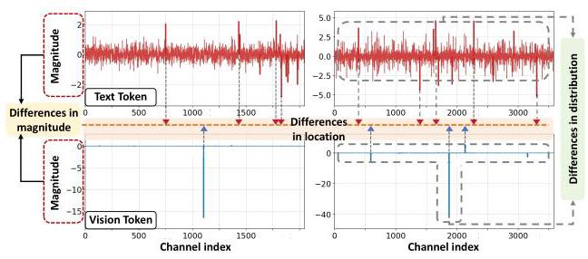
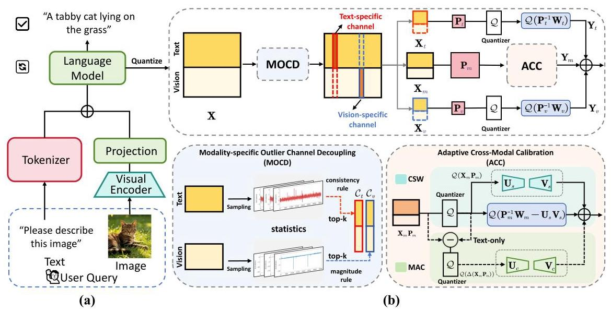
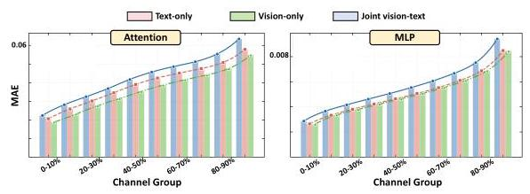
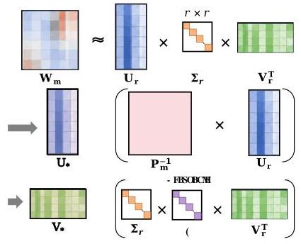

# Breaking Modality Heterogeneity in Low-Bit Quantization for Large Vision-Language Models 深度解读

> **作者**：Yi Zhong, Haotong Qin, Xindong Zhang, Lei Zhang, Guolei Sun  
> **会议/期刊**：arXiv 2026（arXiv:2605.19929v1，论文中未标注会议接收信息）  
> **一句话总结**：这篇论文提出 SplitQ，用 modality-specific outlier channel decoupling 和 adaptive cross-modal calibration 解决 VLM 低比特 PTQ 中图像/文本激活分布互相干扰的问题，使 Qwen2.5-VL 与 LLaVA-v1.5 在 W4A4、W3A3 甚至 W3A2 下仍能保持可用精度。

## 一、问题定义

这篇论文解决的是 Vision-Language Model（VLM）部署中的低比特 post-training quantization（PTQ）问题。VLM 推理时通常先把图像送入 visual encoder，再把视觉 token 与文本 token 一起交给语言模型部分；为了降低显存、带宽和算力开销，工程上希望把权重和激活都压到 W4A4、W3A3、W3A2 这样的低精度配置。传统 LLM PTQ 的一个重要路线是 transformation-based PTQ：在 linear layer 中插入等价变换矩阵 `P`，把激活中的 outlier 转移或平滑到权重侧，从而让量化误差更小。

问题在于，VLM 不是纯文本 LLM。图像 token 和文本 token 共享同一个 LLM backbone，但它们在 activation channel 上的分布不同：视觉 token 更容易在少数 channel 上出现很大的 magnitude outlier，而文本 token 的异常更像跨 token 的相对响应不稳定。已有 transformation-based PTQ 往往对所有 token 和所有 channel 学一个共享变换，或者粗略按模态分别处理，这会把两类分布差异揉在一起，导致优化目标被互相污染。

上图是论文动机的核心证据：同一层里，文本和视觉激活不只是数值尺度不同，异常 channel 的位置也不同。换句话说，"多模态异质性"不是一个全局缩放问题，而是一个 channel-wise structural distribution 问题。

本文属于**非 First 类型**工作：VLM quantization 和 transformation-based PTQ 已有较多研究，SplitQ 的切入点是指出现有方法没有把 modality-specific outlier channel 明确拆开，也没有在拆开后继续处理主通道里的残余跨模态误差。

**动机评估**：动机比较 solid。论文用 Figure 2 展示分布差异，用 Figure 3 展示 joint vision-text calibration 会放大权重量化误差，并在 Table 1 中显示普通方法在 W4A4 下几乎崩溃，而 SplitQ 仍能接近 FP16。不过也要注意，论文主要围绕 Qwen2.5-VL 与 LLaVA-v1.5，且默认只量化 LLM component；对更多 VLM 架构、端侧硬件和真实 mixed workload 的覆盖仍然有限。

**核心 Insight**：跨模态异质性不是均匀铺在所有 channel 上，而是集中在少数、且文本/视觉位置不同的 channel 上。因此，先把 vision-specific 与 text-specific outlier channel 从主通道中拆出来分别量化，再对剩余 main channel 做轻量校准，比强行用一个全局变换去兼顾所有模态更合理。

## 二、相关工作

论文把相关工作分成两条主线。

第一条是 LLM quantization。按训练阶段分，有 quantization-aware training（QAT）和 post-training quantization（PTQ）。QAT 通常精度更好，但需要额外训练，成本高；PTQ 更适合快速部署。PTQ 又可以分为 weight-only quantization 和 weight-activation quantization：前者降低权重显存，后者进一步降低激活带宽和计算开销，但更容易被 activation outlier 影响。GPTQ、AWQ、SmoothQuant、OmniQuant、SpinQuant、FlatQuant 等方法分别从二阶近似、salient channel 保护、activation smoothing、learned clipping、rotation/affine transform 等角度改进量化友好性。

第二条是 VLM quantization。VLM 中额外出现了 modality-dependent activation distribution、视觉 token 冗余、KV cache 开销等问题。MBQ 在 calibration 时考虑不同模态敏感性，MQuant 给视觉/文本 token 分配静态 scaling，MASQuant 学 modality-aware smoothing factor，Q-VLM、VLMQ、QSVD、WSVD、Bi-VLM 分别从 block partition、token saliency、SVD 压缩、head-level low-rank、hybrid quantization 等角度切入。这些工作说明 VLM 量化不能完全套用 LLM 经验，但它们要么没有显式分离 modality-specific outlier channel，要么没有解决拆分后 main channel 中残余跨模态误差。

SplitQ 的位置可以理解为：站在 FlatQuant/SmoothQuant 一类 transformation-based PTQ 的基础上，把 VLM 的问题进一步细化到 channel 级别，并用低秩补偿分支处理剩余误差。

## 三、技术挑战

**挑战 1：跨模态差异是 channel-wise 的，不是简单的全局尺度差异。** 如果只是给文本和视觉各自一个静态缩放，仍然会错过"异常 channel 位置不同"这个结构信息；如果继续用共享 `P`，异常 channel 会互相拉扯优化目标。

**挑战 2：文本和视觉 outlier 的判定准则不同。** 视觉 outlier 可以较自然地用最大绝对激活衡量；文本 outlier 不总是最大 magnitude，而是跨 token 的相对响应不稳定。因此，简单用同一个 top-k magnitude 规则选文本/视觉 channel 会选错。

**挑战 3：拆掉显著 outlier 后，main channel 仍有残余跨模态误差。** 论文观察到 FlatQuant+MOCD 在 W4A4 表现很好，但到了 W3A3/W3A2 仍不够稳定，说明主通道里的细微分布差异在 ultra-low-bit 下会被放大。

**挑战 4：低秩补偿要同时满足可学习、不过拟合和可量化。** 校准样本有限，完全自由的 LoRA/QLoRA 式参数容易过拟合；固定 SVD 又不适应图文异质分布。SplitQ 需要一个被主权重结构约束、但仍能自适应重加权的低秩形式。

**挑战 5：多分支设计必须有实际部署价值。** MOCD、CWS、MAC 都会引入额外分支和算子，如果没有 fused kernel 或者低比特下的收益不足，方法可能只在离线精度表里好看。

## 四、解决方案

### 整体思路

SplitQ 的整体逻辑是"先拆明显冲突，再校准残余误差"。它先用 MOCD（Modality-specific Outlier Channel Decoupling）把输入 channel 分为三组：modality-compatible main channels、text-specific outlier channels、vision-specific outlier channels。文本和视觉专属 channel 分别走独立变换和量化路径，避免互相干扰；主通道再通过 ACC（Adaptive Cross-Modal Calibration）处理剩余的 weight-side 与 activation-side 量化误差。

Figure 1 把这个流程串起来：输入激活 `X` 先被 MOCD 拆成 `X_t`、`X_v`、`X_m`；文本/视觉 outlier channel 使用各自的 `P_t`、`P_v` 变换，主通道使用 `P_m` 与 ACC；最后三个路径的输出相加，得到量化 linear layer 的输出。

### 贯穿示例

可以把一个 VLM linear layer 想象成一排传感器 channel，它同时接收两种货物：图像 token 和文本 token。少数传感器对图像货物特别敏感，一来图像 token 数值就爆高；另一些传感器对文本货物不是绝对值最高，但它们在不同文本 token 上排名变化很大，导致量化时不稳定。如果把所有货物混在一起调一套刻度尺，视觉异常会把尺子拉大，文本细节会被压扁；文本不稳定又会让视觉平滑不准。SplitQ 的做法是先把"图像专用异常传感器"和"文本专用异常传感器"单独拿出来各调各的尺子，剩下大多数正常传感器再用一套主尺子，并给这套主尺子加两个小补偿器：一个处理权重侧被跨模态差异放大的误差，另一个专门补文本激活侧的细粒度误差。

### 关键技术点

**1. Transformation-based PTQ 基础。** 对 linear layer `Y = XW`，TPTQ 利用等价变换 `Y = (XP)(P^{-1}W)`，让 `XP` 和 `P^{-1}W` 更容易量化。优化目标是让量化后的 `Q(XP)Q(P^{-1}W)` 接近原始 `XW`。这个基础给 SplitQ 提供了每个分支可学习变换的接口。

**2. MOCD：先选 vision-specific channel，再选 text-specific channel。** 对视觉 token，论文用每个 channel 的最大绝对激活作为 saliency score，选 top-`K_v` 得到 `C_v`。对文本 token，作者先对每个 token 内的 channel 激活做 percentile rank，再对某个 channel 在所有文本 token 上的 rank 序列聚类，用 cluster 内方差衡量响应不稳定性，选 top-`K_t` 得到 `C_t`。剩余 channel 是 `C_m`。这个顺序对应前面的观察：视觉异常主要是 magnitude outlier，文本异常更接近 consistency outlier。

**3. 三路径量化避免 outlier 干扰。** 拆分后，`X_t/W_t` 和 `X_v/W_v` 分别使用 `P_t`、`P_v`，主通道 `X_m/W_m` 使用 `P_m`。这样文本/视觉专属异常不再强迫共享同一个 transformation，主通道的分布也更干净。

**4. CWS：用低秩分支吸收 weight-side cross-modal sensitivity。** 即使做完 MOCD，主通道中 joint vision-text calibration 仍会放大 `P_m^{-1}W_m` 的量化误差。

Figure 3 的要点是：在 attention 和 MLP 中，joint vision-text 的 MAE 曲线普遍高于 text-only 或 vision-only，尤其在高误差 channel group 中更明显。CWS 因此把 `P_m^{-1}W_m` 拆成主残差和低秩项 `U_sV_s`，分别量化计算，让低秩分支吸收跨模态敏感模式。

**5. MAC：只补文本侧 activation residual。** 权重是静态的，可以结构分解；激活是输入相关的，更难提前重构。MAC 直接近似 activation quantization residual 造成的输出偏差，并且只对 text token 加补偿。论文的理由是文本激活承载更密集的语义，量化噪声更敏感；实验也显示 text-only compensation 明显优于 vision-only。

**6. Learnable constrained low-rank matrix。** CWS/MAC 都不是任意学习一个低秩矩阵，而是先对 `W_m` 做 rank-`r` truncated SVD，再把低秩结构锚定到 `P_m^{-1}` 与主权重的 SVD 子空间，只学习一个对角 gating matrix `G_*` 来重加权奇异方向。

Figure 4 表明这个设计不是普通 LoRA：`U_*` 来自 `P_m^{-1}U_r`，`V_*` 来自 `Σ_r G_* V_r^T`。它保留主权重的结构先验，同时给不同分支一点自适应空间，降低小校准集上的过拟合风险。

### 与已有方案的对比

相对 SmoothQuant/FlatQuant 一类共享 transformation 方法，SplitQ 的优势是把 VLM 的异质性显式建模到 channel grouping 里；相对 MBQ/MASQuant 这类 modality-aware 方法，它更细到 outlier channel 级别，并且处理了 main channel 的残余误差。主要代价是多分支路径与低秩分支带来的 kernel 和内存访问复杂度；论文虽然实现了 fused CUDA kernel，但 Table 7 也显示 SplitQ 比 MBQ、MASQuant 慢一些。

## 五、实验评估

### 实验设定

论文评估四个 VLM：Qwen2.5-VL-3B/7B 和 LLaVA-v1.5-7B/13B。主实验默认只量化 LLM component，visual encoder 保持 FP16；附录单独测试 visual encoder quantization。Qwen2.5-VL 的 baseline 包括 SmoothQuant、MBQ、MASQuant；LLaVA-v1.5 的 baseline 包括 DuQuant、Q-VLM、QSVD。Benchmark 包括 MMMU、OCRBench、TextVQA、SEED-Bench、VizWiz、ScienceQA。默认 MOCD 分别为文本和视觉选 2% outlier channel；CWS 和 MAC 的低秩比例默认约为 2% 与 3%，辅助分支保留 4-bit quantization lower bound。

### 主要实验与结论

Qwen2.5-VL 上的结果最能说明问题：

| 模型 | 设置 | FP16 Avg. | 最强 baseline Avg. | SplitQ Avg. | 结论 |
|---|---:|---:|---:|---:|---|
| Qwen2.5-VL-3B | W4A8 | 70.0 | 63.9 | 70.4 | SplitQ 接近/略高于 FP16，明显高于 baseline |
| Qwen2.5-VL-7B | W4A8 | 74.3 | 69.1 | 74.2 | 只损失 0.1 平均分 |
| Qwen2.5-VL-3B | W4A4 | 70.0 | 5.7 | 69.6 | baseline 基本崩溃，SplitQ 接近 FP16 |
| Qwen2.5-VL-7B | W4A4 | 74.3 | 7.7 | 73.5 | 仍保持 98.9% FP16 平均分 |
| Qwen2.5-VL-7B | W3A3 | 74.3 | 无有效输出 | 69.5 | 保留 93.5% FP16 性能 |
| Qwen2.5-VL-7B | W3A2 | 74.3 | 未报告有效 baseline | 53.7 | 极低比特下仍能输出可用结果，但精度明显下降 |

LLaVA-v1.5 上 SplitQ 也保持优势：7B 在 W4A8/W4A4 的平均分为 64.1/62.9，而 FP16 是 63.5；13B 在 W4A8/W4A4 为 66.9/66.4，接近 FP16 66.8。更低比特下，其他 baseline 多数无有效结果，而 SplitQ 在 7B W3A3/W3A2 仍有 61.2/54.1，在 13B W3A3/W3A2 仍有 63.6/59.3。

消融实验支持了几个关键设计：

| 消融点 | 关键数字 | 说明 |
|---|---|---|
| MOCD channel selection | W3A3 下 Qwen2.5-VL-7B Average：None 59.9，Random 63.5，MOCD(k=3) 65.3 | modality-aware outlier selection 比不选或随机选更好 |
| calibration set 稳定性 | Jaccard similarity：Qwen2.5-VL-7B 为 93.3%-94.5%，LLaVA-v1.5-7B 为 89.5%-95.7% | outlier channel selection 对校准集大小较稳定 |
| MAC 补偿对象 | W3A2 下 7B Average：w/o MAC 31.4，vision 40.6，text 50.9，vision & text 50.9 | text-only 是主要收益来源，双模态补偿并不额外提升 |
| 组件逐步叠加 | W3A2 下 7B Average：FlatQ 9.6，MOCD 22.5，MOCD+CWS 31.4，Full 50.9 | ultra-low-bit 下三部分缺一不可 |
| 低秩参数化 | CWS fixed SVD 在 3B/7B W3A3 Average 为 56.7/64.3，低于 w/o CWS 的 59.7/65.8；learnable 为 61.7/68.0 | 固定 SVD 不适合跨模态噪声，受约束可学习更合理 |

效率方面，论文在 RTX 4090、seq len=2048、batch size=8、W4A4 下比较 prefill：FP16 为 2146.01 ms / 17.27 GB；SplitQ 为 742.17 ms / 9.48 GB，对应 2.89x speedup 和 1.82x memory saving。代价是它比 MBQ 的 643.68 ms 和 MASQuant 的 696.44 ms 慢，说明精度收益来自更复杂的校准路径。

### 结论支撑性分析

实验总体能支撑论文主张：SplitQ 在多个 VLM、多个 benchmark 和多个 bit setting 下确实比 baseline 更稳，尤其 W4A4 与 W3A3 的优势非常明显。消融也较完整地验证了 MOCD、CWS、MAC 的必要性。

但实验也有边界。第一，主实验主要量化 LLM component，visual encoder 量化只在附录做了较小范围验证。第二，效率只在 RTX 4090 prefill 场景报告，尚不能代表所有端侧或数据中心部署。第三，W3A2 虽然"能跑"，但精度下降较大；case study 里也能看到 SplitQ 在一些具体样例上仍会出错，因此不能把它理解为 ultra-low-bit VLM 的完全解决方案。

## 六、附加洞察

**结论 1：MOCD 的 outlier channel 选择对校准集大小相对稳定。**  
- *出处*：Section 5.3 / Table 3。  
- *推理链条*：PTQ 通常只拿少量 calibration samples；作者用 32、64、256 样本选出的 channel 与默认 128 样本比较 Jaccard similarity，Qwen2.5-VL-7B 保持在 93.3%-94.5%，LLaVA-v1.5-7B 保持在 89.5%-95.7%。这说明 MOCD 找到的不是随机噪声，而是较稳定的结构性 channel。不过样本规模仍偏小，且只报告两个模型。

**结论 2：文本激活比视觉激活更需要 activation compensation。**  
- *出处*：Section 5.3 / Table 5。  
- *推理链条*：作者比较无 MAC、vision-only、text-only、vision&text 四种设置；W3A2 下 7B Average 从 31.4 提升到 vision-only 的 40.6，但 text-only 直接到 50.9，vision&text 仍是 50.9。这支持"文本语义密度更高、量化噪声更敏感"的解释，也说明多补视觉分支不一定值得。

**结论 3：固定 SVD 低秩分支在 VLM 量化中可能适得其反。**  
- *出处*：Appendix A.2 / Table 10、Table 11。  
- *推理链条*：固定 SVD 在单模态压缩中常作为结构先验，但 VLM 的图文分布不统一；实验中 fixed CWS 在 3B/7B W3A3 Average 为 56.7/64.3，甚至低于 w/o CWS 的 59.7/65.8。MAC 也类似，fixed 为 58.9/64.4，低于 w/o MAC 的 60.0/66.0。因此作者采用 SVD 子空间加 learnable gating，而不是纯固定分解。

**结论 4：SplitQ 的额外分支开销不大，但确实存在。**  
- *出处*：Section 5.4 / Table 7，Appendix A.3 / Table 12。  
- *推理链条*：batch size=8 时，MOCD-only prefill 为 648.13 ms，Full SplitQ 为 742.17 ms，说明 CWS+MAC 带来约 14.5% 额外延迟；显存从 8.89 GB 到 9.48 GB。相比 FP16 仍有 2.89x speedup 和 1.82x memory saving，但与 MBQ/MASQuant 相比延迟稍高。

**结论 5：visual encoder 也能 W4A4，但更激进的组合仍会退化。**  
- *出处*：Appendix A.4 / Table 13。  
- *推理链条*：FP16 visual encoder + W4A4 LLM 的 Average 是 67.7，W4A4 visual encoder + W4A4 LLM 是 67.5，几乎不变；但到 W4A4 visual encoder + W3A2 LLM 时 Average 只有 46.3。这说明 SplitQ 对视觉编码器量化有潜力，但系统瓶颈仍主要在极低比特 LLM 侧。

**结论 6：case study 显示 SplitQ 改善稳定性，但不是逐例保证正确。**  
- *出处*：Appendix A.5。  
- *推理链条*：作者展示 ScienceQA 样例，SplitQ 在 Case 2、3、6、7 的低比特输出较稳定，且在 Case 4 的 W4A8 比 FP16 更正确；但 Case 8 中所有方法包括 SplitQ 都给错，Case 1/4/5 的 W3A3 也出现错误推理。这提示主表平均分提升并不等于所有推理链都可靠。

## 七、总结与评价

SplitQ 的贡献在于把 VLM PTQ 的核心障碍从"多模态分布不同"进一步精确到"少量、模态专属、位置不同的 outlier channel"，并围绕这个 insight 设计了 channel decoupling 与 residual calibration。论文最亮的地方是问题拆得准：MOCD、CWS、MAC 分别对应显著 outlier、weight-side residual、activation-side residual，消融结果也能逐层支撑。

不足也比较清楚。方法复杂度比简单 PTQ 高，需要 fused CUDA kernel 才能把多分支开销压住；默认 2% channel ratio 与固定低秩比例可能不是所有模型最优；主实验主要覆盖 LLM component，端到端多硬件部署证据还不充分。后续值得探索的是动态 channel ratio、硬件感知分支融合，以及更系统的 visual encoder + LLM 联合量化策略。

## 八、章节脉络与段落速览

- **Abstract**：概述 VLM 低比特 PTQ 受图文 activation heterogeneity 影响，提出 SplitQ 的 MOCD 与 ACC，并报告 W3A3 下保留 93.5% FP16 性能。

- **Section 1 · Introduction**：从 VLM 部署成本引出 PTQ，再指出现有 transformation-based PTQ 难以处理图文异质性。
  - ¶1 介绍 VLM 应用和资源开销，说明 PTQ 尤其是 transformation-based PTQ 的部署价值。
  - ¶2 指出现有 LLM PTQ 迁移到 VLM 时遇到图文 activation distribution 异质性，且 outlier channel 位置不同。
  - ¶3 提出 SplitQ，说明 MOCD 如何拆分 channel，ACC 如何处理剩余误差。
  - ¶4 用三条贡献总结本文：发现 channel-dependent heterogeneity、提出 MOCD+ACC、在多个 benchmark 上达到 SOTA。

- **Section 2 · Related Work**：把相关研究按 LLM quantization 与 VLM quantization 两类组织。
  - **2.1 · LLM Quantization**：概括 QAT/PTQ、weight-only/weight-activation quantization，以及 GPTQ、AWQ、SmoothQuant、OmniQuant、SpinQuant 等代表方法。
  - **2.2 · VLM Quantization**：列举 MBQ、MQuant、MASQuant、Q-VLM、VLMQ、QSVD、WSVD、Bi-VLM 等 VLM 量化方向，并指出多模态输入带来的新问题。

- **Section 3 · Transformation-based PTQ**：给出 PTQ 和 TPTQ 的数学基础。
  - ¶1 定义量化函数、scale、zero-point，以及 WxAy 记号。
  - ¶2 解释用变换矩阵 `P` 保持 linear layer 等价计算并改善量化友好性。
  - Algorithm 1 给出 SplitQ linear layer 的三路径计算和 ACC 分支。
  - ¶3 写出 reconstruction loss，说明可学习参数如何被优化。

- **Section 4 · Methodology**：正式介绍 SplitQ。
  - ¶1 总览方法结构：先讲动机，再讲 MOCD，最后讲 ACC。
  - **4.1 · Motivations**：说明 Figure 2 的三个观察：图文分布不同、outlier channel 占少数、两种模态 outlier channel 不同。
    - ¶1 用 Figure 2 证明 modality-specific outlier channel 的存在。
    - ¶2 解释共享 transformation 会让两类 outlier 互相干扰。
    - ¶3-4 定义 `C_m/C_t/C_v` 三组 channel 及其矩阵拆分。
    - ¶5 说明三组 channel 会走不同 transformation。
    - ¶6 指出 main channel 仍有残余跨模态差异，因此需要 ACC。
  - **4.2 · Modality-specific Outlier Channel Decoupling**：描述如何选择文本和视觉专属 channel。
    - ¶1 定义 channel split 的目标。
    - ¶2 用最大绝对激活选 vision-specific outlier channel。
    - ¶3 用 percentile rank 与聚类方差选 text-specific outlier channel。
    - ¶4 定义剩余 main channel。
    - ¶5 说明文本/视觉 outlier channel 分别使用独立 transformation 量化。
  - **4.3 · Adaptive Cross-modal Calibration**：处理 main channel 中残余误差。
    - ¶1-2 引入 main path 的共享 `P_m`，并定义 weight-side 与 activation-side quantization error。
    - ¶3-4 提出 CWS，用低秩 `U_sV_s` 吸收跨模态敏感的权重成分。
    - ¶5-6 提出 MAC，只对 text-side activation residual 做输出补偿。
    - ¶7-8 提出 constrained learnable low-rank matrix，用 SVD 子空间加 diagonal gating 平衡先验和可学习性。

- **Section 5 · Experiments**：验证 SplitQ 的精度、消融和效率。
  - **5.1 · Experimental Setups**：说明模型、baseline、benchmark、默认 channel ratio、低秩比例和辅助分支量化下限。
  - **5.2 · Main Results**：Table 1 证明 Qwen2.5-VL 上 SplitQ 在 W4A4/W3A3 明显优于 baseline，Table 2 证明 LLaVA-v1.5 上也能泛化。
  - **5.3 · Ablation Study**：依次分析 channel selection rule、cluster number、calibration set stability、MAC compensation target 和核心组件叠加。
  - **5.4 · Inference Speedup**：报告 RTX 4090 上 W4A4 prefill speedup 和 memory saving，同时暴露 SplitQ 比更简单 baseline 稍慢。

- **Section 6 · Conclusion**：总结 SplitQ 通过 channel-level decoupling 与 cross-modal calibration 推进 VLM 低比特量化，并承认多分支开销和固定 channel ratio 的限制。
  - ¶1 总结方法和主要结果。
  - ¶2 说明限制：多分支计算有额外开销，channel ratio 固定，未来可做硬件感知优化和动态调整。

- **Appendix A · Technical Appendices and Supplementary Material**：补充 rank、低秩设计、效率、视觉编码器和 case study。
  - **A.1**：CWS 在 W3A3 偏好 0.02 rank ratio、W3A2 偏好 0.03；MAC 在 W3A3 偏好 0.03、W3A2 偏好 0.05。
  - **A.2**：固定 SVD 低秩分支会低于无分支 baseline，可学习 gated SVD 更适合跨模态量化噪声。
  - **A.3**：逐步加入 MOCD、CWS、MAC 会增加少量延迟和显存，但仍显著快于 FP16。
  - **A.4**：visual encoder W4A4 与 LLM W4A4 组合几乎不损失性能，但 LLM W3A2 仍明显退化。
  - **A.5**：ScienceQA case study 展示 SplitQ 在一些低比特样例中保持稳定，也暴露部分样例仍失败。
