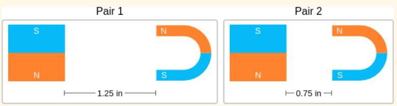
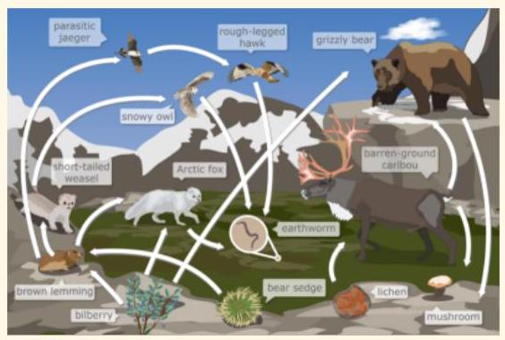
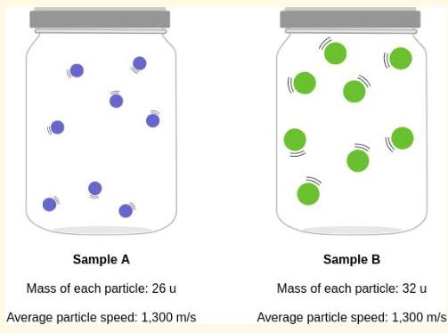

# Breaking Modality Heterogeneity in Low-Bit Quantization for Large Vision-Language Models

Yi Zhong ${}^{1}$ , Haotong Qin ${}^{2}$ , Xindong Zhang ${}^{3}$ , Lei Zhang ${}^{3,4}$ , Guolei Sun ${}^{1 * }$

> 
钟毅 ${}^{1}$，秦浩桐 ${}^{2}$，张新栋 ${}^{3}$，张磊 ${}^{3,4}$，孙国磊 ${}^{1 * }$

${}^{1}$ VCIP, College of Computer Science, Nankai University ${}^{2}$ D-ITET, ETH Zürich ${}^{3}$ OPPO Research Institute

> 
${}^{1}$ 南开大学计算机学院 VCIP  ${}^{2}$ 苏黎世联邦理工学院 D-ITET  ${}^{3}$ OPPO 研究院

4 Department of Computing, Hong Kong Polytechnic University

> 
4 香港理工大学计算学系

## Abstract

Low-bit post-training quantization (PTQ) is a pivotal technique for deploying Vision-Language Models (VLMs) on resource-constrained devices. However, existing PTQ methods often degrade VLMs' accuracy due to the heterogeneous activation distributions of text and vision modalities during quantization. We find that this cross-modal heterogeneity is distributed unevenly across channels: a small subset of channels contains most modality-specific outliers, and these outliers typically reside in different channels for each modality. Motivated by this, we propose SplitQ, a channel-Splitting-driven post-training Quantization framework. At its core, SplitQ introduces a novel Modality-specific Outlier Channel Decoupling (MOCD) module that effectively isolates salient modality-specific outlier channels with minimal overhead. To further address the remaining cross-modal distribution discrepancies, we design an Adaptive Cross-Modal Calibration (ACC) module that employs dual lightweight learnable branches to dynamically mitigate modality-induced quantization errors. Extensive experiments on popular VLMs demonstrate that SplitQ significantly outperforms existing approaches across 6 popular multi-modal datasets under all evaluated quantization settings, including W4A8, W4A4, W3A3, and W3A2. Notably, SplitQ preserves 93.5% of FP16 performance under the challenging W3A3 setting (69.5 vs. 74.3), pushing the efficiency frontier for deploying advanced VLMs. Our code is available at https: //github.com/EMVision-NK/SplitQ

> 
低位后训练量化（PTQ）是将视觉语言模型（VLMs）部署到资源受限设备上的关键技术。然而，现有PTQ方法在量化过程中常因文本和视觉模态的激活分布异质性而损害VLM的精度。我们发现，这种跨模态异质性在通道间分布不均：极少数通道集中了大部分模态特定的离群值，且这些离群值在不同模态中通常位于不同通道。受此启发，我们提出了SplitQ，一个基于通道分割的后训练量化框架。其核心创新为模态特定离群通道解耦（MOCD）模块，能以极低开销有效分离显著的模态特定离群通道。为进一步缓解剩余的跨模态分布差异，我们设计了自适应跨模态校准（ACC）模块，通过双轻量可学习分支动态减轻模态引发的量化误差。在多个主流VLM上的广泛实验表明，SplitQ在涵盖W4A8、W4A4、W3A3和W3A2的所有量化设定下，于6个常用多模态数据集上均显著超越现有方法。值得注意的是，在极具挑战的W3A3设定下，SplitQ保持了FP16性能的93.5%（69.5 vs. 74.3），将先进VLM的部署效率推向了新边界。代码已开源：https://github.com/EMVision-NK/SplitQ

## 1 Introduction

Vision-Language Models (VLMs) [3, 4, 30, 29] have emerged as foundation models for cross-modal understanding, enabling diverse applications such as visual question answering [1, 25], image captioning [56, 14], and multimodal reasoning [34, 53]. However, the massive scale and high computational demands of VLMs pose significant challenges for deployment on resource-constrained devices. Post-Training Quantization (PTQ) [26, 16, 33, 37, 54] has become a popular approach to reduce memory footprints and computational FLOPs. In particular, transformation-based PTQ methods adopt scaling or orthogonal transformations to redistribute weight and activation values, thereby improving quantization accuracy [2, 42, 32, 49, 35].

> 
视觉-语言模型（VLM）[3, 4, 30, 29]已成为跨模态理解的基础模型，支撑着视觉问答[1, 25]、图像描述[56, 14]和多模态推理[34, 53]等多种应用。然而，VLM庞大的规模和高昂的计算需求给资源受限设备上的部署带来了重大挑战。训练后量化（PTQ）[26, 16, 33, 37, 54]已成为减少内存占用和计算FLOPs的常用方法。特别是，基于变换的PTQ方法采用缩放或正交变换来重新分配权重和激活值，从而提高量化精度[2, 42, 32, 49, 35]。

While transformation-based PTQ methods are well-established for pure Large Language Model (LLM) quantization, extending them to VLMs remains challenging due to the heterogeneous activation distributions across text and vision modalities. Our empirical analysis reveals that this cross-modal heterogeneity is uneven across channels and exhibits a clear channel-wise structural distribution. Specifically, text and vision activations exhibit severe modality-specific outliers in a small number of channels. What's more, the outlier channels of the two modalities are different. Existing approaches [26] typically learn a single transformation shared by both modalities across all channels, where the cross-modal heterogeneity can severely distort the optimization objective. Some methods [57, 16] also attempt to handle the two modalities separately, but such treatment does not fully consider the modality-specific channel outliers.

> 
尽管基于变换的 PTQ 方法在纯大语言模型量化中已相当成熟，但将其扩展至视觉-语言模型仍面临挑战，原因在于文本与视觉模态之间存在异质的激活分布。我们的实验分析表明，这种跨模态异质性在不同通道上并不均匀，而是呈现出清晰的通道级结构分布。具体而言，文本和视觉激活在少数通道中表现出严重的模态特定异常值，并且两种模态的异常通道并不相同。现有方法[26]通常学习一个由两种模态在所有通道上共享的单一变换，这会使得跨模态异质性严重扭曲优化目标。部分方法[57, 16]也尝试对两种模态分别处理，但并未充分考虑模态特定的通道异常值。

---

*Corresponding author: Guolei Sun, sunguolei.kaust@gmail.com.

> 
*通讯作者：孙国磊，sunguolei.kaust@gmail.com。

---

Motivated by our observations, we propose SplitQ, a novel modality-aware framework for VLM quantization. At its core, SplitQ introduces a novel Modality-specific Outlier Channel Decoupling (MOCD), which analyzes unique activation patterns (magnitude saliency for vision tokens and response consistency for text tokens) to explicitly divide channels into three disjoint sets: modality-compatible main channels, text-specific outlier channels, and vision-specific outlier channels. The activation and weight matrices are subsequently split according to these channel sets and processed through different quantization paths. Although the modality-compatible main channels exhibit significantly reduced heterogeneity, residual cross-modal distribution discrepancies persist. To address this, SplitQ is further equipped with an Adaptive Cross-Modal Calibration (ACC) module which introduces two lightweight learnable branches to mitigate the residual cross-modal quantization errors: one compensates for weight-side errors amplified by cross-modal shifts, while the other specifically recovers activation-side deviations for text tokens.

> 
基于我们的观察，我们提出了 SplitQ，一个新颖的面向模态的 VLM 量化框架。其核心是 SplitQ 引入了一种新颖的模态特定离群通道解耦（MOCD），它分析独特的激活模式（视觉令牌的幅度显著性和文本令牌的响应一致性），将通道显式地划分为三个不相交的集合：模态兼容主通道、文本特定离群通道和视觉特定离群通道。随后，根据这些通道集合对激活和权重矩阵进行拆分，并通过不同的量化路径处理。尽管模态兼容主通道表现出显著降低的异质性，残存的跨模态分布差异仍然存在。为了解决这一问题，SplitQ 进一步配备了自适应跨模态校准（ACC）模块，该模块引入两个轻量级可学习分支来缓解残存的跨模态量化误差：一个用于补偿由跨模态偏移放大的权重侧误差，另一个专门恢复文本令牌的激活侧偏差。

Extensive experiments on mainstream VLMs demonstrate that SplitQ consistently achieves state-of-the-art performance across various quantization configurations (W4A8, W4A4, W3A3 and W3A2), significantly outperforming existing approaches. Our main contributions are summarized as follows:

> 
在主流 VLMs 上的大量实验表明，SplitQ 在多种量化配置（W4A8、W4A4、W3A3 和 W3A2）下均能持续取得最先进的性能，显著优于现有方法。本文的主要贡献总结如下：

- We investigate modality heterogeneity in VLM quantization and reveal that cross-modal distribution shifts are highly channel-dependent. Motivated by this, we propose SplitQ with a novel MOCD module to explicitly separate channels into three groups: modality-compatible main channels, text-specific channels, and vision-specific channels.

> 
- 我们研究了 VLM 量化中的模态异质性，并揭示了跨模态分布偏移高度依赖于通道。基于此，我们提出了 SplitQ，其中包含一个新颖的 MOCD 模块，用于明确地将通道分离为三组：模态兼容的主通道、文本特定通道和视觉特定通道。

- To further reduce cross-modal quantization errors in the main channels, we equip SplitQ with an ACC module which exploits two lightweight learnable branches for weight smoothing and activation compensation.

> 
- 为了进一步减少主通道中的跨模态量化误差，我们为 SplitQ 配备了一个 ACC 模块，该模块利用两个轻量级可学习分支进行权重平滑和激活补偿。

- We achieve SOTA quantization results on six benchmarks across Qwen2.5-VL-7B and Qwen2.5-VL-3B. SplitQ nearly preserves FP16 performance at W4A4, achieving average scores of 73.5 and 69.6 on the two models, compared with 74.3 and 70.0 for FP16, respectively, and remains effective even at W3A3 and W3A2.

> 
- 我们在Qwen2.5-VL-7B和Qwen2.5-VL-3B的六个基准测试上取得了最先进的量化结果。SplitQ在W4A4精度下几乎保持了FP16的性能，在两个模型上分别取得了73.5和69.6的平均得分（FP16分别为74.3和70.0），并且在W3A3和W3A2精度下仍保持有效。

## 2 Related Work

### 2.1 LLM Quantization

Current LLM quantization methods can be broadly categorized according to the quantization stage into quantization-aware training (QAT) [5, 73, 36] and post-training quantization (PTQ) [41, 45]. 39, 54, 10]. Although QAT usually achieves better accuracy, it requires additional training and substantial computational resources, making PTQ a more practical and widely studied paradigm for efficient LLM deployment. Existing PTQ methods can be further divided into weight-only quantization [28, 11, 61, 18, 22, 6, 51, 9, 20] and weight-activation quantization [35, 60, 42, 24] 17, 38, 19, 48, 59, 24, 93, 255]. Weight-only quantization reduces the precision of model weights while keeping activations in high precision, thereby significantly reducing memory. In contrast, weight-activation quantization quantizes both weights and activations, which can reduce memory consumption and improve inference efficiency. Among weight-only methods, GPTQ [11] leverages approximate second-order information to perform accurate one-shot weight quantization, while AWQ [28] identifies salient weight channels by observing activation distributions and searches for optimal per-channel scaling to protect them during quantization. For weight-activation quantization, SmoothQuant [49] smooths activation outliers by migrating quantization difficulty from activations to weights, enabling effective weight-activation quantization. OmniQuant [38] introduces learnable weight clipping and equivalent transformation to handle extreme values of weights and activation outliers, and SpinQuant [32] learns rotation matrices to reduce outliers in weights and activations.

> 
当前的大型语言模型量化方法可根据量化阶段大致分为量化感知训练（QAT）[5, 73, 36]与训练后量化（PTQ）[41, 45, 39, 54, 10]。尽管QAT通常能获得更高精度，但其需要额外训练和大量计算资源，这使得PTQ成为高效部署大语言模型中更实用且被广泛研究的范式。现有的PTQ方法可进一步划分为仅权重量化[28, 11, 61, 18, 22, 6, 51, 9, 20]和权重-激活量化[35, 60, 42, 24, 17, 38, 19, 48, 59, 24, 93, 255]。仅权重量化仅降低模型权重的精度而保持激活值为高精度，从而显著减少内存占用。相比之下，权重-激活量化同时对权重和激活值进行量化，能够减少内存消耗并提升推理效率。在仅权重方法中，GPTQ [11]利用近似二阶信息实现精确的一次性权重量化，而AWQ [28]通过观察激活分布来识别重要权重通道，并搜索最优逐通道缩放因子以在量化过程中对其进行保护。针对权重-激活量化，SmoothQuant [49]通过将量化难度从激活值迁移至权重来平滑激活异常值，从而实现有效的权重-激活量化。OmniQuant [38]引入了可学习的权重裁剪和等效变换来处理权重的极值和激活异常值，SpinQuant [32]则通过学习旋转矩阵来减少权重和激活中的异常值。

Figure 1: (a) VLM inference pipeline. (b) An overview of SplitQ framework. The two key components of SplitQ include modality-specific outlier channel decoupling (MOCD) module to separate modality-specific outlier channels $\left( {\mathcal{C}}_{t}\right.$ and $\left. {\mathcal{C}}_{v}\right)$ , and adaptive cross-modal calibration module to further reduce quantization errors caused by cross-modal distribution discrepancies.

> 
图1: (a) VLM推理流程。 (b) SplitQ框架概览。SplitQ的两个关键组件包括：用于分离模态特定离群通道的模态特定离群通道解耦（MOCD）模块 $\left( {\mathcal{C}}_{t}\right.$ 和 $\left. {\mathcal{C}}_{v}\right)$ ，以及用于进一步减少由跨模态分布差异引起的量化误差的自适应跨模态校准模块。

### 2.2 VLM Quantization

As quantization techniques for LLM have become increasingly mature, recent studies have started to extend quantization techniques to VLM, where multimodal inputs introduce additional challenges such as modality-dependent activation distributions, redundant visual tokens, and large attention-cache overhead. To address these challenges, several VLM-oriented quantization methods have been proposed. QSLAW [50] uses quantization-aware scale learning to mitigate quantization errors caused by multimodal activation outliers; Q-VLM [43] uses activation entropy as a proxy for block partitioning to balance discretization error and search cost under cross-layer error dependency. MBQ [26] incorporates the different sensitivities across modalities during the calibration process; MQuant [57] assigns modality-specific static scaling factors to visual and textual tokens; VLMQ [52] uses gradient-driven token importance to preserve salient tokens and suppress redundant visual tokens; MASQuant [16] learns modality-aware smoothing factors to alleviate smoothing misalignment. QSVD [47] applies SVD to the combined weight matrices of the query, key, and value, reducing KV-cache size and attention computation overhead; WSVD [44] performs each head SVD with local weighted finetuning to achieve practical decoding latency reduction while preserving accuracy. Bi-VLM [46] further explores saliency-aware hybrid quantization for ultra-low-bit precision.

> 
随着大语言模型的量化技术日趋成熟，近期研究开始将量化方法扩展至视觉语言模型。然而，多模态输入带来了模态依赖的激活分布、冗余视觉令牌和巨大的注意力缓存开销等额外挑战。为应对这些挑战，研究者提出了一系列面向视觉语言模型的量化方法。QSLAW [50] 利用量化感知的尺度学习来缓解多模态激活异常值造成的量化误差；Q-VLM [43] 以激活熵作为块划分的代理指标，在跨层误差依赖下平衡离散化误差与搜索成本；MBQ [26] 在校准过程中纳入不同模态的敏感度差异；MQuant [57] 为视觉和文本令牌分配模态特定的静态缩放因子；VLMQ [52] 采用梯度驱动的令牌重要性来保留显著令牌并抑制冗余视觉令牌；MASQuant [16] 学习模态感知的平滑因子以缓解平滑失配；QSVD [47] 将奇异值分解应用于查询、键和值的拼接权重矩阵，从而减少 KV 缓存大小和注意力计算开销；WSVD [44] 对每个注意力头执行奇异值分解并进行局部加权微调，在保持精度的同时实现实际解码延迟的降低；Bi-VLM [46] 则进一步探索了面向超低位精度的显著性感知混合量化。

## 3 Transformation-based PTQ

PTQ reduces the computational and memory footprint of models by mapping high-precision floating-point tensor $\mathbf{x}$ to low-precision $N$ -bit integer tensor ${\widehat{\mathbf{x}}}_{N}$ :

> 
后训练量化（PTQ）通过将高精度浮点张量 $\mathbf{x}$ 映射为低精度 $N$ 比特整数张量 ${\widehat{\mathbf{x}}}_{N}$ 来减少模型的计算和内存占用：

$$
{\widehat{\mathbf{x}}}_{N} = Q\left( \mathbf{x}\right)  = \left( {\operatorname{clamp}\left( {\left\lfloor  \frac{\mathbf{x}}{{S}_{x}}\right\rceil   + z,{q}_{\min },{q}_{\max }}\right)  - z}\right)  \cdot  {S}_{x}, \tag{1}
$$

> 
$$
{\widehat{\mathbf{x}}}_{N} = Q\left( \mathbf{x}\right)  = \left( {\operatorname{clamp}\left( {\left\lfloor  \frac{\mathbf{x}}{{S}_{x}}\right\rceil   + z,{q}_{\min },{q}_{\max }}\right)  - z}\right)  \cdot  {S}_{x}, \tag{1}
$$

where ${S}_{x}$ and $z$ denote the scale factor and zero-point, respectively. $\lfloor  \cdot  \rceil$ is the rounding-to-nearest operator, and clamp clips values outside the range $\left\lbrack  {{q}_{\min },{q}_{\max }}\right\rbrack$ . We use $\mathrm{W}x\mathrm{\;A}y$ to represent the weight-activation quantization configuration of $x$ -bit weights and $y$ -bit activations (e.g., W4A4).

> 
其中，${S}_{x}$ 和 $z$ 分别表示尺度因子和零点。$\lfloor \cdot \rceil$ 是最近舍入运算符，而 clamp 将超出范围 $\left\lbrack {q}_{\min },{q}_{\max }\right\rbrack$ 的值进行裁剪。我们使用 $\mathrm{W}x\mathrm{A}y$ 来表示 $x$ -位权重和 $y$ -位激活的量化配置（例如，W4A4）。

Due to severe outliers in LLM or VLM activations, recent approaches [42, 32, 49, 2] introduce Transformation-based PTQ (TPTQ), where a learnable transformation matrix (e.g., diagonal or orthogonal) is adopted to transfer these outliers from activations to weights, thereby improving quantization friendliness. Specifically, for a linear layer $\mathbf{Y} = \mathbf{{XW}}$ , where $\mathbf{X} \in  {\mathbb{R}}^{T \times  {D}_{\text{ in }}}$ and $\mathbf{W} \in  {\mathbb{R}}^{{D}_{\text{ in }} \times  {D}_{\text{ out }}}$ , the layer can be reformulated based on computational invariance as:

> 
由于大语言模型或视觉语言模型激活中存在严重的异常值，近期方法[42, 32, 49, 2]引入了基于变换的后训练量化（TPTQ），通过可学习的变换矩阵（例如对角或正交矩阵）将这些异常值从激活转移到权重，从而改善量化友好性。具体地，对于线性层$\mathbf{Y} = \mathbf{{XW}}$，其中$\mathbf{X} \in  {\mathbb{R}}^{T \times  {D}_{\text{ in }}}$、$\mathbf{W} \in  {\mathbb{R}}^{{D}_{\text{ in }} \times  {D}_{\text{ out }}}$，该层可基于计算不变性重写为：

$$
\mathbf{Y} = \left( \mathbf{{XP}}\right)  \cdot  \left( {{\mathbf{P}}^{-1}\mathbf{W}}\right) , \tag{2}
$$

> 
$$
\mathbf{Y} = \left( \mathbf{{XP}}\right)  \cdot  \left( {{\mathbf{P}}^{-1}\mathbf{W}}\right) , \tag{2}
$$

Algorithm 1 SplitQ linear layer.

> 
算法 1 SplitQ 线性层。

---

Require: Activation $\mathbf{X}$ , weight $\mathbf{W}$ , quantizer $\mathcal{Q}\left( \cdot \right)$ , channel sets ${\mathcal{C}}_{m},{\mathcal{C}}_{t},{\mathcal{C}}_{v}$ , transforms ${\mathbf{P}}_{m},{\mathbf{P}}_{t},{\mathbf{P}}_{v}$ , learnable

> 
输入：激活 $\mathbf{X}$，权重 $\mathbf{W}$，量化器 $\mathcal{Q}\left( \cdot \right)$，通道集 ${\mathcal{C}}_{m},{\mathcal{C}}_{t},{\mathcal{C}}_{v}$，变换 ${\mathbf{P}}_{m},{\mathbf{P}}_{t},{\mathbf{P}}_{v}$，可学习参数

low-rank branches $\left( {{\mathbf{U}}_{s},{\mathbf{V}}_{s}}\right)$ and $\left( {{\mathbf{U}}_{c},{\mathbf{V}}_{c}}\right)$ .

> 
低秩分支 $\left( {{\mathbf{U}}_{s},{\mathbf{V}}_{s}}\right)$ 和 $\left( {{\mathbf{U}}_{c},{\mathbf{V}}_{c}}\right)$。

Ensure: Quantized output $\mathbf{Y}$ .

> 
确保：量化输出 $\mathbf{Y}$。

Split $\mathbf{X}$ and $\mathbf{W}$ by ${\mathcal{C}}_{m},{\mathcal{C}}_{t},{\mathcal{C}}_{v} : \left( {{\mathbf{X}}_{m},{\mathbf{X}}_{t},{\mathbf{X}}_{v}}\right) ,\;\left( {{\mathbf{W}}_{m},{\mathbf{W}}_{t},{\mathbf{W}}_{v}}\right)$ .

> 
按 ${\mathcal{C}}_{m},{\mathcal{C}}_{t},{\mathcal{C}}_{v}$ 分割 $\mathbf{X}$ 和 $\mathbf{W}$ : $\left( {{\mathbf{X}}_{m},{\mathbf{X}}_{t},{\mathbf{X}}_{v}}\right) ,\;\left( {{\mathbf{W}}_{m},{\mathbf{W}}_{t},{\mathbf{W}}_{v}}\right)$ 。

Compute text-specific path: ${\mathbf{Y}}_{t} = \mathcal{Q}\left( {{\mathbf{X}}_{t}{\mathbf{P}}_{t}}\right) \mathcal{Q}\left( {{\mathbf{P}}_{t}^{-1}{\mathbf{W}}_{t}}\right)$ .

> 
计算文本特定路径：${\mathbf{Y}}_{t} = \mathcal{Q}\left( {{\mathbf{X}}_{t}{\mathbf{P}}_{t}}\right) \mathcal{Q}\left( {{\mathbf{P}}_{t}^{-1}{\mathbf{W}}_{t}}\right)$。

Compute vision-specific path: ${\mathbf{Y}}_{v} = \mathcal{Q}\left( {{\mathbf{X}}_{v}{\mathbf{P}}_{v}}\right) \mathcal{Q}\left( {{\mathbf{P}}_{v}^{-1}{\mathbf{W}}_{v}}\right)$ .

> 
计算视觉专属路径：${\mathbf{Y}}_{v} = \mathcal{Q}\left( {{\mathbf{X}}_{v}{\mathbf{P}}_{v}}\right) \mathcal{Q}\left( {{\mathbf{P}}_{v}^{-1}{\mathbf{W}}_{v}}\right)$ 。

Quantize the main activation: ${\widehat{\mathbf{X}}}_{m} = \mathcal{Q}\left( {{\mathbf{X}}_{m}{\mathbf{P}}_{m}}\right)$ .

> 
量化主激活：${\widehat{\mathbf{X}}}_{m} = \mathcal{Q}\left( {{\mathbf{X}}_{m}{\mathbf{P}}_{m}}\right)$ .

if Cross-modal Weight Smoothing is enabled then

> 
如果启用了跨模态权重平滑，那么

Compute main path: ${\mathbf{Y}}_{m} = {\widehat{\widehat{\mathbf{X}}}}_{m}\mathcal{Q}\left( {{\mathbf{P}}_{m}^{-1}{\mathbf{W}}_{m} - {\mathbf{U}}_{s}{\mathbf{V}}_{s}}\right)  + {\widehat{\mathbf{X}}}_{m}\mathcal{Q}\left( {\mathbf{U}}_{s}\right) \mathcal{Q}\left( {\mathbf{V}}_{s}\right)$ .

> 
计算主路径：${\mathbf{Y}}_{m} = {\widehat{\widehat{\mathbf{X}}}}_{m}\mathcal{Q}\left( {{\mathbf{P}}_{m}^{-1}{\mathbf{W}}_{m} - {\mathbf{U}}_{s}{\mathbf{V}}_{s}}\right)  + {\widehat{\mathbf{X}}}_{m}\mathcal{Q}\left( {\mathbf{U}}_{s}\right) \mathcal{Q}\left( {\mathbf{V}}_{s}\right)$ .

else

> 
本文解决视觉语言模型（VLM）在低比特训练后量化（PTQ）中的挑战，其中文本与视觉模态间的异质激活分布导致严重精度下降。核心研究问题是如何在无损性能的前提下有效量化VLM，尤其在超低位宽下。作者发现，跨模态异质性是通道依赖的：少量通道包含模态特定的异常值，且这些异常通道在文本和视觉中并不相同。

为解决该问题，他们提出SplitQ——一种通道分割量化框架。其核心是模态特定异常通道解耦（MOCD），它利用视觉令牌的幅值评分和文本令牌的秩一致性，将通道分离为三个互斥集合：视觉特定、文本特定和模态兼容。各集合采用独立变换进行量化，从而隔离异常干扰。为进一步消减主通道中残留的跨模态差异，引入自适应跨模态校准（ACC）模块，包括跨模态权重平滑（一个可学习低秩分支，吸收模态偏移引起的权重变化）和模态特定激活补偿（一个量化低秩分支，恢复文本侧激活误差）。低秩分支以权重的截断奇异值分解为锚，在保持稳定性的同时将开销降至最低。

在Qwen2.5-VL和LLaVA-v1.5上的六个基准实验表明，SplitQ在W4A8、W4A4、W3A3乃至W3A2下均显著优于现有PTQ方法。在W4A4下，它几乎完整保留了FP16精度（例如在Qwen2.5-VL-3B上平均分为69.6 vs. 70.0），而在其他方法失效的W3A3下仍保持稳健，在7B模型上达到69.5的平均分（FP16的93.5%）。本方法同时实现了实际推理加速（相比FP16提升2.89×）和内存缩减。论文总结指出，显式解耦模态特定异常值并校准跨模态误差，是实现稳定低比特多模态量化的关键。

Compute main path: ${\mathbf{Y}}_{m} = {\widehat{\mathbf{X}}}_{m}\mathcal{Q}\left( {{\mathbf{P}}_{m}^{-1}{\mathbf{W}}_{m}}\right)$ .

> 
计算主路径：${\mathbf{Y}}_{m} = {\widehat{\mathbf{X}}}_{m}\mathcal{Q}\left( {{\mathbf{P}}_{m}^{-1}{\mathbf{W}}_{m}}\right)$。

end if

> 
end if

if Modality-specific Activation Compensation is enabled then

> 
如果启用了模态特定激活补偿，那么

Compensate text tokens: ${\mathbf{Y}}_{m}^{\text{ text }} \leftarrow  {\mathbf{Y}}_{m}^{\text{ text }} + \mathcal{Q}{\left( {\mathbf{X}}_{m}{\mathbf{P}}_{m} - {\widehat{\mathbf{X}}}_{m}\right) }^{\text{ text }}\mathcal{Q}\left( {\mathbf{U}}_{c}\right) \mathcal{Q}\left( {\mathbf{V}}_{c}\right)$ .

> 
补偿文本令牌：${\mathbf{Y}}_{m}^{\text{ text }} \leftarrow  {\mathbf{Y}}_{m}^{\text{ text }} + \mathcal{Q}{\left( {\mathbf{X}}_{m}{\mathbf{P}}_{m} - {\widehat{\mathbf{X}}}_{m}\right) }^{\text{ text }}\mathcal{Q}\left( {\mathbf{U}}_{c}\right) \mathcal{Q}\left( {\mathbf{V}}_{c}\right)$ .

end if

> 
end if

Merge three paths: $\mathbf{Y} = {\mathbf{Y}}_{m} + {\mathbf{Y}}_{t} + {\mathbf{Y}}_{v}$ .

> 
合并三条路径：$\mathbf{Y} = {\mathbf{Y}}_{m} + {\mathbf{Y}}_{t} + {\mathbf{Y}}_{v}$ 。

return $\mathbf{Y}$ .

> 
返回 $\mathbf{Y}$。

---

where $\mathbf{P}$ is a linear optimization matrix that reshapes feature distributions to facilitate adaptive quantization. To optimize learnable parameters, the objective is defined as the reconstruction loss:

> 
其中 $\mathbf{P}$ 是一个线性优化矩阵，用于重塑特征分布以促进自适应量化。为了优化可学习参数，目标函数被定义为重构损失：

$$
L = \mathcal{L}\left( {Q\left( \mathbf{{XP}}\right)  \cdot  Q\left( {{\mathbf{P}}^{-1}\mathbf{W}}\right) ,\mathbf{{XW}}}\right) . \tag{3}
$$

> 
$$
L = \mathcal{L}\left( {Q\left( \mathbf{{XP}}\right)  \cdot  Q\left( {{\mathbf{P}}^{-1}\mathbf{W}}\right) ,\mathbf{{XW}}}\right) . \tag{3}
$$

## 4 Methodology

In this section, we present our SplitQ framework, a PTQ approach for VLMs. Fig. 1 provides an overview of the framework, while the core quantized linear layer is detailed in Alg. 1. We first introduce our motivations in §4.1, followed by modality-specific outlier channel decoupling in §4.2 Finally, we explain our adaptive cross-modal calibration module in §4.3

> 
在本节中，我们介绍 SplitQ 框架，这是一种面向视觉语言模型（VLM）的后训练量化（PTQ）方法。图 1 给出了该框架的总体概览，而核心的量化线性层则在算法 1 中详细说明。我们首先在第 4.1 节阐述动机，随后在第 4.2 节介绍模态特定的异常通道解耦，最后在第 4.3 节解释自适应跨模态校准模块。

### 4.1 Motivations

Modality-specific Outlier Channels. We visualize the distributions of text and vision tokens across channels in Fig. 2 to investigate the fundamental challenges of quantizing heterogeneous modalities. Our key observations are as follows. ① The activation distributions of different modalities exhibit fundamental differences. Vision activations usually follow a long-tailed distributions where only a few channels contain extremely large magnitudes, i.e., outliers that need to be handled carefully. In contrast, text activation outliers are distributed more evenly across channels. ② For both modalities, outlier channels account for only a small fraction of all channels. ③ More importantly, the activation outliers of text and vision modalities are locate in different channels. This separation provides us an opportunity to disentangle the channel outliers for different modalities.

> 
模态特定异常通道。我们在图2中可视化了文本和视觉标记跨通道的分布，以探究异质模态量化的根本挑战。我们的关键观察如下。① 不同模态的激活分布呈现出根本性差异。视觉激活通常遵循长尾分布，其中仅有少数通道包含极大值，即需要谨慎处理的异常值。相比之下，文本激活异常值在通道间分布更为均匀。② 对于两种模态，异常通道仅占全部通道的一小部分。③ 更重要的是，文本和视觉模态的激活异常值位于不同通道。这种分离为我们解耦不同模态的通道异常值提供了契机。

Figure 2: Distributions of text and vision activations across channels. Left: layer 5 of Qwen2.5-VL 3B; Right: layer 10 of Qwen2.5-VL 7B. Notable divergence in distributions underscores the modality heterogeneity.

> 
图 2：文本与视觉激活在不同通道上的分布。左侧：Qwen2.5-VL 3B 的第 5 层；右侧：Qwen2.5-VL 7B 的第 10 层。分布的显著差异突显了模态间的异质性。

From observation ①, we can identify a key reason why PTQ for VLM is particularly difficult. In existing transformation-based PTQ methods where the activations of all channels are optimized with a shared transformation matrix $\mathbf{P}$ , the modality-specific outlier channels significantly interfere with each other, leading to suboptimal transformations for both modalities.

> 
从观察结果①中，我们可以找出 VLM 的 PTQ 特别困难的一个关键原因。在现有的基于变换的 PTQ 方法中，所有通道的激活都通过共享变换矩阵 $\mathbf{P}$ 进行优化，特定模态的异常通道会显著相互干扰，导致两种模态的变换都次优。

Inspired by observations ② and ③, we propose a Modality-specific Outlier Channel Decoupling (MOCD) technique to disentangle the interference of modality-specific outliers by separating the text-specific and vision-specific outlier channels out of all channels, resulting in three groups of channels: vision-specific, text-specific and modality-compatible channels. Specifically, let $\mathcal{C} = \left\{  {0,1,\ldots ,{D}_{\text{ in }}}\right\}$ denote all channel indexes. MOCD partitions the input channels into three disjoint sets:

> 
受观察②和③的启发，我们提出了一种模态特异性离群通道解耦（MOCD）技术，通过将文本特异性和视觉特异性离群通道从所有通道中分离出来，从而消除模态特异性离群值的干扰，最终形成三组通道：视觉特异性、文本特异性和模态兼容通道。具体而言，令 $\mathcal{C} = \left\{  {0,1,\ldots ,{D}_{\text{ in }}}\right\}$ 表示所有通道索引。MOCD将输入通道划分为三个互不相交的集合：

$$
\mathcal{C} = {\mathcal{C}}_{m} \cup  {\mathcal{C}}_{t} \cup  {\mathcal{C}}_{v},\;{\mathcal{C}}_{m} \cap  {\mathcal{C}}_{t} = \varnothing ,\;{\mathcal{C}}_{m} \cap  {\mathcal{C}}_{v} = \varnothing , \tag{4}
$$

> 
$$
\mathcal{C} = {\mathcal{C}}_{m} \cup  {\mathcal{C}}_{t} \cup  {\mathcal{C}}_{v},\;{\mathcal{C}}_{m} \cap  {\mathcal{C}}_{t} = \varnothing ,\;{\mathcal{C}}_{m} \cap  {\mathcal{C}}_{v} = \varnothing , \tag{4}
$$

where ${\mathcal{C}}_{m},{\mathcal{C}}_{t}$ , and ${\mathcal{C}}_{v}$ denote modality-compatible, text and vision channels, respectively. They also satisfy the following criterion since the number of outlier channels is much smaller than ${D}_{\text{ in }}$ :

> 
其中 ${\mathcal{C}}_{m},{\mathcal{C}}_{t}$ 和 ${\mathcal{C}}_{v}$ 分别表示模态兼容通道、文本通道和视觉通道。由于异常通道的数量远小于 ${D}_{\text{ in }}$，它们还满足以下准则：

$$
\left| {\mathcal{C}}_{m}\right|  \gg  \left| {\mathcal{C}}_{t}\right| ,\;\left| {\mathcal{C}}_{m}\right|  \gg  \left| {\mathcal{C}}_{v}\right| \tag{5}
$$

> 
$$
\left| {\mathcal{C}}_{m}\right|  \gg  \left| {\mathcal{C}}_{t}\right| ,\;\left| {\mathcal{C}}_{m}\right|  \gg  \left| {\mathcal{C}}_{v}\right| \tag{5}
$$

where |set| denotes the cardinality of the set. Accordingly, the activation/weight matrices are split as:

> 
其中 |set| 表示该集合的基数。相应地，激活/权重矩阵被拆分为：

$$
\mathbf{X} \rightarrow  \left\{  {{\mathbf{X}}_{m},{\mathbf{X}}_{t},{\mathbf{X}}_{v}}\right\}  ,\;\mathbf{W} \rightarrow  \left\{  {{\mathbf{W}}_{m},{\mathbf{W}}_{t},{\mathbf{W}}_{v}}\right\}  . \tag{6}
$$

> 
$$
\mathbf{X} \rightarrow  \left\{  {{\mathbf{X}}_{m},{\mathbf{X}}_{t},{\mathbf{X}}_{v}}\right\}  ,\;\mathbf{W} \rightarrow  \left\{  {{\mathbf{W}}_{m},{\mathbf{W}}_{t},{\mathbf{W}}_{v}}\right\}  . \tag{6}
$$

Three matrix pairs $\left\{  {{\mathbf{X}}_{m},{\mathbf{W}}_{m}}\right\}  ,\left\{  {{\mathbf{X}}_{t},{\mathbf{W}}_{t}}\right\}  ,\left\{  {{\mathbf{X}}_{v},{\mathbf{W}}_{v}}\right\}$ are processed differently by learning different transformations. The details of MOCD are further elaborated in §4.2

> 
三对矩阵对 $\left\{  {{\mathbf{X}}_{m},{\mathbf{W}}_{m}}\right\}  ,\left\{  {{\mathbf{X}}_{t},{\mathbf{W}}_{t}}\right\}  ,\left\{  {{\mathbf{X}}_{v},{\mathbf{W}}_{v}}\right\}$ 通过学习不同的变换进行不同的处理。MOCD的细节在§4.2中进一步阐述。

Cross-modal Low-bit Quantization Difficulty. The heterogeneity between vision and text persists beyond the obvious outlier channels. Even after decoupling these outliers, the remaining channels still exhibit distribution differences across modalities. More specifically, the activation ${\mathbf{X}}_{m}$ and weight ${\mathbf{W}}_{m}$ still contain mixed distributions of text and vision modalities.

> 
跨模态低比特量化难题。视觉与文本之间的异构性并不仅限于明显的异常通道。即使解耦了这些异常通道，其余通道在不同模态下仍然存在分布差异。具体而言，激活值 ${\mathbf{X}}_{m}$ 与权重 ${\mathbf{W}}_{m}$ 依然包含文本与视觉模态的混合分布。

While high-precision quantization can tolerate such variations, low-bit quantization is highly sensitive to them, as demonstrated in our experiments (§5). Starting from the baseline FlatQuant [42], we add the proposed MOCD and use an affine transformation matrix to quantize $\left\{  {{\mathbf{X}}_{m},{\mathbf{W}}_{m}}\right\}$ . This approach (FlatQuant+MOCD) gives excellent results at W4A4, but its performance is unsatisfactory at challenging W3A3 and W3A2. To mitigate the subtle distribution differences among modalities within ${\mathbf{X}}_{m}$ , we design an Adaptive Cross-modal Calibration (ACC) module to further improve the quantization of $\left\{  {{\mathbf{X}}_{m},{\mathbf{W}}_{m}}\right\}$ . Details of the ACC module are provided in §4.3

> 
虽然高精度量化可以容忍这种变化，但低位量化对此高度敏感，如我们的实验（§5）所示。从基线 FlatQuant [42] 出发，我们加入提出的 MOCD，并使用仿射变换矩阵来量化 $\left\{  {{\mathbf{X}}_{m},{\mathbf{W}}_{m}}\right\}$。这种方法（FlatQuant+MOCD）在 W4A4 下给出了优异的结果，但在挑战性的 W3A3 和 W3A2 下，其表现并不令人满意。为了缓解 ${\mathbf{X}}_{m}$ 内模态间的细微分布差异，我们设计了一个自适应跨模态校准（ACC）模块，以进一步改进 $\left\{  {{\mathbf{X}}_{m},{\mathbf{W}}_{m}}\right\}$ 的量化。ACC 模块的细节见 §4.3。

### 4.2 Modality-specific Outlier Channel Decoupling

As discussed above, the input channels $\mathcal{C}$ is split into ${\mathcal{C}}_{m},{\mathcal{C}}_{t}$ , and ${\mathcal{C}}_{v}$ . In this part, we describe the process of selecting text- and vision- specific outlier channels in detail.

> 
如上所述，输入通道 $\mathcal{C}$ 被拆分为 ${\mathcal{C}}_{m}$、${\mathcal{C}}_{t}$ 和 ${\mathcal{C}}_{v}$。在本部分中，我们详细描述选择文本特定和视觉特定异常通道的过程。

Modality-aware Channel Selection. We first select vision-specific outlier channels by magnitude, followed by identifying text-specific outlier channels via a consistency-based calibration proxy. Let ${\mathcal{T}}_{v}$ and ${\mathcal{T}}_{t}$ denote the sampled vision and text tokens, respectively, and let $\mathcal{C}$ be the full channel set. For vision tokens, we score each channel by its maximum absolute activation:

> 
模态感知的通道选择。我们首先通过幅度选择视觉特定的异常通道，随后通过基于一致性的校准代理识别文本特定的异常通道。设 ${\mathcal{T}}_{v}$ 和 ${\mathcal{T}}_{t}$ 分别表示采样的视觉和文本词元，$\mathcal{C}$ 为全通道集合。对于视觉词元，我们依据每个通道的最大绝对值激活进行评分：

$$
{s}_{v}\left( c\right)  = \mathop{\max }\limits_{{i \in  {\mathcal{T}}_{v}}}\left| {X}_{i, c}\right| \tag{7}
$$

> 
$$
{s}_{v}\left( c\right)  = \mathop{\max }\limits_{{i \in  {\mathcal{T}}_{v}}}\left| {X}_{i, c}\right| \tag{7}
$$

The vision-specific outlier set is obtained by selecting the top- ${K}_{v}$ channels:

> 
视觉特定离群值集合是通过选择前 ${K}_{v}$ 个通道获得的：

$$
{\mathcal{C}}_{v} = {\operatorname{TopK}}_{c \in  \mathcal{C}}\left( {{s}_{v}\left( c\right) ,{K}_{v}}\right) . \tag{8}
$$

> 
$$
{\mathcal{C}}_{v} = {\operatorname{TopK}}_{c \in  \mathcal{C}}\left( {{s}_{v}\left( c\right) ,{K}_{v}}\right) . \tag{8}
$$

After this, we denote the remaining channels as ${\mathcal{C}}^{\prime } = \mathcal{C} \smallsetminus  {\mathcal{C}}_{v}$ . For text tokens, absolute magnitude is less indicative, as outlier channels are related to unstable relative responses across tokens. We therefore use the percentile rank within each token as a scale-insensitive measure of channel importance:

> 
之后，我们将剩余的通道记为 ${\mathcal{C}}^{\prime } = \mathcal{C} \smallsetminus  {\mathcal{C}}_{v}$。对于文本 token，绝对幅度指示性较弱，因为离群值通道与跨 token 不稳定的相对响应相关。因此，我们使用每个 token 内的百分位排名作为通道重要性的尺度无关度量：

$$
{r}_{i, c} = \frac{1}{\left| {\mathcal{C}}^{\prime }\right| }\mathop{\sum }\limits_{{j \in  {\mathcal{C}}^{\prime }}}\mathbb{I}\left( {\left| {X}_{i, j}\right|  \leq  \left| {X}_{i, c}\right| }\right) ,\;i \in  {\mathcal{T}}_{t}, c \in  {\mathcal{C}}^{\prime }. \tag{9}
$$

> 
$$
{r}_{i, c} = \frac{1}{\left| {\mathcal{C}}^{\prime }\right| }\mathop{\sum }\limits_{{j \in  {\mathcal{C}}^{\prime }}}\mathbb{I}\left( {\left| {X}_{i, j}\right|  \leq  \left| {X}_{i, c}\right| }\right) ,\;i \in  {\mathcal{T}}_{t}, c \in  {\mathcal{C}}^{\prime }. \tag{9}
$$

This rank-based measure suppresses token-wise scale variation and makes channel responses comparable across text tokens. For each channel, we cluster its rank sequence across text tokens into $K$ groups and use the within-cluster variance as a measure of response instability. Let ${z}_{i, c}$ be the cluster assignment of ${r}_{i, c}$ and ${\mu }_{c,{z}_{i, c}}$ be the corresponding cluster center:

> 
这种基于排名的度量抑制了 token 间的尺度变化，并使通道响应在不同文本 token 之间具有可比性。对于每个通道，我们将其在所有文本 token 上的排名序列聚类为 $K$ 组，并使用组内方差作为响应不稳定性的度量。令 ${z}_{i, c}$ 为 ${r}_{i, c}$ 的聚类分配，${\mu }_{c,{z}_{i, c}}$ 为对应的聚类中心：

$$
{s}_{t}\left( c\right)  = \frac{1}{\left| {\mathcal{T}}_{t}\right| }\mathop{\sum }\limits_{{i \in  {\mathcal{T}}_{t}}}{\left( {r}_{i, c} - {\mu }_{c,{z}_{i, c}}\right) }^{2}. \tag{10}
$$

> 
$$
{s}_{t}\left( c\right)  = \frac{1}{\left| {\mathcal{T}}_{t}\right| }\mathop{\sum }\limits_{{i \in  {\mathcal{T}}_{t}}}{\left( {r}_{i, c} - {\mu }_{c,{z}_{i, c}}\right) }^{2}. \tag{10}
$$

A larger ${s}_{t}\left( c\right)$ suggests less stable relative responses across text tokens. We select the top- ${K}_{t}$ channels as text-specific channels:

> 
较大的 ${s}_{t}\left( c\right)$ 表明文本 token 间的相对响应越不稳定。我们选择前 ${K}_{t}$ 个通道作为文本特定通道：

$$
{\mathcal{C}}_{t} = {\operatorname{TopK}}_{c \in  {\mathcal{C}}^{\prime }}\left( {{s}_{t}\left( c\right) ,{K}_{t}}\right) . \tag{11}
$$

> 
$$
{\mathcal{C}}_{t} = {\operatorname{TopK}}_{c \in  {\mathcal{C}}^{\prime }}\left( {{s}_{t}\left( c\right) ,{K}_{t}}\right) . \tag{11}
$$

The remaining channels form the modality-compatible main channel set:

> 
其余通道构成模态兼容的主通道集合：

$$
{\mathcal{C}}_{m} = \mathcal{C} \smallsetminus  \left( {{\mathcal{C}}_{v} \cup  {\mathcal{C}}_{t}}\right) \tag{12}
$$

> 
$$
{\mathcal{C}}_{m} = \mathcal{C} \smallsetminus  \left( {{\mathcal{C}}_{v} \cup  {\mathcal{C}}_{t}}\right) \tag{12}
$$

Quantization Calibration. Following channel separation, activation $\mathbf{X}$ and weight $\mathbf{W}$ are split into $\left\{  {{\mathbf{X}}_{m},{\mathbf{X}}_{t},{\mathbf{X}}_{v}}\right\}$ and $\left\{  {{\mathbf{W}}_{m},{\mathbf{W}}_{t},{\mathbf{W}}_{v}}\right\}$ , respectively. The two matrix groups $\left\{  {{\mathbf{X}}_{t},{\mathbf{W}}_{t}}\right\}$ and $\left\{  {{\mathbf{X}}_{v},{\mathbf{W}}_{v}}\right\}$ correspond to text- and vision- specific outlier channels. They are processed with independent modality-aware transformations:

> 
量化校准。在通道分离之后，激活值 $\mathbf{X}$ 和权重 $\mathbf{W}$ 分别被分割为 $\left\{  {{\mathbf{X}}_{m},{\mathbf{X}}_{t},{\mathbf{X}}_{v}}\right\}$ 和 $\left\{  {{\mathbf{W}}_{m},{\mathbf{W}}_{t},{\mathbf{W}}_{v}}\right\}$ 。这两组矩阵 $\left\{  {{\mathbf{X}}_{t},{\mathbf{W}}_{t}}\right\}$ 和 $\left\{  {{\mathbf{X}}_{v},{\mathbf{W}}_{v}}\right\}$ 分别对应文本和视觉特定的异常通道，它们通过独立的模态感知变换进行处理：

$$
{\mathbf{Y}}_{t} = Q\left( {{\mathbf{X}}_{t}{\mathbf{P}}_{t}}\right) Q\left( {{\mathbf{P}}_{t}^{-1}{\mathbf{W}}_{t}}\right) , \tag{13}
$$

> 
$$
{\mathbf{Y}}_{t} = Q\left( {{\mathbf{X}}_{t}{\mathbf{P}}_{t}}\right) Q\left( {{\mathbf{P}}_{t}^{-1}{\mathbf{W}}_{t}}\right) , \tag{13}
$$

$$
{\mathbf{Y}}_{v} = Q\left( {{\mathbf{X}}_{v}{\mathbf{P}}_{v}}\right) Q\left( {{\mathbf{P}}_{v}^{-1}{\mathbf{W}}_{v}}\right) . \tag{14}
$$

> 
$$
{\mathbf{Y}}_{v} = Q\left( {{\mathbf{X}}_{v}{\mathbf{P}}_{v}}\right) Q\left( {{\mathbf{P}}_{v}^{-1}{\mathbf{W}}_{v}}\right) . \tag{14}
$$

Here, ${\mathbf{P}}_{t}$ and ${\mathbf{P}}_{v}$ are optimized for the text- and vision-specific outlier channels, respectively. The main matrix group $\left\{  {{\mathbf{X}}_{m},{\mathbf{W}}_{m}}\right\}$ corresponding to modality-compatible channels is processed by our adaptive cross-modal calibration module in §4.3

> 
这里，${\mathbf{P}}_{t}$ 和 ${\mathbf{P}}_{v}$ 分别针对文本和视觉特定的异常通道进行了优化。与模态兼容通道对应的主矩阵组 $\left\{  {{\mathbf{X}}_{m},{\mathbf{W}}_{m}}\right\}$ 则通过第4.3节中的自适应跨模态校准模块进行处理。

### 4.3 Adaptive Cross-modal Calibration

As detailed above, MOCD isolates modality-specific outliers, which are then processed through independent paths (Eq. 13, 14). The remaining channels constitute the main activation-weight pair

> 
如上文详述，MOCD 将特定模态的异常值隔离出来，然后通过独立路径处理（方程 13、14）。剩余通道构成主要的激活-权重对。

Figure 3: Comparison of weight quantization error $\Delta \left( {{\mathbf{P}}_{m}^{-1}{\mathbf{W}}_{m}}\right)$ across channels using activations of different modalities: text-only, vision-only, and joint vision-text. The $x$ -axis (Channel Group) partitions all channels, sorted in ascending order of quantization error MAE, into 10 equal-sized bins (each containing 10% of channels). The results show that vision-text activations consistently amplify this error term.

> 
图 3：使用不同模态（纯文本、纯视觉、视觉-文本联合）的激活，比较各通道权重量化误差 $\Delta \left( {{\mathbf{P}}_{m}^{-1}{\mathbf{W}}_{m}}\right)$。$x$ 轴（通道组）将所有通道按量化误差 MAE 升序排列，均分为 10 个等大小的区间（每个区间包含 10% 的通道）。结果表明，视觉-文本联合激活持续放大了这一误差项。

$\left\{  {{\mathbf{X}}_{m},{\mathbf{W}}_{m}}\right\}$ . We can adopt a shared transformation matrix ${\mathbf{P}}_{m}$ for quantization as follows:

> 
$\left\{  {{\mathbf{X}}_{m},{\mathbf{W}}_{m}}\right\}$。我们可以采用共享的变换矩阵 ${\mathbf{P}}_{m}$ 进行量化，如下所示：

$$
{\mathbf{Y}}_{m} = Q\left( {{\mathbf{X}}_{m}{\mathbf{P}}_{m}}\right) Q\left( {{\mathbf{P}}_{m}^{-1}{\mathbf{W}}_{m}}\right) . \tag{15}
$$

> 
$$
{\mathbf{Y}}_{m} = Q\left( {{\mathbf{X}}_{m}{\mathbf{P}}_{m}}\right) Q\left( {{\mathbf{P}}_{m}^{-1}{\mathbf{W}}_{m}}\right) . \tag{15}
$$

$\left\{  {{\mathbf{X}}_{m},{\mathbf{W}}_{m}}\right\}$ encompass the majority channels of original $\{ \mathbf{X},\mathbf{W}\}$ . Although these channels are relatively compatible after outlier decoupling, their underlying cross-modal distribution differences persist. Forcing a unified transformation ${\mathbf{P}}_{m}$ over such a large-scale channel space inevitably leads to sub-optimal smoothing for both modalities. Consequently, this amplifies the weight-side quantization error $\Delta \left( {{\mathbf{P}}_{m}^{-1}{\mathbf{W}}_{m}}\right)$ and activation-side quantization error $\Delta \left( {{\mathbf{X}}_{m}{\mathbf{P}}_{m}}\right)$ . Here, we denote $\Delta \left( \mathbf{M}\right)  = \; \mathbf{M} - Q\left( \mathbf{M}\right)$ to represent the quantization error of $\mathbf{M}$ . To solve this issue, we introduce the ACC module, achieving fine-grained calibration.

> 
$\left\{  {{\mathbf{X}}_{m},{\mathbf{W}}_{m}}\right\}$ 涵盖了原始 $\{ \mathbf{X},\mathbf{W}\}$ 的大部分通道。尽管在异常值解耦后，这些通道相对兼容，但其底层的跨模态分布差异依然存在。在如此大的通道空间上强制使用统一变换 ${\mathbf{P}}_{m}$ 不可避免地会导致两种模态的次优平滑。因此，这会放大权重侧量化误差 $\Delta \left( {{\mathbf{P}}_{m}^{-1}{\mathbf{W}}_{m}}\right)$ 和激活侧量化误差 $\Delta \left( {{\mathbf{X}}_{m}{\mathbf{P}}_{m}}\right)$。这里，我们记 $\Delta \left( \mathbf{M}\right)  = \; \mathbf{M} - Q\left( \mathbf{M}\right)$ 表示 $\mathbf{M}$ 的量化误差。为解决这一问题，我们引入了 ACC 模块，实现了细粒度校准。

Cross-modal Weight Smoothing (CWS). As shown in Fig. 3, the main path still exhibits multimodal sensitivity. By comparing PTQ results calibrated on single-modal versus multi-modal tokens, we observe that the weight-side error $\Delta \left( {{\mathbf{P}}_{m}^{-1}{\mathbf{W}}_{m}}\right)$ is significantly amplified by the distributional differences between vision and text activations. To mitigate this cross-modal conflict, instead of quantizing the weight ${\mathbf{P}}_{m}^{-1}{\mathbf{W}}_{m}$ directly, we extract a low-rank adaptive component ${\mathbf{U}}_{s}{\mathbf{V}}_{s}$ to absorb these sensitive patterns:

> 
跨模态权重平滑（CWS）。如图3所示，主路径仍表现出多模态敏感性。通过比较在单模态与多模态令牌上校准的PTQ结果，我们观察到权重侧误差$\Delta \left( {{\mathbf{P}}_{m}^{-1}{\mathbf{W}}_{m}}\right)$被视觉与文本激活之间的分布差异显著放大。为缓解这种跨模态冲突，我们并非直接量化权重${\mathbf{P}}_{m}^{-1}{\mathbf{W}}_{m}$，而是提取一个低秩自适应分量${\mathbf{U}}_{s}{\mathbf{V}}_{s}$来吸收这些敏感模式：

$$
{\mathbf{P}}_{m}^{-1}{\mathbf{W}}_{m} = \left( {{\mathbf{P}}_{m}^{-1}{\mathbf{W}}_{m} - {\mathbf{U}}_{s}{\mathbf{V}}_{s}}\right)  + {\mathbf{U}}_{s}{\mathbf{V}}_{s}, \tag{16}
$$

> 
$$
{\mathbf{P}}_{m}^{-1}{\mathbf{W}}_{m} = \left( {{\mathbf{P}}_{m}^{-1}{\mathbf{W}}_{m} - {\mathbf{U}}_{s}{\mathbf{V}}_{s}}\right)  + {\mathbf{U}}_{s}{\mathbf{V}}_{s}, \tag{16}
$$

where ${\mathbf{U}}_{s} \in  {\mathbb{R}}^{{D}_{m} \times  r}$ and ${\mathbf{V}}_{s} \in  {\mathbb{R}}^{r \times  {D}_{\text{ out }}}$ are learnable low-rank matrices. Let ${\widehat{\mathbf{X}}}_{m} = Q\left( {{\mathbf{X}}_{m}{\mathbf{P}}_{m}}\right)$ denote the quantized input. According to Eq. 16, we explicitly decouple ${\mathbf{P}}_{m}^{-1}{\mathbf{W}}_{m}$ into a main residual part $\left( {{\mathbf{P}}_{m}^{-1}{\mathbf{W}}_{m} - {\mathbf{U}}_{s}{\mathbf{V}}_{s}}\right)$ and a low-rank part ${\mathbf{U}}_{s}{\mathbf{V}}_{s}$ . By quantizing and computing these components independently, the final output of the main path is formulated as:

> 
其中 ${\mathbf{U}}_{s} \in  {\mathbb{R}}^{{D}_{m} \times  r}$ 和 ${\mathbf{V}}_{s} \in  {\mathbb{R}}^{r \times  {D}_{\text{ out }}}$ 是可学习的低秩矩阵。令 ${\widehat{\mathbf{X}}}_{m} = Q\left( {{\mathbf{X}}_{m}{\mathbf{P}}_{m}}\right)$ 表示量化后的输入。根据公式 16，我们将 ${\mathbf{P}}_{m}^{-1}{\mathbf{W}}_{m}$ 显式解耦为主要的残差部分 $\left( {{\mathbf{P}}_{m}^{-1}{\mathbf{W}}_{m} - {\mathbf{U}}_{s}{\mathbf{V}}_{s}}\right)$ 和低秩部分 ${\mathbf{U}}_{s}{\mathbf{V}}_{s}$。通过对这些分量独立进行量化与计算，主路径的最终输出可表示为：

$$
{\mathbf{Y}}_{m} = {\widehat{\mathbf{X}}}_{m}Q\left( {{\mathbf{P}}_{m}^{-1}{\mathbf{W}}_{m} - {\mathbf{U}}_{s}{\mathbf{V}}_{s}}\right)  + {\widehat{\mathbf{X}}}_{m}Q\left( {\mathbf{U}}_{s}\right) Q\left( {\mathbf{V}}_{s}\right) . \tag{17}
$$

> 
$$
{\mathbf{Y}}_{m} = {\widehat{\mathbf{X}}}_{m}Q\left( {{\mathbf{P}}_{m}^{-1}{\mathbf{W}}_{m} - {\mathbf{U}}_{s}{\mathbf{V}}_{s}}\right)  + {\widehat{\mathbf{X}}}_{m}Q\left( {\mathbf{U}}_{s}\right) Q\left( {\mathbf{V}}_{s}\right) . \tag{17}
$$

While [23] adopts a similar low-rank architecture to absorb main energy or outliers in single-modal scenarios, our structural intent is distinct. We utilize the low-rank branch ${\mathbf{U}}_{s}{\mathbf{V}}_{s}$ adaptively to absorb the weight variations triggered by cross-modal activation shifts. By extracting these sensitive cross-modal components, the remaining main weight $\left( {{\mathbf{P}}_{m}^{-1}{\mathbf{W}}_{m} - {\mathbf{U}}_{s}{\mathbf{V}}_{s}}\right)$ exhibits a smoother distribution, allowing for low-error quantization.

> 
虽然[23]在单模态场景中采用类似的低秩架构来吸收主要能量或异常值，但我们的结构意图是独特的。我们利用低秩分支 ${\mathbf{U}}_{s}{\mathbf{V}}_{s}$ 自适应地吸收由跨模态激活偏移引发的权重变化。通过提取这些敏感的跨模态成分，剩余的主权重 $\left( {{\mathbf{P}}_{m}^{-1}{\mathbf{W}}_{m} - {\mathbf{U}}_{s}{\mathbf{V}}_{s}}\right)$ 呈现出更平滑的分布，从而允许低误差量化。

Modality-specific Activation Compensation (MAC). While CWS reduces the weight-side quantization error caused by cross-modal heterogeneity, the activation-side remains more challenging. Since the shared transformation ${\mathbf{P}}_{m}$ is optimized under conflicting modality distributions, its smoothing effect is inevitably compromised, leaving a non-negligible activation residual $\Delta \left( {{\mathbf{X}}_{m}{\mathbf{P}}_{m}}\right)$ . Unlike static weights, activations are input-dependent and dynamically vary across modalities, making it difficult to reformulate their quantization-sensitive components through structural decomposition (as we did in Eq. 17). We therefore introduce a direct compensation branch to recover the output deviation caused by activation quantization:

> 
模态特定激活补偿（MAC）。虽然跨模态权重平滑（CWS）减少了由跨模态异质性引起的权重侧量化误差，但激活侧仍然更具挑战性。由于共享变换 ${\mathbf{P}}_{m}$ 是在相互冲突的模态分布下优化的，其平滑效果不可避免地受到折损，留下不可忽略的激活残差 $\Delta \left( {{\mathbf{X}}_{m}{\mathbf{P}}_{m}}\right)$ 。与静态的权重不同，激活是输入依赖的，并且在不同模态间动态变化，这使我们难以通过结构分解（如公式17中所做的那样）来重构其量化敏感成分。因此，我们引入一个直接补偿分支，以恢复由激活量化引起的输出偏差：

$$
\Delta {\mathbf{Y}}_{m}^{\text{ act }} = \Delta \left( {{\mathbf{X}}_{m}{\mathbf{P}}_{m}}\right) {\mathbf{P}}_{m}^{-1}{\mathbf{W}}_{m}, \tag{18}
$$

> 
$$
\Delta {\mathbf{Y}}_{m}^{\text{ act }} = \Delta \left( {{\mathbf{X}}_{m}{\mathbf{P}}_{m}}\right) {\mathbf{P}}_{m}^{-1}{\mathbf{W}}_{m}, \tag{18}
$$

where $\Delta {\mathbf{Y}}_{m}^{\text{ act }}$ is the output deviation induced by the activation residual.

> 
其中 $\Delta {\mathbf{Y}}_{m}^{\text{ act }}$ 是由激活残差引起的输出偏差。

As revealed by prior observations [57], text activations are more sensitive to quantization noise due to their dense semantic nature, whereas vision activations are relatively redundant. Therefore, text compensation usually captures the more critical activation-side errors. For efficient implementation, we use learnable low-rank matrices ${\mathbf{U}}_{c}{\mathbf{V}}_{c}$ to approximate the weight mapping ${\mathbf{P}}_{m}^{-1}{\widetilde{\mathbf{W}}}_{m}$ in Eq. 18 Furthermore, all factors in this branch are fully quantized, and we apply this compensation only to the text-side output ${\mathbf{Y}}_{m}^{\text{ text }}$ :

> 
正如先前的研究[57]所揭示的，文本激活由于其密集的语义特性对量化噪声更为敏感，而视觉激活相对冗余。因此，文本补偿通常捕获更关键的激活侧误差。为了高效实现，我们使用可学习的低秩矩阵 ${\mathbf{U}}_{c}{\mathbf{V}}_{c}$ 来近似公式 18 中的权重映射 ${\mathbf{P}}_{m}^{-1}{\widetilde{\mathbf{W}}}_{m}$。此外，该分支中的所有因子均被完全量化，并且我们仅将此补偿应用于文本侧输出 ${\mathbf{Y}}_{m}^{\text{ text }}$：

$$
{\mathbf{Y}}_{m}^{\text{ text }} \leftarrow  {\mathbf{Y}}_{m}^{\text{ text }} + Q\left( {\Delta {\left( {\mathbf{X}}_{m}{\mathbf{P}}_{m}\right) }^{\text{ text }}}\right) Q\left( {\mathbf{U}}_{c}\right) Q\left( {\mathbf{V}}_{c}\right) , \tag{19}
$$

> 
$$
{\mathbf{Y}}_{m}^{\text{ text }} \leftarrow  {\mathbf{Y}}_{m}^{\text{ text }} + Q\left( {\Delta {\left( {\mathbf{X}}_{m}{\mathbf{P}}_{m}\right) }^{\text{ text }}}\right) Q\left( {\mathbf{U}}_{c}\right) Q\left( {\mathbf{V}}_{c}\right) , \tag{19}
$$

where ${\mathbf{Y}}_{m}^{\text{ text }}$ denotes the output for text activations, and the added term is the quantized compensation for the activation-induced output deviation.

> 
其中 ${\mathbf{Y}}_{m}^{\text{ text }}$ 表示文本激活的输出，增加的项是针对激活引起的输出偏差的量化补偿。

Learnable Constrained Low-rank Matrix. Both CWS and MAC rely on low-rank branches. However, freely learned parameters, such as LoRA [15] or QLoRA [8], easily overfit on small calibration sets, while fixed SVD-based components [23, 16] lack the flexibility needed to absorb quantization errors arising from modality heterogeneity. To balance these two choices, we propose a learnable constrained low-rank parameterization, as shown in Fig. 4. The low-rank components in both branches are closely related to the transformed weight ${\mathbf{P}}_{m}^{-1}{\mathbf{W}}_{m}$ : the smoothing branch is derived directly from it, while the compensation branch is designed to approximate it. Therefore, we build the low-rank structure on the shared transformation ${\mathbf{P}}_{m}^{-1}$ and the original weight ${\mathbf{W}}_{m}$ . We first compute its rank- $r$ truncated SVD:

> 
可学习的约束低秩矩阵。CWS和MAC均依赖低秩分支。然而，自由学习的参数（如LoRA [15]或QLoRA [8]）容易在小校准集上过拟合，而固定的基于SVD的组件[23, 16]则缺乏吸收因模态异质性产生的量化误差所需的灵活性。为兼顾两者，我们提出了一种可学习的约束低秩参数化方法，如图4所示。两个分支中的低秩组件均与变换后的权重${\mathbf{P}}_{m}^{-1}{\mathbf{W}}_{m}$紧密相关：平滑分支直接由此导出，而补偿分支则旨在逼近它。因此，我们在共享变换${\mathbf{P}}_{m}^{-1}$和原始权重${\mathbf{W}}_{m}$上构建低秩结构。我们首先计算其秩-$r$截断SVD：

$$
{\mathbf{W}}_{m} \approx  {\mathbf{U}}_{r}{\mathbf{\sum }}_{r}{\mathbf{V}}_{r}^{\top }, \tag{20}
$$

> 
$$
{\mathbf{W}}_{m} \approx  {\mathbf{U}}_{r}{\mathbf{\sum }}_{r}{\mathbf{V}}_{r}^{\top }, \tag{20}
$$

Figure 4: Construction process.

> 
图4：构建过程。

where ${\mathbf{U}}_{r} \in  {\mathbb{R}}^{{D}_{\text{ in }} \times  r}$ and ${\mathbf{V}}_{r}^{\top } \in  {\mathbb{R}}^{r \times  {D}_{\text{ out }}}$ . We then construct the low-rank matrices for both branches as:

> 
其中 ${\mathbf{U}}_{r} \in  {\mathbb{R}}^{{D}_{\text{ in }} \times  r}$ 且 ${\mathbf{V}}_{r}^{\top } \in  {\mathbb{R}}^{r \times  {D}_{\text{ out }}}$ 。我们随后为两个分支构建低秩矩阵如下：

$$
{\mathbf{U}}_{ * } = {\mathbf{P}}_{m}^{-1}{\mathbf{U}}_{r},\;{\mathbf{V}}_{ * } = {\mathbf{\sum }}_{r}{\mathbf{G}}_{ * }{\mathbf{V}}_{r}^{\top },\; *  \in  \{ s, c\} . \tag{21}
$$

> 
$$
{\mathbf{U}}_{ * } = {\mathbf{P}}_{m}^{-1}{\mathbf{U}}_{r},\;{\mathbf{V}}_{ * } = {\mathbf{\sum }}_{r}{\mathbf{G}}_{ * }{\mathbf{V}}_{r}^{\top },\; *  \in  \{ s, c\} . \tag{21}
$$

In this design, the constraint comes from anchoring the matrices to the shared transformation ${\mathbf{P}}_{m}^{-1}$ and the dominant SVD subspace of ${\mathbf{W}}_{m}$ , which ensures structural consistency with the main path. Meanwhile, learnability is confined to a diagonal gating matrix ${\mathbf{G}}_{ * } \in  {\mathbb{R}}^{r \times  r}$ , allowing each branch to adaptively reweight the singular directions without introducing significant parameter overhead.

> 
在此设计中，约束源于将矩阵锚定于共享变换 ${\mathbf{P}}_{m}^{-1}$ 和 ${\mathbf{W}}_{m}$ 的主导SVD子空间，这确保了与主路径的结构一致性。同时，可学习性被限定在对角门控矩阵 ${\mathbf{G}}_{ * } \in  {\mathbb{R}}^{r \times  r}$ 上，从而各分支能够自适应地重新加权奇异方向，而不会引入显著的参数开销。

## 5 Experiments

### 5.1 Experimental Setups

We evaluate on four VLMs from two representative architectures, including Qwen2.5-VL [4] (3B/7B) and LLaVA-v1.5 [30] (7B/13B). Following recent works [26, 16], we quantize only the LLM component. All methods use the same calibration samples and random seeds for fair comparison. For Qwen2.5-VL, we compare SplitQ with SmoothQuant [49], MBQ [26], and MASQuant [16]. For LLaVA-v1.5, we compare with Q-VLM [43], DuQuant [27], and QSVD [47]. All baselines are evaluated with their recommended settings. We use MMMU [58], OCRBench [12], TextVQA [40], SEED-Bench [21], VizWiz [13], and ScienceQA [34] as our benchmarks. For the transformation matrices $\mathbf{P}$ used in our method, we adopt the learnable affine form from FlatQuant [42]. The smoothing and compensation branches are optional components. By default, MOCD selects 2% modality-aware outlier channels for vision and text modalities, and the low-rank [15] decomposition ranks of the smooth and compensation branches are set to $2\%$ and $3\%$ of the full weight rank, respectively. To preserve the representation ability of all auxiliary low-rank structures, including modality-specific independent branches as well as CWS and MAC, we apply a 4-bit quantization lower bound to these components.

> 
我们在来自两种代表性架构的四个 VLM 上进行评估，包括 Qwen2.5-VL [4]（3B/7B）和 LLaVA-v1.5 [30]（7B/13B）。遵循最近的工作 [26, 16]，我们仅量化 LLM 组件。所有方法使用相同的校准样本和随机种子进行公平比较。对于 Qwen2.5-VL，我们将 SplitQ 与 SmoothQuant [49]、MBQ [26] 和 MASQuant [16] 进行比较。对于 LLaVA-v1.5，我们与 Q-VLM [43]、DuQuant [27] 和 QSVD [47] 进行比较。所有基线方法均以其推荐设置进行评估。我们使用 MMMU [58]、OCRBench [12]、TextVQA [40]、SEED-Bench [21]、VizWiz [13] 和 ScienceQA [34] 作为基准。对于我们方法中使用的变换矩阵 $\mathbf{P}$，我们采用 FlatQuant [42] 中的可学习仿射形式。平滑和补偿分支是可选的组件。默认情况下，MOCD 为视觉和文本模态选择 2% 的模态感知离群通道，平滑和补偿分支的低秩 [15] 分解秩分别设置为全权重秩的 $2\%$ 和 $3\%$。为了保持所有辅助低秩结构的表示能力，包括模态特定的独立分支以及 CWS 和 MAC，我们对这些组件应用 4 位量化的下界。

### 5.2 Main Results

Table 1 presents results on the Qwen2.5-VL series. At W4A8 and W4A4, SplitQ outperforms all baselines and obtains performance on par with full-precision models, while other methods suffer severe accuracy drops, particularly at W4A4. For challenging W3A3 and W3A2 settings, most existing methods cannot output normal outputs, yet SplitQ still maintains competitive performance.

> 
表 1 展示了 Qwen2.5-VL 系列的结果。在 W4A8 和 W4A4 设置下，SplitQ 优于所有基线方法，并获得与全精度模型相当的性能，而其他方法则遭遇严重的精度下降，尤其在 W4A4 时。在具有挑战性的 W3A3 和 W3A2 设置中，大多数现有方法无法输出正常结果，而 SplitQ 仍能保持有竞争力的性能。

Table 1: Quantization results on Qwen2.5-VL-3B and Qwen2.5-VL-7B. Our method clearly outperforms strong baselines under all settings. '-' means no meaningful results are obtained for respective baselines.

> 
表1：在 Qwen2.5-VL-3B 和 Qwen2.5-VL-7B 上的量化结果。我们的方法在所有设置下均明显优于强基线模型。“-”表示相应基线方法未获得有意义的结果。

<table><tr><td rowspan="2">Method</td><td rowspan="2">Bits</td><td colspan="7">Qwen2.5-VL-3B</td><td colspan="7">Qwen2.5-VL-7B</td></tr><tr><td>MMMU</td><td>SEED</td><td>OCRBench</td><td>VizWiz</td><td>ScienceQA</td><td>TextVQA</td><td>Avg.</td><td>MMMU</td><td>SEED</td><td>OCRBench</td><td>VizWiz</td><td>ScienceQA</td><td>TextVQA</td><td>Avg.</td></tr><tr><td>FP16</td><td>W16A16</td><td>42.2</td><td>69.9</td><td>79.3</td><td>69.1</td><td>81.9</td><td>77.9</td><td>70.0</td><td>46.7</td><td>73.0</td><td>83.8</td><td>70.8</td><td>88.4</td><td>82.9</td><td>74.3</td></tr><tr><td>SQ</td><td rowspan="4">W4A8</td><td>25.6</td><td>55.7</td><td>66.9</td><td>57.5</td><td>72.1</td><td>63.9</td><td>56.9</td><td>37.8</td><td>62.7</td><td>70.2</td><td>61.5</td><td>83.3</td><td>71.1</td><td>64.4</td></tr><tr><td>MBQ</td><td>41.2</td><td>58.2</td><td>66.9</td><td>65.0</td><td>76.7</td><td>73.4</td><td>63.5</td><td>43.3</td><td>67.7</td><td>74.1</td><td>64.3</td><td>86.0</td><td>74.8</td><td>68.3</td></tr><tr><td>MASQ</td><td>46.7</td><td>59.7</td><td>67.2</td><td>62.7</td><td>77.9</td><td>69.2</td><td>63.9</td><td>43.4</td><td>69.5</td><td>72.8</td><td>66.4</td><td>85.7</td><td>77.0</td><td>69.1</td></tr><tr><td>SplitQ</td><td>46.3</td><td>69.7</td><td>79.1</td><td>67.7</td><td>82.4</td><td>77.4</td><td>70.4</td><td>49.1</td><td>73.2</td><td>83.5</td><td>68.7</td><td>88.1</td><td>82.6</td><td>74.2</td></tr><tr><td>SQ</td><td rowspan="4">W4A4</td><td>23.3</td><td>0.0</td><td>0.0</td><td>0.0</td><td>0.0</td><td>0.0</td><td>3.9</td><td>24.8</td><td>0.0</td><td>0.2</td><td>0.0</td><td>0.7</td><td>0.0</td><td>4.3</td></tr><tr><td>MBQ</td><td>25.0</td><td>0.0</td><td>0.0</td><td>0.0</td><td>0.0</td><td>0.0</td><td>4.2</td><td>26.7</td><td>3.0</td><td>0.5</td><td>0.0</td><td>0.9</td><td>0.0</td><td>5.2</td></tr><tr><td>MASQ</td><td>26.7</td><td>0.0</td><td>7.7</td><td>0.0</td><td>0.0</td><td>0.0</td><td>5.7</td><td>25.0</td><td>0.6</td><td>13.2</td><td>0.0</td><td>7.1</td><td>0.4</td><td>7.7</td></tr><tr><td>SplitQ</td><td>43.7</td><td>69.3</td><td>78.8</td><td>67.6</td><td>81.5</td><td>77.0</td><td>69.6</td><td>46.9</td><td>72.6</td><td>83.0</td><td>68.4</td><td>87.9</td><td>82.5</td><td>73.5</td></tr><tr><td>SO</td><td rowspan="4">W3A3</td><td>-</td><td>-</td><td>-</td><td>-</td><td>-</td><td>-</td><td>-</td><td>-</td><td>-</td><td>-</td><td>-</td><td>-</td><td>-</td><td>-</td></tr><tr><td>MBQ</td><td>-</td><td>-</td><td>-</td><td>-</td><td>-</td><td>-</td><td>-</td><td>-</td><td>-</td><td>-</td><td>-</td><td>-</td><td>-</td><td>-</td></tr><tr><td>MASQ</td><td>-</td><td>-</td><td>-</td><td>-</td><td>-</td><td>-</td><td>-</td><td>-</td><td>-</td><td>-</td><td>-</td><td>-</td><td>-</td><td>-</td></tr><tr><td>SplitQ</td><td>39.8</td><td>67.2</td><td>74.5</td><td>63.4</td><td>70.6</td><td>71.2</td><td>64.5</td><td>43.9</td><td>71.1</td><td>79.6</td><td>63.7</td><td>80.3</td><td>78.5</td><td>69.5</td></tr><tr><td>SplitQ</td><td>W3A2</td><td>33.1</td><td>51.3</td><td>57.0</td><td>54.5</td><td>49.1</td><td>50.2</td><td>49.2</td><td>35.6</td><td>57.3</td><td>61.5</td><td>50.1</td><td>55.6</td><td>62.6</td><td>53.7</td></tr></table>

Table 2: Quantization results on LLaVA-v1.5 7B and 13B.

> 
表 2：在 LLaVA-v1.5 7B 和 13B 上的量化结果

<table><tr><td rowspan="2">Model</td><td rowspan="2">Bits</td><td colspan="4">Duquant</td><td colspan="4">QVLM</td><td colspan="4">QSVD</td><td colspan="4">SplitQ (Ours)</td></tr><tr><td>SEED-I</td><td>VizWiz</td><td>SciQA</td><td>Avg</td><td>SEED-I</td><td>VizWiz</td><td>SciQA</td><td>Avg</td><td>SEED-I</td><td>VizWiz</td><td>SciQA</td><td>Avg</td><td>SEED-I</td><td>VizWiz</td><td>SciQA</td><td>Avg</td></tr><tr><td rowspan="5">LLaVA-v1.5   7B</td><td>FP16</td><td>66.2</td><td>54.3</td><td>70.0</td><td>63.5</td><td>66.2</td><td>54.3</td><td>70.0</td><td>63.5</td><td>66.2</td><td>54.3</td><td>70.0</td><td>63.5</td><td>66.2</td><td>54.3</td><td>70.0</td><td>63.5</td></tr><tr><td>W4A8</td><td>54.4</td><td>50.6</td><td>55.3</td><td>53.4</td><td>46.1</td><td>48.7</td><td>53.2</td><td>49.3</td><td>57.8</td><td>53.5</td><td>63.6</td><td>58.3</td><td>65.3</td><td>56.6</td><td>70.3</td><td>64.1</td></tr><tr><td>W4A4</td><td>51.5</td><td>49.8</td><td>54.8</td><td>52.0</td><td>37.2</td><td>48.9</td><td>53.1</td><td>46.4</td><td>55.1</td><td>53.6</td><td>57.7</td><td>55.5</td><td>64.8</td><td>54.6</td><td>69.4</td><td>62.9</td></tr><tr><td>W3A3</td><td>-</td><td>-</td><td>-</td><td>-</td><td>-</td><td>-</td><td>-</td><td>-</td><td>-</td><td>-</td><td>-</td><td>-</td><td>61.5</td><td>57.2</td><td>64.9</td><td>61.2</td></tr><tr><td>W3A2</td><td>-</td><td>-</td><td>-</td><td>-</td><td>-</td><td>-</td><td>-</td><td>-</td><td>-</td><td>-</td><td>-</td><td>-</td><td>54.4</td><td>55.7</td><td>52.3</td><td>54.1</td></tr><tr><td rowspan="5">LLaVA-v1.5   13B</td><td>FP16</td><td>68.3</td><td>57.3</td><td>74.7</td><td>66.8</td><td>68.3</td><td>57.3</td><td>74.7</td><td>66.8</td><td>68.3</td><td>57.3</td><td>74.7</td><td>66.8</td><td>68.3</td><td>57.3</td><td>74.7</td><td>66.8</td></tr><tr><td>W4A8</td><td>66.1</td><td>56.5</td><td>72.3</td><td>65.0</td><td>64.2</td><td>55.7</td><td>68.4</td><td>62.8</td><td>66.8</td><td>56.9</td><td>75.0</td><td>66.2</td><td>68.3</td><td>57.7</td><td>74.7</td><td>66.9</td></tr><tr><td>W4A4</td><td>64.6</td><td>55.3</td><td>67.2</td><td>62.4</td><td>48.3</td><td>50.9</td><td>65.0</td><td>54.7</td><td>67.0</td><td>56.8</td><td>67.8</td><td>63.9</td><td>67.9</td><td>57.2</td><td>74.0</td><td>66.4</td></tr><tr><td>W3A3</td><td>-</td><td>-</td><td>-</td><td>-</td><td>-</td><td>-</td><td>-</td><td>-</td><td>-</td><td>-</td><td>-</td><td>-</td><td>64.6</td><td>56.6</td><td>69.5</td><td>63.6</td></tr><tr><td>W3A2</td><td>-</td><td>-</td><td>-</td><td>-</td><td>-</td><td>-</td><td>-</td><td>-</td><td>-</td><td>-</td><td>-</td><td>-</td><td>59.2</td><td>57.0</td><td>61.8</td><td>59.3</td></tr></table>

Following [47], Table 2 further provides results on the LLaVA-v1.5 series across the same evaluation benchmarks. SplitQ still obtains superior results at W4A8 and W4A4. In lower-bit configurations, existing baselines suffer from unstable inference or complete failure, whereas SplitQ remains robust. These findings demonstrate the promising generalization ability of SplitQ across various VLM architectures, and verify that effectively addressing modality heterogeneity through explicit decoupling and refined calibration is important for stable low-bit multimodal quantization.

> 
遵循[47]，表2进一步给出了LLaVA-v1.5系列在相同评估基准上的结果。SplitQ在W4A8和W4A4下仍取得优越的结果。在更低比特配置下，现有基线方法会遭遇推理不稳定或完全失败，而SplitQ则保持鲁棒。这些发现展示了SplitQ在各种VLM架构上良好的泛化能力，并验证了通过显式解耦与精细校准有效解决模态异质性对于稳定的低比特多模态量化至关重要。

### 5.3 Ablation Study

Channel Selection Rule. To verify the efficacy of MOCD, we compare it with various channel selection schemes: no selection ('None'), random selection ('Random'), and heuristic methods based on the maximum or mean activations of text ('Text_max'), vision ('Vision_max'), or all multimodal tokens ('Multi_max', 'Multi_mean'). All approaches select an equal number of channels for fair comparison. As shown in Table 4, activation-driven methods consistently outperform random selection, demonstrating the importance of salient channels. More importantly, MOCD delivers the best overall results across all settings, showing that it effectively selects outlier channels.

> 
通道选择规则。为验证MOCD的有效性，我们将其与多种通道选择方案进行比较：无选择（‘None’）、随机选择（‘Random’），以及基于文本（‘Text_max’）、视觉（‘Vision_max’）或全部多模态 token（‘Multi_max’、‘Multi_mean’）的最大或平均激活值的启发式方法。所有方法均选择同等数量的通道以保证公平比较。如表4所示，基于激活值驱动的方法始终优于随机选择，证明了显著通道的重要性。更重要的是，MOCD在所有设置下均取得了最佳整体结果，表明其能够有效选择异常通道。

Cluster Number within MOCD. We also conduct ablation experiments on the cluster number $k$ in Table 4 The results suggest that $k = 3$ yields optimal performance, which we adopt by default.

> 
MOCD中的聚类数量。我们还在表4中对聚类数量$k$进行了消融实验。结果表明，$k = 3$产生最优性能，我们将其作为默认设置。

Stability of Outlier Channel Selection in MOCD. Practical post-training quantization (PTQ) relies on limited calibration data. To verify that MOCD remains stable under varying calibration set sizes, we measure the Jaccard similarity between outlier channels selected from calibration set of different sizes and those identified using our default calibration setting (128 samples). As shown in Table 3, the outlier channels selected by MOCD are stable with respect to the size of calibration set.

> 
MOCD中异常通道选择的稳定性。实际的训练后量化（PTQ）依赖于有限的校准数据。为了验证MOCD在不同校准集大小下保持稳定，我们测量了从不同大小的校准集中选出的异常通道与使用默认校准设置（128个样本）所识别的异常通道之间的Jaccard相似度。如表3所示，MOCD选出的异常通道在校准集大小方面是稳定的。

Table 3: Similarity of MOCD Channel Selection under different calibration set size $\left( N\right)$ .

> 
表 3：不同校准集大小 $\left( N\right)$ 下 MOCD 通道选择的相似性。

<table><tr><td>Sim. (%)</td><td>32</td><td>64</td><td>256</td></tr><tr><td>Qwen2.5-VL 7B</td><td>94.1</td><td>93.3</td><td>94.5</td></tr><tr><td>LLaVA-v1.5 7B</td><td>89.5</td><td>95.5</td><td>95.7</td></tr></table>

Ablation on Compensation Target. We study which modality should be compensated in MAC by comparing four settings: without MAC, compensating only vision activations, only text activations, and both modalities. As shown in Table 5, text-only compensation yields substantially larger gains than vision-only compensation on both Qwen2.5-VL-3B and Qwen2.5-VL-7B. Moreover, compensating both modalities brings only marginal or no improvement over text-only compensation. This shows that text activations are more sensitive to quantization noise, whereas vision activations are relatively more redundant. Therefore, we adopt text-only compensation in the final design for a better trade-off between performance and inference efficiency.

> 
对补偿目标的消融实验。我们研究在 MAC 中应补偿哪种模态，通过比较四种设置：无 MAC、仅补偿视觉激活、仅补偿文本激活、以及同时补偿两种模态。如表 5 所示，在 Qwen2.5-VL-3B 和 Qwen2.5-VL-7B 上，仅文本补偿相比仅视觉补偿带来显著更高的增益。此外，同时补偿两种模态相比仅文本补偿仅有边际提升甚至无提升。这表明文本激活对量化噪声更敏感，而视觉激活相对更具冗余性。因此，我们在最终设计中采用仅文本补偿，以在性能和推理效率之间取得更好的权衡。

Table 4: Ablation of channel selection rules and cluster number $\left( k\right)$ within MOCD at W3A3.

> 
表4：在W3A3条件下，MOCD内通道选择规则和簇数$\left( k\right)$的消融实验

<table><tr><td rowspan="2">Method</td><td colspan="4">Qwen2.5-VL-3B</td><td colspan="4">Qwen2.5-VL-7B</td></tr><tr><td>MMMU</td><td>OCRBench</td><td>ScienceQA</td><td>Average</td><td>MMMU</td><td>OCRBench</td><td>ScienceQA</td><td>Average</td></tr><tr><td>FP16</td><td>42.2</td><td>79.3</td><td>81.9</td><td>67.8</td><td>46.7</td><td>83.8</td><td>88.4</td><td>73.0</td></tr><tr><td>None</td><td>34.0</td><td>66.1</td><td>61.6</td><td>53.9</td><td>35.1</td><td>73.2</td><td>71.5</td><td>59.9</td></tr><tr><td>Random</td><td>33.8</td><td>69.4</td><td>61.6</td><td>54.9</td><td>39.4</td><td>76.2</td><td>75.1</td><td>63.5</td></tr><tr><td>Text_max</td><td>38.1</td><td>71.3</td><td>65.6</td><td>58.3</td><td>38.9</td><td>71.7</td><td>79.1</td><td>63.2</td></tr><tr><td>Vision_max</td><td>37.0</td><td>69.8</td><td>68.2</td><td>58.3</td><td>39.1</td><td>77.3</td><td>77.0</td><td>64.4</td></tr><tr><td>Multi_max</td><td>34.1</td><td>72.7</td><td>61.7</td><td>56.1</td><td>37.1</td><td>78.3</td><td>77.7</td><td>64.3</td></tr><tr><td>Multi_mean</td><td>36.8</td><td>66.0</td><td>63.3</td><td>55.3</td><td>36.8</td><td>76.1</td><td>75.7</td><td>62.8</td></tr><tr><td>MOCD (k=1)</td><td>37.7</td><td>70.2</td><td>68.2</td><td>58.4</td><td>40.3</td><td>76.3</td><td>77.0</td><td>64.5</td></tr><tr><td>MOCD (k=3)</td><td>37.2</td><td>71.1</td><td>69.0</td><td>59.1</td><td>40.2</td><td>77.8</td><td>78.0</td><td>65.3</td></tr><tr><td>MOCD (k=5)</td><td>37.2</td><td>71.5</td><td>68.8</td><td>59.1</td><td>40.0</td><td>77.2</td><td>77.6</td><td>64.9</td></tr></table>

Table 5: Ablation on the compensation target of MAC at W3A2.

> 
Table 5：在 W3A2 下对 MAC 补偿目标的消融实验。

<table><tr><td rowspan="2">Method</td><td rowspan="2">Target</td><td colspan="4">Qwen2.5-VL-3B</td><td colspan="4">Qwen2.5-VL-7B</td></tr><tr><td>MMMU</td><td>OCRBench</td><td>ScienceQA</td><td>Average</td><td>MMMU</td><td>OCRBench</td><td>ScienceQA</td><td>Average</td></tr><tr><td>w/o MAC</td><td>/</td><td>29.2</td><td>39.9</td><td>20.1</td><td>29.7</td><td>28.2</td><td>47.0</td><td>19.1</td><td>31.4</td></tr><tr><td>w/ MAC</td><td>vision</td><td>31.5</td><td>46.6</td><td>28.9</td><td>35.7</td><td>29.4</td><td>50.0</td><td>42.6</td><td>40.6</td></tr><tr><td>w/ MAC</td><td>text</td><td>32.9</td><td>56.8</td><td>48.9</td><td>46.2</td><td>35.6</td><td>61.9</td><td>55.3</td><td>50.9</td></tr><tr><td>w/ MAC</td><td>vision & text</td><td>33.0</td><td>57.2</td><td>49.6</td><td>46.6</td><td>35.6</td><td>61.5</td><td>55.6</td><td>50.9</td></tr></table>

Table 6: Ablation study of core components in SplitQ at W3A3 and W3A2. FlatQ: FlatQuant, CWS: Cross-Modal Weight Smoothing, MAC: Modality-Specific Activation Compensation.

> 
表6：SplitQ 在 W3A3 和 W3A2 下核心组件的消融研究。FlatQ：FlatQuant，CWS：跨模态权值平滑，MAC：模态特定激活补偿。

<table><tr><td rowspan="2">Method</td><td rowspan="2">bits</td><td colspan="4">Qwen2.5-VL-3B</td><td colspan="4">Qwen2.5-VL-7B</td></tr><tr><td>MMMU</td><td>OCRBench</td><td>ScienceQA</td><td>Average</td><td>MMMU</td><td>OCRBench</td><td>ScienceQA</td><td>Average</td></tr><tr><td>FP16</td><td>W16A16</td><td>42.2</td><td>79.3</td><td>81.9</td><td>67.8</td><td>46.7</td><td>83.8</td><td>88.4</td><td>73.0</td></tr><tr><td>Base (FlatQ)</td><td rowspan="4">W3A3</td><td>34.0</td><td>66.1</td><td>61.6</td><td>53.9</td><td>35.1</td><td>73.2</td><td>71.5</td><td>59.9</td></tr><tr><td>MOCD</td><td>37.2</td><td>71.1</td><td>69.0</td><td>59.1</td><td>40.2</td><td>77.8</td><td>78.0</td><td>65.3</td></tr><tr><td>MOCD + CWS</td><td>37.7</td><td>72.7</td><td>69.6</td><td>60.0</td><td>41.1</td><td>78.2</td><td>78.8</td><td>66.0</td></tr><tr><td>MOCD + CWS + MAC</td><td>39.8</td><td>74.5</td><td>70.6</td><td>61.7</td><td>43.9</td><td>79.6</td><td>80.3</td><td>68.0</td></tr><tr><td>Base (FlatQ)</td><td rowspan="4">W3A2</td><td>25.5</td><td>0.0</td><td>0.0</td><td>8.5</td><td>26.0</td><td>2.5</td><td>0.04</td><td>9.6</td></tr><tr><td>MOCD</td><td>26.6</td><td>21.7</td><td>3.5</td><td>17.2</td><td>24.9</td><td>40.2</td><td>2.4</td><td>22.5</td></tr><tr><td>MOCD + CWS</td><td>29.2</td><td>39.9</td><td>20.1</td><td>29.7</td><td>28.2</td><td>47.0</td><td>19.1</td><td>31.4</td></tr><tr><td>MOCD + CWS + MAC</td><td>32.9</td><td>56.8</td><td>48.9</td><td>46.2</td><td>35.6</td><td>61.9</td><td>55.3</td><td>50.9</td></tr></table>

Core Component Ablation Study. Table 6 ablates the core components of SplitQ at W3A3 and W3A2. "Base", i.e., FlatQuant, only uses the affine transformation matrix P. Starting from the baseline, we gradually add our proposed techniques: MOCD, CWS, and MAC. The results verify the effectiveness of each component. MOCD consistently improves over the baseline, indicating the necessity of modality-specific channel separation. Furthermore, the significance of the weight smoothing and activation compensation modules is highlighted under the more challenging W3A2 setting. While MOCD successfully isolates heterogeneous outliers, both CWS and MAC effectively ease the quantization difficulty of the remaining activations. These results support our design insight: while decoupling outliers is crucial, effectively smoothing the weights and compensating for activations are indispensable for preventing severe degradation at ultra-low bits.

> 
核心组件消融研究。表6在W3A3和W3A2设置下对SplitQ的核心组件进行消融。"Base"（即FlatQuant）仅使用仿射变换矩阵P。从该基线出发，我们逐步加入所提出的技术：MOCD、CWS和MAC。结果验证了每个组件的有效性。MOCD始终优于基线，表明模态特定通道分离的必要性。此外，在更具挑战性的W3A2设置下，权重平滑和激活补偿模块的重要性更加突出。尽管MOCD成功隔离了异构异常值，但CWS和MAC均有效缓解了剩余激活的量化难度。这些结果支持了我们的设计洞察：虽然解耦异常值至关重要，但有效平滑权重和补偿激活对于防止超低位下的严重退化同样不可或缺。

### 5.4 Inference Speedup

Previous works [23, 16] have shown that the Nunchaku[23] efficiently supports low-rank structured quantization. To evaluate the practical efficiency of SplitQ, we implement a customized W4A4

> 
先前的工作[23, 16]表明，Nunchaku[23]能够高效支持低秩结构化量化。为了评估SplitQ的实际效率，我们实现了一个定制化的W4A4

CUDA kernel that fuses projection and quantization operators to reduce memory access. Table 7 presents efficiency comparisons on Qwen2.5-VL-7B under batch size of 8. SplitQ achieves a ${2.89} \times$ speedup over FP16 and reduces memory usage by ${1.82} \times$ . Compared with MBQ and MASQuant, SplitQ introduces only moderate latency overhead, while maintaining similar memory consumption. These results demonstrate that SplitQ remains practical for efficient VLM deployment at W4A4.

> 
融合投影和量化算子的 CUDA 内核，以减少内存访问。表 7 展示了在批量大小为 8 时对 Qwen2.5-VL-7B 的效率比较。SplitQ 相较于 FP16 实现了 ${2.89} \times$ 的加速，并将内存使用量减少了 ${1.82} \times$。与 MBQ 和 MASQuant 相比，SplitQ 仅引入适度的延迟开销，同时保持相似的内存消耗。这些结果表明，SplitQ 在 W4A4 量化配置下，对于高效的 VLM 部署仍然实用。

Table 7: Efficiency comparisons of different methods on Qwen2.5-VL-7B on RTX 4090 (seq. len=2048) at W4A4. MASQ: MASQuant.

> 
表7：在RTX 4090上，不同方法在Qwen2.5-VL-7B上的效率对比（序列长度=2048），位宽为W4A4。MASQ：MASQuant。

<table><tr><td>Method</td><td>Prefill (ms)</td><td>Speedup</td><td>Mem (GB)</td><td>Mem Saving</td></tr><tr><td>FP16</td><td>2146.01</td><td>-</td><td>17.27</td><td>-</td></tr><tr><td>MBQ</td><td>643.68</td><td>3.33×</td><td>8.89</td><td>1.94×</td></tr><tr><td>MASQ</td><td>696.44</td><td>3.07×</td><td>9.42</td><td>1.83×</td></tr><tr><td>SplitQ</td><td>742.17</td><td>2.89×</td><td>9.48</td><td>1.82×</td></tr></table>

## 6 Conclusion

In this study, we identify the modality heterogeneity barrier as an important challenge for high-precision VLM quantization. To address this, we propose SplitQ, which mitigates the adverse effects of differing modal distributions through channel-level decoupling and cross-modal calibration. SplitQ achieves state-of-the-art performance across multiple benchmarks. Furthermore, our exploration into ultra-low bit scenarios demonstrates the potential for significantly higher compression ratios, providing insights for future multimodal intelligence.

> 
在本研究中，我们将模态异质性障碍确定为高精度视觉语言模型量化的重要挑战。为解决这一问题，我们提出 SplitQ，它通过通道级解耦和跨模态校准来缓解不同模态分布带来的不利影响。SplitQ 在多个基准测试上均达到了最先进的性能。此外，我们对超低比特场景的探索展示了大幅提高压缩比的潜力，为未来的多模态智能提供了启示。

Despite these promising results, SplitQ has some limitations. The introduced multi-branch computations bring additional overhead, which suggests opportunities for further hardware-aware optimizations to enhance practical efficiency. Moreover, the modality-specific channel ratio is currently fixed, and dynamically adjusting it according to different VLM architectures and data distributions has the potential to further improve its flexibility.

> 
尽管取得了这些有前景的结果，SplitQ 仍存在一些局限性。引入的多分支计算带来了额外开销，这为进一步进行硬件感知优化、提升实际效率提供了可能。此外，特定模态的通道比例目前是固定的，根据不同 VLM 架构和数据分布动态调整该比例，有望进一步提高其灵活性。

## References

[1] Stanislaw Antol, Aishwarya Agrawal, Jiasen Lu, Margaret Mitchell, Dhruv Batra, C Lawrence Zitnick, and Devi Parikh. Vqa: Visual question answering. In ICCV, 2015.

> 
[1] Stanislaw Antol, Aishwarya Agrawal, Jiasen Lu, Margaret Mitchell, Dhruv Batra, C Lawrence Zitnick 和 Devi Parikh. Vqa: Visual question answering. 载于 ICCV, 2015.

[2] Saleh Ashkboos, Amirkeivan Mohtashami, Maximilian L Croci, Bo Li, Pashmina Cameron, Martin Jaggi, Dan Alistarh, Torsten Hoefler, and James Hensman. Quarot: Outlier-free 4-bit inference in rotated llms. In NeurIPS, 2024.

> 
[2] Saleh Ashkboos、Amirkeivan Mohtashami、Maximilian L Croci、Bo Li、Pashmina Cameron、Martin Jaggi、Dan Alistarh、Torsten Hoefler 和 James Hensman。Quarot：旋转大语言模型中的无离群值 4 比特推理。见 NeurIPS，2024。

[3] Jinze Bai, Shuai Bai, Yunfei Chu, Zeyu Cui, Kai Dang, Xiaodong Deng, Yang Fan, Wenbin Ge, Yu Han, Fei Huang, et al. Qwen technical report. arXiv preprint arXiv:2309.16609, 2023.

> 
[3] Jinze Bai, Shuai Bai, Yunfei Chu, Zeyu Cui, Kai Dang, Xiaodong Deng, Yang Fan, Wenbin Ge, Yu Han, Fei Huang, 等. Qwen技术报告. arXiv预印本 arXiv:2309.16609, 2023.

[4] Shuai Bai, Keqin Chen, Xuejing Liu, Jialin Wang, Wenbin Ge, Sibo Song, Kai Dang, Peng Wang, Shijie Wang, Jun Tang, Humen Zhong, Yuanzhi Zhu, Mingkun Yang, Zhaohai Li, Jianqiang Wan, Pengfei Wang, Wei Ding, Zheren Fu, Yiheng Xu, Jiabo Ye, Xi Zhang, Tianbao Xie, Zesen Cheng, Hang Zhang, Zhibo Yang, Haiyang Xu, and Junyang Lin. Qwen2.5-vl technical report, 2025.

> 
[4] Shuai Bai, Keqin Chen, Xuejing Liu, Jialin Wang, Wenbin Ge, Sibo Song, Kai Dang, Peng Wang, Shijie Wang, Jun Tang, Humen Zhong, Yuanzhi Zhu, Mingkun Yang, Zhaohai Li, Jianqiang Wan, Pengfei Wang, Wei Ding, Zheren Fu, Yiheng Xu, Jiabo Ye, Xi Zhang, Tianbao Xie, Zesen Cheng, Hang Zhang, Zhibo Yang, Haiyang Xu, and Junyang Lin. Qwen2.5-vl技术报告, 2025.

[5] Yelysei Bondarenko, Riccardo Del Chiaro, and Markus Nagel. Low-rank quantization-aware training for llms. arXiv preprint arXiv:2406.06385, 2024.

> 
[5] Yelysei Bondarenko, Riccardo Del Chiaro 和 Markus Nagel. Low-rank quantization-aware training for llms. arXiv 预印本 arXiv:2406.06385, 2024.

[6] Jerry Chee, Yaohui Cai, Volodymyr Kuleshov, and Christopher M De Sa. Quip: 2-bit quantization of large language models with guarantees. In NeurIPS, 2023.

> 
[6] Jerry Chee, Yaohui Cai, Volodymyr Kuleshov, Christopher M De Sa. Quip: 2-bit quantization of large language models with guarantees. 载于 NeurIPS, 2023.

[7] Mengzhao Chen, Wenqi Shao, Peng Xu, Jiahao Wang, Peng Gao, Kaipeng Zhang, and Ping Luo. Efficientqat: Efficient quantization-aware training for large language models. In ACL, 2025.

> 
[7] 陈梦钊, 邵文琦, 许鹏, 王嘉豪, 高攀, 张凯鹏, 罗平. Efficientqat：面向大语言模型的高效量化感知训练 [Efficientqat: Efficient Quantization-Aware Training for Large Language Models]. 见：国际计算语言学协会年会 (ACL), 2025.

[8] Tim Dettmers, Artidoro Pagnoni, Ari Holtzman, and Luke Zettlemoyer. Qlora: Efficient finetuning of quantized llms. In NeurIPS, 2023.

> 
[8] Tim Dettmers, Artidoro Pagnoni, Ari Holtzman 和 Luke Zettlemoyer. Qlora: 量化大语言模型的高效微调. 见于 NeurIPS, 2023.

[9] Tim Dettmers, Ruslan Svirschevski, Vage Egiazarian, Denis Kuznedelev, Elias Frantar, Saleh Ashkboos, Alexander Borzunov, Torsten Hoefler, and Dan Alistarh. Spqr: A sparse-quantized representation for near-lossless llm weight compression. arXiv preprint arXiv:2306.03078, 2023.

> 
[9] Tim Dettmers, Ruslan Svirschevski, Vage Egiazarian, Denis Kuznedelev, Elias Frantar, Saleh Ashkboos, Alexander Borzunov, Torsten Hoefler 和 Dan Alistarh。SpQR：一种适用于近无损大语言模型权重压缩的稀疏量化表示。arXiv 预印本 arXiv:2306.03078，2023年。

[10] Xin Ding, Xiaoyu Liu, Zhijun Tu, Yun Zhang, Wei Li, Jie Hu, Hanting Chen, Yehui Tang, Zhiwei Xiong, Baoqun Yin, et al. Cbq: Cross-block quantization for large language models. arXiv preprint arXiv:2312.07950, 2023.

> 
[10] Xin Ding, Xiaoyu Liu, Zhijun Tu, Yun Zhang, Wei Li, Jie Hu, Hanting Chen, Yehui Tang, Zhiwei Xiong, Baoqun Yin, 等. Cbq: 面向大语言模型的跨块量化. arXiv 预印本 arXiv:2312.07950, 2023.

[11] Elias Frantar, Saleh Ashkboos, Torsten Hoefler, and Dan Alistarh. Gptq: Accurate post-training quantization for generative pre-trained transformers. arXiv preprint arXiv:2210.17323, 2022.

> 
[11] Elias Frantar, Saleh Ashkboos, Torsten Hoefler, Dan Alistarh. Gptq：面向生成式预训练变换器的精确后训练量化. arXiv预印本 arXiv:2210.17323, 2022.

[12] Ling Fu, Zhebin Kuang, Jiajun Song, Mingxin Huang, Biao Yang, Yuzhe Li, Linghao Zhu, Qidi Luo, Xinyu Wang, Hao Lu, et al. Ocrbench v2: An improved benchmark for evaluating large multimodal models on visual text localization and reasoning. arXiv preprint arXiv:2501.00321, 2024.

> 
[12] Ling Fu, Zhebin Kuang, Jiajun Song, Mingxin Huang, Biao Yang, Yuzhe Li, Linghao Zhu, Qidi Luo, Xinyu Wang, Hao Lu, 等. Ocrbench v2: 一种用于评估大型多模态模型在视觉文本定位与推理方面表现的改进基准. arXiv 预印本 arXiv:2501.00321, 2024.

[13] Danna Gurari, Qing Li, Abigale J Stangl, Anhong Guo, Chi Lin, Kristen Grauman, Jiebo Luo, and Jeffrey P Bigham. Vizwiz grand challenge: Answering visual questions from blind people. In CVPR, 2018.

> 
[13] Danna Gurari, Qing Li, Abigale J Stangl, Anhong Guo, Chi Lin, Kristen Grauman, Jiebo Luo 和 Jeffrey P Bigham. Vizwiz grand challenge: Answering visual questions from blind people. 载于 CVPR, 2018.

[14] Simao Herdade, Armin Kappeler, Kofi Boakye, and Joao Soares. Image captioning: Transforming objects into words. In NeurIPS, 2019.

> 
[14] Simao Herdade, Armin Kappeler, Kofi Boakye, and Joao Soares. 图像描述：将物体转化为文字. 发表于 NeurIPS, 2019.

[15] Edward J Hu, Yelong Shen, Phillip Wallis, Zeyuan Allen-Zhu, Yuanzhi Li, Shean Wang, Liang Wang, Weizhu Chen, et al. Lora: Low-rank adaptation of large language models. In ICLR, 2022.

> 
[15] Edward J Hu, Yelong Shen, Phillip Wallis, Zeyuan Allen-Zhu, Yuanzhi Li, Shean Wang, Liang Wang, Weizhu Chen, 等. LoRA：大语言模型的低秩适应. In ICLR, 2022.

[16] Lulu Hu, Wenhu Xiao, Xin Chen, Xinhua Xu, Bowen Xu, Kun Li, and Yongliang Tao. Masquant: Modality-aware smoothing quantization for multimodal large language models. arXiv preprint arXiv:2603.04800, 2026.

> 
[16] Lulu Hu, Wenhu Xiao, Xin Chen, Xinhua Xu, Bowen Xu, Kun Li, 和 Yongliang Tao. Masquant: 面向多模态大语言模型的模态感知平滑量化. arXiv 预印本 arXiv:2603.04800, 2026.

[17] Xing Hu, Yuan Cheng, Dawei Yang, Zhihang Yuan, Jiangyong Yu, Chen Xu, and Sifan Zhou. I-llm: Efficient integer-only inference for fully-quantized low-bit large language models. arXiv preprint arXiv:2405.17849, 2024.

> 
[17] Xing Hu, Yuan Cheng, Dawei Yang, Zhihang Yuan, Jiangyong Yu, Chen Xu, and Sifan Zhou. I-llm: 全量化低比特大语言模型的高效纯整数推理. arXiv preprint arXiv:2405.17849, 2024.

[18] Xing Hu, Zhixuan Chen, Dawei Yang, Zukang Xu, Chen Xu, Zhihang Yuan, Sifan Zhou, and Jiangyong Yu. Moequant: Enhancing quantization for mixture-of-experts large language models via expert-balanced sampling and affinity guidance. arXiv preprint arXiv:2505.03804, 2025.

> 
[18] Xing Hu, Zhixuan Chen, Dawei Yang, Zukang Xu, Chen Xu, Zhihang Yuan, Sifan Zhou 和 Jiangyong Yu. Moequant：通过专家平衡采样和亲和指导增强混合专家大语言模型的量化。 arXiv预印本 arXiv:2505.03804, 2025.

[19] Xing Hu, Yuan Cheng, Dawei Yang, Zukang Xu, Zhihang Yuan, Jiangyong Yu, Chen Xu, Zhe Jiang, and Sifan Zhou. Ostquant: Refining large language model quantization with orthogonal and scaling transformations for better distribution fitting. arXiv preprint arXiv:2501.13987, 2025.

> 
[19] Xing Hu, Yuan Cheng, Dawei Yang, Zukang Xu, Zhihang Yuan, Jiangyong Yu, Chen Xu, Zhe Jiang, 和 Sifan Zhou. Ostquant: 通过正交与缩放变换优化大型语言模型量化以实现更优分布拟合. arXiv 预印本 arXiv:2501.13987, 2025.

[20] Sehoon Kim, Coleman Hooper, Amir Gholami, Zhen Dong, Xiuyu Li, Sheng Shen, Michael W Mahoney, and Kurt Keutzer. Squeezellm: Dense-and-sparse quantization. arXiv preprint arXiv:2306.07629, 2023.

> 
[20] Sehoon Kim, Coleman Hooper, Amir Gholami, Zhen Dong, Xiuyu Li, Sheng Shen, Michael W Mahoney, 和 Kurt Keutzer. Squeezellm: 密集与稀疏量化. arXiv 预印本 arXiv:2306.07629, 2023.

[21] Bohao Li, Rui Wang, Guangzhi Wang, Yuying Ge, Yixiao Ge, and Ying Shan. Seed-bench: Benchmarking multimodal llms with generative comprehension. arXiv preprint arXiv:2307.16125, 2023.

> 
[21] Bohao Li, Rui Wang, Guangzhi Wang, Yuying Ge, Yixiao Ge, and Ying Shan. Seed-bench: 面向生成式理解的多模态大语言模型评测基准. arXiv preprint arXiv:2307.16125, 2023.

[22] Liang Li, Qingyuan Li, Bo Zhang, and Xiangxiang Chu. Norm tweaking: High-performance low-bit quantization of large language models. In AAAI, 2024.

> 
[22] Liang Li, Qingyuan Li, Bo Zhang, and Xiangxiang Chu. Norm tweaking: 大型语言模型的高性能低位量化. 见 AAAI, 2024.

[23] Muyang Li, Yujun Lin, Zhekai Zhang, Tianle Cai, Xiuyu Li, Junxian Guo, Enze Xie, Chenlin Meng, Jun-Yan Zhu, and Song Han. Svdquant: Absorbing outliers by low-rank components for 4-bit diffusion models. arXiv preprint arXiv:2411.05007, 2024.

> 
[23] Muyang Li, Yujun Lin, Zhekai Zhang, Tianle Cai, Xiuyu Li, Junxian Guo, Enze Xie, Chenlin Meng, Jun-Yan Zhu, and Song Han. Svdquant: 通过低秩分量吸收异常值以实现4比特扩散模型. arXiv预印本 arXiv:2411.05007, 2024.

[24] Qingyuan Li, Yifan Zhang, Liang Li, Peng Yao, Bo Zhang, Xiangxiang Chu, Yerui Sun, Li Du, and Yuchen Xie. Fptq: Fine-grained post-training quantization for large language models. arXiv preprint arXiv:2308.15987, 2023.

> 
[24] Qingyuan Li, Yifan Zhang, Liang Li, Peng Yao, Bo Zhang, Xiangxiang Chu, Yerui Sun, Li Du, and Yuchen Xie. Fptq: Fine-grained post-training quantization for large language models. arXiv preprint arXiv:2308.15987, 2023.

[25] Ruiyu Li and Jiaya Jia. Visual question answering with question representation update (qru). In NeurIPS, 2016.

> 
[25] Ruiyu Li 和 Jiaya Jia. 基于问题表示更新的视觉问答（qru）. 收录于 NeurIPS, 2016.

[26] Shiyao Li, Yingchun Hu, Xuefei Ning, Xihui Liu, Ke Hong, Xiaotao Jia, Xiuhong Li, Yaqi Yan, Pei Ran, Guohao Dai, et al. Mbq: Modality-balanced quantization for large vision-language models. In CVPR, 2025.

> 
[26] Shiyao Li, Yingchun Hu, Xuefei Ning, Xihui Liu, Ke Hong, Xiaotao Jia, Xiuhong Li, Yaqi Yan, Pei Ran, Guohao Dai, 等. Mbq: 面向大视觉-语言模型的模态均衡量化. 见 CVPR, 2025.

[27] Haokun Lin, Haobo Xu, Yichen Wu, Jingzhi Cui, Yingtao Zhang, Linzhan Mou, Linqi Song, Zhenan Sun, and Ying Wei. Duquant: Distributing outliers via dual transformation makes stronger quantized llms. In NeurIPS, 2024.

> 
[27] Haokun Lin, Haobo Xu, Yichen Wu, Jingzhi Cui, Yingtao Zhang, Linzhan Mou, Linqi Song, Zhenan Sun, and Ying Wei. DuQuant：通过双重变换分布离群值实现更强的量化大语言模型. 收录于 NeurIPS, 2024.

[28] Ji Lin, Jiaming Tang, Haotian Tang, Shang Yang, Wei-Ming Chen, Wei-Chen Wang, Guangxuan Xiao, Xingyu Dang, Chuang Gan, and Song Han. Awq: Activation-aware weight quantization for on-device llm compression and acceleration. In MLSys, 2024.

> 
[28] Ji Lin, Jiaming Tang, Haotian Tang, Shang Yang, Wei-Ming Chen, Wei-Chen Wang, Guangxuan Xiao, Xingyu Dang, Chuang Gan, and Song Han. Awq: 激活感知权重量化用于设备端大语言模型压缩与加速. In MLSys, 2024.

[29] Haotian Liu, Chunyuan Li, Qingyang Wu, and Yong Jae Lee. Visual instruction tuning. In NeurIPS, 2023.

> 
[29] Haotian Liu, Chunyuan Li, Qingyang Wu, 和 Yong Jae Lee. 视觉指令微调. 发表于 NeurIPS, 2023.

[30] Haotian Liu, Chunyuan Li, Yuheng Li, and Yong Jae Lee. Improved baselines with visual instruction tuning. In CVPR, 2024.

> 
[30] Haotian Liu, Chunyuan Li, Yuheng Li 和 Yong Jae Lee. 通过视觉指令微调改进基线模型. 见于 CVPR, 2024.

[31] Zechun Liu, Barlas Oguz, Changsheng Zhao, Ernie Chang, Pierre Stock, Yashar Mehdad, Yangyang Shi, Raghuraman Krishnamoorthi, and Vikas Chandra. Llm-qat: Data-free quantization aware training for large language models. In ACL, 2024.

> 
[31] Zechun Liu, Barlas Oguz, Changsheng Zhao, Ernie Chang, Pierre Stock, Yashar Mehdad, Yangyang Shi, Raghuraman Krishnamoorthi, Vikas Chandra. Llm-qat: 面向大型语言模型的无数据量化感知训练. 见 ACL, 2024.

[32] Zechun Liu, Changsheng Zhao, Igor Fedorov, Bilge Soran, Dhruv Choudhary, Raghuraman Krishnamoorthi, Vikas Chandra, Yuandong Tian, and Tijmen Blankevoort. Spinquant: Llm quantization with learned rotations. arXiv preprint arXiv:2405.16406, 2024.

> 
[32] Zechun Liu, Changsheng Zhao, Igor Fedorov, Bilge Soran, Dhruv Choudhary, Raghuraman Krishnamoorthi, Vikas Chandra, Yuandong Tian 和 Tijmen Blankevoort. Spinquant：基于学习旋转的 LLM 量化. arXiv 预印本 arXiv:2405.16406, 2024.

[33] Zhenhua Liu, Yunhe Wang, Kai Han, Wei Zhang, Siwei Ma, and Wen Gao. Post-training quantization for vision transformer. In NeurIPS, 2021.

> 
[33] Zhenhua Liu, Yunhe Wang, Kai Han, Wei Zhang, Siwei Ma, and Wen Gao. Post-training quantization for vision transformer. In NeurIPS, 2021.

[34] Pan Lu, Swaroop Mishra, Tony Xia, Liang Qiu, Kai-Wei Chang, Song-Chun Zhu, Oyvind Tafjord, Peter Clark, and Ashwin Kalyan. Learn to explain: Multimodal reasoning via thought chains for science question answering. In NeurIPS, 2022.

> 
[34] Pan Lu, Swaroop Mishra, Tony Xia, Liang Qiu, Kai-Wei Chang, Song-Chun Zhu, Oyvind Tafjord, Peter Clark, and Ashwin Kalyan. 学习解释：通过思维链进行多模态推理的科学问答. In NeurIPS, 2022.

[35] Yuexiao Ma, Huixia Li, Xiawu Zheng, Feng Ling, Xuefeng Xiao, Rui Wang, Shilei Wen, Fei Chao, and Rongrong Ji. Affinequant: Affine transformation quantization for large language models. arXiv preprint arXiv:2403.12544, 2024.

> 
[35] Yuexiao Ma, Huixia Li, Xiawu Zheng, Feng Ling, Xuefeng Xiao, Rui Wang, Shilei Wen, Fei Chao, 和 Rongrong Ji. Affinequant：面向大语言模型的仿射变换量化. arXiv 预印本 arXiv:2403.12544，2024年。

[36] Markus Nagel, Marios Fournarakis, Yelysei Bondarenko, and Tijmen Blankevoort. Overcoming oscillations in quantization-aware training. In ICML, 2022.

> 
[36] Markus Nagel, Marios Fournarakis, Yelysei Bondarenko, and Tijmen Blankevoort. 克服量化感知训练中的振荡. In ICML, 2022.

[37] Yuzhang Shang, Zhihang Yuan, Bin Xie, Bingzhe Wu, and Yan Yan. Post-training quantization on diffusion models. In CVPR, 2023.

> 
[37] Yuzhang Shang, Zhihang Yuan, Bin Xie, Bingzhe Wu, 和 Yan Yan. 针对扩散模型的训练后量化. 载于 CVPR, 2023.

[38] Wenqi Shao, Mengzhao Chen, Zhaoyang Zhang, Peng Xu, Lirui Zhao, Zhiqian Li, Kaipeng Zhang, Peng Gao, Yu Qiao, and Ping Luo. Omniquant: Omnidirectionally calibrated quantization for large language models. arXiv preprint arXiv:2308.13137, 2023.

> 
[38] Shao Wenqi, Chen Mengzhao, Zhang Zhaoyang, Xu Peng, Zhao Lirui, Li Zhiqian, Zhang Kaipeng, Gao Peng, Qiao Yu, and Luo Ping. Omniquant: Omnidirectionally calibrated quantization for large language models. arXiv preprint arXiv:2308.13137, 2023.

[39] Sayeh Sharify, Utkarsh Saxena, Zifei Xu, Ilya Soloveychik, Xin Wang, et al. Post training quantization of large language models with microscaling formats. arXiv preprint arXiv:2405.07135, 2024.

> 
[39] Sayeh Sharify, Utkarsh Saxena, Zifei Xu, Ilya Soloveychik, Xin Wang 等. 基于微缩放格式的大语言模型训练后量化. arXiv 预印本 arXiv:2405.07135, 2024.

[40] Amanpreet Singh, Vivek Natarajan, Meet Shah, Yu Jiang, Xinlei Chen, Dhruv Batra, Devi Parikh, and Marcus Rohrbach. Towards vqa models that can read. In CVPR, 2019.

> 
[40] Amanpreet Singh、Vivek Natarajan、Meet Shah、Yu Jiang、Xinlei Chen、Dhruv Batra、Devi Parikh 和 Marcus Rohrbach. 面向可阅读的 VQA 模型. 见 CVPR, 2019.

[41] Siqing Song, Chuang Wang, Rui-Qi Wang, Yi Yang, and Xu-Yao Zhang. Achieving binary weight and activation for llms using post-training quantization. In ACL, 2025.

> 
[41] Siqing Song, Chuang Wang, Rui-Qi Wang, Yi Yang, and Xu-Yao Zhang. 通过训练后量化实现大型语言模型的二值权重与激活. In ACL, 2025.

[42] Yuxuan Sun, Ruikang Liu, Haoli Bai, Han Bao, Kang Zhao, Yuening Li, Jiaxin Hu, Xianzhi Yu, Lu Hou, Chun Yuan, et al. Flatquant: Flatness matters for llm quantization. arXiv preprint arXiv:2410.09426, 2024.

> 
[42] Yuxuan Sun, Ruikang Liu, Haoli Bai, Han Bao, Kang Zhao, Yuening Li, Jiaxin Hu, Xianzhi Yu, Lu Hou, Chun Yuan 等. Flatquant: 平坦性对大语言模型量化至关重要. arXiv预印本 arXiv:2410.09426, 2024.

[43] Changyuan Wang, Ziwei Wang, Xiuwei Xu, Yansong Tang, Jie Zhou, and Jiwen Lu. Q-vlm: Post-training quantization for large vision-language models. In NeurIPS, 2024.

> 
[43] Changyuan Wang, Ziwei Wang, Xiuwei Xu, Yansong Tang, Jie Zhou 和 Jiwen Lu. Q-vlm: 面向大型视觉语言模型的训练后量化. 见 NeurIPS, 2024.

[44] Haiyu Wang, Yutong Wang, Jack Jiang, and Sai Qian Zhang. Wsvd: Weighted low-rank approximation for fast and efficient execution of low-precision vision-language models. arXiv preprint arXiv:2604.02570, 2026.

> 
[44] Haiyu Wang, Yutong Wang, Jack Jiang, and Sai Qian Zhang. Wsvd: 用于低精度视觉语言模型快速高效执行的加权低秩近似. arXiv preprint arXiv:2604.02570, 2026.

[45] Shigeng Wang, Chao Li, Yangyuxuan Kang, Jiawei Fan, Zhonghong Ou, and Anbang Yao. Sliderquant: Accurate post-training quantization for llms. arXiv preprint arXiv:2603.25284, 2026.

> 
[45] Shigeng Wang, Chao Li, Yangyuxuan Kang, Jiawei Fan, Zhonghong Ou, and Anbang Yao. SliderQuant：面向大语言模型的准确训练后量化. arXiv 预印本 arXiv:2603.25284, 2026.

[46] Xijun Wang, Rayyan Abdalla, Junyun Huang, Chengyuan Zhang, Ruiqi Xian, and Dinesh Manocha. Bi-vlm: Binary post-training quantization for vision-language models. In AAAI, 2026.

> 
[46] Xijun Wang, Rayyan Abdalla, Junyun Huang, Chengyuan Zhang, Ruiqi Xian, and Dinesh Manocha. Bi-vlm: 视觉语言模型的二值化后训练量化. 载于 AAAI, 2026.

[47] Yutong Wang, Haiyu Wang, and Sai Qian Zhang. Qsvd: Efficient low-rank approximation for unified query-key-value weight compression in low-precision vision-language models. arXiv preprint arXiv:2510.16292, 2025.

> 
[47] Yutong Wang, Haiyu Wang, 与 Sai Qian Zhang. Qsvd: 面向低精度视觉-语言模型中统一查询-键-值权重压缩的高效低秩近似. arXiv 预印本 arXiv:2510.16292, 2025.

[48] Xiuying Wei, Yunchen Zhang, Xiangguo Zhang, Ruihao Gong, Shanghang Zhang, Qi Zhang, Fengwei Yu, and Xianglong Liu. Outlier suppression: Pushing the limit of low-bit transformer language models. In NeurIPS, 2022.

> 
[48] Xiuying Wei, Yunchen Zhang, Xiangguo Zhang, Ruihao Gong, Shanghang Zhang, Qi Zhang, Fengwei Yu 和 Xianglong Liu. 异常值抑制：突破低比特Transformer语言模型的极限. In NeurIPS, 2022.

[49] Guangxuan Xiao, Ji Lin, Mickael Seznec, Hao Wu, Julien Demouth, and Song Han. Smoothquant: Accurate and efficient post-training quantization for large language models. In ICML, 2023.

> 
[49] Guangxuan Xiao, Ji Lin, Mickael Seznec, Hao Wu, Julien Demouth, and Song Han. Smoothquant: Accurate and efficient post-training quantization for large language models. In ICML, 2023.

[50] Jingjing Xie, Yuxin Zhang, Mingbao Lin, Liujuan Cao, and Rongrong Ji. Advancing multimodal large language models with quantization-aware scale learning for efficient adaptation. In ACM MM, 2024.

> 
[50] Jingjing Xie, Yuxin Zhang, Mingbao Lin, Liujuan Cao, Rongrong Ji. 通过量化感知尺度学习推进多模态大语言模型以实现高效适应. In ACM MM, 2024.

[51] Chen Xu, Yuxuan Yue, Zukang Xu, Xing Hu, Jiangyong Yu, Zhixuan Chen, Sifan Zhou, Zhihang Yuan, and Dawei Yang. Rwkvquant: Quantizing the rwkv family with proxy guided hybrid of scalar and vector quantization. arXiv preprint arXiv:2505.03803, 2025.

> 
[51] Chen Xu, Yuxuan Yue, Zukang Xu, Xing Hu, Jiangyong Yu, Zhixuan Chen, Sifan Zhou, Zhihang Yuan, and Dawei Yang. Rwkvquant: 通过代理引导的标量与矢量量化混合方法量化RWKV系列模型. arXiv预印本 arXiv:2505.03803, 2025.

[52] Yufei Xue, Yushi Huang, Jiawei Shao, and Jun Zhang. Vlmq: Efficient post-training quantization for large vision-language models via hessian augmentation. arXiv preprint arXiv:2508.03351, 2025.

> 
[52] Yufei Xue, Yushi Huang, Jiawei Shao, Jun Zhang. Vlmq: 基于海森增强的大型视觉语言模型高效训练后量化. arXiv预印本 arXiv:2508.03351, 2025.

[53] Yi Yang, Xiaoxuan He, Hongkun Pan, Xiyan Jiang, Yan Deng, Xingtao Yang, Haoyu Lu, Dacheng Yin, Fengyun Rao, Minfeng Zhu, et al. R1-onevision: Advancing generalized multimodal reasoning through cross-modal formalization. In ICCV, 2025.

> 
[53] Yi Yang, Xiaoxuan He, Hongkun Pan, Xiyan Jiang, Yan Deng, Xingtao Yang, Haoyu Lu, Dacheng Yin, Fengyun Rao, Minfeng Zhu, 等. R1-onevision: 通过跨模态形式化推进广义多模态推理. 载于 ICCV, 2025.

[54] Zhewei Yao, Reza Yazdani Aminabadi, Minjia Zhang, Xiaoxia Wu, Conglong Li, and Yuxiong He. Zeroquant: Efficient and affordable post-training quantization for large-scale transformers. In NeurIPS, 2022.

> 
[54] Zhewei Yao, Reza Yazdani Aminabadi, Minjia Zhang, Xiaoxia Wu, Conglong Li, 和 Yuxiong He. Zeroquant：面向大规模Transformer的高效且低成本的后训练量化. 在 NeurIPS, 2022.

[55] Zhewei Yao, Xiaoxia Wu, Cheng Li, Stephen Youn, and Yuxiong He. Zeroquant-v2: Exploring post-training quantization in llms from comprehensive study to low rank compensation. arXiv preprint arXiv:2303.08302, 2023.

> 
[55] Zhewei Yao, Xiaoxia Wu, Cheng Li, Stephen Youn, and Yuxiong He. Zeroquant-v2: 从全面研究到低秩补偿的LLM训练后量化探索. arXiv预印本 arXiv:2303.08302, 2023.

[56] Quanzeng You, Hailin Jin, Zhaowen Wang, Chen Fang, and Jiebo Luo. Image captioning with semantic attention. In CVPR, 2016.

> 
[56] Quanzeng You, Hailin Jin, Zhaowen Wang, Chen Fang, Jiebo Luo. 基于语义注意力的图像描述. 见 CVPR, 2016.

[57] JiangYong Yu, Sifan Zhou, Dawei Yang, Shuoyu Li, Shuo Wang, Xing Hu, Chen Xu, Zukang Xu, Changyong Shu, and Zhihang Yuan. Mquant: Unleashing the inference potential of multimodal large language models via static quantization. In ACM MM, 2025.

> 
[57] JiangYong Yu, Sifan Zhou, Dawei Yang, Shuoyu Li, Shuo Wang, Xing Hu, Chen Xu, Zukang Xu, Changyong Shu, and Zhihang Yuan. Mquant: 通过静态量化释放多模态大语言模型的推理潜力。In ACM MM, 2025.

[58] Xiang Yue, Yuansheng Ni, Kai Zhang, Tianyu Zheng, Ruoqi Liu, Ge Zhang, Samuel Stevens, Dongfu Jiang, Weiming Ren, Yuxuan Sun, Cong Wei, Botao Yu, Ruibin Yuan, Renliang Sun, Ming Yin, Boyuan Zheng, Zhenzhu Yang, Yibo Liu, Wenhao Huang, Huan Sun, Yu Su, and Wenhu Chen. Mmmu: A massive multi-discipline multimodal understanding and reasoning benchmark for expert agi. In CVPR, 2024.

> 
[58] Xiang Yue, Yuansheng Ni, Kai Zhang, Tianyu Zheng, Ruoqi Liu, Ge Zhang, Samuel Stevens, Dongfu Jiang, Weiming Ren, Yuxuan Sun, Cong Wei, Botao Yu, Ruibin Yuan, Renliang Sun, Ming Yin, Boyuan Zheng, Zhenzhu Yang, Yibo Liu, Wenhao Huang, Huan Sun, Yu Su, 和 Wenhu Chen. Mmmu: 一个面向专家级通用人工智能的大规模多学科多模态理解与推理基准. 见 CVPR, 2024.

[59] Ying Zhang, Peng Zhang, Mincong Huang, Jingyang Xiang, Yujie Wang, Chao Wang, Yineng Zhang, Lei Yu, Chuan Liu, and Wei Lin. Qqq: Quality quattuor-bit quantization for large language models. arXiv preprint arXiv:2406.09904, 2024.

> 
[59] Ying Zhang, Peng Zhang, Mincong Huang, Jingyang Xiang, Yujie Wang, Chao Wang, Yineng Zhang, Lei Yu, Chuan Liu, and Wei Lin. Qqq: Quality quattuor-bit quantization for large language models. arXiv预印本 arXiv:2406.09904, 2024.

[60] Weibo Zhao, Yubin Shi, Xinyu Lyu, Wanchen Sui, Shen Li, and Yong Li. Aser: activation smoothing and error reconstruction for large language model quantization. In AAAI, 2025.

> 
[60] Weibo Zhao, Yubin Shi, Xinyu Lyu, Wanchen Sui, Shen Li, and Yong Li. Aser: 大语言模型量化的激活平滑化与错误重建. In AAAI, 2025.

[61] Zhen Zheng, Xiaonan Song, and Chuanjie Liu. Mixllm: Llm quantization with global mixed-precision between output-features and highly-efficient system design. arXiv preprint arXiv:2412.14590, 2024.

> 
[61] Zhen Zheng, Xiaonan Song, and Chuanjie Liu. Mixllm：基于输出特征间全局混合精度的LLM量化与高效系统设计. arXiv preprint arXiv:2412.14590, 2024.

Appendix

> 
附录

Table 8: Ablation study on the rank ratio of CWS.

> 
表8：CWS秩比率的消融研究。

<table><tr><td rowspan="2">Method</td><td rowspan="2">Rank Ratio</td><td rowspan="2">bits</td><td colspan="4">Qwen2.5-VL-3B</td><td colspan="4">Qwen2.5-VL-7B</td></tr><tr><td>MMMU</td><td>OCRBench</td><td>ScienceQA</td><td>Average</td><td>MMMU</td><td>OCRBench</td><td>ScienceQA</td><td>Average</td></tr><tr><td>FP16</td><td>-</td><td>W16A16</td><td>42.2</td><td>79.3</td><td>81.9</td><td>67.8</td><td>46.7</td><td>83.8</td><td>88.4</td><td>73.0</td></tr><tr><td rowspan="3">SplitQ</td><td>0.01</td><td rowspan="3">W3A3</td><td>38.9</td><td>73.3</td><td>69.9</td><td>60.7</td><td>42.1</td><td>77.1</td><td>78.6</td><td>65.9</td></tr><tr><td>0.02</td><td>39.8</td><td>74.5</td><td>70.6</td><td>61.7</td><td>43.9</td><td>79.6</td><td>80.3</td><td>68.0</td></tr><tr><td>0.03</td><td>39.6</td><td>74.6</td><td>71.1</td><td>61.7</td><td>43.2</td><td>78.4</td><td>80.5</td><td>67.3</td></tr><tr><td rowspan="3">SplitQ</td><td>0.01</td><td rowspan="3">W3A2</td><td>32.4</td><td>53.5</td><td>48.2</td><td>44.7</td><td>33.6</td><td>57.3</td><td>53.3</td><td>48.0</td></tr><tr><td>0.02</td><td>33.1</td><td>57.0</td><td>49.1</td><td>46.4</td><td>35.6</td><td>61.5</td><td>55.6</td><td>50.9</td></tr><tr><td>0.03</td><td>34.0</td><td>57.1</td><td>50.5</td><td>47.2</td><td>36.0</td><td>61.1</td><td>55.8</td><td>51.0</td></tr></table>

Table 9: Ablation study on the rank ratio of MAC.

> 
表 9：MAC 秩比率的消融研究。

<table><tr><td></td><td rowspan="2">Rank Ratio</td><td rowspan="2">bits</td><td colspan="4">Qwen2.5-VL-3B</td><td colspan="4">Qwen2.5-VL-7B</td></tr><tr><td>Method</td><td>MMMU</td><td>OCRBench</td><td>ScienceQA</td><td>Average</td><td>MMMU</td><td>OCRBench</td><td>ScienceQA</td><td>Average</td></tr><tr><td>FP16</td><td>-</td><td>W16A16</td><td>42.2</td><td>79.3</td><td>81.9</td><td>67.8</td><td>46.7</td><td>83.8</td><td>88.4</td><td>73.0</td></tr><tr><td rowspan="3">SplitQ</td><td>0.01</td><td rowspan="3">W3A3</td><td>38.4</td><td>73.6</td><td>69.9</td><td>60.6</td><td>42.1</td><td>78.5</td><td>79.2</td><td>66.4</td></tr><tr><td>0.03</td><td>39.8</td><td>74.5</td><td>70.6</td><td>61.7</td><td>43.9</td><td>79.6</td><td>80.3</td><td>68.0</td></tr><tr><td>0.05</td><td>38.9</td><td>73.9</td><td>70.8</td><td>61.2</td><td>42.0</td><td>78.2</td><td>79.8</td><td>66.7</td></tr><tr><td rowspan="3">SplitQ</td><td>0.01</td><td rowspan="3">W3A2</td><td>31.2</td><td>49.7</td><td>35.5</td><td>38.8</td><td>33.1</td><td>55.8</td><td>40.9</td><td>43.3</td></tr><tr><td>0.03</td><td>33.1</td><td>57.0</td><td>49.1</td><td>46.4</td><td>35.6</td><td>61.5</td><td>55.6</td><td>50.9</td></tr><tr><td>0.05</td><td>34.4</td><td>58.9</td><td>51.2</td><td>48.1</td><td>36.8</td><td>63.7</td><td>57.0</td><td>52.5</td></tr></table>

Table 10: Ablation of fixed and learnable low-rank matrix designs for the CWS module at W3A3 on Qwen2.5-VL.

> 
表 10：在 Qwen2.5-VL 上 W3A3 条件下 CWS 模块的固定与可学习低秩矩阵设计消融实验。

<table><tr><td rowspan="2">Method</td><td rowspan="2">setting</td><td rowspan="2">bits</td><td colspan="4">Qwen2.5-VL-3B</td><td colspan="4">Qwen2.5-VL-7B</td></tr><tr><td>MMMU</td><td>OCRBench</td><td>ScienceQA</td><td>Average</td><td>MMMU</td><td>OCRBench</td><td>ScienceQA</td><td>Average</td></tr><tr><td>FP16</td><td>-</td><td>W16A16</td><td>42.2</td><td>79.3</td><td>81.9</td><td>67.8</td><td>46.7</td><td>83.8</td><td>88.4</td><td>73.0</td></tr><tr><td rowspan="3">SplitQ</td><td>w/o CWS</td><td rowspan="3">W3A3</td><td>37.5</td><td>72.2</td><td>69.4</td><td>59.7</td><td>40.5</td><td>78.8</td><td>78.2</td><td>65.8</td></tr><tr><td>fixed</td><td>35.3</td><td>69.1</td><td>65.8</td><td>56.7</td><td>40.1</td><td>74.6</td><td>78.3</td><td>64.3</td></tr><tr><td>learnable</td><td>39.8</td><td>74.5</td><td>70.6</td><td>61.7</td><td>43.9</td><td>79.6</td><td>80.3</td><td>68.0</td></tr></table>

## A Technical Appendices and Supplementary Material

### A.1 Ablation on the Rank of CWS and MAC

As shown in Table 8 and 9, we evaluate the CWS and MAC modules under different rank ratios in both W3A3 and W3A2 settings. For CWS, we test rank ratios of 0.01, 0.02, and 0.03. At W3A3, the best results are obtained with a rank ratio of 0.02 on both Qwen2.5-VL-3B and Qwen2.5-VL-7B, while at W3A2, a larger ratio of 0.03 yields better performance. For MAC, we evaluate rank ratios of 0.01, 0.03, and 0.05 . The results show that 0.03 performs best at W3A3, and 0.05 achieves the best performance at W3A2. Overall, these results suggest that a moderate rank ratio is sufficient for CWS, while MAC benefits from a slightly larger rank ratio in the more aggressive quantization setting.

> 
如表8和表9所示，我们在W3A3和W3A2两种设定下，评估了不同秩比率下的CWS与MAC模块。对于CWS，我们测试了0.01、0.02和0.03三种秩比率。在W3A3下，Qwen2.5-VL-3B和Qwen2.5-VL-7B均在秩比率为0.02时取得最优结果；而在W3A2下，更大的0.03比率表现更好。对于MAC，我们评估了0.01、0.03和0.05三种秩比率。结果显示，W3A3下0.03表现最佳，W3A2下0.05取得最好性能。总体而言，这些结果表明适中的秩比率对CWS已足够，而MAC在更激进的量化设定下可从略大的秩比率中受益。

### A.2 Learnable Low-Rank Matrix in CWS and MAC

To validate the rationality of our constrained learnable low-rank design in CWS and MAC, we conduct ablation experiments on different low-rank parameterization schemes. As shown in Table 10 and Table 11 the traditional fixed SVD-based low-rank design achieves even worse performance than the baseline without CWS/MAC modules. This phenomenon is consistent with the motivation of our cross-modal calibration module. Fixed SVD decomposition is widely applied in single-modal compression tasks, including pure text LLMs and visual diffusion models, which is well suited to the unified data distribution of single modalities. However, vision-text multimodal models suffer from inherent heterogeneous distribution gaps. The static fixed low-rank structure lacks adaptive

> 
为验证我们受限可学习低秩设计在CWS和MAC中的合理性，我们在不同的低秩参数化方案上进行了消融实验。如表10和表11所示，传统的基于固定SVD的低秩设计甚至比没有CWS/MAC模块的基线取得了更差的性能。这一现象与我们跨模态校准模块的动机一致。固定SVD分解广泛应用于单模态压缩任务，包括纯文本大语言模型和视觉扩散模型，这非常适合单模态的统一数据分布。然而，视觉-文本多模态模型存在固有的异构分布差距。静态固定的低秩结构缺乏自适应

Table 11: Ablation of fixed and learnable low-rank matrix designs for the MAC module at W3A3 on Qwen2.5-VL.

> 
表11：在Qwen2.5-VL上，针对MAC模块中固定与可学习低秩矩阵设计的W3A3消融实验。

<table><tr><td></td><td rowspan="2">setting</td><td rowspan="2">bits</td><td colspan="4">Qwen2.5-VL-3B</td><td colspan="4">Qwen2.5-VL-7B</td></tr><tr><td>Method</td><td>MMMU</td><td>OCRBench</td><td>ScienceQA</td><td>Average</td><td>MMMU</td><td>OCRBench</td><td>ScienceQA</td><td>Average</td></tr><tr><td>FP16</td><td>-</td><td>W16A16</td><td>42.2</td><td>79.3</td><td>81.9</td><td>67.8</td><td>46.7</td><td>83.8</td><td>88.4</td><td>73.0</td></tr><tr><td rowspan="3">SplitQ</td><td>w/o MAC</td><td rowspan="3">W3A3</td><td>37.7</td><td>72.7</td><td>69.6</td><td>60.0</td><td>41.1</td><td>78.2</td><td>78.8</td><td>66.0</td></tr><tr><td>fixed</td><td>36.9</td><td>72.0</td><td>67.9</td><td>58.9</td><td>40.5</td><td>76.4</td><td>77.5</td><td>64.4</td></tr><tr><td>learnable</td><td>39.8</td><td>74.5</td><td>70.6</td><td>61.7</td><td>43.9</td><td>79.6</td><td>80.3</td><td>68.0</td></tr></table>

Table 12: End-to-end prefill-stage performance of Qwen2.5-VL-7B on RTX 4090 (seq len=2048, W4A4). Full: MOCD+CWS+MAC, BS: Batch Size.

> 
表 12: Qwen2.5-VL-7B 在 RTX 4090 上的端到端预填充阶段性能（seq len=2048，W4A4）。Full：MOCD+CWS+MAC，BS：批大小。

<table><tr><td>BS</td><td>Method</td><td>setting</td><td>Prefill (ms)</td><td>Speedup</td><td>Mem (GB)</td><td>Mem Saving</td></tr><tr><td rowspan="4">1</td><td>FP16</td><td>-</td><td>191.82</td><td>/</td><td>13.73</td><td>/</td></tr><tr><td>SplitQ</td><td>MOCD</td><td>70.99</td><td>2.70×</td><td>4.85</td><td>2.83×</td></tr><tr><td>SplitQ</td><td>MOCD+CWS</td><td>75.55</td><td>2.53×</td><td>5.05</td><td>2.71×</td></tr><tr><td>SplitQ</td><td>Full</td><td>81.78</td><td>2.34×</td><td>5.42</td><td>2.53×</td></tr><tr><td rowspan="4">8</td><td>FP16</td><td>-</td><td>2146.01</td><td>/</td><td>17.27</td><td>/</td></tr><tr><td>SplitQ</td><td>MOCD</td><td>648.13</td><td>3.31×</td><td>8.89</td><td>1.94×</td></tr><tr><td>SplitQ</td><td>MOCD+CWS</td><td>693.58</td><td>3.09×</td><td>9.18</td><td>1.88×</td></tr><tr><td>SplitQ</td><td>Full</td><td>742.17</td><td>2.89×</td><td>9.48</td><td>1.82×</td></tr></table>

flexibility for cross-modal quantization noise, which instead introduces extra optimization bias and degrades quantization performance. In contrast, our learnable constrained low-rank design retains the structural prior of SVD while enabling adaptive reweighting of modal-sensitive features. It achieves consistent performance gains over both fixed SVD and module-free baselines.

> 
这为跨模态量化噪声引入了过多的灵活性，反而带来了额外的优化偏差，并降低了量化性能。相比之下，我们提出的可学习约束低秩设计在保留 SVD 结构先验的同时，能够自适应重加权模态敏感特征，在固定 SVD 和无模块基线之上均实现了一致的性能提升。

### A.3 Inference Efficiency Ablation

We further ablate the inference efficiency overhead of each component in SplitQ. Table 12 summarizes the prefill latency, speedup and memory consumption. Gradually incorporating additional modules slightly increases latency and memory usage, yet all configurations achieve substantial acceleration and memory savings compared with the FP16 baseline. The results confirm that our modules introduce marginal overhead, and the full SplitQ remains efficient for practical VLM deployment.

> 
我们进一步消融分析了 SplitQ 中各组件对推理效率的开销。表 12 总结了预填充延迟、加速比和内存消耗。逐步引入额外模块会略微增加延迟和内存使用，但与 FP16 基线相比，所有配置均实现了显著加速和内存节省。实验结果证实，我们的模块引入的额外开销极小，完整的 SplitQ 在实际 VLM 部署中依然保持高效。

### A.4 Visual Encoder Quantization

SplitQ can also be extended to the visual encoder. As shown in Table 13, we evaluate different quantization configurations for both the visual encoder and the LLM on Qwen2.5-VL-7B. The results show that quantizing the visual encoder with W4A4 preserves performance well, and the overall accuracy remains comparable to the corresponding settings with an FP16 visual encoder. This demonstrates that SplitQ is also effective for visual encoder quantization.

> 
SplitQ 还可扩展至视觉编码器。如表 13 所示，我们在 Qwen2.5-VL-7B 上评估了视觉编码器和 LLM 的不同量化配置。结果表明，对视觉编码器采用 W4A4 量化能很好地保持性能，整体准确率与使用 FP16 视觉编码器的对应设置可比。这说明 SplitQ 对视觉编码器量化同样有效。

Table 13: Visual encoder and LLM quantization performance on MMMU, VizWiz, and ScienceQA on Qwen2.5-VL-7B.

> 
表13：在Qwen2.5-VL-7B上，视觉编码器和LLM在MMMU、VizWiz和ScienceQA上的量化性能。

<table><tr><td>Visual Encoder</td><td>LLM</td><td>MMMU (↑)</td><td>VizWiz (↑)</td><td>ScienceQA (↑)</td><td>Average (↑)</td></tr><tr><td>FP16</td><td>FP16</td><td>46.7</td><td>70.8</td><td>88.4</td><td>68.6</td></tr><tr><td>FP16</td><td>W4A4</td><td>46.9</td><td>68.4</td><td>87.9</td><td>67.7</td></tr><tr><td>FP16</td><td>W3A3</td><td>43.9</td><td>63.7</td><td>80.3</td><td>62.6</td></tr><tr><td>FP16</td><td>W3A2</td><td>35.6</td><td>50.1</td><td>55.6</td><td>47.1</td></tr><tr><td>W4A4</td><td>W4A4</td><td>46.6</td><td>68.0</td><td>88.0</td><td>67.5</td></tr><tr><td>W4A4</td><td>W3A3</td><td>43.3</td><td>63.9</td><td>80.3</td><td>62.5</td></tr><tr><td>W4A4</td><td>W3A2</td><td>35.2</td><td>49.7</td><td>53.9</td><td>46.3</td></tr></table>

### A.5 Case Study for SplitQ

For the case study, we randomly select examples from the ScienceQA test set to demonstrate the superior performance of our SplitQ over MBQ and MASQuant under quantization.

> 
在案例研究中，我们从 ScienceQA 测试集中随机选取样本，以展示我们的 SplitQ 在量化下相较于 MBQ 和 MASQuant 的优越性能。

- In Case 3, MBQ and MASQuant yield flawed reasoning and incorrect answers at W4A8, while SplitQ maintains accurate predictions across different bit-width configurations.

> 
- 在案例3中，MBQ和MASQuant在W4A8配置下产生错误推理和错误答案，而SplitQ在不同位宽配置下均能保持准确预测。

- At ultra-low bit settings such as W3A2, SplitQ produces stable and reliable outputs in Case 2, Case 3, Case 6, and Case 7.

> 
- 在 W3A2 等超低位设置下，SplitQ 在案例 2、案例 3、案例 6 和案例 7 中均能产生稳定可靠的输出。

- In the challenging Case 4, the FP16 baseline draws an incorrect conclusion, whereas SplitQ at W4A8 obtains the correct answer with reasonable reasoning. By contrast, all compared methods fail to reason correctly in Case 8.

> 
- 在具有挑战性的案例4中，FP16基线得出了错误结论，而W4A8的SplitQ通过合理推理给出了正确答案。相比之下，所有对比方法均未能在案例8中正确推理。

## Case 1: Qwen2.5-VL 7B

Question: Think about the magnetic force between the magnets in each pair. Which of the following statements is true?

> 
问题：思考每对磁铁之间的磁力。以下哪个陈述是正确的？

A. The magnitude of the magnetic force is the same in both pairs.

> 
A. 在两对中，磁力的大小是相同的。

B. The magnitude of the magnetic force is smaller in Pair 1.

> 
B. 第一对中的磁力大小较小。

C. The magnitude of the magnetic force is smaller in Pair 2. (GT Answer)

> 
C. 配对2中磁力的大小较小。(GT Answer)

FP16 Response: 1. Compare the magnetic force in each pair. Pair 1 has a larger distance (1.25 in) than Pair 2 (0.75 in). Magnetic force decreases with distance, so the magnitude is smaller in Pair 1.

> 
FP16回答：比较每对中的磁力大小。第一对的距离（1.25英寸）大于第二对（0.75英寸）。磁力随距离增大而减小，因此第一对的力的大小更小。

MBQ W4A8 Response: The distance in Pair 1 is larger, so the magnetic force is smaller. MASQuant W4A8 Response: To solve this, I need to consider both magnet size and distance. Pair 1 has a wider gap but the U-shaped magnet is larger. Pair 2 has a smaller gap, but the U-magnet is noticeably smaller. Magnet size dominates here: the smaller magnet in Pair 2 leads to weaker force overall, even with the closer distance. So the magnitude is smaller in Pair 2.

> 
MBQ W4A8 回复：配对1中的距离更大，因此磁力更小。MASQuant W4A8 回复：要解决这个问题，我需要同时考虑磁体大小和距离。配对1的间隙更宽，但U形磁体更大。配对2的间隙更小，但U形磁体明显更小。这里磁体大小起主导作用：配对2中较小的磁体导致整体力更弱，即使距离更近。因此，配对2中的磁力大小更小。

SplitQ W4A8 Response: Key details from the diagram: both pairs share the same rectangular magnet, but Pair 2's U-shaped magnet is smaller. Pair 1's gap is wider, but the U-magnet is bigger. Smaller magnets exert weaker force, so Pair 2 has smaller force.

> 
SplitQ W4A8 响应：图中的关键细节：两对磁铁使用相同的矩形磁铁，但第二对的 U 形磁铁较小。第一对间隙更宽，但 U 形磁铁更大。较小的磁铁施加的力更弱，因此第二对的力更小。

SplitQ W4A4 Response: Magnetic force depends on magnet size and distance. Pair 2's U-magnet is smaller, so even though it's closer, the force is smaller.

> 
SplitQ W4A4 响应：磁力取决于磁体大小和距离。第2组的U型磁铁较小，因此即使距离更近，磁力也更小。

SplitQ W3A3 Response: The magnets in Pair 1 are farther apart (1.25 in vs 0.75 in). Magnetic force decreases with distance, so Pair 1 has smaller force.

> 
SplitQ W3A3 回答：第 1 对磁铁相距更远（1.25 英寸 vs 0.75 英寸）。磁力随距离增大而减小，因此第 1 对磁铁的力更小。

Note: MBQ and MASQuant W4A4 output nothing or random numbers, failing to generate valid responses.

> 
注意：MBQ 和 MASQuant 的 W4A4 输出为空或随机数，无法生成有效响应。

Case 2: Qwen2.5-VL 7B

> 
案例2：Qwen2.5-VL 7B

Question: What is the capital of Mississippi?

> 
问题：密西西比州的首府是哪里？

A. Detroit

> 
A. 底特律

B. Jackson (GT Answer)

> 
B. 杰克逊（真实答案）

C. Biloxi

> 
C. 比洛克西

D. Topeka

> 
D. 托皮卡

FP16 Response: Looking at the U.S. map where Mississippi is highlighted, the capital of Mississippi is Jackson.

> 
FP16 响应：查看美国地图，密西西比州被高亮显示，其首府是杰克逊。

MBQ W4A8 Response: The capital of Mississippi is Jackson.

> 
MBQ W4A8 响应：密西西比州的首府是杰克逊。

MASQuant W4A8 Response: Referencing the provided map and U.S. state capital knowledge, Jackson is the confirmed capital of Mississippi. Detroit is in Michigan, Biloxi is a city in Mississippi but not the capital, and Topeka is in Kansas.

> 
参照所提供的地图及美国各州首府知识，杰克逊是确认的密西西比州首府。底特律位于密歇根州，比洛克西是密西西比州的一个城市但并非首府，托皮卡则位于堪萨斯州。

SplitQ W4A8 Response: The highlighted state is Mississippi, and its capital is Jackson.

> 
SplitQ W4A8 回应：高亮显示的州是密西西比州，其首府是杰克逊。

SplitQ W4A4 Response: Jackson is the capital of Mississippi.

> 
SplitQ W4A4 响应：杰克逊是密西西比州的首府。

SplitQ W3A3 Response: B. Jackson.

> 
SplitQ W3A3 回应：B. Jackson

## Case 3: Qwen2.5-VL 7B

Question: Which of these organisms contains matter that was once part of the lichen?

> 
问题：这些生物中哪一个含有曾经是地衣一部分的物质？

A. mushroom (GT Answer)

> 
A. 蘑菇（真实答案）

B. short-tailed weasel

> 
B. 短尾鼬

C. brown lemming

> 
C. 棕旅鼠

D. rough-legged hawk

> 
D. 毛脚鵟

E. bilberry

> 
E. bilberry

FP16 Response: Looking at the arrows in the food web, matter from the lichen moves to the barren-ground caribou first, then can reach the mushroom either directly or via the grizzly bear. No other organisms like the bilberry, brown lemming, short-tailed weasel, or rough-legged hawk have valid paths from the lichen. So the answer is mushroom.

> 
看食物网中的箭头，来自地衣的物质首先移动到贫瘠地驯鹿，然后可以直接或通过灰熊到达蘑菇。其他生物如越橘、棕旅鼠、短尾鼬或毛脚鵟都没有从地衣出发的有效路径。所以答案是蘑菇。

MBQ W4A8 Response: The short-tailed weasel is connected to the brown lemming, which seems to be linked to the lichen in the diagram. Thus, it should contain matter from the lichen.

> 
MBQ W4A8 响应：短尾鼬与棕色旅鼠相关联，而棕色旅鼠似乎在图中与地衣相连。因此，它应该含有来自地衣的物质。

MASQuant W4A8 Response: The brown lemming feeds on plants including the lichen, so it would take in matter from the lichen directly.

> 
MASQuant W4A8 Response: 棕色旅鼠以包括地衣在内的植物为食，因此它会直接从地衣中摄取物质。

SplitQ W4A8 Response: The mushroom is the only organism connected to the lichen through the barren-ground caribou in the food web. It is the only one that contains matter from the lichen.

> 
SplitQ W4A8 Response: 蘑菇是食物网中唯一通过荒原驯鹿与地衣相连的生物。它是唯一含有地衣物质的生物。

SplitQ W4A4 Response: The mushroom has a direct path from the lichen via the caribou, so it contains the matter.

> 
SplitQ W4A4 响应：蘑菇通过驯鹿从地衣中获得了一条直接路径，因此它含有这种物质。

SplitQ W3A3 Response: The correct organism that contains matter from the lichen is the mushroom.

> 
SplitQ W3A3 响应：含有地衣物质的正確生物是蘑菇。

## Case 4: Qwen2.5-VL 7B

Question: Compare the average kinetic energies of the particles in each sample. Which sample has the higher temperature?

> 
问题：比较每个样本中粒子的平均动能。哪个样本的温度更高？

A. sample A

> 
A. 样本 A

B. sample B (GT Answer)

> 
B. 样本B（真实答案）

C. neither; the samples have the same temperature

> 
C. 两者都不；样本具有相同的温度

FP16 Response: To compare the average kinetic energies and temperatures of the two samples, we analyze the particle properties. The average particle speed is the same in both Sample A and Sample B. Since temperature is determined by average kinetic energy, and kinetic energy is closely related to particle speed, the two samples should have the same average kinetic energy. Therefore, their temperatures are equal.

> 
FP16 响应：为了比较两个样本的平均动能和温度，我们分析粒子性质。样本 A 和样本 B 中粒子的平均速度相同。由于温度由平均动能决定，而动能与粒子速度密切相关，因此两个样本应具有相同的平均动能。故它们的温度相等。

MBQ W4A8 Response: Same speed temperature equal mass higher sample B kinetic...

> 
MBQ W4A8 响应：相同速度、温度、相同质量，样本 B 动能更高...

MASQuant W4A8 Response: Looking at the samples, they have the same particle speed, so their temperatures are equal.

> 
MASQuant W4A8 响应：观察样本，它们具有相同的粒子速度，因此它们的温度相等。

SplitQ W4A8 Response: Sample B has the same average speed as Sample A but a larger particle mass, so it has higher average kinetic energy and higher temperature.

> 
SplitQ W4A8 响应：样本 B 的平均速度与样本 A 相同，但粒子质量更大，因此其平均动能更高，温度也更高。

SplitQ W4A4 Response: Since the average particle speed is the same in both samples, their average kinetic energies are equal, so the temperatures are the same.

> 
SplitQ W4A4 响应：由于两个样本中的平均粒子速度相同，它们的平均动能相等，因此温度相同。

SplitQ W3A3 Response: The particle speeds are equal, so the temperatures are the same.

> 
SplitQ W3A3 响应：粒子速度相等，因此温度相同。

Note: MBQ and MASQuant W4A4 output nothing or random numbers, failing to generate valid responses.

> 
注意：MBQ 和 MASQuant 的 W4A4 设置下输出为空或随机数，无法生成有效响应。

## Case 5: Qwen2.5-VL 3B

Question: Which of the following best describes a population in a forest in the Cascade mountains?

> 
问题：以下哪一项最能描述喀斯喀特山脉森林中的一个种群？

A. the western red cedar trees (GT Answer)

> 
A. 西部红柏树 (GT Answer)

B. the great horned owls and the northern pygmy owls

> 
B. 大角鸮和北方侏鸮

C. the Douglas fir trees and the long-eared owls

> 
C. 花旗松与长耳鸮

FP16 Response: A population refers to all individuals of the same species living in a specific area. In this case, the western red cedar trees are a single species in the forest, so they form a population. The other options include multiple different species, which describe communities rather than populations.

> 
FP16 回答：种群是指生活在特定区域内的同一物种的所有个体。在这个例子中，森林里的西部红柏树是单一物种，因此它们构成一个种群。其他选项包含多个不同物种，描述的是群落而非种群。

MBQ W4A8 Response: We can judge the population range by animals living in the same mountain forest area. The great horned owls and northern pygmy owls both inhabit the Cascade mountains forest, so they belong to the same group and form a population there.

> 
MBQ W4A8 回复：我们可以通过生活在同一山林区域的动物来判断种群范围。大角鸮和北美鸺鹠都栖息在喀斯喀特山脉的森林中，因此它们属于同一群体，并在那里形成一个种群。

MASQuant W4A8 Response: A population consists of one species only. The western red cedar trees are a single species, making them a population. The other options include multiple species, so they are not populations.

> 
MASQuant W4A8 响应：种群仅由一个物种构成。西部红柏树是一个单一物种，因此它们构成一个种群。其他选项包含多个物种，因此不是种群。

SplitQ W4A8 Response: The western red cedar trees are all the same species living in the forest, so they meet the definition of a population.

> 
SplitQ W4A8 响应：西部红杉树都是生活在森林中的同一物种，因此它们符合种群的定义。

SplitQ W4A4 Response: The correct description of a population is the western red cedar trees, as they are a single species.

> 
SplitQ W4A4 响应：对种群的正确描述是西部红柏树，因为它们是一个单一物种。

SplitQ W3A3 Response: The two types of owls are both birds living in the same forest, so they form a population together.

> 
SplitQ W3A3 响应：这两种猫头鹰都是生活在同一片森林中的鸟类，因此它们共同构成一个种群。

Case 6: Qwen2.5-VL 3B

> 
案例6：Qwen2.5-VL 3B

Question: Which better describes the Jardines de la Reina National Park ecosystem?

> 
问题：哪一项更好地描述了女王花园国家公园的生态系统？

A. It has bright sunlight. It also has shallow water. (GT Answer)

> 
阳光明媚，还有浅浅的水。（标准答案）

B. It has water with not much salt. It also has only a few types of organisms.

> 
B. 它的水含盐量不高，而且只有少数几种生物。

FP16 Response: Looking at the coral reef ecosystem in the image, tropical coral reefs like this are characterized by shallow, clear water with bright sunlight, which supports diverse coral and marine life. Option A matches these key features, while Option B incorrectly describes low salinity and limited biodiversity-both of which are not true of coral reef ecosystems.

> 
FP16 响应：观察图像中的珊瑚礁生态系统，像这样的热带珊瑚礁以浅而清澈的水域和明亮的阳光为特征，这支撑了多样的珊瑚和海洋生物。选项 A 与这些关键特征相符，而选项 B 错误地描述了低盐度和有限的生物多样性——这两点对珊瑚礁生态系统而言都不属实。

MBQ W4A8 Response: The ecosystem shown is a coral reef, which has shallow water and bright sunlight. The correct description is Option A.

> 
MBQ W4A8 回答：所展示的生态系统是珊瑚礁，具有浅水区和明亮的阳光。正确的描述是选项 A。

MASQuant W4A8 Response: The image appears to show darker water with relatively few visible organisms, so the ecosystem may have limited sunlight and low biodiversity.

> 
MASQuant W4A8 响应：图像显示水体较暗，可见生物相对较少，因此该生态系统可能阳光有限且生物多样性较低。

SplitQ W4A8 Response: The Jardines de la Reina National Park ecosystem shown is a coral reef, which has shallow water and bright sunlight as described in Option A.

> 
SplitQ W4A8 响应：所示的皇后花园国家公园生态系统是一个珊瑚礁，正如选项A所述，这里水浅且阳光明媚。

SplitQ W4A4 Response: To determine the correct habitat of the coral reef ecosystem, we need to analyze the environmental conditions that corals depend on for survival. Corals maintain a symbiotic relationship with photosynthetic algae, which require sufficient sunlight to produce nutrients. Deep ocean areas cannot provide enough light, while shallow coastal waters allow sunlight to penetrate easily. The coral reef ecosystem has shallow water and bright sunlight, which fully satisfies the living and growth conditions of corals and their symbiotic algae, so the answer is A.

> 
SplitQ W4A4 响应：要确定珊瑚礁生态系统的正确栖息地，我们需要分析珊瑚生存所依赖的环境条件。珊瑚与光合藻类保持共生关系，这些藻类需要充足的阳光来制造营养物质。深海区域无法提供足够的光线，而浅海沿岸水域则能让阳光轻易穿透。珊瑚礁生态系统拥有浅水和明亮的阳光，这完全满足了珊瑚及其共生藻类的生存和生长条件，因此答案是 A。

SplitQ W3A3 Response: Based on the coral reef in the image, the ecosystem has bright sunlight and shallow water.

> 
SplitQ W3A3 回复：根据图像中的珊瑚礁，该生态系统拥有明亮的阳光和浅水区。

Case 7: Qwen2.5-VL 3B

> 
案例七：Qwen2.5-VL 3B

Question: What is the name of the colony shown?

> 
问题：所示殖民地的名称是什么？

A. Massachusetts

> 
A. 马萨诸塞州

B. Maryland

> 
B. 马里兰

C. North Carolina

> 
C. 北卡罗来纳

D. New Hampshire (GT Answer)

> 
D. 新罕布什尔州 (GT 答案)

FP16 Response: New Hampshire.

> 
FP16 响应：新罕布什尔州。

MBQ W4A8 Response: The colony shown in the map is in the northeast, which corresponds to New Hampshire.

> 
MBQ W4A8 回答：地图中显示的殖民地位于东北部，对应新罕布什尔州。

MASQuant W4A8 Response: The map highlights a colony in the New England region. Based on the position relative to other colonies, this is New Hampshire, not Massachusetts or the southern colonies listed.

> 
MASQuant W4A8 回答：地图突出显示了新英格兰地区的一个殖民地。根据与其他殖民地的相对位置，这里是新罕布什尔，而不是马萨诸塞或列出的南部殖民地。

SplitQ W4A8 Response: The northeastern colony shown is New Hampshire.

> 
SplitQ W4A8 回应：所展示的东北部殖民地是新罕布什尔。

SplitQ W4A4 Response: New Hampshire is the name of the colony shown in the map.

> 
SplitQ W4A4 响应：新罕布什尔是地图中显示的殖民地名称。

SplitQ W3A3 Response: The highlighted colony in the northeast is New Hampshire.

> 
SplitQ W3A3 响应：东北部高亮标示的殖民地是新罕布什尔。

Case 8: Qwen2.5-VL 3B

> 
案例8：Qwen2.5-VL 3B

Question: What can Shivani and Austin trade to each get what they want?

> 
问题：Shivani和Austin可以用什么进行交易，从而各自得到他们想要的东西？

A. Austin can trade his almonds for Shivani's tomatoes.

> 
A. 奥斯汀可以用他的杏仁交换希瓦尼的西红柿。

B. Shivani can trade her tomatoes for Austin's broccoli. (GT Answer)

> 
B. Shivani 可以用她的番茄交换 Austin 的西兰花。（标准答案）

C. Austin can trade his broccoli for Shivani's oranges.

> 
C. 奥斯汀可以用他的西兰花交换施瓦尼的橙子。

D. Shivani can trade her tomatoes for Austin's carrots.

> 
D. Shivani 可以用她的番茄换取 Austin 的胡萝卜。

<table><tr><td>Items Shivani wants</td><td>Items Austin wants</td></tr><tr><td>- a sandwich</td><td>- a hot dog</td></tr><tr><td>- oranges</td><td>- tomatoes</td></tr><tr><td>- broccoli</td><td>- almonds</td></tr><tr><td>- water</td><td>- water</td></tr></table>

FP16 Response: Looking at the items each person wants, Shivani needs broccoli and Austin needs tomatoes. Austin has almonds available, so trading them for Shivani's tomatoes will let him get what he wants, making this a valid trade for both.

> 
FP16 响应：根据每个人想要的物品，Shivani 需要西兰花，而 Austin 需要西红柿。Austin 有杏仁可用，所以用它们交换 Shivani 的西红柿，就能让他得到想要的，这对双方来说都是有效的交易。

MBQ W4A8 Response: Austin wants tomatoes, so he can trade his almonds for Shivani's tomatoes to get what he needs.

> 
MBQ W4A8 回复：奥斯汀想要西红柿，所以他可以用他的杏仁换希瓦尼的西红柿来得到他需要的东西。

MASQuant W4A8 Response: By checking what each person wants and what items they own in the given table, we can figure out a reasonable trade. Austin hopes to get tomatoes, while Shivani needs other daily food items. Based on the table, the only way both get their desired items is if Austin trades his almonds for Shivani's tomatoes.

> 
MASQuant W4A8 响应：通过检查给定表格中每个人想要什么以及他们拥有哪些物品，我们可以找出一个合理的交换方案。奥斯汀希望得到西红柿，而希瓦尼需要其他日常食品。根据表格，两人都获得所需物品的唯一途径是奥斯汀用他的杏仁交换希瓦尼的西红柿。

SplitQ W4A8 Response: Austin wants tomatoes, and Shivani can provide them. Since Austin has almonds, he can trade his almonds for Shivani's tomatoes, which would let Austin get what he wants. Therefore, the answer is A.

> 
SplitQ W4A8 响应：奥斯汀想要西红柿，希瓦尼可以提供。既然奥斯汀有杏仁，他可以用杏仁交换希瓦尼的西红柿，这样奥斯汀就能得到他想要的。因此，答案是 A。

SplitQ W4A4 Response: Austin can trade his almonds for Shivani's tomatoes, which works for both.

> 
奥斯汀可以用他的杏仁交换希瓦尼的西红柿，这对双方都有利。

SplitQ W3A3 Response: The trade where Austin gives almonds to get tomatoes from Shivani is the right choice.

> 
SplitQ W3A3 响应：奥斯汀用杏仁换取希瓦尼的西红柿的交易是正确的选择。
