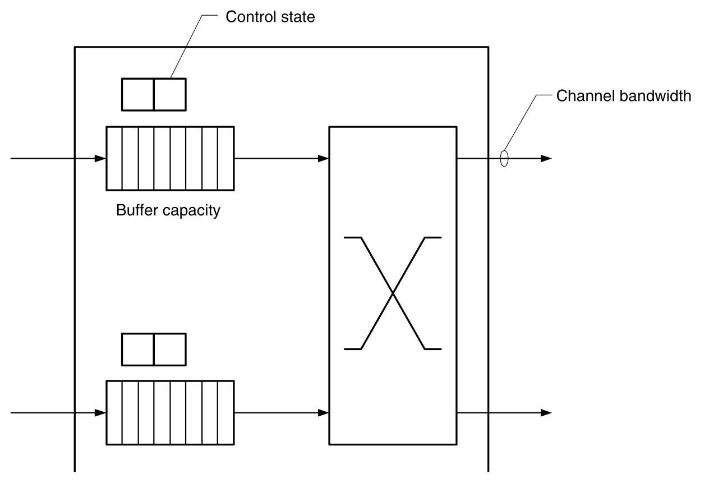
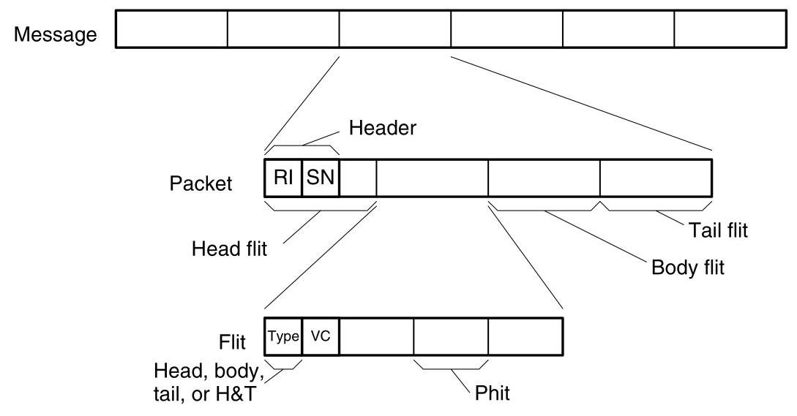
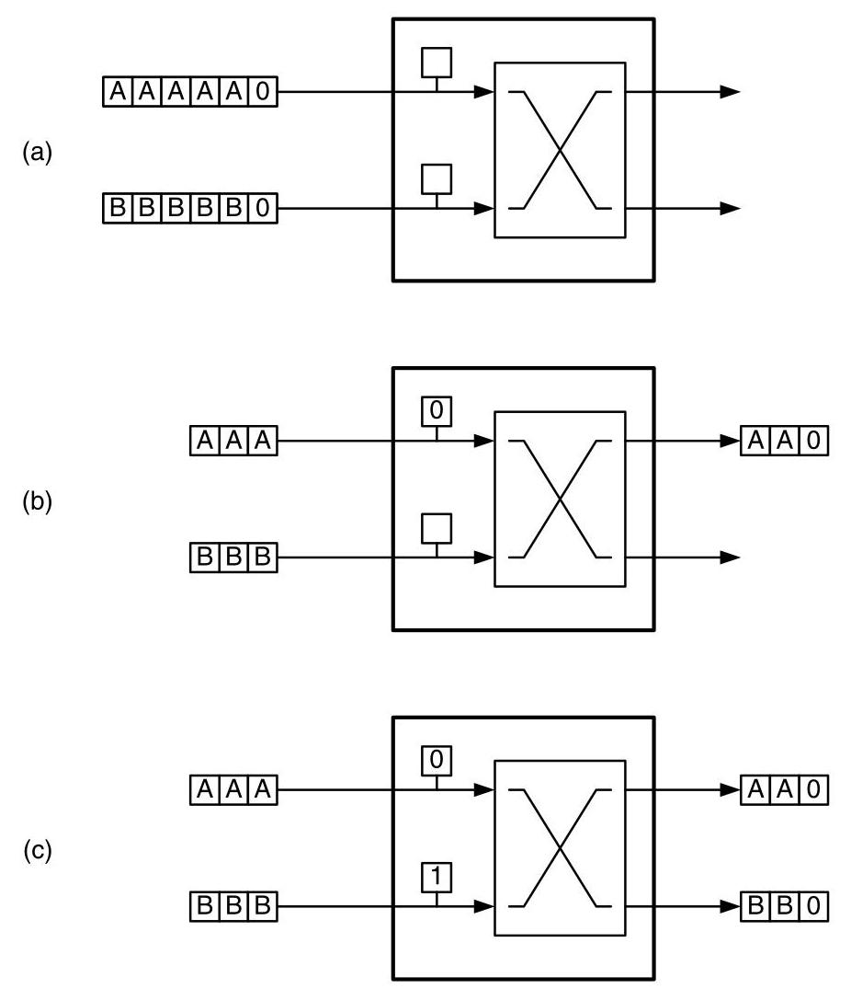
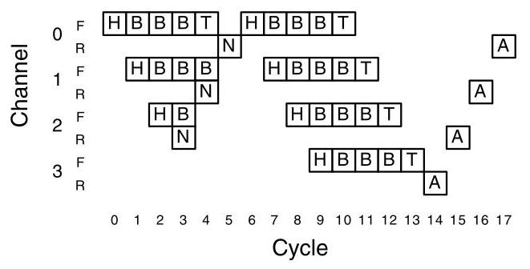
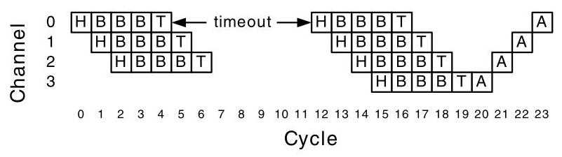
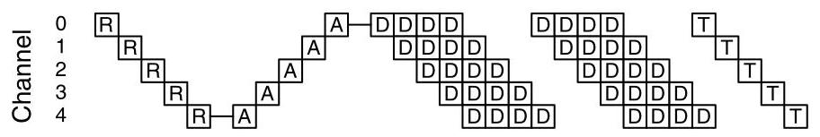
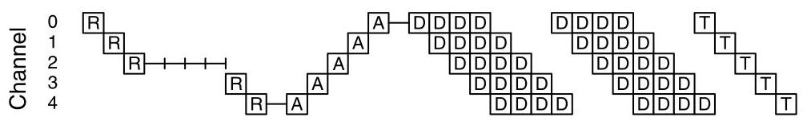

Flow control determines how a network's resources, such as channel bandwidth,

> 
流控制决定了网络的资源，如通道带宽，

<table><tr><td></td><td>CHAPTER 12</td></tr><tr><td></td><td>Flow Control Basics</td></tr></table>

buffer capacity, and control state, are allocated to packets traversing the network. A good flow-control method allocates these resources in an efficient manner so the network achieves a high fraction of its ideal bandwidth and delivers packets with low, predictable latency. ${}^{1}$ A poor flow-control method, on the other hand, wastes bandwidth by leaving resources idle and doing unproductive work with other resources. This results in a network, like the one we examined in Chapter 2, in which only a tiny fraction of the ideal bandwidth is realized and that has high and variable latency.

> 
网络中的通道带宽、缓冲区容量以及控制状态等资源，会分配给流经网络的数据包。优秀的流控方法能够高效地分配这些资源，使网络实现其理想带宽的绝大部分，并以低且可预测的延迟传递数据包${}^{1}$。而糟糕的流控方法则会浪费带宽，既让资源闲置，又利用其他资源进行无效工作，最终导致网络（就像我们在第2章中分析过的那种）只能实现极小部分的理想带宽，并且延迟高、波动大。

One can view flow control as either a problem of resource allocation or one of contention resolution. From the resource allocation perspective, resources in the form of channels, buffers, and state must be allocated to each packet as it advances from the source to the destination. The same process can be viewed as one of resolving contention. For example, two packets arriving on different inputs of a router at the same time may both desire the same output. In this situation, the flow-control mechanism resolves this contention, allocating the channel to one packet and somehow dealing with the other, blocked packet.

> 
可以将流控制视为资源分配问题或争用解决问题。从资源分配的角度来看，当每个数据包从源节点向目的节点前进时，必须以通道、缓冲区和状态的形式为其分配资源。同一过程也可以看作解决争用的过程。例如，在同一时刻到达路由器不同输入端的两个数据包可能都希望使用同一个输出端口。在这种情况下，流控制机制会解决这一争用，将通道分配给其中一个数据包，并以某种方式处理另一个被阻塞的数据包。

The simplest flow-control mechanisms are bufferless and, rather than temporarily storing blocked packets, they either drop or misroute these packets. The next step up in complexity and efficiency is circuit switching, where only packet headers are buffered. In circuit switching, the header of a packet traverses the network ahead of any packet payload, reserving the appropriate resources along the path. If the header cannot immediately allocate a resource at a particular node, it simply waits at that node until the resource becomes free. Once the entire path, or circuit, has been reserved, data may be sent over the circuit until it is torn down by deallocating the channels. All of these flow-control mechanisms are rather inefficient because they waste costly channel bandwidth to avoid using relatively inexpensive storage space.

> 
最简单的流控机制是无缓冲的，它们不会临时存储被阻塞的数据包，而是直接丢弃或错误转发这些数据包。在复杂度和效率上更进一步的是电路交换，其中仅对数据包头部进行缓冲。在电路交换中，数据包的头部先于任何数据包载荷穿越网络，沿途预留相应资源。若头部在某个节点无法立即分配资源，它便在该节点等待，直至资源空闲。一旦整条路径（即电路）预留完毕，即可通过该电路发送数据，直到通过释放各条通道来拆除该电路。所有这些流控机制都相当低效，因为它们浪费了昂贵的信道带宽，以避免使用成本相对较低的存储空间。

---

1. This assumes that the routing method does a good job load-balancing traffic and routes packets over nearly minimal distance paths.

> 
1. 这假设路由方法能够有效地均衡流量负载，并沿着近乎最短距离的路径传送数据包。

---

More efficient flow control can be achieved by buffering data while it waits to acquire network resources. Buffering decouples the allocation of adjacent channels in time. This decoupling reduces the constraints on allocation and results in more efficient operation. This buffering can be done either in units of packets, as with store-and-forward and cut-through flow control, or at the finer granularity of flits, as in the case of wormhole or virtual-channel flow control. By breaking large, variable-length packets into smaller, fixed-sized flits, the amount of storage needed at any particular node can be greatly reduced. Allocating resources in units of flits also facilitates creating multiple virtual channels per physical channel in the network, which can alleviate blocking and increase throughput.

> 
通过在等待获取网络资源时缓冲数据，可以实现更高效的流控制。缓冲在时间上将相邻通道的分配解耦。这种解耦减少了分配的限制，从而实现更高效的运行。这种缓冲可以以数据包为单位进行，如存储转发和直通流控制，也可以以更细粒度的微片进行，如虫洞或虚通道流控制。通过将大尺寸、可变长度的数据包分割成更小、固定大小的微片，可以大幅减少任一节点所需的存储量。以微片为单位分配资源还有助于在网络中为每个物理通道创建多个虚通道，这可以缓解阻塞并提高吞吐量。

We start our discussion of flow control in this chapter by discussing the flow control problem (Section 12.1), bufferless flow control (Section 12.2), and circuit switching (Section 12.3). In Chapter 13, we continue our exploration of flow control by discussing buffered flow-control methods. In these two chapters we deal only with allocation of resources in the network. As we shall see Chapter 14, there are additional constraints on allocation to ensure that the network remains deadlock-free. There is also a related problem to manage resources, in particular buffer memory, at the endpoints. Such end-to-end flow control employs similar principles but is not discussed here.

> 
本章开始对流控制进行探讨，首先介绍流控制问题（12.1节），然后讨论无缓冲流控制（12.2节），最后是电路交换（12.3节）。在第13章中，我们将通过讨论带缓冲的流控制方法来继续对流控制的探索。在这两章中，我们只涉及网络中资源的分配。正如我们将在第14章所看到的，为了确保网络无死锁，分配还需满足额外的约束条件。还有一个相关的问题是如何管理端点处的资源，特别是缓冲存储器。这种端到端的流控制采用了类似的原理，但此处不予讨论。

### 12.1 Resources and Allocation Units

To traverse an interconnection network, a message must be allocated resources: channel bandwidth, buffer capacity, and control state. Figure 12.1 illustrates these resources in a single node of a network. When a packet arrives at a node, it must first be allocated some control state. Depending on the flow control method, there may be a single control state per channel or, if an input can be shared between multiple packets simultaneously, there may be many sets of state. The control state tracks the resources allocated to the packet within the node and the state of the packet's traversal across the node. To advance to the next node, the packet must be allocated bandwidth on an output channel of the node. In some networks, allocating bandwidth on the output, or forward, channel also allocates bandwidth on a reverse channel traveling in the opposite direction. The reverse channel is typically used to carry acknowledgments and communicate flow control information from the receiving node. Finally, as the packet arrives at a node, it is temporarily held in buffer while awaiting channel bandwidth. All flow control methods include allocation of control state and channel bandwidth. However, some methods, which we will discuss in Section 12.2, do not allocate buffers.

> 
要穿越互连网络，消息必须获得资源分配：信道带宽、缓冲容量和控制状态。图12.1展示了网络中单个节点中的这些资源。当数据包到达一个节点时，它首先必须被分配一些控制状态。根据流控制方法的不同，可能每个信道有一个控制状态，或者如果输入可以在多个数据包之间同时共享，则可能存在多组状态。控制状态跟踪在节点内分配给该数据包的资源以及该数据包穿越节点的状态。要前进到下一个节点，数据包必须在该节点的输出信道上获得带宽分配。在某些网络中，在输出（或称正向）信道上分配带宽的同时，也会在相反方向传输的反向信道上分配带宽。反向信道通常用于携带确认信息，并传达来自接收节点的流控制信息。最后，当数据包到达节点时，它会被暂时保存在缓冲区中，等待信道带宽。所有流控制方法都包括控制状态和信道带宽的分配。然而，我们将在第12.2节中讨论的一些方法并不分配缓冲区。

Figure 12.1 Resources within one network node allocated by a flow control method: control state records the allocation of channels and buffers to a packet and the current state of the packet in traversing the node. Channel bandwidth advances flits of the packet from this node to the next. Buffers hold flits of the packet while they are waiting for channel bandwidth.

> 
图12.1 一个网络节点内由流控方法分配的资源：控制状态记录着信道和缓冲区分配给一个数据包的情况，以及该数据包在穿越该节点时的当前状态。信道带宽将数据包的微片从本节点推向下一节点。缓冲区在微片等待信道带宽时保存它们。

To improve the efficiency of this resource allocation, we divide a message into packets for the allocation of control state and into flow control digits (flits) for the allocation of channel bandwidth and buffer capacity.

> 
为了提高这种资源分配的效率，我们将消息划分为包用于控制状态的分配，并划分为流控制单元（flit）用于信道带宽和缓冲容量的分配。

Figure 12.2 shows the units in which network resources are allocated. At the top level, a message is a logically contiguous group of bits that are delivered from a source terminal to a destination terminal. Because messages may be arbitrarily long, resources are not directly allocated to messages. Instead, messages are divided into one or more packets that have a restricted maximum length. By restricting the length of a packet, the size and time duration of a resource allocation is also restricted, which is often important for the performance and functionality of a flow control mechanism.

> 
图 12.2 显示了分配网络资源的单位。在顶层，消息是从源端到目的端传递的逻辑上连续的比特组。由于消息可能任意长，资源不会直接分配给消息。相反，消息被划分为一个或多个具有受限最大长度的分组。通过限制分组的长度，资源分配的大小和持续时间也受到限制，这对于流量控制机制的性能和功能通常很重要。

A packet is the basic unit of routing and sequencing. Control state is allocated to packets. As illustrated in Figure 12.2, a packet consists of a segment of a message to which a packet header is prepended. The packet header includes routing information (RI) and, if needed, a sequence number (SN). The routing information is used to determine the route taken by the packet from source to destination. As described in Chapter 8, the routing information may consist of a destination field or a source route, for example. The sequence number is needed to reorder the packets of a message if they may get out of order in transit. This may occur, for example, if different packets follow different paths between the source and destination. If packets can be guaranteed to remain in order, the sequence number is not needed.

> 
分组是路由和排序的基本单元。控制状态被分配给分组。如图12.2所示，一个分组由消息的一个片段和前置的分组头组成。分组头包括路由信息（RI），以及如果需要的话，一个序列号（SN）。路由信息用于确定分组从源到目的地所经过的路由。如第8章所述，例如，路由信息可以包含一个目的地址字段或一条源路由。如果消息的各个分组在传输中可能发生乱序，则需要序列号来对它们重新排序。例如，如果不同的分组在源和目的地之间走不同的路径，就可能发生这种情况。如果可以保证分组保持顺序，则不需要序列号。

Figure 12.2 Units of resource allocation. Messages are divided into packets for allocation of control state. Each packet includes routing information (RI) and a sequence number (SN). Packets are further divided into flits for allocation of buffer capacity and channel bandwidth. Flits include no routing or sequencing information beyond that carried in the packet, but may include a virtual-channel identifier (VCID) to record the assignment of packets to control state.

> 
图12.2 资源分配单元。报文被划分为分组以分配控制状态。每个分组包含路由信息（RI）和序列号（SN）。分组进一步被划分为微片以分配缓冲区容量和通道带宽。微片除了分组所携带的信息外，不包含额外的路由或排序信息，但可能包含虚拟通道标识符（VCID），以记录分组到控制状态的分配。

A packet may be further divided into flow control digits or flits. A flit is the basic unit of bandwidth and storage allocation used by most flow control methods. Flits carry no routing and sequencing information and thus must follow the same path and remain in order. However, flits may contain a virtual-channel identifier (VCID) to identify which packet the flit belongs to in systems where multiple packets may be in transit over a single physical channel at the same time.

> 
分组可被进一步划分为流控单元，或称flit。flit是大多数流控方法所使用的带宽和存储分配的基本单位。flit不携带路由和排序信息，因此必须沿同一路径传输并保持顺序。然而，在多个分组可能同时通过同一物理信道传输的系统中，flit可能包含虚拟通道标识符（VCID）以标识该flit属于哪个分组。

The position of a flit in a packet determines whether it is a head flit, body flit, tail flit, or a combination of these. A head flit is the first flit of a packet and carries the packet's routing information. A head flit is followed by zero or more body flits and a tail flit. In a very short packet, there may be no body flits, and in the extreme case where a packet is a single flit, the head flit may also be a tail flit. As a packet traverses a network, the head flit allocates channel state for the packet and the tail flit deallocates it. Body and tail flits have no routing or sequencing information and thus must follow the head flit along its route and remain in order.

> 
微片在数据包中的位置决定了它是头微片、体微片、尾微片还是它们的组合。头微片是数据包的第一个微片，携带数据包的路由信息。头微片之后跟随零个或多个体微片，以及一个尾微片。在非常短的数据包中，可能没有体微片，极端情况下，如果一个数据包只有一个微片，该头微片同时也是尾微片。当数据包穿越网络时，头微片为数据包分配通道状态，尾微片则释放该状态。体微片和尾微片不包含路由或排序信息，因此必须沿头微片的路由跟随，并保持顺序。

A flit is itself subdivided into one or more physical transfer digits or phits. A phit is the unit of information that is transferred across a channel in a single clock cycle. Although no resources are allocated in units of phits, a link level protocol must interpret the phits on the channel to find the boundaries between flits.

> 
一个微片自身可被细分为一个或多个物理传输数字或物理传输单元。一个物理传输单元是在单个时钟周期内通过通道传输的信息单位。尽管没有以物理传输单元为单位分配资源，但链路层协议必须解析通道上的物理传输单元，以找到微片之间的边界。

Why bother to break packets into flits? One could do all allocation: channel state, buffer capacity, and channel bandwidth in units of packets. In fact, we will examine several flow control policies that do just this. These policies, however, suffer from conflicting constraints on the choice of packet size. On one hand, we would like to make packets very large to amortize the overhead of routing and sequencing. On the other hand, we would like to make packets very small to permit efficient, fine-grained resource allocation and minimize blocking latency. Introducing flits eliminates this conflict. We can achieve low overhead by making packets relatively large and also achieve efficient resource utilization by making flits very small.

> 
为什么要费心将数据包分解为微片？我们本可以以数据包为单位进行所有分配：信道状态、缓冲容量和信道带宽。事实上，我们会考察几种正是这样做的流控策略。然而，这些策略在数据包大小的选择上会面临相互冲突的约束。一方面，我们希望将数据包做得非常大，以分摊路由和排序的开销。另一方面，我们又希望将数据包做得非常小，以实现高效、细粒度的资源分配，并最小化阻塞延迟。引入微片就消除了这一冲突。我们可以通过让数据包相对较大来实现低开销，同时通过让微片非常小来实现高效的资源利用。

There are no hard and fast rules about sizes. However, phits are typically between 1 bit and 64 bits in size, with 8 bits being typical. Flits usually range from 16 bits (2 bytes) to 512 bits (64 bytes), with 64 bits (8 bytes) being typical. Finally, packets usually range from 128 bits (16 bytes) to 512 Kbits (64 Kbytes), with 1 Kbit (128 bytes) being typical. With these typical sizes, there are eight 8-bit phits to a 64-bit flit, and sixteen 64-bit flits to a 1-Kbit packet.

> 
关于尺寸并没有硬性规定。不过，phit 的大小通常在 1 比特到 64 比特之间，8 比特最为典型。flit 的大小通常在 16 比特（2 字节）到 512 比特（64 字节）之间，64 比特（8 字节）最为典型。最后，报文的大小通常在 128 比特（16 字节）到 512 千比特（64 千字节）之间，1 千比特（128 字节）最为典型。按照这些典型尺寸，8 个 8 比特的 phit 组成一个 64 比特的 flit，而 16 个 64 比特的 flit 组成一个 1 千比特的报文。

### 12.2 Bufferless Flow Control

The simplest forms of flow control use no buffering and simply act to allocate channel state and bandwidth to competing packets. In these cases, the flow-control method must perform an arbitration to decide which packet gets the channel it has requested. After the arbitration, the winning packet advances over this channel. The arbitration method must also decide how to dispose of any packets that did not get their requested destination. Since there are no buffers, we cannot hold the losing packets until their channels become free. Instead, we must either drop them or misroute them.

> 
最简单的流量控制形式不使用任何缓冲，仅通过分配信道状态和带宽给相互竞争的数据包。这种情况下，流量控制方法必须执行仲裁来决定哪个数据包得到所请求的信道。仲裁之后，胜出的数据包在该信道上向前推进。仲裁方法还必须决定如何处理未获得所请求目的地的数据包。由于没有缓冲，我们无法暂存这些落选的数据包直到其信道空闲，而必须将它们丢弃或进行错误路由。

For example, consider the situation in Figure 12.3(a). Two packets, A and B, arrive at a bufferless network node and both request output channel zero. Figure 12.3(b) shows how a dropping flow control method, similar to that used in Chapter 2, handles this conflict. In this case, A wins the arbitration and advances over the output link. Packet B, on the other hand, loses the arbitration and is discarded. Any resources, such as channel bandwidth, that are expended advancing packet B to this point are wasted. Packet B must be retransmitted from its source, which we assume has a buffered copy, repeating the effort already expended getting the packet to this point in the network. Also, some acknowledgment mechanism is required to inform the source when B has been received successfully or when it needs to be retransmitted. Alternatively, packet B may be misrouted to the other output, as shown in Figure 12.3(c). In this case, there must be sufficient path diversity and an appropriate routing mechanism to route packet B to its destination from this point.

> 
例如，考虑图12.3(a)所示的情况。两个数据包A和B到达一个无缓冲的网络节点，且都请求输出通道0。图12.3(b)展示了一种类似于第2章中使用的丢弃流控方法如何处理这一冲突。在这种情况下，A赢得仲裁，并通过输出链路前进。而数据包B则输掉仲裁并被丢弃。将数据包B推进到这一点所消耗的任何资源（如通道带宽）都被浪费了。数据包B必须从其源端重传（假设源端有缓冲副本），重复已经付出的将数据包送达网络中这一点的努力。此外，还需要某种确认机制来通知源端B已成功接收或何时需要重传。另一种方法是，如图12.3(c)所示，数据包B可能被误路由到另一个输出。在这种情况下，必须有足够的路径多样性以及适当的路由机制，以便从此点将数据包B路由到其目的地。

A time-space diagram for the dropping flow control policy of Figure 12.3(b), using explicit negative acknowledgments or nacks (N), is shown in Figure 12.4. This diagram is similar to a Gantt chart in that it shows the utilization of resources (channels) on the vertical axis plotted against time on the horizontal axis. The figure shows a five-flit packet being sent along a four-hop route. The vertical axis shows the forward (F) and reverse (R) directions of the four channels (0-3). The horizontal axis shows the flit cycle (0-17). In the figure, the first transmission of the packet is unable to allocate channel 3 and is dropped. A nack triggers a retransmission of the packet, which succeeds.

> 
图12.4展示了图12.3(b)中使用显式否定确认或NACK（N）的丢弃流控策略的时间-空间图。该图类似于甘特图，纵轴表示资源（通道）的利用率，横轴表示时间。图中展示了一个五微片的数据包沿四跳路由发送的过程。纵轴显示了四个通道（0-3）的前向（F）和反向（R）方向。横轴显示了微片周期（0-17）。在图中，数据包的首次传输未能分配到通道3而被丢弃。一个NACK触发该数据包的重传，随后重传成功。

Figure 12.3 Bufferless flow control: (a) Two packets, A and B, arrive at a network node. Both request output channel 0. (b) Dropping flow control: A acquires channel 0 and B is dropped. B must be retransmitted from the source. (c) Misrouting: A acquires channel 0 and B is misrouted onto channel 1. Later in the network, B must be rerouted for it to reach its correct destination.

> 
图 12.3 无缓冲流控：（a）两个数据包 A 和 B 到达一个网络节点，二者均请求输出通道 0。（b）丢弃式流控：A 获得通道 0，B 被丢弃。B 必须从源端重传。（c）误路由：A 获得通道 0，B 被误路由到通道 1。在网络后续节点，B 必须被重新路由才能到达其正确目的地。

A packet delivery begins in flit cycle 0 with the head flit (H) of the packet traversing channel 0 . The body flits (B) follow on cycles 1 through 3 and the tail flit (T) follows on cycle 4. In this case, the tail flit does not deallocate channel 0, as the packet must retain ownership of the channel until it receives an acknowledgment (positive or negative). During cycles 1 and 2, the head flit traverses channels 1 and 2, respectively. After traversing channel 2, however, the head flit encounters contention, is unable to acquire channel 3, and is dropped. To signal this failure, the router at the far end of channel 2 sends a nack along the reverse direction of channel 2 during cycle 3. The nack traverses the reverse direction of channels 1 and 0 on cycles 4 and 5, respectively, arriving at the source at the end of cycle 5 . As the nack arrives at each node, it releases the resources held by that node, making them available for other packets. For example, in cycle 4, the nack arrives at the near end of channel 1. At that point, the packet releases the forward and reverse directions of channel 1.

> 
数据包传递从 flit 周期 0 开始，数据包的头 flit（H）通过信道 0。体 flit（B）在周期 1 到 3 紧随其后，尾 flit（T）在周期 4 随后。此时，尾 flit 并不会解除信道 0 的分配，因为数据包必须保持对该信道的所有权，直到收到确认（肯定确认或否定确认）。在周期 1 和 2 期间，头 flit 分别通过信道 1 和信道 2。然而，在通过信道 2 之后，头 flit 遇到争用，无法获取信道 3，因而被丢弃。为通告这一失败，信道 2 远端的路由器在周期 3 沿信道 2 的反向发送一个 nack。该 nack 在周期 4 和 5 分别通过信道 1 和信道 0 的反向，于周期 5 结束时到达源端。当 nack 到达每个节点时，它会释放该节点所持有的资源，使这些资源可供其他数据包使用。例如，在周期 4，nack 到达信道 1 的近端。此时，数据包释放信道 1 的前向和反向资源。

Figure 12.4 Time-space diagram showing dropping flow control with explicit negative acknowledgment. Time is shown on the horizontal axis in cycles. Space is shown on the vertical axis in channels. Forward and reverse channels for each link are shown on alternating lines. A five-flit packet is transmitted across channel 0 in cycle 0 and proceeds across channels 1 and 2. It is unable to acquire channel 3 in cycle 3 and thus is dropped. A negative acknowledgment or nack (N) is transmitted across reverse channel 2 in cycle 3 . The arrival of this nack triggers a retransmission of the packet, starting in cycle 6 . The last flit of the packet is received at the destination in cycle 13 and an acknowledgment is sent along the reverse channels in cycle 14.

> 
图12.4 展示采用显式否定应答的丢弃流控制的时间-空间图。横轴表示时间，以周期为单位；纵轴表示空间上的通道。每条链路的前向与反向通道交替绘制。一个五微片的数据包在周期0通过通道0开始传输，随后依次通过通道1和通道2。在周期3，它无法获取通道3，因此被丢弃。一条否定应答（nack，用N表示）在周期3通过反向通道2传回。该否定应答的到达触发了数据包的重传，从周期6开始。数据包的最后一微片在周期13到达目的地，确认应答于周期14沿反向通道发出。

After the nack is received by the source, the packet is retransmitted starting in cycle 6. The retransmitted packet is able to acquire all four of the channels needed to reach the destination. The head flit reaches the destination during cycle 9 and the tail arrives during cycle 13. After the tail is received, an acknowledgment (A) is sent along the reverse channel in cycle 14 and arrives at the source in cycle 17. As the acknowledgment arrives at each node, it frees the resources held by that node.

> 
源端收到nack后，从周期6开始重传该数据包。重传的数据包得以获取到达目的地所需的全部四条通道。头部flit在周期9期间抵达目的地，尾部flit则在周期13抵达。尾部flit被接收后，确认信号（A）于周期14沿反向通道发出，并在周期17抵达源端。当确认信号到达每个节点时，它释放该节点所占用的资源。

The dropping flow control we implemented in Chapter 2 does not use explicit negative acknowledgments. Rather, it uses a timeout to detect when a packet is dropped, as illustrated in Figure 12.5. As before, the packet fails to acquire channel 3 on the first transmission. In this case, however, a nack is not sent. Instead, the packet continues its transmission across channels 0 through 2. On each of these channels, the tail flit deallocates the resources held by the packet as it leaves the node. Thus, channels 0, 1, and 2 become free during cycles 5, 6, and 7, respectively.

> 
我们在第2章实现的丢弃流控没有使用显式否定确认，而是通过超时来检测包何时被丢弃，如图12.5所示。与之前一样，这个包在第一次传输时未能获得信道3。然而在这种情况下，不发送否定确认。相反，该包继续通过信道0到2进行传输。在每条信道上，尾微片离开节点时会释放该包占用的资源。因此，信道0、1和2分别在第5、6和7个周期变为空闲。

---

Figure 12.5 Time-space diagram showing dropping flow control without explicit nack: A 5-flit packet is transmitted starting in cycle 0 and proceeds across channels 0, 1, and 2. The packet is unable to acquire channel 3 in cycle 3 and is dropped at this point. However, the preceding channels continue to transmit the packet until the tail flit is received. A timeout triggers a retransmission of the packet in cycle 12. The tail flit of the packet is received during cycle 19 and an acknowledgment is sent starting in cycle 20.

> 
图 12.5 显示无显式否定确认（nack）的直接丢弃流控的时空图：一个由 5 个微片（flit）组成的包从周期 0 开始传输，依次经过通道 0、1 和 2。该包在周期 3 无法获取通道 3，并在此刻被丢弃。然而，前面的通道仍继续传输该包，直至尾部微片被接收。超时机制触发在周期 12 重传该包。该包的尾部微片在周期 19 期间被接收，而确认信号从周期 20 开始发送。

---

After a timeout has elapsed without the source receiving an acknowledgment, it retransmits the packet starting in cycle 12. This time the packet is successfully received during cycles 15 through 19. An acknowledgment is sent in cycle 20, arriving in cycle 23. Since no resources are held after the tail flit passes, the acknowledgment must compete for the reverse channels and may itself be dropped. In this case, the packet will be retransmitted even though it was correctly received the first time. Some mechanism, which would typically employs sequence numbers, is needed at the receiver to delete such duplicate packets, ensuring that every packet is received exactly once.

> 
在超时过后，源端仍未收到确认，便在周期12开始重传该数据包。这一次，数据包在周期15至19期间被成功接收。确认信号于周期20发出，周期23到达。由于尾 flit 通过后不保留任何资源，该确认信号必须竞争反向通道，且可能自身被丢弃。在这种情况下，数据包即便首次已被正确接收，仍会被重传。因此，接收端需要某种机制（通常采用序列号）来删除此类重复数据包，确保每个数据包恰好被接收一次。

Although simple, dropping flow control is very inefficient because it uses valuable bandwidth transmitting packets that are later dropped. A method of calculating the throughput of dropping flow control (without explicit nacks) is given in Chapter 2.

> 
虽然简单，但丢弃式流控制非常低效，因为它用宝贵的带宽传输了随后被丢弃的数据包。第2章给出了一种计算丢弃式流控制（无显式否定确认）吞吐量的方法。

While misrouting, as in Figure 12.3(c), does not drop packets, it wastes bandwidth by sending packets in the wrong direction. In some cases, this leads to instability, where the throughput of the network drops after the offered traffic reaches a point. Misrouting also applies only to networks that have sufficient path diversity for a packet to be able to reach the destination after being misrouted. A butterfly network, for example, cannot use misrouting, since one incorrect hop will prevent a packet from ever reaching its destination. In networks like tori that do have sufficient path diversity, livelock is an issue when misrouting is used. If a packet misroutes too often, it may never get closer to its destination. Any flow control policy that involves misrouting should include some provable guarantee of forward progress to ensure that every packet eventually gets delivered.

> 
尽管如图12.3(c)所示的误路由不会丢弃数据包，但它通过将数据包发往错误方向而浪费了带宽。在某些情况下，这会导致不稳定性，即当提供的负载达到某一点后，网络的吞吐量会下降。误路由也仅适用于具有足够路径多样性的网络，使得数据包在误路由后仍能到达目的地。例如，蝶形网络就无法使用误路由，因为一次错误跳步就会导致数据包永远无法到达目的地。在像环形网格这样确实具有足够路径多样性的网络中，采用误路由时会面临活锁问题。如果数据包误路由过于频繁，它可能永远无法靠近目的地。任何涉及误路由的流控策略，都应包含某种可证明的前向进展保证，以确保每个数据包最终都能被送达。

### 12.3 Circuit Switching

Circuit switching is a form of bufferless flow control that operates by first allocating channels to form a circuit from source to destination and then sending one or more packets along this circuit. When no further packets need to be sent, the circuit is deallocated. As illustrated in Figure 12.6, the process involves four phases. During the first phase (cycles 0-4), a request (R) propagates from the source to the destination and allocates channels. In this example, no contention is encountered and the request reaches the destination without delay. After the circuit is allocated, an acknowledgment (A) is transmitted back to the source during the second phase (cycles 6-10). Once the acknowledgment is received, the circuit is established and can handle an arbitrary number and size of data packets with no further control. In the example, two four-flit packets are sent, each followed by three idle cycles. Finally, when no further data needs to be sent, a tail flit (T) is sent to deallocate the channels (cycles 26-30), freeing these channels for use in other circuits.

> 
电路交换是一种无缓冲流控方式，其工作过程是：首先分配信道以构成从源到目的地的电路，然后沿该电路发送一个或多个数据包。当无需继续发送数据包时，电路被释放。如图12.6所示，该过程包含四个阶段。在第一阶段（周期0–4），请求（R）从源向目的地传播并分配信道。本例中未遇到竞争，请求无延迟到达目的地。电路分配完成后，确认（A）在第二阶段（周期6–10）被回传至源端。源端收到确认后，电路建立完毕，可承载任意数量和长度的数据包而无需额外控制。示例中发送了两个四微片的数据包，每个数据包后跟随三个空闲周期。最后，当无需继续发送数据时，发送一个尾微片（T）来释放信道（周期26–30），从而将这些信道释放以供其他电路使用。

Circuit switching differs from dropping flow control in that if the request flit is blocked, it is held in place rather than dropped. This situation is illustrated in Figure 12.7, which is identical to Figure 12.6 except that the request is delayed four cycles before it is able to allocate channel 3. During this period, the head flit is blocked. It is held in the router at the near end of channel 3 and it rearbitrates for access to channel 3 each cycle. Eventually (in this case, in cycle 7), the head flit acquires channel 3 and proceeds with allocation of the circuit. So, compared to dropping flow control, circuit switching has the advantage that it never wastes resources by dropping a packet. Because it buffers the header at each hop, it always makes forward progress. However, circuit switching does have two weaknesses that make it less attractive than buffered flow control methods: high latency and low throughput.

> 
电路交换与丢弃流控的不同之处在于，若请求flit被阻塞，它会被保留在原处而非丢弃。图12.7展示了这一情形，该图与图12.6相同，唯一区别是请求在成功分配到通道3之前被延迟了四个周期。在此期间，头部flit处于阻塞状态，它被保留在通道3近端的路由器中，并在每个周期重新仲裁对通道3的访问权。最终（本例中为周期7），头部flit获取通道3并继续进行电路分配。因此，与丢弃流控相比，电路交换的优势在于它从未因丢弃数据包而浪费资源。由于在每个跳点缓冲头部信息，它能始终保证向前推进。然而电路交换存在两个弱点，使其不如缓存流控方法具有吸引力：高延迟和低吞吐量。

0123435678901112131415161718192021222324252627282930

> 
0123435678901112131415161718192021222324252627282930

Cycle

> 
周期

Figure 12.6 Time-space diagram showing transmission of two 4-flit packets over a 5-hop route using circuit switching with no contention. For this example, ${t}_{r} = 1$ cycle, and $D = 0$ . The transmission proceeds in 4 phases. First, a request (R) is sent to the destination to acquire the channel state at each hop of the route. Second, when the request reaches the destination, an acknowledgment (A) is returned along a reverse channel to the source. Third, when the acknowledgment reaches the source, the data flits (D) are sent over the reserved channel. As long as the channel (circuit) is open, additional packets may be sent. Finally, a tail flit (T) deallocates the reserved channels as it passes.

> 
图 12.6 时空图展示了在无竞争条件下，使用电路交换通过 5 跳路由传输两个 4 微片数据包的过程。在此示例中，${t}_{r} = 1$ 个周期，且 $D = 0$。传输分为 4 个阶段进行。首先，向目的地发送请求（R），以在路由的每一跳获取信道状态。其次，当请求到达目的地时，通过反向信道向源端返回确认（A）。第三，当确认到达源端时，数据微片（D）通过预留的信道发送。只要信道（电路）保持开通，就可以继续发送其他数据包。最后，尾微片（T）在通过时释放预留的信道。

From the time-space diagram of Figures 12.6 and 12.7 one can see that the zero-load latency of a single packet using circuit switching is

> 
从图12.6和图12.7的时空图中可以看出，使用电路交换的单个数据包的零负载延迟是

$$
{T}_{0} = {3H}{t}_{r} + \frac{L}{b}
$$

> 
$$
{T}_{0} = {3H}{t}_{r} + \frac{L}{b}
$$

ignoring wire latency. The first term reflects the time required to set up the channel (not including contention) and deliver the head flit, the second term is serialization latency, the third term is the time of flight, and the final term is contention time. This equation has three times the header latency given in Equation 3.11 because the path from source to destination must be traversed three times to deliver the packet: once in each direction to set up the circuit and then again to deliver the first flit. These three traversals represent a significant increase in latency in the case of a single short packet.2

> 
忽略导线延迟。第一项反映了建立通道（不包括竞争）并交付头微片所需的时间，第二项是串行化延迟，第三项是飞行时间，最后一项是竞争时间。该方程中的头部延迟是公式3.11所给出延迟的三倍，因为从源到目的地的路径必须遍历三次才能交付数据包：每个方向各一次以建立电路，然后再次遍历以交付第一个微片。对于单个短数据包，这三次遍历意味着延迟显著增加。2

$\begin{array}{lllllllllllllllllllllllllllllllllll} 0 & 1 & 2 & 3 & 4 & 5 & 6 & 7 & 8 & 9 & {10} & {11} & {12} & {13} & {14} & {15} & {16} & {17} & {18} & {19} & {20} & {21} & {22} & {23} & {24} & {25} & {26} & {27} & {28} & {29} & {30} & {31} & {32} & {33} & {34} \end{array}$

> 
$\begin{array}{lllllllllllllllllllllllllllllllllll} 0 & 1 & 2 & 3 & 4 & 5 & 6 & 7 & 8 & 9 & {10} & {11} & {12} & {13} & {14} & {15} & {16} & {17} & {18} & {19} & {20} & {21} & {22} & {23} & {24} & {25} & {26} & {27} & {28} & {29} & {30} & {31} & {32} & {33} & {34} \end{array}$

Cycle

> 
周期

---

Figure 12.7 Time-space diagram showing circuit switching with contention. For this example, ${t}_{r} = 1$ cycle, and $D = 0$ . The case is identical to that of Figure 12.6 except that the request is blocked for 4 cycles (cycles 3-6) before it is able to allocate channel 3.

> 
图 12.7 时空图展示存在竞争时的电路交换。在该示例中，${t}_{r} = 1$ 个周期，且 $D = 0$。除请求在能够分配信道 3 之前被阻塞了 4 个周期（周期 3–6）外，其余情况与图 12.6 相同。

---

Throughput also suffers in circuit switching because the period of time that a channel is reserved is longer than the time it is active. In the case where a single packet is sent, each channel is busy (held by the circuit) for

> 
在电路交换中，吞吐量也会受到影响，因为信道被预留的时间比其实际活跃的时间更长。在发送单个数据包的情况下，每个信道忙（被电路占用）的时长

$$
{T}_{b0} = {2H}{t}_{r} + \frac{L}{b}.
$$

> 
$$
{T}_{b0} = {2H}{t}_{r} + \frac{L}{b}.
$$

During the ${2H}{t}_{r}$ setup time the channel is idle. It cannot be allocated to another circuit and the current circuit is not yet ready to send data over it. The channel bandwidth represented by this time is thus lost. For short-duration circuits, this is a significant overhead. ${}^{3}$

> 
在 ${2H}{t}_{r}$ 的建立时间内，信道处于空闲状态。它无法被分配给其他电路，且当前电路尚未准备好通过它发送数据。因此，这段时间所代表的信道带宽就被浪费了。对于持续时间短的电路而言，这是一个显著的开销。 ${}^{3}$

Circuit switching has the advantage of being very simple to implement. The logic for a router differs only slightly from that of the dropping flow control router described in Chapter 2. A register is added to each input to hold a request in the event of contention and a reverse path is added.

> 
电路交换的优点是实现起来非常简单。其路由器的逻辑与第2章中描述的丢弃流控路由器仅有细微差别。每个输入端添加了一个寄存器，用于在发生争用时暂存请求，并添加了一条反向路径。

### 12.4 Bibliographic Notes

Circuit switching has its origins in telephony, but is not commonly used in modern interconnection networks. Dropping flow control, while inefficient, is simple and was used in the BBN Butterfly (Section 4.5) and its follow-on, the BBN Monarch (Section 23.4). Misrouting packets, also refered to as deflection or hot-potato routing, was introduced by Baran [12] and was used in both the HEP Multiprocessor [174] and the Tera Computer System [9].

> 
电路交换起源于电话技术，但在现代互连网络中并不常用。丢弃式流控虽然效率低，但实现简单，曾被用于 BBN Butterfly（第 4.5 节）及其后继系统 BBN Monarch（第 23.4 节）。误路由分组，也称为偏转路由或热土豆路由，由 Baran [12] 提出，并应用于 HEP 多处理器 [174] 和 Tera 计算机系统 [9]。

### 12.5 Exercises

12.1 Dropping flow control with explicit nacks. Consider the dropping flow control technique with explicit nacks discussed in Section 12.2 and shown in Figure 12.4. Compute an upper-bound on the throughput (as a fraction of capacity) of a network using this flow control method. Assume a maximum packet length of $F$ flits, an average hop count of ${H}_{\text{ avg }}$ , uniform traffic, and a symmetric topology.

> 
12.1 使用显式否定应答的丢弃流控。考虑 12.2 节讨论并在图 12.4 中展示的、带显式否定应答的丢弃流控技术。计算使用该流控方法的网络吞吐量（以容量的分数表示）的上界。假设最大数据包长度为 $F$ 个微片，平均跳数为 ${H}_{\text{ avg }}$，流量均匀，且拓扑对称。

12.2 Timeout interval for dropping flow control. Consider the dropping flow control technique with timeout discussed in Section 12.2 and shown in Figure 12.5. Assuming that the maximum packet length is $F$ flits and each hop of the network requires one flit time (cycle), give an expression for the minimum timeout interval in terms of these parameters and the network's diameter.

> 
12.2 丢弃流控的超时间隔。考虑第 12.2 节讨论的、如图 12.5 所示的带超时的丢弃流控技术。假设最大分组长度为 $F$ 个微片，且网络的每一跳需要一个微片时间（周期），请用这些参数及网络直径给出最小超时间隔的表达式。

---

2. In the absence of contention, this disadvantage can be eliminated by using optimistic circuit switching. See Exercise 12.4.

> 
2. 在没有争用的情况下，通过使用乐观电路交换可以消除这一缺点。参见练习12.4。

3. Some of this overhead can be eliminated, in the absence of contention, by having the circuit setup request reserve the channel for future use rather than claiming it immediately. See Exercise 12.5.

> 
3. 在无争用的情况下，通过让电路建立请求为将来使用预留通道而不是立即占用，可以消除部分这种开销。参见习题12.5。

---

12.3 Livelock with dropping flow control and timeout. In dropping flow control with a timeout mechanism, the reverse channels for acknowledgments are not reserved and therefore the acknowledgments themselves may be dropped because of contention. Explain the livelock issues associated with this and suggest a simple solution.

> 
12.3 采用超时机制的丢弃流控制中的活锁问题。在采用超时机制的丢弃流控制中，用于确认的反向通道并未预留，因此确认信息本身可能因竞争而被丢弃。请解释与此相关的活锁问题并提出一个简单的解决方案。

12.4 Optimistic circuit switching. An optimistic circuit switching technique could lower zero-load latency by speculatively sending the data along with the header as the circuit is being set up. If the header becomes blocked, the data is dropped and a nack is send back along the partially reserved circuit. Otherwise, the data can be deliver to the destination immediately after the circuit is established. Draw two time-space diagrams of optimistic circuit switching for when the speculative data is and is not dropped. Assume ${t}_{r} = 1$ cycle and $D = 0$ . Can optimistic circuit switching reduce the number of cycles that channels are reserved but idle? If so, by how much?

> 
12.4 乐观电路交换。乐观电路交换技术可以在建立电路时，让数据随头部一起推测性地发送，从而降低零负载延迟。如果头部遇阻，数据将被丢弃，并沿已部分预留的电路返回一个否认确认。否则，数据可在电路建立后立即送达目的地。请绘制乐观电路交换在推测性数据被丢弃和未被丢弃两种情况下的时空图。假设 ${t}_{r} = 1$ 周期且 $D = 0$。乐观电路交换能否减少信道被预留但空闲的周期数？如果能，减少多少？

12.5 Reservation circuit switching. Consider a flow control method similar to circuit switching but where the request message reserves each channel for a fixed period of time in the future (for example, for 10 cycles starting in 15 cycles). At each router along the path, if the request can be accommodated a reservation is made. If the request cannot be accommodated a nack is sent that cancels all previous recommendations for the connection, and the request is retried. If a request reaches the destination, an acknowledgement is sent back to the source, confirming all reservations. Draw a time-space diagram of a situation that demonstrates the advantage of reservation circuit switching over conventional circuit switching.

> 
12.5 预约电路交换。考虑一种与电路交换类似的流量控制方法，但请求消息会为每条通道在未来的固定时间段内预留资源（例如，从 15 个周期后开始，持续 10 个周期）。在路径上的每个路由器处，如果请求可以被满足，则进行预留；若无法满足，则发送一个否定应答，取消之前为该连接所做的所有预留，并重试该请求。如果请求到达目的地，则向源端回送一个确认，确认所有预留。绘制一个时空图，展示预约电路交换相较于传统电路交换的优势所在。

This Page Intentionally Left Blank

> 
此页有意留空
