Previously, we focused on increasing the efficiency of resource allocation, such as

> 
之前，我们专注于提高资源分配的效率，例如

<table><tr><td></td><td>CHAPTER 15</td></tr><tr><td></td><td>Quality of Service</td></tr></table>

achieving higher bandwidth and lower latency. However, even with perfect routing and flow control, situations remain in which the requests for a particular resource will exceed its capacity. In this regime, our attention shifts from efficiently allocating the resource to fairly allocating the resource according to to some service policies. In this chapter, we focus on both the typical services requested by network clients and the mechanisms for providing these services. Broadly speaking, we refer to these topics as providing QoS.

> 
实现更高的带宽和更低的延迟。然而，即使路由和流控完美无缺，仍然会出现对特定资源的需求超出其容量的情况。在这种场景下，我们的关注重点将从高效分配资源，转向根据某些服务策略公平地分配资源。在本章中，我们将重点讨论网络客户端请求的典型服务，以及提供这些服务的机制。广义而言，我们将这些主题统称为提供 QoS。

### 15.1 Service Classes and Service Contracts

In some applications of interconnection networks, it is useful to divide network traffic into a number of classes to more efficiently manage the allocation of resources to packets. Different classes of packets may have different requirements - some classes are latency-sensitive, while others are not. Some classes can tolerate latency but not jitter. Some classes can tolerate packet loss, while others cannot. Also, different classes of packets may have different levels of importance. The packets that keep the life-support systems going will take priority over the packets that carry digital audio for the entertainment system.

> 
在某些互联网络的应用中，将网络流量划分为若干类别有助于更有效地管理对数据包的资源分配。不同类别的数据包可能有不同的需求——有些类别对延迟敏感，而其他类别则不然。有些类别可以容忍延迟，但不能容忍抖动。有些类别可以容忍数据包丢失，而其他类别则不能。此外，不同类别的数据包可能具有不同级别的重要性。维持生命支持系统运行的数据包将优先于为娱乐系统传输数字音频的数据包。

Allocating resources based on classes allows us to prioritize services so more important classes get a higher level of services and to tailor services so resource allocation can account for the particular requirements of each packet class. With prioritized services, we may give packets of one class strict priority in allocation of buffers and channels over packets of a lower class, or we may provide one class with a larger fraction of the overall resource pool. With tailored resource allocation, packets that belong to a class that needs low latency can advance ahead of packets that are latency-insensitive. Packets of another class that can tolerate latency but not jitter may be scheduled to make their delay large but predictable. Packets of a class that can tolerate loss will be dropped before packets of a class that cannot tolerate loss. Knowing the priority and requirements of each class allows us to allocate resources more efficiently than if all packets received exactly the same service.

> 
基于类别分配资源使我们能够区分服务优先级，让更重要的类别获得更高水平的服务，并定制服务，使资源分配能够考虑到每个分组类别的特定需求。在区分优先级的服务中，我们可以让某一类分组在缓冲区和通道的分配上严格优先于较低类别的分组，或者为某一类提供整体资源池中更大的份额。通过量身定制的资源分配，需要低延迟的类别的分组可以优先于延迟不敏感的分组通过。另一类能容忍延迟但不能容忍抖动的分组可以调度使其延迟较大但可预测。能容忍丢失的类别的分组将在不能容忍丢失的类别的分组之前被丢弃。了解每个类别的优先级和需求，使得我们能够比所有分组都获得完全相同的服务时更有效地分配资源。

Traffic classes fall into two broad categories: guaranteed service classes and best efforts classes. Guaranteed service classes are guaranteed a certain level of performance as long as the traffic they inject complies with a set of restrictions. There is a service contract between the network and the client. As long as the client complies with the restrictions, the network will deliver the performance. The client side of the agreement usually restricts the volume of traffic that the client can inject - that is, the maximum offered throughput. In exchange for keeping the offered traffic below a certain level, the network side of the contract may specify a guaranteed loss rate, latency, and jitter. For example, we may guarantee that 99.999% of the packets of class $A$ will be delivered without loss and have a latency no larger than ${1\mu }\mathrm{s}$ as long as $A$ injects no more than 1 Kbits during any 100 ns period.

> 
流量类别分为两大类：有保障的服务类别和尽力而为类别。有保障的服务类别，只要其注入的流量符合一组限制条件，就能保证获得一定性能水平。网络与客户之间签订有服务契约。只要客户遵守这些限制，网络便会交付相应性能。协议中客户方的义务通常是对其可注入的流量总量——即最大提供吞吐量——加以限制。作为将提供流量保持在特定水平之下的交换，网络方的契约可规定有保障的丢包率、时延和抖动。例如，只要类别 $A$ 在任何100 ns周期内注入不超过1 Kbits，我们便可保证该类别99.999%的数据包无丢失交付，且时延不超过 ${1\mu }\mathrm{s}$。

In contrast, the network makes no strong guarantees about best efforts packets. Depending on the network, these packets may have arbitrary delay or even be dropped. ${}^{1}$ The network will simply make its best effort to deliver the packet to its destination.

> 
相比之下，网络对尽力而为的数据包不做强有力的保证。视网络而定，这些数据包可能会有任意的延迟，甚至可能被丢弃。${}^{1}$ 网络仅会尽最大努力将数据包传送到目的地。

Service classes in interconnection networks are analogous to service classes in package delivery. While guaranteed service packets are like Federal Express® (they guarantee that your package will get there overnight as long as it fits in their envelope and is not more than a specified weight), best efforts packets are like mail in the U.S. Postal Service (your package will probably get there in a few days, but there are no guarantees). There may be several classes of best efforts traffic in a network, just as the mail has several classes of package delivery (such as first-class, third-class, and so on).

> 
互联网络中的服务类别类似于包裹递送中的服务类别。保证服务（guaranteed service）数据包就像联邦快递®（Federal Express®）（只要你的包裹符合其信封尺寸且不超过规定重量，他们就能保证次日送达），而尽力而为（best efforts）数据包则类似于美国邮政服务（U.S. Postal Service）的邮件（你的包裹大概几天能到，但不提供任何保证）。网络中可能存在多个尽力而为流量类别，正如邮件有多个包裹递送等级（如一级、三级等等）。

Within a given class of service and, in particular, a best-efforts class, there is often a presumption of fairness between flows. Flows are simply the smallest level of distinction made between the packets that comprise a class. A flow might be all the packets generated by a particular source, those traveling toward a common destination or all the packets sent by an application running on the network clients. One expects that two flows of the same class will see roughly the same level of service: similar levels of packet loss, similar delay, etc. If one flow has all of its packets delivered with low latency and the other flow has all of its packets dropped, the network is being unfair. We shall define this notion of fairness more precisely below.

> 
在同一服务类别内，尤其是在尽力而为类别中，通常假定流之间是公平的。流只是对构成某一类别的数据包所做的最小粒度区分。一个流可以是某个源生成的所有数据包、发往同一目的地的所有数据包，或者网络客户端上运行的应用程序发出的所有数据包。人们期望同一类别的两个流能够获得大致相同的服务水平：相似的丢包率、相似的延迟等。如果一个流的所有数据包都以低延迟送达，而另一个流的所有数据包都被丢弃，那网络就是不公平的。我们将在下文中更精确地定义这种公平性概念。

### 15.2 Burstiness and Network Delays

As mentioned, service guarantees may contain delay and jitter constraints in addition to rate requests. To implement these guarantees, the burstiness of particular traffic flows must be considered. Conceptually, a non-bursty flow sends its data in a regular pattern. A non-bursty flow is shown in Figure 15.1(a), sending at a rate of two-third packets/cycle. In contrast, a bursty flow tends to send its data in larger clumps rather than smoothly over time. For example, Figure 15.1(b) shows a bursty flow with a rate of one-third packets/cycle.

> 
如前所述，服务保证除了速率请求外，还可能包含延迟和抖动约束。为实现这些保证，必须考虑特定业务流的突发性。从概念上讲，非突发性流以规律的模式发送数据。图15.1(a)展示了一个非突发性流，其发送速率为三分之二数据包/周期。相比之下，突发性流倾向于将数据以较大的团块形式发送，而不是随时间均匀地发送。例如，图15.1(b)展示了一个速率为三分之一数据包/周期的突发性流。

The result of these two flows sharing a 1-packet/cycle-channel is shown in Figure 15.1(c). First, the jitter of the non-bursty flow has been increased from 1 to 2 cycles because of the interaction with the bursty flow. Also, the bursty flow was delayed up to 4 cycles while traversing the channel. It can be easily verified that reducing the burstiness of the second flow would reduce both its delay and the jitter of the first flow. This simple example shows that the delay and jitter guarantees of flow can be greatly affected by the flows with which it shares resources. To quantify these affects, we first introduce a technique for characterizing bursty flows. The delay analysis of a simple network element subjected to two bursty flows is presented.

> 
这两个流共享一个1数据包/周期通道的结果如图15.1(c)所示。首先，非突发流的抖动因与突发流的交互而从1个周期增加到2个周期。此外，突发流在穿越通道时被延迟了最多4个周期。可以很容易地验证，降低第二个流的突发性会同时减少其自身的延迟以及第一个流的抖动。这个简单的例子表明，流的延迟和抖动保证会因与其共享资源的其他流而受到很大影响。为了量化这些影响，我们首先引入一种用于刻画突发流的技术。随后将给出一个简单网络单元受到两个突发流作用时的延迟分析。

#### 15.2.1 $\left( {\sigma ,\rho }\right)$ Regulated Flows

A common and powerful way to model flows when making QoS guarantees is in terms of two parameters: $\sigma$ and $\rho$ . The $\rho$ parameter simply represents the average rate of the flow, while the $\sigma$ term captures burstiness. For any time interval of length $T$ , the number of bits injected in a $\left( {\sigma ,\rho }\right)$ regulated flow is less than or equal to $\sigma  + {\rho T}$ . That is, the number of bits can only exceed the average number ${\rho T}$ by the maximum burst size $\sigma$ . We have already seen a $\left( {\sigma ,\rho }\right)$ description of a flow in Section 15.1: packets of class $A$ are delivered in under ${1\mu }\mathrm{s}$ as long as $A$ injects no more than $1\mathrm{K}$ bits during any ${100} - \mathrm{{ns}}$ period. The rate of this flow is $\rho  = 1\mathrm{K}$ bits $/{100}\mathrm{{ns}} =$ 10 Gbps and $\sigma$ is at most $1\mathrm{K}$ bits.

> 
在提供服务质量保证时，一种常见且强大的流建模方式是通过两个参数：$\sigma$ 和 $\rho$ 。$\rho$ 参数简单表示流的平均速率，而 $\sigma$ 项捕获突发性。对于任意长度为 $T$ 的时间间隔，一个受 $\left( {\sigma ,\rho }\right)$ 调节的流注入的比特数小于或等于 $\sigma  + {\rho T}$ 。也就是说，比特数最多只能超过平均数量 ${\rho T}$ 达到最大突发大小 $\sigma$ 。我们已经在第15.1节中见过流的 $\left( {\sigma ,\rho }\right)$ 描述：只要 $A$ 类数据包在任何 ${100} - \mathrm{{ns}}$ 期间内注入的比特数不超过 $1\mathrm{K}$ ，就能在 ${1\mu }\mathrm{s}$ 内交付。该流的速率是 $\rho  = 1\mathrm{K}$ 比特 $/{100}\mathrm{{ns}} =$ 10 Gbps ，而 $\sigma$ 至多为 $1\mathrm{K}$ 比特。

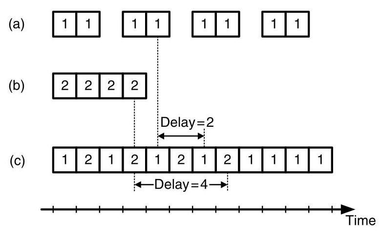

Figure 15.1 An example of a (a) non-bursty and (b) bursty flow (c) sharing the same channel. The jitter of the non-bursty flow is increased to 2 cycles and the delay of the bursty flow is 4 cycles.

> 
图15.1 展示了一个（a）非突发流和（b）突发流（c）共享同一信道的例子。非突发流的抖动增加到2个周期，而突发流的延迟为4个周期。

Not only is it useful to express the nature of a flow in terms of $\sigma$ and $\rho$ , but it is also possible to control these parameters of any particular flow. This control can be achieved using a $\left( {\sigma ,\rho }\right)$ regulator, as shown in Figure 15.2. The regulator consists of an input queue that buffers the unregulated input flow. This queue is served only when tokens are available in the token queue. For each byte served from the input queue, a single token is removed from the token queue. To control the rate $\rho$ of the outgoing flow, tokens are inserted into the token queue at a rate of $\rho$ . Then the amount of burstiness in the output flow is set by the depth of the token queue $\sigma$ . Controlling flows with a $\left( {\sigma ,\rho }\right)$ regulator can reduce the impact of bursty flows on other flows in the network. ${}^{2}$

> 
用 $\sigma$ 和 $\rho$ 来表示流的特性不仅有用，而且还可以控制任何特定流的这些参数。这种控制可以通过一个 $\left( {\sigma ,\rho }\right)$ 调节器来实现，如图15.2所示。调节器由一个输入队列组成，该队列缓冲未经调节的输入流。该队列仅在令牌队列中有令牌可用时才被服务。对于从输入队列中服务的每个字节，从令牌队列中移除一个令牌。为了控制输出流的速率 $\rho$，令牌以速率 $\rho$ 插入令牌队列。然后，输出流中的突发量由令牌队列的深度 $\sigma$ 决定。使用 $\left( {\sigma ,\rho }\right)$ 调节器控制流可以减少突发流对网络中其他流的影响。${}^{2}$

#### 15.2.2 Calculating Delays

Assuming $\left( {\sigma ,\rho }\right)$ characterized flows, deterministic bounds on network delays can be computed. As an example, we focus on the delay of a simple network element: a two-input multiplexer with queueing (top of Figure 15.3). The multiplexer accepts two regulated input flows, denoted $\left( {{\sigma }_{1},{\rho }_{1}}\right)$ and $\left( {{\sigma }_{2},{\rho }_{2}}\right)$ , which are multiplexed onto a single output. Both inputs and the output channel are assumed to have bandwidth $b$ .

> 
假设流具有$\left( {\sigma ,\rho }\right)$ 特征，则网络延迟的确定性界限是可以计算出来的。作为例子，我们关注一个简单网络单元的延迟：一个带排队的双输入多路复用器（图15.3顶部）。该多路复用器接受两路受管制的输入流，分别记为$\left( {{\sigma }_{1},{\rho }_{1}}\right)$ 和$\left( {{\sigma }_{2},{\rho }_{2}}\right)$ ，并将其复用至一路输出上。输入通道和输出通道假定均具有带宽 $b$。

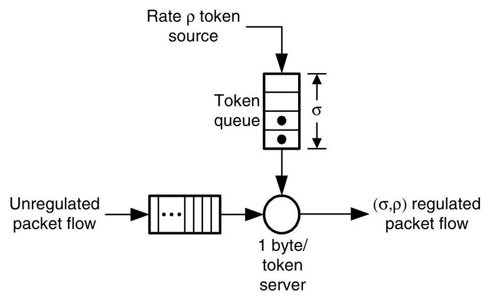

Figure 15.2 A $\left( {\sigma ,\rho }\right)$ regulator.

> 
图 15.2 一个 $\left( {\sigma ,\rho }\right)$ 调节器。

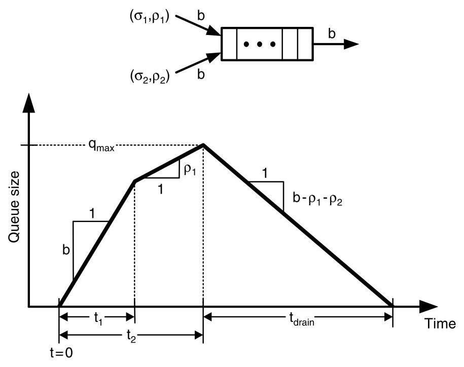

Figure 15.3 Queue size at a two-input multiplexer (shown at top) under adversial inputs designed to maximize the interval for which the queue is non-empty. The increasing slopes represent the portions of the input where either both or one input is sending at a peak rate, limited only by the injection channel bandwidth. After both input bursts are exhausted, the queue slowly drains.

> 
图15.3 双输入复用器（顶部所示）在对抗性输入下的队列大小，该输入旨在最大化队列非空的时间间隔。上升斜率表示输入的部分，其中要么两个输入或一个输入以峰值速率发送，仅受注入通道带宽的限制。在两个输入突发都耗尽后，队列缓慢排空。

Finally, our only assumption about the way in which packets are selected for the output is that the multiplexer is work-conserving. That is, the output channel is never idle if the multiplexer contains any packets.

> 
最后，关于输出端选择数据包方式的唯一假设是，该复用器是工作守恒的。也就是说，只要复用器中有任何数据包，输出通道就绝不会处于空闲状态。

For the system to be stable and the maximum delay to be defined, it is sufficient for ${\rho }_{1} + {\rho }_{2} < b$ . This condition also implies that the multiplexer queue will be empty at times, which leads to a simple observation about packet delay: the longest delay of any packet through the multiplexer is at most the maximum time the queue can be non-empty. So, our strategy for determining maximum packet delay will be to find the adversarial behavior of the two input flows that will keep the multiplexer queue non-empty for the longest interval possible.

> 
为使系统稳定并定义最大延迟，满足 ${\rho }_{1} + {\rho }_{2} < b$ 即已足够。这一条件同时也意味着复用器队列会不时为空，由此可对分组延迟得出一个简单的观察：任何分组通过复用器的最长延迟至多等于队列可能保持非空的最长时间。因此，我们确定最大分组延迟的策略将是，找出两个输入流中能使复用器队列尽可能长时间保持非空的对抗性行为。

Our adversary strategy is summarized in the graph of queue time versus time shown in Figure 15.3. The strategy has three phases. Initially, the input queue is assumed to be empty. The first phase begins at time $t = 0$ with both input flows simultaneously sending packets at rate $b$ , the maximum allowed by the constraints of the channels. This fills the multiplexer’s queue at rate $b$ because the input channels are injecting packets at a total rate of ${2b}$ , and since the multiplexer is work-conserving, it is draining packets from the queue at a rate of $b$ . Therefore, the net rate of increase in the queue size is $b$ , which is reflected in the slope of the first line segment of Figure 15.3. This phase continues until one of the inputs can no longer sustain a rate of $b$ without violating its $\left( {\sigma ,\rho }\right)$ constraints. Without loss of generality, we assume the first flow reaches this point first at time ${t}_{1}$ . By our definition of $\left( {\sigma ,\rho }\right)$ flows, this occurs when $b{t}_{1} = {\sigma }_{1} + {\rho }_{1}{t}_{1}$ . Rewriting,

> 
我们的对手策略在图15.3所示的队列时间-时间图中进行了概括。该策略分为三个阶段。初始时，输入队列被假定为空。第一阶段从时间 $t = 0$ 开始，两个输入流同时以速率 $b$ 发送数据包，这是信道约束所允许的最大速率。这样会使复用器的队列以速率 $b$ 填满，因为输入信道以总速率 ${2b}$ 注入数据包，而由于复用器是工作保持的，它以速率 $b$ 从队列中取出数据包。因此，队列大小增加的净速率为 $b$，这体现在图15.3中第一条线段的斜率上。这一阶段持续到其中一个输入再也无法在不违反其 $\left( {\sigma ,\rho }\right)$ 约束的情况下维持速率 $b$ 为止。不失一般性，我们假设第一个流首先在时间 ${t}_{1}$ 达到这一点。根据我们对 $\left( {\sigma ,\rho }\right)$ 流的定义，这发生在 $b{t}_{1} = {\sigma }_{1} + {\rho }_{1}{t}_{1}$ 时。改写，

$$
{t}_{1} = \frac{{\sigma }_{1}}{b - {\rho }_{1}}
$$

> 
$$
{t}_{1} = \frac{{\sigma }_{1}}{b - {\rho }_{1}}
$$

During the second phase, the first flow can send only at a rate of ${\rho }_{1}$ so that its $\left( {\sigma ,\rho }\right)$ constraint is not violated. The second flow continues to send at $b$ , giving a net injection rate of ${\rho }_{1} + b$ and a drain rate of $b$ . Therefore, the queue still grows during the second phase, but with a smaller rate of ${p}_{1}$ , as shown in the figure. Similarly, this phase ends at ${t}_{2}$ when the second flow can no longer send at rate $b$ :

> 
在第二阶段，第一个流只能以速率 ${\rho }_{1}$ 发送，以免违反其 $\left( {\sigma ,\rho }\right)$ 约束。第二个流继续以速率 $b$ 发送，因此净注入速率为 ${\rho }_{1} + b$，排出速率为 $b$。所以，队列在第二阶段仍在增长，但增长速率较小，为 ${p}_{1}$，如图所示。同样，这一阶段在 ${t}_{2}$ 时刻结束，此时第二个流不能再以速率 $b$ 发送：

$$
{t}_{2} = \frac{{\sigma }_{2}}{b - {\rho }_{2}}.
$$

> 
$$
{t}_{2} = \frac{{\sigma }_{2}}{b - {\rho }_{2}}.
$$

At the beginning of the third phase, both input flows have exhausted their bursts and can send only at their steady-state rates of ${\rho }_{1}$ and ${\rho }_{2}$ , respectively. This yields a decreasing rate of $b - {\rho }_{1} - {\rho }_{2}$ in the queue size. At this rate, the queue becomes empty after ${t}_{\text{ drain }} = {q}_{\max }/\left( {b - {\rho }_{1} - {\rho }_{2}}\right)$ , where ${q}_{\max }$ is the queue size at the beginning of the phase. The queue size is simply the sum of the net amount after the first and second phases:

> 
在第三阶段开始时，两个输入流都已耗尽突发，只能分别以其稳态速率 ${\rho }_{1}$ 和 ${\rho }_{2}$ 发送。这使得队列大小以 $b - {\rho }_{1} - {\rho }_{2}$ 的速率减少。以此速率，队列在经过 ${t}_{\text{ drain }} = {q}_{\max }/\left( {b - {\rho }_{1} - {\rho }_{2}}\right)$ 时间后排空，其中 ${q}_{\max }$ 是该阶段开始时的队列大小。该队列大小即为第一和第二阶段的净累积量之和：

$$
{q}_{\max } = b{t}_{1} + {\rho }_{1}\left( {{t}_{2} - {t}_{1}}\right)  = {\sigma }_{1} + \frac{{\rho }_{1}{\sigma }_{2}}{b - {\rho }_{2}}.
$$

> 
$$
{q}_{\max } = b{t}_{1} + {\rho }_{1}\left( {{t}_{2} - {t}_{1}}\right)  = {\sigma }_{1} + \frac{{\rho }_{1}{\sigma }_{2}}{b - {\rho }_{2}}.
$$

By our previous argument, we know the delay $D$ must be bounded by the length of this non-empty interval.

> 
根据我们之前的论证，可知延迟 $D$ 必定由该非空区间的长度所界定。

$$
{D}_{\max } = {t}_{2} + {t}_{\text{ drain }} = \frac{{\sigma }_{1} + {\sigma }_{2}}{b - {\rho }_{1} - {\rho }_{2}}.
$$

> 
$$
{D}_{\max } = {t}_{2} + {t}_{\text{ drain }} = \frac{{\sigma }_{1} + {\sigma }_{2}}{b - {\rho }_{1} - {\rho }_{2}}.
$$

While we have not made a rigorous argument that our choice of input behavior gives the largest possible value of ${D}_{\max }$ , it can be shown that it is in fact the case [42]. Intuitively, any adversary that exhausts the entire bursts of both input streams before the queue re-empties will give the largest possible non-empty interval. Additionally, our strategy of starting both bursts immediately maximizes the size of the queue, which also bounds the total amount of buffering needed at the multiplexer to ${q}_{\max }$ . Similar techniques can be applied to a wide variety of basic network elements to determine their delays. We analyze additional network elements in the exercises.

> 
尽管我们没有严格论证我们对输入行为的选择能给出最大的 ${D}_{\max }$ 值，但可以证明事实确实如此 [42]。直观上，任何在队列重新变空之前耗尽两个输入流全部突发的对手方，都会产生最大的可能非空区间。此外，我们让两个突发立即开始的策略最大化了队列大小，这也将多路复用器所需的总缓冲量限制为 ${q}_{\max }$。类似的技术可以应用于各种基本网络元件以确定其延迟。我们在练习中分析更多网络元件。

### 15.3 Implementation of Guaranteed Services

There are a wide range of possibilities for implementing guaranteed services. We begin with aggregate resource allocation, where no specific resources are allocated to any flow; rather, the network accepts requests from its clients based on their aggregate resource usage. This aggregate approach is inexpensive in terms of hardware cost, but does not provide the tightest delay bounds. Lower delays can be obtained by reserving specific resources in either space or time and space together. The additional costs of these methods is the hardware required to store the resource reservations.

> 
实现有保证服务的方式多种多样。我们从聚合资源分配开始，这种方式不为任何流分配特定资源；相反，网络根据客户流的聚合资源使用情况来接受请求。这种聚合方法在硬件成本上较低廉，但无法提供最严格的延迟界限。通过预留特定资源（无论是空间上的，还是时间与空间结合的），可以获得更低的延迟。这些方法的额外成本在于存储这些资源预留所需的硬件。

#### 15.3.1 Aggregate Resource Allocation

The simplest way to implement a service guarantee is to require that the aggregate demand ${\Lambda }_{C}$ of a traffic class $C$ is less than a bound. Traffic conforming to this bound then is guaranteed not to saturate the network, and hence can be guaranteed lossless delivery with certain delay characteristics. This is the simplest method of providing guaranteed service. Because no specific resources are reserved for individual flows, little if any additional hardware is needed to support aggregate allocation. ${}^{3}$ However, because all of the (possibly bursty) input flows in class $C$ are mixed together, the resulting output flows become even more bursty. As a result, aggregate resource allocation gives the loosest delay bounds of the methods we shall describe.

> 
实现服务保证的最简单方法是要求某一流量类别 $C$ 的总需求 ${\Lambda }_{C}$ 低于某个界限。符合这一界限的流量因而可保证不使网络饱和，从而可以保证无丢失传输并具有特定的延迟特性。这是提供有保障服务的最简单方法。由于未为各个流预留特定资源，支持聚合分配几乎不需要额外的硬件。${}^{3}$ 然而，由于类别 $C$ 中所有（可能具有突发性的）输入流混合在一起，导致输出流的突发性更强。因此，在我们将要描述的方法中，聚合资源分配给出的延迟界限最为宽松。

With aggregate allocation, requests can be explicitly supplied by the network clients or can be implicit in nature. In a packet switching network, for example, the network might be able to accept any set of resource allocations that did not oversubscribe any input or output port of the network. A port is oversubscribed if the total amount of traffic it is required to source or sink exceeds its bandwidth - this corresponds to a row or column sum of the request matrix ${\Lambda }_{C}$ .

> 
采用聚合分配时，请求可以由网络客户端显式提供，也可以是隐式的。例如，在分组交换网络中，网络可能能够接受任何不会使任一输入端口或输出端口超额订阅的资源分配集合。若某个端口所需提供或接收的流量总量超过其带宽，则该端口被超额订阅——这对应于请求矩阵 ${\Lambda }_{C}$ 的行和或列和。

Now, to see how burstiness affects aggregate resource allocation, consider the 2-ary 2-fly with an extra stage shown in Figure 15.4. To balance load, this network uses a randomized routing algorithm in which all traffic routes from the source to a random switch node in the middle stage of the network before being routed to its destination. The figure also shows two flows: a bursty flow from node 0 to node 1 (solid lines) and a non-bursty flow from 2 to 0 (dotted lines). Because aggregate resource allocation does not reserve particular resources to flows, there is no way to prevent coupling between these two flows. This makes low-jitter requirements on the non-bursty flow more difficult to achieve in this example. Additionally, the use of randomized routing introduces more burstiness. Previously, we considered the burstiness in time of the traffic flows, but randomized routing also introduces burstiness in space - the routing balances load on average, but instantaneous loads may be unbalanced. This further complicates a guarantee of low jitter or delay.

> 
现在，为了观察突发性如何影响聚合资源分配，考虑图15.4所示的带有一个额外级的2元2-fly网络。为了均衡负载，该网络使用一种随机路由算法，其中所有流量从源端先路由到网络中间级的一个随机交换节点，然后再被路由至其目的地。图中还显示了两条流：一条从节点0到节点1的突发流（实线），以及一条从节点2到节点0的非突发流（虚线）。由于聚合资源分配不为流预留特定资源，因此无法阻止这两条流之间的耦合。在此示例中，这使得对非突发流的低抖动要求更难以实现。此外，随机路由的使用引入了更多的突发性。此前我们考虑了流量在时间上的突发性，但随机路由还会引入空间上的突发性——该路由平均而言能均衡负载，但瞬时负载可能是不均衡的。这进一步使得低抖动或低延迟的保证变得复杂。

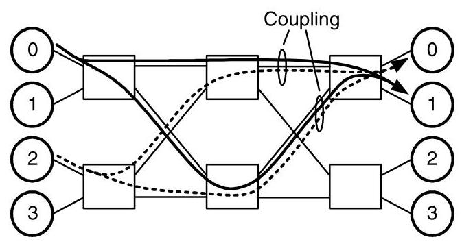

Figure 15.4 Two flows under aggregate resource allocation. Because the flows share channel resources, there is coupling between the bursty (solid lines) and non-bursty (dotted lines) flows, which affects their delay and jitter.

> 
图15.4 聚合资源分配下的两个流。由于流共享信道资源，突发流（实线）与非突发流（虚线）之间存在耦合，这会影响它们的延迟和抖动。

Taking these factors into account and using the delay result from Section 15.2.2, we can compute a delay bound for this aggregate resource allocation. Both flows in this example are $\left( {\sigma ,\rho }\right)$ regulated, and for the bursty flow ${\rho }_{1} = {0.75}$ Gbps and ${\sigma }_{1} = 1,{024}$ bits and for the non-bursty flow ${\rho }_{2} = {0.75}$ Gbps and ${\sigma }_{2} = {64}$ bits. Channel bandwidth is $b = 1\mathrm{{Gbps}}$ and the maximum packet length is $L = {128}$ bits.

> 
考虑到这些因素，并利用15.2.2节的延迟结果，我们可以计算这种聚合资源分配的延迟界限。本例中的两个流都是$\left( {\sigma ,\rho }\right)$调节的，对于突发流，${\rho }_{1} = {0.75}$ Gbps，${\sigma }_{1} = 1,{024}$比特；对于非突发流，${\rho }_{2} = {0.75}$ Gbps，${\sigma }_{2} = {64}$比特。信道带宽为$b = 1\mathrm{{Gbps}}$，最大数据包长度为$L = {128}$比特。

Following the flow from 0 to 1 through the system, it is split in the first stage by the randomized routing algorithm. We assume that the routing algorithm splits the flow into two sub-flows, both with rate ${\rho }_{1}/2$ . Although we cannot assume that the burstiness of the sub-flows is also halved because routing occurs at packet granularity, this burstiness can be upper-bounded by $\left( {{\sigma }_{1} + L}\right) /2$ . (See Exercise 15.2.)

> 
从 0 到 1 的流在穿过系统时，会在第一级被随机化路由算法分割。我们假设该路由算法将流拆分为两条子流，速率均为 ${\rho }_{1}/2$。尽管不能假定子流的突发性也随之减半——因为路由操作以数据包粒度进行，但该突发性存在上界 $\left( {{\sigma }_{1} + L}\right) /2$（参见练习 15.2）。

Using these results, we know the sub-flows from the allocation are $\left( {{\sigma }_{1}^{\prime },{\rho }_{1}/2}\right)$ regulated, where

> 
利用这些结果，我们可知分配产生的子流是 $\left( {{\sigma }_{1}^{\prime },{\rho }_{1}/2}\right)$ 调节的，其中

$$
{\sigma }_{1}^{\prime } \leq  \left( {{\sigma }_{1} + L}\right) /2 = \left( {{1024} + {128}}\right) /2 = {576}\text{ bits. }
$$

> 
$$
{\sigma }_{1}^{\prime } \leq  \left( {{\sigma }_{1} + L}\right) /2 = \left( {{1024} + {128}}\right) /2 = {576}\text{ 比特。 }
$$

Similarly, for the second sub-flow

> 
类似地，对于第二个子流

$$
{\sigma }_{2}^{\prime } \leq  \left( {{\sigma }_{2} + L}\right) /2 = \left( {{64} + {128}}\right) /2 = {96}\text{ bits. }
$$

> 
$$ 
{\sigma }_{2}^{\prime } \leq  \left( {{\sigma }_{2} + L}\right) /2 = \left( {{64} + {128}}\right) /2 = {96}\text{ bits. }
$$

So, in splitting the second flow, its burstiness is actually increased because of the packet granularity limit.

> 
因此，在分割第二个流时，由于数据包粒度的限制，其突发性实际上增加了。

The first delay incurred by either of these flows comes as they are multiplexed onto the output channel of the second stage. Using the result from Section 15.2.2, we know this delay is at most

> 
这些流中任何一个所经历的首次延迟发生在它们被复用到第二级的输出通道上时。利用第15.2.2节中的结果，我们知道此延迟至多为

$$
{D}_{\max } = \frac{{\sigma }_{0}^{\prime } + {\sigma }_{1}^{\prime }}{b - \left( {{\rho }_{0} + {\rho }_{1}}\right) /2} = \frac{{\sigma }_{1} + {\sigma }_{2} + L}{{2b} - {\rho }_{1} - {\rho }_{2}}.
$$

> 
$$
{D}_{\max } = \frac{{\sigma }_{0}^{\prime } + {\sigma }_{1}^{\prime }}{b - \left( {{\rho }_{0} + {\rho }_{1}}\right) /2} = \frac{{\sigma }_{1} + {\sigma }_{2} + L}{{2b} - {\rho }_{1} - {\rho }_{2}}.
$$

as long as ${\rho }_{0} + {\rho }_{1} < {2b}$ . Substituting the values from the example,

> 
只要 ${\rho }_{0} + {\rho }_{1} < {2b}$ 。代入示例中的值，

$$
{D}_{\max } = \frac{{576} + {96}}{1 - {0.375} - {0.375}} = \frac{{672}\text{ bits }}{{0.25}\mathrm{{Gbps}}} = {2.688\mu }\mathrm{s}.
$$

> 
$$
{D}_{\max } = \frac{{576} + {96}}{1 - {0.375} - {0.375}} = \frac{{672}\text{ bits }}{{0.25}\mathrm{{Gbps}}} = {2.688\mu }\mathrm{s}.
$$

Without any additional information, the jitter can be as large as ${D}_{\max }$ because packets could conceivably pass through the multiplexer with no delay. A similar calculation gives the delay incurred by the sub-flows as they are merged in the final stage of the network before reaching their destinations.

> 
在没有任何附加信息的情况下，抖动可能高达 ${D}_{\max }$，因为数据包有可能无延迟地通过多路复用器。类似的计算给出了子流在到达目的地之前的网络最后阶段合并时所经历的延迟。

#### 15.3.2 Resource Reservation

In situations where stronger guarantees on delay and jitter are required, it may be necessary to reserve specific resources rather than rely on aggregate allocation. Of course, this comes at greater hardware overhead because these reservations must also be stored in the network. We present two reservation approaches: virtual circuits, where resources are reserved in space, and time-division multiplexing, where resources are reserved in both space and time.

> 
在需要更强延迟和抖动保障的情况下，可能有必要预留特定资源，而非依赖聚合分配。当然，这会带来更大的硬件开销，因为这些预留信息也必须在网络中存储。我们提出两种预留方法：虚电路，即在空间上预留资源；以及时分复用，即在空间和时间上同时预留资源。

With virtual circuits, each flow is assigned a specific route through the network. This reservation technique is used in Asynchronous Transfer Mode (ATM), for example (Section 15.6). The use of virtual circuits addresses several sources of delay and jitter. First, because resources are allocated in space, any variations in resource usage due to factors such as randomized routing are completely eliminated. The second advantage is that flows can be routed to avoid coupling with other flows. Consider the previous example of the 2-ary 2-fly with an extra stage from Section 15.3.1. By controlling their routes, the non-bursty flow (dotted line) can be routed around the bursty flow (solid line), improving its jitter (Figure 15.5).

> 
使用虚拟电路时，每条流都被分配一条穿越网络的特定路由。例如，这种预留技术被用于异步传输模式（ATM）（第15.6节）。虚拟电路的使用解决了延迟和抖动的多个源头。首先，由于资源在空间上进行了分配，诸如随机路由等因素导致的资源使用变化被完全消除。第二个优势是，可以通过路由选择来避免流之间的相互耦合。考虑第15.3.1节中带额外一级的2元2层网络的例子。通过控制它们的路由，非突发流（虚线）可以绕过突发流（实线），从而改善其抖动（图15.5）。

When extremely tight guarantees are required, time-division multiplexing (TDM) provides the strictest controls. To avoid the variability introduced by flows sharing a resource over time, TDM "locks-down" all the resources needed by a particular flow in both time and space. Because no other flows are allowed to access these resources, they are always available to the allocated flow, making guarantees easy to maintain. A TDM implementation divides time into a fixed-number of small slots. The size and number of slots then govern the granularity at which a resource can be allocated. So, for example, time might be broken into 32 slots, with each slot equal to the transmission time of a single flit. If the channel bandwidth is 1 Gbyte/s, flows could allocate bandwidth in multiples of 32 Mbytes/s. If a flow required 256 Mbytes/s, it would request 8 of the 32 time slots for each resource it needed.

> 
当需要极其严格的保证时，时分多路复用（TDM）提供了最严格的控制。为避免流随时间共享资源所带来的波动性，TDM 将特定流所需的所有资源在时间和空间上“锁定”。由于不允许其他流访问这些资源，它们始终可供分配的流使用，从而易于维护保证。TDM 的实现将时间划分为固定数量的小时隙。时隙的大小和数量决定了资源可分配的粒度。例如，时间可被划分为 32 个时隙，每个时隙等于单个 flit 的传输时间。若信道带宽为 1 Gbyte/s，流就能以 32 Mbytes/s 的倍数分配带宽。如果一个流需要 256 Mbytes/s，它将为其所需的每种资源请求 32 个时隙中的 8 个。

Figure 15.6 revisits the 2-ary 2-fly example, in which flows have been allocated using TDM. Although some channels carry both flows, the flows are isolated because each of the four time slots is assigned to a unique flow. With time-slot allocation, a flow can share a resource with a bursty flow without increasing its own burstiness.

> 
图 15.6 重新审视了 2-ary 2-fly 示例，其中流已通过 TDM 进行分配。尽管某些信道同时承载了两条流，但由于四个时隙中的每一个都分配给了唯一的流，因此流之间是隔离的。通过时隙分配，一条流可以与一条突发流共享资源，而不会增加自身的突发性。

Time-slot allocations such as this can either be computed off-line, in the case where the required connections are known in advance, or on-line, when connections will be both added and removed over time. In either situation, finding "optimal" allocations is generally NP-hard, so most practical implementations resort to heuristic approaches. One heuristic is explored in Exercise 15.5.

> 
此类时隙分配既可以在所需连接提前已知的情况下离线计算，也可以在连接会随时间动态增加和移除的情况下在线计算。无论哪种情况，寻找“最优”分配通常都是NP困难的，因此大多数实际实现都采用启发式方法。练习15.5探讨了一种启发式方法。

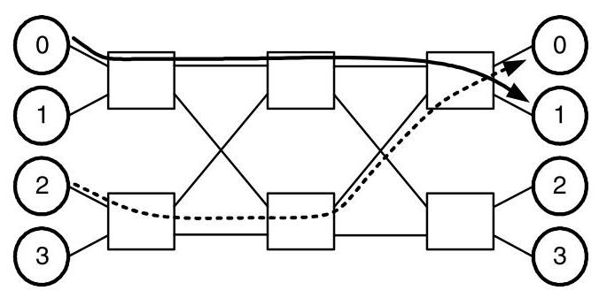

Figure 15.5 Two flows under virtual circuit resource reservation. Coupling between the bursty (solid lines) and non-bursty (dotted lines) flows is avoided by choosing independent routes through the network.

> 
图15.5 虚电路资源预留下的两条流。通过选择穿越网络的独立路由，避免了突发流（实线）与非突发流（虚线）之间的耦合。

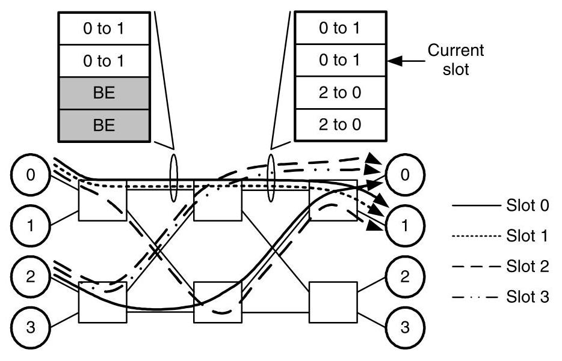

Figure 15.6 An allocation of flows in a 4-slot TDM network along with timewheels from two channels of the network.

> 
图15.6 一个4时隙TDM网络中的流分配，以及来自该网络两个通道的时间轮。

As shown in Figure 15.6, a timewheel can be associated with each resource in the network to store its allocation schedule. Then, a pointer into the timewheel table indicates the current time slot and the owner of the resource during that time slot. For this example, unused slots are marked as "BE" to indicate the resource's availability for best-effort traffic. Used slots match the resource allocation for the channel. As time progresses, the pointer is incremented to the next table entry, wrapping to the top once it reaches the bottom of the table.

> 
如图15.6所示，可以为网络中的每个资源关联一个时间轮，以存储其分配调度。然后，指向时间轮表的指针指示当前时隙以及该时隙内资源的拥有者。在此示例中，未使用的时隙标记为“BE”，表示资源可用于尽力而为的流量。已使用的时隙与通道的资源分配匹配。随着时间的推移，指针递增到下一个表条目，到达表底部后回绕到顶部。

### 15.4 Implementation of Best-Effort Services

The key quality of service concern in implementing best-effort services is providing fairness among all the best-effort flows. Similar concerns may also arise within the flows of a guaranteed service when resources are not completely reserved in advance. We present two alternative definitions of fairness, latency and throughput fairness, and discuss their implementation issues.

> 
在实现尽力而为服务时，关键的服务质量问题是确保所有尽力而为流之间的公平性。当资源没有完全预先预留时，保证服务的流内部也可能出现类似的问题。我们给出两种公平性的备选定义：延迟公平性和吞吐量公平性，并讨论它们的实现问题。

#### 15.4.1 Latency Fairness

The goal of latency-based fairness is to provide equal delays to flows competing for the same resources. To see the utility of such an approach, consider an example of cars leaving a crowded parking lot, as shown in Figure 15.7. Each column of the parking lot is labeled with a letter and contains a line of cars waiting to turn onto the exit row, which leads to the exit of the parking lot. Cars are labeled with their column along with a relative time that they started leaving the parking lot. So, ${D}_{2}$ started leaving before ${A}_{4}$ , for example. This is analogous to packets queued in the vertical channels of a mesh network waiting for access to a shared horizontal channel of that network. We will assume a car can leave the parking lot every 5 seconds.

> 
基于延迟的公平性目标是为竞争相同资源的流提供相等的延迟。为理解这种方法的实用性，考虑图15.7中车辆离开拥挤停车场的例子。停车场的每一列都标有一个字母，列中有一队等待转入出口行车道的车辆，该行车道通向停车场出口。车辆用所在列以及开始离开停车场的相对时间进行标注。例如，${D}_{2}$比${A}_{4}$更早开始离开。这类似于网格网络中在垂直通道排队的数据包，等待访问该网络中的一条共享水平通道。我们假设每5秒可以有一辆车离开停车场。

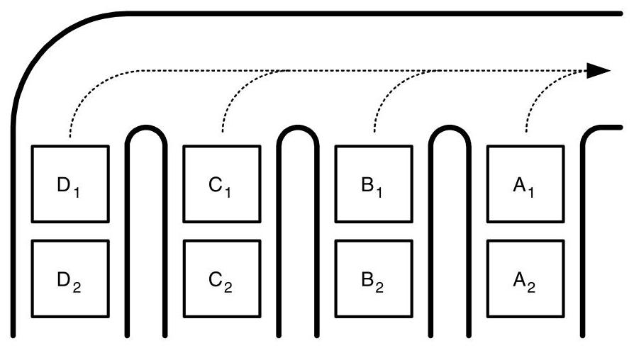

LF: ${\mathrm{A}}_{1}{\mathrm{\;B}}_{1}{\mathrm{\;A}}_{2}{\mathrm{C}}_{1}{\mathrm{\;A}}_{3}{\mathrm{\;B}}_{2}{\mathrm{\;A}}_{4}{\mathrm{D}}_{1}{\mathrm{\;A}}_{5}\ldots$ AB: ${A}_{1}{B}_{1}{C}_{1}{D}_{1}{A}_{2}{B}_{2}{C}_{2}{D}_{2}{A}_{3}\ldots$

> 
LF: ${\mathrm{A}}_{1}{\mathrm{\;B}}_{1}{\mathrm{\;A}}_{2}{\mathrm{C}}_{1}{\mathrm{\;A}}_{3}{\mathrm{\;B}}_{2}{\mathrm{\;A}}_{4}{\mathrm{D}}_{1}{\mathrm{\;A}}_{5}\ldots$
AB: ${A}_{1}{B}_{1}{C}_{1}{D}_{1}{A}_{2}{B}_{2}{C}_{2}{D}_{2}{A}_{3}\ldots$

Figure 15.7 A parking lot with 4 columns of cars waiting for access to a single, shared exit. Cars are labeled with their column and a relative entrance time into the parking lot. The sequence of exiting cars under locally fair (LF) and age-based (AB) arbitrations are also shown.

> 
图 15.7 一个停车场，内有 4 列车辆等待通过一个共享出口驶出。车辆上标注了所在列和相对进入停车场的时刻。图中还展示了在局部公平（LF）和基于年龄（AB）仲裁下的车辆驶出顺序。

Standard driving courtesy dictates that at each merge point, cars from either entrance to a merge alternate access to that merge. We call this the locally fair arbitration policy. As shown by the dotted lines, our parking lot example has three merge points. Now consider the sequence of cars leaving the lot under the locally fair policy. The first car from the rightmost column ${A}_{1}$ leaves first, followed by ${B}_{1}$ . Because of the locally fair policy at the right merge point, ${A}_{2}$ leaves next, followed by ${C}_{1}$ , and so on. Although ${D}_{1}$ was one of the first cars waiting to leave the parking lot, it must wait 8 cars, or 40 seconds, before finally leaving. By this time,4 cars from column $A$ have left. Obviously, the delays under locally fair arbitration are distributed unfairly. In fact, if this example was extended to contain 24 columns, the first car of the last column ${X}_{1}$ would have to wait over a year to leave the parking lot! Of course, this assumes a relatively large number of cars in the parking lot.

> 
标准的驾驶礼让规则要求，在每个合流点，来自任一入口的车辆必须交替获得该合流点的通行权。我们称之为局部公平仲裁策略。如虚线所示，我们的停车场示例中有三个合流点。现在考虑在局部公平策略下车辆离开停车场的顺序。最右侧列的第一辆车 ${A}_{1}$ 最先离开，接着是 ${B}_{1}$。由于右侧合流点的局部公平策略，接下来 ${A}_{2}$ 离开，然后是 ${C}_{1}$，依此类推。尽管 ${D}_{1}$ 是最早等待离开停车场的车辆之一，但它必须等待 8 辆车，即 40 秒，才能最终离开。而此时，$A$ 列已有 4 辆车驶出。显然，局部公平仲裁下的延迟分布并不公平。事实上，如果这个例子扩展到包含 24 列，那么最后一列的第一辆车 ${X}_{1}$ 将需要等待超过一年才能离开停车场！当然，这假设停车场中有相当多数量的车辆。

To remedy this problem, we can replace our arbitration policy with one that is latency fair. An arbitration is latency fair if the oldest requester for a resource is always served first. For our parking lot example, we can simply use the relative starting times of each car to make decisions at the merge points - the oldest of two cars at a merge point goes first. This gives a much better exit sequence with one car leaving from each column before any column has two cars that have left. For networks, we refer to this policy as age-based arbitration. When multiple packets are competing for a resource, the oldest, measured as the time since its injection into the network, gets access first.

> 
为解决这一问题，我们可以将仲裁策略替换为一种具有延迟公平性的策略。若资源的最早请求者总是被优先服务，则称该仲裁具有延迟公平性。以停车场为例，我们可以简单地根据每辆车的相对出发时间在汇合点做出决策——汇合点处两辆车中，先到的先走。这样就能得到更优的离开顺序，在任一列有两辆车离开之前，每列都已先有一辆车离开。对于网络，我们将这种策略称为基于年龄的仲裁。当多个数据包竞争同一资源时，最早注入网络的包（即从注入到当前的时间最长者）优先获得访问权限。

While age-based arbitration greatly improves the latency fairness of networks, it is generally used only as a local approximation to a truly latency fair network. This caveat arises because high-priority (older) packets can become blocked behind low-priority (younger) packets, which is known as priority inversion. As we will see, a similar problem arises in throughput fairness and both can be solved by constructing a non-interfering network, which we address in Section 15.5.

> 
虽然基于年龄的仲裁极大地改善了网络的延迟公平性，但它通常仅用作真正延迟公平网络的局部近似。这一告诫的出现，是因为高优先级（较老）的数据包可能会阻塞在低优先级（较新）的数据包之后，这被称为优先级反转。正如我们将看到的，在吞吐量公平性中也会出现类似问题，而两者都可以通过构建非干扰网络来解决，我们将在第15.5节中讨论这一点。

#### 15.4.2 Throughput Fairness

An alternative to latency-based fairness, throughput fairness, seeks to provide equal bandwidth to flows competing for the same resource. Figure 15.8(a) illustrates this idea with three flows of packets crossing a single, shared channel in the network. As shown, each flow requests at rate of 0.5 packets per cycle, but the channel can support only a total 0.75 packets per cycle. Naturally, a throughput-fair arbitration would be to simply divide the available bandwidth between the three flows so that each received 0.25 packets per cycle across the channel.

> 
基于延迟的公平性的替代方案——吞吐量公平性，旨在为竞争同一资源的流提供相等的带宽。图 15.8(a) 通过三个数据包流穿越网络中单个共享信道的情况说明了这一思想。如图所示，每个流请求的速率为每周期 0.5 个数据包，但信道总共只能支持每周期 0.75 个数据包。自然地，吞吐量公平的仲裁就是简单地将可用带宽分配给这三个流，使得每个流通过信道接收每周期 0.25 个数据包。

This example becomes more complex when the rates of each of the flows are no longer equal. Figure 15.8(b) shows the case in which the rates have been changed to 0.15, 0.5, and 0.5 packets per cycle. Many reasonable definitions of fairness could lead to different allocations in this situation, but the most common definition of fairness used for throughput is max-min fairness. An allocation is max-min fair if the allocation to any flow cannot be increased without decreasing the allocation to a flow that has an equal or lesser allocation. The resulting allocation, shown in Figure 15.8(b), is max-min fair.

> 
当各流的速率不再相等时，该示例变得更加复杂。图 15.8(b) 展示了速率分别变为每周期 0.15、0.5 和 0.5 个数据包的情况。许多合理的公平性定义在此情形下可能会导致不同的分配方案，但用于吞吐量的最常用公平性定义是最大最小公平性。若在任何流的分配无法增加的同时，不降低那些分配量相等或更少的流的分配，则这种分配就是最大最小公平的。图 15.8(b) 中所示的最终分配便是最大最小公平的。

Algorithmically, max-min fairness can be achieved by the following procedure. For the $N$ flows, let ${b}_{i}$ be the bandwidth requested by the ${i}^{\text{ th }}$ flow, where $0 \leq  i < N$ . The bandwidth requests are also sorted such that ${b}_{i - 1} \leq  {b}_{i}$ for $0 < i < N$ . Then the bandwidths are allocated using the following recurrence:

> 
从算法上讲，最大最小公平性可以通过以下步骤实现。对于 $N$ 条流，令 ${b}_{i}$ 为第 ${i}^{\text{ th }}$ 条流所请求的带宽，其中 $0 \leq i < N$ 。且带宽请求已排序，使得对于 $0 < i < N$ 有 ${b}_{i - 1} \leq {b}_{i}$ 。然后使用以下递推式分配带宽：

$$
{R}_{0} = b
$$

> 
$$
{R}_{0} = b
$$

$$
{a}_{i} = \min \left\lbrack  {{b}_{i},\frac{{R}_{i}}{N - i}}\right\rbrack  ,
$$

> 
$$
{a}_{i} = \min \left\lbrack  {{b}_{i},\frac{{R}_{i}}{N - i}}\right\rbrack  ,
$$

$$
{R}_{i + 1} = {R}_{i} - {a}_{i}
$$

> 
$$
{R}_{i + 1} = {R}_{i} - {a}_{i}
$$

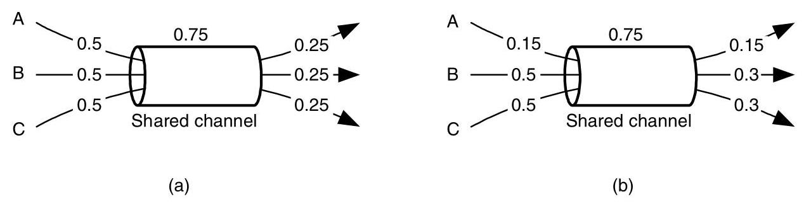

Figure 15.8 Throughput-fair assignment of bandwidth to three flows sharing a single channel: (a) an allocation when the flows have equal requests, (b) a max-min fair allocation for unequal requests.

> 
图15.8 共享单一信道的三个流量的吞吐量公平带宽分配：(a) 流量请求相等时的分配，(b) 请求不等时的最大最小公平分配。

where $b$ is the total bandwidth of the resource, ${R}_{i}$ is the amount of bandwidth available after scheduling $i$ requests, and ${a}_{i}$ is the amount of bandwidth assigned to request $i$ . This algorithm satisfies the smallest requests first and any excess bandwidth for each request is distributed evenly among the remaining larger requests.

> 
其中 $b$ 是资源的总带宽，${R}_{i}$ 是调度完 $i$ 个请求后剩余的带宽量，${a}_{i}$ 是分配给请求 $i$ 的带宽量。该算法优先满足最小的请求，任何超出的带宽会平均分配给剩余的大请求。

Max-min fairness can be achieved in hardware by separating each flow requesting a resource into a separate queue. Then, the queues are served in a round-robin fashion. Any empty queues are simply skipped over. This implementation is often referred to as fair queueing. While not conceptually difficult, several practical issues can complicate the implementation. For example, additional work is required if the packets have unequal lengths and weighted fair queueing adds the ability to weight some flows to receive a higher priority than others. As we saw in latency fairness, true throughput fairness also requires per-flow structures to be maintained at each resource in the network.

> 
最大最小公平性可以通过硬件实现，将每个请求资源的流分离到单独的队列中。然后，这些队列以轮询方式服务。任何空队列直接被跳过。这种实现通常称为公平队列。虽然概念上并不困难，但一些实际问题会使实现复杂化。例如，如果数据包长度不等，则需要额外的工作，而加权公平队列增加了对某些流进行加权以获得比其他流更高优先级的能力。正如我们在延迟公平性中所见，真正的吞吐量公平性还要求网络中的每个资源都维护逐流结构。

### 15.5 Separation of Resources

To meet service and fairness guarantees, we often need to isolate different classes of traffic. Sometimes, we also need to distinguish between the flows within a class. For brevity, we will collectively refer to classes and flows simply as classes throughout this section. With reservation techniques such as TDM, the cost of achieving this comes with the tables required to store the resource reservations. When resources are allocated dynamically, the problem is more complicated. Ideally, an algorithm could globally schedule resources so that classes did not affect one another. However, interconnection networks are distributed systems, so a global approach is not practical. Rather, local algorithms, such as fair queueing and age-based arbitration, must generate resource allocations, and hardware resources must separate classes to prevent the behavior of one class from affecting another. Before introducing non-interfering networks for isolating traffic classes, we discuss tree-saturation, an important network pathology that can result from poor isolation.

> 
为了实现服务和公平性保障，我们通常需要将不同的流量类别隔离开来。有时，还需要区分同一类别内的不同流。为简洁起见，本节将统一把类别和流简称为“类”。采用如时分复用（TDM）等预留技术时，实现这一目标的代价是需要用表来存储资源预留信息。当资源动态分配时，问题则更为复杂。理想情况下，应由一个全局调度算法分配资源，使各类互不影响。然而，互连网络是分布式系统，全局方法并不实际。因此，必须依靠局部算法（如公平排队和基于年龄的仲裁）来生成资源分配，并通过硬件资源将类隔离开，防止一类行为影响另一类。在介绍用于隔离流量类别的非干扰网络之前，我们先讨论树饱和——一种因隔离不善可能导致的重要网络病态。

#### 15.5.1 Tree Saturation

When a resource receives a disproportionally high amount of traffic, one or more hot-spots in the network can occur. A hot-spot is simply any resource that is being loaded more heavily than the average resource. This phenomenon was first observed in shared memory interconnects: a common synchronization construct is a lock, where multiple processors continuously poll a single memory location in order to obtain the lock and gain access to a shared data structure. If a particular lock is located at one node in the network and many other nodes simultaneously access this lock, it is easy to see how the destination node can become overwhelmed with requests and become a hot-spot. In an IP router application, random fluctuations in traffic to a particular output or a momentary misconfiguration of routing tables can both cause one or more output ports to become overloaded, causing a hot-spot.

> 
当某个资源接收到远超平均水平的流量时，网络中就会出现一个或多个热点。热点就是指任何负载明显高于平均水平的资源。这种现象最早在共享内存互连中被观察到：一种常见的同步构造是锁，即多个处理器不断轮询同一个内存位置，以获取锁并访问共享数据结构。如果某个锁位于网络中的一个节点，而许多其他节点同时访问这个锁，那么目标节点就很容易被请求淹没，从而成为热点。在IP路由器应用中，发往某个特定输出端口的流量随机波动，或路由表的瞬间错误配置，都可能导致一个或多个输出端口过载，从而产生热点。

Of course, facilitating resource sharing is an important function of any interconnection network and in the example of a shared lock, the network's flow control will eventually exert backpressure on the nodes requesting the lock. This is expected behavior of the network. However, a possibly unexpected impact of hot-spots is their affect on the network traffic not requesting a hot-spot resource. Tree-saturation occurs as packets are blocked at a hot-spot resource (Figure 15.9). Initially, channels adjacent to the hot-spot resource become blocked as requests overwhelm the resource, forming the first level of the tree. This effect continues as channels two hops from the resource wait on the blocked channels in the first level, and so on. The resulting pattern of blocked resources forms a tree-like structure.

> 
当然，促进资源共享是任何互连网络的一项重要功能，在共享锁的例子中，网络的流控最终会对请求锁的节点施加反压。这是网络的预期行为。然而，热点一个可能出乎意料的影响是它们会对未请求热点资源的网络流量产生作用。树饱和现象发生在数据包在热点资源处被阻塞时（图15.9）。起初，随着请求压垮该资源，与热点资源相邻的通道被阻塞，形成树的第一层。随着距离资源两跳的通道等待第一层中被阻塞的通道，这一效应持续下去，以此类推。由此形成的阻塞资源模式呈现树状结构。

As also shown in Figure 15.9, it is quite possible for a packet to request a channel in the saturation tree, but never request the hot-spot resource. If there is not an adequate separation of resources, these packets can become blocked waiting for channels in the saturation tree even though they do not require access to the overloaded resource. Tree-saturation is a universal problem in interconnection networks and is not limited to destination nodes being overwhelmed. For example, the same effect occurs when a network channel becomes loaded beyond its capacity. The quantitative effects of tree-saturation in shared memory systems are explored in Exercise 15.4.

> 
正如图15.9所示，数据包完全有可能请求饱和树中的某个通道，却从未请求过热点资源。如果资源没有得到充分的隔离，这些数据包就可能在等待饱和树中的通道时被阻塞，即使它们并不需要访问过载资源。树饱和是互连网络中一个普遍存在的问题，并不仅限于目标节点被压垮的情况。例如，当某个网络通道的负载超出其容量时，也会产生同样的效应。树饱和在共享内存系统中的定量影响将在练习15.4中探讨。

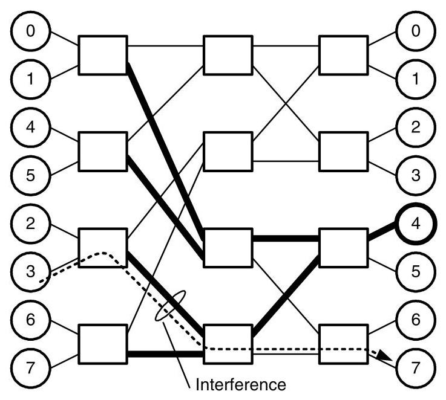

Figure 15.9 Tree-saturation in a 2-ary 3-fly. Destination 4 is overloaded, causing channels leading toward it to become blocked. These blocked channels in turn block more channels, forming a tree pattern (bold lines). Interference then occurs for a message destined to node 7 because of the tree-saturated channels.

> 
图15.9 2-ary 3-fly 中的树饱和现象。目的地4过载，导致通往它的通道被阻塞。这些阻塞的通道进而阻塞更多通道，形成树状模式（粗线）。由于树饱和的通道，发往节点7的消息随后遭受干扰。

#### 15.5.2 Non-interfering Networks

To achieve isolation between two classes $A$ and $B$ , there cannot be any resource shared between $A$ and $B$ that can be held for an indefinite amount of time by $A$ (B) such that $B$ (A) cannot interrupt the usage of that resource. A network that meets this definition is referred to as non-interfering. For example, with virtual-channel flow control, a non-interfering network would have a virtual channel for each class in the network. However, physical channels do not have to be replicated because they are reallocated each cycle and cannot be held indefinitely by a single class. The partitioning also applies to buffers at the inputs of the network, where each client needs a separate injection buffer for each class.

> 
为了实现两个类别 $A$ 与 $B$ 之间的隔离，在 $A$ 和 $B$ 之间不能共享任何可被 $A$（或 $B$）无限期持有、以致 $B$（或 $A$）无法中断其使用的资源。满足这一定义的网络称为无干扰网络。例如，采用虚通道流控时，无干扰网络会为网络中的每个类别配备一条虚通道。但物理通道不必复制，因为它们每个周期都被重新分配，无法被单个类别无限期地占用。这种分区也同样适用于网络输入端的缓冲区，每个客户端需要为每个类别配备独立的注入缓冲区。

While non-interfering networks provide the separation between classes necessary to meet service and fairness guarantees, their implementation can be expensive. Consider, for example, the use of an interconnection network as a switching fabric for an Internet router where we require that traffic to one output not interfere with traffic destined for a different output. In this case, we provide a separate traffic class for each output and provide completely separate virtual channels and injection buffers for each class. Even in moderate-sized routers, providing non-interference in this manner requires that, potentially, hundreds of virtual channels be used, which corresponds to a significant level of complexity in the network's routers (Chapters 16 and 17).4 To this end, the number of classes that need true isolation should be carefully chosen by the designer. In many situations, it may be possible to combine classes without a significant degradation in service to gain a reduction in hardware complexity.

> 
非干扰网络虽然能提供满足服务和公平性保证所需的类间隔离，但其实现成本可能很高。例如，考虑将互连网络用作互联网路由器的交换结构，其中我们要求去往某个输出的流量不得干扰发往其他输出的流量。在这种情况下，我们为每个输出提供一个独立的流量类别，并为每个类别提供完全独立的虚拟通道和注入缓冲区。即便在中等规模的路由器中，以这种方式实现非干扰也潜在地需要使用数百条虚拟通道，这相当于网络路由器中相当高的复杂度（第16章和第17章）。4 因此，设计者应审慎选择需要真正隔离的类别数量。在许多情况下，将多个类别合并可能不会显著降低服务质量，却可以降低硬件复杂度。

### 15.6 Case Study: ATM Service Classes

Asynchronous transfer mode (ATM) is a networking technology designed to support a wide variety of traffic types, with particular emphasis on multimedia traffic such as voice and video traffic, but with enough flexibility to efficiently accommodate best-effort traffic [154]. Typical applications of ATM include Internet and campus network backbones and as well as combined voice, video, and data transports within businesses.

> 
异步传输模式（ATM）是一种网络技术，设计用于支持各种各样的流量类型，尤其侧重于语音和视频等多媒体流量，但具有足够的灵活性以高效承载尽力而为的流量[154]。ATM 的典型应用包括互联网和园区网络骨干，以及企业内部的语音、视频和数据的综合传输。

ATM is connection-based, so before any data can be sent between a source-destination pair, a virtual circuit (Section 15.3.2) must be established to reserve network resources along a path connecting the source and destination. While the connections are circuit-based, data transfer and switching in ATM networks is packet-based. An unusual feature of ATM is that all packets, called cells, are fixed-length: 53 bytes. This reduces packetization latency and simplifies router design.

> 
ATM 是面向连接的，因此在源-目的对之间发送任何数据之前，必须建立一条虚电路（第 15.3.2 节），以沿连接源与目的的路径预留网络资源。虽然连接是电路型的，但 ATM 网络中的数据传送和交换却是基于分组的。ATM 的一个独特之处在于所有分组——称为信元——都是固定长度的：53 字节。这降低了打包时延并简化了路由器设计。

---

4. The torus network used in the Avici TSR [49] provides non-interference between up to 1,024 classes in this manner.

> 
4. Avici TSR [49]中使用的环面网络以此方式在多达1,024个类之间提供无干扰。

---

Each ATM connection is characterized under one of five basic service classes:

> 
每个ATM连接都被归入五种基本服务类别之一：

- Constant bit rate (CBR) - a constant bit rate connection, such as real-time, uncompressed voice.

> 
- 恒定比特率 (CBR) - 一种恒定比特率的连接，例如实时、未压缩的语音。

- Variable bit rate, real-time (VBR-rt) - a bursty connection in which both low delay and jitter are critical, such as a compressed video stream for tele-conferencing.

> 
- **可变比特率，实时（VBR-rt）**——一种突发性连接，其中低延迟和低抖动都至关重要，例如用于电话会议的压缩视频流。

- Variable bit rate (VBR) - like VBR-rt, but without tight delay and jitter constraints.

> 
- 可变比特率（VBR）——与VBR-rt类似，但没有严格的延迟和抖动约束。

- Available bit rate (ABR) - bandwidth demands are approximately known with the possibility of being adjusted dynamically.

> 
- 可用比特率（ABR）——带宽需求大致已知，并可能进行动态调整。

- Unspecified bit rate (UBR) - best-effort traffic.

> 
- 未指定比特率（UBR）——尽力而为流量

The service classes, excluding UBR, also require additional parameters, along with the class type itself, to specify the parameters of the service required. For example, a $\left( {\sigma ,\rho }\right)$ regulated flow, which is required for VBR-rt, is specified by a sustained cell rate (SCR) and burst tolerance (BT) parameter. ATM also provides many other parameters to further describe the nature of flows, such as the minimum and peak cell rates (MCR and PCR) and cell loss ratio (CLR), for example.

> 
除 UBR 之外的其他服务类别，除了需要类别类型本身，还需要附加参数来指定所需服务的参数。例如，VBR-rt 所需的 $\left( {\sigma ,\rho }\right)$ 受控流由持续信元速率（SCR）和突发容限（BT）参数指定。ATM 还提供许多其他参数来进一步描述流的性质，例如最小信元速率（MCR）和峰值信元速率（PCR）以及信元丢失率（CLR）。

While ATM switches can use TDM-like mechanisms for delivering CBR traffic, efficient support of the other traffic types requires a dynamic allocation of resources. Most switches provide throughput fairness and must also separate resources to ensure isolation between virtual circuits.

> 
虽然ATM交换机可以使用类似TDM的机制来传送CBR流量，但有效支持其他流量类型需要资源的动态分配。大多数交换机提供吞吐量公平性，并且还必须分离资源以确保虚电路之间的隔离。

### 15.7 Case Study: Virtual Networks in the Avici TSR

In Section 9.5, we introduced the Avici TSR and its network and examined its use of oblivious source routing to balance load. In this section, we take a further look at this machine and study how it uses virtual channels to realize a non-interfering network.

> 
在第 9.5 节中，我们介绍了 Avici TSR 及其网络，并研究了它如何使用无感知源路由来平衡负载。在本节中，我们将进一步探讨这台机器，并研究它如何利用虚拟通道来实现非干扰网络。

The Avici TSR uses a separate virtual channel for each pair of destination nodes to make traffic in the network completely non-interfering [50]. That is, traffic to one destination $A$ shares no buffers in the network with traffic destined to any other destination $B \neq  A$ . Thus, if some destination $B$ becomes overloaded and backs up traffic into the network, filling buffers and causing tree saturation, this overload cannot affect packets destined for $A$ . Because packets destined for $A$ and $B$ share no buffers, $A$ ’s packets are isolated from the overload. Packets destined for $A$ and $B$ do share physical channel bandwidth. However, this is not an issue, since traffic is spread to balance load on the fabric channels and the network load to $B$ cannot in the steady state exceed the output bandwidth at node $B$ .

> 
Avici TSR 为每对目的节点使用单独的虚拟通道，使网络中的流量完全无干扰 [50]。也就是说，流向某个目的地 $A$ 的流量与流向任何其他目的地 $B \neq A$ 的流量在网络中不共享缓冲区。因此，如果某个目的地 $B$ 过载并将流量阻塞回网络，填满缓冲区并导致树饱和，这种过载不会影响到发往 $A$ 的数据包。因为发往 $A$ 和 $B$ 的数据包不共享缓冲区，所以 $A$ 的数据包与过载隔离。发往 $A$ 和 $B$ 的数据包确实共享物理通道带宽。然而，这并不是问题，因为流量会分散以平衡交换通道上的负载，且流向 $B$ 的网络负载在稳态下不可能超过节点 $B$ 的输出带宽。

The problem is illustrated in Figure 15.10. Overloaded destination node $B$ backs up traffic on all links leading to $B$ , shown as dark arrows. This is a form of tree saturation (Section 15.5.1). All of the virtual channels and flit buffers usable by $B$ on these links are full, blocking further traffic. Now consider a packet routing to node $A$ over the path shown in gray. If this packet shares resources with packets destined for $B$ , it will be blocked waiting on a virtual channel or flit buffer at links $a, b$ , and $c$ and delayed indefinitely. The packet destined for $A$ will not be blocked at link $d$ because it is proceeding in the opposite direction from packets destined for $B$ and hence using a different set of virtual channels and flit buffers.

> 
该问题如图15.10所示。过载的目的节点$B$会在所有通往$B$的链路上造成流量阻塞，如深色箭头所示。这是一种树饱和（第15.5.1节）现象。这些链路上可供$B$使用的所有虚拟通道和微片缓冲区都已满，从而阻塞了后续流量。现在考虑一个沿着灰色所示路径路由到节点$A$的数据包。如果该数据包与发往$B$的数据包共享资源，它将在链路$a$、$b$和$c$处等待虚拟通道或微片缓冲区而被阻塞，并无限期延迟。发往$A$的数据包不会在链路$d$处被阻塞，因为它与发往$B$的数据包行进方向相反，因此使用了不同的虚拟通道和微片缓冲区集合。

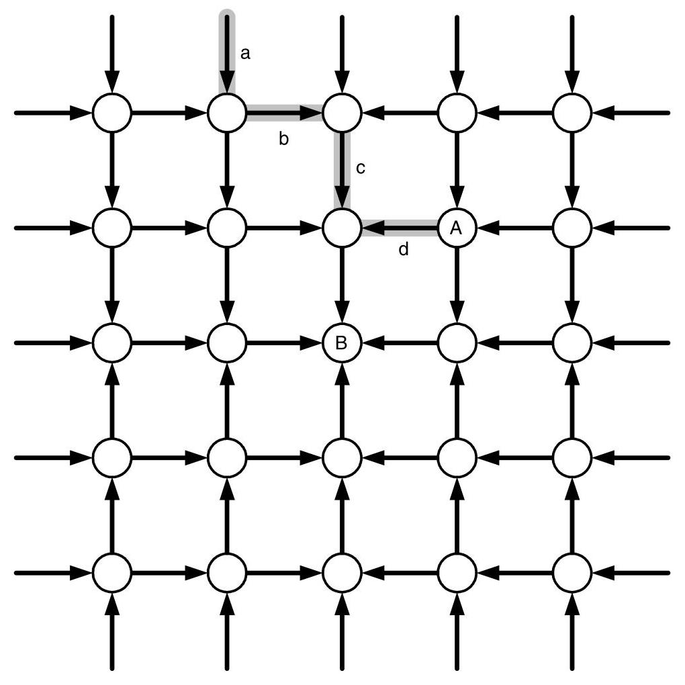

Figure 15.10 A fragment of a 2-D mesh network showing links blocked by tree-saturation from overloaded destination node $B$ . Packets routing to node $A$ over the gray path $\left( {a, b, c, d}\right)$ will encounter interference from packets destined for $B$ on all but link $d$ unless resources are kept separate.

> 
图15.10 二维网格网络的一个片段，展示了因目的节点$B$过载导致的树饱和而阻塞的链路。沿灰色路径$\left( {a, b, c, d}\right)$路由至节点$A$的数据包，除非资源保持分离，否则将在除链路$d$外的所有链路上遭遇以$B$为目的地的数据包的干扰。

The bandwidth consumed by packets destined to $B$ is not an issue. Assuming that node $B$ can consume at most one unit of bandwidth and that load is distributed evenly over incoming paths, only $\frac{1}{12}$ unit of bandwidth on link $c\left( {\frac{1}{20}\text{ on link }a}\right)$ is consumed by traffic destined for $B$ . This leaves ample bandwidth to handle the packet destined for $A$ . The problem is that packets destined for $B$ hold all of the virtual channels and flit buffers and release these resources very slowly because of the backup. The problem is analogous to trying to drive to a grocery store (node $A$ ) near the stadium (node $B$ ) just before a football game. You, like the packet to node $A$ , are blocked waiting for all of the cars going to the game to clear the road.

> 
目的地为 $B$ 的数据包所消耗的带宽并不是问题所在。假设节点 $B$ 最多能消耗一单位带宽，并且负载在入口路径上均匀分布，那么链路 $c$ 上仅有 $\frac{1}{12}$ 单位带宽（链路 $a$ 上为 $\frac{1}{20}$ 单位）被目的地为 $B$ 的流量消耗。这留下了充足的带宽来处理目的地为 $A$ 的数据包。问题在于，目的地为 $B$ 的数据包占用了所有虚拟通道和微片缓冲区，并且由于积压，这些资源释放得非常缓慢。这个问题类似于在足球比赛开始前试图开车前往体育场（节点 $B$ ）附近的杂货店（节点 $A$ ）。你，就如同那个发往节点 $A$ 的数据包，被堵在路上，等待所有前往比赛的车辆清空道路。

The solution is to provide separate virtual networks for each destination in the machine. The Avici TSR accomplishes this, and also provides differentiated service for two classes of traffic by providing 512 virtual channels for each physical channel. For each destination $d$ , the TSR reserves two virtual channels on every link leading toward the destination. One virtual channel is reserved for normal traffic and a second virtual channel is reserved for premium traffic. Separate source queues are also provided for each destination and class of service so that no interference occurs in the source queues. With this arrangement, traffic destined for $A$ does not compete for virtual channels or buffers with traffic destined to $B$ . Traffic to $A$ only shares physical channel bandwidth with $B$ , and nothing else. Hence, packets to $A$ are able to advance without interference. Returning to our driving analogy, it is as if a separate lane were provided on the road for each destination. Cars waiting to go to the stadium back up in the stadium lane but do not interfere with cars going to the grocery store, which are advancing in their own lane. The great thing about interconnection networks is that we are able to provide this isolation by duplicating an inexpensive resource (a small amount of buffering) while sharing the expensive resource (bandwidth). Unfortunately this can't be done with roads and cars.

> 
解决方案是为机器内的每个目的地提供独立的虚拟网络。Avici TSR 实现了这一点，并通过为每个物理通道提供 512 个虚拟通道，为两类流量提供区分服务。对于每个目的地 $d$，TSR 在通向该目的地的每条链路上预留两个虚拟通道，一个给普通流量，另一个给优质流量。此外，还为每个目的地和服务类别设置了单独的源队列，这样源队列中就不会发生干扰。通过这种安排，去往 $A$ 的流量不会与去往 $B$ 的流量争用虚拟通道或缓冲区。去往 $A$ 的流量只与 $B$ 共享物理通道带宽，再无其他。因此，发往 $A$ 的分组能够顺利前进而不受干扰。回到我们的驾驶类比，这就好比为每个目的地在道路上设置一条专用车道。想去体育场的车辆在体育场车道上排队，却不会干扰去杂货店的车辆，后者正沿着自己的车道前进。互连网络的绝妙之处在于，我们能通过复制廉价资源（少量缓冲），同时共享昂贵资源（带宽）来提供这种隔离。遗憾的是，这无法在公路和汽车上实现。

To support up to 512 nodes with 2 classes of traffic using only 512 virtual channels, the TSR takes advantage of the fact that minimal routes to 2 nodes that are maximally distant from one another in all dimensions share no physical channels. Hence, these nodes can use the same virtual channel number on each physical channel without danger of interference. This situation is illustrated for the case of an 8-node ring in Figure 15.11. Packets heading to node $X$ along a minimal route use only the link directions shown with arrows. Packets heading to node $Y$ along a minimal route use only links in the opposite direction (not shown). Because minimal routes to the two nodes share no channels, they can safely use the same virtual channel number without danger of actually sharing a virtual channel, and, hence, without danger of interference.

> 
为了使用仅512条虚拟通道支持最多512个节点及2种流量类别，TSR利用了这样一个事实：向在所有维度上彼此相距最远的两个节点发送数据时，它们的最小路由不会共享任何物理通道。因此，这些节点可以在每条物理通道上使用相同的虚拟通道号而不会产生干扰风险。这种情况在图15.11中针对一个8节点环形拓扑进行了举例说明。沿着最小路由前往节点 $X$ 的数据包仅使用箭头所示的链路方向。沿着最小路由前往节点 $Y$ 的数据包仅使用相反方向的链路（未显示）。由于通往这两个节点的最小路由不共享任何通道，它们可以安全地使用相同的虚拟通道号，而不会实际共享虚拟通道，因此也不会产生干扰风险。

### 15.8 Bibliographic Notes

More detailed discussions of general issues related to QoS along with implementation issues, especially those related to large-scale networks such as the Internet, are covered by Peterson and Davie [148]. The general impact of QoS on router design is address by Kumar et al. [107]. Cruz provides a detailed coverage of $\left( {\sigma ,\rho }\right)$ flows and their utility in calculating network delays [42, 43]. Early definitions of fairness in networks is covered by Jaffe [88]. Throughput fairness is introduced by Nagle [132] and extended to account for several practical considerations by Demers et al. [58]. True max-min fairness can be expensive to implement and several notable approximations exist, such as Golestani's stop-and-go queueing [74] and the rotating combined queueing [97] algorithm presented by Kim and Chien, the latter of which is specifically designed in the context of interconnection networks. Yum et al. describe the MediaWorm router [198], which provides rate-based services using an extension of the virtual clock algorithm [200]. Several other commercial and academic routers incorporate various levels of QoS, such as the SGI SPIDER [69], the Tandem ServerNet [84], and the MMR [63]. Tree saturation was identified by Pfister and Norton, who proposed combining buffers to consolidate requests to the same memory address in shared-memory systems [151]. One well-known technique that separates resources of different flows is virtual output queueing, covered by Tamir and Frazier [181].

> 
Peterson 和 Davie [148] 对 QoS 相关的一般性问题及实现问题，尤其是与大规模网络（如互联网）相关的问题，进行了更详细的讨论。Kumar 等人 [107] 论述了 QoS 对路由器设计的总体影响。Cruz 详细介绍了 $\left( {\sigma ,\rho }\right)$ 流及其在计算网络延迟中的应用 [42, 43]。Jaffe [88] 涵盖了网络公平性的早期定义。吞吐量公平性由 Nagle [132] 引入，并由 Demers 等人 [58] 扩展以考虑若干实际因素。真正的最大最小公平性实现成本可能很高，存在几种著名的近似方法，例如 Golestani 的 stop-and-go 排队 [74] 以及 Kim 和 Chien 提出的旋转合并排队算法 [97]，后者专门针对互连网络环境设计。Yum 等人描述了 MediaWorm 路由器 [198]，该路由器利用虚拟时钟算法 [200] 的扩展提供基于速率的服务。其他几种商业和学术路由器也集成了不同级别的 QoS，例如 SGI SPIDER [69]、Tandem ServerNet [84] 和 MMR [63]。Pfister 和 Norton 发现了树饱和现象，他们提出了合并缓冲区以将请求整合到共享内存系统中相同内存地址的方法 [151]。一种分离不同流资源的著名技术是虚拟输出排队，由 Tamir 和 Frazier [181] 介绍。

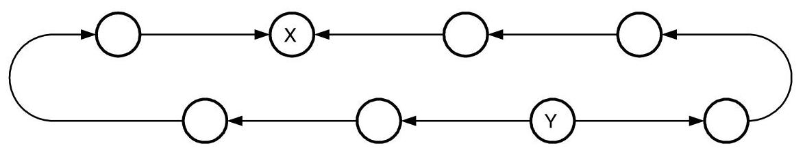

Figure 15.11 Two destinations $X$ and $Y$ maximally distant from one another on this 8-node ring can share a set of virtual channels without interference on minimal routes. All links that lead to $X$ lead away from $Y$ and vice versa.

> 
图15.11 在这个8节点环上，彼此距离最远的两个目的地$X$和$Y$可以共享一组虚拟通道，在最短路径上不会产生干扰。所有通向$X$的链路都背离$Y$，反之亦然。

### 15.9 Exercises

15.1 Burstiness example. Verify that the combining example shown in Figure 15.1 falls within the delay bound given by the general multiplexer model of Section 15.2.2.

> 
15.1 突发性示例。验证图15.1所示的合并示例是否满足第15.2.2节通用复用器模型给出的延迟界限。

15.2 Burstiness of an equally split flow. Describe how a single $\left( {\sigma ,\rho }\right)$ characterized flow can be split into two flows, each with rate $\sigma /2$ . Show that the bound on the burstiness of either of the two new sub-flows is $\left( {\sigma  + L}\right) /2$ .

> 
15.2 均分流的突发性。描述如何将一个以 $\left( {\sigma ,\rho }\right)$ 特征描述的单一流拆分为两个流，每个流速率为 $\sigma /2$。证明这两个新子流中任意一个的突发性上界是 $\left( {\sigma  + L}\right) /2$。

15.3 First-come, first-served multiplexer. Apply the approach of Section 15.2.2 to a multiplexer with a first-come, first-served (FIFO) service discipline. Assuming the two inputs to the multiplexer are a $\left( {{\sigma }_{1},{\rho }_{1}}\right)$ characterized flow and a $\left( {{\sigma }_{2},{\rho }_{2}}\right)$ characterized flow, respectively, what is the maximum delay of this multiplexer?

> 
15.3 先到先服务复用器。将第15.2.2节的方法应用于采用先到先服务（FIFO）服务规则的复用器。假设复用器的两个输入分别为一个$\left( {{\sigma }_{1},{\rho }_{1}}\right)$特征流和一个$\left( {{\sigma }_{2},{\rho }_{2}}\right)$特征流，该复用器的最大延迟是多少？

15.4 Impact of tree-saturation. Consider a system that has $p$ nodes, each of which contains a processor and a memory module. Every node generates a fixed-length memory request at a rate $r$ , with a fraction $h$ of the requests destined to a "hot" memory location and the remaining fraction $1 - h$ uniformly distributed across all other memory locations. What is the total rate of requests into the hot memory module? Assuming that tree saturation blocks all requests once the hot module is saturated, $p = {100}$ , and $h = {0.01}$ , what fraction of the total memory bandwidth in the system can be utilized?

> 
15.4 树饱和的影响。考虑一个具有 $p$ 个节点的系统，每个节点包含一个处理器和一个内存模块。每个节点以速率 $r$ 生成固定长度的内存请求，其中 $h$ 比例的请求发往一个“热”点内存位置，其余 $1 - h$ 比例的请求均匀分布到所有其他内存位置。进入热点内存模块的总请求率是多少？假设一旦热点模块达到饱和，树饱和就会阻塞所有请求，且 $p = {100}$ ，$h = {0.01}$ ，那么系统总内存带宽中可以被利用的比例是多少？

15.5 Simulation. Consider the reservation of TDM flows in a $4 \times  4$ mesh network. Assume time is divided into $T$ slots and individual flows require one of these slots. Also, flows are scheduled incrementally in a greedy fashion: given a flow request between a particular source-destination pair, the flow is scheduled along the path with the smallest cost. The cost of a path is defined as the maximum number of TDM slots used along any of its channels. Then the quality of the schedule is determined by the number of slots required to support it (the maximally congested channel). Use this heuristic to schedule a set of random connections and compare it to the lower-bound on congestion using the optimization problem from Equation 3.9.

> 
15.5 模拟。考虑在一个 $4 \times 4$ 网格网络中预留 TDM 流。假设时间被划分为 $T$ 个时隙，每个单独的流需要这些时隙中的一个。此外，流以贪婪方式增量调度：给定一个特定源-目的地对之间的流请求，该流将沿着成本最小的路径进行调度。路径的成本定义为沿其任何通道使用的 TDM 时隙的最大数量。那么，调度质量由支持它所需的时隙数量（即最拥塞的通道）决定。使用此启发式方法调度一组随机连接，并将其与使用方程 3.9 中的优化问题得出的拥塞下界进行比较。

This Page Intentionally Left Blank

> 
此页有意留白
